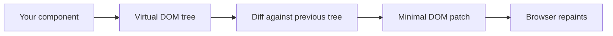
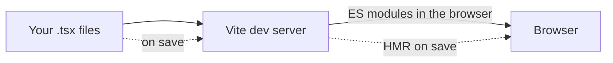
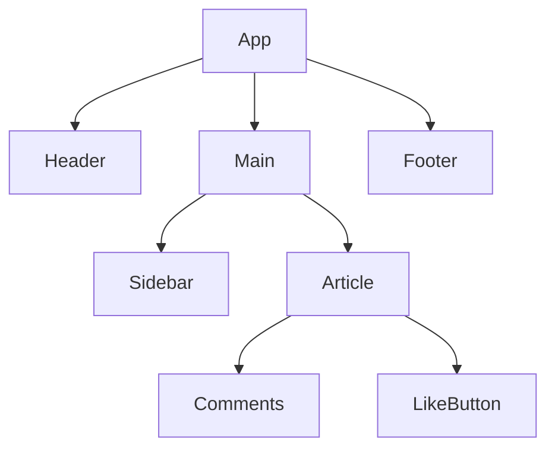
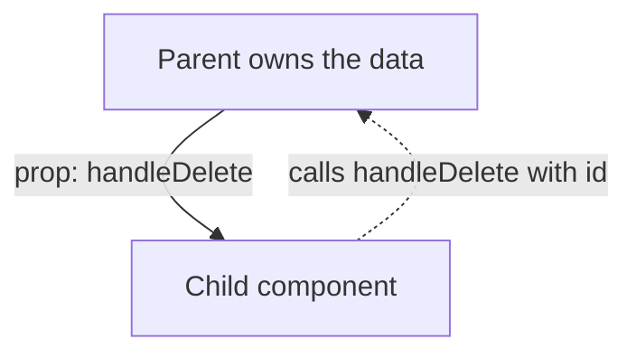
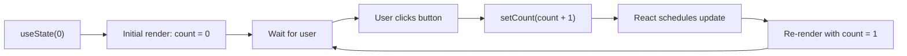
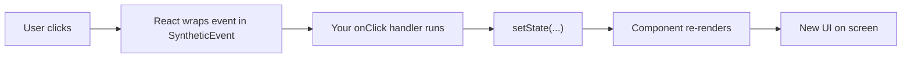
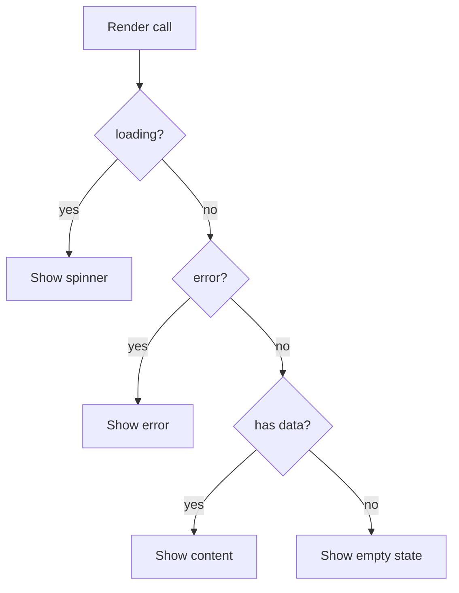
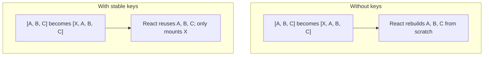
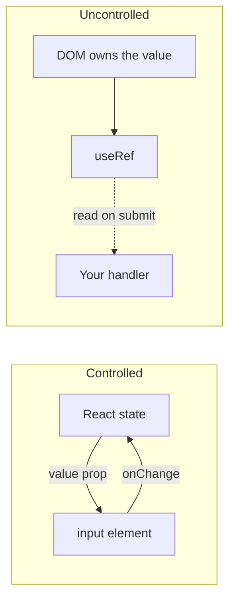

# React Fundamentals: Building Your First Interactive UI

> A first-principles introduction to React for developers who already know a bit of HTML, CSS, and JavaScript.

---

## Table of Contents

1. [Understanding React](#1-understanding-react)
2. [Setting Up a React Development Environment](#2-setting-up-a-react-development-environment)
3. [JSX Syntax](#3-jsx-syntax)
4. [Components](#4-components)
5. [Props](#5-props)
6. [State Management](#6-state-management)
7. [Event Handling](#7-event-handling)
8. [Conditional Rendering](#8-conditional-rendering)
9. [Lists and Keys](#9-lists-and-keys)
10. [Forms and Controlled Components](#10-forms-and-controlled-components)

This chapter assumes you can read basic JavaScript: variables, functions, arrays, and arrow functions. You should also recognize HTML tags and CSS classes. You do not need any prior framework experience. By the end you will understand what React is, why people use it, and how to write small interactive components on your own.

---

## 1. Understanding React

### Start with the problem, not the solution

Before we even open a React file, let's look at the kind of problem React was built to solve. Imagine you want a tiny counter on a webpage: a button that says "Click me" and two places on the page that both need to show how many times the button has been clicked. With plain HTML and JavaScript you might write something like this:

```html
<!doctype html>
<html>
  <body>
    <p>You have clicked <span id="count-top">0</span> times.</p>
    <button id="btn">Click me</button>
    <p>The total so far is: <span id="count-bottom">0</span></p>

    <script>
      let count = 0;
      const top = document.querySelector('#count-top');
      const bottom = document.querySelector('#count-bottom');
      const btn = document.querySelector('#btn');

      btn.addEventListener('click', () => {
        count = count + 1;
        top.textContent = count;
        bottom.textContent = count;
      });
    </script>
  </body>
</html>
```

This works. But notice what you had to do by hand: every time `count` changes, you also have to remember to update *every* place on the page that depends on it. We touched two spans here; in a real app it could be twenty. Forget one and the UI silently lies to the user.

This is the problem React was designed for. You should describe **what the UI looks like for a given value of `count`**, and the library should figure out which bits of the DOM to update for you. You stop thinking "find this element and change its text" and start thinking "the screen is a function of my data".

### What React actually is

React is a JavaScript **library** for building user interfaces. It was originally released by Facebook in 2013 and is now used everywhere from small dashboards to entire products. A library, as opposed to a full framework, just gives you a focused set of tools — in React's case, tools for describing UI as components and keeping the DOM in sync with your data. Routing, network requests, and form helpers are not part of React itself; you pick those separately when you need them.

The core idea is **declarative rendering**. Instead of writing step-by-step instructions ("grab this element, change its text"), you write a function that returns a description of the UI for the current data. React compares that description to the previous one and updates only the parts that actually changed.

### How React updates the screen



When your component runs, it does not touch the real DOM directly. It returns a lightweight in-memory tree (often called the **Virtual DOM**). React holds on to the previous tree, compares it to the new one, and writes only the differences to the actual page. That is why a 10,000-row table re-rendering after one cell change does not freeze your browser — React only touches that one cell.

### Why people pick React

React's design rests on a handful of ideas that show up everywhere in the library:

- **Component-based architecture.** Your UI is broken into small, named functions. Each one returns a piece of UI. You compose them like Lego bricks.
- **Declarative code.** You describe the result, not the steps to get there.
- **Unidirectional data flow.** Data moves from parents to children through **props**. Children never reach up and mutate the parent. This makes apps easier to reason about as they grow.
- **One mental model, many targets.** Once you know React for the web, the same component model is used by React Native (mobile), React Three Fiber (3D), and other renderers.

> **Note:** React is not magic. Under the hood it is just JavaScript that produces objects describing what the DOM should look like. Once you internalize that, most of the surprising behavior stops being surprising.

---

## 2. Setting Up a React Development Environment

### What a modern React project looks like

A real React app is not a single HTML file — it is a project with a build tool, a package manager, and a folder of source files. The build tool takes your `.tsx` files (JSX with TypeScript) and produces the JavaScript a browser can actually run. It also runs a local development server with **Hot Module Replacement (HMR)**, which means when you save a file the page updates almost instantly without losing its state.

The recommended tool in 2025 is **Vite**. It is fast to start, fast to reload, and has a sane default config.



In development Vite serves your source as native ES modules and patches the browser on every save. For production it switches to a bundler (esbuild and Rollup under the hood) to produce a minified, tree-shaken artifact ready to deploy.

### Create a project

You will need Node.js installed (version 18 or newer). Check it from a terminal:

```bash
node --version
```

If that prints a version, you are good. Then create a new React + TypeScript project with Vite:

```bash
npm create vite@latest my-react-app -- --template react-ts
cd my-react-app
npm install
npm run dev
```

The last command starts the dev server and prints a local URL (usually `http://localhost:5173`). Open it in a browser — you should see a starter page with a counter. Edit `src/App.tsx`, save, and watch the browser update on its own.

### The file structure

Open the new folder in your editor. You will see something like this:

```
my-react-app/
├── index.html              # The single HTML entry point
├── package.json            # Dependencies and scripts
├── tsconfig.json           # TypeScript configuration
├── vite.config.ts          # Vite build configuration
└── src/
    ├── main.tsx            # Bootstraps React into the page
    ├── App.tsx             # The root component
    ├── App.css             # Styles for App
    └── index.css           # Global styles
```

A few notes on what each file does:

- **`index.html`** is the only HTML file in the whole project. It contains an empty `<div id="root"></div>` element. React injects your entire app into that div.
- **`src/main.tsx`** is the bridge between HTML and React. It finds `#root` and tells React to render the `App` component inside it.
- **`src/App.tsx`** is your root component — the top of the component tree. Everything else hangs off this.
- **`vite.config.ts`** is where you would configure plugins, path aliases, or proxies for an API. For now you can ignore it.

If you open `main.tsx` you will see something close to this:

```tsx
import { StrictMode } from 'react';
import { createRoot } from 'react-dom/client';
import App from './App.tsx';
import './index.css';

createRoot(document.getElementById('root')!).render(
  <StrictMode>
    <App />
  </StrictMode>,
);
```

That is the only place in your app that directly touches a real DOM element. Everything from `<App />` downward is React's territory.

### The scripts you will actually use

In `package.json` you will find a `scripts` block. The three you care about right now:

```bash
npm run dev      # Start the development server with HMR
npm run build    # Type-check and build for production
npm run preview  # Serve the production build locally
```

You will be running `npm run dev` 99% of the time while learning.

> **Note:** When you read tutorials online you may see files with the `.jsx` extension instead of `.tsx`. The only difference is that `.tsx` files allow TypeScript syntax. Stick with `.tsx` — type-safety pays for itself the moment your app gets bigger than a single screen.

---

## 3. JSX Syntax

### Why JSX exists

Look at how you produce a `<button>` with plain JavaScript:

```js
const btn = document.createElement('button');
btn.textContent = 'Click me';
btn.className = 'primary';
document.body.appendChild(btn);
```

That works, but as soon as you have nested elements it becomes hard to read. A list of three items with a header turns into a dozen `createElement` and `appendChild` calls. You lose the shape of the markup in a sea of imperative code.

JSX (short for **JavaScript XML**) solves this by letting you write HTML-like syntax directly inside a JavaScript file:

```tsx
const button = <button className="primary">Click me</button>;
```

That single line is equivalent to the four-line vanilla version above. JSX is **not a templating language** and it is not a string. It is syntax sugar — your build tool (Vite, via Babel or SWC) transforms each JSX tag into a regular JavaScript function call:

```mermaid
graph LR
    JSX["&lt;Greeting name='Mario' /&gt;"] --> Compiler[Vite compiler]
    Compiler --> Call["React.createElement(Greeting, &#123; name: 'Mario' &#125;)"]
    Call --> VNode["Virtual DOM node object"]
```



That is why curly braces inside JSX run real JavaScript — you are already inside a function call. The compiler does the translation; you never write `React.createElement` yourself in day-to-day code.

### Reading your first JSX

Here is a small example that uses everything you need to know to get started:

```tsx
const user = { name: 'Mario', age: 32 };

const profile = (
  <div className="user-card">
    <h2>{user.name}</h2>
    <p>Age: {user.age}</p>
    <p>Adult: {user.age >= 18 ? 'yes' : 'no'}</p>
  </div>
);
```

Notice a few things:

- The whole expression is wrapped in parentheses. That is just a JavaScript convention to let you put the opening tag on a new line.
- We use `className` instead of `class`. More on that in a second.
- Curly braces `{ ... }` switch back to JavaScript mode. Anything that evaluates to a string, number, or another JSX element can go inside them.

### JSX rules you actually need to remember

There are five rules that account for almost every JSX error a beginner hits.

**1. Use `className`, not `class`.** The word `class` is reserved in JavaScript (it is used for ES6 classes), so JSX uses `className` instead. The browser still sees `class` in the final HTML.

```tsx
<div className="container">   {/* correct */}
<div class="container">       {/* wrong — will warn in the console */}
```

**2. Every tag must close itself.** Self-closing tags need the trailing slash:

```tsx
   {/* correct */}
                   {/* wrong */}
<br />                                   {/* correct */}
```

**3. Attributes are camelCase.** Plain HTML uses lowercase (`onclick`, `tabindex`); JSX uses camelCase (`onClick`, `tabIndex`). The exceptions are `data-*` and `aria-*` attributes, which stay lowercase.

```tsx
<button onClick={handleClick} tabIndex={0}>Save</button>
```

**4. A component must return one root element.** You cannot return two sibling tags side by side. Wrap them in a container:

```tsx
return (
  <div>
    <h1>Title</h1>
    <p>Text</p>
  </div>
);
```

If you do not want to add an extra `<div>` to the DOM, use a **Fragment** — an empty tag pair:

```tsx
return (
  <>
    <h1>Title</h1>
    <p>Text</p>
  </>
);
```

Fragments render no actual element; they exist purely to satisfy JSX's "one root" rule.

**5. Curly braces hold JavaScript expressions, not statements.** You can put any expression — a value, a function call, a ternary, a math operation — inside `{ }`. You cannot put an `if` statement or a `for` loop in there, because those are statements, not expressions.

```tsx
<h1>{user.name.toUpperCase()}</h1>
<p>{2 + 2}</p>
<div>{isLoggedIn ? 'Welcome' : 'Please sign in'}</div>
<ul>{items.map(item => <li key={item.id}>{item.text}</li>)}</ul>
```

### Inlining styles and dynamic classes

The `style` attribute in JSX takes a JavaScript object, not a string:

```tsx
<div style={{ color: 'red', fontSize: '20px', marginTop: 10 }}>Hello</div>
```

The double braces look strange but they are simple: the outer `{ }` switches to JavaScript mode, and the inner `{ }` is the object literal. Property names are camelCase (`fontSize`, not `font-size`), and numeric values without a unit default to pixels.

For dynamic class names, use a template literal or a ternary:

```tsx
<button className={isPrimary ? 'btn btn-primary' : 'btn'}>Save</button>
```

> **Note:** Once you have a lot of conditional classes, a tiny helper called `clsx` (or `classnames`) makes them much easier to manage. You can install it later; for now ternaries are fine.

---

## 4. Components

### What a component is

A **component** is a function that returns JSX. That is the whole definition. There is no class, no decorator, no special registration step. If your function returns JSX and its name starts with a capital letter, React treats it as a component.

```tsx
const Welcome = () => {
  return <h1>Welcome to React!</h1>;
};
```

To use it, you treat its name as a custom HTML tag:

```tsx
<Welcome />
```

The capital letter is not optional. React uses the case to decide whether `<welcome />` means "render the lowercase HTML element `welcome`" (it would just be an unknown tag) or "call my component named `Welcome`". So **component names always start uppercase**.

### Why split things into components

A component is the unit of **reuse** and the unit of **understanding**. Reuse is the obvious benefit — write a `Button` once, drop it in fifty places. Understanding is the subtler one. A 500-line component is a nightmare; the same code split into ten 50-line components is readable, because each name (`<Header />`, `<UserCard />`, `<CommentList />`) tells you what that block is for.

A typical React app is a tree of components, with one top-level component (usually called `App`) at the root.



Each node renders its children, and data flows downward through props (the next section).

### Functional components — the only ones you need

Modern React is written entirely with **functional components**: plain functions that return JSX. You may run into older code that uses class-based components (`class MyComponent extends React.Component`). They still work, but new code should not use them. Functions are simpler, easier to test, and unlock **hooks** — the special functions like `useState` that give components memory and behavior.

A more complete example, with a parameter:

```tsx
type GreetingProps = {
  name: string;
  age: number;
};

const Greeting = ({ name, age }: GreetingProps) => {
  return (
    <div>
      <h1>Hello, {name}!</h1>
      <p>You are {age} years old.</p>
    </div>
  );
};

// Used like:
<Greeting name="Marco" age={28} />
```

The `{ name, age }` part is **destructuring** — pulling individual fields out of an object in one line. The object being destructured is what React passes in: a `props` object containing all the attributes you wrote on the tag.

### Where do components live?

A common convention is one component per file, named after the component:

```
src/
└── components/
    ├── Header.tsx
    ├── Button.tsx
    └── UserCard.tsx
```

Each file exports its component:

```tsx
// src/components/Button.tsx
type ButtonProps = {
  label: string;
  onClick: () => void;
};

export const Button = ({ label, onClick }: ButtonProps) => {
  return <button onClick={onClick}>{label}</button>;
};
```

And other components import it:

```tsx
// src/App.tsx
import { Button } from './components/Button';

export default function App() {
  return <Button label="Save" onClick={() => console.log('saved')} />;
}
```

That is the entire mental model of a React app: lots of small components, each in its own file, composing into bigger components until you reach the root.

---

## 5. Props

### Passing data in

**Props** (short for "properties") are how a parent component hands data to a child. From the JSX side, props look exactly like HTML attributes:

```tsx
<UserCard name="Giuseppe" age={32} city="Rome" isActive={true} />
```

The child receives all of those as fields on a single `props` object:

```tsx
const UserCard = (props) => {
  return (
    <div className="card">
      <h2>{props.name}</h2>
      <p>Age: {props.age}</p>
      <p>City: {props.city}</p>
      {props.isActive && <span>Online</span>}
    </div>
  );
};
```

Notice how data with different types flows in differently:

- Strings can be written with quotes: `name="Giuseppe"`.
- Anything else needs curly braces so JSX knows it is a JavaScript expression: `age={32}`, `isActive={true}`, `tags={['a', 'b']}`.

You can also pass a string with curly braces if you prefer (`name={"Giuseppe"}`), but the shorthand reads better.

### Destructuring is the standard style

Reading `props.name` over and over gets noisy. Almost all React code destructures the props in the function signature itself:

```tsx
const UserCard = ({ name, age, city, isActive }) => {
  return (
    <div className="card">
      <h2>{name}</h2>
      <p>Age: {age}</p>
      <p>City: {city}</p>
      {isActive && <span>Online</span>}
    </div>
  );
};
```

With TypeScript, you also describe the shape of the props:

```tsx
type UserCardProps = {
  name: string;
  age: number;
  city: string;
  isActive: boolean;
};

const UserCard = ({ name, age, city, isActive }: UserCardProps) => {
  // ...
};
```

If you forget to pass a required prop, TypeScript catches it before the page even loads.

### Default values

If a prop is optional, give it a default value in the destructuring:

```tsx
type ButtonProps = {
  label?: string;
  variant?: 'primary' | 'secondary';
};

const Button = ({ label = 'Click me', variant = 'primary' }: ButtonProps) => {
  return <button className={variant}>{label}</button>;
};
```

The `?` after the property name in the type makes it optional. The `= '...'` in the parameters supplies the default if the parent does not pass anything.

### Props are read-only

There is one rule about props that you must internalize: **a component must never modify its own props**. They are read-only inputs. If the user types in a search box and you want to update the value, the value cannot live in props — it has to live in state (next section), owned by some component up the tree.

```tsx
const Bad = ({ count }) => {
  count = count + 1;  // wrong — never reassign props
  return <p>{count}</p>;
};
```

Why? Because the parent owns that data. If the child secretly mutated it, the parent's idea of the world would silently drift away from reality, and React's "data flows down" guarantee would break.

### Sending data back up: callback props

If props can only flow down, how does a child tell a parent that something happened — a button was clicked, an input changed? The parent passes the child a **function** as a prop. The child calls that function. The parent does whatever it wants in response.



A small example:

```tsx
const TodoItem = ({ id, text, onDelete }) => {
  return (
    <div>
      <span>{text}</span>
      <button onClick={() => onDelete(id)}>Delete</button>
    </div>
  );
};

const TodoList = () => {
  const handleDelete = (id: number) => {
    console.log('Deleting todo', id);
    // ... update some state here
  };

  return <TodoItem id={1} text="Buy milk" onDelete={handleDelete} />;
};
```

The parent defines `handleDelete`. It passes it to `TodoItem` as the `onDelete` prop. When the user clicks the button, `TodoItem` calls `onDelete(id)` — which is just calling the parent's `handleDelete` function. The parent now knows which todo to remove, but the child never touched any data it did not own.

This pattern — "props down, events up" — is the single most important data-flow rule in React. Hold on to it.

### Children: the special prop

React reserves one prop name: `children`. Whatever you put **between** the opening and closing tags of a component is passed as `children`:

```tsx
<Card>
  <h2>Hello</h2>
  <p>This is inside the card.</p>
</Card>
```

Inside `Card`, you receive that JSX:

```tsx
type CardProps = {
  children: React.ReactNode;
};

const Card = ({ children }: CardProps) => {
  return <div className="card">{children}</div>;
};
```

This is how you build reusable layout components — the `Card` does not care what is inside it, it just provides the box.

---

## 6. State Management

### Why props alone are not enough

Props let a parent push data down to a child, but they cannot capture data that *changes over time inside the component*. A counter that increments when you click a button, a text input that updates as the user types, a list that grows when you add an item — all of these need a way for the component to remember a value between renders, and to tell React "this value changed, please re-render me with the new one".

That mechanism is called **state**, and you access it through a function called **`useState`**.

### Hooks, briefly

`useState` is your first **hook**. Hooks are special functions whose names start with `use`. They let a functional component "hook into" React features like state, effects, and context. There are two rules:

1. Only call hooks at the top level of a component function. Never inside an `if`, a loop, or a nested function.
2. Only call hooks from React components (or from other hooks).

These rules exist so React can keep track of which hook call goes with which value. As long as you follow them you do not have to think about why.

### Your first counter

```tsx
import { useState } from 'react';

const Counter = () => {
  const [count, setCount] = useState(0);

  return (
    <div>
      <p>You clicked {count} times</p>
      <button onClick={() => setCount(count + 1)}>Increment</button>
    </div>
  );
};
```

Let's unpack `useState(0)`:

- It is called with an **initial value** (here, `0`).
- It returns an **array of two things**: the current value and a setter function. We destructure them: `const [count, setCount] = ...`.
- `count` is the current value. You can read it inside JSX or anywhere else in the component.
- `setCount` is the only correct way to change it. Calling `setCount(5)` tells React "next render, `count` should be 5", and React schedules a re-render of this component.



Remember the counter example from the very first section that needed manual DOM updates in two places? Here is the React version:

```tsx
const TwoPlaceCounter = () => {
  const [count, setCount] = useState(0);

  return (
    <div>
      <p>You have clicked {count} times.</p>
      <button onClick={() => setCount(count + 1)}>Click me</button>
      <p>The total so far is: {count}</p>
    </div>
  );
};
```

Both spans always show the right number. You never wrote `top.textContent = count`. You just used `count` in the JSX, and React handled the rest. That is the payoff of declarative rendering.

### Never mutate state directly

This is the most common beginner mistake:

```tsx
const [user, setUser] = useState({ name: 'Marco', age: 28 });

// wrong — React does not see the change
user.age = 29;

// correct — pass a new object to the setter
setUser({ ...user, age: 29 });
```

React decides whether to re-render by comparing the new state value to the old one. If you mutate the same object in place, it is still the same object — React sees no change and skips the re-render. Always pass a fresh value to the setter.

The same goes for arrays:

```tsx
const [todos, setTodos] = useState<string[]>([]);

// wrong
todos.push('Buy milk');

// correct
setTodos([...todos, 'Buy milk']);

// removing
setTodos(todos.filter(todo => todo !== 'Buy milk'));
```

The `...` spread operator is your friend here. It builds a new array (or object) that contains the old contents plus your change.

### Multiple state values

You can call `useState` as many times as you need:

```tsx
const UserForm = () => {
  const [name, setName] = useState('');
  const [email, setEmail] = useState('');
  const [age, setAge] = useState(0);
  const [isSubscribed, setIsSubscribed] = useState(false);

  return (
    <div>
      <input value={name} onChange={(e) => setName(e.target.value)} />
      <input value={email} onChange={(e) => setEmail(e.target.value)} />
      {/* ... */}
    </div>
  );
};
```

Or group related fields into a single object:

```tsx
const [form, setForm] = useState({
  name: '',
  email: '',
  age: 0,
});

const updateField = (field: string, value: string) => {
  setForm(prev => ({ ...prev, [field]: value }));
};
```

Pick whichever feels clearer for the situation. Many small `useState` calls are usually easier to read than one huge object.

### The functional updater

There is one important wrinkle. When a setter is called, React does not update `count` immediately — it queues the update. If you call the setter twice in a row using the current value, you will be surprised:

```tsx
const [count, setCount] = useState(0);

const doubleIncrement = () => {
  setCount(count + 1);  // queues: set count to 1
  setCount(count + 1);  // queues: set count to 1 again (count is still 0 here!)
};
```

After clicking once, `count` ends up at `1`, not `2`. To fix this, pass a function to the setter. React will call it with the most recent value:

```tsx
const doubleIncrement = () => {
  setCount(prev => prev + 1);  // prev is 0, becomes 1
  setCount(prev => prev + 1);  // prev is now 1, becomes 2
};
```

This is called the **functional updater** form. Use it any time the next state depends on the previous state.

### Props vs state — when to use which

This is the question every beginner asks. The rule is short:

- If the value is **passed in from outside** the component, it is a prop.
- If the value is **owned and changed by this component**, it is state.

If two sibling components need to share the same value, that value should live in **state** of their nearest common parent and flow back down as **props** to both. This pattern is called "lifting state up", and you will use it constantly.

---

## 7. Event Handling

### From `addEventListener` to React handlers

In plain JavaScript you attach event listeners like this:

```js
document.querySelector('#save').addEventListener('click', () => {
  console.log('clicked');
});
```

In React you write the handler directly on the JSX element as a prop:

```tsx
<button onClick={() => console.log('clicked')}>Save</button>
```

Event names are camelCase (`onClick`, `onChange`, `onSubmit`) and the value is a **function**, not a string. React handles attaching and removing the listener for you.

### What happens when the user clicks



React wraps native DOM events in a cross-browser object called a **SyntheticEvent**. For most purposes it looks and acts exactly like a regular event — you can call `event.preventDefault()`, read `event.target.value`, and so on. You almost never have to think about the wrapper itself.

### Inline handlers vs named handlers

Both of these are fine:

```tsx
// inline arrow function
<button onClick={() => console.log('clicked')}>Save</button>

// reference to a named function
const handleSave = () => {
  console.log('clicked');
};

<button onClick={handleSave}>Save</button>
```

Use the named version when the handler is more than one line or when you want to reuse it. Use inline arrows when you need to pass an argument:

```tsx
<button onClick={() => handleDelete(user.id)}>Delete</button>
```

Important: do **not** call the function with parentheses inside the JSX prop:

```tsx
<button onClick={handleDelete(user.id)}>Delete</button>   {/* wrong */}
```

That would call `handleDelete` immediately when the component renders and assign whatever it returns (probably `undefined`) as the click handler. You want to give React a function it can call later, not the result of calling the function now.

### Reading the event object

Your handler receives the event object as its first argument:

```tsx
const handleSubmit = (event) => {
  event.preventDefault();         // stop the default browser behavior
  event.stopPropagation();        // stop the event from bubbling up
  console.log(event.target);      // the element that fired the event
};
```

`preventDefault()` is the one you will reach for constantly with forms — without it, a `<form>` submission causes the browser to reload the page, which is almost never what you want in a single-page app.

### A small grab-bag of common events

```tsx
const EventExamples = () => {
  return (
    <div>
      <button onClick={() => console.log('click')}>Click</button>
      <button onDoubleClick={() => console.log('double')}>Double click</button>

      <div
        onMouseEnter={() => console.log('entered')}
        onMouseLeave={() => console.log('left')}
      >
        Hover me
      </div>

      <input
        onChange={(e) => console.log('value is now', e.target.value)}
        onFocus={() => console.log('focused')}
        onBlur={() => console.log('blurred')}
      />

      <form
        onSubmit={(e) => {
          e.preventDefault();
          console.log('form submitted');
        }}
      >
        <button type="submit">Submit</button>
      </form>

      <input onKeyDown={(e) => console.log('key:', e.key)} />
    </div>
  );
};
```

### Typing event handlers in TypeScript

When you need the type of the event itself (for example to destructure it), TypeScript expects specific names:

```tsx
import { ChangeEvent, FormEvent, MouseEvent } from 'react';

const handleChange = (e: ChangeEvent<HTMLInputElement>) => {
  console.log(e.target.value);
};

const handleSubmit = (e: FormEvent<HTMLFormElement>) => {
  e.preventDefault();
};

const handleClick = (e: MouseEvent<HTMLButtonElement>) => {
  console.log('button at', e.clientX, e.clientY);
};
```

If you let your editor infer the type (by using an inline arrow function directly inside JSX), you usually do not have to write these annotations — TypeScript figures it out from the JSX context.

---

## 8. Conditional Rendering

### "Sometimes show this, sometimes show that"

Almost every UI has parts that only appear under certain conditions: a "Logout" button only when the user is signed in, an error message only when something failed, a loading spinner only while data is in flight.

React does not have any special "if" syntax. You just use plain JavaScript — because JSX is plain JavaScript. There are three patterns you will use over and over.



The order of these checks matters. Check the most specific state first (loading), then the next (error), then the happy path (data), then the fallback (empty). Skipping the loading check and going straight to "has data?" leads to a flash of "no results" while the request is still in flight.

### Pattern 1: short-circuit with `&&`

```tsx
const Greeting = ({ isLoggedIn, username }) => {
  return (
    <div>
      {isLoggedIn && <h1>Welcome, {username}!</h1>}
      {!isLoggedIn && <h1>Please sign in</h1>}
    </div>
  );
};
```

This works because of JavaScript short-circuit evaluation: `true && <h1>...</h1>` is just `<h1>...</h1>`, and `false && <h1>...</h1>` is `false`, which React renders as nothing.

There is one trap: do not use `&&` with a number that might be zero:

```tsx
{items.length && <p>You have items</p>}   {/* danger */}
```

If `items.length` is `0`, JavaScript short-circuits to `0`, and React renders the literal text `0` on the page. Use a comparison instead:

```tsx
{items.length > 0 && <p>You have items</p>}
```

### Pattern 2: the ternary

When you have an either/or, the ternary `a ? b : c` reads cleaner than two `&&`s:

```tsx
const LoginButton = ({ isLoggedIn }) => {
  return <button>{isLoggedIn ? 'Logout' : 'Login'}</button>;
};
```

You can put whole JSX blocks on each side, as long as you parenthesize them:

```tsx
const UserStatus = ({ user }) => {
  return (
    <div>
      {user ? (
        <div>
          <h2>{user.name}</h2>
          <p>{user.email}</p>
        </div>
      ) : (
        <p>No user signed in</p>
      )}
    </div>
  );
};
```

Avoid nesting ternaries more than one level deep — they become unreadable fast. If you find yourself stacking them, switch to pattern 3.

### Pattern 3: early return

If the conditional applies to the whole component, return early at the top:

```tsx
const UserProfile = ({ user }) => {
  if (!user) {
    return <p>Loading...</p>;
  }

  if (user.role === 'admin') {
    return <AdminDashboard user={user} />;
  }

  return <UserDashboard user={user} />;
};
```

This is the cleanest pattern for handling "load" → "error" → "success" flows:

```tsx
const Dashboard = ({ user, isLoading, error }) => {
  if (isLoading) return <Spinner />;
  if (error) return <ErrorMessage message={error} />;
  if (!user) return <p>No data available</p>;

  return <UserProfile user={user} />;
};
```

### Looking up by key (a poor man's switch)

When you have many discrete options, a lookup object is often nicer than a chain of ternaries:

```tsx
type Status = 'pending' | 'approved' | 'rejected';

const StatusBadge = ({ status }: { status: Status }) => {
  const config = {
    pending:  { text: 'Pending',  color: 'orange' },
    approved: { text: 'Approved', color: 'green' },
    rejected: { text: 'Rejected', color: 'red' },
  }[status];

  return <span style={{ color: config.color }}>{config.text}</span>;
};
```

### Combining multiple conditions

```tsx
const Dashboard = ({ user, isLoading, error }) => {
  return (
    <div>
      {isLoading && <Spinner />}
      {error && <ErrorMessage message={error} />}
      {!isLoading && !error && user && <UserProfile user={user} />}
      {!isLoading && !error && !user && <p>No data available</p>}
    </div>
  );
};
```

This works, but compare it to the early-return version above — the early-return version is shorter and easier to follow. When in doubt, prefer early returns for top-level branches and `&&` / ternary for small inline pieces.

---

## 9. Lists and Keys

### Turning data into UI

A list in React is just an array of data and a `.map()` call that turns each item into a JSX element.

```tsx
const TodoList = () => {
  const todos = [
    { id: 1, text: 'Learn React', completed: false },
    { id: 2, text: 'Build a project', completed: false },
    { id: 3, text: 'Deploy the app', completed: true },
  ];

  return (
    <ul>
      {todos.map((todo) => (
        <li key={todo.id}>
          {todo.text} {todo.completed && '(done)'}
        </li>
      ))}
    </ul>
  );
};
```

Three things to notice:

1. `todos.map(...)` runs `Array.prototype.map` — the same one you have always used. It returns a new array, this time of JSX elements.
2. We wrap the call in `{ ... }` so JSX evaluates it as a JavaScript expression.
3. Each `<li>` gets a `key` prop. That is the part that needs the most explanation.

### Why keys exist

When the list changes — an item is added, removed, or reordered — React has to figure out which DOM nodes to keep, which to throw away, and which to create. The **key** is React's way of identifying each item across renders.



If you do not provide keys, React falls back to using the array index. That works for static lists but breaks the moment items are inserted, removed, or reordered: React thinks "the item at index 0 used to be A, now it is X, let me update it from A to X" instead of "X is brand new, let me mount it and shift A down". You lose performance and, worse, you lose any internal state inside those items (an `<input>` value, a toggle, anything).

### Key rules

The rules for keys are short:

- Keys must be **unique among siblings** (not globally — only within the same list).
- Keys should be **stable**: the same item should have the same key across renders.
- Use a real ID from your data when you have one (`todo.id`, `user.id`).
- Use the array index only if your list is purely static — never added to, removed from, or reordered.
- Never use `Math.random()` or `Date.now()` — that would generate a different key every render, defeating the whole point.

```tsx
{todos.map((todo) => (
  <li key={todo.id}>{todo.text}</li>           {/* good */}
))}

{todos.map((todo, index) => (
  <li key={index}>{todo.text}</li>             {/* okay for static lists, risky otherwise */}
))}

{todos.map((todo) => (
  <li>{todo.text}</li>                         {/* bad — React will warn */}
))}
```

### Extract list items into their own component

Once a list item has more than two or three lines of JSX, lift it into its own component. The code becomes easier to read, and the item component can have its own state (think: an "is editing" toggle on each row).

```tsx
type Todo = { id: number; text: string; completed: boolean };

type TodoItemProps = {
  todo: Todo;
  onToggle: (id: number) => void;
  onDelete: (id: number) => void;
};

const TodoItem = ({ todo, onToggle, onDelete }: TodoItemProps) => {
  return (
    <li>
      <input
        type="checkbox"
        checked={todo.completed}
        onChange={() => onToggle(todo.id)}
      />
      <span>{todo.text}</span>
      <button onClick={() => onDelete(todo.id)}>Delete</button>
    </li>
  );
};

const TodoList = () => {
  const [todos, setTodos] = useState<Todo[]>([
    { id: 1, text: 'Learn React', completed: false },
    { id: 2, text: 'Build a project', completed: false },
  ]);

  const toggle = (id: number) => {
    setTodos(prev =>
      prev.map(t => (t.id === id ? { ...t, completed: !t.completed } : t)),
    );
  };

  const remove = (id: number) => {
    setTodos(prev => prev.filter(t => t.id !== id));
  };

  return (
    <ul>
      {todos.map(todo => (
        <TodoItem key={todo.id} todo={todo} onToggle={toggle} onDelete={remove} />
      ))}
    </ul>
  );
};
```

Notice that the `key` goes on the element produced by `.map()` — that is, on `<TodoItem>` itself, **not** on the `<li>` inside `TodoItem`. React only needs the key at the point where the list is generated.

### Filtering and sorting

Filtering and sorting are just array methods. Chain them before `.map()`:

```tsx
const FilteredList = () => {
  const [todos, setTodos] = useState<Todo[]>([]);
  const [filter, setFilter] = useState<'all' | 'active' | 'completed'>('all');

  const visible = todos
    .filter(todo => {
      if (filter === 'active') return !todo.completed;
      if (filter === 'completed') return todo.completed;
      return true;
    })
    .slice()                                          // copy before sorting
    .sort((a, b) => a.text.localeCompare(b.text));

  return (
    <div>
      <button onClick={() => setFilter('all')}>All</button>
      <button onClick={() => setFilter('active')}>Active</button>
      <button onClick={() => setFilter('completed')}>Completed</button>

      <ul>
        {visible.map(todo => (
          <li key={todo.id}>{todo.text}</li>
        ))}
      </ul>
    </div>
  );
};
```

The `.slice()` call before `.sort()` is important: `sort()` mutates the array in place, and we should never mutate state. Slicing makes a copy first.

### Empty states

Always handle the empty case explicitly — an empty `<ul>` is a confusing UI.

```tsx
{visible.length === 0 ? (
  <p>No todos yet. Add one above.</p>
) : (
  <ul>
    {visible.map(todo => <li key={todo.id}>{todo.text}</li>)}
  </ul>
)}
```

---

## 10. Forms and Controlled Components

### Where the value lives

A form input has a value. In plain HTML, that value lives inside the DOM — the browser keeps track of what the user has typed. When you want to read it you call `document.querySelector('#email').value`.

In React you have a choice. The recommended pattern is the **controlled component**: the value lives in React state, and the input reads from state and writes back to state on every keystroke. The state is the **single source of truth**.



The alternative — the **uncontrolled component** — lets the DOM own the value and reads it via a `ref` when you need it. Uncontrolled is occasionally useful for performance, but for almost everything you write as a beginner, you want controlled.

### A minimal controlled input

```tsx
import { useState } from 'react';

const NameForm = () => {
  const [name, setName] = useState('');

  return (
    <div>
      <input value={name} onChange={(e) => setName(e.target.value)} />
      <p>Hello, {name || '(no name yet)'}!</p>
    </div>
  );
};
```

Two props are doing the work:

- `value={name}` — the input's content comes from state.
- `onChange={(e) => setName(e.target.value)}` — every keystroke fires `onChange`, which writes the new value back to state, which re-renders, which updates the input's `value`.

It feels circular, and it is. But it gives you something powerful: at any moment, `name` is the truth. You do not have to query the DOM, you do not have to wonder if the value got out of sync with your model. React state is the model.

### A full login form

```tsx
const LoginForm = () => {
  const [email, setEmail] = useState('');
  const [password, setPassword] = useState('');

  const handleSubmit = (e: React.FormEvent) => {
    e.preventDefault();
    console.log('Logging in with', { email, password });
  };

  return (
    <form onSubmit={handleSubmit}>
      <div>
        <label htmlFor="email">Email</label>
        <input
          id="email"
          type="email"
          value={email}
          onChange={(e) => setEmail(e.target.value)}
        />
      </div>

      <div>
        <label htmlFor="password">Password</label>
        <input
          id="password"
          type="password"
          value={password}
          onChange={(e) => setPassword(e.target.value)}
        />
      </div>

      <button type="submit">Sign in</button>
    </form>
  );
};
```

Three small details to highlight:

- `onSubmit` goes on the `<form>`, not on the submit button.
- `e.preventDefault()` is essential. Without it, the browser will reload the page and you will lose all your state.
- Each `<label>` uses `htmlFor` (not `for`, because `for` is reserved in JavaScript) to associate it with the input. This is good for accessibility — clicking the label focuses the input.

### Different form elements, same pattern

Every form control follows the same `value` + `onChange` pattern, with minor variations:

```tsx
type FormState = {
  username: string;
  bio: string;
  country: string;
  subscribe: boolean;
  gender: string;
  skills: string[];
};

const RegistrationForm = () => {
  const [form, setForm] = useState<FormState>({
    username: '',
    bio: '',
    country: 'italy',
    subscribe: false,
    gender: '',
    skills: [],
  });

  // generic handler for text-like and checkbox inputs that have a `name`
  const handleChange = (
    e: React.ChangeEvent<HTMLInputElement | HTMLSelectElement | HTMLTextAreaElement>,
  ) => {
    const { name, value, type } = e.target;
    const checked = (e.target as HTMLInputElement).checked;
    setForm(prev => ({
      ...prev,
      [name]: type === 'checkbox' ? checked : value,
    }));
  };

  const toggleSkill = (skill: string) => {
    setForm(prev => ({
      ...prev,
      skills: prev.skills.includes(skill)
        ? prev.skills.filter(s => s !== skill)
        : [...prev.skills, skill],
    }));
  };

  const handleSubmit = (e: React.FormEvent) => {
    e.preventDefault();
    console.log('Submitting', form);
  };

  return (
    <form onSubmit={handleSubmit}>
      {/* text input */}
      <input
        type="text"
        name="username"
        value={form.username}
        onChange={handleChange}
        placeholder="Username"
      />

      {/* textarea — same pattern */}
      <textarea
        name="bio"
        value={form.bio}
        onChange={handleChange}
        placeholder="Tell us about yourself"
        rows={4}
      />

      {/* select — value goes on the select, not on the option */}
      <select name="country" value={form.country} onChange={handleChange}>
        <option value="italy">Italy</option>
        <option value="spain">Spain</option>
        <option value="france">France</option>
      </select>

      {/* single checkbox — uses `checked`, not `value` */}
      <label>
        <input
          type="checkbox"
          name="subscribe"
          checked={form.subscribe}
          onChange={handleChange}
        />
        Subscribe to the newsletter
      </label>

      {/* radio group — same `name`, different `value`, compare `checked` */}
      <label>
        <input
          type="radio"
          name="gender"
          value="male"
          checked={form.gender === 'male'}
          onChange={handleChange}
        />
        Male
      </label>
      <label>
        <input
          type="radio"
          name="gender"
          value="female"
          checked={form.gender === 'female'}
          onChange={handleChange}
        />
        Female
      </label>

      {/* checkbox group backed by an array */}
      <label>
        <input
          type="checkbox"
          checked={form.skills.includes('react')}
          onChange={() => toggleSkill('react')}
        />
        React
      </label>
      <label>
        <input
          type="checkbox"
          checked={form.skills.includes('typescript')}
          onChange={() => toggleSkill('typescript')}
        />
        TypeScript
      </label>

      <button type="submit">Register</button>
    </form>
  );
};
```

A few things worth noticing:

- A single `handleChange` function can handle most inputs because we use the input's `name` attribute as the state key.
- Checkboxes use `checked` instead of `value`. The "is this on" lives in `e.target.checked`.
- `<select>` puts the current value on the select itself, not on the matching `<option>`.
- For radio buttons in a group, every input shares the same `name`. The selected one is identified by comparing `checked={form.gender === 'male'}`.
- For a checkbox **group** (where many can be selected) you cannot use the generic handler — you need to toggle membership in an array, which is what `toggleSkill` does.

### Validation

Validation is just code that runs before submission. You hold the error messages in their own piece of state and render them next to the relevant field.

```tsx
type FormState = { email: string; password: string; confirmPassword: string };
type FormErrors = Partial<Record<keyof FormState, string>>;

const RegistrationForm = () => {
  const [form, setForm] = useState<FormState>({
    email: '',
    password: '',
    confirmPassword: '',
  });
  const [errors, setErrors] = useState<FormErrors>({});

  const validate = (): boolean => {
    const next: FormErrors = {};

    if (!form.email) {
      next.email = 'Email is required';
    } else if (!/\S+@\S+\.\S+/.test(form.email)) {
      next.email = 'Email is not valid';
    }

    if (!form.password) {
      next.password = 'Password is required';
    } else if (form.password.length < 8) {
      next.password = 'Password must be at least 8 characters';
    }

    if (form.password !== form.confirmPassword) {
      next.confirmPassword = 'Passwords do not match';
    }

    setErrors(next);
    return Object.keys(next).length === 0;
  };

  const handleSubmit = (e: React.FormEvent) => {
    e.preventDefault();
    if (validate()) {
      console.log('Valid! Submitting...', form);
      // call your API here
    }
  };

  const handleChange = (e: React.ChangeEvent<HTMLInputElement>) => {
    const { name, value } = e.target;
    setForm(prev => ({ ...prev, [name]: value }));
    // clear the error for this field as the user types
    if (errors[name as keyof FormErrors]) {
      setErrors(prev => ({ ...prev, [name]: undefined }));
    }
  };

  return (
    <form onSubmit={handleSubmit}>
      <div>
        <input
          type="email"
          name="email"
          value={form.email}
          onChange={handleChange}
          placeholder="Email"
        />
        {errors.email && <span className="error">{errors.email}</span>}
      </div>

      <div>
        <input
          type="password"
          name="password"
          value={form.password}
          onChange={handleChange}
          placeholder="Password"
        />
        {errors.password && <span className="error">{errors.password}</span>}
      </div>

      <div>
        <input
          type="password"
          name="confirmPassword"
          value={form.confirmPassword}
          onChange={handleChange}
          placeholder="Confirm password"
        />
        {errors.confirmPassword && (
          <span className="error">{errors.confirmPassword}</span>
        )}
      </div>

      <button type="submit">Register</button>
    </form>
  );
};
```

Once forms get larger, libraries like **React Hook Form** or **Formik** save you a lot of boilerplate — but you should write a couple of forms by hand first, so you understand what the libraries are doing for you.

> **Note:** The uncontrolled alternative looks like this — keep it in your back pocket but reach for controlled by default.
>
> ```tsx
> import { useRef } from 'react';
>
> const UncontrolledInput = () => {
>   const inputRef = useRef<HTMLInputElement>(null);
>
>   const handleSubmit = () => {
>     console.log(inputRef.current?.value);
>   };
>
>   return (
>     <>
>       <input ref={inputRef} defaultValue="" />
>       <button onClick={handleSubmit}>Read</button>
>     </>
>   );
> };
> ```

---

## Summary: What You Just Learned

You now have the core mental model of React:

- A React app is a **tree of components** — small functions that return JSX.
- **JSX** is JavaScript with HTML-like syntax. Curly braces switch back to JavaScript.
- **Props** flow down from parent to child. Children call callback props to talk back up.
- **State**, owned via `useState`, holds values that change over time and triggers re-renders.
- **Events** are camelCase props (`onClick`, `onChange`) whose value is a function.
- **Conditional rendering** is plain JavaScript: `&&`, ternary, early return.
- **Lists** are `.map()` calls that turn data into JSX, each item with a stable `key`.
- **Controlled forms** put the value in React state and sync it on every keystroke.

### The five principles to carry forward

```
1. Components are functions that return JSX.
2. Props flow down.
3. Events flow up via callbacks.
4. State triggers re-renders — never mutate it in place.
5. UI is a function of state.
```

### What to learn next

1. **More hooks**: `useEffect` for side effects (fetching data, subscriptions), `useRef` for non-state values, `useContext` for cross-tree data.
2. **Reusable component patterns**: composition with `children`, lifting state, container/presentational split.
3. **Routing**: React Router, so a single-page app can have multiple "pages".
4. **State management beyond `useState`**: `useReducer` for complex transitions, Context for app-wide state, libraries like Zustand or Redux when you outgrow those.
5. **Testing**: React Testing Library, Vitest or Jest.
6. **Styling**: CSS Modules, Tailwind, or CSS-in-JS — all are valid choices.

### Useful resources

- [The official React docs](https://react.dev) — the best starting point bar none. The tutorial is excellent.
- [TypeScript Cheatsheet for React](https://react-typescript-cheatsheet.netlify.app/) — when you hit a tricky type, look here first.
- [Vite Documentation](https://vitejs.dev) — for when you want to customize your build.

---

Happy coding.
