# React Hooks Deep Dive for Angular Developers

> A comprehensive exploration of React Hooks: mechanisms, patterns, and advanced utilization strategies

---

## Table of Contents

1. [Understanding Hooks: Paradigm and Architecture](#1-understanding-hooks-paradigm-and-architecture)
2. [useState: State Management Fundamentals](#2-usestate-state-management-fundamentals)
3. [useEffect: Side Effects and Lifecycle Orchestration](#3-useeffect-side-effects-and-lifecycle-orchestration)
4. [useContext: Global State Consumption](#4-usecontext-global-state-consumption)
5. [useRef: DOM Manipulation and Value Persistence](#5-useref-dom-manipulation-and-value-persistence)
6. [useMemo: Computational Memoization](#6-usememo-computational-memoization)
7. [useCallback: Function Memoization](#7-usecallback-function-memoization)
8. [useReducer: Complex State Logic](#8-usereducer-complex-state-logic)
9. [Custom Hooks: Abstraction and Reusability](#9-custom-hooks-abstraction-and-reusability)
10. [Advanced Patterns and Best Practices](#10-advanced-patterns-and-best-practices)

---

## 1. Understanding Hooks: Paradigm and Architecture

### What Are Hooks?

**Hooks** are specialized functions that enable functional components to access React's state management, lifecycle methods, and contextual features—capabilities previously exclusive to class components. Introduced in React 16.8, hooks revolutionized component architecture by facilitating stateful logic without class-based inheritance hierarchies.

### The Paradigm Shift

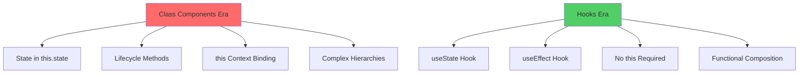

### Fundamental Principles

```
┌────────────────────────────────────────────────┐
│           Rules of Hooks                       │
├────────────────────────────────────────────────┤
│  1. Only call at top level                     │
│     ❌ No hooks in loops, conditions, nested   │
│  2. Only call from React functions             │
│     ✅ Functional components                   │
│     ✅ Custom hooks                            │
│  3. Preserve call order across renders         │
│     React relies on invocation sequence        │
└────────────────────────────────────────────────┘
```

### Angular vs React State Management

| Angular Concept | React Hook Equivalent | Purpose |
|----------------|----------------------|---------|
| Component properties | `useState` | Local state |
| `OnInit`, `OnDestroy` | `useEffect` | Lifecycle management |
| Services (Injectable) | `useContext` | Dependency injection |
| `@ViewChild` | `useRef` | DOM access |
| Memoization (rarely used) | `useMemo`, `useCallback` | Performance |
| `ngrx` reducers | `useReducer` | Complex state |

---

## 2. useState: State Management Fundamentals

### Theoretical Foundation

The `useState` hook encapsulates state management within functional components, returning a stateful value and its corresponding mutator function. React schedules re-renders when the setter is invoked, leveraging referential equality checks for optimization.

### Basic Syntax and Semantics

```jsx
import { useState } from 'react';

const [state, setState] = useState(initialValue);
//    │       │              │
//    │       │              └─ Initial state or lazy initializer
//    │       └─ Setter function (triggers re-render)
//    └─ Current state value
```

### State Update Mechanisms

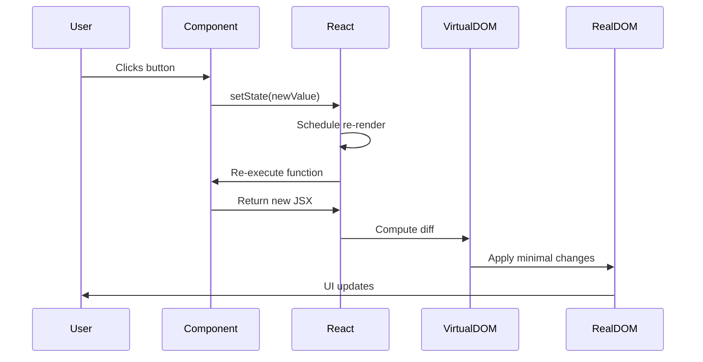

### Primitive State Management

```jsx
const CounterComponent = () => {
  // Primitive state initialization
  const [count, setCount] = useState(0);
  const [isActive, setIsActive] = useState(false);
  const [username, setUsername] = useState('');

  // Direct state mutation
  const increment = () => setCount(count + 1);
  
  // Toggle boolean state
  const toggleActive = () => setIsActive(!isActive);
  
  // Controlled input binding
  const handleInputChange = (event) => {
    setUsername(event.target.value);
  };

  return (
    <div>
      <p>Counter: {count}</p>
      <button onClick={increment}>Increment</button>
      <p>Status: {isActive ? 'Active' : 'Inactive'}</p>
      <button onClick={toggleActive}>Toggle</button>
      <input value={username} onChange={handleInputChange} />
    </div>
  );
};
```

### Functional State Updates

When the subsequent state depends on the anterior state, utilize functional updates to guarantee access to the most recent state value.

```jsx
const AdvancedCounter = () => {
  const [count, setCount] = useState(0);

  // ❌ Problematic: May use stale state
  const incrementTwiceWrong = () => {
    setCount(count + 1);
    setCount(count + 1); // Still uses original count value
  };

  // ✅ Correct: Functional update ensures fresh state
  const incrementTwiceCorrect = () => {
    setCount(prevCount => prevCount + 1);
    setCount(prevCount => prevCount + 1); // Uses updated count
  };

  return (
    <div>
      <p>Count: {count}</p>
      <button onClick={incrementTwiceCorrect}>+2</button>
    </div>
  );
};
```

### Complex State Structures

```jsx
const UserProfileManager = () => {
  // Object state management
  const [user, setUser] = useState({
    firstName: 'Marco',
    lastName: 'Rossi',
    age: 28,
    address: {
      city: 'Milano',
      country: 'Italia'
    }
  });

  // Shallow merge update
  const updateFirstName = (newName) => {
    setUser(prevUser => ({
      ...prevUser,
      firstName: newName
    }));
  };

  // Nested property update
  const updateCity = (newCity) => {
    setUser(prevUser => ({
      ...prevUser,
      address: {
        ...prevUser.address,
        city: newCity
      }
    }));
  };

  // Array state management
  const [items, setItems] = useState([]);

  // Immutable array operations
  const addItem = (item) => {
    setItems(prevItems => [...prevItems, item]);
  };

  const removeItem = (id) => {
    setItems(prevItems => prevItems.filter(item => item.id !== id));
  };

  const updateItem = (id, updates) => {
    setItems(prevItems => 
      prevItems.map(item => 
        item.id === id ? { ...item, ...updates } : item
      )
    );
  };

  return (/* JSX */);
};
```

### Lazy Initialization

For computationally expensive initial state calculations, employ lazy initialization to defer execution until the initial render.

```jsx
const ExpensiveComponent = () => {
  // ❌ Executes on every render (wasteful)
  const [data, setData] = useState(computeExpensiveValue());

  // ✅ Executes only once during initial mount
  const [data, setData] = useState(() => computeExpensiveValue());

  return <div>{data}</div>;
};

function computeExpensiveValue() {
  console.log('Computing expensive value...');
  let result = 0;
  for (let i = 0; i < 1000000; i++) {
    result += Math.random();
  }
  return result;
}
```

### State Batching and Reconciliation

React 18 introduced **automatic batching** for all state updates, optimizing rendering performance by coalescing multiple state changes into a single re-render.

```jsx
const BatchingExample = () => {
  const [count, setCount] = useState(0);
  const [flag, setFlag] = useState(false);

  const handleClick = () => {
    // React 18: Both updates batched automatically
    setCount(c => c + 1);
    setFlag(f => !f);
    // Only ONE re-render occurs
  };

  const handleAsyncClick = async () => {
    await fetchData();
    // React 18: Still batched!
    setCount(c => c + 1);
    setFlag(f => !f);
  };

  console.log('Render'); // Logs once per click

  return <button onClick={handleClick}>Update</button>;
};
```

---

## 3. useEffect: Side Effects and Lifecycle Orchestration

### Conceptual Framework

The `useEffect` hook facilitates the execution of **side effects**—operations that interact with external systems or produce observable effects beyond component rendering. This encompasses data fetching, subscriptions, DOM manipulation, and manual event listeners.

### Side Effect Taxonomy

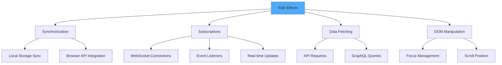

### Basic Syntax

```jsx
useEffect(() => {
  // Effect execution
  return () => {
    // Cleanup function (optional)
  };
}, [dependencies]); // Dependency array
```

### Lifecycle Equivalence

```
Angular Lifecycle          React useEffect Pattern
──────────────────        ───────────────────────

ngOnInit()                useEffect(() => {
                            // initialization
                          }, []);

ngOnDestroy()             useEffect(() => {
                            return () => {
                              // cleanup
                            };
                          }, []);

ngOnChanges()             useEffect(() => {
                            // react to changes
                          }, [dependency]);

ngDoCheck()               useEffect(() => {
                            // runs on every render
                          }); // no dependency array
```

### Dependency Array Patterns

```jsx
const EffectPatterns = () => {
  const [count, setCount] = useState(0);
  const [name, setName] = useState('');

  // Pattern 1: No dependency array - runs after EVERY render
  useEffect(() => {
    console.log('Runs on every render');
  });

  // Pattern 2: Empty array - runs ONCE after initial mount
  useEffect(() => {
    console.log('Component mounted');
    return () => console.log('Component unmounting');
  }, []);

  // Pattern 3: Specific dependencies - runs when dependencies change
  useEffect(() => {
    console.log('Count changed:', count);
  }, [count]);

  // Pattern 4: Multiple dependencies
  useEffect(() => {
    console.log('Count or name changed');
  }, [count, name]);

  return <div>Effects Demonstration</div>;
};
```

### Data Fetching Patterns

```jsx
const DataFetchingComponent = () => {
  const [data, setData] = useState(null);
  const [loading, setLoading] = useState(true);
  const [error, setError] = useState(null);

  useEffect(() => {
    // Flag to prevent state updates after unmount
    let isCancelled = false;

    const fetchData = async () => {
      try {
        setLoading(true);
        const response = await fetch('https://api.example.com/data');
        
        if (!response.ok) {
          throw new Error(`HTTP error! status: ${response.status}`);
        }
        
        const json = await response.json();
        
        // Only update state if component is still mounted
        if (!isCancelled) {
          setData(json);
          setError(null);
        }
      } catch (err) {
        if (!isCancelled) {
          setError(err.message);
          setData(null);
        }
      } finally {
        if (!isCancelled) {
          setLoading(false);
        }
      }
    };

    fetchData();

    // Cleanup function prevents memory leaks
    return () => {
      isCancelled = true;
    };
  }, []); // Empty array ensures single execution

  if (loading) return <div>Loading...</div>;
  if (error) return <div>Error: {error}</div>;
  return <div>{JSON.stringify(data)}</div>;
};
```

### Subscription Management

```jsx
const WebSocketComponent = () => {
  const [messages, setMessages] = useState([]);

  useEffect(() => {
    // Establish WebSocket connection
    const ws = new WebSocket('wss://example.com/socket');

    ws.onopen = () => {
      console.log('WebSocket connected');
    };

    ws.onmessage = (event) => {
      setMessages(prev => [...prev, event.data]);
    };

    ws.onerror = (error) => {
      console.error('WebSocket error:', error);
    };

    // Cleanup: close connection on unmount
    return () => {
      ws.close();
      console.log('WebSocket disconnected');
    };
  }, []);

  return (
    <div>
      {messages.map((msg, idx) => (
        <p key={idx}>{msg}</p>
      ))}
    </div>
  );
};
```

### Event Listener Management

```jsx
const WindowSizeTracker = () => {
  const [windowSize, setWindowSize] = useState({
    width: window.innerWidth,
    height: window.innerHeight
  });

  useEffect(() => {
    // Event handler definition
    const handleResize = () => {
      setWindowSize({
        width: window.innerWidth,
        height: window.innerHeight
      });
    };

    // Attach event listener
    window.addEventListener('resize', handleResize);

    // Cleanup: remove listener on unmount
    return () => {
      window.removeEventListener('resize', handleResize);
    };
  }, []); // No dependencies - setup once

  return (
    <div>
      Window: {windowSize.width} x {windowSize.height}
    </div>
  );
};
```

### Multiple Effects Separation

Separate concerns by utilizing multiple `useEffect` hooks for distinct side effects.

```jsx
const UserDashboard = ({ userId }) => {
  const [user, setUser] = useState(null);
  const [posts, setPosts] = useState([]);

  // Effect 1: Fetch user data
  useEffect(() => {
    let isCancelled = false;

    fetch(`/api/users/${userId}`)
      .then(res => res.json())
      .then(data => !isCancelled && setUser(data));

    return () => { isCancelled = true; };
  }, [userId]);

  // Effect 2: Fetch user posts
  useEffect(() => {
    let isCancelled = false;

    fetch(`/api/users/${userId}/posts`)
      .then(res => res.json())
      .then(data => !isCancelled && setPosts(data));

    return () => { isCancelled = true; };
  }, [userId]);

  // Effect 3: Update document title
  useEffect(() => {
    if (user) {
      document.title = `${user.name}'s Profile`;
    }
  }, [user]);

  // Effect 4: Analytics tracking
  useEffect(() => {
    analytics.track('profile_viewed', { userId });
  }, [userId]);

  return <div>{/* JSX */}</div>;
};
```

### Effect Execution Order

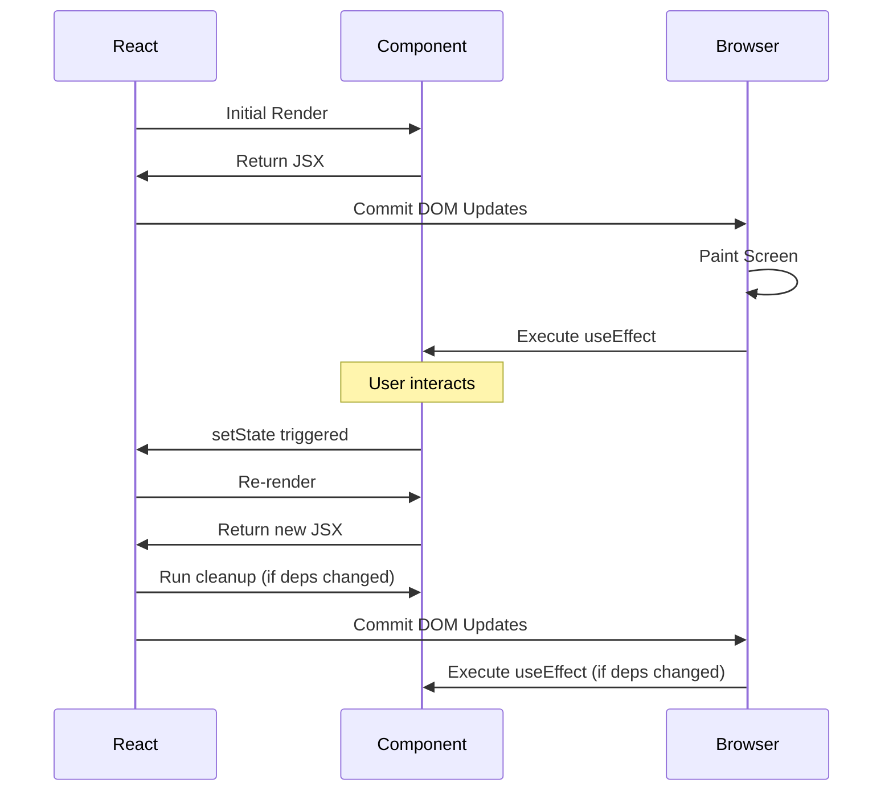

### Conditional Effects

```jsx
const ConditionalEffectComponent = ({ shouldFetch, userId }) => {
  const [data, setData] = useState(null);

  useEffect(() => {
    // Guard clause prevents unnecessary execution
    if (!shouldFetch) return;

    let isCancelled = false;

    const fetchData = async () => {
      const response = await fetch(`/api/users/${userId}`);
      const json = await response.json();
      if (!isCancelled) setData(json);
    };

    fetchData();

    return () => { isCancelled = true; };
  }, [shouldFetch, userId]); // Re-run when either changes

  return <div>{data && data.name}</div>;
};
```

---

## 4. useContext: Global State Consumption

### Context API Architecture

The Context API facilitates prop-drilling elimination by enabling data propagation through the component hierarchy without explicit prop passing at intermediary levels.

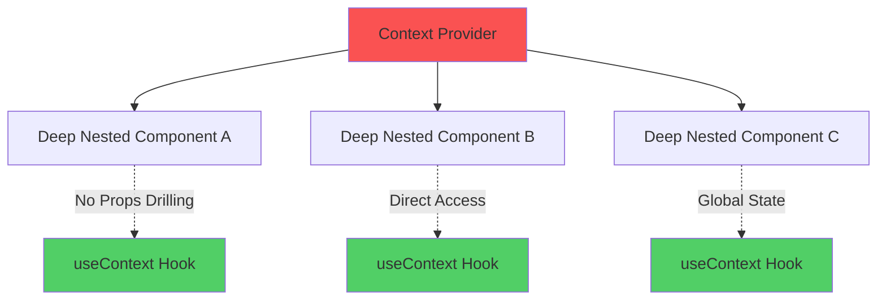

### Creating Context

```jsx
import { createContext, useContext, useState } from 'react';

// 1. Create Context with default value
const ThemeContext = createContext({
  theme: 'light',
  toggleTheme: () => {}
});

// 2. Create Provider Component
const ThemeProvider = ({ children }) => {
  const [theme, setTheme] = useState('light');

  const toggleTheme = () => {
    setTheme(prevTheme => prevTheme === 'light' ? 'dark' : 'light');
  };

  const contextValue = {
    theme,
    toggleTheme
  };

  return (
    <ThemeContext.Provider value={contextValue}>
      {children}
    </ThemeContext.Provider>
  );
};

// 3. Create custom hook for convenient consumption
const useTheme = () => {
  const context = useContext(ThemeContext);
  
  if (context === undefined) {
    throw new Error('useTheme must be used within ThemeProvider');
  }
  
  return context;
};

// 4. Consume context in child components
const ThemedButton = () => {
  const { theme, toggleTheme } = useTheme();

  return (
    <button
      style={{
        background: theme === 'light' ? '#fff' : '#333',
        color: theme === 'light' ? '#000' : '#fff'
      }}
      onClick={toggleTheme}
    >
      Toggle Theme
    </button>
  );
};

// 5. App structure
const App = () => {
  return (
    <ThemeProvider>
      <div>
        <Header />
        <ThemedButton />
        <Footer />
      </div>
    </ThemeProvider>
  );
};
```

### Complex Context Example: Authentication

```jsx
const AuthContext = createContext();

const AuthProvider = ({ children }) => {
  const [user, setUser] = useState(null);
  const [loading, setLoading] = useState(true);

  // Initialize authentication state
  useEffect(() => {
    const initAuth = async () => {
      try {
        const token = localStorage.getItem('authToken');
        if (token) {
          const response = await fetch('/api/auth/verify', {
            headers: { Authorization: `Bearer ${token}` }
          });
          const userData = await response.json();
          setUser(userData);
        }
      } catch (error) {
        console.error('Auth initialization failed:', error);
      } finally {
        setLoading(false);
      }
    };

    initAuth();
  }, []);

  const login = async (credentials) => {
    const response = await fetch('/api/auth/login', {
      method: 'POST',
      headers: { 'Content-Type': 'application/json' },
      body: JSON.stringify(credentials)
    });
    
    const { user, token } = await response.json();
    localStorage.setItem('authToken', token);
    setUser(user);
  };

  const logout = () => {
    localStorage.removeItem('authToken');
    setUser(null);
  };

  const value = {
    user,
    loading,
    login,
    logout,
    isAuthenticated: !!user
  };

  return (
    <AuthContext.Provider value={value}>
      {children}
    </AuthContext.Provider>
  );
};

// Custom hook
const useAuth = () => {
  const context = useContext(AuthContext);
  if (!context) {
    throw new Error('useAuth must be used within AuthProvider');
  }
  return context;
};

// Usage in components
const LoginPage = () => {
  const { login } = useAuth();
  
  const handleSubmit = async (e) => {
    e.preventDefault();
    await login({ email, password });
  };

  return <form onSubmit={handleSubmit}>{/* Form fields */}</form>;
};

const ProtectedRoute = ({ children }) => {
  const { isAuthenticated, loading } = useAuth();

  if (loading) return <div>Loading...</div>;
  if (!isAuthenticated) return <Navigate to="/login" />;
  
  return children;
};
```

### Multiple Context Composition

```jsx
const App = () => {
  return (
    <AuthProvider>
      <ThemeProvider>
        <LanguageProvider>
          <NotificationProvider>
            <Router>
              <Routes />
            </Router>
          </NotificationProvider>
        </LanguageProvider>
      </ThemeProvider>
    </AuthProvider>
  );
};

// Component consuming multiple contexts
const Dashboard = () => {
  const { user } = useAuth();
  const { theme } = useTheme();
  const { language } = useLanguage();
  const { showNotification } = useNotification();

  return <div>{/* Use all contexts */}</div>;
};
```

### Context Performance Optimization

```jsx
// Problem: Entire subtree re-renders when context changes
const UserContext = createContext();

const UserProvider = ({ children }) => {
  const [user, setUser] = useState(null);
  const [preferences, setPreferences] = useState({});

  // ❌ New object created on every render
  const value = { user, setUser, preferences, setPreferences };

  return (
    <UserContext.Provider value={value}>
      {children}
    </UserContext.Provider>
  );
};

// Solution 1: useMemo for value object
const UserProvider = ({ children }) => {
  const [user, setUser] = useState(null);
  const [preferences, setPreferences] = useState({});

  // ✅ Memoized value object
  const value = useMemo(
    () => ({ user, setUser, preferences, setPreferences }),
    [user, preferences]
  );

  return (
    <UserContext.Provider value={value}>
      {children}
    </UserContext.Provider>
  );
};

// Solution 2: Split contexts for granular updates
const UserContext = createContext();
const PreferencesContext = createContext();

const CombinedProvider = ({ children }) => {
  const [user, setUser] = useState(null);
  const [preferences, setPreferences] = useState({});

  return (
    <UserContext.Provider value={{ user, setUser }}>
      <PreferencesContext.Provider value={{ preferences, setPreferences }}>
        {children}
      </PreferencesContext.Provider>
    </UserContext.Provider>
  );
};
```

### Angular Services vs React Context

```
Angular Injectable Service    React Context
────────────────────────     ─────────────

@Injectable({                const AuthContext = createContext();
  providedIn: 'root'
})                           const AuthProvider = ({ children }) => {
export class AuthService {     const [user, setUser] = useState(null);
  private user = new           return (
    BehaviorSubject(null);       <AuthContext.Provider value={{user}}>
                                   {children}
  getUser() {                    </AuthContext.Provider>
    return this.user             );
      .asObservable();         };
  }
}                            const useAuth = () => useContext(AuthContext);

constructor(                 const MyComponent = () => {
  private auth: AuthService    const { user } = useAuth();
) {}                           return <div>{user.name}</div>;
                             };
```

---

## 5. useRef: DOM Manipulation and Value Persistence

### Conceptual Understanding

The `useRef` hook generates a mutable reference object whose `.current` property persists across component re-renders without triggering re-renders when mutated.

### Use Cases

```
┌────────────────────────────────────────────────┐
│           useRef Applications                  │
├────────────────────────────────────────────────┤
│  1. DOM Element Access                         │
│  2. Storing Mutable Values (non-reactive)      │
│  3. Preserving Previous Values                 │
│  4. Timer/Interval ID Storage                  │
│  5. Third-party Library Integration            │
│  6. Focus Management                           │
└────────────────────────────────────────────────┘
```

### Basic DOM Reference

```jsx
const FocusInput = () => {
  const inputRef = useRef(null);

  const handleFocus = () => {
    // Direct DOM manipulation
    inputRef.current.focus();
  };

  return (
    <div>
      <input ref={inputRef} type="text" />
      <button onClick={handleFocus}>Focus Input</button>
    </div>
  );
};
```

### Comparison: useRef vs useState

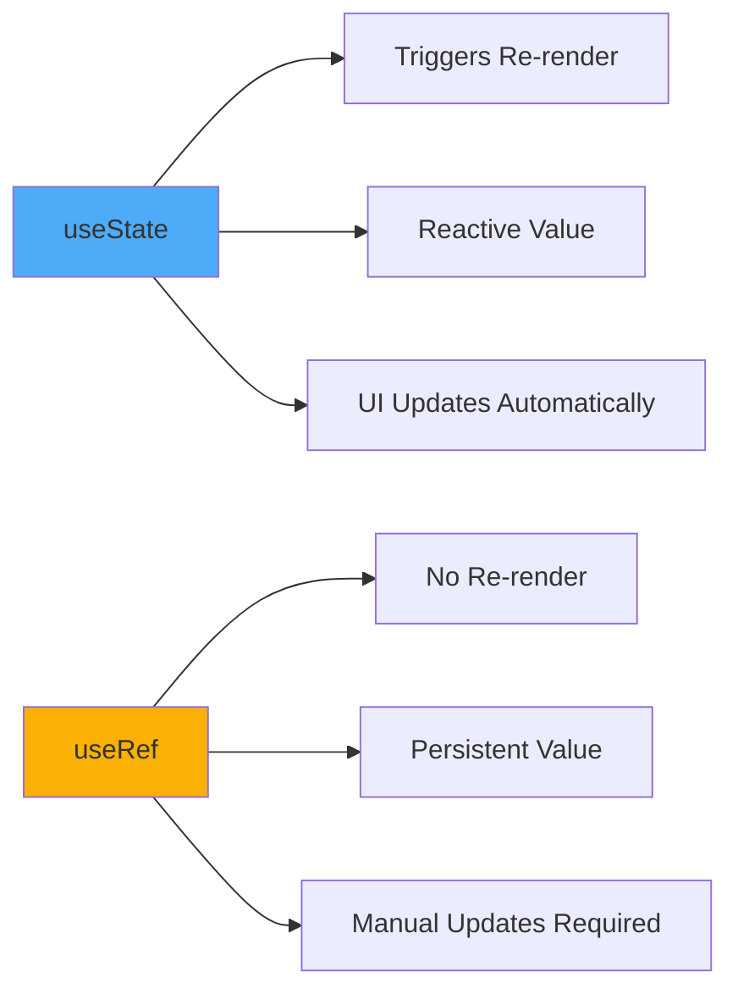

```jsx
const RefVsState = () => {
  const [stateCount, setStateCount] = useState(0);
  const refCount = useRef(0);

  const incrementState = () => {
    setStateCount(prev => prev + 1); // Triggers re-render
  };

  const incrementRef = () => {
    refCount.current += 1; // NO re-render triggered
    console.log('Ref count:', refCount.current);
  };

  console.log('Component rendered');

  return (
    <div>
      <p>State Count: {stateCount}</p>
      <p>Ref Count: {refCount.current}</p>
      <button onClick={incrementState}>Increment State</button>
      <button onClick={incrementRef}>Increment Ref</button>
    </div>
  );
};
```

### Storing Previous Values

```jsx
const usePrevious = (value) => {
  const ref = useRef();
  
  useEffect(() => {
    ref.current = value;
  }, [value]);
  
  return ref.current;
};

const CounterWithPrevious = () => {
  const [count, setCount] = useState(0);
  const previousCount = usePrevious(count);

  return (
    <div>
      <p>Current: {count}</p>
      <p>Previous: {previousCount}</p>
      <button onClick={() => setCount(count + 1)}>Increment</button>
    </div>
  );
};
```

### Timer Management

```jsx
const IntervalComponent = () => {
  const [seconds, setSeconds] = useState(0);
  const intervalRef = useRef(null);

  const startTimer = () => {
    if (intervalRef.current) return; // Prevent multiple intervals

    intervalRef.current = setInterval(() => {
      setSeconds(prev => prev + 1);
    }, 1000);
  };

  const stopTimer = () => {
    if (intervalRef.current) {
      clearInterval(intervalRef.current);
      intervalRef.current = null;
    }
  };

  const resetTimer = () => {
    stopTimer();
    setSeconds(0);
  };

  // Cleanup on unmount
  useEffect(() => {
    return () => stopTimer();
  }, []);

  return (
    <div>
      <p>Elapsed: {seconds}s</p>
      <button onClick={startTimer}>Start</button>
      <button onClick={stopTimer}>Stop</button>
      <button onClick={resetTimer}>Reset</button>
    </div>
  );
};
```

### Complex DOM Manipulation

```jsx
const CanvasDrawing = () => {
  const canvasRef = useRef(null);
  const contextRef = useRef(null);

  useEffect(() => {
    const canvas = canvasRef.current;
    canvas.width = 800;
    canvas.height = 600;

    const context = canvas.getContext('2d');
    context.lineCap = 'round';
    context.strokeStyle = 'black';
    context.lineWidth = 2;
    contextRef.current = context;
  }, []);

  const startDrawing = (e) => {
    const { offsetX, offsetY } = e.nativeEvent;
    contextRef.current.beginPath();
    contextRef.current.moveTo(offsetX, offsetY);
  };

  const draw = (e) => {
    if (e.buttons !== 1) return;
    
    const { offsetX, offsetY } = e.nativeEvent;
    contextRef.current.lineTo(offsetX, offsetY);
    contextRef.current.stroke();
  };

  return (
    <canvas
      ref={canvasRef}
      onMouseDown={startDrawing}
      onMouseMove={draw}
      style={{ border: '1px solid black' }}
    />
  );
};
```

### Forward Refs

```jsx
import { forwardRef, useRef, useImperativeHandle } from 'react';

// Child component exposing methods to parent
const CustomInput = forwardRef((props, ref) => {
  const inputRef = useRef();

  useImperativeHandle(ref, () => ({
    focus: () => {
      inputRef.current.focus();
    },
    getValue: () => {
      return inputRef.current.value;
    },
    reset: () => {
      inputRef.current.value = '';
    }
  }));

  return <input ref={inputRef} {...props} />;
});

// Parent component using ref methods
const FormWithCustomInput = () => {
  const customInputRef = useRef();

  const handleSubmit = () => {
    const value = customInputRef.current.getValue();
    console.log('Value:', value);
    customInputRef.current.reset();
  };

  return (
    <div>
      <CustomInput ref={customInputRef} />
      <button onClick={handleSubmit}>Submit</button>
      <button onClick={() => customInputRef.current.focus()}>
        Focus Input
      </button>
    </div>
  );
};
```

### Angular ViewChild vs React useRef

```
Angular                       React
───────                      ─────

@ViewChild('myInput')         const inputRef = useRef(null);
myInput: ElementRef;          
                              <input ref={inputRef} />
ngAfterViewInit() {
  this.myInput                const handleClick = () => {
    .nativeElement.focus();     inputRef.current.focus();
}                             };
```

---

## 6. useMemo: Computational Memoization

### Performance Optimization Rationale

The `useMemo` hook memoizes computationally expensive calculations, recalculating only when dependencies change, thereby preventing redundant computation on every render.

### Memoization Flow

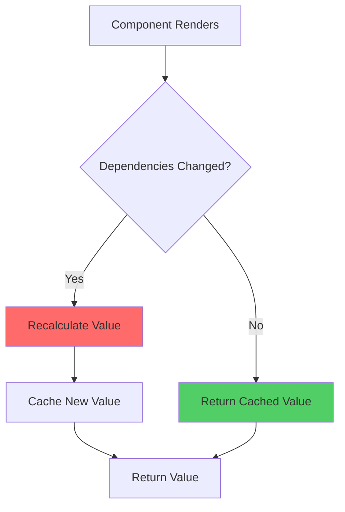

### Basic Syntax

```jsx
const memoizedValue = useMemo(
  () => computeExpensiveValue(a, b),
  [a, b] // Recalculate only when a or b changes
);
```

### Expensive Computation Example

```jsx
const ExpensiveComponent = ({ items, filter }) => {
  // ❌ Without useMemo: Recalculates on EVERY render
  const filteredItems = items.filter(item => 
    item.category === filter
  ).map(item => ({
    ...item,
    processed: heavyProcessing(item)
  }));

  // ✅ With useMemo: Recalculates only when dependencies change
  const filteredItems = useMemo(() => {
    console.log('Filtering and processing...');
    return items
      .filter(item => item.category === filter)
      .map(item => ({
        ...item,
        processed: heavyProcessing(item)
      }));
  }, [items, filter]);

  return (
    <ul>
      {filteredItems.map(item => (
        <li key={item.id}>{item.name}</li>
      ))}
    </ul>
  );
};

function heavyProcessing(item) {
  // Simulate expensive computation
  let result = 0;
  for (let i = 0; i < 1000000; i++) {
    result += Math.sqrt(i);
  }
  return result;
}
```

### Sorting and Filtering

```jsx
const SortableTable = ({ data, sortKey, sortOrder }) => {
  const sortedData = useMemo(() => {
    const sorted = [...data].sort((a, b) => {
      if (a[sortKey] < b[sortKey]) return sortOrder === 'asc' ? -1 : 1;
      if (a[sortKey] > b[sortKey]) return sortOrder === 'asc' ? 1 : -1;
      return 0;
    });
    return sorted;
  }, [data, sortKey, sortOrder]);

  return (
    <table>
      <tbody>
        {sortedData.map(row => (
          <tr key={row.id}>
            <td>{row.name}</td>
            <td>{row.value}</td>
          </tr>
        ))}
      </tbody>
    </table>
  );
};
```

### Referential Equality Preservation

```jsx
const ParentComponent = () => {
  const [count, setCount] = useState(0);
  const [otherState, setOtherState] = useState(0);

  // ❌ Without useMemo: New object created on every render
  const config = {
    apiUrl: 'https://api.example.com',
    timeout: 5000
  };

  // ✅ With useMemo: Same object reference maintained
  const config = useMemo(() => ({
    apiUrl: 'https://api.example.com',
    timeout: 5000
  }), []); // Empty array: never recalculate

  return <ChildComponent config={config} />;
};

// Child component uses React.memo for prop comparison
const ChildComponent = React.memo(({ config }) => {
  console.log('Child rendered');
  return <div>Child</div>;
});
```

### Complex Derived State

```jsx
const DataAnalytics = ({ transactions }) => {
  // Calculate statistics only when transactions change
  const analytics = useMemo(() => {
    const total = transactions.reduce((sum, t) => sum + t.amount, 0);
    const average = total / transactions.length;
    const max = Math.max(...transactions.map(t => t.amount));
    const min = Math.min(...transactions.map(t => t.amount));
    
    const categoryTotals = transactions.reduce((acc, t) => {
      acc[t.category] = (acc[t.category] || 0) + t.amount;
      return acc;
    }, {});

    return {
      total,
      average,
      max,
      min,
      categoryTotals,
      count: transactions.length
    };
  }, [transactions]);

  return (
    <div>
      <p>Total: ${analytics.total}</p>
      <p>Average: ${analytics.average.toFixed(2)}</p>
      <p>Max: ${analytics.max}</p>
      <p>Min: ${analytics.min}</p>
      <p>Transactions: {analytics.count}</p>
    </div>
  );
};
```

### When NOT to Use useMemo

```jsx
// ❌ Don't memoize simple calculations
const Component = ({ a, b }) => {
  const sum = useMemo(() => a + b, [a, b]); // Overkill!
  return <div>{sum}</div>;
};

// ✅ Simple calculations without memoization
const Component = ({ a, b }) => {
  const sum = a + b; // Fast enough without memoization
  return <div>{sum}</div>;
};

// ❌ Don't memoize with unstable dependencies
const Component = ({ data }) => {
  const processed = useMemo(
    () => processData(data),
    [data.filter(x => x.active)] // New array on every render!
  );
  return <div>{processed}</div>;
};
```

### Performance Measurement

```jsx
const MeasuredComponent = ({ items }) => {
  const expensiveResult = useMemo(() => {
    const start = performance.now();
    
    const result = items
      .filter(item => item.active)
      .map(item => complexTransformation(item))
      .reduce((acc, item) => acc + item.value, 0);
    
    const end = performance.now();
    console.log(`Calculation took ${end - start}ms`);
    
    return result;
  }, [items]);

  return <div>Result: {expensiveResult}</div>;
};
```

---

## 7. useCallback: Function Memoization

### Fundamental Concept

The `useCallback` hook returns a memoized version of a callback function, maintaining referential equality across renders unless dependencies change. This prevents child component re-renders caused by prop function reference changes.

### Syntax

```jsx
const memoizedCallback = useCallback(
  () => {
    doSomething(a, b);
  },
  [a, b] // Recreate function only when dependencies change
);
```

### Problem Demonstration

```jsx
const ParentComponent = () => {
  const [count, setCount] = useState(0);
  const [otherState, setOtherState] = useState(false);

  // ❌ New function created on every render
  const handleClick = () => {
    console.log('Clicked');
  };

  return (
    <>
      <p>Count: {count}</p>
      <button onClick={() => setOtherState(!otherState)}>
        Toggle Other State
      </button>
      <ExpensiveChild onClick={handleClick} />
    </>
  );
};

// Child re-renders even when unrelated state changes
const ExpensiveChild = React.memo(({ onClick }) => {
  console.log('ExpensiveChild rendered');
  return <button onClick={onClick}>Click Me</button>;
});
```

### Solution with useCallback

```jsx
const ParentComponent = () => {
  const [count, setCount] = useState(0);
  const [otherState, setOtherState] = useState(false);

  // ✅ Function reference stable across renders
  const handleClick = useCallback(() => {
    console.log('Clicked');
  }, []); // No dependencies: never recreate

  // Function with dependencies
  const handleIncrement = useCallback(() => {
    setCount(prev => prev + 1);
  }, []); // Using functional update, no dependency needed

  // Function accessing state
  const handleLog = useCallback(() => {
    console.log('Current count:', count);
  }, [count]); // Recreate when count changes

  return (
    <>
      <p>Count: {count}</p>
      <button onClick={() => setOtherState(!otherState)}>
        Toggle Other State
      </button>
      <ExpensiveChild onClick={handleClick} />
    </>
  );
};
```

### useCallback with Dependencies

```jsx
const SearchComponent = () => {
  const [query, setQuery] = useState('');
  const [filter, setFilter] = useState('all');

  const handleSearch = useCallback(async () => {
    const results = await fetch(
      `/api/search?q=${query}&filter=${filter}`
    );
    const data = await results.json();
    console.log(data);
  }, [query, filter]); // Recreate when query or filter changes

  return (
    <div>
      <input value={query} onChange={e => setQuery(e.target.value)} />
      <select value={filter} onChange={e => setFilter(e.target.value)}>
        <option value="all">All</option>
        <option value="active">Active</option>
      </select>
      <SearchButton onSearch={handleSearch} />
    </div>
  );
};
```

### useCallback vs useMemo

```jsx
// useCallback memoizes the function itself
const memoizedCallback = useCallback(() => {
  return a + b;
}, [a, b]);

// useMemo memoizes the function's return value
const memoizedValue = useMemo(() => {
  return a + b;
}, [a, b]);

// Equivalence:
const memoizedCallback = useCallback(fn, deps);
// is equivalent to:
const memoizedCallback = useMemo(() => fn, deps);
```

### Event Handler Optimization

```jsx
const TodoList = () => {
  const [todos, setTodos] = useState([]);

  const handleToggle = useCallback((id) => {
    setTodos(prevTodos =>
      prevTodos.map(todo =>
        todo.id === id ? { ...todo, completed: !todo.completed } : todo
      )
    );
  }, []); // No dependencies: uses functional update

  const handleDelete = useCallback((id) => {
    setTodos(prevTodos => prevTodos.filter(todo => todo.id !== id));
  }, []);

  return (
    <div>
      {todos.map(todo => (
        <TodoItem
          key={todo.id}
          todo={todo}
          onToggle={handleToggle}
          onDelete={handleDelete}
        />
      ))}
    </div>
  );
};

const TodoItem = React.memo(({ todo, onToggle, onDelete }) => {
  console.log('TodoItem rendered:', todo.id);
  
  return (
    <div>
      <span>{todo.text}</span>
      <button onClick={() => onToggle(todo.id)}>Toggle</button>
      <button onClick={() => onDelete(todo.id)}>Delete</button>
    </div>
  );
});
```

### Custom Hook with useCallback

```jsx
const useDebounce = (callback, delay) => {
  const timeoutRef = useRef(null);

  const debouncedCallback = useCallback((...args) => {
    if (timeoutRef.current) {
      clearTimeout(timeoutRef.current);
    }

    timeoutRef.current = setTimeout(() => {
      callback(...args);
    }, delay);
  }, [callback, delay]);

  // Cleanup on unmount
  useEffect(() => {
    return () => {
      if (timeoutRef.current) {
        clearTimeout(timeoutRef.current);
      }
    };
  }, []);

  return debouncedCallback;
};

// Usage
const SearchInput = () => {
  const [query, setQuery] = useState('');

  const performSearch = useCallback(async (searchQuery) => {
    const results = await fetch(`/api/search?q=${searchQuery}`);
    console.log(await results.json());
  }, []);

  const debouncedSearch = useDebounce(performSearch, 500);

  const handleChange = (e) => {
    const value = e.target.value;
    setQuery(value);
    debouncedSearch(value);
  };

  return <input value={query} onChange={handleChange} />;
};
```

### When NOT to Use useCallback

```jsx
// ❌ Unnecessary: Function not passed as prop
const Component = () => {
  const handleClick = useCallback(() => {
    console.log('Clicked');
  }, []); // Overkill if only used locally

  return <button onClick={handleClick}>Click</button>;
};

// ✅ Simple inline function is fine
const Component = () => {
  return (
    <button onClick={() => console.log('Clicked')}>
      Click
    </button>
  );
};

// ❌ Child doesn't use React.memo
const Parent = () => {
  const handleClick = useCallback(() => {
    console.log('Clicked');
  }, []); // Useless if Child always re-renders

  return <ChildWithoutMemo onClick={handleClick} />;
};
```

---

## 8. useReducer: Complex State Logic

### Reducer Pattern Architecture

The `useReducer` hook implements the reducer pattern for managing complex state logic with multiple sub-values or when subsequent state depends on anterior state.

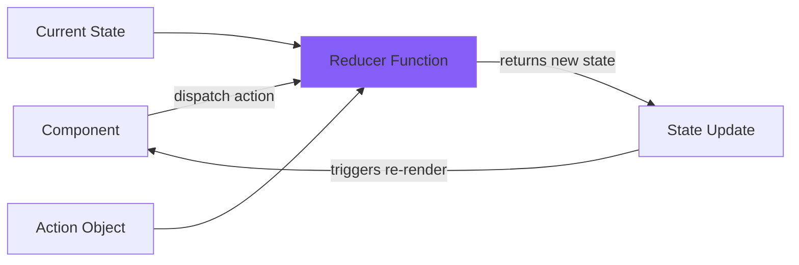

### Basic Syntax

```jsx
const [state, dispatch] = useReducer(reducer, initialState);

// Reducer function
function reducer(state, action) {
  switch (action.type) {
    case 'ACTION_TYPE':
      return { ...state, /* updates */ };
    default:
      return state;
  }
}
```

### Simple Counter Example

```jsx
const initialState = { count: 0 };

function counterReducer(state, action) {
  switch (action.type) {
    case 'INCREMENT':
      return { count: state.count + 1 };
    case 'DECREMENT':
      return { count: state.count - 1 };
    case 'RESET':
      return { count: 0 };
    case 'SET':
      return { count: action.payload };
    default:
      throw new Error(`Unknown action: ${action.type}`);
  }
}

const Counter = () => {
  const [state, dispatch] = useReducer(counterReducer, initialState);

  return (
    <div>
      <p>Count: {state.count}</p>
      <button onClick={() => dispatch({ type: 'INCREMENT' })}>+</button>
      <button onClick={() => dispatch({ type: 'DECREMENT' })}>-</button>
      <button onClick={() => dispatch({ type: 'RESET' })}>Reset</button>
      <button onClick={() => dispatch({ type: 'SET', payload: 10 })}>
        Set to 10
      </button>
    </div>
  );
};
```

### Complex State Management: Todo Application

```jsx
const initialState = {
  todos: [],
  filter: 'all',
  nextId: 1
};

function todoReducer(state, action) {
  switch (action.type) {
    case 'ADD_TODO':
      return {
        ...state,
        todos: [
          ...state.todos,
          {
            id: state.nextId,
            text: action.payload,
            completed: false,
            createdAt: new Date().toISOString()
          }
        ],
        nextId: state.nextId + 1
      };

    case 'TOGGLE_TODO':
      return {
        ...state,
        todos: state.todos.map(todo =>
          todo.id === action.payload
            ? { ...todo, completed: !todo.completed }
            : todo
        )
      };

    case 'DELETE_TODO':
      return {
        ...state,
        todos: state.todos.filter(todo => todo.id !== action.payload)
      };

    case 'EDIT_TODO':
      return {
        ...state,
        todos: state.todos.map(todo =>
          todo.id === action.payload.id
            ? { ...todo, text: action.payload.text }
            : todo
        )
      };

    case 'SET_FILTER':
      return {
        ...state,
        filter: action.payload
      };

    case 'CLEAR_COMPLETED':
      return {
        ...state,
        todos: state.todos.filter(todo => !todo.completed)
      };

    default:
      throw new Error(`Unknown action: ${action.type}`);
  }
}

const TodoApp = () => {
  const [state, dispatch] = useReducer(todoReducer, initialState);
  const [inputValue, setInputValue] = useState('');

  const handleAddTodo = (e) => {
    e.preventDefault();
    if (inputValue.trim()) {
      dispatch({ type: 'ADD_TODO', payload: inputValue });
      setInputValue('');
    }
  };

  const filteredTodos = state.todos.filter(todo => {
    if (state.filter === 'active') return !todo.completed;
    if (state.filter === 'completed') return todo.completed;
    return true;
  });

  return (
    <div>
      <form onSubmit={handleAddTodo}>
        <input
          value={inputValue}
          onChange={e => setInputValue(e.target.value)}
          placeholder="Add todo..."
        />
        <button type="submit">Add</button>
      </form>

      <div>
        <button onClick={() => dispatch({ type: 'SET_FILTER', payload: 'all' })}>
          All
        </button>
        <button onClick={() => dispatch({ type: 'SET_FILTER', payload: 'active' })}>
          Active
        </button>
        <button onClick={() => dispatch({ type: 'SET_FILTER', payload: 'completed' })}>
          Completed
        </button>
      </div>

      <ul>
        {filteredTodos.map(todo => (
          <li key={todo.id}>
            <input
              type="checkbox"
              checked={todo.completed}
              onChange={() => dispatch({ type: 'TOGGLE_TODO', payload: todo.id })}
            />
            <span>{todo.text}</span>
            <button onClick={() => dispatch({ type: 'DELETE_TODO', payload: todo.id })}>
              Delete
            </button>
          </li>
        ))}
      </ul>

      <button onClick={() => dispatch({ type: 'CLEAR_COMPLETED' })}>
        Clear Completed
      </button>
    </div>
  );
};
```

### Lazy Initialization

```jsx
function init(initialCount) {
  return {
    count: initialCount,
    history: [initialCount]
  };
}

function reducer(state, action) {
  switch (action.type) {
    case 'INCREMENT':
      const newCount = state.count + 1;
      return {
        count: newCount,
        history: [...state.history, newCount]
      };
    case 'RESET':
      return init(action.payload);
    default:
      return state;
  }
}

const Component = () => {
  const [state, dispatch] = useReducer(reducer, 10, init);
  
  return (/* JSX */);
};
```

### useReducer with Context

```jsx
const TodoContext = createContext();

const TodoProvider = ({ children }) => {
  const [state, dispatch] = useReducer(todoReducer, initialState);

  return (
    <TodoContext.Provider value={{ state, dispatch }}>
      {children}
    </TodoContext.Provider>
  );
};

const useTodos = () => {
  const context = useContext(TodoContext);
  if (!context) {
    throw new Error('useTodos must be used within TodoProvider');
  }
  return context;
};

// Usage in components
const TodoList = () => {
  const { state, dispatch } = useTodos();

  return (
    <ul>
      {state.todos.map(todo => (
        <li key={todo.id}>
          <span>{todo.text}</span>
          <button onClick={() => dispatch({ type: 'DELETE_TODO', payload: todo.id })}>
            Delete
          </button>
        </li>
      ))}
    </ul>
  );
};
```

### useReducer vs useState Decision Matrix

```
Use useState when:                  Use useReducer when:
──────────────────                 ────────────────────

• Simple state (primitives)         • Complex state object
• Independent state updates         • Interdependent state
• Few state transitions             • Many state transitions
• Local component state             • Shared state (with context)
• No business logic                 • Complex business logic
• State updates are simple          • State updates are complex

Example: Toggle, counter            Example: Form, shopping cart
```

### Type-Safe Reducer with TypeScript

```typescript
type State = {
  count: number;
  error: string | null;
};

type Action =
  | { type: 'INCREMENT' }
  | { type: 'DECREMENT' }
  | { type: 'SET_ERROR'; payload: string }
  | { type: 'RESET' };

const initialState: State = {
  count: 0,
  error: null
};

function reducer(state: State, action: Action): State {
  switch (action.type) {
    case 'INCREMENT':
      return { ...state, count: state.count + 1 };
    case 'DECREMENT':
      return { ...state, count: state.count - 1 };
    case 'SET_ERROR':
      return { ...state, error: action.payload };
    case 'RESET':
      return initialState;
    default:
      const exhaustiveCheck: never = action;
      throw new Error(`Unhandled action: ${exhaustiveCheck}`);
  }
}
```

### Angular NgRx vs React useReducer

```
NgRx (Angular)                 useReducer (React)
──────────────                ──────────────────

@ngrx/store                    useReducer hook

export const increment =       dispatch({ 
  createAction('[Counter]        type: 'INCREMENT' 
    INCREMENT')                });

store.dispatch(increment())    

store.select(selectCount)      const [state, dispatch] = 
  .subscribe(...)                useReducer(reducer, init);

Requires setup & boilerplate   Simpler, built-in
Global state management        Local or global (with Context)
```

---

## 9. Custom Hooks: Abstraction and Reusability

### Philosophy of Custom Hooks

Custom hooks encapsulate reusable stateful logic, enabling composition and abstraction without modifying component hierarchies. They follow the **separation of concerns** principle by extracting logic from presentation.

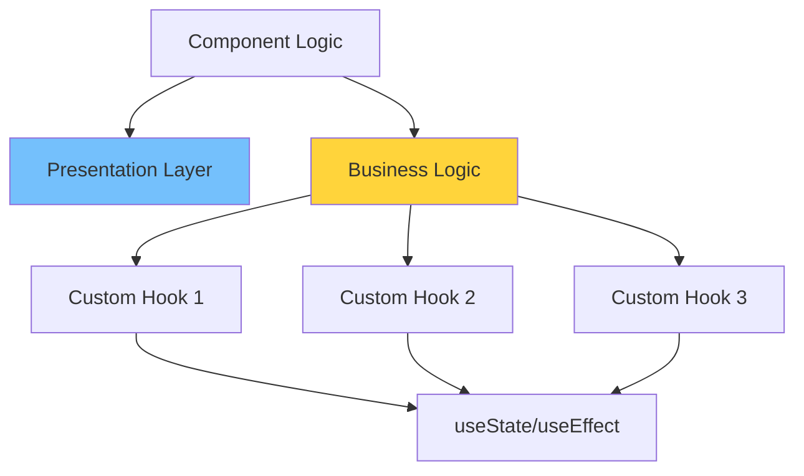

### Naming Convention

Custom hooks **must** begin with "use" to conform to React's linting rules and hook regulations.

### Basic Custom Hook: useToggle

```jsx
const useToggle = (initialValue = false) => {
  const [value, setValue] = useState(initialValue);

  const toggle = useCallback(() => {
    setValue(prev => !prev);
  }, []);

  const setTrue = useCallback(() => {
    setValue(true);
  }, []);

  const setFalse = useCallback(() => {
    setValue(false);
  }, []);

  return [value, toggle, setTrue, setFalse];
};

// Usage
const Modal = () => {
  const [isOpen, toggle, open, close] = useToggle(false);

  return (
    <>
      <button onClick={open}>Open Modal</button>
      {isOpen && (
        <div className="modal">
          <p>Modal Content</p>
          <button onClick={close}>Close</button>
        </div>
      )}
    </>
  );
};
```

### Custom Hook: useLocalStorage

```jsx
const useLocalStorage = (key, initialValue) => {
  // Initialize state from localStorage or use initialValue
  const [storedValue, setStoredValue] = useState(() => {
    try {
      const item = window.localStorage.getItem(key);
      return item ? JSON.parse(item) : initialValue;
    } catch (error) {
      console.error('Error reading localStorage:', error);
      return initialValue;
    }
  });

  // Update both state and localStorage
  const setValue = useCallback((value) => {
    try {
      const valueToStore = value instanceof Function 
        ? value(storedValue) 
        : value;
      
      setStoredValue(valueToStore);
      window.localStorage.setItem(key, JSON.stringify(valueToStore));
    } catch (error) {
      console.error('Error writing to localStorage:', error);
    }
  }, [key, storedValue]);

  return [storedValue, setValue];
};

// Usage
const UserPreferences = () => {
  const [theme, setTheme] = useLocalStorage('theme', 'light');
  const [language, setLanguage] = useLocalStorage('language', 'en');

  return (
    <div>
      <select value={theme} onChange={e => setTheme(e.target.value)}>
        <option value="light">Light</option>
        <option value="dark">Dark</option>
      </select>
      <select value={language} onChange={e => setLanguage(e.target.value)}>
        <option value="en">English</option>
        <option value="it">Italiano</option>
      </select>
    </div>
  );
};
```

### Custom Hook: useFetch

```jsx
const useFetch = (url, options = {}) => {
  const [data, setData] = useState(null);
  const [loading, setLoading] = useState(true);
  const [error, setError] = useState(null);

  useEffect(() => {
    let isCancelled = false;

    const fetchData = async () => {
      setLoading(true);
      setError(null);

      try {
        const response = await fetch(url, options);
        
        if (!response.ok) {
          throw new Error(`HTTP error! status: ${response.status}`);
        }
        
        const json = await response.json();
        
        if (!isCancelled) {
          setData(json);
        }
      } catch (err) {
        if (!isCancelled) {
          setError(err.message);
        }
      } finally {
        if (!isCancelled) {
          setLoading(false);
        }
      }
    };

    fetchData();

    return () => {
      isCancelled = true;
    };
  }, [url, JSON.stringify(options)]);

  return { data, loading, error };
};

// Usage
const UserProfile = ({ userId }) => {
  const { data, loading, error } = useFetch(`/api/users/${userId}`);

  if (loading) return <div>Loading...</div>;
  if (error) return <div>Error: {error}</div>;
  if (!data) return null;

  return (
    <div>
      <h2>{data.name}</h2>
      <p>{data.email}</p>
    </div>
  );
};
```

### Custom Hook: useDebounce

```jsx
const useDebounce = (value, delay) => {
  const [debouncedValue, setDebouncedValue] = useState(value);

  useEffect(() => {
    const handler = setTimeout(() => {
      setDebouncedValue(value);
    }, delay);

    return () => {
      clearTimeout(handler);
    };
  }, [value, delay]);

  return debouncedValue;
};

// Usage
const SearchComponent = () => {
  const [searchTerm, setSearchTerm] = useState('');
  const debouncedSearchTerm = useDebounce(searchTerm, 500);

  useEffect(() => {
    if (debouncedSearchTerm) {
      // Perform search with debounced value
      fetch(`/api/search?q=${debouncedSearchTerm}`)
        .then(res => res.json())
        .then(data => console.log(data));
    }
  }, [debouncedSearchTerm]);

  return (
    <input
      value={searchTerm}
      onChange={e => setSearchTerm(e.target.value)}
      placeholder="Search..."
    />
  );
};
```

### Custom Hook: useWindowSize

```jsx
const useWindowSize = () => {
  const [windowSize, setWindowSize] = useState({
    width: window.innerWidth,
    height: window.innerHeight
  });

  useEffect(() => {
    const handleResize = () => {
      setWindowSize({
        width: window.innerWidth,
        height: window.innerHeight
      });
    };

    window.addEventListener('resize', handleResize);

    return () => {
      window.removeEventListener('resize', handleResize);
    };
  }, []);

  return windowSize;
};

// Usage
const ResponsiveComponent = () => {
  const { width } = useWindowSize();

  return (
    <div>
      {width < 768 ? (
        <MobileView />
      ) : (
        <DesktopView />
      )}
    </div>
  );
};
```

### Custom Hook: useIntersectionObserver

```jsx
const useIntersectionObserver = (ref, options = {}) => {
  const [isIntersecting, setIsIntersecting] = useState(false);

  useEffect(() => {
    const element = ref.current;
    if (!element) return;

    const observer = new IntersectionObserver(([entry]) => {
      setIsIntersecting(entry.isIntersecting);
    }, options);

    observer.observe(element);

    return () => {
      observer.disconnect();
    };
  }, [ref, options]);

  return isIntersecting;
};

// Usage
const LazyImage = ({ src, alt }) => {
  const imageRef = useRef();
  const isVisible = useIntersectionObserver(imageRef, {
    threshold: 0.1
  });

  return (
    <div ref={imageRef}>
      {isVisible ? (
        
      ) : (
        <div className="placeholder">Loading...</div>
      )}
    </div>
  );
};
```

### Custom Hook Composition

```jsx
const useUser = (userId) => {
  const { data: user, loading, error } = useFetch(`/api/users/${userId}`);
  const [preferences, setPreferences] = useLocalStorage(`user-${userId}-prefs`, {});
  const [isOnline, setIsOnline] = useState(navigator.onLine);

  useEffect(() => {
    const handleOnline = () => setIsOnline(true);
    const handleOffline = () => setIsOnline(false);

    window.addEventListener('online', handleOnline);
    window.addEventListener('offline', handleOffline);

    return () => {
      window.removeEventListener('online', handleOnline);
      window.removeEventListener('offline', handleOffline);
    };
  }, []);

  return {
    user,
    loading,
    error,
    preferences,
    setPreferences,
    isOnline
  };
};

// Usage combines multiple concerns
const UserDashboard = ({ userId }) => {
  const {
    user,
    loading,
    error,
    preferences,
    setPreferences,
    isOnline
  } = useUser(userId);

  if (loading) return <div>Loading...</div>;
  if (error) return <div>Error: {error}</div>;

  return (
    <div>
      <h1>{user.name}</h1>
      <p>Status: {isOnline ? 'Online' : 'Offline'}</p>
      <p>Theme: {preferences.theme || 'default'}</p>
    </div>
  );
};
```

---

## 10. Advanced Patterns and Best Practices

### Hook Dependency Management

```
┌────────────────────────────────────────────────┐
│        Dependency Array Best Practices         │
├────────────────────────────────────────────────┤
│  ✅ Include ALL values from component scope    │
│  ✅ Use ESLint plugin: eslint-plugin-react-    │
│     hooks                                      │
│  ✅ Prefer functional updates for setState    │
│  ❌ Never omit dependencies to "fix" issues   │
│  ❌ Avoid object/array literals in deps       │
└────────────────────────────────────────────────┘
```

### Performance Optimization Strategy

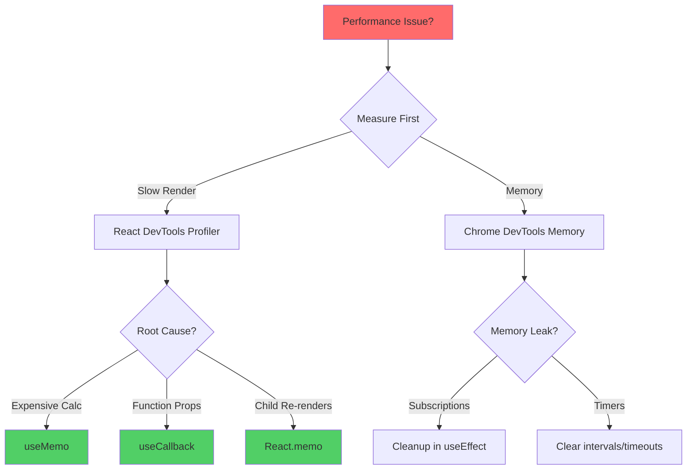

### Premature Optimization Pitfalls

```jsx
// ❌ Over-optimization: Memoizing everything
const OverOptimized = ({ data }) => {
  const processedData = useMemo(() => data.map(x => x * 2), [data]);
  const handleClick = useCallback(() => console.log('click'), []);
  const simpleSum = useMemo(() => 1 + 1, []); // Ridiculous!
  
  return <div onClick={handleClick}>{simpleSum}</div>;
};

// ✅ Optimize strategically
const Optimized = ({ data }) => {
  // Only memoize expensive operations
  const processedData = data.map(x => x * 2); // Fast enough
  
  // Only memoize callbacks passed to memoized children
  return <div onClick={() => console.log('click')}>2</div>;
};
```

### Hook Testing Strategies

```jsx
import { renderHook, act } from '@testing-library/react-hooks';

describe('useCounter', () => {
  const useCounter = (initialValue = 0) => {
    const [count, setCount] = useState(initialValue);
    const increment = () => setCount(c => c + 1);
    const decrement = () => setCount(c => c - 1);
    return { count, increment, decrement };
  };

  it('initializes with default value', () => {
    const { result } = renderHook(() => useCounter());
    expect(result.current.count).toBe(0);
  });

  it('increments counter', () => {
    const { result } = renderHook(() => useCounter());
    
    act(() => {
      result.current.increment();
    });
    
    expect(result.current.count).toBe(1);
  });

  it('initializes with custom value', () => {
    const { result } = renderHook(() => useCounter(10));
    expect(result.current.count).toBe(10);
  });
});
```

### Error Boundaries with Hooks

```jsx
// Note: Error boundaries still require class components
class ErrorBoundary extends React.Component {
  constructor(props) {
    super(props);
    this.state = { hasError: false, error: null };
  }

  static getDerivedStateFromError(error) {
    return { hasError: true, error };
  }

  componentDidCatch(error, errorInfo) {
    console.error('Error caught:', error, errorInfo);
  }

  render() {
    if (this.state.hasError) {
      return <div>Something went wrong: {this.state.error.message}</div>;
    }
    return this.props.children;
  }
}

// Custom hook for error handling
const useErrorHandler = () => {
  const [error, setError] = useState(null);

  const handleError = useCallback((err) => {
    setError(err);
    console.error(err);
  }, []);

  const resetError = useCallback(() => {
    setError(null);
  }, []);

  return { error, handleError, resetError };
};
```

### Hook Composition Patterns

```jsx
// Pattern 1: Hook returns hook
const useApi = (baseUrl) => {
  const useFetchEndpoint = (endpoint) => {
    return useFetch(`${baseUrl}${endpoint}`);
  };
  
  return { useFetchEndpoint };
};

// Pattern 2: Higher-order hook
const withLogging = (useHook) => {
  return (...args) => {
    const result = useHook(...args);
    
    useEffect(() => {
      console.log('Hook result:', result);
    }, [result]);
    
    return result;
  };
};

const useCounterWithLogging = withLogging(useCounter);
```

### Complete Advanced Example

```jsx
const useAdvancedForm = (initialValues, validationSchema) => {
  const [values, setValues] = useState(initialValues);
  const [errors, setErrors] = useState({});
  const [touched, setTouched] = useState({});
  const [isSubmitting, setIsSubmitting] = useState(false);

  const validate = useCallback((fieldName, value) => {
    try {
      validationSchema[fieldName]?.(value);
      return null;
    } catch (error) {
      return error.message;
    }
  }, [validationSchema]);

  const handleChange = useCallback((fieldName) => (event) => {
    const value = event.target.value;
    
    setValues(prev => ({
      ...prev,
      [fieldName]: value
    }));

    if (touched[fieldName]) {
      const error = validate(fieldName, value);
      setErrors(prev => ({
        ...prev,
        [fieldName]: error
      }));
    }
  }, [touched, validate]);

  const handleBlur = useCallback((fieldName) => () => {
    setTouched(prev => ({
      ...prev,
      [fieldName]: true
    }));

    const error = validate(fieldName, values[fieldName]);
    setErrors(prev => ({
      ...prev,
      [fieldName]: error
    }));
  }, [values, validate]);

  const handleSubmit = useCallback((onSubmit) => async (event) => {
    event.preventDefault();
    setIsSubmitting(true);

    // Validate all fields
    const newErrors = {};
    Object.keys(values).forEach(field => {
      const error = validate(field, values[field]);
      if (error) newErrors[field] = error;
    });

    if (Object.keys(newErrors).length > 0) {
      setErrors(newErrors);
      setIsSubmitting(false);
      return;
    }

    try {
      await onSubmit(values);
    } catch (error) {
      console.error('Submission error:', error);
    } finally {
      setIsSubmitting(false);
    }
  }, [values, validate]);

  const reset = useCallback(() => {
    setValues(initialValues);
    setErrors({});
    setTouched({});
    setIsSubmitting(false);
  }, [initialValues]);

  return {
    values,
    errors,
    touched,
    isSubmitting,
    handleChange,
    handleBlur,
    handleSubmit,
    reset
  };
};
```

---

## Conclusion: Mastering React Hooks

### Hierarchy of Hook Mastery

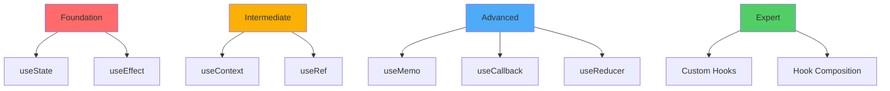

### Essential Principles Recapitulation

1. **Declarative State Management**: Hooks enable declarative state manipulation without class component complexity
2. **Separation of Concerns**: Extract logic into custom hooks for maintainability
3. **Performance Optimization**: Apply `useMemo` and `useCallback` judiciously, not universally
4. **Side Effect Management**: Utilize `useEffect` with proper cleanup for resource management
5. **Composition over Inheritance**: Combine hooks to create sophisticated behaviors


### Resources for Continued Learning

- 📘 [React Hooks Documentation](https://react.dev/reference/react)
- 🎓 [useHooks.com](https://usehooks.com/) - Custom hook recipes
- 🛠️ [React DevTools](https://react.dev/learn/react-developer-tools)
- 📦 [Awesome React Hooks](https://github.com/rehooks/awesome-react-hooks)

---

**Eccellenza attraverso la pratica! 🚀**