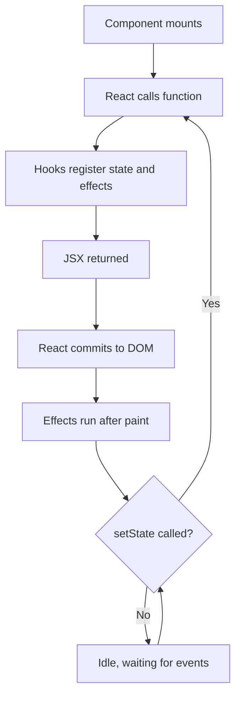
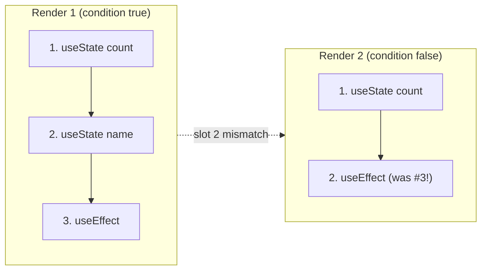
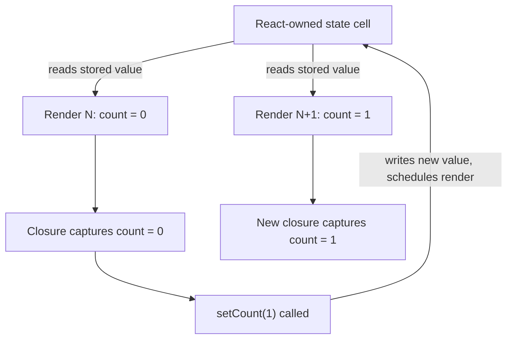
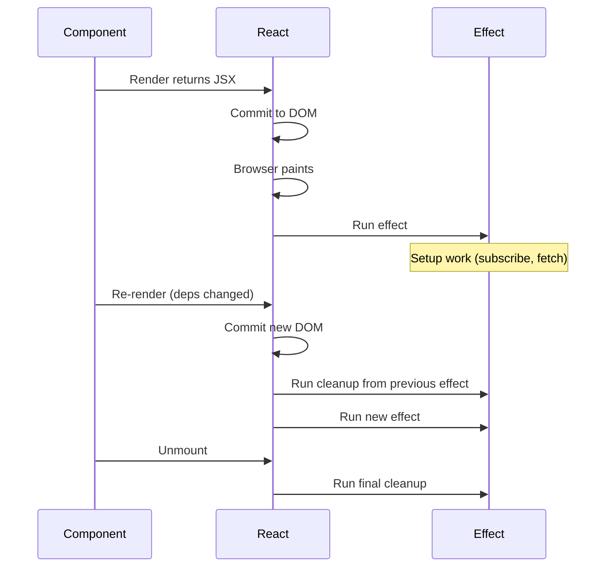
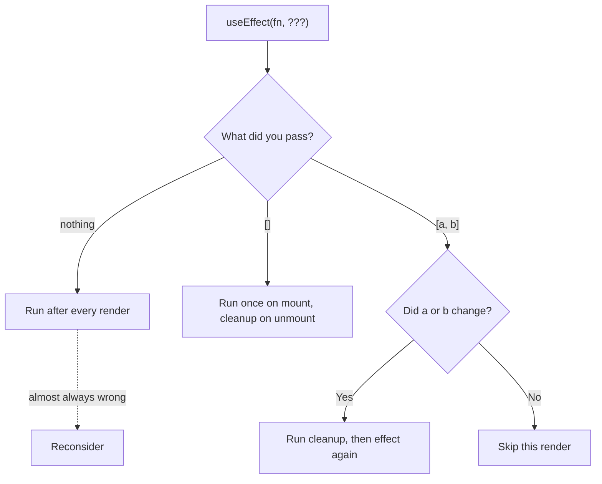
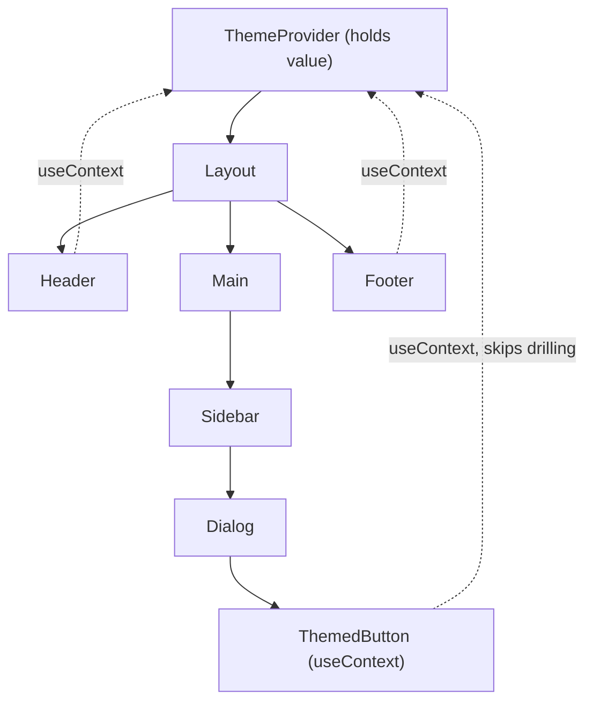
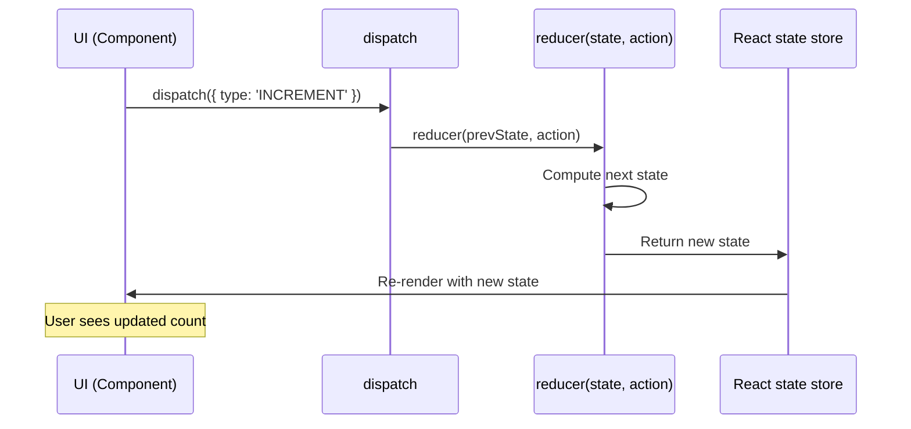
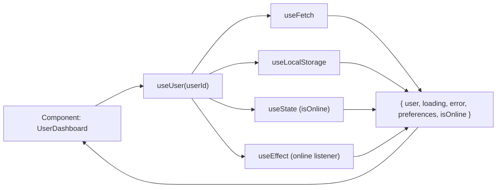

# React Hooks: Adding State and Effects to Components

> A practical deep dive into the hooks that power modern React components: what each one solves, when to reach for it, and the pitfalls to avoid.

---

## Table of Contents

1. [Understanding Hooks](#1-understanding-hooks)
2. [useState](#2-usestate)
3. [useEffect](#3-useeffect)
4. [useContext](#4-usecontext)
5. [useRef](#5-useref)
6. [useMemo](#6-usememo)
7. [useCallback](#7-usecallback)
8. [useReducer](#8-usereducer)
9. [Custom Hooks](#9-custom-hooks)
10. [Advanced Patterns](#10-advanced-patterns)

---

## 1. Understanding Hooks

### What Hooks Are

In Module 01 you wrote components — functions that take props and return JSX. You also met your first hook, `useState`. Hooks are just functions, but they have a superpower the components in Module 01 didn't: they let a plain function remember things between renders, react to changes, and reach out to the world outside the component.

A component without hooks is pure: same props in, same JSX out. That's enough for a button or a card, but not for anything interesting. A counter has to remember its count. A search box has to fetch results. A modal has to focus its input when it opens. Hooks are how a function component gains those abilities while staying a function.

The name "hook" comes from the idea that you are hooking into React's internals — its rendering loop, its state storage, its scheduling — from inside an otherwise ordinary function call. React 16.8 introduced them in 2019, and they have been the default way to write components ever since.

The diagram below shows where hooks fit in the render cycle. Your component function is just one step in a loop that React drives — hooks are how you plug into it.


```mermaid
flowchart TD
    A["Component mounts"] --> B["React calls function"]
    B --> C["Hooks register state and effects"]
    C --> D["JSX returned"]
    D --> E["React commits to DOM"]
    E --> F["Effects run after paint"]
    F --> G{"setState called?"}
    G -- "Yes" --> B
    G -- "No" --> H["Idle, waiting for events"]
    H --> G
```

### How Hooks Relate to What You Already Know

If you have written JavaScript before React, hooks may feel strange at first. A plain function in JavaScript starts fresh every time you call it. Local variables are gone the moment the function returns. So how can `useState` "remember" a value between calls?

The trick is that React calls your component function in a controlled context. Before it calls your component, React looks up which component is rendering, which call slot you are in, and reads the value it stored last time. When you call `useState(0)`, you are not really creating a new variable — you are telling React, "give me the value you have for me, and a function to update it." This is closer to a closure that React owns on your behalf than to a normal local variable.

This explains the one rule that catches everyone the first time.

### The Rules of Hooks

There are two rules, and both follow from how React tracks which value belongs to which call:

1. **Only call hooks at the top level of your component.** Never inside an `if`, a loop, or a nested function. React identifies each hook call by the order in which it appears during render. If you skip a call on one render and not the next, every hook after it gets the wrong value.

2. **Only call hooks from React functions.** That means from a component or from another hook (which by convention starts with `use`). Calling a hook from a regular utility function does not work, because React is not tracking that call.

The official ESLint plugin `eslint-plugin-react-hooks` enforces both rules. Keep it on.

To see why the order rule matters, picture two renders side by side. React identifies each hook by its position in the call sequence. Skip a call on one render, and every hook after it shifts — they all read the wrong slot.


```mermaid
flowchart LR
    subgraph R1["Render 1 (condition true)"]
        A1["1. useState count"] --> A2["2. useState name"] --> A3["3. useEffect"]
    end
    subgraph R2["Render 2 (condition false)"]
        B1["1. useState count"] --> B2["2. useEffect (was #3!)"]
    end
    R1 -. "slot 2 mismatch" .-> R2
```

```tsx
function Good({ user }) {
  const [count, setCount] = useState(0);          // top level: ok
  const [name, setName] = useState(user.name);    // top level: ok

  if (user.isAdmin) {
    // ...
  }

  return <div>{count}</div>;
}

function Bad({ user }) {
  if (user.isAdmin) {
    const [count, setCount] = useState(0);        // inside if: not ok
  }

  for (const item of user.items) {
    const [open, setOpen] = useState(false);      // inside loop: not ok
  }

  return null;
}
```

The hooks you will use day to day are a small set: `useState`, `useEffect`, `useContext`, `useRef`, `useMemo`, `useCallback`, and `useReducer`. Once you understand those seven, custom hooks let you package them up and reuse them.

---

## 2. useState

### The Problem It Solves

You already met `useState` in Module 01, so this section is partly review and partly a closer look at the corners that trip people up.

A component is a function. Every time React renders it, the function runs from scratch — every local variable is created fresh. That is fine for read-only components, but useless for anything that has to change over time. A counter that resets to zero on every render is not a counter.

`useState` solves this by asking React to hold a value for you across renders, and to re-run your component when that value changes.

### Basic Syntax

```tsx
import { useState } from 'react';

const [state, setState] = useState(initialValue);
//    |       |              |
//    |       |              +-- Initial state, or a function that returns it
//    |       +-- Setter: calling it schedules a re-render
//    +-- Current state value for this render
```

The pair you get back is just an array, destructured for convenience. The first element is the current value during this render; the second is a setter function. Calling the setter does two things: it stores the new value, and it tells React to render the component again. On that next render, `useState` hands you back the new value.

A common point of confusion: the setter does not change `state` immediately. The current `state` variable is captured for this render. You only see the new value on the next render.

This diagram shows the mental model: React owns the stored value, hands you a snapshot for the render, and rebuilds a fresh snapshot the next time around.


```mermaid
flowchart TD
    A["React-owned state cell"] -->|"reads stored value"| B["Render N: count = 0"]
    B --> C["Closure captures count = 0"]
    C --> D["setCount(1) called"]
    D -->|"writes new value, schedules render"| A
    A -->|"reads stored value"| E["Render N+1: count = 1"]
    E --> F["New closure captures count = 1"]
```

```tsx
function Counter() {
  const [count, setCount] = useState(0);

  function handleClick() {
    setCount(count + 1);
    console.log(count); // still the old value during this render
  }

  return <button onClick={handleClick}>{count}</button>;
}
```

### Primitive State

State can hold any value: numbers, strings, booleans, objects, arrays, even `null`.

```tsx
function ProfileForm() {
  const [count, setCount] = useState(0);
  const [isActive, setIsActive] = useState(false);
  const [username, setUsername] = useState('');

  const increment = () => setCount(count + 1);
  const toggleActive = () => setIsActive(!isActive);
  const handleInputChange = (event) => setUsername(event.target.value);

  return (
    <div>
      <p>Counter: {count}</p>
      <button onClick={increment}>Increment</button>
      <p>Status: {isActive ? 'Active' : 'Inactive'}</p>
      <button onClick={toggleActive}>Toggle</button>
      <input value={username} onChange={handleInputChange} />
    </div>
  );
}
```

### Functional Updates

When the next state depends on the previous state, pass a function to the setter instead of a value. The function receives the latest state and returns the new one.

This matters because calling the setter multiple times in a row uses the *same* captured `count` each time:

```tsx
function AdvancedCounter() {
  const [count, setCount] = useState(0);

  // Wrong: both calls see the original count value
  const incrementTwiceWrong = () => {
    setCount(count + 1);
    setCount(count + 1); // still uses the same captured `count`
  };

  // Right: each call receives the latest state
  const incrementTwiceCorrect = () => {
    setCount(prev => prev + 1);
    setCount(prev => prev + 1);
  };

  return (
    <div>
      <p>Count: {count}</p>
      <button onClick={incrementTwiceCorrect}>+2</button>
    </div>
  );
}
```

The rule of thumb: if the new state is derived from the old one (a toggle, an increment, an append), use the functional form. If you are setting the value from somewhere else (an input event, a fetched response), passing the value directly is fine.

### Objects and Arrays

State must be treated as immutable. Never mutate an object or array directly — always create a new one. React decides whether to re-render by comparing the new state reference to the old one with `Object.is`; if you mutate in place, the reference does not change and the component does not update.

```tsx
function UserProfileManager() {
  const [user, setUser] = useState({
    firstName: 'Marco',
    lastName: 'Rossi',
    age: 28,
    address: {
      city: 'Milano',
      country: 'Italia'
    }
  });

  // Shallow merge: spread the previous object, overwrite one field
  const updateFirstName = (newName) => {
    setUser(prevUser => ({
      ...prevUser,
      firstName: newName
    }));
  };

  // Nested update: spread at each level you want to preserve
  const updateCity = (newCity) => {
    setUser(prevUser => ({
      ...prevUser,
      address: {
        ...prevUser.address,
        city: newCity
      }
    }));
  };

  const [items, setItems] = useState([]);

  const addItem = (item) => {
    setItems(prevItems => [...prevItems, item]);
  };

  const removeItem = (id) => {
    setItems(prevItems => prevItems.filter(item => item.id !== id));
  };

  const updateItem = (id, updates) => {
    setItems(prevItems =>
      prevItems.map(item =>
        item.id === id ? { ...item, ...updates } : item
      )
    );
  };

  return null;
}
```

The standard toolkit for arrays: `filter` to remove, `map` to update, spread (`[...prev, newItem]`) to add. Avoid `push`, `splice`, `sort`, `reverse` — they mutate.

> If nested updates get painful, that is a hint to split into multiple `useState` calls or move to `useReducer`. Section 8 covers the latter.

### Lazy Initialization

The initial value you pass to `useState` is only used on the first render — but the expression is still evaluated on every render, even though the result is thrown away. If computing it is expensive, pass a function instead. React calls it once.

```tsx
function ExpensiveComponent() {
  // Bad: computeExpensiveValue() runs on every render, result discarded
  const [data, setData] = useState(computeExpensiveValue());

  // Good: the function runs only on the first render
  const [data, setData] = useState(() => computeExpensiveValue());

  return <div>{data}</div>;
}

function computeExpensiveValue() {
  console.log('Computing expensive value...');
  let result = 0;
  for (let i = 0; i < 1000000; i++) {
    result += Math.random();
  }
  return result;
}
```

The same pattern applies to anything that reads from `localStorage` or parses JSON at startup — wrap it in a function.

### Automatic Batching

React 18 batches state updates that happen in the same event or microtask. If you call multiple setters from one event handler, React processes them together and renders once, not once per setter.

```tsx
function BatchingExample() {
  const [count, setCount] = useState(0);
  const [flag, setFlag] = useState(false);

  const handleClick = () => {
    setCount(c => c + 1);
    setFlag(f => !f);
    // Only one re-render
  };

  const handleAsyncClick = async () => {
    await fetchData();
    setCount(c => c + 1);
    setFlag(f => !f);
    // Still batched in React 18
  };

  console.log('Render');

  return <button onClick={handleClick}>Update</button>;
}
```

You generally do not need to think about this — it is just there to make updates feel snappy. The only time it matters is when you specifically want to read state between updates, which is rare.

---

## 3. useEffect

### The Problem It Solves

So far your components are self-contained: they take props, hold state, return JSX. But real applications need to do things to the outside world. Fetch from an API. Set a timer. Subscribe to a WebSocket. Read the window size. Update the document title. None of those belong inside the JSX expression that describes your UI.

`useEffect` is React's way of saying: "here is some code I want you to run *after* you have committed my render to the screen." It is the bridge between your component's pure rendering logic and everything that is not pure.

Concretely, anywhere you would write code like this in plain JavaScript:

```js
// On page load:
window.addEventListener('resize', handleResize);

// Later, when you're done:
window.removeEventListener('resize', handleResize);
```

…inside a component you write it as a `useEffect` with a cleanup function. The hook ties the setup and the cleanup to the lifetime of the component automatically.

### What Counts as a Side Effect

A side effect is anything that escapes the component:

- Fetching data from an API
- Reading or writing `localStorage`, `sessionStorage`, or cookies
- Setting up a `setInterval`, `setTimeout`, `WebSocket`, or `addEventListener`
- Imperatively touching the DOM (focusing an input, scrolling, measuring)
- Sending analytics events

If a piece of code only computes a value from props and state, it is not a side effect — write it as a regular expression in the body of your component. Only reach for `useEffect` when something outside the component needs to happen.

### Basic Syntax

```tsx
useEffect(() => {
  // Run after render commits to the DOM
  return () => {
    // Optional cleanup, runs before the next effect or when the component unmounts
  };
}, [dependencies]);
```

Three pieces:

- The **effect function** runs after every render where it is allowed to run.
- The optional **cleanup function** it returns runs before the next time the effect runs, and one final time when the component is removed.
- The **dependency array** controls when the effect runs again.

The timing matters. Effects do not run during render — they run after the browser has painted the new UI. Cleanup runs before the next effect and again at unmount.


```mermaid
sequenceDiagram
    participant C as Component
    participant R as React
    participant E as Effect
    C->>R: Render returns JSX
    R->>R: Commit to DOM
    R->>R: Browser paints
    R->>E: Run effect
    Note over E: Setup work (subscribe, fetch)
    C->>R: Re-render (deps changed)
    R->>R: Commit new DOM
    R->>E: Run cleanup from previous effect
    R->>E: Run new effect
    C->>R: Unmount
    R->>E: Run final cleanup
```

### The Dependency Array

The dependency array is the single most important thing to get right with `useEffect`. It controls when the effect re-runs.

```tsx
function EffectPatterns() {
  const [count, setCount] = useState(0);
  const [name, setName] = useState('');

  // No array: runs after every render. Almost always wrong.
  useEffect(() => {
    console.log('Runs on every render');
  });

  // Empty array: runs once after the initial render. The cleanup runs on unmount.
  useEffect(() => {
    console.log('Component mounted');
    return () => console.log('Component unmounting');
  }, []);

  // Specific dependencies: runs when count changes (after the first render).
  useEffect(() => {
    console.log('Count changed:', count);
  }, [count]);

  // Multiple dependencies: runs when either changes.
  useEffect(() => {
    console.log('Count or name changed');
  }, [count, name]);

  return <div>Effects Demonstration</div>;
}
```

The rule: include every value from the component scope that the effect reads. If your effect uses `userId`, `userId` belongs in the array. The `react-hooks/exhaustive-deps` lint rule will warn you when you miss one. Resist the urge to silence it by removing a dependency — that path leads to stale data and confused bugs.

Here is the decision tree for what the dependency array tells React to do:


```mermaid
flowchart TD
    A["useEffect(fn, ???)"] --> B{"What did you pass?"}
    B -->|"nothing"| C["Run after every render"]
    B -->|"[]"| D["Run once on mount, cleanup on unmount"]
    B -->|"[a, b]"| E{"Did a or b change?"}
    E -->|"Yes"| F["Run cleanup, then effect again"]
    E -->|"No"| G["Skip this render"]
    C -.->|"almost always wrong"| H["Reconsider"]
```

### Data Fetching

This is probably the first `useEffect` you will write in anger. The shape is always: kick off the request, track loading and error, store the result, and clean up if the component goes away before the request finishes.

```tsx
function DataFetchingComponent() {
  const [data, setData] = useState(null);
  const [loading, setLoading] = useState(true);
  const [error, setError] = useState(null);

  useEffect(() => {
    let isCancelled = false;

    const fetchData = async () => {
      try {
        setLoading(true);
        const response = await fetch('https://api.example.com/data');

        if (!response.ok) {
          throw new Error(`HTTP error! status: ${response.status}`);
        }

        const json = await response.json();

        if (!isCancelled) {
          setData(json);
          setError(null);
        }
      } catch (err) {
        if (!isCancelled) {
          setError(err.message);
          setData(null);
        }
      } finally {
        if (!isCancelled) {
          setLoading(false);
        }
      }
    };

    fetchData();

    return () => {
      isCancelled = true;
    };
  }, []);

  if (loading) return <div>Loading...</div>;
  if (error) return <div>Error: {error}</div>;
  return <div>{JSON.stringify(data)}</div>;
}
```

The `isCancelled` flag matters: without it, if the component unmounts while the request is in flight, the eventual `setData` call updates state on a component that is no longer there, which is at best wasted work and at worst a memory leak. In production code you would typically use `AbortController` for true cancellation, but the flag pattern is the simplest defensive version.

### Subscriptions

Anything that opens a channel and needs to be closed later fits this pattern: WebSockets, event sources, observers, any third-party library that lets you subscribe.

```tsx
function WebSocketComponent() {
  const [messages, setMessages] = useState([]);

  useEffect(() => {
    const ws = new WebSocket('wss://example.com/socket');

    ws.onopen = () => {
      console.log('WebSocket connected');
    };

    ws.onmessage = (event) => {
      setMessages(prev => [...prev, event.data]);
    };

    ws.onerror = (error) => {
      console.error('WebSocket error:', error);
    };

    return () => {
      ws.close();
      console.log('WebSocket disconnected');
    };
  }, []);

  return (
    <div>
      {messages.map((msg, idx) => (
        <p key={idx}>{msg}</p>
      ))}
    </div>
  );
}
```

If you forget the cleanup, every mount opens a new socket without closing the old one. The cleanup is not optional housekeeping; it is part of what makes effects safe.

### Event Listeners

The same shape applies to window or document event listeners. Attach on mount, remove on unmount.

```tsx
function WindowSizeTracker() {
  const [windowSize, setWindowSize] = useState({
    width: window.innerWidth,
    height: window.innerHeight
  });

  useEffect(() => {
    const handleResize = () => {
      setWindowSize({
        width: window.innerWidth,
        height: window.innerHeight
      });
    };

    window.addEventListener('resize', handleResize);

    return () => {
      window.removeEventListener('resize', handleResize);
    };
  }, []);

  return (
    <div>
      Window: {windowSize.width} x {windowSize.height}
    </div>
  );
}
```

Notice that the cleanup function passes the *same* `handleResize` reference to `removeEventListener` that was passed to `addEventListener`. Closure scoping makes this automatic — it is the function you defined inside the effect.

### Splitting Effects

One component can have several `useEffect` calls. Use them. Each effect should do one thing, with one dependency array. Cramming unrelated logic into one effect makes the dependency array longer and noisier than it needs to be.

```tsx
function UserDashboard({ userId }) {
  const [user, setUser] = useState(null);
  const [posts, setPosts] = useState([]);

  // Fetch user data
  useEffect(() => {
    let isCancelled = false;

    fetch(`/api/users/${userId}`)
      .then(res => res.json())
      .then(data => !isCancelled && setUser(data));

    return () => { isCancelled = true; };
  }, [userId]);

  // Fetch user posts
  useEffect(() => {
    let isCancelled = false;

    fetch(`/api/users/${userId}/posts`)
      .then(res => res.json())
      .then(data => !isCancelled && setPosts(data));

    return () => { isCancelled = true; };
  }, [userId]);

  // Update document title when the user changes
  useEffect(() => {
    if (user) {
      document.title = `${user.name}'s Profile`;
    }
  }, [user]);

  // Track analytics whenever we view a new user
  useEffect(() => {
    analytics.track('profile_viewed', { userId });
  }, [userId]);

  return <div>{/* JSX */}</div>;
}
```

Four small effects are easier to read and reason about than one big one with four concerns tangled together.

### When Effects Run

For the curious: an effect runs after React has committed the new render to the DOM and the browser has painted. That order matters. It means the user sees the updated UI before your effect fires. If your effect causes another state update, the cycle repeats: render, commit, paint, run effect, possibly set state, render again. The cleanup function runs at the start of the next cycle (or on unmount), before the new effect.

There is a related hook called `useLayoutEffect` that runs synchronously after the DOM mutation but before paint — useful for measuring layout or making changes the user should not see flicker. You will rarely need it. Reach for `useEffect` by default.

### Conditional Effects

Sometimes you want an effect that only runs when a condition is met. Do not put the `useEffect` call itself inside an `if` — that violates the rules of hooks. Put the condition inside the effect body.

```tsx
function ConditionalEffectComponent({ shouldFetch, userId }) {
  const [data, setData] = useState(null);

  useEffect(() => {
    if (!shouldFetch) return;

    let isCancelled = false;

    const fetchData = async () => {
      const response = await fetch(`/api/users/${userId}`);
      const json = await response.json();
      if (!isCancelled) setData(json);
    };

    fetchData();

    return () => { isCancelled = true; };
  }, [shouldFetch, userId]);

  return <div>{data && data.name}</div>;
}
```

The hook still runs every render, but the early return makes the body a no-op when it should not do anything.

---

## 4. useContext

### The Problem It Solves

Props are how you pass data down one level. But what if a value is needed ten levels deep, by a button buried inside a dialog inside a sidebar inside a layout? You could thread it through every component in between — pass `theme` to `Layout`, which passes it to `Sidebar`, which passes it to `Dialog`, which passes it to `Button`. This is called *prop drilling*, and it is tedious for you to write and noisy for your reader to follow.

`useContext` lets a deep child read a value that an ancestor provided, without anything in between knowing about it. The classic uses are things that feel global: the current user, the current theme, the current locale, a notification system.

### Creating Context

There are three pieces: a context object, a provider that supplies a value, and a hook that consumes it.

```tsx
import { createContext, useContext, useState } from 'react';

// 1. Create a context. The argument is the default value when there is no Provider above.
const ThemeContext = createContext({
  theme: 'light',
  toggleTheme: () => {}
});

// 2. A Provider component that owns the state and exposes it via the context.
const ThemeProvider = ({ children }) => {
  const [theme, setTheme] = useState('light');

  const toggleTheme = () => {
    setTheme(prevTheme => prevTheme === 'light' ? 'dark' : 'light');
  };

  const contextValue = {
    theme,
    toggleTheme
  };

  return (
    <ThemeContext.Provider value={contextValue}>
      {children}
    </ThemeContext.Provider>
  );
};

// 3. A custom hook that reads from the context, with a friendly error if used wrong.
const useTheme = () => {
  const context = useContext(ThemeContext);

  if (context === undefined) {
    throw new Error('useTheme must be used within ThemeProvider');
  }

  return context;
};

// 4. Any descendant can read the value with no prop drilling.
const ThemedButton = () => {
  const { theme, toggleTheme } = useTheme();

  return (
    <button
      style={{
        background: theme === 'light' ? '#fff' : '#333',
        color: theme === 'light' ? '#000' : '#fff'
      }}
      onClick={toggleTheme}
    >
      Toggle Theme
    </button>
  );
};

const App = () => {
  return (
    <ThemeProvider>
      <div>
        <Header />
        <ThemedButton />
        <Footer />
      </div>
    </ThemeProvider>
  );
};
```

Wrapping the raw `useContext(ThemeContext)` call in a custom `useTheme` hook is a small but useful habit. It centralises the "is this used inside a Provider?" check, and gives consumers a clean import.

Visually, the Provider sits above the tree, and any descendant — no matter how deeply nested — can reach the value directly without intermediate components passing it as a prop.


```mermaid
flowchart TD
    P["ThemeProvider (holds value)"] --> L["Layout"]
    L --> H["Header"]
    L --> M["Main"]
    L --> F["Footer"]
    M --> S["Sidebar"]
    S --> D["Dialog"]
    D --> B["ThemedButton (useContext)"]
    H -.->|"useContext"| P
    F -.->|"useContext"| P
    B -.->|"useContext, skips drilling"| P
```

### A Larger Example: Authentication

Auth is one of the most common contexts. The provider holds the user, exposes login and logout, and any component anywhere in the tree can ask "is anyone signed in, and if so who?"

```tsx
const AuthContext = createContext();

const AuthProvider = ({ children }) => {
  const [user, setUser] = useState(null);
  const [loading, setLoading] = useState(true);

  useEffect(() => {
    const initAuth = async () => {
      try {
        const token = localStorage.getItem('authToken');
        if (token) {
          const response = await fetch('/api/auth/verify', {
            headers: { Authorization: `Bearer ${token}` }
          });
          const userData = await response.json();
          setUser(userData);
        }
      } catch (error) {
        console.error('Auth initialization failed:', error);
      } finally {
        setLoading(false);
      }
    };

    initAuth();
  }, []);

  const login = async (credentials) => {
    const response = await fetch('/api/auth/login', {
      method: 'POST',
      headers: { 'Content-Type': 'application/json' },
      body: JSON.stringify(credentials)
    });

    const { user, token } = await response.json();
    localStorage.setItem('authToken', token);
    setUser(user);
  };

  const logout = () => {
    localStorage.removeItem('authToken');
    setUser(null);
  };

  const value = {
    user,
    loading,
    login,
    logout,
    isAuthenticated: !!user
  };

  return (
    <AuthContext.Provider value={value}>
      {children}
    </AuthContext.Provider>
  );
};

const useAuth = () => {
  const context = useContext(AuthContext);
  if (!context) {
    throw new Error('useAuth must be used within AuthProvider');
  }
  return context;
};

const LoginPage = () => {
  const { login } = useAuth();

  const handleSubmit = async (e) => {
    e.preventDefault();
    await login({ email, password });
  };

  return <form onSubmit={handleSubmit}>{/* Form fields */}</form>;
};

const ProtectedRoute = ({ children }) => {
  const { isAuthenticated, loading } = useAuth();

  if (loading) return <div>Loading...</div>;
  if (!isAuthenticated) return <Navigate to="/login" />;

  return children;
};
```

### Composing Multiple Contexts

It is normal to have several providers wrapping the app. The order generally does not matter as long as each context is above its consumers.

```tsx
const App = () => {
  return (
    <AuthProvider>
      <ThemeProvider>
        <LanguageProvider>
          <NotificationProvider>
            <Router>
              <Routes />
            </Router>
          </NotificationProvider>
        </LanguageProvider>
      </ThemeProvider>
    </AuthProvider>
  );
};

const Dashboard = () => {
  const { user } = useAuth();
  const { theme } = useTheme();
  const { language } = useLanguage();
  const { showNotification } = useNotification();

  return <div>{/* Use all contexts */}</div>;
};
```

If the nesting gets uncomfortable, extract it into a single `AppProviders` component. The tree of providers does not need to live in `App` itself.

### Context and Re-renders

Every component that reads a context re-renders whenever the context value changes. This is fine until your provider hands a new object on every render — then every consumer re-renders on every parent render, even if nothing they care about actually changed.

The fix has two flavours. The first is to memoise the value object so the reference is stable. The second is to split a busy context into smaller ones, so updates to one slice do not wake consumers of another.

```tsx
const UserContext = createContext();

// Problem: a fresh object on every render
const UserProvider = ({ children }) => {
  const [user, setUser] = useState(null);
  const [preferences, setPreferences] = useState({});

  const value = { user, setUser, preferences, setPreferences };

  return (
    <UserContext.Provider value={value}>
      {children}
    </UserContext.Provider>
  );
};

// Fix 1: useMemo gives a stable reference until the inputs change
const UserProvider = ({ children }) => {
  const [user, setUser] = useState(null);
  const [preferences, setPreferences] = useState({});

  const value = useMemo(
    () => ({ user, setUser, preferences, setPreferences }),
    [user, preferences]
  );

  return (
    <UserContext.Provider value={value}>
      {children}
    </UserContext.Provider>
  );
};

// Fix 2: split into two contexts so consumers subscribe only to what they need
const UserContext = createContext();
const PreferencesContext = createContext();

const CombinedProvider = ({ children }) => {
  const [user, setUser] = useState(null);
  const [preferences, setPreferences] = useState({});

  return (
    <UserContext.Provider value={{ user, setUser }}>
      <PreferencesContext.Provider value={{ preferences, setPreferences }}>
        {children}
      </PreferencesContext.Provider>
    </UserContext.Provider>
  );
};
```

> Do not start with these optimisations. Build the simple version first. Reach for `useMemo` or context splitting only when you measure a real performance problem.

---

## 5. useRef

### The Problem It Solves

Two situations come up that `useState` cannot solve cleanly.

The first is reaching into a real DOM element. React owns the DOM most of the time, but sometimes you need to call an imperative method on an element directly: `input.focus()`, `video.play()`, `dialog.showModal()`. You need a handle to the node, and you need it to be the same node across renders.

The second is holding onto a value that should persist between renders but should *not* cause a re-render when it changes. Think of a `setInterval` id you might cancel later, or a flag that says "the last thing I did was X." Putting these in state would re-render the component every time they change, for no UI benefit.

`useRef` solves both with one trick: it returns a plain object `{ current: ... }` that React keeps the same instance of across renders. Mutating `.current` is just a JavaScript assignment — no re-render, no special semantics. When you pass that ref to JSX via `ref={myRef}`, React sets `.current` to the DOM node after mount.

### DOM Reference

The most common use of `useRef`: get a handle to an input so you can focus it.

```tsx
function FocusInput() {
  const inputRef = useRef(null);

  const handleFocus = () => {
    inputRef.current.focus();
  };

  return (
    <div>
      <input ref={inputRef} type="text" />
      <button onClick={handleFocus}>Focus Input</button>
    </div>
  );
}
```

The initial value `null` is what `inputRef.current` is before React has attached the input. After the first render, React sets `.current` to the input element, and your click handler can call `.focus()` on it.

### useRef vs useState

The two look related but behave very differently:

- `useState` triggers a re-render when you update it. The value is read from the store React tracks for you.
- `useRef` does not trigger anything. `ref.current` is just a property on an object. Read it, write it, React does not care.

```tsx
function RefVsState() {
  const [stateCount, setStateCount] = useState(0);
  const refCount = useRef(0);

  const incrementState = () => {
    setStateCount(prev => prev + 1); // triggers a re-render
  };

  const incrementRef = () => {
    refCount.current += 1; // no re-render
    console.log('Ref count:', refCount.current);
  };

  console.log('Component rendered');

  return (
    <div>
      <p>State Count: {stateCount}</p>
      <p>Ref Count: {refCount.current}</p>
      <button onClick={incrementState}>Increment State</button>
      <button onClick={incrementRef}>Increment Ref</button>
    </div>
  );
}
```

Notice that clicking "Increment Ref" updates `refCount.current` but the `<p>Ref Count: {refCount.current}</p>` line on screen does *not* change. The component does not re-render, so JSX is not recomputed. Refs are not reactive. If you want the UI to reflect a value, that value belongs in state.

### Remembering the Previous Value

A nice little custom hook combining `useRef` and `useEffect`: capture the value from the last render, so you can compare it to the current one.

```tsx
function usePrevious(value) {
  const ref = useRef();

  useEffect(() => {
    ref.current = value;
  }, [value]);

  return ref.current;
}

function CounterWithPrevious() {
  const [count, setCount] = useState(0);
  const previousCount = usePrevious(count);

  return (
    <div>
      <p>Current: {count}</p>
      <p>Previous: {previousCount}</p>
      <button onClick={() => setCount(count + 1)}>Increment</button>
    </div>
  );
}
```

The effect runs after render, so during render `ref.current` still holds the old value — exactly the "previous" you want.

### Storing Timer IDs

`setInterval` returns an id you need later to cancel. Stashing it in a ref is the standard pattern: the id is not part of the UI, but it does need to survive between renders.

```tsx
function IntervalComponent() {
  const [seconds, setSeconds] = useState(0);
  const intervalRef = useRef(null);

  const startTimer = () => {
    if (intervalRef.current) return; // already running

    intervalRef.current = setInterval(() => {
      setSeconds(prev => prev + 1);
    }, 1000);
  };

  const stopTimer = () => {
    if (intervalRef.current) {
      clearInterval(intervalRef.current);
      intervalRef.current = null;
    }
  };

  const resetTimer = () => {
    stopTimer();
    setSeconds(0);
  };

  useEffect(() => {
    return () => stopTimer();
  }, []);

  return (
    <div>
      <p>Elapsed: {seconds}s</p>
      <button onClick={startTimer}>Start</button>
      <button onClick={stopTimer}>Stop</button>
      <button onClick={resetTimer}>Reset</button>
    </div>
  );
}
```

### Working With the Canvas

A typical case where you need both a DOM ref and a "non-reactive value that lives across renders": getting a 2D context from a canvas and drawing on it.

```tsx
function CanvasDrawing() {
  const canvasRef = useRef(null);
  const contextRef = useRef(null);

  useEffect(() => {
    const canvas = canvasRef.current;
    canvas.width = 800;
    canvas.height = 600;

    const context = canvas.getContext('2d');
    context.lineCap = 'round';
    context.strokeStyle = 'black';
    context.lineWidth = 2;
    contextRef.current = context;
  }, []);

  const startDrawing = (e) => {
    const { offsetX, offsetY } = e.nativeEvent;
    contextRef.current.beginPath();
    contextRef.current.moveTo(offsetX, offsetY);
  };

  const draw = (e) => {
    if (e.buttons !== 1) return;

    const { offsetX, offsetY } = e.nativeEvent;
    contextRef.current.lineTo(offsetX, offsetY);
    contextRef.current.stroke();
  };

  return (
    <canvas
      ref={canvasRef}
      onMouseDown={startDrawing}
      onMouseMove={draw}
      style={{ border: '1px solid black' }}
    />
  );
}
```

### Exposing Methods to a Parent: forwardRef and useImperativeHandle

By default, a `ref` you put on a custom component does not give you the DOM node — components are not DOM elements. If you want to forward a ref into a child's internal element, or expose a small set of methods, you wrap the child in `forwardRef` and use `useImperativeHandle` to declare what the parent can call.

```tsx
import { forwardRef, useRef, useImperativeHandle } from 'react';

const CustomInput = forwardRef((props, ref) => {
  const inputRef = useRef();

  useImperativeHandle(ref, () => ({
    focus: () => {
      inputRef.current.focus();
    },
    getValue: () => {
      return inputRef.current.value;
    },
    reset: () => {
      inputRef.current.value = '';
    }
  }));

  return <input ref={inputRef} {...props} />;
});

function FormWithCustomInput() {
  const customInputRef = useRef();

  const handleSubmit = () => {
    const value = customInputRef.current.getValue();
    console.log('Value:', value);
    customInputRef.current.reset();
  };

  return (
    <div>
      <CustomInput ref={customInputRef} />
      <button onClick={handleSubmit}>Submit</button>
      <button onClick={() => customInputRef.current.focus()}>
        Focus Input
      </button>
    </div>
  );
}
```

Use this sparingly. Imperative APIs between components fight against React's declarative model. Most of the time, you should be able to express what you want with props and state.

> In React 19, plain function components accept `ref` as a prop directly and `forwardRef` is no longer needed. The pattern above still works and is what most codebases on earlier versions look like.

---

## 6. useMemo

### The Problem It Solves

A component renders by running its body top to bottom. Every expression runs every render — that is fine for cheap things like `count + 1`, but expensive if you are sorting a 5000-row table or running a non-trivial computation derived from props.

`useMemo` caches a computed value. You give it a function and a list of dependencies. On the first render it runs the function and remembers the result. On subsequent renders it checks the dependencies: if none of them changed, it returns the cached result without running the function again.

It is a performance hint, nothing more. Strip every `useMemo` from a working app and the app still works — just possibly slower in spots.

### Basic Syntax

```tsx
const memoizedValue = useMemo(
  () => computeExpensiveValue(a, b),
  [a, b]
);
```

The function in the first argument should be cheap to call from React's perspective — it just runs synchronously and returns a value. The dependency array works exactly like `useEffect`'s: list everything from the surrounding scope that the function reads.

### An Expensive Computation

A common shape: you derive a filtered, processed list from props.

```tsx
function ExpensiveComponent({ items, filter }) {
  // Without useMemo: runs on every render, even ones that did not touch items
  const filteredItemsBad = items
    .filter(item => item.category === filter)
    .map(item => ({
      ...item,
      processed: heavyProcessing(item)
    }));

  // With useMemo: runs only when items or filter changes
  const filteredItems = useMemo(() => {
    console.log('Filtering and processing...');
    return items
      .filter(item => item.category === filter)
      .map(item => ({
        ...item,
        processed: heavyProcessing(item)
      }));
  }, [items, filter]);

  return (
    <ul>
      {filteredItems.map(item => (
        <li key={item.id}>{item.name}</li>
      ))}
    </ul>
  );
}

function heavyProcessing(item) {
  let result = 0;
  for (let i = 0; i < 1000000; i++) {
    result += Math.sqrt(i);
  }
  return result;
}
```

### Sorting Without Mutating

Sorting is a classic `useMemo` candidate, both because `Array.prototype.sort` is non-trivial and because you must not mutate the input array.

```tsx
function SortableTable({ data, sortKey, sortOrder }) {
  const sortedData = useMemo(() => {
    const sorted = [...data].sort((a, b) => {
      if (a[sortKey] < b[sortKey]) return sortOrder === 'asc' ? -1 : 1;
      if (a[sortKey] > b[sortKey]) return sortOrder === 'asc' ? 1 : -1;
      return 0;
    });
    return sorted;
  }, [data, sortKey, sortOrder]);

  return (
    <table>
      <tbody>
        {sortedData.map(row => (
          <tr key={row.id}>
            <td>{row.name}</td>
            <td>{row.value}</td>
          </tr>
        ))}
      </tbody>
    </table>
  );
}
```

The `[...data]` copy is important: `.sort()` mutates the array it is called on, and mutating a prop is one of the easiest bugs to introduce in React.

### Stable References

There is a second use of `useMemo` beyond expensive computations: keeping the same object or array reference across renders. This matters when you pass an object as a prop to a child wrapped in `React.memo`, because `React.memo` does a shallow comparison — a freshly constructed object looks different even if its contents are identical.

```tsx
function ParentComponent() {
  const [count, setCount] = useState(0);
  const [otherState, setOtherState] = useState(0);

  // A fresh object on every render: ChildComponent re-renders even when it shouldn't
  const configBad = {
    apiUrl: 'https://api.example.com',
    timeout: 5000
  };

  // Stable reference: same object across renders
  const config = useMemo(() => ({
    apiUrl: 'https://api.example.com',
    timeout: 5000
  }), []);

  return <ChildComponent config={config} />;
}

const ChildComponent = React.memo(({ config }) => {
  console.log('Child rendered');
  return <div>Child</div>;
});
```

### Derived State From a List

A useful pattern: compute aggregate statistics from a collection only when the collection itself changes.

```tsx
function DataAnalytics({ transactions }) {
  const analytics = useMemo(() => {
    const total = transactions.reduce((sum, t) => sum + t.amount, 0);
    const average = total / transactions.length;
    const max = Math.max(...transactions.map(t => t.amount));
    const min = Math.min(...transactions.map(t => t.amount));

    const categoryTotals = transactions.reduce((acc, t) => {
      acc[t.category] = (acc[t.category] || 0) + t.amount;
      return acc;
    }, {});

    return {
      total,
      average,
      max,
      min,
      categoryTotals,
      count: transactions.length
    };
  }, [transactions]);

  return (
    <div>
      <p>Total: ${analytics.total}</p>
      <p>Average: ${analytics.average.toFixed(2)}</p>
      <p>Max: ${analytics.max}</p>
      <p>Min: ${analytics.min}</p>
      <p>Transactions: {analytics.count}</p>
    </div>
  );
}
```

### When Not to Use useMemo

`useMemo` is not free. It costs the comparison of the dependency array and the bookkeeping of the cached value. For cheap computations the overhead is larger than the work you saved.

```tsx
// Overkill: addition is faster than the useMemo machinery
function ComponentA({ a, b }) {
  const sum = useMemo(() => a + b, [a, b]);
  return <div>{sum}</div>;
}

// Just compute it
function ComponentB({ a, b }) {
  const sum = a + b;
  return <div>{sum}</div>;
}

// Self-defeating: the dependency array contains a freshly built array on every render,
// so useMemo never hits its cache.
function ComponentC({ data }) {
  const processed = useMemo(
    () => processData(data),
    [data.filter(x => x.active)]
  );
  return <div>{processed}</div>;
}
```

Rule of thumb: do not reach for `useMemo` until you have a measured problem. The browser's Performance tab and React DevTools' Profiler will tell you where time is going. Memoising the slow thing is much better than memoising everything and slowing the whole app down a little.

### Measuring

If you want to confirm a `useMemo` is actually doing work, log timing inside it.

```tsx
function MeasuredComponent({ items }) {
  const expensiveResult = useMemo(() => {
    const start = performance.now();

    const result = items
      .filter(item => item.active)
      .map(item => complexTransformation(item))
      .reduce((acc, item) => acc + item.value, 0);

    const end = performance.now();
    console.log(`Calculation took ${end - start}ms`);

    return result;
  }, [items]);

  return <div>Result: {expensiveResult}</div>;
}
```

---

## 7. useCallback

### The Problem It Solves

Every time a component renders, every function defined inside its body is a new function. That is just how JavaScript works: `function handleClick() { ... }` inside a body that runs again creates a fresh `handleClick` each time. The two functions are functionally identical, but their references are different — `handleClickFirstRender === handleClickSecondRender` is `false`.

Usually this does not matter. The DOM does not care that `onClick` is a new function; it just calls whatever you handed it. But it does matter in two cases:

1. You are passing the function as a prop to a child wrapped in `React.memo`. The memoised child compares props by reference. A new function reference means "props changed," so the child re-renders even though the behaviour is identical.
2. You are using the function as a dependency of another hook, such as `useEffect`. A new reference every render means the effect re-runs every render.

`useCallback` returns the same function reference as long as its dependencies do not change. It is the function-shaped sibling of `useMemo`: in fact, `useCallback(fn, deps)` is equivalent to `useMemo(() => fn, deps)`.

### Syntax

```tsx
const memoizedCallback = useCallback(
  () => {
    doSomething(a, b);
  },
  [a, b]
);
```

### The Problem in Code

A parent re-renders. Its child is wrapped in `React.memo`, so in theory it should skip the re-render — but the parent passes a fresh function on every render.

```tsx
function ParentComponent() {
  const [count, setCount] = useState(0);
  const [otherState, setOtherState] = useState(false);

  // Fresh function on every render
  const handleClick = () => {
    console.log('Clicked');
  };

  return (
    <>
      <p>Count: {count}</p>
      <button onClick={() => setOtherState(!otherState)}>
        Toggle Other State
      </button>
      <ExpensiveChild onClick={handleClick} />
    </>
  );
}

const ExpensiveChild = React.memo(({ onClick }) => {
  console.log('ExpensiveChild rendered');
  return <button onClick={onClick}>Click Me</button>;
});
```

### The Fix

```tsx
function ParentComponent() {
  const [count, setCount] = useState(0);
  const [otherState, setOtherState] = useState(false);

  // Stable reference across renders
  const handleClick = useCallback(() => {
    console.log('Clicked');
  }, []);

  // Stable reference using functional update, so no dependency on count
  const handleIncrement = useCallback(() => {
    setCount(prev => prev + 1);
  }, []);

  // Recreated only when count changes
  const handleLog = useCallback(() => {
    console.log('Current count:', count);
  }, [count]);

  return (
    <>
      <p>Count: {count}</p>
      <button onClick={() => setOtherState(!otherState)}>
        Toggle Other State
      </button>
      <ExpensiveChild onClick={handleClick} />
    </>
  );
}
```

### With Dependencies

If the function reads state or props, those values go in the dependency array.

```tsx
function SearchComponent() {
  const [query, setQuery] = useState('');
  const [filter, setFilter] = useState('all');

  const handleSearch = useCallback(async () => {
    const results = await fetch(
      `/api/search?q=${query}&filter=${filter}`
    );
    const data = await results.json();
    console.log(data);
  }, [query, filter]);

  return (
    <div>
      <input value={query} onChange={e => setQuery(e.target.value)} />
      <select value={filter} onChange={e => setFilter(e.target.value)}>
        <option value="all">All</option>
        <option value="active">Active</option>
      </select>
      <SearchButton onSearch={handleSearch} />
    </div>
  );
}
```

### useCallback vs useMemo

The two hooks are siblings.

```tsx
// useCallback memoises the function itself
const memoizedCallback = useCallback(() => {
  return a + b;
}, [a, b]);

// useMemo memoises the function's return value
const memoizedValue = useMemo(() => {
  return a + b;
}, [a, b]);

// They are interchangeable for functions:
const memoizedCallback2 = useCallback(fn, deps);
// is equivalent to:
const memoizedCallback3 = useMemo(() => fn, deps);
```

### A Realistic Example: Lists With Memoised Items

Where `useCallback` actually earns its keep: when you have a long list of items, each rendered by a memoised component, and you pass each item a handler.

```tsx
function TodoList() {
  const [todos, setTodos] = useState([]);

  const handleToggle = useCallback((id) => {
    setTodos(prevTodos =>
      prevTodos.map(todo =>
        todo.id === id ? { ...todo, completed: !todo.completed } : todo
      )
    );
  }, []);

  const handleDelete = useCallback((id) => {
    setTodos(prevTodos => prevTodos.filter(todo => todo.id !== id));
  }, []);

  return (
    <div>
      {todos.map(todo => (
        <TodoItem
          key={todo.id}
          todo={todo}
          onToggle={handleToggle}
          onDelete={handleDelete}
        />
      ))}
    </div>
  );
}

const TodoItem = React.memo(({ todo, onToggle, onDelete }) => {
  console.log('TodoItem rendered:', todo.id);

  return (
    <div>
      <span>{todo.text}</span>
      <button onClick={() => onToggle(todo.id)}>Toggle</button>
      <button onClick={() => onDelete(todo.id)}>Delete</button>
    </div>
  );
});
```

Without `useCallback`, every render of `TodoList` would re-render every `TodoItem`, even items that did not change. With it, only the items whose `todo` prop actually changed re-render.

### Using useCallback Inside Custom Hooks

`useCallback` is also useful when a custom hook hands a function back to the caller and that function will be used as a dependency further down the line.

```tsx
function useDebounce(callback, delay) {
  const timeoutRef = useRef(null);

  const debouncedCallback = useCallback((...args) => {
    if (timeoutRef.current) {
      clearTimeout(timeoutRef.current);
    }

    timeoutRef.current = setTimeout(() => {
      callback(...args);
    }, delay);
  }, [callback, delay]);

  useEffect(() => {
    return () => {
      if (timeoutRef.current) {
        clearTimeout(timeoutRef.current);
      }
    };
  }, []);

  return debouncedCallback;
}

function SearchInput() {
  const [query, setQuery] = useState('');

  const performSearch = useCallback(async (searchQuery) => {
    const results = await fetch(`/api/search?q=${searchQuery}`);
    console.log(await results.json());
  }, []);

  const debouncedSearch = useDebounce(performSearch, 500);

  const handleChange = (e) => {
    const value = e.target.value;
    setQuery(value);
    debouncedSearch(value);
  };

  return <input value={query} onChange={handleChange} />;
}
```

### When Not to Use useCallback

```tsx
// Useless: the function is not passed anywhere that cares about reference equality
function ComponentA() {
  const handleClick = useCallback(() => {
    console.log('Clicked');
  }, []);

  return <button onClick={handleClick}>Click</button>;
}

// Simpler equivalent
function ComponentB() {
  return (
    <button onClick={() => console.log('Clicked')}>
      Click
    </button>
  );
}

// Useless: the child re-renders on every parent render regardless
function Parent() {
  const handleClick = useCallback(() => {
    console.log('Clicked');
  }, []);

  return <ChildWithoutMemo onClick={handleClick} />;
}
```

Like `useMemo`, do not sprinkle `useCallback` everywhere on principle. It has real overhead and adds noise. Reach for it when you have a memoised child that you can see re-rendering unnecessarily in the React DevTools Profiler.

---

## 8. useReducer

### The Problem It Solves

`useState` works beautifully for a handful of independent values. But as state gets more complex — many related fields, transitions that touch several of them at once, validation logic — components quickly fill up with overlapping setters and bug-prone update logic.

Consider a form: you have `values`, `errors`, `touched`, `isSubmitting`. Submitting touches all four. Editing a field changes two of them (the value and, if it has been touched, the error). With four `useState` calls, the relationships between updates live nowhere — they are smeared across the handlers.

`useReducer` borrows the reducer pattern: state lives in one object, updates go through a single function that takes the current state and an "action" describing what happened, and returns the next state. Components dispatch actions; the reducer decides how state changes. The relationships between fields are now in one place: the reducer.

### Basic Syntax

```tsx
const [state, dispatch] = useReducer(reducer, initialState);

function reducer(state, action) {
  switch (action.type) {
    case 'ACTION_TYPE':
      return { ...state, /* updates */ };
    default:
      return state;
  }
}
```

`useReducer` returns the current state and a `dispatch` function. To change state, you call `dispatch(action)`. React calls your reducer with the previous state and the action, takes the return value as the new state, and re-renders.

The full cycle is a one-way loop: the UI dispatches actions, the reducer is the only place state changes, the new state flows back into the UI.


```mermaid
sequenceDiagram
    participant UI as UI (Component)
    participant D as dispatch
    participant R as reducer(state, action)
    participant S as React state store
    UI->>D: dispatch({ type: 'INCREMENT' })
    D->>R: reducer(prevState, action)
    R->>R: Compute next state
    R->>S: Return new state
    S->>UI: Re-render with new state
    Note over UI: User sees updated count
```


### A Simple Counter

The smallest example, to show the moving parts.

```tsx
const initialState = { count: 0 };

function counterReducer(state, action) {
  switch (action.type) {
    case 'INCREMENT':
      return { count: state.count + 1 };
    case 'DECREMENT':
      return { count: state.count - 1 };
    case 'RESET':
      return { count: 0 };
    case 'SET':
      return { count: action.payload };
    default:
      throw new Error(`Unknown action: ${action.type}`);
  }
}

function Counter() {
  const [state, dispatch] = useReducer(counterReducer, initialState);

  return (
    <div>
      <p>Count: {state.count}</p>
      <button onClick={() => dispatch({ type: 'INCREMENT' })}>+</button>
      <button onClick={() => dispatch({ type: 'DECREMENT' })}>-</button>
      <button onClick={() => dispatch({ type: 'RESET' })}>Reset</button>
      <button onClick={() => dispatch({ type: 'SET', payload: 10 })}>
        Set to 10
      </button>
    </div>
  );
}
```

For a counter, `useReducer` is overkill — `useState` would be shorter. The shape matters because the same shape scales to genuinely complex state.

### A Realistic Example: A Todo App

Several pieces of state, several actions, clear relationships. This is where the reducer pattern starts to pay off.

```tsx
const initialState = {
  todos: [],
  filter: 'all',
  nextId: 1
};

function todoReducer(state, action) {
  switch (action.type) {
    case 'ADD_TODO':
      return {
        ...state,
        todos: [
          ...state.todos,
          {
            id: state.nextId,
            text: action.payload,
            completed: false,
            createdAt: new Date().toISOString()
          }
        ],
        nextId: state.nextId + 1
      };

    case 'TOGGLE_TODO':
      return {
        ...state,
        todos: state.todos.map(todo =>
          todo.id === action.payload
            ? { ...todo, completed: !todo.completed }
            : todo
        )
      };

    case 'DELETE_TODO':
      return {
        ...state,
        todos: state.todos.filter(todo => todo.id !== action.payload)
      };

    case 'EDIT_TODO':
      return {
        ...state,
        todos: state.todos.map(todo =>
          todo.id === action.payload.id
            ? { ...todo, text: action.payload.text }
            : todo
        )
      };

    case 'SET_FILTER':
      return {
        ...state,
        filter: action.payload
      };

    case 'CLEAR_COMPLETED':
      return {
        ...state,
        todos: state.todos.filter(todo => !todo.completed)
      };

    default:
      throw new Error(`Unknown action: ${action.type}`);
  }
}

function TodoApp() {
  const [state, dispatch] = useReducer(todoReducer, initialState);
  const [inputValue, setInputValue] = useState('');

  const handleAddTodo = (e) => {
    e.preventDefault();
    if (inputValue.trim()) {
      dispatch({ type: 'ADD_TODO', payload: inputValue });
      setInputValue('');
    }
  };

  const filteredTodos = state.todos.filter(todo => {
    if (state.filter === 'active') return !todo.completed;
    if (state.filter === 'completed') return todo.completed;
    return true;
  });

  return (
    <div>
      <form onSubmit={handleAddTodo}>
        <input
          value={inputValue}
          onChange={e => setInputValue(e.target.value)}
          placeholder="Add todo..."
        />
        <button type="submit">Add</button>
      </form>

      <div>
        <button onClick={() => dispatch({ type: 'SET_FILTER', payload: 'all' })}>
          All
        </button>
        <button onClick={() => dispatch({ type: 'SET_FILTER', payload: 'active' })}>
          Active
        </button>
        <button onClick={() => dispatch({ type: 'SET_FILTER', payload: 'completed' })}>
          Completed
        </button>
      </div>

      <ul>
        {filteredTodos.map(todo => (
          <li key={todo.id}>
            <input
              type="checkbox"
              checked={todo.completed}
              onChange={() => dispatch({ type: 'TOGGLE_TODO', payload: todo.id })}
            />
            <span>{todo.text}</span>
            <button onClick={() => dispatch({ type: 'DELETE_TODO', payload: todo.id })}>
              Delete
            </button>
          </li>
        ))}
      </ul>

      <button onClick={() => dispatch({ type: 'CLEAR_COMPLETED' })}>
        Clear Completed
      </button>
    </div>
  );
}
```

The reducer is one function you can read top to bottom. Every way state can change lives in it. If you ever need to track down "where does the todo get marked as completed?", you look in one place.

### Lazy Initialization

If your initial state needs computation, pass a third argument: an initialiser function. React calls it once with the second argument as input.

```tsx
function init(initialCount) {
  return {
    count: initialCount,
    history: [initialCount]
  };
}

function reducer(state, action) {
  switch (action.type) {
    case 'INCREMENT': {
      const newCount = state.count + 1;
      return {
        count: newCount,
        history: [...state.history, newCount]
      };
    }
    case 'RESET':
      return init(action.payload);
    default:
      return state;
  }
}

function Component() {
  const [state, dispatch] = useReducer(reducer, 10, init);

  return null;
}
```

The `init` function gets reused for `RESET`, which is a small but pleasant bonus.

### Sharing State With Context

`useReducer` and `useContext` compose well. Put the reducer in a provider, expose `state` and `dispatch` through context, and any descendant can dispatch actions.

```tsx
const TodoContext = createContext();

const TodoProvider = ({ children }) => {
  const [state, dispatch] = useReducer(todoReducer, initialState);

  return (
    <TodoContext.Provider value={{ state, dispatch }}>
      {children}
    </TodoContext.Provider>
  );
};

const useTodos = () => {
  const context = useContext(TodoContext);
  if (!context) {
    throw new Error('useTodos must be used within TodoProvider');
  }
  return context;
};

const TodoList = () => {
  const { state, dispatch } = useTodos();

  return (
    <ul>
      {state.todos.map(todo => (
        <li key={todo.id}>
          <span>{todo.text}</span>
          <button onClick={() => dispatch({ type: 'DELETE_TODO', payload: todo.id })}>
            Delete
          </button>
        </li>
      ))}
    </ul>
  );
};
```

This is the do-it-yourself version of a state library. For small apps, it is often all you need.

### useState or useReducer?

Use `useState` for:

- Simple values (a boolean, a string, a number)
- Pieces of state that change independently
- Components where the update logic is small and obvious

Use `useReducer` for:

- A state object whose fields change together
- Many actions, each touching several fields
- Logic complex enough that you want it in one place and unit-testable
- State you plan to share via context

Example: a toggle, a controlled input, a counter — `useState`. A form, a wizard, a shopping cart, an editor — probably `useReducer`.

### Typing a Reducer

If you are using TypeScript, the reducer pattern types beautifully. The action becomes a discriminated union, and `switch` narrows the payload type for each case.

```typescript
type State = {
  count: number;
  error: string | null;
};

type Action =
  | { type: 'INCREMENT' }
  | { type: 'DECREMENT' }
  | { type: 'SET_ERROR'; payload: string }
  | { type: 'RESET' };

const initialState: State = {
  count: 0,
  error: null
};

function reducer(state: State, action: Action): State {
  switch (action.type) {
    case 'INCREMENT':
      return { ...state, count: state.count + 1 };
    case 'DECREMENT':
      return { ...state, count: state.count - 1 };
    case 'SET_ERROR':
      return { ...state, error: action.payload };
    case 'RESET':
      return initialState;
    default:
      const exhaustiveCheck: never = action;
      throw new Error(`Unhandled action: ${exhaustiveCheck}`);
  }
}
```

The `exhaustiveCheck: never` line is a small TypeScript trick: if you add a new action type to `Action` and forget to handle it, the compiler errors here because `action` would not be `never`.

---

## 9. Custom Hooks

### The Idea

You will eventually find yourself writing the same `useState` + `useEffect` combination in several components. A counter, a debounced search, a fetch with loading and error, a window-size listener. Custom hooks are how you extract that logic into a named, reusable function.

A custom hook is just a function that uses other hooks. The convention — and a lint rule — is that its name starts with `use`. That prefix is how React (and the lint plugin) knows to apply the rules of hooks.

What custom hooks do not do: they do not share state between components that call them. Each call creates its own state instance. If two components call `useToggle(false)`, they get two independent toggles. Custom hooks share *logic*, not state. To share state, use context (or a state library).

### useToggle

The classic "first custom hook." Boolean state with a toggle handler.

```tsx
function useToggle(initialValue = false) {
  const [value, setValue] = useState(initialValue);

  const toggle = useCallback(() => {
    setValue(prev => !prev);
  }, []);

  const setTrue = useCallback(() => {
    setValue(true);
  }, []);

  const setFalse = useCallback(() => {
    setValue(false);
  }, []);

  return [value, toggle, setTrue, setFalse];
}

function Modal() {
  const [isOpen, toggle, open, close] = useToggle(false);

  return (
    <>
      <button onClick={open}>Open Modal</button>
      {isOpen && (
        <div className="modal">
          <p>Modal Content</p>
          <button onClick={close}>Close</button>
        </div>
      )}
    </>
  );
}
```

### useLocalStorage

Keep a piece of state in sync with `localStorage`, so it survives a refresh.

```tsx
function useLocalStorage(key, initialValue) {
  const [storedValue, setStoredValue] = useState(() => {
    try {
      const item = window.localStorage.getItem(key);
      return item ? JSON.parse(item) : initialValue;
    } catch (error) {
      console.error('Error reading localStorage:', error);
      return initialValue;
    }
  });

  const setValue = useCallback((value) => {
    try {
      const valueToStore = value instanceof Function
        ? value(storedValue)
        : value;

      setStoredValue(valueToStore);
      window.localStorage.setItem(key, JSON.stringify(valueToStore));
    } catch (error) {
      console.error('Error writing to localStorage:', error);
    }
  }, [key, storedValue]);

  return [storedValue, setValue];
}

function UserPreferences() {
  const [theme, setTheme] = useLocalStorage('theme', 'light');
  const [language, setLanguage] = useLocalStorage('language', 'en');

  return (
    <div>
      <select value={theme} onChange={e => setTheme(e.target.value)}>
        <option value="light">Light</option>
        <option value="dark">Dark</option>
      </select>
      <select value={language} onChange={e => setLanguage(e.target.value)}>
        <option value="en">English</option>
        <option value="it">Italiano</option>
      </select>
    </div>
  );
}
```

The lazy initialiser (`useState(() => ...)`) here is important: reading from `localStorage` is not expensive, but doing it on every render would be pointless work, and you only need the value once.

### useFetch

A minimal fetch hook. In a real codebase you would typically reach for a library like TanStack Query, but writing one yourself is a great exercise.

```tsx
function useFetch(url, options = {}) {
  const [data, setData] = useState(null);
  const [loading, setLoading] = useState(true);
  const [error, setError] = useState(null);

  useEffect(() => {
    let isCancelled = false;

    const fetchData = async () => {
      setLoading(true);
      setError(null);

      try {
        const response = await fetch(url, options);

        if (!response.ok) {
          throw new Error(`HTTP error! status: ${response.status}`);
        }

        const json = await response.json();

        if (!isCancelled) {
          setData(json);
        }
      } catch (err) {
        if (!isCancelled) {
          setError(err.message);
        }
      } finally {
        if (!isCancelled) {
          setLoading(false);
        }
      }
    };

    fetchData();

    return () => {
      isCancelled = true;
    };
  }, [url, JSON.stringify(options)]);

  return { data, loading, error };
}

function UserProfile({ userId }) {
  const { data, loading, error } = useFetch(`/api/users/${userId}`);

  if (loading) return <div>Loading...</div>;
  if (error) return <div>Error: {error}</div>;
  if (!data) return null;

  return (
    <div>
      <h2>{data.name}</h2>
      <p>{data.email}</p>
    </div>
  );
}
```

> The `JSON.stringify(options)` trick in the dependency array is a quick way to compare an object by value rather than reference. It is not free — it serialises the object on every render — so prefer to memoise the `options` object at the caller when you can.

### useDebounce

Wait until a value has been stable for `delay` milliseconds before reporting it. Useful for search-as-you-type.

```tsx
function useDebounce(value, delay) {
  const [debouncedValue, setDebouncedValue] = useState(value);

  useEffect(() => {
    const handler = setTimeout(() => {
      setDebouncedValue(value);
    }, delay);

    return () => {
      clearTimeout(handler);
    };
  }, [value, delay]);

  return debouncedValue;
}

function SearchComponent() {
  const [searchTerm, setSearchTerm] = useState('');
  const debouncedSearchTerm = useDebounce(searchTerm, 500);

  useEffect(() => {
    if (debouncedSearchTerm) {
      fetch(`/api/search?q=${debouncedSearchTerm}`)
        .then(res => res.json())
        .then(data => console.log(data));
    }
  }, [debouncedSearchTerm]);

  return (
    <input
      value={searchTerm}
      onChange={e => setSearchTerm(e.target.value)}
      placeholder="Search..."
    />
  );
}
```

The trick: each render schedules a timeout to update `debouncedValue`. When the value changes again, the cleanup clears the pending timeout. Only when the value has been stable long enough does the timeout fire.

### useWindowSize

Subscribe to window resize events once and expose the current size.

```tsx
function useWindowSize() {
  const [windowSize, setWindowSize] = useState({
    width: window.innerWidth,
    height: window.innerHeight
  });

  useEffect(() => {
    const handleResize = () => {
      setWindowSize({
        width: window.innerWidth,
        height: window.innerHeight
      });
    };

    window.addEventListener('resize', handleResize);

    return () => {
      window.removeEventListener('resize', handleResize);
    };
  }, []);

  return windowSize;
}

function ResponsiveComponent() {
  const { width } = useWindowSize();

  return (
    <div>
      {width < 768 ? (
        <MobileView />
      ) : (
        <DesktopView />
      )}
    </div>
  );
}
```

### useIntersectionObserver

Tell a component whether it (or a referenced element) is currently visible in the viewport. Lazy loading, infinite scroll, scroll-triggered animations all build on this primitive.

```tsx
function useIntersectionObserver(ref, options = {}) {
  const [isIntersecting, setIsIntersecting] = useState(false);

  useEffect(() => {
    const element = ref.current;
    if (!element) return;

    const observer = new IntersectionObserver(([entry]) => {
      setIsIntersecting(entry.isIntersecting);
    }, options);

    observer.observe(element);

    return () => {
      observer.disconnect();
    };
  }, [ref, options]);

  return isIntersecting;
}

function LazyImage({ src, alt }) {
  const imageRef = useRef();
  const isVisible = useIntersectionObserver(imageRef, {
    threshold: 0.1
  });

  return (
    <div ref={imageRef}>
      {isVisible ? (
        
      ) : (
        <div className="placeholder">Loading...</div>
      )}
    </div>
  );
}
```

### Composing Hooks

Custom hooks can call other custom hooks. This is how you build up larger pieces of logic without ending up with one giant component.

```tsx
function useUser(userId) {
  const { data: user, loading, error } = useFetch(`/api/users/${userId}`);
  const [preferences, setPreferences] = useLocalStorage(`user-${userId}-prefs`, {});
  const [isOnline, setIsOnline] = useState(navigator.onLine);

  useEffect(() => {
    const handleOnline = () => setIsOnline(true);
    const handleOffline = () => setIsOnline(false);

    window.addEventListener('online', handleOnline);
    window.addEventListener('offline', handleOffline);

    return () => {
      window.removeEventListener('online', handleOnline);
      window.removeEventListener('offline', handleOffline);
    };
  }, []);

  return {
    user,
    loading,
    error,
    preferences,
    setPreferences,
    isOnline
  };
}

function UserDashboard({ userId }) {
  const {
    user,
    loading,
    error,
    preferences,
    setPreferences,
    isOnline
  } = useUser(userId);

  if (loading) return <div>Loading...</div>;
  if (error) return <div>Error: {error}</div>;

  return (
    <div>
      <h1>{user.name}</h1>
      <p>Status: {isOnline ? 'Online' : 'Offline'}</p>
      <p>Theme: {preferences.theme || 'default'}</p>
    </div>
  );
}
```

`useUser` is built out of `useFetch`, `useLocalStorage`, `useState`, and `useEffect` — and the component on the receiving end gets a clean, single-call API.

The diagram below shows the composition: a custom hook wraps several primitive hooks and exposes a single, named API to the component.


```mermaid
flowchart LR
    C["Component: UserDashboard"] --> U["useUser(userId)"]
    U --> F["useFetch"]
    U --> L["useLocalStorage"]
    U --> S["useState (isOnline)"]
    U --> E["useEffect (online listener)"]
    F --> API["{ user, loading, error, preferences, isOnline }"]
    L --> API
    S --> API
    E --> API
    API --> C
```

---

## 10. Advanced Patterns

### Dependency Arrays in Practice

The rule of dependency arrays is simple: list everything from the surrounding scope that the effect or memoised value reads. The ESLint plugin `eslint-plugin-react-hooks` reads your code and warns when something is missing.

The temptation, sooner or later, is to silence the warning by removing a dependency you do not want the effect to react to. This almost never works the way you hope. The effect closes over the value at the time it was created, so omitting a dependency gives you a stale value, not a frozen one. The right fixes:

- Move the value inside the effect, so it is not part of the surrounding scope.
- Use a functional update (`setX(prev => ...)`) so you do not need to read the current value.
- Move the value into a ref if it should be readable but not trigger the effect.
- Restructure so the value really is constant across renders.

A few patterns worth internalising:

```tsx
// Bad: lying to React about your dependencies
useEffect(() => {
  console.log(count, name);
}, [count]); // missing name — count will be current, name will be whatever it was when this version of the effect was created

// Good: list everything you read
useEffect(() => {
  console.log(count, name);
}, [count, name]);

// Good: use functional updates so you do not need state in the array
useEffect(() => {
  const id = setInterval(() => setCount(prev => prev + 1), 1000);
  return () => clearInterval(id);
}, []); // no dependency on count
```

### When to Optimise

The most common React performance mistake is the one where you optimise nothing. The second most common is optimising everything.

A reasonable order of operations when something feels slow:

1. **Measure first.** Open React DevTools, switch to the Profiler tab, record an interaction, look at which components actually rendered and how long they took. Until you have data, you are guessing.
2. **Find the heavy renderer.** Most apps have one or two expensive components that re-render too often. The fix is usually targeted, not global.
3. **Use the right tool for the right problem.** A slow computation wants `useMemo`. An over-eager memoised child wants a stable function via `useCallback`, or a memoised object via `useMemo`. A child re-rendering when its props did not change wants `React.memo`.
4. **For memory leaks**, look at long-lived subscriptions and timers, and check that every `useEffect` that sets one up returns a cleanup function.

### Premature Optimisation Pitfalls

Optimising without measurement is how you end up with code like this:

```tsx
function OverOptimized({ data }) {
  const processedData = useMemo(() => data.map(x => x * 2), [data]); // fine, but probably unnecessary
  const handleClick = useCallback(() => console.log('click'), []);    // fine, but probably unnecessary
  const simpleSum = useMemo(() => 1 + 1, []);                          // genuinely worse than `const simpleSum = 2`

  return <div onClick={handleClick}>{simpleSum}</div>;
}

function Optimized({ data }) {
  const processedData = data.map(x => x * 2);

  return <div onClick={() => console.log('click')}>2</div>;
}
```

Memoisation has a cost: the comparison, the cache slot, the obscured code. Apply it where it earns its keep.

### Testing Hooks

Hooks can be tested with `@testing-library/react`. For testing a custom hook in isolation, the React Testing Library provides `renderHook`.

```tsx
import { renderHook, act } from '@testing-library/react';

describe('useCounter', () => {
  function useCounter(initialValue = 0) {
    const [count, setCount] = useState(initialValue);
    const increment = () => setCount(c => c + 1);
    const decrement = () => setCount(c => c - 1);
    return { count, increment, decrement };
  }

  it('initializes with default value', () => {
    const { result } = renderHook(() => useCounter());
    expect(result.current.count).toBe(0);
  });

  it('increments counter', () => {
    const { result } = renderHook(() => useCounter());

    act(() => {
      result.current.increment();
    });

    expect(result.current.count).toBe(1);
  });

  it('initializes with custom value', () => {
    const { result } = renderHook(() => useCounter(10));
    expect(result.current.count).toBe(10);
  });
});
```

The `act` wrapper tells React, "I am about to do something that updates state — let the resulting renders flush before I read the result." Forgetting it produces warnings and flaky tests.

### Error Boundaries Alongside Hooks

Hooks cannot catch render errors. Error boundaries can, but they still need to be class components.

```tsx
class ErrorBoundary extends React.Component {
  constructor(props) {
    super(props);
    this.state = { hasError: false, error: null };
  }

  static getDerivedStateFromError(error) {
    return { hasError: true, error };
  }

  componentDidCatch(error, errorInfo) {
    console.error('Error caught:', error, errorInfo);
  }

  render() {
    if (this.state.hasError) {
      return <div>Something went wrong: {this.state.error.message}</div>;
    }
    return this.props.children;
  }
}

function useErrorHandler() {
  const [error, setError] = useState(null);

  const handleError = useCallback((err) => {
    setError(err);
    console.error(err);
  }, []);

  const resetError = useCallback(() => {
    setError(null);
  }, []);

  return { error, handleError, resetError };
}
```

You typically wrap your top-level routes (or a feature subtree) in an error boundary, and use the hook above to surface caught errors from inside it.

### Hooks That Build Hooks

Two patterns are worth knowing.

The first is a hook that returns another hook. This sounds clever but is rarely a good idea — the inner hook is created inside the body of the outer hook, which means it is a new function on every render, which interacts poorly with everything that cares about reference identity. Use a factory if you must, but prefer plain composition.

```tsx
// Pattern 1: a hook returning another hook (use sparingly)
function useApi(baseUrl) {
  const useFetchEndpoint = (endpoint) => {
    return useFetch(`${baseUrl}${endpoint}`);
  };

  return { useFetchEndpoint };
}
```

The second is a higher-order hook: a function that takes a hook and returns an augmented version. Useful for logging, instrumentation, or feature flagging.

```tsx
function withLogging(useHook) {
  return (...args) => {
    const result = useHook(...args);

    useEffect(() => {
      console.log('Hook result:', result);
    }, [result]);

    return result;
  };
}

const useCounterWithLogging = withLogging(useCounter);
```

### A Substantial Example: A Form Hook

To close out the chapter, here is a custom hook that combines most of what we have covered. It manages form values, errors, touched fields, and submission state — all in one reusable place. Drop it into any form and you get validation, blur handling, and submit-time checking.

```tsx
function useAdvancedForm(initialValues, validationSchema) {
  const [values, setValues] = useState(initialValues);
  const [errors, setErrors] = useState({});
  const [touched, setTouched] = useState({});
  const [isSubmitting, setIsSubmitting] = useState(false);

  const validate = useCallback((fieldName, value) => {
    try {
      validationSchema[fieldName]?.(value);
      return null;
    } catch (error) {
      return error.message;
    }
  }, [validationSchema]);

  const handleChange = useCallback((fieldName) => (event) => {
    const value = event.target.value;

    setValues(prev => ({
      ...prev,
      [fieldName]: value
    }));

    if (touched[fieldName]) {
      const error = validate(fieldName, value);
      setErrors(prev => ({
        ...prev,
        [fieldName]: error
      }));
    }
  }, [touched, validate]);

  const handleBlur = useCallback((fieldName) => () => {
    setTouched(prev => ({
      ...prev,
      [fieldName]: true
    }));

    const error = validate(fieldName, values[fieldName]);
    setErrors(prev => ({
      ...prev,
      [fieldName]: error
    }));
  }, [values, validate]);

  const handleSubmit = useCallback((onSubmit) => async (event) => {
    event.preventDefault();
    setIsSubmitting(true);

    const newErrors = {};
    Object.keys(values).forEach(field => {
      const error = validate(field, values[field]);
      if (error) newErrors[field] = error;
    });

    if (Object.keys(newErrors).length > 0) {
      setErrors(newErrors);
      setIsSubmitting(false);
      return;
    }

    try {
      await onSubmit(values);
    } catch (error) {
      console.error('Submission error:', error);
    } finally {
      setIsSubmitting(false);
    }
  }, [values, validate]);

  const reset = useCallback(() => {
    setValues(initialValues);
    setErrors({});
    setTouched({});
    setIsSubmitting(false);
  }, [initialValues]);

  return {
    values,
    errors,
    touched,
    isSubmitting,
    handleChange,
    handleBlur,
    handleSubmit,
    reset
  };
}
```

Every hook in this chapter has its moment of clarity once you have hit the problem it solves. Build small. Reach for `useState` first. Add `useEffect` when something outside the component is involved. Pull repeated logic into a custom hook the second time you copy-paste it. Optimise only after you measure. The rest follows from practice.

---

## Wrapping Up

You now have the working vocabulary of modern React:

- `useState` for values that change over time
- `useEffect` for synchronising with the outside world
- `useContext` for skipping prop drilling
- `useRef` for DOM handles and non-reactive mutable values
- `useMemo` and `useCallback` for keeping computations and references stable when it matters
- `useReducer` for state too complex for a handful of `useState` calls
- Custom hooks for reusing all of the above

Beyond this chapter, the next steps are choosing the patterns that fit your project: a routing library, a data-fetching library like TanStack Query, perhaps a state library like Zustand or Redux Toolkit when context starts to creak. The hooks remain the foundation.

### Further Reading

- [React Hooks Reference](https://react.dev/reference/react)
- [useHooks](https://usehooks.com/) — a collection of small custom hooks
- [React DevTools](https://react.dev/learn/react-developer-tools) — install it; it pays for itself in minutes
