# React Component Patterns and Best Practices

> An exhaustive exploration of architectural patterns, compositional strategies, and idiomatic practices for React component design

---

## Table of Contents

1. [Component Composition and Reusability](#1-component-composition-and-reusability)
2. [Prop Drilling: Problem and Solutions](#2-prop-drilling-problem-and-solutions)
3. [State Elevation Strategies](#3-state-elevation-strategies)
4. [Component Architecture and Organization](#4-component-architecture-and-organization)
5. [Presentational vs Container Components](#5-presentational-vs-container-components)
6. [Higher-Order Components (HOCs)](#6-higher-order-components-hocs)
7. [Render Props Pattern](#7-render-props-pattern)
8. [Compound Components Pattern](#8-compound-components-pattern)
9. [Advanced Composition Techniques](#9-advanced-composition-techniques)
10. [Pattern Selection Decision Matrix](#10-pattern-selection-decision-matrix)

---

## 1. Component Composition and Reusability

### Compositional Philosophy

React embraces **composition over inheritance**, enabling developers to construct sophisticated user interfaces by assembling discrete, autonomous components. This paradigm facilitates maximal code reusability, maintainability, and testability.

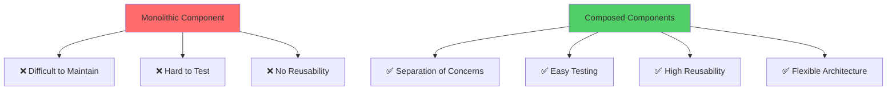

### Fundamental Composition: The Children Prop

```jsx
// Generic Container Component
const Card = ({ children, title, footer }) => {
  return (
    <div className="card">
      {title && <div className="card-header">{title}</div>}
      <div className="card-body">
        {children}
      </div>
      {footer && <div className="card-footer">{footer}</div>}
    </div>
  );
};

// Composition Examples
const UserProfile = () => {
  return (
    <Card 
      title="User Information"
      footer={<button>Edit Profile</button>}
    >
      <h2>Marco Rossi</h2>
      <p>Email: marco@example.com</p>
      <p>Location: Milano, Italia</p>
    </Card>
  );
};

const ProductCard = () => {
  return (
    <Card title="Product Details">
      
      <h3>Premium Widget</h3>
      <p>Price: €99.99</p>
      <button>Add to Cart</button>
    </Card>
  );
};
```

### Specialized Slot-Based Composition

```jsx
const Layout = ({ header, sidebar, content, footer }) => {
  return (
    <div className="layout">
      <header className="layout-header">{header}</header>
      <div className="layout-main">
        <aside className="layout-sidebar">{sidebar}</aside>
        <main className="layout-content">{content}</main>
      </div>
      <footer className="layout-footer">{footer}</footer>
    </div>
  );
};

// Usage with specific slots
const App = () => {
  return (
    <Layout
      header={<Navigation />}
      sidebar={<Sidebar />}
      content={<MainContent />}
      footer={<Footer />}
    />
  );
};
```

### Component Composition Hierarchy

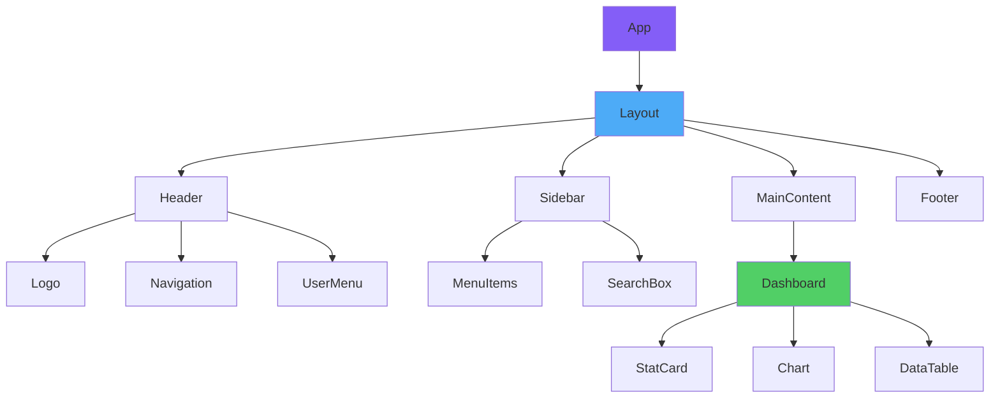

### Reusable Component Patterns

```jsx
// Generic Button Component with Variants
const Button = ({ 
  variant = 'primary', 
  size = 'medium',
  disabled = false,
  loading = false,
  icon,
  children,
  onClick,
  ...rest 
}) => {
  const classNames = `btn btn-${variant} btn-${size} ${disabled ? 'disabled' : ''}`;
  
  return (
    <button 
      className={classNames}
      disabled={disabled || loading}
      onClick={onClick}
      {...rest}
    >
      {loading && <Spinner size="small" />}
      {icon && <span className="btn-icon">{icon}</span>}
      {children}
    </button>
  );
};

// Multiple Variant Usages
const ButtonShowcase = () => {
  return (
    <div>
      <Button variant="primary">Primary Button</Button>
      <Button variant="secondary">Secondary Button</Button>
      <Button variant="danger" icon={<TrashIcon />}>Delete</Button>
      <Button variant="success" loading>Saving...</Button>
      <Button variant="outline" size="small">Small Button</Button>
      <Button variant="link" size="large">Large Link</Button>
    </div>
  );
};
```

### Polymorphic Component Pattern

```jsx
// Component that can render as different elements
const Text = ({ 
  as: Component = 'span', 
  variant = 'body',
  children,
  ...props 
}) => {
  const classNames = `text text-${variant}`;
  
  return (
    <Component className={classNames} {...props}>
      {children}
    </Component>
  );
};

// Usage: Same component, different rendered elements
const TextExamples = () => {
  return (
    <>
      <Text as="h1" variant="heading">Main Title</Text>
      <Text as="h2" variant="subheading">Subtitle</Text>
      <Text as="p" variant="body">Paragraph text</Text>
      <Text as="span" variant="caption">Caption text</Text>
      <Text as="label" variant="label">Form label</Text>
    </>
  );
};
```

### Composition with Render Functions

```jsx
const List = ({ items, renderItem, renderEmpty }) => {
  if (items.length === 0) {
    return renderEmpty ? renderEmpty() : <p>No items</p>;
  }
  
  return (
    <ul className="list">
      {items.map((item, index) => (
        <li key={item.id || index}>
          {renderItem(item, index)}
        </li>
      ))}
    </ul>
  );
};

// Usage with custom render functions
const UserList = () => {
  const users = [
    { id: 1, name: 'Marco', role: 'Admin' },
    { id: 2, name: 'Giulia', role: 'User' }
  ];
  
  return (
    <List
      items={users}
      renderItem={(user) => (
        <div>
          <strong>{user.name}</strong> - {user.role}
        </div>
      )}
      renderEmpty={() => (
        <div className="empty-state">
          <p>No users found</p>
          <button>Add User</button>
        </div>
      )}
    />
  );
};
```

### Angular Directives vs React Composition

```
Angular                          React
───────                         ─────

<ng-content select=             const Component = ({ 
  "[slot='header']">              header, 
</ng-content>                     content 
                                }) => (
<ng-container *ngIf=              <>
  "condition">                      {header}
</ng-container>                     {content}
                                  </>
Structural Directives            );

<div *ngTemplateOutlet=         {renderFunction()}
  "template">
</div>                          {children}

Directive Composition           Component Composition
Template References             Prop Functions
```

---

## 2. Prop Drilling: Problem and Solutions

### Understanding Prop Drilling

**Prop drilling** occurs when data must traverse multiple component layers to reach deeply nested components, creating maintenance burdens and coupling between unrelated components.

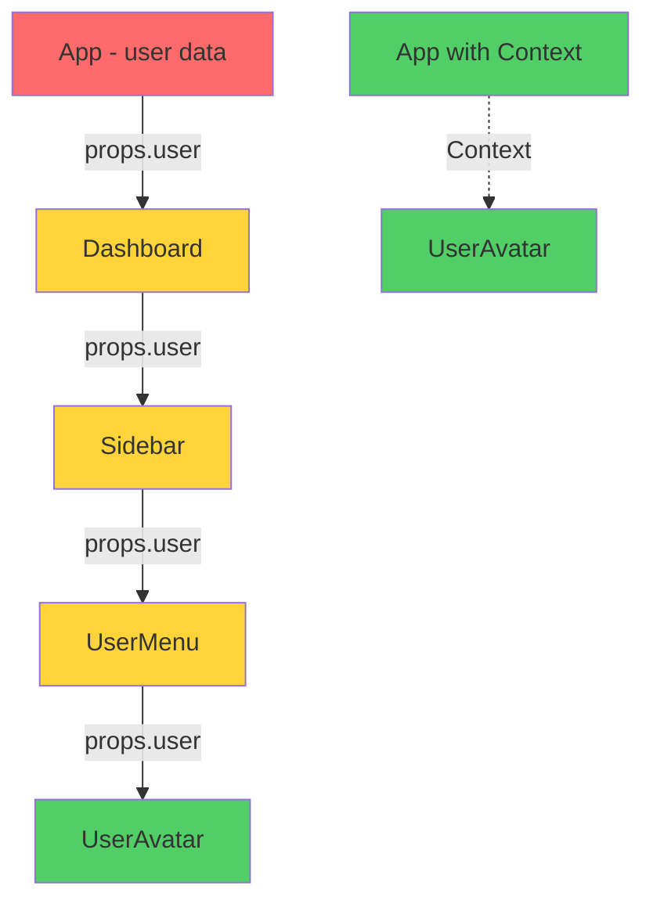

### Prop Drilling Demonstration

```jsx
// ❌ PROBLEM: Excessive prop drilling
const App = () => {
  const [user, setUser] = useState({ name: 'Marco', theme: 'dark' });
  
  return <Dashboard user={user} setUser={setUser} />;
};

const Dashboard = ({ user, setUser }) => {
  // Dashboard doesn't use user, just passes it down
  return (
    <div>
      <Sidebar user={user} setUser={setUser} />
      <MainContent />
    </div>
  );
};

const Sidebar = ({ user, setUser }) => {
  // Sidebar doesn't use user, just passes it down
  return (
    <aside>
      <Navigation user={user} />
      <UserSection user={user} setUser={setUser} />
    </aside>
  );
};

const UserSection = ({ user, setUser }) => {
  // Finally used here!
  return (
    <div>
      <UserAvatar user={user} />
      <UserSettings user={user} setUser={setUser} />
    </div>
  );
};
```

### Solution 1: Context API

```jsx
// ✅ SOLUTION: Context eliminates prop drilling
import { createContext, useContext, useState } from 'react';

const UserContext = createContext();

// Provider at top level
const UserProvider = ({ children }) => {
  const [user, setUser] = useState({ name: 'Marco', theme: 'dark' });
  
  const value = {
    user,
    setUser,
    updateTheme: (theme) => setUser(prev => ({ ...prev, theme })),
    updateName: (name) => setUser(prev => ({ ...prev, name }))
  };
  
  return (
    <UserContext.Provider value={value}>
      {children}
    </UserContext.Provider>
  );
};

// Custom hook for consumption
const useUser = () => {
  const context = useContext(UserContext);
  if (!context) {
    throw new Error('useUser must be used within UserProvider');
  }
  return context;
};

// App structure - no props needed
const App = () => {
  return (
    <UserProvider>
      <Dashboard />
    </UserProvider>
  );
};

const Dashboard = () => {
  // No user props needed
  return (
    <div>
      <Sidebar />
      <MainContent />
    </div>
  );
};

const Sidebar = () => {
  // No user props needed
  return (
    <aside>
      <Navigation />
      <UserSection />
    </aside>
  );
};

const UserSection = () => {
  // Access user directly from context
  const { user, updateTheme } = useUser();
  
  return (
    <div>
      <UserAvatar user={user} />
      <button onClick={() => updateTheme('light')}>
        Switch Theme
      </button>
    </div>
  );
};
```

### Solution 2: Component Composition

```jsx
// ✅ SOLUTION: Composition with children
const App = () => {
  const [user, setUser] = useState({ name: 'Marco' });
  
  return (
    <Dashboard>
      <Sidebar>
        <Navigation />
        {/* User components receive user directly */}
        <UserSection user={user} setUser={setUser} />
      </Sidebar>
      <MainContent />
    </Dashboard>
  );
};

// Dashboard and Sidebar don't need to know about user
const Dashboard = ({ children }) => {
  return <div className="dashboard">{children}</div>;
};

const Sidebar = ({ children }) => {
  return <aside className="sidebar">{children}</aside>;
};
```

### Solution 3: State Management Libraries

```jsx
// ✅ SOLUTION: External state management (e.g., Zustand)
import create from 'zustand';

const useUserStore = create((set) => ({
  user: { name: 'Marco', theme: 'dark' },
  setUser: (user) => set({ user }),
  updateTheme: (theme) => set((state) => ({
    user: { ...state.user, theme }
  }))
}));

// Any component can access without props
const UserAvatar = () => {
  const user = useUserStore((state) => state.user);
  return ;
};

const ThemeToggle = () => {
  const { user, updateTheme } = useUserStore();
  return (
    <button onClick={() => updateTheme(
      user.theme === 'dark' ? 'light' : 'dark'
    )}>
      Toggle Theme
    </button>
  );
};
```

### Comparison: Prop Drilling Solutions

```
┌────────────────────────────────────────────────┐
│         Solution Comparison Matrix             │
├────────────────────────────────────────────────┤
│                                                │
│  Context API                                   │
│  ✅ Built-in React solution                    │
│  ✅ No external dependencies                   │
│  ⚠️  Can cause unnecessary re-renders          │
│  ⚠️  Requires provider wrapping                │
│                                                │
│  Component Composition                         │
│  ✅ Most flexible                              │
│  ✅ Best performance                           │
│  ⚠️  Requires architectural planning           │
│                                                │
│  State Management (Redux/Zustand)              │
│  ✅ Scalable for large apps                    │
│  ✅ DevTools and middleware                    │
│  ⚠️  Additional learning curve                 │
│  ⚠️  External dependency                       │
│                                                │
└────────────────────────────────────────────────┘
```

### When to Use Each Solution

```jsx
// Use CONTEXT when:
// - Truly global data (theme, auth, language)
// - Data needed by many components at different levels
// - Data changes infrequently

// Use COMPOSITION when:
// - Layout and structure are primary concerns
// - Parent-child relationship is natural
// - Maximum flexibility needed

// Use STATE MANAGEMENT when:
// - Large-scale application
// - Complex state interactions
// - Need for time-travel debugging
// - Multiple independent state slices
```

---

## 3. State Elevation Strategies

### Lifting State Up: Theoretical Foundation

**State elevation** refers to relocating state from child components to the nearest common ancestor, facilitating data sharing and synchronization across sibling components.

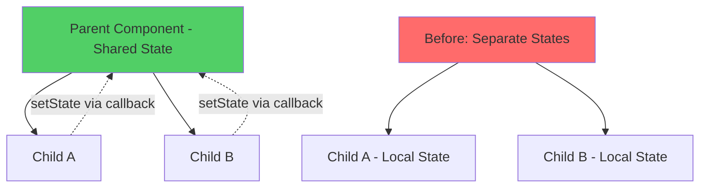

### Problem: Uncoordinated State

```jsx
// ❌ PROBLEM: Independent states, no synchronization
const TemperatureInput = ({ scale }) => {
  const [temperature, setTemperature] = useState('');
  
  return (
    <div>
      <label>Temperature in {scale}:</label>
      <input
        value={temperature}
        onChange={(e) => setTemperature(e.target.value)}
      />
    </div>
  );
};

const Calculator = () => {
  return (
    <div>
      <TemperatureInput scale="Celsius" />
      <TemperatureInput scale="Fahrenheit" />
      {/* These inputs are not synchronized! */}
    </div>
  );
};
```

### Solution: Lifted State

```jsx
// ✅ SOLUTION: State lifted to parent
const TemperatureInput = ({ scale, temperature, onTemperatureChange }) => {
  return (
    <div>
      <label>Temperature in {scale}:</label>
      <input
        value={temperature}
        onChange={(e) => onTemperatureChange(e.target.value)}
      />
    </div>
  );
};

const Calculator = () => {
  const [temperature, setTemperature] = useState('');
  const [scale, setScale] = useState('celsius');
  
  const handleCelsiusChange = (temp) => {
    setScale('celsius');
    setTemperature(temp);
  };
  
  const handleFahrenheitChange = (temp) => {
    setScale('fahrenheit');
    setTemperature(temp);
  };
  
  const celsius = scale === 'fahrenheit' 
    ? ((parseFloat(temperature) - 32) * 5/9).toFixed(2)
    : temperature;
    
  const fahrenheit = scale === 'celsius'
    ? (parseFloat(temperature) * 9/5 + 32).toFixed(2)
    : temperature;
  
  return (
    <div>
      <TemperatureInput
        scale="Celsius"
        temperature={celsius}
        onTemperatureChange={handleCelsiusChange}
      />
      <TemperatureInput
        scale="Fahrenheit"
        temperature={fahrenheit}
        onTemperatureChange={handleFahrenheitChange}
      />
      <BoilingVerdict celsius={parseFloat(celsius)} />
    </div>
  );
};
```

### State Elevation Decision Tree

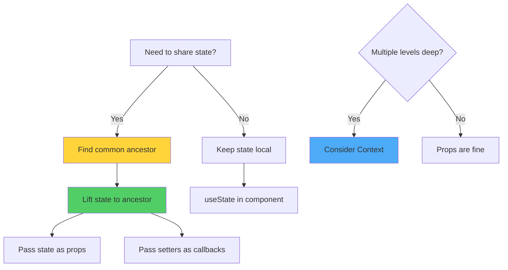

### Complex Example: Shopping Cart

```jsx
const ShoppingCart = () => {
  const [cartItems, setCartItems] = useState([]);
  const [selectedCategory, setSelectedCategory] = useState('all');
  
  const addToCart = (product) => {
    setCartItems(prev => {
      const existing = prev.find(item => item.id === product.id);
      if (existing) {
        return prev.map(item =>
          item.id === product.id
            ? { ...item, quantity: item.quantity + 1 }
            : item
        );
      }
      return [...prev, { ...product, quantity: 1 }];
    });
  };
  
  const removeFromCart = (productId) => {
    setCartItems(prev => prev.filter(item => item.id !== productId));
  };
  
  const updateQuantity = (productId, quantity) => {
    if (quantity === 0) {
      removeFromCart(productId);
      return;
    }
    setCartItems(prev =>
      prev.map(item =>
        item.id === productId ? { ...item, quantity } : item
      )
    );
  };
  
  const totalPrice = cartItems.reduce(
    (sum, item) => sum + item.price * item.quantity,
    0
  );
  
  const totalItems = cartItems.reduce(
    (sum, item) => sum + item.quantity,
    0
  );
  
  return (
    <div className="shopping-cart">
      <Header cartItemCount={totalItems} />
      
      <div className="main-content">
        <Sidebar
          selectedCategory={selectedCategory}
          onCategoryChange={setSelectedCategory}
        />
        
        <ProductList
          category={selectedCategory}
          onAddToCart={addToCart}
        />
        
        <CartSummary
          items={cartItems}
          totalPrice={totalPrice}
          onUpdateQuantity={updateQuantity}
          onRemoveItem={removeFromCart}
        />
      </div>
    </div>
  );
};

// Child components receive data and callbacks
const Header = ({ cartItemCount }) => {
  return (
    <header>
      <h1>E-Commerce</h1>
      <div className="cart-icon">
        🛒 <span className="badge">{cartItemCount}</span>
      </div>
    </header>
  );
};

const ProductList = ({ category, onAddToCart }) => {
  const products = useProducts(category);
  
  return (
    <div className="product-list">
      {products.map(product => (
        <ProductCard
          key={product.id}
          product={product}
          onAddToCart={onAddToCart}
        />
      ))}
    </div>
  );
};

const CartSummary = ({ items, totalPrice, onUpdateQuantity, onRemoveItem }) => {
  return (
    <div className="cart-summary">
      <h3>Your Cart</h3>
      {items.map(item => (
        <CartItem
          key={item.id}
          item={item}
          onUpdateQuantity={onUpdateQuantity}
          onRemove={onRemoveItem}
        />
      ))}
      <div className="total">
        Total: €{totalPrice.toFixed(2)}
      </div>
      <button className="checkout-btn">Checkout</button>
    </div>
  );
};
```

### State Colocation Principle

```jsx
// ✅ GOOD: Keep state as close as possible to where it's used
const ProductCard = ({ product, onAddToCart }) => {
  // This state only affects this card
  const [showDetails, setShowDetails] = useState(false);
  const [quantity, setQuantity] = useState(1);
  
  const handleAddToCart = () => {
    onAddToCart({ ...product, quantity });
    setQuantity(1); // Reset after adding
  };
  
  return (
    <div className="product-card">
      
      <h3>{product.name}</h3>
      <p>€{product.price}</p>
      
      <button onClick={() => setShowDetails(!showDetails)}>
        {showDetails ? 'Hide' : 'Show'} Details
      </button>
      
      {showDetails && (
        <div className="details">
          <p>{product.description}</p>
        </div>
      )}
      
      <input
        type="number"
        value={quantity}
        onChange={(e) => setQuantity(parseInt(e.target.value))}
        min="1"
      />
      <button onClick={handleAddToCart}>Add to Cart</button>
    </div>
  );
};
```

### Angular Parent-Child Communication vs React

```
Angular                          React
───────                         ─────

// Parent to Child                // Parent to Child
@Input() data: any;              <Child data={data} />

// Child to Parent                // Child to Parent
@Output() event =                <Child onChange={handleChange} />
  new EventEmitter();

// Two-way binding               // Controlled component pattern
[(ngModel)]="value"              value={value} 
                                 onChange={(e) => setValue(e)}

// Service for sharing           // Lifted state or Context
Injectable service               const [state, setState] = useState()
                                 <Child state={state} 
                                   setState={setState} />
```

---

## 4. Component Architecture and Organization

### Architectural Principles

Effective component architecture adheres to **SOLID principles**, emphasizing single responsibility, interface segregation, and dependency inversion for maintainable, scalable codebases.

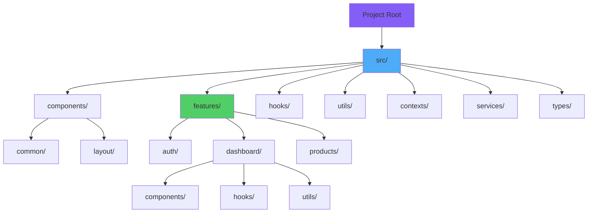

### Recommended Folder Structure

```
project/
├── src/
│   ├── components/           # Shared/common components
│   │   ├── common/
│   │   │   ├── Button/
│   │   │   │   ├── Button.jsx
│   │   │   │   ├── Button.test.jsx
│   │   │   │   ├── Button.module.css
│   │   │   │   └── index.js
│   │   │   ├── Input/
│   │   │   └── Modal/
│   │   └── layout/
│   │       ├── Header/
│   │       ├── Footer/
│   │       └── Sidebar/
│   │
│   ├── features/             # Feature-based modules
│   │   ├── auth/
│   │   │   ├── components/
│   │   │   │   ├── LoginForm/
│   │   │   │   └── RegisterForm/
│   │   │   ├── hooks/
│   │   │   │   └── useAuth.js
│   │   │   ├── services/
│   │   │   │   └── authService.js
│   │   │   └── contexts/
│   │   │       └── AuthContext.jsx
│   │   │
│   │   ├── products/
│   │   │   ├── components/
│   │   │   │   ├── ProductList/
│   │   │   │   ├── ProductCard/
│   │   │   │   └── ProductDetails/
│   │   │   ├── hooks/
│   │   │   │   ├── useProducts.js
│   │   │   │   └── useProductFilters.js
│   │   │   └── services/
│   │   │       └── productService.js
│   │   │
│   │   └── dashboard/
│   │
│   ├── hooks/                # Global custom hooks
│   │   ├── useLocalStorage.js
│   │   ├── useDebounce.js
│   │   └── useWindowSize.js
│   │
│   ├── contexts/             # Global contexts
│   │   ├── ThemeContext.jsx
│   │   └── UserContext.jsx
│   │
│   ├── services/             # API and external services
│   │   ├── api.js
│   │   └── analytics.js
│   │
│   ├── utils/                # Utility functions
│   │   ├── formatters.js
│   │   ├── validators.js
│   │   └── constants.js
│   │
│   ├── types/                # TypeScript types
│   │   └── index.ts
│   │
│   ├── App.jsx
│   └── main.jsx
│
└── package.json
```

### Component File Organization

```jsx
// ✅ RECOMMENDED: Separate file structure
// components/common/Button/Button.jsx
import React from 'react';
import PropTypes from 'prop-types';
import styles from './Button.module.css';

export const Button = ({ 
  variant = 'primary',
  size = 'medium',
  children,
  ...props 
}) => {
  return (
    <button 
      className={`${styles.button} ${styles[variant]} ${styles[size]}`}
      {...props}
    >
      {children}
    </button>
  );
};

Button.propTypes = {
  variant: PropTypes.oneOf(['primary', 'secondary', 'danger']),
  size: PropTypes.oneOf(['small', 'medium', 'large']),
  children: PropTypes.node.isRequired,
  onClick: PropTypes.func
};

Button.defaultProps = {
  variant: 'primary',
  size: 'medium'
};

// components/common/Button/index.js
export { Button } from './Button';
export { default as Button } from './Button'; // For default imports
```

### Naming Conventions

```
┌────────────────────────────────────────────────┐
│          Component Naming Standards            │
├────────────────────────────────────────────────┤
│                                                │
│  Component Files:  PascalCase                  │
│  ✅ Button.jsx, UserProfile.jsx                │
│  ❌ button.jsx, userProfile.jsx                │
│                                                │
│  Hook Files:  camelCase with 'use' prefix      │
│  ✅ useAuth.js, useLocalStorage.js             │
│  ❌ UseAuth.js, auth.js                        │
│                                                │
│  Utility Files:  camelCase                     │
│  ✅ formatDate.js, apiHelpers.js               │
│  ❌ FormatDate.js, API_helpers.js              │
│                                                │
│  Context Files:  PascalCase with 'Context'     │
│  ✅ AuthContext.jsx, ThemeContext.jsx          │
│  ❌ auth.jsx, theme-context.jsx                │
│                                                │
│  Constants:  UPPER_SNAKE_CASE                  │
│  ✅ API_BASE_URL, MAX_RETRY_COUNT              │
│  ❌ apiBaseUrl, maxRetryCount                  │
│                                                │
└────────────────────────────────────────────────┘
```

### Component Categories

```jsx
// 1. UI Components (Presentational)
// Location: src/components/common/
const Button = ({ children, onClick, variant }) => {
  return (
    <button className={`btn btn-${variant}`} onClick={onClick}>
      {children}
    </button>
  );
};

// 2. Feature Components
// Location: src/features/[feature]/components/
const ProductList = () => {
  const { products, loading } = useProducts();
  
  if (loading) return <LoadingSpinner />;
  
  return (
    <div className="product-list">
      {products.map(product => (
        <ProductCard key={product.id} product={product} />
      ))}
    </div>
  );
};

// 3. Layout Components
// Location: src/components/layout/
const DashboardLayout = ({ children }) => {
  return (
    <div className="dashboard-layout">
      <Header />
      <Sidebar />
      <main className="content">{children}</main>
      <Footer />
    </div>
  );
};

// 4. Page Components
// Location: src/pages/ or src/features/[feature]/pages/
const ProductsPage = () => {
  return (
    <DashboardLayout>
      <ProductList />
      <ProductFilters />
    </DashboardLayout>
  );
};

// 5. Container Components (with logic)
// Location: src/features/[feature]/containers/
const ProductListContainer = () => {
  const [filters, setFilters] = useState({});
  const { products, loading } = useProducts(filters);
  
  return (
    <ProductListPresentation
      products={products}
      loading={loading}
      filters={filters}
      onFilterChange={setFilters}
    />
  );
};
```

### Barrel Exports Pattern

```jsx
// components/common/index.js
export { Button } from './Button';
export { Input } from './Input';
export { Modal } from './Modal';
export { Card } from './Card';

// Usage: Clean imports
import { Button, Input, Modal } from '@/components/common';

// Instead of:
import { Button } from '@/components/common/Button/Button';
import { Input } from '@/components/common/Input/Input';
import { Modal } from '@/components/common/Modal/Modal';
```

### Path Aliases Configuration

```javascript
// vite.config.js
import { defineConfig } from 'vite';
import react from '@vitejs/plugin-react';
import path from 'path';

export default defineConfig({
  plugins: [react()],
  resolve: {
    alias: {
      '@': path.resolve(__dirname, './src'),
      '@components': path.resolve(__dirname, './src/components'),
      '@features': path.resolve(__dirname, './src/features'),
      '@hooks': path.resolve(__dirname, './src/hooks'),
      '@utils': path.resolve(__dirname, './src/utils')
    }
  }
});

// Usage in components
import { Button } from '@components/common';
import { useAuth } from '@hooks/useAuth';
import { formatDate } from '@utils/formatters';
```

---

## 5. Presentational vs Container Components

### Architectural Dichotomy

This pattern separates **concerns of presentation** (how things look) from **concerns of behavior** (how things work), promoting reusability and testability.

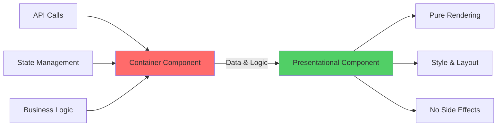

### Presentational Component Characteristics

```
┌────────────────────────────────────────────────┐
│       Presentational Components                │
├────────────────────────────────────────────────┤
│  • Concerned with appearance                   │
│  • Receive data via props                      │
│  • Rarely have internal state                  │
│  • Written as functional components            │
│  • Examples: Button, Card, List, Avatar        │
└────────────────────────────────────────────────┘
```

```jsx
// ✅ Presentational Component Example
const UserCard = ({ user, onEdit, onDelete }) => {
  return (
    <div className="user-card">
      
      <h3>{user.name}</h3>
      <p>{user.email}</p>
      <p className="role">{user.role}</p>
      
      <div className="actions">
        <button onClick={() => onEdit(user.id)}>Edit</button>
        <button onClick={() => onDelete(user.id)}>Delete</button>
      </div>
    </div>
  );
};

// Pure presentation - no business logic
const StatCard = ({ title, value, trend, icon }) => {
  const trendClass = trend > 0 ? 'positive' : 'negative';
  
  return (
    <div className="stat-card">
      <div className="icon">{icon}</div>
      <h4>{title}</h4>
      <p className="value">{value}</p>
      <span className={`trend ${trendClass}`}>
        {trend > 0 ? '↑' : '↓'} {Math.abs(trend)}%
      </span>
    </div>
  );
};
```

### Container Component Characteristics

```
┌────────────────────────────────────────────────┐
│         Container Components                   │
├────────────────────────────────────────────────┤
│  • Concerned with behavior                     │
│  • Provide data to presentational components   │
│  • Contain business logic                      │
│  • Make API calls                              │
│  • Manage state                                │
│  • Examples: UserListContainer, Dashboard      │
└────────────────────────────────────────────────┘
```

```jsx
// ✅ Container Component Example
const UserListContainer = () => {
  const [users, setUsers] = useState([]);
  const [loading, setLoading] = useState(true);
  const [error, setError] = useState(null);
  const [filters, setFilters] = useState({ role: 'all', search: '' });
  
  useEffect(() => {
    fetchUsers();
  }, [filters]);
  
  const fetchUsers = async () => {
    try {
      setLoading(true);
      const response = await fetch('/api/users', {
        method: 'POST',
        body: JSON.stringify(filters)
      });
      const data = await response.json();
      setUsers(data);
    } catch (err) {
      setError(err.message);
    } finally {
      setLoading(false);
    }
  };
  
  const handleEdit = async (userId) => {
    // Business logic for editing
    const user = users.find(u => u.id === userId);
    // Open modal, navigate, etc.
  };
  
  const handleDelete = async (userId) => {
    // Business logic for deletion
    if (window.confirm('Are you sure?')) {
      await fetch(`/api/users/${userId}`, { method: 'DELETE' });
      setUsers(users.filter(u => u.id !== userId));
    }
  };
  
  const handleFilterChange = (newFilters) => {
    setFilters(prev => ({ ...prev, ...newFilters }));
  };
  
  // Render presentational component
  return (
    <UserListPresentation
      users={users}
      loading={loading}
      error={error}
      filters={filters}
      onEdit={handleEdit}
      onDelete={handleDelete}
      onFilterChange={handleFilterChange}
    />
  );
};

// Presentational Component
const UserListPresentation = ({
  users,
  loading,
  error,
  filters,
  onEdit,
  onDelete,
  onFilterChange
}) => {
  if (loading) return <LoadingSpinner />;
  if (error) return <ErrorMessage message={error} />;
  
  return (
    <div className="user-list">
      <UserFilters filters={filters} onChange={onFilterChange} />
      
      <div className="users">
        {users.map(user => (
          <UserCard
            key={user.id}
            user={user}
            onEdit={onEdit}
            onDelete={onDelete}
          />
        ))}
      </div>
    </div>
  );
};
```

### Complete Pattern Example

```jsx
// === CONTAINER COMPONENT ===
const DashboardContainer = () => {
  const { user } = useAuth();
  const [stats, setStats] = useState(null);
  const [recentActivity, setRecentActivity] = useState([]);
  const [notifications, setNotifications] = useState([]);
  
  useEffect(() => {
    loadDashboardData();
  }, [user.id]);
  
  const loadDashboardData = async () => {
    const [statsData, activityData, notificationsData] = await Promise.all([
      fetchStats(user.id),
      fetchRecentActivity(user.id),
      fetchNotifications(user.id)
    ]);
    
    setStats(statsData);
    setRecentActivity(activityData);
    setNotifications(notificationsData);
  };
  
  const handleNotificationDismiss = async (id) => {
    await dismissNotification(id);
    setNotifications(notifications.filter(n => n.id !== id));
  };
  
  return (
    <DashboardPresentation
      user={user}
      stats={stats}
      recentActivity={recentActivity}
      notifications={notifications}
      onNotificationDismiss={handleNotificationDismiss}
    />
  );
};

// === PRESENTATIONAL COMPONENT ===
const DashboardPresentation = ({
  user,
  stats,
  recentActivity,
  notifications,
  onNotificationDismiss
}) => {
  return (
    <div className="dashboard">
      <WelcomeBanner user={user} />
      
      {stats && (
        <div className="stats-grid">
          <StatCard
            title="Total Sales"
            value={stats.totalSales}
            trend={stats.salesTrend}
            icon="💰"
          />
          <StatCard
            title="New Users"
            value={stats.newUsers}
            trend={stats.usersTrend}
            icon="👥"
          />
          <StatCard
            title="Revenue"
            value={stats.revenue}
            trend={stats.revenueTrend}
            icon="📈"
          />
        </div>
      )}
      
      <div className="dashboard-grid">
        <section className="recent-activity">
          <h2>Recent Activity</h2>
          <ActivityList items={recentActivity} />
        </section>
        
        <section className="notifications">
          <h2>Notifications</h2>
          <NotificationList
            items={notifications}
            onDismiss={onNotificationDismiss}
          />
        </section>
      </div>
    </div>
  );
};
```

### Modern Alternative: Custom Hooks

```jsx
// Modern approach: Extract logic into custom hooks
const useDashboard = (userId) => {
  const [stats, setStats] = useState(null);
  const [recentActivity, setRecentActivity] = useState([]);
  const [notifications, setNotifications] = useState([]);
  const [loading, setLoading] = useState(true);
  
  useEffect(() => {
    loadDashboardData();
  }, [userId]);
  
  const loadDashboardData = async () => {
    setLoading(true);
    const [statsData, activityData, notificationsData] = await Promise.all([
      fetchStats(userId),
      fetchRecentActivity(userId),
      fetchNotifications(userId)
    ]);
    
    setStats(statsData);
    setRecentActivity(activityData);
    setNotifications(notificationsData);
    setLoading(false);
  };
  
  const dismissNotification = (id) => {
    setNotifications(notifications.filter(n => n.id !== id));
  };
  
  return {
    stats,
    recentActivity,
    notifications,
    loading,
    dismissNotification
  };
};

// Component combines hook with presentation
const Dashboard = () => {
  const { user } = useAuth();
  const {
    stats,
    recentActivity,
    notifications,
    loading,
    dismissNotification
  } = useDashboard(user.id);
  
  if (loading) return <LoadingSpinner />;
  
  return (
    <div className="dashboard">
      {/* Presentation markup */}
    </div>
  );
};
```

---

## 6. Higher-Order Components (HOCs)

### Conceptual Foundation

**Higher-Order Components** are functions that accept a component and return an enhanced component with additional functionality, implementing **cross-cutting concerns** through composition rather than inheritance.

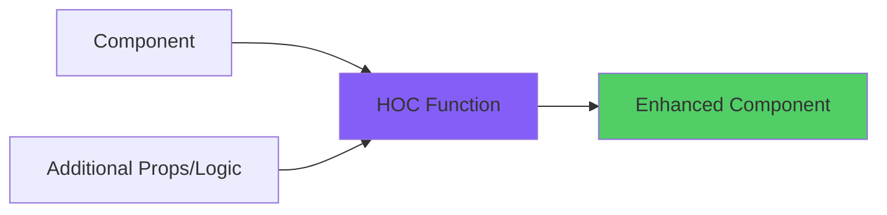

### Basic HOC Pattern

```jsx
// HOC that adds logging functionality
const withLogging = (WrappedComponent) => {
  return (props) => {
    useEffect(() => {
      console.log(`${WrappedComponent.name} mounted`);
      return () => console.log(`${WrappedComponent.name} unmounted`);
    }, []);
    
    useEffect(() => {
      console.log(`${WrappedComponent.name} props:`, props);
    }, [props]);
    
    return <WrappedComponent {...props} />;
  };
};

// Usage
const UserProfile = ({ name, email }) => {
  return (
    <div>
      <h2>{name}</h2>
      <p>{email}</p>
    </div>
  );
};

const UserProfileWithLogging = withLogging(UserProfile);

// Now UserProfileWithLogging logs mount/unmount and prop changes
```

### Authentication HOC

```jsx
const withAuth = (WrappedComponent) => {
  return (props) => {
    const { user, loading } = useAuth();
    const navigate = useNavigate();
    
    useEffect(() => {
      if (!loading && !user) {
        navigate('/login');
      }
    }, [user, loading, navigate]);
    
    if (loading) {
      return <LoadingSpinner />;
    }
    
    if (!user) {
      return null;
    }
    
    return <WrappedComponent {...props} user={user} />;
  };
};

// Usage: Protect routes
const Dashboard = ({ user }) => {
  return <h1>Benvenuto, {user.name}!</h1>;
};

const ProtectedDashboard = withAuth(Dashboard);
```

### Data Fetching HOC

```jsx
const withData = (WrappedComponent, fetchFn) => {
  return (props) => {
    const [data, setData] = useState(null);
    const [loading, setLoading] = useState(true);
    const [error, setError] = useState(null);
    
    useEffect(() => {
      let isCancelled = false;
      
      const loadData = async () => {
        try {
          setLoading(true);
          const result = await fetchFn(props);
          if (!isCancelled) {
            setData(result);
          }
        } catch (err) {
          if (!isCancelled) {
            setError(err.message);
          }
        } finally {
          if (!isCancelled) {
            setLoading(false);
          }
        }
      };
      
      loadData();
      
      return () => {
        isCancelled = true;
      };
    }, [props.id]); // Re-fetch when ID changes
    
    return (
      <WrappedComponent
        {...props}
        data={data}
        loading={loading}
        error={error}
      />
    );
  };
};

// Usage
const UserDetails = ({ data, loading, error }) => {
  if (loading) return <div>Loading...</div>;
  if (error) return <div>Error: {error}</div>;
  
  return (
    <div>
      <h2>{data.name}</h2>
      <p>{data.email}</p>
    </div>
  );
};

const fetchUser = ({ id }) => fetch(`/api/users/${id}`).then(r => r.json());
const UserDetailsWithData = withData(UserDetails, fetchUser);

// Render: <UserDetailsWithData id={123} />
```

### Composing Multiple HOCs

```jsx
// Multiple HOCs composition
const EnhancedComponent = compose(
  withAuth,
  withLogging,
  withData(fetchUserData)
)(BaseComponent);

// Or using functional composition
const EnhancedComponent = withAuth(
  withLogging(
    withData(BaseComponent, fetchUserData)
  )
);

// Better readability with helper
const compose = (...hocs) => (Component) => {
  return hocs.reduceRight((acc, hoc) => hoc(acc), Component);
};
```

### HOC Best Practices

```jsx
// ✅ GOOD: Pass through unrelated props
const withAuth = (WrappedComponent) => {
  return (props) => {
    const { user } = useAuth();
    
    // Pass all props to wrapped component
    return <WrappedComponent {...props} user={user} />;
  };
};

// ✅ GOOD: Display name for debugging
const withAuth = (WrappedComponent) => {
  const WithAuth = (props) => {
    // ... logic
    return <WrappedComponent {...props} />;
  };
  
  WithAuth.displayName = `withAuth(${getDisplayName(WrappedComponent)})`;
  
  return WithAuth;
};

function getDisplayName(WrappedComponent) {
  return WrappedComponent.displayName || WrappedComponent.name || 'Component';
}

// ❌ BAD: Don't mutate the original component
const withAuth = (WrappedComponent) => {
  WrappedComponent.prototype.isAuthenticated = true; // DON'T DO THIS
  return WrappedComponent;
};

// ❌ BAD: Don't use HOCs inside render
const MyComponent = () => {
  // This creates a new component on every render!
  const EnhancedComponent = withAuth(SomeComponent); // DON'T DO THIS
  return <EnhancedComponent />;
};
```

### HOC Limitations and Alternatives

```
┌────────────────────────────────────────────────┐
│            HOC Limitations                     │
├────────────────────────────────────────────────┤
│  ❌ Wrapper hell (multiple nested HOCs)        │
│  ❌ Props collision potential                  │
│  ❌ Static composition (not dynamic)           │
│  ❌ Ref forwarding complexity                  │
│                                                │
│         Modern Alternatives                    │
│  ✅ Custom Hooks (preferred for logic)         │
│  ✅ Render Props (for dynamic composition)     │
│  ✅ Compound Components (for related UI)       │
└────────────────────────────────────────────────┘
```

```jsx
// HOC approach (legacy)
const UserListWithData = withData(UserList, fetchUsers);

// Modern approach with hooks (preferred)
const UserList = () => {
  const { data, loading, error } = useFetchUsers();
  
  if (loading) return <LoadingSpinner />;
  if (error) return <ErrorMessage error={error} />;
  
  return <div>{/* render users */}</div>;
};
```

---

## 7. Render Props Pattern

### Pattern Definition

The **Render Props** pattern utilizes a prop whose value is a function to dynamically determine what to render, enabling runtime composition and maximum flexibility.

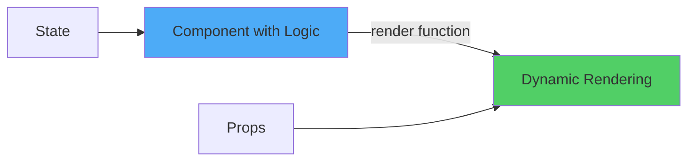

### Basic Render Props

```jsx
const Mouse = ({ render }) => {
  const [position, setPosition] = useState({ x: 0, y: 0 });
  
  useEffect(() => {
    const handleMouseMove = (event) => {
      setPosition({
        x: event.clientX,
        y: event.clientY
      });
    };
    
    window.addEventListener('mousemove', handleMouseMove);
    
    return () => {
      window.removeEventListener('mousemove', handleMouseMove);
    };
  }, []);
  
  return render(position);
};

// Usage with different render functions
const App = () => {
  return (
    <div>
      <h1>Mouse Tracker</h1>
      
      <Mouse render={({ x, y }) => (
        <p>Mouse position: {x}, {y}</p>
      )} />
      
      <Mouse render={({ x, y }) => (
        <div
          style={{
            position: 'absolute',
            left: x,
            top: y,
            width: 10,
            height: 10,
            backgroundColor: 'red',
            borderRadius: '50%',
            transform: 'translate(-50%, -50%)'
          }}
        />
      )} />
    </div>
  );
};
```

### Children as Function Pattern

```jsx
// Alternative: Use children prop as function
const DataProvider = ({ url, children }) => {
  const [data, setData] = useState(null);
  const [loading, setLoading] = useState(true);
  const [error, setError] = useState(null);
  
  useEffect(() => {
    fetch(url)
      .then(res => res.json())
      .then(data => {
        setData(data);
        setLoading(false);
      })
      .catch(err => {
        setError(err.message);
        setLoading(false);
      });
  }, [url]);
  
  return children({ data, loading, error });
};

// Usage
const UserList = () => {
  return (
    <DataProvider url="/api/users">
      {({ data, loading, error }) => {
        if (loading) return <LoadingSpinner />;
        if (error) return <ErrorMessage message={error} />;
        
        return (
          <ul>
            {data.map(user => (
              <li key={user.id}>{user.name}</li>
            ))}
          </ul>
        );
      }}
    </DataProvider>
  );
};
```

### Complex Render Props: Form Management

```jsx
const Form = ({ initialValues, onSubmit, validate, children }) => {
  const [values, setValues] = useState(initialValues);
  const [errors, setErrors] = useState({});
  const [touched, setTouched] = useState({});
  const [isSubmitting, setIsSubmitting] = useState(false);
  
  const handleChange = (name) => (event) => {
    const value = event.target.value;
    setValues(prev => ({ ...prev, [name]: value }));
    
    if (touched[name]) {
      const error = validate?.[name]?.(value);
      setErrors(prev => ({ ...prev, [name]: error }));
    }
  };
  
  const handleBlur = (name) => () => {
    setTouched(prev => ({ ...prev, [name]: true }));
    const error = validate?.[name]?.(values[name]);
    setErrors(prev => ({ ...prev, [name]: error }));
  };
  
  const handleSubmit = async (event) => {
    event.preventDefault();
    setIsSubmitting(true);
    
    try {
      await onSubmit(values);
    } finally {
      setIsSubmitting(false);
    }
  };
  
  return children({
    values,
    errors,
    touched,
    isSubmitting,
    handleChange,
    handleBlur,
    handleSubmit
  });
};

// Usage with flexible rendering
const LoginForm = () => {
  const handleSubmit = async (values) => {
    await login(values);
  };
  
  const validate = {
    email: (value) => !value ? 'Email required' : null,
    password: (value) => value.length < 8 ? 'Too short' : null
  };
  
  return (
    <Form
      initialValues={{ email: '', password: '' }}
      onSubmit={handleSubmit}
      validate={validate}
    >
      {({
        values,
        errors,
        touched,
        isSubmitting,
        handleChange,
        handleBlur,
        handleSubmit
      }) => (
        <form onSubmit={handleSubmit}>
          <div>
            <label>Email</label>
            <input
              type="email"
              value={values.email}
              onChange={handleChange('email')}
              onBlur={handleBlur('email')}
            />
            {touched.email && errors.email && (
              <span className="error">{errors.email}</span>
            )}
          </div>
          
          <div>
            <label>Password</label>
            <input
              type="password"
              value={values.password}
              onChange={handleChange('password')}
              onBlur={handleBlur('password')}
            />
            {touched.password && errors.password && (
              <span className="error">{errors.password}</span>
            )}
          </div>
          
          <button type="submit" disabled={isSubmitting}>
            {isSubmitting ? 'Logging in...' : 'Login'}
          </button>
        </form>
      )}
    </Form>
  );
};
```

### Render Props vs HOC vs Hooks

```jsx
// 1. HOC Approach
const withMousePosition = (Component) => {
  return (props) => {
    const [position, setPosition] = useState({ x: 0, y: 0 });
    // ... mouse tracking logic
    return <Component {...props} mousePosition={position} />;
  };
};
const TrackedComponent = withMousePosition(MyComponent);

// 2. Render Props Approach
<MouseTracker>
  {(position) => <MyComponent mousePosition={position} />}
</MouseTracker>

// 3. Custom Hook Approach (Modern Preferred)
const useMousePosition = () => {
  const [position, setPosition] = useState({ x: 0, y: 0 });
  // ... mouse tracking logic
  return position;
};

const MyComponent = () => {
  const position = useMousePosition();
  return <div>Mouse: {position.x}, {position.y}</div>;
};
```

### Toggle Component with Render Props

```jsx
const Toggle = ({ children, defaultOn = false }) => {
  const [on, setOn] = useState(defaultOn);
  
  const toggle = () => setOn(prev => !prev);
  const setOnValue = (value) => setOn(value);
  
  return children({
    on,
    toggle,
    setOn: setOnValue
  });
};

// Multiple different usages
const App = () => {
  return (
    <div>
      {/* Usage 1: Simple toggle */}
      <Toggle>
        {({ on, toggle }) => (
          <div>
            {on ? '🌞' : '🌙'}
            <button onClick={toggle}>Toggle Theme</button>
          </div>
        )}
      </Toggle>
      
      {/* Usage 2: Modal */}
      <Toggle>
        {({ on, toggle }) => (
          <>
            <button onClick={toggle}>Open Modal</button>
            {on && (
              <Modal onClose={toggle}>
                <h2>Modal Content</h2>
              </Modal>
            )}
          </>
        )}
      </Toggle>
      
      {/* Usage 3: Accordion */}
      <Toggle defaultOn={true}>
        {({ on, toggle }) => (
          <div className="accordion">
            <button onClick={toggle}>
              {on ? '▼' : '▶'} Accordion Title
            </button>
            {on && <div className="content">Accordion content</div>}
          </div>
        )}
      </Toggle>
    </div>
  );
};
```

---

## 8. Compound Components Pattern

### Pattern Philosophy

**Compound Components** create implicit relationships between parent and child components, enabling state sharing without explicit prop drilling, resulting in declarative, intuitive APIs.

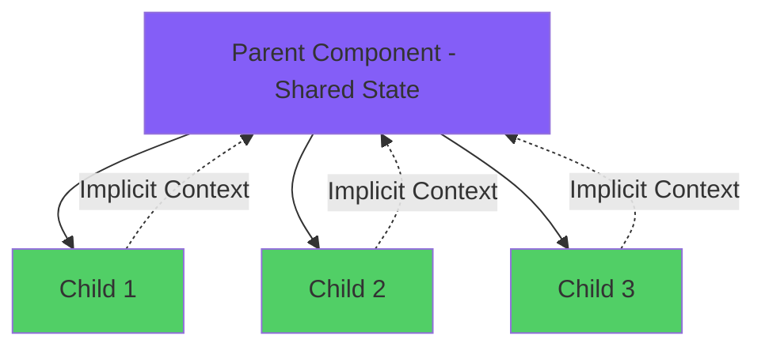

### Basic Compound Component: Tabs

```jsx
const TabsContext = createContext();

const Tabs = ({ children, defaultTab = 0 }) => {
  const [activeTab, setActiveTab] = useState(defaultTab);
  
  return (
    <TabsContext.Provider value={{ activeTab, setActiveTab }}>
      <div className="tabs">{children}</div>
    </TabsContext.Provider>
  );
};

const TabList = ({ children }) => {
  return <div className="tab-list">{children}</div>;
};

const Tab = ({ index, children }) => {
  const { activeTab, setActiveTab } = useContext(TabsContext);
  const isActive = activeTab === index;
  
  return (
    <button
      className={`tab ${isActive ? 'active' : ''}`}
      onClick={() => setActiveTab(index)}
    >
      {children}
    </button>
  );
};

const TabPanels = ({ children }) => {
  return <div className="tab-panels">{children}</div>;
};

const TabPanel = ({ index, children }) => {
  const { activeTab } = useContext(TabsContext);
  
  if (activeTab !== index) return null;
  
  return <div className="tab-panel">{children}</div>;
};

// Compose the compound component
Tabs.List = TabList;
Tabs.Tab = Tab;
Tabs.Panels = TabPanels;
Tabs.Panel = TabPanel;

// Usage - Declarative and intuitive!
const App = () => {
  return (
    <Tabs defaultTab={0}>
      <Tabs.List>
        <Tabs.Tab index={0}>Profile</Tabs.Tab>
        <Tabs.Tab index={1}>Settings</Tabs.Tab>
        <Tabs.Tab index={2}>Notifications</Tabs.Tab>
      </Tabs.List>
      
      <Tabs.Panels>
        <Tabs.Panel index={0}>
          <h2>Profile Content</h2>
          <p>Your profile information...</p>
        </Tabs.Panel>
        
        <Tabs.Panel index={1}>
          <h2>Settings Content</h2>
          <p>Your settings...</p>
        </Tabs.Panel>
        
        <Tabs.Panel index={2}>
          <h2>Notifications Content</h2>
          <p>Your notifications...</p>
        </Tabs.Panel>
      </Tabs.Panels>
    </Tabs>
  );
};
```

### Advanced Compound Component: Accordion

```jsx
const AccordionContext = createContext();

const Accordion = ({ children, allowMultiple = false }) => {
  const [openItems, setOpenItems] = useState([]);
  
  const toggle = (index) => {
    if (allowMultiple) {
      setOpenItems(prev =>
        prev.includes(index)
          ? prev.filter(i => i !== index)
          : [...prev, index]
      );
    } else {
      setOpenItems(prev =>
        prev.includes(index) ? [] : [index]
      );
    }
  };
  
  return (
    <AccordionContext.Provider value={{ openItems, toggle }}>
      <div className="accordion">{children}</div>
    </AccordionContext.Provider>
  );
};

const AccordionItem = ({ index, children }) => {
  return <div className="accordion-item">{children}</div>;
};

const AccordionHeader = ({ index, children }) => {
  const { openItems, toggle } = useContext(AccordionContext);
  const isOpen = openItems.includes(index);
  
  return (
    <button
      className="accordion-header"
      onClick={() => toggle(index)}
    >
      <span>{children}</span>
      <span className="icon">{isOpen ? '▼' : '▶'}</span>
    </button>
  );
};

const AccordionPanel = ({ index, children }) => {
  const { openItems } = useContext(AccordionContext);
  const isOpen = openItems.includes(index);
  
  return (
    <div className={`accordion-panel ${isOpen ? 'open' : 'closed'}`}>
      {isOpen && children}
    </div>
  );
};

// Compose
Accordion.Item = AccordionItem;
Accordion.Header = AccordionHeader;
Accordion.Panel = AccordionPanel;

// Usage
const FAQSection = () => {
  return (
    <Accordion allowMultiple={true}>
      <Accordion.Item index={0}>
        <Accordion.Header index={0}>
          What is React?
        </Accordion.Header>
        <Accordion.Panel index={0}>
          React is a JavaScript library for building user interfaces.
        </Accordion.Panel>
      </Accordion.Item>
      
      <Accordion.Item index={1}>
        <Accordion.Header index={1}>
          What are Hooks?
        </Accordion.Header>
        <Accordion.Panel index={1}>
          Hooks are functions that let you use state and lifecycle features.
        </Accordion.Panel>
      </Accordion.Item>
    </Accordion>
  );
};
```

### Compound Component: Dropdown Menu

```jsx
const DropdownContext = createContext();

const Dropdown = ({ children }) => {
  const [isOpen, setIsOpen] = useState(false);
  const dropdownRef = useRef(null);
  
  useEffect(() => {
    const handleClickOutside = (event) => {
      if (dropdownRef.current && !dropdownRef.current.contains(event.target)) {
        setIsOpen(false);
      }
    };
    
    document.addEventListener('mousedown', handleClickOutside);
    return () => document.removeEventListener('mousedown', handleClickOutside);
  }, []);
  
  return (
    <DropdownContext.Provider value={{ isOpen, setIsOpen }}>
      <div ref={dropdownRef} className="dropdown">
        {children}
      </div>
    </DropdownContext.Provider>
  );
};

const DropdownTrigger = ({ children }) => {
  const { isOpen, setIsOpen } = useContext(DropdownContext);
  
  return (
    <button
      className="dropdown-trigger"
      onClick={() => setIsOpen(!isOpen)}
    >
      {children}
    </button>
  );
};

const DropdownMenu = ({ children }) => {
  const { isOpen } = useContext(DropdownContext);
  
  if (!isOpen) return null;
  
  return (
    <div className="dropdown-menu">
      {children}
    </div>
  );
};

const DropdownItem = ({ onClick, children }) => {
  const { setIsOpen } = useContext(DropdownContext);
  
  const handleClick = () => {
    onClick?.();
    setIsOpen(false);
  };
  
  return (
    <button className="dropdown-item" onClick={handleClick}>
      {children}
    </button>
  );
};

// Compose
Dropdown.Trigger = DropdownTrigger;
Dropdown.Menu = DropdownMenu;
Dropdown.Item = DropdownItem;

// Usage
const UserMenu = () => {
  return (
    <Dropdown>
      <Dropdown.Trigger>
        
        <span>Marco Rossi</span>
      </Dropdown.Trigger>
      
      <Dropdown.Menu>
        <Dropdown.Item onClick={() => navigate('/profile')}>
          Profile
        </Dropdown.Item>
        <Dropdown.Item onClick={() => navigate('/settings')}>
          Settings
        </Dropdown.Item>
        <Dropdown.Item onClick={() => logout()}>
          Logout
        </Dropdown.Item>
      </Dropdown.Menu>
    </Dropdown>
  );
};
```

### Compound Component Validation

```jsx
// Ensure children are valid compound components
const validateChildren = (children, validTypes) => {
  React.Children.forEach(children, child => {
    if (!React.isValidElement(child)) return;
    
    const childType = child.type.displayName || child.type.name;
    
    if (!validTypes.includes(childType)) {
      throw new Error(
        `${childType} is not a valid child. Valid children: ${validTypes.join(', ')}`
      );
    }
  });
};

const Tabs = ({ children }) => {
  validateChildren(children, ['TabList', 'TabPanels']);
  // ... rest of implementation
};
```

---

## 9. Advanced Composition Techniques

### Slot-Based Composition

```jsx
const Card = ({ 
  header, 
  media, 
  content, 
  actions,
  className 
}) => {
  return (
    <div className={`card ${className || ''}`}>
      {header && <div className="card-header">{header}</div>}
      {media && <div className="card-media">{media}</div>}
      {content && <div className="card-content">{content}</div>}
      {actions && <div className="card-actions">{actions}</div>}
    </div>
  );
};

// Usage with named slots
const ProductCard = ({ product }) => {
  return (
    <Card
      header={
        <div className="product-header">
          <h3>{product.name}</h3>
          <span className="badge">{product.category}</span>
        </div>
      }
      media={
        
      }
      content={
        <>
          <p>{product.description}</p>
          <p className="price">€{product.price}</p>
        </>
      }
      actions={
        <>
          <button>View Details</button>
          <button>Add to Cart</button>
        </>
      }
    />
  );
};
```

### Function as Child Component (FACC)

```jsx
const Measure = ({ children }) => {
  const [dimensions, setDimensions] = useState({ width: 0, height: 0 });
  const ref = useRef(null);
  
  useEffect(() => {
    const observeTarget = ref.current;
    const resizeObserver = new ResizeObserver(entries => {
      entries.forEach(entry => {
        setDimensions({
          width: entry.contentRect.width,
          height: entry.contentRect.height
        });
      });
    });
    
    if (observeTarget) {
      resizeObserver.observe(observeTarget);
    }
    
    return () => {
      if (observeTarget) {
        resizeObserver.unobserve(observeTarget);
      }
    };
  }, []);
  
  return <div ref={ref}>{children(dimensions)}</div>;
};

// Usage
const ResponsiveComponent = () => {
  return (
    <Measure>
      {({ width, height }) => (
        <div>
          <p>Width: {width}px</p>
          <p>Height: {height}px</p>
          {width < 768 ? <MobileView /> : <DesktopView />}
        </div>
      )}
    </Measure>
  );
};
```

### Controlled vs Uncontrolled Components

```jsx
// Uncontrolled Component
const UncontrolledInput = () => {
  const inputRef = useRef();
  
  const handleSubmit = () => {
    console.log(inputRef.current.value);
  };
  
  return (
    <div>
      <input ref={inputRef} defaultValue="Initial" />
      <button onClick={handleSubmit}>Submit</button>
    </div>
  );
};

// Controlled Component
const ControlledInput = () => {
  const [value, setValue] = useState('Initial');
  
  const handleSubmit = () => {
    console.log(value);
  };
  
  return (
    <div>
      <input 
        value={value} 
        onChange={(e) => setValue(e.target.value)} 
      />
      <button onClick={handleSubmit}>Submit</button>
    </div>
  );
};

// Hybrid: Flexible Control
const FlexibleInput = ({ 
  value: controlledValue, 
  defaultValue, 
  onChange 
}) => {
  const [internalValue, setInternalValue] = useState(defaultValue || '');
  
  const isControlled = controlledValue !== undefined;
  const value = isControlled ? controlledValue : internalValue;
  
  const handleChange = (e) => {
    if (!isControlled) {
      setInternalValue(e.target.value);
    }
    onChange?.(e);
  };
  
  return <input value={value} onChange={handleChange} />;
};
```

### Inversion of Control Pattern

```jsx
const List = ({ 
  items, 
  renderItem, 
  renderEmpty, 
  renderLoading,
  loading,
  emptyMessage = "No items found"
}) => {
  if (loading && renderLoading) {
    return renderLoading();
  }
  
  if (items.length === 0) {
    return renderEmpty ? renderEmpty() : <p>{emptyMessage}</p>;
  }
  
  return (
    <ul>
      {items.map((item, index) => (
        <li key={item.id || index}>
          {renderItem(item, index)}
        </li>
      ))}
    </ul>
  );
};

// Maximum flexibility in usage
const CustomList = () => {
  const { items, loading } = useItems();
  
  return (
    <List
      items={items}
      loading={loading}
      renderItem={(item) => (
        <div className="custom-item">
          <strong>{item.title}</strong>
          <p>{item.description}</p>
        </div>
      )}
      renderLoading={() => (
        <div className="custom-loading">
          <Spinner />
          <p>Caricamento elementi...</p>
        </div>
      )}
      renderEmpty={() => (
        <div className="custom-empty">
          
          <p>Nessun elemento trovato</p>
          <button>Aggiungi Elemento</button>
        </div>
      )}
    />
  );
};
```

---

## 10. Pattern Selection Decision Matrix

### Decision Framework

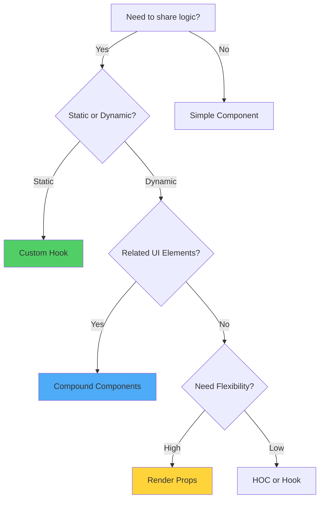

### Pattern Comparison Matrix

```
┌────────────────────────────────────────────────────────────────┐
│                 Pattern Selection Guide                        │
├────────────────────────────────────────────────────────────────┤
│                                                                │
│  Custom Hooks                                                  │
│  ✅ Logic reuse across components                              │
│  ✅ Access to React lifecycle                                  │
│  ✅ Composable and testable                                    │
│  ⚠️  Cannot render UI directly                                 │
│  Use when: Sharing stateful logic                             │
│                                                                │
│  Compound Components                                           │
│  ✅ Flexible, declarative API                                  │
│  ✅ Related components work together                           │
│  ✅ Implicit state sharing                                     │
│  ⚠️  More complex implementation                               │
│  Use when: Building component libraries (Tabs, Accordion)     │
│                                                                │
│  Render Props                                                  │
│  ✅ Maximum render flexibility                                 │
│  ✅ Runtime composition                                        │
│  ⚠️  Can lead to callback hell                                 │
│  ⚠️  Less performant than hooks                                │
│  Use when: Dynamic render logic needed                        │
│                                                                │
│  Higher-Order Components                                       │
│  ✅ Cross-cutting concerns                                     │
│  ✅ Static composition                                         │
│  ⚠️  Wrapper hell potential                                    │
│  ⚠️  Props collision risk                                      │
│  Use when: Legacy code or specific enhancement                │
│                                                                │
│  Component Composition                                         │
│  ✅ Simple and intuitive                                       │
│  ✅ Best performance                                           │
│  ✅ Natural parent-child relationship                          │
│  Use when: Layout and structure                               │
│                                                                │
└────────────────────────────────────────────────────────────────┘
```

### Real-World Example: Complete Application

```jsx
// === Custom Hooks ===
const useAuth = () => {
  const [user, setUser] = useState(null);
  const [loading, setLoading] = useState(true);
  
  useEffect(() => {
    // Auth initialization logic
  }, []);
  
  const login = async (credentials) => {
    // Login logic
  };
  
  const logout = () => {
    // Logout logic
  };
  
  return { user, loading, login, logout };
};

// === Context for Global State ===
const AuthContext = createContext();

const AuthProvider = ({ children }) => {
  const auth = useAuth();
  return (
    <AuthContext.Provider value={auth}>
      {children}
    </AuthContext.Provider>
  );
};

// === Compound Components for UI ===
const Modal = ({ children, isOpen, onClose }) => {
  if (!isOpen) return null;
  
  return (
    <ModalContext.Provider value={{ onClose }}>
      <div className="modal-overlay">
        <div className="modal-content">
          {children}
        </div>
      </div>
    </ModalContext.Provider>
  );
};

Modal.Header = ({ children }) => (
  <div className="modal-header">{children}</div>
);

Modal.Body = ({ children }) => (
  <div className="modal-body">{children}</div>
);

Modal.Footer = ({ children }) => (
  <div className="modal-footer">{children}</div>
);

// === Main Application ===
const App = () => {
  return (
    <AuthProvider>
      <Router>
        <Layout>
          <Routes>
            <Route path="/" element={<Home />} />
            <Route path="/dashboard" element={
              <ProtectedRoute>
                <Dashboard />
              </ProtectedRoute>
            } />
          </Routes>
        </Layout>
      </Router>
    </AuthProvider>
  );
};
```

### Best Practices Summary

```
┌────────────────────────────────────────────────┐
│         Component Best Practices               │
├────────────────────────────────────────────────┤
│                                                │
│  1. Prefer composition over inheritance        │
│  2. Keep components small and focused          │
│  3. Use custom hooks for logic reuse           │
│  4. Implement compound components for related  │
│     UI elements                                │
│  5. Avoid prop drilling with Context           │
│  6. Colocate state close to usage              │
│  7. Use TypeScript for type safety             │
│  8. Write tests for complex logic              │
│  9. Document component APIs                    │
│  10. Optimize only when necessary              │
│                                                │
└────────────────────────────────────────────────┘
```

---

## Conclusion: Architecting Excellence

### Maturation Trajectory

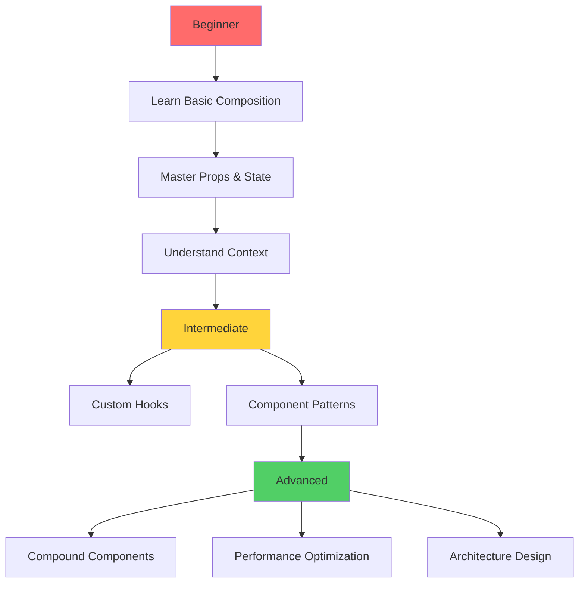

### Essential Principles Recapitulation

1. **Composition is King**: Build complex UIs from simple, reusable components
2. **Single Responsibility**: Each component should have one clear purpose
3. **Explicit Data Flow**: Props down, callbacks up - maintain predictability
4. **Context Sparingly**: Use for truly global concerns (auth, theme)
5. **Custom Hooks for Logic**: Extract reusable stateful logic
6. **Pattern Selection**: Choose patterns based on specific requirements
7. **Performance Awareness**: Optimize strategically, not prematurely

### Resources for Mastery

- 📘 [React Patterns](https://reactpatterns.com/)
- 🎓 [Component Composition Guide](https://react.dev/learn/passing-props-to-a-component)
- 🛠️ [Advanced Patterns by Kent C. Dodds](https://kentcdodds.com/blog/advanced-react-component-patterns)
- 📦 [Radix UI](https://www.radix-ui.com/) - Compound component examples

---

**Composizione magistrale per eccellenza architettonica! 🏛️**