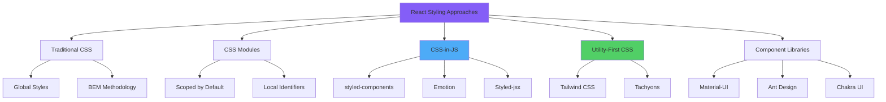
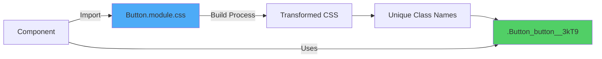
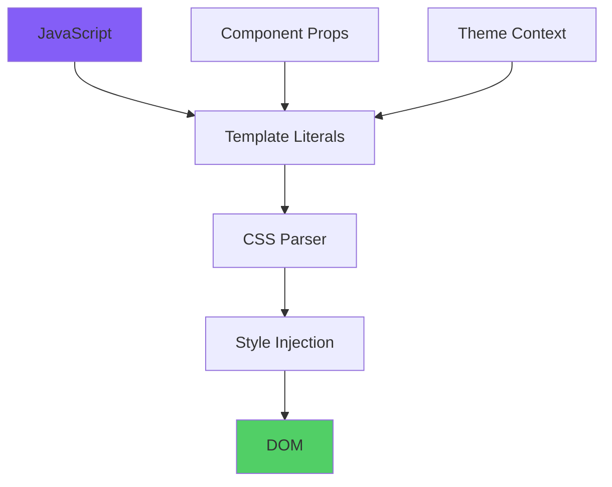
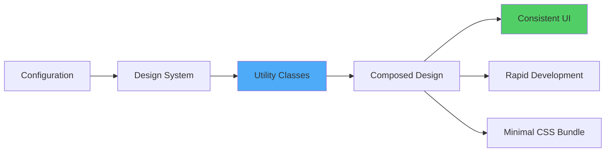
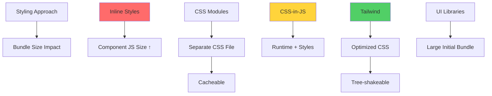
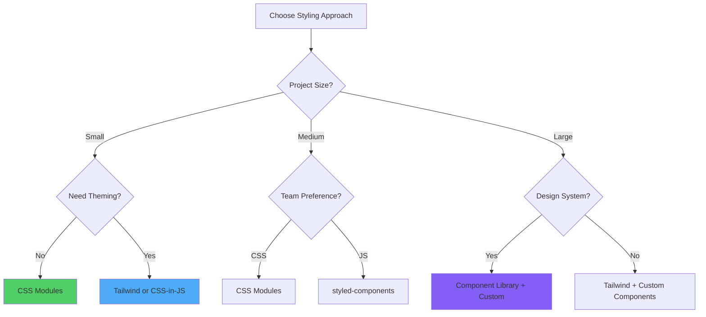

# React Styling Strategies and Implementation

> A comprehensive exploration of styling methodologies, architectural patterns, and pragmatic approaches for styling React applications

---

## Table of Contents

1. [Styling Paradigms in React](#1-styling-paradigms-in-react)
2. [Inline Styles: Mechanisms and Constraints](#2-inline-styles-mechanisms-and-constraints)
3. [CSS Modules: Scoped Styling Architecture](#3-css-modules-scoped-styling-architecture)
4. [CSS-in-JS: styled-components and Emotion](#4-css-in-js-styled-components-and-emotion)
5. [Tailwind CSS: Utility-First Methodology](#5-tailwind-css-utility-first-methodology)
6. [CSS Frameworks Integration](#6-css-frameworks-integration)
7. [Performance Considerations](#7-performance-considerations)
8. [Advanced Styling Patterns](#8-advanced-styling-patterns)
9. [Theming and Design Systems](#9-theming-and-design-systems)
10. [Styling Strategy Selection Matrix](#10-styling-strategy-selection-matrix)

---

## 1. Styling Paradigms in React

### Evolution of Styling Approaches

React's flexible architecture accommodates multiple styling methodologies, each with distinct tradeoffs regarding maintainability, performance, developer experience, and bundle size.



### Comparative Overview

```
┌────────────────────────────────────────────────────────────────┐
│              Styling Approaches Comparison                     │
├────────────────────────────────────────────────────────────────┤
│                                                                │
│  Inline Styles                                                 │
│  ✅ Component-scoped automatically                             │
│  ✅ Dynamic styling with JavaScript                            │
│  ❌ No pseudo-classes/elements                                 │
│  ❌ No media queries                                           │
│  ❌ Larger bundle size                                         │
│                                                                │
│  CSS Modules                                                   │
│  ✅ Scoped styles by default                                   │
│  ✅ Standard CSS syntax                                        │
│  ✅ Tree-shakeable                                             │
│  ⚠️  Requires build configuration                              │
│                                                                │
│  CSS-in-JS                                                     │
│  ✅ Dynamic theming                                            │
│  ✅ Automatic vendor prefixing                                 │
│  ✅ Full JavaScript power                                      │
│  ❌ Runtime overhead                                           │
│  ❌ Larger bundle size                                         │
│                                                                │
│  Tailwind CSS                                                  │
│  ✅ Rapid development                                          │
│  ✅ Consistent design system                                   │
│  ✅ Highly optimized output                                    │
│  ⚠️  Verbose markup                                            │
│  ⚠️  Learning curve for utilities                              │
│                                                                │
│  Component Libraries                                           │
│  ✅ Pre-built components                                       │
│  ✅ Consistent design                                          │
│  ✅ Accessibility built-in                                     │
│  ❌ Large bundle size                                          │
│  ⚠️  Customization complexity                                  │
│                                                                │
└────────────────────────────────────────────────────────────────┘
```

### Angular vs React Styling Paradigms

```
Angular                          React
───────                         ─────

Component Styles                Multiple Approaches
(Encapsulated by Default)       (Developer's Choice)

@Component({                    // Various options:
  styleUrls: ['./style.css'],   import './style.css';
  styles: [`...`]               import styles from './style.module.css';
})                              const Styled = styled.div`...`;
                                className="tailwind-classes"

ViewEncapsulation.Emulated      CSS Modules (similar)
ViewEncapsulation.None          Global CSS
ViewEncapsulation.ShadowDOM     Not commonly used in React

::ng-deep selector              Global CSS or :global() in modules
```

---

## 2. Inline Styles: Mechanisms and Constraints

### Theoretical Foundation

Inline styles in React utilize JavaScript objects to define CSS properties, enabling dynamic styling based on component state and props. However, this approach possesses inherent limitations regarding CSS feature support.

### Basic Syntax and Conventions

```jsx
const Button = ({ variant, disabled }) => {
  // Style object definition
  const buttonStyles = {
    padding: '12px 24px',
    fontSize: '16px',
    fontWeight: 'bold',
    border: 'none',
    borderRadius: '8px',
    cursor: disabled ? 'not-allowed' : 'pointer',
    backgroundColor: variant === 'primary' ? '#007bff' : '#6c757d',
    color: '#ffffff',
    opacity: disabled ? 0.6 : 1,
    transition: 'all 0.3s ease',
    // Note: camelCase for multi-word properties
    boxShadow: '0 2px 4px rgba(0,0,0,0.1)'
  };

  return (
    <button style={buttonStyles}>
      Click Me
    </button>
  );
};
```

### Naming Convention: CamelCase vs Kebab-Case

```jsx
// ❌ WRONG: CSS syntax doesn't work
const styles = {
  'background-color': 'blue',  // Syntax error!
  'font-size': '16px'          // Syntax error!
};

// ✅ CORRECT: JavaScript camelCase
const styles = {
  backgroundColor: 'blue',
  fontSize: '16px',
  marginTop: '20px',
  borderRadius: '8px',
  boxShadow: '0 2px 4px rgba(0,0,0,0.1)'
};
```

### Dynamic Styling with State

```jsx
const ToggleButton = () => {
  const [isActive, setIsActive] = useState(false);
  const [hovered, setHovered] = useState(false);

  const buttonStyles = {
    padding: '16px 32px',
    fontSize: '18px',
    fontWeight: 'bold',
    border: '2px solid',
    borderColor: isActive ? '#28a745' : '#dc3545',
    borderRadius: '8px',
    backgroundColor: isActive ? '#28a745' : '#dc3545',
    color: '#ffffff',
    cursor: 'pointer',
    transform: hovered ? 'scale(1.05)' : 'scale(1)',
    transition: 'all 0.2s ease-in-out',
    boxShadow: hovered 
      ? '0 6px 12px rgba(0,0,0,0.15)' 
      : '0 2px 4px rgba(0,0,0,0.1)'
  };

  return (
    <button
      style={buttonStyles}
      onClick={() => setIsActive(!isActive)}
      onMouseEnter={() => setHovered(true)}
      onMouseLeave={() => setHovered(false)}
    >
      {isActive ? 'Active' : 'Inactive'}
    </button>
  );
};
```

### Conditional Styling Patterns

```jsx
const Card = ({ featured, urgent, size }) => {
  const cardStyles = {
    padding: size === 'large' ? '32px' : '16px',
    margin: '16px',
    borderRadius: '12px',
    backgroundColor: '#ffffff',
    // Conditional border
    border: featured ? '3px solid #ffd700' : '1px solid #e0e0e0',
    // Conditional box shadow
    boxShadow: urgent 
      ? '0 4px 8px rgba(220, 53, 69, 0.3)'
      : '0 2px 4px rgba(0,0,0,0.1)',
    // Multiple conditions
    ...(featured && {
      background: 'linear-gradient(135deg, #667eea 0%, #764ba2 100%)',
      color: '#ffffff'
    })
  };

  return <div style={cardStyles}>Card Content</div>;
};
```

### Inline Styles Limitations

```jsx
// ❌ LIMITATION 1: No pseudo-classes
const Button = () => {
  const styles = {
    backgroundColor: 'blue',
    // Cannot do :hover, :active, :focus with inline styles
    // ':hover': { backgroundColor: 'darkblue' }  // DOESN'T WORK
  };
  
  return <button style={styles}>Hover Me</button>;
};

// ❌ LIMITATION 2: No pseudo-elements
const Quote = () => {
  const styles = {
    fontStyle: 'italic',
    // Cannot add ::before or ::after content
    // '::before': { content: '"' }  // DOESN'T WORK
  };
  
  return <blockquote style={styles}>Quote text</blockquote>;
};

// ❌ LIMITATION 3: No media queries
const ResponsiveBox = () => {
  const styles = {
    width: '100%',
    // Cannot use media queries
    // '@media (min-width: 768px)': { width: '50%' }  // DOESN'T WORK
  };
  
  return <div style={styles}>Content</div>;
};

// ❌ LIMITATION 4: No CSS animations/keyframes
const AnimatedBox = () => {
  const styles = {
    // Cannot define @keyframes
    // animation: 'slideIn 0.3s ease'  // Works, but keyframes must be in CSS
  };
  
  return <div style={styles}>Animated</div>;
};

// ✅ WORKAROUND: Use JavaScript-based solutions
const HoverButton = () => {
  const [hovered, setHovered] = useState(false);
  
  const styles = {
    backgroundColor: hovered ? 'darkblue' : 'blue',
    transition: 'background-color 0.3s'
  };
  
  return (
    <button
      style={styles}
      onMouseEnter={() => setHovered(true)}
      onMouseLeave={() => setHovered(false)}
    >
      Hover Workaround
    </button>
  );
};
```

### Performance Implications

```jsx
// ❌ BAD: Creating new style object on every render
const Component = () => {
  return (
    <div style={{ padding: '20px', margin: '10px' }}>
      {/* New object reference on each render */}
    </div>
  );
};

// ✅ BETTER: Memoize static styles
const staticStyles = {
  padding: '20px',
  margin: '10px'
};

const Component = () => {
  return <div style={staticStyles}>Content</div>;
};

// ✅ BEST: Use useMemo for dynamic styles
const Component = ({ isActive, size }) => {
  const styles = useMemo(() => ({
    padding: size === 'large' ? '32px' : '16px',
    backgroundColor: isActive ? 'green' : 'gray',
    transition: 'all 0.3s ease'
  }), [isActive, size]);
  
  return <div style={styles}>Content</div>;
};
```

### Vendor Prefixing Issues

```jsx
// ❌ Manual vendor prefixing required
const styles = {
  display: 'flex',
  WebkitBoxOrient: 'vertical',  // Manual prefix
  WebkitLineClamp: 3,           // Manual prefix
  overflow: 'hidden',
  textOverflow: 'ellipsis'
};

// Note: React automatically adds 'px' to numeric values
const autoPixelStyles = {
  width: 200,        // Becomes '200px'
  height: 100,       // Becomes '100px'
  marginTop: 20,     // Becomes '20px'
  fontSize: 16,      // Becomes '16px'
  zIndex: 1000,      // Remains unitless (correct)
  lineHeight: 1.5,   // Remains unitless (correct)
  flexGrow: 1        // Remains unitless (correct)
};
```

### When to Use Inline Styles

```
✅ USE INLINE STYLES FOR:
  • Dynamic styling based on props/state
  • Simple component-specific styles
  • Rapid prototyping
  • Server-side rendering with minimal CSS
  • Theme values that change frequently

❌ AVOID INLINE STYLES FOR:
  • Complex styling requirements
  • Hover states, animations, pseudo-elements
  • Responsive design with media queries
  • Large-scale applications
  • Performance-critical rendering
```

---

## 3. CSS Modules: Scoped Styling Architecture

### Architectural Philosophy

**CSS Modules** transform standard CSS files into locally-scoped modules, generating unique class names at build time to prevent naming collisions while maintaining familiar CSS syntax.



### Basic Configuration and Usage

```css
/* Button.module.css */
.button {
  padding: 12px 24px;
  font-size: 16px;
  font-weight: bold;
  border: none;
  border-radius: 8px;
  cursor: pointer;
  transition: all 0.3s ease;
}

.button:hover {
  transform: translateY(-2px);
  box-shadow: 0 4px 8px rgba(0, 0, 0, 0.2);
}

.button:active {
  transform: translateY(0);
}

.primary {
  background-color: #007bff;
  color: white;
}

.secondary {
  background-color: #6c757d;
  color: white;
}

.danger {
  background-color: #dc3545;
  color: white;
}

.disabled {
  opacity: 0.6;
  cursor: not-allowed;
}
```

```jsx
// Button.jsx
import styles from './Button.module.css';

const Button = ({ variant = 'primary', disabled, children, onClick }) => {
  // Combine multiple classes
  const buttonClasses = [
    styles.button,
    styles[variant],
    disabled && styles.disabled
  ].filter(Boolean).join(' ');

  return (
    <button 
      className={buttonClasses}
      onClick={onClick}
      disabled={disabled}
    >
      {children}
    </button>
  );
};

export default Button;
```

### Class Name Composition

```css
/* Card.module.css */
.card {
  padding: 24px;
  border-radius: 12px;
  background-color: white;
  box-shadow: 0 2px 4px rgba(0, 0, 0, 0.1);
}

.cardHeader {
  margin-bottom: 16px;
  padding-bottom: 16px;
  border-bottom: 1px solid #e0e0e0;
}

.cardTitle {
  font-size: 24px;
  font-weight: bold;
  margin: 0;
}

.cardBody {
  margin-bottom: 16px;
}

.cardFooter {
  display: flex;
  justify-content: flex-end;
  gap: 12px;
}

/* Modifier classes */
.featured {
  border: 3px solid gold;
  background: linear-gradient(135deg, #667eea 0%, #764ba2 100%);
  color: white;
}

.compact {
  padding: 12px;
}
```

```jsx
// Card.jsx
import styles from './Card.module.css';

const Card = ({ 
  title, 
  children, 
  footer, 
  featured = false,
  compact = false 
}) => {
  // Dynamic class composition
  const cardClasses = [
    styles.card,
    featured && styles.featured,
    compact && styles.compact
  ].filter(Boolean).join(' ');

  return (
    <div className={cardClasses}>
      {title && (
        <div className={styles.cardHeader}>
          <h2 className={styles.cardTitle}>{title}</h2>
        </div>
      )}
      
      <div className={styles.cardBody}>
        {children}
      </div>
      
      {footer && (
        <div className={styles.cardFooter}>
          {footer}
        </div>
      )}
    </div>
  );
};
```

### Global Styles with :global()

```css
/* App.module.css */

/* Scoped styles (default) */
.container {
  max-width: 1200px;
  margin: 0 auto;
  padding: 20px;
}

/* Global styles using :global() */
:global(.no-scroll) {
  overflow: hidden;
}

:global(body) {
  margin: 0;
  font-family: -apple-system, BlinkMacSystemFont, 'Segoe UI', sans-serif;
}

/* Mixed: scoped class with global children */
.navList :global(a) {
  text-decoration: none;
  color: inherit;
}

.navList :global(a:hover) {
  text-decoration: underline;
}
```

### Composition with composes

```css
/* Button.module.css */

/* Base button styles */
.baseButton {
  padding: 12px 24px;
  font-size: 16px;
  font-weight: bold;
  border: none;
  border-radius: 8px;
  cursor: pointer;
  transition: all 0.3s ease;
}

/* Variants using composition */
.primaryButton {
  composes: baseButton;
  background-color: #007bff;
  color: white;
}

.secondaryButton {
  composes: baseButton;
  background-color: #6c757d;
  color: white;
}

.largeButton {
  composes: baseButton;
  padding: 16px 32px;
  font-size: 18px;
}

/* Multiple composition */
.primaryLarge {
  composes: primaryButton largeButton;
}

/* Compose from external file */
.button {
  composes: reset from './reset.module.css';
  composes: baseButton;
}
```

### Advanced Patterns: CSS Variables

```css
/* Theme.module.css */
.lightTheme {
  --primary-color: #007bff;
  --secondary-color: #6c757d;
  --background-color: #ffffff;
  --text-color: #212529;
  --border-color: #e0e0e0;
  --shadow: 0 2px 4px rgba(0, 0, 0, 0.1);
}

.darkTheme {
  --primary-color: #0d6efd;
  --secondary-color: #6c757d;
  --background-color: #212529;
  --text-color: #f8f9fa;
  --border-color: #495057;
  --shadow: 0 2px 4px rgba(255, 255, 255, 0.1);
}

/* Component using CSS variables */
.card {
  background-color: var(--background-color);
  color: var(--text-color);
  border: 1px solid var(--border-color);
  box-shadow: var(--shadow);
  transition: all 0.3s ease;
}

.button {
  background-color: var(--primary-color);
  color: white;
  border: 2px solid var(--primary-color);
}
```

```jsx
// App.jsx
import styles from './Theme.module.css';
import cardStyles from './Card.module.css';

const App = () => {
  const [theme, setTheme] = useState('light');

  return (
    <div className={theme === 'light' ? styles.lightTheme : styles.darkTheme}>
      <div className={cardStyles.card}>
        <h1>Themed Card</h1>
        <button onClick={() => setTheme(theme === 'light' ? 'dark' : 'light')}>
          Toggle Theme
        </button>
      </div>
    </div>
  );
};
```

### Responsive Design with CSS Modules

```css
/* ResponsiveGrid.module.css */
.grid {
  display: grid;
  gap: 24px;
  padding: 24px;
}

/* Mobile first approach */
.grid {
  grid-template-columns: 1fr;
}

/* Tablet */
@media (min-width: 768px) {
  .grid {
    grid-template-columns: repeat(2, 1fr);
  }
}

/* Desktop */
@media (min-width: 1024px) {
  .grid {
    grid-template-columns: repeat(3, 1fr);
  }
}

/* Large desktop */
@media (min-width: 1440px) {
  .grid {
    grid-template-columns: repeat(4, 1fr);
    gap: 32px;
  }
}

/* Container queries (modern browsers) */
.container {
  container-type: inline-size;
}

.card {
  padding: 16px;
}

@container (min-width: 400px) {
  .card {
    padding: 24px;
  }
}
```

### Animation with CSS Modules

```css
/* Animations.module.css */
@keyframes fadeIn {
  from {
    opacity: 0;
    transform: translateY(20px);
  }
  to {
    opacity: 1;
    transform: translateY(0);
  }
}

@keyframes slideIn {
  from {
    transform: translateX(-100%);
  }
  to {
    transform: translateX(0);
  }
}

@keyframes spin {
  to {
    transform: rotate(360deg);
  }
}

.fadeIn {
  animation: fadeIn 0.5s ease-out;
}

.slideIn {
  animation: slideIn 0.3s ease-out;
}

.spinner {
  animation: spin 1s linear infinite;
}

/* Transition utilities */
.transition {
  transition: all 0.3s ease;
}

.transitionFast {
  transition: all 0.15s ease;
}

.transitionSlow {
  transition: all 0.5s ease;
}
```

### TypeScript Integration

```typescript
// Button.module.css.d.ts (auto-generated or manual)
export const button: string;
export const primary: string;
export const secondary: string;
export const danger: string;
export const disabled: string;
```

```tsx
// Button.tsx
import styles from './Button.module.css';

interface ButtonProps {
  variant?: 'primary' | 'secondary' | 'danger';
  disabled?: boolean;
  children: React.ReactNode;
  onClick?: () => void;
}

const Button: React.FC<ButtonProps> = ({ 
  variant = 'primary', 
  disabled, 
  children, 
  onClick 
}) => {
  const className = `${styles.button} ${styles[variant]} ${
    disabled ? styles.disabled : ''
  }`;

  return (
    <button className={className} onClick={onClick} disabled={disabled}>
      {children}
    </button>
  );
};
```

---

## 4. CSS-in-JS: styled-components and Emotion

### Paradigm Overview

**CSS-in-JS** libraries enable writing CSS directly within JavaScript, providing dynamic styling capabilities, automatic vendor prefixing, and complete access to component props and state.



### styled-components: Fundamental Usage

```jsx
import styled from 'styled-components';

// Basic styled component
const Button = styled.button`
  padding: 12px 24px;
  font-size: 16px;
  font-weight: bold;
  border: none;
  border-radius: 8px;
  cursor: pointer;
  transition: all 0.3s ease;
  
  background-color: #007bff;
  color: white;
  
  &:hover {
    background-color: #0056b3;
    transform: translateY(-2px);
    box-shadow: 0 4px 8px rgba(0, 0, 0, 0.2);
  }
  
  &:active {
    transform: translateY(0);
  }
  
  &:disabled {
    opacity: 0.6;
    cursor: not-allowed;
  }
`;

// Usage
const App = () => {
  return (
    <div>
      <Button>Click Me</Button>
      <Button disabled>Disabled</Button>
    </div>
  );
};
```

### Dynamic Styling with Props

```jsx
import styled from 'styled-components';

// Props-based dynamic styling
const Button = styled.button`
  padding: ${props => props.size === 'large' ? '16px 32px' : '12px 24px'};
  font-size: ${props => props.size === 'large' ? '18px' : '16px'};
  font-weight: bold;
  border: none;
  border-radius: 8px;
  cursor: pointer;
  transition: all 0.3s ease;
  
  /* Conditional styling based on variant prop */
  background-color: ${props => {
    switch (props.variant) {
      case 'primary': return '#007bff';
      case 'secondary': return '#6c757d';
      case 'danger': return '#dc3545';
      case 'success': return '#28a745';
      default: return '#007bff';
    }
  }};
  
  color: white;
  
  /* Props-based conditional styles */
  ${props => props.outline && `
    background-color: transparent;
    border: 2px solid ${props.variant === 'primary' ? '#007bff' : '#6c757d'};
    color: ${props.variant === 'primary' ? '#007bff' : '#6c757d'};
  `}
  
  ${props => props.fullWidth && `
    width: 100%;
    display: block;
  `}
  
  &:hover {
    opacity: 0.9;
    transform: translateY(-2px);
  }
  
  &:disabled {
    opacity: 0.6;
    cursor: not-allowed;
    transform: none;
  }
`;

// Usage with various props
const App = () => {
  return (
    <div>
      <Button variant="primary" size="large">Primary Large</Button>
      <Button variant="danger" outline>Danger Outline</Button>
      <Button variant="success" fullWidth>Full Width</Button>
    </div>
  );
};
```

### Component Extension and Composition

```jsx
// Base button
const BaseButton = styled.button`
  padding: 12px 24px;
  font-size: 16px;
  font-weight: bold;
  border: none;
  border-radius: 8px;
  cursor: pointer;
  transition: all 0.3s ease;
`;

// Extend base button
const PrimaryButton = styled(BaseButton)`
  background-color: #007bff;
  color: white;
  
  &:hover {
    background-color: #0056b3;
  }
`;

const DangerButton = styled(BaseButton)`
  background-color: #dc3545;
  color: white;
  
  &:hover {
    background-color: #bd2130;
  }
`;

// Extend with additional props
const IconButton = styled(PrimaryButton)`
  display: flex;
  align-items: center;
  gap: 8px;
  
  svg {
    width: 20px;
    height: 20px;
  }
`;

// Style any component
const StyledLink = styled(Link)`
  color: #007bff;
  text-decoration: none;
  
  &:hover {
    text-decoration: underline;
  }
`;
```

### Theming with ThemeProvider

```jsx
import styled, { ThemeProvider } from 'styled-components';

// Define theme objects
const lightTheme = {
  colors: {
    primary: '#007bff',
    secondary: '#6c757d',
    success: '#28a745',
    danger: '#dc3545',
    background: '#ffffff',
    text: '#212529',
    border: '#e0e0e0'
  },
  spacing: {
    small: '8px',
    medium: '16px',
    large: '24px'
  },
  borderRadius: '8px',
  shadows: {
    small: '0 2px 4px rgba(0, 0, 0, 0.1)',
    medium: '0 4px 8px rgba(0, 0, 0, 0.15)',
    large: '0 8px 16px rgba(0, 0, 0, 0.2)'
  }
};

const darkTheme = {
  colors: {
    primary: '#0d6efd',
    secondary: '#6c757d',
    success: '#198754',
    danger: '#dc3545',
    background: '#212529',
    text: '#f8f9fa',
    border: '#495057'
  },
  spacing: lightTheme.spacing,
  borderRadius: lightTheme.borderRadius,
  shadows: {
    small: '0 2px 4px rgba(255, 255, 255, 0.1)',
    medium: '0 4px 8px rgba(255, 255, 255, 0.15)',
    large: '0 8px 16px rgba(255, 255, 255, 0.2)'
  }
};

// Styled components using theme
const Container = styled.div`
  background-color: ${props => props.theme.colors.background};
  color: ${props => props.theme.colors.text};
  padding: ${props => props.theme.spacing.large};
  border-radius: ${props => props.theme.borderRadius};
  min-height: 100vh;
`;

const Button = styled.button`
  background-color: ${props => props.theme.colors.primary};
  color: white;
  padding: ${props => props.theme.spacing.medium};
  border: none;
  border-radius: ${props => props.theme.borderRadius};
  box-shadow: ${props => props.theme.shadows.small};
  cursor: pointer;
  transition: all 0.3s ease;
  
  &:hover {
    box-shadow: ${props => props.theme.shadows.medium};
  }
`;

const Card = styled.div`
  background-color: ${props => props.theme.colors.background};
  border: 1px solid ${props => props.theme.colors.border};
  padding: ${props => props.theme.spacing.large};
  border-radius: ${props => props.theme.borderRadius};
  box-shadow: ${props => props.theme.shadows.medium};
`;

// Application with theme
const App = () => {
  const [isDark, setIsDark] = useState(false);
  const theme = isDark ? darkTheme : lightTheme;
  
  return (
    <ThemeProvider theme={theme}>
      <Container>
        <h1>Themed Application</h1>
        <Button onClick={() => setIsDark(!isDark)}>
          Toggle Theme
        </Button>
        <Card>
          <h2>Card Title</h2>
          <p>Card content goes here</p>
        </Card>
      </Container>
    </ThemeProvider>
  );
};
```

### Global Styles with createGlobalStyle

```jsx
import { createGlobalStyle } from 'styled-components';

const GlobalStyles = createGlobalStyle`
  * {
    margin: 0;
    padding: 0;
    box-sizing: border-box;
  }
  
  body {
    font-family: -apple-system, BlinkMacSystemFont, 'Segoe UI', 'Roboto', 
                 'Oxygen', 'Ubuntu', 'Cantarell', sans-serif;
    background-color: ${props => props.theme.colors.background};
    color: ${props => props.theme.colors.text};
    line-height: 1.6;
    transition: background-color 0.3s ease, color 0.3s ease;
  }
  
  h1, h2, h3, h4, h5, h6 {
    margin-bottom: ${props => props.theme.spacing.medium};
    font-weight: 600;
  }
  
  a {
    color: ${props => props.theme.colors.primary};
    text-decoration: none;
    
    &:hover {
      text-decoration: underline;
    }
  }
  
  button {
    font-family: inherit;
  }
  
  /* Custom scrollbar */
  ::-webkit-scrollbar {
    width: 12px;
  }
  
  ::-webkit-scrollbar-track {
    background: ${props => props.theme.colors.background};
  }
  
  ::-webkit-scrollbar-thumb {
    background: ${props => props.theme.colors.border};
    border-radius: 6px;
  }
`;

const App = () => {
  return (
    <ThemeProvider theme={theme}>
      <GlobalStyles />
      {/* Rest of app */}
    </ThemeProvider>
  );
};
```

### Emotion: Alternative CSS-in-JS

```jsx
/** @jsxImportSource @emotion/react */
import { css } from '@emotion/react';
import styled from '@emotion/styled';

// Using css prop
const App = () => {
  return (
    <div
      css={css`
        padding: 24px;
        background-color: #f5f5f5;
        border-radius: 8px;
      `}
    >
      <h1
        css={css`
          color: #007bff;
          font-size: 32px;
          margin-bottom: 16px;
        `}
      >
        Title
      </h1>
    </div>
  );
};

// Styled components with Emotion
const Button = styled.button`
  padding: 12px 24px;
  background-color: ${props => props.primary ? '#007bff' : '#6c757d'};
  color: white;
  border: none;
  border-radius: 8px;
  cursor: pointer;
  
  &:hover {
    opacity: 0.9;
  }
`;

// Object styles
const buttonStyles = {
  padding: '12px 24px',
  backgroundColor: '#007bff',
  color: 'white',
  border: 'none',
  borderRadius: '8px',
  cursor: 'pointer',
  '&:hover': {
    opacity: 0.9
  }
};

const ObjectButton = styled.button(buttonStyles);
```

### Performance Optimization

```jsx
import styled from 'styled-components';
import { memo } from 'react';

// ✅ GOOD: Extract static styles
const staticButtonStyles = `
  padding: 12px 24px;
  font-size: 16px;
  border: none;
  border-radius: 8px;
  cursor: pointer;
`;

const Button = styled.button`
  ${staticButtonStyles}
  background-color: ${props => props.color || '#007bff'};
`;

// ✅ GOOD: Memoize expensive styled components
const ExpensiveCard = memo(styled.div`
  /* Complex styles */
`);

// ✅ GOOD: Use attrs for frequently changing props
const Input = styled.input.attrs(props => ({
  type: props.type || 'text',
  placeholder: props.placeholder || 'Enter text...'
}))`
  padding: 12px;
  border: 1px solid #e0e0e0;
  border-radius: 8px;
  font-size: 16px;
`;

// ❌ BAD: Creating styled components inside render
const Component = () => {
  // Don't do this - creates new component on every render!
  const DynamicButton = styled.button`
    background: ${someColor};
  `;
  
  return <DynamicButton>Click</DynamicButton>;
};
```

---

## 5. Tailwind CSS: Utility-First Methodology

### Philosophical Foundation

**Tailwind CSS** implements a utility-first approach, providing low-level utility classes that compose to create custom designs without writing custom CSS, emphasizing consistency and rapid development.



### Installation and Configuration

```bash
# Install Tailwind CSS
npm install -D tailwindcss postcss autoprefixer

# Initialize configuration
npx tailwindcss init -p
```

```javascript
// tailwind.config.js
/** @type {import('tailwindcss').Config} */
export default {
  content: [
    "./index.html",
    "./src/**/*.{js,ts,jsx,tsx}",
  ],
  theme: {
    extend: {
      colors: {
        primary: {
          50: '#eff6ff',
          100: '#dbeafe',
          500: '#3b82f6',
          600: '#2563eb',
          700: '#1d4ed8',
          900: '#1e3a8a',
        },
        secondary: {
          500: '#6b7280',
          600: '#4b5563',
          700: '#374151',
        }
      },
      spacing: {
        '128': '32rem',
        '144': '36rem',
      },
      fontFamily: {
        sans: ['Inter', 'system-ui', 'sans-serif'],
      },
      borderRadius: {
        '4xl': '2rem',
      }
    },
  },
  plugins: [
    require('@tailwindcss/forms'),
    require('@tailwindcss/typography'),
  ],
}
```

```css
/* index.css */
@tailwind base;
@tailwind components;
@tailwind utilities;

/* Custom base styles */
@layer base {
  h1 {
    @apply text-4xl font-bold;
  }
  
  h2 {
    @apply text-3xl font-semibold;
  }
}

/* Custom components */
@layer components {
  .btn-primary {
    @apply px-6 py-3 bg-blue-600 text-white font-semibold rounded-lg 
           hover:bg-blue-700 transition-colors duration-200;
  }
  
  .card {
    @apply p-6 bg-white rounded-xl shadow-md hover:shadow-lg 
           transition-shadow duration-200;
  }
}

/* Custom utilities */
@layer utilities {
  .text-shadow {
    text-shadow: 2px 2px 4px rgba(0, 0, 0, 0.1);
  }
}
```

### Basic Component Styling

```jsx
// Button component with Tailwind
const Button = ({ variant = 'primary', size = 'medium', children, ...props }) => {
  const baseClasses = 'font-semibold rounded-lg transition-all duration-200 focus:outline-none focus:ring-2 focus:ring-offset-2';
  
  const variantClasses = {
    primary: 'bg-blue-600 text-white hover:bg-blue-700 focus:ring-blue-500',
    secondary: 'bg-gray-600 text-white hover:bg-gray-700 focus:ring-gray-500',
    danger: 'bg-red-600 text-white hover:bg-red-700 focus:ring-red-500',
    outline: 'bg-transparent border-2 border-blue-600 text-blue-600 hover:bg-blue-50'
  };
  
  const sizeClasses = {
    small: 'px-3 py-1.5 text-sm',
    medium: 'px-6 py-3 text-base',
    large: 'px-8 py-4 text-lg'
  };
  
  const classes = `${baseClasses} ${variantClasses[variant]} ${sizeClasses[size]}`;
  
  return (
    <button className={classes} {...props}>
      {children}
    </button>
  );
};

// Usage
const App = () => {
  return (
    <div className="space-y-4">
      <Button variant="primary" size="large">Primary Large</Button>
      <Button variant="danger">Danger Default</Button>
      <Button variant="outline" size="small">Outline Small</Button>
    </div>
  );
};
```

### Complex Layout Example

```jsx
const Dashboard = () => {
  return (
    <div className="min-h-screen bg-gray-100">
      {/* Header */}
      <header className="bg-white shadow-sm">
        <div className="max-w-7xl mx-auto px-4 sm:px-6 lg:px-8 py-4">
          <div className="flex items-center justify-between">
            <h1 className="text-3xl font-bold text-gray-900">
              Dashboard
            </h1>
            <button className="px-4 py-2 bg-blue-600 text-white rounded-lg hover:bg-blue-700 transition-colors">
              New Project
            </button>
          </div>
        </div>
      </header>
      
      {/* Main Content */}
      <main className="max-w-7xl mx-auto px-4 sm:px-6 lg:px-8 py-8">
        {/* Stats Grid */}
        <div className="grid grid-cols-1 md:grid-cols-2 lg:grid-cols-4 gap-6 mb-8">
          <div className="bg-white p-6 rounded-xl shadow-md hover:shadow-lg transition-shadow">
            <div className="flex items-center justify-between">
              <div>
                <p className="text-sm text-gray-600 font-medium">Total Users</p>
                <p className="text-3xl font-bold text-gray-900 mt-2">2,543</p>
              </div>
              <div className="w-12 h-12 bg-blue-100 rounded-full flex items-center justify-center">
                <svg className="w-6 h-6 text-blue-600" fill="currentColor" viewBox="0 0 20 20">
                  {/* Icon */}
                </svg>
              </div>
            </div>
            <div className="mt-4 flex items-center text-sm">
              <span className="text-green-600 font-medium">↑ 12%</span>
              <span className="text-gray-600 ml-2">from last month</span>
            </div>
          </div>
          
          {/* Repeat for other stats */}
        </div>
        
        {/* Content Grid */}
        <div className="grid grid-cols-1 lg:grid-cols-3 gap-8">
          {/* Recent Activity */}
          <div className="lg:col-span-2 bg-white rounded-xl shadow-md p-6">
            <h2 className="text-xl font-bold text-gray-900 mb-4">
              Recent Activity
            </h2>
            <div className="space-y-4">
              {/* Activity items */}
            </div>
          </div>
          
          {/* Quick Actions */}
          <div className="bg-white rounded-xl shadow-md p-6">
            <h2 className="text-xl font-bold text-gray-900 mb-4">
              Quick Actions
            </h2>
            <div className="space-y-3">
              <button className="w-full px-4 py-3 bg-gray-50 hover:bg-gray-100 rounded-lg text-left transition-colors">
                Create New Project
              </button>
              <button className="w-full px-4 py-3 bg-gray-50 hover:bg-gray-100 rounded-lg text-left transition-colors">
                Invite Team Member
              </button>
              <button className="w-full px-4 py-3 bg-gray-50 hover:bg-gray-100 rounded-lg text-left transition-colors">
                View Analytics
              </button>
            </div>
          </div>
        </div>
      </main>
    </div>
  );
};
```

### Responsive Design

```jsx
const ResponsiveCard = () => {
  return (
    <div className="
      /* Mobile: full width, small padding */
      w-full p-4
      
      /* Tablet: medium padding, rounded corners */
      md:p-6 md:rounded-lg
      
      /* Desktop: max width, large padding, shadow */
      lg:max-w-2xl lg:p-8 lg:rounded-xl lg:shadow-xl
      
      /* Background and text */
      bg-white text-gray-900
      
      /* Dark mode */
      dark:bg-gray-800 dark:text-white
      
      /* Hover effects */
      hover:shadow-2xl
      
      /* Transition */
      transition-all duration-300
    ">
      <h2 className="
        text-xl
        sm:text-2xl
        md:text-3xl
        lg:text-4xl
        font-bold
        mb-4
      ">
        Responsive Heading
      </h2>
      
      <p className="
        text-sm
        md:text-base
        lg:text-lg
        text-gray-600
        dark:text-gray-300
      ">
        Content that adapts to screen size
      </p>
    </div>
  );
};
```

### Custom Utilities with @apply

```css
/* components.css */
@layer components {
  /* Button variants */
  .btn {
    @apply px-6 py-3 font-semibold rounded-lg transition-all duration-200
           focus:outline-none focus:ring-2 focus:ring-offset-2;
  }
  
  .btn-primary {
    @apply btn bg-blue-600 text-white hover:bg-blue-700 focus:ring-blue-500;
  }
  
  .btn-secondary {
    @apply btn bg-gray-600 text-white hover:bg-gray-700 focus:ring-gray-500;
  }
  
  .btn-outline {
    @apply btn bg-transparent border-2 border-blue-600 text-blue-600 
           hover:bg-blue-50;
  }
  
  /* Card utilities */
  .card {
    @apply bg-white rounded-xl shadow-md p-6 hover:shadow-lg 
           transition-shadow duration-200;
  }
  
  .card-dark {
    @apply bg-gray-800 text-white rounded-xl shadow-md p-6 
           hover:shadow-lg transition-shadow duration-200;
  }
  
  /* Form inputs */
  .input {
    @apply w-full px-4 py-3 border border-gray-300 rounded-lg
           focus:outline-none focus:ring-2 focus:ring-blue-500 
           focus:border-transparent transition-all;
  }
  
  .input-error {
    @apply input border-red-500 focus:ring-red-500;
  }
}
```

```jsx
// Using custom utilities
const Form = () => {
  return (
    <form className="space-y-4">
      <div>
        <label className="block text-sm font-medium text-gray-700 mb-2">
          Email
        </label>
        <input type="email" className="input" placeholder="your@email.com" />
      </div>
      
      <div>
        <label className="block text-sm font-medium text-gray-700 mb-2">
          Password
        </label>
        <input type="password" className="input-error" />
        <p className="mt-1 text-sm text-red-600">Password is required</p>
      </div>
      
      <button type="submit" className="btn-primary w-full">
        Sign In
      </button>
    </form>
  );
};
```

### Dynamic Classes with clsx/classnames

```jsx
import clsx from 'clsx';

const Button = ({ variant, size, disabled, fullWidth, children }) => {
  const classes = clsx(
    // Base classes
    'font-semibold rounded-lg transition-all duration-200',
    'focus:outline-none focus:ring-2 focus:ring-offset-2',
    
    // Variant classes
    {
      'bg-blue-600 text-white hover:bg-blue-700 focus:ring-blue-500': variant === 'primary',
      'bg-gray-600 text-white hover:bg-gray-700 focus:ring-gray-500': variant === 'secondary',
      'bg-red-600 text-white hover:bg-red-700 focus:ring-red-500': variant === 'danger',
    },
    
    // Size classes
    {
      'px-3 py-1.5 text-sm': size === 'small',
      'px-6 py-3 text-base': size === 'medium',
      'px-8 py-4 text-lg': size === 'large',
    },
    
    // Conditional classes
    {
      'w-full': fullWidth,
      'opacity-60 cursor-not-allowed': disabled,
    }
  );
  
  return (
    <button className={classes} disabled={disabled}>
      {children}
    </button>
  );
};
```

### Dark Mode Implementation

```javascript
// tailwind.config.js
export default {
  darkMode: 'class', // or 'media' for system preference
  // ... rest of config
}
```

```jsx
const App = () => {
  const [darkMode, setDarkMode] = useState(false);
  
  useEffect(() => {
    if (darkMode) {
      document.documentElement.classList.add('dark');
    } else {
      document.documentElement.classList.remove('dark');
    }
  }, [darkMode]);
  
  return (
    <div className="min-h-screen bg-white dark:bg-gray-900 transition-colors">
      <header className="bg-gray-100 dark:bg-gray-800 p-4">
        <div className="flex items-center justify-between">
          <h1 className="text-2xl font-bold text-gray-900 dark:text-white">
            My App
          </h1>
          <button
            onClick={() => setDarkMode(!darkMode)}
            className="px-4 py-2 rounded-lg bg-gray-200 dark:bg-gray-700 
                     text-gray-900 dark:text-white transition-colors"
          >
            {darkMode ? '☀️ Light' : '🌙 Dark'}
          </button>
        </div>
      </header>
      
      <main className="p-8">
        <div className="card dark:card-dark">
          <h2 className="text-xl font-bold text-gray-900 dark:text-white mb-4">
            Card Title
          </h2>
          <p className="text-gray-600 dark:text-gray-300">
            Content that adapts to dark mode
          </p>
        </div>
      </main>
    </div>
  );
};
```

---

## 6. CSS Frameworks Integration

### Material-UI (MUI) Implementation

```bash
npm install @mui/material @emotion/react @emotion/styled
```

```jsx
import { 
  Button, 
  Card, 
  CardContent, 
  Typography,
  ThemeProvider,
  createTheme,
  Box,
  Container
} from '@mui/material';

// Custom theme
const theme = createTheme({
  palette: {
    primary: {
      main: '#1976d2',
    },
    secondary: {
      main: '#dc004e',
    },
  },
  typography: {
    fontFamily: [
      'Roboto',
      'Arial',
      'sans-serif',
    ].join(','),
  },
  components: {
    MuiButton: {
      styleOverrides: {
        root: {
          textTransform: 'none',
          borderRadius: 8,
        },
      },
    },
  },
});

const App = () => {
  return (
    <ThemeProvider theme={theme}>
      <Container maxWidth="lg">
        <Box sx={{ my: 4 }}>
          <Typography variant="h3" component="h1" gutterBottom>
            Material-UI Application
          </Typography>
          
          <Card sx={{ mt: 3, boxShadow: 3 }}>
            <CardContent>
              <Typography variant="h5" component="h2" gutterBottom>
                Card Title
              </Typography>
              <Typography variant="body1" color="text.secondary">
                Card content with Material-UI components
              </Typography>
              
              <Box sx={{ mt: 2, display: 'flex', gap: 2 }}>
                <Button variant="contained" color="primary">
                  Primary Action
                </Button>
                <Button variant="outlined" color="secondary">
                  Secondary Action
                </Button>
              </Box>
            </CardContent>
          </Card>
        </Box>
      </Container>
    </ThemeProvider>
  );
};
```

### Custom MUI Component Styling

```jsx
import { styled } from '@mui/material/styles';
import { Button as MuiButton, Card as MuiCard } from '@mui/material';

// Styled MUI components
const CustomButton = styled(MuiButton)(({ theme }) => ({
  borderRadius: theme.spacing(2),
  padding: theme.spacing(1.5, 4),
  fontWeight: 600,
  textTransform: 'none',
  boxShadow: 'none',
  '&:hover': {
    boxShadow: theme.shadows[4],
    transform: 'translateY(-2px)',
  },
  transition: 'all 0.2s ease',
}));

const GradientCard = styled(MuiCard)(({ theme }) => ({
  background: 'linear-gradient(135deg, #667eea 0%, #764ba2 100%)',
  color: theme.palette.common.white,
  padding: theme.spacing(3),
  borderRadius: theme.spacing(2),
  boxShadow: theme.shadows[8],
}));

// Usage
const App = () => {
  return (
    <div>
      <CustomButton variant="contained" color="primary">
        Custom Styled Button
      </CustomButton>
      
      <GradientCard>
        <Typography variant="h5">Gradient Card</Typography>
        <Typography variant="body1">
          Custom styled Material-UI card
        </Typography>
      </GradientCard>
    </div>
  );
};
```

### Bootstrap with React

```bash
npm install bootstrap react-bootstrap
```

```jsx
import 'bootstrap/dist/css/bootstrap.min.css';
import { Container, Row, Col, Card, Button, Nav, Navbar } from 'react-bootstrap';

const App = () => {
  return (
    <>
      <Navbar bg="dark" variant="dark" expand="lg">
        <Container>
          <Navbar.Brand href="#home">My App</Navbar.Brand>
          <Navbar.Toggle aria-controls="basic-navbar-nav" />
          <Navbar.Collapse id="basic-navbar-nav">
            <Nav className="me-auto">
              <Nav.Link href="#home">Home</Nav.Link>
              <Nav.Link href="#features">Features</Nav.Link>
              <Nav.Link href="#pricing">Pricing</Nav.Link>
            </Nav>
          </Navbar.Collapse>
        </Container>
      </Navbar>
      
      <Container className="my-5">
        <Row>
          <Col md={4}>
            <Card className="mb-4 shadow-sm">
              <Card.Img variant="top" src="image.jpg" />
              <Card.Body>
                <Card.Title>Card Title</Card.Title>
                <Card.Text>
                  Some quick example text to build on the card title
                </Card.Text>
                <Button variant="primary">Learn More</Button>
              </Card.Body>
            </Card>
          </Col>
          
          <Col md={4}>
            {/* More cards */}
          </Col>
        </Row>
      </Container>
    </>
  );
};
```

### Chakra UI Integration

```bash
npm install @chakra-ui/react @emotion/react @emotion/styled framer-motion
```

```jsx
import { ChakraProvider, Box, Button, Heading, Text, VStack, useColorMode } from '@chakra-ui/react';

const App = () => {
  return (
    <ChakraProvider>
      <MainContent />
    </ChakraProvider>
  );
};

const MainContent = () => {
  const { colorMode, toggleColorMode } = useColorMode();
  
  return (
    <Box p={8} minH="100vh" bg={colorMode === 'light' ? 'gray.50' : 'gray.900'}>
      <VStack spacing={6} align="stretch">
        <Heading size="2xl" color={colorMode === 'light' ? 'gray.800' : 'white'}>
          Chakra UI Application
        </Heading>
        
        <Box
          p={6}
          bg={colorMode === 'light' ? 'white' : 'gray.800'}
          borderRadius="lg"
          boxShadow="lg"
        >
          <Heading size="md" mb={4}>
            Card Component
          </Heading>
          <Text color={colorMode === 'light' ? 'gray.600' : 'gray.300'}>
            Beautiful and accessible UI components
          </Text>
          
          <Button
            mt={4}
            colorScheme="blue"
            onClick={toggleColorMode}
          >
            Toggle {colorMode === 'light' ? 'Dark' : 'Light'} Mode
          </Button>
        </Box>
      </VStack>
    </Box>
  );
};
```

---

## 7. Performance Considerations

### Bundle Size Analysis



### Performance Comparison

```
┌────────────────────────────────────────────────────────────────┐
│            Performance Characteristics                         │
├────────────────────────────────────────────────────────────────┤
│                                                                │
│  Inline Styles                                                 │
│  Bundle: ~5-10KB additional JS per component                   │
│  Runtime: Minimal                                              │
│  Caching: Poor (embedded in JS)                                │
│  TTFB: Good                                                    │
│                                                                │
│  CSS Modules                                                   │
│  Bundle: Separate CSS file (~20-50KB typical)                  │
│  Runtime: None                                                 │
│  Caching: Excellent                                            │
│  TTFB: Excellent                                               │
│                                                                │
│  styled-components                                             │
│  Bundle: ~16KB runtime + component styles                      │
│  Runtime: Style generation & injection                         │
│  Caching: Medium (dynamic styles)                              │
│  TTFB: Medium                                                  │
│                                                                │
│  Emotion                                                       │
│  Bundle: ~8KB runtime + component styles                       │
│  Runtime: Optimized style generation                           │
│  Caching: Medium                                               │
│  TTFB: Medium-Good                                             │
│                                                                │
│  Tailwind CSS                                                  │
│  Bundle: ~5-15KB (after purge)                                 │
│  Runtime: None                                                 │
│  Caching: Excellent                                            │
│  TTFB: Excellent                                               │
│                                                                │
│  Material-UI                                                   │
│  Bundle: ~300KB+ (full library)                                │
│  Runtime: Component rendering                                  │
│  Caching: Good (with code splitting)                           │
│  TTFB: Poor-Medium                                             │
│                                                                │
└────────────────────────────────────────────────────────────────┘
```

### Optimization Strategies

```jsx
// 1. Code Splitting for CSS-in-JS
import { lazy, Suspense } from 'react';

const HeavyComponent = lazy(() => import('./HeavyComponent'));

const App = () => {
  return (
    <Suspense fallback={<div>Loading...</div>}>
      <HeavyComponent />
    </Suspense>
  );
};

// 2. Memoize Styled Components
import { memo } from 'react';
import styled from 'styled-components';

const ExpensiveCard = memo(styled.div`
  /* Complex styles */
`);

// 3. Extract Static Styles (CSS Modules)
/* static.module.css */
.container {
  max-width: 1200px;
  margin: 0 auto;
  /* Static styles that rarely change */
}

// 4. Tailwind Purge Configuration
// tailwind.config.js
export default {
  content: ['./src/**/*.{js,jsx,ts,tsx}'],
  // Removes unused styles in production
}

// 5. Tree-shakeable UI Library Imports
// ❌ BAD: Imports entire library
import { Button, Card, Input } from '@mui/material';

// ✅ GOOD: Import only needed components
import Button from '@mui/material/Button';
import Card from '@mui/material/Card';
```

---

## 8. Advanced Styling Patterns

### CSS-in-JS with TypeScript

```typescript
import styled from 'styled-components';

interface ButtonProps {
  variant?: 'primary' | 'secondary' | 'danger';
  size?: 'small' | 'medium' | 'large';
  fullWidth?: boolean;
}

const Button = styled.button<ButtonProps>`
  padding: ${props => {
    switch (props.size) {
      case 'small': return '8px 16px';
      case 'large': return '16px 32px';
      default: return '12px 24px';
    }
  }};
  
  background-color: ${props => {
    switch (props.variant) {
      case 'primary': return '#007bff';
      case 'secondary': return '#6c757d';
      case 'danger': return '#dc3545';
      default: return '#007bff';
    }
  }};
  
  width: ${props => props.fullWidth ? '100%' : 'auto'};
  
  color: white;
  border: none;
  border-radius: 8px;
  cursor: pointer;
  transition: all 0.2s ease;
  
  &:hover {
    opacity: 0.9;
    transform: translateY(-2px);
  }
`;

// Usage with type safety
const App: React.FC = () => {
  return (
    <>
      <Button variant="primary" size="large">Primary</Button>
      <Button variant="danger" fullWidth>Danger Full Width</Button>
    </>
  );
};
```

### Responsive Utilities

```jsx
// Custom hook for responsive design
const useMediaQuery = (query) => {
  const [matches, setMatches] = useState(
    () => window.matchMedia(query).matches
  );
  
  useEffect(() => {
    const mediaQuery = window.matchMedia(query);
    const handler = (e) => setMatches(e.matches);
    
    mediaQuery.addEventListener('change', handler);
    return () => mediaQuery.removeEventListener('change', handler);
  }, [query]);
  
  return matches;
};

// Usage
const ResponsiveComponent = () => {
  const isMobile = useMediaQuery('(max-width: 768px)');
  const isTablet = useMediaQuery('(min-width: 769px) and (max-width: 1024px)');
  const isDesktop = useMediaQuery('(min-width: 1025px)');
  
  return (
    <div>
      {isMobile && <MobileView />}
      {isTablet && <TabletView />}
      {isDesktop && <DesktopView />}
    </div>
  );
};
```

### Animation Patterns

```jsx
// CSS Modules with animations
/* animations.module.css */
@keyframes fadeIn {
  from { opacity: 0; transform: translateY(20px); }
  to { opacity: 1; transform: translateY(0); }
}

.fadeIn {
  animation: fadeIn 0.5s ease-out;
}

// styled-components with animations
import styled, { keyframes } from 'styled-components';

const fadeIn = keyframes`
  from {
    opacity: 0;
    transform: translateY(20px);
  }
  to {
    opacity: 1;
    transform: translateY(0);
  }
`;

const AnimatedCard = styled.div`
  animation: ${fadeIn} 0.5s ease-out;
`;

// Tailwind with custom animations
// tailwind.config.js
export default {
  theme: {
    extend: {
      animation: {
        'fade-in': 'fadeIn 0.5s ease-out',
        'slide-in': 'slideIn 0.3s ease-out',
      },
      keyframes: {
        fadeIn: {
          '0%': { opacity: '0', transform: 'translateY(20px)' },
          '100%': { opacity: '1', transform: 'translateY(0)' },
        },
        slideIn: {
          '0%': { transform: 'translateX(-100%)' },
          '100%': { transform: 'translateX(0)' },
        },
      },
    },
  },
}

// Usage
<div className="animate-fade-in">Content</div>
```

---

## 9. Theming and Design Systems

### Complete Theme Implementation

```jsx
// theme.js
export const theme = {
  colors: {
    primary: {
      50: '#e3f2fd',
      100: '#bbdefb',
      500: '#2196f3',
      600: '#1976d2',
      900: '#0d47a1',
    },
    gray: {
      50: '#fafafa',
      100: '#f5f5f5',
      500: '#9e9e9e',
      700: '#616161',
      900: '#212121',
    },
    success: '#4caf50',
    warning: '#ff9800',
    error: '#f44336',
  },
  spacing: (factor) => `${factor * 8}px`,
  typography: {
    fontFamily: {
      sans: '-apple-system, BlinkMacSystemFont, "Segoe UI", Roboto, sans-serif',
      mono: 'Monaco, Consolas, "Courier New", monospace',
    },
    fontSize: {
      xs: '0.75rem',
      sm: '0.875rem',
      base: '1rem',
      lg: '1.125rem',
      xl: '1.25rem',
      '2xl': '1.5rem',
      '3xl': '1.875rem',
      '4xl': '2.25rem',
    },
    fontWeight: {
      normal: 400,
      medium: 500,
      semibold: 600,
      bold: 700,
    },
  },
  breakpoints: {
    sm: '640px',
    md: '768px',
    lg: '1024px',
    xl: '1280px',
  },
  shadows: {
    sm: '0 1px 2px 0 rgba(0, 0, 0, 0.05)',
    md: '0 4px 6px -1px rgba(0, 0, 0, 0.1)',
    lg: '0 10px 15px -3px rgba(0, 0, 0, 0.1)',
    xl: '0 20px 25px -5px rgba(0, 0, 0, 0.1)',
  },
  borderRadius: {
    sm: '0.25rem',
    md: '0.5rem',
    lg: '0.75rem',
    xl: '1rem',
    full: '9999px',
  },
  transitions: {
    fast: '150ms ease',
    base: '200ms ease',
    slow: '300ms ease',
  },
};
```

---

## 10. Styling Strategy Selection Matrix

### Decision Framework



### Recommendation Matrix

```
┌────────────────────────────────────────────────────────────────┐
│              When to Use Each Approach                         │
├────────────────────────────────────────────────────────────────┤
│                                                                │
│  Use Inline Styles When:                                       │
│  • Prototyping quickly                                         │
│  • Styles are highly dynamic                                   │
│  • Simple component-specific styles                            │
│                                                                │
│  Use CSS Modules When:                                         │
│  • Team prefers traditional CSS                                │
│  • Performance is critical                                     │
│  • Large existing CSS codebase                                 │
│  • Need scoping without runtime overhead                       │
│                                                                │
│  Use CSS-in-JS (styled-components/Emotion) When:               │
│  • Need dynamic theming                                        │
│  • Complex prop-based styling                                  │
│  • Component libraries                                         │
│  • Strong TypeScript integration desired                       │
│                                                                │
│  Use Tailwind CSS When:                                        │
│  • Rapid development priority                                  │
│  • Consistent design system needed                             │
│  • Team comfortable with utility classes                       │
│  • Optimized bundle size important                             │
│                                                                │
│  Use Component Libraries When:                                 │
│  • Need pre-built components                                   │
│  • Accessibility is critical                                   │
│  • Quick MVP development                                       │
│  • Enterprise applications                                     │
│                                                                │
└────────────────────────────────────────────────────────────────┘
```

---

## Conclusion: Architecting Stylistic Excellence

**La bellezza nell'architettura!** 🎨 Choose your styling approach based on project requirements, team expertise, and performance constraints. Modern React offers unparalleled flexibility—leverage it wisely!

### Resources

- 📘 [styled-components Documentation](https://styled-components.com/)
- 🎨 [Tailwind CSS Docs](https://tailwindcss.com/)
- 🎭 [Material-UI](https://mui.com/)
- 🔧 [CSS Modules Guide](https://github.com/css-modules/css-modules)

**Stile magistrale per l'eccellenza! 💅**