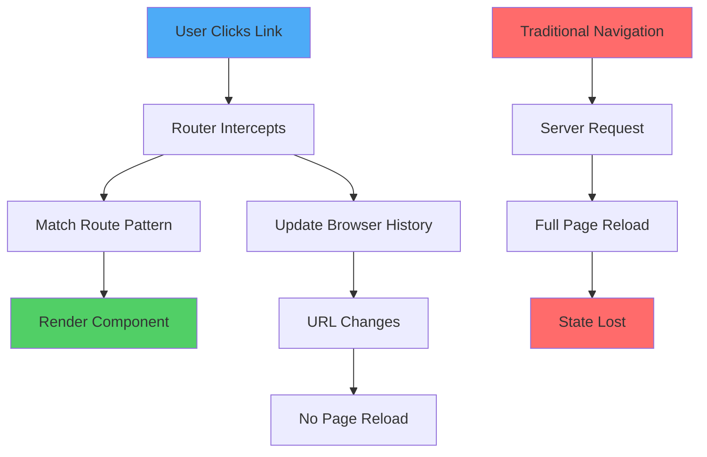
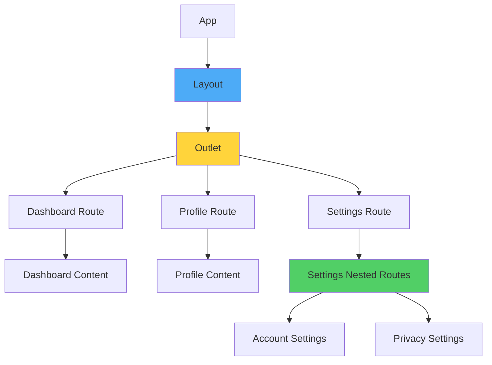
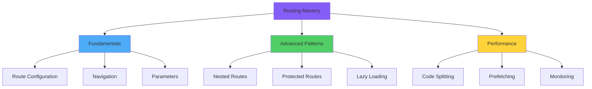

# React Router: Navigation and Routing Architecture

> A comprehensive exploration of client-side routing paradigms, navigation patterns, and authentication-driven route protection strategies in React applications

---

## Table of Contents

1. [Routing Paradigms and Architecture](#1-routing-paradigms-and-architecture)
2. [React Router Fundamentals](#2-react-router-fundamentals)
3. [Route Configuration and Navigation](#3-route-configuration-and-navigation)
4. [Dynamic Routing with Parameters](#4-dynamic-routing-with-parameters)
5. [Nested Routes and Layouts](#5-nested-routes-and-layouts)
6. [Protected Routes and Authentication](#6-protected-routes-and-authentication)
7. [Programmatic Navigation](#7-programmatic-navigation)
8. [Route Guards and Redirects](#8-route-guards-and-redirects)
9. [Advanced Routing Patterns](#9-advanced-routing-patterns)
10. [Performance Optimization](#10-performance-optimization)

---

## 1. Routing Paradigms and Architecture

### Client-Side Routing Fundamentals

**Client-side routing** enables single-page applications (SPAs) to simulate traditional multi-page navigation without server round-trips, utilizing the History API to manipulate browser URL state while maintaining application context.



### Router Types Comparison

```
┌────────────────────────────────────────────────────────────────┐
│            Router Implementation Types                         │
├────────────────────────────────────────────────────────────────┤
│                                                                │
│  BrowserRouter                                                 │
│  • Uses HTML5 History API                                      │
│  • Clean URLs: /about, /products/123                           │
│  • Requires server configuration                               │
│  • Production standard                                         │
│  Example: https://app.com/dashboard                            │
│                                                                │
│  HashRouter                                                    │
│  • Uses URL hash (#)                                           │
│  • URLs: /#/about, /#/products/123                             │
│  • No server configuration needed                              │
│  • Legacy browser support                                      │
│  Example: https://app.com/#/dashboard                          │
│                                                                │
│  MemoryRouter                                                  │
│  • Keeps history in memory                                     │
│  • No URL changes                                              │
│  • Testing environments                                        │
│  • Non-browser environments                                    │
│                                                                │
│  StaticRouter                                                  │
│  • Server-side rendering                                       │
│  • No history manipulation                                     │
│  • Node.js environments                                        │
│                                                                │
└────────────────────────────────────────────────────────────────┘
```

### Angular Router vs React Router Philosophy

```
Angular Router                  React Router
──────────────                 ─────────────

Opinionated Configuration      Flexible Component-Based
RouterModule.forRoot([])       <Routes><Route /></Routes>

Built-in Lazy Loading          Code-splitting via React.lazy()
loadChildren: () => import()   const Comp = lazy(() => import())

Route Guards                   Custom Components/Hooks
CanActivate, CanDeactivate     <ProtectedRoute>, useAuth()

Resolvers                      Data Loaders (v6.4+)
resolve: DataResolver          loader: async () => {}

Nested Routes (Outlets)        Nested <Routes> + <Outlet>
<router-outlet>                <Outlet />

Imperative Navigation          Declarative + Imperative
router.navigate(['/path'])     <Link to="/path" /> or navigate()
```

---

## 2. React Router Fundamentals

### Installation and Setup

```bash
# Install React Router v6 (latest)
npm install react-router-dom

# For TypeScript projects
npm install --save-dev @types/react-router-dom
```

### Basic Router Configuration

```jsx
import { BrowserRouter, Routes, Route, Link } from 'react-router-dom';

const App = () => {
  return (
    <BrowserRouter>
      <div className="app">
        {/* Navigation */}
        <nav>
          <Link to="/">Home</Link>
          <Link to="/about">About</Link>
          <Link to="/contact">Contact</Link>
        </nav>
        
        {/* Route Configuration */}
        <Routes>
          <Route path="/" element={<Home />} />
          <Route path="/about" element={<About />} />
          <Route path="/contact" element={<Contact />} />
          <Route path="*" element={<NotFound />} />
        </Routes>
      </div>
    </BrowserRouter>
  );
};

// Page Components
const Home = () => <h1>Home Page</h1>;
const About = () => <h1>About Page</h1>;
const Contact = () => <h1>Contact Page</h1>;
const NotFound = () => <h1>404 - Page Not Found</h1>;

export default App;
```

### Route Component Anatomy

```jsx
import { Routes, Route } from 'react-router-dom';

const AppRoutes = () => {
  return (
    <Routes>
      {/* Basic Route */}
      <Route path="/home" element={<Home />} />
      
      {/* Index Route (default child) */}
      <Route index element={<Dashboard />} />
      
      {/* Route with Path Parameter */}
      <Route path="/users/:userId" element={<UserProfile />} />
      
      {/* Route with Multiple Parameters */}
      <Route path="/posts/:category/:postId" element={<Post />} />
      
      {/* Route with Optional Parameter */}
      <Route path="/products/:id?" element={<Products />} />
      
      {/* Wildcard Route (Catch-all) */}
      <Route path="*" element={<NotFound />} />
      
      {/* Route with Query Parameters (handled in component) */}
      <Route path="/search" element={<SearchResults />} />
    </Routes>
  );
};
```

### Navigation Components

```jsx
import { Link, NavLink } from 'react-router-dom';

const Navigation = () => {
  return (
    <nav>
      {/* Basic Link */}
      <Link to="/home">Home</Link>
      
      {/* Link with State */}
      <Link 
        to="/profile" 
        state={{ from: 'navigation' }}
      >
        Profile
      </Link>
      
      {/* NavLink with Active Styling */}
      <NavLink
        to="/dashboard"
        className={({ isActive }) => 
          isActive ? 'nav-link active' : 'nav-link'
        }
        style={({ isActive }) => ({
          color: isActive ? '#007bff' : '#6c757d',
          fontWeight: isActive ? 'bold' : 'normal'
        })}
      >
        Dashboard
      </NavLink>
      
      {/* NavLink with Function Children */}
      <NavLink to="/settings">
        {({ isActive, isPending }) => (
          <span className={isActive ? 'active' : isPending ? 'pending' : ''}>
            Settings
          </span>
        )}
      </NavLink>
      
      {/* Replace Current History Entry */}
      <Link to="/login" replace>
        Login
      </Link>
      
      {/* Relative Navigation */}
      <Link to="../parent">Go to Parent</Link>
      <Link to="child">Go to Child</Link>
    </nav>
  );
};
```

### Router Hooks Overview

```jsx
import { 
  useNavigate,      // Programmatic navigation
  useParams,        // Access URL parameters
  useLocation,      // Current location object
  useSearchParams,  // Query string parameters
  useMatch,         // Match route pattern
  useRoutes,        // Define routes as objects
  useOutlet,        // Access nested route outlet
  useOutletContext  // Share context with outlet
} from 'react-router-dom';

const ComponentUsingHooks = () => {
  // Navigation function
  const navigate = useNavigate();
  
  // URL parameters: /users/:userId
  const { userId } = useParams();
  
  // Location object with pathname, search, hash, state
  const location = useLocation();
  
  // Query parameters: ?page=1&sort=desc
  const [searchParams, setSearchParams] = useSearchParams();
  const page = searchParams.get('page');
  
  // Check if route matches pattern
  const match = useMatch('/users/:userId');
  
  return (
    <div>
      <p>User ID: {userId}</p>
      <p>Current Path: {location.pathname}</p>
      <p>Page: {page}</p>
      <button onClick={() => navigate('/home')}>Go Home</button>
    </div>
  );
};
```

---

## 3. Route Configuration and Navigation

### Declarative Route Configuration

```jsx
import { BrowserRouter, Routes, Route } from 'react-router-dom';

const App = () => {
  return (
    <BrowserRouter>
      <Routes>
        {/* Public Routes */}
        <Route path="/" element={<Layout />}>
          <Route index element={<Home />} />
          <Route path="about" element={<About />} />
          <Route path="contact" element={<Contact />} />
          <Route path="blog">
            <Route index element={<BlogList />} />
            <Route path=":postId" element={<BlogPost />} />
          </Route>
        </Route>
        
        {/* Authentication Routes */}
        <Route path="/auth">
          <Route path="login" element={<Login />} />
          <Route path="register" element={<Register />} />
          <Route path="forgot-password" element={<ForgotPassword />} />
        </Route>
        
        {/* Protected Routes */}
        <Route path="/dashboard" element={<ProtectedRoute />}>
          <Route index element={<Dashboard />} />
          <Route path="profile" element={<Profile />} />
          <Route path="settings" element={<Settings />} />
        </Route>
        
        {/* 404 Not Found */}
        <Route path="*" element={<NotFound />} />
      </Routes>
    </BrowserRouter>
  );
};
```

### Object-Based Route Configuration

```jsx
import { useRoutes } from 'react-router-dom';

const routeConfig = [
  {
    path: '/',
    element: <Layout />,
    children: [
      { index: true, element: <Home /> },
      { path: 'about', element: <About /> },
      { path: 'contact', element: <Contact /> },
      {
        path: 'products',
        element: <ProductLayout />,
        children: [
          { index: true, element: <ProductList /> },
          { path: ':productId', element: <ProductDetails /> },
          { path: 'categories/:category', element: <CategoryProducts /> }
        ]
      }
    ]
  },
  {
    path: '/dashboard',
    element: <ProtectedRoute />,
    children: [
      { index: true, element: <Dashboard /> },
      { path: 'analytics', element: <Analytics /> },
      { path: 'reports', element: <Reports /> }
    ]
  },
  { path: '*', element: <NotFound /> }
];

const App = () => {
  const routes = useRoutes(routeConfig);
  return routes;
};
```

### Navigation with State

```jsx
import { Link, useLocation } from 'react-router-dom';

// Passing state via Link
const ProductList = () => {
  return (
    <div>
      <Link 
        to="/product/123" 
        state={{ 
          from: 'product-list',
          referrer: window.location.pathname,
          timestamp: Date.now()
        }}
      >
        View Product
      </Link>
    </div>
  );
};

// Accessing state in destination component
const ProductDetails = () => {
  const location = useLocation();
  const state = location.state;
  
  return (
    <div>
      <h1>Product Details</h1>
      {state?.from === 'product-list' && (
        <p>You came from the product list</p>
      )}
      <p>Referrer: {state?.referrer}</p>
    </div>
  );
};
```

### Advanced Navigation Patterns

```jsx
import { Link } from 'react-router-dom';

const AdvancedNavigation = () => {
  return (
    <nav>
      {/* Absolute Path */}
      <Link to="/about">About (Absolute)</Link>
      
      {/* Relative Path */}
      <Link to="profile">Profile (Relative)</Link>
      <Link to="./profile">./Profile (Explicit Relative)</Link>
      
      {/* Parent Navigation */}
      <Link to="..">Go Up One Level</Link>
      <Link to="../..">Go Up Two Levels</Link>
      
      {/* Preserve Search Params */}
      <Link to="/products" preventScrollReset>
        Products (No Scroll Reset)
      </Link>
      
      {/* External Link (not handled by Router) */}
      <a href="https://example.com" target="_blank" rel="noopener noreferrer">
        External Link
      </a>
      
      {/* Conditional Link */}
      {isLoggedIn ? (
        <Link to="/dashboard">Dashboard</Link>
      ) : (
        <Link to="/login">Login</Link>
      )}
    </nav>
  );
};
```

### Route Priority and Matching

```jsx
const Routes = () => {
  return (
    <Routes>
      {/* Specific routes should come first */}
      <Route path="/users/new" element={<CreateUser />} />
      <Route path="/users/:userId" element={<UserProfile />} />
      
      {/* More specific to less specific */}
      <Route path="/blog/latest" element={<LatestPosts />} />
      <Route path="/blog/:category" element={<CategoryPosts />} />
      <Route path="/blog/:category/:postId" element={<BlogPost />} />
      
      {/* Index route */}
      <Route index element={<Home />} />
      
      {/* Catch-all must be last */}
      <Route path="*" element={<NotFound />} />
    </Routes>
  );
};
```

---

## 4. Dynamic Routing with Parameters

### URL Parameters (Path Params)

```jsx
import { useParams, useNavigate } from 'react-router-dom';

// Route Configuration
<Route path="/users/:userId" element={<UserProfile />} />
<Route path="/posts/:category/:postId" element={<BlogPost />} />
<Route path="/products/:id/reviews/:reviewId" element={<Review />} />

// Accessing Parameters
const UserProfile = () => {
  const { userId } = useParams();
  const [user, setUser] = useState(null);
  
  useEffect(() => {
    // Fetch user data using userId
    fetchUser(userId).then(setUser);
  }, [userId]);
  
  if (!user) return <div>Loading...</div>;
  
  return (
    <div>
      <h1>{user.name}</h1>
      <p>User ID: {userId}</p>
    </div>
  );
};

// Multiple Parameters
const BlogPost = () => {
  const { category, postId } = useParams();
  
  return (
    <div>
      <h2>Category: {category}</h2>
      <p>Post ID: {postId}</p>
    </div>
  );
};

// Navigating with Parameters
const ProductList = () => {
  const navigate = useNavigate();
  
  const handleProductClick = (productId) => {
    navigate(`/products/${productId}`);
  };
  
  return (
    <div>
      {products.map(product => (
        <div key={product.id} onClick={() => handleProductClick(product.id)}>
          {product.name}
        </div>
      ))}
    </div>
  );
};
```

### Query Parameters (Search Params)

```jsx
import { useSearchParams } from 'react-router-dom';

// Route: /products?category=electronics&sort=price&order=asc

const ProductList = () => {
  const [searchParams, setSearchParams] = useSearchParams();
  
  // Reading query parameters
  const category = searchParams.get('category');      // 'electronics'
  const sort = searchParams.get('sort');              // 'price'
  const order = searchParams.get('order');            // 'asc'
  const page = searchParams.get('page') || '1';       // '1' (default)
  
  // Getting all parameters
  const allParams = Object.fromEntries(searchParams);
  // { category: 'electronics', sort: 'price', order: 'asc' }
  
  // Checking if parameter exists
  const hasCategory = searchParams.has('category');   // true
  
  // Setting query parameters
  const handleFilterChange = (newCategory) => {
    setSearchParams({
      category: newCategory,
      sort: sort || 'name',
      order: order || 'asc'
    });
  };
  
  // Updating single parameter
  const handleSortChange = (newSort) => {
    setSearchParams(prev => {
      prev.set('sort', newSort);
      return prev;
    });
  };
  
  // Removing parameter
  const clearCategory = () => {
    setSearchParams(prev => {
      prev.delete('category');
      return prev;
    });
  };
  
  // Batch update
  const resetFilters = () => {
    setSearchParams({});
  };
  
  return (
    <div>
      <h2>Products in {category}</h2>
      <p>Sorted by: {sort} ({order})</p>
      <p>Page: {page}</p>
      
      <button onClick={() => handleFilterChange('books')}>
        Show Books
      </button>
      <button onClick={() => handleSortChange('price')}>
        Sort by Price
      </button>
      <button onClick={clearCategory}>
        Clear Category
      </button>
      <button onClick={resetFilters}>
        Reset All Filters
      </button>
    </div>
  );
};
```

### Complex Parameter Patterns

```jsx
// Optional Parameters
<Route path="/products/:id?" element={<Products />} />

const Products = () => {
  const { id } = useParams();
  
  // If id exists, show single product, otherwise show list
  return id ? <ProductDetails id={id} /> : <ProductList />;
};

// Wildcard Parameters (Splat)
<Route path="/docs/*" element={<Documentation />} />

const Documentation = () => {
  const { '*': splatPath } = useParams();
  // URL: /docs/guides/getting-started
  // splatPath: "guides/getting-started"
  
  return <div>Viewing: {splatPath}</div>;
};

// Multiple Optional Parameters
<Route path="/shop/:category?/:subcategory?" element={<Shop />} />

const Shop = () => {
  const { category = 'all', subcategory } = useParams();
  
  return (
    <div>
      <h2>Category: {category}</h2>
      {subcategory && <h3>Subcategory: {subcategory}</h3>}
    </div>
  );
};
```

### Parameter Validation and Error Handling

```jsx
import { useParams, useNavigate } from 'react-router-dom';

const UserProfile = () => {
  const { userId } = useParams();
  const navigate = useNavigate();
  const [user, setUser] = useState(null);
  const [loading, setLoading] = useState(true);
  const [error, setError] = useState(null);
  
  useEffect(() => {
    // Validate parameter format
    if (!userId || !/^\d+$/.test(userId)) {
      setError('Invalid user ID');
      setLoading(false);
      return;
    }
    
    const fetchUser = async () => {
      try {
        setLoading(true);
        const response = await fetch(`/api/users/${userId}`);
        
        if (!response.ok) {
          if (response.status === 404) {
            throw new Error('User not found');
          }
          throw new Error('Failed to fetch user');
        }
        
        const data = await response.json();
        setUser(data);
      } catch (err) {
        setError(err.message);
      } finally {
        setLoading(false);
      }
    };
    
    fetchUser();
  }, [userId]);
  
  if (loading) return <LoadingSpinner />;
  
  if (error) {
    return (
      <div className="error-container">
        <h2>Error</h2>
        <p>{error}</p>
        <button onClick={() => navigate('/users')}>
          Back to Users
        </button>
      </div>
    );
  }
  
  return (
    <div>
      <h1>{user.name}</h1>
      <p>Email: {user.email}</p>
    </div>
  );
};
```

### Type-Safe Parameters (TypeScript)

```typescript
import { useParams } from 'react-router-dom';

// Define parameter types
type UserParams = {
  userId: string;
};

type BlogPostParams = {
  category: string;
  postId: string;
};

// Type-safe parameter access
const UserProfile: React.FC = () => {
  const { userId } = useParams<UserParams>();
  // userId is typed as string | undefined
  
  if (!userId) {
    return <NotFound />;
  }
  
  // Now userId is guaranteed to exist
  const numericId = parseInt(userId, 10);
  
  return <div>User ID: {numericId}</div>;
};

// Generic parameter extraction
function useTypedParams<T extends Record<string, string>>() {
  return useParams<T>() as T;
}

const BlogPost: React.FC = () => {
  const { category, postId } = useTypedParams<BlogPostParams>();
  
  return (
    <div>
      <h2>{category}</h2>
      <p>Post: {postId}</p>
    </div>
  );
};
```

---

## 5. Nested Routes and Layouts

### Nested Route Architecture



### Basic Nested Routes

```jsx
import { Routes, Route, Outlet, Link } from 'react-router-dom';

// Parent Layout Component
const DashboardLayout = () => {
  return (
    <div className="dashboard">
      <aside className="sidebar">
        <nav>
          <Link to="/dashboard">Overview</Link>
          <Link to="/dashboard/analytics">Analytics</Link>
          <Link to="/dashboard/reports">Reports</Link>
          <Link to="/dashboard/settings">Settings</Link>
        </nav>
      </aside>
      
      <main className="content">
        {/* Child routes render here */}
        <Outlet />
      </main>
    </div>
  );
};

// Route Configuration
const App = () => {
  return (
    <Routes>
      <Route path="/dashboard" element={<DashboardLayout />}>
        <Route index element={<DashboardOverview />} />
        <Route path="analytics" element={<Analytics />} />
        <Route path="reports" element={<Reports />} />
        <Route path="settings" element={<Settings />} />
      </Route>
    </Routes>
  );
};
```

### Multi-Level Nested Routes

```jsx
// Three levels of nesting
const App = () => {
  return (
    <Routes>
      {/* Level 1: Main Layout */}
      <Route path="/" element={<MainLayout />}>
        <Route index element={<Home />} />
        
        {/* Level 2: Dashboard Layout */}
        <Route path="dashboard" element={<DashboardLayout />}>
          <Route index element={<DashboardHome />} />
          
          {/* Level 3: Settings Layout */}
          <Route path="settings" element={<SettingsLayout />}>
            <Route index element={<GeneralSettings />} />
            <Route path="account" element={<AccountSettings />} />
            <Route path="privacy" element={<PrivacySettings />} />
            <Route path="notifications" element={<NotificationSettings />} />
          </Route>
          
          <Route path="analytics" element={<Analytics />} />
          <Route path="reports" element={<Reports />} />
        </Route>
        
        <Route path="about" element={<About />} />
      </Route>
    </Routes>
  );
};

// Level 1 Layout
const MainLayout = () => {
  return (
    <div>
      <header>
        <nav>
          <Link to="/">Home</Link>
          <Link to="/dashboard">Dashboard</Link>
          <Link to="/about">About</Link>
        </nav>
      </header>
      <Outlet />
      <footer>© 2025 My App</footer>
    </div>
  );
};

// Level 2 Layout
const DashboardLayout = () => {
  return (
    <div className="dashboard">
      <aside>
        <Link to="/dashboard">Overview</Link>
        <Link to="/dashboard/settings">Settings</Link>
        <Link to="/dashboard/analytics">Analytics</Link>
      </aside>
      <main>
        <Outlet />
      </main>
    </div>
  );
};

// Level 3 Layout
const SettingsLayout = () => {
  return (
    <div className="settings">
      <nav className="settings-nav">
        <Link to="/dashboard/settings">General</Link>
        <Link to="/dashboard/settings/account">Account</Link>
        <Link to="/dashboard/settings/privacy">Privacy</Link>
        <Link to="/dashboard/settings/notifications">Notifications</Link>
      </nav>
      <div className="settings-content">
        <Outlet />
      </div>
    </div>
  );
};
```

### Outlet Context Sharing

```jsx
import { Outlet, useOutletContext } from 'react-router-dom';

// Parent providing context
const DashboardLayout = () => {
  const [user, setUser] = useState(null);
  const [theme, setTheme] = useState('light');
  
  const contextValue = {
    user,
    setUser,
    theme,
    setTheme,
    toggleTheme: () => setTheme(theme === 'light' ? 'dark' : 'light')
  };
  
  return (
    <div className={`dashboard theme-${theme}`}>
      <header>Dashboard Header</header>
      <Outlet context={contextValue} />
    </div>
  );
};

// Child consuming context
const Profile = () => {
  const { user, theme, toggleTheme } = useOutletContext();
  
  return (
    <div>
      <h1>{user?.name}'s Profile</h1>
      <p>Current theme: {theme}</p>
      <button onClick={toggleTheme}>Toggle Theme</button>
    </div>
  );
};

// Type-safe context (TypeScript)
type DashboardContext = {
  user: User | null;
  setUser: (user: User | null) => void;
  theme: 'light' | 'dark';
  setTheme: (theme: 'light' | 'dark') => void;
  toggleTheme: () => void;
};

function useTypedOutletContext<T>() {
  return useOutletContext<T>();
}

const Settings: React.FC = () => {
  const { user, theme } = useTypedOutletContext<DashboardContext>();
  // Fully typed context
  return <div>{user?.name}</div>;
};
```

### Index Routes

```jsx
// Index routes render at parent's path
<Routes>
  <Route path="/" element={<Layout />}>
    {/* Renders at "/" */}
    <Route index element={<Home />} />
    
    <Route path="dashboard" element={<DashboardLayout />}>
      {/* Renders at "/dashboard" */}
      <Route index element={<DashboardOverview />} />
      
      {/* Renders at "/dashboard/analytics" */}
      <Route path="analytics" element={<Analytics />} />
    </Route>
  </Route>
</Routes>

// Without index route
<Routes>
  <Route path="/" element={<Layout />}>
    {/* Nothing renders at "/" - only shows Layout */}
    <Route path="home" element={<Home />} />  {/* Renders at "/home" */}
  </Route>
</Routes>
```

### Layout Route Patterns

```jsx
// Shared Layout for Multiple Routes
const AuthLayout = () => {
  return (
    <div className="auth-layout">
      <div className="auth-sidebar">
        
        <p>Welcome back!</p>
      </div>
      <div className="auth-content">
        <Outlet />
      </div>
    </div>
  );
};

<Routes>
  <Route element={<AuthLayout />}>
    <Route path="/login" element={<Login />} />
    <Route path="/register" element={<Register />} />
    <Route path="/forgot-password" element={<ForgotPassword />} />
  </Route>
</Routes>

// Alternative: Layout without path
<Routes>
  <Route path="/" element={<MainLayout />}>
    <Route index element={<Home />} />
    
    {/* Nested layout without changing URL structure */}
    <Route element={<DashboardLayout />}>
      <Route path="dashboard" element={<Dashboard />} />
      <Route path="analytics" element={<Analytics />} />
    </Route>
  </Route>
</Routes>
```

---

## 6. Protected Routes and Authentication

### Basic Protected Route Implementation

```jsx
import { Navigate, Outlet } from 'react-router-dom';

// Simple authentication check
const ProtectedRoute = () => {
  const isAuthenticated = localStorage.getItem('token') !== null;
  
  return isAuthenticated ? <Outlet /> : <Navigate to="/login" replace />;
};

// Usage
<Routes>
  <Route path="/login" element={<Login />} />
  
  <Route element={<ProtectedRoute />}>
    <Route path="/dashboard" element={<Dashboard />} />
    <Route path="/profile" element={<Profile />} />
    <Route path="/settings" element={<Settings />} />
  </Route>
</Routes>
```

### Authentication Context Pattern

```jsx
import { createContext, useContext, useState, useEffect } from 'react';
import { Navigate, Outlet, useLocation } from 'react-router-dom';

// Auth Context
const AuthContext = createContext(null);

export const AuthProvider = ({ children }) => {
  const [user, setUser] = useState(null);
  const [loading, setLoading] = useState(true);
  
  useEffect(() => {
    // Check if user is logged in on mount
    const initAuth = async () => {
      try {
        const token = localStorage.getItem('token');
        if (token) {
          const response = await fetch('/api/auth/verify', {
            headers: { Authorization: `Bearer ${token}` }
          });
          
          if (response.ok) {
            const userData = await response.json();
            setUser(userData);
          } else {
            localStorage.removeItem('token');
          }
        }
      } catch (error) {
        console.error('Auth initialization failed:', error);
      } finally {
        setLoading(false);
      }
    };
    
    initAuth();
  }, []);
  
  const login = async (credentials) => {
    const response = await fetch('/api/auth/login', {
      method: 'POST',
      headers: { 'Content-Type': 'application/json' },
      body: JSON.stringify(credentials)
    });
    
    if (!response.ok) {
      throw new Error('Login failed');
    }
    
    const { user, token } = await response.json();
    localStorage.setItem('token', token);
    setUser(user);
  };
  
  const logout = () => {
    localStorage.removeItem('token');
    setUser(null);
  };
  
  const value = {
    user,
    loading,
    login,
    logout,
    isAuthenticated: !!user
  };
  
  return (
    <AuthContext.Provider value={value}>
      {children}
    </AuthContext.Provider>
  );
};

// Custom hook to use auth
export const useAuth = () => {
  const context = useContext(AuthContext);
  if (!context) {
    throw new Error('useAuth must be used within AuthProvider');
  }
  return context;
};

// Protected Route Component
const ProtectedRoute = () => {
  const { isAuthenticated, loading } = useAuth();
  const location = useLocation();
  
  if (loading) {
    return <LoadingSpinner />;
  }
  
  if (!isAuthenticated) {
    // Redirect to login, saving the attempted location
    return <Navigate to="/login" state={{ from: location }} replace />;
  }
  
  return <Outlet />;
};

// Login Component
const Login = () => {
  const { login } = useAuth();
  const navigate = useNavigate();
  const location = useLocation();
  const [error, setError] = useState('');
  
  const from = location.state?.from?.pathname || '/dashboard';
  
  const handleSubmit = async (e) => {
    e.preventDefault();
    try {
      await login({ email, password });
      navigate(from, { replace: true });
    } catch (err) {
      setError(err.message);
    }
  };
  
  return (
    <form onSubmit={handleSubmit}>
      {error && <div className="error">{error}</div>}
      {/* Form fields */}
    </form>
  );
};

// App Setup
const App = () => {
  return (
    <AuthProvider>
      <BrowserRouter>
        <Routes>
          <Route path="/login" element={<Login />} />
          <Route path="/register" element={<Register />} />
          
          <Route element={<ProtectedRoute />}>
            <Route path="/dashboard" element={<Dashboard />} />
            <Route path="/profile" element={<Profile />} />
          </Route>
        </Routes>
      </BrowserRouter>
    </AuthProvider>
  );
};
```

### Role-Based Access Control (RBAC)

```jsx
const RoleProtectedRoute = ({ allowedRoles }) => {
  const { user, isAuthenticated, loading } = useAuth();
  const location = useLocation();
  
  if (loading) {
    return <LoadingSpinner />;
  }
  
  if (!isAuthenticated) {
    return <Navigate to="/login" state={{ from: location }} replace />;
  }
  
  if (!allowedRoles.includes(user.role)) {
    return <Navigate to="/unauthorized" replace />;
  }
  
  return <Outlet />;
};

// Usage
<Routes>
  {/* Admin only routes */}
  <Route element={<RoleProtectedRoute allowedRoles={['admin']} />}>
    <Route path="/admin" element={<AdminDashboard />} />
    <Route path="/admin/users" element={<UserManagement />} />
  </Route>
  
  {/* Admin and Manager routes */}
  <Route element={<RoleProtectedRoute allowedRoles={['admin', 'manager']} />}>
    <Route path="/reports" element={<Reports />} />
    <Route path="/analytics" element={<Analytics />} />
  </Route>
  
  {/* All authenticated users */}
  <Route element={<ProtectedRoute />}>
    <Route path="/dashboard" element={<Dashboard />} />
  </Route>
</Routes>
```

### Permission-Based Access

```jsx
const PermissionProtectedRoute = ({ requiredPermissions }) => {
  const { user, isAuthenticated, loading } = useAuth();
  const location = useLocation();
  
  if (loading) return <LoadingSpinner />;
  
  if (!isAuthenticated) {
    return <Navigate to="/login" state={{ from: location }} replace />;
  }
  
  const hasRequiredPermissions = requiredPermissions.every(
    permission => user.permissions?.includes(permission)
  );
  
  if (!hasRequiredPermissions) {
    return <Navigate to="/unauthorized" replace />;
  }
  
  return <Outlet />;
};

// Usage
<Routes>
  <Route element={
    <PermissionProtectedRoute 
      requiredPermissions={['user.read', 'user.write']} 
    />
  }>
    <Route path="/users" element={<UserManagement />} />
  </Route>
  
  <Route element={
    <PermissionProtectedRoute 
      requiredPermissions={['reports.read']} 
    />
  }>
    <Route path="/reports" element={<Reports />} />
  </Route>
</Routes>
```

### Conditional Route Rendering

```jsx
const ConditionalRoute = () => {
  const { user, isAuthenticated } = useAuth();
  
  // Render different components based on auth state
  if (!isAuthenticated) {
    return <PublicLayout />;
  }
  
  if (user.role === 'admin') {
    return <AdminLayout />;
  }
  
  return <UserLayout />;
};

// Or using route configuration
const routes = (isAuthenticated, user) => [
  {
    path: '/',
    element: isAuthenticated ? <DashboardLayout /> : <PublicLayout />,
    children: isAuthenticated ? [
      { index: true, element: <Dashboard /> },
      { path: 'profile', element: <Profile /> }
    ] : [
      { index: true, element: <Home /> },
      { path: 'about', element: <About /> }
    ]
  }
];
```

---

## 7. Programmatic Navigation

### useNavigate Hook

```jsx
import { useNavigate } from 'react-router-dom';

const Component = () => {
  const navigate = useNavigate();
  
  // Basic navigation
  const goToHome = () => {
    navigate('/');
  };
  
  // Navigate with state
  const goToProfile = () => {
    navigate('/profile', {
      state: { from: 'dashboard', timestamp: Date.now() }
    });
  };
  
  // Replace current entry (no back button)
  const redirectToLogin = () => {
    navigate('/login', { replace: true });
  };
  
  // Relative navigation
  const goToParent = () => {
    navigate('..');  // Go up one level
  };
  
  const goToSibling = () => {
    navigate('../sibling');  // Go to sibling route
  };
  
  // Navigate with query parameters
  const goToSearch = () => {
    navigate('/search?q=react&page=1');
  };
  
  // Navigate back/forward
  const goBack = () => {
    navigate(-1);  // Go back one page
  };
  
  const goForward = () => {
    navigate(1);   // Go forward one page
  };
  
  const goBackTwice = () => {
    navigate(-2);  // Go back two pages
  };
  
  return (
    <div>
      <button onClick={goToHome}>Home</button>
      <button onClick={goToProfile}>Profile</button>
      <button onClick={goBack}>Back</button>
    </div>
  );
};
```

### Navigation After Form Submission

```jsx
const CreatePost = () => {
  const navigate = useNavigate();
  const [loading, setLoading] = useState(false);
  const [error, setError] = useState(null);
  
  const handleSubmit = async (e) => {
    e.preventDefault();
    
    try {
      setLoading(true);
      setError(null);
      
      const response = await fetch('/api/posts', {
        method: 'POST',
        headers: { 'Content-Type': 'application/json' },
        body: JSON.stringify(formData)
      });
      
      if (!response.ok) {
        throw new Error('Failed to create post');
      }
      
      const newPost = await response.json();
      
      // Navigate to the new post with success message
      navigate(`/posts/${newPost.id}`, {
        state: { message: 'Post created successfully!' }
      });
      
    } catch (err) {
      setError(err.message);
    } finally {
      setLoading(false);
    }
  };
  
  return (
    <form onSubmit={handleSubmit}>
      {error && <div className="error">{error}</div>}
      {/* Form fields */}
      <button type="submit" disabled={loading}>
        {loading ? 'Creating...' : 'Create Post'}
      </button>
    </form>
  );
};

// Destination component showing success message
const PostDetails = () => {
  const location = useLocation();
  const message = location.state?.message;
  
  useEffect(() => {
    if (message) {
      // Show toast notification
      toast.success(message);
      
      // Clear message from history state
      window.history.replaceState({}, document.title);
    }
  }, [message]);
  
  return <div>{/* Post details */}</div>;
};
```

### Conditional Navigation

```jsx
const ProtectedAction = () => {
  const navigate = useNavigate();
  const { isAuthenticated } = useAuth();
  
  const handleAction = async () => {
    // Check authentication before proceeding
    if (!isAuthenticated) {
      navigate('/login', {
        state: { 
          from: location.pathname,
          message: 'Please login to continue' 
        }
      });
      return;
    }
    
    try {
      await performAction();
      navigate('/success');
    } catch (error) {
      navigate('/error', { state: { error: error.message } });
    }
  };
  
  return <button onClick={handleAction}>Perform Action</button>;
};
```

### Navigation with Confirmation

```jsx
const DeleteItem = ({ itemId }) => {
  const navigate = useNavigate();
  
  const handleDelete = async () => {
    // Confirm before navigation
    const confirmed = window.confirm('Are you sure you want to delete this item?');
    
    if (!confirmed) return;
    
    try {
      await fetch(`/api/items/${itemId}`, { method: 'DELETE' });
      
      // Navigate with success state
      navigate('/items', {
        replace: true,
        state: { message: 'Item deleted successfully' }
      });
    } catch (error) {
      alert('Failed to delete item');
    }
  };
  
  return <button onClick={handleDelete}>Delete</button>;
};
```

### Navigation Helpers

```jsx
// Custom hook for safe navigation
const useSafeNavigate = () => {
  const navigate = useNavigate();
  const [isNavigating, setIsNavigating] = useState(false);
  
  const safeNavigate = async (to, options = {}) => {
    if (isNavigating) return;
    
    setIsNavigating(true);
    
    try {
      // Perform any pre-navigation checks
      await performChecks();
      navigate(to, options);
    } catch (error) {
      console.error('Navigation failed:', error);
    } finally {
      setIsNavigating(false);
    }
  };
  
  return { navigate: safeNavigate, isNavigating };
};

// Usage
const Component = () => {
  const { navigate, isNavigating } = useSafeNavigate();
  
  return (
    <button 
      onClick={() => navigate('/next')}
      disabled={isNavigating}
    >
      Next
    </button>
  );
};
```

---

## 8. Route Guards and Redirects

### Redirect Component

```jsx
import { Navigate } from 'react-router-dom';

// Simple redirect
<Route path="/old-path" element={<Navigate to="/new-path" replace />} />

// Conditional redirect
const HomeRedirect = () => {
  const { isAuthenticated } = useAuth();
  
  return isAuthenticated 
    ? <Navigate to="/dashboard" replace />
    : <Navigate to="/login" replace />;
};

<Route path="/" element={<HomeRedirect />} />

// Redirect with state
const LegacyRoute = () => {
  return (
    <Navigate 
      to="/new-location" 
      replace 
      state={{ from: 'legacy-route', migrated: true }}
    />
  );
};
```

### Before Navigation Guards

```jsx
// Custom hook for navigation blocking
import { useEffect } from 'react';
import { useNavigate, useLocation } from 'react-router-dom';

const useNavigationGuard = (shouldBlock, message) => {
  useEffect(() => {
    if (!shouldBlock) return;
    
    const handleBeforeUnload = (e) => {
      e.preventDefault();
      e.returnValue = message;
      return message;
    };
    
    window.addEventListener('beforeunload', handleBeforeUnload);
    
    return () => {
      window.removeEventListener('beforeunload', handleBeforeUnload);
    };
  }, [shouldBlock, message]);
};

// Usage in form component
const FormWithGuard = () => {
  const [formData, setFormData] = useState({});
  const [hasUnsavedChanges, setHasUnsavedChanges] = useState(false);
  
  useNavigationGuard(
    hasUnsavedChanges,
    'You have unsaved changes. Are you sure you want to leave?'
  );
  
  const handleChange = (e) => {
    setFormData({ ...formData, [e.target.name]: e.target.value });
    setHasUnsavedChanges(true);
  };
  
  const handleSubmit = async (e) => {
    e.preventDefault();
    await saveForm(formData);
    setHasUnsavedChanges(false);
  };
  
  return (
    <form onSubmit={handleSubmit}>
      {/* Form fields */}
    </form>
  );
};
```

### Custom Prompt Component (React Router v6)

```jsx
import { useEffect, useCallback } from 'react';
import { useNavigate, useLocation, UNSAFE_NavigationContext } from 'react-router-dom';

const usePrompt = (message, when = true) => {
  const { navigator } = useContext(UNSAFE_NavigationContext);
  
  useEffect(() => {
    if (!when) return;
    
    const push = navigator.push;
    
    navigator.push = (...args) => {
      const result = window.confirm(message);
      if (result) {
        push(...args);
      }
    };
    
    return () => {
      navigator.push = push;
    };
  }, [navigator, message, when]);
};

// Usage
const EditProfile = () => {
  const [isDirty, setIsDirty] = useState(false);
  
  usePrompt(
    'You have unsaved changes. Do you want to leave?',
    isDirty
  );
  
  return <form>{/* Form content */}</form>;
};
```

### Route-Level Guards

```jsx
// Guard component that checks conditions before rendering
const RouteGuard = ({ children, canActivate, fallback }) => {
  const [allowed, setAllowed] = useState(null);
  const location = useLocation();
  
  useEffect(() => {
    const checkPermission = async () => {
      const result = await canActivate(location);
      setAllowed(result);
    };
    
    checkPermission();
  }, [location, canActivate]);
  
  if (allowed === null) {
    return <LoadingSpinner />;
  }
  
  if (!allowed) {
    return fallback || <Navigate to="/unauthorized" replace />;
  }
  
  return children;
};

// Usage
const canAccessAdminPanel = async (location) => {
  const user = await getCurrentUser();
  return user?.role === 'admin';
};

<Route 
  path="/admin" 
  element={
    <RouteGuard 
      canActivate={canAccessAdminPanel}
      fallback={<Navigate to="/dashboard" />}
    >
      <AdminPanel />
    </RouteGuard>
  } 
/>
```

### Maintenance Mode Redirect

```jsx
const MaintenanceGuard = ({ children }) => {
  const [isMaintenanceMode, setIsMaintenanceMode] = useState(false);
  
  useEffect(() => {
    // Check maintenance status
    fetch('/api/status')
      .then(res => res.json())
      .then(data => setIsMaintenanceMode(data.maintenance));
  }, []);
  
  if (isMaintenanceMode) {
    return <Navigate to="/maintenance" replace />;
  }
  
  return children;
};

// Wrap app with maintenance guard
const App = () => {
  return (
    <BrowserRouter>
      <MaintenanceGuard>
        <Routes>
          {/* Your routes */}
        </Routes>
      </MaintenanceGuard>
    </BrowserRouter>
  );
};
```

### Feature Flag Routing

```jsx
const FeatureRoute = ({ feature, children, fallback }) => {
  const { features } = useFeatureFlags();
  
  if (!features[feature]) {
    return fallback || <Navigate to="/" replace />;
  }
  
  return children;
};

// Usage
<Route 
  path="/new-feature" 
  element={
    <FeatureRoute 
      feature="newFeatureEnabled"
      fallback={<ComingSoon />}
    >
      <NewFeature />
    </FeatureRoute>
  } 
/>
```

---

## 9. Advanced Routing Patterns

### Lazy Loading and Code Splitting

```jsx
import { lazy, Suspense } from 'react';
import { Routes, Route } from 'react-router-dom';

// Lazy load components
const Dashboard = lazy(() => import('./pages/Dashboard'));
const Analytics = lazy(() => import('./pages/Analytics'));
const Reports = lazy(() => import('./pages/Reports'));
const Settings = lazy(() => import('./pages/Settings'));

const App = () => {
  return (
    <Routes>
      <Route path="/" element={<Home />} />
      
      <Route path="/dashboard" element={
        <Suspense fallback={<LoadingSpinner />}>
          <Dashboard />
        </Suspense>
      } />
      
      <Route path="/analytics" element={
        <Suspense fallback={<LoadingSpinner />}>
          <Analytics />
        </Suspense>
      } />
    </Routes>
  );
};

// Better: Wrap with higher-order component
const lazyLoad = (importFunc, fallback = <LoadingSpinner />) => {
  const LazyComponent = lazy(importFunc);
  
  return (props) => (
    <Suspense fallback={fallback}>
      <LazyComponent {...props} />
    </Suspense>
  );
};

// Usage
const Dashboard = lazyLoad(() => import('./pages/Dashboard'));
const Analytics = lazyLoad(() => import('./pages/Analytics'));

<Route path="/dashboard" element={<Dashboard />} />
```

### Data Loading (React Router v6.4+)

```jsx
import { createBrowserRouter, RouterProvider } from 'react-router-dom';

// Loader function
const userLoader = async ({ params }) => {
  const response = await fetch(`/api/users/${params.userId}`);
  if (!response.ok) {
    throw new Response('User not found', { status: 404 });
  }
  return response.json();
};

// Route with loader
const router = createBrowserRouter([
  {
    path: '/users/:userId',
    element: <UserProfile />,
    loader: userLoader,
    errorElement: <ErrorBoundary />
  }
]);

// Access loaded data in component
import { useLoaderData } from 'react-router-dom';

const UserProfile = () => {
  const user = useLoaderData();
  
  return (
    <div>
      <h1>{user.name}</h1>
      <p>{user.email}</p>
    </div>
  );
};

// App setup
const App = () => {
  return <RouterProvider router={router} />;
};
```

### Action Handlers (v6.4+)

```jsx
// Action function for form submissions
const createPostAction = async ({ request }) => {
  const formData = await request.formData();
  const post = {
    title: formData.get('title'),
    content: formData.get('content')
  };
  
  const response = await fetch('/api/posts', {
    method: 'POST',
    headers: { 'Content-Type': 'application/json' },
    body: JSON.stringify(post)
  });
  
  if (!response.ok) {
    return { error: 'Failed to create post' };
  }
  
  return redirect(`/posts/${(await response.json()).id}`);
};

// Route with action
const router = createBrowserRouter([
  {
    path: '/posts/new',
    element: <CreatePost />,
    action: createPostAction
  }
]);

// Component using action
import { Form, useActionData, useNavigation } from 'react-router-dom';

const CreatePost = () => {
  const actionData = useActionData();
  const navigation = useNavigation();
  const isSubmitting = navigation.state === 'submitting';
  
  return (
    <Form method="post">
      {actionData?.error && (
        <div className="error">{actionData.error}</div>
      )}
      
      <input type="text" name="title" required />
      <textarea name="content" required />
      
      <button type="submit" disabled={isSubmitting}>
        {isSubmitting ? 'Creating...' : 'Create Post'}
      </button>
    </Form>
  );
};
```

### Modal Routes

```jsx
import { useLocation, useNavigate } from 'react-router-dom';

const App = () => {
  const location = useLocation();
  const state = location.state;
  
  return (
    <div>
      <Routes location={state?.backgroundLocation || location}>
        <Route path="/" element={<Home />} />
        <Route path="/gallery" element={<Gallery />} />
        <Route path="/photo/:id" element={<PhotoDetails />} />
      </Routes>
      
      {/* Modal route rendered on top */}
      {state?.backgroundLocation && (
        <Routes>
          <Route path="/photo/:id" element={<PhotoModal />} />
        </Routes>
      )}
    </div>
  );
};

// Gallery with modal links
const Gallery = () => {
  const location = useLocation();
  
  return (
    <div className="gallery">
      {photos.map(photo => (
        <Link
          key={photo.id}
          to={`/photo/${photo.id}`}
          state={{ backgroundLocation: location }}
        >
          
        </Link>
      ))}
    </div>
  );
};

// Modal component
const PhotoModal = () => {
  const navigate = useNavigate();
  const { id } = useParams();
  const photo = usePhotoDetails(id);
  
  const closeModal = () => {
    navigate(-1);
  };
  
  return (
    <div className="modal-overlay" onClick={closeModal}>
      <div className="modal-content" onClick={(e) => e.stopPropagation()}>
        <button onClick={closeModal}>Close</button>
        
      </div>
    </div>
  );
};
```

### Route Animation Transitions

```jsx
import { useLocation, Routes, Route } from 'react-router-dom';
import { AnimatePresence, motion } from 'framer-motion';

const AnimatedRoutes = () => {
  const location = useLocation();
  
  return (
    <AnimatePresence mode="wait">
      <Routes location={location} key={location.pathname}>
        <Route path="/" element={
          <motion.div
            initial={{ opacity: 0, x: -100 }}
            animate={{ opacity: 1, x: 0 }}
            exit={{ opacity: 0, x: 100 }}
            transition={{ duration: 0.3 }}
          >
            <Home />
          </motion.div>
        } />
        
        <Route path="/about" element={
          <motion.div
            initial={{ opacity: 0, scale: 0.8 }}
            animate={{ opacity: 1, scale: 1 }}
            exit={{ opacity: 0, scale: 0.8 }}
            transition={{ duration: 0.3 }}
          >
            <About />
          </motion.div>
        } />
      </Routes>
    </AnimatePresence>
  );
};
```

---

## 10. Performance Optimization

### Route-Based Code Splitting Strategy

```jsx
// Organize imports by route priority
// Critical routes (immediately needed)
import Home from './pages/Home';
import Login from './pages/Login';

// Lazy load secondary routes
const Dashboard = lazy(() => import('./pages/Dashboard'));
const Profile = lazy(() => import('./pages/Profile'));

// Lazy load rarely accessed routes
const AdminPanel = lazy(() => import('./pages/AdminPanel'));
const Reports = lazy(() => import('./pages/Reports'));

// Preload on hover or interaction
const preloadDashboard = () => {
  import('./pages/Dashboard');
};

<Link 
  to="/dashboard" 
  onMouseEnter={preloadDashboard}
  onFocus={preloadDashboard}
>
  Dashboard
</Link>
```

### Route Prefetching

```jsx
import { lazy } from 'react';

// Custom prefetch utility
const prefetchRoute = (importFunc) => {
  let promise;
  
  return {
    Component: lazy(importFunc),
    prefetch: () => {
      if (!promise) {
        promise = importFunc();
      }
      return promise;
    }
  };
};

// Usage
const dashboardRoute = prefetchRoute(() => import('./pages/Dashboard'));

// Prefetch on interaction
<Link 
  to="/dashboard"
  onMouseEnter={() => dashboardRoute.prefetch()}
>
  Dashboard
</Link>

// Use prefetched component
<Route path="/dashboard" element={<dashboardRoute.Component />} />
```

### Scroll Restoration

```jsx
import { useEffect } from 'react';
import { useLocation } from 'react-router-dom';

const ScrollToTop = () => {
  const { pathname } = useLocation();
  
  useEffect(() => {
    window.scrollTo(0, 0);
  }, [pathname]);
  
  return null;
};

// Usage in App
const App = () => {
  return (
    <BrowserRouter>
      <ScrollToTop />
      <Routes>
        {/* Routes */}
      </Routes>
    </BrowserRouter>
  );
};

// Advanced: Save and restore scroll position
const useScrollRestoration = () => {
  const location = useLocation();
  const scrollPositions = useRef({});
  
  useEffect(() => {
    // Save scroll position when leaving
    const handleRouteChange = () => {
      scrollPositions.current[location.key] = window.scrollY;
    };
    
    window.addEventListener('beforeunload', handleRouteChange);
    
    return () => {
      window.removeEventListener('beforeunload', handleRouteChange);
    };
  }, [location]);
  
  useEffect(() => {
    // Restore scroll position
    const savedPosition = scrollPositions.current[location.key];
    if (savedPosition !== undefined) {
      window.scrollTo(0, savedPosition);
    } else {
      window.scrollTo(0, 0);
    }
  }, [location]);
};
```

### Performance Monitoring

```jsx
import { useEffect } from 'react';
import { useLocation } from 'react-router-dom';

const RoutePerformanceMonitor = () => {
  const location = useLocation();
  
  useEffect(() => {
    const startTime = performance.now();
    
    return () => {
      const endTime = performance.now();
      const duration = endTime - startTime;
      
      // Log or send to analytics
      console.log(`Route ${location.pathname} rendered in ${duration}ms`);
      
      // Send to analytics service
      analytics.track('route_render', {
        path: location.pathname,
        duration: duration,
        timestamp: new Date().toISOString()
      });
    };
  }, [location]);
  
  return null;
};
```

---

## Conclusion: Mastering Navigation Architecture



### Essential Principles

1. **Declarative Configuration**: Define routes as components for clarity
2. **Authentication Integration**: Protect routes with context and guards
3. **Performance First**: Implement code splitting and lazy loading
4. **User Experience**: Maintain history state and smooth transitions
5. **Type Safety**: Leverage TypeScript for route parameters

### Resources

- 📘 [React Router Documentation](https://reactrouter.com/)
- 🎓 [Authentication Patterns](https://ui.dev/react-router-authentication)
- 🛠️ [Advanced Routing](https://remix.run/docs)

**Navigazione magistrale per l'eccellenza architettonica! 🧭**