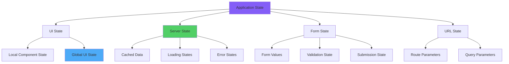
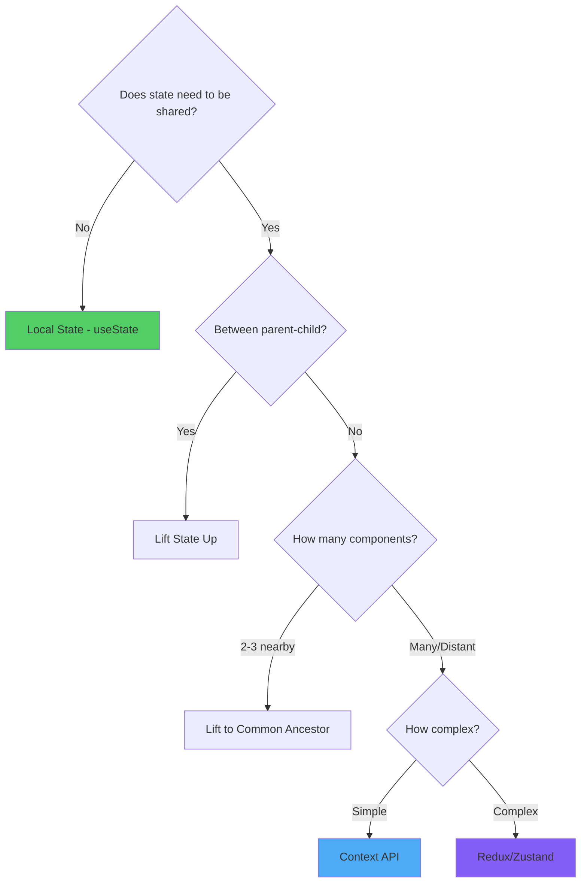
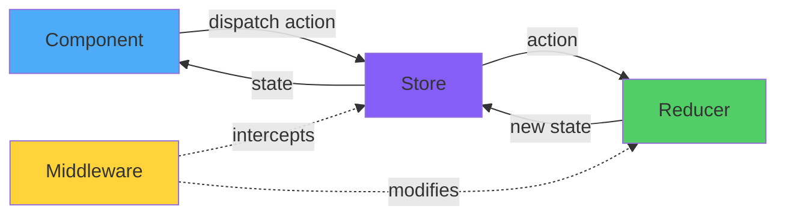
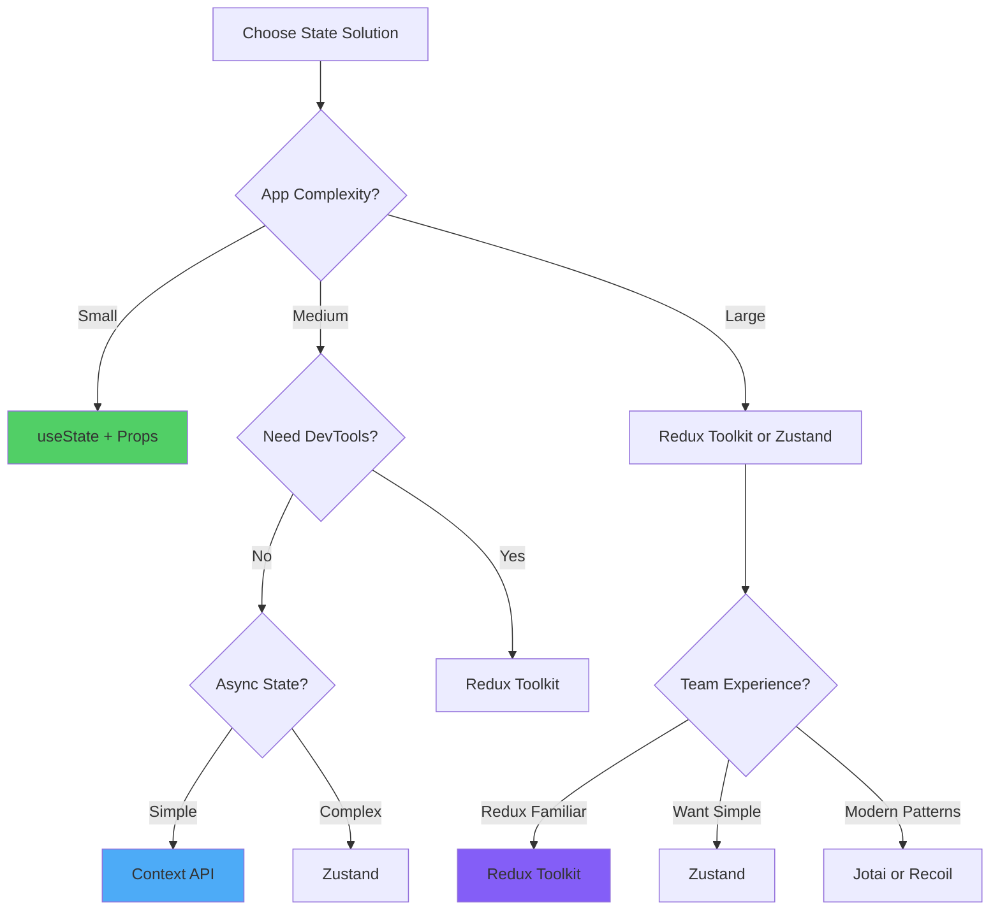

# React State Management: Architecture and Patterns

> A comprehensive exploration of state management paradigms, architectural patterns, and pragmatic implementation strategies for React applications

---

## Table of Contents

1. [State Management Paradigms](#1-state-management-paradigms)
2. [Local vs Global State: Decision Framework](#2-local-vs-global-state-decision-framework)
3. [Context API: Simple Global State](#3-context-api-simple-global-state)
4. [Redux Toolkit: Modern Redux](#4-redux-toolkit-modern-redux)
5. [Redux Core Concepts Deep Dive](#5-redux-core-concepts-deep-dive)
6. [Middleware and Async Operations](#6-middleware-and-async-operations)
7. [Zustand: Minimalist State Management](#7-zustand-minimalist-state-management)
8. [Jotai: Atomic State Management](#8-jotai-atomic-state-management)
9. [Recoil: Graph-Based State](#9-recoil-graph-based-state)
10. [State Management Selection Matrix](#10-state-management-selection-matrix)

---

## 1. State Management Paradigms

### State Classification Hierarchy



### State Management Approaches Comparison

```
┌────────────────────────────────────────────────────────────────┐
│           State Management Solutions Overview                  │
├────────────────────────────────────────────────────────────────┤
│                                                                │
│  useState + Props                                              │
│  ✅ Built-in, no dependencies                                  │
│  ✅ Simple and intuitive                                       │
│  ❌ Prop drilling issues                                       │
│  ❌ No dev tools                                               │
│  Use: Small apps, isolated components                          │
│                                                                │
│  Context API                                                   │
│  ✅ Built-in, no dependencies                                  │
│  ✅ Eliminates prop drilling                                   │
│  ⚠️  Performance concerns with frequent updates                │
│  ❌ No middleware support                                      │
│  Use: Theme, auth, simple global state                         │
│                                                                │
│  Redux Toolkit                                                 │
│  ✅ Predictable state updates                                  │
│  ✅ Excellent dev tools                                        │
│  ✅ Middleware ecosystem                                       │
│  ✅ Time-travel debugging                                      │
│  ⚠️  Boilerplate (reduced with RTK)                            │
│  Use: Large apps, complex state logic                          │
│                                                                │
│  Zustand                                                       │
│  ✅ Minimal boilerplate                                        │
│  ✅ No providers needed                                        │
│  ✅ Small bundle size (~1KB)                                   │
│  ⚠️  Less structured than Redux                                │
│  Use: Medium apps, quick setup                                 │
│                                                                │
│  Jotai                                                         │
│  ✅ Atomic state updates                                       │
│  ✅ React Suspense integration                                 │
│  ✅ Bottom-up approach                                         │
│  ⚠️  Different mental model                                    │
│  Use: Modern apps, granular updates                            │
│                                                                │
│  Recoil                                                        │
│  ✅ Derived state with selectors                               │
│  ✅ Concurrent mode compatible                                 │
│  ✅ Graph-based dependencies                                   │
│  ⚠️  Facebook-specific (less community)                        │
│  Use: Complex derived state                                    │
│                                                                │
└────────────────────────────────────────────────────────────────┘
```

### Angular vs React State Management

```
Angular                          React
───────                         ─────

Services (Injectable)           Context API
RxJS Observables                useState + useEffect
BehaviorSubject                 Custom hooks

NgRx (Redux-inspired)           Redux Toolkit
@ngrx/store                     @reduxjs/toolkit
Actions, Reducers, Effects      Actions, Reducers, Thunks

Component State                 useState
@Input() / @Output()            Props / Callbacks

Signals (Angular 16+)           Jotai / Recoil atoms
computed(), effect()            derived atoms, selectors
```

---

## 2. Local vs Global State: Decision Framework

### State Colocation Principle

**State should live as close as possible to where it's used.** Only elevate state to global scope when genuinely needed across disconnected components.



### Local State Examples

```jsx
// ✅ GOOD: State used only in this component
const Counter = () => {
  const [count, setCount] = useState(0);
  
  return (
    <div>
      <p>Count: {count}</p>
      <button onClick={() => setCount(count + 1)}>Increment</button>
    </div>
  );
};

// ✅ GOOD: Form state local to form
const LoginForm = () => {
  const [email, setEmail] = useState('');
  const [password, setPassword] = useState('');
  const [errors, setErrors] = useState({});
  
  const handleSubmit = async (e) => {
    e.preventDefault();
    // Only elevate to global when submission succeeds
    const user = await login({ email, password });
    // Then update global auth state
  };
  
  return <form onSubmit={handleSubmit}>{/* form fields */}</form>;
};

// ✅ GOOD: UI state local to component
const Accordion = () => {
  const [openIndex, setOpenIndex] = useState(null);
  
  return (
    <div>
      {items.map((item, index) => (
        <AccordionItem
          key={index}
          isOpen={openIndex === index}
          onToggle={() => setOpenIndex(openIndex === index ? null : index)}
        />
      ))}
    </div>
  );
};

// ✅ GOOD: Derived state computed from props
const ProductCard = ({ product }) => {
  const [quantity, setQuantity] = useState(1);
  
  // Derived state - no need to store
  const totalPrice = product.price * quantity;
  const isInStock = product.stock > 0;
  const canAddToCart = isInStock && quantity <= product.stock;
  
  return (
    <div>
      <p>Price: ${totalPrice}</p>
      <button disabled={!canAddToCart}>Add to Cart</button>
    </div>
  );
};
```

### When to Use Global State

```jsx
// ✅ USE GLOBAL STATE FOR:

// 1. Authentication state (needed everywhere)
const authState = {
  user: { id: 1, name: 'Marco', role: 'admin' },
  token: 'jwt-token',
  isAuthenticated: true
};

// 2. Theme/UI preferences (cross-cutting)
const themeState = {
  mode: 'dark',
  primaryColor: '#007bff',
  fontSize: 16
};

// 3. Shopping cart (multiple pages)
const cartState = {
  items: [
    { id: 1, name: 'Product', quantity: 2, price: 29.99 }
  ],
  total: 59.98
};

// 4. Notifications/Toasts (app-wide)
const notificationState = {
  notifications: [
    { id: 1, type: 'success', message: 'Saved!' }
  ]
};

// 5. User settings (persist across sessions)
const settingsState = {
  language: 'it',
  notifications: true,
  autoSave: true
};

// ❌ DON'T USE GLOBAL STATE FOR:

// Form input values (local until submission)
const [inputValue, setInputValue] = useState('');

// Modal open/closed state (UI state)
const [isOpen, setIsOpen] = useState(false);

// Hover/focus state (ephemeral)
const [isHovered, setIsHovered] = useState(false);

// List sort/filter (URL params better)
const [sortBy, setSortBy] = useState('name');
```

### State Lifting Pattern

```jsx
// When multiple siblings need to share state, lift to parent

// ❌ BAD: Duplicate state
const ProductFilters = () => {
  const [category, setCategory] = useState('all');
  return <select value={category} onChange={e => setCategory(e.target.value)} />;
};

const ProductList = () => {
  const [category, setCategory] = useState('all'); // Duplicate!
  const products = useProducts(category);
  return <div>{/* render products */}</div>;
};

// ✅ GOOD: Lifted state
const ProductsPage = () => {
  const [category, setCategory] = useState('all');
  
  return (
    <div>
      <ProductFilters category={category} onCategoryChange={setCategory} />
      <ProductList category={category} />
    </div>
  );
};

const ProductFilters = ({ category, onCategoryChange }) => {
  return (
    <select value={category} onChange={e => onCategoryChange(e.target.value)}>
      <option value="all">All</option>
      <option value="electronics">Electronics</option>
    </select>
  );
};

const ProductList = ({ category }) => {
  const products = useProducts(category);
  return <div>{/* render products */}</div>;
};
```

### Decision Checklist

```
┌────────────────────────────────────────────────────────────────┐
│          State Management Decision Tree                       │
├────────────────────────────────────────────────────────────────┤
│                                                                │
│  Question 1: Is the state used in only one component?         │
│  YES → Use useState                                            │
│  NO → Continue                                                 │
│                                                                │
│  Question 2: Is it used by a parent and direct children?      │
│  YES → Lift state to parent, pass as props                    │
│  NO → Continue                                                 │
│                                                                │
│  Question 3: Is it needed by 3+ components in same tree?      │
│  YES → Lift to common ancestor                                │
│  NO → Continue                                                 │
│                                                                │
│  Question 4: Is it needed across distant components?          │
│  YES → Consider global state                                  │
│                                                                │
│  Question 5: Is the global state simple (<5 values)?          │
│  YES → Use Context API                                        │
│  NO → Continue                                                 │
│                                                                │
│  Question 6: Do you need time-travel debugging/middleware?    │
│  YES → Use Redux Toolkit                                      │
│  NO → Use Zustand or Jotai                                    │
│                                                                │
└────────────────────────────────────────────────────────────────┘
```

---

## 3. Context API: Simple Global State

### Basic Context Implementation

```jsx
import { createContext, useContext, useState } from 'react';

// 1. Create Context
const ThemeContext = createContext();

// 2. Create Provider Component
export const ThemeProvider = ({ children }) => {
  const [theme, setTheme] = useState('light');
  
  const toggleTheme = () => {
    setTheme(prevTheme => prevTheme === 'light' ? 'dark' : 'light');
  };
  
  const value = {
    theme,
    toggleTheme
  };
  
  return (
    <ThemeContext.Provider value={value}>
      {children}
    </ThemeContext.Provider>
  );
};

// 3. Create Custom Hook
export const useTheme = () => {
  const context = useContext(ThemeContext);
  
  if (context === undefined) {
    throw new Error('useTheme must be used within ThemeProvider');
  }
  
  return context;
};

// 4. Use in App
const App = () => {
  return (
    <ThemeProvider>
      <Header />
      <Main />
      <Footer />
    </ThemeProvider>
  );
};

// 5. Consume in Components
const Header = () => {
  const { theme, toggleTheme } = useTheme();
  
  return (
    <header className={theme}>
      <button onClick={toggleTheme}>
        Switch to {theme === 'light' ? 'dark' : 'light'} mode
      </button>
    </header>
  );
};
```

### Complex Context with Reducer

```jsx
import { createContext, useContext, useReducer } from 'react';

// State shape
const initialState = {
  user: null,
  loading: false,
  error: null
};

// Action types
const AUTH_ACTIONS = {
  LOGIN_START: 'LOGIN_START',
  LOGIN_SUCCESS: 'LOGIN_SUCCESS',
  LOGIN_FAILURE: 'LOGIN_FAILURE',
  LOGOUT: 'LOGOUT'
};

// Reducer
const authReducer = (state, action) => {
  switch (action.type) {
    case AUTH_ACTIONS.LOGIN_START:
      return { ...state, loading: true, error: null };
      
    case AUTH_ACTIONS.LOGIN_SUCCESS:
      return { 
        user: action.payload, 
        loading: false, 
        error: null 
      };
      
    case AUTH_ACTIONS.LOGIN_FAILURE:
      return { 
        user: null, 
        loading: false, 
        error: action.payload 
      };
      
    case AUTH_ACTIONS.LOGOUT:
      return { user: null, loading: false, error: null };
      
    default:
      return state;
  }
};

// Context
const AuthContext = createContext();

// Provider with actions
export const AuthProvider = ({ children }) => {
  const [state, dispatch] = useReducer(authReducer, initialState);
  
  const login = async (credentials) => {
    dispatch({ type: AUTH_ACTIONS.LOGIN_START });
    
    try {
      const response = await fetch('/api/auth/login', {
        method: 'POST',
        headers: { 'Content-Type': 'application/json' },
        body: JSON.stringify(credentials)
      });
      
      if (!response.ok) throw new Error('Login failed');
      
      const data = await response.json();
      dispatch({ type: AUTH_ACTIONS.LOGIN_SUCCESS, payload: data.user });
      localStorage.setItem('token', data.token);
    } catch (error) {
      dispatch({ type: AUTH_ACTIONS.LOGIN_FAILURE, payload: error.message });
    }
  };
  
  const logout = () => {
    localStorage.removeItem('token');
    dispatch({ type: AUTH_ACTIONS.LOGOUT });
  };
  
  const value = {
    ...state,
    login,
    logout
  };
  
  return (
    <AuthContext.Provider value={value}>
      {children}
    </AuthContext.Provider>
  );
};

export const useAuth = () => {
  const context = useContext(AuthContext);
  if (!context) {
    throw new Error('useAuth must be used within AuthProvider');
  }
  return context;
};
```

### Multiple Context Composition

```jsx
// App with multiple contexts
const App = () => {
  return (
    <AuthProvider>
      <ThemeProvider>
        <LanguageProvider>
          <NotificationProvider>
            <Router>
              <AppContent />
            </Router>
          </NotificationProvider>
        </LanguageProvider>
      </ThemeProvider>
    </AuthProvider>
  );
};

// Combine contexts with custom hook
const useAppContext = () => {
  const auth = useAuth();
  const theme = useTheme();
  const language = useLanguage();
  const notifications = useNotification();
  
  return {
    ...auth,
    ...theme,
    ...language,
    ...notifications
  };
};

// Component using multiple contexts
const Dashboard = () => {
  const { user, theme, language, showNotification } = useAppContext();
  
  return (
    <div className={`dashboard theme-${theme}`}>
      <h1>{language === 'it' ? 'Benvenuto' : 'Welcome'}, {user.name}</h1>
    </div>
  );
};
```

### Context Performance Optimization

```jsx
// ❌ BAD: Entire tree re-renders on any change
const AppContext = createContext();

const AppProvider = ({ children }) => {
  const [user, setUser] = useState(null);
  const [theme, setTheme] = useState('light');
  const [settings, setSettings] = useState({});
  
  // New object on every render!
  const value = { user, setUser, theme, setTheme, settings, setSettings };
  
  return <AppContext.Provider value={value}>{children}</AppContext.Provider>;
};

// ✅ GOOD: Memoized value
const AppProvider = ({ children }) => {
  const [user, setUser] = useState(null);
  const [theme, setTheme] = useState('light');
  const [settings, setSettings] = useState({});
  
  const value = useMemo(
    () => ({ user, setUser, theme, setTheme, settings, setSettings }),
    [user, theme, settings]
  );
  
  return <AppContext.Provider value={value}>{children}</AppContext.Provider>;
};

// ✅ BETTER: Split contexts by update frequency
const UserContext = createContext();
const ThemeContext = createContext();
const SettingsContext = createContext();

// Now components only re-render when their specific context changes
const UserProvider = ({ children }) => {
  const [user, setUser] = useState(null);
  const value = useMemo(() => ({ user, setUser }), [user]);
  return <UserContext.Provider value={value}>{children}</UserContext.Provider>;
};

// ✅ BEST: Context with selector pattern
const useContextSelector = (context, selector) => {
  const value = useContext(context);
  const selectedValue = selector(value);
  
  return useMemo(() => selectedValue, [selectedValue]);
};

// Usage: Only re-render when selected value changes
const UserName = () => {
  const userName = useContextSelector(AppContext, state => state.user.name);
  return <div>{userName}</div>;
};
```

---

## 4. Redux Toolkit: Modern Redux

### Installation and Setup

```bash
npm install @reduxjs/toolkit react-redux
```

### Basic Store Configuration

```javascript
// store.js
import { configureStore } from '@reduxjs/toolkit';
import counterReducer from './features/counter/counterSlice';
import userReducer from './features/user/userSlice';

export const store = configureStore({
  reducer: {
    counter: counterReducer,
    user: userReducer
  },
  // Redux Toolkit includes thunk middleware by default
  // DevTools enabled automatically in development
});

// TypeScript: Export types
export type RootState = ReturnType<typeof store.getState>;
export type AppDispatch = typeof store.dispatch;
```

```jsx
// index.jsx - Wrap app with Provider
import { Provider } from 'react-redux';
import { store } from './store';

ReactDOM.render(
  <Provider store={store}>
    <App />
  </Provider>,
  document.getElementById('root')
);
```

### Creating a Slice

```javascript
// features/counter/counterSlice.js
import { createSlice } from '@reduxjs/toolkit';

const initialState = {
  value: 0,
  history: []
};

const counterSlice = createSlice({
  name: 'counter',
  initialState,
  reducers: {
    // Action creators generated automatically
    increment: (state) => {
      state.value += 1;  // Immer allows "mutations"
      state.history.push(state.value);
    },
    
    decrement: (state) => {
      state.value -= 1;
      state.history.push(state.value);
    },
    
    incrementByAmount: (state, action) => {
      state.value += action.payload;
      state.history.push(state.value);
    },
    
    reset: (state) => {
      state.value = 0;
      state.history = [];
    }
  }
});

// Export actions
export const { increment, decrement, incrementByAmount, reset } = counterSlice.actions;

// Export reducer
export default counterSlice.reducer;

// Export selectors
export const selectCount = (state) => state.counter.value;
export const selectHistory = (state) => state.counter.history;
```

### Using Redux in Components

```jsx
import { useSelector, useDispatch } from 'react-redux';
import { increment, decrement, incrementByAmount } from './counterSlice';

const Counter = () => {
  // Select state
  const count = useSelector((state) => state.counter.value);
  const history = useSelector((state) => state.counter.history);
  
  // Get dispatch function
  const dispatch = useDispatch();
  
  return (
    <div>
      <h1>Count: {count}</h1>
      
      <button onClick={() => dispatch(increment())}>+</button>
      <button onClick={() => dispatch(decrement())}>-</button>
      <button onClick={() => dispatch(incrementByAmount(5))}>+5</button>
      
      <h2>History</h2>
      <ul>
        {history.map((value, index) => (
          <li key={index}>{value}</li>
        ))}
      </ul>
    </div>
  );
};
```

### Complex Slice Example: Todo List

```javascript
// features/todos/todosSlice.js
import { createSlice, nanoid } from '@reduxjs/toolkit';

const initialState = {
  items: [],
  filter: 'all', // 'all' | 'active' | 'completed'
  loading: false,
  error: null
};

const todosSlice = createSlice({
  name: 'todos',
  initialState,
  reducers: {
    addTodo: {
      reducer: (state, action) => {
        state.items.push(action.payload);
      },
      prepare: (text) => {
        return {
          payload: {
            id: nanoid(),
            text,
            completed: false,
            createdAt: new Date().toISOString()
          }
        };
      }
    },
    
    toggleTodo: (state, action) => {
      const todo = state.items.find(item => item.id === action.payload);
      if (todo) {
        todo.completed = !todo.completed;
      }
    },
    
    deleteTodo: (state, action) => {
      state.items = state.items.filter(item => item.id !== action.payload);
    },
    
    editTodo: (state, action) => {
      const { id, text } = action.payload;
      const todo = state.items.find(item => item.id === id);
      if (todo) {
        todo.text = text;
      }
    },
    
    setFilter: (state, action) => {
      state.filter = action.payload;
    },
    
    clearCompleted: (state) => {
      state.items = state.items.filter(item => !item.completed);
    }
  }
});

export const {
  addTodo,
  toggleTodo,
  deleteTodo,
  editTodo,
  setFilter,
  clearCompleted
} = todosSlice.actions;

// Selectors with filtering
export const selectAllTodos = (state) => state.todos.items;
export const selectFilter = (state) => state.todos.filter;

export const selectFilteredTodos = (state) => {
  const { items, filter } = state.todos;
  
  switch (filter) {
    case 'active':
      return items.filter(todo => !todo.completed);
    case 'completed':
      return items.filter(todo => todo.completed);
    default:
      return items;
  }
};

export const selectTodoStats = (state) => {
  const items = state.todos.items;
  return {
    total: items.length,
    completed: items.filter(t => t.completed).length,
    active: items.filter(t => !t.completed).length
  };
};

export default todosSlice.reducer;
```

### Using Todos Slice

```jsx
import { useSelector, useDispatch } from 'react-redux';
import {
  addTodo,
  toggleTodo,
  deleteTodo,
  selectFilteredTodos,
  selectTodoStats,
  setFilter
} from './todosSlice';

const TodoApp = () => {
  const [inputValue, setInputValue] = useState('');
  const todos = useSelector(selectFilteredTodos);
  const stats = useSelector(selectTodoStats);
  const filter = useSelector(state => state.todos.filter);
  const dispatch = useDispatch();
  
  const handleSubmit = (e) => {
    e.preventDefault();
    if (inputValue.trim()) {
      dispatch(addTodo(inputValue));
      setInputValue('');
    }
  };
  
  return (
    <div>
      <form onSubmit={handleSubmit}>
        <input
          value={inputValue}
          onChange={(e) => setInputValue(e.target.value)}
          placeholder="What needs to be done?"
        />
        <button type="submit">Add</button>
      </form>
      
      <div className="filters">
        <button 
          onClick={() => dispatch(setFilter('all'))}
          className={filter === 'all' ? 'active' : ''}
        >
          All ({stats.total})
        </button>
        <button 
          onClick={() => dispatch(setFilter('active'))}
          className={filter === 'active' ? 'active' : ''}
        >
          Active ({stats.active})
        </button>
        <button 
          onClick={() => dispatch(setFilter('completed'))}
          className={filter === 'completed' ? 'active' : ''}
        >
          Completed ({stats.completed})
        </button>
      </div>
      
      <ul>
        {todos.map(todo => (
          <li key={todo.id}>
            <input
              type="checkbox"
              checked={todo.completed}
              onChange={() => dispatch(toggleTodo(todo.id))}
            />
            <span className={todo.completed ? 'completed' : ''}>
              {todo.text}
            </span>
            <button onClick={() => dispatch(deleteTodo(todo.id))}>
              Delete
            </button>
          </li>
        ))}
      </ul>
    </div>
  );
};
```

---

## 5. Redux Core Concepts Deep Dive

### Redux Data Flow



### Actions Deep Dive

```javascript
// Action structure
const action = {
  type: 'todos/addTodo',     // Required: action type
  payload: {                 // Optional: action data
    id: 1,
    text: 'Learn Redux',
    completed: false
  },
  meta: {                    // Optional: extra metadata
    timestamp: Date.now()
  },
  error: false               // Optional: error flag
};

// Action creators (manual)
const addTodo = (text) => ({
  type: 'todos/addTodo',
  payload: {
    id: nanoid(),
    text,
    completed: false
  }
});

// Redux Toolkit action creators (auto-generated)
import { createAction } from '@reduxjs/toolkit';

const increment = createAction('counter/increment');
const incrementByAmount = createAction('counter/incrementByAmount');

// Usage
dispatch(increment());
dispatch(incrementByAmount(5));

// Action with prepare callback
const addTodo = createAction('todos/addTodo', (text) => {
  return {
    payload: {
      id: nanoid(),
      text,
      completed: false,
      createdAt: new Date().toISOString()
    }
  };
});
```

### Reducers Deep Dive

```javascript
// Reducer rules:
// 1. Must be pure functions
// 2. Must return new state, never mutate
// 3. Same input = same output

// Manual reducer (without Redux Toolkit)
const counterReducer = (state = { value: 0 }, action) => {
  switch (action.type) {
    case 'counter/increment':
      // ❌ NEVER mutate state
      // state.value += 1;
      // return state;
      
      // ✅ Return new object
      return { ...state, value: state.value + 1 };
      
    case 'counter/decrement':
      return { ...state, value: state.value - 1 };
      
    case 'counter/incrementByAmount':
      return { ...state, value: state.value + action.payload };
      
    default:
      return state;
  }
};

// Redux Toolkit reducer (with Immer)
// Immer allows "mutation" syntax - converts to immutable updates
const counterSlice = createSlice({
  name: 'counter',
  initialState: { value: 0 },
  reducers: {
    increment: (state) => {
      // This looks like mutation, but Immer handles it immutably
      state.value += 1;
    },
    
    // Can also return new state explicitly
    reset: () => {
      return { value: 0 };
    },
    
    // Conditional logic
    incrementIfOdd: (state) => {
      if (state.value % 2 !== 0) {
        state.value += 1;
      }
    }
  }
});

// Complex nested state updates
const postsSlice = createSlice({
  name: 'posts',
  initialState: {
    byId: {},
    allIds: []
  },
  reducers: {
    addPost: (state, action) => {
      const post = action.payload;
      state.byId[post.id] = post;
      state.allIds.push(post.id);
    },
    
    updatePost: (state, action) => {
      const { id, changes } = action.payload;
      if (state.byId[id]) {
        // Merge changes
        Object.assign(state.byId[id], changes);
      }
    },
    
    deletePost: (state, action) => {
      const id = action.payload;
      delete state.byId[id];
      state.allIds = state.allIds.filter(postId => postId !== id);
    }
  }
});
```

### Store Configuration

```javascript
import { configureStore } from '@reduxjs/toolkit';
import logger from 'redux-logger';

export const store = configureStore({
  reducer: {
    counter: counterReducer,
    todos: todosReducer,
    user: userReducer
  },
  
  // Middleware
  middleware: (getDefaultMiddleware) =>
    getDefaultMiddleware({
      // Default middleware options
      serializableCheck: {
        // Ignore these action types
        ignoredActions: ['persist/PERSIST'],
        // Ignore these paths in state
        ignoredPaths: ['user.timestamp']
      },
      immutableCheck: true
    }).concat(logger),
  
  // DevTools configuration
  devTools: process.env.NODE_ENV !== 'production',
  
  // Preloaded state
  preloadedState: {
    counter: { value: 5 }
  },
  
  // Enhancers
  enhancers: (getDefaultEnhancers) =>
    getDefaultEnhancers().concat(yourCustomEnhancer)
});
```

### Selectors and Reselect

```javascript
import { createSelector } from '@reduxjs/toolkit';

// Basic selectors
export const selectTodos = (state) => state.todos.items;
export const selectFilter = (state) => state.todos.filter;

// Memoized selector with createSelector
export const selectFilteredTodos = createSelector(
  [selectTodos, selectFilter],
  (todos, filter) => {
    console.log('Recomputing filtered todos'); // Only logs when inputs change
    
    switch (filter) {
      case 'active':
        return todos.filter(todo => !todo.completed);
      case 'completed':
        return todos.filter(todo => todo.completed);
      default:
        return todos;
    }
  }
);

// Selector with multiple computations
export const selectTodoStats = createSelector(
  [selectTodos],
  (todos) => ({
    total: todos.length,
    completed: todos.filter(t => t.completed).length,
    active: todos.filter(t => !t.completed).length,
    completionRate: todos.length 
      ? (todos.filter(t => t.completed).length / todos.length * 100).toFixed(1)
      : 0
  })
);

// Selector with parameters
export const selectTodoById = createSelector(
  [selectTodos, (state, todoId) => todoId],
  (todos, todoId) => todos.find(todo => todo.id === todoId)
);

// Usage in component
const TodoDetails = ({ todoId }) => {
  const todo = useSelector(state => selectTodoById(state, todoId));
  return <div>{todo?.text}</div>;
};
```

---

## 6. Middleware and Async Operations

### Redux Thunk Basics

```javascript
// Thunk action creator
export const fetchUser = (userId) => {
  // Returns a function instead of an action object
  return async (dispatch, getState) => {
    // Can dispatch multiple actions
    dispatch({ type: 'user/fetchStart' });
    
    try {
      const response = await fetch(`/api/users/${userId}`);
      const data = await response.json();
      
      dispatch({ 
        type: 'user/fetchSuccess', 
        payload: data 
      });
    } catch (error) {
      dispatch({ 
        type: 'user/fetchFailure', 
        payload: error.message 
      });
    }
  };
};

// Usage in component
const UserProfile = ({ userId }) => {
  const dispatch = useDispatch();
  
  useEffect(() => {
    dispatch(fetchUser(userId));
  }, [dispatch, userId]);
  
  return <div>{/* render user */}</div>;
};
```

### createAsyncThunk

```javascript
// features/users/usersSlice.js
import { createSlice, createAsyncThunk } from '@reduxjs/toolkit';

// Async thunk
export const fetchUser = createAsyncThunk(
  'users/fetchUser',
  async (userId, { rejectWithValue }) => {
    try {
      const response = await fetch(`/api/users/${userId}`);
      
      if (!response.ok) {
        throw new Error('Failed to fetch user');
      }
      
      return await response.json();
    } catch (error) {
      return rejectWithValue(error.message);
    }
  }
);

// Slice with async handling
const usersSlice = createSlice({
  name: 'users',
  initialState: {
    entities: {},
    loading: 'idle', // 'idle' | 'pending' | 'succeeded' | 'failed'
    error: null
  },
  reducers: {
    // Regular reducers
  },
  extraReducers: (builder) => {
    builder
      .addCase(fetchUser.pending, (state) => {
        state.loading = 'pending';
        state.error = null;
      })
      .addCase(fetchUser.fulfilled, (state, action) => {
        state.loading = 'succeeded';
        state.entities[action.payload.id] = action.payload;
      })
      .addCase(fetchUser.rejected, (state, action) => {
        state.loading = 'failed';
        state.error = action.payload;
      });
  }
});

export default usersSlice.reducer;
```

### Complex Async Example: CRUD Operations

```javascript
// features/posts/postsSlice.js
import { createSlice, createAsyncThunk, nanoid } from '@reduxjs/toolkit';

// Fetch all posts
export const fetchPosts = createAsyncThunk(
  'posts/fetchPosts',
  async () => {
    const response = await fetch('/api/posts');
    return response.json();
  }
);

// Create post
export const createPost = createAsyncThunk(
  'posts/createPost',
  async (postData, { rejectWithValue }) => {
    try {
      const response = await fetch('/api/posts', {
        method: 'POST',
        headers: { 'Content-Type': 'application/json' },
        body: JSON.stringify(postData)
      });
      
      if (!response.ok) throw new Error('Failed to create post');
      
      return await response.json();
    } catch (error) {
      return rejectWithValue(error.message);
    }
  }
);

// Update post
export const updatePost = createAsyncThunk(
  'posts/updatePost',
  async ({ id, updates }, { rejectWithValue }) => {
    try {
      const response = await fetch(`/api/posts/${id}`, {
        method: 'PUT',
        headers: { 'Content-Type': 'application/json' },
        body: JSON.stringify(updates)
      });
      
      if (!response.ok) throw new Error('Failed to update post');
      
      return await response.json();
    } catch (error) {
      return rejectWithValue(error.message);
    }
  }
);

// Delete post
export const deletePost = createAsyncThunk(
  'posts/deletePost',
  async (postId, { rejectWithValue }) => {
    try {
      const response = await fetch(`/api/posts/${postId}`, {
        method: 'DELETE'
      });
      
      if (!response.ok) throw new Error('Failed to delete post');
      
      return postId;
    } catch (error) {
      return rejectWithValue(error.message);
    }
  }
);

const postsSlice = createSlice({
  name: 'posts',
  initialState: {
    items: [],
    loading: false,
    error: null,
    currentRequestId: undefined
  },
  reducers: {
    // Optimistic updates
    addPostOptimistic: {
      reducer: (state, action) => {
        state.items.push(action.payload);
      },
      prepare: (postData) => ({
        payload: {
          id: nanoid(),
          ...postData,
          isOptimistic: true
        }
      })
    }
  },
  extraReducers: (builder) => {
    builder
      // Fetch posts
      .addCase(fetchPosts.pending, (state) => {
        state.loading = true;
      })
      .addCase(fetchPosts.fulfilled, (state, action) => {
        state.loading = false;
        state.items = action.payload;
      })
      .addCase(fetchPosts.rejected, (state, action) => {
        state.loading = false;
        state.error = action.error.message;
      })
      
      // Create post
      .addCase(createPost.fulfilled, (state, action) => {
        // Remove optimistic post if exists
        state.items = state.items.filter(p => !p.isOptimistic);
        state.items.push(action.payload);
      })
      
      // Update post
      .addCase(updatePost.fulfilled, (state, action) => {
        const index = state.items.findIndex(p => p.id === action.payload.id);
        if (index !== -1) {
          state.items[index] = action.payload;
        }
      })
      
      // Delete post
      .addCase(deletePost.fulfilled, (state, action) => {
        state.items = state.items.filter(p => p.id !== action.payload);
      });
  }
});

export const { addPostOptimistic } = postsSlice.actions;
export default postsSlice.reducer;
```

### RTK Query (Advanced Data Fetching)

```javascript
// services/api.js
import { createApi, fetchBaseQuery } from '@reduxjs/toolkit/query/react';

export const api = createApi({
  reducerPath: 'api',
  baseQuery: fetchBaseQuery({ baseUrl: '/api' }),
  tagTypes: ['Post', 'User'],
  endpoints: (builder) => ({
    // Get all posts
    getPosts: builder.query({
      query: () => '/posts',
      providesTags: ['Post']
    }),
    
    // Get single post
    getPost: builder.query({
      query: (id) => `/posts/${id}`,
      providesTags: (result, error, id) => [{ type: 'Post', id }]
    }),
    
    // Create post
    createPost: builder.mutation({
      query: (post) => ({
        url: '/posts',
        method: 'POST',
        body: post
      }),
      invalidatesTags: ['Post']
    }),
    
    // Update post
    updatePost: builder.mutation({
      query: ({ id, ...updates }) => ({
        url: `/posts/${id}`,
        method: 'PUT',
        body: updates
      }),
      invalidatesTags: (result, error, { id }) => [{ type: 'Post', id }]
    }),
    
    // Delete post
    deletePost: builder.mutation({
      query: (id) => ({
        url: `/posts/${id}`,
        method: 'DELETE'
      }),
      invalidatesTags: ['Post']
    })
  })
});

// Auto-generated hooks
export const {
  useGetPostsQuery,
  useGetPostQuery,
  useCreatePostMutation,
  useUpdatePostMutation,
  useDeletePostMutation
} = api;

// Add to store
import { api } from './services/api';

export const store = configureStore({
  reducer: {
    [api.reducerPath]: api.reducer,
    // other reducers
  },
  middleware: (getDefaultMiddleware) =>
    getDefaultMiddleware().concat(api.middleware)
});
```

```jsx
// Using RTK Query in components
import { 
  useGetPostsQuery, 
  useCreatePostMutation 
} from './services/api';

const PostsList = () => {
  const { data: posts, isLoading, error } = useGetPostsQuery();
  const [createPost, { isLoading: isCreating }] = useCreatePostMutation();
  
  const handleCreate = async () => {
    try {
      await createPost({ title: 'New Post', content: '...' }).unwrap();
      // Success!
    } catch (error) {
      // Handle error
    }
  };
  
  if (isLoading) return <div>Loading...</div>;
  if (error) return <div>Error: {error.message}</div>;
  
  return (
    <div>
      <button onClick={handleCreate} disabled={isCreating}>
        Create Post
      </button>
      {posts?.map(post => (
        <div key={post.id}>{post.title}</div>
      ))}
    </div>
  );
};
```

---

## 7. Zustand: Minimalist State Management

### Basic Zustand Store

```javascript
import create from 'zustand';

// Create store
const useStore = create((set) => ({
  // State
  count: 0,
  user: null,
  
  // Actions
  increment: () => set((state) => ({ count: state.count + 1 })),
  decrement: () => set((state) => ({ count: state.count - 1 })),
  setUser: (user) => set({ user }),
  reset: () => set({ count: 0, user: null })
}));

// Usage in components
const Counter = () => {
  const count = useStore((state) => state.count);
  const increment = useStore((state) => state.increment);
  const decrement = useStore((state) => state.decrement);
  
  return (
    <div>
      <p>Count: {count}</p>
      <button onClick={increment}>+</button>
      <button onClick={decrement}>-</button>
    </div>
  );
};

// Access multiple values
const UserInfo = () => {
  const { user, setUser } = useStore((state) => ({
    user: state.user,
    setUser: state.setUser
  }));
  
  return <div>{user?.name}</div>;
};
```

### Zustand with Async Actions

```javascript
const useStore = create((set, get) => ({
  posts: [],
  loading: false,
  error: null,
  
  fetchPosts: async () => {
    set({ loading: true, error: null });
    
    try {
      const response = await fetch('/api/posts');
      const data = await response.json();
      set({ posts: data, loading: false });
    } catch (error) {
      set({ error: error.message, loading: false });
    }
  },
  
  createPost: async (postData) => {
    const response = await fetch('/api/posts', {
      method: 'POST',
      headers: { 'Content-Type': 'application/json' },
      body: JSON.stringify(postData)
    });
    
    const newPost = await response.json();
    
    set((state) => ({
      posts: [...state.posts, newPost]
    }));
  },
  
  deletePost: async (postId) => {
    await fetch(`/api/posts/${postId}`, { method: 'DELETE' });
    
    set((state) => ({
      posts: state.posts.filter(p => p.id !== postId)
    }));
  }
}));
```

### Zustand Slices Pattern

```javascript
// Separate slices for organization
const createUserSlice = (set) => ({
  user: null,
  login: async (credentials) => {
    const response = await fetch('/api/auth/login', {
      method: 'POST',
      body: JSON.stringify(credentials)
    });
    const user = await response.json();
    set({ user });
  },
  logout: () => set({ user: null })
});

const createCartSlice = (set, get) => ({
  items: [],
  addItem: (item) => set((state) => ({
    items: [...state.items, item]
  })),
  removeItem: (itemId) => set((state) => ({
    items: state.items.filter(i => i.id !== itemId)
  })),
  total: () => {
    const items = get().items;
    return items.reduce((sum, item) => sum + item.price * item.quantity, 0);
  }
});

// Combine slices
const useStore = create((...args) => ({
  ...createUserSlice(...args),
  ...createCartSlice(...args)
}));
```

### Zustand Middleware

```javascript
import create from 'zustand';
import { persist, devtools } from 'zustand/middleware';

// Persist to localStorage
const useStore = create(
  persist(
    (set) => ({
      count: 0,
      increment: () => set((state) => ({ count: state.count + 1 }))
    }),
    {
      name: 'counter-storage', // localStorage key
      getStorage: () => localStorage
    }
  )
);

// DevTools integration
const useStore = create(
  devtools(
    (set) => ({
      count: 0,
      increment: () => set((state) => ({ count: state.count + 1 }))
    }),
    { name: 'CounterStore' }
  )
);

// Combine middleware
const useStore = create(
  devtools(
    persist(
      (set) => ({
        user: null,
        setUser: (user) => set({ user })
      }),
      { name: 'auth-storage' }
    ),
    { name: 'AuthStore' }
  )
);
```

---

## 8. Jotai: Atomic State Management

### Basic Atoms

```javascript
import { atom, useAtom } from 'jotai';

// Define atoms
const countAtom = atom(0);
const userAtom = atom(null);
const themeAtom = atom('light');

// Use in components
const Counter = () => {
  const [count, setCount] = useAtom(countAtom);
  
  return (
    <div>
      <p>Count: {count}</p>
      <button onClick={() => setCount(count + 1)}>+</button>
      <button onClick={() => setCount(count - 1)}>-</button>
    </div>
  );
};

// Read-only
import { useAtomValue } from 'jotai';

const CountDisplay = () => {
  const count = useAtomValue(countAtom);
  return <div>Count: {count}</div>;
};

// Write-only
import { useSetAtom } from 'jotai';

const IncrementButton = () => {
  const setCount = useSetAtom(countAtom);
  return <button onClick={() => setCount((c) => c + 1)}>+</button>;
};
```

### Derived Atoms

```javascript
import { atom } from 'jotai';

// Base atoms
const todosAtom = atom([
  { id: 1, text: 'Buy milk', completed: false },
  { id: 2, text: 'Learn Jotai', completed: true }
]);

const filterAtom = atom('all');

// Derived atom (read-only)
const filteredTodosAtom = atom((get) => {
  const todos = get(todosAtom);
  const filter = get(filterAtom);
  
  switch (filter) {
    case 'active':
      return todos.filter(t => !t.completed);
    case 'completed':
      return todos.filter(t => t.completed);
    default:
      return todos;
  }
});

// Derived atom (read-write)
const todoStatsAtom = atom(
  (get) => {
    const todos = get(todosAtom);
    return {
      total: todos.length,
      completed: todos.filter(t => t.completed).length,
      active: todos.filter(t => !t.completed).length
    };
  },
  (get, set, action) => {
    // Write logic if needed
  }
);

// Usage
const TodoList = () => {
  const [todos] = useAtom(filteredTodosAtom);
  const stats = useAtomValue(todoStatsAtom);
  
  return (
    <div>
      <p>{stats.active} active, {stats.completed} completed</p>
      {todos.map(todo => (
        <div key={todo.id}>{todo.text}</div>
      ))}
    </div>
  );
};
```

### Async Atoms

```javascript
import { atom } from 'jotai';

// Async atom
const userIdAtom = atom(1);

const userAtom = atom(async (get) => {
  const userId = get(userIdAtom);
  const response = await fetch(`/api/users/${userId}`);
  return response.json();
});

// Usage with Suspense
const UserProfile = () => {
  const [user] = useAtom(userAtom);
  
  return <div>{user.name}</div>;
};

const App = () => {
  return (
    <Suspense fallback={<div>Loading...</div>}>
      <UserProfile />
    </Suspense>
  );
};
```

### Jotai Utils

```javascript
import { atomWithStorage, atomWithReducer, atomWithReset } from 'jotai/utils';

// Persist to localStorage
const themeAtom = atomWithStorage('theme', 'light');

// With reducer (like useReducer)
const countAtom = atomWithReducer(0, (state, action) => {
  switch (action.type) {
    case 'increment':
      return state + 1;
    case 'decrement':
      return state - 1;
    default:
      return state;
  }
});

// With reset capability
import { useResetAtom } from 'jotai/utils';

const countAtom = atomWithReset(0);

const ResetButton = () => {
  const resetCount = useResetAtom(countAtom);
  return <button onClick={resetCount}>Reset</button>;
};
```

---

## 9. Recoil: Graph-Based State

### Atoms and Selectors

```javascript
import { atom, selector, useRecoilState, useRecoilValue } from 'recoil';

// Atom
const counterState = atom({
  key: 'counterState',
  default: 0
});

// Selector (derived state)
const doubledCounterState = selector({
  key: 'doubledCounterState',
  get: ({ get }) => {
    const count = get(counterState);
    return count * 2;
  }
});

// Usage
const Counter = () => {
  const [count, setCount] = useRecoilState(counterState);
  const doubled = useRecoilValue(doubledCounterState);
  
  return (
    <div>
      <p>Count: {count}</p>
      <p>Doubled: {doubled}</p>
      <button onClick={() => setCount(count + 1)}>+</button>
    </div>
  );
};

// App wrapped in RecoilRoot
import { RecoilRoot } from 'recoil';

const App = () => {
  return (
    <RecoilRoot>
      <Counter />
    </RecoilRoot>
  );
};
```

### Async Selectors

```javascript
import { selector, selectorFamily } from 'recoil';

// Async selector
const currentUserQuery = selector({
  key: 'currentUserQuery',
  get: async () => {
    const response = await fetch('/api/user');
    return response.json();
  }
});

// Selector family (parameterized)
const userQuery = selectorFamily({
  key: 'userQuery',
  get: (userId) => async () => {
    const response = await fetch(`/api/users/${userId}`);
    return response.json();
  }
});

// Usage
const UserProfile = ({ userId }) => {
  const user = useRecoilValue(userQuery(userId));
  return <div>{user.name}</div>;
};
```

---

## 10. State Management Selection Matrix

### Decision Tree



### Comparison Table

```
┌────────────────────────────────────────────────────────────────┐
│              Feature Comparison Matrix                         │
├────────────────────────────────────────────────────────────────┤
│                                                                │
│ Feature          Context  Redux   Zustand  Jotai   Recoil     │
│ ─────────────────────────────────────────────────────────────  │
│ Bundle Size      0KB      9KB     1KB      3KB      14KB       │
│ Boilerplate      Low      Med     Min      Min      Low        │
│ DevTools         No       Yes     Yes      Yes      Yes        │
│ Middleware       No       Yes     Yes      No       No         │
│ Async            Manual   Thunk   Built-in Built-in Built-in   │
│ TypeScript       Good     Exc     Exc      Exc      Good       │
│ Time-Travel      No       Yes     No       No       Yes        │
│ Learning Curve   Low      High    Low      Med      Med        │
│ Performance      ⚠️        ✅      ✅       ✅       ✅          │
│ React Suspense   No       No      Yes      Yes      Yes        │
│                                                                │
└────────────────────────────────────────────────────────────────┘
```

### Recommendations

```
┌────────────────────────────────────────────────────────────────┐
│                Use Case Recommendations                        │
├────────────────────────────────────────────────────────────────┤
│                                                                │
│  Small App (< 5 components)                                    │
│  → useState + Props                                            │
│                                                                │
│  Medium App (Theme, Auth, Simple Global State)                 │
│  → Context API or Zustand                                      │
│                                                                │
│  E-commerce / Dashboard (Complex Business Logic)               │
│  → Redux Toolkit                                               │
│                                                                │
│  Startup MVP (Speed Priority)                                  │
│  → Zustand                                                     │
│                                                                │
│  Modern App (Concurrent Mode, Suspense)                        │
│  → Jotai or Recoil                                             │
│                                                                │
│  Enterprise (Team Size 10+, Long-term Maintenance)             │
│  → Redux Toolkit                                               │
│                                                                │
│  Migrating from Redux                                          │
│  → Redux Toolkit (easiest migration)                           │
│  → Zustand (if simplification desired)                         │
│                                                                │
└────────────────────────────────────────────────────────────────┘
```

### Performance Considerations

```javascript
// Context API Performance Pitfall
// ❌ BAD: Single context causes all consumers to re-render
const AppContext = createContext();

const AppProvider = ({ children }) => {
  const [user, setUser] = useState(null);
  const [theme, setTheme] = useState('light');
  const value = { user, setUser, theme, setTheme };
  return <AppContext.Provider value={value}>{children}</AppContext.Provider>;
};

// ✅ GOOD: Split contexts
const UserContext = createContext();
const ThemeContext = createContext();

// ✅ BEST: Use state management library
const useStore = create((set) => ({
  user: null,
  theme: 'light',
  setUser: (user) => set({ user }),
  setTheme: (theme) => set({ theme })
}));

// Components only re-render when their selected state changes
const UserDisplay = () => {
  const user = useStore(state => state.user);
  return <div>{user?.name}</div>;
};
```

---

## Conclusion: State Management Mastery

```
┌────────────────────────────────────────────────────────────────┐
│              Key Principles Summary                            │
├────────────────────────────────────────────────────────────────┤
│                                                                │
│  1. Start Local: Keep state close to usage                    │
│  2. Elevate Gradually: Only go global when needed             │
│  3. Choose Appropriately: Match tool to complexity            │
│  4. Consider Performance: Avoid unnecessary re-renders         │
│  5. Developer Experience: Balance simplicity vs features       │
│  6. Team Skills: Leverage existing knowledge                  │
│  7. Future Maintenance: Think long-term                       │
│                                                                │
└────────────────────────────────────────────────────────────────┘
```

### Resources

- 📘 [Redux Toolkit Documentation](https://redux-toolkit.js.org/)
- 🐻 [Zustand Repository](https://github.com/pmndrs/zustand)
- ⚛️ [Jotai Documentation](https://jotai.org/)
- 🔮 [Recoil Documentation](https://recoiljs.org/)

**Gestione dello stato magistrale! 🎯**