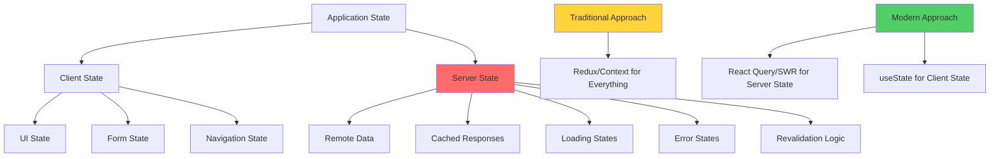
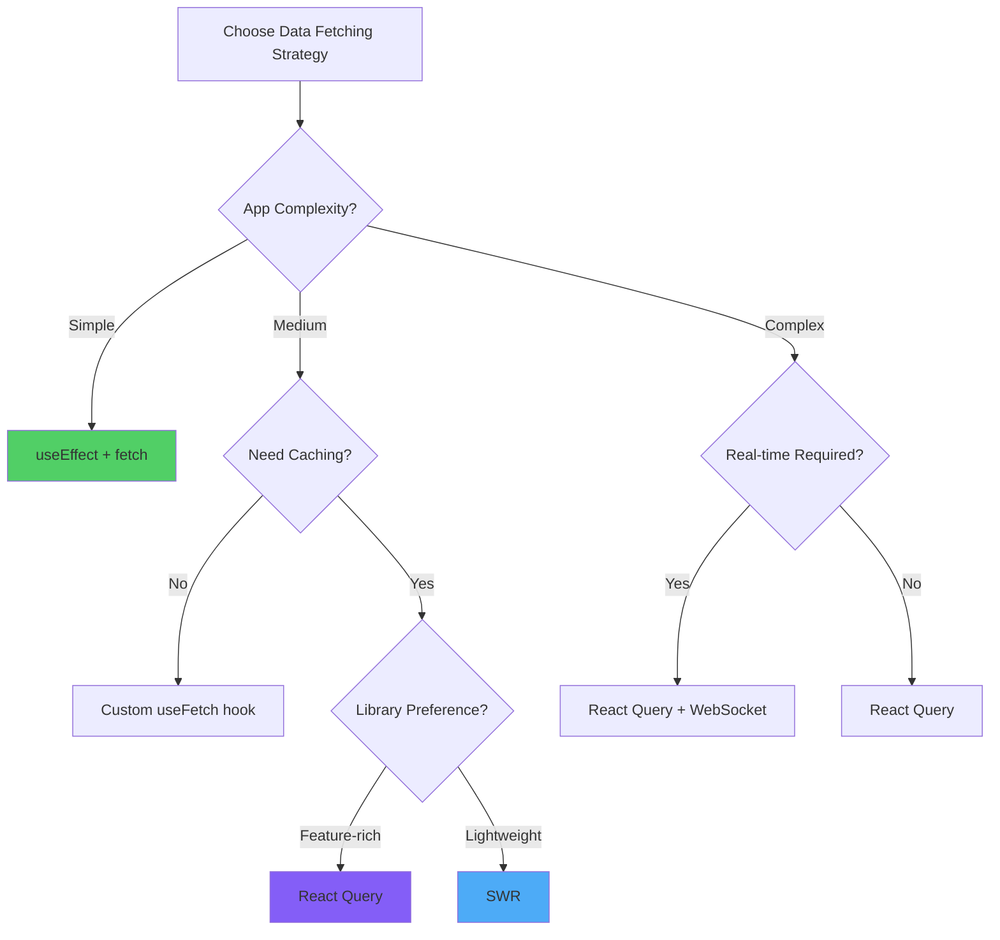

# React Data Fetching and API Integration

> A comprehensive exploration of asynchronous data fetching patterns, server state management strategies, and real-time data synchronization in React applications

---

## Table of Contents

1. [Data Fetching Paradigms](#1-data-fetching-paradigms)
2. [Native Fetch API and Axios](#2-native-fetch-api-and-axios)
3. [Loading States and Error Handling](#3-loading-states-and-error-handling)
4. [React Query: Server State Management](#4-react-query-server-state-management)
5. [SWR: Stale-While-Revalidate](#5-swr-stale-while-revalidate)
6. [Optimistic Updates](#6-optimistic-updates)
7. [Cache Management Strategies](#7-cache-management-strategies)
8. [Polling and Real-Time Updates](#8-polling-and-real-time-updates)
9. [Advanced Patterns](#9-advanced-patterns)
10. [Data Fetching Strategy Selection](#10-data-fetching-strategy-selection)

---

## 1. Data Fetching Paradigms

### Server State vs Client State

**Server state** is fundamentally different from client state—it's asynchronous, potentially stale, and exists externally. Traditional state management solutions conflate these concerns.



### Data Fetching Evolution

```
┌────────────────────────────────────────────────────────────────┐
│           Data Fetching Approaches Evolution                   │
├────────────────────────────────────────────────────────────────┤
│                                                                │
│  Traditional (Pre-Hooks)                                       │
│  • componentDidMount() + setState                              │
│  • Redux thunks with action creators                           │
│  • Manual loading/error state management                       │
│  ❌ Boilerplate heavy                                          │
│  ❌ No caching                                                 │
│  ❌ No background refetching                                   │
│                                                                │
│  Modern Hooks Era                                              │
│  • useEffect + useState                                        │
│  • Custom hooks for reusability                                │
│  • Still manual cache/state management                         │
│  ⚠️  Less boilerplate but still complex                        │
│                                                                │
│  Specialized Libraries                                         │
│  • React Query / TanStack Query                                │
│  • SWR (Stale-While-Revalidate)                                │
│  • Apollo Client (GraphQL)                                     │
│  ✅ Automatic caching                                          │
│  ✅ Background refetching                                      │
│  ✅ Optimistic updates                                         │
│  ✅ Pagination & infinite queries                              │
│                                                                │
└────────────────────────────────────────────────────────────────┘
```

### Angular vs React Data Fetching

```
Angular                          React
───────                         ─────

HttpClient (Injectable)         Fetch API / Axios
Observables (RxJS)              Promises / Async/Await

Services with HttpClient        Custom Hooks
@Injectable()                   function useData() {}

HTTP Interceptors               Axios Interceptors
                                React Query onRequest

Resolvers                       React Query / SWR
(pre-fetch route data)          (automatic fetching)

AsyncPipe in templates          useQuery hook
*ngIf="data$ | async"           const { data } = useQuery()
```

---

## 2. Native Fetch API and Axios

### Native Fetch API

```javascript
// Basic GET request
const fetchUsers = async () => {
  try {
    const response = await fetch('https://api.example.com/users');
    
    if (!response.ok) {
      throw new Error(`HTTP error! status: ${response.status}`);
    }
    
    const data = await response.json();
    return data;
  } catch (error) {
    console.error('Fetch error:', error);
    throw error;
  }
};

// POST request with body
const createUser = async (userData) => {
  const response = await fetch('https://api.example.com/users', {
    method: 'POST',
    headers: {
      'Content-Type': 'application/json',
      'Authorization': `Bearer ${token}`
    },
    body: JSON.stringify(userData)
  });
  
  if (!response.ok) {
    throw new Error('Failed to create user');
  }
  
  return response.json();
};

// PUT request
const updateUser = async (userId, updates) => {
  const response = await fetch(`https://api.example.com/users/${userId}`, {
    method: 'PUT',
    headers: { 'Content-Type': 'application/json' },
    body: JSON.stringify(updates)
  });
  
  return response.json();
};

// DELETE request
const deleteUser = async (userId) => {
  const response = await fetch(`https://api.example.com/users/${userId}`, {
    method: 'DELETE'
  });
  
  return response.ok;
};

// Request with timeout
const fetchWithTimeout = async (url, timeout = 5000) => {
  const controller = new AbortController();
  const timeoutId = setTimeout(() => controller.abort(), timeout);
  
  try {
    const response = await fetch(url, {
      signal: controller.signal
    });
    clearTimeout(timeoutId);
    return response.json();
  } catch (error) {
    if (error.name === 'AbortError') {
      throw new Error('Request timeout');
    }
    throw error;
  }
};
```

### Axios Library

```bash
npm install axios
```

```javascript
import axios from 'axios';

// Create axios instance with defaults
const api = axios.create({
  baseURL: 'https://api.example.com',
  timeout: 10000,
  headers: {
    'Content-Type': 'application/json'
  }
});

// Request interceptor (add auth token)
api.interceptors.request.use(
  (config) => {
    const token = localStorage.getItem('token');
    if (token) {
      config.headers.Authorization = `Bearer ${token}`;
    }
    return config;
  },
  (error) => {
    return Promise.reject(error);
  }
);

// Response interceptor (handle errors globally)
api.interceptors.response.use(
  (response) => response.data,
  (error) => {
    if (error.response?.status === 401) {
      // Redirect to login
      window.location.href = '/login';
    }
    
    if (error.response?.status === 500) {
      // Show error notification
      showErrorToast('Server error occurred');
    }
    
    return Promise.reject(error);
  }
);

// CRUD operations with Axios
const userAPI = {
  // GET all users
  getAll: () => api.get('/users'),
  
  // GET single user
  getById: (id) => api.get(`/users/${id}`),
  
  // POST create user
  create: (userData) => api.post('/users', userData),
  
  // PUT update user
  update: (id, updates) => api.put(`/users/${id}`, updates),
  
  // PATCH partial update
  patch: (id, updates) => api.patch(`/users/${id}`, updates),
  
  // DELETE user
  delete: (id) => api.delete(`/users/${id}`),
  
  // GET with query parameters
  search: (params) => api.get('/users/search', { params }),
  
  // POST with file upload
  uploadAvatar: (userId, file) => {
    const formData = new FormData();
    formData.append('avatar', file);
    
    return api.post(`/users/${userId}/avatar`, formData, {
      headers: { 'Content-Type': 'multipart/form-data' }
    });
  }
};

// Usage in components
const fetchUsers = async () => {
  try {
    const users = await userAPI.getAll();
    return users;
  } catch (error) {
    console.error('Failed to fetch users:', error);
    throw error;
  }
};
```

### Fetch vs Axios Comparison

```
┌────────────────────────────────────────────────────────────────┐
│              Fetch API vs Axios                                │
├────────────────────────────────────────────────────────────────┤
│                                                                │
│  Feature              Fetch API          Axios                 │
│  ─────────────────────────────────────────────────────────────  │
│  Browser Support      Modern            IE11+ (polyfill)       │
│  Dependencies         None (native)     External library       │
│  JSON Transform       Manual            Automatic              │
│  Error Handling       Manual status     Rejects on HTTP errors │
│  Timeout              AbortController   Built-in               │
│  Interceptors         No                Yes                    │
│  Request Cancel       AbortController   CancelToken            │
│  Upload Progress      No                Yes                    │
│  Base URL             Manual            Built-in               │
│  Bundle Size          0KB               ~13KB                  │
│                                                                │
└────────────────────────────────────────────────────────────────┘
```

### Custom Fetch Wrapper

```javascript
// Create a fetch wrapper with common functionality
class APIClient {
  constructor(baseURL) {
    this.baseURL = baseURL;
    this.defaultHeaders = {
      'Content-Type': 'application/json'
    };
  }
  
  async request(endpoint, options = {}) {
    const url = `${this.baseURL}${endpoint}`;
    
    const config = {
      ...options,
      headers: {
        ...this.defaultHeaders,
        ...options.headers
      }
    };
    
    // Add auth token
    const token = localStorage.getItem('token');
    if (token) {
      config.headers.Authorization = `Bearer ${token}`;
    }
    
    try {
      const response = await fetch(url, config);
      
      // Handle HTTP errors
      if (!response.ok) {
        const error = await response.json();
        throw new Error(error.message || `HTTP ${response.status}`);
      }
      
      // Handle empty responses
      const contentType = response.headers.get('content-type');
      if (contentType && contentType.includes('application/json')) {
        return response.json();
      }
      
      return response;
    } catch (error) {
      console.error('API request failed:', error);
      throw error;
    }
  }
  
  get(endpoint, options) {
    return this.request(endpoint, { ...options, method: 'GET' });
  }
  
  post(endpoint, data, options) {
    return this.request(endpoint, {
      ...options,
      method: 'POST',
      body: JSON.stringify(data)
    });
  }
  
  put(endpoint, data, options) {
    return this.request(endpoint, {
      ...options,
      method: 'PUT',
      body: JSON.stringify(data)
    });
  }
  
  delete(endpoint, options) {
    return this.request(endpoint, { ...options, method: 'DELETE' });
  }
}

// Usage
const api = new APIClient('https://api.example.com');

const users = await api.get('/users');
const newUser = await api.post('/users', { name: 'Marco', email: 'marco@example.com' });
```

---

## 3. Loading States and Error Handling

### Basic useEffect Pattern

```jsx
import { useState, useEffect } from 'react';

const UserList = () => {
  const [users, setUsers] = useState([]);
  const [loading, setLoading] = useState(true);
  const [error, setError] = useState(null);
  
  useEffect(() => {
    const fetchUsers = async () => {
      try {
        setLoading(true);
        setError(null);
        
        const response = await fetch('/api/users');
        
        if (!response.ok) {
          throw new Error('Failed to fetch users');
        }
        
        const data = await response.json();
        setUsers(data);
      } catch (err) {
        setError(err.message);
      } finally {
        setLoading(false);
      }
    };
    
    fetchUsers();
  }, []); // Empty dependency array - fetch once on mount
  
  if (loading) return <div>Loading...</div>;
  if (error) return <div>Error: {error}</div>;
  
  return (
    <ul>
      {users.map(user => (
        <li key={user.id}>{user.name}</li>
      ))}
    </ul>
  );
};
```

### Custom useFetch Hook

```javascript
import { useState, useEffect, useCallback } from 'react';

const useFetch = (url, options = {}) => {
  const [data, setData] = useState(null);
  const [loading, setLoading] = useState(true);
  const [error, setError] = useState(null);
  
  const fetchData = useCallback(async () => {
    try {
      setLoading(true);
      setError(null);
      
      const response = await fetch(url, options);
      
      if (!response.ok) {
        throw new Error(`HTTP error! status: ${response.status}`);
      }
      
      const result = await response.json();
      setData(result);
    } catch (err) {
      setError(err.message);
    } finally {
      setLoading(false);
    }
  }, [url, JSON.stringify(options)]);
  
  useEffect(() => {
    fetchData();
  }, [fetchData]);
  
  const refetch = () => {
    fetchData();
  };
  
  return { data, loading, error, refetch };
};

// Usage
const UserProfile = ({ userId }) => {
  const { data: user, loading, error, refetch } = useFetch(`/api/users/${userId}`);
  
  if (loading) return <LoadingSpinner />;
  if (error) return <ErrorMessage message={error} />;
  
  return (
    <div>
      <h1>{user.name}</h1>
      <button onClick={refetch}>Refresh</button>
    </div>
  );
};
```

### Advanced Error Handling

```jsx
class APIError extends Error {
  constructor(message, status, data) {
    super(message);
    this.status = status;
    this.data = data;
    this.name = 'APIError';
  }
}

const fetchWithErrorHandling = async (url, options) => {
  try {
    const response = await fetch(url, options);
    
    const data = await response.json();
    
    if (!response.ok) {
      throw new APIError(
        data.message || 'Request failed',
        response.status,
        data
      );
    }
    
    return data;
  } catch (error) {
    if (error instanceof APIError) {
      // Handle API errors
      switch (error.status) {
        case 400:
          throw new Error('Invalid request. Please check your input.');
        case 401:
          throw new Error('Authentication required. Please login.');
        case 403:
          throw new Error('You do not have permission to access this resource.');
        case 404:
          throw new Error('Resource not found.');
        case 500:
          throw new Error('Server error. Please try again later.');
        default:
          throw error;
      }
    }
    
    // Handle network errors
    if (error.name === 'TypeError' && error.message.includes('fetch')) {
      throw new Error('Network error. Please check your connection.');
    }
    
    throw error;
  }
};

// Error Boundary Component
import { Component } from 'react';

class ErrorBoundary extends Component {
  constructor(props) {
    super(props);
    this.state = { hasError: false, error: null };
  }
  
  static getDerivedStateFromError(error) {
    return { hasError: true, error };
  }
  
  componentDidCatch(error, errorInfo) {
    console.error('Error caught by boundary:', error, errorInfo);
    // Log to error reporting service
    // logErrorToService(error, errorInfo);
  }
  
  render() {
    if (this.state.hasError) {
      return (
        <div className="error-container">
          <h2>Something went wrong</h2>
          <p>{this.state.error?.message}</p>
          <button onClick={() => this.setState({ hasError: false, error: null })}>
            Try Again
          </button>
        </div>
      );
    }
    
    return this.props.children;
  }
}
```

### Loading States UI Patterns

```jsx
// Skeleton Loading
const UserCardSkeleton = () => {
  return (
    <div className="user-card skeleton">
      <div className="skeleton-avatar"></div>
      <div className="skeleton-text"></div>
      <div className="skeleton-text short"></div>
    </div>
  );
};

// Progressive Loading
const UserList = () => {
  const [users, setUsers] = useState([]);
  const [loading, setLoading] = useState(true);
  
  return (
    <div>
      {loading && <div>Loading users...</div>}
      
      {users.map(user => (
        <UserCard key={user.id} user={user} />
      ))}
      
      {loading && (
        <>
          <UserCardSkeleton />
          <UserCardSkeleton />
          <UserCardSkeleton />
        </>
      )}
    </div>
  );
};

// Suspense-based Loading (React 18+)
import { Suspense } from 'react';

const App = () => {
  return (
    <Suspense fallback={<LoadingSpinner />}>
      <UserProfile />
    </Suspense>
  );
};
```

### Retry Logic

```javascript
const fetchWithRetry = async (url, options = {}, retries = 3, delay = 1000) => {
  for (let i = 0; i < retries; i++) {
    try {
      const response = await fetch(url, options);
      
      if (!response.ok) {
        throw new Error(`HTTP ${response.status}`);
      }
      
      return await response.json();
    } catch (error) {
      const isLastAttempt = i === retries - 1;
      
      if (isLastAttempt) {
        throw error;
      }
      
      console.log(`Retry attempt ${i + 1}/${retries}`);
      
      // Exponential backoff
      await new Promise(resolve => setTimeout(resolve, delay * Math.pow(2, i)));
    }
  }
};

// Custom hook with retry
const useFetchWithRetry = (url) => {
  const [data, setData] = useState(null);
  const [loading, setLoading] = useState(true);
  const [error, setError] = useState(null);
  const [retryCount, setRetryCount] = useState(0);
  
  useEffect(() => {
    const fetchData = async () => {
      try {
        setLoading(true);
        setError(null);
        
        const result = await fetchWithRetry(url);
        setData(result);
      } catch (err) {
        setError(err.message);
      } finally {
        setLoading(false);
      }
    };
    
    fetchData();
  }, [url, retryCount]);
  
  const retry = () => setRetryCount(prev => prev + 1);
  
  return { data, loading, error, retry };
};
```

---

## 4. React Query: Server State Management

### Installation and Setup

```bash
npm install @tanstack/react-query
# Optional: DevTools
npm install @tanstack/react-query-devtools
```

```jsx
// App.jsx - Setup Query Client
import { QueryClient, QueryClientProvider } from '@tanstack/react-query';
import { ReactQueryDevtools } from '@tanstack/react-query-devtools';

const queryClient = new QueryClient({
  defaultOptions: {
    queries: {
      staleTime: 1000 * 60 * 5, // 5 minutes
      cacheTime: 1000 * 60 * 10, // 10 minutes
      refetchOnWindowFocus: false,
      retry: 3
    }
  }
});

const App = () => {
  return (
    <QueryClientProvider client={queryClient}>
      <Routes />
      <ReactQueryDevtools initialIsOpen={false} />
    </QueryClientProvider>
  );
};
```

### Basic useQuery

```jsx
import { useQuery } from '@tanstack/react-query';

const fetchUsers = async () => {
  const response = await fetch('/api/users');
  if (!response.ok) {
    throw new Error('Failed to fetch users');
  }
  return response.json();
};

const UserList = () => {
  const { 
    data: users, 
    isLoading, 
    isError, 
    error,
    isFetching,
    refetch
  } = useQuery({
    queryKey: ['users'],
    queryFn: fetchUsers
  });
  
  if (isLoading) return <div>Loading...</div>;
  if (isError) return <div>Error: {error.message}</div>;
  
  return (
    <div>
      <button onClick={() => refetch()}>Refresh</button>
      {isFetching && <span>Updating...</span>}
      
      <ul>
        {users.map(user => (
          <li key={user.id}>{user.name}</li>
        ))}
      </ul>
    </div>
  );
};
```

### Query with Parameters

```jsx
const fetchUser = async ({ queryKey }) => {
  const [_key, userId] = queryKey;
  const response = await fetch(`/api/users/${userId}`);
  return response.json();
};

const UserProfile = ({ userId }) => {
  const { data: user, isLoading } = useQuery({
    queryKey: ['user', userId],
    queryFn: fetchUser,
    enabled: !!userId // Only fetch if userId exists
  });
  
  if (isLoading) return <div>Loading...</div>;
  
  return <div>{user.name}</div>;
};
```

### useMutation for Updates

```jsx
import { useMutation, useQueryClient } from '@tanstack/react-query';

const updateUser = async ({ userId, updates }) => {
  const response = await fetch(`/api/users/${userId}`, {
    method: 'PUT',
    headers: { 'Content-Type': 'application/json' },
    body: JSON.stringify(updates)
  });
  return response.json();
};

const EditUserForm = ({ userId }) => {
  const queryClient = useQueryClient();
  
  const mutation = useMutation({
    mutationFn: updateUser,
    onSuccess: () => {
      // Invalidate and refetch
      queryClient.invalidateQueries({ queryKey: ['user', userId] });
      queryClient.invalidateQueries({ queryKey: ['users'] });
    },
    onError: (error) => {
      console.error('Update failed:', error);
    }
  });
  
  const handleSubmit = (e) => {
    e.preventDefault();
    mutation.mutate({ userId, updates: { name: 'New Name' } });
  };
  
  return (
    <form onSubmit={handleSubmit}>
      <input type="text" name="name" />
      <button type="submit" disabled={mutation.isLoading}>
        {mutation.isLoading ? 'Saving...' : 'Save'}
      </button>
      {mutation.isError && <div>Error: {mutation.error.message}</div>}
      {mutation.isSuccess && <div>Saved successfully!</div>}
    </form>
  );
};
```

### CRUD Operations with React Query

```jsx
import { useQuery, useMutation, useQueryClient } from '@tanstack/react-query';

// API functions
const postsAPI = {
  getAll: async () => {
    const res = await fetch('/api/posts');
    return res.json();
  },
  
  getById: async (id) => {
    const res = await fetch(`/api/posts/${id}`);
    return res.json();
  },
  
  create: async (post) => {
    const res = await fetch('/api/posts', {
      method: 'POST',
      headers: { 'Content-Type': 'application/json' },
      body: JSON.stringify(post)
    });
    return res.json();
  },
  
  update: async ({ id, updates }) => {
    const res = await fetch(`/api/posts/${id}`, {
      method: 'PUT',
      headers: { 'Content-Type': 'application/json' },
      body: JSON.stringify(updates)
    });
    return res.json();
  },
  
  delete: async (id) => {
    const res = await fetch(`/api/posts/${id}`, { method: 'DELETE' });
    return res.json();
  }
};

// Custom hooks
const usePosts = () => {
  return useQuery({
    queryKey: ['posts'],
    queryFn: postsAPI.getAll
  });
};

const usePost = (id) => {
  return useQuery({
    queryKey: ['post', id],
    queryFn: () => postsAPI.getById(id),
    enabled: !!id
  });
};

const useCreatePost = () => {
  const queryClient = useQueryClient();
  
  return useMutation({
    mutationFn: postsAPI.create,
    onSuccess: () => {
      queryClient.invalidateQueries({ queryKey: ['posts'] });
    }
  });
};

const useUpdatePost = () => {
  const queryClient = useQueryClient();
  
  return useMutation({
    mutationFn: postsAPI.update,
    onSuccess: (data, variables) => {
      queryClient.invalidateQueries({ queryKey: ['post', variables.id] });
      queryClient.invalidateQueries({ queryKey: ['posts'] });
    }
  });
};

const useDeletePost = () => {
  const queryClient = useQueryClient();
  
  return useMutation({
    mutationFn: postsAPI.delete,
    onSuccess: () => {
      queryClient.invalidateQueries({ queryKey: ['posts'] });
    }
  });
};

// Component using hooks
const PostsManager = () => {
  const { data: posts, isLoading } = usePosts();
  const createMutation = useCreatePost();
  const deleteMutation = useDeletePost();
  
  const handleCreate = () => {
    createMutation.mutate({
      title: 'New Post',
      content: 'Post content'
    });
  };
  
  const handleDelete = (id) => {
    deleteMutation.mutate(id);
  };
  
  if (isLoading) return <div>Loading...</div>;
  
  return (
    <div>
      <button onClick={handleCreate}>Create Post</button>
      
      {posts.map(post => (
        <div key={post.id}>
          <h3>{post.title}</h3>
          <button onClick={() => handleDelete(post.id)}>Delete</button>
        </div>
      ))}
    </div>
  );
};
```

### Infinite Queries (Pagination)

```jsx
import { useInfiniteQuery } from '@tanstack/react-query';

const fetchPosts = async ({ pageParam = 0 }) => {
  const response = await fetch(`/api/posts?page=${pageParam}&limit=10`);
  return response.json();
};

const InfinitePostList = () => {
  const {
    data,
    fetchNextPage,
    hasNextPage,
    isFetchingNextPage,
    isLoading
  } = useInfiniteQuery({
    queryKey: ['posts'],
    queryFn: fetchPosts,
    getNextPageParam: (lastPage, pages) => {
      return lastPage.hasMore ? pages.length : undefined;
    }
  });
  
  if (isLoading) return <div>Loading...</div>;
  
  return (
    <div>
      {data.pages.map((page, i) => (
        <div key={i}>
          {page.posts.map(post => (
            <div key={post.id}>{post.title}</div>
          ))}
        </div>
      ))}
      
      <button 
        onClick={() => fetchNextPage()}
        disabled={!hasNextPage || isFetchingNextPage}
      >
        {isFetchingNextPage
          ? 'Loading more...'
          : hasNextPage
          ? 'Load More'
          : 'No more posts'}
      </button>
    </div>
  );
};
```

### Dependent Queries

```jsx
// Fetch user first, then user's posts
const UserPosts = ({ userId }) => {
  const { data: user } = useQuery({
    queryKey: ['user', userId],
    queryFn: () => fetchUser(userId)
  });
  
  const { data: posts } = useQuery({
    queryKey: ['posts', user?.id],
    queryFn: () => fetchUserPosts(user.id),
    enabled: !!user // Only fetch when user is available
  });
  
  return (
    <div>
      <h2>{user?.name}'s Posts</h2>
      {posts?.map(post => (
        <div key={post.id}>{post.title}</div>
      ))}
    </div>
  );
};
```

---

## 5. SWR: Stale-While-Revalidate

### Installation and Setup

```bash
npm install swr
```

### Basic SWR Usage

```jsx
import useSWR from 'swr';

// Fetcher function
const fetcher = (url) => fetch(url).then(res => res.json());

const UserList = () => {
  const { data, error, isLoading, mutate } = useSWR('/api/users', fetcher);
  
  if (isLoading) return <div>Loading...</div>;
  if (error) return <div>Error: {error.message}</div>;
  
  return (
    <div>
      <button onClick={() => mutate()}>Refresh</button>
      
      <ul>
        {data.map(user => (
          <li key={user.id}>{user.name}</li>
        ))}
      </ul>
    </div>
  );
};
```

### Global Configuration

```jsx
import { SWRConfig } from 'swr';

const App = () => {
  return (
    <SWRConfig
      value={{
        fetcher: (url) => fetch(url).then(res => res.json()),
        revalidateOnFocus: false,
        dedupingInterval: 2000,
        errorRetryCount: 3,
        errorRetryInterval: 5000
      }}
    >
      <Routes />
    </SWRConfig>
  );
};
```

### SWR with Parameters

```jsx
const UserProfile = ({ userId }) => {
  const { data: user } = useSWR(
    userId ? `/api/users/${userId}` : null,
    fetcher
  );
  
  if (!user) return <div>Loading...</div>;
  
  return <div>{user.name}</div>;
};

// Dynamic keys
const UserPosts = ({ userId, filter }) => {
  const { data: posts } = useSWR(
    [`/api/users/${userId}/posts`, filter],
    ([url, filter]) => fetch(`${url}?filter=${filter}`).then(res => res.json())
  );
  
  return <div>{/* render posts */}</div>;
};
```

### Mutations with SWR

```jsx
import useSWR, { useSWRConfig } from 'swr';

const EditUser = ({ userId }) => {
  const { data: user, mutate } = useSWR(`/api/users/${userId}`, fetcher);
  const { mutate: globalMutate } = useSWRConfig();
  
  const updateUser = async (updates) => {
    // Optimistic update
    mutate({ ...user, ...updates }, false);
    
    try {
      const response = await fetch(`/api/users/${userId}`, {
        method: 'PUT',
        headers: { 'Content-Type': 'application/json' },
        body: JSON.stringify(updates)
      });
      
      const updatedUser = await response.json();
      
      // Revalidate
      mutate(updatedUser);
      
      // Revalidate related data
      globalMutate('/api/users');
    } catch (error) {
      // Revert on error
      mutate();
    }
  };
  
  return (
    <form onSubmit={(e) => {
      e.preventDefault();
      updateUser({ name: e.target.name.value });
    }}>
      <input type="text" name="name" defaultValue={user?.name} />
      <button type="submit">Save</button>
    </form>
  );
};
```

### Pagination with SWR

```jsx
import useSWRInfinite from 'swr/infinite';

const getKey = (pageIndex, previousPageData) => {
  // Reached the end
  if (previousPageData && !previousPageData.hasMore) return null;
  
  // First page
  return `/api/posts?page=${pageIndex}&limit=10`;
};

const InfiniteList = () => {
  const { data, size, setSize, isLoading } = useSWRInfinite(getKey, fetcher);
  
  const posts = data ? data.flatMap(page => page.posts) : [];
  const isLoadingMore = isLoading || (size > 0 && data && typeof data[size - 1] === 'undefined');
  const isEmpty = data?.[0]?.posts.length === 0;
  const isReachingEnd = isEmpty || (data && !data[data.length - 1]?.hasMore);
  
  return (
    <div>
      {posts.map(post => (
        <div key={post.id}>{post.title}</div>
      ))}
      
      <button
        disabled={isLoadingMore || isReachingEnd}
        onClick={() => setSize(size + 1)}
      >
        {isLoadingMore ? 'Loading...' : isReachingEnd ? 'No more' : 'Load more'}
      </button>
    </div>
  );
};
```

### React Query vs SWR

```
┌────────────────────────────────────────────────────────────────┐
│              React Query vs SWR                                │
├────────────────────────────────────────────────────────────────┤
│                                                                │
│  Feature            React Query          SWR                   │
│  ─────────────────────────────────────────────────────────────  │
│  Bundle Size        ~13KB                ~5KB                  │
│  DevTools           Yes                  No (3rd party)        │
│  Caching            Advanced             Basic                 │
│  Mutations          useMutation          mutate                │
│  Prefetching        Built-in             Manual                │
│  Pagination         Advanced             Basic                 │
│  TypeScript         Excellent            Good                  │
│  Learning Curve     Medium               Low                   │
│  Focus              Feature-rich         Simplicity            │
│                                                                │
└────────────────────────────────────────────────────────────────┘
```

---

## 6. Optimistic Updates

### React Query Optimistic Updates

```jsx
import { useMutation, useQueryClient } from '@tanstack/react-query';

const useLikePost = () => {
  const queryClient = useQueryClient();
  
  return useMutation({
    mutationFn: async (postId) => {
      const response = await fetch(`/api/posts/${postId}/like`, {
        method: 'POST'
      });
      return response.json();
    },
    
    // Optimistic update
    onMutate: async (postId) => {
      // Cancel outgoing refetches
      await queryClient.cancelQueries({ queryKey: ['post', postId] });
      
      // Snapshot previous value
      const previousPost = queryClient.getQueryData(['post', postId]);
      
      // Optimistically update
      queryClient.setQueryData(['post', postId], (old) => ({
        ...old,
        likes: old.likes + 1,
        isLiked: true
      }));
      
      // Return context with snapshot
      return { previousPost };
    },
    
    // Rollback on error
    onError: (err, postId, context) => {
      queryClient.setQueryData(['post', postId], context.previousPost);
    },
    
    // Always refetch after error or success
    onSettled: (data, error, postId) => {
      queryClient.invalidateQueries({ queryKey: ['post', postId] });
    }
  });
};

const PostCard = ({ postId }) => {
  const { data: post } = useQuery({
    queryKey: ['post', postId],
    queryFn: () => fetchPost(postId)
  });
  
  const likeMutation = useLikePost();
  
  return (
    <div>
      <h3>{post.title}</h3>
      <button onClick={() => likeMutation.mutate(postId)}>
        👍 {post.likes} {post.isLiked ? '(Liked)' : ''}
      </button>
    </div>
  );
};
```

### SWR Optimistic Updates

```jsx
import useSWR, { useSWRConfig } from 'swr';

const TodoItem = ({ todo }) => {
  const { mutate } = useSWRConfig();
  
  const toggleTodo = async () => {
    // Optimistic update to local data
    mutate(
      '/api/todos',
      (todos) => todos.map(t =>
        t.id === todo.id ? { ...t, completed: !t.completed } : t
      ),
      false // Don't revalidate immediately
    );
    
    try {
      await fetch(`/api/todos/${todo.id}`, {
        method: 'PATCH',
        headers: { 'Content-Type': 'application/json' },
        body: JSON.stringify({ completed: !todo.completed })
      });
      
      // Revalidate to ensure sync
      mutate('/api/todos');
    } catch (error) {
      // Revert on error
      mutate('/api/todos');
    }
  };
  
  return (
    <div>
      <input
        type="checkbox"
        checked={todo.completed}
        onChange={toggleTodo}
      />
      {todo.text}
    </div>
  );
};
```

### Complex Optimistic Update Example

```jsx
const useUpdatePost = () => {
  const queryClient = useQueryClient();
  
  return useMutation({
    mutationFn: ({ postId, updates }) =>
      fetch(`/api/posts/${postId}`, {
        method: 'PUT',
        headers: { 'Content-Type': 'application/json' },
        body: JSON.stringify(updates)
      }).then(res => res.json()),
    
    onMutate: async ({ postId, updates }) => {
      // Cancel queries
      await queryClient.cancelQueries({ queryKey: ['posts'] });
      await queryClient.cancelQueries({ queryKey: ['post', postId] });
      
      // Snapshots
      const previousPosts = queryClient.getQueryData(['posts']);
      const previousPost = queryClient.getQueryData(['post', postId]);
      
      // Optimistic updates
      queryClient.setQueryData(['post', postId], (old) => ({
        ...old,
        ...updates,
        updatedAt: new Date().toISOString()
      }));
      
      queryClient.setQueryData(['posts'], (old) =>
        old.map(post =>
          post.id === postId
            ? { ...post, ...updates, updatedAt: new Date().toISOString() }
            : post
        )
      );
      
      return { previousPosts, previousPost };
    },
    
    onError: (err, { postId }, context) => {
      // Rollback
      queryClient.setQueryData(['posts'], context.previousPosts);
      queryClient.setQueryData(['post', postId], context.previousPost);
      
      // Show error notification
      toast.error('Failed to update post');
    },
    
    onSuccess: (data, { postId }) => {
      // Update with server response
      queryClient.setQueryData(['post', postId], data);
      
      toast.success('Post updated successfully');
    },
    
    onSettled: (data, error, { postId }) => {
      // Refetch to sync
      queryClient.invalidateQueries({ queryKey: ['posts'] });
      queryClient.invalidateQueries({ queryKey: ['post', postId] });
    }
  });
};
```

---

## 7. Cache Management Strategies

### React Query Cache Configuration

```javascript
import { QueryClient } from '@tanstack/react-query';

const queryClient = new QueryClient({
  defaultOptions: {
    queries: {
      // How long data stays fresh
      staleTime: 1000 * 60 * 5, // 5 minutes
      
      // How long inactive data stays in cache
      cacheTime: 1000 * 60 * 30, // 30 minutes
      
      // Refetch on window focus
      refetchOnWindowFocus: true,
      
      // Refetch on reconnect
      refetchOnReconnect: true,
      
      // Refetch on mount if stale
      refetchOnMount: true,
      
      // Retry failed requests
      retry: 3,
      retryDelay: (attemptIndex) => Math.min(1000 * 2 ** attemptIndex, 30000)
    }
  }
});
```

### Manual Cache Manipulation

```jsx
import { useQueryClient } from '@tanstack/react-query';

const CacheManager = () => {
  const queryClient = useQueryClient();
  
  // Get cached data
  const getCachedUser = (userId) => {
    return queryClient.getQueryData(['user', userId]);
  };
  
  // Set cached data
  const setCachedUser = (userId, userData) => {
    queryClient.setQueryData(['user', userId], userData);
  };
  
  // Invalidate queries (mark as stale, trigger refetch)
  const invalidateUsers = () => {
    queryClient.invalidateQueries({ queryKey: ['users'] });
  };
  
  // Remove queries from cache
  const removeUser = (userId) => {
    queryClient.removeQueries({ queryKey: ['user', userId] });
  };
  
  // Reset entire cache
  const resetCache = () => {
    queryClient.resetQueries();
  };
  
  // Prefetch data
  const prefetchUser = (userId) => {
    queryClient.prefetchQuery({
      queryKey: ['user', userId],
      queryFn: () => fetchUser(userId)
    });
  };
  
  // Get all queries
  const getAllQueries = () => {
    return queryClient.getQueryCache().getAll();
  };
  
  return <div>{/* UI */}</div>;
};
```

### Cache Preloading

```jsx
// Prefetch on hover
const UserLink = ({ userId, children }) => {
  const queryClient = useQueryClient();
  
  const handleMouseEnter = () => {
    queryClient.prefetchQuery({
      queryKey: ['user', userId],
      queryFn: () => fetchUser(userId),
      staleTime: 1000 * 60 * 5 // Don't prefetch if data is fresh
    });
  };
  
  return (
    <Link 
      to={`/users/${userId}`}
      onMouseEnter={handleMouseEnter}
    >
      {children}
    </Link>
  );
};

// Prefetch in route loader (React Router v6.4+)
const userLoader = ({ params, queryClient }) => {
  return queryClient.fetchQuery({
    queryKey: ['user', params.userId],
    queryFn: () => fetchUser(params.userId)
  });
};
```

### SWR Cache Management

```jsx
import { useSWRConfig } from 'swr';

const CacheManager = () => {
  const { cache, mutate } = useSWRConfig();
  
  // Get all cache keys
  const getAllKeys = () => {
    return Array.from(cache.keys());
  };
  
  // Revalidate specific key
  const revalidate = (key) => {
    mutate(key);
  };
  
  // Revalidate all matching keys
  const revalidateAll = () => {
    mutate(
      key => typeof key === 'string' && key.startsWith('/api/users'),
      undefined,
      { revalidate: true }
    );
  };
  
  // Clear cache
  const clearCache = () => {
    cache.clear();
  };
  
  return <div>{/* UI */}</div>;
};
```

### Persisting Cache

```javascript
// React Query Persistence
import { QueryClient } from '@tanstack/react-query';
import { persistQueryClient } from '@tanstack/react-query-persist-client';
import { createSyncStoragePersister } from '@tanstack/query-sync-storage-persister';

const queryClient = new QueryClient({
  defaultOptions: {
    queries: {
      cacheTime: 1000 * 60 * 60 * 24, // 24 hours
    },
  },
});

const persister = createSyncStoragePersister({
  storage: window.localStorage,
});

persistQueryClient({
  queryClient,
  persister,
  maxAge: 1000 * 60 * 60 * 24, // 24 hours
});
```

---

## 8. Polling and Real-Time Updates

### Polling with React Query

```jsx
import { useQuery } from '@tanstack/react-query';

// Basic polling
const RealtimeData = () => {
  const { data } = useQuery({
    queryKey: ['stats'],
    queryFn: fetchStats,
    refetchInterval: 5000, // Poll every 5 seconds
    refetchIntervalInBackground: false // Only poll when window is focused
  });
  
  return <div>Active Users: {data?.activeUsers}</div>;
};

// Conditional polling
const OrderStatus = ({ orderId }) => {
  const { data: order } = useQuery({
    queryKey: ['order', orderId],
    queryFn: () => fetchOrder(orderId),
    refetchInterval: (data) => {
      // Stop polling when order is delivered
      return data?.status === 'delivered' ? false : 3000;
    }
  });
  
  return <div>Status: {order?.status}</div>;
};

// Adaptive polling (exponential backoff)
const SmartPolling = () => {
  const [pollInterval, setPollInterval] = useState(1000);
  
  const { data, isError } = useQuery({
    queryKey: ['data'],
    queryFn: fetchData,
    refetchInterval: pollInterval,
    onSuccess: () => {
      // Slow down on success
      setPollInterval(prev => Math.min(prev * 1.5, 30000));
    },
    onError: () => {
      // Speed up on error
      setPollInterval(prev => Math.max(prev / 2, 1000));
    }
  });
  
  return <div>{data?.value}</div>;
};
```

### Polling with SWR

```jsx
import useSWR from 'swr';

// Basic polling
const RealtimeData = () => {
  const { data } = useSWR(
    '/api/stats',
    fetcher,
    { refreshInterval: 5000 }
  );
  
  return <div>Active Users: {data?.activeUsers}</div>;
};

// Conditional polling
const OrderStatus = ({ orderId }) => {
  const { data: order } = useSWR(
    `/api/orders/${orderId}`,
    fetcher,
    {
      refreshInterval: (data) => {
        return data?.status === 'delivered' ? 0 : 3000;
      }
    }
  );
  
  return <div>Status: {order?.status}</div>;
};
```

### WebSocket Integration

```jsx
import { useEffect } from 'react';
import { useQueryClient } from '@tanstack/react-query';

const useWebSocket = (url) => {
  const queryClient = useQueryClient();
  
  useEffect(() => {
    const ws = new WebSocket(url);
    
    ws.onopen = () => {
      console.log('WebSocket connected');
    };
    
    ws.onmessage = (event) => {
      const message = JSON.parse(event.data);
      
      // Update React Query cache based on message type
      switch (message.type) {
        case 'USER_UPDATED':
          queryClient.setQueryData(
            ['user', message.data.id],
            message.data
          );
          break;
          
        case 'NEW_NOTIFICATION':
          queryClient.setQueryData(
            ['notifications'],
            (old) => [message.data, ...old]
          );
          break;
          
        case 'POST_DELETED':
          queryClient.invalidateQueries({ queryKey: ['posts'] });
          break;
      }
    };
    
    ws.onerror = (error) => {
      console.error('WebSocket error:', error);
    };
    
    return () => {
      ws.close();
    };
  }, [url, queryClient]);
};

// Usage
const RealtimeApp = () => {
  useWebSocket('wss://api.example.com/ws');
  
  const { data: notifications } = useQuery({
    queryKey: ['notifications'],
    queryFn: fetchNotifications
  });
  
  return (
    <div>
      {notifications?.map(notif => (
        <div key={notif.id}>{notif.message}</div>
      ))}
    </div>
  );
};
```

### Server-Sent Events (SSE)

```jsx
import { useEffect } from 'react';
import { useQueryClient } from '@tanstack/react-query';

const useSSE = (url) => {
  const queryClient = useQueryClient();
  
  useEffect(() => {
    const eventSource = new EventSource(url);
    
    eventSource.onmessage = (event) => {
      const data = JSON.parse(event.data);
      
      // Update cache with new data
      queryClient.setQueryData(['live-data'], data);
    };
    
    eventSource.onerror = (error) => {
      console.error('SSE error:', error);
      eventSource.close();
    };
    
    return () => {
      eventSource.close();
    };
  }, [url, queryClient]);
};

// Usage
const LiveDashboard = () => {
  useSSE('/api/events');
  
  const { data } = useQuery({
    queryKey: ['live-data'],
    queryFn: fetchInitialData,
    staleTime: Infinity // Never consider stale, rely on SSE updates
  });
  
  return <div>{data?.value}</div>;
};
```

### Optimistic Real-Time Updates

```jsx
const useRealtimeMessages = (chatId) => {
  const queryClient = useQueryClient();
  
  useEffect(() => {
    const ws = new WebSocket(`wss://api.example.com/chat/${chatId}`);
    
    ws.onmessage = (event) => {
      const message = JSON.parse(event.data);
      
      // Optimistically add message
      queryClient.setQueryData(
        ['messages', chatId],
        (old) => [...old, message]
      );
    };
    
    return () => ws.close();
  }, [chatId, queryClient]);
  
  return useQuery({
    queryKey: ['messages', chatId],
    queryFn: () => fetchMessages(chatId)
  });
};

const ChatRoom = ({ chatId }) => {
  const { data: messages } = useRealtimeMessages(chatId);
  const sendMutation = useSendMessage();
  
  const handleSend = (text) => {
    // Optimistic update
    const tempId = `temp-${Date.now()}`;
    queryClient.setQueryData(
      ['messages', chatId],
      (old) => [...old, { id: tempId, text, sending: true }]
    );
    
    sendMutation.mutate(
      { chatId, text },
      {
        onSuccess: (newMessage) => {
          // Replace temp message with real one
          queryClient.setQueryData(
            ['messages', chatId],
            (old) => old.map(msg => 
              msg.id === tempId ? newMessage : msg
            )
          );
        }
      }
    );
  };
  
  return (
    <div>
      {messages?.map(msg => (
        <div key={msg.id}>
          {msg.text} {msg.sending && '(Sending...)'}
        </div>
      ))}
    </div>
  );
};
```

---

## 9. Advanced Patterns

### Request Deduplication

```jsx
// React Query automatically deduplicates requests
const UserProfile = ({ userId }) => {
  // Even if called multiple times, only one request is made
  const { data } = useQuery({
    queryKey: ['user', userId],
    queryFn: () => fetchUser(userId)
  });
  
  return <div>{data?.name}</div>;
};

const App = () => {
  return (
    <div>
      <UserProfile userId={1} />
      <UserProfile userId={1} /> {/* Uses same request */}
      <UserProfile userId={1} /> {/* Uses same request */}
    </div>
  );
};
```

### Request Cancellation

```jsx
import { useQuery } from '@tanstack/react-query';

const fetchUser = async ({ queryKey, signal }) => {
  const [_key, userId] = queryKey;
  
  const response = await fetch(`/api/users/${userId}`, {
    signal // Pass AbortSignal
  });
  
  return response.json();
};

const UserProfile = ({ userId }) => {
  const { data } = useQuery({
    queryKey: ['user', userId],
    queryFn: fetchUser
  });
  
  // Automatically cancelled when userId changes or component unmounts
  
  return <div>{data?.name}</div>;
};
```

### Parallel Queries

```jsx
import { useQueries } from '@tanstack/react-query';

const Dashboard = () => {
  const results = useQueries({
    queries: [
      { queryKey: ['users'], queryFn: fetchUsers },
      { queryKey: ['posts'], queryFn: fetchPosts },
      { queryKey: ['comments'], queryFn: fetchComments }
    ]
  });
  
  const isLoading = results.some(result => result.isLoading);
  const isError = results.some(result => result.isError);
  
  if (isLoading) return <div>Loading...</div>;
  if (isError) return <div>Error loading data</div>;
  
  const [users, posts, comments] = results.map(r => r.data);
  
  return (
    <div>
      <h2>Users: {users.length}</h2>
      <h2>Posts: {posts.length}</h2>
      <h2>Comments: {comments.length}</h2>
    </div>
  );
};

// Dynamic parallel queries
const UserDetails = ({ userIds }) => {
  const userQueries = useQueries({
    queries: userIds.map(id => ({
      queryKey: ['user', id],
      queryFn: () => fetchUser(id)
    }))
  });
  
  return (
    <div>
      {userQueries.map((query, index) => (
        <div key={userIds[index]}>
          {query.isLoading ? 'Loading...' : query.data?.name}
        </div>
      ))}
    </div>
  );
};
```

### Suspense Mode

```jsx
import { Suspense } from 'react';
import { useQuery } from '@tanstack/react-query';

const queryClient = new QueryClient({
  defaultOptions: {
    queries: {
      suspense: true // Enable suspense mode
    }
  }
});

const UserProfile = ({ userId }) => {
  const { data } = useQuery({
    queryKey: ['user', userId],
    queryFn: () => fetchUser(userId)
  });
  
  // No loading state needed - Suspense handles it
  return <div>{data.name}</div>;
};

const App = () => {
  return (
    <Suspense fallback={<LoadingSpinner />}>
      <UserProfile userId={1} />
    </Suspense>
  );
};
```

---

## 10. Data Fetching Strategy Selection

### Decision Matrix



### Feature Comparison

```
┌────────────────────────────────────────────────────────────────┐
│          Data Fetching Solutions Comparison                    │
├────────────────────────────────────────────────────────────────┤
│                                                                │
│ Feature           useEffect  Custom   React Query   SWR        │
│                             Hook                               │
│ ─────────────────────────────────────────────────────────────  │
│ Setup Time        Fast       Medium    Medium        Fast      │
│ Caching           No         Manual    Advanced      Good      │
│ Deduplication     No         No        Yes           Yes       │
│ Refetching        Manual     Manual    Automatic     Automatic │
│ Optimistic UI     Manual     Manual    Built-in      Built-in  │
│ Pagination        Manual     Manual    Advanced      Basic     │
│ DevTools          No         No        Yes           No        │
│ Learning Curve    Low        Low       Medium        Low       │
│ Bundle Size       0KB        0KB       ~13KB         ~5KB      │
│                                                                │
│ Best For:                                                      │
│ • useEffect:      Prototypes, learning                         │
│ • Custom Hook:    Simple apps, specific needs                  │
│ • React Query:    Production apps, complex requirements        │
│ • SWR:            Quick setup, Vercel ecosystem                │
│                                                                │
└────────────────────────────────────────────────────────────────┘
```

### Recommendations by Use Case

```
┌────────────────────────────────────────────────────────────────┐
│              Use Case Recommendations                          │
├────────────────────────────────────────────────────────────────┤
│                                                                │
│  Blog / Content Site                                           │
│  → SWR (simple, ISR-friendly)                                  │
│                                                                │
│  E-commerce Platform                                           │
│  → React Query (complex state, mutations)                      │
│                                                                │
│  Real-time Dashboard                                           │
│  → React Query + WebSocket                                     │
│                                                                │
│  Admin Panel                                                   │
│  → React Query (CRUD, tables, filters)                         │
│                                                                │
│  Social Media App                                              │
│  → React Query (infinite scroll, optimistic updates)           │
│                                                                │
│  Documentation Site                                            │
│  → SWR or simple fetch (mostly static)                         │
│                                                                │
│  Startup MVP                                                   │
│  → SWR (fastest setup)                                         │
│                                                                │
│  Enterprise Application                                        │
│  → React Query (mature, documented)                            │
│                                                                │
└────────────────────────────────────────────────────────────────┘
```

---

## Conclusion: Mastering Data Fetching

### Key Principles

```
┌────────────────────────────────────────────────────────────────┐
│              Data Fetching Best Practices                      │
├────────────────────────────────────────────────────────────────┤
│                                                                │
│  1. Separate Server State from Client State                   │
│  2. Implement Proper Loading & Error States                   │
│  3. Use Caching to Minimize Network Requests                  │
│  4. Handle Race Conditions & Cancellation                     │
│  5. Implement Optimistic Updates for Better UX                │
│  6. Use Specialized Libraries for Complex Apps                │
│  7. Consider Real-time Needs Early                            │
│  8. Monitor & Optimize Network Performance                    │
│                                                                │
└────────────────────────────────────────────────────────────────┘
```

### Resources

- 📘 [TanStack Query Documentation](https://tanstack.com/query/latest)
- 🔄 [SWR Documentation](https://swr.vercel.app/)
- 🌐 [Fetch API MDN](https://developer.mozilla.org/en-US/docs/Web/API/Fetch_API)
- 📦 [Axios GitHub](https://github.com/axios/axios)

**Gestione dati magistrale per l'eccellenza! 📡**