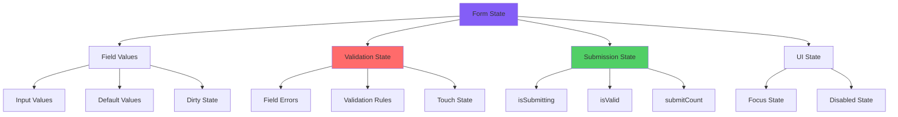
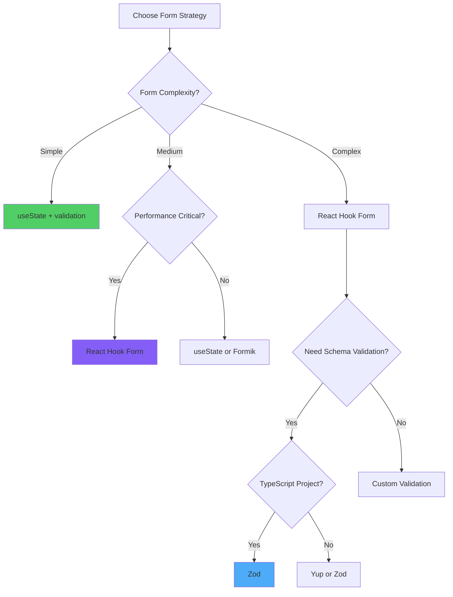

# React Forms and Validation: Patterns and Strategies

> A comprehensive exploration of form management patterns, validation strategies, and pragmatic implementation approaches for React applications

---

## Table of Contents

1. [Form Management Paradigms](#1-form-management-paradigms)
2. [Controlled vs Uncontrolled Components](#2-controlled-vs-uncontrolled-components)
3. [React Hook Form: Modern Form Management](#3-react-hook-form-modern-form-management)
4. [Validation with Yup](#4-validation-with-yup)
5. [Validation with Zod](#5-validation-with-zod)
6. [File Upload Handling](#6-file-upload-handling)
7. [Multi-Step Forms](#7-multi-step-forms)
8. [Form State Management](#8-form-state-management)
9. [Advanced Form Patterns](#9-advanced-form-patterns)
10. [Form Strategy Selection Matrix](#10-form-strategy-selection-matrix)

---

## 1. Form Management Paradigms

### Form State Classification



### Form Approaches Evolution

```
┌────────────────────────────────────────────────────────────────┐
│           Form Management Approaches                           │
├────────────────────────────────────────────────────────────────┤
│                                                                │
│  Vanilla React (Controlled Components)                         │
│  • useState for each field                                     │
│  • Manual validation                                           │
│  • Manual error state management                               │
│  ❌ Verbose and repetitive                                     │
│  ❌ Performance issues with many fields                        │
│  ❌ Complex validation logic                                   │
│                                                                │
│  Formik (Traditional Library)                                  │
│  • Centralized form state                                      │
│  • Built-in validation support                                 │
│  • Field-level validation                                      │
│  ⚠️  Re-renders on every keystroke                             │
│  ⚠️  Larger bundle size (~15KB)                                │
│                                                                │
│  React Hook Form (Modern Approach)                             │
│  • Uncontrolled with refs                                      │
│  • Minimal re-renders                                          │
│  • Excellent performance                                       │
│  ✅ Small bundle size (~9KB)                                   │
│  ✅ TypeScript support                                         │
│  ✅ Schema validation (Yup/Zod)                                │
│                                                                │
└────────────────────────────────────────────────────────────────┘
```

### Angular Forms vs React

```
Angular                          React
───────                         ─────

Template-Driven Forms           Controlled Components
[(ngModel)]="value"             value={value} onChange={...}

Reactive Forms                  React Hook Form
FormGroup, FormControl          useForm() hook

Built-in Validators             External Libraries
Validators.required             Yup / Zod / Custom

FormBuilder                     useForm({ defaultValues })
this.fb.group({...})            

Async Validators                Custom async validation
validate: (control) => {...}    validate: async (value) => {...}

valueChanges Observable         watch() / useWatch()
form.valueChanges.subscribe()   watch('fieldName')
```

---

## 2. Controlled vs Uncontrolled Components

### Controlled Components

**Controlled components** have their form state managed by React via `useState`, making React the "single source of truth" for form data.

```jsx
import { useState } from 'react';

const ControlledForm = () => {
  const [formData, setFormData] = useState({
    email: '',
    password: '',
    remember: false
  });
  const [errors, setErrors] = useState({});
  
  const handleChange = (e) => {
    const { name, value, type, checked } = e.target;
    setFormData(prev => ({
      ...prev,
      [name]: type === 'checkbox' ? checked : value
    }));
    
    // Clear error when user types
    if (errors[name]) {
      setErrors(prev => ({ ...prev, [name]: '' }));
    }
  };
  
  const handleSubmit = (e) => {
    e.preventDefault();
    
    // Validate
    const newErrors = {};
    if (!formData.email) {
      newErrors.email = 'Email è richiesta';
    } else if (!/\S+@\S+\.\S+/.test(formData.email)) {
      newErrors.email = 'Email non valida';
    }
    
    if (!formData.password) {
      newErrors.password = 'Password è richiesta';
    } else if (formData.password.length < 8) {
      newErrors.password = 'Password deve avere almeno 8 caratteri';
    }
    
    if (Object.keys(newErrors).length > 0) {
      setErrors(newErrors);
      return;
    }
    
    // Submit form
    console.log('Form submitted:', formData);
  };
  
  return (
    <form onSubmit={handleSubmit}>
      <div>
        <label htmlFor="email">Email</label>
        <input
          id="email"
          type="email"
          name="email"
          value={formData.email}
          onChange={handleChange}
          className={errors.email ? 'error' : ''}
        />
        {errors.email && <span className="error-message">{errors.email}</span>}
      </div>
      
      <div>
        <label htmlFor="password">Password</label>
        <input
          id="password"
          type="password"
          name="password"
          value={formData.password}
          onChange={handleChange}
          className={errors.password ? 'error' : ''}
        />
        {errors.password && <span className="error-message">{errors.password}</span>}
      </div>
      
      <div>
        <label>
          <input
            type="checkbox"
            name="remember"
            checked={formData.remember}
            onChange={handleChange}
          />
          Ricordami
        </label>
      </div>
      
      <button type="submit">Login</button>
    </form>
  );
};
```

### Uncontrolled Components

**Uncontrolled components** store form data in the DOM itself, accessed via refs when needed.

```jsx
import { useRef, useState } from 'react';

const UncontrolledForm = () => {
  const emailRef = useRef(null);
  const passwordRef = useRef(null);
  const rememberRef = useRef(null);
  const [errors, setErrors] = useState({});
  
  const handleSubmit = (e) => {
    e.preventDefault();
    
    const email = emailRef.current.value;
    const password = passwordRef.current.value;
    const remember = rememberRef.current.checked;
    
    // Validate
    const newErrors = {};
    if (!email) {
      newErrors.email = 'Email è richiesta';
    } else if (!/\S+@\S+\.\S+/.test(email)) {
      newErrors.email = 'Email non valida';
    }
    
    if (!password) {
      newErrors.password = 'Password è richiesta';
    } else if (password.length < 8) {
      newErrors.password = 'Password deve avere almeno 8 caratteri';
    }
    
    if (Object.keys(newErrors).length > 0) {
      setErrors(newErrors);
      return;
    }
    
    // Submit form
    console.log('Form submitted:', { email, password, remember });
    
    // Reset form
    e.target.reset();
  };
  
  return (
    <form onSubmit={handleSubmit}>
      <div>
        <label htmlFor="email">Email</label>
        <input
          id="email"
          type="email"
          name="email"
          ref={emailRef}
          defaultValue=""
          className={errors.email ? 'error' : ''}
        />
        {errors.email && <span className="error-message">{errors.email}</span>}
      </div>
      
      <div>
        <label htmlFor="password">Password</label>
        <input
          id="password"
          type="password"
          name="password"
          ref={passwordRef}
          defaultValue=""
          className={errors.password ? 'error' : ''}
        />
        {errors.password && <span className="error-message">{errors.password}</span>}
      </div>
      
      <div>
        <label>
          <input
            type="checkbox"
            name="remember"
            ref={rememberRef}
            defaultChecked={false}
          />
          Ricordami
        </label>
      </div>
      
      <button type="submit">Login</button>
    </form>
  );
};
```

### Controlled vs Uncontrolled Comparison

```
┌────────────────────────────────────────────────────────────────┐
│        Controlled vs Uncontrolled Components                   │
├────────────────────────────────────────────────────────────────┤
│                                                                │
│  Aspect           Controlled         Uncontrolled              │
│  ─────────────────────────────────────────────────────────────  │
│  Data Flow        React → DOM        DOM → React (on submit)   │
│  State Storage    useState           DOM (refs)                │
│  Re-renders       Every keystroke    Minimal                   │
│  Validation       Real-time          On submit/blur            │
│  Default Values   value prop         defaultValue prop         │
│  Access Values    Always available   Via ref.current.value     │
│  Performance      Lower (many fields) Higher                   │
│  React Way        ✅ Recommended      ⚠️  Special cases         │
│                                                                │
│  Use Controlled When:                                          │
│  • Need real-time validation                                   │
│  • Conditional rendering based on input                        │
│  • Instant field formatting                                    │
│  • Enforcing input format                                      │
│                                                                │
│  Use Uncontrolled When:                                        │
│  • Simple forms (contact, login)                               │
│  • Performance is critical                                     │
│  • Integrating non-React code                                  │
│  • File inputs (always uncontrolled)                           │
│                                                                │
└────────────────────────────────────────────────────────────────┘
```

### Hybrid Approach

```jsx
// Mix controlled and uncontrolled for optimal performance
const HybridForm = () => {
  // Controlled for fields needing real-time validation
  const [email, setEmail] = useState('');
  const [emailError, setEmailError] = useState('');
  
  // Uncontrolled for simple fields
  const nameRef = useRef(null);
  const messageRef = useRef(null);
  
  const validateEmail = (value) => {
    if (!value) {
      setEmailError('Email è richiesta');
    } else if (!/\S+@\S+\.\S+/.test(value)) {
      setEmailError('Email non valida');
    } else {
      setEmailError('');
    }
  };
  
  const handleEmailChange = (e) => {
    const value = e.target.value;
    setEmail(value);
    validateEmail(value);
  };
  
  const handleSubmit = (e) => {
    e.preventDefault();
    
    const formData = {
      name: nameRef.current.value,
      email,
      message: messageRef.current.value
    };
    
    console.log('Form submitted:', formData);
  };
  
  return (
    <form onSubmit={handleSubmit}>
      <input
        ref={nameRef}
        type="text"
        placeholder="Nome"
        defaultValue=""
      />
      
      <input
        type="email"
        value={email}
        onChange={handleEmailChange}
        placeholder="Email"
        className={emailError ? 'error' : ''}
      />
      {emailError && <span className="error-message">{emailError}</span>}
      
      <textarea
        ref={messageRef}
        placeholder="Messaggio"
        defaultValue=""
      />
      
      <button type="submit">Invia</button>
    </form>
  );
};
```

---

## 3. React Hook Form: Modern Form Management

### Installation and Basic Setup

```bash
npm install react-hook-form
```

### Basic Usage

```jsx
import { useForm } from 'react-hook-form';

const LoginForm = () => {
  const {
    register,
    handleSubmit,
    formState: { errors, isSubmitting }
  } = useForm({
    defaultValues: {
      email: '',
      password: ''
    }
  });
  
  const onSubmit = async (data) => {
    try {
      await loginAPI(data);
      console.log('Login successful:', data);
    } catch (error) {
      console.error('Login failed:', error);
    }
  };
  
  return (
    <form onSubmit={handleSubmit(onSubmit)}>
      <div>
        <label htmlFor="email">Email</label>
        <input
          id="email"
          type="email"
          {...register('email', {
            required: 'Email è richiesta',
            pattern: {
              value: /\S+@\S+\.\S+/,
              message: 'Email non valida'
            }
          })}
        />
        {errors.email && (
          <span className="error">{errors.email.message}</span>
        )}
      </div>
      
      <div>
        <label htmlFor="password">Password</label>
        <input
          id="password"
          type="password"
          {...register('password', {
            required: 'Password è richiesta',
            minLength: {
              value: 8,
              message: 'Password deve avere almeno 8 caratteri'
            }
          })}
        />
        {errors.password && (
          <span className="error">{errors.password.message}</span>
        )}
      </div>
      
      <button type="submit" disabled={isSubmitting}>
        {isSubmitting ? 'Invio in corso...' : 'Login'}
      </button>
    </form>
  );
};
```

### Complex Form with All Field Types

```jsx
import { useForm, Controller } from 'react-hook-form';

const RegistrationForm = () => {
  const {
    register,
    handleSubmit,
    watch,
    control,
    formState: { errors, isDirty, isValid }
  } = useForm({
    mode: 'onChange', // Validate on change
    defaultValues: {
      username: '',
      email: '',
      password: '',
      confirmPassword: '',
      country: '',
      age: '',
      terms: false,
      newsletter: false,
      gender: '',
      interests: []
    }
  });
  
  // Watch password for confirm password validation
  const password = watch('password');
  
  const onSubmit = (data) => {
    console.log('Form data:', data);
  };
  
  return (
    <form onSubmit={handleSubmit(onSubmit)}>
      {/* Text Input */}
      <div>
        <label>Username</label>
        <input
          {...register('username', {
            required: 'Username è richiesto',
            minLength: {
              value: 3,
              message: 'Minimo 3 caratteri'
            },
            maxLength: {
              value: 20,
              message: 'Massimo 20 caratteri'
            },
            pattern: {
              value: /^[a-zA-Z0-9_]+$/,
              message: 'Solo lettere, numeri e underscore'
            }
          })}
        />
        {errors.username && <span className="error">{errors.username.message}</span>}
      </div>
      
      {/* Email */}
      <div>
        <label>Email</label>
        <input
          type="email"
          {...register('email', {
            required: 'Email è richiesta',
            pattern: {
              value: /^[A-Z0-9._%+-]+@[A-Z0-9.-]+\.[A-Z]{2,}$/i,
              message: 'Email non valida'
            }
          })}
        />
        {errors.email && <span className="error">{errors.email.message}</span>}
      </div>
      
      {/* Password */}
      <div>
        <label>Password</label>
        <input
          type="password"
          {...register('password', {
            required: 'Password è richiesta',
            minLength: {
              value: 8,
              message: 'Minimo 8 caratteri'
            },
            pattern: {
              value: /^(?=.*[a-z])(?=.*[A-Z])(?=.*\d)(?=.*[@$!%*?&])[A-Za-z\d@$!%*?&]/,
              message: 'Password deve contenere maiuscola, minuscola, numero e simbolo'
            }
          })}
        />
        {errors.password && <span className="error">{errors.password.message}</span>}
      </div>
      
      {/* Confirm Password */}
      <div>
        <label>Conferma Password</label>
        <input
          type="password"
          {...register('confirmPassword', {
            required: 'Conferma password è richiesta',
            validate: value =>
              value === password || 'Le password non corrispondono'
          })}
        />
        {errors.confirmPassword && (
          <span className="error">{errors.confirmPassword.message}</span>
        )}
      </div>
      
      {/* Select */}
      <div>
        <label>Paese</label>
        <select
          {...register('country', {
            required: 'Seleziona un paese'
          })}
        >
          <option value="">Seleziona...</option>
          <option value="IT">Italia</option>
          <option value="US">Stati Uniti</option>
          <option value="UK">Regno Unito</option>
        </select>
        {errors.country && <span className="error">{errors.country.message}</span>}
      </div>
      
      {/* Number Input */}
      <div>
        <label>Età</label>
        <input
          type="number"
          {...register('age', {
            required: 'Età è richiesta',
            min: {
              value: 18,
              message: 'Devi avere almeno 18 anni'
            },
            max: {
              value: 120,
              message: 'Età non valida'
            },
            valueAsNumber: true
          })}
        />
        {errors.age && <span className="error">{errors.age.message}</span>}
      </div>
      
      {/* Radio Buttons */}
      <div>
        <label>Genere</label>
        <label>
          <input
            type="radio"
            value="male"
            {...register('gender', {
              required: 'Seleziona il genere'
            })}
          />
          Maschio
        </label>
        <label>
          <input
            type="radio"
            value="female"
            {...register('gender')}
          />
          Femmina
        </label>
        <label>
          <input
            type="radio"
            value="other"
            {...register('gender')}
          />
          Altro
        </label>
        {errors.gender && <span className="error">{errors.gender.message}</span>}
      </div>
      
      {/* Checkboxes */}
      <div>
        <label>Interessi</label>
        <label>
          <input
            type="checkbox"
            value="sports"
            {...register('interests')}
          />
          Sport
        </label>
        <label>
          <input
            type="checkbox"
            value="music"
            {...register('interests')}
          />
          Musica
        </label>
        <label>
          <input
            type="checkbox"
            value="reading"
            {...register('interests')}
          />
          Lettura
        </label>
      </div>
      
      {/* Single Checkbox */}
      <div>
        <label>
          <input
            type="checkbox"
            {...register('terms', {
              required: 'Devi accettare i termini'
            })}
          />
          Accetto i termini e condizioni
        </label>
        {errors.terms && <span className="error">{errors.terms.message}</span>}
      </div>
      
      <div>
        <label>
          <input
            type="checkbox"
            {...register('newsletter')}
          />
          Iscriviti alla newsletter
        </label>
      </div>
      
      <button type="submit" disabled={!isDirty || !isValid}>
        Registrati
      </button>
    </form>
  );
};
```

### Advanced Features

```jsx
import { useForm, useWatch, useFieldArray } from 'react-hook-form';

const AdvancedForm = () => {
  const {
    register,
    handleSubmit,
    control,
    setValue,
    reset,
    trigger,
    formState: { errors, touchedFields, dirtyFields }
  } = useForm();
  
  // Watch specific fields
  const email = useWatch({ control, name: 'email' });
  
  // Watch multiple fields
  const [firstName, lastName] = useWatch({
    control,
    name: ['firstName', 'lastName']
  });
  
  // Dynamic fields (array)
  const { fields, append, remove } = useFieldArray({
    control,
    name: 'phoneNumbers'
  });
  
  // Programmatically set value
  const fillDemoData = () => {
    setValue('firstName', 'Marco');
    setValue('lastName', 'Rossi');
    setValue('email', 'marco@example.com');
  };
  
  // Trigger validation manually
  const validateEmail = async () => {
    const result = await trigger('email');
    console.log('Email valid:', result);
  };
  
  // Reset form
  const handleReset = () => {
    reset({
      firstName: '',
      lastName: '',
      email: ''
    });
  };
  
  const onSubmit = (data) => {
    console.log('Form data:', data);
  };
  
  return (
    <form onSubmit={handleSubmit(onSubmit)}>
      <input {...register('firstName')} placeholder="Nome" />
      <input {...register('lastName')} placeholder="Cognome" />
      <input {...register('email')} placeholder="Email" />
      
      <p>Full name: {firstName} {lastName}</p>
      <p>Email preview: {email}</p>
      
      {/* Dynamic phone numbers */}
      <div>
        <h3>Numeri di telefono</h3>
        {fields.map((field, index) => (
          <div key={field.id}>
            <input
              {...register(`phoneNumbers.${index}.number`)}
              placeholder="Numero"
            />
            <button type="button" onClick={() => remove(index)}>
              Rimuovi
            </button>
          </div>
        ))}
        <button
          type="button"
          onClick={() => append({ number: '' })}
        >
          Aggiungi numero
        </button>
      </div>
      
      <div>
        <button type="button" onClick={fillDemoData}>
          Riempi dati demo
        </button>
        <button type="button" onClick={validateEmail}>
          Valida email
        </button>
        <button type="button" onClick={handleReset}>
          Reset
        </button>
      </div>
      
      <button type="submit">Invia</button>
    </form>
  );
};
```

### Custom Validation

```jsx
const FormWithCustomValidation = () => {
  const { register, handleSubmit, formState: { errors } } = useForm();
  
  // Async validation (check username availability)
  const validateUsername = async (value) => {
    if (value.length < 3) return 'Troppo corto';
    
    const response = await fetch(`/api/check-username?username=${value}`);
    const { available } = await response.json();
    
    return available || 'Username già in uso';
  };
  
  // Custom synchronous validation
  const validatePassword = (value) => {
    if (value.length < 8) return 'Minimo 8 caratteri';
    if (!/[A-Z]/.test(value)) return 'Deve contenere una maiuscola';
    if (!/[a-z]/.test(value)) return 'Deve contenere una minuscola';
    if (!/[0-9]/.test(value)) return 'Deve contenere un numero';
    if (!/[^A-Za-z0-9]/.test(value)) return 'Deve contenere un simbolo';
    return true;
  };
  
  const onSubmit = (data) => {
    console.log(data);
  };
  
  return (
    <form onSubmit={handleSubmit(onSubmit)}>
      <div>
        <input
          {...register('username', {
            required: 'Username è richiesto',
            validate: validateUsername
          })}
          placeholder="Username"
        />
        {errors.username && <span>{errors.username.message}</span>}
      </div>
      
      <div>
        <input
          type="password"
          {...register('password', {
            required: 'Password è richiesta',
            validate: validatePassword
          })}
          placeholder="Password"
        />
        {errors.password && <span>{errors.password.message}</span>}
      </div>
      
      <button type="submit">Registrati</button>
    </form>
  );
};
```

---

## 4. Validation with Yup

### Installation

```bash
npm install yup @hookform/resolvers
```

### Basic Yup Schema

```jsx
import { useForm } from 'react-hook-form';
import { yupResolver } from '@hookform/resolvers/yup';
import * as yup from 'yup';

// Define validation schema
const schema = yup.object({
  firstName: yup
    .string()
    .required('Nome è richiesto')
    .min(2, 'Minimo 2 caratteri')
    .max(50, 'Massimo 50 caratteri'),
  
  lastName: yup
    .string()
    .required('Cognome è richiesto')
    .min(2, 'Minimo 2 caratteri'),
  
  email: yup
    .string()
    .required('Email è richiesta')
    .email('Email non valida'),
  
  age: yup
    .number()
    .required('Età è richiesta')
    .positive('Età deve essere positiva')
    .integer('Età deve essere un numero intero')
    .min(18, 'Devi avere almeno 18 anni')
    .max(120, 'Età non valida'),
  
  password: yup
    .string()
    .required('Password è richiesta')
    .min(8, 'Minimo 8 caratteri')
    .matches(
      /^(?=.*[a-z])(?=.*[A-Z])(?=.*\d)(?=.*[@$!%*?&])/,
      'Password deve contenere maiuscola, minuscola, numero e simbolo'
    ),
  
  confirmPassword: yup
    .string()
    .required('Conferma password è richiesta')
    .oneOf([yup.ref('password')], 'Le password non corrispondono'),
  
  website: yup
    .string()
    .url('URL non valido')
    .nullable(),
  
  terms: yup
    .boolean()
    .oneOf([true], 'Devi accettare i termini')
}).required();

const RegistrationForm = () => {
  const {
    register,
    handleSubmit,
    formState: { errors }
  } = useForm({
    resolver: yupResolver(schema)
  });
  
  const onSubmit = (data) => {
    console.log('Valid form data:', data);
  };
  
  return (
    <form onSubmit={handleSubmit(onSubmit)}>
      <div>
        <input {...register('firstName')} placeholder="Nome" />
        {errors.firstName && <span>{errors.firstName.message}</span>}
      </div>
      
      <div>
        <input {...register('lastName')} placeholder="Cognome" />
        {errors.lastName && <span>{errors.lastName.message}</span>}
      </div>
      
      <div>
        <input {...register('email')} placeholder="Email" />
        {errors.email && <span>{errors.email.message}</span>}
      </div>
      
      <div>
        <input type="number" {...register('age')} placeholder="Età" />
        {errors.age && <span>{errors.age.message}</span>}
      </div>
      
      <div>
        <input type="password" {...register('password')} placeholder="Password" />
        {errors.password && <span>{errors.password.message}</span>}
      </div>
      
      <div>
        <input
          type="password"
          {...register('confirmPassword')}
          placeholder="Conferma Password"
        />
        {errors.confirmPassword && <span>{errors.confirmPassword.message}</span>}
      </div>
      
      <div>
        <input {...register('website')} placeholder="Sito web (opzionale)" />
        {errors.website && <span>{errors.website.message}</span>}
      </div>
      
      <div>
        <label>
          <input type="checkbox" {...register('terms')} />
          Accetto i termini
        </label>
        {errors.terms && <span>{errors.terms.message}</span>}
      </div>
      
      <button type="submit">Registrati</button>
    </form>
  );
};
```

### Advanced Yup Validation

```javascript
import * as yup from 'yup';

// Custom validation method
yup.addMethod(yup.string, 'strongPassword', function(message) {
  return this.test('strong-password', message, function(value) {
    const { path, createError } = this;
    
    if (!value) return true; // Let required handle this
    
    const hasUpperCase = /[A-Z]/.test(value);
    const hasLowerCase = /[a-z]/.test(value);
    const hasNumber = /[0-9]/.test(value);
    const hasSymbol = /[^A-Za-z0-9]/.test(value);
    
    if (hasUpperCase && hasLowerCase && hasNumber && hasSymbol) {
      return true;
    }
    
    return createError({
      path,
      message: message || 'Password non abbastanza forte'
    });
  });
});

// Conditional validation
const schema = yup.object({
  accountType: yup
    .string()
    .required('Tipo account è richiesto')
    .oneOf(['personal', 'business'], 'Tipo non valido'),
  
  // Required only if accountType is 'business'
  companyName: yup
    .string()
    .when('accountType', {
      is: 'business',
      then: (schema) => schema.required('Nome azienda è richiesto'),
      otherwise: (schema) => schema.notRequired()
    }),
  
  vatNumber: yup
    .string()
    .when('accountType', {
      is: 'business',
      then: (schema) => schema
        .required('Partita IVA è richiesta')
        .matches(/^\d{11}$/, 'Partita IVA deve avere 11 cifre'),
      otherwise: (schema) => schema.notRequired()
    }),
  
  // Dependent validation
  startDate: yup.date().required('Data inizio è richiesta'),
  
  endDate: yup
    .date()
    .required('Data fine è richiesta')
    .min(
      yup.ref('startDate'),
      'Data fine deve essere dopo data inizio'
    ),
  
  // Array validation
  skills: yup
    .array()
    .of(yup.string())
    .min(1, 'Seleziona almeno una competenza')
    .max(5, 'Massimo 5 competenze'),
  
  // Object validation
  address: yup.object({
    street: yup.string().required('Via è richiesta'),
    city: yup.string().required('Città è richiesta'),
    zipCode: yup
      .string()
      .required('CAP è richiesto')
      .matches(/^\d{5}$/, 'CAP deve avere 5 cifre'),
    country: yup.string().required('Paese è richiesto')
  }),
  
  // Async validation
  username: yup
    .string()
    .required('Username è richiesto')
    .min(3, 'Minimo 3 caratteri')
    .test('unique-username', 'Username già in uso', async (value) => {
      if (!value || value.length < 3) return true;
      
      const response = await fetch(`/api/check-username?username=${value}`);
      const { available } = await response.json();
      return available;
    }),
  
  // Custom password validation
  password: yup
    .string()
    .required('Password è richiesta')
    .min(8, 'Minimo 8 caratteri')
    .strongPassword('Password non abbastanza forte')
});
```

---

## 5. Validation with Zod

### Installation

```bash
npm install zod @hookform/resolvers
```

### Basic Zod Schema

```jsx
import { useForm } from 'react-hook-form';
import { zodResolver } from '@hookform/resolvers/zod';
import { z } from 'zod';

// Define validation schema
const schema = z.object({
  firstName: z
    .string()
    .min(2, { message: 'Minimo 2 caratteri' })
    .max(50, { message: 'Massimo 50 caratteri' }),
  
  lastName: z
    .string()
    .min(2, { message: 'Minimo 2 caratteri' }),
  
  email: z
    .string()
    .email({ message: 'Email non valida' }),
  
  age: z
    .number({ invalid_type_error: 'Età deve essere un numero' })
    .int({ message: 'Età deve essere un numero intero' })
    .positive({ message: 'Età deve essere positiva' })
    .min(18, { message: 'Devi avere almeno 18 anni' })
    .max(120, { message: 'Età non valida' }),
  
  password: z
    .string()
    .min(8, { message: 'Minimo 8 caratteri' })
    .regex(
      /^(?=.*[a-z])(?=.*[A-Z])(?=.*\d)(?=.*[@$!%*?&])/,
      { message: 'Password deve contenere maiuscola, minuscola, numero e simbolo' }
    ),
  
  confirmPassword: z.string(),
  
  website: z
    .string()
    .url({ message: 'URL non valido' })
    .optional()
    .or(z.literal('')),
  
  terms: z
    .boolean()
    .refine(val => val === true, {
      message: 'Devi accettare i termini'
    })
}).refine(data => data.password === data.confirmPassword, {
  message: 'Le password non corrispondono',
  path: ['confirmPassword']
});

const RegistrationForm = () => {
  const {
    register,
    handleSubmit,
    formState: { errors }
  } = useForm({
    resolver: zodResolver(schema)
  });
  
  const onSubmit = (data) => {
    console.log('Valid form data:', data);
  };
  
  return (
    <form onSubmit={handleSubmit(onSubmit)}>
      <div>
        <input {...register('firstName')} placeholder="Nome" />
        {errors.firstName && <span>{errors.firstName.message}</span>}
      </div>
      
      <div>
        <input {...register('email')} placeholder="Email" />
        {errors.email && <span>{errors.email.message}</span>}
      </div>
      
      <div>
        <input
          type="number"
          {...register('age', { valueAsNumber: true })}
          placeholder="Età"
        />
        {errors.age && <span>{errors.age.message}</span>}
      </div>
      
      <div>
        <input type="password" {...register('password')} placeholder="Password" />
        {errors.password && <span>{errors.password.message}</span>}
      </div>
      
      <div>
        <input
          type="password"
          {...register('confirmPassword')}
          placeholder="Conferma Password"
        />
        {errors.confirmPassword && <span>{errors.confirmPassword.message}</span>}
      </div>
      
      <button type="submit">Registrati</button>
    </form>
  );
};
```

### Advanced Zod Features

```javascript
import { z } from 'zod';

// Custom error messages
const customErrorMap: z.ZodErrorMap = (issue, ctx) => {
  if (issue.code === z.ZodIssueCode.invalid_type) {
    if (issue.expected === 'string') {
      return { message: 'Questo campo deve essere una stringa' };
    }
  }
  if (issue.code === z.ZodIssueCode.too_small) {
    if (issue.type === 'string') {
      return { message: `Minimo ${issue.minimum} caratteri` };
    }
  }
  return { message: ctx.defaultError };
};

z.setErrorMap(customErrorMap);

// Discriminated unions (different schemas based on type)
const schema = z.discriminatedUnion('accountType', [
  z.object({
    accountType: z.literal('personal'),
    firstName: z.string().min(2),
    lastName: z.string().min(2)
  }),
  z.object({
    accountType: z.literal('business'),
    companyName: z.string().min(2),
    vatNumber: z.string().regex(/^\d{11}$/)
  })
]);

// Transforms
const userSchema = z.object({
  email: z
    .string()
    .email()
    .transform(val => val.toLowerCase()), // Transform to lowercase
  
  age: z
    .string()
    .transform(val => parseInt(val, 10)) // Transform string to number
    .pipe(z.number().min(18)),
  
  tags: z
    .string()
    .transform(val => val.split(',').map(t => t.trim())) // Transform comma-separated to array
});

// Async refinements
const usernameSchema = z.string().refine(
  async (username) => {
    const response = await fetch(`/api/check-username?username=${username}`);
    const { available } = await response.json();
    return available;
  },
  { message: 'Username già in uso' }
);

// Complex nested object
const addressSchema = z.object({
  street: z.string().min(1),
  city: z.string().min(1),
  zipCode: z.string().regex(/^\d{5}$/),
  country: z.string().min(1)
});

const profileSchema = z.object({
  personalInfo: z.object({
    firstName: z.string().min(2),
    lastName: z.string().min(2),
    dateOfBirth: z.date()
  }),
  
  contactInfo: z.object({
    email: z.string().email(),
    phone: z.string().regex(/^\+?[\d\s-]+$/),
    address: addressSchema
  }),
  
  preferences: z.object({
    newsletter: z.boolean(),
    notifications: z.enum(['all', 'important', 'none']),
    language: z.enum(['it', 'en', 'es', 'fr'])
  }),
  
  skills: z.array(z.string()).min(1).max(10),
  
  socialLinks: z.record(z.string().url()).optional()
});

// Infer TypeScript type from schema
type ProfileFormData = z.infer<typeof profileSchema>;
```

### Yup vs Zod Comparison

```
┌────────────────────────────────────────────────────────────────┐
│                  Yup vs Zod                                    │
├────────────────────────────────────────────────────────────────┤
│                                                                │
│  Feature          Yup                Zod                       │
│  ─────────────────────────────────────────────────────────────  │
│  TypeScript       Good               Excellent (native)        │
│  Type Inference   Manual             Automatic                 │
│  Bundle Size      ~14KB              ~13KB                     │
│  API Style        Chaining           Chaining                  │
│  Async            Built-in           Built-in                  │
│  Transforms       Limited            Advanced                  │
│  Error Messages   Good               Good                      │
│  Ecosystem        Mature             Growing                   │
│  Performance      Good               Better                    │
│                                                                │
│  Choose Yup When:                                              │
│  • Migrating from older projects                               │
│  • Need extensive ecosystem/examples                           │
│  • Team familiar with Yup                                      │
│                                                                │
│  Choose Zod When:                                              │
│  • TypeScript-first project                                    │
│  • Want type inference                                         │
│  • Need data transformations                                   │
│  • Modern/new project                                          │
│                                                                │
└────────────────────────────────────────────────────────────────┘
```

---

## 6. File Upload Handling

### Basic File Upload

```jsx
import { useForm } from 'react-hook-form';

const FileUploadForm = () => {
  const { register, handleSubmit, watch } = useForm();
  
  // Watch file input
  const watchFile = watch('avatar');
  
  const onSubmit = async (data) => {
    const formData = new FormData();
    formData.append('avatar', data.avatar[0]);
    formData.append('name', data.name);
    
    try {
      const response = await fetch('/api/upload', {
        method: 'POST',
        body: formData
      });
      
      const result = await response.json();
      console.log('Upload successful:', result);
    } catch (error) {
      console.error('Upload failed:', error);
    }
  };
  
  return (
    <form onSubmit={handleSubmit(onSubmit)}>
      <div>
        <input {...register('name')} placeholder="Nome" />
      </div>
      
      <div>
        <input
          type="file"
          {...register('avatar', {
            required: 'File è richiesto'
          })}
          accept="image/*"
        />
        {watchFile && watchFile[0] && (
          <p>File selezionato: {watchFile[0].name}</p>
        )}
      </div>
      
      <button type="submit">Carica</button>
    </form>
  );
};
```

### File Upload with Preview

```jsx
import { useState } from 'react';
import { useForm } from 'react-hook-form';

const ImageUploadWithPreview = () => {
  const { register, handleSubmit, formState: { errors } } = useForm();
  const [preview, setPreview] = useState(null);
  const [uploading, setUploading] = useState(false);
  
  const handleFileChange = (e) => {
    const file = e.target.files[0];
    
    if (file) {
      // Validate file size (max 5MB)
      if (file.size > 5 * 1024 * 1024) {
        alert('File troppo grande (max 5MB)');
        return;
      }
      
      // Validate file type
      if (!file.type.startsWith('image/')) {
        alert('Solo immagini sono permesse');
        return;
      }
      
      // Create preview
      const reader = new FileReader();
      reader.onloadend = () => {
        setPreview(reader.result);
      };
      reader.readAsDataURL(file);
    }
  };
  
  const onSubmit = async (data) => {
    setUploading(true);
    
    const formData = new FormData();
    formData.append('image', data.image[0]);
    formData.append('title', data.title);
    formData.append('description', data.description);
    
    try {
      const response = await fetch('/api/upload', {
        method: 'POST',
        body: formData
      });
      
      if (!response.ok) {
        throw new Error('Upload failed');
      }
      
      const result = await response.json();
      console.log('Upload successful:', result);
      alert('Immagine caricata con successo!');
      
      // Reset form
      setPreview(null);
    } catch (error) {
      console.error('Upload error:', error);
      alert('Errore durante il caricamento');
    } finally {
      setUploading(false);
    }
  };
  
  return (
    <form onSubmit={handleSubmit(onSubmit)}>
      <div>
        <input
          {...register('title', { required: 'Titolo è richiesto' })}
          placeholder="Titolo"
        />
        {errors.title && <span>{errors.title.message}</span>}
      </div>
      
      <div>
        <textarea
          {...register('description')}
          placeholder="Descrizione (opzionale)"
        />
      </div>
      
      <div>
        <input
          type="file"
          {...register('image', {
            required: 'Immagine è richiesta',
            validate: {
              size: files => files[0]?.size <= 5 * 1024 * 1024 || 
                'File troppo grande (max 5MB)',
              type: files => files[0]?.type.startsWith('image/') || 
                'Solo immagini sono permesse'
            }
          })}
          accept="image/*"
          onChange={handleFileChange}
        />
        {errors.image && <span>{errors.image.message}</span>}
      </div>
      
      {preview && (
        <div className="preview">
          
        </div>
      )}
      
      <button type="submit" disabled={uploading}>
        {uploading ? 'Caricamento...' : 'Carica Immagine'}
      </button>
    </form>
  );
};
```

### Multiple File Upload

```jsx
import { useForm } from 'react-hook-form';

const MultipleFileUpload = () => {
  const { register, handleSubmit, watch } = useForm();
  const files = watch('documents');
  
  const onSubmit = async (data) => {
    const formData = new FormData();
    
    // Append all files
    for (let i = 0; i < data.documents.length; i++) {
      formData.append('documents', data.documents[i]);
    }
    
    try {
      const response = await fetch('/api/upload-multiple', {
        method: 'POST',
        body: formData
      });
      
      const result = await response.json();
      console.log('Upload successful:', result);
    } catch (error) {
      console.error('Upload failed:', error);
    }
  };
  
  return (
    <form onSubmit={handleSubmit(onSubmit)}>
      <div>
        <input
          type="file"
          {...register('documents', {
            required: 'Almeno un file è richiesto',
            validate: {
              count: files => files.length <= 5 || 'Massimo 5 files',
              size: files => {
                const totalSize = Array.from(files).reduce(
                  (sum, file) => sum + file.size, 0
                );
                return totalSize <= 10 * 1024 * 1024 || 
                  'Dimensione totale troppo grande (max 10MB)';
              }
            }
          })}
          multiple
          accept=".pdf,.doc,.docx,.txt"
        />
      </div>
      
      {files && files.length > 0 && (
        <div>
          <h3>Files selezionati:</h3>
          <ul>
            {Array.from(files).map((file, index) => (
              <li key={index}>
                {file.name} ({(file.size / 1024).toFixed(2)} KB)
              </li>
            ))}
          </ul>
        </div>
      )}
      
      <button type="submit">Carica Files</button>
    </form>
  );
};
```

### Drag and Drop File Upload

```jsx
import { useState, useCallback } from 'react';
import { useForm } from 'react-hook-form';
import { useDropzone } from 'react-dropzone';

const DragDropUpload = () => {
  const { handleSubmit, setValue } = useForm();
  const [files, setFiles] = useState([]);
  
  const onDrop = useCallback((acceptedFiles) => {
    setFiles(acceptedFiles);
    setValue('files', acceptedFiles);
  }, [setValue]);
  
  const { getRootProps, getInputProps, isDragActive } = useDropzone({
    onDrop,
    accept: {
      'image/*': ['.png', '.jpg', '.jpeg', '.gif']
    },
    maxFiles: 5,
    maxSize: 5 * 1024 * 1024 // 5MB
  });
  
  const onSubmit = async (data) => {
    const formData = new FormData();
    files.forEach((file) => {
      formData.append('images', file);
    });
    
    try {
      const response = await fetch('/api/upload', {
        method: 'POST',
        body: formData
      });
      console.log('Upload successful');
    } catch (error) {
      console.error('Upload failed:', error);
    }
  };
  
  return (
    <form onSubmit={handleSubmit(onSubmit)}>
      <div
        {...getRootProps()}
        style={{
          border: '2px dashed #ccc',
          padding: '40px',
          textAlign: 'center',
          backgroundColor: isDragActive ? '#e3f2fd' : '#fafafa'
        }}
      >
        <input {...getInputProps()} />
        {isDragActive ? (
          <p>Rilascia i file qui...</p>
        ) : (
          <p>Trascina i file qui o clicca per selezionare</p>
        )}
      </div>
      
      {files.length > 0 && (
        <div>
          <h3>Files selezionati:</h3>
          <ul>
            {files.map((file, index) => (
              <li key={index}>{file.name}</li>
            ))}
          </ul>
        </div>
      )}
      
      <button type="submit" disabled={files.length === 0}>
        Carica
      </button>
    </form>
  );
};
```

---

## 7. Multi-Step Forms

### Basic Multi-Step Form

```jsx
import { useState } from 'react';
import { useForm } from 'react-hook-form';

const MultiStepForm = () => {
  const [step, setStep] = useState(1);
  const { register, handleSubmit, formState: { errors }, trigger, getValues } = useForm({
    mode: 'onBlur'
  });
  
  const nextStep = async () => {
    // Validate current step before proceeding
    const isValid = await trigger(getFieldsForStep(step));
    if (isValid) {
      setStep(prev => prev + 1);
    }
  };
  
  const prevStep = () => {
    setStep(prev => prev - 1);
  };
  
  const onSubmit = (data) => {
    console.log('Form completed:', data);
  };
  
  const getFieldsForStep = (currentStep) => {
    switch (currentStep) {
      case 1:
        return ['firstName', 'lastName', 'email'];
      case 2:
        return ['address', 'city', 'zipCode'];
      case 3:
        return ['cardNumber', 'expiryDate', 'cvv'];
      default:
        return [];
    }
  };
  
  return (
    <div>
      <div className="progress-bar">
        <div className={`step ${step >= 1 ? 'active' : ''}`}>1. Informazioni Personali</div>
        <div className={`step ${step >= 2 ? 'active' : ''}`}>2. Indirizzo</div>
        <div className={`step ${step >= 3 ? 'active' : ''}`}>3. Pagamento</div>
      </div>
      
      <form onSubmit={handleSubmit(onSubmit)}>
        {/* Step 1: Personal Information */}
        {step === 1 && (
          <div>
            <h2>Informazioni Personali</h2>
            <div>
              <input
                {...register('firstName', { required: 'Nome è richiesto' })}
                placeholder="Nome"
              />
              {errors.firstName && <span>{errors.firstName.message}</span>}
            </div>
            
            <div>
              <input
                {...register('lastName', { required: 'Cognome è richiesto' })}
                placeholder="Cognome"
              />
              {errors.lastName && <span>{errors.lastName.message}</span>}
            </div>
            
            <div>
              <input
                type="email"
                {...register('email', {
                  required: 'Email è richiesta',
                  pattern: {
                    value: /\S+@\S+\.\S+/,
                    message: 'Email non valida'
                  }
                })}
                placeholder="Email"
              />
              {errors.email && <span>{errors.email.message}</span>}
            </div>
          </div>
        )}
        
        {/* Step 2: Address */}
        {step === 2 && (
          <div>
            <h2>Indirizzo</h2>
            <div>
              <input
                {...register('address', { required: 'Indirizzo è richiesto' })}
                placeholder="Via e numero civico"
              />
              {errors.address && <span>{errors.address.message}</span>}
            </div>
            
            <div>
              <input
                {...register('city', { required: 'Città è richiesta' })}
                placeholder="Città"
              />
              {errors.city && <span>{errors.city.message}</span>}
            </div>
            
            <div>
              <input
                {...register('zipCode', {
                  required: 'CAP è richiesto',
                  pattern: {
                    value: /^\d{5}$/,
                    message: 'CAP deve avere 5 cifre'
                  }
                })}
                placeholder="CAP"
              />
              {errors.zipCode && <span>{errors.zipCode.message}</span>}
            </div>
          </div>
        )}
        
        {/* Step 3: Payment */}
        {step === 3 && (
          <div>
            <h2>Informazioni Pagamento</h2>
            <div>
              <input
                {...register('cardNumber', {
                  required: 'Numero carta è richiesto',
                  pattern: {
                    value: /^\d{16}$/,
                    message: 'Numero carta non valido'
                  }
                })}
                placeholder="Numero carta"
                maxLength={16}
              />
              {errors.cardNumber && <span>{errors.cardNumber.message}</span>}
            </div>
            
            <div>
              <input
                {...register('expiryDate', {
                  required: 'Data scadenza è richiesta',
                  pattern: {
                    value: /^(0[1-9]|1[0-2])\/\d{2}$/,
                    message: 'Formato MM/YY'
                  }
                })}
                placeholder="MM/YY"
              />
              {errors.expiryDate && <span>{errors.expiryDate.message}</span>}
            </div>
            
            <div>
              <input
                {...register('cvv', {
                  required: 'CVV è richiesto',
                  pattern: {
                    value: /^\d{3,4}$/,
                    message: 'CVV non valido'
                  }
                })}
                placeholder="CVV"
                maxLength={4}
              />
              {errors.cvv && <span>{errors.cvv.message}</span>}
            </div>
          </div>
        )}
        
        {/* Navigation Buttons */}
        <div className="form-navigation">
          {step > 1 && (
            <button type="button" onClick={prevStep}>
              Indietro
            </button>
          )}
          
          {step < 3 && (
            <button type="button" onClick={nextStep}>
              Avanti
            </button>
          )}
          
          {step === 3 && (
            <button type="submit">
              Conferma
            </button>
          )}
        </div>
      </form>
    </div>
  );
};
```

### Multi-Step with State Persistence

```jsx
import { useState, useEffect } from 'react';
import { useForm } from 'react-hook-form';

const STORAGE_KEY = 'multi-step-form-data';

const PersistentMultiStepForm = () => {
  const [step, setStep] = useState(1);
  const { register, handleSubmit, formState: { errors }, watch, setValue } = useForm({
    defaultValues: getStoredValues()
  });
  
  // Watch all form values
  const formValues = watch();
  
  // Save to localStorage on change
  useEffect(() => {
    localStorage.setItem(STORAGE_KEY, JSON.stringify({
      step,
      values: formValues
    }));
  }, [step, formValues]);
  
  function getStoredValues() {
    try {
      const stored = localStorage.getItem(STORAGE_KEY);
      if (stored) {
        const { values } = JSON.parse(stored);
        return values;
      }
    } catch (error) {
      console.error('Error loading stored form data:', error);
    }
    return {};
  }
  
  useEffect(() => {
    // Restore step
    try {
      const stored = localStorage.getItem(STORAGE_KEY);
      if (stored) {
        const { step: storedStep } = JSON.parse(stored);
        setStep(storedStep);
      }
    } catch (error) {
      console.error('Error restoring step:', error);
    }
  }, []);
  
  const onSubmit = (data) => {
    console.log('Form submitted:', data);
    // Clear storage after submission
    localStorage.removeItem(STORAGE_KEY);
  };
  
  const clearProgress = () => {
    localStorage.removeItem(STORAGE_KEY);
    setStep(1);
    // Reset form
    Object.keys(formValues).forEach(key => {
      setValue(key, '');
    });
  };
  
  return (
    <div>
      <button onClick={clearProgress}>Cancella Progresso</button>
      {/* Form steps... */}
    </form>
    </div>
  );
};
```

### Multi-Step with Wizard Component

```jsx
import { useState } from 'react';
import { useForm, FormProvider } from 'react-hook-form';

// Wizard Context
const WizardContext = createContext();

const Wizard = ({ children, onSubmit }) => {
  const [step, setStep] = useState(0);
  const methods = useForm();
  
  const steps = React.Children.toArray(children);
  const currentStep = steps[step];
  
  const nextStep = async () => {
    const isValid = await methods.trigger();
    if (isValid && step < steps.length - 1) {
      setStep(prev => prev + 1);
    }
  };
  
  const prevStep = () => {
    if (step > 0) {
      setStep(prev => prev - 1);
    }
  };
  
  const context = {
    step,
    totalSteps: steps.length,
    nextStep,
    prevStep,
    isFirstStep: step === 0,
    isLastStep: step === steps.length - 1
  };
  
  return (
    <WizardContext.Provider value={context}>
      <FormProvider {...methods}>
        <form onSubmit={methods.handleSubmit(onSubmit)}>
          <div className="wizard-progress">
            Step {step + 1} of {steps.length}
          </div>
          {currentStep}
        </form>
      </FormProvider>
    </WizardContext.Provider>
  );
};

const WizardStep = ({ children }) => {
  return <div className="wizard-step">{children}</div>;
};

const WizardNavigation = () => {
  const { isFirstStep, isLastStep, nextStep, prevStep } = useContext(WizardContext);
  
  return (
    <div className="wizard-navigation">
      {!isFirstStep && (
        <button type="button" onClick={prevStep}>
          Indietro
        </button>
      )}
      
      {!isLastStep ? (
        <button type="button" onClick={nextStep}>
          Avanti
        </button>
      ) : (
        <button type="submit">
          Invia
        </button>
      )}
    </div>
  );
};

// Usage
const App = () => {
  const handleSubmit = (data) => {
    console.log('Form submitted:', data);
  };
  
  return (
    <Wizard onSubmit={handleSubmit}>
      <WizardStep>
        <h2>Step 1: Personal Info</h2>
        {/* Step 1 fields */}
        <WizardNavigation />
      </WizardStep>
      
      <WizardStep>
        <h2>Step 2: Address</h2>
        {/* Step 2 fields */}
        <WizardNavigation />
      </WizardStep>
      
      <WizardStep>
        <h2>Step 3: Review</h2>
        {/* Step 3 review */}
        <WizardNavigation />
      </WizardStep>
    </Wizard>
  );
};
```

---

## 8. Form State Management

### Local State with useState

```jsx
const LocalStateForm = () => {
  const [formState, setFormState] = useState({
    values: { email: '', password: '' },
    errors: {},
    touched: {},
    isSubmitting: false
  });
  
  const handleChange = (e) => {
    const { name, value } = e.target;
    setFormState(prev => ({
      ...prev,
      values: { ...prev.values, [name]: value }
    }));
  };
  
  const handleBlur = (e) => {
    const { name } = e.target;
    setFormState(prev => ({
      ...prev,
      touched: { ...prev.touched, [name]: true }
    }));
    validateField(name, formState.values[name]);
  };
  
  const validateField = (name, value) => {
    let error = '';
    
    if (name === 'email') {
      if (!value) error = 'Email è richiesta';
      else if (!/\S+@\S+\.\S+/.test(value)) error = 'Email non valida';
    }
    
    if (name === 'password') {
      if (!value) error = 'Password è richiesta';
      else if (value.length < 8) error = 'Minimo 8 caratteri';
    }
    
    setFormState(prev => ({
      ...prev,
      errors: { ...prev.errors, [name]: error }
    }));
  };
  
  const handleSubmit = async (e) => {
    e.preventDefault();
    setFormState(prev => ({ ...prev, isSubmitting: true }));
    
    try {
      await submitForm(formState.values);
    } catch (error) {
      console.error(error);
    } finally {
      setFormState(prev => ({ ...prev, isSubmitting: false }));
    }
  };
  
  return (
    <form onSubmit={handleSubmit}>
      {/* Form fields */}
    </form>
  );
};
```

### Context-Based Form State

```jsx
import { createContext, useContext, useReducer } from 'react';

const FormContext = createContext();

const formReducer = (state, action) => {
  switch (action.type) {
    case 'SET_FIELD':
      return {
        ...state,
        values: {
          ...state.values,
          [action.field]: action.value
        }
      };
      
    case 'SET_ERROR':
      return {
        ...state,
        errors: {
          ...state.errors,
          [action.field]: action.error
        }
      };
      
    case 'CLEAR_ERRORS':
      return {
        ...state,
        errors: {}
      };
      
    case 'SET_SUBMITTING':
      return {
        ...state,
        isSubmitting: action.value
      };
      
    case 'RESET':
      return action.initialState;
      
    default:
      return state;
  }
};

export const FormProvider = ({ children, initialValues = {} }) => {
  const [state, dispatch] = useReducer(formReducer, {
    values: initialValues,
    errors: {},
    touched: {},
    isSubmitting: false
  });
  
  const setField = (field, value) => {
    dispatch({ type: 'SET_FIELD', field, value });
  };
  
  const setError = (field, error) => {
    dispatch({ type: 'SET_ERROR', field, error });
  };
  
  const clearErrors = () => {
    dispatch({ type: 'CLEAR_ERRORS' });
  };
  
  const setSubmitting = (value) => {
    dispatch({ type: 'SET_SUBMITTING', value });
  };
  
  const reset = () => {
    dispatch({ type: 'RESET', initialState: { values: initialValues, errors: {}, touched: {}, isSubmitting: false } });
  };
  
  return (
    <FormContext.Provider value={{
      state,
      setField,
      setError,
      clearErrors,
      setSubmitting,
      reset
    }}>
      {children}
    </FormContext.Provider>
  );
};

export const useFormContext = () => {
  const context = useContext(FormContext);
  if (!context) {
    throw new Error('useFormContext must be used within FormProvider');
  }
  return context;
};

// Usage
const LoginForm = () => {
  const { state, setField, setSubmitting } = useFormContext();
  
  const handleSubmit = async (e) => {
    e.preventDefault();
    setSubmitting(true);
    
    try {
      await login(state.values);
    } finally {
      setSubmitting(false);
    }
  };
  
  return (
    <form onSubmit={handleSubmit}>
      <input
        value={state.values.email || ''}
        onChange={(e) => setField('email', e.target.value)}
      />
      <button disabled={state.isSubmitting}>Login</button>
    </form>
  );
};

const App = () => {
  return (
    <FormProvider initialValues={{ email: '', password: '' }}>
      <LoginForm />
    </FormProvider>
  );
};
```

---

## 9. Advanced Form Patterns

### Conditional Fields

```jsx
import { useForm } from 'react-hook-form';

const ConditionalFieldsForm = () => {
  const { register, watch, handleSubmit } = useForm();
  
  const accountType = watch('accountType');
  const hasCompany = watch('hasCompany');
  
  const onSubmit = (data) => {
    console.log(data);
  };
  
  return (
    <form onSubmit={handleSubmit(onSubmit)}>
      <select {...register('accountType')}>
        <option value="">Seleziona tipo account</option>
        <option value="personal">Personale</option>
        <option value="business">Aziendale</option>
      </select>
      
      {accountType === 'personal' && (
        <div>
          <input
            {...register('firstName', { required: true })}
            placeholder="Nome"
          />
          <input
            {...register('lastName', { required: true })}
            placeholder="Cognome"
          />
        </div>
      )}
      
      {accountType === 'business' && (
        <div>
          <input
            {...register('companyName', { required: true })}
            placeholder="Nome azienda"
          />
          <input
            {...register('vatNumber', { required: true })}
            placeholder="Partita IVA"
          />
          
          <label>
            <input type="checkbox" {...register('hasCompany')} />
            Ho un'azienda registrata
          </label>
          
          {hasCompany && (
            <input
              {...register('registrationNumber')}
              placeholder="Numero registrazione"
            />
          )}
        </div>
      )}
      
      <button type="submit">Invia</button>
    </form>
  );
};
```

### Debounced Validation

```jsx
import { useForm } from 'react-hook-form';
import { debounce } from 'lodash';
import { useCallback } from 'react';

const DebouncedValidationForm = () => {
  const { register, setError, clearErrors, formState: { errors } } = useForm();
  
  const checkUsernameAvailability = useCallback(
    debounce(async (username) => {
      if (username.length < 3) return;
      
      try {
        const response = await fetch(`/api/check-username?username=${username}`);
        const { available } = await response.json();
        
        if (!available) {
          setError('username', {
            type: 'manual',
            message: 'Username già in uso'
          });
        } else {
          clearErrors('username');
        }
      } catch (error) {
        console.error('Validation error:', error);
      }
    }, 500),
    []
  );
  
  return (
    <form>
      <input
        {...register('username', {
          required: 'Username è richiesto',
          minLength: {
            value: 3,
            message: 'Minimo 3 caratteri'
          }
        })}
        onChange={(e) => checkUsernameAvailability(e.target.value)}
        placeholder="Username"
      />
      {errors.username && <span>{errors.username.message}</span>}
    </form>
  );
};
```

### Form with API Integration

```jsx
import { useForm } from 'react-hook-form';
import { useState, useEffect } from 'react';

const FormWithAPIIntegration = ({ userId }) => {
  const { register, handleSubmit, reset, formState: { errors } } = useForm();
  const [loading, setLoading] = useState(true);
  
  // Load data from API
  useEffect(() => {
    const loadUser = async () => {
      try {
        const response = await fetch(`/api/users/${userId}`);
        const data = await response.json();
        reset(data); // Populate form with fetched data
      } catch (error) {
        console.error('Error loading user:', error);
      } finally {
        setLoading(false);
      }
    };
    
    if (userId) {
      loadUser();
    }
  }, [userId, reset]);
  
  const onSubmit = async (data) => {
    try {
      const response = await fetch(`/api/users/${userId}`, {
        method: 'PUT',
        headers: { 'Content-Type': 'application/json' },
        body: JSON.stringify(data)
      });
      
      if (!response.ok) {
        throw new Error('Update failed');
      }
      
      console.log('User updated successfully');
    } catch (error) {
      console.error('Error updating user:', error);
    }
  };
  
  if (loading) return <div>Loading...</div>;
  
  return (
    <form onSubmit={handleSubmit(onSubmit)}>
      <input {...register('name', { required: true })} placeholder="Name" />
      <input {...register('email', { required: true })} placeholder="Email" />
      <button type="submit">Update User</button>
    </form>
  );
};
```

---

## 10. Form Strategy Selection Matrix

### Decision Tree



### Recommendations

```
┌────────────────────────────────────────────────────────────────┐
│              Form Solution Recommendations                     │
├────────────────────────────────────────────────────────────────┤
│                                                                │
│  Simple Contact Form                                           │
│  → useState + manual validation                                │
│                                                                │
│  Login/Registration Form                                       │
│  → React Hook Form + Yup/Zod                                   │
│                                                                │
│  Multi-Step Checkout                                           │
│  → React Hook Form + wizard pattern                            │
│                                                                │
│  Complex Admin Forms                                           │
│  → React Hook Form + Zod + TypeScript                          │
│                                                                │
│  Dynamic Field Forms                                           │
│  → React Hook Form + useFieldArray                             │
│                                                                │
│  Performance-Critical Forms                                    │
│  → React Hook Form (uncontrolled)                              │
│                                                                │
│  TypeScript Projects                                           │
│  → React Hook Form + Zod                                       │
│                                                                │
│  Legacy Projects                                               │
│  → Consider migration to React Hook Form                       │
│                                                                │
└────────────────────────────────────────────────────────────────┘
```

---

## Conclusion: Mastering Form Management

**Gestione dei moduli magistrale! 📝** Choose your form strategy based on complexity, performance requirements, and validation needs. Modern React offers unparalleled flexibility—leverage it wisely!

### Resources

- 📘 [React Hook Form](https://react-hook-form.com/)
- 🔍 [Yup Documentation](https://github.com/jquense/yup)
- ⚡ [Zod Documentation](https://zod.dev/)
- 🎨 [Formik](https://formik.org/)

**Moduli eccellenti per l'eccellenza! ✨**