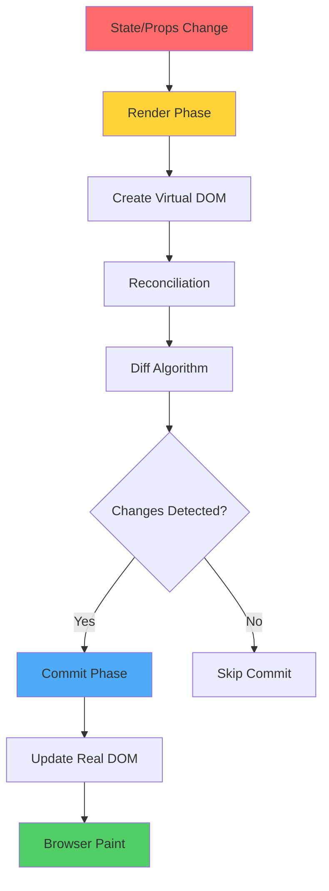
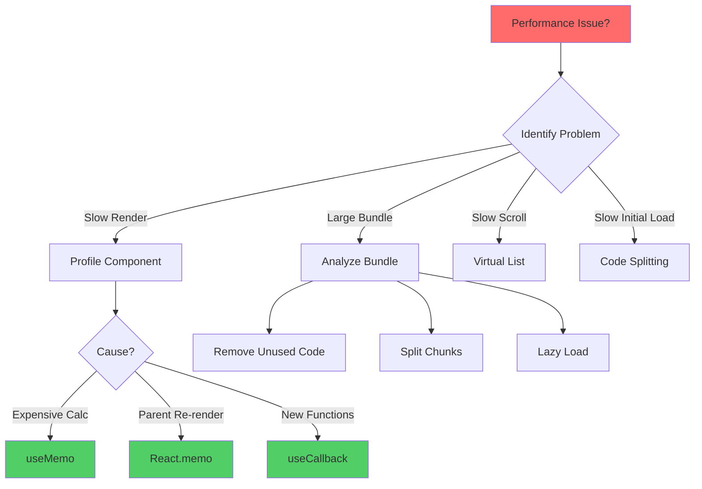

# React Performance Optimization: Strategies and Techniques

> A comprehensive exploration of performance optimization strategies, rendering optimization patterns, and pragmatic profiling techniques for React applications

---

## Table of Contents

1. [React Rendering Behavior](#1-react-rendering-behavior)
2. [React.memo: Preventing Re-renders](#2-reactmemo-preventing-re-renders)
3. [useMemo and useCallback Patterns](#3-usememo-and-usecallback-patterns)
4. [Code Splitting and Lazy Loading](#4-code-splitting-and-lazy-loading)
5. [Bundle Size Optimization](#5-bundle-size-optimization)
6. [Virtual Scrolling for Large Lists](#6-virtual-scrolling-for-large-lists)
7. [Profiling with React DevTools](#7-profiling-with-react-devtools)
8. [Advanced Optimization Techniques](#8-advanced-optimization-techniques)
9. [Performance Monitoring](#9-performance-monitoring)
10. [Optimization Strategy Selection](#10-optimization-strategy-selection)

---

## 1. React Rendering Behavior

### The Rendering Process

React's rendering process consists of two main phases: **render** (creating virtual DOM) and **commit** (updating actual DOM).



### When Components Re-render

```jsx
// Component re-renders when:
// 1. State changes
// 2. Props change
// 3. Parent re-renders (by default)
// 4. Context value changes

const Parent = () => {
  const [count, setCount] = useState(0);
  
  // Every time Parent re-renders, Child re-renders too
  return (
    <div>
      <button onClick={() => setCount(count + 1)}>Count: {count}</button>
      <Child /> {/* Re-renders even though props didn't change! */}
    </div>
  );
};

const Child = () => {
  console.log('Child rendered'); // Logs on every Parent render
  return <div>Child Component</div>;
};
```

### Render vs Commit Phase

```
┌────────────────────────────────────────────────────────────────┐
│              Render Phase vs Commit Phase                      │
├────────────────────────────────────────────────────────────────┤
│                                                                │
│  Render Phase (Pure, No Side Effects)                         │
│  • Call component functions                                    │
│  • Calculate new virtual DOM                                   │
│  • Run render() or function body                               │
│  • Compare with previous virtual DOM                           │
│  • Can be paused/aborted (Concurrent Mode)                     │
│  • Multiple renders possible                                   │
│                                                                │
│  Commit Phase (Side Effects)                                   │
│  • Update actual DOM                                           │
│  • Run useLayoutEffect                                         │
│  • Run useEffect (after paint)                                 │
│  • Refs updated                                                │
│  • Cannot be interrupted                                       │
│  • Happens once per render cycle                               │
│                                                                │
│  Performance Impact:                                           │
│  • Render: CPU intensive (calculations)                        │
│  • Commit: DOM operations (slower but fewer)                   │
│                                                                │
└────────────────────────────────────────────────────────────────┘
```

### Measuring Render Performance

```jsx
const ExpensiveComponent = ({ data }) => {
  const startTime = performance.now();
  
  // Expensive computation
  const processedData = data.map(item => {
    // Complex transformation
    return expensiveOperation(item);
  });
  
  const endTime = performance.now();
  console.log(`Render time: ${endTime - startTime}ms`);
  
  return <div>{/* Render processed data */}</div>;
};

// Better: Use React Profiler API
import { Profiler } from 'react';

const onRenderCallback = (
  id, // the "id" prop of the Profiler tree that has just committed
  phase, // either "mount" or "update"
  actualDuration, // time spent rendering the committed update
  baseDuration, // estimated time to render the entire subtree without memoization
  startTime, // when React began rendering this update
  commitTime, // when React committed this update
  interactions // the Set of interactions belonging to this update
) => {
  console.log(`${id} (${phase}) took ${actualDuration}ms`);
};

const App = () => {
  return (
    <Profiler id="App" onRender={onRenderCallback}>
      <ExpensiveComponent data={largeDataset} />
    </Profiler>
  );
};
```

### Common Performance Pitfalls

```jsx
// ❌ BAD: Creating new objects/arrays in render
const Component = () => {
  return <Child style={{ margin: '10px' }} />; // New object every render!
};

// ✅ GOOD: Extract to constant
const childStyle = { margin: '10px' };
const Component = () => {
  return <Child style={childStyle} />;
};

// ❌ BAD: Inline functions
const Component = () => {
  return <Child onClick={() => console.log('clicked')} />; // New function every render!
};

// ✅ GOOD: useCallback for memoization
const Component = () => {
  const handleClick = useCallback(() => {
    console.log('clicked');
  }, []);
  
  return <Child onClick={handleClick} />;
};

// ❌ BAD: Expensive computation in render
const Component = ({ data }) => {
  const total = data.reduce((sum, item) => sum + item.value, 0); // Runs every render
  return <div>Total: {total}</div>;
};

// ✅ GOOD: useMemo for expensive computations
const Component = ({ data }) => {
  const total = useMemo(
    () => data.reduce((sum, item) => sum + item.value, 0),
    [data]
  );
  return <div>Total: {total}</div>;
};
```

### Angular vs React Rendering

```
Angular                          React
───────                         ─────

Zone.js (Change Detection)      Virtual DOM Reconciliation
Runs on all events              Triggered by setState/hooks

OnPush Strategy                 React.memo
Change detection optimization   Prevent re-renders

Pure Pipes                      useMemo
Cached transformations          Memoized values

trackBy function                key prop
List optimization               Reconciliation hints

NgZone.runOutsideAngular()     No React equivalent
Skip change detection           (setState is explicit)
```

---

## 2. React.memo: Preventing Re-renders

### Basic React.memo Usage

```jsx
import { memo } from 'react';

// Without memo: Re-renders whenever parent re-renders
const ExpensiveComponent = ({ name, count }) => {
  console.log('ExpensiveComponent rendered');
  
  // Expensive computation
  const result = expensiveCalculation(count);
  
  return (
    <div>
      <h2>{name}</h2>
      <p>Result: {result}</p>
    </div>
  );
};

// With memo: Only re-renders when props change
const MemoizedComponent = memo(ExpensiveComponent);

// Usage
const Parent = () => {
  const [parentCount, setParentCount] = useState(0);
  const [childCount, setChildCount] = useState(0);
  
  return (
    <div>
      <button onClick={() => setParentCount(parentCount + 1)}>
        Parent Count: {parentCount}
      </button>
      
      {/* Won't re-render when parentCount changes */}
      <MemoizedComponent name="Child" count={childCount} />
      
      <button onClick={() => setChildCount(childCount + 1)}>
        Child Count
      </button>
    </div>
  );
};
```

### Custom Comparison Function

```jsx
import { memo } from 'react';

const UserCard = memo(
  ({ user, theme }) => {
    console.log('UserCard rendered');
    
    return (
      <div className={`user-card theme-${theme}`}>
        <h3>{user.name}</h3>
        <p>{user.email}</p>
        <p>Posts: {user.postCount}</p>
      </div>
    );
  },
  (prevProps, nextProps) => {
    // Return true if props are equal (skip re-render)
    // Return false if props are different (re-render)
    
    // Only re-render if user.name, user.email, or theme changes
    // Ignore changes to user.postCount
    return (
      prevProps.user.name === nextProps.user.name &&
      prevProps.user.email === nextProps.user.email &&
      prevProps.theme === nextProps.theme
    );
  }
);

// Alternative: Deep comparison with lodash
import { isEqual } from 'lodash';

const DeepMemoComponent = memo(
  MyComponent,
  (prevProps, nextProps) => isEqual(prevProps, nextProps)
);
```

### React.memo with Complex Props

```jsx
import { memo, useState, useCallback } from 'react';

// ❌ BAD: memo is useless here
const BadMemoExample = () => {
  const [count, setCount] = useState(0);
  
  return (
    <div>
      <button onClick={() => setCount(count + 1)}>
        Count: {count}
      </button>
      
      {/* New function created every render, memo doesn't help */}
      <MemoizedChild onClick={() => console.log('clicked')} />
      
      {/* New object created every render, memo doesn't help */}
      <MemoizedChild user={{ name: 'Marco' }} />
    </div>
  );
};

// ✅ GOOD: Proper memo usage
const GoodMemoExample = () => {
  const [count, setCount] = useState(0);
  
  // Memoize callback
  const handleClick = useCallback(() => {
    console.log('clicked');
  }, []);
  
  // Memoize object
  const user = useMemo(() => ({ name: 'Marco' }), []);
  
  return (
    <div>
      <button onClick={() => setCount(count + 1)}>
        Count: {count}
      </button>
      
      {/* Now memo works! */}
      <MemoizedChild onClick={handleClick} />
      <MemoizedChild user={user} />
    </div>
  );
};

const MemoizedChild = memo(({ onClick, user }) => {
  console.log('Child rendered');
  return <button onClick={onClick}>{user?.name}</button>;
});
```

### When to Use React.memo

```
┌────────────────────────────────────────────────────────────────┐
│              React.memo Usage Guidelines                       │
├────────────────────────────────────────────────────────────────┤
│                                                                │
│  ✅ USE React.memo When:                                       │
│  • Component renders often with same props                     │
│  • Component is expensive to render                            │
│  • Component is in a list                                      │
│  • Props are primitive values or memoized                      │
│  • Parent re-renders frequently                                │
│                                                                │
│  ❌ DON'T Use React.memo When:                                 │
│  • Props change frequently                                     │
│  • Component is cheap to render                                │
│  • Props are objects/functions (without memoization)           │
│  • Component always re-renders anyway                          │
│  • Premature optimization                                      │
│                                                                │
│  Example Use Cases:                                            │
│  ✅ List items (ProductCard, UserCard)                         │
│  ✅ Charts and visualizations                                  │
│  ✅ Forms with many fields                                     │
│  ✅ Data tables                                                │
│  ❌ Simple text/button components                              │
│  ❌ Components that change on every render                     │
│                                                                │
└────────────────────────────────────────────────────────────────┘
```

### Measuring memo Impact

```jsx
import { memo, useState, Profiler } from 'react';

// Without memo
const ExpensiveList = ({ items }) => {
  return (
    <ul>
      {items.map(item => (
        <ExpensiveItem key={item.id} item={item} />
      ))}
    </ul>
  );
};

// With memo
const ExpensiveItem = memo(({ item }) => {
  // Simulate expensive computation
  const start = performance.now();
  while (performance.now() - start < 1) {} // 1ms delay
  
  return <li>{item.name}</li>;
});

// Measure performance
const App = () => {
  const [count, setCount] = useState(0);
  const items = useMemo(() => 
    Array.from({ length: 100 }, (_, i) => ({ id: i, name: `Item ${i}` })),
    []
  );
  
  const onRender = (id, phase, actualDuration) => {
    console.log(`${id} (${phase}): ${actualDuration.toFixed(2)}ms`);
  };
  
  return (
    <Profiler id="List" onRender={onRender}>
      <button onClick={() => setCount(count + 1)}>
        Re-render Parent: {count}
      </button>
      <ExpensiveList items={items} />
    </Profiler>
  );
};
```

---

## 3. useMemo and useCallback Patterns

### useMemo: Memoizing Values

```jsx
import { useMemo } from 'react';

const DataTable = ({ data, filters }) => {
  // ❌ BAD: Expensive filtering on every render
  const filteredData = data.filter(item => 
    item.category === filters.category &&
    item.price >= filters.minPrice &&
    item.price <= filters.maxPrice
  );
  
  // ✅ GOOD: Only recompute when dependencies change
  const filteredData = useMemo(() => {
    console.log('Filtering data...');
    return data.filter(item => 
      item.category === filters.category &&
      item.price >= filters.minPrice &&
      item.price <= filters.maxPrice
    );
  }, [data, filters]);
  
  return (
    <table>
      {filteredData.map(item => (
        <tr key={item.id}>
          <td>{item.name}</td>
          <td>{item.price}</td>
        </tr>
      ))}
    </table>
  );
};

// Complex computation example
const Dashboard = ({ transactions }) => {
  const statistics = useMemo(() => {
    console.log('Computing statistics...');
    
    return {
      total: transactions.reduce((sum, t) => sum + t.amount, 0),
      average: transactions.reduce((sum, t) => sum + t.amount, 0) / transactions.length,
      max: Math.max(...transactions.map(t => t.amount)),
      min: Math.min(...transactions.map(t => t.amount)),
      byCategory: transactions.reduce((acc, t) => {
        acc[t.category] = (acc[t.category] || 0) + t.amount;
        return acc;
      }, {})
    };
  }, [transactions]);
  
  return (
    <div>
      <h2>Total: ${statistics.total}</h2>
      <p>Average: ${statistics.average.toFixed(2)}</p>
      <p>Range: ${statistics.min} - ${statistics.max}</p>
    </div>
  );
};
```

### useCallback: Memoizing Functions

```jsx
import { useCallback, memo } from 'react';

const TodoList = ({ todos }) => {
  const [filter, setFilter] = useState('all');
  
  // ❌ BAD: New function on every render
  const handleDelete = (id) => {
    deleteTodo(id);
  };
  
  // ✅ GOOD: Memoized function
  const handleDelete = useCallback((id) => {
    deleteTodo(id);
  }, []); // No dependencies - function never changes
  
  // useCallback with dependencies
  const handleToggle = useCallback((id) => {
    toggleTodo(id);
    updateFilter(filter); // Uses filter from closure
  }, [filter]); // Recreate when filter changes
  
  return (
    <ul>
      {todos.map(todo => (
        <TodoItem
          key={todo.id}
          todo={todo}
          onDelete={handleDelete}
          onToggle={handleToggle}
        />
      ))}
    </ul>
  );
};

// Memoized child component
const TodoItem = memo(({ todo, onDelete, onToggle }) => {
  console.log('TodoItem rendered:', todo.id);
  
  return (
    <li>
      <input
        type="checkbox"
        checked={todo.completed}
        onChange={() => onToggle(todo.id)}
      />
      {todo.text}
      <button onClick={() => onDelete(todo.id)}>Delete</button>
    </li>
  );
});
```

### When to Use useMemo and useCallback

```
┌────────────────────────────────────────────────────────────────┐
│          useMemo and useCallback Guidelines                    │
├────────────────────────────────────────────────────────────────┤
│                                                                │
│  useMemo - Memoize expensive calculations                      │
│  ✅ Use When:                                                  │
│  • Computation is expensive (>50ms)                            │
│  • Filtering/sorting large arrays                              │
│  • Complex mathematical calculations                           │
│  • Creating objects passed to memo'd children                  │
│                                                                │
│  ❌ Don't Use When:                                            │
│  • Simple calculations (a + b)                                 │
│  • Premature optimization                                      │
│  • Dependencies change frequently                              │
│                                                                │
│  useCallback - Memoize functions                               │
│  ✅ Use When:                                                  │
│  • Passing callbacks to memo'd children                        │
│  • Functions as dependencies to useEffect                      │
│  • Callbacks used in child components                          │
│                                                                │
│  ❌ Don't Use When:                                            │
│  • Simple event handlers not passed as props                   │
│  • Functions not used as dependencies                          │
│  • Child component not memoized                                │
│                                                                │
│  Rule of Thumb:                                                │
│  1. Profile first, optimize second                             │
│  2. useMemo for values, useCallback for functions              │
│  3. Combine with React.memo for maximum benefit                │
│                                                                │
└────────────────────────────────────────────────────────────────┘
```

### Anti-patterns to Avoid

```jsx
// ❌ ANTI-PATTERN 1: Useless memoization
const Component = () => {
  // Overhead of memoization > cost of calculation
  const simpleSum = useMemo(() => 5 + 10, []); // Don't do this!
  
  return <div>{simpleSum}</div>;
};

// ❌ ANTI-PATTERN 2: Memoizing everything
const OverOptimized = () => {
  const value1 = useMemo(() => 'hello', []);
  const value2 = useMemo(() => 42, []);
  const value3 = useMemo(() => true, []);
  const fn1 = useCallback(() => {}, []);
  const fn2 = useCallback(() => {}, []);
  
  // This is worse than no optimization!
  return <div>{value1}</div>;
};

// ❌ ANTI-PATTERN 3: Wrong dependencies
const Component = ({ data }) => {
  const [filter, setFilter] = useState('');
  
  // Missing 'filter' in dependencies!
  const filtered = useMemo(() => {
    return data.filter(item => item.name.includes(filter));
  }, [data]); // Should be [data, filter]
  
  return <div>{filtered.length}</div>;
};

// ❌ ANTI-PATTERN 4: Memoizing without memo
const Parent = () => {
  const handleClick = useCallback(() => {
    console.log('clicked');
  }, []);
  
  // Child not memoized, useCallback is useless
  return <Child onClick={handleClick} />;
};

const Child = ({ onClick }) => {
  return <button onClick={onClick}>Click</button>;
};

// ✅ CORRECT: Memoize child too
const MemoizedChild = memo(Child);
```

### Real-World Example: Optimized Dashboard

```jsx
import { memo, useMemo, useCallback } from 'react';

const Dashboard = ({ data }) => {
  const [sortBy, setSortBy] = useState('date');
  const [filter, setFilter] = useState('all');
  
  // Memoize expensive computations
  const statistics = useMemo(() => {
    console.log('Computing statistics...');
    return {
      total: data.reduce((sum, item) => sum + item.value, 0),
      average: data.reduce((sum, item) => sum + item.value, 0) / data.length,
      count: data.length
    };
  }, [data]);
  
  const filteredData = useMemo(() => {
    console.log('Filtering data...');
    return filter === 'all' 
      ? data 
      : data.filter(item => item.category === filter);
  }, [data, filter]);
  
  const sortedData = useMemo(() => {
    console.log('Sorting data...');
    return [...filteredData].sort((a, b) => {
      if (sortBy === 'date') return new Date(b.date) - new Date(a.date);
      if (sortBy === 'value') return b.value - a.value;
      return 0;
    });
  }, [filteredData, sortBy]);
  
  // Memoize callbacks
  const handleSort = useCallback((newSortBy) => {
    setSortBy(newSortBy);
  }, []);
  
  const handleFilter = useCallback((newFilter) => {
    setFilter(newFilter);
  }, []);
  
  const handleItemClick = useCallback((id) => {
    console.log('Item clicked:', id);
  }, []);
  
  return (
    <div>
      <Statistics stats={statistics} />
      <Filters 
        currentFilter={filter} 
        onFilterChange={handleFilter}
        currentSort={sortBy}
        onSortChange={handleSort}
      />
      <DataList 
        data={sortedData} 
        onItemClick={handleItemClick}
      />
    </div>
  );
};

// Memoized child components
const Statistics = memo(({ stats }) => {
  console.log('Statistics rendered');
  return (
    <div>
      <p>Total: {stats.total}</p>
      <p>Average: {stats.average.toFixed(2)}</p>
      <p>Count: {stats.count}</p>
    </div>
  );
});

const Filters = memo(({ currentFilter, onFilterChange, currentSort, onSortChange }) => {
  console.log('Filters rendered');
  return (
    <div>
      <button onClick={() => onFilterChange('all')}>All</button>
      <button onClick={() => onFilterChange('sales')}>Sales</button>
      <button onClick={() => onSortChange('date')}>Sort by Date</button>
      <button onClick={() => onSortChange('value')}>Sort by Value</button>
    </div>
  );
});

const DataList = memo(({ data, onItemClick }) => {
  console.log('DataList rendered');
  return (
    <ul>
      {data.map(item => (
        <DataItem key={item.id} item={item} onClick={onItemClick} />
      ))}
    </ul>
  );
});

const DataItem = memo(({ item, onClick }) => {
  return (
    <li onClick={() => onClick(item.id)}>
      {item.name} - ${item.value}
    </li>
  );
});
```

---

## 4. Code Splitting and Lazy Loading

### React.lazy and Suspense

```jsx
import { lazy, Suspense } from 'react';

// ❌ Traditional import: Loaded immediately
import Dashboard from './Dashboard';
import Settings from './Settings';
import Profile from './Profile';

// ✅ Lazy import: Loaded on demand
const Dashboard = lazy(() => import('./Dashboard'));
const Settings = lazy(() => import('./Settings'));
const Profile = lazy(() => import('./Profile'));

const App = () => {
  const [currentPage, setCurrentPage] = useState('dashboard');
  
  return (
    <div>
      <nav>
        <button onClick={() => setCurrentPage('dashboard')}>Dashboard</button>
        <button onClick={() => setCurrentPage('settings')}>Settings</button>
        <button onClick={() => setCurrentPage('profile')}>Profile</button>
      </nav>
      
      <Suspense fallback={<LoadingSpinner />}>
        {currentPage === 'dashboard' && <Dashboard />}
        {currentPage === 'settings' && <Settings />}
        {currentPage === 'profile' && <Profile />}
      </Suspense>
    </div>
  );
};

// Loading component
const LoadingSpinner = () => (
  <div className="loading-spinner">
    <div className="spinner"></div>
    <p>Caricamento...</p>
  </div>
);
```

### Route-Based Code Splitting

```jsx
import { lazy, Suspense } from 'react';
import { BrowserRouter, Routes, Route } from 'react-router-dom';

// Lazy load route components
const Home = lazy(() => import('./pages/Home'));
const About = lazy(() => import('./pages/About'));
const Dashboard = lazy(() => import('./pages/Dashboard'));
const Settings = lazy(() => import('./pages/Settings'));
const NotFound = lazy(() => import('./pages/NotFound'));

const App = () => {
  return (
    <BrowserRouter>
      <Suspense fallback={<PageLoader />}>
        <Routes>
          <Route path="/" element={<Home />} />
          <Route path="/about" element={<About />} />
          <Route path="/dashboard" element={<Dashboard />} />
          <Route path="/settings" element={<Settings />} />
          <Route path="*" element={<NotFound />} />
        </Routes>
      </Suspense>
    </BrowserRouter>
  );
};

// Progressive loading fallback
const PageLoader = () => (
  <div className="page-loader">
    <div className="skeleton-header" />
    <div className="skeleton-content" />
  </div>
);
```

### Component-Level Code Splitting

```jsx
import { lazy, Suspense, useState } from 'react';

// Split heavy components
const HeavyChart = lazy(() => import('./HeavyChart'));
const HeavyTable = lazy(() => import('./HeavyTable'));
const HeavyEditor = lazy(() => import('./HeavyEditor'));

const Dashboard = () => {
  const [showChart, setShowChart] = useState(false);
  const [showTable, setShowTable] = useState(false);
  
  return (
    <div>
      <h1>Dashboard</h1>
      
      <button onClick={() => setShowChart(true)}>
        Show Chart
      </button>
      
      {showChart && (
        <Suspense fallback={<div>Loading chart...</div>}>
          <HeavyChart />
        </Suspense>
      )}
      
      <button onClick={() => setShowTable(true)}>
        Show Table
      </button>
      
      {showTable && (
        <Suspense fallback={<div>Loading table...</div>}>
          <HeavyTable />
        </Suspense>
      )}
    </div>
  );
};
```

### Prefetching and Preloading

```jsx
// Prefetch on hover
const ProductCard = ({ product }) => {
  const ProductDetails = lazy(() => import('./ProductDetails'));
  
  const [isPrefetched, setIsPrefetched] = useState(false);
  
  const handleMouseEnter = () => {
    if (!isPrefetched) {
      // Start prefetching
      import('./ProductDetails');
      setIsPrefetched(true);
    }
  };
  
  return (
    <div onMouseEnter={handleMouseEnter}>
      <h3>{product.name}</h3>
      <Link to={`/products/${product.id}`}>View Details</Link>
    </div>
  );
};

// Prefetch with IntersectionObserver
const LazySection = ({ children }) => {
  const [isVisible, setIsVisible] = useState(false);
  const ref = useRef();
  
  useEffect(() => {
    const observer = new IntersectionObserver(
      ([entry]) => {
        if (entry.isIntersecting) {
          setIsVisible(true);
          observer.disconnect();
        }
      },
      { rootMargin: '100px' } // Start loading 100px before visible
    );
    
    if (ref.current) {
      observer.observe(ref.current);
    }
    
    return () => observer.disconnect();
  }, []);
  
  return (
    <div ref={ref}>
      {isVisible ? children : <div>Loading...</div>}
    </div>
  );
};
```

### Named Exports with Lazy

```jsx
// ❌ Won't work: lazy only supports default exports
const { Button, Input } = lazy(() => import('./components'));

// ✅ Solution 1: Create wrapper with default export
// components.jsx
export { Button, Input };

// wrapper.jsx
export { default as Button } from './Button';
export { default as Input } from './Input';

// App.jsx
const Button = lazy(() => import('./wrapper').then(module => ({ default: module.Button })));

// ✅ Solution 2: Use named exports with dynamic import
const loadComponent = (componentName) => {
  return lazy(() =>
    import('./components').then(module => ({
      default: module[componentName]
    }))
  );
};

const Button = loadComponent('Button');
const Input = loadComponent('Input');
```

---

## 5. Bundle Size Optimization

### Analyzing Bundle Size

```bash
# Create React App
npm run build -- --stats
npx webpack-bundle-analyzer build/bundle-stats.json

# Vite
npm run build
npx vite-bundle-visualizer

# Next.js
npm install @next/bundle-analyzer
```

```javascript
// next.config.js
const withBundleAnalyzer = require('@next/bundle-analyzer')({
  enabled: process.env.ANALYZE === 'true',
});

module.exports = withBundleAnalyzer({
  // Your Next.js config
});
```

### Tree Shaking and Dead Code Elimination

```javascript
// ❌ BAD: Imports entire library
import _ from 'lodash'; // ~70KB
import moment from 'moment'; // ~230KB
import * as MUI from '@mui/material'; // ~300KB+

const result = _.debounce(fn, 300);
const date = moment().format('YYYY-MM-DD');

// ✅ GOOD: Import only what you need
import debounce from 'lodash/debounce'; // ~2KB
import { format } from 'date-fns'; // ~13KB for format
import { Button } from '@mui/material'; // ~50KB

const result = debounce(fn, 300);
const date = format(new Date(), 'yyyy-MM-dd');

// ✅ BETTER: Use lighter alternatives
import { debounce } from './utils'; // Custom implementation
import { formatDate } from './dateUtils'; // Custom function
```

### Dynamic Imports for Large Libraries

```jsx
// Heavy libraries loaded only when needed
const LoadHeavyComponent = () => {
  const [ChartComponent, setChartComponent] = useState(null);
  
  useEffect(() => {
    // Load Chart.js only when component mounts
    import('chart.js').then((Chart) => {
      setChartComponent(() => Chart);
    });
  }, []);
  
  if (!ChartComponent) {
    return <div>Loading chart library...</div>;
  }
  
  return <ChartComponent data={chartData} />;
};

// Load PDF library on demand
const PDFViewer = ({ url }) => {
  const handleDownload = async () => {
    const { default: jsPDF } = await import('jspdf');
    const doc = new jsPDF();
    // Generate PDF
  };
  
  return <button onClick={handleDownload}>Download PDF</button>;
};

// Load markdown parser on demand
const MarkdownPreview = ({ markdown }) => {
  const [html, setHtml] = useState('');
  
  useEffect(() => {
    import('marked').then(({ marked }) => {
      setHtml(marked(markdown));
    });
  }, [markdown]);
  
  return <div dangerouslySetInnerHTML={{ __html: html }} />;
};
```

### Optimizing Dependencies

```
┌────────────────────────────────────────────────────────────────┐
│           Bundle Size Optimization Strategies                  │
├────────────────────────────────────────────────────────────────┤
│                                                                │
│  Replace Heavy Libraries:                                      │
│  • moment.js (230KB) → date-fns (13KB) or dayjs (2KB)          │
│  • lodash (70KB) → lodash-es (modular)                         │
│  • axios (13KB) → fetch API (native)                           │
│  • Material-UI (300KB+) → Tailwind + Headless UI              │
│                                                                │
│  Use Modular Imports:                                          │
│  ❌ import _ from 'lodash'                                     │
│  ✅ import debounce from 'lodash/debounce'                     │
│                                                                │
│  Code Splitting:                                               │
│  • Route-based splitting (React.lazy)                          │
│  • Component-based splitting                                   │
│  • Vendor chunking                                             │
│                                                                │
│  Remove Unused Code:                                           │
│  • Run bundle analyzer                                         │
│  • Remove unused dependencies                                  │
│  • Enable tree-shaking                                         │
│  • Use ES modules (not CommonJS)                               │
│                                                                │
│  Compression:                                                  │
│  • Enable gzip/brotli compression                              │
│  • Minify JavaScript and CSS                                   │
│  • Optimize images (WebP, lazy loading)                        │
│                                                                │
└────────────────────────────────────────────────────────────────┘
```

### Production Build Optimization

```javascript
// vite.config.js
export default {
  build: {
    rollupOptions: {
      output: {
        manualChunks: {
          // Vendor chunking
          vendor: ['react', 'react-dom', 'react-router-dom'],
          charts: ['chart.js', 'recharts'],
          ui: ['@mui/material', '@mui/icons-material']
        }
      }
    },
    // Minification
    minify: 'terser',
    terserOptions: {
      compress: {
        drop_console: true, // Remove console.logs
        drop_debugger: true
      }
    },
    // Code splitting
    chunkSizeWarningLimit: 500,
    // Source maps
    sourcemap: false // Disable in production
  }
};

// webpack.config.js
module.exports = {
  optimization: {
    splitChunks: {
      chunks: 'all',
      cacheGroups: {
        vendor: {
          test: /[\\/]node_modules[\\/]/,
          name: 'vendors',
          priority: 10
        },
        common: {
          minChunks: 2,
          priority: 5,
          reuseExistingChunk: true
        }
      }
    }
  }
};
```

---

## 6. Virtual Scrolling for Large Lists

### Problem with Large Lists

```jsx
// ❌ BAD: Rendering 10,000 items
const LargeList = ({ items }) => {
  return (
    <ul>
      {items.map(item => (
        <li key={item.id}>
          <div className="item-card">
            <h3>{item.title}</h3>
            <p>{item.description}</p>
          </div>
        </li>
      ))}
    </ul>
  );
};

// Problems:
// - 10,000 DOM nodes created
// - Slow initial render
// - High memory usage
// - Sluggish scrolling
```

### React Window (Basic Usage)

```bash
npm install react-window
```

```jsx
import { FixedSizeList } from 'react-window';

const VirtualizedList = ({ items }) => {
  const Row = ({ index, style }) => (
    <div style={style}>
      <div className="item-card">
        <h3>{items[index].title}</h3>
        <p>{items[index].description}</p>
      </div>
    </div>
  );
  
  return (
    <FixedSizeList
      height={600}          // Viewport height
      itemCount={items.length}
      itemSize={80}         // Height of each item
      width="100%"
    >
      {Row}
    </FixedSizeList>
  );
};

// Only renders visible items + buffer
// Much better performance!
```

### Variable Size List

```jsx
import { VariableSizeList } from 'react-window';

const VariableSizedList = ({ items }) => {
  const listRef = useRef();
  
  // Calculate height for each item
  const getItemSize = (index) => {
    const item = items[index];
    // Base height + dynamic content
    return 60 + (item.description?.length || 0) * 0.5;
  };
  
  const Row = ({ index, style }) => (
    <div style={style}>
      <div className="item-card">
        <h3>{items[index].title}</h3>
        <p>{items[index].description}</p>
        <small>{items[index].date}</small>
      </div>
    </div>
  );
  
  return (
    <VariableSizeList
      ref={listRef}
      height={600}
      itemCount={items.length}
      itemSize={getItemSize}
      width="100%"
    >
      {Row}
    </VariableSizeList>
  );
};
```

### Infinite Scroll with React Window

```jsx
import { FixedSizeList } from 'react-window';
import InfiniteLoader from 'react-window-infinite-loader';

const InfiniteList = () => {
  const [items, setItems] = useState([]);
  const [hasMore, setHasMore] = useState(true);
  
  const loadMoreItems = async (startIndex, stopIndex) => {
    const newItems = await fetchItems(startIndex, stopIndex);
    setItems(prev => [...prev, ...newItems]);
    
    if (newItems.length === 0) {
      setHasMore(false);
    }
  };
  
  const isItemLoaded = index => index < items.length;
  
  const Item = ({ index, style }) => {
    if (!isItemLoaded(index)) {
      return <div style={style}>Loading...</div>;
    }
    
    return (
      <div style={style}>
        <div className="item-card">
          <h3>{items[index].title}</h3>
          <p>{items[index].description}</p>
        </div>
      </div>
    );
  };
  
  return (
    <InfiniteLoader
      isItemLoaded={isItemLoaded}
      itemCount={hasMore ? items.length + 1 : items.length}
      loadMoreItems={loadMoreItems}
    >
      {({ onItemsRendered, ref }) => (
        <FixedSizeList
          ref={ref}
          height={600}
          itemCount={items.length}
          itemSize={80}
          onItemsRendered={onItemsRendered}
          width="100%"
        >
          {Item}
        </FixedSizeList>
      )}
    </InfiniteLoader>
  );
};
```

### React Virtuoso (Alternative)

```bash
npm install react-virtuoso
```

```jsx
import { Virtuoso } from 'react-virtuoso';

const VirtuosoList = ({ items }) => {
  return (
    <Virtuoso
      style={{ height: '600px' }}
      data={items}
      itemContent={(index, item) => (
        <div className="item-card">
          <h3>{item.title}</h3>
          <p>{item.description}</p>
        </div>
      )}
    />
  );
};

// With infinite scroll
const InfiniteVirtuosoList = () => {
  const [items, setItems] = useState([]);
  
  const loadMore = () => {
    fetchMoreItems().then(newItems => {
      setItems(prev => [...prev, ...newItems]);
    });
  };
  
  return (
    <Virtuoso
      style={{ height: '600px' }}
      data={items}
      endReached={loadMore}
      itemContent={(index, item) => (
        <div className="item-card">
          <h3>{item.title}</h3>
          <p>{item.description}</p>
        </div>
      )}
    />
  );
};
```

### Virtual Grid

```jsx
import { FixedSizeGrid } from 'react-window';

const VirtualGrid = ({ items, columnCount }) => {
  const rowCount = Math.ceil(items.length / columnCount);
  
  const Cell = ({ columnIndex, rowIndex, style }) => {
    const index = rowIndex * columnCount + columnIndex;
    
    if (index >= items.length) {
      return null;
    }
    
    const item = items[index];
    
    return (
      <div style={style}>
        <div className="grid-item">
          
          <h4>{item.title}</h4>
        </div>
      </div>
    );
  };
  
  return (
    <FixedSizeGrid
      columnCount={columnCount}
      columnWidth={200}
      height={600}
      rowCount={rowCount}
      rowHeight={250}
      width={800}
    >
      {Cell}
    </FixedSizeGrid>
  );
};
```

---

## 7. Profiling with React DevTools

### Installing React DevTools

```bash
# Chrome Extension
# Firefox Add-on
# Standalone: npm install -g react-devtools
```

### Using the Profiler

```jsx
// Start profiling in DevTools:
// 1. Open React DevTools
// 2. Go to "Profiler" tab
// 3. Click record button
// 4. Interact with app
// 5. Stop recording
// 6. Analyze flame graph

// Programmatic profiling
import { Profiler } from 'react';

const onRenderCallback = (
  id,                // Component identifier
  phase,             // "mount" or "update"
  actualDuration,    // Time spent rendering
  baseDuration,      // Estimated time without memoization
  startTime,         // When render started
  commitTime,        // When changes committed
  interactions       // Set of interactions
) => {
  console.log(`${id} ${phase} phase`);
  console.log(`Actual: ${actualDuration.toFixed(2)}ms`);
  console.log(`Base: ${baseDuration.toFixed(2)}ms`);
  
  // Send to analytics
  if (actualDuration > 16) { // Slower than 60fps
    analytics.logSlowRender(id, actualDuration);
  }
};

const App = () => {
  return (
    <Profiler id="App" onRender={onRenderCallback}>
      <Dashboard />
      <Profiler id="Sidebar" onRender={onRenderCallback}>
        <Sidebar />
      </Profiler>
    </Profiler>
  );
};
```

### Understanding Profiler Metrics

```
┌────────────────────────────────────────────────────────────────┐
│              React Profiler Metrics                            │
├────────────────────────────────────────────────────────────────┤
│                                                                │
│  Flame Graph:                                                  │
│  • Width: Duration of render                                   │
│  • Color: Performance (gray = fast, yellow/red = slow)         │
│  • Stack: Component hierarchy                                  │
│                                                                │
│  Ranked Chart:                                                 │
│  • Components sorted by render time                            │
│  • Identify slowest components                                 │
│                                                                │
│  Component Interactions:                                       │
│  • What triggered the render                                   │
│  • User events, state changes, etc.                            │
│                                                                │
│  Why Component Rendered:                                       │
│  • Props changed                                               │
│  • State changed                                               │
│  • Parent re-rendered                                          │
│  • Context changed                                             │
│                                                                │
│  Performance Targets:                                          │
│  • < 16ms per frame (60 FPS)                                   │
│  • < 8ms per frame (120 FPS)                                   │
│  • < 100ms for interactions                                    │
│                                                                │
└────────────────────────────────────────────────────────────────┘
```

### Identifying Performance Issues

```jsx
// Use "why did you render" library for detailed analysis
import React from 'react';
import whyDidYouRender from '@welldone-software/why-did-you-render';

if (process.env.NODE_ENV === 'development') {
  whyDidYouRender(React, {
    trackAllPureComponents: true,
    logOnDifferentValues: true,
    collapseGroups: true
  });
}

// Tag components to track
const ExpensiveComponent = () => {
  // Component code
};

ExpensiveComponent.whyDidYouRender = true;

// Console will show:
// ExpensiveComponent re-rendered because:
// • prop 'data' changed (shallow comparison)
// • prop 'onClick' is a new function
```

### Performance Monitoring in Production

```jsx
import { reportWebVitals } from './reportWebVitals';

// Send to analytics endpoint
reportWebVitals(metric => {
  const body = JSON.stringify(metric);
  const url = '/api/analytics';
  
  // Use `navigator.sendBeacon()` if available
  if (navigator.sendBeacon) {
    navigator.sendBeacon(url, body);
  } else {
    fetch(url, { method: 'POST', body, keepalive: true });
  }
});

// Track specific metrics
import { getCLS, getFID, getFCP, getLCP, getTTFB } from 'web-vitals';

getCLS(console.log);  // Cumulative Layout Shift
getFID(console.log);  // First Input Delay
getFCP(console.log);  // First Contentful Paint
getLCP(console.log);  // Largest Contentful Paint
getTTFB(console.log); // Time to First Byte
```

---

## 8. Advanced Optimization Techniques

### Concurrent Rendering (React 18+)

```jsx
import { startTransition, useDeferredValue, useTransition } from 'react';

// startTransition: Mark updates as non-urgent
const SearchResults = () => {
  const [query, setQuery] = useState('');
  const [results, setResults] = useState([]);
  
  const handleChange = (e) => {
    const value = e.target.value;
    
    // Urgent: Update input immediately
    setQuery(value);
    
    // Non-urgent: Update results can be delayed
    startTransition(() => {
      const filtered = searchData(value);
      setResults(filtered);
    });
  };
  
  return (
    <>
      <input value={query} onChange={handleChange} />
      <ResultsList results={results} />
    </>
  );
};

// useTransition: Track transition state
const TabContainer = () => {
  const [isPending, startTransition] = useTransition();
  const [tab, setTab] = useState('home');
  
  const selectTab = (nextTab) => {
    startTransition(() => {
      setTab(nextTab);
    });
  };
  
  return (
    <>
      <TabButton onClick={() => selectTab('home')}>Home</TabButton>
      <TabButton onClick={() => selectTab('posts')}>Posts</TabButton>
      {isPending && <Spinner />}
      <TabPanel>{tab === 'home' ? <Home /> : <Posts />}</TabPanel>
    </>
  );
};

// useDeferredValue: Defer expensive updates
const ProductList = ({ searchQuery }) => {
  const deferredQuery = useDeferredValue(searchQuery);
  const results = useMemo(() => 
    searchProducts(deferredQuery), 
    [deferredQuery]
  );
  
  return (
    <div>
      {searchQuery !== deferredQuery && <Spinner />}
      {results.map(product => (
        <ProductCard key={product.id} product={product} />
      ))}
    </div>
  );
};
```

### Web Workers for Heavy Computation

```javascript
// worker.js
self.addEventListener('message', (e) => {
  const { data } = e.data;
  
  // Heavy computation
  const result = expensiveCalculation(data);
  
  // Send result back
  self.postMessage({ result });
});

function expensiveCalculation(data) {
  // CPU-intensive work
  let result = 0;
  for (let i = 0; i < 1000000; i++) {
    result += Math.sqrt(i);
  }
  return result;
}
```

```jsx
// React component using Web Worker
const HeavyComputation = ({ data }) => {
  const [result, setResult] = useState(null);
  const [loading, setLoading] = useState(false);
  
  useEffect(() => {
    setLoading(true);
    
    const worker = new Worker(new URL('./worker.js', import.meta.url));
    
    worker.postMessage({ data });
    
    worker.onmessage = (e) => {
      setResult(e.data.result);
      setLoading(false);
      worker.terminate();
    };
    
    return () => worker.terminate();
  }, [data]);
  
  if (loading) return <div>Computing...</div>;
  
  return <div>Result: {result}</div>;
};
```

### Image Optimization

```jsx
// Lazy loading images
const LazyImage = ({ src, alt, ...props }) => {
  const [imageSrc, setImageSrc] = useState(null);
  const imgRef = useRef();
  
  useEffect(() => {
    const observer = new IntersectionObserver((entries) => {
      entries.forEach(entry => {
        if (entry.isIntersecting) {
          setImageSrc(src);
          observer.unobserve(entry.target);
        }
      });
    });
    
    if (imgRef.current) {
      observer.observe(imgRef.current);
    }
    
    return () => observer.disconnect();
  }, [src]);
  
  return (
    
  );
};

// Progressive image loading
const ProgressiveImage = ({ placeholderSrc, src, alt }) => {
  const [imgSrc, setImgSrc] = useState(placeholderSrc);
  const [loading, setLoading] = useState(true);
  
  useEffect(() => {
    const img = new Image();
    img.src = src;
    img.onload = () => {
      setImgSrc(src);
      setLoading(false);
    };
  }, [src]);
  
  return (
    
  );
};
```

---

## 9. Performance Monitoring

### Custom Performance Hook

```jsx
const usePerformanceMonitor = (componentName) => {
  const renderCountRef = useRef(0);
  const startTimeRef = useRef(performance.now());
  
  useEffect(() => {
    renderCountRef.current += 1;
    
    const renderTime = performance.now() - startTimeRef.current;
    
    console.log(`${componentName} rendered ${renderCountRef.current} times`);
    console.log(`Render time: ${renderTime.toFixed(2)}ms`);
    
    if (renderTime > 16) {
      console.warn(`⚠️ Slow render detected in ${componentName}`);
    }
    
    startTimeRef.current = performance.now();
  });
  
  return renderCountRef.current;
};

// Usage
const MyComponent = () => {
  const renderCount = usePerformanceMonitor('MyComponent');
  
  return <div>Rendered {renderCount} times</div>;
};
```

### Performance Observer API

```javascript
// Monitor Long Tasks (>50ms)
const observeLongTasks = () => {
  if ('PerformanceObserver' in window) {
    const observer = new PerformanceObserver((list) => {
      for (const entry of list.getEntries()) {
        console.warn('Long task detected:', {
          duration: entry.duration,
          startTime: entry.startTime,
          name: entry.name
        });
        
        // Send to analytics
        analytics.trackLongTask(entry);
      }
    });
    
    observer.observe({ entryTypes: ['longtask'] });
  }
};

// Monitor Layout Shifts
const observeLayoutShifts = () => {
  let cls = 0;
  
  const observer = new PerformanceObserver((list) => {
    for (const entry of list.getEntries()) {
      if (!entry.hadRecentInput) {
        cls += entry.value;
        console.log('CLS:', cls);
        
        if (cls > 0.1) {
          console.warn('⚠️ High Cumulative Layout Shift');
        }
      }
    }
  });
  
  observer.observe({ type: 'layout-shift', buffered: true });
};
```

---

## 10. Optimization Strategy Selection

### Performance Checklist

```
┌────────────────────────────────────────────────────────────────┐
│           React Performance Checklist                          │
├────────────────────────────────────────────────────────────────┤
│                                                                │
│  Before Optimizing:                                            │
│  ☐ Profile with React DevTools                                │
│  ☐ Identify actual bottlenecks                                │
│  ☐ Measure before and after                                   │
│  ☐ Don't optimize prematurely                                 │
│                                                                │
│  Component Level:                                              │
│  ☐ Use React.memo for expensive components                    │
│  ☐ Memoize callbacks with useCallback                         │
│  ☐ Memoize expensive computations with useMemo                │
│  ☐ Split components to isolate state changes                  │
│                                                                │
│  Application Level:                                            │
│  ☐ Implement code splitting (React.lazy)                      │
│  ☐ Optimize bundle size (analyze & reduce)                    │
│  ☐ Use virtual scrolling for long lists                       │
│  ☐ Lazy load images and heavy components                      │
│                                                                │
│  Advanced:                                                     │
│  ☐ Use Concurrent features (React 18+)                        │
│  ☐ Implement Web Workers for heavy tasks                      │
│  ☐ Monitor performance in production                          │
│  ☐ Set up performance budgets                                 │
│                                                                │
└────────────────────────────────────────────────────────────────┘
```

### Decision Matrix



---

## Conclusion: Performance Mastery

**Ottimizzazione magistrale! ⚡** Always profile first, optimize second. Focus on user-perceived performance and set realistic budgets.

### Resources

- 📘 [React DevTools](https://react.dev/learn/react-developer-tools)
- ⚡ [Web Vitals](https://web.dev/vitals/)
- 🔍 [React Window](https://react-window.now.sh/)
- 📊 [Bundle Analyzer](https://www.npmjs.com/package/webpack-bundle-analyzer)

**Prestazioni eccellenti per l'eccellenza! 🚀**