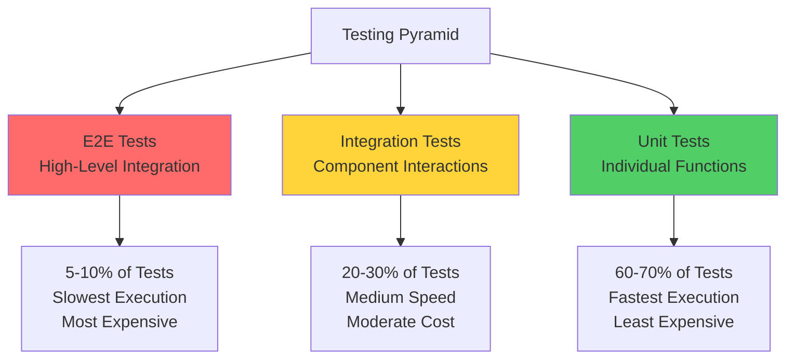
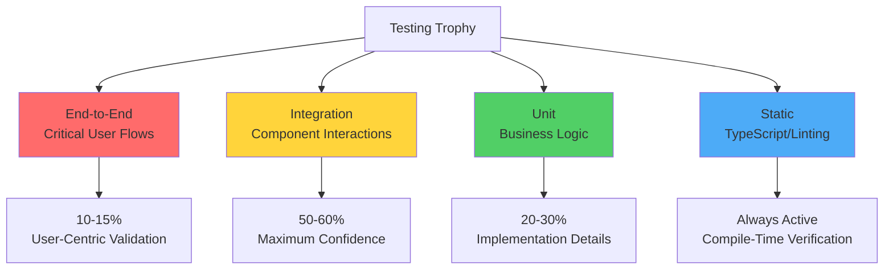
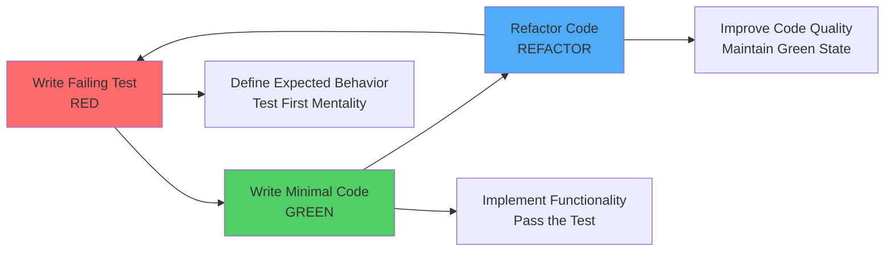
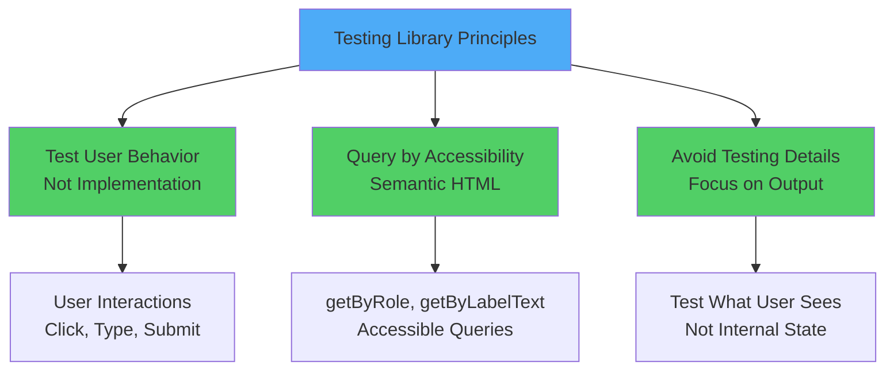
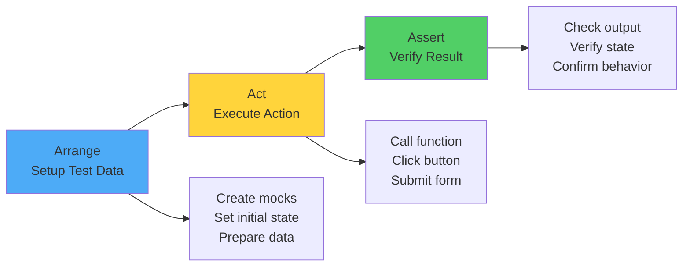
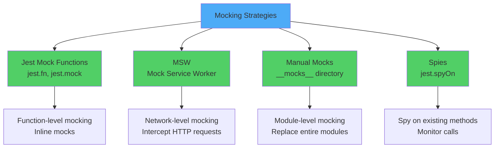
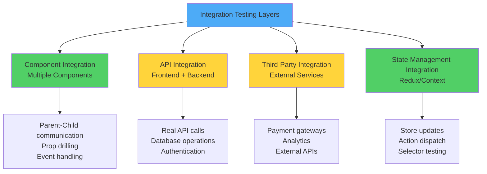
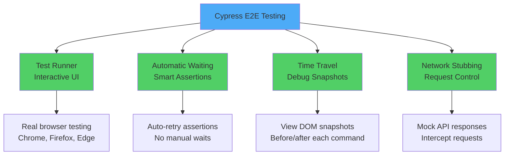
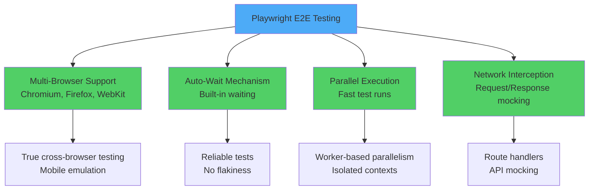
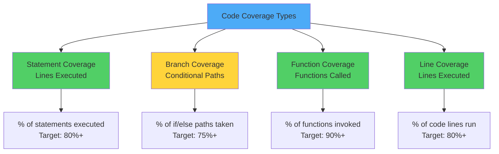

# React Testing: Comprehensive Strategies and Methodologies

> An exhaustive compendium of testing paradigms, architectural patterns, and pragmatic implementation techniques for React applications

---

## Table of Contents

1. [Testing Fundamentals and Philosophy](#1-testing-fundamentals-and-philosophy)
2. [Unit Testing with Jest](#2-unit-testing-with-jest)
3. [Component Testing with React Testing Library](#3-component-testing-with-react-testing-library)
4. [Writing Effective Test Cases](#4-writing-effective-test-cases)
5. [Mocking API Calls and Dependencies](#5-mocking-api-calls-and-dependencies)
6. [Integration Testing Strategies](#6-integration-testing-strategies)
7. [End-to-End Testing with Cypress](#7-end-to-end-testing-with-cypress)
8. [End-to-End Testing with Playwright](#8-end-to-end-testing-with-playwright)
9. [Test Coverage and Quality Metrics](#9-test-coverage-and-quality-metrics)
10. [Testing Best Practices and Patterns](#10-testing-best-practices-and-patterns)

---

## 1. Testing Fundamentals and Philosophy

### The Testing Pyramid Paradigm



### Testing Trophy Model (React Ecosystem)



### Testing Taxonomy

```
┌────────────────────────────────────────────────────────────────┐
│              Comprehensive Testing Classification              │
├────────────────────────────────────────────────────────────────┤
│                                                                │
│  Unit Tests:                                                   │
│  • Test individual functions/components in isolation           │
│  • Fast execution (milliseconds)                               │
│  • No external dependencies                                    │
│  • High granularity, low confidence                            │
│  • Example: Testing pure utility functions                     │
│                                                                │
│  Integration Tests:                                            │
│  • Test interaction between multiple units                     │
│  • Medium execution speed (seconds)                            │
│  • May include mocked external services                        │
│  • Medium granularity, high confidence                         │
│  • Example: Testing component with API calls                   │
│                                                                │
│  End-to-End Tests:                                             │
│  • Test complete user workflows                                │
│  • Slow execution (minutes)                                    │
│  • Real browser, real backend                                  │
│  • Low granularity, highest confidence                         │
│  • Example: Testing checkout process                           │
│                                                                │
│  Snapshot Tests:                                               │
│  • Capture component output                                    │
│  • Detect unintended changes                                   │
│  • Fast execution                                              │
│  • Complement to other tests                                   │
│                                                                │
│  Visual Regression Tests:                                      │
│  • Compare visual output                                       │
│  • Detect UI changes                                           │
│  • Automated screenshot comparison                             │
│                                                                │
└────────────────────────────────────────────────────────────────┘
```

### Test-Driven Development (TDD) Workflow



---

## 2. Unit Testing with Jest

### Jest Configuration and Setup

```javascript
// jest.config.js
module.exports = {
  // Test environment
  testEnvironment: 'jsdom', // Browser-like environment
  
  // Setup files
  setupFilesAfterEnv: ['<rootDir>/src/setupTests.js'],
  
  // Module name mapper (for CSS, images, etc.)
  moduleNameMapper: {
    '\\.(css|less|scss|sass)$': 'identity-obj-proxy',
    '\\.(jpg|jpeg|png|gif|svg)$': '<rootDir>/__mocks__/fileMock.js',
    '^@/(.*)$': '<rootDir>/src/$1'
  },
  
  // Coverage configuration
  collectCoverageFrom: [
    'src/**/*.{js,jsx,ts,tsx}',
    '!src/**/*.d.ts',
    '!src/index.js',
    '!src/reportWebVitals.js'
  ],
  
  // Coverage thresholds
  coverageThreshold: {
    global: {
      branches: 80,
      functions: 80,
      lines: 80,
      statements: 80
    }
  },
  
  // Transform files
  transform: {
    '^.+\\.(js|jsx|ts|tsx)$': 'babel-jest'
  },
  
  // Test match patterns
  testMatch: [
    '<rootDir>/src/**/__tests__/**/*.{js,jsx,ts,tsx}',
    '<rootDir>/src/**/*.{spec,test}.{js,jsx,ts,tsx}'
  ]
};
```

```javascript
// setupTests.js
import '@testing-library/jest-dom';

// Mock global objects
global.fetch = jest.fn();

// Mock localStorage
const localStorageMock = {
  getItem: jest.fn(),
  setItem: jest.fn(),
  removeItem: jest.fn(),
  clear: jest.fn()
};
global.localStorage = localStorageMock;

// Mock IntersectionObserver
global.IntersectionObserver = class IntersectionObserver {
  constructor() {}
  disconnect() {}
  observe() {}
  takeRecords() { return []; }
  unobserve() {}
};
```

### Jest Matchers and Assertions

```javascript
describe('Jest Matchers Compendium', () => {
  // Equality matchers
  test('equality assertions', () => {
    expect(2 + 2).toBe(4); // Strict equality (===)
    expect({ name: 'Marco' }).toEqual({ name: 'Marco' }); // Deep equality
    expect([1, 2, 3]).toStrictEqual([1, 2, 3]); // Strict deep equality
  });
  
  // Truthiness matchers
  test('truthiness assertions', () => {
    expect(null).toBeNull();
    expect(undefined).toBeUndefined();
    expect('value').toBeDefined();
    expect(true).toBeTruthy();
    expect(false).toBeFalsy();
  });
  
  // Number matchers
  test('numerical comparisons', () => {
    expect(10).toBeGreaterThan(5);
    expect(10).toBeGreaterThanOrEqual(10);
    expect(5).toBeLessThan(10);
    expect(5).toBeLessThanOrEqual(5);
    expect(0.1 + 0.2).toBeCloseTo(0.3); // Floating point
  });
  
  // String matchers
  test('string pattern matching', () => {
    expect('Testing React').toMatch(/React/);
    expect('hello@example.com').toMatch(/^[\w-\.]+@([\w-]+\.)+[\w-]{2,4}$/);
    expect('Hello World').toContain('World');
  });
  
  // Array and iterable matchers
  test('collection assertions', () => {
    const array = ['apple', 'banana', 'orange'];
    expect(array).toContain('banana');
    expect(array).toHaveLength(3);
    expect(new Set([1, 2, 3])).toContain(2);
  });
  
  // Object matchers
  test('object structure validation', () => {
    const user = { name: 'Marco', age: 30, city: 'Rome' };
    expect(user).toHaveProperty('name');
    expect(user).toHaveProperty('age', 30);
    expect(user).toMatchObject({ name: 'Marco' });
  });
  
  // Exception matchers
  test('exception handling', () => {
    const throwError = () => { throw new Error('Fatal error'); };
    expect(throwError).toThrow();
    expect(throwError).toThrow(Error);
    expect(throwError).toThrow('Fatal error');
    expect(throwError).toThrow(/error/);
  });
  
  // Asynchronous matchers
  test('asynchronous validation', async () => {
    const asyncFunction = () => Promise.resolve('success');
    await expect(asyncFunction()).resolves.toBe('success');
    
    const rejectFunction = () => Promise.reject('error');
    await expect(rejectFunction()).rejects.toBe('error');
  });
  
  // Mock function matchers
  test('mock function verification', () => {
    const mockFn = jest.fn();
    mockFn('arg1', 'arg2');
    
    expect(mockFn).toHaveBeenCalled();
    expect(mockFn).toHaveBeenCalledTimes(1);
    expect(mockFn).toHaveBeenCalledWith('arg1', 'arg2');
    expect(mockFn).toHaveBeenLastCalledWith('arg1', 'arg2');
  });
});
```

### Testing Pure Functions

```javascript
// utils/calculations.js
export const calculateTotal = (items) => {
  return items.reduce((sum, item) => sum + item.price * item.quantity, 0);
};

export const formatCurrency = (amount) => {
  return new Intl.NumberFormat('it-IT', {
    style: 'currency',
    currency: 'EUR'
  }).format(amount);
};

export const calculateDiscount = (price, discountPercentage) => {
  if (discountPercentage < 0 || discountPercentage > 100) {
    throw new Error('Invalid discount percentage');
  }
  return price * (1 - discountPercentage / 100);
};

// __tests__/calculations.test.js
import { calculateTotal, formatCurrency, calculateDiscount } from '../calculations';

describe('Calculation Utilities', () => {
  describe('calculateTotal', () => {
    test('should calculate total for single item', () => {
      const items = [{ price: 10, quantity: 2 }];
      expect(calculateTotal(items)).toBe(20);
    });
    
    test('should calculate total for multiple items', () => {
      const items = [
        { price: 10, quantity: 2 },
        { price: 15, quantity: 3 },
        { price: 20, quantity: 1 }
      ];
      expect(calculateTotal(items)).toBe(85);
    });
    
    test('should return 0 for empty array', () => {
      expect(calculateTotal([])).toBe(0);
    });
    
    test('should handle decimal prices', () => {
      const items = [{ price: 10.99, quantity: 2 }];
      expect(calculateTotal(items)).toBeCloseTo(21.98);
    });
  });
  
  describe('formatCurrency', () => {
    test('should format amount in EUR', () => {
      expect(formatCurrency(1000)).toBe('1.000,00 €');
    });
    
    test('should handle decimal amounts', () => {
      expect(formatCurrency(1234.56)).toBe('1.234,56 €');
    });
    
    test('should handle zero', () => {
      expect(formatCurrency(0)).toBe('0,00 €');
    });
  });
  
  describe('calculateDiscount', () => {
    test('should calculate 10% discount', () => {
      expect(calculateDiscount(100, 10)).toBe(90);
    });
    
    test('should calculate 50% discount', () => {
      expect(calculateDiscount(100, 50)).toBe(50);
    });
    
    test('should throw error for negative discount', () => {
      expect(() => calculateDiscount(100, -10)).toThrow('Invalid discount percentage');
    });
    
    test('should throw error for discount over 100%', () => {
      expect(() => calculateDiscount(100, 150)).toThrow('Invalid discount percentage');
    });
    
    test('should handle 0% discount', () => {
      expect(calculateDiscount(100, 0)).toBe(100);
    });
  });
});
```

### Testing Asynchronous Code

```javascript
// api/users.js
export const fetchUser = async (userId) => {
  const response = await fetch(`/api/users/${userId}`);
  if (!response.ok) {
    throw new Error('Failed to fetch user');
  }
  return response.json();
};

export const createUser = async (userData) => {
  const response = await fetch('/api/users', {
    method: 'POST',
    headers: { 'Content-Type': 'application/json' },
    body: JSON.stringify(userData)
  });
  return response.json();
};

// __tests__/users.test.js
import { fetchUser, createUser } from '../users';

describe('User API Functions', () => {
  // Test with async/await
  test('should fetch user successfully', async () => {
    const mockUser = { id: 1, name: 'Marco' };
    
    global.fetch = jest.fn(() =>
      Promise.resolve({
        ok: true,
        json: () => Promise.resolve(mockUser)
      })
    );
    
    const user = await fetchUser(1);
    
    expect(user).toEqual(mockUser);
    expect(fetch).toHaveBeenCalledWith('/api/users/1');
  });
  
  // Test with .resolves
  test('should create user successfully', () => {
    const newUser = { name: 'Marco', email: 'marco@example.com' };
    const createdUser = { id: 1, ...newUser };
    
    global.fetch = jest.fn(() =>
      Promise.resolve({
        ok: true,
        json: () => Promise.resolve(createdUser)
      })
    );
    
    return expect(createUser(newUser)).resolves.toEqual(createdUser);
  });
  
  // Test with .rejects
  test('should throw error when fetch fails', () => {
    global.fetch = jest.fn(() =>
      Promise.resolve({
        ok: false,
        status: 404
      })
    );
    
    return expect(fetchUser(999)).rejects.toThrow('Failed to fetch user');
  });
  
  // Test with done callback (older style)
  test('should handle promise rejection', (done) => {
    global.fetch = jest.fn(() => Promise.reject(new Error('Network error')));
    
    fetchUser(1).catch(error => {
      expect(error.message).toBe('Network error');
      done();
    });
  });
});
```

### Jest Mock Functions

```javascript
// Testing with mock functions
describe('Mock Function Capabilities', () => {
  test('basic mock function', () => {
    const mockFn = jest.fn();
    
    mockFn('arg1', 'arg2');
    mockFn('arg3');
    
    expect(mockFn).toHaveBeenCalledTimes(2);
    expect(mockFn).toHaveBeenCalledWith('arg1', 'arg2');
    expect(mockFn).toHaveBeenLastCalledWith('arg3');
  });
  
  test('mock return values', () => {
    const mockFn = jest.fn();
    
    // Set return value
    mockFn.mockReturnValue(42);
    expect(mockFn()).toBe(42);
    
    // Set return value once
    mockFn.mockReturnValueOnce(10).mockReturnValueOnce(20);
    expect(mockFn()).toBe(10);
    expect(mockFn()).toBe(20);
    expect(mockFn()).toBe(42); // Falls back to mockReturnValue
  });
  
  test('mock resolved values', async () => {
    const mockFn = jest.fn();
    
    mockFn.mockResolvedValue('success');
    await expect(mockFn()).resolves.toBe('success');
    
    mockFn.mockResolvedValueOnce('first').mockResolvedValueOnce('second');
    await expect(mockFn()).resolves.toBe('first');
    await expect(mockFn()).resolves.toBe('second');
  });
  
  test('mock implementation', () => {
    const mockFn = jest.fn((x, y) => x + y);
    
    expect(mockFn(2, 3)).toBe(5);
    expect(mockFn).toHaveBeenCalledWith(2, 3);
  });
  
  test('mock implementation once', () => {
    const mockFn = jest.fn();
    
    mockFn
      .mockImplementationOnce(() => 'first')
      .mockImplementationOnce(() => 'second')
      .mockImplementation(() => 'default');
    
    expect(mockFn()).toBe('first');
    expect(mockFn()).toBe('second');
    expect(mockFn()).toBe('default');
    expect(mockFn()).toBe('default');
  });
  
  test('accessing mock calls', () => {
    const mockFn = jest.fn();
    
    mockFn('arg1', 'arg2');
    mockFn('arg3', 'arg4');
    
    expect(mockFn.mock.calls).toHaveLength(2);
    expect(mockFn.mock.calls[0]).toEqual(['arg1', 'arg2']);
    expect(mockFn.mock.calls[1]).toEqual(['arg3', 'arg4']);
    
    // Access results
    mockFn.mockReturnValue('result');
    mockFn();
    expect(mockFn.mock.results[2].value).toBe('result');
  });
});
```

---

## 3. Component Testing with React Testing Library

### React Testing Library Philosophy



### Query Priority Hierarchy

```
┌────────────────────────────────────────────────────────────────┐
│         React Testing Library Query Priority                   │
├────────────────────────────────────────────────────────────────┤
│                                                                │
│  1. Accessible to Everyone (Preferred):                        │
│     • getByRole: <button role="button">Click</button>          │
│     • getByLabelText: <input aria-label="Email" />             │
│     • getByPlaceholderText: <input placeholder="Enter name" /> │
│     • getByText: <p>Welcome message</p>                        │
│     • getByDisplayValue: <input value="John" />                │
│                                                                │
│  2. Semantic Queries:                                          │
│     • getByAltText:               │
│     • getByTitle: <span title="Delete" />                      │
│                                                                │
│  3. Test IDs (Last Resort):                                    │
│     • getByTestId: <div data-testid="custom-element" />        │
│                                                                │
│  Query Variants:                                               │
│  • getBy: Throws error if not found                            │
│  • queryBy: Returns null if not found                          │
│  • findBy: Waits and returns promise                           │
│                                                                │
│  Multiple Elements:                                            │
│  • getAllBy: Returns array or throws                           │
│  • queryAllBy: Returns array (empty if none)                   │
│  • findAllBy: Returns promise of array                         │
│                                                                │
└────────────────────────────────────────────────────────────────┘
```

### Basic Component Testing

```javascript
// components/Button.jsx
export const Button = ({ onClick, children, disabled = false, variant = 'primary' }) => {
  return (
    <button
      onClick={onClick}
      disabled={disabled}
      className={`btn btn-${variant}`}
    >
      {children}
    </button>
  );
};

// __tests__/Button.test.jsx
import { render, screen, fireEvent } from '@testing-library/react';
import userEvent from '@testing-library/user-event';
import { Button } from '../Button';

describe('Button Component', () => {
  test('renders button with text', () => {
    render(<Button>Click Me</Button>);
    
    const button = screen.getByRole('button', { name: /click me/i });
    expect(button).toBeInTheDocument();
  });
  
  test('calls onClick when clicked', () => {
    const handleClick = jest.fn();
    render(<Button onClick={handleClick}>Click Me</Button>);
    
    const button = screen.getByRole('button');
    fireEvent.click(button);
    
    expect(handleClick).toHaveBeenCalledTimes(1);
  });
  
  test('does not call onClick when disabled', () => {
    const handleClick = jest.fn();
    render(<Button onClick={handleClick} disabled>Click Me</Button>);
    
    const button = screen.getByRole('button');
    fireEvent.click(button);
    
    expect(handleClick).not.toHaveBeenCalled();
    expect(button).toBeDisabled();
  });
  
  test('applies correct variant class', () => {
    render(<Button variant="secondary">Secondary</Button>);
    
    const button = screen.getByRole('button');
    expect(button).toHaveClass('btn-secondary');
  });
});
```

### Testing Forms and User Input

```javascript
// components/LoginForm.jsx
import { useState } from 'react';

export const LoginForm = ({ onSubmit }) => {
  const [email, setEmail] = useState('');
  const [password, setPassword] = useState('');
  const [error, setError] = useState('');
  
  const handleSubmit = (e) => {
    e.preventDefault();
    
    if (!email || !password) {
      setError('All fields are required');
      return;
    }
    
    if (password.length < 8) {
      setError('Password must be at least 8 characters');
      return;
    }
    
    onSubmit({ email, password });
  };
  
  return (
    <form onSubmit={handleSubmit}>
      <div>
        <label htmlFor="email">Email</label>
        <input
          id="email"
          type="email"
          value={email}
          onChange={(e) => setEmail(e.target.value)}
          placeholder="Enter your email"
        />
      </div>
      
      <div>
        <label htmlFor="password">Password</label>
        <input
          id="password"
          type="password"
          value={password}
          onChange={(e) => setPassword(e.target.value)}
          placeholder="Enter your password"
        />
      </div>
      
      {error && <div role="alert">{error}</div>}
      
      <button type="submit">Login</button>
    </form>
  );
};

// __tests__/LoginForm.test.jsx
import { render, screen, waitFor } from '@testing-library/react';
import userEvent from '@testing-library/user-event';
import { LoginForm } from '../LoginForm';

describe('LoginForm Component', () => {
  test('renders login form elements', () => {
    render(<LoginForm onSubmit={jest.fn()} />);
    
    expect(screen.getByLabelText(/email/i)).toBeInTheDocument();
    expect(screen.getByLabelText(/password/i)).toBeInTheDocument();
    expect(screen.getByRole('button', { name: /login/i })).toBeInTheDocument();
  });
  
  test('allows user to type email and password', async () => {
    const user = userEvent.setup();
    render(<LoginForm onSubmit={jest.fn()} />);
    
    const emailInput = screen.getByLabelText(/email/i);
    const passwordInput = screen.getByLabelText(/password/i);
    
    await user.type(emailInput, 'marco@example.com');
    await user.type(passwordInput, 'password123');
    
    expect(emailInput).toHaveValue('marco@example.com');
    expect(passwordInput).toHaveValue('password123');
  });
  
  test('shows error when fields are empty', async () => {
    const user = userEvent.setup();
    render(<LoginForm onSubmit={jest.fn()} />);
    
    const submitButton = screen.getByRole('button', { name: /login/i });
    await user.click(submitButton);
    
    expect(screen.getByRole('alert')).toHaveTextContent('All fields are required');
  });
  
  test('shows error when password is too short', async () => {
    const user = userEvent.setup();
    render(<LoginForm onSubmit={jest.fn()} />);
    
    await user.type(screen.getByLabelText(/email/i), 'marco@example.com');
    await user.type(screen.getByLabelText(/password/i), 'short');
    await user.click(screen.getByRole('button', { name: /login/i }));
    
    expect(screen.getByRole('alert')).toHaveTextContent(
      'Password must be at least 8 characters'
    );
  });
  
  test('submits form with valid data', async () => {
    const user = userEvent.setup();
    const handleSubmit = jest.fn();
    render(<LoginForm onSubmit={handleSubmit} />);
    
    await user.type(screen.getByLabelText(/email/i), 'marco@example.com');
    await user.type(screen.getByLabelText(/password/i), 'password123');
    await user.click(screen.getByRole('button', { name: /login/i }));
    
    expect(handleSubmit).toHaveBeenCalledWith({
      email: 'marco@example.com',
      password: 'password123'
    });
  });
});
```

### Testing Asynchronous Components

```javascript
// components/UserProfile.jsx
import { useState, useEffect } from 'react';

export const UserProfile = ({ userId }) => {
  const [user, setUser] = useState(null);
  const [loading, setLoading] = useState(true);
  const [error, setError] = useState(null);
  
  useEffect(() => {
    const fetchUser = async () => {
      try {
        setLoading(true);
        const response = await fetch(`/api/users/${userId}`);
        
        if (!response.ok) {
          throw new Error('Failed to fetch user');
        }
        
        const data = await response.json();
        setUser(data);
      } catch (err) {
        setError(err.message);
      } finally {
        setLoading(false);
      }
    };
    
    fetchUser();
  }, [userId]);
  
  if (loading) return <div>Loading...</div>;
  if (error) return <div role="alert">Error: {error}</div>;
  if (!user) return null;
  
  return (
    <div>
      <h1>{user.name}</h1>
      <p>{user.email}</p>
      <p>Location: {user.location}</p>
    </div>
  );
};

// __tests__/UserProfile.test.jsx
import { render, screen, waitFor } from '@testing-library/react';
import { UserProfile } from '../UserProfile';

describe('UserProfile Component', () => {
  beforeEach(() => {
    jest.clearAllMocks();
  });
  
  test('shows loading state initially', () => {
    global.fetch = jest.fn(() => new Promise(() => {})); // Never resolves
    
    render(<UserProfile userId={1} />);
    
    expect(screen.getByText(/loading/i)).toBeInTheDocument();
  });
  
  test('displays user data after successful fetch', async () => {
    const mockUser = {
      name: 'Marco Rossi',
      email: 'marco@example.com',
      location: 'Rome, Italy'
    };
    
    global.fetch = jest.fn(() =>
      Promise.resolve({
        ok: true,
        json: () => Promise.resolve(mockUser)
      })
    );
    
    render(<UserProfile userId={1} />);
    
    // Wait for loading to disappear
    await waitFor(() => {
      expect(screen.queryByText(/loading/i)).not.toBeInTheDocument();
    });
    
    // Check user data is displayed
    expect(screen.getByText('Marco Rossi')).toBeInTheDocument();
    expect(screen.getByText('marco@example.com')).toBeInTheDocument();
    expect(screen.getByText(/rome, italy/i)).toBeInTheDocument();
  });
  
  test('displays error message on fetch failure', async () => {
    global.fetch = jest.fn(() =>
      Promise.resolve({
        ok: false,
        status: 404
      })
    );
    
    render(<UserProfile userId={999} />);
    
    const errorMessage = await screen.findByRole('alert');
    expect(errorMessage).toHaveTextContent('Error: Failed to fetch user');
  });
  
  test('refetches user when userId changes', async () => {
    const mockUser1 = { name: 'User 1', email: 'user1@example.com', location: 'Rome' };
    const mockUser2 = { name: 'User 2', email: 'user2@example.com', location: 'Milan' };
    
    global.fetch = jest
      .fn()
      .mockResolvedValueOnce({
        ok: true,
        json: () => Promise.resolve(mockUser1)
      })
      .mockResolvedValueOnce({
        ok: true,
        json: () => Promise.resolve(mockUser2)
      });
    
    const { rerender } = render(<UserProfile userId={1} />);
    
    await waitFor(() => {
      expect(screen.getByText('User 1')).toBeInTheDocument();
    });
    
    rerender(<UserProfile userId={2} />);
    
    await waitFor(() => {
      expect(screen.getByText('User 2')).toBeInTheDocument();
    });
    
    expect(global.fetch).toHaveBeenCalledTimes(2);
  });
});
```

### Testing Context and Hooks

```javascript
// contexts/ThemeContext.jsx
import { createContext, useContext, useState } from 'react';

const ThemeContext = createContext();

export const ThemeProvider = ({ children }) => {
  const [theme, setTheme] = useState('light');
  
  const toggleTheme = () => {
    setTheme(prev => prev === 'light' ? 'dark' : 'light');
  };
  
  return (
    <ThemeContext.Provider value={{ theme, toggleTheme }}>
      {children}
    </ThemeContext.Provider>
  );
};

export const useTheme = () => {
  const context = useContext(ThemeContext);
  if (!context) {
    throw new Error('useTheme must be used within ThemeProvider');
  }
  return context;
};

// components/ThemeToggle.jsx
import { useTheme } from '../contexts/ThemeContext';

export const ThemeToggle = () => {
  const { theme, toggleTheme } = useTheme();
  
  return (
    <div>
      <p>Current theme: {theme}</p>
      <button onClick={toggleTheme}>Toggle Theme</button>
    </div>
  );
};

// __tests__/ThemeToggle.test.jsx
import { render, screen } from '@testing-library/react';
import userEvent from '@testing-library/user-event';
import { ThemeProvider } from '../contexts/ThemeContext';
import { ThemeToggle } from '../ThemeToggle';

const renderWithThemeProvider = (ui) => {
  return render(<ThemeProvider>{ui}</ThemeProvider>);
};

describe('ThemeToggle Component', () => {
  test('displays current theme', () => {
    renderWithThemeProvider(<ThemeToggle />);
    
    expect(screen.getByText(/current theme: light/i)).toBeInTheDocument();
  });
  
  test('toggles theme when button clicked', async () => {
    const user = userEvent.setup();
    renderWithThemeProvider(<ThemeToggle />);
    
    expect(screen.getByText(/current theme: light/i)).toBeInTheDocument();
    
    await user.click(screen.getByRole('button', { name: /toggle theme/i }));
    
    expect(screen.getByText(/current theme: dark/i)).toBeInTheDocument();
    
    await user.click(screen.getByRole('button', { name: /toggle theme/i }));
    
    expect(screen.getByText(/current theme: light/i)).toBeInTheDocument();
  });
  
  test('throws error when used outside provider', () => {
    // Suppress console.error for this test
    const spy = jest.spyOn(console, 'error').mockImplementation(() => {});
    
    expect(() => render(<ThemeToggle />)).toThrow(
      'useTheme must be used within ThemeProvider'
    );
    
    spy.mockRestore();
  });
});

// Testing custom hooks
import { renderHook, act } from '@testing-library/react';

describe('useTheme Hook', () => {
  test('provides theme and toggleTheme', () => {
    const wrapper = ({ children }) => <ThemeProvider>{children}</ThemeProvider>;
    
    const { result } = renderHook(() => useTheme(), { wrapper });
    
    expect(result.current.theme).toBe('light');
    expect(typeof result.current.toggleTheme).toBe('function');
  });
  
  test('toggles theme correctly', () => {
    const wrapper = ({ children }) => <ThemeProvider>{children}</ThemeProvider>;
    
    const { result } = renderHook(() => useTheme(), { wrapper });
    
    expect(result.current.theme).toBe('light');
    
    act(() => {
      result.current.toggleTheme();
    });
    
    expect(result.current.theme).toBe('dark');
  });
});
```

---

## 4. Writing Effective Test Cases

### AAA Pattern (Arrange-Act-Assert)



### Test Case Structure

```javascript
describe('Test Suite Name', () => {
  // Setup: Runs before all tests
  beforeAll(() => {
    // Database connection, server setup, etc.
  });
  
  // Teardown: Runs after all tests
  afterAll(() => {
    // Cleanup, close connections
  });
  
  // Setup: Runs before each test
  beforeEach(() => {
    // Reset mocks, clear state
    jest.clearAllMocks();
  });
  
  // Teardown: Runs after each test
  afterEach(() => {
    // Cleanup after individual test
  });
  
  describe('Feature: User Authentication', () => {
    test('should login with valid credentials', () => {
      // Arrange
      const credentials = { email: 'user@example.com', password: 'password123' };
      const mockResponse = { token: 'abc123', user: { id: 1, name: 'Marco' } };
      
      // Act
      const result = authenticateUser(credentials);
      
      // Assert
      expect(result).toEqual(mockResponse);
    });
    
    test('should reject invalid credentials', () => {
      // Arrange
      const credentials = { email: 'user@example.com', password: 'wrong' };
      
      // Act & Assert
      expect(() => authenticateUser(credentials)).toThrow('Invalid credentials');
    });
  });
});
```

### Test Naming Conventions

```
┌────────────────────────────────────────────────────────────────┐
│              Effective Test Naming Strategies                  │
├────────────────────────────────────────────────────────────────┤
│                                                                │
│  Pattern: should [expected behavior] when [condition]          │
│                                                                │
│  ✅ Good Examples:                                             │
│  • should return user when ID is valid                         │
│  • should throw error when email is invalid                    │
│  • should disable button when form is submitting               │
│  • should render loading spinner when data is fetching         │
│  • should call onSubmit with form data when submitted          │
│                                                                │
│  ❌ Bad Examples:                                              │
│  • test 1                                                      │
│  • it works                                                    │
│  • user test                                                   │
│  • renders correctly                                           │
│                                                                │
│  Alternative Patterns:                                         │
│  • [Function] should [behavior] when [condition]               │
│  • Given [context], when [action], then [outcome]              │
│  • [Component] renders [element] when [state]                  │
│                                                                │
│  Organizational Structure:                                     │
│  describe('Component/Feature')                                 │
│    describe('Method/Functionality')                            │
│      test('Specific behavior')                                 │
│                                                                │
└────────────────────────────────────────────────────────────────┘
```

### Edge Cases and Boundary Testing

```javascript
describe('Edge Case Testing Strategies', () => {
  describe('calculateAge function', () => {
    test('should handle today as birthday', () => {
      const today = new Date();
      const birthDate = new Date(today.getFullYear() - 25, today.getMonth(), today.getDate());
      
      expect(calculateAge(birthDate)).toBe(25);
    });
    
    test('should handle day before birthday', () => {
      const today = new Date();
      const tomorrow = new Date(today);
      tomorrow.setDate(tomorrow.getDate() + 1);
      
      const birthDate = new Date(today.getFullYear() - 25, tomorrow.getMonth(), tomorrow.getDate());
      
      expect(calculateAge(birthDate)).toBe(24); // Still 24, birthday hasn't occurred
    });
    
    test('should handle leap year birthday', () => {
      const birthDate = new Date(2000, 1, 29); // Feb 29, 2000
      const today = new Date(2024, 1, 28); // Feb 28, 2024 (leap year)
      
      expect(calculateAge(birthDate, today)).toBe(23);
    });
    
    test('should handle invalid date', () => {
      expect(() => calculateAge('invalid')).toThrow('Invalid date');
    });
    
    test('should handle future date', () => {
      const futureDate = new Date();
      futureDate.setFullYear(futureDate.getFullYear() + 1);
      
      expect(() => calculateAge(futureDate)).toThrow('Birth date cannot be in the future');
    });
  });
  
  describe('Array operations', () => {
    test('should handle empty array', () => {
      expect(calculateAverage([])).toBe(0);
    });
    
    test('should handle single element', () => {
      expect(calculateAverage([5])).toBe(5);
    });
    
    test('should handle negative numbers', () => {
      expect(calculateAverage([-5, -10, -15])).toBe(-10);
    });
    
    test('should handle very large numbers', () => {
      const largeNumbers = [Number.MAX_SAFE_INTEGER, Number.MAX_SAFE_INTEGER];
      expect(() => calculateAverage(largeNumbers)).not.toThrow();
    });
    
    test('should handle floating point precision', () => {
      expect(calculateAverage([0.1, 0.2])).toBeCloseTo(0.15);
    });
  });
  
  describe('String validation', () => {
    test('should validate empty string', () => {
      expect(isValidEmail('')).toBe(false);
    });
    
    test('should validate null and undefined', () => {
      expect(isValidEmail(null)).toBe(false);
      expect(isValidEmail(undefined)).toBe(false);
    });
    
    test('should validate maximum length', () => {
      const longEmail = 'a'.repeat(255) + '@example.com';
      expect(isValidEmail(longEmail)).toBe(false);
    });
    
    test('should validate special characters', () => {
      expect(isValidEmail('user+tag@example.com')).toBe(true);
      expect(isValidEmail('user@sub.example.com')).toBe(true);
      expect(isValidEmail('user@example')).toBe(false);
    });
  });
});
```

### Parameterized Tests (Test.each)

```javascript
describe('Parameterized Testing', () => {
  // Table-driven tests
  test.each([
    [1, 1, 2],
    [2, 3, 5],
    [10, 20, 30],
    [-5, 5, 0],
    [0, 0, 0]
  ])('add(%i, %i) should return %i', (a, b, expected) => {
    expect(add(a, b)).toBe(expected);
  });
  
  // Object-based parameterized tests
  test.each([
    { email: 'valid@example.com', expected: true },
    { email: 'invalid@', expected: false },
    { email: '@example.com', expected: false },
    { email: 'no-at-sign.com', expected: false },
    { email: '', expected: false }
  ])('isValidEmail($email) should return $expected', ({ email, expected }) => {
    expect(isValidEmail(email)).toBe(expected);
  });
  
  // Template literal syntax
  describe.each`
    role          | canDelete | canEdit
    ${'admin'}    | ${true}   | ${true}
    ${'editor'}   | ${false}  | ${true}
    ${'viewer'}   | ${false}  | ${false}
  `('Permissions for $role', ({ role, canDelete, canEdit }) => {
    test(`should ${canDelete ? '' : 'not '}allow delete`, () => {
      expect(hasPermission(role, 'delete')).toBe(canDelete);
    });
    
    test(`should ${canEdit ? '' : 'not '}allow edit`, () => {
      expect(hasPermission(role, 'edit')).toBe(canEdit);
    });
  });
});
```

---

## 5. Mocking API Calls and Dependencies

### Mocking Strategy Overview



### Mocking Modules with Jest

```javascript
// api/userService.js
export const fetchUser = async (id) => {
  const response = await fetch(`/api/users/${id}`);
  return response.json();
};

export const createUser = async (userData) => {
  const response = await fetch('/api/users', {
    method: 'POST',
    body: JSON.stringify(userData)
  });
  return response.json();
};

// __tests__/userService.test.js

// Method 1: Mock entire module
jest.mock('../api/userService');
import * as userService from '../api/userService';

describe('Mocked User Service', () => {
  test('should fetch user', async () => {
    const mockUser = { id: 1, name: 'Marco' };
    userService.fetchUser.mockResolvedValue(mockUser);
    
    const user = await userService.fetchUser(1);
    expect(user).toEqual(mockUser);
  });
});

// Method 2: Partial mock
jest.mock('../api/userService', () => ({
  ...jest.requireActual('../api/userService'),
  fetchUser: jest.fn()
}));

// Method 3: Manual mock in __mocks__ directory
// __mocks__/api/userService.js
export const fetchUser = jest.fn();
export const createUser = jest.fn();
```

### Mocking Fetch API

```javascript
describe('Fetch API Mocking', () => {
  beforeEach(() => {
    global.fetch = jest.fn();
  });
  
  afterEach(() => {
    jest.resetAllMocks();
  });
  
  test('should handle successful response', async () => {
    const mockData = { id: 1, name: 'Marco' };
    
    global.fetch.mockResolvedValueOnce({
      ok: true,
      status: 200,
      json: async () => mockData
    });
    
    const data = await fetchUser(1);
    
    expect(global.fetch).toHaveBeenCalledWith('/api/users/1');
    expect(data).toEqual(mockData);
  });
  
  test('should handle error response', async () => {
    global.fetch.mockResolvedValueOnce({
      ok: false,
      status: 404,
      json: async () => ({ error: 'Not found' })
    });
    
    await expect(fetchUser(999)).rejects.toThrow('User not found');
  });
  
  test('should handle network error', async () => {
    global.fetch.mockRejectedValueOnce(new Error('Network error'));
    
    await expect(fetchUser(1)).rejects.toThrow('Network error');
  });
});
```

### Mock Service Worker (MSW)

```javascript
// Setup MSW
// src/mocks/handlers.js
import { rest } from 'msw';

export const handlers = [
  // GET request
  rest.get('/api/users/:id', (req, res, ctx) => {
    const { id } = req.params;
    
    return res(
      ctx.status(200),
      ctx.json({
        id: Number(id),
        name: 'Marco Rossi',
        email: 'marco@example.com'
      })
    );
  }),
  
  // POST request
  rest.post('/api/users', async (req, res, ctx) => {
    const userData = await req.json();
    
    return res(
      ctx.status(201),
      ctx.json({
        id: 999,
        ...userData
      })
    );
  }),
  
  // Error response
  rest.get('/api/users/error', (req, res, ctx) => {
    return res(
      ctx.status(500),
      ctx.json({ error: 'Internal server error' })
    );
  }),
  
  // Delayed response
  rest.get('/api/slow', (req, res, ctx) => {
    return res(
      ctx.delay(2000),
      ctx.json({ message: 'Slow response' })
    );
  })
];

// src/mocks/server.js
import { setupServer } from 'msw/node';
import { handlers } from './handlers';

export const server = setupServer(...handlers);

// src/setupTests.js
import { server } from './mocks/server';

beforeAll(() => server.listen());
afterEach(() => server.resetHandlers());
afterAll(() => server.close());

// __tests__/userService.test.js
import { rest } from 'msw';
import { server } from '../mocks/server';
import { fetchUser } from '../api/userService';

describe('User Service with MSW', () => {
  test('should fetch user successfully', async () => {
    const user = await fetchUser(1);
    
    expect(user).toEqual({
      id: 1,
      name: 'Marco Rossi',
      email: 'marco@example.com'
    });
  });
  
  test('should handle custom response for specific test', async () => {
    // Override handler for this test only
    server.use(
      rest.get('/api/users/:id', (req, res, ctx) => {
        return res(
          ctx.status(200),
          ctx.json({ id: 1, name: 'Custom User' })
        );
      })
    );
    
    const user = await fetchUser(1);
    expect(user.name).toBe('Custom User');
  });
  
  test('should handle error response', async () => {
    server.use(
      rest.get('/api/users/:id', (req, res, ctx) => {
        return res(
          ctx.status(404),
          ctx.json({ error: 'Not found' })
        );
      })
    );
    
    await expect(fetchUser(999)).rejects.toThrow();
  });
});
```

### Mocking External Libraries

```javascript
// Mocking axios
jest.mock('axios');
import axios from 'axios';

describe('Axios Mocking', () => {
  test('should fetch data with axios', async () => {
    const mockData = { data: { id: 1, name: 'Marco' } };
    axios.get.mockResolvedValue(mockData);
    
    const result = await fetchUserWithAxios(1);
    
    expect(axios.get).toHaveBeenCalledWith('/api/users/1');
    expect(result).toEqual(mockData.data);
  });
});

// Mocking localStorage
const localStorageMock = (() => {
  let store = {};
  
  return {
    getItem: (key) => store[key] || null,
    setItem: (key, value) => { store[key] = value.toString(); },
    removeItem: (key) => { delete store[key]; },
    clear: () => { store = {}; }
  };
})();

global.localStorage = localStorageMock;

// Mocking Date
describe('Date Mocking', () => {
  beforeAll(() => {
    jest.useFakeTimers();
    jest.setSystemTime(new Date('2024-01-01'));
  });
  
  afterAll(() => {
    jest.useRealTimers();
  });
  
  test('should use mocked date', () => {
    expect(new Date().toISOString()).toContain('2024-01-01');
  });
});

// Mocking timers
describe('Timer Mocking', () => {
  beforeEach(() => {
    jest.useFakeTimers();
  });
  
  afterEach(() => {
    jest.useRealTimers();
  });
  
  test('should execute setTimeout callback', () => {
    const callback = jest.fn();
    
    setTimeout(callback, 1000);
    
    expect(callback).not.toHaveBeenCalled();
    
    jest.advanceTimersByTime(1000);
    
    expect(callback).toHaveBeenCalled();
  });
  
  test('should execute setInterval callback', () => {
    const callback = jest.fn();
    
    setInterval(callback, 100);
    
    jest.advanceTimersByTime(300);
    
    expect(callback).toHaveBeenCalledTimes(3);
  });
});
```

---

## 6. Integration Testing Strategies

### Integration Testing Architecture



### Testing Component Integration

```javascript
// components/ProductList.jsx
import { ProductCard } from './ProductCard';
import { CartContext } from '../contexts/CartContext';

export const ProductList = ({ products }) => {
  const { addToCart } = useContext(CartContext);
  
  return (
    <div className="product-list">
      {products.map(product => (
        <ProductCard
          key={product.id}
          product={product}
          onAddToCart={addToCart}
        />
      ))}
    </div>
  );
};

// components/ProductCard.jsx
export const ProductCard = ({ product, onAddToCart }) => {
  return (
    <div className="product-card">
      <h3>{product.name}</h3>
      <p>{product.price}</p>
      <button onClick={() => onAddToCart(product)}>
        Add to Cart
      </button>
    </div>
  );
};

// __tests__/ProductList.integration.test.jsx
import { render, screen } from '@testing-library/react';
import userEvent from '@testing-library/user-event';
import { CartProvider } from '../contexts/CartContext';
import { ProductList } from '../ProductList';

const mockProducts = [
  { id: 1, name: 'Product 1', price: 10 },
  { id: 2, name: 'Product 2', price: 20 },
  { id: 3, name: 'Product 3', price: 30 }
];

const renderWithCart = (ui) => {
  return render(<CartProvider>{ui}</CartProvider>);
};

describe('ProductList Integration', () => {
  test('should render all products', () => {
    renderWithCart(<ProductList products={mockProducts} />);
    
    expect(screen.getByText('Product 1')).toBeInTheDocument();
    expect(screen.getByText('Product 2')).toBeInTheDocument();
    expect(screen.getByText('Product 3')).toBeInTheDocument();
  });
  
  test('should add product to cart when button clicked', async () => {
    const user = userEvent.setup();
    
    renderWithCart(
      <>
        <ProductList products={mockProducts} />
        <CartSummary />
      </>
    );
    
    const addButtons = screen.getAllByRole('button', { name: /add to cart/i });
    
    await user.click(addButtons[0]);
    
    expect(screen.getByText(/1 item/i)).toBeInTheDocument();
    
    await user.click(addButtons[1]);
    
    expect(screen.getByText(/2 items/i)).toBeInTheDocument();
  });
  
  test('should update cart total when products added', async () => {
    const user = userEvent.setup();
    
    renderWithCart(
      <>
        <ProductList products={mockProducts} />
        <CartSummary />
      </>
    );
    
    const addButtons = screen.getAllByRole('button', { name: /add to cart/i });
    
    await user.click(addButtons[0]); // €10
    await user.click(addButtons[1]); // €20
    
    expect(screen.getByText(/total: €30/i)).toBeInTheDocument();
  });
});
```

### Testing with Redux Integration

```javascript
// store/cartSlice.js
import { createSlice } from '@reduxjs/toolkit';

const cartSlice = createSlice({
  name: 'cart',
  initialState: { items: [], total: 0 },
  reducers: {
    addItem: (state, action) => {
      state.items.push(action.payload);
      state.total += action.payload.price;
    },
    removeItem: (state, action) => {
      const index = state.items.findIndex(item => item.id === action.payload);
      if (index !== -1) {
        state.total -= state.items[index].price;
        state.items.splice(index, 1);
      }
    },
    clearCart: (state) => {
      state.items = [];
      state.total = 0;
    }
  }
});

export const { addItem, removeItem, clearCart } = cartSlice.actions;
export default cartSlice.reducer;

// __tests__/cart.integration.test.js
import { configureStore } from '@reduxjs/toolkit';
import { Provider } from 'react-redux';
import { render, screen } from '@testing-library/react';
import userEvent from '@testing-library/user-event';
import cartReducer from '../store/cartSlice';
import { Cart } from '../components/Cart';
import { ProductList } from '../components/ProductList';

const createTestStore = () => {
  return configureStore({
    reducer: {
      cart: cartReducer
    }
  });
};

const renderWithRedux = (ui, { store = createTestStore() } = {}) => {
  return {
    ...render(<Provider store={store}>{ui}</Provider>),
    store
  };
};

describe('Shopping Cart Redux Integration', () => {
  const mockProducts = [
    { id: 1, name: 'Product 1', price: 10 },
    { id: 2, name: 'Product 2', price: 20 }
  ];
  
  test('should add items to cart and update state', async () => {
    const user = userEvent.setup();
    const { store } = renderWithRedux(
      <>
        <ProductList products={mockProducts} />
        <Cart />
      </>
    );
    
    // Initial state
    expect(store.getState().cart.items).toHaveLength(0);
    
    // Add first item
    const addButtons = screen.getAllByRole('button', { name: /add to cart/i });
    await user.click(addButtons[0]);
    
    // Verify state updated
    expect(store.getState().cart.items).toHaveLength(1);
    expect(store.getState().cart.total).toBe(10);
    
    // Add second item
    await user.click(addButtons[1]);
    
    // Verify final state
    expect(store.getState().cart.items).toHaveLength(2);
    expect(store.getState().cart.total).toBe(30);
  });
  
  test('should remove item from cart', async () => {
    const user = userEvent.setup();
    const store = createTestStore();
    
    // Pre-populate cart
    store.dispatch(addItem(mockProducts[0]));
    store.dispatch(addItem(mockProducts[1]));
    
    renderWithRedux(<Cart />, { store });
    
    const removeButtons = screen.getAllByRole('button', { name: /remove/i });
    await user.click(removeButtons[0]);
    
    expect(store.getState().cart.items).toHaveLength(1);
    expect(store.getState().cart.total).toBe(20);
  });
});
```

### API Integration Testing

```javascript
// __tests__/api.integration.test.js
import { render, screen, waitFor } from '@testing-library/react';
import userEvent from '@testing-library/user-event';
import { rest } from 'msw';
import { setupServer } from 'msw/node';
import { UserDashboard } from '../components/UserDashboard';

const server = setupServer(
  rest.get('/api/user/profile', (req, res, ctx) => {
    return res(ctx.json({
      id: 1,
      name: 'Marco Rossi',
      email: 'marco@example.com'
    }));
  }),
  
  rest.get('/api/user/orders', (req, res, ctx) => {
    return res(ctx.json([
      { id: 1, product: 'Product 1', total: 100 },
      { id: 2, product: 'Product 2', total: 200 }
    ]));
  }),
  
  rest.put('/api/user/profile', async (req, res, ctx) => {
    const updates = await req.json();
    return res(ctx.json({
      id: 1,
      ...updates
    }));
  })
);

beforeAll(() => server.listen());
afterEach(() => server.resetHandlers());
afterAll(() => server.close());

describe('User Dashboard API Integration', () => {
  test('should load user profile and orders', async () => {
    render(<UserDashboard />);
    
    // Wait for profile to load
    await waitFor(() => {
      expect(screen.getByText('Marco Rossi')).toBeInTheDocument();
    });
    
    // Wait for orders to load
    await waitFor(() => {
      expect(screen.getByText('Product 1')).toBeInTheDocument();
      expect(screen.getByText('Product 2')).toBeInTheDocument();
    });
  });
  
  test('should update profile successfully', async () => {
    const user = userEvent.setup();
    render(<UserDashboard />);
    
    // Wait for profile to load
    await waitFor(() => {
      expect(screen.getByText('Marco Rossi')).toBeInTheDocument();
    });
    
    // Click edit button
    await user.click(screen.getByRole('button', { name: /edit profile/i }));
    
    // Update name
    const nameInput = screen.getByLabelText(/name/i);
    await user.clear(nameInput);
    await user.type(nameInput, 'Marco Updated');
    
    // Submit
    await user.click(screen.getByRole('button', { name: /save/i }));
    
    // Verify update
    await waitFor(() => {
      expect(screen.getByText('Marco Updated')).toBeInTheDocument();
    });
  });
  
  test('should handle API errors gracefully', async () => {
    server.use(
      rest.get('/api/user/profile', (req, res, ctx) => {
        return res(ctx.status(500), ctx.json({ error: 'Server error' }));
      })
    );
    
    render(<UserDashboard />);
    
    await waitFor(() => {
      expect(screen.getByRole('alert')).toHaveTextContent('Failed to load profile');
    });
  });
});
```

---

## 7. End-to-End Testing with Cypress

### Cypress Architecture



### Cypress Setup and Configuration

```javascript
// cypress.config.js
import { defineConfig } from 'cypress';

export default defineConfig({
  e2e: {
    baseUrl: 'http://localhost:3000',
    viewportWidth: 1280,
    viewportHeight: 720,
    video: true,
    screenshotOnRunFailure: true,
    
    setupNodeEvents(on, config) {
      // implement node event listeners here
    },
    
    env: {
      apiUrl: 'http://localhost:8000/api'
    },
    
    retries: {
      runMode: 2,
      openMode: 0
    }
  },
  
  component: {
    devServer: {
      framework: 'react',
      bundler: 'vite'
    }
  }
});

// cypress/support/commands.js
// Custom commands
Cypress.Commands.add('login', (email, password) => {
  cy.visit('/login');
  cy.get('[data-testid="email-input"]').type(email);
  cy.get('[data-testid="password-input"]').type(password);
  cy.get('[data-testid="login-button"]').click();
  cy.url().should('not.include', '/login');
});

Cypress.Commands.add('logout', () => {
  cy.get('[data-testid="logout-button"]').click();
  cy.url().should('include', '/login');
});

Cypress.Commands.add('getByTestId', (testId) => {
  return cy.get(`[data-testid="${testId}"]`);
});
```

### Cypress Test Examples

```javascript
// cypress/e2e/authentication.cy.js
describe('Authentication Flow', () => {
  beforeEach(() => {
    cy.visit('/');
  });
  
  it('should display login page', () => {
    cy.visit('/login');
    cy.contains('h1', 'Login').should('be.visible');
    cy.getByTestId('email-input').should('be.visible');
    cy.getByTestId('password-input').should('be.visible');
    cy.getByTestId('login-button').should('be.visible');
  });
  
  it('should login with valid credentials', () => {
    cy.visit('/login');
    
    // Intercept API call
    cy.intercept('POST', '/api/auth/login', {
      statusCode: 200,
      body: {
        token: 'fake-jwt-token',
        user: { id: 1, name: 'Marco', email: 'marco@example.com' }
      }
    }).as('loginRequest');
    
    // Fill form
    cy.getByTestId('email-input').type('marco@example.com');
    cy.getByTestId('password-input').type('password123');
    cy.getByTestId('login-button').click();
    
    // Wait for API call
    cy.wait('@loginRequest');
    
    // Verify redirect
    cy.url().should('include', '/dashboard');
    cy.contains('Welcome, Marco').should('be.visible');
  });
  
  it('should show error with invalid credentials', () => {
    cy.visit('/login');
    
    cy.intercept('POST', '/api/auth/login', {
      statusCode: 401,
      body: { error: 'Invalid credentials' }
    }).as('loginRequest');
    
    cy.getByTestId('email-input').type('wrong@example.com');
    cy.getByTestId('password-input').type('wrongpassword');
    cy.getByTestId('login-button').click();
    
    cy.wait('@loginRequest');
    
    cy.get('[role="alert"]').should('contain', 'Invalid credentials');
    cy.url().should('include', '/login');
  });
  
  it('should logout successfully', () => {
    // Login first
    cy.login('marco@example.com', 'password123');
    
    // Verify logged in
    cy.url().should('include', '/dashboard');
    
    // Logout
    cy.getByTestId('logout-button').click();
    
    // Verify redirected to login
    cy.url().should('include', '/login');
    cy.getCookie('auth-token').should('not.exist');
  });
});

// cypress/e2e/shopping-cart.cy.js
describe('Shopping Cart E2E', () => {
  beforeEach(() => {
    cy.login('marco@example.com', 'password123');
    cy.visit('/products');
  });
  
  it('should add products to cart', () => {
    // Intercept products API
    cy.intercept('GET', '/api/products', {
      fixture: 'products.json'
    }).as('getProducts');
    
    cy.wait('@getProducts');
    
    // Add first product
    cy.get('[data-testid="product-card"]').first().within(() => {
      cy.contains('Add to Cart').click();
    });
    
    // Verify cart badge updated
    cy.getByTestId('cart-badge').should('contain', '1');
    
    // Add second product
    cy.get('[data-testid="product-card"]').eq(1).within(() => {
      cy.contains('Add to Cart').click();
    });
    
    // Verify cart badge updated
    cy.getByTestId('cart-badge').should('contain', '2');
  });
  
  it('should complete checkout process', () => {
    // Add products to cart
    cy.get('[data-testid="product-card"]').first().within(() => {
      cy.contains('Add to Cart').click();
    });
    
    // Go to cart
    cy.getByTestId('cart-icon').click();
    cy.url().should('include', '/cart');
    
    // Verify cart items
    cy.get('[data-testid="cart-item"]').should('have.length', 1);
    
    // Proceed to checkout
    cy.contains('Proceed to Checkout').click();
    cy.url().should('include', '/checkout');
    
    // Fill shipping information
    cy.getByTestId('name-input').type('Marco Rossi');
    cy.getByTestId('address-input').type('Via Roma 123');
    cy.getByTestId('city-input').type('Rome');
    cy.getByTestId('zip-input').type('00100');
    
    // Fill payment information
    cy.getByTestId('card-number-input').type('4242424242424242');
    cy.getByTestId('card-expiry-input').type('12/25');
    cy.getByTestId('card-cvc-input').type('123');
    
    // Mock payment API
    cy.intercept('POST', '/api/orders', {
      statusCode: 200,
      body: {
        orderId: '12345',
        status: 'confirmed'
      }
    }).as('createOrder');
    
    // Submit order
    cy.getByTestId('submit-order-button').click();
    
    // Wait for order creation
    cy.wait('@createOrder');
    
    // Verify success page
    cy.url().should('include', '/order-confirmation');
    cy.contains('Order Confirmed').should('be.visible');
    cy.contains('Order #12345').should('be.visible');
  });
  
  it('should remove items from cart', () => {
    // Add products
    cy.get('[data-testid="product-card"]').first().within(() => {
      cy.contains('Add to Cart').click();
    });
    
    cy.get('[data-testid="product-card"]').eq(1).within(() => {
      cy.contains('Add to Cart').click();
    });
    
    // Go to cart
    cy.getByTestId('cart-icon').click();
    
    // Remove first item
    cy.get('[data-testid="cart-item"]').first().within(() => {
      cy.getByTestId('remove-button').click();
    });
    
    // Verify cart updated
    cy.get('[data-testid="cart-item"]').should('have.length', 1);
    cy.getByTestId('cart-badge').should('contain', '1');
  });
});

// cypress/e2e/responsive.cy.js
describe('Responsive Design', () => {
  const sizes = [
    { device: 'iphone-x', width: 375, height: 812 },
    { device: 'ipad-2', width: 768, height: 1024 },
    { device: 'desktop', width: 1280, height: 720 }
  ];
  
  sizes.forEach(({ device, width, height }) => {
    it(`should display correctly on ${device}`, () => {
      cy.viewport(width, height);
      cy.visit('/');
      
      cy.getByTestId('header').should('be.visible');
      cy.getByTestId('main-content').should('be.visible');
      
      if (width < 768) {
        // Mobile menu
        cy.getByTestId('mobile-menu-button').should('be.visible');
        cy.getByTestId('desktop-menu').should('not.be.visible');
      } else {
        // Desktop menu
        cy.getByTestId('desktop-menu').should('be.visible');
        cy.getByTestId('mobile-menu-button').should('not.be.visible');
      }
    });
  });
});
```

---

## 8. End-to-End Testing with Playwright

### Playwright Architecture



### Playwright Configuration

```javascript
// playwright.config.js
import { defineConfig, devices } from '@playwright/test';

export default defineConfig({
  testDir: './e2e',
  fullyParallel: true,
  forbidOnly: !!process.env.CI,
  retries: process.env.CI ? 2 : 0,
  workers: process.env.CI ? 1 : undefined,
  
  reporter: [
    ['html'],
    ['json', { outputFile: 'test-results.json' }],
    ['junit', { outputFile: 'test-results.xml' }]
  ],
  
  use: {
    baseURL: 'http://localhost:3000',
    trace: 'on-first-retry',
    screenshot: 'only-on-failure',
    video: 'retain-on-failure',
  },
  
  projects: [
    {
      name: 'chromium',
      use: { ...devices['Desktop Chrome'] },
    },
    {
      name: 'firefox',
      use: { ...devices['Desktop Firefox'] },
    },
    {
      name: 'webkit',
      use: { ...devices['Desktop Safari'] },
    },
    {
      name: 'Mobile Chrome',
      use: { ...devices['Pixel 5'] },
    },
    {
      name: 'Mobile Safari',
      use: { ...devices['iPhone 13'] },
    },
  ],
  
  webServer: {
    command: 'npm run dev',
    url: 'http://localhost:3000',
    reuseExistingServer: !process.env.CI,
  },
});
```

### Playwright Test Examples

```javascript
// e2e/authentication.spec.js
import { test, expect } from '@playwright/test';

test.describe('Authentication', () => {
  test.beforeEach(async ({ page }) => {
    await page.goto('/');
  });
  
  test('should login successfully', async ({ page }) => {
    await page.goto('/login');
    
    // Mock API response
    await page.route('/api/auth/login', async (route) => {
      await route.fulfill({
        status: 200,
        contentType: 'application/json',
        body: JSON.stringify({
          token: 'fake-jwt-token',
          user: { id: 1, name: 'Marco', email: 'marco@example.com' }
        })
      });
    });
    
    // Fill form
    await page.fill('[data-testid="email-input"]', 'marco@example.com');
    await page.fill('[data-testid="password-input"]', 'password123');
    await page.click('[data-testid="login-button"]');
    
    // Verify redirect
    await expect(page).toHaveURL(/.*dashboard/);
    await expect(page.locator('text=Welcome, Marco')).toBeVisible();
  });
  
  test('should show error with invalid credentials', async ({ page }) => {
    await page.goto('/login');
    
    await page.route('/api/auth/login', async (route) => {
      await route.fulfill({
        status: 401,
        contentType: 'application/json',
        body: JSON.stringify({ error: 'Invalid credentials' })
      });
    });
    
    await page.fill('[data-testid="email-input"]', 'wrong@example.com');
    await page.fill('[data-testid="password-input"]', 'wrongpassword');
    await page.click('[data-testid="login-button"]');
    
    await expect(page.locator('[role="alert"]')).toContainText('Invalid credentials');
  });
});

// e2e/shopping-cart.spec.js
import { test, expect } from '@playwright/test';

test.describe('Shopping Cart', () => {
  test.beforeEach(async ({ page }) => {
    // Login
    await page.goto('/login');
    await page.fill('[data-testid="email-input"]', 'marco@example.com');
    await page.fill('[data-testid="password-input"]', 'password123');
    await page.click('[data-testid="login-button"]');
    
    // Navigate to products
    await page.goto('/products');
  });
  
  test('should add product to cart', async ({ page }) => {
    // Get first product card
    const productCard = page.locator('[data-testid="product-card"]').first();
    
    // Click add to cart
    await productCard.locator('text=Add to Cart').click();
    
    // Verify cart badge updated
    await expect(page.locator('[data-testid="cart-badge"]')).toHaveText('1');
  });
  
  test('should complete checkout', async ({ page }) => {
    // Add product
    await page.locator('[data-testid="product-card"]').first().locator('text=Add to Cart').click();
    
    // Go to cart
    await page.click('[data-testid="cart-icon"]');
    await expect(page).toHaveURL(/.*cart/);
    
    // Proceed to checkout
    await page.click('text=Proceed to Checkout');
    await expect(page).toHaveURL(/.*checkout/);
    
    // Fill form
    await page.fill('[data-testid="name-input"]', 'Marco Rossi');
    await page.fill('[data-testid="address-input"]', 'Via Roma 123');
    await page.fill('[data-testid="city-input"]', 'Rome');
    await page.fill('[data-testid="zip-input"]', '00100');
    await page.fill('[data-testid="card-number-input"]', '4242424242424242');
    await page.fill('[data-testid="card-expiry-input"]', '12/25');
    await page.fill('[data-testid="card-cvc-input"]', '123');
    
    // Mock payment
    await page.route('/api/orders', async (route) => {
      await route.fulfill({
        status: 200,
        body: JSON.stringify({
          orderId: '12345',
          status: 'confirmed'
        })
      });
    });
    
    // Submit
    await page.click('[data-testid="submit-order-button"]');
    
    // Verify confirmation
    await expect(page).toHaveURL(/.*order-confirmation/);
    await expect(page.locator('text=Order Confirmed')).toBeVisible();
  });
});

// e2e/visual-regression.spec.js
import { test, expect } from '@playwright/test';

test.describe('Visual Regression', () => {
  test('homepage should match snapshot', async ({ page }) => {
    await page.goto('/');
    await expect(page).toHaveScreenshot('homepage.png');
  });
  
  test('product page should match snapshot', async ({ page }) => {
    await page.goto('/products/1');
    await expect(page).toHaveScreenshot('product-page.png');
  });
  
  test('should not have visual regressions on mobile', async ({ page }) => {
    await page.setViewportSize({ width: 375, height: 812 });
    await page.goto('/');
    await expect(page).toHaveScreenshot('homepage-mobile.png');
  });
});

// e2e/accessibility.spec.js
import { test, expect } from '@playwright/test';
import AxeBuilder from '@axe-core/playwright';

test.describe('Accessibility', () => {
  test('should not have accessibility violations', async ({ page }) => {
    await page.goto('/');
    
    const accessibilityScanResults = await new AxeBuilder({ page }).analyze();
    
    expect(accessibilityScanResults.violations).toEqual([]);
  });
  
  test('form should be keyboard accessible', async ({ page }) => {
    await page.goto('/contact');
    
    // Tab through form
    await page.keyboard.press('Tab');
    await expect(page.locator('[data-testid="name-input"]')).toBeFocused();
    
    await page.keyboard.press('Tab');
    await expect(page.locator('[data-testid="email-input"]')).toBeFocused();
    
    await page.keyboard.press('Tab');
    await expect(page.locator('[data-testid="message-textarea"]')).toBeFocused();
  });
});
```

### Page Object Model Pattern

```javascript
// e2e/pages/LoginPage.js
export class LoginPage {
  constructor(page) {
    this.page = page;
    this.emailInput = page.locator('[data-testid="email-input"]');
    this.passwordInput = page.locator('[data-testid="password-input"]');
    this.loginButton = page.locator('[data-testid="login-button"]');
    this.errorMessage = page.locator('[role="alert"]');
  }
  
  async goto() {
    await this.page.goto('/login');
  }
  
  async login(email, password) {
    await this.emailInput.fill(email);
    await this.passwordInput.fill(password);
    await this.loginButton.click();
  }
  
  async getErrorMessage() {
    return await this.errorMessage.textContent();
  }
}

// e2e/pages/ProductPage.js
export class ProductPage {
  constructor(page) {
    this.page = page;
    this.productCards = page.locator('[data-testid="product-card"]');
    this.cartBadge = page.locator('[data-testid="cart-badge"]');
  }
  
  async goto() {
    await this.page.goto('/products');
  }
  
  async addFirstProductToCart() {
    await this.productCards.first().locator('text=Add to Cart').click();
  }
  
  async getCartItemCount() {
    return await this.cartBadge.textContent();
  }
}

// e2e/authentication-pom.spec.js
import { test, expect } from '@playwright/test';
import { LoginPage } from './pages/LoginPage';
import { ProductPage } from './pages/ProductPage';

test('should login and add product to cart', async ({ page }) => {
  const loginPage = new LoginPage(page);
  const productPage = new ProductPage(page);
  
  // Login
  await loginPage.goto();
  await loginPage.login('marco@example.com', 'password123');
  
  // Verify redirect
  await expect(page).toHaveURL(/.*dashboard/);
  
  // Add product
  await productPage.goto();
  await productPage.addFirstProductToCart();
  
  // Verify cart
  expect(await productPage.getCartItemCount()).toBe('1');
});
```

---

## 9. Test Coverage and Quality Metrics

### Coverage Metrics



### Generating Coverage Reports

```javascript
// package.json
{
  "scripts": {
    "test": "jest",
    "test:coverage": "jest --coverage",
    "test:watch": "jest --watch",
    "test:ci": "jest --ci --coverage --maxWorkers=2"
  }
}

// jest.config.js
module.exports = {
  collectCoverage: true,
  collectCoverageFrom: [
    'src/**/*.{js,jsx,ts,tsx}',
    '!src/**/*.d.ts',
    '!src/index.js',
    '!src/**/*.stories.{js,jsx}',
    '!src/**/__tests__/**'
  ],
  
  coverageThresholds: {
    global: {
      branches: 80,
      functions: 80,
      lines: 80,
      statements: 80
    },
    './src/components/': {
      branches: 90,
      functions: 90,
      lines: 90,
      statements: 90
    }
  },
  
  coverageReporters: [
    'text',
    'text-summary',
    'html',
    'lcov',
    'json'
  ],
  
  coveragePathIgnorePatterns: [
    '/node_modules/',
    '/build/',
    '/dist/'
  ]
};
```

### Quality Metrics Dashboard

```
┌────────────────────────────────────────────────────────────────┐
│              Test Quality Metrics                              │
├────────────────────────────────────────────────────────────────┤
│                                                                │
│  Coverage Targets:                                             │
│  • Statement Coverage: 80% minimum, 90% ideal                  │
│  • Branch Coverage: 75% minimum, 85% ideal                     │
│  • Function Coverage: 90% minimum, 95% ideal                   │
│  • Line Coverage: 80% minimum, 90% ideal                       │
│                                                                │
│  Test Quality Indicators:                                      │
│  • Test-to-Code Ratio: 1:2 to 1:3                             │
│  • Assertion Density: 1-3 assertions per test                  │
│  • Test Execution Time: < 1s per test suite                    │
│  • Flaky Test Rate: < 1%                                       │
│                                                                │
│  Mutation Testing:                                             │
│  • Mutation Score: > 80%                                       │
│  • Survived Mutants: Investigate & improve                     │
│                                                                │
│  Code Quality:                                                 │
│  • Cyclomatic Complexity: < 10 per function                    │
│  • Maintainability Index: > 70                                 │
│  • Technical Debt Ratio: < 5%                                  │
│                                                                │
└────────────────────────────────────────────────────────────────┘
```

---

## 10. Testing Best Practices and Patterns

### Testing Principles

```
┌────────────────────────────────────────────────────────────────┐
│              Comprehensive Testing Principles                  │
├────────────────────────────────────────────────────────────────┤
│                                                                │
│  F.I.R.S.T. Principles:                                        │
│  • Fast: Tests run quickly (< 1s per suite)                    │
│  • Independent: No dependencies between tests                  │
│  • Repeatable: Consistent results in any environment           │
│  • Self-Validating: Clear pass/fail, no manual verification    │
│  • Timely: Written alongside or before code (TDD)              │
│                                                                │
│  AAA Pattern:                                                  │
│  • Arrange: Set up test data and preconditions                 │
│  • Act: Execute the functionality being tested                 │
│  • Assert: Verify the expected outcome                         │
│                                                                │
│  Test Naming:                                                  │
│  • Descriptive: Explains what is being tested                  │
│  • Consistent: Follow established patterns                     │
│  • Clear: Easy to understand failure messages                  │
│                                                                │
│  DRY vs DAMP:                                                  │
│  • DRY (Don't Repeat Yourself): For production code            │
│  • DAMP (Descriptive And Meaningful Phrases): For tests        │
│  • Favor clarity over brevity in tests                         │
```