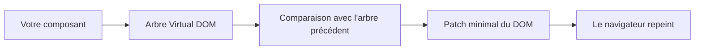
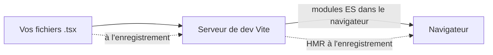
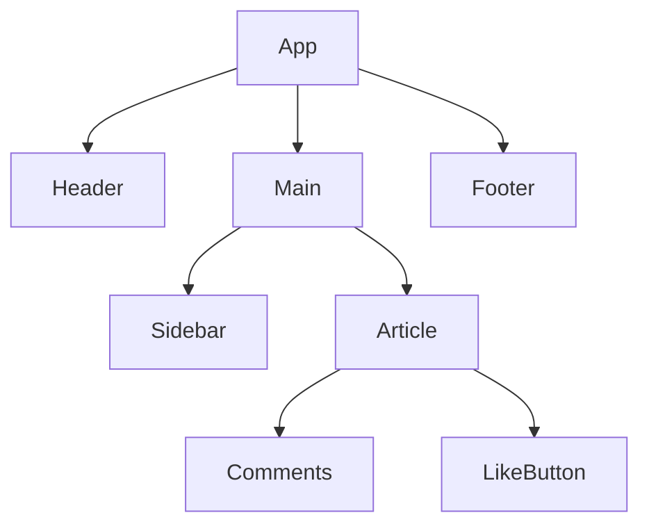
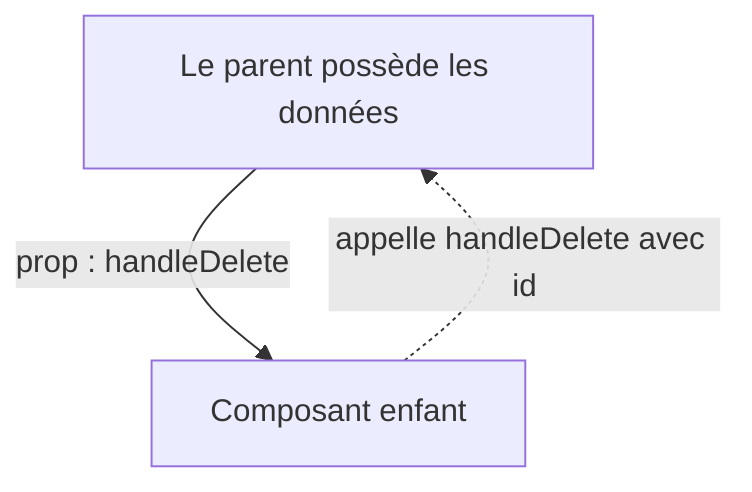
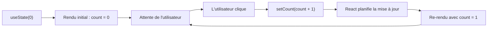
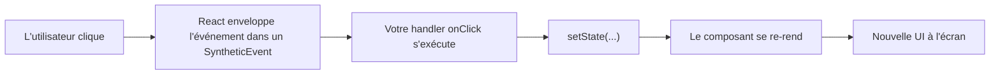
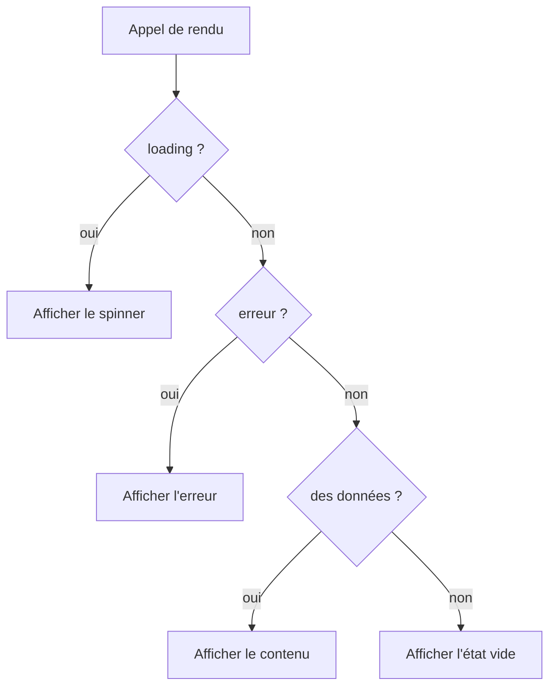
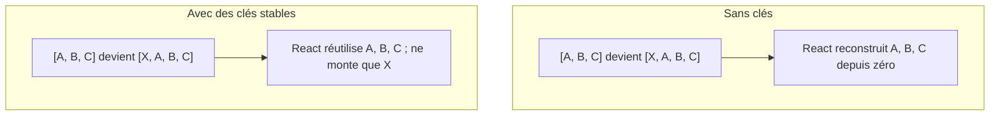
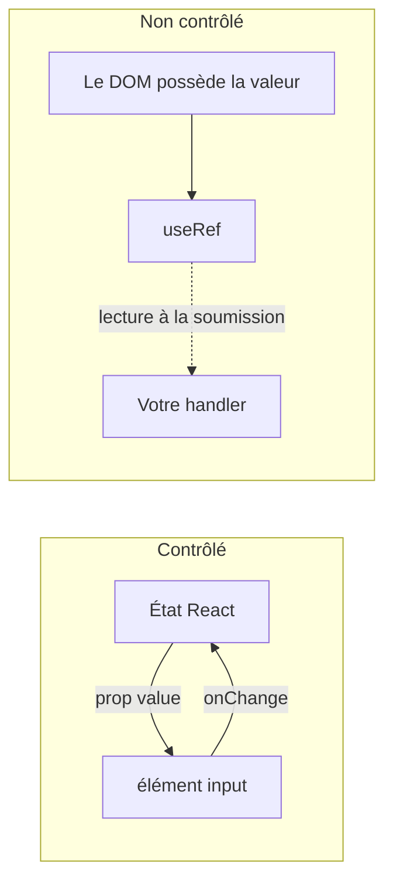

# Fondamentaux de React : construire votre première interface interactive

> Une introduction à React, partant des premiers principes, pour les développeurs qui connaissent déjà un peu d'HTML, de CSS et de JavaScript.

---

## Table des matières

1. [Comprendre React](#1-comprendre-react)
2. [Mettre en place un environnement de développement React](#2-mettre-en-place-un-environnement-de-développement-react)
3. [Syntaxe JSX](#3-syntaxe-jsx)
4. [Composants](#4-composants)
5. [Props](#5-props)
6. [Gestion de l'état](#6-gestion-de-létat)
7. [Gestion des événements](#7-gestion-des-événements)
8. [Rendu conditionnel](#8-rendu-conditionnel)
9. [Listes et clés](#9-listes-et-clés)
10. [Formulaires et composants contrôlés](#10-formulaires-et-composants-contrôlés)

Ce chapitre suppose que vous savez lire du JavaScript de base : variables, fonctions, tableaux et arrow functions. Vous devez aussi reconnaître les balises HTML et les classes CSS. Aucune expérience préalable d'un framework n'est requise. À la fin, vous comprendrez ce qu'est React, pourquoi on l'utilise, et vous saurez écrire vous-même de petits composants interactifs.

---

## 1. Comprendre React

### Partir du problème, pas de la solution

Avant même d'ouvrir un fichier React, regardons le genre de problème pour lequel React a été conçu. Imaginez que vous voulez un petit compteur sur une page web : un bouton « Cliquez-moi » et deux endroits sur la page qui doivent afficher combien de fois le bouton a été cliqué. En HTML et JavaScript classiques, vous écririez quelque chose comme ceci :

```html
<!doctype html>
<html>
  <body>
    <p>Vous avez cliqué <span id="count-top">0</span> fois.</p>
    <button id="btn">Cliquez-moi</button>
    <p>Total pour l'instant : <span id="count-bottom">0</span></p>

    <script>
      let count = 0;
      const top = document.querySelector('#count-top');
      const bottom = document.querySelector('#count-bottom');
      const btn = document.querySelector('#btn');

      btn.addEventListener('click', () => {
        count = count + 1;
        top.textContent = count;
        bottom.textContent = count;
      });
    </script>
  </body>
</html>
```

Ça marche. Mais remarquez ce que vous avez dû faire à la main : à chaque fois que `count` change, vous devez aussi penser à mettre à jour *chaque* endroit de la page qui en dépend. On a touché deux `span` ici ; dans une vraie application il pourrait y en avoir vingt. Oubliez-en un seul et l'UI mentira silencieusement à l'utilisateur.

C'est exactement le problème pour lequel React a été conçu. Vous devez décrire **à quoi ressemble l'UI pour une valeur donnée de `count`**, et la bibliothèque doit déterminer pour vous quelles parties du DOM mettre à jour. Vous arrêtez de penser « trouver cet élément et changer son texte » et vous commencez à penser « l'écran est une fonction de mes données ».

### Ce qu'est réellement React

React est une **bibliothèque** JavaScript pour construire des interfaces utilisateur. Publiée à l'origine par Facebook en 2013, elle est aujourd'hui utilisée partout, des petits tableaux de bord aux produits entiers. Une bibliothèque, contrairement à un framework complet, ne vous donne qu'un ensemble d'outils ciblés — dans le cas de React, des outils pour décrire l'UI sous forme de composants et maintenir le DOM synchronisé avec vos données. Le routage, les requêtes réseau et les helpers de formulaire ne font pas partie de React lui-même ; vous les choisirez séparément le moment venu.

L'idée centrale est le **rendu déclaratif**. Au lieu d'écrire des instructions pas à pas (« attrape cet élément, change son texte »), vous écrivez une fonction qui retourne une description de l'UI pour les données actuelles. React compare cette description à la précédente et ne met à jour que les parties qui ont réellement changé.

### Comment React met l'écran à jour



Quand votre composant s'exécute, il ne touche pas directement au vrai DOM. Il retourne un arbre léger en mémoire (souvent appelé **Virtual DOM**). React conserve l'arbre précédent, le compare au nouveau, et n'écrit que les différences dans la page réelle. C'est pour cela qu'un tableau de 10 000 lignes qui se re-rend après le changement d'une seule cellule ne bloque pas votre navigateur — React ne touche que cette cellule.

### Pourquoi les gens choisissent React

Le design de React repose sur une poignée d'idées qu'on retrouve partout dans la bibliothèque :

- **Architecture orientée composants.** Votre UI est découpée en petites fonctions nommées. Chacune retourne un morceau d'UI. Vous les composez comme des briques de Lego.
- **Code déclaratif.** Vous décrivez le résultat, pas les étapes pour y arriver.
- **Flux de données unidirectionnel.** Les données circulent des parents vers les enfants via les **props**. Les enfants ne remontent jamais pour muter le parent. Cela rend les applications plus faciles à raisonner à mesure qu'elles grossissent.
- **Un seul modèle mental, plusieurs cibles.** Une fois que vous connaissez React pour le web, le même modèle de composants est utilisé par React Native (mobile), React Three Fiber (3D) et d'autres renderers.

> **Note :** React n'a rien de magique. Sous le capot, ce n'est que du JavaScript qui produit des objets décrivant ce à quoi le DOM doit ressembler. Une fois que vous avez intégré ça, la plupart des comportements surprenants cessent de l'être.

---

## 2. Mettre en place un environnement de développement React

### À quoi ressemble un projet React moderne

Une vraie application React n'est pas un simple fichier HTML — c'est un projet avec un outil de build, un gestionnaire de paquets et un dossier de fichiers source. L'outil de build prend vos fichiers `.tsx` (du JSX avec TypeScript) et produit le JavaScript qu'un navigateur peut réellement exécuter. Il lance aussi un serveur de développement local avec le **Hot Module Replacement (HMR)**, qui signifie que lorsque vous enregistrez un fichier, la page se met à jour presque instantanément sans perdre son état.

L'outil recommandé en 2025 est **Vite**. Il démarre vite, recharge vite, et a une configuration par défaut sensée.



En développement, Vite sert votre code source comme des modules ES natifs et patche le navigateur à chaque enregistrement. Pour la production, il bascule sur un bundler (esbuild et Rollup sous le capot) pour produire un artefact minifié, débarrassé du code mort, prêt à être déployé.

### Créer un projet

Vous aurez besoin de Node.js installé (version 18 ou plus récente). Vérifiez depuis un terminal :

```bash
node --version
```

Si une version s'affiche, vous êtes bon. Créez ensuite un nouveau projet React + TypeScript avec Vite :

```bash
npm create vite@latest mon-app-react -- --template react-ts
cd mon-app-react
npm install
npm run dev
```

La dernière commande lance le serveur de dev et affiche une URL locale (généralement `http://localhost:5173`). Ouvrez-la dans un navigateur — vous devriez voir une page de démarrage avec un compteur. Modifiez `src/App.tsx`, enregistrez, et regardez le navigateur se mettre à jour tout seul.

### La structure des fichiers

Ouvrez le nouveau dossier dans votre éditeur. Vous verrez quelque chose comme ceci :

```
mon-app-react/
├── index.html              # Le seul point d'entrée HTML
├── package.json            # Dépendances et scripts
├── tsconfig.json           # Configuration TypeScript
├── vite.config.ts          # Configuration de build Vite
└── src/
    ├── main.tsx            # Initialise React dans la page
    ├── App.tsx             # Le composant racine
    ├── App.css             # Styles pour App
    └── index.css           # Styles globaux
```

Quelques mots sur le rôle de chaque fichier :

- **`index.html`** est le seul fichier HTML de tout le projet. Il contient un élément `<div id="root"></div>` vide. React injecte toute votre application dans ce div.
- **`src/main.tsx`** est le pont entre le HTML et React. Il trouve `#root` et demande à React d'y rendre le composant `App`.
- **`src/App.tsx`** est votre composant racine — le sommet de l'arbre des composants. Tout le reste pend en dessous.
- **`vite.config.ts`** est l'endroit où vous configureriez des plugins, des alias de chemins ou des proxies pour une API. Pour l'instant, vous pouvez l'ignorer.

Si vous ouvrez `main.tsx`, vous verrez quelque chose comme ceci :

```tsx
import { StrictMode } from 'react';
import { createRoot } from 'react-dom/client';
import App from './App.tsx';
import './index.css';

createRoot(document.getElementById('root')!).render(
  <StrictMode>
    <App />
  </StrictMode>,
);
```

C'est le seul endroit de votre application qui touche directement à un vrai élément du DOM. Tout ce qui descend depuis `<App />` est le territoire de React.

### Les scripts que vous utiliserez vraiment

Dans `package.json`, vous trouverez un bloc `scripts`. Les trois qui comptent pour vous tout de suite :

```bash
npm run dev      # Démarrer le serveur de dev avec HMR
npm run build    # Vérifier les types et builder pour la production
npm run preview  # Servir le build de production localement
```

Vous lancerez `npm run dev` 99 % du temps pendant l'apprentissage.

> **Note :** Quand vous lisez des tutoriels en ligne, vous verrez parfois des fichiers avec l'extension `.jsx` au lieu de `.tsx`. La seule différence est que les fichiers `.tsx` autorisent la syntaxe TypeScript. Restez sur `.tsx` — la sécurité des types se rembourse dès que votre app dépasse un seul écran.

---

## 3. Syntaxe JSX

### Pourquoi JSX existe

Regardez comment on produit un `<button>` en JavaScript pur :

```js
const btn = document.createElement('button');
btn.textContent = 'Cliquez-moi';
btn.className = 'primary';
document.body.appendChild(btn);
```

Ça marche, mais dès que vous avez des éléments imbriqués ça devient difficile à lire. Une liste de trois éléments avec un en-tête se transforme en une douzaine d'appels à `createElement` et `appendChild`. Vous perdez la forme du balisage dans une mer de code impératif.

JSX (abréviation de **JavaScript XML**) résout ça en vous laissant écrire une syntaxe ressemblant à du HTML directement dans un fichier JavaScript :

```tsx
const button = <button className="primary">Cliquez-moi</button>;
```

Cette unique ligne est l'équivalent de la version vanilla de quatre lignes ci-dessus. JSX **n'est pas un langage de template** et ce n'est pas une chaîne de caractères. C'est du sucre syntaxique — votre outil de build (Vite, via Babel ou SWC) transforme chaque balise JSX en un appel de fonction JavaScript classique :

```mermaid
graph LR
    JSX["&lt;Greeting name='Mario' /&gt;"] --> Compiler[Compilateur Vite]
    Compiler --> Call["React.createElement(Greeting, &#123; name: 'Mario' &#125;)"]
    Call --> VNode["Objet nœud Virtual DOM"]
```



C'est pour ça que les accolades dans le JSX exécutent du vrai JavaScript — vous êtes déjà à l'intérieur d'un appel de fonction. Le compilateur fait la traduction ; vous n'écrivez jamais `React.createElement` vous-même dans le code de tous les jours.

### Lire votre premier JSX

Voici un petit exemple qui utilise tout ce dont vous avez besoin pour démarrer :

```tsx
const user = { name: 'Mario', age: 32 };

const profile = (
  <div className="user-card">
    <h2>{user.name}</h2>
    <p>Âge : {user.age}</p>
    <p>Adulte : {user.age >= 18 ? 'oui' : 'non'}</p>
  </div>
);
```

Quelques points à remarquer :

- L'expression entière est enveloppée dans des parenthèses. Ce n'est qu'une convention JavaScript pour pouvoir mettre la balise d'ouverture sur une nouvelle ligne.
- On utilise `className` au lieu de `class`. On en reparle dans une seconde.
- Les accolades `{ ... }` rebasculent en mode JavaScript. Tout ce qui évalue à une chaîne, un nombre ou un autre élément JSX peut y entrer.

### Les règles JSX dont il faut vraiment se souvenir

Il y a cinq règles qui représentent presque toutes les erreurs JSX qu'un débutant rencontre.

**1. Utilisez `className`, pas `class`.** Le mot `class` est réservé en JavaScript (il est utilisé pour les classes ES6), donc JSX utilise `className` à la place. Le navigateur voit toujours `class` dans le HTML final.

```tsx
<div className="container">   {/* correct */}
<div class="container">       {/* faux — affichera un warning dans la console */}
```

**2. Toute balise doit se fermer elle-même.** Les balises auto-fermantes ont besoin du slash final :

```tsx
   {/* correct */}
                     {/* faux */}
<br />                                      {/* correct */}
```

**3. Les attributs sont en camelCase.** Le HTML classique utilise des minuscules (`onclick`, `tabindex`) ; JSX utilise le camelCase (`onClick`, `tabIndex`). Les exceptions sont les attributs `data-*` et `aria-*`, qui restent en minuscules.

```tsx
<button onClick={handleClick} tabIndex={0}>Enregistrer</button>
```

**4. Un composant doit retourner un seul élément racine.** Vous ne pouvez pas retourner deux balises frères côte à côte. Enveloppez-les dans un conteneur :

```tsx
return (
  <div>
    <h1>Titre</h1>
    <p>Texte</p>
  </div>
);
```

Si vous ne voulez pas ajouter un `<div>` supplémentaire au DOM, utilisez un **Fragment** — une paire de balises vide :

```tsx
return (
  <>
    <h1>Titre</h1>
    <p>Texte</p>
  </>
);
```

Les Fragments ne rendent aucun élément réel ; ils existent uniquement pour satisfaire la règle « une seule racine » de JSX.

**5. Les accolades contiennent des expressions JavaScript, pas des instructions.** Vous pouvez mettre n'importe quelle expression — une valeur, un appel de fonction, un ternaire, une opération mathématique — dans `{ }`. Vous ne pouvez pas y mettre une instruction `if` ou une boucle `for`, parce que ce sont des instructions, pas des expressions.

```tsx
<h1>{user.name.toUpperCase()}</h1>
<p>{2 + 2}</p>
<div>{isLoggedIn ? 'Bienvenue' : 'Veuillez vous connecter'}</div>
<ul>{items.map(item => <li key={item.id}>{item.text}</li>)}</ul>
```

### Styles inline et classes dynamiques

L'attribut `style` en JSX prend un objet JavaScript, pas une chaîne :

```tsx
<div style={{ color: 'red', fontSize: '20px', marginTop: 10 }}>Bonjour</div>
```

Les doubles accolades ont l'air bizarres mais c'est simple : les `{ }` extérieures basculent en mode JavaScript, et les `{ }` intérieures sont le littéral d'objet. Les noms de propriétés sont en camelCase (`fontSize`, pas `font-size`), et les valeurs numériques sans unité sont par défaut en pixels.

Pour des noms de classes dynamiques, utilisez un littéral de gabarit ou un ternaire :

```tsx
<button className={isPrimary ? 'btn btn-primary' : 'btn'}>Enregistrer</button>
```

> **Note :** Dès que vous avez beaucoup de classes conditionnelles, un petit helper appelé `clsx` (ou `classnames`) les rend bien plus faciles à gérer. Vous pourrez l'installer plus tard ; pour l'instant les ternaires suffisent.

---

## 4. Composants

### Ce qu'est un composant

Un **composant** est une fonction qui retourne du JSX. C'est toute la définition. Pas de classe, pas de décorateur, pas d'étape spéciale d'enregistrement. Si votre fonction retourne du JSX et que son nom commence par une majuscule, React la traite comme un composant.

```tsx
const Welcome = () => {
  return <h1>Bienvenue dans React !</h1>;
};
```

Pour l'utiliser, vous traitez son nom comme une balise HTML personnalisée :

```tsx
<Welcome />
```

La majuscule n'est pas optionnelle. React utilise la casse pour décider si `<welcome />` veut dire « rendre l'élément HTML minuscule `welcome` » (ce serait juste une balise inconnue) ou « appelle mon composant nommé `Welcome` ». Donc **les noms de composants commencent toujours par une majuscule**.

### Pourquoi découper en composants

Un composant est l'unité de **réutilisation** et l'unité de **compréhension**. La réutilisation est le bénéfice évident — écrivez un `Button` une seule fois, glissez-le à cinquante endroits. La compréhension est plus subtile. Un composant de 500 lignes est un cauchemar ; le même code découpé en dix composants de 50 lignes est lisible, parce que chaque nom (`<Header />`, `<UserCard />`, `<CommentList />`) vous dit à quoi sert ce bloc.

Une application React typique est un arbre de composants, avec un composant de plus haut niveau (généralement appelé `App`) à la racine.



Chaque nœud rend ses enfants, et les données descendent à travers les props (la prochaine section).

### Composants fonctionnels — les seuls dont vous avez besoin

React moderne s'écrit entièrement avec des **composants fonctionnels** : de simples fonctions qui retournent du JSX. Vous croiserez peut-être de l'ancien code qui utilise des composants à base de classes (`class MyComponent extends React.Component`). Ils fonctionnent toujours, mais le nouveau code ne devrait pas en utiliser. Les fonctions sont plus simples, plus faciles à tester, et débloquent les **hooks** — ces fonctions spéciales comme `useState` qui donnent aux composants leur mémoire et leur comportement.

Un exemple plus complet, avec un paramètre :

```tsx
type GreetingProps = {
  name: string;
  age: number;
};

const Greeting = ({ name, age }: GreetingProps) => {
  return (
    <div>
      <h1>Bonjour, {name} !</h1>
      <p>Vous avez {age} ans.</p>
    </div>
  );
};

// Utilisé comme :
<Greeting name="Marco" age={28} />
```

La partie `{ name, age }` est du **destructuring** — extraire des champs individuels d'un objet en une ligne. L'objet déstructuré est ce que React lui passe : un objet `props` contenant tous les attributs que vous avez écrits sur la balise.

### Où vivent les composants ?

Une convention répandue est un composant par fichier, nommé d'après le composant :

```
src/
└── components/
    ├── Header.tsx
    ├── Button.tsx
    └── UserCard.tsx
```

Chaque fichier exporte son composant :

```tsx
// src/components/Button.tsx
type ButtonProps = {
  label: string;
  onClick: () => void;
};

export const Button = ({ label, onClick }: ButtonProps) => {
  return <button onClick={onClick}>{label}</button>;
};
```

Et d'autres composants l'importent :

```tsx
// src/App.tsx
import { Button } from './components/Button';

export default function App() {
  return <Button label="Enregistrer" onClick={() => console.log('enregistré')} />;
}
```

Voilà tout le modèle mental d'une application React : beaucoup de petits composants, chacun dans son propre fichier, qui se composent en de plus grands composants jusqu'à atteindre la racine.

---

## 5. Props

### Faire entrer des données

Les **props** (raccourci pour « properties ») sont la manière dont un composant parent passe des données à un enfant. Du côté du JSX, les props ressemblent exactement à des attributs HTML :

```tsx
<UserCard name="Giuseppe" age={32} city="Rome" isActive={true} />
```

L'enfant les reçoit toutes comme des champs d'un unique objet `props` :

```tsx
const UserCard = (props) => {
  return (
    <div className="card">
      <h2>{props.name}</h2>
      <p>Âge : {props.age}</p>
      <p>Ville : {props.city}</p>
      {props.isActive && <span>En ligne</span>}
    </div>
  );
};
```

Remarquez comment des données de types différents entrent différemment :

- Les chaînes peuvent s'écrire avec des guillemets : `name="Giuseppe"`.
- Tout le reste a besoin d'accolades pour que JSX sache que c'est une expression JavaScript : `age={32}`, `isActive={true}`, `tags={['a', 'b']}`.

Vous pouvez aussi passer une chaîne avec des accolades si vous préférez (`name={"Giuseppe"}`), mais le raccourci se lit mieux.

### Le destructuring est le style standard

Lire `props.name` encore et encore devient bruyant. Presque tout le code React déstructure les props directement dans la signature de la fonction :

```tsx
const UserCard = ({ name, age, city, isActive }) => {
  return (
    <div className="card">
      <h2>{name}</h2>
      <p>Âge : {age}</p>
      <p>Ville : {city}</p>
      {isActive && <span>En ligne</span>}
    </div>
  );
};
```

Avec TypeScript, vous décrivez aussi la forme des props :

```tsx
type UserCardProps = {
  name: string;
  age: number;
  city: string;
  isActive: boolean;
};

const UserCard = ({ name, age, city, isActive }: UserCardProps) => {
  // ...
};
```

Si vous oubliez de passer une prop requise, TypeScript le repère avant même que la page se charge.

### Valeurs par défaut

Si une prop est optionnelle, donnez-lui une valeur par défaut dans le destructuring :

```tsx
type ButtonProps = {
  label?: string;
  variant?: 'primary' | 'secondary';
};

const Button = ({ label = 'Cliquez-moi', variant = 'primary' }: ButtonProps) => {
  return <button className={variant}>{label}</button>;
};
```

Le `?` après le nom de la propriété dans le type la rend optionnelle. Le `= '...'` dans les paramètres fournit la valeur par défaut si le parent ne passe rien.

### Les props sont en lecture seule

Il y a une règle sur les props qu'il faut intégrer : **un composant ne doit jamais modifier ses propres props**. Ce sont des entrées en lecture seule. Si l'utilisateur tape dans un champ de recherche et que vous voulez mettre à jour la valeur, cette valeur ne peut pas vivre dans les props — elle doit vivre dans l'état (section suivante), possédé par un composant plus haut dans l'arbre.

```tsx
const Bad = ({ count }) => {
  count = count + 1;  // faux — ne réaffectez jamais les props
  return <p>{count}</p>;
};
```

Pourquoi ? Parce que c'est le parent qui possède ces données. Si l'enfant les mutait en douce, la vision du monde du parent dériverait silencieusement de la réalité, et la garantie « les données descendent » de React serait rompue.

### Renvoyer des données vers le haut : les props callback

Si les props ne peuvent que descendre, comment un enfant dit-il à un parent qu'il s'est passé quelque chose — qu'un bouton a été cliqué, qu'un input a changé ? Le parent passe à l'enfant une **fonction** en tant que prop. L'enfant appelle cette fonction. Le parent fait ce qu'il veut en réponse.



Un petit exemple :

```tsx
const TodoItem = ({ id, text, onDelete }) => {
  return (
    <div>
      <span>{text}</span>
      <button onClick={() => onDelete(id)}>Supprimer</button>
    </div>
  );
};

const TodoList = () => {
  const handleDelete = (id: number) => {
    console.log('Suppression du todo', id);
    // ... met à jour un état ici
  };

  return <TodoItem id={1} text="Acheter du lait" onDelete={handleDelete} />;
};
```

Le parent définit `handleDelete`. Il le passe à `TodoItem` en tant que prop `onDelete`. Quand l'utilisateur clique sur le bouton, `TodoItem` appelle `onDelete(id)` — ce qui revient à appeler la fonction `handleDelete` du parent. Le parent sait maintenant quel todo retirer, mais l'enfant n'a jamais touché à des données qu'il ne possédait pas.

Ce schéma — « les props descendent, les événements remontent » — est la règle de flux de données la plus importante de React. Gardez-la en tête.

### Children : la prop spéciale

React réserve un nom de prop : `children`. Tout ce que vous mettez **entre** les balises d'ouverture et de fermeture d'un composant est passé comme `children` :

```tsx
<Card>
  <h2>Bonjour</h2>
  <p>Voici à l'intérieur de la carte.</p>
</Card>
```

À l'intérieur de `Card`, vous recevez ce JSX :

```tsx
type CardProps = {
  children: React.ReactNode;
};

const Card = ({ children }: CardProps) => {
  return <div className="card">{children}</div>;
};
```

C'est ainsi qu'on construit des composants de mise en page réutilisables — la `Card` ne se soucie pas de ce qu'il y a à l'intérieur, elle fournit juste la boîte.

---

## 6. Gestion de l'état

### Pourquoi les props ne suffisent pas

Les props permettent à un parent de pousser des données vers le bas, mais elles ne peuvent pas capturer des données qui *changent dans le temps à l'intérieur du composant*. Un compteur qui s'incrémente quand vous cliquez, un champ texte qui se met à jour à mesure que l'utilisateur tape, une liste qui grandit quand vous ajoutez un élément — tous ont besoin d'un moyen pour le composant de se souvenir d'une valeur entre les rendus, et de dire à React « cette valeur a changé, re-rends-moi avec la nouvelle ».

Ce mécanisme s'appelle **l'état**, et on y accède via une fonction appelée **`useState`**.

### Les hooks, brièvement

`useState` est votre premier **hook**. Les hooks sont des fonctions spéciales dont le nom commence par `use`. Ils permettent à un composant fonctionnel de « se brancher » aux fonctionnalités de React comme l'état, les effets et le contexte. Il y a deux règles :

1. N'appelez les hooks qu'au plus haut niveau d'une fonction de composant. Jamais à l'intérieur d'un `if`, d'une boucle ou d'une fonction imbriquée.
2. N'appelez les hooks que depuis des composants React (ou depuis d'autres hooks).

Ces règles existent pour que React puisse suivre quel appel de hook correspond à quelle valeur. Tant que vous les respectez, vous n'avez pas à vous demander pourquoi.

### Votre premier compteur

```tsx
import { useState } from 'react';

const Counter = () => {
  const [count, setCount] = useState(0);

  return (
    <div>
      <p>Vous avez cliqué {count} fois</p>
      <button onClick={() => setCount(count + 1)}>Incrémenter</button>
    </div>
  );
};
```

Décortiquons `useState(0)` :

- On l'appelle avec une **valeur initiale** (ici, `0`).
- Il retourne un **tableau de deux choses** : la valeur courante et une fonction de mise à jour. On les déstructure : `const [count, setCount] = ...`.
- `count` est la valeur courante. Vous pouvez la lire dans le JSX ou ailleurs dans le composant.
- `setCount` est la seule façon correcte de la changer. Appeler `setCount(5)` dit à React « au prochain rendu, `count` doit valoir 5 », et React planifie un re-rendu de ce composant.



Vous vous souvenez de l'exemple du compteur tout au début, qui demandait des mises à jour manuelles du DOM à deux endroits ? Voici la version React :

```tsx
const TwoPlaceCounter = () => {
  const [count, setCount] = useState(0);

  return (
    <div>
      <p>Vous avez cliqué {count} fois.</p>
      <button onClick={() => setCount(count + 1)}>Cliquez-moi</button>
      <p>Total pour l'instant : {count}</p>
    </div>
  );
};
```

Les deux `span` affichent toujours le bon nombre. Vous n'avez jamais écrit `top.textContent = count`. Vous avez juste utilisé `count` dans le JSX, et React s'est occupé du reste. C'est la récompense du rendu déclaratif.

### Ne mutez jamais l'état directement

C'est l'erreur la plus courante du débutant :

```tsx
const [user, setUser] = useState({ name: 'Marco', age: 28 });

// faux — React ne voit pas le changement
user.age = 29;

// correct — passez un nouvel objet au setter
setUser({ ...user, age: 29 });
```

React décide s'il faut re-rendre en comparant la nouvelle valeur d'état à l'ancienne. Si vous mutez le même objet sur place, c'est toujours le même objet — React ne voit pas de changement et saute le re-rendu. Passez toujours une nouvelle valeur au setter.

Pareil pour les tableaux :

```tsx
const [todos, setTodos] = useState<string[]>([]);

// faux
todos.push('Acheter du lait');

// correct
setTodos([...todos, 'Acheter du lait']);

// suppression
setTodos(todos.filter(todo => todo !== 'Acheter du lait'));
```

L'opérateur spread `...` est votre ami ici. Il construit un nouveau tableau (ou objet) qui contient l'ancien contenu plus votre changement.

### Plusieurs valeurs d'état

Vous pouvez appeler `useState` autant de fois que nécessaire :

```tsx
const UserForm = () => {
  const [name, setName] = useState('');
  const [email, setEmail] = useState('');
  const [age, setAge] = useState(0);
  const [isSubscribed, setIsSubscribed] = useState(false);

  return (
    <div>
      <input value={name} onChange={(e) => setName(e.target.value)} />
      <input value={email} onChange={(e) => setEmail(e.target.value)} />
      {/* ... */}
    </div>
  );
};
```

Ou regrouper les champs liés dans un seul objet :

```tsx
const [form, setForm] = useState({
  name: '',
  email: '',
  age: 0,
});

const updateField = (field: string, value: string) => {
  setForm(prev => ({ ...prev, [field]: value }));
};
```

Choisissez ce qui vous semble le plus clair pour la situation. Plusieurs petits `useState` sont souvent plus faciles à lire qu'un seul gros objet.

### L'updater fonctionnel

Il y a une subtilité importante. Quand un setter est appelé, React ne met pas à jour `count` immédiatement — il met la mise à jour en file d'attente. Si vous appelez le setter deux fois d'affilée en utilisant la valeur courante, vous serez surpris :

```tsx
const [count, setCount] = useState(0);

const doubleIncrement = () => {
  setCount(count + 1);  // file d'attente : mettre count à 1
  setCount(count + 1);  // file d'attente : remettre count à 1 (count vaut toujours 0 ici !)
};
```

Après un clic, `count` finit à `1`, pas `2`. Pour corriger ça, passez une fonction au setter. React l'appellera avec la valeur la plus récente :

```tsx
const doubleIncrement = () => {
  setCount(prev => prev + 1);  // prev vaut 0, devient 1
  setCount(prev => prev + 1);  // prev vaut maintenant 1, devient 2
};
```

C'est ce qu'on appelle la forme **updater fonctionnel**. Utilisez-la chaque fois que le prochain état dépend de l'état précédent.

### Props vs état — quand utiliser quoi

C'est la question que tout débutant pose. La règle est courte :

- Si la valeur est **passée depuis l'extérieur** du composant, c'est une prop.
- Si la valeur est **possédée et modifiée par ce composant**, c'est de l'état.

Si deux composants frères ont besoin de partager la même valeur, cette valeur doit vivre dans l'**état** de leur plus proche parent commun et redescendre comme **prop** vers les deux. Ce schéma s'appelle « élever l'état » (lifting state up), et vous l'utiliserez constamment.

---

## 7. Gestion des événements

### De `addEventListener` aux handlers React

En JavaScript pur, vous attachez des écouteurs d'événements comme ceci :

```js
document.querySelector('#save').addEventListener('click', () => {
  console.log('cliqué');
});
```

En React, vous écrivez le handler directement sur l'élément JSX en tant que prop :

```tsx
<button onClick={() => console.log('cliqué')}>Enregistrer</button>
```

Les noms d'événements sont en camelCase (`onClick`, `onChange`, `onSubmit`) et la valeur est une **fonction**, pas une chaîne. React s'occupe d'attacher et de retirer l'écouteur pour vous.

### Ce qui se passe quand l'utilisateur clique



React enveloppe les événements DOM natifs dans un objet cross-browser appelé **SyntheticEvent**. Dans la plupart des cas, il ressemble et se comporte exactement comme un événement normal — vous pouvez appeler `event.preventDefault()`, lire `event.target.value`, et ainsi de suite. Vous n'avez presque jamais à vous soucier de l'enveloppe elle-même.

### Handlers inline vs handlers nommés

Les deux formes sont bonnes :

```tsx
// fonction fléchée inline
<button onClick={() => console.log('cliqué')}>Enregistrer</button>

// référence à une fonction nommée
const handleSave = () => {
  console.log('cliqué');
};

<button onClick={handleSave}>Enregistrer</button>
```

Utilisez la version nommée quand le handler fait plus d'une ligne ou quand vous voulez le réutiliser. Utilisez les arrow inline quand vous devez passer un argument :

```tsx
<button onClick={() => handleDelete(user.id)}>Supprimer</button>
```

Important : n'appelez **pas** la fonction avec des parenthèses à l'intérieur de la prop JSX :

```tsx
<button onClick={handleDelete(user.id)}>Supprimer</button>   {/* faux */}
```

Ça appellerait `handleDelete` immédiatement quand le composant se rend et affecterait ce qu'elle retourne (sans doute `undefined`) comme handler de clic. Vous voulez donner à React une fonction qu'il pourra appeler plus tard, pas le résultat de l'appeler maintenant.

### Lire l'objet événement

Votre handler reçoit l'objet événement comme premier argument :

```tsx
const handleSubmit = (event) => {
  event.preventDefault();         // arrête le comportement par défaut du navigateur
  event.stopPropagation();        // empêche l'événement de remonter
  console.log(event.target);      // l'élément qui a déclenché l'événement
};
```

`preventDefault()` est celui que vous emploierez constamment avec les formulaires — sans lui, soumettre un `<form>` provoque un rechargement de la page, ce qui n'est presque jamais ce que vous voulez dans une single-page app.

### Un petit éventail d'événements courants

```tsx
const EventExamples = () => {
  return (
    <div>
      <button onClick={() => console.log('clic')}>Cliquer</button>
      <button onDoubleClick={() => console.log('double')}>Double clic</button>

      <div
        onMouseEnter={() => console.log('entré')}
        onMouseLeave={() => console.log('sorti')}
      >
        Survolez-moi
      </div>

      <input
        onChange={(e) => console.log('valeur :', e.target.value)}
        onFocus={() => console.log('focus')}
        onBlur={() => console.log('blur')}
      />

      <form
        onSubmit={(e) => {
          e.preventDefault();
          console.log('formulaire soumis');
        }}
      >
        <button type="submit">Soumettre</button>
      </form>

      <input onKeyDown={(e) => console.log('touche :', e.key)} />
    </div>
  );
};
```

### Typer les handlers en TypeScript

Quand vous avez besoin du type de l'événement lui-même (par exemple pour le déstructurer), TypeScript attend des noms précis :

```tsx
import { ChangeEvent, FormEvent, MouseEvent } from 'react';

const handleChange = (e: ChangeEvent<HTMLInputElement>) => {
  console.log(e.target.value);
};

const handleSubmit = (e: FormEvent<HTMLFormElement>) => {
  e.preventDefault();
};

const handleClick = (e: MouseEvent<HTMLButtonElement>) => {
  console.log('bouton à', e.clientX, e.clientY);
};
```

Si vous laissez votre éditeur inférer le type (en utilisant une fonction fléchée inline directement dans le JSX), vous n'aurez généralement pas à écrire ces annotations — TypeScript le devine depuis le contexte JSX.

---

## 8. Rendu conditionnel

### « Parfois montrer ceci, parfois cela »

Presque toutes les UI ont des parties qui n'apparaissent que sous certaines conditions : un bouton « Déconnexion » uniquement quand l'utilisateur est connecté, un message d'erreur uniquement quand quelque chose a échoué, un spinner de chargement uniquement pendant qu'une requête est en cours.

React n'a pas de syntaxe « if » spéciale. Vous utilisez simplement du JavaScript normal — parce que JSX est du JavaScript normal. Il y a trois schémas que vous utiliserez sans cesse.



L'ordre de ces vérifications compte. Vérifiez l'état le plus spécifique d'abord (chargement), puis le suivant (erreur), puis le cas heureux (données), puis le repli (vide). Si vous sautez la vérification de chargement et passez directement à « des données ? », vous aurez un flash de « aucun résultat » pendant que la requête est encore en cours.

### Schéma 1 : court-circuit avec `&&`

```tsx
const Greeting = ({ isLoggedIn, username }) => {
  return (
    <div>
      {isLoggedIn && <h1>Bienvenue, {username} !</h1>}
      {!isLoggedIn && <h1>Veuillez vous connecter</h1>}
    </div>
  );
};
```

Cela fonctionne grâce à l'évaluation court-circuit de JavaScript : `true && <h1>...</h1>` vaut simplement `<h1>...</h1>`, et `false && <h1>...</h1>` vaut `false`, que React rend comme rien du tout.

Il y a un piège : n'utilisez pas `&&` avec un nombre qui peut valoir zéro :

```tsx
{items.length && <p>Vous avez des éléments</p>}   {/* danger */}
```

Si `items.length` vaut `0`, JavaScript court-circuite à `0`, et React rend le texte littéral `0` sur la page. Utilisez plutôt une comparaison :

```tsx
{items.length > 0 && <p>Vous avez des éléments</p>}
```

### Schéma 2 : le ternaire

Quand vous avez un soit/soit, le ternaire `a ? b : c` se lit mieux que deux `&&` :

```tsx
const LoginButton = ({ isLoggedIn }) => {
  return <button>{isLoggedIn ? 'Déconnexion' : 'Connexion'}</button>;
};
```

Vous pouvez mettre des blocs JSX entiers de chaque côté, du moment que vous les entourez de parenthèses :

```tsx
const UserStatus = ({ user }) => {
  return (
    <div>
      {user ? (
        <div>
          <h2>{user.name}</h2>
          <p>{user.email}</p>
        </div>
      ) : (
        <p>Aucun utilisateur connecté</p>
      )}
    </div>
  );
};
```

Évitez d'imbriquer les ternaires sur plus d'un niveau — ils deviennent vite illisibles. Si vous vous retrouvez à les empiler, passez au schéma 3.

### Schéma 3 : sortie anticipée

Si la condition s'applique à tout le composant, faites un `return` en haut :

```tsx
const UserProfile = ({ user }) => {
  if (!user) {
    return <p>Chargement...</p>;
  }

  if (user.role === 'admin') {
    return <AdminDashboard user={user} />;
  }

  return <UserDashboard user={user} />;
};
```

C'est le schéma le plus propre pour gérer les flux « charge » → « erreur » → « succès » :

```tsx
const Dashboard = ({ user, isLoading, error }) => {
  if (isLoading) return <Spinner />;
  if (error) return <ErrorMessage message={error} />;
  if (!user) return <p>Aucune donnée disponible</p>;

  return <UserProfile user={user} />;
};
```

### Lookup par clé (un switch du pauvre)

Quand vous avez beaucoup d'options discrètes, un objet de lookup est souvent plus agréable qu'une chaîne de ternaires :

```tsx
type Status = 'pending' | 'approved' | 'rejected';

const StatusBadge = ({ status }: { status: Status }) => {
  const config = {
    pending:  { text: 'En attente', color: 'orange' },
    approved: { text: 'Approuvé',  color: 'green' },
    rejected: { text: 'Rejeté',    color: 'red' },
  }[status];

  return <span style={{ color: config.color }}>{config.text}</span>;
};
```

### Combiner plusieurs conditions

```tsx
const Dashboard = ({ user, isLoading, error }) => {
  return (
    <div>
      {isLoading && <Spinner />}
      {error && <ErrorMessage message={error} />}
      {!isLoading && !error && user && <UserProfile user={user} />}
      {!isLoading && !error && !user && <p>Aucune donnée disponible</p>}
    </div>
  );
};
```

Ça marche, mais comparez avec la version en sortie anticipée plus haut — celle-ci est plus courte et plus facile à suivre. En cas de doute, préférez les sorties anticipées pour les branches de plus haut niveau, et `&&` / ternaire pour les petits morceaux inline.

---

## 9. Listes et clés

### Transformer des données en UI

Une liste en React n'est qu'un tableau de données et un appel à `.map()` qui transforme chaque élément en un élément JSX.

```tsx
const TodoList = () => {
  const todos = [
    { id: 1, text: 'Apprendre React', completed: false },
    { id: 2, text: 'Construire un projet', completed: false },
    { id: 3, text: 'Déployer l\'app', completed: true },
  ];

  return (
    <ul>
      {todos.map((todo) => (
        <li key={todo.id}>
          {todo.text} {todo.completed && '(fait)'}
        </li>
      ))}
    </ul>
  );
};
```

Trois choses à remarquer :

1. `todos.map(...)` exécute `Array.prototype.map` — celui que vous avez toujours utilisé. Il retourne un nouveau tableau, cette fois d'éléments JSX.
2. On enveloppe l'appel dans `{ ... }` pour que JSX l'évalue comme une expression JavaScript.
3. Chaque `<li>` reçoit une prop `key`. C'est la partie qui demande le plus d'explications.

### Pourquoi les clés existent

Quand la liste change — un élément est ajouté, supprimé ou réordonné — React doit déterminer quels nœuds du DOM garder, lesquels jeter, et lesquels créer. La **clé** est la façon dont React identifie chaque élément à travers les rendus.



Si vous ne fournissez pas de clés, React se rabat sur l'index du tableau. Ça marche pour des listes statiques mais ça casse dès que des éléments sont insérés, retirés ou réordonnés : React pense « l'élément à l'index 0 était A, maintenant c'est X, mettons-le à jour de A vers X » au lieu de « X est tout nouveau, montons-le et faisons descendre A ». Vous perdez en performance et, pire, vous perdez tout état interne dans ces éléments (la valeur d'un `<input>`, un toggle, n'importe quoi).

### Règles des clés

Les règles des clés sont courtes :

- Les clés doivent être **uniques parmi les frères** (pas globalement — seulement dans la même liste).
- Les clés doivent être **stables** : le même élément doit avoir la même clé entre les rendus.
- Utilisez un vrai ID de vos données quand vous en avez un (`todo.id`, `user.id`).
- N'utilisez l'index du tableau que si votre liste est purement statique — jamais ajoutée, retirée ou réordonnée.
- N'utilisez jamais `Math.random()` ou `Date.now()` — ça générerait une clé différente à chaque rendu, ruinant tout l'intérêt.

```tsx
{todos.map((todo) => (
  <li key={todo.id}>{todo.text}</li>           {/* bon */}
))}

{todos.map((todo, index) => (
  <li key={index}>{todo.text}</li>             {/* ok pour les listes statiques, risqué sinon */}
))}

{todos.map((todo) => (
  <li>{todo.text}</li>                         {/* mauvais — React va vous warner */}
))}
```

### Extraire les éléments de liste dans leur propre composant

Dès qu'un élément de liste fait plus de deux ou trois lignes de JSX, sortez-le dans son propre composant. Le code devient plus facile à lire, et le composant d'élément peut avoir son propre état (pensez : un toggle « en édition » sur chaque ligne).

```tsx
type Todo = { id: number; text: string; completed: boolean };

type TodoItemProps = {
  todo: Todo;
  onToggle: (id: number) => void;
  onDelete: (id: number) => void;
};

const TodoItem = ({ todo, onToggle, onDelete }: TodoItemProps) => {
  return (
    <li>
      <input
        type="checkbox"
        checked={todo.completed}
        onChange={() => onToggle(todo.id)}
      />
      <span>{todo.text}</span>
      <button onClick={() => onDelete(todo.id)}>Supprimer</button>
    </li>
  );
};

const TodoList = () => {
  const [todos, setTodos] = useState<Todo[]>([
    { id: 1, text: 'Apprendre React', completed: false },
    { id: 2, text: 'Construire un projet', completed: false },
  ]);

  const toggle = (id: number) => {
    setTodos(prev =>
      prev.map(t => (t.id === id ? { ...t, completed: !t.completed } : t)),
    );
  };

  const remove = (id: number) => {
    setTodos(prev => prev.filter(t => t.id !== id));
  };

  return (
    <ul>
      {todos.map(todo => (
        <TodoItem key={todo.id} todo={todo} onToggle={toggle} onDelete={remove} />
      ))}
    </ul>
  );
};
```

Remarquez que la `key` se met sur l'élément produit par `.map()` — c'est-à-dire sur `<TodoItem>` lui-même, **pas** sur le `<li>` à l'intérieur de `TodoItem`. React n'a besoin de la clé qu'à l'endroit où la liste est générée.

### Filtrer et trier

Filtrer et trier ne sont que des méthodes de tableau. Chaînez-les avant `.map()` :

```tsx
const FilteredList = () => {
  const [todos, setTodos] = useState<Todo[]>([]);
  const [filter, setFilter] = useState<'all' | 'active' | 'completed'>('all');

  const visible = todos
    .filter(todo => {
      if (filter === 'active') return !todo.completed;
      if (filter === 'completed') return todo.completed;
      return true;
    })
    .slice()                                          // copie avant le tri
    .sort((a, b) => a.text.localeCompare(b.text));

  return (
    <div>
      <button onClick={() => setFilter('all')}>Tous</button>
      <button onClick={() => setFilter('active')}>Actifs</button>
      <button onClick={() => setFilter('completed')}>Terminés</button>

      <ul>
        {visible.map(todo => (
          <li key={todo.id}>{todo.text}</li>
        ))}
      </ul>
    </div>
  );
};
```

L'appel à `.slice()` avant `.sort()` est important : `sort()` mute le tableau sur place, et il ne faut jamais muter l'état. Le slice fait une copie d'abord.

### États vides

Gérez toujours le cas vide explicitement — un `<ul>` vide est une UI déroutante.

```tsx
{visible.length === 0 ? (
  <p>Aucun todo pour l'instant. Ajoutez-en un ci-dessus.</p>
) : (
  <ul>
    {visible.map(todo => <li key={todo.id}>{todo.text}</li>)}
  </ul>
)}
```

---

## 10. Formulaires et composants contrôlés

### Où vit la valeur

Un champ de formulaire a une valeur. En HTML pur, cette valeur vit dans le DOM — le navigateur garde la trace de ce que l'utilisateur a tapé. Quand vous voulez la lire, vous appelez `document.querySelector('#email').value`.

En React, vous avez le choix. Le schéma recommandé est le **composant contrôlé** : la valeur vit dans l'état React, et le champ lit depuis l'état et y réécrit à chaque frappe. L'état est la **source unique de vérité**.



L'alternative — le **composant non contrôlé** — laisse le DOM posséder la valeur et la lit via un `ref` quand vous en avez besoin. Le non contrôlé est parfois utile pour la performance, mais pour quasiment tout ce que vous écrirez en tant que débutant, vous voulez du contrôlé.

### Un input contrôlé minimal

```tsx
import { useState } from 'react';

const NameForm = () => {
  const [name, setName] = useState('');

  return (
    <div>
      <input value={name} onChange={(e) => setName(e.target.value)} />
      <p>Bonjour, {name || '(pas encore de nom)'} !</p>
    </div>
  );
};
```

Deux props font le travail :

- `value={name}` — le contenu de l'input vient de l'état.
- `onChange={(e) => setName(e.target.value)}` — chaque frappe déclenche `onChange`, qui réécrit la nouvelle valeur dans l'état, qui re-rend, qui met à jour le `value` de l'input.

Ça semble circulaire, et ça l'est. Mais ça vous donne quelque chose de puissant : à tout moment, `name` est la vérité. Vous n'avez pas à interroger le DOM, vous n'avez pas à vous demander si la valeur s'est désynchronisée de votre modèle. L'état React est le modèle.

### Un formulaire de login complet

```tsx
const LoginForm = () => {
  const [email, setEmail] = useState('');
  const [password, setPassword] = useState('');

  const handleSubmit = (e: React.FormEvent) => {
    e.preventDefault();
    console.log('Connexion avec', { email, password });
  };

  return (
    <form onSubmit={handleSubmit}>
      <div>
        <label htmlFor="email">Email</label>
        <input
          id="email"
          type="email"
          value={email}
          onChange={(e) => setEmail(e.target.value)}
        />
      </div>

      <div>
        <label htmlFor="password">Mot de passe</label>
        <input
          id="password"
          type="password"
          value={password}
          onChange={(e) => setPassword(e.target.value)}
        />
      </div>

      <button type="submit">Se connecter</button>
    </form>
  );
};
```

Trois petits détails à souligner :

- `onSubmit` se met sur le `<form>`, pas sur le bouton de soumission.
- `e.preventDefault()` est essentiel. Sans lui, le navigateur va recharger la page et vous perdrez tout votre état.
- Chaque `<label>` utilise `htmlFor` (pas `for`, parce que `for` est réservé en JavaScript) pour l'associer à son input. C'est bon pour l'accessibilité — cliquer sur le label met le focus sur l'input.

### Différents éléments de formulaire, même schéma

Chaque contrôle de formulaire suit le même schéma `value` + `onChange`, avec des variations mineures :

```tsx
type FormState = {
  username: string;
  bio: string;
  country: string;
  subscribe: boolean;
  gender: string;
  skills: string[];
};

const RegistrationForm = () => {
  const [form, setForm] = useState<FormState>({
    username: '',
    bio: '',
    country: 'italy',
    subscribe: false,
    gender: '',
    skills: [],
  });

  // handler générique pour les inputs de type texte et les checkboxes qui ont un `name`
  const handleChange = (
    e: React.ChangeEvent<HTMLInputElement | HTMLSelectElement | HTMLTextAreaElement>,
  ) => {
    const { name, value, type } = e.target;
    const checked = (e.target as HTMLInputElement).checked;
    setForm(prev => ({
      ...prev,
      [name]: type === 'checkbox' ? checked : value,
    }));
  };

  const toggleSkill = (skill: string) => {
    setForm(prev => ({
      ...prev,
      skills: prev.skills.includes(skill)
        ? prev.skills.filter(s => s !== skill)
        : [...prev.skills, skill],
    }));
  };

  const handleSubmit = (e: React.FormEvent) => {
    e.preventDefault();
    console.log('Soumission', form);
  };

  return (
    <form onSubmit={handleSubmit}>
      {/* input texte */}
      <input
        type="text"
        name="username"
        value={form.username}
        onChange={handleChange}
        placeholder="Nom d'utilisateur"
      />

      {/* textarea — même schéma */}
      <textarea
        name="bio"
        value={form.bio}
        onChange={handleChange}
        placeholder="Parlez-nous de vous"
        rows={4}
      />

      {/* select — la valeur se met sur le select, pas sur l'option */}
      <select name="country" value={form.country} onChange={handleChange}>
        <option value="italy">Italie</option>
        <option value="spain">Espagne</option>
        <option value="france">France</option>
      </select>

      {/* checkbox unique — utilise `checked`, pas `value` */}
      <label>
        <input
          type="checkbox"
          name="subscribe"
          checked={form.subscribe}
          onChange={handleChange}
        />
        S'inscrire à la newsletter
      </label>

      {/* groupe de radio — même `name`, `value` différent, on compare `checked` */}
      <label>
        <input
          type="radio"
          name="gender"
          value="male"
          checked={form.gender === 'male'}
          onChange={handleChange}
        />
        Homme
      </label>
      <label>
        <input
          type="radio"
          name="gender"
          value="female"
          checked={form.gender === 'female'}
          onChange={handleChange}
        />
        Femme
      </label>

      {/* groupe de checkboxes adossé à un tableau */}
      <label>
        <input
          type="checkbox"
          checked={form.skills.includes('react')}
          onChange={() => toggleSkill('react')}
        />
        React
      </label>
      <label>
        <input
          type="checkbox"
          checked={form.skills.includes('typescript')}
          onChange={() => toggleSkill('typescript')}
        />
        TypeScript
      </label>

      <button type="submit">S'inscrire</button>
    </form>
  );
};
```

Quelques points à remarquer :

- Une seule fonction `handleChange` peut gérer la plupart des inputs parce qu'on utilise l'attribut `name` de l'input comme clé d'état.
- Les checkboxes utilisent `checked` au lieu de `value`. Le « est-ce coché » vit dans `e.target.checked`.
- `<select>` met la valeur courante sur le select lui-même, pas sur le `<option>` correspondant.
- Pour les boutons radio d'un groupe, chaque input partage le même `name`. Celui qui est sélectionné est identifié en comparant `checked={form.gender === 'male'}`.
- Pour un **groupe** de checkboxes (où plusieurs peuvent être sélectionnées) vous ne pouvez pas utiliser le handler générique — il faut basculer l'appartenance dans un tableau, ce que fait `toggleSkill`.

### Validation

La validation, c'est juste du code qui s'exécute avant la soumission. Vous gardez les messages d'erreur dans leur propre morceau d'état et vous les rendez à côté du champ concerné.

```tsx
type FormState = { email: string; password: string; confirmPassword: string };
type FormErrors = Partial<Record<keyof FormState, string>>;

const RegistrationForm = () => {
  const [form, setForm] = useState<FormState>({
    email: '',
    password: '',
    confirmPassword: '',
  });
  const [errors, setErrors] = useState<FormErrors>({});

  const validate = (): boolean => {
    const next: FormErrors = {};

    if (!form.email) {
      next.email = 'L\'email est requis';
    } else if (!/\S+@\S+\.\S+/.test(form.email)) {
      next.email = 'L\'email n\'est pas valide';
    }

    if (!form.password) {
      next.password = 'Le mot de passe est requis';
    } else if (form.password.length < 8) {
      next.password = 'Le mot de passe doit faire au moins 8 caractères';
    }

    if (form.password !== form.confirmPassword) {
      next.confirmPassword = 'Les mots de passe ne correspondent pas';
    }

    setErrors(next);
    return Object.keys(next).length === 0;
  };

  const handleSubmit = (e: React.FormEvent) => {
    e.preventDefault();
    if (validate()) {
      console.log('Valide ! Soumission...', form);
      // appelez votre API ici
    }
  };

  const handleChange = (e: React.ChangeEvent<HTMLInputElement>) => {
    const { name, value } = e.target;
    setForm(prev => ({ ...prev, [name]: value }));
    // efface l'erreur de ce champ pendant que l'utilisateur tape
    if (errors[name as keyof FormErrors]) {
      setErrors(prev => ({ ...prev, [name]: undefined }));
    }
  };

  return (
    <form onSubmit={handleSubmit}>
      <div>
        <input
          type="email"
          name="email"
          value={form.email}
          onChange={handleChange}
          placeholder="Email"
        />
        {errors.email && <span className="error">{errors.email}</span>}
      </div>

      <div>
        <input
          type="password"
          name="password"
          value={form.password}
          onChange={handleChange}
          placeholder="Mot de passe"
        />
        {errors.password && <span className="error">{errors.password}</span>}
      </div>

      <div>
        <input
          type="password"
          name="confirmPassword"
          value={form.confirmPassword}
          onChange={handleChange}
          placeholder="Confirmer le mot de passe"
        />
        {errors.confirmPassword && (
          <span className="error">{errors.confirmPassword}</span>
        )}
      </div>

      <button type="submit">S'inscrire</button>
    </form>
  );
};
```

Dès que les formulaires deviennent plus gros, des bibliothèques comme **React Hook Form** ou **Formik** vous évitent beaucoup de boilerplate — mais vous devriez écrire deux ou trois formulaires à la main d'abord, pour comprendre ce que les bibliothèques font pour vous.

> **Note :** L'alternative non contrôlée ressemble à ceci — gardez-la en réserve mais utilisez du contrôlé par défaut.
>
> ```tsx
> import { useRef } from 'react';
>
> const UncontrolledInput = () => {
>   const inputRef = useRef<HTMLInputElement>(null);
>
>   const handleSubmit = () => {
>     console.log(inputRef.current?.value);
>   };
>
>   return (
>     <>
>       <input ref={inputRef} defaultValue="" />
>       <button onClick={handleSubmit}>Lire</button>
>     </>
>   );
> };
> ```

---

## Résumé : ce que vous venez d'apprendre

Vous avez maintenant le modèle mental de base de React :

- Une application React est un **arbre de composants** — de petites fonctions qui retournent du JSX.
- **JSX** est du JavaScript avec une syntaxe proche du HTML. Les accolades rebasculent vers JavaScript.
- Les **props** descendent du parent vers l'enfant. Les enfants appellent des props callback pour reparler vers le haut.
- L'**état**, possédé via `useState`, contient des valeurs qui changent dans le temps et déclenche les re-rendus.
- Les **événements** sont des props en camelCase (`onClick`, `onChange`) dont la valeur est une fonction.
- Le **rendu conditionnel** est du JavaScript normal : `&&`, ternaire, sortie anticipée.
- Les **listes** sont des appels à `.map()` qui transforment des données en JSX, chaque élément avec une `key` stable.
- Les **formulaires contrôlés** mettent la valeur dans l'état React et la synchronisent à chaque frappe.

### Les cinq principes à emporter

```
1. Les composants sont des fonctions qui retournent du JSX.
2. Les props descendent.
3. Les événements remontent via des callbacks.
4. L'état déclenche les re-rendus — ne le mutez jamais sur place.
5. L'UI est une fonction de l'état.
```

### Ce qu'il faut apprendre ensuite

1. **Plus de hooks** : `useEffect` pour les effets de bord (récupération de données, abonnements), `useRef` pour les valeurs non-état, `useContext` pour les données partagées.
2. **Patterns de composants réutilisables** : composition avec `children`, élever l'état, séparation container/présentation.
3. **Routage** : React Router, pour qu'une single-page app puisse avoir plusieurs « pages ».
4. **Gestion d'état au-delà de `useState`** : `useReducer` pour les transitions complexes, Context pour l'état partagé à l'échelle de l'app, des bibliothèques comme Zustand ou Redux quand vous dépasserez ça.
5. **Tests** : React Testing Library, Vitest ou Jest.
6. **Styling** : CSS Modules, Tailwind, ou CSS-in-JS — tous des choix valides.

### Ressources utiles

- [La documentation officielle de React](https://react.dev) — le meilleur point de départ, sans hésitation. Le tutoriel est excellent.
- [TypeScript Cheatsheet for React](https://react-typescript-cheatsheet.netlify.app/) — quand vous tombez sur un type difficile, regardez ici d'abord.
- [Documentation Vite](https://vitejs.dev) — quand vous voudrez personnaliser votre build.

---

Bon code.
