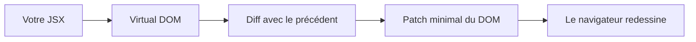
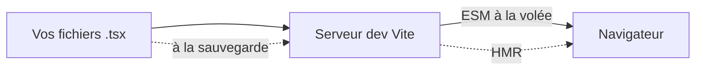
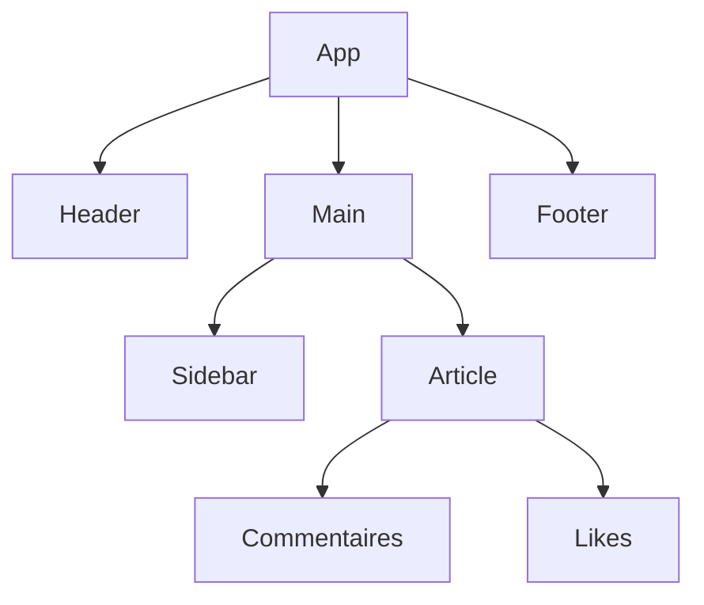
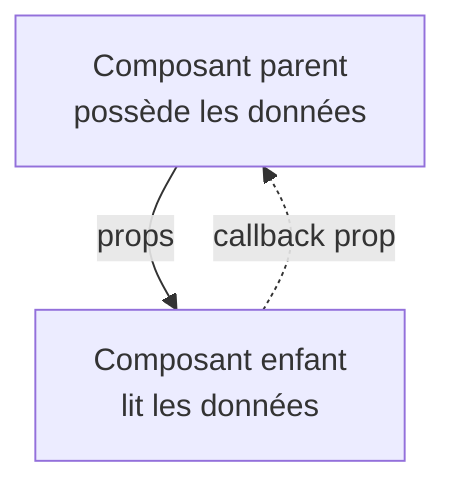
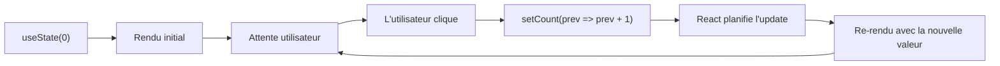
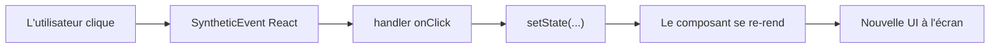
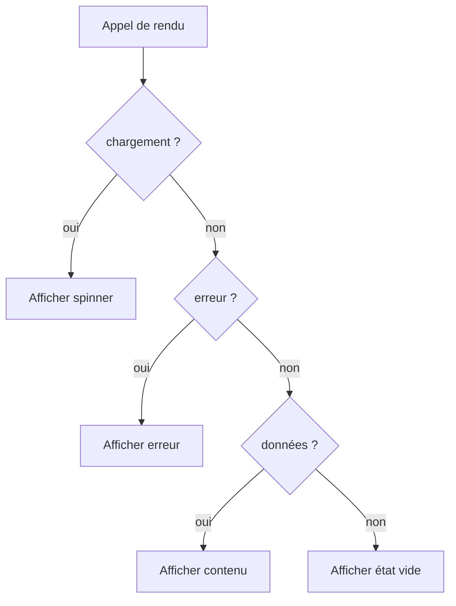
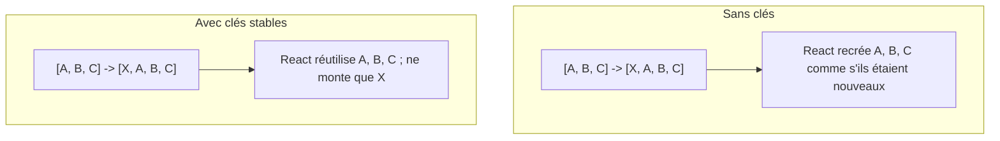
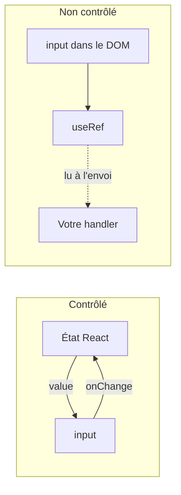

# Fondamentaux de React pour les Développeurs Angular

> Un guide complet pour les développeurs Angular en transition vers React

---

## 1. Understanding React: What It Is and Why It's Used

### Comment React Met à Jour l'Écran



Au lieu de toucher directement au DOM réel (comme avec `document.querySelector` en vanilla JS, ou via la change detection d'Angular), React construit un arbre en mémoire à partir de votre JSX, le compare avec le précédent, et n'écrit dans le navigateur que la différence. C'est ce que signifie « UI déclarative » en pratique.

### Qu'est-ce que React ?

React est une **bibliothèque JavaScript** (et non un framework comme Angular) pour la construction d'interfaces utilisateur, créée par Facebook en 2013. Elle se concentre sur la **couche de vue** de votre application.

**Différence clé avec Angular :**
- **Angular** : framework complet (routage, HTTP, formulaires, etc. intégrés)
- **React** : bibliothèque centrée sur les composants UI (vous choisissez les bibliothèques additionnelles)

### Pourquoi React ?

```
┌─────────────────────────────────────────────────┐
│         Principes Fondamentaux de React          │
├─────────────────────────────────────────────────┤
│  • Architecture basée sur les composants        │
│  • Programmation déclarative                     │
│  • Virtual DOM pour la performance               │
│  • Flux de données unidirectionnel               │
│  • Apprenez une fois, écrivez partout            │
└─────────────────────────────────────────────────┘
```

**Philosophie Angular vs React :**

| Aspect | Angular | React |
|---------|---------|-------|
| Type | Framework opinionné | Bibliothèque flexible |
| Langage | TypeScript (obligatoire) | JavaScript/TypeScript |
| Flux de données | Liaison bidirectionnelle | Liaison unidirectionnelle |
| Courbe d'apprentissage | Plus raide | Plus douce |
| Mises à jour du DOM | DOM réel | Virtual DOM |

---

## 2. Setting Up a React Development Environment

### La Pipeline de Build Moderne



Vite sert vos sources comme modules ES natifs en développement et patche le navigateur à chaque sauvegarde (Hot Module Replacement). Pour la production, il bascule sur un bundler (esbuild/Rollup) afin de produire un artefact minifié et tree-shaké.

### Configurer l'environnement de développement

Pour démarrer avec React, plusieurs options s'offrent à vous pour créer un nouveau projet.

#### Option 1 : Vite (recommandé)

```bash
# Créer un nouveau projet avec Vite
npm create vite@latest mon-app-react -- --template react-ts
cd mon-app-react
npm install
npm run dev
```

#### Pourquoi Vite ?
- Démarrage instantané du serveur de développement
- Hot Module Replacement (HMR) ultra rapide
- Build optimisé pour la production
- Support TypeScript natif

---

## 3. JSX Syntax: The React Template Language

### De JSX à JavaScript

```mermaid
graph LR
    JSX["&lt;Greeting name='Marie' /&gt;"] --> Babel[Babel / Vite]
    Babel --> Call["React.createElement(Greeting, &#123; name: 'Marie' &#125;)"]
    Call --> VNode["Nœud du Virtual DOM"]
```



JSX n'est pas un nouveau langage — c'est du sucre syntaxique. Chaque élément JSX est compilé en un appel `React.createElement`. C'est pour cela que les accolades à l'intérieur de JSX exécutent du vrai JavaScript : vous êtes déjà à l'intérieur d'un appel de fonction.

### Qu'est-ce que JSX ?

JSX (JavaScript XML) est une extension de syntaxe qui vous permet d'écrire du code ressemblant à du HTML directement dans JavaScript.

**Template Angular :**
```typescript
// user.component.html
<div class="user-card">
  <h2>{{ user.name }}</h2>
  <p>Âge : {{ user.age }}</p>
</div>
```

**JSX React :**
```jsx
// UserCard.jsx
const UserCard = ({ user }) => (
  <div className="user-card">
    <h2>{user.name}</h2>
    <p>Âge : {user.age}</p>
  </div>
);
```

### Règles de syntaxe JSX

1. **Un seul élément racine** : chaque composant doit retourner un unique élément racine
2. **className** au lieu de `class` : car `class` est un mot réservé en JS
3. **Expressions entre accolades** : utilisez `{expression}` pour les valeurs dynamiques
4. **camelCase pour les attributs** : `onClick`, `onChange`, `htmlFor`

---

## 4. Components: Building Blocks of React

### Comment se Rend un Arbre de Composants



Une application React est simplement un arbre de composants. Chaque nœud rend ses enfants et les données circulent vers le bas via les props.

### Composants : les blocs de construction de React

En React, tout est un composant. Les composants sont des fonctions qui retournent du JSX.

```tsx
// Composant fonctionnel (approche moderne)
const Salutation = ({ nom }: { nom: string }) => {
  return <h1>Bonjour, {nom} !</h1>;
};
```

---

## 5. Props: Passing Data Between Components

### Les Props Descendent, les Événements Remontent



Les props sont le moyen par lequel un parent transmet les données à ses enfants. Les enfants ne remontent jamais — s'ils doivent dire au parent que quelque chose s'est passé (un clic, un changement de valeur), le parent leur passe une **fonction callback** comme prop. Cette règle à sens unique est le cœur du « flux de données unidirectionnel » de React.

### Props : passer des données entre composants

Les props sont le moyen par lequel React transmet des données des composants parents vers les composants enfants.

```tsx
interface CarteUtilisateurProps {
  nom: string;
  email: string;
  age: number;
}

const CarteUtilisateur = ({ nom, email, age }: CarteUtilisateurProps) => (
  <div>
    <h2>{nom}</h2>
    <p>{email}</p>
    <p>Âge : {age}</p>
  </div>
);
```

---

## 6. State Management with useState Hook

### La Boucle État → Rendu



Le rendu d'un composant n'est qu'un appel de fonction. Appeler le setter de `useState` dit à React : « la prochaine fois que tu appelles ma fonction, donne-moi une valeur différente ». React re-rend alors ce composant (et son sous-arbre), calcule le nouveau Virtual DOM et n'applique que les différences.

### Gestion d'état avec le hook useState

`useState` est le hook fondamental pour gérer l'état local d'un composant.

```tsx
const Compteur = () => {
  const [compteur, setCompteur] = useState(0);

  return (
    <div>
      <p>Compteur : {compteur}</p>
      <button onClick={() => setCompteur(compteur + 1)}>Incrémenter</button>
      <button onClick={() => setCompteur(compteur - 1)}>Décrémenter</button>
    </div>
  );
};
```

---

## 7. Event Handling in React

### Que se Passe-t-il Quand l'Utilisateur Clique



React enveloppe les événements DOM dans un **SyntheticEvent** cross-navigateur et les achemine vers le handler que vous avez écrit dans le JSX. Le handler appelle généralement un setter d'état, qui relance la boucle de rendu — la même boucle que dans la section précédente.

### Gestion des événements en React

La gestion des événements en React est similaire à celle du HTML, avec quelques différences :
- Utilisez le **camelCase** pour les noms d'événements (`onClick` au lieu de `onclick`)
- Passez une **fonction** comme gestionnaire, pas une chaîne de caractères

```tsx
const BoutonAction = ({ texte, onClick }: { texte: string; onClick: () => void }) => (
  <button onClick={onClick}>{texte}</button>
);
```

---

## 8. Conditional Rendering Techniques

### L'Échelle de Priorité



Les vraies UI doivent presque toujours exprimer « si chargement montre A, si erreur montre B, sinon montre C ». En React il n'y a pas de `*ngIf` — vous écrivez simplement la condition en JavaScript avec des retours anticipés, ternaires ou `&&`. L'ordre compte : vérifiez d'abord l'état le plus spécifique.

### Techniques de rendu conditionnel

React offre plusieurs façons de faire du rendu conditionnel :

```tsx
const MessageStatut = ({ chargement, erreur, donnees }) => {
  if (chargement) return <p>Chargement…</p>;
  if (erreur) return <p>Erreur : {erreur}</p>;
  if (donnees) return <p>{donnees}</p>;
  return null;
};
```

---

## 9. Lists and Keys: Rendering Multiple Elements

### Pourquoi les Clés Sont Importantes



Les clés permettent à React de faire correspondre les éléments entre deux rendus. Sans clés, insérer un élément en tête de liste oblige React à reconstruire tous les éléments ; avec des clés stables, il réutilise ceux qui n'ont pas changé et ne monte que le nouveau. Utilisez un identifiant stable issu de vos données — jamais l'index du tableau si la liste peut être réordonnée.

### Listes et clés : afficher plusieurs éléments

Utilisez la méthode `.map()` pour afficher des listes d'éléments. Chaque élément nécessite une prop `key` unique.

```tsx
const ListeTodo = ({ todos }) => (
  <ul>
    {todos.map(todo => (
      <li key={todo.id}>
        {todo.texte} {todo.fait ? '✅' : '⏳'}
      </li>
    ))}
  </ul>
);
```

---

## 10. Forms and Controlled Components

### Contrôlés vs Non Contrôlés — Où Vit la Valeur ?



Dans un input **contrôlé**, la source de vérité est l'état React — chaque frappe passe par `setState`. Dans un input **non contrôlé**, la valeur vit dans le DOM, et vous la lisez depuis une ref quand vous en avez besoin. Le contrôlé est le choix par défaut pour les formulaires avec validation ; le non contrôlé est la porte de sortie pour les flux sensibles à la performance.

### Formulaires et composants contrôlés

En React, les champs de formulaire sont généralement « contrôlés » — leur valeur est pilotée par l'état React.

```tsx
const FormulaireContact = ({ onSubmit }) => {
  const [nom, setNom] = useState('');
  const [email, setEmail] = useState('');

  const gererEnvoi = (e) => {
    e.preventDefault();
    onSubmit({ nom, email });
  };

  return (
    <form onSubmit={gererEnvoi}>
      <input value={nom} onChange={(e) => setNom(e.target.value)} />
      <input value={email} onChange={(e) => setEmail(e.target.value)} />
      <button type="submit">Envoyer</button>
    </form>
  );
};
```

---

## Summary: Key Takeaways for Angular Developers

### Récapitulatif : points clés pour les développeurs Angular

- React est une **bibliothèque**, pas un framework — vous choisissez votre stack
- **JSX** remplace les templates HTML séparés
- Les **composants fonctionnels** avec hooks sont le standard moderne
- Les **props** descendent, les **événements** remontent
- **useState** gère l'état local
- Les **composants contrôlés** gèrent les données de formulaire
