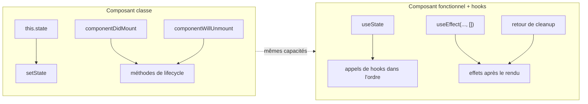
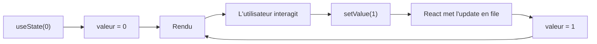
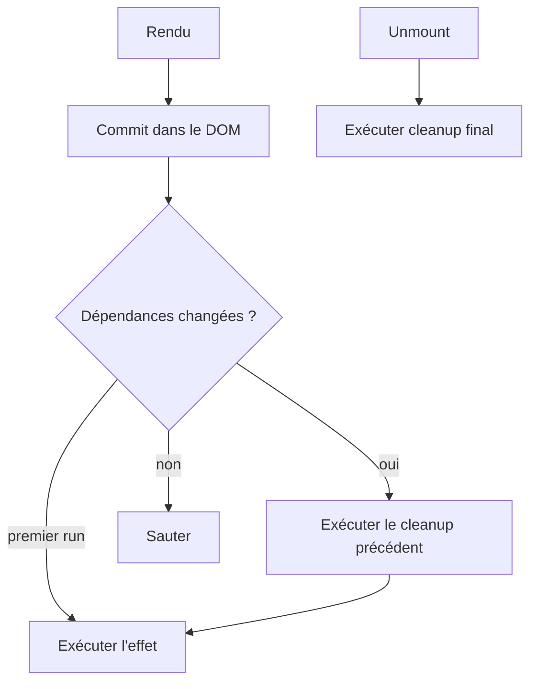
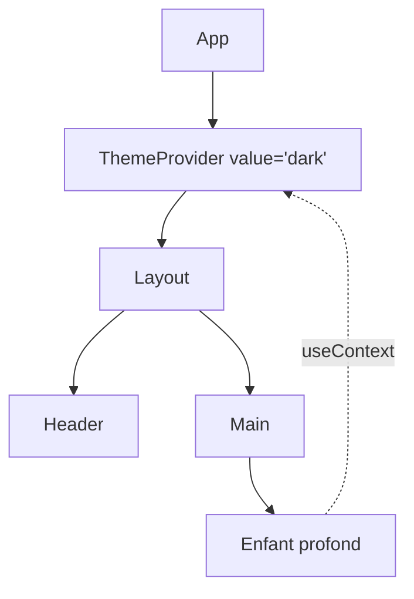
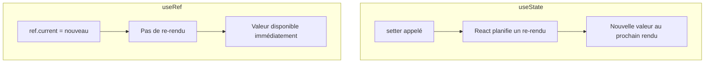
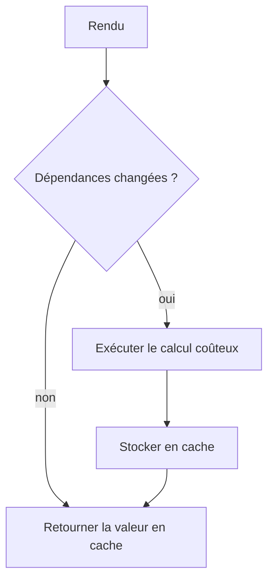
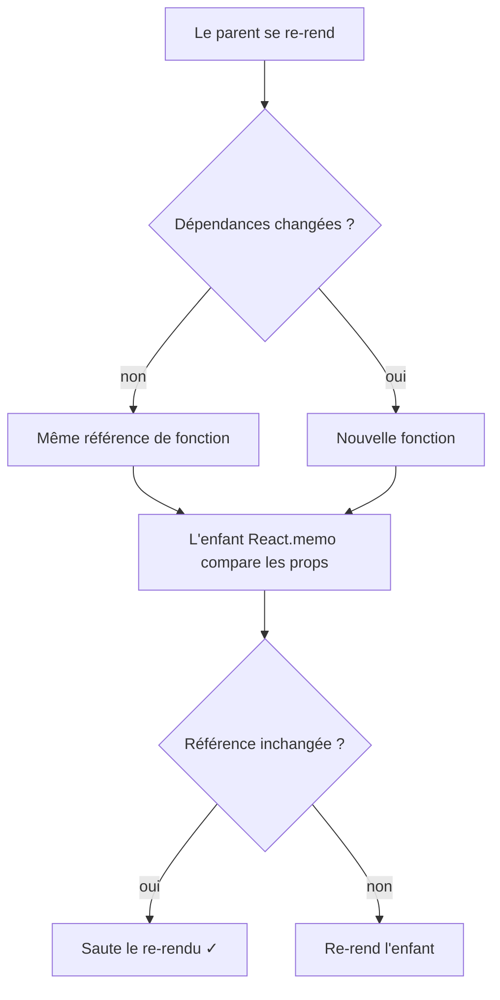
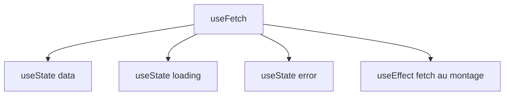
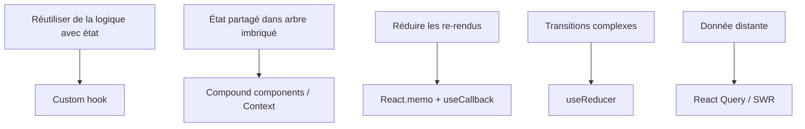

# Hooks React : Approfondissement pour Développeurs Angular

> Un guide complet des hooks React, avec les parallèles au modèle mental Angular

---

## 1. Understanding Hooks: Paradigm and Architecture

### Ce Que les Hooks Remplacent dans les Classes



Les hooks ne sont pas une fonctionnalité ajoutée par-dessus les classes — c'est un mécanisme parallèle qui donne aux composants fonctionnels tout ce que les classes avaient, avec un modèle mental plus simple. Les méthodes de lifecycle s'effondrent en une seule primitive (`useEffect`), et `this.state` devient une variable locale.

### Que sont les hooks ?

Les **hooks** sont des fonctions spéciales introduites dans React 16.8 qui vous permettent de « brancher » l'état et d'autres fonctionnalités React dans des composants fonctionnels. Avant les hooks, un composant de classe était nécessaire.

### Le changement de paradigme

| Classes (ancien) | Hooks (moderne) |
|------------------|-----------------|
| `class extends Component` | `function MyComp() {}` |
| `this.state` | `useState()` |
| `componentDidMount` | `useEffect(..., [])` |
| `componentWillUnmount` | cleanup dans `useEffect` |
| `componentDidUpdate` | `useEffect` avec dépendances |

### Principes fondamentaux

1. **Au niveau supérieur uniquement** : n'appelez pas les hooks à l'intérieur de conditions, de boucles ou de fonctions imbriquées.
2. **Uniquement depuis les composants React** ou d'autres custom hooks.
3. **Ordre stable** : React identifie chaque hook par sa position d'appel.

### Gestion d'état Angular vs React

- **Angular** : état comme propriétés de classe, décorateurs, services injectables.
- **React** : état comme variables locales du composant ou context global.

---

## 2. useState: State Management Fundamentals

### Anatomie d'une Mise à Jour d'État



`useState` ne mute pas la valeur courante : il planifie un nouveau rendu où l'appel `useState` retournera une valeur différente. C'est pourquoi lire l'état immédiatement après avoir appelé le setter renvoie encore l'ancienne valeur — le rendu mis à jour n'a pas encore eu lieu.

### Syntaxe de base

```tsx
const [valeur, setValeur] = useState<number>(0);
```

`useState` retourne une paire : la valeur courante et une fonction pour la mettre à jour.

### Mises à jour fonctionnelles

Quand la nouvelle valeur dépend de la précédente, utilisez la forme fonctionnelle pour éviter les états obsolètes :

```tsx
setCompteur(prev => prev + 1);
```

### Structures complexes

Pour les objets ou tableaux, créez toujours une nouvelle référence (immutabilité) :

```tsx
setUtilisateur(prev => ({ ...prev, email: 'nouveau@example.com' }));
setListe(prev => [...prev, nouvelElement]);
```

### Initialisation paresseuse

Si l'initialisation est coûteuse, passez une fonction :

```tsx
const [etat, setEtat] = useState(() => calculerEtatInitial());
```

### Batching

React 18 regroupe automatiquement plusieurs mises à jour dans le même cycle de rendu, même à l'intérieur de callbacks asynchrones.

---

## 3. useEffect: Side Effects and Lifecycle Orchestration

### Quand un Effet S'Exécute



`useEffect` n'est pas le remplaçant synchrone de `componentDidMount` : il s'exécute **après** que le navigateur a peint. La fonction de cleanup que vous retournez s'exécute avant le prochain effet ou à l'unmount — c'est ce que faisait `componentWillUnmount`, mais en plus composable.

### Concept

`useEffect` exécute du code **après** le commit du rendu. C'est le remplacement de `componentDidMount`, `componentDidUpdate` et `componentWillUnmount`.

### Syntaxe

```tsx
useEffect(() => {
  // effet de bord
  return () => {
    // cleanup (optionnel)
  };
}, [dependances]);
```

### Tableau de dépendances

- `[]` → exécute uniquement au montage
- `[a, b]` → exécute au montage et quand `a` ou `b` changent
- omis → exécute après chaque rendu (rarement ce que vous voulez)

### Pattern de fetching

```tsx
useEffect(() => {
  let annule = false;
  fetch('/api/utilisateurs')
    .then(r => r.json())
    .then(data => { if (!annule) setUtilisateurs(data); });
  return () => { annule = true; };
}, []);
```

### Abonnements et event listeners

Pensez toujours au cleanup pour éviter les fuites de mémoire :

```tsx
useEffect(() => {
  const handler = () => setLargeur(window.innerWidth);
  window.addEventListener('resize', handler);
  return () => window.removeEventListener('resize', handler);
}, []);
```

### Effets multiples

Séparez les responsabilités en plusieurs `useEffect` : un par concern, pas un méga-effet.

---

## 4. useContext: Global State Consumption

### Provider en Haut, Consumers Partout



Un Provider rend une valeur disponible à tout le sous-arbre. N'importe quel composant descendant peut la lire avec `useContext`, sans faire transiter de props par les niveaux intermédiaires. C'est la réponse de React au « prop drilling » pour des données globales comme thème, langue, utilisateur authentifié.

### Architecture du Context API

Le context évite le « prop drilling » en transmettant des données à travers l'arbre sans les passer explicitement à chaque niveau.

```tsx
const ThemeContext = createContext<Theme>('clair');

function App() {
  return (
    <ThemeContext.Provider value="sombre">
      <Page />
    </ThemeContext.Provider>
  );
}

function Page() {
  const theme = useContext(ThemeContext);
  return <div data-theme={theme}>…</div>;
}
```

### Hook personnalisé avec garde

```tsx
function useTheme() {
  const ctx = useContext(ThemeContext);
  if (ctx === undefined) throw new Error('useTheme doit être utilisé dans ThemeProvider');
  return ctx;
}
```

### Optimisation des performances

Chaque composant qui consomme un context se re-rend quand la valeur change. Découpez les contexts par périmètre de mise à jour si la fréquence est élevée.

### Services Angular vs Context React

- **Angular** : services injectés via DI, partage par singleton.
- **React** : providers qui enveloppent le sous-arbre, consommation via `useContext`.

---

## 5. useRef: DOM Manipulation and Value Persistence

### useState vs useRef en Une Slide



Utilisez `useState` quand la valeur doit **apparaître dans l'UI**. Utilisez `useRef` quand vous devez **vous souvenir de quelque chose entre les rendus** sans déclencher un nouveau rendu — références à des nœuds DOM, IDs de timers, valeurs précédentes, verrous de concurrence.

### Concept

`useRef` retourne un objet mutable dont la propriété `.current` persiste entre les rendus sans déclencher de re-rendu.

### Cas d'usage

1. Accéder à des nœuds DOM (focus, scroll, mesures).
2. Stocker des valeurs qui survivent aux rendus sans déclencher de mise à jour.
3. Conserver des IDs de timers, abonnements, valeurs précédentes.

### Exemple : focus

```tsx
const inputRef = useRef<HTMLInputElement>(null);

return (
  <>
    <input ref={inputRef} />
    <button onClick={() => inputRef.current?.focus()}>Focaliser</button>
  </>
);
```

### Valeurs précédentes

```tsx
function usePrecedent<T>(valeur: T) {
  const ref = useRef<T>();
  useEffect(() => { ref.current = valeur; }, [valeur]);
  return ref.current;
}
```

### ViewChild Angular vs useRef React

- **Angular** : `@ViewChild('element') ref!: ElementRef;`
- **React** : `const ref = useRef<HTMLDivElement>(null);` puis `<div ref={ref} />`

---

## 6. useMemo: Computational Memoization

### Cache d'un Calcul Coûteux



`useMemo` mémoïse le **résultat** d'une fonction. Si les dépendances n'ont pas changé, le calcul n'est pas relancé — la valeur précédente est renvoyée. Utile pour filtrages/tris coûteux, mais pas pour des calculs triviaux : le coût de la mémoïsation elle-même n'est pas nul.

### Quand l'utiliser

`useMemo` mémoïse le résultat d'un calcul coûteux, en le recalculant uniquement quand les dépendances changent.

```tsx
const tries = useMemo(
  () => items.slice().sort(comparateurLourd),
  [items]
);
```

### Préserver l'égalité référentielle

Utile pour empêcher les composants mémoïsés via `React.memo` de se re-rendre à cause de nouvelles références à chaque rendu du parent.

### Quand NE PAS l'utiliser

- Pour des calculs peu coûteux.
- Sur des valeurs primitives.
- Comme « premature optimization » sans mesure concrète.

---

## 7. useCallback: Function Memoization

### Pourquoi la Stabilité de la Référence Compte



Chaque rendu crée de nouveaux objets fonction, sauf désactivation explicite. `useCallback` retourne la **même** référence tant que les dépendances n'ont pas changé. Cela ne compte que si la fonction est passée à un enfant enveloppé dans `React.memo` ou utilisée comme dépendance d'un autre hook — pour de simples handlers DOM, `useCallback` n'est qu'un coût sans bénéfice.

### Concept

`useCallback` est un cas particulier de `useMemo` pour mémoïser des fonctions :

```tsx
const onClick = useCallback(() => doSomething(id), [id]);
```

### Quand c'est vraiment nécessaire

- Quand la fonction est passée à un enfant mémoïsé (`React.memo`).
- Quand la fonction est une dépendance d'un autre hook (`useEffect`, `useMemo`).

### Quand ce n'est PAS nécessaire

Si vous passez la fonction simplement à un `<button>` natif, `useCallback` n'apporte rien — il ajoute même de l'overhead.

---

## 8. useReducer: Complex State Logic

### Le Cycle Action → Reducer → State

```mermaid
graph LR
    UI[UI] -->|dispatch(action)| Reducer["reducer(state, action)"]
    Reducer --> NewState[Nouvel état]
    NewState --> Render[Re-rendu]
    Render --> UI
```

`useReducer` est un `useState` « amplifié » : au lieu d'appeler des setters dispersés, vous décrivez les transitions comme des **actions typées**, et un reducer pur produit le nouvel état. C'est le pattern Redux, mais local à un composant — pas de store global, pas de boilerplate.

### Pattern reducer

Pour des états aux transitions complexes, `useReducer` propose une approche prévisible inspirée de Redux :

```tsx
type Action =
  | { type: 'AJOUTER'; texte: string }
  | { type: 'TOGGLE'; id: number }
  | { type: 'SUPPRIMER'; id: number };

function reducer(etat: Todo[], action: Action): Todo[] {
  switch (action.type) {
    case 'AJOUTER': return [...etat, { id: Date.now(), texte: action.texte, fait: false }];
    case 'TOGGLE': return etat.map(t => t.id === action.id ? { ...t, fait: !t.fait } : t);
    case 'SUPPRIMER': return etat.filter(t => t.id !== action.id);
  }
}

const [todos, dispatch] = useReducer(reducer, []);
```

### useReducer + Context

Combinaison classique pour un store global léger sans Redux :

```tsx
const TodoContext = createContext<{ etat: Todo[]; dispatch: Dispatch<Action> } | null>(null);
```

### useState vs useReducer

| Utilisez `useState` quand | Utilisez `useReducer` quand |
|---------------------------|------------------------------|
| État simple | État complexe avec nombreuses transitions |
| Mises à jour indépendantes | Mises à jour corrélées |
| Peu d'actions | Nombreuses actions typées |

### NgRx Angular vs useReducer

Même philosophie : action → reducer pur → nouvel état. `useReducer` est le « NgRx allégé » sans store global.

---

## 9. Custom Hooks: Abstraction and Reusability

### Un Custom Hook est de la Composition



Un custom hook est une fonction qui commence par `use` et compose d'autres hooks. Extrayez de la logique avec état — fetching, abonnements, debounce, localStorage — dans des fonctions réutilisables sans créer de composants ni de HOC.

### Philosophie

Les custom hooks sont le mécanisme principal de réutilisation de logique avec état. Ce sont de simples fonctions commençant par `use` qui peuvent appeler d'autres hooks.

### Convention de nommage

Toujours `useQuelqueChose`. Le préfixe `use` permet à React d'appliquer les règles des hooks.

### Exemple : useToggle

```tsx
function useToggle(initial = false) {
  const [valeur, setValeur] = useState(initial);
  const toggle = useCallback(() => setValeur(v => !v), []);
  return [valeur, toggle] as const;
}
```

### Exemple : useLocalStorage

```tsx
function useLocalStorage<T>(cle: string, initial: T) {
  const [valeur, setValeur] = useState<T>(() => {
    const raw = localStorage.getItem(cle);
    return raw ? JSON.parse(raw) : initial;
  });
  useEffect(() => {
    localStorage.setItem(cle, JSON.stringify(valeur));
  }, [cle, valeur]);
  return [valeur, setValeur] as const;
}
```

### Exemple : useFetch

```tsx
function useFetch<T>(url: string) {
  const [donnees, setDonnees] = useState<T | null>(null);
  const [chargement, setChargement] = useState(true);
  useEffect(() => {
    let annule = false;
    fetch(url).then(r => r.json()).then(d => { if (!annule) setDonnees(d); }).finally(() => { if (!annule) setChargement(false); });
    return () => { annule = true; };
  }, [url]);
  return { donnees, chargement };
}
```

---

## 10. Advanced Patterns and Best Practices

### Quel Outil pour Quel Besoin



Il n'existe pas de hook « meilleur » dans l'absolu. Choisissez selon la forme du problème : état local, partagé, dérivé, asynchrone. Quand une solution devient inconfortable, c'est le signe que vous utilisez la mauvaise abstraction.

### Patterns avancés

- **State reducer pattern** : exposez un reducer depuis le custom hook pour donner le contrôle au consommateur.
- **Compound hooks** : composition de plusieurs hooks primitifs en une API unique.
- **Lazy state init** pour éviter les recalculs coûteux au montage.

### Bonnes pratiques

1. **Gardez les hooks petits et focalisés**.
2. **Dépendances toujours explicites** dans `useEffect`/`useMemo`/`useCallback`.
3. **Cleanup** pour tout abonnement ou effet asynchrone.
4. **Testez les custom hooks** avec `@testing-library/react-hooks` ou `renderHook`.
5. **Documentez les effets de bord** de votre custom hook.

---

## Conclusion: Mastering React Hooks

### Conclusion

Les hooks remplacent la majorité des fonctionnalités des classes par une API plus composable. Pour un développeur Angular, le modèle mental change : au lieu de lifecycle, décorateurs et DI, vous raisonnez en termes de **fonctions composées** qui décrivent l'état et les effets du composant de manière déclarative.
