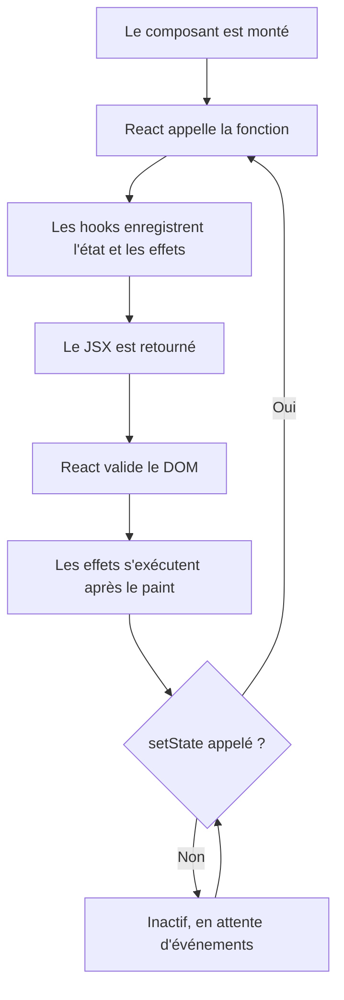
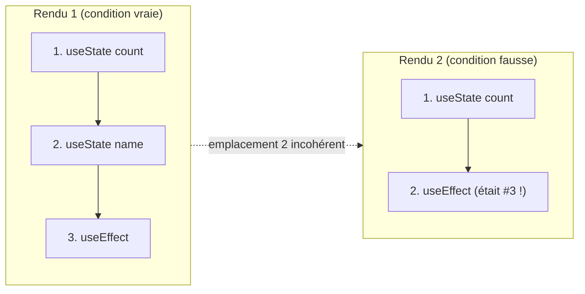
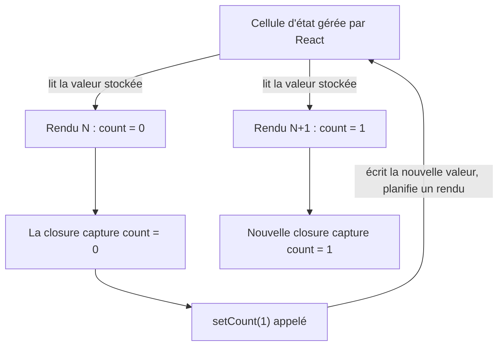
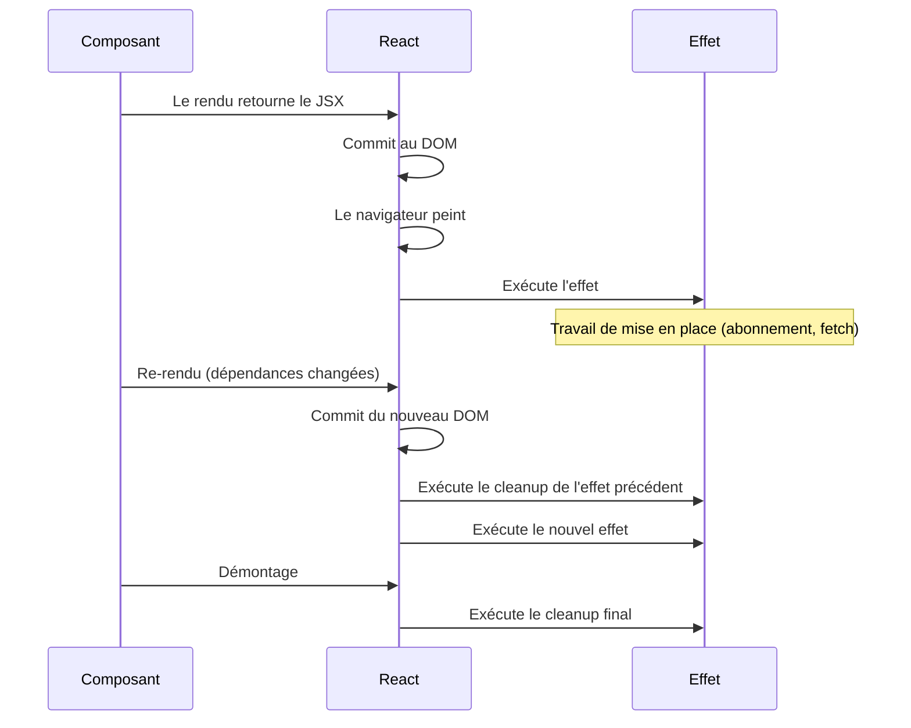
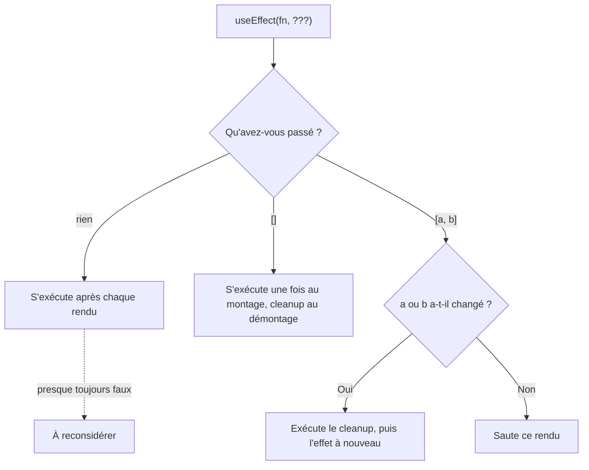
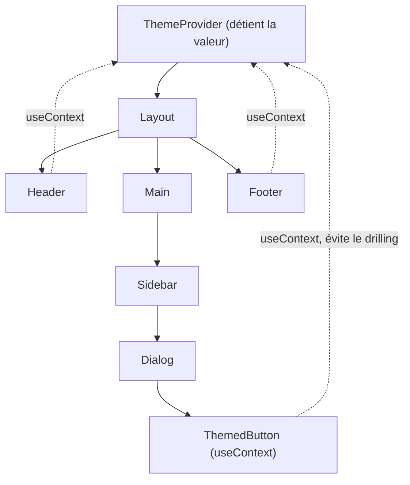
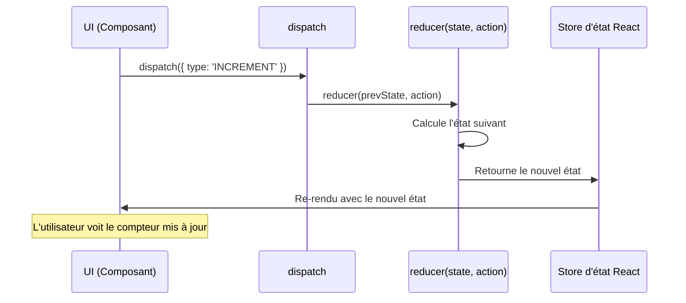
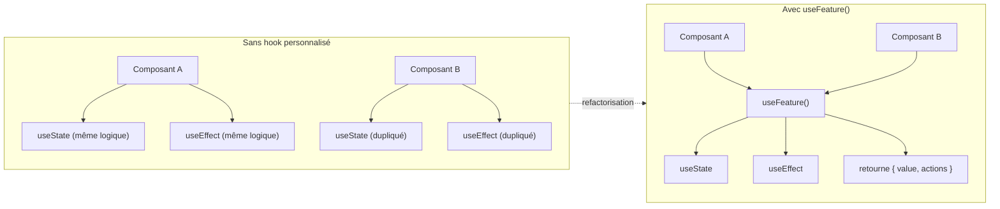
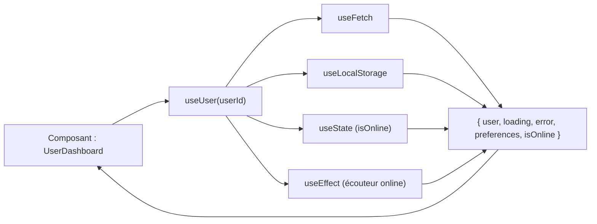

# Hooks React : ajouter état et effets aux composants

> Plongée pratique dans les hooks qui propulsent les composants React modernes : ce que chacun résout, quand y recourir, et les pièges à éviter.

---

## Table des matières

1. [Comprendre les hooks](#1-comprendre-les-hooks)
2. [useState](#2-usestate)
3. [useEffect](#3-useeffect)
4. [useContext](#4-usecontext)
5. [useRef](#5-useref)
6. [useMemo](#6-usememo)
7. [useCallback](#7-usecallback)
8. [useReducer](#8-usereducer)
9. [Hooks personnalisés](#9-hooks-personnalisés)
10. [Patterns avancés](#10-patterns-avancés)

---

## 1. Comprendre les hooks

### Ce que sont les hooks

Dans le module 01 vous avez écrit des composants — des fonctions qui prennent des props et retournent du JSX. Vous avez aussi rencontré votre premier hook, `useState`. Les hooks sont simplement des fonctions, mais ils ont un superpouvoir que les composants du module 01 n'avaient pas : ils permettent à une simple fonction de se souvenir de choses entre les rendus, de réagir aux changements, et d'atteindre le monde extérieur au composant.

Un composant sans hooks est pur : mêmes props en entrée, même JSX en sortie. C'est suffisant pour un bouton ou une carte, mais pas pour quoi que ce soit d'intéressant. Un compteur doit se souvenir de son compte. Un champ de recherche doit récupérer des résultats. Une modale doit donner le focus à son input quand elle s'ouvre. Les hooks sont la façon dont un composant fonction acquiert ces capacités tout en restant une fonction.

Le nom « hook » vient de l'idée que vous vous accrochez aux internes de React — sa boucle de rendu, son stockage d'état, son ordonnancement — depuis l'intérieur d'un appel de fonction par ailleurs ordinaire. React 16.8 les a introduits en 2019, et ils sont depuis la façon par défaut d'écrire des composants.

Le schéma ci-dessous montre où les hooks s'insèrent dans le cycle de rendu. Votre fonction de composant n'est qu'une étape dans une boucle pilotée par React — les hooks sont la façon de vous y brancher.



### Comment les hooks se rattachent à ce que vous connaissez déjà

Si vous avez écrit du JavaScript avant React, les hooks peuvent sembler étranges au début. Une fonction simple en JavaScript repart de zéro à chaque appel. Les variables locales disparaissent dès que la fonction retourne. Alors comment `useState` peut-il « se souvenir » d'une valeur entre les appels ?

L'astuce est que React appelle votre fonction de composant dans un contexte contrôlé. Avant d'appeler votre composant, React regarde quel composant est en train de se rendre, dans quelle case d'appel vous êtes, et lit la valeur qu'il avait stockée la dernière fois. Quand vous appelez `useState(0)`, vous ne créez pas vraiment une nouvelle variable — vous dites à React « donne-moi la valeur que tu as pour moi, et une fonction pour la mettre à jour ». C'est plus proche d'une closure dont React s'occupe pour vous que d'une variable locale normale.

Cela explique la règle unique qui prend tout le monde au piège la première fois.

### Les règles des hooks

Il y a deux règles, et toutes deux découlent de la façon dont React relie chaque valeur à chaque appel :

1. **N'appelez les hooks qu'au plus haut niveau de votre composant.** Jamais à l'intérieur d'un `if`, d'une boucle ou d'une fonction imbriquée. React identifie chaque appel de hook par l'ordre dans lequel il apparaît pendant le rendu. Si vous sautez un appel à un rendu et pas au suivant, chaque hook après lui reçoit la mauvaise valeur.

2. **N'appelez les hooks que depuis des fonctions React.** C'est-à-dire depuis un composant ou depuis un autre hook (qui par convention commence par `use`). Appeler un hook depuis une fonction utilitaire classique ne fonctionne pas, parce que React ne suit pas cet appel.

Le plugin ESLint officiel `eslint-plugin-react-hooks` applique les deux règles. Gardez-le actif.

Pour voir pourquoi la règle d'ordre compte, imaginez deux rendus côte à côte. React identifie chaque hook par sa position dans la séquence d'appels. Sautez un appel à un rendu, et tous les hooks suivants se décalent — ils lisent tous le mauvais emplacement.



```tsx
function Good({ user }) {
  const [count, setCount] = useState(0);          // top level : ok
  const [name, setName] = useState(user.name);    // top level : ok

  if (user.isAdmin) {
    // ...
  }

  return <div>{count}</div>;
}

function Bad({ user }) {
  if (user.isAdmin) {
    const [count, setCount] = useState(0);        // dans un if : pas ok
  }

  for (const item of user.items) {
    const [open, setOpen] = useState(false);      // dans une boucle : pas ok
  }

  return null;
}
```

Les hooks que vous utiliserez au quotidien forment un petit ensemble : `useState`, `useEffect`, `useContext`, `useRef`, `useMemo`, `useCallback` et `useReducer`. Une fois ces sept-là compris, les hooks personnalisés vous permettent de les empaqueter et de les réutiliser.

---

## 2. useState

### Le problème qu'il résout

Vous avez déjà rencontré `useState` dans le module 01, donc cette section est en partie une révision et en partie un regard plus rapproché sur les coins où l'on trébuche.

Un composant est une fonction. À chaque fois que React le rend, la fonction s'exécute depuis le début — chaque variable locale est créée à neuf. C'est très bien pour des composants en lecture seule, mais inutile pour quoi que ce soit qui doit changer dans le temps. Un compteur qui se remet à zéro à chaque rendu n'est pas un compteur.

`useState` résout cela en demandant à React de conserver une valeur pour vous à travers les rendus, et de re-rendre votre composant quand cette valeur change.

### Syntaxe de base

```tsx
import { useState } from 'react';

const [state, setState] = useState(initialValue);
//    |       |              |
//    |       |              +-- État initial, ou une fonction qui le retourne
//    |       +-- Setter : son appel planifie un re-rendu
//    +-- Valeur courante de l'état pour ce rendu
```

La paire que vous récupérez est juste un tableau, déstructuré pour le confort. Le premier élément est la valeur courante pendant ce rendu ; le second est une fonction setter. Appeler le setter fait deux choses : il stocke la nouvelle valeur, et il dit à React de rendre à nouveau le composant. À ce prochain rendu, `useState` vous redonnera la nouvelle valeur.

Point de confusion habituel : le setter ne change pas `state` immédiatement. La variable `state` courante est capturée pour ce rendu. Vous ne verrez la nouvelle valeur qu'au rendu suivant.

Ce schéma montre le modèle mental : React possède la valeur stockée, vous remet un instantané pour le rendu, et reconstruit un nouvel instantané au tour suivant.



```tsx
function Counter() {
  const [count, setCount] = useState(0);

  function handleClick() {
    setCount(count + 1);
    console.log(count); // toujours l'ancienne valeur pendant ce rendu
  }

  return <button onClick={handleClick}>{count}</button>;
}
```

### États primitifs

L'état peut contenir n'importe quelle valeur : nombres, chaînes, booléens, objets, tableaux, voire `null`.

```tsx
function ProfileForm() {
  const [count, setCount] = useState(0);
  const [isActive, setIsActive] = useState(false);
  const [username, setUsername] = useState('');

  const increment = () => setCount(count + 1);
  const toggleActive = () => setIsActive(!isActive);
  const handleInputChange = (event) => setUsername(event.target.value);

  return (
    <div>
      <p>Compteur : {count}</p>
      <button onClick={increment}>Incrémenter</button>
      <p>Statut : {isActive ? 'Actif' : 'Inactif'}</p>
      <button onClick={toggleActive}>Basculer</button>
      <input value={username} onChange={handleInputChange} />
    </div>
  );
}
```

### Mises à jour fonctionnelles

Quand le prochain état dépend de l'état précédent, passez une fonction au setter au lieu d'une valeur. La fonction reçoit le dernier état et retourne le nouveau.

Cela compte parce qu'appeler le setter plusieurs fois d'affilée utilise *le même* `count` capturé à chaque fois :

```tsx
function AdvancedCounter() {
  const [count, setCount] = useState(0);

  // Faux : les deux appels voient la valeur originale de count
  const incrementTwiceWrong = () => {
    setCount(count + 1);
    setCount(count + 1); // utilise toujours le même `count` capturé
  };

  // Bon : chaque appel reçoit le dernier état
  const incrementTwiceCorrect = () => {
    setCount(prev => prev + 1);
    setCount(prev => prev + 1);
  };

  return (
    <div>
      <p>Count : {count}</p>
      <button onClick={incrementTwiceCorrect}>+2</button>
    </div>
  );
}
```

Règle pratique : si le nouvel état est dérivé de l'ancien (un toggle, une incrémentation, un append), utilisez la forme fonctionnelle. Si vous définissez la valeur depuis ailleurs (un événement d'input, une réponse récupérée), passer la valeur directement convient.

### Objets et tableaux

L'état doit être traité comme immuable. Ne mutez jamais un objet ou un tableau directement — créez-en toujours un nouveau. React décide s'il doit re-rendre en comparant la nouvelle référence d'état à l'ancienne avec `Object.is` ; si vous mutez sur place, la référence ne change pas et le composant ne se met pas à jour.

```tsx
function UserProfileManager() {
  const [user, setUser] = useState({
    firstName: 'Marco',
    lastName: 'Rossi',
    age: 28,
    address: {
      city: 'Milano',
      country: 'Italia'
    }
  });

  // Merge superficiel : on spread l'objet précédent, on écrase un champ
  const updateFirstName = (newName) => {
    setUser(prevUser => ({
      ...prevUser,
      firstName: newName
    }));
  };

  // Mise à jour imbriquée : on spread à chaque niveau qu'on veut préserver
  const updateCity = (newCity) => {
    setUser(prevUser => ({
      ...prevUser,
      address: {
        ...prevUser.address,
        city: newCity
      }
    }));
  };

  const [items, setItems] = useState([]);

  const addItem = (item) => {
    setItems(prevItems => [...prevItems, item]);
  };

  const removeItem = (id) => {
    setItems(prevItems => prevItems.filter(item => item.id !== id));
  };

  const updateItem = (id, updates) => {
    setItems(prevItems =>
      prevItems.map(item =>
        item.id === id ? { ...item, ...updates } : item
      )
    );
  };

  return null;
}
```

Boîte à outils standard pour les tableaux : `filter` pour retirer, `map` pour mettre à jour, spread (`[...prev, newItem]`) pour ajouter. Évitez `push`, `splice`, `sort`, `reverse` — ils mutent.

> Si les mises à jour imbriquées deviennent pénibles, c'est un indice qu'il faut découper en plusieurs `useState` ou passer à `useReducer`. La section 8 traite ce dernier.

### Initialisation paresseuse

La valeur initiale que vous passez à `useState` n'est utilisée qu'au premier rendu — mais l'expression est tout de même évaluée à chaque rendu, même si le résultat est jeté. Si son calcul est coûteux, passez une fonction à la place. React l'appellera une fois.

```tsx
function ExpensiveComponent() {
  // Mauvais : computeExpensiveValue() tourne à chaque rendu, résultat jeté
  const [data, setData] = useState(computeExpensiveValue());

  // Bon : la fonction ne tourne qu'au premier rendu
  const [data, setData] = useState(() => computeExpensiveValue());

  return <div>{data}</div>;
}

function computeExpensiveValue() {
  console.log('Calcul de la valeur coûteuse...');
  let result = 0;
  for (let i = 0; i < 1000000; i++) {
    result += Math.random();
  }
  return result;
}
```

Le même schéma s'applique à tout ce qui lit depuis `localStorage` ou parse du JSON au démarrage — enveloppez-le dans une fonction.

### Batching automatique

React 18 regroupe les mises à jour d'état qui ont lieu dans le même événement ou microtask. Si vous appelez plusieurs setters depuis un même gestionnaire d'événement, React les traite ensemble et ne rend qu'une fois, pas une fois par setter.

```tsx
function BatchingExample() {
  const [count, setCount] = useState(0);
  const [flag, setFlag] = useState(false);

  const handleClick = () => {
    setCount(c => c + 1);
    setFlag(f => !f);
    // Un seul re-rendu
  };

  const handleAsyncClick = async () => {
    await fetchData();
    setCount(c => c + 1);
    setFlag(f => !f);
    // Toujours batché en React 18
  };

  console.log('Rendu');

  return <button onClick={handleClick}>Mettre à jour</button>;
}
```

Vous n'avez généralement pas besoin d'y penser — c'est juste là pour rendre les mises à jour réactives. Le seul cas où ça compte, c'est quand vous voulez spécifiquement lire l'état entre les mises à jour, ce qui est rare.

---

## 3. useEffect

### Le problème qu'il résout

Jusqu'ici vos composants sont autonomes : ils prennent des props, contiennent de l'état, retournent du JSX. Mais les vraies applications doivent faire des choses au monde extérieur. Récupérer depuis une API. Démarrer un timer. S'abonner à un WebSocket. Lire la taille de la fenêtre. Mettre à jour le titre du document. Rien de tout cela n'a sa place dans l'expression JSX qui décrit votre UI.

`useEffect` est la façon dont React dit : « voici du code que je veux que tu exécutes *après* avoir commité mon rendu à l'écran ». C'est le pont entre la logique de rendu pure de votre composant et tout ce qui n'est pas pur.

Concrètement, partout où vous écririez ce genre de code en JavaScript pur :

```js
// Au chargement de la page :
window.addEventListener('resize', handleResize);

// Plus tard, quand vous avez fini :
window.removeEventListener('resize', handleResize);
```

…à l'intérieur d'un composant vous l'écrivez comme un `useEffect` avec une fonction de cleanup. Le hook lie automatiquement le setup et le cleanup à la durée de vie du composant.

### Ce qui compte comme un effet de bord

Un effet de bord est tout ce qui échappe au composant :

- Récupérer des données depuis une API
- Lire ou écrire dans `localStorage`, `sessionStorage` ou les cookies
- Mettre en place un `setInterval`, `setTimeout`, `WebSocket` ou `addEventListener`
- Toucher au DOM de manière impérative (mettre le focus à un input, scroller, mesurer)
- Envoyer des événements d'analytics

Si un morceau de code ne fait que calculer une valeur à partir des props et de l'état, ce n'est pas un effet de bord — écrivez-le comme une expression ordinaire dans le corps de votre composant. Ne recourez à `useEffect` que quand quelque chose à l'extérieur du composant doit se produire.

### Syntaxe de base

```tsx
useEffect(() => {
  // S'exécute après que le rendu a été commité au DOM
  return () => {
    // Cleanup optionnel, tourne avant le prochain effet ou quand le composant est démonté
  };
}, [dependencies]);
```

Trois morceaux :

- La **fonction d'effet** s'exécute après chaque rendu où elle est autorisée à s'exécuter.
- La **fonction de cleanup** optionnelle qu'elle retourne s'exécute avant la prochaine exécution de l'effet, et une dernière fois quand le composant est retiré.
- Le **tableau de dépendances** contrôle quand l'effet se ré-exécute.

Le timing compte. Les effets ne s'exécutent pas pendant le rendu — ils s'exécutent après que le navigateur a peint la nouvelle UI. Le cleanup s'exécute avant le prochain effet et de nouveau au démontage.



### Le tableau de dépendances

Le tableau de dépendances est la seule chose la plus importante à bien gérer avec `useEffect`. Il contrôle quand l'effet se ré-exécute.

```tsx
function EffectPatterns() {
  const [count, setCount] = useState(0);
  const [name, setName] = useState('');

  // Aucun tableau : tourne après chaque rendu. Presque toujours faux.
  useEffect(() => {
    console.log('Tourne à chaque rendu');
  });

  // Tableau vide : tourne une fois après le rendu initial. Le cleanup tourne au démontage.
  useEffect(() => {
    console.log('Composant monté');
    return () => console.log('Composant en démontage');
  }, []);

  // Dépendances spécifiques : tourne quand count change (après le premier rendu).
  useEffect(() => {
    console.log('count a changé :', count);
  }, [count]);

  // Plusieurs dépendances : tourne quand l'une ou l'autre change.
  useEffect(() => {
    console.log('count ou name a changé');
  }, [count, name]);

  return <div>Démonstration d'effets</div>;
}
```

La règle : incluez toute valeur du scope du composant que l'effet lit. Si votre effet utilise `userId`, `userId` appartient au tableau. La règle de lint `react-hooks/exhaustive-deps` vous avertira quand vous en manquerez une. Résistez à l'envie de la faire taire en retirant une dépendance — ce chemin mène à des données obsolètes et à des bugs confus.

Voici l'arbre de décision de ce que le tableau de dépendances indique à React :



### Récupération de données

C'est probablement le premier `useEffect` que vous écrirez sérieusement. La forme est toujours : lancer la requête, suivre chargement et erreur, stocker le résultat, et nettoyer si le composant disparaît avant que la requête termine.

```tsx
function DataFetchingComponent() {
  const [data, setData] = useState(null);
  const [loading, setLoading] = useState(true);
  const [error, setError] = useState(null);

  useEffect(() => {
    let isCancelled = false;

    const fetchData = async () => {
      try {
        setLoading(true);
        const response = await fetch('https://api.example.com/data');

        if (!response.ok) {
          throw new Error(`Erreur HTTP ! statut : ${response.status}`);
        }

        const json = await response.json();

        if (!isCancelled) {
          setData(json);
          setError(null);
        }
      } catch (err) {
        if (!isCancelled) {
          setError(err.message);
          setData(null);
        }
      } finally {
        if (!isCancelled) {
          setLoading(false);
        }
      }
    };

    fetchData();

    return () => {
      isCancelled = true;
    };
  }, []);

  if (loading) return <div>Chargement...</div>;
  if (error) return <div>Erreur : {error}</div>;
  return <div>{JSON.stringify(data)}</div>;
}
```

Le drapeau `isCancelled` est important : sans lui, si le composant est démonté pendant que la requête est en cours, l'éventuel appel à `setData` met à jour l'état d'un composant qui n'est plus là, ce qui est au mieux du travail gaspillé et au pire une fuite mémoire. En code de production, vous utiliseriez généralement `AbortController` pour une vraie annulation, mais le pattern du drapeau est la version défensive la plus simple.

### Abonnements

Tout ce qui ouvre un canal et qu'il faut refermer plus tard rentre dans ce schéma : WebSockets, event sources, observers, n'importe quelle bibliothèque tierce qui vous permet de vous abonner.

```tsx
function WebSocketComponent() {
  const [messages, setMessages] = useState([]);

  useEffect(() => {
    const ws = new WebSocket('wss://example.com/socket');

    ws.onopen = () => {
      console.log('WebSocket connecté');
    };

    ws.onmessage = (event) => {
      setMessages(prev => [...prev, event.data]);
    };

    ws.onerror = (error) => {
      console.error('Erreur WebSocket :', error);
    };

    return () => {
      ws.close();
      console.log('WebSocket déconnecté');
    };
  }, []);

  return (
    <div>
      {messages.map((msg, idx) => (
        <p key={idx}>{msg}</p>
      ))}
    </div>
  );
}
```

Si vous oubliez le cleanup, chaque montage ouvre un nouveau socket sans fermer l'ancien. Le cleanup n'est pas du rangement optionnel ; c'est ce qui rend les effets sûrs.

### Écouteurs d'événements

La même forme s'applique aux écouteurs sur `window` ou `document`. Attacher au montage, retirer au démontage.

```tsx
function WindowSizeTracker() {
  const [windowSize, setWindowSize] = useState({
    width: window.innerWidth,
    height: window.innerHeight
  });

  useEffect(() => {
    const handleResize = () => {
      setWindowSize({
        width: window.innerWidth,
        height: window.innerHeight
      });
    };

    window.addEventListener('resize', handleResize);

    return () => {
      window.removeEventListener('resize', handleResize);
    };
  }, []);

  return (
    <div>
      Fenêtre : {windowSize.width} x {windowSize.height}
    </div>
  );
}
```

Remarquez que la fonction de cleanup passe la *même* référence `handleResize` à `removeEventListener` que celle passée à `addEventListener`. Le scope de closure rend cela automatique — c'est la fonction définie à l'intérieur de l'effet.

### Découper les effets

Un composant peut avoir plusieurs appels `useEffect`. Utilisez-les. Chaque effet doit faire une seule chose, avec un seul tableau de dépendances. Entasser une logique sans rapport dans un seul effet rend le tableau de dépendances plus long et plus bruyant qu'il ne devrait l'être.

```tsx
function UserDashboard({ userId }) {
  const [user, setUser] = useState(null);
  const [posts, setPosts] = useState([]);

  // Récupérer les données utilisateur
  useEffect(() => {
    let isCancelled = false;

    fetch(`/api/users/${userId}`)
      .then(res => res.json())
      .then(data => !isCancelled && setUser(data));

    return () => { isCancelled = true; };
  }, [userId]);

  // Récupérer les posts de l'utilisateur
  useEffect(() => {
    let isCancelled = false;

    fetch(`/api/users/${userId}/posts`)
      .then(res => res.json())
      .then(data => !isCancelled && setPosts(data));

    return () => { isCancelled = true; };
  }, [userId]);

  // Mettre à jour le titre du document quand l'utilisateur change
  useEffect(() => {
    if (user) {
      document.title = `Profil de ${user.name}`;
    }
  }, [user]);

  // Tracker l'analytics chaque fois qu'on visualise un nouvel utilisateur
  useEffect(() => {
    analytics.track('profile_viewed', { userId });
  }, [userId]);

  return <div>{/* JSX */}</div>;
}
```

Quatre petits effets sont plus faciles à lire et à raisonner qu'un gros avec quatre préoccupations emmêlées.

### Quand les effets s'exécutent

Pour les curieux : un effet s'exécute après que React a commité le nouveau rendu au DOM et que le navigateur a peint. Cet ordre compte. Cela veut dire que l'utilisateur voit l'UI mise à jour avant que votre effet ne se déclenche. Si votre effet provoque une autre mise à jour d'état, le cycle se répète : rendu, commit, paint, exécution de l'effet, possible setState, rendu à nouveau. La fonction de cleanup tourne au début du prochain cycle (ou au démontage), avant le nouvel effet.

Il existe un hook apparenté appelé `useLayoutEffect` qui tourne de manière synchrone après la mutation du DOM mais avant le paint — utile pour mesurer une mise en page ou faire des changements que l'utilisateur ne devrait pas voir flasher. Vous en aurez rarement besoin. Reprenez `useEffect` par défaut.

### Effets conditionnels

Parfois vous voulez un effet qui ne tourne que quand une condition est remplie. Ne mettez pas l'appel `useEffect` lui-même à l'intérieur d'un `if` — cela viole les règles des hooks. Mettez la condition à l'intérieur du corps de l'effet.

```tsx
function ConditionalEffectComponent({ shouldFetch, userId }) {
  const [data, setData] = useState(null);

  useEffect(() => {
    if (!shouldFetch) return;

    let isCancelled = false;

    const fetchData = async () => {
      const response = await fetch(`/api/users/${userId}`);
      const json = await response.json();
      if (!isCancelled) setData(json);
    };

    fetchData();

    return () => { isCancelled = true; };
  }, [shouldFetch, userId]);

  return <div>{data && data.name}</div>;
}
```

Le hook tourne quand même à chaque rendu, mais le `return` anticipé rend le corps inopérant quand il ne devrait rien faire.

---

## 4. useContext

### Le problème qu'il résout

Les props sont la manière dont vous passez des données un niveau plus bas. Mais qu'en est-il si une valeur est nécessaire dix niveaux plus profond, par un bouton enfoui à l'intérieur d'une dialog à l'intérieur d'une sidebar à l'intérieur d'un layout ? Vous pourriez la faire passer à travers chaque composant intermédiaire — passer `theme` à `Layout`, qui le passe à `Sidebar`, qui le passe à `Dialog`, qui le passe à `Button`. C'est ce qu'on appelle le *prop drilling*, et c'est fastidieux à écrire et bruyant à lire.

`useContext` permet à un enfant profond de lire une valeur qu'un ancêtre a fournie, sans que rien entre eux n'ait à le savoir. Les usages classiques sont les choses qui semblent globales : l'utilisateur courant, le thème courant, la locale courante, un système de notifications.

### Créer un contexte

Il y a trois pièces : un objet contexte, un provider qui fournit une valeur, et un hook qui la consomme.

```tsx
import { createContext, useContext, useState } from 'react';

// 1. Créer un contexte. L'argument est la valeur par défaut quand il n'y a pas de Provider au-dessus.
const ThemeContext = createContext({
  theme: 'light',
  toggleTheme: () => {}
});

// 2. Un composant Provider qui possède l'état et l'expose via le contexte.
const ThemeProvider = ({ children }) => {
  const [theme, setTheme] = useState('light');

  const toggleTheme = () => {
    setTheme(prevTheme => prevTheme === 'light' ? 'dark' : 'light');
  };

  const contextValue = {
    theme,
    toggleTheme
  };

  return (
    <ThemeContext.Provider value={contextValue}>
      {children}
    </ThemeContext.Provider>
  );
};

// 3. Un hook personnalisé qui lit depuis le contexte, avec une erreur claire en cas de mauvais usage.
const useTheme = () => {
  const context = useContext(ThemeContext);

  if (context === undefined) {
    throw new Error('useTheme doit être utilisé dans un ThemeProvider');
  }

  return context;
};

// 4. N'importe quel descendant peut lire la valeur sans prop drilling.
const ThemedButton = () => {
  const { theme, toggleTheme } = useTheme();

  return (
    <button
      style={{
        background: theme === 'light' ? '#fff' : '#333',
        color: theme === 'light' ? '#000' : '#fff'
      }}
      onClick={toggleTheme}
    >
      Basculer le thème
    </button>
  );
};

const App = () => {
  return (
    <ThemeProvider>
      <div>
        <Header />
        <ThemedButton />
        <Footer />
      </div>
    </ThemeProvider>
  );
};
```

Envelopper l'appel brut `useContext(ThemeContext)` dans un hook personnalisé `useTheme` est une petite habitude utile. Elle centralise la vérification « est-ce utilisé dans un Provider ? », et offre aux consommateurs un import propre.

Visuellement, le Provider se trouve au-dessus de l'arbre, et n'importe quel descendant — peu importe sa profondeur — peut atteindre la valeur directement, sans que les composants intermédiaires aient à la transmettre en prop.



### Un exemple plus gros : l'authentification

L'auth est l'un des contextes les plus courants. Le provider conserve l'utilisateur, expose login et logout, et n'importe quel composant n'importe où dans l'arbre peut demander « y a-t-il quelqu'un de connecté, et si oui qui ? ».

```tsx
const AuthContext = createContext();

const AuthProvider = ({ children }) => {
  const [user, setUser] = useState(null);
  const [loading, setLoading] = useState(true);

  useEffect(() => {
    const initAuth = async () => {
      try {
        const token = localStorage.getItem('authToken');
        if (token) {
          const response = await fetch('/api/auth/verify', {
            headers: { Authorization: `Bearer ${token}` }
          });
          const userData = await response.json();
          setUser(userData);
        }
      } catch (error) {
        console.error('Initialisation auth échouée :', error);
      } finally {
        setLoading(false);
      }
    };

    initAuth();
  }, []);

  const login = async (credentials) => {
    const response = await fetch('/api/auth/login', {
      method: 'POST',
      headers: { 'Content-Type': 'application/json' },
      body: JSON.stringify(credentials)
    });

    const { user, token } = await response.json();
    localStorage.setItem('authToken', token);
    setUser(user);
  };

  const logout = () => {
    localStorage.removeItem('authToken');
    setUser(null);
  };

  const value = {
    user,
    loading,
    login,
    logout,
    isAuthenticated: !!user
  };

  return (
    <AuthContext.Provider value={value}>
      {children}
    </AuthContext.Provider>
  );
};

const useAuth = () => {
  const context = useContext(AuthContext);
  if (!context) {
    throw new Error('useAuth doit être utilisé dans un AuthProvider');
  }
  return context;
};

const LoginPage = () => {
  const { login } = useAuth();

  const handleSubmit = async (e) => {
    e.preventDefault();
    await login({ email, password });
  };

  return <form onSubmit={handleSubmit}>{/* Champs du formulaire */}</form>;
};

const ProtectedRoute = ({ children }) => {
  const { isAuthenticated, loading } = useAuth();

  if (loading) return <div>Chargement...</div>;
  if (!isAuthenticated) return <Navigate to="/login" />;

  return children;
};
```

### Composer plusieurs contextes

Il est normal d'avoir plusieurs providers qui enveloppent l'application. L'ordre n'a généralement pas d'importance tant que chaque contexte est au-dessus de ses consommateurs.

```tsx
const App = () => {
  return (
    <AuthProvider>
      <ThemeProvider>
        <LanguageProvider>
          <NotificationProvider>
            <Router>
              <Routes />
            </Router>
          </NotificationProvider>
        </LanguageProvider>
      </ThemeProvider>
    </AuthProvider>
  );
};

const Dashboard = () => {
  const { user } = useAuth();
  const { theme } = useTheme();
  const { language } = useLanguage();
  const { showNotification } = useNotification();

  return <div>{/* Utiliser tous les contextes */}</div>;
};
```

Si l'imbrication devient inconfortable, extrayez-la dans un seul composant `AppProviders`. L'arbre des providers n'a pas besoin de vivre dans `App` lui-même.

### Contexte et re-rendus

Chaque composant qui lit un contexte se re-rend chaque fois que la valeur du contexte change. C'est très bien jusqu'à ce que votre provider renvoie un nouvel objet à chaque rendu — alors chaque consommateur se re-rend à chaque rendu du parent, même si rien de ce qui les intéresse n'a réellement changé.

Le correctif a deux variantes. La première est de mémoïser l'objet de valeur pour que la référence soit stable. La seconde est de découper un contexte chargé en plus petits, pour que les mises à jour d'une tranche ne réveillent pas les consommateurs d'une autre.

```tsx
const UserContext = createContext();

// Problème : un nouvel objet à chaque rendu
const UserProvider = ({ children }) => {
  const [user, setUser] = useState(null);
  const [preferences, setPreferences] = useState({});

  const value = { user, setUser, preferences, setPreferences };

  return (
    <UserContext.Provider value={value}>
      {children}
    </UserContext.Provider>
  );
};

// Correctif 1 : useMemo donne une référence stable jusqu'à ce que les entrées changent
const UserProvider = ({ children }) => {
  const [user, setUser] = useState(null);
  const [preferences, setPreferences] = useState({});

  const value = useMemo(
    () => ({ user, setUser, preferences, setPreferences }),
    [user, preferences]
  );

  return (
    <UserContext.Provider value={value}>
      {children}
    </UserContext.Provider>
  );
};

// Correctif 2 : découper en deux contextes pour que les consommateurs ne s'abonnent qu'à ce dont ils ont besoin
const UserContext = createContext();
const PreferencesContext = createContext();

const CombinedProvider = ({ children }) => {
  const [user, setUser] = useState(null);
  const [preferences, setPreferences] = useState({});

  return (
    <UserContext.Provider value={{ user, setUser }}>
      <PreferencesContext.Provider value={{ preferences, setPreferences }}>
        {children}
      </PreferencesContext.Provider>
    </UserContext.Provider>
  );
};
```

> Ne commencez pas par ces optimisations. Construisez d'abord la version simple. Ne recourez à `useMemo` ou au découpage de contexte que lorsque vous mesurez un vrai problème de performance.

---

## 5. useRef

### Le problème qu'il résout

Deux situations apparaissent que `useState` ne peut pas résoudre proprement.

La première est d'atteindre un vrai élément du DOM. React possède le DOM la plupart du temps, mais parfois vous devez appeler une méthode impérative sur un élément directement : `input.focus()`, `video.play()`, `dialog.showModal()`. Il vous faut un handle vers le nœud, et il vous le faut sur le même nœud à travers les rendus.

La seconde est de conserver une valeur qui doit persister entre les rendus mais qui ne doit *pas* provoquer de re-rendu quand elle change. Pensez à un id de `setInterval` que vous voudrez peut-être annuler plus tard, ou à un drapeau qui dit « la dernière chose que j'ai faite était X ». Mettre cela dans l'état rerendrait le composant à chaque changement, sans bénéfice pour l'UI.

`useRef` résout les deux avec une seule astuce : il retourne un objet simple `{ current: ... }` dont React conserve la même instance à travers les rendus. Muter `.current` n'est qu'une affectation JavaScript — pas de re-rendu, pas de sémantique spéciale. Quand vous passez cette ref au JSX via `ref={myRef}`, React met `.current` au nœud DOM après le montage.

### Référence DOM

L'usage le plus courant de `useRef` : obtenir un handle vers un input pour pouvoir le focaliser.

```tsx
function FocusInput() {
  const inputRef = useRef(null);

  const handleFocus = () => {
    inputRef.current.focus();
  };

  return (
    <div>
      <input ref={inputRef} type="text" />
      <button onClick={handleFocus}>Focus Input</button>
    </div>
  );
}
```

La valeur initiale `null` est ce que `inputRef.current` contient avant que React n'ait attaché l'input. Après le premier rendu, React met `.current` à l'élément input, et votre handler de clic peut appeler `.focus()` dessus.

### useRef vs useState

Les deux paraissent proches mais se comportent très différemment :

- `useState` déclenche un re-rendu quand vous le mettez à jour. La valeur est lue depuis le store que React maintient pour vous.
- `useRef` ne déclenche rien. `ref.current` n'est qu'une propriété d'un objet. Lisez-la, écrivez-la, React s'en moque.

```tsx
function RefVsState() {
  const [stateCount, setStateCount] = useState(0);
  const refCount = useRef(0);

  const incrementState = () => {
    setStateCount(prev => prev + 1); // déclenche un re-rendu
  };

  const incrementRef = () => {
    refCount.current += 1; // pas de re-rendu
    console.log('Ref count :', refCount.current);
  };

  console.log('Composant rendu');

  return (
    <div>
      <p>State Count : {stateCount}</p>
      <p>Ref Count : {refCount.current}</p>
      <button onClick={incrementState}>Incrémenter state</button>
      <button onClick={incrementRef}>Incrémenter ref</button>
    </div>
  );
}
```

Notez que cliquer sur « Incrémenter ref » met à jour `refCount.current` mais que la ligne `<p>Ref Count : {refCount.current}</p>` à l'écran ne *change pas*. Le composant ne se re-rend pas, donc le JSX n'est pas recalculé. Les refs ne sont pas réactives. Si vous voulez que l'UI reflète une valeur, cette valeur appartient à l'état.

### Se souvenir de la valeur précédente

Un joli petit hook personnalisé combinant `useRef` et `useEffect` : capturer la valeur du dernier rendu, pour pouvoir la comparer à la courante.

```tsx
function usePrevious(value) {
  const ref = useRef();

  useEffect(() => {
    ref.current = value;
  }, [value]);

  return ref.current;
}

function CounterWithPrevious() {
  const [count, setCount] = useState(0);
  const previousCount = usePrevious(count);

  return (
    <div>
      <p>Courant : {count}</p>
      <p>Précédent : {previousCount}</p>
      <button onClick={() => setCount(count + 1)}>Incrémenter</button>
    </div>
  );
}
```

L'effet tourne après le rendu, donc pendant le rendu `ref.current` contient encore l'ancienne valeur — exactement le « précédent » que vous voulez.

### Stocker des IDs de timer

`setInterval` retourne un id dont vous aurez besoin plus tard pour annuler. Le stocker dans une ref est le pattern standard : l'id ne fait pas partie de l'UI, mais il doit survivre entre les rendus.

```tsx
function IntervalComponent() {
  const [seconds, setSeconds] = useState(0);
  const intervalRef = useRef(null);

  const startTimer = () => {
    if (intervalRef.current) return; // déjà en route

    intervalRef.current = setInterval(() => {
      setSeconds(prev => prev + 1);
    }, 1000);
  };

  const stopTimer = () => {
    if (intervalRef.current) {
      clearInterval(intervalRef.current);
      intervalRef.current = null;
    }
  };

  const resetTimer = () => {
    stopTimer();
    setSeconds(0);
  };

  useEffect(() => {
    return () => stopTimer();
  }, []);

  return (
    <div>
      <p>Écoulé : {seconds}s</p>
      <button onClick={startTimer}>Démarrer</button>
      <button onClick={stopTimer}>Arrêter</button>
      <button onClick={resetTimer}>Réinitialiser</button>
    </div>
  );
}
```

### Travailler avec un canvas

Un cas typique où vous avez besoin à la fois d'une ref DOM et d'une « valeur non réactive qui vit à travers les rendus » : obtenir un contexte 2D depuis un canvas et y dessiner.

```tsx
function CanvasDrawing() {
  const canvasRef = useRef(null);
  const contextRef = useRef(null);

  useEffect(() => {
    const canvas = canvasRef.current;
    canvas.width = 800;
    canvas.height = 600;

    const context = canvas.getContext('2d');
    context.lineCap = 'round';
    context.strokeStyle = 'black';
    context.lineWidth = 2;
    contextRef.current = context;
  }, []);

  const startDrawing = (e) => {
    const { offsetX, offsetY } = e.nativeEvent;
    contextRef.current.beginPath();
    contextRef.current.moveTo(offsetX, offsetY);
  };

  const draw = (e) => {
    if (e.buttons !== 1) return;

    const { offsetX, offsetY } = e.nativeEvent;
    contextRef.current.lineTo(offsetX, offsetY);
    contextRef.current.stroke();
  };

  return (
    <canvas
      ref={canvasRef}
      onMouseDown={startDrawing}
      onMouseMove={draw}
      style={{ border: '1px solid black' }}
    />
  );
}
```

### Exposer des méthodes au parent : forwardRef et useImperativeHandle

Par défaut, une `ref` que vous mettez sur un composant personnalisé ne vous donne pas le nœud DOM — les composants ne sont pas des éléments DOM. Si vous voulez forwarder une ref vers un élément interne d'un enfant, ou exposer un petit ensemble de méthodes, vous enveloppez l'enfant dans `forwardRef` et utilisez `useImperativeHandle` pour déclarer ce que le parent peut appeler.

```tsx
import { forwardRef, useRef, useImperativeHandle } from 'react';

const CustomInput = forwardRef((props, ref) => {
  const inputRef = useRef();

  useImperativeHandle(ref, () => ({
    focus: () => {
      inputRef.current.focus();
    },
    getValue: () => {
      return inputRef.current.value;
    },
    reset: () => {
      inputRef.current.value = '';
    }
  }));

  return <input ref={inputRef} {...props} />;
});

function FormWithCustomInput() {
  const customInputRef = useRef();

  const handleSubmit = () => {
    const value = customInputRef.current.getValue();
    console.log('Valeur :', value);
    customInputRef.current.reset();
  };

  return (
    <div>
      <CustomInput ref={customInputRef} />
      <button onClick={handleSubmit}>Soumettre</button>
      <button onClick={() => customInputRef.current.focus()}>
        Focus Input
      </button>
    </div>
  );
}
```

Utilisez cela avec parcimonie. Les API impératives entre composants luttent contre le modèle déclaratif de React. La plupart du temps, vous devriez pouvoir exprimer ce que vous voulez avec des props et de l'état.

> En React 19, les composants fonctions classiques acceptent directement `ref` comme une prop et `forwardRef` n'est plus nécessaire. Le pattern ci-dessus fonctionne toujours et c'est ce à quoi ressemblent la plupart des codebases sur les versions antérieures.

---

## 6. useMemo

### Le problème qu'il résout

Un composant se rend en exécutant son corps de haut en bas. Chaque expression tourne à chaque rendu — c'est très bien pour des choses peu coûteuses comme `count + 1`, mais cher si vous triez un tableau de 5000 lignes ou lancez un calcul non trivial dérivé des props.

`useMemo` met en cache une valeur calculée. Vous lui donnez une fonction et une liste de dépendances. Au premier rendu il exécute la fonction et retient le résultat. Aux rendus suivants il vérifie les dépendances : si aucune n'a changé, il retourne le résultat en cache sans relancer la fonction.

Ce n'est qu'un indice de performance, rien de plus. Retirez chaque `useMemo` d'une app qui fonctionne et l'app fonctionne encore — juste peut-être plus lentement par endroits.

### Syntaxe de base

```tsx
const memoizedValue = useMemo(
  () => computeExpensiveValue(a, b),
  [a, b]
);
```

La fonction du premier argument doit être bon marché à appeler du point de vue de React — elle tourne juste de manière synchrone et retourne une valeur. Le tableau de dépendances fonctionne exactement comme celui de `useEffect` : listez tout ce que la fonction lit depuis le scope environnant.

### Un calcul coûteux

Une forme courante : vous dérivez une liste filtrée et traitée depuis des props.

```tsx
function ExpensiveComponent({ items, filter }) {
  // Sans useMemo : tourne à chaque rendu, même ceux qui n'ont pas touché à items
  const filteredItemsBad = items
    .filter(item => item.category === filter)
    .map(item => ({
      ...item,
      processed: heavyProcessing(item)
    }));

  // Avec useMemo : ne tourne que quand items ou filter change
  const filteredItems = useMemo(() => {
    console.log('Filtrage et traitement...');
    return items
      .filter(item => item.category === filter)
      .map(item => ({
        ...item,
        processed: heavyProcessing(item)
      }));
  }, [items, filter]);

  return (
    <ul>
      {filteredItems.map(item => (
        <li key={item.id}>{item.name}</li>
      ))}
    </ul>
  );
}

function heavyProcessing(item) {
  let result = 0;
  for (let i = 0; i < 1000000; i++) {
    result += Math.sqrt(i);
  }
  return result;
}
```

### Trier sans muter

Le tri est un candidat classique pour `useMemo`, à la fois parce que `Array.prototype.sort` est non trivial et parce qu'il ne faut pas muter le tableau d'entrée.

```tsx
function SortableTable({ data, sortKey, sortOrder }) {
  const sortedData = useMemo(() => {
    const sorted = [...data].sort((a, b) => {
      if (a[sortKey] < b[sortKey]) return sortOrder === 'asc' ? -1 : 1;
      if (a[sortKey] > b[sortKey]) return sortOrder === 'asc' ? 1 : -1;
      return 0;
    });
    return sorted;
  }, [data, sortKey, sortOrder]);

  return (
    <table>
      <tbody>
        {sortedData.map(row => (
          <tr key={row.id}>
            <td>{row.name}</td>
            <td>{row.value}</td>
          </tr>
        ))}
      </tbody>
    </table>
  );
}
```

La copie `[...data]` est importante : `.sort()` mute le tableau sur lequel il est appelé, et muter une prop est l'un des bugs les plus faciles à introduire dans React.

### Références stables

Il y a un second usage de `useMemo` au-delà des calculs coûteux : conserver la même référence d'objet ou de tableau à travers les rendus. C'est important quand vous passez un objet comme prop à un enfant enveloppé dans `React.memo`, parce que `React.memo` fait une comparaison superficielle — un objet fraîchement construit paraît différent même si son contenu est identique.

```tsx
function ParentComponent() {
  const [count, setCount] = useState(0);
  const [otherState, setOtherState] = useState(0);

  // Un nouvel objet à chaque rendu : ChildComponent se re-rend même quand il ne devrait pas
  const configBad = {
    apiUrl: 'https://api.example.com',
    timeout: 5000
  };

  // Référence stable : même objet à travers les rendus
  const config = useMemo(() => ({
    apiUrl: 'https://api.example.com',
    timeout: 5000
  }), []);

  return <ChildComponent config={config} />;
}

const ChildComponent = React.memo(({ config }) => {
  console.log('Enfant rendu');
  return <div>Enfant</div>;
});
```

### État dérivé d'une liste

Un pattern utile : calculer des statistiques agrégées depuis une collection seulement quand la collection elle-même change.

```tsx
function DataAnalytics({ transactions }) {
  const analytics = useMemo(() => {
    const total = transactions.reduce((sum, t) => sum + t.amount, 0);
    const average = total / transactions.length;
    const max = Math.max(...transactions.map(t => t.amount));
    const min = Math.min(...transactions.map(t => t.amount));

    const categoryTotals = transactions.reduce((acc, t) => {
      acc[t.category] = (acc[t.category] || 0) + t.amount;
      return acc;
    }, {});

    return {
      total,
      average,
      max,
      min,
      categoryTotals,
      count: transactions.length
    };
  }, [transactions]);

  return (
    <div>
      <p>Total : ${analytics.total}</p>
      <p>Moyenne : ${analytics.average.toFixed(2)}</p>
      <p>Max : ${analytics.max}</p>
      <p>Min : ${analytics.min}</p>
      <p>Transactions : {analytics.count}</p>
    </div>
  );
}
```

### Quand ne pas utiliser useMemo

`useMemo` n'est pas gratuit. Il coûte la comparaison du tableau de dépendances et la maintenance de la valeur en cache. Pour des calculs peu coûteux, le surcoût est plus grand que le travail que vous avez économisé.

```tsx
// Excessif : une addition est plus rapide que la machinerie useMemo
function ComponentA({ a, b }) {
  const sum = useMemo(() => a + b, [a, b]);
  return <div>{sum}</div>;
}

// Calculez simplement
function ComponentB({ a, b }) {
  const sum = a + b;
  return <div>{sum}</div>;
}

// Contre-productif : le tableau de dépendances contient un tableau fraîchement construit à chaque rendu,
// donc useMemo ne touche jamais son cache.
function ComponentC({ data }) {
  const processed = useMemo(
    () => processData(data),
    [data.filter(x => x.active)]
  );
  return <div>{processed}</div>;
}
```

Règle pratique : ne recourez pas à `useMemo` tant que vous n'avez pas un problème mesuré. L'onglet Performance du navigateur et le Profiler de React DevTools vous diront où le temps part. Mémoïser la chose lente est bien meilleur que mémoïser tout et ralentir un peu l'app entière.

### Mesurer

Si vous voulez confirmer qu'un `useMemo` fait réellement du travail, loggez les timings à l'intérieur.

```tsx
function MeasuredComponent({ items }) {
  const expensiveResult = useMemo(() => {
    const start = performance.now();

    const result = items
      .filter(item => item.active)
      .map(item => complexTransformation(item))
      .reduce((acc, item) => acc + item.value, 0);

    const end = performance.now();
    console.log(`Calcul effectué en ${end - start}ms`);

    return result;
  }, [items]);

  return <div>Résultat : {expensiveResult}</div>;
}
```

---

## 7. useCallback

### Le problème qu'il résout

Chaque fois qu'un composant se rend, chaque fonction définie dans son corps est une nouvelle fonction. C'est juste comme ça que JavaScript fonctionne : `function handleClick() { ... }` à l'intérieur d'un corps qui se ré-exécute crée un nouveau `handleClick` à chaque fois. Les deux fonctions sont fonctionnellement identiques, mais leurs références sont différentes — `handleClickFirstRender === handleClickSecondRender` vaut `false`.

D'ordinaire, cela n'a pas d'importance. Le DOM se moque que `onClick` soit une nouvelle fonction ; il appelle juste ce que vous lui avez donné. Mais cela compte dans deux cas :

1. Vous passez la fonction comme prop à un enfant enveloppé dans `React.memo`. L'enfant mémoïsé compare les props par référence. Une nouvelle référence de fonction signifie « les props ont changé », donc l'enfant se re-rend même si le comportement est identique.
2. Vous utilisez la fonction comme dépendance d'un autre hook, comme `useEffect`. Une nouvelle référence à chaque rendu veut dire que l'effet se ré-exécute à chaque rendu.

`useCallback` retourne la même référence de fonction tant que ses dépendances ne changent pas. C'est le cousin orienté fonction de `useMemo` : en fait, `useCallback(fn, deps)` équivaut à `useMemo(() => fn, deps)`.

### Syntaxe

```tsx
const memoizedCallback = useCallback(
  () => {
    doSomething(a, b);
  },
  [a, b]
);
```

### Le problème dans le code

Un parent se re-rend. Son enfant est enveloppé dans `React.memo`, donc en théorie il devrait sauter le re-rendu — mais le parent passe une nouvelle fonction à chaque rendu.

```tsx
function ParentComponent() {
  const [count, setCount] = useState(0);
  const [otherState, setOtherState] = useState(false);

  // Nouvelle fonction à chaque rendu
  const handleClick = () => {
    console.log('Cliqué');
  };

  return (
    <>
      <p>Count : {count}</p>
      <button onClick={() => setOtherState(!otherState)}>
        Basculer autre état
      </button>
      <ExpensiveChild onClick={handleClick} />
    </>
  );
}

const ExpensiveChild = React.memo(({ onClick }) => {
  console.log('ExpensiveChild rendu');
  return <button onClick={onClick}>Cliquez-moi</button>;
});
```

### Le correctif

```tsx
function ParentComponent() {
  const [count, setCount] = useState(0);
  const [otherState, setOtherState] = useState(false);

  // Référence stable à travers les rendus
  const handleClick = useCallback(() => {
    console.log('Cliqué');
  }, []);

  // Référence stable via une mise à jour fonctionnelle, donc pas de dépendance sur count
  const handleIncrement = useCallback(() => {
    setCount(prev => prev + 1);
  }, []);

  // Recréée uniquement quand count change
  const handleLog = useCallback(() => {
    console.log('Count courant :', count);
  }, [count]);

  return (
    <>
      <p>Count : {count}</p>
      <button onClick={() => setOtherState(!otherState)}>
        Basculer autre état
      </button>
      <ExpensiveChild onClick={handleClick} />
    </>
  );
}
```

### Avec des dépendances

Si la fonction lit de l'état ou des props, ces valeurs vont dans le tableau de dépendances.

```tsx
function SearchComponent() {
  const [query, setQuery] = useState('');
  const [filter, setFilter] = useState('all');

  const handleSearch = useCallback(async () => {
    const results = await fetch(
      `/api/search?q=${query}&filter=${filter}`
    );
    const data = await results.json();
    console.log(data);
  }, [query, filter]);

  return (
    <div>
      <input value={query} onChange={e => setQuery(e.target.value)} />
      <select value={filter} onChange={e => setFilter(e.target.value)}>
        <option value="all">Tous</option>
        <option value="active">Actifs</option>
      </select>
      <SearchButton onSearch={handleSearch} />
    </div>
  );
}
```

### useCallback vs useMemo

Les deux hooks sont des cousins.

```tsx
// useCallback mémoïse la fonction elle-même
const memoizedCallback = useCallback(() => {
  return a + b;
}, [a, b]);

// useMemo mémoïse la valeur retournée par la fonction
const memoizedValue = useMemo(() => {
  return a + b;
}, [a, b]);

// Ils sont interchangeables pour les fonctions :
const memoizedCallback2 = useCallback(fn, deps);
// équivaut à :
const memoizedCallback3 = useMemo(() => fn, deps);
```

### Un exemple réaliste : listes avec items mémoïsés

Là où `useCallback` gagne vraiment sa place : quand vous avez une longue liste d'items, chacun rendu par un composant mémoïsé, et que vous passez à chaque item un handler.

```tsx
function TodoList() {
  const [todos, setTodos] = useState([]);

  const handleToggle = useCallback((id) => {
    setTodos(prevTodos =>
      prevTodos.map(todo =>
        todo.id === id ? { ...todo, completed: !todo.completed } : todo
      )
    );
  }, []);

  const handleDelete = useCallback((id) => {
    setTodos(prevTodos => prevTodos.filter(todo => todo.id !== id));
  }, []);

  return (
    <div>
      {todos.map(todo => (
        <TodoItem
          key={todo.id}
          todo={todo}
          onToggle={handleToggle}
          onDelete={handleDelete}
        />
      ))}
    </div>
  );
}

const TodoItem = React.memo(({ todo, onToggle, onDelete }) => {
  console.log('TodoItem rendu :', todo.id);

  return (
    <div>
      <span>{todo.text}</span>
      <button onClick={() => onToggle(todo.id)}>Basculer</button>
      <button onClick={() => onDelete(todo.id)}>Supprimer</button>
    </div>
  );
});
```

Sans `useCallback`, chaque rendu de `TodoList` rerendrait chaque `TodoItem`, même les items qui n'ont pas changé. Avec, seuls les items dont la prop `todo` a réellement changé se re-rendent.

### Utiliser useCallback dans des hooks personnalisés

`useCallback` est aussi utile quand un hook personnalisé rend une fonction à l'appelant et que cette fonction sera utilisée comme dépendance plus loin dans la chaîne.

```tsx
function useDebounce(callback, delay) {
  const timeoutRef = useRef(null);

  const debouncedCallback = useCallback((...args) => {
    if (timeoutRef.current) {
      clearTimeout(timeoutRef.current);
    }

    timeoutRef.current = setTimeout(() => {
      callback(...args);
    }, delay);
  }, [callback, delay]);

  useEffect(() => {
    return () => {
      if (timeoutRef.current) {
        clearTimeout(timeoutRef.current);
      }
    };
  }, []);

  return debouncedCallback;
}

function SearchInput() {
  const [query, setQuery] = useState('');

  const performSearch = useCallback(async (searchQuery) => {
    const results = await fetch(`/api/search?q=${searchQuery}`);
    console.log(await results.json());
  }, []);

  const debouncedSearch = useDebounce(performSearch, 500);

  const handleChange = (e) => {
    const value = e.target.value;
    setQuery(value);
    debouncedSearch(value);
  };

  return <input value={query} onChange={handleChange} />;
}
```

### Quand ne pas utiliser useCallback

```tsx
// Inutile : la fonction n'est passée nulle part où l'identité de référence importe
function ComponentA() {
  const handleClick = useCallback(() => {
    console.log('Cliqué');
  }, []);

  return <button onClick={handleClick}>Cliquer</button>;
}

// Équivalent plus simple
function ComponentB() {
  return (
    <button onClick={() => console.log('Cliqué')}>
      Cliquer
    </button>
  );
}

// Inutile : l'enfant se re-rend à chaque rendu du parent, quoi qu'il arrive
function Parent() {
  const handleClick = useCallback(() => {
    console.log('Cliqué');
  }, []);

  return <ChildWithoutMemo onClick={handleClick} />;
}
```

Comme pour `useMemo`, ne saupoudrez pas `useCallback` partout par principe. Il a un vrai coût et ajoute du bruit. N'y recourez que quand vous avez un enfant mémoïsé que vous voyez se re-rendre inutilement dans le Profiler de React DevTools.

---

## 8. useReducer

### Le problème qu'il résout

`useState` fonctionne magnifiquement pour une poignée de valeurs indépendantes. Mais à mesure que l'état devient plus complexe — beaucoup de champs liés, des transitions qui en touchent plusieurs à la fois, de la logique de validation — les composants se remplissent vite de setters qui se chevauchent et de logique de mise à jour propice aux bugs.

Pensez à un formulaire : vous avez `values`, `errors`, `touched`, `isSubmitting`. La soumission touche aux quatre. Modifier un champ en change deux (la valeur et, s'il a été touché, l'erreur). Avec quatre appels `useState`, les relations entre les mises à jour ne vivent nulle part — elles sont étalées dans les handlers.

`useReducer` emprunte le pattern reducer : l'état vit dans un objet, les mises à jour passent par une seule fonction qui prend l'état courant et une « action » décrivant ce qui s'est passé, et retourne l'état suivant. Les composants dispatchent des actions ; le reducer décide comment l'état change. Les relations entre les champs sont maintenant à un seul endroit : le reducer.

### Syntaxe de base

```tsx
const [state, dispatch] = useReducer(reducer, initialState);

function reducer(state, action) {
  switch (action.type) {
    case 'ACTION_TYPE':
      return { ...state, /* mises à jour */ };
    default:
      return state;
  }
}
```

`useReducer` retourne l'état courant et une fonction `dispatch`. Pour changer l'état, vous appelez `dispatch(action)`. React appelle votre reducer avec l'état précédent et l'action, prend la valeur de retour comme nouvel état et re-rend.

Le cycle complet est une boucle à sens unique : l'UI dispatche des actions, le reducer est le seul endroit où l'état change, et le nouvel état redescend vers l'UI.



### Un compteur simple

Le plus petit exemple, pour montrer les pièces mobiles.

```tsx
const initialState = { count: 0 };

function counterReducer(state, action) {
  switch (action.type) {
    case 'INCREMENT':
      return { count: state.count + 1 };
    case 'DECREMENT':
      return { count: state.count - 1 };
    case 'RESET':
      return { count: 0 };
    case 'SET':
      return { count: action.payload };
    default:
      throw new Error(`Action inconnue : ${action.type}`);
  }
}

function Counter() {
  const [state, dispatch] = useReducer(counterReducer, initialState);

  return (
    <div>
      <p>Count : {state.count}</p>
      <button onClick={() => dispatch({ type: 'INCREMENT' })}>+</button>
      <button onClick={() => dispatch({ type: 'DECREMENT' })}>-</button>
      <button onClick={() => dispatch({ type: 'RESET' })}>Réinit.</button>
      <button onClick={() => dispatch({ type: 'SET', payload: 10 })}>
        Mettre à 10
      </button>
    </div>
  );
}
```

Pour un compteur, `useReducer` est excessif — `useState` serait plus court. La forme compte parce que la même forme passe à l'échelle pour un état véritablement complexe.

### Un exemple réaliste : une app Todo

Plusieurs morceaux d'état, plusieurs actions, des relations claires. C'est là que le pattern reducer commence à se rembourser.

```tsx
const initialState = {
  todos: [],
  filter: 'all',
  nextId: 1
};

function todoReducer(state, action) {
  switch (action.type) {
    case 'ADD_TODO':
      return {
        ...state,
        todos: [
          ...state.todos,
          {
            id: state.nextId,
            text: action.payload,
            completed: false,
            createdAt: new Date().toISOString()
          }
        ],
        nextId: state.nextId + 1
      };

    case 'TOGGLE_TODO':
      return {
        ...state,
        todos: state.todos.map(todo =>
          todo.id === action.payload
            ? { ...todo, completed: !todo.completed }
            : todo
        )
      };

    case 'DELETE_TODO':
      return {
        ...state,
        todos: state.todos.filter(todo => todo.id !== action.payload)
      };

    case 'EDIT_TODO':
      return {
        ...state,
        todos: state.todos.map(todo =>
          todo.id === action.payload.id
            ? { ...todo, text: action.payload.text }
            : todo
        )
      };

    case 'SET_FILTER':
      return {
        ...state,
        filter: action.payload
      };

    case 'CLEAR_COMPLETED':
      return {
        ...state,
        todos: state.todos.filter(todo => !todo.completed)
      };

    default:
      throw new Error(`Action inconnue : ${action.type}`);
  }
}

function TodoApp() {
  const [state, dispatch] = useReducer(todoReducer, initialState);
  const [inputValue, setInputValue] = useState('');

  const handleAddTodo = (e) => {
    e.preventDefault();
    if (inputValue.trim()) {
      dispatch({ type: 'ADD_TODO', payload: inputValue });
      setInputValue('');
    }
  };

  const filteredTodos = state.todos.filter(todo => {
    if (state.filter === 'active') return !todo.completed;
    if (state.filter === 'completed') return todo.completed;
    return true;
  });

  return (
    <div>
      <form onSubmit={handleAddTodo}>
        <input
          value={inputValue}
          onChange={e => setInputValue(e.target.value)}
          placeholder="Ajouter un todo..."
        />
        <button type="submit">Ajouter</button>
      </form>

      <div>
        <button onClick={() => dispatch({ type: 'SET_FILTER', payload: 'all' })}>
          Tous
        </button>
        <button onClick={() => dispatch({ type: 'SET_FILTER', payload: 'active' })}>
          Actifs
        </button>
        <button onClick={() => dispatch({ type: 'SET_FILTER', payload: 'completed' })}>
          Terminés
        </button>
      </div>

      <ul>
        {filteredTodos.map(todo => (
          <li key={todo.id}>
            <input
              type="checkbox"
              checked={todo.completed}
              onChange={() => dispatch({ type: 'TOGGLE_TODO', payload: todo.id })}
            />
            <span>{todo.text}</span>
            <button onClick={() => dispatch({ type: 'DELETE_TODO', payload: todo.id })}>
              Supprimer
            </button>
          </li>
        ))}
      </ul>

      <button onClick={() => dispatch({ type: 'CLEAR_COMPLETED' })}>
        Effacer les terminés
      </button>
    </div>
  );
}
```

Le reducer est une seule fonction que vous pouvez lire de haut en bas. Toutes les façons dont l'état peut changer y vivent. Si vous avez besoin de retrouver « où le todo passe-t-il en terminé ? », vous regardez à un seul endroit.

### Initialisation paresseuse

Si votre état initial demande du calcul, passez un troisième argument : une fonction initialisatrice. React l'appelle une fois avec le deuxième argument en entrée.

```tsx
function init(initialCount) {
  return {
    count: initialCount,
    history: [initialCount]
  };
}

function reducer(state, action) {
  switch (action.type) {
    case 'INCREMENT': {
      const newCount = state.count + 1;
      return {
        count: newCount,
        history: [...state.history, newCount]
      };
    }
    case 'RESET':
      return init(action.payload);
    default:
      return state;
  }
}

function Component() {
  const [state, dispatch] = useReducer(reducer, 10, init);

  return null;
}
```

La fonction `init` est réutilisée pour `RESET`, ce qui est un petit bonus agréable.

### Partager l'état avec le contexte

`useReducer` et `useContext` se composent bien. Mettez le reducer dans un provider, exposez `state` et `dispatch` à travers le contexte, et n'importe quel descendant peut dispatcher des actions.

```tsx
const TodoContext = createContext();

const TodoProvider = ({ children }) => {
  const [state, dispatch] = useReducer(todoReducer, initialState);

  return (
    <TodoContext.Provider value={{ state, dispatch }}>
      {children}
    </TodoContext.Provider>
  );
};

const useTodos = () => {
  const context = useContext(TodoContext);
  if (!context) {
    throw new Error('useTodos doit être utilisé dans un TodoProvider');
  }
  return context;
};

const TodoList = () => {
  const { state, dispatch } = useTodos();

  return (
    <ul>
      {state.todos.map(todo => (
        <li key={todo.id}>
          <span>{todo.text}</span>
          <button onClick={() => dispatch({ type: 'DELETE_TODO', payload: todo.id })}>
            Supprimer
          </button>
        </li>
      ))}
    </ul>
  );
};
```

C'est la version maison d'une bibliothèque d'état. Pour les petites apps, c'est souvent tout ce dont vous avez besoin.

### useState ou useReducer ?

Utilisez `useState` pour :

- Des valeurs simples (un booléen, une chaîne, un nombre)
- Des morceaux d'état qui changent indépendamment
- Des composants où la logique de mise à jour est petite et évidente

Utilisez `useReducer` pour :

- Un objet d'état dont les champs changent ensemble
- Beaucoup d'actions, chacune touchant plusieurs champs
- Une logique suffisamment complexe pour que vous vouliez la centraliser et la rendre testable
- De l'état que vous prévoyez de partager via le contexte

Exemple : un toggle, un input contrôlé, un compteur — `useState`. Un formulaire, un wizard, un panier, un éditeur — probablement `useReducer`.

### Typer un reducer

Si vous utilisez TypeScript, le pattern reducer se type magnifiquement. L'action devient une union discriminée, et `switch` réduit le type du payload pour chaque cas.

```typescript
type State = {
  count: number;
  error: string | null;
};

type Action =
  | { type: 'INCREMENT' }
  | { type: 'DECREMENT' }
  | { type: 'SET_ERROR'; payload: string }
  | { type: 'RESET' };

const initialState: State = {
  count: 0,
  error: null
};

function reducer(state: State, action: Action): State {
  switch (action.type) {
    case 'INCREMENT':
      return { ...state, count: state.count + 1 };
    case 'DECREMENT':
      return { ...state, count: state.count - 1 };
    case 'SET_ERROR':
      return { ...state, error: action.payload };
    case 'RESET':
      return initialState;
    default:
      const exhaustiveCheck: never = action;
      throw new Error(`Action non gérée : ${exhaustiveCheck}`);
  }
}
```

La ligne `exhaustiveCheck: never` est une petite astuce TypeScript : si vous ajoutez un nouveau type d'action à `Action` et oubliez de le gérer, le compilateur fait une erreur ici parce que `action` ne serait pas `never`.

---

## 9. Hooks personnalisés

### L'idée

Vous finirez par vous retrouver à écrire la même combinaison `useState` + `useEffect` dans plusieurs composants. Un compteur, une recherche debouncée, un fetch avec chargement et erreur, un écouteur de taille de fenêtre. Les hooks personnalisés sont la façon dont vous extrayez cette logique dans une fonction nommée, réutilisable.

Un hook personnalisé n'est qu'une fonction qui utilise d'autres hooks. La convention — et une règle de lint — est que son nom commence par `use`. C'est ce préfixe qui dit à React (et au plugin de lint) d'appliquer les règles des hooks.

Ce que les hooks personnalisés ne font pas : ils ne partagent pas d'état entre les composants qui les appellent. Chaque appel crée sa propre instance d'état. Si deux composants appellent `useToggle(false)`, ils obtiennent deux toggles indépendants. Les hooks personnalisés partagent la *logique*, pas l'état. Pour partager l'état, utilisez le contexte (ou une bibliothèque d'état).

Visuellement, le passage de « logique dupliquée dans chaque composant » à « un seul hook partagé » ressemble à ceci :



Le hook possède le `useState` et le `useEffect` ; les composants se contentent de l'appeler et de consommer la valeur de retour. Chaque appel obtient toujours son propre état indépendant — seule la *logique* est partagée.

### useToggle

Le « premier hook personnalisé » classique. État booléen avec un handler toggle.

```tsx
function useToggle(initialValue = false) {
  const [value, setValue] = useState(initialValue);

  const toggle = useCallback(() => {
    setValue(prev => !prev);
  }, []);

  const setTrue = useCallback(() => {
    setValue(true);
  }, []);

  const setFalse = useCallback(() => {
    setValue(false);
  }, []);

  return [value, toggle, setTrue, setFalse];
}

function Modal() {
  const [isOpen, toggle, open, close] = useToggle(false);

  return (
    <>
      <button onClick={open}>Ouvrir la modale</button>
      {isOpen && (
        <div className="modal">
          <p>Contenu de la modale</p>
          <button onClick={close}>Fermer</button>
        </div>
      )}
    </>
  );
}
```

### useLocalStorage

Garder un morceau d'état synchronisé avec `localStorage`, pour qu'il survive à un rafraîchissement.

```tsx
function useLocalStorage(key, initialValue) {
  const [storedValue, setStoredValue] = useState(() => {
    try {
      const item = window.localStorage.getItem(key);
      return item ? JSON.parse(item) : initialValue;
    } catch (error) {
      console.error('Erreur de lecture localStorage :', error);
      return initialValue;
    }
  });

  const setValue = useCallback((value) => {
    try {
      const valueToStore = value instanceof Function
        ? value(storedValue)
        : value;

      setStoredValue(valueToStore);
      window.localStorage.setItem(key, JSON.stringify(valueToStore));
    } catch (error) {
      console.error('Erreur d\'écriture localStorage :', error);
    }
  }, [key, storedValue]);

  return [storedValue, setValue];
}

function UserPreferences() {
  const [theme, setTheme] = useLocalStorage('theme', 'light');
  const [language, setLanguage] = useLocalStorage('language', 'en');

  return (
    <div>
      <select value={theme} onChange={e => setTheme(e.target.value)}>
        <option value="light">Clair</option>
        <option value="dark">Sombre</option>
      </select>
      <select value={language} onChange={e => setLanguage(e.target.value)}>
        <option value="en">English</option>
        <option value="it">Italiano</option>
      </select>
    </div>
  );
}
```

L'initialisateur paresseux (`useState(() => ...)`) ici est important : lire depuis `localStorage` n'est pas coûteux, mais le faire à chaque rendu serait du travail inutile, et vous n'avez besoin de la valeur qu'une seule fois.

### useFetch

Un hook fetch minimal. Dans une vraie codebase, vous opteriez généralement pour une bibliothèque comme TanStack Query, mais en écrire un vous-même est un excellent exercice.

```tsx
function useFetch(url, options = {}) {
  const [data, setData] = useState(null);
  const [loading, setLoading] = useState(true);
  const [error, setError] = useState(null);

  useEffect(() => {
    let isCancelled = false;

    const fetchData = async () => {
      setLoading(true);
      setError(null);

      try {
        const response = await fetch(url, options);

        if (!response.ok) {
          throw new Error(`Erreur HTTP ! statut : ${response.status}`);
        }

        const json = await response.json();

        if (!isCancelled) {
          setData(json);
        }
      } catch (err) {
        if (!isCancelled) {
          setError(err.message);
        }
      } finally {
        if (!isCancelled) {
          setLoading(false);
        }
      }
    };

    fetchData();

    return () => {
      isCancelled = true;
    };
  }, [url, JSON.stringify(options)]);

  return { data, loading, error };
}

function UserProfile({ userId }) {
  const { data, loading, error } = useFetch(`/api/users/${userId}`);

  if (loading) return <div>Chargement...</div>;
  if (error) return <div>Erreur : {error}</div>;
  if (!data) return null;

  return (
    <div>
      <h2>{data.name}</h2>
      <p>{data.email}</p>
    </div>
  );
}
```

> L'astuce `JSON.stringify(options)` dans le tableau de dépendances est un moyen rapide de comparer un objet par valeur plutôt que par référence. Ce n'est pas gratuit — elle sérialise l'objet à chaque rendu — donc préférez mémoïser l'objet `options` côté appelant quand vous le pouvez.

### useDebounce

Attendre qu'une valeur soit restée stable pendant `delay` millisecondes avant de la signaler. Utile pour la recherche-pendant-la-frappe.

```tsx
function useDebounce(value, delay) {
  const [debouncedValue, setDebouncedValue] = useState(value);

  useEffect(() => {
    const handler = setTimeout(() => {
      setDebouncedValue(value);
    }, delay);

    return () => {
      clearTimeout(handler);
    };
  }, [value, delay]);

  return debouncedValue;
}

function SearchComponent() {
  const [searchTerm, setSearchTerm] = useState('');
  const debouncedSearchTerm = useDebounce(searchTerm, 500);

  useEffect(() => {
    if (debouncedSearchTerm) {
      fetch(`/api/search?q=${debouncedSearchTerm}`)
        .then(res => res.json())
        .then(data => console.log(data));
    }
  }, [debouncedSearchTerm]);

  return (
    <input
      value={searchTerm}
      onChange={e => setSearchTerm(e.target.value)}
      placeholder="Rechercher..."
    />
  );
}
```

L'astuce : chaque rendu planifie un timeout pour mettre à jour `debouncedValue`. Quand la valeur change à nouveau, le cleanup efface le timeout en attente. Ce n'est que lorsque la valeur est restée stable assez longtemps que le timeout se déclenche.

### useWindowSize

S'abonner aux événements de redimensionnement de la fenêtre une fois et exposer la taille courante.

```tsx
function useWindowSize() {
  const [windowSize, setWindowSize] = useState({
    width: window.innerWidth,
    height: window.innerHeight
  });

  useEffect(() => {
    const handleResize = () => {
      setWindowSize({
        width: window.innerWidth,
        height: window.innerHeight
      });
    };

    window.addEventListener('resize', handleResize);

    return () => {
      window.removeEventListener('resize', handleResize);
    };
  }, []);

  return windowSize;
}

function ResponsiveComponent() {
  const { width } = useWindowSize();

  return (
    <div>
      {width < 768 ? (
        <MobileView />
      ) : (
        <DesktopView />
      )}
    </div>
  );
}
```

### useIntersectionObserver

Dire à un composant si lui (ou un élément référencé) est actuellement visible dans le viewport. Le lazy loading, le scroll infini, les animations déclenchées par le scroll se construisent tous sur cette primitive.

```tsx
function useIntersectionObserver(ref, options = {}) {
  const [isIntersecting, setIsIntersecting] = useState(false);

  useEffect(() => {
    const element = ref.current;
    if (!element) return;

    const observer = new IntersectionObserver(([entry]) => {
      setIsIntersecting(entry.isIntersecting);
    }, options);

    observer.observe(element);

    return () => {
      observer.disconnect();
    };
  }, [ref, options]);

  return isIntersecting;
}

function LazyImage({ src, alt }) {
  const imageRef = useRef();
  const isVisible = useIntersectionObserver(imageRef, {
    threshold: 0.1
  });

  return (
    <div ref={imageRef}>
      {isVisible ? (
        
      ) : (
        <div className="placeholder">Chargement...</div>
      )}
    </div>
  );
}
```

### Composer des hooks

Les hooks personnalisés peuvent appeler d'autres hooks personnalisés. C'est ainsi qu'on bâtit de plus grands morceaux de logique sans se retrouver avec un composant géant.

```tsx
function useUser(userId) {
  const { data: user, loading, error } = useFetch(`/api/users/${userId}`);
  const [preferences, setPreferences] = useLocalStorage(`user-${userId}-prefs`, {});
  const [isOnline, setIsOnline] = useState(navigator.onLine);

  useEffect(() => {
    const handleOnline = () => setIsOnline(true);
    const handleOffline = () => setIsOnline(false);

    window.addEventListener('online', handleOnline);
    window.addEventListener('offline', handleOffline);

    return () => {
      window.removeEventListener('online', handleOnline);
      window.removeEventListener('offline', handleOffline);
    };
  }, []);

  return {
    user,
    loading,
    error,
    preferences,
    setPreferences,
    isOnline
  };
}

function UserDashboard({ userId }) {
  const {
    user,
    loading,
    error,
    preferences,
    setPreferences,
    isOnline
  } = useUser(userId);

  if (loading) return <div>Chargement...</div>;
  if (error) return <div>Erreur : {error}</div>;

  return (
    <div>
      <h1>{user.name}</h1>
      <p>Statut : {isOnline ? 'En ligne' : 'Hors ligne'}</p>
      <p>Thème : {preferences.theme || 'défaut'}</p>
    </div>
  );
}
```

`useUser` est construit à partir de `useFetch`, `useLocalStorage`, `useState` et `useEffect` — et le composant côté réception obtient une API propre et un seul appel.

Le schéma ci-dessous montre la composition : un hook personnalisé enveloppe plusieurs hooks primitifs et expose une API unique et nommée au composant.



---

## 10. Patterns avancés

### Tableaux de dépendances en pratique

La règle des tableaux de dépendances est simple : listez tout ce que l'effet ou la valeur mémoïsée lit depuis le scope environnant. Le plugin ESLint `eslint-plugin-react-hooks` lit votre code et avertit quand quelque chose manque.

La tentation, tôt ou tard, est de faire taire l'avertissement en retirant une dépendance à laquelle vous ne voulez pas que l'effet réagisse. Cela ne marche presque jamais comme vous l'espérez. L'effet capture la valeur au moment où il a été créé, donc omettre une dépendance vous donne une valeur obsolète, pas une valeur figée. Les bons correctifs :

- Déplacer la valeur à l'intérieur de l'effet, pour qu'elle ne fasse pas partie du scope environnant.
- Utiliser une mise à jour fonctionnelle (`setX(prev => ...)`) pour ne pas avoir à lire la valeur courante.
- Déplacer la valeur dans une ref si elle doit être lisible mais ne pas déclencher l'effet.
- Restructurer pour que la valeur soit réellement constante à travers les rendus.

Quelques patterns à intégrer :

```tsx
// Mauvais : mentir à React sur vos dépendances
useEffect(() => {
  console.log(count, name);
}, [count]); // name manque — count sera courant, name sera ce qu'il valait quand cette version de l'effet a été créée

// Bon : listez tout ce que vous lisez
useEffect(() => {
  console.log(count, name);
}, [count, name]);

// Bon : utiliser des mises à jour fonctionnelles pour ne pas avoir besoin de l'état dans le tableau
useEffect(() => {
  const id = setInterval(() => setCount(prev => prev + 1), 1000);
  return () => clearInterval(id);
}, []); // pas de dépendance sur count
```

### Quand optimiser

L'erreur de performance React la plus courante est celle où on n'optimise rien. La deuxième plus courante est d'optimiser tout.

Un ordre d'opérations raisonnable quand quelque chose semble lent :

1. **Mesurer d'abord.** Ouvrez React DevTools, basculez sur l'onglet Profiler, enregistrez une interaction, regardez quels composants se sont réellement rendus et combien de temps cela a pris. Tant que vous n'avez pas de données, vous devinez.
2. **Trouver le rendu lourd.** La plupart des apps ont un ou deux composants coûteux qui se re-rendent trop souvent. Le correctif est généralement ciblé, pas global.
3. **Utiliser le bon outil pour le bon problème.** Un calcul lent veut `useMemo`. Un enfant mémoïsé trop empressé veut une fonction stable via `useCallback`, ou un objet mémoïsé via `useMemo`. Un enfant qui se re-rend quand ses props n'ont pas changé veut `React.memo`.
4. **Pour les fuites mémoire**, regardez les abonnements et timers à longue durée de vie, et vérifiez que chaque `useEffect` qui en met un en place retourne une fonction de cleanup.

### Pièges de l'optimisation prématurée

Optimiser sans mesurer, c'est comme ça qu'on finit avec du code comme celui-ci :

```tsx
function OverOptimized({ data }) {
  const processedData = useMemo(() => data.map(x => x * 2), [data]); // ok, mais probablement inutile
  const handleClick = useCallback(() => console.log('clic'), []);    // ok, mais probablement inutile
  const simpleSum = useMemo(() => 1 + 1, []);                          // sincèrement pire que `const simpleSum = 2`

  return <div onClick={handleClick}>{simpleSum}</div>;
}

function Optimized({ data }) {
  const processedData = data.map(x => x * 2);

  return <div onClick={() => console.log('clic')}>2</div>;
}
```

La mémoïsation a un coût : la comparaison, la case en cache, le code obscurci. Appliquez-la là où elle gagne sa place.

### Tester les hooks

Les hooks peuvent être testés avec `@testing-library/react`. Pour tester un hook personnalisé isolément, React Testing Library fournit `renderHook`.

```tsx
import { renderHook, act } from '@testing-library/react';

describe('useCounter', () => {
  function useCounter(initialValue = 0) {
    const [count, setCount] = useState(initialValue);
    const increment = () => setCount(c => c + 1);
    const decrement = () => setCount(c => c - 1);
    return { count, increment, decrement };
  }

  it('s\'initialise avec la valeur par défaut', () => {
    const { result } = renderHook(() => useCounter());
    expect(result.current.count).toBe(0);
  });

  it('incrémente le compteur', () => {
    const { result } = renderHook(() => useCounter());

    act(() => {
      result.current.increment();
    });

    expect(result.current.count).toBe(1);
  });

  it('s\'initialise avec une valeur personnalisée', () => {
    const { result } = renderHook(() => useCounter(10));
    expect(result.current.count).toBe(10);
  });
});
```

L'enveloppe `act` dit à React « je suis sur le point de faire quelque chose qui met à jour l'état — laisse les rendus résultants se vider avant que je lise le résultat ». L'oublier produit des warnings et des tests instables.

### Error Boundaries aux côtés des hooks

Les hooks ne peuvent pas attraper les erreurs de rendu. Les error boundaries le peuvent, mais elles doivent toujours être des composants classe.

```tsx
class ErrorBoundary extends React.Component {
  constructor(props) {
    super(props);
    this.state = { hasError: false, error: null };
  }

  static getDerivedStateFromError(error) {
    return { hasError: true, error };
  }

  componentDidCatch(error, errorInfo) {
    console.error('Erreur attrapée :', error, errorInfo);
  }

  render() {
    if (this.state.hasError) {
      return <div>Quelque chose s'est mal passé : {this.state.error.message}</div>;
    }
    return this.props.children;
  }
}

function useErrorHandler() {
  const [error, setError] = useState(null);

  const handleError = useCallback((err) => {
    setError(err);
    console.error(err);
  }, []);

  const resetError = useCallback(() => {
    setError(null);
  }, []);

  return { error, handleError, resetError };
}
```

On enveloppe typiquement les routes de plus haut niveau (ou un sous-arbre de fonctionnalité) dans une error boundary, et on utilise le hook ci-dessus pour faire remonter les erreurs attrapées depuis l'intérieur.

### Hooks qui construisent des hooks

Deux patterns valent la peine d'être connus.

Le premier est un hook qui retourne un autre hook. Cela paraît malin mais est rarement une bonne idée — le hook intérieur est créé dans le corps du hook extérieur, ce qui veut dire que c'est une nouvelle fonction à chaque rendu, ce qui interagit mal avec tout ce qui se soucie de l'identité de référence. Utilisez une factory s'il le faut, mais préférez une composition simple.

```tsx
// Pattern 1 : un hook retournant un autre hook (à utiliser avec parcimonie)
function useApi(baseUrl) {
  const useFetchEndpoint = (endpoint) => {
    return useFetch(`${baseUrl}${endpoint}`);
  };

  return { useFetchEndpoint };
}
```

Le second est un hook d'ordre supérieur : une fonction qui prend un hook et retourne une version augmentée. Utile pour le logging, l'instrumentation ou les feature flags.

```tsx
function withLogging(useHook) {
  return (...args) => {
    const result = useHook(...args);

    useEffect(() => {
      console.log('Résultat du hook :', result);
    }, [result]);

    return result;
  };
}

const useCounterWithLogging = withLogging(useCounter);
```

### Un exemple substantiel : un hook pour formulaire

Pour clôturer le chapitre, voici un hook personnalisé qui combine la plupart de ce qu'on a vu. Il gère les valeurs du formulaire, les erreurs, les champs touchés et l'état de soumission — tout dans un seul endroit réutilisable. Glissez-le dans n'importe quel formulaire et vous obtenez validation, gestion du blur et vérification à la soumission.

```tsx
function useAdvancedForm(initialValues, validationSchema) {
  const [values, setValues] = useState(initialValues);
  const [errors, setErrors] = useState({});
  const [touched, setTouched] = useState({});
  const [isSubmitting, setIsSubmitting] = useState(false);

  const validate = useCallback((fieldName, value) => {
    try {
      validationSchema[fieldName]?.(value);
      return null;
    } catch (error) {
      return error.message;
    }
  }, [validationSchema]);

  const handleChange = useCallback((fieldName) => (event) => {
    const value = event.target.value;

    setValues(prev => ({
      ...prev,
      [fieldName]: value
    }));

    if (touched[fieldName]) {
      const error = validate(fieldName, value);
      setErrors(prev => ({
        ...prev,
        [fieldName]: error
      }));
    }
  }, [touched, validate]);

  const handleBlur = useCallback((fieldName) => () => {
    setTouched(prev => ({
      ...prev,
      [fieldName]: true
    }));

    const error = validate(fieldName, values[fieldName]);
    setErrors(prev => ({
      ...prev,
      [fieldName]: error
    }));
  }, [values, validate]);

  const handleSubmit = useCallback((onSubmit) => async (event) => {
    event.preventDefault();
    setIsSubmitting(true);

    const newErrors = {};
    Object.keys(values).forEach(field => {
      const error = validate(field, values[field]);
      if (error) newErrors[field] = error;
    });

    if (Object.keys(newErrors).length > 0) {
      setErrors(newErrors);
      setIsSubmitting(false);
      return;
    }

    try {
      await onSubmit(values);
    } catch (error) {
      console.error('Erreur de soumission :', error);
    } finally {
      setIsSubmitting(false);
    }
  }, [values, validate]);

  const reset = useCallback(() => {
    setValues(initialValues);
    setErrors({});
    setTouched({});
    setIsSubmitting(false);
  }, [initialValues]);

  return {
    values,
    errors,
    touched,
    isSubmitting,
    handleChange,
    handleBlur,
    handleSubmit,
    reset
  };
}
```

Chaque hook de ce chapitre a son moment de clarté une fois que vous avez touché au problème qu'il résout. Construisez petit. Commencez par `useState`. Ajoutez `useEffect` quand quelque chose à l'extérieur du composant est en jeu. Sortez la logique répétée dans un hook personnalisé la seconde fois que vous la copiez-collez. N'optimisez qu'après avoir mesuré. Le reste découle de la pratique.

---

## Pour conclure

Vous avez maintenant le vocabulaire de travail de React moderne :

- `useState` pour les valeurs qui changent dans le temps
- `useEffect` pour se synchroniser avec le monde extérieur
- `useContext` pour éviter le prop drilling
- `useRef` pour les handles DOM et les valeurs mutables non réactives
- `useMemo` et `useCallback` pour garder calculs et références stables quand c'est important
- `useReducer` pour un état trop complexe pour une poignée d'appels `useState`
- Les hooks personnalisés pour réutiliser tout ce qui précède

Au-delà de ce chapitre, les prochaines étapes consistent à choisir les patterns qui collent à votre projet : une bibliothèque de routage, une bibliothèque de récupération de données comme TanStack Query, et peut-être une bibliothèque d'état comme Zustand ou Redux Toolkit quand le contexte commencera à craquer. Les hooks restent la fondation.

### Pour aller plus loin

- [Référence des Hooks React](https://react.dev/reference/react)
- [useHooks](https://usehooks.com/) — une collection de petits hooks personnalisés
- [React DevTools](https://react.dev/learn/react-developer-tools) — installez-les ; ils se remboursent en quelques minutes
