# Patterns de Composants et Bonnes Pratiques en React

> Patterns de conception et d'organisation du code pour des applications React maintenables

---

## 1. Component Composition and Reusability

### Composition des composants

React privilégie la **composition** plutôt que l'héritage. On construit des UI complexes en combinant de petits composants ciblés.

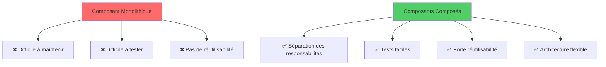

```tsx
function Card({ titre, children }: { titre: string; children: ReactNode }) {
  return (
    <div className="card">
      <h2>{titre}</h2>
      <div className="card-body">{children}</div>
    </div>
  );
}

<Card titre="Profil">
  <Avatar />
  <Details />
</Card>
```

### Pattern children

`children` est la prop spéciale qui reçoit tout le contenu JSX imbriqué. Utilisez-la pour des slots génériques.

### Slots multiples

Quand plusieurs points d'insertion sont nécessaires, passez des éléments React comme props :

```tsx
<Layout header={<Header />} sidebar={<Sidebar />} main={<Main />} />
```

### Hiérarchie de composition

L'arborescence des composants montre comment l'application se décompose en sous-systèmes :

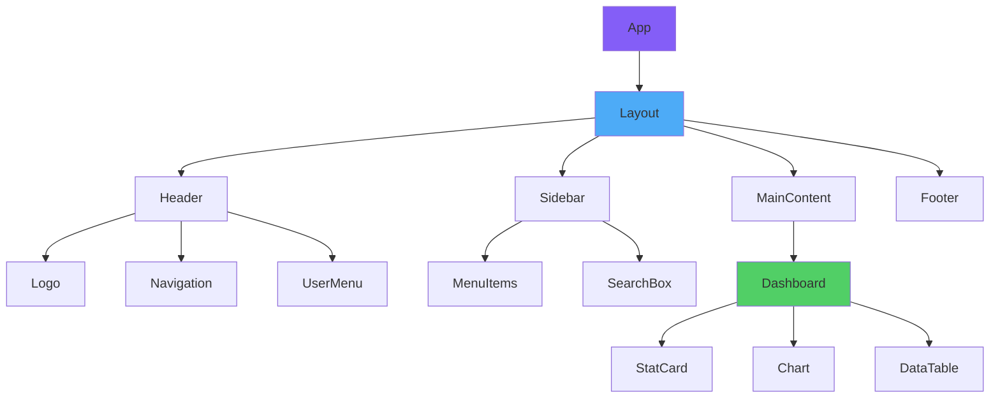

---

## 2. Prop Drilling: Problem and Solutions

### Le problème

Faire passer une prop à travers de nombreux niveaux de composants qui ne l'utilisent pas conduit à du code fragile et couplé.

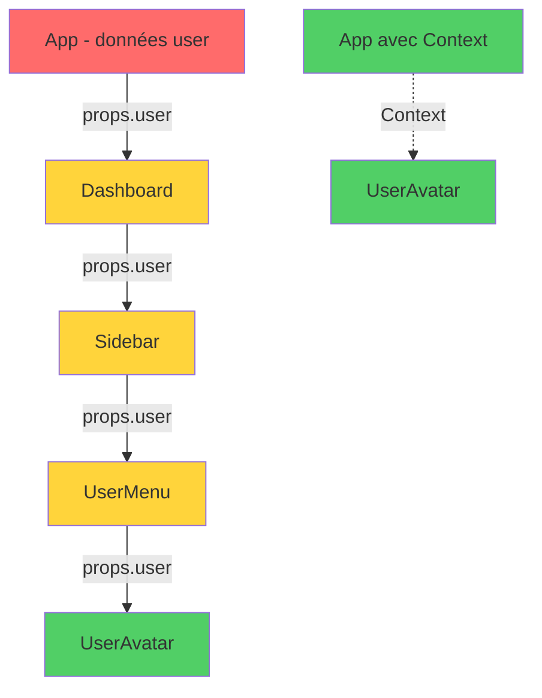

### Solutions

1. **Composition** : rapprochez les données du consommateur via children ou slots.
2. **Context API** pour des données globales (thème, authentification, langue).
3. **State management** dédié (Zustand, Redux, Jotai) pour les grandes applications.

### Quoi utiliser quand

| Profondeur | Fréquence | Solution |
|-----------|-----------|-----------|
| 1–2 niveaux | Toutes | Props normales |
| 3+ niveaux | Faible | Composition/children |
| 3+ niveaux | Élevée | Context |
| App entière | Élevée | Store dédié |

---

## 3. State Elevation Strategies

### État local vs élevé

- **Local** : l'état vit dans le composant qui l'utilise.
- **Élevé** : l'état se trouve dans l'ancêtre commun des composants qui en ont besoin.

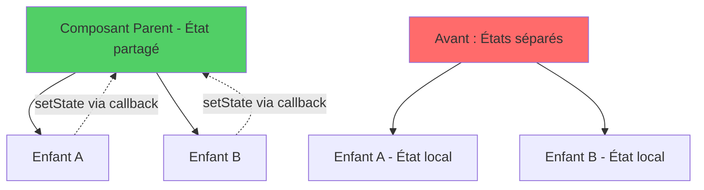

### Règle pratique

Gardez l'état aussi proche que possible de son utilisation. Élevez-le uniquement quand deux branches ou plus de l'arbre ont besoin de la même source de vérité.

```tsx
function Parent() {
  const [filtre, setFiltre] = useState('');
  return (
    <>
      <BarreRecherche valeur={filtre} onChange={setFiltre} />
      <ListeFiltree filtre={filtre} />
    </>
  );
}
```

### Inversion de contrôle

Si un état doit être contrôlable de l'extérieur, exposez-le comme prop optionnelle : on parle de **composants contrôlés/non contrôlés**.

### Arbre de décision pour l'élévation d'état

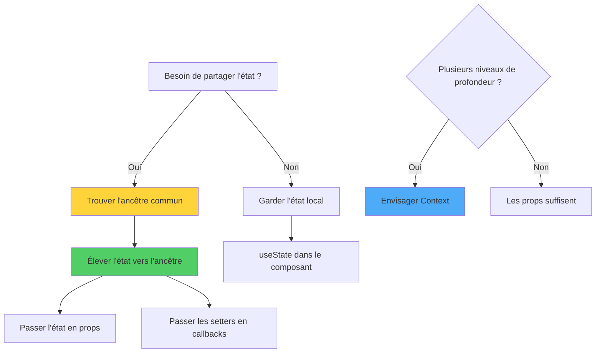

---

## 4. Component Architecture and Organization

### Organisation des dossiers

Une architecture solide repose sur la séparation des responsabilités et une structure de dossiers prévisible :

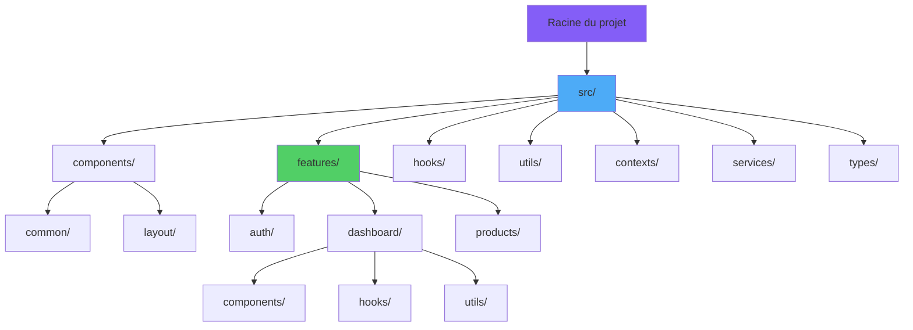

```
src/
  components/    # composants réutilisables
  features/      # regroupements par domaine
  hooks/         # custom hooks
  lib/           # utilitaires, clients API
  pages/         # points d'entrée pour le routage
```

### Nommage

- Fichiers et dossiers en `kebab-case` ou `PascalCase` pour les composants.
- Un composant par fichier en général ; co-location des styles et des tests.

### Public vs privé

N'exportez que ce qui appartient à l'API publique de la feature. Utilisez un `index.ts` barrel pour isoler les détails internes.

---

## 5. Presentational vs Container Components

### Pattern historique

- **Presentational** : UI uniquement, reçoit données et callbacks via props.
- **Container** : gère état, fetch, effets de bord ; transmet les données au presentational.

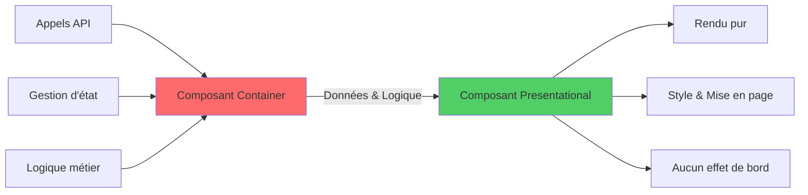

### État actuel

Avec les hooks, la séparation stricte est moins nécessaire : on écrit souvent des composants mixtes, et on extrait la logique dans des custom hooks.

### Quand garder la séparation

- Quand le même composant presentational est utilisé dans plusieurs contextes avec des données différentes.
- Quand vous voulez tester l'UI isolément de l'état.

---

## 6. Higher-Order Components (HOCs)

### Définition

Une fonction qui prend un composant et en retourne un nouveau, enrichi de fonctionnalités :

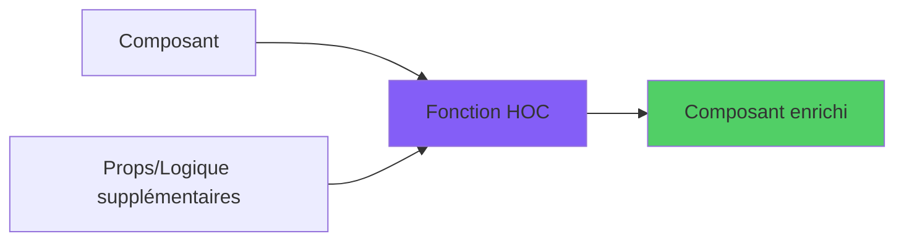

```tsx
function withLogger<P>(Composant: React.ComponentType<P>) {
  return function Wrapped(props: P) {
    useEffect(() => { console.log('rendered'); });
    return <Composant {...props} />;
  };
}
```

### Quand les utiliser encore

Les HOCs restent utiles pour intégrer des bibliothèques legacy (`withRouter`, `connect`). Pour du nouveau code, les **custom hooks** ou **render props** sont généralement plus clairs.

---

## 7. Render Props Pattern

### Concept

Un composant accepte une fonction comme prop (ou comme `children`) qui décrit *quoi* afficher, en recevant des données du composant lui-même.

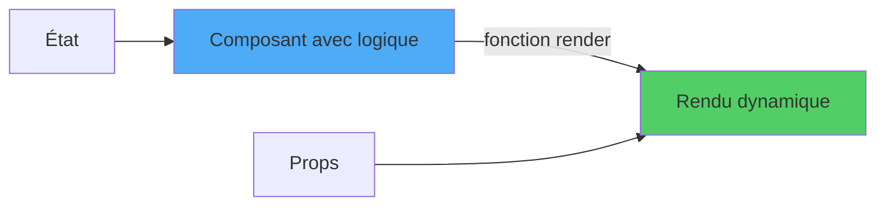

```tsx
function PositionSouris({ children }: { children: (pos: { x: number; y: number }) => ReactNode }) {
  const [pos, setPos] = useState({ x: 0, y: 0 });
  useEffect(() => {
    const h = (e: MouseEvent) => setPos({ x: e.clientX, y: e.clientY });
    window.addEventListener('mousemove', h);
    return () => window.removeEventListener('mousemove', h);
  }, []);
  return <>{children(pos)}</>;
}

<PositionSouris>
  {({ x, y }) => <div>Souris : {x}, {y}</div>}
</PositionSouris>
```

### Quand l'utiliser

Quand vous voulez que le consommateur décide comment afficher les données exposées par le composant. Les custom hooks remplacent souvent ce pattern par une API plus propre.

---

## 8. Compound Components Pattern

### Concept

Plusieurs composants reliés qui travaillent ensemble, en partageant un état implicite via context.

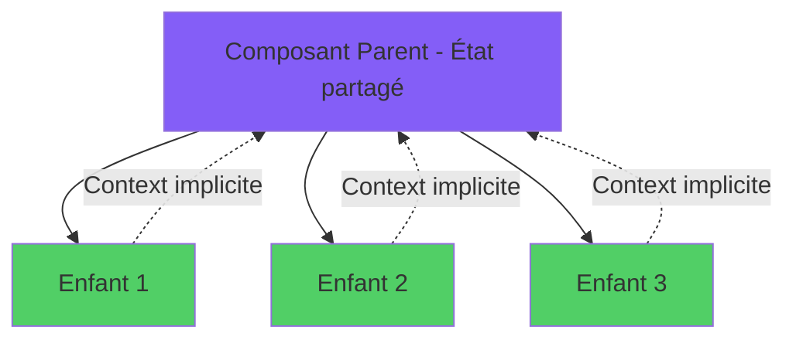

```tsx
const TabsContext = createContext<{ actif: string; setActif: (id: string) => void } | null>(null);

function Tabs({ defaut, children }) {
  const [actif, setActif] = useState(defaut);
  return (
    <TabsContext.Provider value={{ actif, setActif }}>
      <div className="tabs">{children}</div>
    </TabsContext.Provider>
  );
}

function Tab({ id, children }) {
  const ctx = useContext(TabsContext)!;
  return (
    <button
      data-actif={ctx.actif === id}
      onClick={() => ctx.setActif(id)}
    >
      {children}
    </button>
  );
}

Tabs.Tab = Tab;
```

### Avantages

API expressive et lisible :

```tsx
<Tabs defaut="profil">
  <Tabs.Tab id="profil">Profil</Tabs.Tab>
  <Tabs.Tab id="reglages">Réglages</Tabs.Tab>
</Tabs>
```

---

## 9. Advanced Composition Techniques

### Techniques avancées

- **Slot Pattern** : nommer les slots via des props typées.
- **Polymorphic Components** : prop `as` pour rendre différents éléments (ex. Box qui devient `<a>` ou `<button>`).
- **Contrôlé/Non contrôlé** avec valeurs optionnelles et défauts raisonnables.
- **Forwardable refs** pour transmettre une ref à un élément interne.

### Polymorphisme

```tsx
type AsProp<E extends ElementType> = { as?: E };

function Box<E extends ElementType = 'div'>({ as, ...rest }: AsProp<E> & ComponentPropsWithoutRef<E>) {
  const Tag = as ?? 'div';
  return <Tag {...rest} />;
}
```

---

## 10. Pattern Selection Decision Matrix

### Quel pattern quand ?

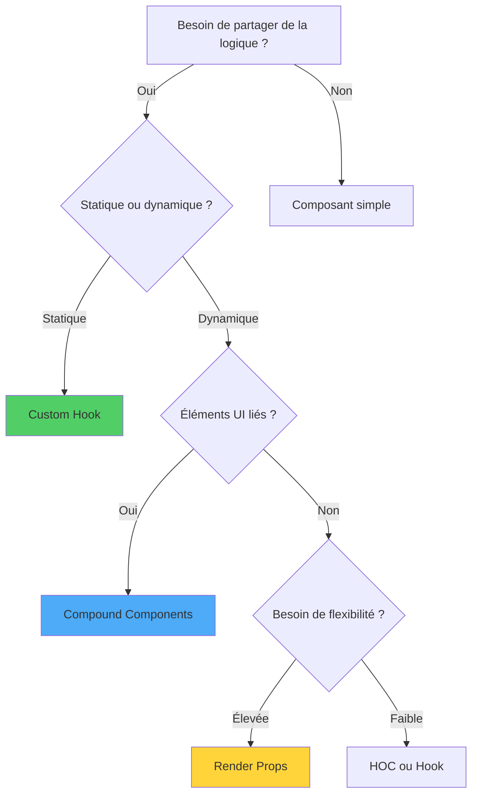

| Besoin | Pattern recommandé |
|--------|--------------------|
| Logique avec état réutilisable | Custom hook |
| État partagé imbriqué | Compound components |
| Étendre le comportement d'un composant | HOC (rarement) ou hook |
| UI paramétrique avec données exposées | Render prop / custom hook |
| Slots multiples avec défauts | Children + slot props |
| Style et markup réutilisables | Composant avec props de variation |

---

## Conclusion: Architecting Excellence

### Trajectoire de maturation

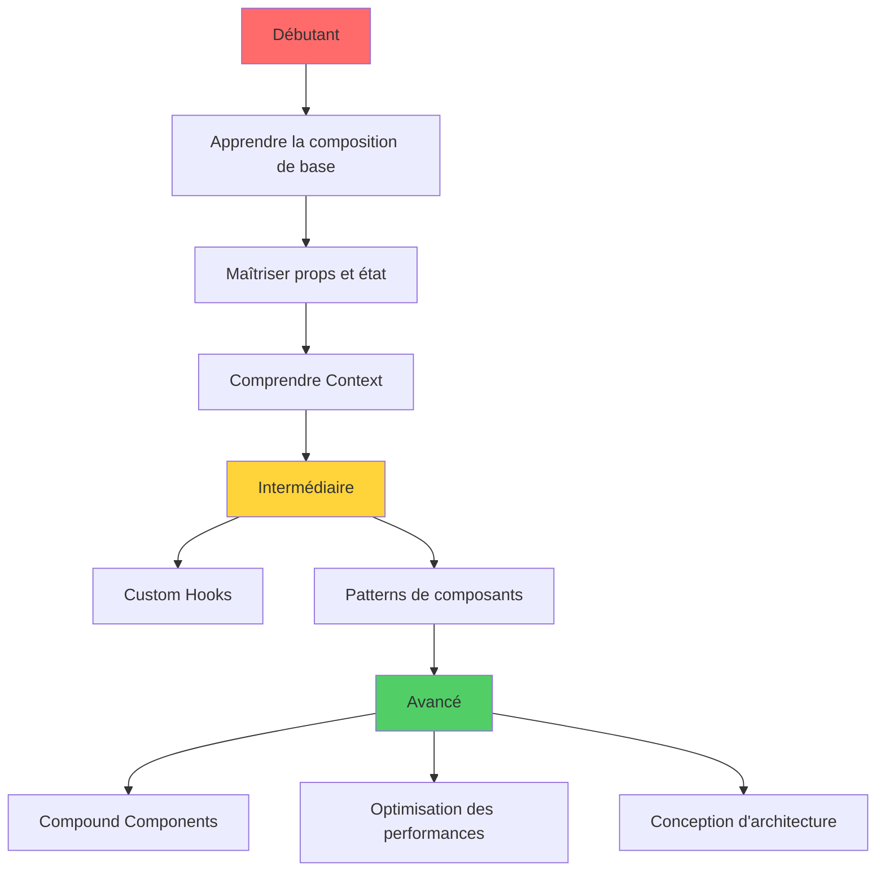

### Conclusion

Il n'existe pas de « meilleur » pattern dans l'absolu. Choisissez selon la clarté, les besoins de réutilisation et la familiarité de l'équipe. Trois règles directrices :

1. **D'abord la composition**, ensuite les abstractions plus sophistiquées.
2. **Extrayez la logique dans des custom hooks**, l'UI dans les composants.
3. **Mesurez avant d'optimiser**, simplifiez avant d'abstraire.
