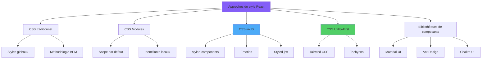
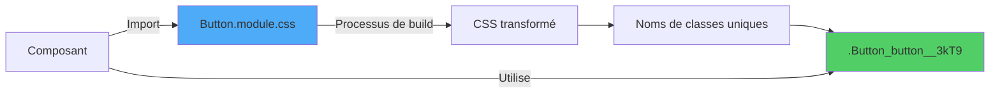
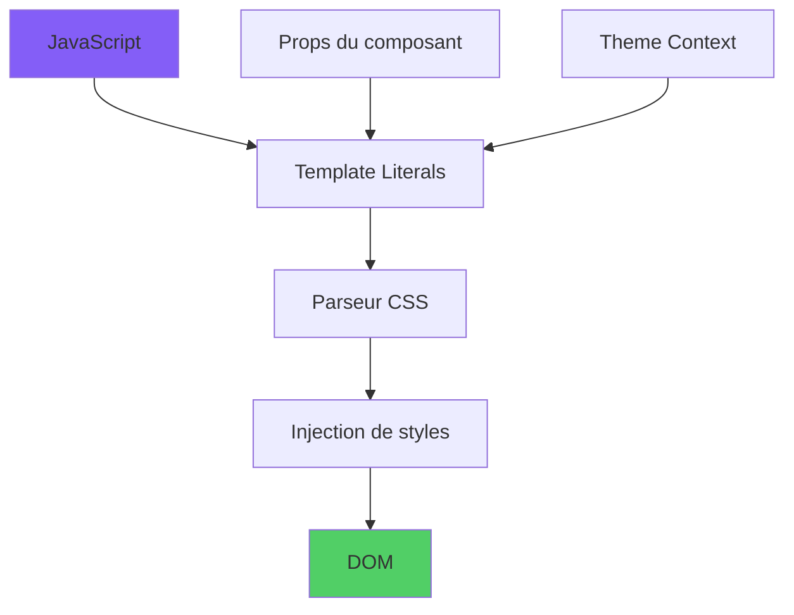
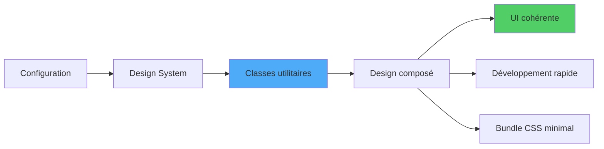
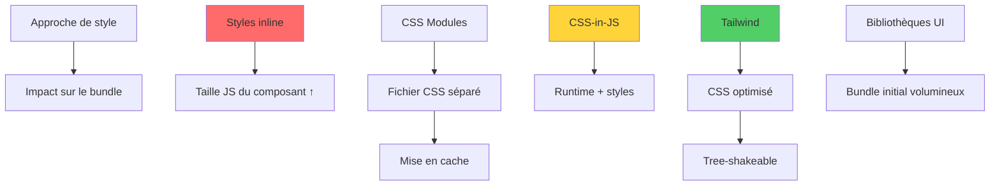
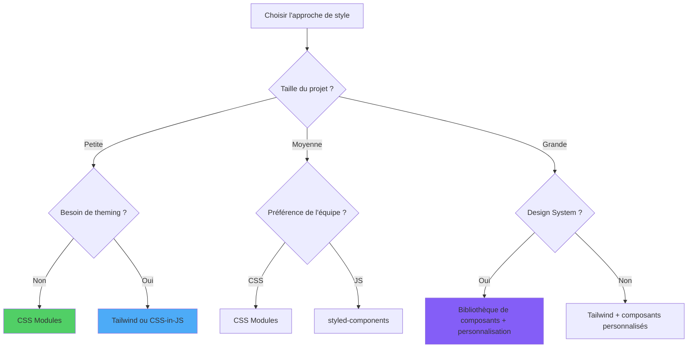

# Style avec React

> Stratégies et outils pour appliquer des styles dans les applications React

---

## 1. Styling Paradigms in React

### Approches principales

React n'impose pas de méthode de style. Les options sont :

1. **Styles inline** (`style={{ ... }}`)
2. **Feuilles CSS classiques** importées dans les composants
3. **CSS Modules** (CSS avec scope local automatique)
4. **CSS-in-JS** (styled-components, Emotion)
5. **Utility-first** (Tailwind CSS)
6. **Systèmes de design** intégrés (Material UI, Chakra, Radix)

L'architecture flexible de React accepte plusieurs méthodologies de style, chacune avec ses compromis en termes de maintenabilité, performance et taille de bundle :



### Critères de choix

- **Échelle** : petit projet → CSS ou modules ; grand projet → utility ou CSS-in-JS.
- **Theming runtime** : variables CSS, Emotion, styled-components.
- **Performance build** : Tailwind est excellent car il purge ce que vous n'utilisez pas.

---

## 2. Inline Styles: Mechanisms and Constraints

### Syntaxe

```tsx
<div style={{ backgroundColor: 'tomato', padding: 16 }}>Bonjour</div>
```

### Limites

- Pas de pseudo-classes (`:hover`, `:focus`).
- Pas de media queries.
- Tout en camelCase.
- Adapté uniquement à des styles dynamiques minimaux.

---

## 3. CSS Modules: Scoped Styling Architecture

### Concept

Les CSS Modules génèrent des classes uniques pour éviter les collisions globales.



```css
/* Bouton.module.css */
.primaire { background: var(--couleur-primaire); }
.grand { padding: 12px 24px; }
```

```tsx
import styles from './Bouton.module.css';

<button className={`${styles.primaire} ${styles.grand}`}>Envoyer</button>
```

### Avantages

- Vrai CSS, pas de runtime.
- Scope automatique, aucun conflit.
- Compatible avec les outils standard (PostCSS, Sass).

---

## 4. CSS-in-JS: styled-components and Emotion

Les bibliothèques **CSS-in-JS** permettent d'écrire du CSS directement dans le JavaScript, avec un style dynamique, le préfixage automatique et un accès complet aux props et à l'état du composant :



### Exemple styled-components

```tsx
import styled from 'styled-components';

const Bouton = styled.button<{ variante?: 'primaire' | 'secondaire' }>`
  background: ${(p) => (p.variante === 'primaire' ? '#2563eb' : '#e5e7eb')};
  color: ${(p) => (p.variante === 'primaire' ? '#fff' : '#111')};
  padding: 8px 16px;
`;

<Bouton variante="primaire">Enregistrer</Bouton>
```

### Pour et contre

| Pour | Contre |
|------|--------|
| Styles co-localisés | Runtime JS (poids, coût) |
| Props dynamiques | Courbe d'apprentissage initiale |
| Theming natif | Debug plus complexe |

---

## 5. Tailwind CSS: Utility-First Methodology

### Approche

Tailwind fournit des centaines de classes atomiques prêtes (`flex`, `p-4`, `text-sm`, `bg-blue-500`) à composer directement dans le markup.



```tsx
<button className="px-4 py-2 bg-blue-600 hover:bg-blue-700 text-white rounded">
  Confirmer
</button>
```

### Quand l'utiliser

- Apps et sites où la rapidité et la cohérence visuelle sont prioritaires.
- Équipes qui apprécient un design system implicite.
- Build process automatisé (purge des classes inutilisées).

---

## 6. CSS Frameworks Integration

### Solutions prêtes à l'emploi

- **Material UI** : conforme à Material Design, catalogue large.
- **Chakra UI** : focus sur accessibilité et theming.
- **Radix UI** : primitives headless, accessibles, sans style.
- **shadcn/ui** : composants basés sur Radix + Tailwind, copiés dans votre repo.

### Quand les choisir

Pour des projets d'entreprise, dashboards, prototypes rapides où vous ne voulez pas réinventer l'UI.

---

## 7. Performance Considerations

### Stratégies

- **CSS statique** gagne toujours en runtime : Tailwind, CSS Modules.
- **CSS-in-JS** avec extraction (Linaria, Vanilla Extract) pour éviter le runtime.
- **Lazy loading** des CSS spécifiques aux routes.
- **Critical CSS** inline pour le premier paint.

Chaque approche a un impact différent sur la taille du bundle :



---

## 8. Advanced Styling Patterns

### Patterns utiles

- **Component slots** + `className` optionnel depuis l'extérieur.
- **Variables CSS** pour theming dynamique sans CSS-in-JS.
- **Data attributes** (`data-state="open"`) comme accroches de style.
- **Helpers `clsx`/`classnames`** pour les conditionnels.

---

## 9. Theming and Design Systems

### Theming avec variables CSS

```css
:root {
  --couleur-bg: #ffffff;
  --couleur-fg: #111111;
}
[data-theme="sombre"] {
  --couleur-bg: #0f172a;
  --couleur-fg: #f8fafc;
}
```

### Design tokens

Définissez une seule source de vérité pour couleurs, espacements, typographie. Générez des variables CSS ou des constantes TS partagées par tous les composants.

---

## 10. Styling Strategy Selection Matrix

### Quelle stratégie ?



| Besoin | Recommandé |
|--------|------------|
| Prototype rapide | Tailwind |
| Bibliothèque UI partagée | CSS Modules ou CSS-in-JS |
| Theming runtime riche | CSS-in-JS ou variables CSS |
| Performance maximale | Tailwind / Vanilla Extract |
| Accessibilité prête à l'emploi | Radix / Chakra |

---

## Conclusion: Architecting Stylistic Excellence

### Conclusion

Il n'existe pas de solution unique. Trois principes :

1. **Cohérence** entre composants, où que vous placiez les styles.
2. **Co-location** du style avec le composant quand cela a du sens.
3. **Mesurez le coût** en bundle et en runtime des solutions CSS-in-JS avant de les généraliser.
