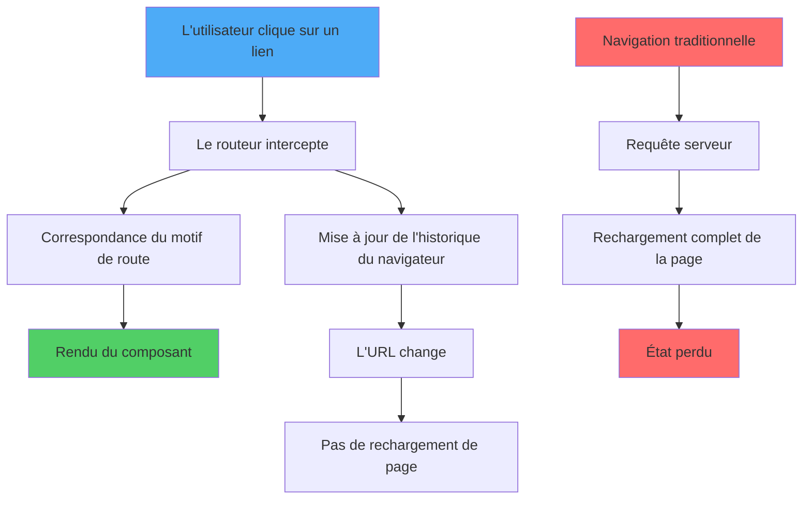
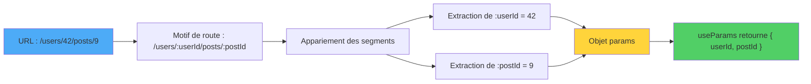
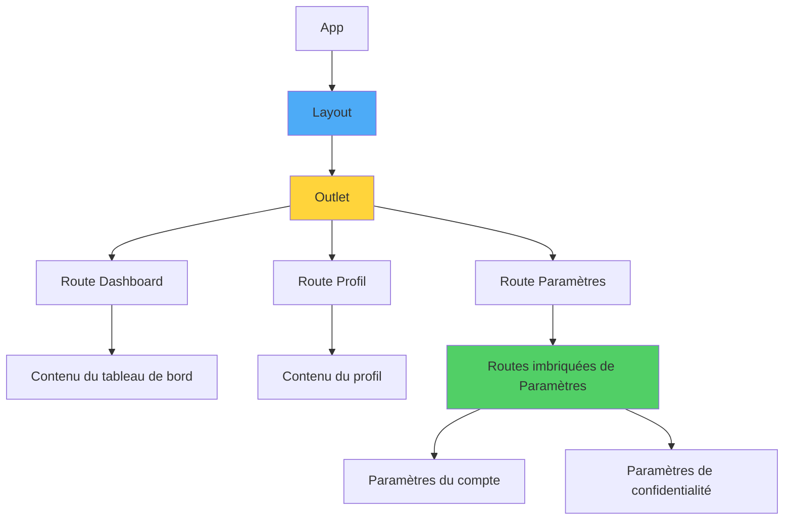
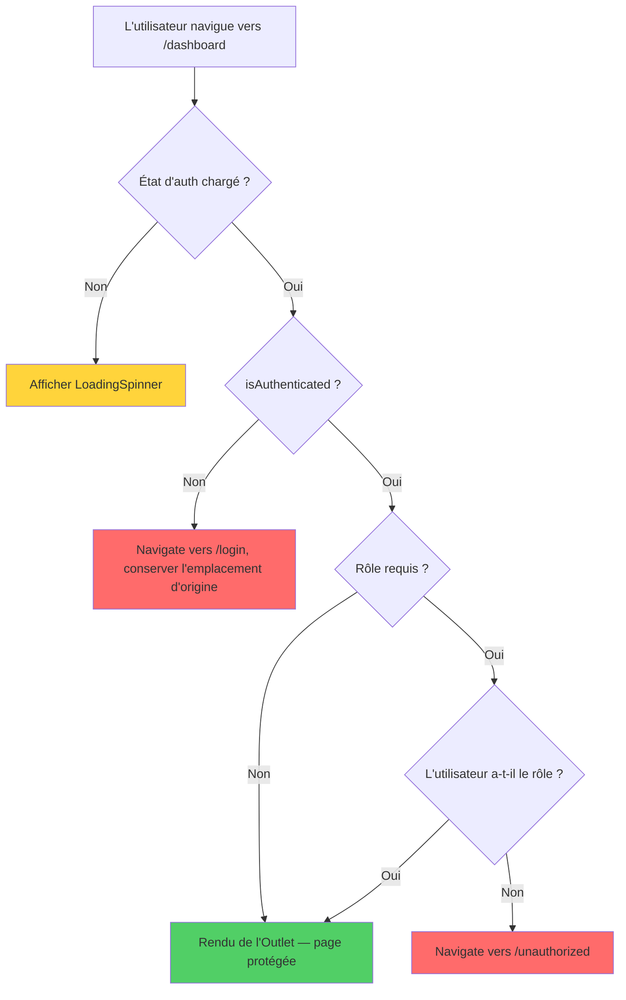
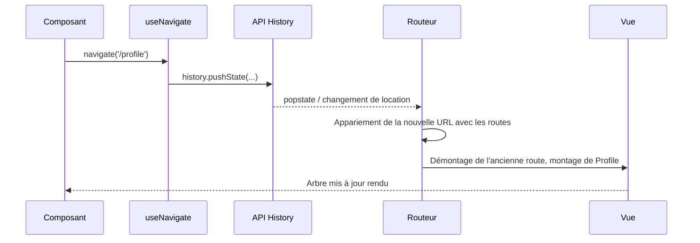
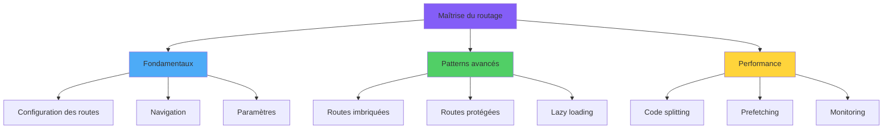

# Routage en React

> Navigation côté client avec React Router

---

## 1. Routing Paradigms and Architecture

### Routage en SPA

Dans une Single Page Application, le routage est géré côté client : l'URL change mais la page n'est pas rechargée. React Router intercepte la navigation et rend le composant associé à l'URL.



---

## 2. React Router Fundamentals

### Installation

```bash
npm install react-router-dom
```

### Configuration de base

```tsx
import { BrowserRouter, Routes, Route, Link } from 'react-router-dom';

function App() {
  return (
    <BrowserRouter>
      <nav>
        <Link to="/">Accueil</Link>
        <Link to="/about">À propos</Link>
      </nav>
      <Routes>
        <Route path="/" element={<Home />} />
        <Route path="/about" element={<About />} />
        <Route path="*" element={<NotFound />} />
      </Routes>
    </BrowserRouter>
  );
}
```

---

## 3. Route Configuration and Navigation

### `<Link>` vs `<NavLink>`

- `<Link>` : navigation simple sans rechargement.
- `<NavLink>` : comme `Link` mais ajoute une classe `active` quand l'URL correspond.

```tsx
<NavLink to="/profil" className={({ isActive }) => isActive ? 'actif' : ''}>
  Profil
</NavLink>
```

### Navigation API

`useNavigate()` pour naviguer par programme, `useLocation()` pour lire l'URL courante.

---

## 4. Dynamic Routing with Parameters

### Comment l'appariement de motif produit un objet params

Quand le routeur voit une URL comme `/users/42`, il parcourt les routes enregistrées et compare chaque motif segment par segment. Les jetons commençant par `:` sont capturés dans l'objet `params` que `useParams` retourne.



### Paramètres URL

```tsx
<Route path="/utilisateurs/:id" element={<Utilisateur />} />

function Utilisateur() {
  const { id } = useParams();
  return <div>ID : {id}</div>;
}
```

### Query string

```tsx
const [searchParams, setSearchParams] = useSearchParams();
const filtre = searchParams.get('filtre');
```

---

## 5. Nested Routes and Layouts

### Arborescence des routes imbriquées

Les routes imbriquées forment un arbre : un layout parent expose un `Outlet` dans lequel les routes enfants sont rendues. Cela permet de partager des en-têtes, des barres latérales et un contexte sans dupliquer la structure.



### Layout avec Outlet

```tsx
function Layout() {
  return (
    <div>
      <Header />
      <Outlet /> {/* les routes enfants sont rendues ici */}
    </div>
  );
}

<Routes>
  <Route element={<Layout />}>
    <Route path="/" element={<Home />} />
    <Route path="/about" element={<About />} />
  </Route>
</Routes>
```

### Routes imbriquées

```tsx
<Route path="/dashboard" element={<Dashboard />}>
  <Route index element={<Apercu />} />
  <Route path="reglages" element={<Reglages />} />
</Route>
```

---

## 6. Protected Routes and Authentication

### L'arbre de décision de la protection

Une route protégée exécute un petit arbre de décision à chaque rendu : la vérification d'authentification est-elle encore en cours, l'utilisateur est-il authentifié, possède-t-il le rôle requis ? Le diagramme ci-dessous montre les branches et où chacune se termine.



### Wrapper de protection

```tsx
function Protegee({ children }: { children: ReactNode }) {
  const { utilisateur } = useAuth();
  if (!utilisateur) return <Navigate to="/login" replace />;
  return <>{children}</>;
}

<Route
  path="/dashboard"
  element={<Protegee><Dashboard /></Protegee>}
/>
```

### Redirection après login

Conservez la location d'origine et redirigez après authentification :

```tsx
const location = useLocation();
<Navigate to="/login" state={{ from: location }} replace />;
```

---

## 7. Programmatic Navigation

### Comment `useNavigate` déclenche un nouveau rendu

Appeler `navigate('/profile')` n'est pas un rendu direct — cela empile une entrée dans l'historique du navigateur, ce qui déclenche un nouveau matching de l'URL par le routeur et le rendu du nouveau sous-arbre de composants.



### useNavigate

```tsx
const navigate = useNavigate();
navigate('/profil');              // push
navigate('/profil', { replace: true });
navigate(-1);                       // retour
navigate('/profil', { state: { de: 'admin' } });
```

### Bloquer la navigation

Pour des formulaires non sauvegardés : utilisez `useBlocker` (React Router v6.4+) ou un `onBeforeUnload` pour la fermeture de l'onglet.

---

## 8. Route Guards and Redirects

### Pattern typique

Il n'existe pas d'API dédiée aux guards dans React Router : on utilise un composant wrapper ou un layout protégé.

```tsx
function GuardAdmin({ children }) {
  const { role } = useAuth();
  if (role !== 'admin') return <Navigate to="/forbidden" replace />;
  return <>{children}</>;
}
```

### Loader (Data API)

Avec React Router v6.4+, vous pouvez charger les données avant la navigation grâce à `loader`, évitant les « flashs » d'état vide :

```tsx
const router = createBrowserRouter([
  {
    path: '/utilisateurs/:id',
    element: <Utilisateur />,
    loader: ({ params }) => fetch(`/api/utilisateurs/${params.id}`).then(r => r.json()),
  },
]);
```

---

## 9. Advanced Routing Patterns

### Lazy loading

```tsx
const Dashboard = lazy(() => import('./Dashboard'));

<Route
  path="/dashboard"
  element={
    <Suspense fallback={<Chargement />}>
      <Dashboard />
    </Suspense>
  }
/>
```

### Patterns d'URL

- `/utilisateurs?page=2` pour les filtres.
- `/utilisateurs/123/posts/456` pour les hiérarchies.
- Modales comme état dans l'URL (`?modale=confirmer`) pour des liens partageables.

---

## 10. Performance Optimization

### Bonnes pratiques

1. **Code splitting par route** avec `React.lazy()`.
2. **Prefetch** des chunks des routes probables.
3. **Loaders** pour éviter les chargements séquentiels.
4. **Mémoïser** les composants coûteux qui persistent entre navigations (`<Outlet />` conserve les ancêtres).

---

## Conclusion: Mastering Navigation Architecture

### Synthèse



### Conclusion

React Router est léger et composable. Les routes sont des **composants**, pas des configurations statiques, vous pouvez donc les composer librement. Trois choses à retenir :

1. **Layout via `<Outlet />`** plutôt que dupliquer la structure.
2. **Protection via wrapper**, pas de guards implicites.
3. **Code splitting** et **loaders** pour une UX fluide et rapide.
