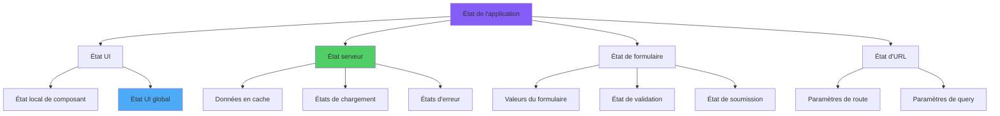
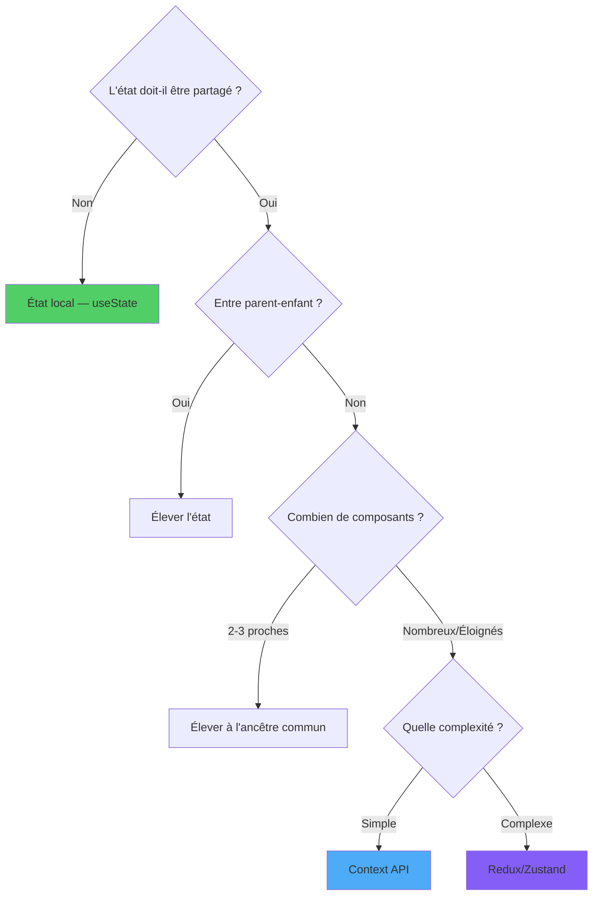
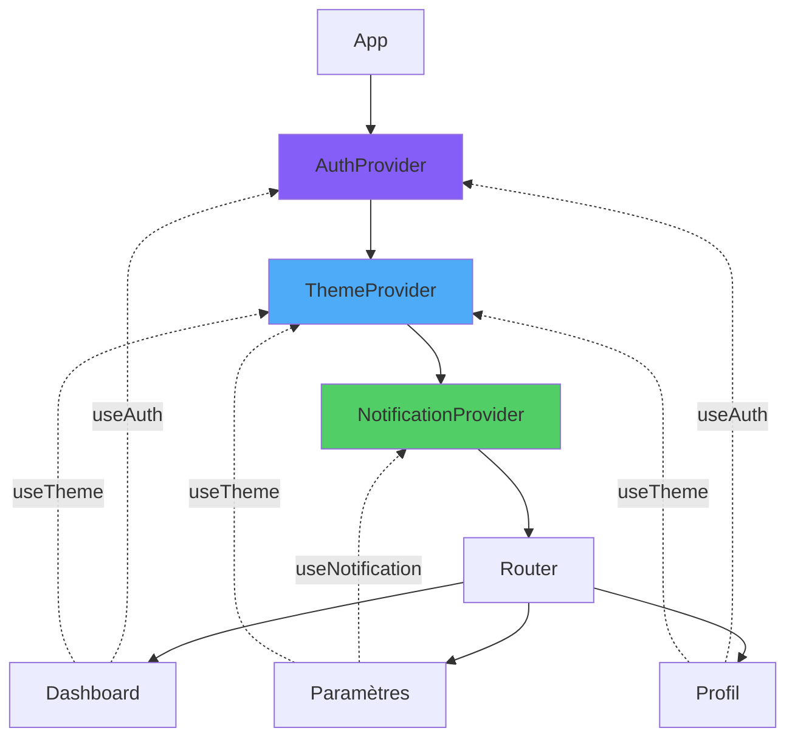
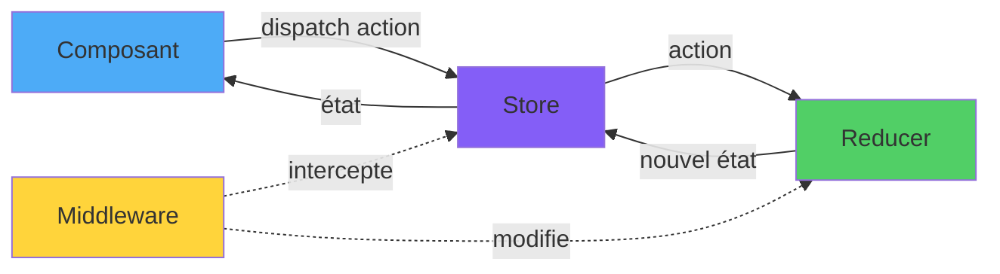
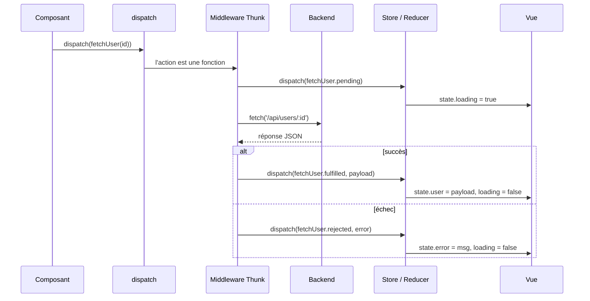
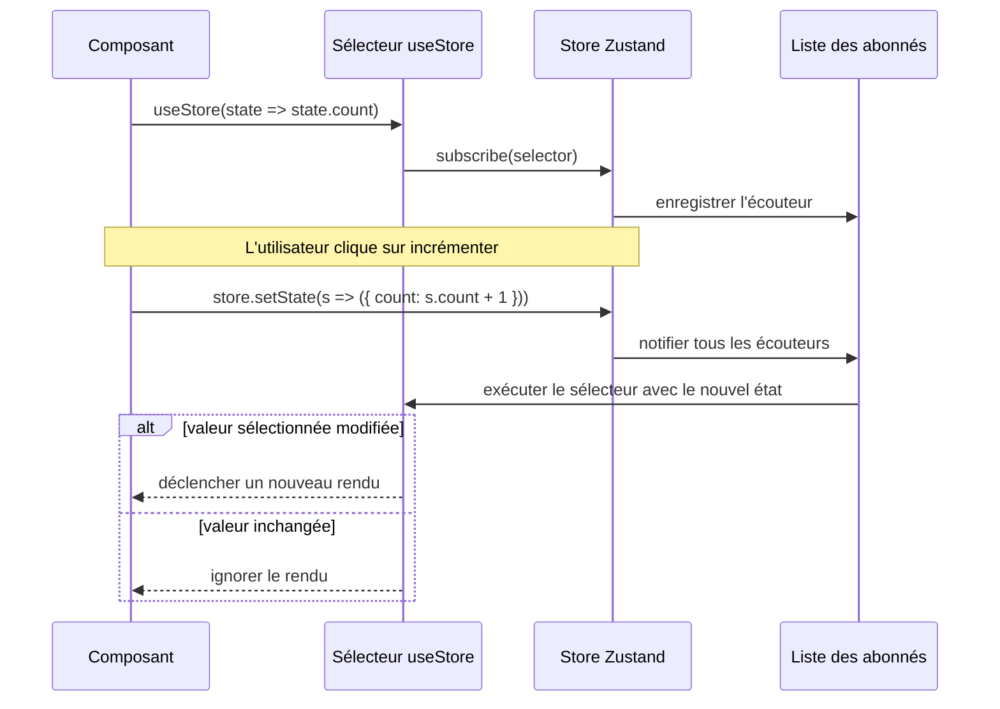
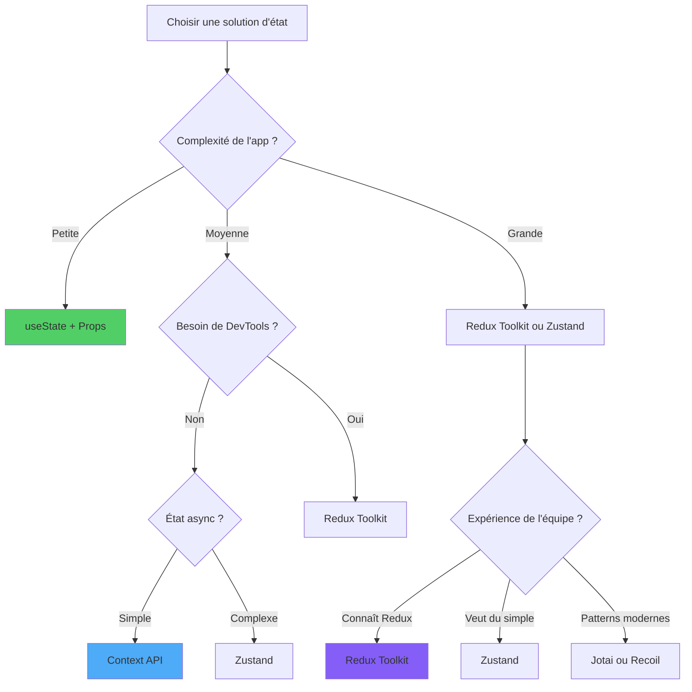

# Gestion d'État en React

> Stratégies et bibliothèques pour gérer l'état d'une application React

---

## 1. State Management Paradigms

### Types d'état

1. **État local** : à l'intérieur d'un seul composant (`useState`, `useReducer`).
2. **État élevé** : partagé entre frères via un ancêtre commun.
3. **État global** : nécessaire dans plusieurs branches de l'arbre (Context, store dédié).
4. **État serveur** : données distantes, cache (React Query, SWR).
5. **État d'URL** : filtres, pages, query string.
6. **État de formulaire** : local ou géré par des bibliothèques (React Hook Form).



### Règle pratique

Commencez toujours au **niveau le plus bas possible**. Ne montez que lorsque l'état doit être partagé ou persistant.

---

## 2. Local vs Global State: Decision Framework

### Diagramme de décision

```
L'état est-il utilisé par un seul composant ?
├─ Oui → useState / useReducer local
└─ Non → Est-il utilisé par des composants frères ?
       ├─ Oui → Élever à l'ancêtre commun
       └─ Non → Est-ce une donnée distante ?
              ├─ Oui → React Query / SWR
              └─ Non → Context API ou store global
```



### Erreurs courantes

- Mettre trop de choses dans un Context global → re-rendus excessifs.
- Garder des données dérivées dans l'état → mieux vaut les calculer avec `useMemo`.
- Dupliquer des données serveur dans l'état local → source de désynchronisation.

---

## 3. Context API: Simple Global State

### Arbre des Providers et portée des consommateurs

Chaque `Provider` injecte une valeur dans le sous-arbre situé en dessous. Les consommateurs remontent dans l'arbre jusqu'au `Provider` correspondant le plus proche — l'ordre de composition compte car un provider interne peut masquer un provider externe.



### Quand l'utiliser

Pour des données globales qui changent rarement : thème, langue, utilisateur authentifié.

```tsx
const ThemeContext = createContext<{ theme: 'clair' | 'sombre'; toggle: () => void } | null>(null);

function ThemeProvider({ children }: { children: ReactNode }) {
  const [theme, setTheme] = useState<'clair' | 'sombre'>('clair');
  const toggle = () => setTheme(t => (t === 'clair' ? 'sombre' : 'clair'));
  return (
    <ThemeContext.Provider value={{ theme, toggle }}>
      {children}
    </ThemeContext.Provider>
  );
}

function useTheme() {
  const ctx = useContext(ThemeContext);
  if (!ctx) throw new Error('useTheme hors de ThemeProvider');
  return ctx;
}
```

### Limites

Context **n'est pas optimisé** pour des mises à jour fréquentes. Pour un état qui change beaucoup, envisagez Zustand ou Jotai.

---

## 4. Redux Toolkit: Modern Redux

### Configuration moderne

Redux Toolkit (RTK) élimine la boilerplate du Redux classique.

```tsx
import { createSlice, configureStore } from '@reduxjs/toolkit';

const compteurSlice = createSlice({
  name: 'compteur',
  initialState: { valeur: 0 },
  reducers: {
    incrementer: (state) => { state.valeur += 1; },
    decrementer: (state) => { state.valeur -= 1; },
    definirValeur: (state, action: PayloadAction<number>) => { state.valeur = action.payload; },
  },
});

export const { incrementer, decrementer, definirValeur } = compteurSlice.actions;

export const store = configureStore({
  reducer: { compteur: compteurSlice.reducer },
});
```

### Utilisation dans un composant

```tsx
const valeur = useSelector((s: RootState) => s.compteur.valeur);
const dispatch = useDispatch();
dispatch(incrementer());
```

---

## 5. Redux Core Concepts Deep Dive

### Flux de données Redux

Redux applique un flux unidirectionnel : un composant `dispatch` une action, le store invoque le reducer, qui produit un nouvel état, et les composants abonnés sont notifiés.



### Concepts clés

- **Store** : unique source de vérité.
- **Action** : objet descriptif `{ type, payload }`.
- **Reducer** : fonction pure `(state, action) => newState`.
- **Selector** : fonction qui extrait des données du store.
- **Dispatch** : envoi d'une action.

### Immer intégré

Dans RTK vous pouvez écrire des « mutations » dans le reducer : Immer se charge de produire un nouvel état immuable.

---

## 6. Middleware and Async Operations

### Cycle de vie d'un thunk asynchrone de bout en bout

`createAsyncThunk` dispatche automatiquement les actions `pending`, `fulfilled` ou `rejected` autour de votre fonction async. Le middleware se trouve entre `dispatch` et le reducer : c'est là que la fonction thunk est réellement exécutée au lieu d'être transmise comme action ordinaire.



### Thunk

```tsx
import { createAsyncThunk } from '@reduxjs/toolkit';

export const chargerUtilisateur = createAsyncThunk('utilisateur/charger', async (id: string) => {
  const r = await fetch(`/api/utilisateurs/${id}`);
  return r.json();
});

const utilisateurSlice = createSlice({
  name: 'utilisateur',
  initialState: { donnees: null, etat: 'idle' },
  reducers: {},
  extraReducers: (builder) => {
    builder
      .addCase(chargerUtilisateur.pending, (s) => { s.etat = 'chargement'; })
      .addCase(chargerUtilisateur.fulfilled, (s, a) => { s.etat = 'pret'; s.donnees = a.payload; })
      .addCase(chargerUtilisateur.rejected, (s) => { s.etat = 'erreur'; });
  },
});
```

### Thunk vs React Query

- **Thunk** : quand la donnée distante est étroitement liée à d'autres états Redux.
- **React Query/SWR** : dans la plupart des cas, car ils gèrent cache, refetch, invalidation et stale data automatiquement.

---

## 7. Zustand: Minimalist State Management

### Comment un store hors de React déclenche le re-rendu des composants

Zustand garde l'état dans un store JavaScript ordinaire qui vit hors de l'arbre React. Les composants s'abonnent via un sélecteur ; quand le store change, seuls les composants dont la tranche sélectionnée a changé sont re-rendus.



### API très simple

```tsx
import { create } from 'zustand';

const useCompteur = create<{ valeur: number; incrementer: () => void }>((set) => ({
  valeur: 0,
  incrementer: () => set((s) => ({ valeur: s.valeur + 1 })),
}));

function Compteur() {
  const valeur = useCompteur((s) => s.valeur);
  const incrementer = useCompteur((s) => s.incrementer);
  return <button onClick={incrementer}>{valeur}</button>;
}
```

### Avantages

- Pas de Provider obligatoire.
- Sélecteurs pour éviter les re-rendus inutiles.
- Middlewares pour persistance, devtools, compatibilité Redux.

---

## 8. Jotai: Atomic State Management

### Atomes

Jotai modélise l'état comme de petits « atomes » combinables :

```tsx
import { atom, useAtom } from 'jotai';

const compteurAtom = atom(0);
const doubleAtom = atom((get) => get(compteurAtom) * 2);

function Comp() {
  const [valeur, setValeur] = useAtom(compteurAtom);
  const [double] = useAtom(doubleAtom);
  return <button onClick={() => setValeur((v) => v + 1)}>{valeur} — {double}</button>;
}
```

### Quand l'utiliser

Quand vous voulez une réactivité granulaire sans store central, et que vous appréciez le pattern atomique à la Recoil mais plus léger.

---

## 9. Recoil: Graph-Based State

### Concepts

- **atom** : unité d'état.
- **selector** : état dérivé.
- **family** : atomes paramétrés.

Recoil a été pionnier mais on le choisit moins souvent aujourd'hui au profit de Jotai/Zustand. Il reste pertinent pour des apps déjà investies.

---

## 10. State Management Selection Matrix

### Arbre de décision



### Quelle bibliothèque ?

| Besoin | Solution |
|--------|----------|
| État d'un seul composant | `useState`/`useReducer` |
| État partagé entre 2-3 composants | élévation via props |
| Thème, authentification | Context API |
| État serveur (CRUD, cache) | React Query / SWR |
| État global fréquent | Zustand |
| État global typé et structuré | Redux Toolkit |
| Réactivité atomique | Jotai |

---

## Conclusion: State Management Mastery

### Conclusion

Il n'existe pas de bibliothèque « idéale ». Trois principes directeurs :

1. **Commencez local**, ne montez que lorsque nécessaire.
2. **Séparez état serveur et état client** : utilisez React Query pour les données distantes.
3. **Choisissez la bibliothèque selon l'équipe et l'échelle**, pas le hype.
