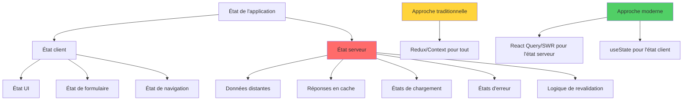
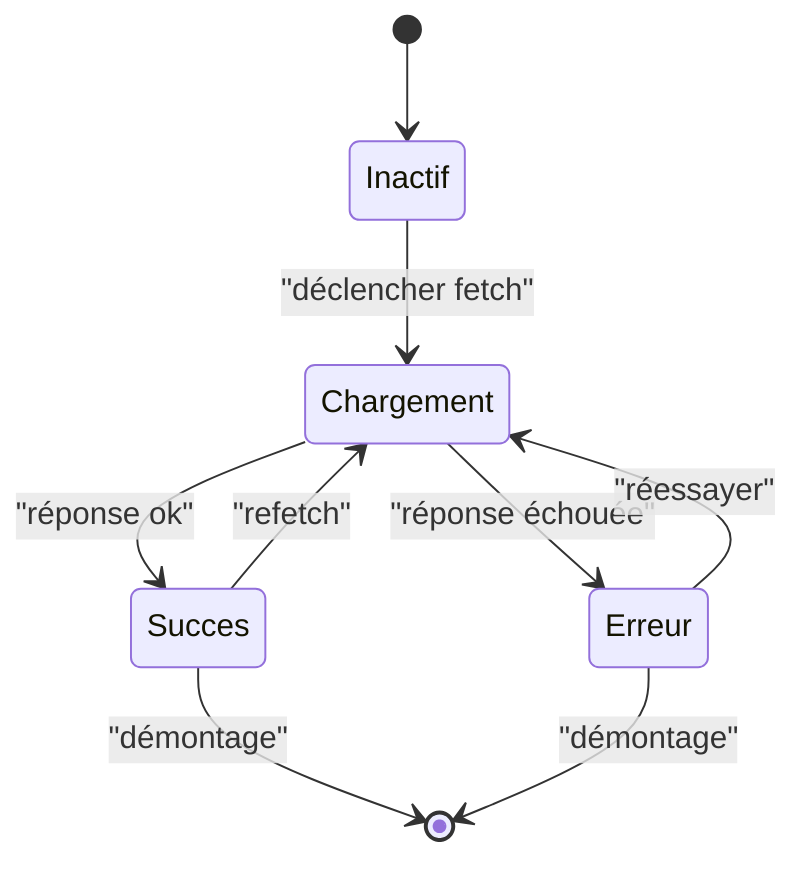
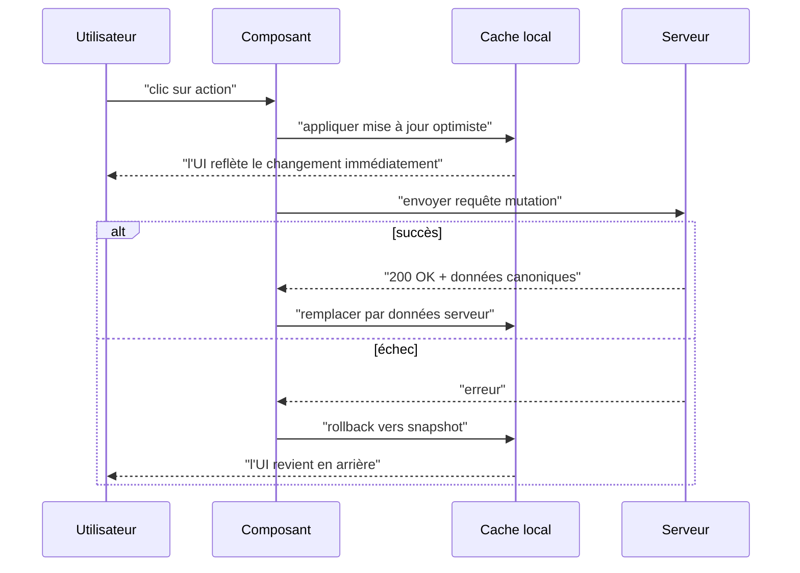
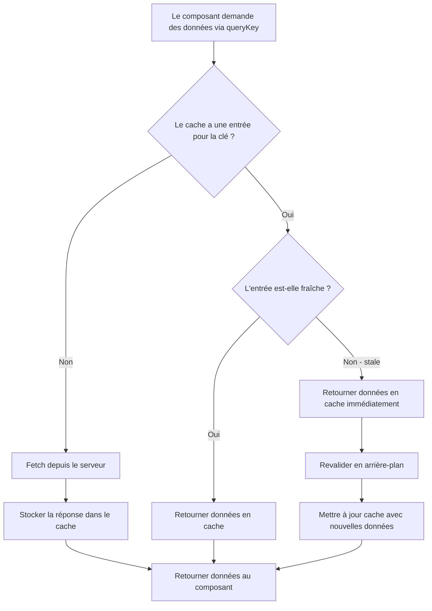
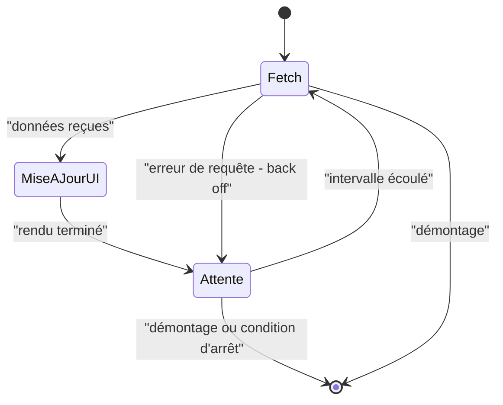
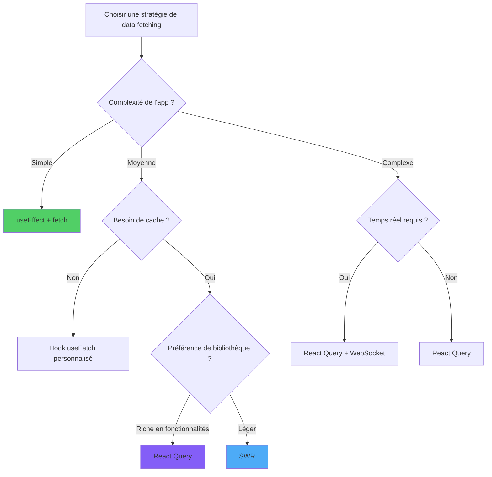

# Récupération de Données en React

> Stratégies et bibliothèques pour gérer les données distantes dans les applications React

---

## 1. Data Fetching Paradigms

### Approches

1. **Impératif** : `fetch` ou `axios` dans `useEffect`, en gérant manuellement les états de chargement/erreur.
2. **Déclaratif** : bibliothèques comme React Query ou SWR qui gèrent cache, déduplication, refetch.
3. **Suspense** (React 18+) : intégration native avec `<Suspense>` pour les loading boundaries.
4. **Server Components** (Next.js, etc.) : fetch directement côté serveur.

### État serveur vs état client

L'état serveur est asynchrone, potentiellement obsolète et existe à l'extérieur de l'application. Les approches modernes le séparent explicitement de l'état client.



### Quand utiliser quoi

- Petits projets, un seul appel : `fetch` + `useEffect`.
- Tout le reste : **React Query** est aujourd'hui le standard de facto.

---

## 2. Native Fetch API and Axios

### Fetch de base

```tsx
useEffect(() => {
  let annule = false;
  fetch('/api/utilisateurs')
    .then(r => {
      if (!r.ok) throw new Error('HTTP ' + r.status);
      return r.json();
    })
    .then(data => { if (!annule) setUtilisateurs(data); })
    .catch(err => { if (!annule) setErreur(err); });
  return () => { annule = true; };
}, []);
```

### Axios

Axios offre des intercepteurs, des transformations et une gestion d'erreur plus complète d'emblée :

```tsx
import axios from 'axios';

const api = axios.create({ baseURL: '/api', timeout: 5000 });
api.interceptors.request.use((cfg) => {
  cfg.headers.Authorization = `Bearer ${token}`;
  return cfg;
});
```

---

## 3. Loading States and Error Handling

### Cycle de vie d'une requête comme machine à états

Modéliser une requête fetch comme une machine à états finis rend les quatre états exclusifs explicites et empêche des UI impossibles comme « chargement + erreur affichés en même temps ».



### Pattern courant

```tsx
const [etat, setEtat] = useState<'idle' | 'chargement' | 'pret' | 'erreur'>('idle');
const [donnees, setDonnees] = useState<Utilisateur[] | null>(null);
const [erreur, setErreur] = useState<Error | null>(null);

useEffect(() => {
  setEtat('chargement');
  fetch('/api/utilisateurs')
    .then(r => r.json())
    .then(d => { setDonnees(d); setEtat('pret'); })
    .catch(e => { setErreur(e); setEtat('erreur'); });
}, []);
```

### Error Boundaries

Pour les erreurs de rendu :

```tsx
class ErrorBoundary extends Component<{ children: ReactNode }, { erreur: Error | null }> {
  state = { erreur: null };
  static getDerivedStateFromError(erreur: Error) { return { erreur }; }
  render() {
    if (this.state.erreur) return <p>Quelque chose s'est mal passé : {this.state.erreur.message}</p>;
    return this.props.children;
  }
}
```

---

## 4. React Query: Server State Management

### Concept

React Query (TanStack Query) gère automatiquement :

- Cache des réponses
- Déduplication des requêtes concurrentes
- Refetch au focus/fenêtre/réseau
- Invalidation et refetch programmatique
- États de chargement, erreur, succès

### Setup

```tsx
import { QueryClient, QueryClientProvider, useQuery } from '@tanstack/react-query';

const queryClient = new QueryClient();

function App() {
  return (
    <QueryClientProvider client={queryClient}>
      <Utilisateurs />
    </QueryClientProvider>
  );
}
```

### useQuery

```tsx
function Utilisateurs() {
  const { data, isLoading, error } = useQuery({
    queryKey: ['utilisateurs'],
    queryFn: () => fetch('/api/utilisateurs').then(r => r.json()),
  });

  if (isLoading) return <p>Chargement…</p>;
  if (error) return <p>Erreur : {(error as Error).message}</p>;
  return <ul>{data.map((u: Utilisateur) => <li key={u.id}>{u.nom}</li>)}</ul>;
}
```

### useMutation

```tsx
const mutation = useMutation({
  mutationFn: (nouveau: Utilisateur) => fetch('/api/utilisateurs', { method: 'POST', body: JSON.stringify(nouveau) }),
  onSuccess: () => queryClient.invalidateQueries({ queryKey: ['utilisateurs'] }),
});

mutation.mutate({ nom: 'Marie' });
```

---

## 5. SWR: Stale-While-Revalidate

### Alternative plus légère

```tsx
import useSWR from 'swr';

const fetcher = (url: string) => fetch(url).then(r => r.json());

function Utilisateurs() {
  const { data, error, isLoading } = useSWR('/api/utilisateurs', fetcher);
  if (isLoading) return <p>Chargement…</p>;
  if (error) return <p>Erreur</p>;
  return <Liste utilisateurs={data} />;
}
```

### Différences avec React Query

- SWR est plus petit avec une API minimale.
- React Query a plus de fonctionnalités (mutations, annulation, pagination, infinite) et des devtools.

---

## 6. Optimistic Updates

### Flux de mise à jour optimiste

L'UI applique le changement localement avant la résolution réseau, puis confirme avec la réponse du serveur ou rollback en cas d'échec. C'est ce qui rend les interactions instantanées.



### Concept

Mettre à jour l'UI **avant** la confirmation serveur, avec rollback en cas d'erreur.

```tsx
const mutation = useMutation({
  mutationFn: mettreAJourTodo,
  onMutate: async (nouveau) => {
    await queryClient.cancelQueries({ queryKey: ['todos'] });
    const precedent = queryClient.getQueryData(['todos']);
    queryClient.setQueryData(['todos'], (ancien: Todo[]) =>
      ancien.map(t => t.id === nouveau.id ? nouveau : t)
    );
    return { precedent };
  },
  onError: (_err, _nouveau, contexte) => {
    queryClient.setQueryData(['todos'], contexte?.precedent);
  },
  onSettled: () => {
    queryClient.invalidateQueries({ queryKey: ['todos'] });
  },
});
```

---

## 7. Cache Management Strategies

### Décision hit/miss du cache

Chaque query consulte d'abord le cache via sa clé. Un hit frais retourne instantanément sans coût réseau ; un miss (ou une entrée stale) déclenche un vrai fetch et alimente le cache pour la prochaine fois.



### Politiques de cache

- **staleTime** : durée après laquelle une query devient « stale » (défaut 0).
- **gcTime** (ex cacheTime) : temps de conservation des données après unmount (défaut 5min).
- **refetchOnWindowFocus** : refetch au retour sur l'onglet.

### Patterns typiques

- Listes avec `staleTime` long, détails avec `staleTime` court.
- Invalider les caches liés après une mutation.
- Prefetch au hover d'un lien pour une UX instantanée.

---

## 8. Polling and Real-Time Updates

### Cycle de polling

Le polling est une boucle : fetch, mise à jour de l'UI, attente, répétition — jusqu'à ce qu'un signal d'arrêt (démontage, condition de succès, ou perte de focus de l'onglet) brise le cycle.



### Polling

```tsx
useQuery({
  queryKey: ['statut'],
  queryFn: fetchStatut,
  refetchInterval: 5000,
});
```

### WebSocket

Combinez React Query (snapshot initial) + WebSocket (mises à jour push) :

```tsx
useEffect(() => {
  const ws = new WebSocket('/api/stream');
  ws.onmessage = (msg) => {
    queryClient.setQueryData(['statut'], JSON.parse(msg.data));
  };
  return () => ws.close();
}, []);
```

---

## 9. Advanced Patterns

### Pagination

```tsx
const { data } = useQuery({
  queryKey: ['utilisateurs', page],
  queryFn: () => fetch(`/api/utilisateurs?page=${page}`).then(r => r.json()),
  keepPreviousData: true,
});
```

### Infinite scroll

```tsx
const { data, fetchNextPage, hasNextPage } = useInfiniteQuery({
  queryKey: ['posts'],
  queryFn: ({ pageParam = 0 }) => fetchPosts(pageParam),
  getNextPageParam: (last) => last.nextCursor,
});
```

### Suspense avec React Query

```tsx
useSuspenseQuery({ queryKey: ['utilisateur', id], queryFn: () => fetchUtilisateur(id) });
```

---

## 10. Data Fetching Strategy Selection

### Arbre de décision

Un guide rapide pour choisir une stratégie en fonction de la complexité de l'application et des besoins.



### Matrice de décision

| Besoin | Solution |
|--------|----------|
| Une seule GET simple | `fetch` + `useEffect` |
| Plusieurs appels avec cache | React Query / SWR |
| Synchronisation temps réel | WebSocket + React Query |
| Soumission de formulaire + invalidation | useMutation |
| Pagination/infinite | useInfiniteQuery |
| SSR/Server Components | Next.js / Remix |

---

## Conclusion: Mastering Data Fetching

### Conclusion

Le « data fetching » ne se résume pas à HTTP : c'est la **gestion de l'état serveur**. React Query le modélise bien. Trois règles :

1. **Ne dupliquez pas l'état serveur dans l'état local**.
2. **Cache d'abord, fetch en exception** : pensez à ce qui invalide quoi.
3. **Loading et error** font partie de l'UX, pas d'un détail : concevez-les dès le départ.
