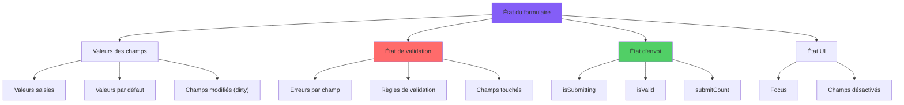
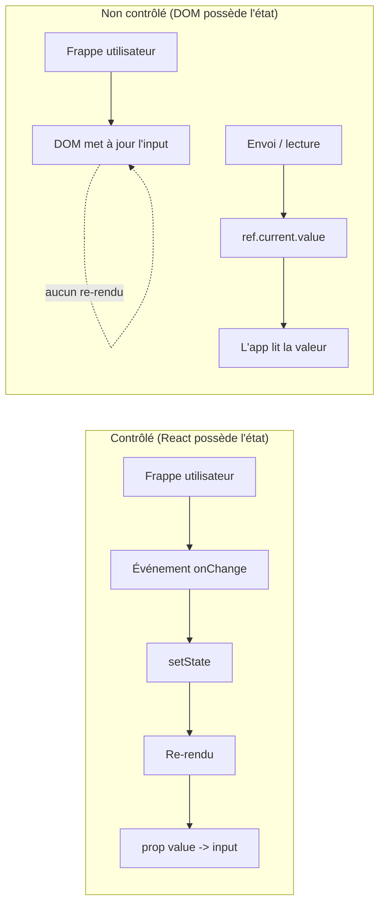
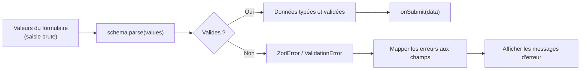
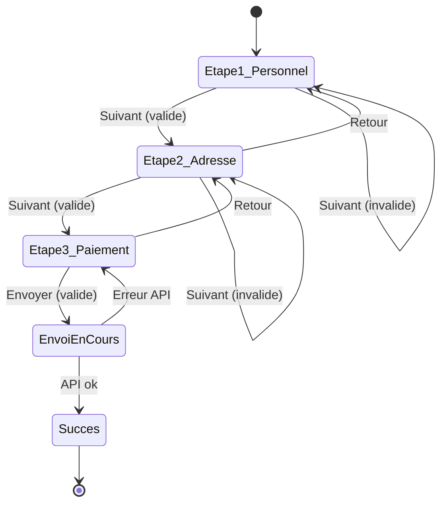
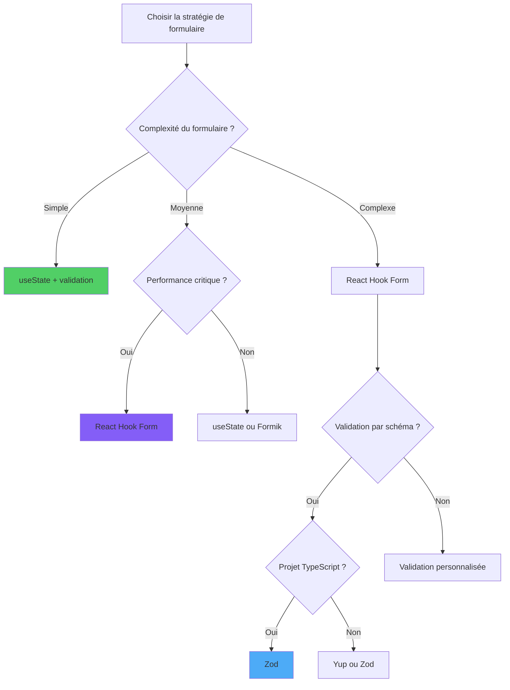

# Formulaires et Validation en React

> Gestion des formulaires et validation, avec et sans bibliothèques

---

## 1. Form Management Paradigms

### Classification de l'état d'un formulaire

L'état d'un formulaire n'est pas monolithique : valeurs, validation, statut d'envoi et UI sont des dimensions distinctes qui s'orchestrent différemment.



### Approches

1. **Contrôlés avec `useState`** : chaque champ est un état. Adapté aux petits formulaires.
2. **Non contrôlés avec `useRef`** : on lit les valeurs uniquement à l'envoi. Plus performant pour les longs formulaires.
3. **Bibliothèques dédiées** : React Hook Form, Formik. Gèrent état, validation, erreurs, performance.
4. **Schema validation** : Yup, Zod, Valibot. Définissent le schéma des données et génèrent des erreurs typées.

### Quand utiliser quoi

- 1–3 champs : `useState`.
- Formulaires moyens/grands : React Hook Form + Zod.
- Wizard / multi-étapes : React Hook Form avec `useFieldArray` ou machine à états.

---

## 2. Controlled vs Uncontrolled Components

### Flux de données : contrôlés vs non contrôlés

Les deux patterns diffèrent par **l'endroit où réside la source de vérité**. Les composants contrôlés gardent l'état dans React ; les non contrôlés le gardent dans le DOM et le récupèrent via des refs uniquement au besoin.



### Contrôlés

```tsx
const [nom, setNom] = useState('');
<input value={nom} onChange={(e) => setNom(e.target.value)} />
```

Avantage : validation en temps réel, valeur prévisible.
Inconvénient : chaque frappe déclenche un rendu.

### Non contrôlés

```tsx
const ref = useRef<HTMLInputElement>(null);
<input ref={ref} defaultValue="Marie" />
<button onClick={() => console.log(ref.current?.value)}>Envoyer</button>
```

Avantage : aucun rendu entre les frappes.
Inconvénient : validation live plus complexe, valeur pas toujours disponible.

---

## 3. React Hook Form: Modern Form Management

### Setup

```tsx
import { useForm } from 'react-hook-form';

type DonneesForm = { nom: string; email: string };

function FormContact() {
  const { register, handleSubmit, formState: { errors } } = useForm<DonneesForm>();

  const envoyer = (donnees: DonneesForm) => console.log(donnees);

  return (
    <form onSubmit={handleSubmit(envoyer)}>
      <input {...register('nom', { required: 'Nom obligatoire' })} />
      {errors.nom && <span>{errors.nom.message}</span>}

      <input {...register('email', { required: true, pattern: /\S+@\S+\.\S+/ })} />
      {errors.email && <span>Email invalide</span>}

      <button type="submit">Envoyer</button>
    </form>
  );
}
```

### Pourquoi le choisir

- **Performance** : champs non contrôlés par défaut, pas de rendu par frappe.
- **API minimale** : `register`, `handleSubmit`, `formState`.
- **Intégration schema** : `@hookform/resolvers` pour Yup/Zod.

---

## 4. Validation with Yup

### Schéma

```tsx
import * as yup from 'yup';
import { yupResolver } from '@hookform/resolvers/yup';

const schema = yup.object({
  nom: yup.string().required('Nom obligatoire'),
  email: yup.string().email('Email invalide').required(),
  age: yup.number().min(18, 'Doit être majeur').required(),
});

const { register, handleSubmit, formState: { errors } } = useForm({
  resolver: yupResolver(schema),
});
```

### Quand l'utiliser

Yup est mature, simple et répandu. Pour ceux qui ne veulent pas gérer la validation manuellement.

---

## 5. Validation with Zod

### Flux de validation par schéma

Les validateurs par schéma comme Zod et Yup suivent un modèle simple « parse ou échoue » : les valeurs du formulaire entrent, soit un objet typé et validé en sort, soit une liste structurée d'erreurs.



### Schéma typé

```tsx
import { z } from 'zod';
import { zodResolver } from '@hookform/resolvers/zod';

const schema = z.object({
  nom: z.string().min(1, 'Nom obligatoire'),
  email: z.string().email('Email invalide'),
  age: z.number().int().min(18, 'Majeur requis'),
});

type DonneesForm = z.infer<typeof schema>;

const { register, handleSubmit } = useForm<DonneesForm>({
  resolver: zodResolver(schema),
});
```

### Pourquoi Zod

- Types TypeScript inférés automatiquement depuis le schéma.
- Validation runtime + types statiques depuis une unique source de vérité.
- Excellent aussi pour valider les réponses d'API.

---

## 6. File Upload Handling

### Input file

```tsx
function Televerseur() {
  const [fichier, setFichier] = useState<File | null>(null);

  const onChange = (e: ChangeEvent<HTMLInputElement>) => {
    const f = e.target.files?.[0];
    if (f) setFichier(f);
  };

  const envoyer = async () => {
    if (!fichier) return;
    const form = new FormData();
    form.append('fichier', fichier);
    await fetch('/api/upload', { method: 'POST', body: form });
  };

  return (
    <>
      <input type="file" onChange={onChange} />
      <button onClick={envoyer} disabled={!fichier}>Téléverser</button>
    </>
  );
}
```

### Drag & drop

Utilisez les événements `onDragOver`, `onDrop` et `event.dataTransfer.files`. Des bibliothèques comme `react-dropzone` simplifient.

---

## 7. Multi-Step Forms

### Machine à états du formulaire multi-étapes

Un wizard est essentiellement une machine à états finie : chaque étape est un état, et `Suivant`/`Retour` sont des transitions gardées par la validation. Modéliser cela explicitement évite les branches `if (etape === 2)` enchevêtrées.



### Pattern

Mémorisez l'étape courante et conservez les données accumulées :

```tsx
const [etape, setEtape] = useState(0);
const methodes = useForm<DonneesForm>({ defaultValues: etat });

const onSuivant = (data: Partial<DonneesForm>) => {
  setEtat({ ...etat, ...data });
  setEtape(s => s + 1);
};
```

### Avec React Hook Form

Tirez parti de `getValues()` et `setValue()` pour lire/écrire des champs sans re-rendu.

---

## 8. Form State Management

### L'état d'un formulaire

- **Valeurs** des champs
- **Erreurs** de validation
- **Touched/Dirty** (champs modifiés)
- **isSubmitting**
- **isValid**

Des bibliothèques comme React Hook Form les exposent toutes via `formState`.

### Patterns courants

- Désactivez « Envoyer » si `!isValid || isSubmitting`.
- N'affichez les erreurs que sur les champs `touched` pour éviter le bruit.
- Sauvegardez le brouillon dans `localStorage` pour persister entre rechargements.

---

## 9. Advanced Form Patterns

### Field arrays

Pour des listes dynamiques de champs :

```tsx
const { fields, append, remove } = useFieldArray({ control, name: 'contacts' });

fields.map((f, i) => (
  <div key={f.id}>
    <input {...register(`contacts.${i}.email`)} />
    <button onClick={() => remove(i)}>Retirer</button>
  </div>
))
```

### Validation asynchrone

Pour des contrôles dépendant du serveur (ex. nom d'utilisateur déjà pris) :

```tsx
const schema = z.object({
  username: z.string().refine(async (val) => {
    const r = await fetch(`/api/check?u=${val}`);
    return (await r.json()).libre;
  }, 'Nom déjà pris'),
});
```

---

## 10. Form Strategy Selection Matrix

### Arbre de décision



### Quelle approche ?

| Formulaire | Approche recommandée |
|------------|----------------------|
| 1–3 champs | `useState` |
| 5–20 champs | React Hook Form + Zod |
| Multi-étapes | React Hook Form + machine à états |
| Upload de fichiers | RHF + `react-dropzone` |
| Validation asynchrone | Zod + `refine` |
| Éditeur temps réel | État contrôlé |

---

## Conclusion: Mastering Form Management

### Conclusion

Les formulaires font tourner la majorité des applications. Trois principes :

1. **Schéma unique de vérité** (Zod) pour valider et typer.
2. **La performance** n'est pas un détail : utilisez des formulaires non contrôlés à grande échelle.
3. **UX d'abord** : état d'envoi, erreurs claires, gestion du focus, accessibilité via `aria-invalid` et labels.
