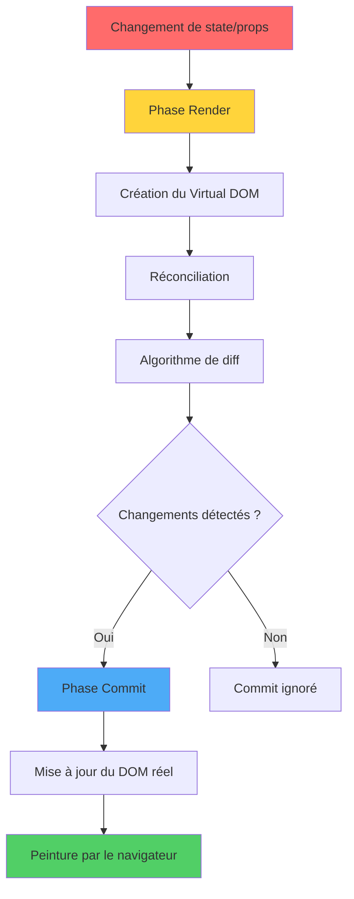
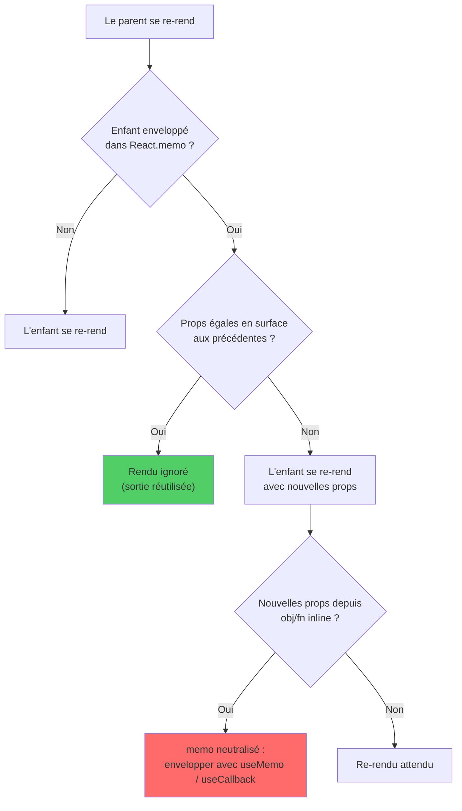
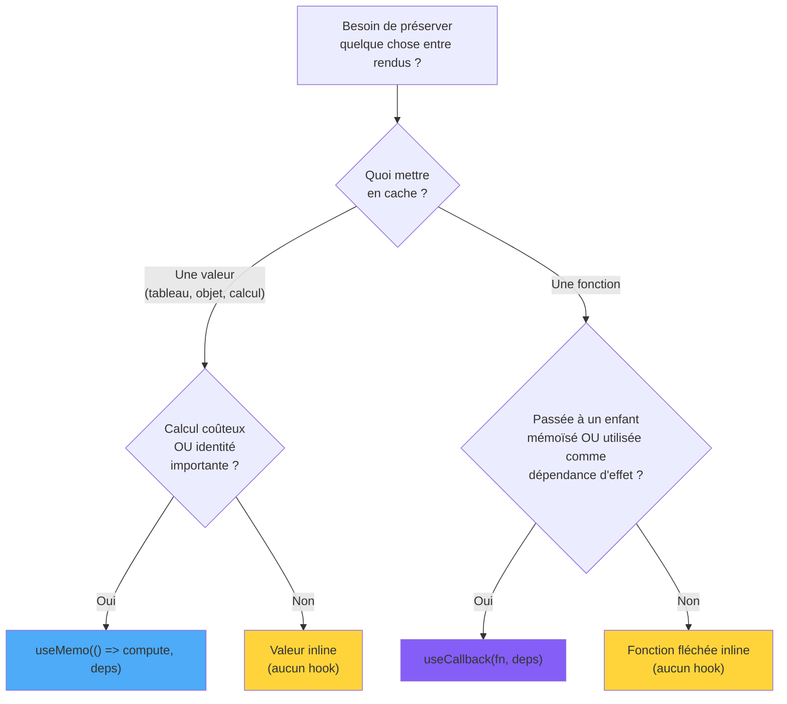
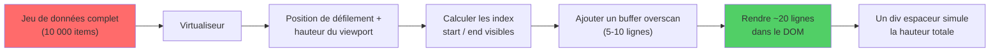
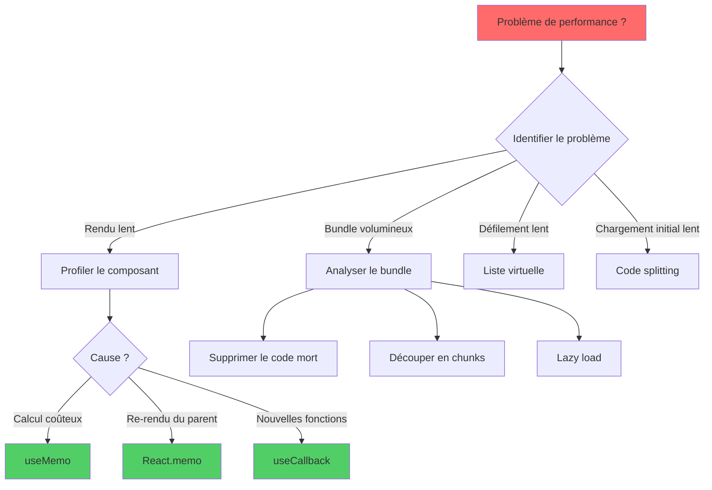

# Optimisation des Performances en React

> Techniques pour des applications React rapides et réactives

---

## 1. React Rendering Behavior

### Le processus de rendu

Le processus de rendu de React comporte deux phases principales : **render** (création du Virtual DOM) et **commit** (mise à jour du DOM réel).



### Quand React rend

Un composant est rendu à nouveau quand :

1. Son **état** change.
2. Ses **props** changent.
3. Le **context** qu'il consomme change.
4. Son **parent** est rendu (sauf mémoïsation).

### Render vs Commit

- **Render** : React calcule le nouveau Virtual DOM.
- **Commit** : applique les différences au DOM réel.

Un rendu sans différences dans le DOM est peu coûteux mais pas gratuit : les calculs lourds pendant le render impactent quand même.

---

## 2. React.memo: Preventing Re-renders

### Arbre de décision React.memo

Quand le parent se re-rend, React parcourt cette décision pour savoir si un enfant mémoïsé doit aussi se rendre. La comparaison superficielle est la porte critique — les objets/fonctions inline la défont.



### Fonctionnement

`React.memo` mémoïse un composant, évitant les rendus si les props sont superficiellement égales.

```tsx
const Lourd = React.memo(function Lourd({ donnees }: { donnees: Donnees }) {
  return <div>{calcule(donnees)}</div>;
});
```

### Quand ça marche

- Props **stables** (références inchangées entre rendus).
- Composants **coûteux** à rendre.
- Re-rendus du parent **fréquents**.

### Quand ça N'AIDE PAS

- Props recréées à chaque rendu (objets/fonctions inline).
- Composants déjà légers.
- Composants qui reçoivent des `children`.

---

## 3. useMemo and useCallback Patterns

### useMemo vs useCallback : lequel choisir ?

Les deux cachent quelque chose entre les rendus, mais ils cachent des choses différentes. Cet arbre vous aide à choisir le bon outil — et rappelez-vous que la bonne réponse est souvent « aucun des deux ».



### useMemo pour les valeurs

Quand le calcul est lourd ou qu'il faut préserver l'identité référentielle :

```tsx
const items = useMemo(() => filtrer(donnees, filtre), [donnees, filtre]);
```

### useCallback pour les fonctions

Quand vous passez une fonction à un enfant mémoïsé :

```tsx
const onClick = useCallback(() => faire(id), [id]);
```

### Erreur courante

Envelopper **tout** dans useMemo/useCallback n'est pas gratuit : chaque appel a un coût. Mémoïsez uniquement là où il y a un bénéfice mesurable.

---

## 4. Code Splitting and Lazy Loading

### React.lazy + Suspense

```tsx
const Dashboard = lazy(() => import('./Dashboard'));

<Suspense fallback={<Loader />}>
  <Dashboard />
</Suspense>
```

### Splits stratégiques

- **Par route** : chaque page devient un chunk séparé.
- **Par feature lourde** : éditeur, graphiques, modales aux dépendances coûteuses.
- **Par condition** : features visibles uniquement pour un sous-ensemble d'utilisateurs.

---

## 5. Bundle Size Optimization

### Stratégies

1. **Tree shaking** : utilisez `import { foo } from 'lib'` plutôt que `import * as`.
2. **Remplacez les dépendances lourdes** : moment → date-fns/dayjs.
3. **Polyfills ciblés** : utilisez `core-js` avec `useBuiltIns: 'usage'`.
4. **Compression** : brotli/gzip côté serveur.
5. **CDN pour les bibliothèques communes** : React peut venir d'un CDN dans certaines configurations.

### Analyse

Outils : `vite-bundle-visualizer`, `webpack-bundle-analyzer`, `rollup-plugin-visualizer`.

---

## 6. Virtual Scrolling for Large Lists

### Comment fonctionne la virtualisation

Au lieu de rendre les 10 000 lignes d'emblée, un virtualiseur mesure le viewport, calcule quelle tranche de la liste est visible (plus un petit buffer pour un défilement fluide) et ne monte que ces lignes. Le reste est représenté par un seul espaceur haut.



### Problème

Rendre 10 000 éléments dans le DOM ralentit tout.

### Solution

Rendez uniquement les éléments visibles. Bibliothèques : `react-window`, `@tanstack/react-virtual`.

```tsx
import { FixedSizeList } from 'react-window';

<FixedSizeList height={500} width={300} itemSize={32} itemCount={items.length}>
  {({ index, style }) => <div style={style}>{items[index].nom}</div>}
</FixedSizeList>
```

---

## 7. Profiling with React DevTools

### Profiler

React DevTools propose un onglet « Profiler » qui enregistre les rendus et affiche :

- Quels composants ont été rendus
- Combien de temps a duré chaque rendu
- Pourquoi le rendu a eu lieu (props, state, parent)

### Stratégie

1. Profilez avant d'optimiser.
2. Identifiez les 2-3 composants les plus coûteux.
3. Mémoïsez/refactorisez uniquement ceux-là.
4. Vérifiez l'amélioration mesurée.

---

## 8. Advanced Optimization Techniques

### Techniques

- **Splitting du state** : état global découpé en slices pour réduire la portée des re-rendus.
- **Context selectors** : bibliothèques comme `use-context-selector` pour éviter les re-rendus quand seule une partie de la valeur change.
- **Concurrent features** (React 18) : `useTransition`, `useDeferredValue` pour une UI réactive pendant des calculs lourds.

### useTransition

```tsx
const [isPending, startTransition] = useTransition();

const onChange = (val: string) => {
  setInput(val); // urgent
  startTransition(() => {
    setListe(filtrer(big, val)); // non urgent
  });
};
```

---

## 9. Performance Monitoring

### Métriques Web Vitals

- **LCP** (Largest Contentful Paint)
- **FID** (First Input Delay) / **INP** (Interaction to Next Paint)
- **CLS** (Cumulative Layout Shift)

Outils : npm `web-vitals`, Lighthouse, RUM (Real User Monitoring) comme Sentry ou Datadog.

### Budget de performance

Définissez des seuils dans le CI :
- Bundle initial < X KB
- LCP < 2,5s
- Rendu du composant principal < 50ms

---

## 10. Optimization Strategy Selection

### Matrice de décision



### Quand utiliser quoi

| Problème | Solution |
|----------|----------|
| Bundle volumineux | Code splitting, tree shaking |
| Listes longues | Virtualisation |
| Calculs lourds | useMemo, Web Worker |
| Re-rendus excessifs | React.memo, selectors |
| Formulaire lent | Composants non contrôlés |
| Navigation lente | Prefetch des chunks |

---

## Conclusion: Performance Mastery

### Conclusion

La règle d'or : **mesurez d'abord, optimisez ensuite**. L'optimisation prématurée est le plus grand ennemi de la maintenabilité. Trois points clés :

1. **Profilez avec React DevTools** avant de toucher au code.
2. **Mémoïsez uniquement où il y a un bénéfice réel**.
3. **La performance est UX** : budgets et métriques devraient faire partie du CI.
