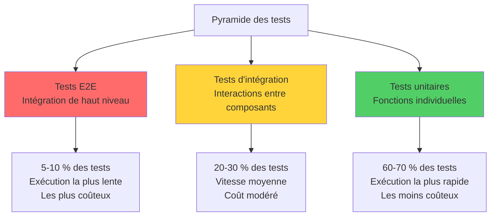
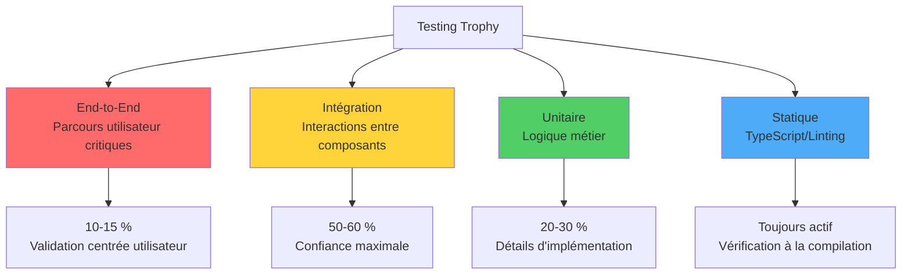
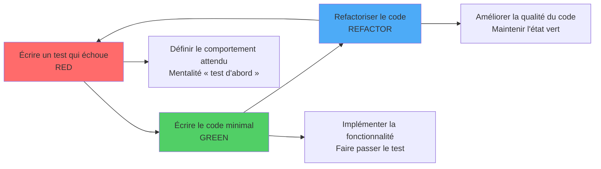
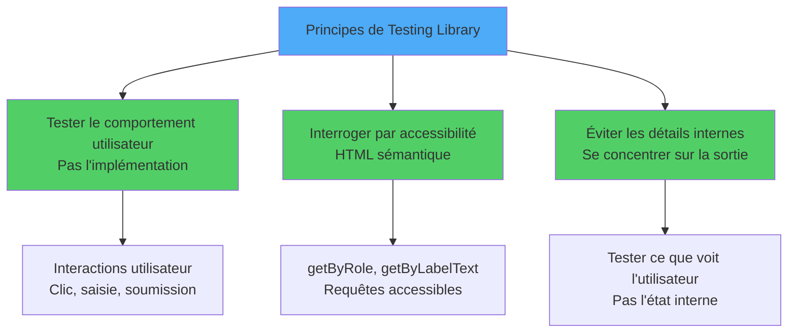
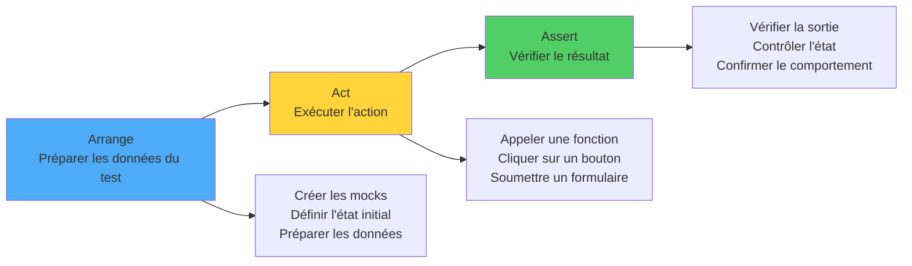
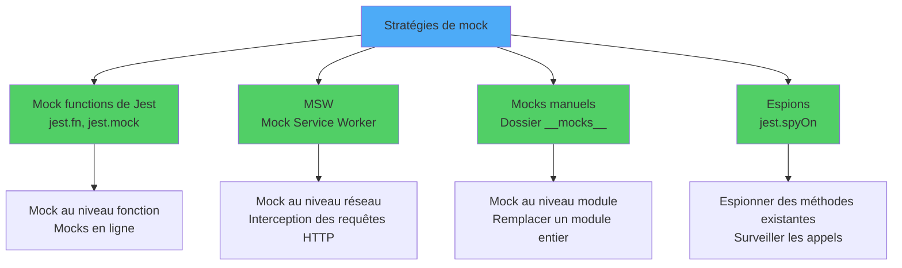
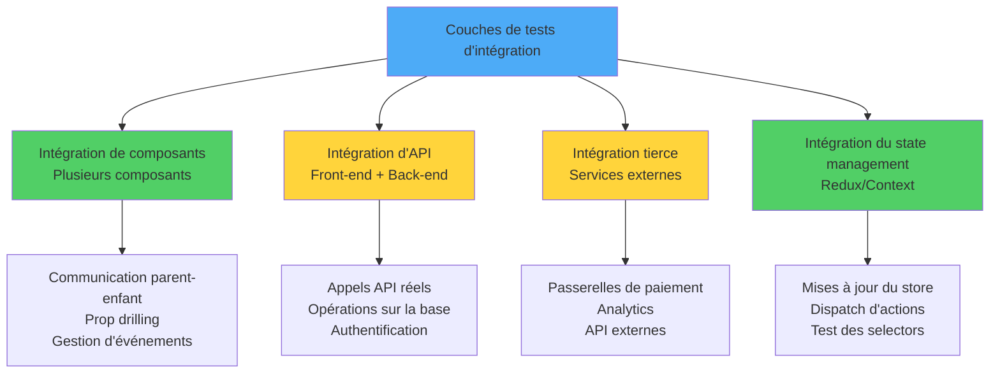
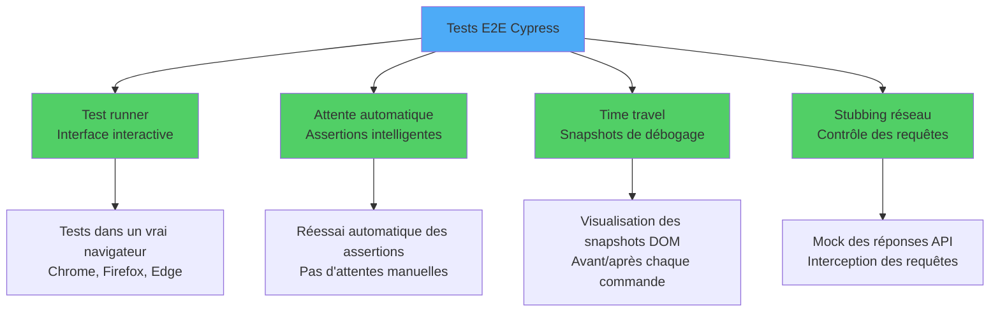
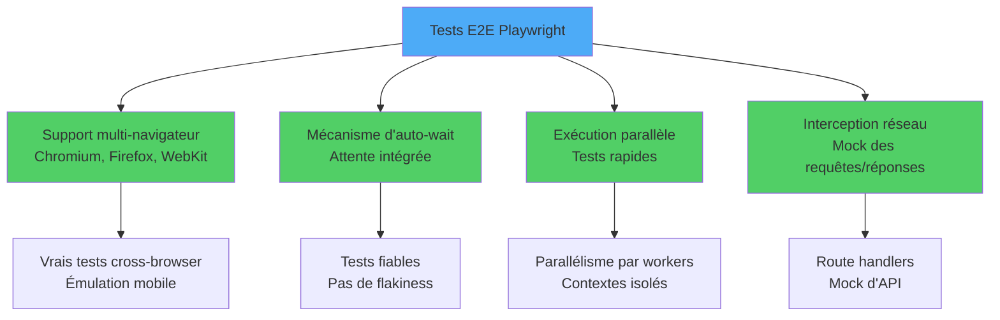
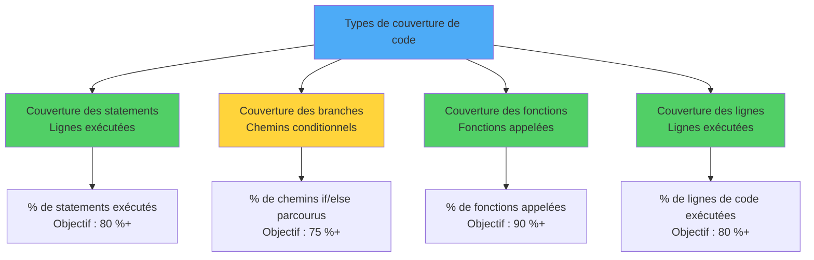

# Tests en React

> Stratégies et outils pour tester composants, hooks et applications React

---

## 1. Testing Fundamentals and Philosophy

### Pyramide des tests

```
       ╱─────────╲
      ╱   E2E    ╲       <- peu, lents, confiance élevée
     ╱─────────────╲
    ╱  Intégration  ╲    <- nombreux, modérés
   ╱─────────────────╲
  ╱       Unit         ╲ <- très nombreux, rapides, ciblés
```

Représentée sous forme de graphe, la pyramide met en évidence les proportions et le coût relatif de chaque niveau :



### Modèle du « Testing Trophy » (écosystème React)

Popularisé par Kent C. Dodds, le trophée déplace le centre de gravité vers les tests d'intégration et ajoute une base statique (TypeScript, linting) :



### Cycle Test-Driven Development (TDD)

Le TDD repose sur trois phases répétées en boucle, souvent appelées **Red-Green-Refactor** :



### Philosophie « Test Like a User »

Tests qui se concentrent sur le **comportement observable** plutôt que sur les détails d'implémentation. Citation de Kent C. Dodds : *« The more your tests resemble the way your software is used, the more confidence they can give you. »*

---

## 2. Unit Testing with Jest

### Configuration de base

```tsx
// somme.test.ts
import { somme } from './somme';

describe('somme', () => {
  it('additionne deux nombres positifs', () => {
    expect(somme(2, 3)).toBe(5);
  });
});
```

### Matchers essentiels

- `toBe` : égalité pour les primitifs.
- `toEqual` : comparaison profonde d'objets.
- `toContain` : tableaux/chaînes.
- `toThrow` : une fonction lance.
- `toHaveBeenCalledWith` : spy appelé avec des arguments spécifiques.

### Lifecycle

`beforeAll`, `beforeEach`, `afterEach`, `afterAll` pour setup/teardown.

---

## 3. Component Testing with React Testing Library

### Philosophie de React Testing Library

React Testing Library encourage à interroger le DOM comme le ferait un utilisateur — via les rôles ARIA, les labels et le texte visible — plutôt qu'à inspecter l'état interne :



### Exemple

```tsx
import { render, screen } from '@testing-library/react';
import userEvent from '@testing-library/user-event';
import { Compteur } from './Compteur';

it('incrémente au clic', async () => {
  const utilisateur = userEvent.setup();
  render(<Compteur />);

  expect(screen.getByText('Compteur : 0')).toBeInTheDocument();
  await utilisateur.click(screen.getByRole('button', { name: /incrémenter/i }));
  expect(screen.getByText('Compteur : 1')).toBeInTheDocument();
});
```

### Queries recommandées

1. `getByRole` (préféré, accessible)
2. `getByLabelText` (formulaires)
3. `getByPlaceholderText`
4. `getByText`
5. `getByTestId` (dernier recours)

---

## 4. Writing Effective Test Cases

### Pattern AAA

- **Arrange** : préparez l'état et les mocks.
- **Act** : exécutez l'action.
- **Assert** : vérifiez le résultat attendu.

Visualisé comme un flux linéaire :



### Noms descriptifs

```tsx
it("affiche un message d'erreur quand l'email est invalide", ...);
it("désactive le bouton pendant l'envoi du formulaire", ...);
```

Évitez : `it('marche', ...)` ou `it('test 1', ...)`.

### Une assertion par concept

Plusieurs assertions sont acceptables si elles mesurent le même comportement. Séparez les tests quand ils décrivent des concepts différents.

---

## 5. Mocking API Calls and Dependencies

### Panorama des stratégies de mock

Plusieurs niveaux d'isolation sont possibles, du mock de fonction jusqu'à l'interception réseau :



### Mock de fetch

```tsx
beforeEach(() => {
  global.fetch = jest.fn(() =>
    Promise.resolve({
      ok: true,
      json: () => Promise.resolve({ id: 1, nom: 'Marie' }),
    }) as any
  );
});
```

### MSW (Mock Service Worker)

Approche moderne : intercepte les requêtes HTTP au niveau réseau, laissez les composants inchangés :

```tsx
import { rest } from 'msw';
import { setupServer } from 'msw/node';

const server = setupServer(
  rest.get('/api/utilisateurs', (req, res, ctx) => res(ctx.json([{ id: 1, nom: 'Marie' }])))
);

beforeAll(() => server.listen());
afterEach(() => server.resetHandlers());
afterAll(() => server.close());
```

---

## 6. Integration Testing Strategies

### Architecture des tests d'intégration

Les tests d'intégration couvrent plusieurs couches : composants, API, services tiers et gestion d'état :



### Quoi tester

Une fonctionnalité complète : formulaire + soumission + réponse API + UI mise à jour. Gardez le mock au plus proche de la frontière (réseau, DB), pas au niveau du composant.

### Exemple

```tsx
it('complète le flux de connexion', async () => {
  const utilisateur = userEvent.setup();
  render(<App />);

  await utilisateur.type(screen.getByLabelText(/email/i), 'marie@example.com');
  await utilisateur.type(screen.getByLabelText(/mot de passe/i), 'secret');
  await utilisateur.click(screen.getByRole('button', { name: /se connecter/i }));

  expect(await screen.findByText(/bienvenue, marie/i)).toBeInTheDocument();
});
```

---

## 7. End-to-End Testing with Cypress

### Architecture de Cypress

Cypress combine un test runner interactif, l'attente automatique, le time travel et le stubbing réseau :



### Setup

```bash
npm install --save-dev cypress
npx cypress open
```

### Exemple

```js
describe('Connexion', () => {
  it('connexion avec identifiants valides', () => {
    cy.visit('/login');
    cy.findByLabelText(/email/i).type('marie@example.com');
    cy.findByLabelText(/mot de passe/i).type('secret');
    cy.findByRole('button', { name: /se connecter/i }).click();
    cy.findByText(/bienvenue/i).should('be.visible');
  });
});
```

### Avantages

- Exécution réelle dans le navigateur.
- Time travel debugger.
- Network mocking intégré.

---

## 8. End-to-End Testing with Playwright

### Architecture de Playwright

Playwright vise les tests multi-navigateurs réellement parallèles, avec attente intégrée et interception réseau :



### Exemple

```ts
import { test, expect } from '@playwright/test';

test('connexion', async ({ page }) => {
  await page.goto('/login');
  await page.getByLabel('Email').fill('marie@example.com');
  await page.getByLabel('Mot de passe').fill('secret');
  await page.getByRole('button', { name: 'Se connecter' }).click();
  await expect(page.getByText('Bienvenue')).toBeVisible();
});
```

### Cypress vs Playwright

- **Cypress** : excellente expérience développeur, écosystème mature.
- **Playwright** : multi-navigateur (Chromium, Firefox, WebKit), plus rapide, parallélisation native.

---

## 9. Test Coverage and Quality Metrics

### Couverture

```bash
jest --coverage
```

Quatre métriques principales mesurent la couverture, chacune avec son seuil cible :



Seuils typiques :
- Statements : 80 %
- Branches : 75 %
- Functions : 80 %

### Attention

**100 % de couverture ne garantit pas la qualité**. Une ligne couverte peut ne pas être réellement testée. Les métriques servent d'alerte précoce, pas d'objectif final.

---

## 10. Testing Best Practices and Patterns

### Bonnes pratiques

1. **Tests déterministes** : pas de dates aléatoires, pas d'API réelles.
2. **Tests indépendants** : chacun peut tourner seul.
3. **Nommage clair** : le nom dit ce que fait le test.
4. **Setup minimal** : utilisez helpers et factories.
5. **Tests rapides** : séparez unit/integration/e2e.
6. **Run en CI** : bloque les merges si les tests échouent.

### Anti-patterns

- Tester l'implémentation (ex. noms de méthodes privées).
- Snapshots énormes et fragiles.
- Mocks trop profonds qui reproduisent la logique.
- Tests séquentiels qui dépendent les uns des autres.

---

## Conclusion

### Conclusion

Le testing en React est une discipline. Trois choses à retenir :

1. **Testez comme un utilisateur** : utilisez React Testing Library et des queries accessibles.
2. **Mock à la frontière** : utilisez MSW plutôt que des mocks manuels profonds.
3. **Pyramide équilibrée** : beaucoup d'unit, quelques integration, peu d'e2e critiques.
