# Prérequis : ce qu'il vous faut avant React Native

> Les connaissances en React, JavaScript, outillage et mobile que vous devez impérativement maîtriser avant d'écrire votre premier composant React Native.

---

## Table of Contents

1. [React (Non-Negotiable)](#1-react-non-negotiable)
2. [JavaScript / TypeScript](#2-javascript--typescript)
3. [Tooling](#3-tooling)
4. [Mobile Concepts](#4-mobile-concepts)

---

## 1. React (non négociable)

### Pourquoi la connaissance de React passe avant tout

React Native n'est pas un framework distinct qui ressemblerait par hasard à React. Il **est** React — le même modèle de composants, les mêmes hooks, le même moteur de réconciliation — exécuté avec un renderer différent. Sur le web, React dialogue avec `react-dom` et produit des éléments `<div>` et `<span>`. Dans React Native, React dialogue avec un bridge (ou le JSI de la nouvelle architecture) et produit des instances natives `UIView` et `android.view.View`. Le code des composants que vous écrivez est le même. Si vous ne comprenez pas déjà React, vous affronterez deux courbes d'apprentissage à la fois, et vous perdrez sur les deux tableaux.

Voici le modèle mental clé. React lui-même n'est qu'une bibliothèque qui décide **ce qui** doit être à l'écran — il construit un arbre d'éléments et détermine ce qui a changé. Il ne sait **pas** comment dessiner quoi que ce soit. Le dessin est délégué à un « renderer ». `react-dom` est le renderer pour les navigateurs. `react-native` est le renderer pour les téléphones. Même cerveau, mains différentes.

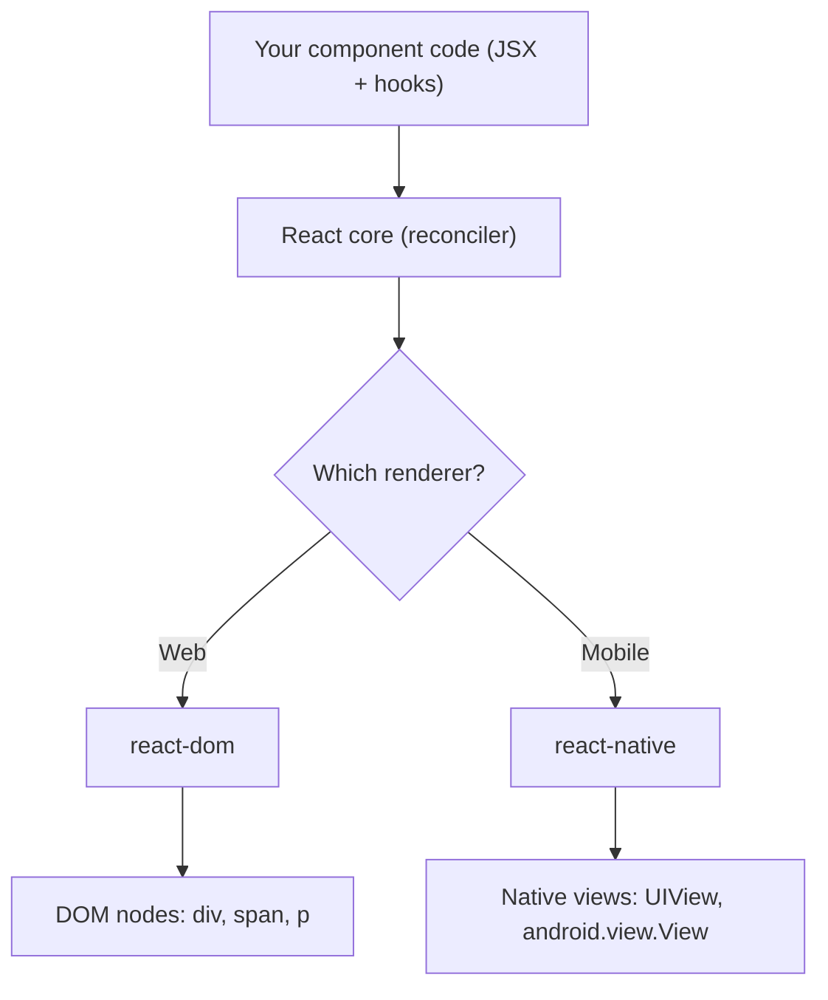

Ceci est une checklist, pas un tutoriel. Si l'un des points ci-dessous vous semble peu familier, revenez aux chapitres React et comblez la lacune avant de continuer. Considérez un « non » sur n'importe quelle ligne comme un arrêt impératif.

### Composants fonctionnels, JSX, props et state

Chaque écran React Native est un arbre de composants fonctionnels. Vous devez être à l'aise pour écrire un composant qui accepte des props, détient un state local et retourne du JSX. Les composants de classe fonctionnent encore, mais l'écosystème — bibliothèques de navigation, bibliothèques d'animation, gestionnaires de state — suppose des fonctions et des hooks partout. Ne perdez pas votre temps à apprendre le cycle de vie des classes pour le travail React Native.

```tsx
// This component works identically in React web and React Native
// (swap <div> / <p> for <View> / <Text> and you're done)
type GreetingProps = {
  name: string;
};

function Greeting({ name }: GreetingProps) {
  const [visits, setVisits] = useState(0);

  useEffect(() => {
    setVisits(prev => prev + 1);
  }, []);

  return (
    <View>
      <Text>Hello, {name}. Visit #{visits}</Text>
    </View>
  );
}
```

Sur le web, vous retournez `<div>` et `<p>`. Dans React Native, vous retournez `<View>` et `<Text>`. La connaissance React — le typage des props, l'initialisation du state, l'effect — est identique.

Il existe une règle JSX qui fait trébucher tout développeur web dès sa première heure : **dans React Native, le texte brut doit se trouver à l'intérieur d'un composant `<Text>`.** Sur le web, `<div>Hello</div>` est correct. Dans React Native, `<View>Hello</View>` provoque un crash à l'exécution. `<View>` ressemble davantage à un `<div>` avec `display: flex` intégré — une boîte de mise en page — et il ne peut pas contenir de caractères libres.

| Web (react-dom) | React Native | Notes |
|-----------------|--------------|-------|
| `<div>` | `<View>` | Boîte de mise en page. Flexbox par défaut, pas de texte directement à l'intérieur. |
| `<p>`, `<span>`, `<h1>` | `<Text>` | Le SEUL endroit où le texte brut est autorisé. |
| `` | `<Image>` | Nécessite une largeur/hauteur explicite ; aucune taille intrinsèque déduite d'une URL. |
| `<button>` | `<Pressable>` / `<Button>` | Aucun style par défaut sur `Pressable` ; c'est vous qui le construisez. |
| `<input>` | `<TextInput>` | |
| Fichier CSS / className | `StyleSheet.create` + prop `style` | Pas de cascade CSS, pas de feuille de style globale. |

> **Erreur fréquente :** `Invariant Violation: Text strings must be rendered within a <Text> component.` Cela signifie presque toujours que vous avez placé du texte (ou une espace finale, ou un `{condition && 'text'}` égaré) directement à l'intérieur d'un `<View>`. Enveloppez-le dans un `<Text>`.

### Tous les hooks fondamentaux

Vous avez besoin d'une expérience pratique de chaque hook de cette liste avant de toucher à React Native, car les bibliothèques spécifiques au mobile s'appuient fortement dessus :

| Hook | Pourquoi c'est important en RN |
|------|----------------------|
| `useState` | State d'UI local — modales, bascules, champs de formulaire |
| `useEffect` | Souscription aux événements de l'appareil (clavier, état de l'app, deep links) |
| `useRef` | Conserver des références aux vues natives pour les méthodes impératives (scroll, focus, mesure) |
| `useMemo` | Transformations coûteuses de listes sur du matériel mobile contraint |
| `useCallback` | Callbacks stables pour les render items de `FlatList` (évite le re-render complet des longues listes) |
| `useContext` | Thème, locale, authentification — les apps RN les transmettent en profondeur |
| `useReducer` | State d'écran complexe où plusieurs champs changent ensemble |

Si vous n'avez utilisé que `useState` et `useEffect`, vous n'êtes pas prêt. La performance de React Native dépend de votre capacité à savoir quand recourir à `useMemo` et `useCallback` — les appareils mobiles n'ont pas la marge nécessaire pour re-render à la légère.

Voici un exemple concret où `useMemo` + `useCallback` justifient leur présence dans un écran de liste, le scénario de performance le plus courant dans les apps mobiles :

```tsx
function ContactList({ contacts, query }: { contacts: Contact[]; query: string }) {
  // useMemo: only re-filter when the inputs actually change.
  // On a 5,000-row list on a budget Android phone, re-filtering on every
  // keystroke-driven re-render would drop frames.
  const filtered = useMemo(
    () => contacts.filter(c => c.name.toLowerCase().includes(query.toLowerCase())),
    [contacts, query],
  );

  // useCallback: a STABLE function identity so FlatList doesn't think
  // renderItem changed on every render (which would re-render every row).
  const renderItem = useCallback(
    ({ item }: { item: Contact }) => <ContactRow contact={item} />,
    [],
  );

  return <FlatList data={filtered} renderItem={renderItem} keyExtractor={c => c.id} />;
}
```

> **Astuce de pro :** Le web pardonne les renders inutiles parce que le diff du DOM est peu coûteux et s'exécute sur la même machine rapide à laquelle l'utilisateur est assis. Sur un téléphone Android à 150 $, ce même gaspillage se manifeste par un saccade visible. `useMemo`/`useCallback` ne sont pas une optimisation prématurée dans le code de liste RN — ce sont le minimum requis.

### Hooks personnalisés et règles des hooks

Les bibliothèques de navigation comme React Navigation exposent des hooks (`useNavigation`, `useFocusEffect`). Les bibliothèques d'animation exposent des hooks (`useSharedValue`, `useAnimatedStyle`). Vous consommerez des dizaines de hooks personnalisés et écrirez les vôtres (`useKeyboardHeight`, `useAppState`, `useDebounce`). Si vous ne comprenez pas comment les hooks personnalisés composent les hooks intégrés, ou pourquoi les hooks ne peuvent pas être appelés de façon conditionnelle, vous produirez des bugs invisibles jusqu'à ce qu'ils provoquent un crash.

```tsx
// A custom hook you'll write within your first week of RN
function useAppState() {
  const [appState, setAppState] = useState(AppState.currentState);

  useEffect(() => {
    const sub = AppState.addEventListener('change', setAppState);
    return () => sub.remove();
  }, []);

  return appState;
}
```

C'est du React pur — `useState` plus `useEffect` avec un nettoyage. La seule partie spécifique à RN est `AppState`. Si le pattern des hooks vous semble peu familier, arrêtez-vous ici et étudiez d'abord les hooks.

Les « règles des hooks » existent parce que React identifie chaque hook par l'**ordre** dans lequel il est appelé, et non par un nom. Chaque render doit appeler les mêmes hooks dans la même séquence. Si vous cachez un hook derrière un `if`, l'ordre change d'un render à l'autre et la comptabilité interne de React pointe vers le mauvais emplacement.

```tsx
// WRONG — hook called conditionally. The hook order changes when
// `isLoggedIn` flips, and React's state slots get misaligned.
function Profile({ isLoggedIn }: { isLoggedIn: boolean }) {
  if (isLoggedIn) {
    const [name, setName] = useState(''); // ❌ sometimes called, sometimes not
  }
  // ...
}

// RIGHT — always call the hook, branch on the value instead.
function Profile({ isLoggedIn }: { isLoggedIn: boolean }) {
  const [name, setName] = useState(''); // ✅ always called, always in order
  if (!isLoggedIn) return <LoginPrompt />;
  // ...
}
```

> **Piège :** La règle ESLint `react-hooks/rules-of-hooks` détecte la plupart des violations au moment de l'écriture. Installez ESLint dès le premier jour (voir la section Outillage) — sur mobile, vous n'avez pas de console de navigateur qui veille sur vous, alors laissez le linter être votre première ligne de défense.

### Le modèle de rendu

React Native utilise le même reconciler que React web. Lorsque le state change, le composant se re-render, React effectue le diff de l'arbre virtuel, et seuls les nœuds modifiés sont envoyés du côté natif. Comprendre les re-renders, les clés de réconciliation, et pourquoi retourner un nouvel objet depuis un parent force les enfants à se re-render n'est pas une connaissance optionnelle — c'est le principal levier de performance dont vous disposez.

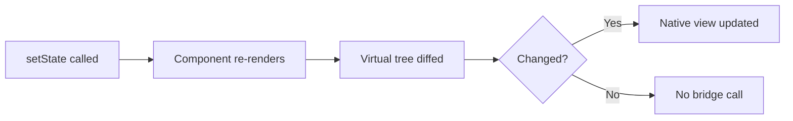

Sur le web, un re-render inutile coûte une mise à jour du DOM peu chère. Sur mobile, un re-render inutile peut traverser le bridge JS-vers-natif et déclencher une passe de mise en page sur le thread UI. Le coût est plus élevé, donc la connaissance compte davantage.

Un piège subtil qui touche aussi bien les développeurs web que mobiles : passer un objet, un tableau ou une fonction fraîchement créés comme prop met en échec la mémoïsation, car une nouvelle référence est `!==` à l'ancienne même lorsque le contenu est identique.

```tsx
// Every render creates a NEW style object and a NEW onPress function.
// A memoized <Row> would re-render anyway because the props "changed".
<Row style={{ padding: 8 }} onPress={() => doThing(id)} />

// Fix: hoist the style (StyleSheet.create) and stabilize the callback.
const styles = StyleSheet.create({ row: { padding: 8 } });
const onPress = useCallback(() => doThing(id), [id]);
<Row style={styles.row} onPress={onPress} />
```

> **Astuce de pro :** `StyleSheet.create({...})` n'est pas qu'une simple convention. Il enregistre vos styles une seule fois et permet à RN de passer un ID entier à travers le bridge au lieu d'un nouvel objet à chaque render. C'est à la fois un gain de performance et une référence stable — deux avantages pour le prix d'un.

### Refs, handles impératifs et Suspense

Vous appellerez `.scrollToIndex()` sur une ref de `FlatList`, `.focus()` sur une ref de `TextInput`, et `.measure()` sur une ref de `View`. `useRef` et `forwardRef` / `useImperativeHandle` ne sont pas des cas marginaux dans React Native — ce sont des outils quotidiens.

```tsx
// Imperative focus — extremely common in forms where tapping
// "Next" on the keyboard should jump to the following field.
function LoginForm() {
  const passwordRef = useRef<TextInput>(null);

  return (
    <>
      <TextInput
        placeholder="Email"
        returnKeyType="next"
        onSubmitEditing={() => passwordRef.current?.focus()} // imperative jump
      />
      <TextInput ref={passwordRef} placeholder="Password" secureTextEntry />
    </>
  );
}
```

Les refs sont la porte de sortie pour le petit ensemble d'opérations intrinsèquement impératives — donner le focus à un champ, faire défiler une liste jusqu'à une ligne, mesurer la position en pixels d'une vue. Sur le web, vous recouriez aux refs pour appeler `.focus()` ou `.play()` sur une `<video>` ; en RN, le même réflexe s'applique, mais aux composants natifs.

Suspense est plus récent dans le monde mobile, mais les bibliothèques de récupération de données (React Query, SWR) et la nouvelle architecture de React Native s'articulent de plus en plus autour de lui. Vous devriez comprendre les frontières `<Suspense>` et comment elles interagissent avec l'UI de repli au niveau conceptuel, même si vous ne les avez pas encore utilisées en production.

---

## 2. JavaScript / TypeScript

### Les fonctionnalités ES2022+ que vous utiliserez quotidiennement

Les projets React Native sont transpilés par Metro (le bundler), vous disposez donc de la syntaxe moderne d'emblée. Le code que vous lisez — source des bibliothèques, réponses Stack Overflow, documentation officielle — suppose que vous maîtrisez couramment tous ces éléments :

```tsx
// Destructuring (props, hook returns, API responses)
const { userId, token } = route.params;
const [items, setItems] = useState<Item[]>([]);

// Spread (immutable state updates, merging style objects)
const updated = { ...user, name: newName };
const combined = StyleSheet.compose(baseStyle, overrideStyle);

// Optional chaining (deeply nested API responses)
const city = response?.data?.address?.city ?? 'Unknown';

// Nullish coalescing (default values that respect 0 and '')
const pageSize = config.pageSize ?? 20;

// Template literals, array methods (map, filter, find, reduce)
const ids = users.filter(u => u.isActive).map(u => u.id);
```

Si l'un de ces éléments vous semble peu familier, ne poursuivez pas. Le code React Native est dense en destructuring et en optional chaining. Le lire sera pénible sans aisance.

Une distinction qui cause de vrais bugs : `??` (nullish coalescing) n'est **pas** la même chose que `||` (ou logique). `||` traite `0`, `''` et `false` comme « manquants » ; `??` ne traite ainsi que `null` et `undefined`. Sur un écran de paramètres où `0` est une valeur valide (volume, luminosité, un compteur), utiliser `||` écrase silencieusement le `0` de l'utilisateur par votre valeur par défaut.

```tsx
const volume = settings.volume || 10; // ❌ user's volume of 0 becomes 10
const volume = settings.volume ?? 10; // ✅ only undefined/null falls back to 10
```

> **Piège :** `a?.b.c` court-circuite TOUTE la chaîne vers `undefined` si `a` est nullish — il ne lève pas d'erreur. Mais `(a?.b).c` lève bien une erreur si `a` est nullish, parce que les parenthèses forcent `.c` à s'exécuter sur `undefined`. Faites circuler le `?.` à travers chaque étape incertaine.

### Promises, async/await et propagation des erreurs

Chaque appel réseau, chaque lecture de stockage, chaque demande de permission dans React Native est asynchrone. Vous devez être à l'aise pour enchaîner `async/await`, propager les erreurs avec try/catch, et comprendre ce qui se passe lorsqu'une Promise est rejetée à l'intérieur d'un `useEffect`.

```tsx
// A pattern you'll write hundreds of times in RN
useEffect(() => {
  let cancelled = false;

  async function loadProfile() {
    try {
      const res = await fetch(`https://api.example.com/user/${id}`);
      if (!res.ok) throw new Error(`HTTP ${res.status}`);
      const data = await res.json();
      if (!cancelled) setProfile(data);
    } catch (err) {
      if (!cancelled) setError(err instanceof Error ? err.message : 'Unknown');
    }
  }

  loadProfile();
  return () => { cancelled = true; };
}, [id]);
```

Le pattern du drapeau `cancelled` est crucial sur mobile. Lorsqu'un utilisateur quitte un écran, le composant est démonté, mais la requête réseau continue. Sans le drapeau, vous appelez `setState` sur un composant démonté. Sur le web, c'est un avertissement ; sur mobile, cela peut provoquer des bugs de navigation subtils.

Ce diagramme montre pourquoi le drapeau est important — la chronologie d'un tap-et-quitte rapide :

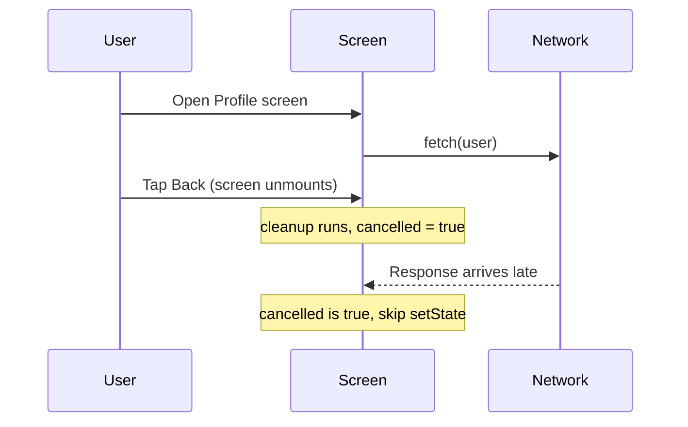

> **Erreur fréquente :** Marquer le callback de l'effect lui-même comme `async` — `useEffect(async () => {...})`. Une fonction async retourne une Promise, mais `useEffect` attend que la valeur de retour soit une fonction de nettoyage (ou rien). React traitera la Promise comme une « fonction de nettoyage » et votre vrai nettoyage ne s'exécutera jamais. Déclarez toujours une fonction `async` interne et appelez-la, comme montré ci-dessus.

### Closures et boucle d'événements

Sur le web, les bugs de closure se manifestent par un state obsolète dans les gestionnaires d'événements. Sur mobile, les mêmes bugs apparaissent dans les callbacks de gestes, les moteurs d'animation et les écouteurs d'événements natifs — et ils sont plus difficiles à déboguer parce que vous ne pouvez pas simplement ouvrir les DevTools du navigateur.

```tsx
// The classic stale closure bug — even more painful in RN
function BrokenTimer() {
  const [count, setCount] = useState(0);

  useEffect(() => {
    const id = setInterval(() => {
      // count is captured from the first render — always 0
      setCount(count + 1); // stuck at 1
    }, 1000);
    return () => clearInterval(id);
  }, []); // empty deps = effect runs once, closure captures initial count

  // Fix: use functional update
  // setCount(prev => prev + 1);
}
```

Pourquoi cela se produit-il ? Une closure « fige » les variables qu'elle peut voir au moment où la fonction est créée. Le callback de `setInterval` a été créé pendant le premier render, lorsque `count` valait `0`, il voit donc `0` pour toujours. La mise à jour fonctionnelle `setCount(prev => prev + 1)` contourne le piège en demandant à React la valeur *actuelle* plutôt qu'en lisant la valeur capturée obsolète.

Vous devez aussi comprendre la boucle d'événements — en particulier que du travail synchrone de longue durée sur le thread JS bloque le bridge et fige les animations. Si vous ne savez pas pourquoi `JSON.parse` sur une charge utile de 2 Mo fige le défilement, vous n'êtes pas prêt.

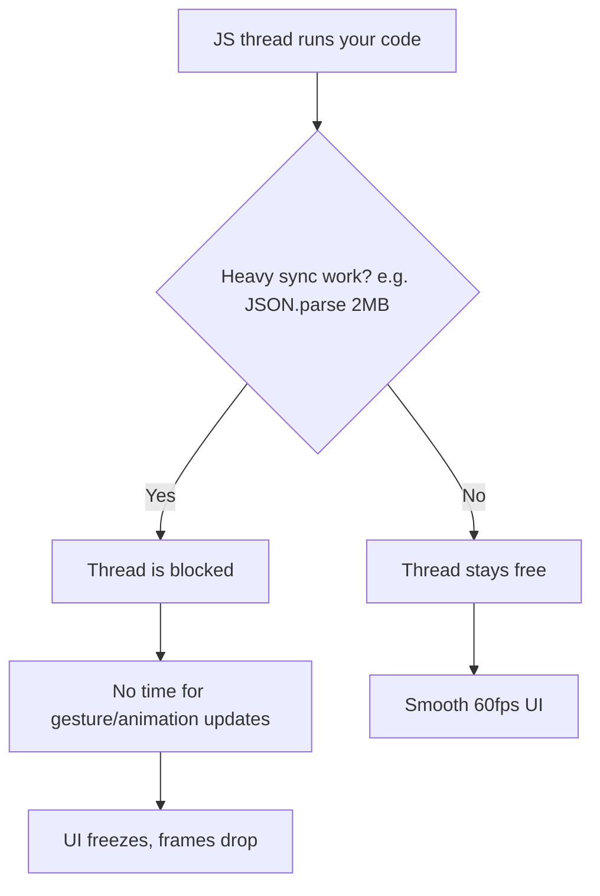

> **Astuce de pro :** React Native (dans l'architecture classique) exécute votre JavaScript sur un seul thread, distinct du thread UI natif. Tant que le thread JS suit le rythme, les animations pilotées nativement restent fluides — mais tout ce que vous faites de manière synchrone en JS (parsing, tri d'un énorme tableau, une boucle serrée) bloque tout ce que vous contrôlez. Déchargez le travail lourd, découpez-le, ou déplacez-le hors du thread JS (par ex. `InteractionManager`, worklets) plutôt que de l'exécuter en ligne pendant une interaction.

### TypeScript : generics, utility types, unions discriminées

React Native en 2026 est TypeScript-first. Le template officiel est livré avec TypeScript. Les params de navigation, les réponses d'API et les props des composants bénéficient tous d'un typage solide.

```tsx
// Generics: you'll type API responses and hook returns
async function fetchData<T>(url: string): Promise<T> {
  const res = await fetch(url);
  return res.json() as Promise<T>;
}

// Utility types: Partial for optional updates, Pick for subsets
type UserUpdate = Partial<Pick<User, 'name' | 'email' | 'avatar'>>;

// Discriminated unions: great for screen states
type ScreenState =
  | { status: 'loading' }
  | { status: 'error'; message: string }
  | { status: 'success'; data: User[] };

function renderScreen(state: ScreenState) {
  switch (state.status) {
    case 'loading': return <ActivityIndicator />;
    case 'error':   return <Text>{state.message}</Text>;
    case 'success': return <UserList data={state.data} />;
  }
}

// as const: useful for action types and config objects
const ROUTES = {
  HOME: 'Home',
  PROFILE: 'Profile',
  SETTINGS: 'Settings',
} as const;

type RouteName = typeof ROUTES[keyof typeof ROUTES];
// => 'Home' | 'Profile' | 'Settings'
```

L'union discriminée mérite une attention particulière car elle correspond parfaitement au cycle de vie de chaque écran qui charge des données. Le champ `status` partagé (le « discriminant ») permet à TypeScript de *réduire* le type à l'intérieur de chaque `case` — dans la branche `'error'`, il sait que `message` existe ; dans la branche `'success'`, il sait que `data` existe. Cela rend les états impossibles impossibles : vous ne pouvez jamais lire accidentellement `state.data` tant que `status` vaut `'loading'`, parce que ce champ n'existe pas sur cette variante.

| Fonctionnalité TS | Ce qu'elle vous apporte en RN | Usage typique |
|------------|----------------------|-------------|
| Generics `<T>` | Un helper typé unique pour de nombreuses formes de réponse | `fetchData<User>(url)` |
| `Partial<T>` | Tout-optionnel pour les mises à jour/patches | Formulaires d'édition, corps de `PATCH` |
| `Pick<T, K>` / `Omit<T, K>` | Tailler un sous-ensemble d'un type existant | Props dérivées d'un modèle |
| Union discriminée | États d'écran/de rendu exhaustifs et sûrs | loading / error / success |
| `as const` | Figer des littéraux en types string-literal étroits | Noms de routes, types d'action |

> **Piège :** Le système de types de React Navigation est l'un des montages génériques les plus complexes que vous rencontrerez. Si vous ne savez pas lire `NativeStackScreenProps<RootStackParamList, 'Profile'>` et comprendre ce que cela signifie, révisez les generics avant de commencer.

---

## 3. Tooling

### Gestionnaires de paquets : npm, yarn, pnpm

Les projets React Native utilisent les mêmes gestionnaires de paquets Node.js que les projets web. L'écosystème s'est largement stabilisé : **yarn** (Classic ou Berry) est le plus courant dans les projets RN, mais **npm** fonctionne très bien et **pnpm** gagne du terrain. Choisissez-en un et apprenez-le bien.

| Gestionnaire | Points forts | Quand l'utiliser |
|---------|-----------|-------------|
| **npm** | Livré avec Node, aucune configuration, convient à RN | Projets solo, voie la plus simple, valeurs par défaut de CI |
| **yarn (Classic/Berry)** | Le plus courant dans les repos RN existants, rapide, mature | Rejoindre une équipe qui l'utilise déjà |
| **pnpm** | Économe en espace disque (store partagé), deps strictes | Monorepos, nombreux projets sur une même machine |

> **Piège :** Ne mélangez jamais les gestionnaires dans un même repo. Un projet contenant à la fois un `package-lock.json` et un `yarn.lock` résoudra des arbres de dépendances différents selon qui exécute `install`, et les modules natifs de RN sont exactement le type de dépendance où une dérive de version se transforme en build cassé. Committez un seul lockfile, supprimez les autres.

Ce qui compte davantage que le gestionnaire que vous choisissez :

- **Lockfiles.** `package-lock.json`, `yarn.lock` ou `pnpm-lock.yaml` doivent être committés. React Native est notoirement sensible aux incompatibilités de versions de dépendances — une montée de version mineure dans un module natif peut casser votre build iOS. Si vous ne committez pas votre lockfile, le `install` de votre collègue récupère des versions différentes et son build échoue tandis que le vôtre fonctionne. Ce n'est pas hypothétique ; cela arrive chaque semaine.

- **Semver.** Vous devez savoir lire `^1.2.3` et savoir qu'il autorise `1.x.x` mais pas `2.0.0`. Vous devez savoir que `~1.2.3` n'autorise que `1.2.x`. Les bibliothèques React Native livrent fréquemment des changements cassants dans des versions mineures (l'écosystème évolue vite et tout le monde ne suit pas strictement le semver), il est donc essentiel de comprendre ce que votre lockfile épingle et ce qu'il laisse fluctuer.

| Plage | Autorise | Bloque | Signification |
|-------|--------|--------|---------|
| `1.2.3` | uniquement `1.2.3` | tout le reste | Épinglage exact |
| `~1.2.3` | `1.2.3` → `1.2.x` | `1.3.0` | Mises à jour de patch uniquement |
| `^1.2.3` | `1.2.3` → `1.x.x` | `2.0.0` | Mises à jour mineures + patch |
| `*` | n'importe quoi | rien | Ne faites jamais cela en RN |

```bash
# Commands you should be able to run without thinking
npm install                    # Install from lockfile
npm install react-native-svg  # Add a dependency
npm ls react-native            # Check installed version
npx react-native doctor       # Diagnose environment issues
```

### Git : branches, rebasing, résolution de conflits

Les releases mobiles sont plus structurées que les déploiements web. Vous aurez généralement une branche `main`, des branches de fonctionnalité et des branches de release. Vous devez être à l'aise avec :

- La création et le changement de branches
- Le rebasing des branches de fonctionnalité sur `main` pour garder un historique propre
- La résolution des conflits de merge dans `package.json` et les lockfiles (ils sont fréquents et agaçants)
- Le cherry-picking d'un correctif de `main` vers une branche de release lorsqu'un bug critique doit être livré

Pourquoi le mobile s'appuie-t-il davantage sur les branches que le web ? Sur le web, vous déployez un correctif et chaque utilisateur l'obtient au prochain chargement de page. Sur mobile, une version est **figée** dès qu'elle est livrée au store — les utilisateurs en v1.2 restent en v1.2 jusqu'à ce qu'ils mettent à jour. Les équipes maintiennent donc une branche de release vivante par version livrée pour rétroporter les hotfixes critiques, tandis que `main` file en avant avec les nouveaux travaux. C'est à cela que sert le cherry-pick.

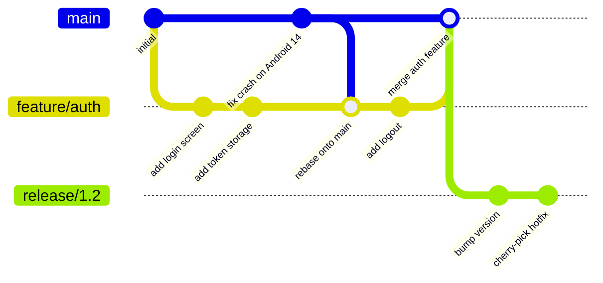

> **Piège :** Les conflits de merge dans `yarn.lock` ont l'air terrifiants — des milliers de lignes de hashs. N'essayez pas de les résoudre à la main. Supprimez le lockfile, exécutez `yarn install`, et committez le lockfile régénéré. C'est sûr parce que les contraintes du `package.json` sont la source de vérité.

### Aisance avec la CLI

Vous passerez du temps dans le terminal. La CLI de React Native est la façon dont vous buildez, exécutez, liez les modules natifs et diagnostiquez les problèmes. Vous devez être à l'aise pour exécuter des commandes, lire la sortie d'erreur et naviguer dans l'arborescence d'un projet depuis la ligne de commande.

```bash
# Commands you'll run every day
npx react-native start              # Start Metro bundler
npx react-native run-ios            # Build and run on iOS simulator
npx react-native run-android        # Build and run on Android emulator
npx react-native doctor             # Check environment setup
npx pod-install                     # Install CocoaPods (iOS deps)
```

Si vous utilisez Expo (recommandé pour les nouveaux projets), les commandes changent mais le principe est le même :

```bash
npx expo start                      # Start development server
npx expo run:ios                    # Build native iOS
npx expo run:android                # Build native Android
npx expo install react-native-svg   # Install with correct version
```

Il est utile de savoir ce que sont réellement ces deux couches. **Metro** est le bundler — l'équivalent de Webpack/Vite pour RN. Il surveille vos fichiers, transpile le JS/TS moderne, et sert un unique bundle JavaScript à l'app en cours d'exécution. Le **build natif** (Xcode pour iOS, Gradle pour Android) compile la coque de l'app proprement dite qui charge ce bundle. En développement, ils travaillent ensemble : l'app native s'exécute une fois, et Metro remplace à chaud votre JS au fur et à mesure de vos modifications.

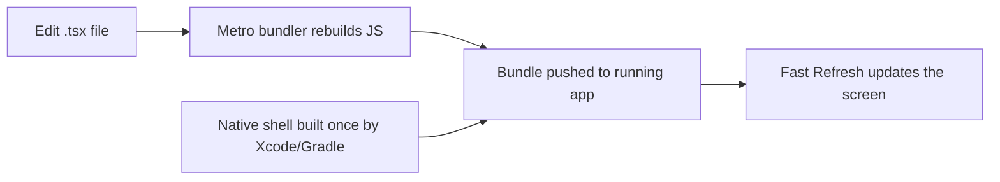

> **Piège :** « Ça marchait hier et maintenant c'est cassé » est très souvent un cache Metro obsolète. Avant de plonger dans un débogage approfondi, essayez `npx react-native start --reset-cache` (ou `npx expo start -c`). Cela résout une part étonnante d'écrans rouges mystérieux.

### VS Code

VS Code est l'éditeur que la plupart des développeurs React Native utilisent. Installez ces extensions avant de commencer :

- **ESLint** — détecte les violations des règles des hooks et les erreurs courantes
- **Prettier** — formatage cohérent au sein de l'équipe
- **React Native Tools** — intégration du débogueur, IntelliSense pour les API RN
- **Error Lens** — affichage des erreurs en ligne pour voir immédiatement les erreurs TypeScript

> **Avis tranché :** Utilisez Expo pour chaque nouveau projet, sauf si vous avez une raison spécifique et avérée de ne pas le faire. Le workflow managé d'Expo gère le linkage des modules natifs, la configuration de build et les mises à jour over-the-air. La porte de sortie du « bare workflow » existe si vous vous heurtez à un mur. Démarrer avec le bare React Native CLI en 2026, c'est comme démarrer un projet web en configurant Webpack à partir de zéro — possible, mais un gaspillage de votre première semaine.

| Approche | Coût de mise en place | Contrôle natif | Idéal pour |
|----------|-----------|----------------|----------|
| **Expo (managé)** | Quelques minutes, pas besoin de Xcode pour démarrer | Élevé via config plugins + EAS | Presque toutes les nouvelles apps |
| **Expo (avec dev client)** | Faible | Code natif personnalisé entièrement autorisé | Apps nécessitant un module natif personnalisé |
| **Bare RN CLI** | Des heures, toolchain native complète | Total, manuel | Apps natives existantes, contraintes de niche |

---

## 4. Mobile Concepts

### iOS vs Android : deux mondes, une seule base de code

React Native promet « apprenez une fois, écrivez partout » — pas « écrivez une fois, exécutez partout ». La distinction a son importance. Vous écrivez une seule base de code JavaScript, mais les deux plateformes ont des paradigmes de navigation différents, des langages de design différents, des contraintes matérielles différentes et des processus de revue différents. Vous avez besoin d'un modèle mental du fonctionnement de chaque plateforme, même si vous écrivez du JavaScript.

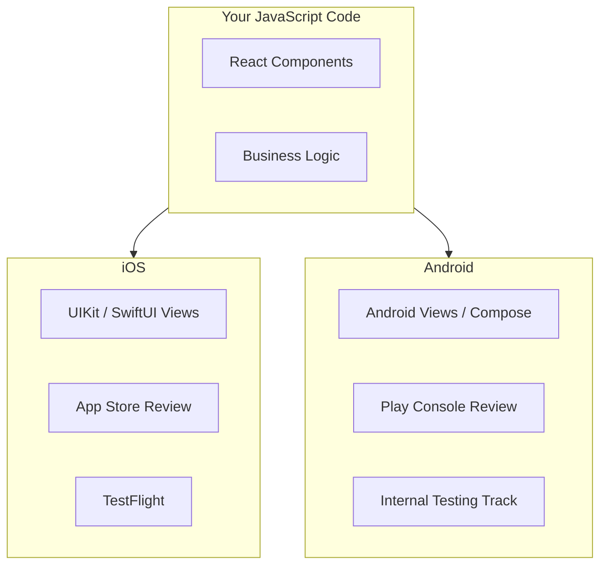

Voici une référence rapide des différences que vous ressentirez réellement en tant que développeur :

| Aspect | iOS | Android |
|--------|-----|---------|
| Langage de design | Human Interface Guidelines | Material Design |
| Navigation arrière | Pas de bouton retour matériel ; swipe / barre de navigation | Bouton retour matériel/gestuel (gérez-le !) |
| Distribution | App Store + TestFlight | Play Store + tracks |
| Attente de revue | De quelques heures à environ un jour | Souvent quasi instantanée pour les tracks de test |
| Arrêts de processus | Suspend, moins agressif | Peut détruire l'Activity à tout moment |

> **Erreur fréquente :** Oublier le bouton retour matériel d'Android. iOS n'a pas d'équivalent, donc les développeurs web qui construisent sur un Mac/simulateur ne le remarquent jamais — puis un utilisateur Android tape Retour à l'intérieur d'une modale et l'app entière se ferme. Gérez-le explicitement (React Navigation en fait une bonne partie pour vous, mais les modales et flux personnalisés nécessitent `BackHandler`).

**Le cycle de vie de l'app** fonctionne différemment sur chaque plateforme. Sur iOS, une app traverse des états : inactif, actif, arrière-plan, suspendu. Sur Android, le système peut détruire et recréer votre Activity à tout moment (rotation de l'écran, pression mémoire). React Native abstrait la majeure partie de cela à travers l'API `AppState`, mais vous devez connaître le modèle sous-jacent afin de pouvoir gérer les cas limites — comme enregistrer les données de formulaire lorsque l'OS tue votre app en arrière-plan.

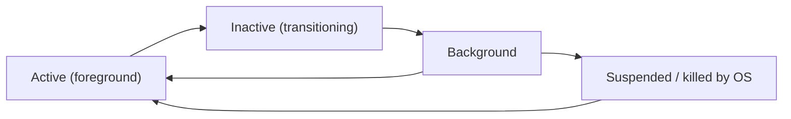

```tsx
// Persist draft state when the app leaves the foreground,
// because the OS may kill it before the user returns.
useEffect(() => {
  const sub = AppState.addEventListener('change', state => {
    if (state === 'background') {
      saveDraft(formValues); // last chance before a possible kill
    }
  });
  return () => sub.remove();
}, [formValues]);
```

### Distribution sur les app stores

Vous ne pouvez pas simplement déployer vers une URL. Les apps mobiles passent par un processus de revue, et acheminer votre app jusqu'aux testeurs nécessite un outillage spécifique :

- **iOS / TestFlight :** Vous buildez une archive dans Xcode (ou via EAS Build), la téléversez vers App Store Connect, et invitez les testeurs via TestFlight. Apple examine même les builds TestFlight (bien que la revue soit plus légère). Comptez 24 à 48 heures pour la revue du premier build. Les builds suivants vers le même groupe sont généralement disponibles en moins d'une heure.

- **Android / Play Internal Testing :** Vous téléversez un AAB (Android App Bundle) vers la Google Play Console et créez un track de test interne. Les testeurs reçoivent un lien. Les builds du track interne sont disponibles presque immédiatement — pas d'attente de revue. La revue a lieu lorsque vous promouvez en production.

Le plus grand changement de mentalité par rapport au web : il y a un gardien entre votre code et vos utilisateurs.

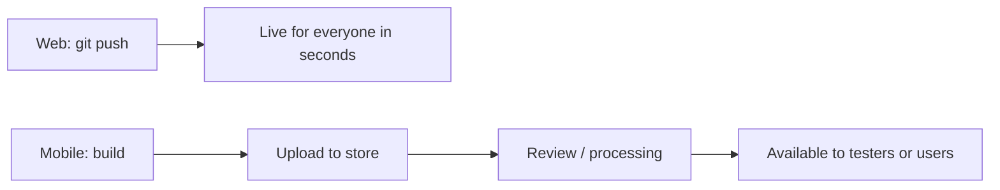

> **Piège :** Les builds iOS expirent après 90 jours sur TestFlight. Si votre programme bêta dure longtemps, les apps des testeurs cesseront de se lancer. Vous avez besoin d'un pipeline CI qui produit régulièrement des builds frais. Ne comptez pas sur l'archivage manuel depuis votre ordinateur portable.

> **Astuce de pro :** Parce que la revue des stores est lente, l'écosystème s'appuie sur les **mises à jour over-the-air (OTA)** (Expo Updates / EAS Update) pour livrer des correctifs uniquement JavaScript sans nouveau binaire. Cela fonctionne précisément parce que votre bundle JS est séparé de la coque native (voir le diagramme Metro plus haut) — mais notez que les stores n'autorisent l'OTA que pour les changements JS/asset, pas pour du nouveau code natif.

### Le modèle de permissions

Sur le web, vous demandez l'accès à la caméra avec `navigator.mediaDevices.getUserMedia()` et le navigateur affiche une invite. Sur mobile, les permissions sont plus granulaires, plus permanentes et plus lourdes de conséquences.

Les deux plateformes vous obligent à **déclarer** les permissions à l'avance (dans `Info.plist` sur iOS, dans `AndroidManifest.xml` sur Android), puis à les **demander** à l'exécution. Si vous oubliez la déclaration, la demande à l'exécution échoue silencieusement. Si vous demandez au mauvais moment (au lancement de l'app au lieu du moment où l'utilisateur tape le bouton caméra), l'utilisateur refuse et vous n'aurez peut-être pas de seconde chance — iOS limite la fréquence des invites de permission.

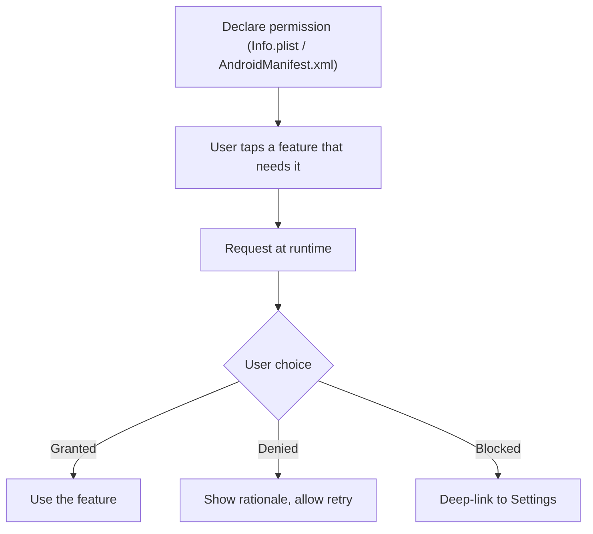

```tsx
// react-native-permissions — the standard library for this
import { request, PERMISSIONS, RESULTS } from 'react-native-permissions';
import { Platform } from 'react-native';

async function requestCamera(): Promise<boolean> {
  const permission = Platform.select({
    ios: PERMISSIONS.IOS.CAMERA,
    android: PERMISSIONS.ANDROID.CAMERA,
  });

  if (!permission) return false;

  const result = await request(permission);

  switch (result) {
    case RESULTS.GRANTED:
      return true;
    case RESULTS.DENIED:
      // User said no — can ask again (iOS) or is permanent (Android varies)
      return false;
    case RESULTS.BLOCKED:
      // User previously denied and checked "don't ask again"
      // Must direct them to Settings
      return false;
    default:
      return false;
  }
}
```

> **Différence clé avec le web :** Sur le web, refuser une invite de permission signifie simplement qu'on vous la redemandera la prochaine fois. Sur iOS, après un refus, le système peut ne plus jamais afficher l'invite — vous devez envoyer l'utilisateur dans l'app Réglages. Concevez votre UX en conséquence : expliquez *pourquoi* vous avez besoin de la permission avant de déclencher l'invite système.

> **Astuce de pro :** Le pattern de la « pré-permission » est un standard de l'industrie : affichez votre propre écran convivial (« Nous utilisons la caméra pour que vous puissiez scanner des reçus — prêt ? ») *avant* de déclencher la vraie invite de l'OS. Si l'utilisateur dit « pas maintenant » sur votre écran, vous n'avez rien dépensé — la précieuse invite de l'OS, peut-être unique, est toujours dans votre poche pour le moment où il sera prêt à dire oui.

### Safe areas : encoches, Dynamic Islands et barres système

Sur le web, votre contenu commence à `(0, 0)` et vous ne vous souciez pas de matériel chevauchant votre UI. Sur mobile, la barre de statut, l'indicateur d'accueil (iPhone), la Dynamic Island (iPhone 14 Pro+), la barre de navigation (Android) et l'encoche de la caméra empiètent tous sur votre espace d'écran. Si vous ne les prenez pas en compte, votre contenu s'affiche derrière la barre de statut ou sous l'indicateur d'accueil.

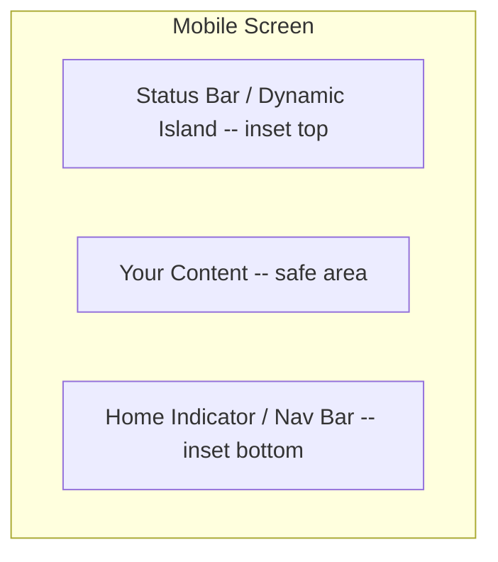

React Native fournit le composant `SafeAreaView` (iOS uniquement) et la bibliothèque plus complète `react-native-safe-area-context` (multiplateforme). Vous envelopperez vos écrans dans un `SafeAreaProvider` et utiliserez le hook `useSafeAreaInsets` pour obtenir les valeurs exactes en pixels de chaque bord.

```tsx
import { useSafeAreaInsets } from 'react-native-safe-area-context';

function MyScreen() {
  const insets = useSafeAreaInsets();

  return (
    <View style={{
      flex: 1,
      paddingTop: insets.top,
      paddingBottom: insets.bottom,
    }}>
      <Text>Content that never hides behind the notch</Text>
    </View>
  );
}
```

Considérez les insets comme quatre nombres — `top`, `bottom`, `left`, `right` — décrivant combien de points de padding chaque bord nécessite pour dégager le matériel. Le hook vous donne des valeurs en direct qui se mettent à jour lors de la rotation et diffèrent selon l'appareil, vous les appliquez donc en padding (ou marge) plutôt que de deviner.

| Option | Plateformes | Vous donne | Verdict |
|--------|-----------|-----------|---------|
| `SafeAreaView` du cœur | iOS uniquement | Padding automatique, pas de nombres bruts | À éviter — incomplet |
| `react-native-safe-area-context` (`SafeAreaView`) | iOS + Android | Padding automatique, multiplateforme | Bon choix par défaut |
| `useSafeAreaInsets()` | iOS + Android | Nombres d'inset bruts par bord | Idéal pour les layouts personnalisés |

> **Piège :** Le `SafeAreaView` intégré au cœur de React Native ne fonctionne que sur iOS et n'applique que du padding. Utilisez plutôt `react-native-safe-area-context` — il fonctionne sur les deux plateformes, vous donne les valeurs d'inset brutes, et s'intègre bien avec React Navigation (qui a besoin des insets pour ses calculs de header et de tab bar).

Les valeurs changent selon l'appareil et l'orientation. Un iPhone SE a un inset supérieur de 20 points. Un iPhone 15 Pro a un inset supérieur de 59 points (Dynamic Island). Un appareil Android avec un poinçon de caméra a un inset supérieur qui varie selon le fabricant. Ne codez jamais ces nombres en dur — lisez-les toujours depuis le safe area context.