# React Native Fundamentals : comprendre le runtime

> Ce qu'est réellement React Native sous le capot, et le changement crucial de modèle mental entre le web et le mobile.

---

## Table of Contents

1. [What React Native Actually Is](#1-what-react-native-actually-is)
2. [Mental Model Shift from Web](#2-mental-model-shift-from-web)
3. [Architecture Overview](#3-architecture-overview)

Ce chapitre suppose que vous connaissez déjà React pour le web : composants, props, state, hooks, JSX. Vous n'avez besoin d'aucune expérience préalable en développement mobile. À la fin, vous comprendrez ce qui se passe lorsque votre JavaScript s'exécute sur un téléphone, pourquoi certains réflexes hérités du web vous trahiront, et en quoi les anciennes et nouvelles architectures de React Native diffèrent de manières qui comptent pour votre travail quotidien.

> **Comment lire ce chapitre :** N'essayez pas de mémoriser les noms (Hermes, Metro, JSI, Fabric, Yoga). Construisez plutôt le film mental de « mon fichier `.tsx` devient des pixels sur un téléphone ». Chaque section ajoute une image à ce film. À la section 3, vous serez capable de raconter vous-même tout le parcours.

---

## 1. What React Native Actually Is

### Commençons par l'idée fausse

La plupart des développeurs entendent « React Native » et imaginent une WebView — un mini-navigateur intégré dans une application mobile, affichant votre HTML et votre CSS comme une iframe sophistiquée. Ce n'est pas ce qu'est React Native. Si c'était le cas, ce ne serait que Cordova avec des étapes supplémentaires, et les performances seraient catastrophiques.

React Native est un **runtime** qui prend votre arbre de composants React et le rend sous forme de **primitives d'interface réellement natives à la plateforme**. Lorsque vous écrivez `<View>`, vous n'obtenez pas un `<div>` dans un navigateur caché. Sur iOS vous obtenez un `UIView`. Sur Android vous obtenez un `android.view.View`. Le bouton sur lequel votre utilisateur appuie est exactement le même bouton que celui qu'utilise toute autre application native de ce téléphone. La physique du scroll, le rendu du texte, la couche d'accessibilité — tout est natif.

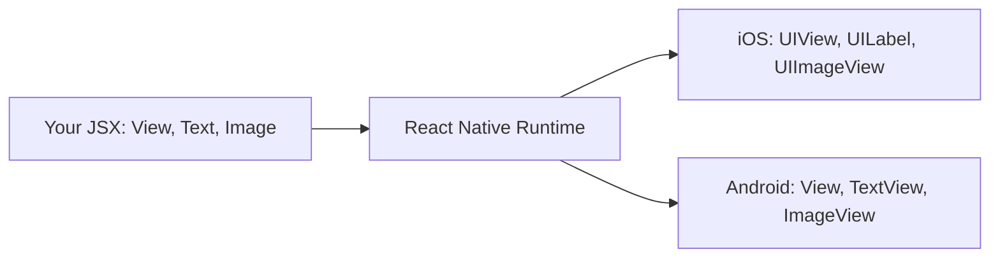

Voici l'idée clé : **React est le modèle de programmation, pas la cible de rendu.** Sur le web, React effectue son rendu vers des nœuds DOM (`div`, `span`, `input`). Dans React Native, React effectue son rendu vers des vues natives de la plateforme. Le cycle de vie des composants, les hooks, la gestion du state, le context — tout cela fonctionne de manière identique. Ce qui change, c'est l'ensemble des primitives avec lesquelles vous composez.

### Une analogie : le même conducteur, une voiture différente

Pensez à React (la bibliothèque) comme à un conducteur expérimenté, et à la cible de rendu comme à la voiture. Sur le web, le conducteur est assis dans une « voiture navigateur » dont les commandes sont des nœuds DOM. Dans React Native, le même conducteur est assis dans une « voiture native » dont les commandes sont `UIView` et `TextView`. Les compétences de conduite (votre connaissance des composants, des props, du state, des hooks) se transfèrent complètement. Vous n'avez qu'à apprendre le nouveau tableau de bord. C'est pourquoi React Native est si accessible aux développeurs React — et aussi pourquoi les rares différences qui *existent réellement* sont si surprenantes lorsqu'on les rencontre.

### Trois familles de « React »

Il est utile d'être précis sur ce que fait chaque « React », car les noms se confondent :

| Package | Rôle | Analogie |
|---|---|---|
| `react` | Le moteur central : composants, hooks, réconciliation. Ne sait rien des écrans. | Le cerveau du conducteur |
| `react-dom` | Le renderer web. Transforme la sortie de React en nœuds DOM. | La voiture navigateur |
| `react-native` | Le renderer natif. Transforme la sortie de React en vues natives. | La voiture native |

Vous importez `useState` et `useEffect` depuis `react` dans les *deux* mondes — code identique. Vous importez `View` et `Text` depuis `react-native` au lieu d'écrire `div` et `span`. Cette simple substitution représente l'essentiel de ce qui change au niveau des composants.

### Le moteur JavaScript : Hermes

Votre JavaScript doit s'exécuter quelque part. Sur le web, c'est V8 (Chrome) ou JavaScriptCore (Safari). React Native était autrefois livré avec JavaScriptCore sur les deux plateformes, mais depuis React Native 0.70, le moteur par défaut est **Hermes** — un moteur JavaScript que Meta a conçu spécifiquement pour le mobile.

Pourquoi construire un moteur entièrement nouveau ? Parce que les contraintes du mobile sont différentes de celles des navigateurs de bureau :

- **Le temps de démarrage compte plus que le débit maximal.** Les utilisateurs s'attendent à ce qu'une application s'ouvre en moins d'une seconde. Hermes compile votre JS en bytecode au moment du build (compilation anticipée), de sorte que le moteur n'a pas besoin de parser et de compiler le JavaScript sur le téléphone de l'utilisateur à chaque lancement de l'application.
- **La mémoire est plus restreinte.** Un téléphone dispose de 4 à 8 Go de RAM partagés entre toutes les applications en cours d'exécution. Hermes utilise moins de mémoire que JavaScriptCore par conception.
- **La taille du binaire compte.** Hermes produit un binaire de moteur plus petit, ce qui signifie un téléchargement d'application plus léger.

Voici la différence cruciale dans *le moment* où le travail s'effectue. Un navigateur livre votre texte JavaScript brut et le parse sur l'appareil de l'utilisateur à chaque lancement. Hermes effectue ce parsing une seule fois, sur votre machine de build, et livre à la place un bytecode compact — de sorte que le téléphone passe directement à l'exécution.

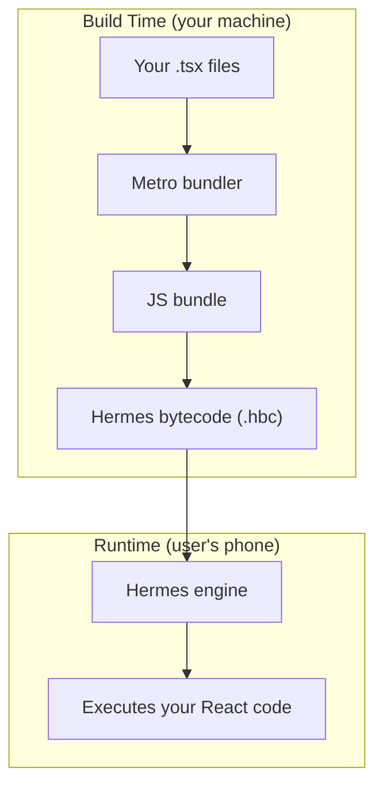

| | Navigateur (V8/JSC) | Hermes (mobile) |
|---|---|---|
| Quand le JS est-il compilé ? | Sur l'appareil, à chaque lancement | À l'avance, sur votre machine de build |
| Livré à l'appareil sous forme de | Texte source | Bytecode compact |
| Optimisé pour | Débit maximal sur de longues sessions | Démarrage rapide, faible mémoire |
| Coût de démarrage | Parse + compilation au lancement | Quasi nul — le bytecode est prêt |

Vous n'interagissez pas directement avec Hermes. Vous écrivez du TypeScript normal, et la chaîne d'outils de build s'occupe du reste. Mais vous devriez savoir qu'il est là, car cela explique pourquoi certaines choses fonctionnent différemment d'un navigateur :

- Hermes ne prend pas en charge toutes les fonctionnalités JavaScript les plus récentes. Il couvre bien ES2020+, mais si vous utilisez une proposition très récente, vous pourriez rencontrer une erreur de syntaxe qui ne se produirait pas dans Chrome.
- Le débogage se connecte à Hermes via le protocole Chrome DevTools. Lorsque vous ouvrez le débogueur, vous communiquez avec Hermes, pas avec un navigateur.
- Les outils de profilage de performance (React DevTools, le profileur Hermes intégré) sont conscients de Hermes et peuvent vous montrer des informations au niveau du bytecode.

> **Astuce de pro :** Vous pouvez confirmer qu'Hermes est actif au runtime en vérifiant l'objet global `HermesInternal` — `const isHermes = !!(global as any).HermesInternal;`. S'il est truthy, vous tournez sur Hermes.

> **Note :** Vous pouvez toujours renoncer à Hermes et utiliser JavaScriptCore si vous avez une raison particulière, mais il n'y a presque jamais de bonne raison de le faire dans un nouveau projet. Hermes est le choix par défaut recommandé.

### Metro : le bundler

Sur le web, vous utilisez Vite ou Webpack pour bundler votre code. Dans React Native, le bundler est **Metro**. Il surveille vos fichiers, résout les imports, transforme le TypeScript/JSX, et sert le bundle à l'application en cours d'exécution via un serveur HTTP local pendant le développement. En production, il produit un unique bundle optimisé qui est intégré au binaire.

Pourquoi React Native a-t-il besoin de son *propre* bundler au lieu de réutiliser Webpack ou Vite ? Parce que la cible de sortie est différente. Un bundler web produit des fichiers qu'un navigateur télécharge via HTTP et découpe en plusieurs requêtes (code-splitting). Metro produit un unique bundle taillé pour un moteur JS sur un téléphone, avec une résolution spécifique à la plateforme intégrée : lorsque vous importez `./Button`, Metro peut choisir de manière transparente `Button.ios.tsx` ou `Button.android.tsx` selon la cible de build. Les bundlers web n'ont aucune notion de cela.

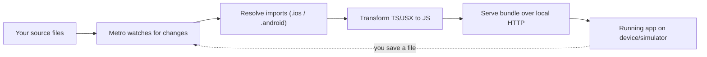

Metro est plus simple que Webpack (pas de loaders, pas de configuration complexe) mais aussi moins flexible. Vous le configurez via `metro.config.js`, et pour la plupart des projets vous n'y touchez jamais.

```bash
# Metro starts automatically when you run:
npx react-native start

# Or if using Expo:
npx expo start

# Press 'r' in the terminal to reload, 'i' to open iOS, 'a' to open Android
```

| Préoccupation | Web (Webpack/Vite) | React Native (Metro) |
|---|---|---|
| Sortie | Ressources prêtes pour le navigateur, code-split | Un bundle pour un moteur JS |
| Fichiers spécifiques à la plateforme | Pas un concept intégré | Résolution automatique `.ios.tsx` / `.android.tsx` |
| Livraison en dev | HMR via dev server | Fast Refresh via HTTP local |
| Surface de configuration | Vaste (loaders, plugins) | Réduite (`metro.config.js`, rarement touché) |

> **Piège :** Si Metro commence à se comporter étrangement après l'installation d'un package ou un changement de branche (modules périmés, erreurs « unable to resolve module »), la solution consiste presque toujours à vider son cache : `npx react-native start --reset-cache` (ou `npx expo start -c`). C'est l'équivalent React Native du « éteindre puis rallumer ».

### Des primitives natives, pas des éléments HTML

Voici la correspondance qui compte le plus lorsqu'on vient du web :

| Web (React DOM)       | React Native            | Résultat natif (iOS)        | Résultat natif (Android)         |
|-----------------------|-------------------------|----------------------------|---------------------------------|
| `<div>`               | `<View>`                | `UIView`                   | `android.view.View`             |
| `<span>`, `<p>`, `<h1>` | `<Text>`             | `UILabel`                  | `TextView`                      |
| ``               | `<Image>`               | `UIImageView`              | `ImageView`                     |
| `<input>`             | `<TextInput>`           | `UITextField`              | `EditText`                      |
| `<button>`            | `<Pressable>` / `<TouchableOpacity>` | `UIView` avec gesture recognizer | `View` avec touch handler |
| `<div style="overflow:scroll">` | `<ScrollView>` | `UIScrollView`            | `ScrollView`                    |
| `<ul>` avec virtualisation | `<FlatList>`       | `UICollectionView`         | `RecyclerView`                  |

Un exemple rapide pour ressentir la différence :

```tsx
// Web React
const WebCard = () => (
  <div className="card">
    <h2>Hello</h2>
    <p>This is a paragraph.</p>
    
    <button onClick={() => alert('clicked')}>Press me</button>
  </div>
);

// React Native
import { View, Text, Image, Pressable, Alert, StyleSheet } from 'react-native';

const NativeCard = () => (
  <View style={styles.card}>
    <Text style={styles.title}>Hello</Text>
    <Text>This is a paragraph.</Text>
    <Image source={{ uri: 'https://example.com/photo.jpg' }} style={styles.image} />
    <Pressable onPress={() => Alert.alert('clicked')}>
      <Text>Press me</Text>
    </Pressable>
  </View>
);

const styles = StyleSheet.create({
  card: { padding: 16, backgroundColor: '#fff', borderRadius: 8 },
  title: { fontSize: 24, fontWeight: 'bold' },
  image: { width: 200, height: 200 },
});
```

Remarquez les différences, et *pourquoi* chacune existe :

- **Il n'y a pas de `className` ni de fichier CSS.** Les vues natives n'ont pas de moteur de feuilles de style, donc les styles sont de simples objets JavaScript passés via la prop `style`. `StyleSheet.create` n'est qu'une enveloppe d'optimisation autour de ces objets (plus de détails dans le chapitre sur le styling).
- **Il n'y a pas de `<div>` ni de `<span>`.** Ce sont des concepts HTML. Les interfaces natives sont construites à partir de `View` (un conteneur générique) et de `Text` (une primitive de dessin de texte).
- **Tout morceau de texte doit se trouver à l'intérieur d'un composant `<Text>`.** Une chaîne brute hors d'un `<Text>` — comme `<View>Hello</View>` — déclenche une erreur. Sur le web, un `<div>` peut contenir du texte brut car le navigateur sait comment afficher des nœuds de texte n'importe où. Les `UIView`/`View` natifs ne peuvent pas dessiner de texte ; seul un `UILabel`/`TextView` (c'est-à-dire `<Text>`) le peut. Cette règle est donc une conséquence directe des primitives natives.
- **`<Image>` nécessite une largeur et une hauteur explicites.** Une image distante n'a aucune taille intrinsèque tant qu'elle n'est pas téléchargée, et la disposition native ne « refait pas le flux » autour d'elle comme le ferait un navigateur, donc vous la dimensionnez à l'avance.

> **Erreur courante :** `Text strings must be rendered within a <Text> component.` est l'une des premières erreurs que tout débutant en React Native rencontre. Si vous la voyez, cherchez une chaîne égarée, un espace `{' '}`, ou un `{condition && 'some text'}` placé directement à l'intérieur d'un `<View>`. Enveloppez-le dans un `<Text>`.

Ce ne sont pas des différences cosmétiques ; ce sont des contraintes fondamentales du modèle de rendu natif.

---

## 2. Mental Model Shift from Web

C'est la section la plus importante du chapitre. L'architecture est une anecdote intéressante, mais *ces* changements sont ceux qui vous feront trébucher dès le premier jour. Chaque sous-section présente un réflexe web qui se casse discrètement sur mobile, et son remplacement natif.

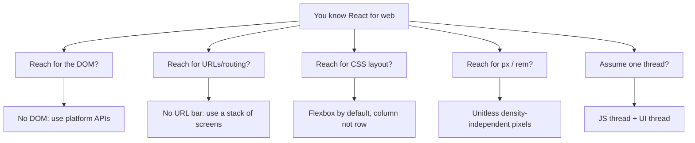

### Il n'y a pas de DOM

Cela paraît évident une fois énoncé, mais les conséquences sont profondes. Sur le web, tout est un nœud du Document Object Model. Vous pouvez faire un `document.querySelector` sur n'importe quoi, inspecter les styles calculés, mesurer des rectangles englobants, manipuler l'arbre de manière impérative. Dans React Native, rien de tout cela n'existe. Il n'y a pas de `document`, pas de `window`, pas de `navigator.userAgent`, pas de `localStorage`.

La raison est simple : ces objets globaux sont des API *de navigateur*, fournies par le navigateur. React Native ne s'exécute pas dans un navigateur, donc ils n'ont jamais été présents au départ. Votre JavaScript s'exécute dans un moteur nu (Hermes) avec uniquement les fonctions natives standard du langage, plus ce que React Native injecte.

Si vous avez déjà écrit :

```tsx
// This will crash in React Native
const width = window.innerWidth;
localStorage.setItem('token', value);
document.title = 'My App';
```

...vous devez les remplacer par des API de plateforme :

```tsx
import { Dimensions } from 'react-native';
import AsyncStorage from '@react-native-async-storage/async-storage';

// Screen dimensions
const { width } = Dimensions.get('window');

// Persistent storage (async, not sync like localStorage)
await AsyncStorage.setItem('token', value);

// There is no document.title — mobile apps do not have a title bar controlled by you
```

Voici un aide-mémoire des objets globaux web les plus courants et de leurs remplacements React Native :

| API Web | Ce qu'elle fait | Remplacement React Native |
|---|---|---|
| `window.innerWidth/Height` | Taille du viewport | `Dimensions.get('window')` ou `useWindowDimensions()` |
| `localStorage` (sync) | Stockage clé-valeur persistant | `AsyncStorage` (async) ou `react-native-mmkv` (sync, rapide) |
| `fetch` | Requêtes réseau | `fetch` — celui-ci *existe bel et bien* (RN le fournit) |
| `document.querySelector` | Trouver/mesurer des nœuds DOM | `ref` + `measure()` sur le composant |
| `navigator.geolocation` | Localisation | `expo-location` ou `@react-native-community/geolocation` |
| `document.cookie` | Cookies | Géré par la couche réseau native ; ou une bibliothèque de cookies |
| `alert()` | Boîte de dialogue | `Alert.alert()` depuis `react-native` |

> **Piège :** `localStorage` est *synchrone* — vous lisez une valeur et l'obtenez immédiatement. `AsyncStorage` est *asynchrone* — chaque lecture et écriture renvoie une Promise. Le code qui supposait des lectures instantanées (`const t = localStorage.getItem('token')`) doit devenir `const t = await AsyncStorage.getItem('token')`. Oublier le `await` est un bug classique qui renvoie un objet Promise là où vous attendiez une chaîne.

Cela signifie aussi que tout package npm qui touche au DOM ne fonctionnera pas. Des bibliothèques comme `react-helmet`, `react-modal` (la version web), ou tout ce qui appelle `document.createElement` sont réservées au web. Vérifiez toujours qu'une bibliothèque prend en charge React Native avant de l'installer — cherchez « React Native » dans son README, ou une entrée `react-native` dans son `package.json`.

### Il n'y a pas de barre d'URL

Sur le web, la navigation repose fondamentalement sur les URL. L'utilisateur tape une URL, clique sur un lien, appuie sur le bouton retour — tout cela est piloté par les URL. React Router associe des chemins d'URL à des composants, et le navigateur gère pour vous la pile d'historique.

Sur mobile, il n'y a pas de barre d'URL. La navigation est une **pile d'écrans** — vous empilez un nouvel écran par-dessus, et le bouton retour (ou le geste de balayage) le dépile. Cela ressemble davantage à une structure de données de type pile (dernier entré, premier sorti) qu'à un routage par URL. L'écran que vous regardez est toujours celui qui se trouve au sommet de la pile.

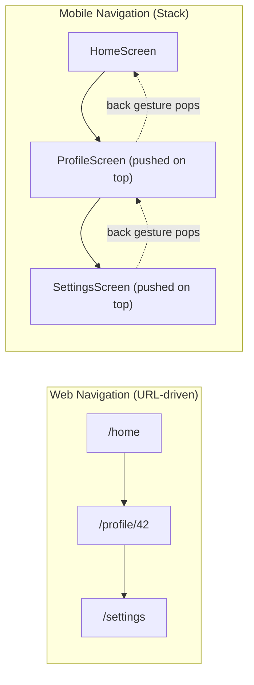

La bibliothèque de navigation standard est **React Navigation** (pas React Router). Elle vous offre des stack navigators, des tab navigators et des drawer navigators qui se comportent comme les schémas de navigation natifs d'iOS et d'Android — y compris les transitions correctes pour chaque plateforme et le geste iOS de balayage depuis le bord pour revenir en arrière, que vous obtenez gratuitement.

```tsx
import { NavigationContainer } from '@react-navigation/native';
import { createNativeStackNavigator } from '@react-navigation/native-stack';

const Stack = createNativeStackNavigator();

const App = () => (
  <NavigationContainer>
    <Stack.Navigator>
      <Stack.Screen name="Home" component={HomeScreen} />
      <Stack.Screen name="Profile" component={ProfileScreen} />
    </Stack.Navigator>
  </NavigationContainer>
);

// Inside a screen, you move around imperatively instead of changing a URL:
const HomeScreen = ({ navigation }) => (
  <Pressable onPress={() => navigation.navigate('Profile', { userId: 42 })}>
    <Text>Go to profile</Text>
  </Pressable>
);
```

Voici comment les concepts fondamentaux de navigation se correspondent de part et d'autre :

| Web (React Router) | Mobile (React Navigation) | Note |
|---|---|---|
| `<Link to="/profile/42">` | `navigation.navigate('Profile', { userId: 42 })` | Les paramètres sont passés sous forme d'objets, pas de segments d'URL |
| `useParams()` | `route.params` | |
| Bouton retour du navigateur | Bouton retour de l'OS / geste de balayage | Géré nativement par la pile |
| `useNavigate()` | `useNavigation()` | |
| L'URL est la source de vérité | L'arbre d'état de navigation est la source de vérité | |

> **Note :** Expo Router est une solution de routage plus récente, basée sur les fichiers, qui apporte un routage de type URL à React Native — vous créez un fichier dans un dossier `app/` et il devient un écran, exactement comme dans Next.js. Elle est construite par-dessus React Navigation et excelle pour le deep linking et les universal links. Mais comprenez d'abord le modèle de pile — c'est ce qui se passe en dessous, quelle que soit l'API que vous utilisez.

### Flexbox par défaut (mais inversé)

Sur le web, la disposition par défaut est `display: block`, avec `flex-direction: row` lorsque vous activez flexbox. Dans React Native, **chaque `<View>` est un conteneur flex par défaut**, et le `flexDirection` par défaut est `column`, pas `row`.

Pourquoi `column` ? Parce que les téléphones sont hauts et étroits, et que la disposition de très loin la plus courante est une pile verticale de contenu qui défile vers le bas de l'écran. Adopter `column` par défaut correspond au sens naturel de l'interface mobile, de sorte que la plupart des dispositions n'ont besoin d'aucun `flexDirection`.

Cela signifie que votre modèle mental doit s'inverser :

```tsx
// Web: items go left-to-right by default in a flex container
// <div style={{ display: 'flex' }}> -> row (horizontal)

// React Native: items go top-to-bottom by default
// <View> -> column (vertical) — no need to write display:'flex', it is always on
```

Un exemple concret :

```tsx
import { View, Text, StyleSheet } from 'react-native';

const FlexExample = () => (
  <View style={styles.container}>
    <Text>First</Text>
    <Text>Second</Text>
    <Text>Third</Text>
  </View>
);

const styles = StyleSheet.create({
  container: {
    flex: 1,
    // These items stack vertically by default (flexDirection: 'column')
    // To make them horizontal, you would add: flexDirection: 'row'
    justifyContent: 'center', // centers along the MAIN axis (vertical here)
    alignItems: 'center',     // centers along the CROSS axis (horizontal here)
  },
});
```

La chose la plus importante à intérioriser à propos de Flexbox est l'**axe principal vs l'axe transversal**, car `justifyContent` et `alignItems` changent de signification selon le `flexDirection` :

| flexDirection | Axe principal | `justifyContent` contrôle | `alignItems` contrôle |
|---|---|---|---|
| `column` (par défaut) | Vertical | Position verticale | Position horizontale |
| `row` | Horizontal | Position horizontale | Position verticale |

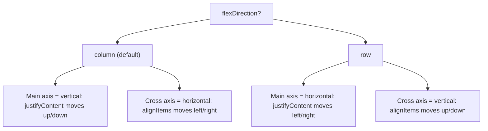

Le système de disposition complet est un sous-ensemble de CSS Flexbox. Des propriétés comme `justifyContent`, `alignItems`, `flex`, `flexWrap` et `gap` fonctionnent toutes comme vous l'attendez — souvenez-vous simplement que la direction par défaut est inversée.

> **Piège :** En venant du web, les gens optent pour `flexDirection: 'row'` puis se demandent pourquoi `alignItems: 'center'` ne centre plus les éléments horizontalement. Ce n'est pas cassé — les axes se sont inversés. En cas de doute, énoncez à voix haute quelle direction est l'axe principal, et les deux propriétés se mettront d'elles-mêmes en ordre.

### Valeurs sans unité (pixels indépendants de la densité)

Sur le web, vous spécifiez `fontSize: '16px'` ou `margin: '1rem'`. Dans React Native, toutes les valeurs de disposition sont des **nombres sans unité** qui représentent des **pixels indépendants de la densité (dp)**.

```tsx
const styles = StyleSheet.create({
  box: {
    width: 100,      // 100dp, not 100px
    height: 100,     // 100dp
    margin: 16,      // 16dp
    fontSize: 14,    // 14dp
    borderRadius: 8, // 8dp
  },
});
```

Un pixel indépendant de la densité a à peu près la même taille *physique* sur tous les appareils. Voici le mécanisme : les téléphones ont des densités de pixels très différentes. Un téléphone ancien peut concentrer 160 pixels physiques dans un pouce ; un modèle haut de gamme moderne en concentre 460 ou plus. Si vous dimensionniez les choses en pixels physiques bruts, un bouton de 100px semblerait correct sur l'ancien téléphone et microscopique sur le nouveau. React Native mesure donc en `dp` et multiplie par le **pixel ratio** de l'appareil au moment du rendu. Sur un téléphone à densité 3x, `width: 100` devient 300 pixels physiques — mais occupe la même fraction de l'écran, donc cela *paraît* de la même taille pour l'utilisateur.

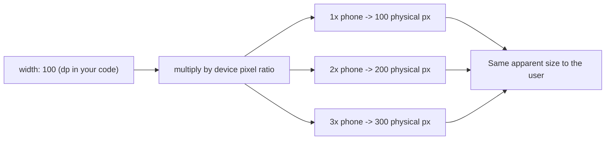

Vous n'écrivez jamais `px`, `em`, `rem`, `vh`, ni `%` (à quelques exceptions près comme `width: '50%'`, qui est pris en charge sous forme de chaîne). Vous pouvez lire le ratio de l'appareil avec `PixelRatio.get()` si vous avez besoin des calculs en pixels physiques, mais cela arrivera rarement.

> **Piège :** Il n'y a pas de `calc()`, pas de `clamp()`, et pas de media queries. Pour des dispositions responsives, vous utilisez soit des proportions `flex` (laissez le moteur de disposition répartir l'espace), des pourcentages, l'API `Dimensions`, ou — idéal pour les composants qui doivent réagir à la rotation — le hook `useWindowDimensions`, qui re-render votre composant lorsque la taille de l'écran change :

```tsx
import { useWindowDimensions } from 'react-native';

const Responsive = () => {
  const { width } = useWindowDimensions(); // updates on rotation/resize
  const isTablet = width >= 768;
  return <View style={{ flexDirection: isTablet ? 'row' : 'column' }} />;
};
```

### Deux threads, pas un seul

Sur le web, le JavaScript et le rendu se produisent tous deux sur le thread principal (avec les Web Workers comme échappatoire optionnelle). Dans React Native, il existe (au minimum) deux threads qui comptent :

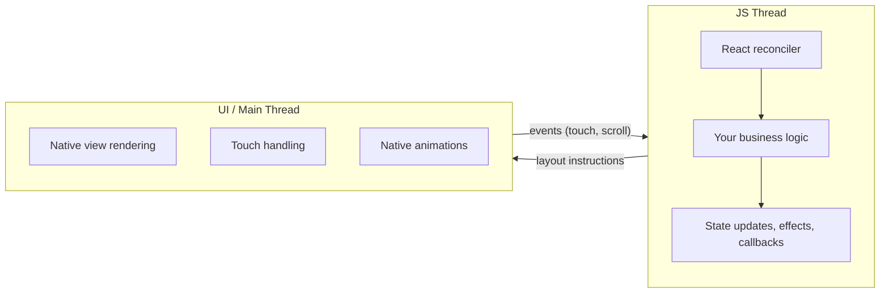

Le **thread JS** exécute votre code JavaScript : rendu des composants, mises à jour du state, appels d'API, logique métier. Le **thread UI** (aussi appelé thread principal) est l'endroit où les vues natives sont dessinées à l'écran et où naissent les événements tactiles.

Pourquoi les séparer ? Parce que l'écran doit se rafraîchir de manière fluide à 60 (ou 120) images par seconde, quel que soit ce que fait votre JavaScript. Si le dessin et votre logique métier partageaient un seul thread — comme c'est le cas dans un navigateur — une fonction lente figerait l'affichage. En donnant à l'interface son propre thread, le téléphone peut continuer à faire défiler et à animer même pendant que le thread JS est brièvement occupé.

Ces deux threads communiquent de manière asynchrone. Lorsque votre composant se re-render et produit de nouvelles instructions de disposition, ces instructions sont transmises au thread UI, qui met à jour les vues natives. Lorsque l'utilisateur appuie sur un bouton, le thread UI envoie l'événement tactile au thread JS, qui exécute votre handler `onPress`.

Cette séparation vous est en grande partie invisible, mais elle explique quelques phénomènes qui sembleraient autrement magiques ou bogués :

- **Les animations qui s'exécutent sur le thread JS peuvent saccader.** Si votre thread JS est occupé (en train d'exécuter un gros calcul, de re-render une grande liste), les animations pilotées par JavaScript perdront des images. C'est pourquoi l'API `Animated` de React Native avec `useNativeDriver: true` pousse l'animation vers le thread UI, la gardant fluide même lorsque le JS est occupé.
- **Les calculs lourds bloquent votre interface de manière indirecte.** Un `JSON.parse` synchrone d'une charge de 5 Mo sur le thread JS figera la réactivité de votre application, car les événements tactiles s'accumulent en attendant que le thread JS soit à nouveau libre.
- **`console.log` en production coûte plus cher que vous ne le pensez.** Chaque instruction de log sérialise des données à envoyer au débogueur. Supprimez-les avant la livraison.

```tsx
import { Animated } from 'react-native';

// Good: animation runs on the UI thread, smooth even if JS is busy
Animated.timing(opacity, {
  toValue: 1,
  duration: 300,
  useNativeDriver: true, // this is the critical flag
}).start();

// Bad: animation runs on the JS thread (will stutter under load)
Animated.timing(opacity, {
  toValue: 1,
  duration: 300,
  useNativeDriver: false,
}).start();
```

> **Piège :** `useNativeDriver: true` ne prend en charge qu'un sous-ensemble de propriétés animables — `opacity` et `transform` (translate, scale, rotate) sont sans risque. Vous *ne pouvez pas* l'utiliser pour `backgroundColor`, `width`, `height`, ou d'autres propriétés de disposition, car celles-ci nécessitent que le moteur de disposition recalcule sur le thread UI. Pour celles-là, tournez-vous vers **`react-native-reanimated`**, une bibliothèque d'animation plus puissante qui exécute votre logique d'animation entièrement sur le thread UI — y compris les animations de disposition et de couleur — en compilant de petits « worklets » qui s'exécutent nativement.

---

## 3. Architecture Overview

Cette section est le « film » promis au début : comment votre code voyage d'un fichier `.tsx` jusqu'aux pixels natifs, et comment ce parcours a changé entre les anciennes et les nouvelles versions de React Native. Vous n'aurez pas besoin de la plupart de ces rouages internes au quotidien, mais les connaître transforme les messages d'erreur déroutants et les vieux articles de blog en choses sur lesquelles vous pouvez raisonner.

### L'ancienne architecture : le Bridge

Avant React Native 0.68, toute la communication entre le JavaScript et le code natif passait par une seule abstraction appelée **le Bridge**. La comprendre vous aide à lire d'anciens articles de blog, à déboguer des applications héritées et à apprécier pourquoi la nouvelle architecture existe.

Le Bridge fonctionne ainsi :

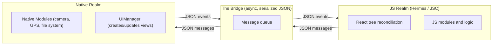

Chaque interaction — créer une vue, mettre à jour un style, lire les coordonnées GPS, gérer un toucher — est un message JSON passé à travers cette file. Le Bridge est :

1. **Asynchrone.** Les messages sont regroupés par lots et envoyés par blocs. Cela signifie que vous ne pouvez pas appeler une fonction native et obtenir une valeur de retour synchrone.
2. **Sérialisé.** Chaque message est converti en texte JSON puis parsé de l'autre côté. Passer un grand tableau signifie le sérialiser, le copier à travers le bridge, et le désérialiser.
3. **Un goulot d'étranglement unique.** Tous les appels de modules natifs et toutes les mises à jour de l'interface partagent la même file. Une rafale de mises à jour rapides de l'interface peut retarder un appel d'accès à la caméra coincé derrière elles.

La façon la plus claire de se représenter ce coût : imaginez deux personnes dans des pièces séparées qui ne peuvent communiquer qu'en écrivant des notes, en les glissant sous une porte et en attendant une réponse. Même les questions simples nécessitent un aller-retour, et un déluge de notes (disons, pendant un scroll rapide) engorge l'espace sous la porte.

Cela fonctionnait assez bien pour de nombreuses applications, mais cela introduisait un surcoût mesurable :

- **Pénalité au démarrage.** Tous les modules natifs devaient être initialisés au lancement, même ceux que l'utilisateur n'utiliserait peut-être jamais.
- **Coût de sérialisation.** Des messages fréquents et petits (comme ceux déclenchés à chaque image d'un scroll) impliquaient un encodage et un décodage JSON constants.
- **Pas d'appels synchrones.** Certaines API (comme l'obtention des dimensions de l'écran) sont intrinsèquement synchrones, mais le Bridge les forçait à être asynchrones ou nécessitait des contournements bricolés.

### La nouvelle architecture : JSI, Fabric et TurboModules

À partir de React Native 0.68 et stabilisée à partir de la 0.73+, la **Nouvelle Architecture** remplace le Bridge par trois éléments interconnectés, tous bâtis sur une fondation commune :

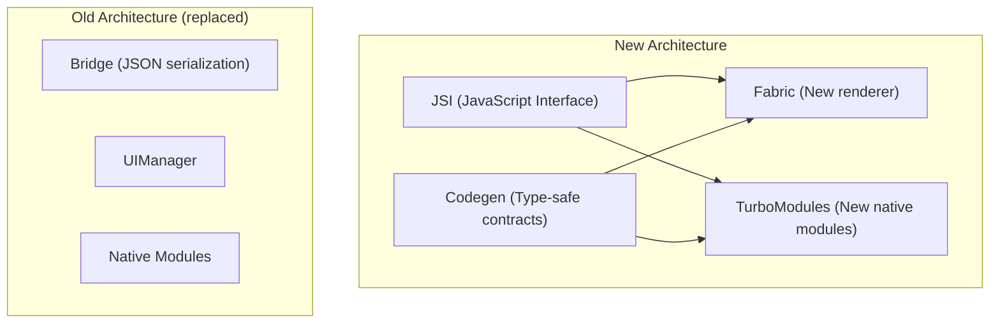

**JSI (JavaScript Interface)** est la fondation. Au lieu de sérialiser des messages en JSON et de les faire passer par une file, JSI permet au JavaScript de détenir des **références directes vers des objets hôtes C++**. Votre code JS peut appeler une fonction native comme s'il s'agissait d'une fonction JavaScript ordinaire — pas de sérialisation, pas de file asynchrone, pas de Bridge.

Pour revenir à l'analogie : l'ancien Bridge, c'était deux personnes qui se passaient des notes sous une porte. JSI abat le mur pour qu'elles puissent se parler face à face — instantanément, et sans avoir à tout traduire d'abord en notes écrites (JSON).

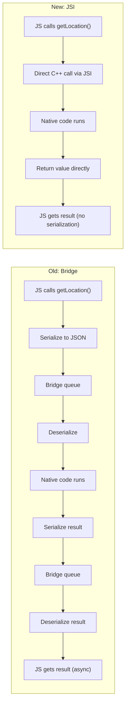

**Fabric** est le nouveau système de rendu qui remplace l'ancien `UIManager`. Avec le Bridge, créer et mettre à jour des vues natives nécessitait d'envoyer des messages JSON à travers le bridge. Avec Fabric :

- L'**arbre fantôme** (shadow tree, l'arbre de disposition interne de React Native, analogue à l'arbre de rendu du navigateur) peut être créé et mis à jour de manière synchrone depuis le JavaScript via JSI.
- La disposition est calculée à l'aide de **Yoga** (un moteur Flexbox multiplateforme écrit en C++) et les résultats sont partagés entre le JS et le code natif sans sérialisation.
- Le **rendu concurrent** est pris en charge — Fabric fonctionne avec les fonctionnalités concurrentes de React 18, permettant un rendu interruptible, les transitions et `Suspense`.

**TurboModules** remplace l'ancien système de Native Modules. Les améliorations clés :

- **Chargement paresseux (lazy loading).** Un TurboModule n'est initialisé que lorsque votre code l'importe pour la première fois, et non au démarrage de l'application. Si votre application possède 50 modules natifs mais qu'un flux utilisateur donné n'en sollicite que 5, seuls ces 5 sont chargés — ce qui réduit directement le temps de démarrage.
- **Accès synchrone.** Parce que les TurboModules sont liés via JSI, vous pouvez effectuer des appels synchrones lorsque l'API s'y prête (lire une valeur depuis le stockage, obtenir des informations sur l'appareil) au lieu de forcer tout à être une Promise.
- **Sûreté de typage via Codegen.** Vous définissez l'interface du module dans un fichier de spécification TypeScript ou Flow, et le Codegen de React Native génère automatiquement le code natif standard (Objective-C++ sur iOS, Java/Kotlin sur Android) et les liaisons JSI. Cela élimine toute une catégorie d'erreurs au runtime où le JS et le natif n'étaient pas d'accord sur les types d'arguments.

```tsx
// A TurboModule spec (simplified)
// This TypeScript interface generates native code via Codegen
import type { TurboModule } from 'react-native';
import { TurboModuleRegistry } from 'react-native';

export interface Spec extends TurboModule {
  getDeviceName(): string;            // synchronous — returns immediately
  getBatteryLevel(): Promise<number>; // async when it makes sense
}

export default TurboModuleRegistry.getEnforcing<Spec>('DeviceInfo');
```

Voici une comparaison côte à côte des deux architectures, pour que les noms cessent de se confondre :

| Préoccupation | Ancienne (Bridge) | Nouvelle (JSI / Fabric / TurboModules) |
|---|---|---|
| Communication JS ↔ natif | JSON sérialisé sur une file | Références C++ directes via JSI |
| Appels synchrones possibles ? | Non, tout est asynchrone | Oui, quand l'API s'y prête |
| Chargement des modules natifs | Tous au démarrage | Paresseux, au premier import |
| Renderer | UIManager | Fabric (prêt pour le concurrent) |
| Sûreté de typage JS ↔ natif | Aucune (incohérences au runtime) | À la compilation via Codegen |
| Fonctionnalités concurrentes de React 18 | Limitées | Prises en charge |

### Ce que cela signifie pour vous en pratique

Si vous démarrez aujourd'hui un nouveau projet React Native (en particulier avec un SDK Expo récent ou un React Native nu en 0.76+), vous êtes par défaut sur la Nouvelle Architecture. Voici ce que cela change dans votre travail quotidien :

1. **Démarrage plus rapide.** Le chargement paresseux des TurboModules signifie que votre application ne charge que ce dont elle a besoin.
2. **Interactions plus fluides.** La disposition synchrone de Fabric signifie moins d'images perdues lors de mises à jour complexes de l'interface.
3. **Meilleure compatibilité des bibliothèques.** L'écosystème a largement migré. Des bibliothèques comme `react-native-reanimated`, `react-native-gesture-handler` et `react-native-screens` la prennent déjà en charge. Néanmoins, vérifiez la compatibilité d'une bibliothèque avant de l'adopter — quelques bibliothèques plus anciennes sont à la traîne.
4. **Modules natifs typés.** Si vous écrivez un jour votre propre module natif (pour accéder à un capteur de l'appareil, par exemple), Codegen détecte les incohérences de types au moment du build au lieu de planter au runtime.

> **Piège :** Certains tutoriels plus anciens et réponses Stack Overflow font référence à `NativeModules` depuis `react-native` — c'est l'ancienne API basée sur le Bridge. Elle fonctionne toujours (il existe une couche de compatibilité appelée « interop layer »), mais pour du nouveau code, utilisez les TurboModules. Si vous utilisez le workflow managé d'Expo, vous écrivez rarement vous-même des modules natifs — le système de modules d'Expo gère l'abstraction pour vous.

> **Astuce de pro :** Vous n'avez pas besoin de comprendre JSI pour *utiliser* la Nouvelle Architecture — elle est activée par défaut et invisible. La raison d'apprendre le vocabulaire est le débogage : lorsque le README d'une bibliothèque dit « la prise en charge de la Nouvelle Architecture est arrivée en v3 » ou qu'une erreur mentionne « Fabric » ou « TurboModule », vous saurez exactement de quelle couche il s'agit.

### Tout assembler : le tableau complet

Voici le tableau complet du runtime d'une application React Native sur la Nouvelle Architecture — le film entier, du début à la fin :

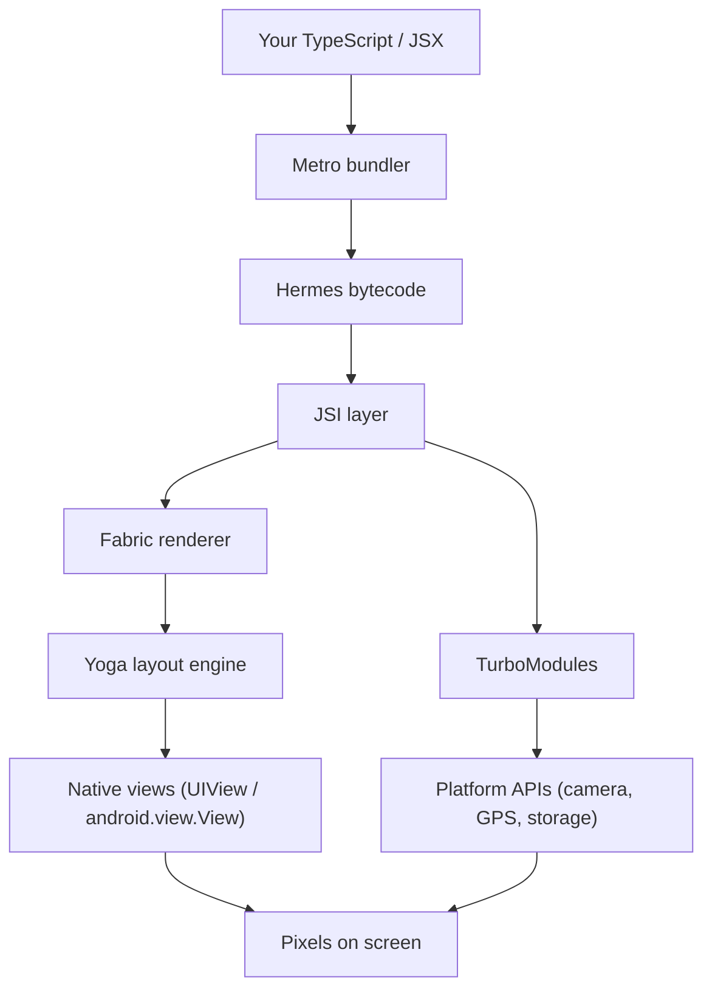

Lisez-le comme une histoire : vous écrivez des composants React en TypeScript. **Metro** les bundle. **Hermes** les transforme en bytecode et l'exécute. Lorsque vos composants effectuent leur rendu, le réconciliateur de React produit un arbre de descriptions de vues natives. **Fabric**, via **JSI**, crée et met à jour les vraies vues natives sur le thread UI. **Yoga** calcule la disposition Flexbox (le même Flexbox que vous avez écrit en section 2). **TurboModules**, également via JSI, donnent à votre code JS l'accès aux capacités de la plateforme comme la caméra, le système de fichiers ou les capteurs — de manière paresseuse, sûre du point de vue des types, et sans le surcoût de sérialisation de l'ancien Bridge.

Voilà toute la pile, de votre fichier `.tsx` jusqu'aux pixels sur l'écran de l'utilisateur. Si vous pouvez raconter ce paragraphe avec vos propres mots, vous comprenez ce qu'*est* React Native — et chaque chapitre ultérieur ne fait que remplir les détails de l'une de ces boîtes.

---