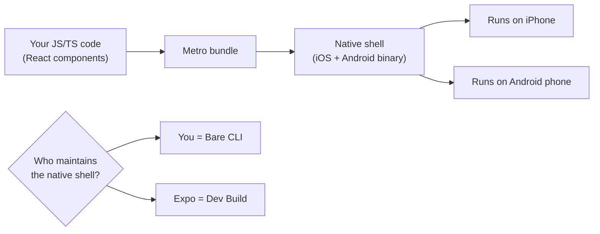
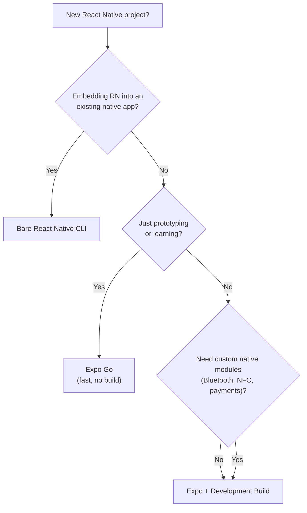
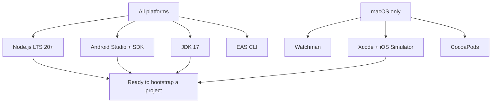
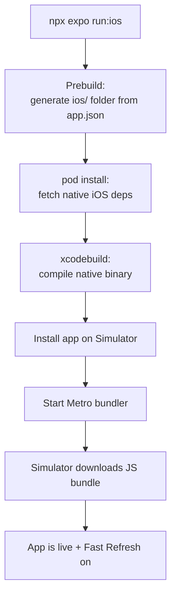
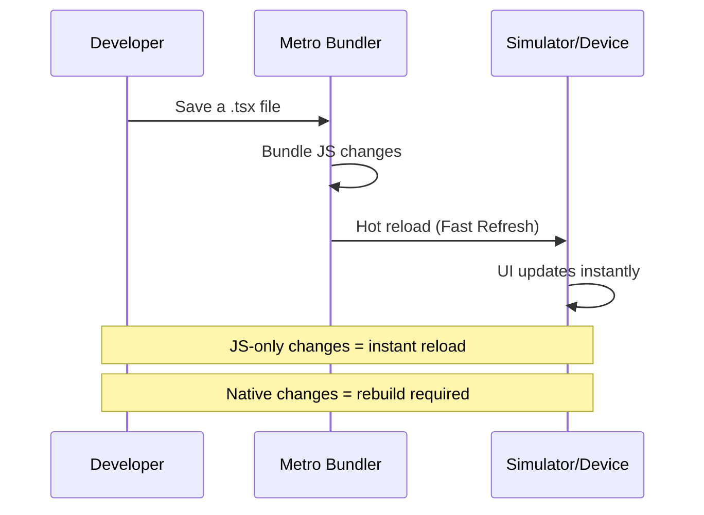
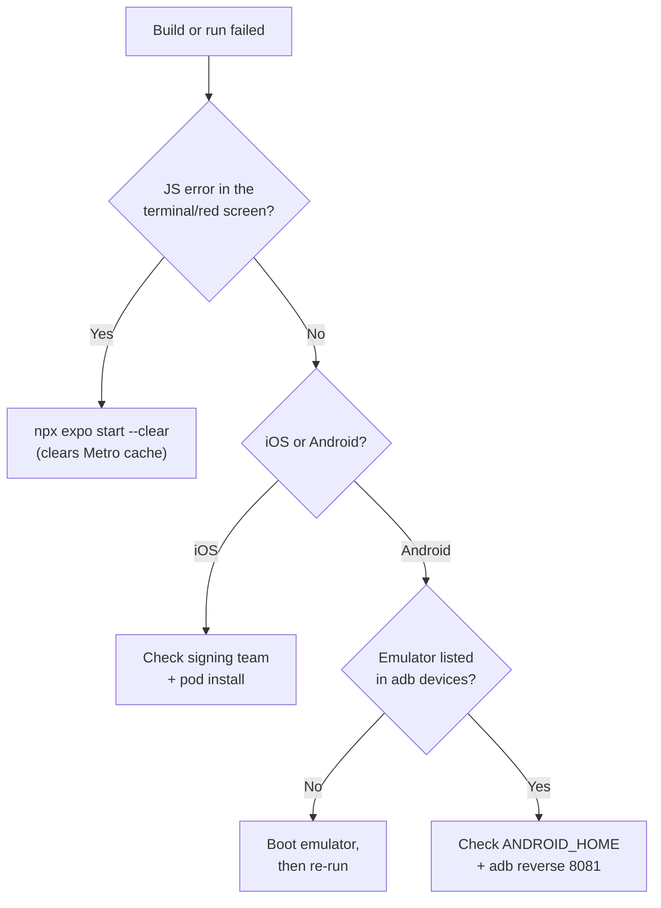

# Configuration de l'environnement : de zéro à une application qui tourne

> Mise en place d'Expo, des simulateurs et de votre premier projet React Native fonctionnel en moins de 10 minutes.

---

## Table of Contents

1. [Expo vs Bare React Native CLI](#1-expo-vs-bare-react-native-cli)
2. [Required Installs](#2-required-installs)
3. [Project Bootstrap](#3-project-bootstrap)

---

## 1. Expo vs le CLI React Native bare

### La première décision que personne n'explique correctement

Lorsque vous démarrez un projet React pour le web, la réponse est simple : exécutez `npm create vite@latest` et passez à autre chose. React Native n'est pas aussi propre. Vous vous retrouvez immédiatement face à un croisement : **Expo** ou le **CLI React Native bare**. Faites le mauvais choix et vous devrez soit faire un eject en plein milieu du projet, soit vous battre avec un outillage dont vous n'aviez jamais eu besoin. Réglons donc cela tout de suite.

Le CLI React Native (parfois appelé RN « bare » ou « vanilla ») vous donne un projet Xcode brut et un projet Android Gradle brut directement dans votre dépôt. Vous avez le contrôle total — et la responsabilité totale. Vous configurez vous-même la signature Xcode, les variantes de build Gradle, CocoaPods, le linking des modules natifs et les règles ProGuard. C'est l'équivalent de faire un eject de Create React App en 2018 et de câbler Webpack à la main.

**Expo** se place au-dessus de React Native et gère les projets natifs à votre place. Cela a commencé comme un bac à sable fermé (l'ancien « Managed Workflow ») mais a énormément évolué. L'approche moderne — **Expo avec les Development Builds** — vous fournit un binaire natif personnalisé qui inclut tous les modules natifs dont vous avez réellement besoin, compilé dans le cloud ou en local, tandis qu'Expo gère le pipeline de build, les mises à jour OTA et la configuration via un unique fichier `app.json`.

### Ce que « gérer les projets natifs » signifie réellement

Voici le modèle mental. Une application React Native est en réalité *deux* programmes collés ensemble :

1. Une **coquille native** — une véritable application iOS (Swift/Objective-C, compilée par Xcode) et une véritable application Android (Kotlin/Java, compilée par Gradle). Cette coquille sait comment se lancer, dessiner une fenêtre et dialoguer avec la caméra, le GPS et le système de fichiers.
2. Un **bundle JavaScript** — vos composants React, votre logique métier et vos styles, exécutés à l'intérieur de cette coquille par un moteur JS (Hermes).

La coquille native change rarement. Le JavaScript change à chaque fois que vous enregistrez un fichier. Tout le débat « Expo vs bare » se résume à une seule question : **qui possède et maintient cette coquille native — vous, ou un outil ?**



> **Pourquoi c'est important :** sur le web, la « coquille » est le navigateur, et vous ne la maintenez jamais — Chrome est livré, vous écrivez simplement du JS. Le React Native bare fait de *vous* le fournisseur du navigateur : vous possédez le code source de la coquille et devez maintenir sa compilation. Expo rend ce travail à un outil, ce qui se rapproche de l'expérience web que vous connaissez déjà.

### La comparaison dont vous avez réellement besoin

| Critère | Expo + Dev Build | CLI React Native bare |
|---|---|---|
| **Temps de configuration** | ~5 minutes | 30-60 minutes |
| **Accès au code natif** | Complet (via config plugins + dev client) | Complet (vous possédez les projets Xcode/Android) |
| **Mises à jour OTA** | Intégrées avec `expo-updates` | Configuration manuelle avec CodePush ou personnalisée |
| **Pipeline de build** | EAS Build (cloud) ou local | Xcode + Gradle en local |
| **Chemin de mise à niveau** | `npx expo install` gère la compatibilité | `react-native upgrade` manuel et source d'erreurs |
| **Qui possède ios/ & android/** | Expo les régénère à la demande | Vous les committez et les maintenez à la main |
| **Idéal pour** | 95 % des nouveaux projets | Applications brownfield, code natif très personnalisé |

### Une troisième option dont vous entendrez parler : Expo Go

Avant les Development Builds, il y avait **Expo Go** — une application pré-compilée que vous téléchargez depuis l'App Store / le Play Store et qui peut exécuter *n'importe quel* JavaScript Expo sans compiler de binaire natif. Cela paraît magique pendant la première heure, puis se heurte à un mur : elle embarque un ensemble *fixe* de modules natifs. Dès que vous avez besoin d'une bibliothèque qu'Expo Go n'a pas incluse (Bluetooth, achats in-app, un SDK personnalisé), elle ne peut tout simplement pas charger votre application.

| Approche | Binaire natif que vous compilez ? | Peut ajouter N'IMPORTE QUEL module natif ? | Idéal pour |
|---|---|---|---|
| **Expo Go** | Non — utilisez l'application pré-compilée | Non — uniquement les modules embarqués | Prototypes rapides, apprentissage, démos |
| **Expo Dev Build** | Oui — votre propre client personnalisé | Oui — n'importe quel module + config plugins | Vraies applications (recommandé) |
| **Bare CLI** | Oui — Xcode/Gradle bruts | Oui — mais vous le câblez manuellement | Brownfield, équipes natives |

> **Erreur courante :** les débutants construisent toute leur application dans Expo Go, puis découvrent à mi-chemin que la bibliothèque de paiements dont ils ont besoin ne se charge pas. Passer à un Dev Build par la suite est facile, mais il est moins surprenant de commencer directement par là. Utilisez Expo Go pour *apprendre* ; utilisez un Dev Build pour tout ce que vous comptez livrer.

### La recommandation

Utilisez **Expo avec les Development Builds**. Ce n'est pas l'ancien bac à sable « Expo Go » qui ne pouvait pas utiliser de modules natifs personnalisés. La stack Expo moderne vous offre tout ce que fait le CLI bare, sans le fardeau de maintenance des projets Xcode et Gradle bruts. Vous pouvez toujours écrire du code natif en Objective-C, Swift, Java ou Kotlin quand vous en avez besoin — le système de config plugins d'Expo et `expo-modules-core` rendent cela transparent.

La seule situation où le CLI bare a du sens aujourd'hui est si vous intégrez React Native dans une **application native existante** (un scénario « brownfield ») ou si votre entreprise dispose d'une équipe de build native qui insiste pour posséder directement le projet Xcode.



> **Note :** si vous venez de React pour le web et que vous utilisiez `create-react-app` ou Vite, considérez Expo comme le Vite de React Native — il gère l'outillage de build complexe pour que vous puissiez vous concentrer sur l'écriture des composants. Le CLI bare revient à configurer Webpack, Babel et PostCSS à partir de zéro.

---

## 2. Les installations requises

### La stack de dépendances est plus grande que vous ne le pensez

Sur le web, vous avez besoin de Node.js et d'un navigateur. C'est tout. React Native compile vers du véritable code natif, vous avez donc besoin de toute la chaîne d'outils native pour chaque plateforme que vous voulez cibler. C'est la partie la plus pénible pour démarrer — mais vous ne le faites qu'une seule fois.

La raison pour laquelle la liste est longue : chaque plateforme cible a son *propre* compilateur, son *propre* gestionnaire de paquets et son *propre* appareil virtuel. Les builds iOS ne s'exécutent que sur macOS (une règle d'Apple, pas de React Native), donc la chaîne d'outils se divise naturellement en deux catégories : « tout le monde » et « macOS uniquement ».



Voici tous les outils dont vous avez besoin, dans l'ordre d'installation.

### Node.js (LTS 20+)

Vous l'avez déjà si vous faites du React pour le web. Vérifiez :

```bash
node --version
# Should print v20.x.x or higher
```

Sinon, installez-le depuis [nodejs.org](https://nodejs.org) ou utilisez un gestionnaire de versions comme `nvm` (macOS/Linux) ou `nvm-windows`. Expo SDK 52+ requiert Node 18 au minimum, mais vous devriez être sur la LTS 20 ou 22.

> **Astuce de pro :** utilisez un gestionnaire de versions plutôt que l'installeur système. Différents projets épinglent différentes versions de Node, et `nvm use 20` vaut mieux que réinstaller Node à la main. Sur macOS/Linux, un fichier `.nvmrc` dans le dépôt vous permet de taper simplement `nvm use`.

### Watchman (macOS uniquement)

Watchman est un service de surveillance de fichiers signé Meta qui rend le bundler Metro (l'équivalent de Vite/Webpack pour React Native) nettement plus rapide sur macOS. Sans lui, les hot reloads sur de gros projets peuvent ralentir.

```bash
brew install watchman
```

Sur Windows et Linux, Metro utilise son propre observateur de fichiers. Vous n'avez pas besoin de Watchman là-bas.

> **Pourquoi il existe :** l'API native de détection des changements de fichiers de macOS est lente lorsque des milliers de fichiers sont surveillés en même temps (et `node_modules`, c'est exactement ça). Watchman maintient un index en mémoire afin que Metro soit informé de votre enregistrement en quelques millisecondes au lieu d'interroger le disque. Voyez-le comme la différence entre quelqu'un qui vous *dit* qu'un fichier a changé et vous qui revérifiez chaque fichier de façon répétée.

### Xcode et le simulateur iOS (macOS uniquement)

Vous **ne pouvez pas** compiler d'applications iOS sur Windows ou Linux. Point final. Si vous n'avez pas de Mac, mettez iOS de côté pour l'instant et travaillez uniquement avec Android — ou utilisez EAS Build dans le cloud et testez sur un iPhone physique.

1. Installez Xcode depuis le Mac App Store (il fait ~12 Go, lancez le téléchargement maintenant).
2. Ouvrez Xcode au moins une fois et acceptez le contrat de licence.
3. Installez les Xcode Command Line Tools :

```bash
xcode-select --install
```

4. Installez CocoaPods (le gestionnaire de dépendances iOS) :

```bash
sudo gem install cocoapods
```

> **Ce qu'est CocoaPods :** c'est le `npm` du monde iOS. Les bibliothèques natives iOS sont distribuées sous forme de « pods », et `pod install` les câble dans le projet Xcode. Vous l'appelez rarement directement avec Expo — `npx expo run:ios` le fait pour vous — mais lorsqu'un build iOS casse, un dossier Pods périmé est un coupable fréquent.

> **Piège :** si `gem install` échoue avec une erreur de permissions sur les versions récentes de macOS, utilisez plutôt `brew install cocoapods`. La version Homebrew évite de se battre avec le Ruby système d'Apple.

5. Ouvrez Xcode, allez dans **Settings > Platforms**, et téléchargez au moins un runtime de simulateur iOS (iOS 17+ recommandé).

> **Simulateur vs émulateur — la formulation compte :** Apple appelle son appareil iOS le « **Simulateur** » ; Google appelle son appareil Android l'« **Émulateur** ». Ce ne sont pas des termes interchangeables. Le simulateur iOS exécute votre application contre une *réimplémentation* des frameworks iOS sur votre Mac (rapide, mais ce n'est pas un vrai OS). L'émulateur Android démarre une *véritable* image de l'OS Android à l'intérieur d'une machine virtuelle (plus lent, plus fidèle). Savoir lequel est lequel évite la confusion à la lecture des messages d'erreur.

### Android Studio, Android SDK et émulateur

C'est requis sur **tous** les systèmes d'exploitation si vous voulez exécuter sur Android.

1. Téléchargez et installez [Android Studio](https://developer.android.com/studio).
2. Pendant la configuration, assurez-vous que ces composants sont cochés :
   - Android SDK
   - Android SDK Platform-Tools
   - Android Virtual Device (AVD)
3. Ouvrez Android Studio, allez dans le **SDK Manager** (Settings > Languages & Frameworks > Android SDK), et installez :
   - **Onglet SDK Platforms :** Android 14 (API 34) ou plus récent
   - **Onglet SDK Tools :** Android SDK Build-Tools, Android Emulator, Android SDK Platform-Tools

4. Créez un émulateur via le **Device Manager** :

```
Device: Pixel 7 (or Pixel 8)
System Image: API 34 (x86_64 or arm64 depending on your machine)
```

> **Astuce de pro :** choisissez l'image système qui correspond à l'architecture de votre CPU. Sur les Mac Apple Silicon (M1/M2/M3), choisissez **arm64** ; sur les Mac Intel et la plupart des PC Windows, choisissez **x86_64**. La mauvaise architecture passe par une traduction logicielle lente et l'émulateur rame.

5. Définissez les variables d'environnement. Sur macOS/Linux, ajoutez à votre `~/.zshrc` ou `~/.bashrc` :

```bash
export ANDROID_HOME=$HOME/Library/Android/sdk
export PATH=$PATH:$ANDROID_HOME/emulator
export PATH=$PATH:$ANDROID_HOME/platform-tools
```

Sur Windows, définissez `ANDROID_HOME` sur `%LOCALAPPDATA%\Android\Sdk` dans vos variables d'environnement système, et ajoutez les sous-répertoires `emulator` et `platform-tools` à votre `PATH`.

> **Pourquoi ces entrées de PATH comptent :** `platform-tools` contient `adb` (l'Android Debug Bridge — l'outil qui installe votre application sur un appareil et dialogue avec elle). `emulator` contient la commande pour démarrer des appareils virtuels depuis le terminal. S'ils ne sont pas dans votre `PATH`, Expo peut trouver le SDK mais vous ne pouvez pas exécuter `adb` vous-même lors du débogage — et la moitié des étapes de dépannage plus loin dans ce chapitre dépendent d'`adb`.

6. Vérifiez que cela fonctionne :

```bash
adb --version
# Should print Android Debug Bridge version
```

### JDK 17

Le build Android de React Native requiert le JDK 17. Android Studio embarque un JDK, mais il est plus sûr d'en avoir un autonome :

```bash
# macOS
brew install --cask zulu@17

# Windows (via Chocolatey)
choco install zulu17

# Verify
java -version
# Should print openjdk version "17.x.x"
```

> **Pourquoi un JDK tout court ?** Les applications Android sont compilées par Gradle, et Gradle s'exécute sur la machine virtuelle Java. Le JDK (Java Development Kit) fournit ce runtime ainsi que le compilateur Java. Vous n'écrirez pas de Java — mais la chaîne d'outils de build sous votre application React Native est du Java de bout en bout.

> **Piège :** le JDK 21 peut sembler une bonne idée puisqu'il s'agit de la dernière LTS, mais la configuration Gradle de React Native cible spécifiquement le JDK 17. Utiliser le 21 peut produire des erreurs de build cryptiques. Restez sur le 17.

### EAS CLI

EAS (Expo Application Services) est la façon dont vous compilez et soumettez des applications sans vous battre directement avec Xcode et Gradle. Installez-le globalement :

```bash
npm install -g eas-cli
```

EAS Build compile votre application sur les machines cloud d'Expo — ce qui signifie que vous pouvez produire un **build iOS sans posséder de Mac**, et un build Android sans machine locale puissante. C'est la porte de sortie pour le problème « je suis sous Windows et j'ai besoin d'un build iPhone ».

```bash
# Typical EAS first-run flow (later chapter covers this in depth)
eas login                 # sign into your Expo account
eas build:configure       # creates eas.json with build profiles
eas build --platform ios  # compiles in the cloud, returns an installable build
```

### La checklist complète

```
┌─────────────────────────────────────────────────────────────┐
│                  Required Installs Checklist                │
├─────────────────────────────────────────────────────────────┤
│                                                             │
│  All platforms:                                             │
│  ✓ Node.js LTS 20+                                         │
│  ✓ Android Studio + Android SDK (API 34+)                   │
│  ✓ Android Emulator (Pixel 7, API 34)                       │
│  ✓ JDK 17 (Azul Zulu recommended)                           │
│  ✓ EAS CLI (npm install -g eas-cli)                         │
│                                                             │
│  macOS additional:                                          │
│  ✓ Watchman                                                 │
│  ✓ Xcode + iOS Simulator runtime                            │
│  ✓ CocoaPods                                                │
│  ✓ Xcode Command Line Tools                                 │
│                                                             │
│  Not required:                                              │
│  ✗ Expo Go app (we use Development Builds instead)          │
│  ✗ Ruby version manager (unless CocoaPods demands it)       │
│                                                             │
└─────────────────────────────────────────────────────────────┘
```

> **Astuce de pro :** Expo fournit un diagnostic en une seule commande qui vérifie la plupart des points ci-dessus pour vous. Exécutez `npx expo-doctor` à l'intérieur d'un projet (ou `npx expo install --check`) et il signale les outils manquants, les versions incompatibles et les problèmes de SDK avant qu'ils ne se transforment en build raté.

> **Erreur courante :** beaucoup de tutoriels vous disent d'installer le paquet `react-native-cli` globalement. **Ne le faites pas.** Il entre en conflit avec le workflow Expo moderne et n'est plus recommandé, même pour les projets bare. La commande `npx` gère tout ce dont vous avez besoin.

---

## 3. Initialisation du projet

### D'un dossier vide à une application qui tourne

Sur le web, `npm create vite@latest` vous donne un serveur de développement fonctionnel en une quinzaine de secondes. React Native prend un peu plus de temps car il doit installer des dépendances natives et compiler un binaire natif — mais Expo rend cela aussi indolore que possible.

### Créer le projet

```bash
npx create-expo-app@latest my-app
cd my-app
```

Cela génère un nouveau projet Expo avec TypeScript, du routing basé sur les fichiers (via Expo Router) et une structure par défaut raisonnable. Vous verrez quelque chose comme ceci :

```
my-app/
├── app/                    # File-based routes (like Next.js pages/)
│   ├── (tabs)/             # Tab navigator group
│   │   ├── index.tsx       # Home tab
│   │   └── explore.tsx     # Explore tab
│   ├── _layout.tsx         # Root layout
│   └── +not-found.tsx      # 404 screen
├── assets/                 # Images, fonts
├── components/             # Shared components
├── constants/              # Theme colors, config
├── app.json                # Expo configuration
├── package.json
└── tsconfig.json
```

Remarquez qu'il n'y a pas encore de dossier `ios/` ou `android/`. Expo les génère lorsque vous créez un development build. C'est une fonctionnalité, pas une limitation — cela signifie que ces dossiers sont des artefacts dérivés, et non du code source que vous maintenez.

> **Comparaison avec le web :** `app.json` dans Expo est comme `vite.config.ts` sur le web — c'est votre fichier de configuration central. Sauf qu'il contrôle aussi l'icône de votre application, l'écran de démarrage, les permissions et les réglages des modules natifs. Un seul fichier pour tout gouverner.

### Comment une commande « run » se transforme en application qui tourne

Avant d'exécuter quoi que ce soit, il est utile de voir ce que `npx expo run:ios` orchestre réellement sous le capot. La même forme s'applique à Android — seuls les outils diffèrent (Gradle au lieu de Xcode, APK au lieu de `.app`).



La partie lente est la **compilation** — la transformation du code source natif en binaire. Cela se produit une seule fois. Après cela, chaque modification que vous effectuez ne traverse que les deux dernières étapes (Metro → bundle JS), ce qui explique pourquoi les rechargements suivants semblent instantanés.

### Exécuter sur le simulateur iOS (macOS uniquement)

```bash
npx expo run:ios
```

Le premier lancement prend 3 à 5 minutes car il compile l'intégralité du projet natif. Les lancements suivants sont bien plus rapides grâce au cache. Cette commande :

1. Génère le répertoire `ios/` s'il n'existe pas
2. Installe les dépendances CocoaPods
3. Compile le binaire natif via `xcodebuild`
4. Installe l'application sur le simulateur iOS
5. Démarre le bundler Metro (le serveur de développement JS)

Vous devriez voir l'application par défaut à onglets sur le simulateur.

> **Astuce de pro :** pour lancer un simulateur *spécifique* au lieu de celui par défaut, passez `--device` : `npx expo run:ios --device "iPhone 15 Pro"`. Sans flag, Expo choisit le dernier simulateur démarré.

### Exécuter sur l'émulateur Android

Assurez-vous d'abord que votre émulateur Android est en cours d'exécution (démarrez-le depuis le Device Manager d'Android Studio), puis :

```bash
npx expo run:android
```

Même principe : le premier build est lent, les suivants sont rapides. Cela génère le répertoire `android/`, exécute `gradlew assembleDebug` et installe l'APK sur l'émulateur.

> **Piège :** contrairement à `run:ios`, `run:android` ne démarre *pas* toujours un émulateur pour vous. Si aucun émulateur n'est en cours d'exécution et qu'aucun appareil physique n'est branché, le build se termine mais n'a nulle part où installer l'application et échoue à la dernière étape. Démarrez d'abord l'émulateur, puis exécutez la commande.

Voici le même pipeline étape par étape que pour iOS, mappé sur la chaîne d'outils Android pour que vous puissiez voir les parallèles :

| Étape | iOS | Android |
|---|---|---|
| Générer le projet natif | `prebuild` → `ios/` | `prebuild` → `android/` |
| Récupérer les dépendances natives | `pod install` | Gradle résout les dépendances |
| Compiler le binaire | `xcodebuild` | `gradlew assembleDebug` |
| Artefact de sortie | `.app` | `.apk` |
| Cible d'installation | Simulateur iOS | Émulateur Android / appareil |
| Serveur de développement JS | Metro | Metro (partagé) |

### La boucle de développement

Une fois l'application en cours d'exécution, votre workflow ressemble à ceci :



**Fast Refresh** fonctionne exactement comme le HMR sur le web — vous enregistrez un fichier, et le composant se re-render sans perdre son state. La différence clé : si vous ajoutez une nouvelle dépendance **native** (comme une bibliothèque de caméra qui inclut du code Objective-C ou Java), vous devez recompiler le binaire natif avec `npx expo run:ios` ou `npx expo run:android`. Les modifications purement JavaScript/TypeScript ne nécessitent jamais de rebuild.

La règle empirique pour « ai-je besoin de recompiler ? » :

| Vous avez modifié... | Recompiler le binaire natif ? | Pourquoi |
|---|---|---|
| Un composant `.tsx` ou un style | Non — Fast Refresh | Du JS pur, vit dans le bundle Metro |
| La logique applicative, les hooks, la navigation | Non — Fast Refresh | Toujours du JS |
| Ajouté un paquet npm purement JS | Non (généralement) | Aucun code natif à compiler |
| Ajouté un paquet avec du code natif | **Oui** | Le nouveau code Objective-C/Kotlin doit être compilé |
| Modifié `app.json` (icône, permissions, plugins) | **Oui** | La config alimente le projet natif au moment du prebuild |
| Changé une variable d'environnement utilisée nativement | **Oui** | Intégrée dans le binaire au moment du build |

> **Astuce de pro :** une énorme proportion des moments « pourquoi ma modification n'apparaît-elle pas ? » vient de quelqu'un qui édite `app.json` ou installe un module natif et s'attend à ce que Fast Refresh le prenne en compte. En cas de doute, arrêtez le bundler et relancez `npx expo run:ios/android`.

### Vérifier que tout fonctionne

Ouvrez `app/(tabs)/index.tsx` dans votre éditeur et modifiez du texte. Enregistrez le fichier et regardez le simulateur se mettre à jour en une seconde ou deux. Si cela fonctionne, votre environnement est correctement configuré.

Allons un cran plus loin et assurons-nous que vous pouvez écrire un composant. Remplacez le contenu de `app/(tabs)/index.tsx` par :

```tsx
import { StyleSheet, Text, View } from 'react-native';

export default function HomeScreen() {
  return (
    <View style={styles.container}>
      <Text style={styles.title}>It works!</Text>
      <Text style={styles.subtitle}>
        Your React Native environment is ready.
      </Text>
    </View>
  );
}

const styles = StyleSheet.create({
  container: {
    flex: 1,
    alignItems: 'center',
    justifyContent: 'center',
    backgroundColor: '#fff',
  },
  title: {
    fontSize: 32,
    fontWeight: 'bold',
    marginBottom: 8,
  },
  subtitle: {
    fontSize: 16,
    color: '#666',
  },
});
```

Enregistrez. Le simulateur devrait afficher votre nouvel écran instantanément.

> **Comparaison avec le web :** remarquez qu'il n'y a pas de `className` ni de fichier CSS. Dans React Native, vous utilisez `StyleSheet.create` avec des objets JavaScript qui ressemblent à du CSS mais utilisent des noms de propriétés en camelCase. Il n'y a pas de cascade, pas de spécificité, pas de `!important`. Chaque style est scopé à son composant. Nous aborderons le styling en profondeur dans un chapitre ultérieur.

Deux autres choses dans cet extrait qui font trébucher les développeurs web :

- **`<View>` au lieu de `<div>`, `<Text>` au lieu de `<span>`/`<p>`.** React Native n'a pas de DOM. `View` correspond à une `UIView` native (iOS) / `android.view.View` (Android) ; `Text` correspond à un élément texte natif. Sur le web, n'importe quel texte peut être placé librement à l'intérieur d'un `div` — dans React Native, *tout* texte doit être enveloppé dans `<Text>`, sinon cela lève une erreur.
- **`flex: 1` fait un véritable travail.** React Native utilise Flexbox pour *toute* la mise en page (il n'y a pas de `block`, `inline` ou `grid`), et surtout `flexDirection` vaut par défaut `column`, et non `row` comme sur le web. Ici, `flex: 1` indique au conteneur de remplir tout l'écran afin que le contenu puisse s'y centrer.

### Dépannage des problèmes de configuration courants

Lorsqu'un build échoue, parcourez cet arbre de décision de haut en bas avant de paniquer — la plupart des échecs proviennent de l'une d'une poignée de causes connues :



**Conflit de port du bundler Metro :**

```bash
# If port 8081 is already in use
npx expo start --port 8082
```

**Le build iOS échoue avec une erreur de « signing » :**
Ouvrez `ios/myapp.xcworkspace` dans Xcode, sélectionnez la cible du projet, et définissez une Development Team valide sous Signing & Capabilities. Vous avez besoin d'un compte Apple Developer gratuit ou payant.

> **Pourquoi la signature existe :** Apple refuse d'installer une application sur un appareil à moins qu'elle ne soit signée cryptographiquement par un développeur connu. Le simulateur est plus tolérant, mais les vrais appareils et certaines étapes de build exigent une équipe valide. Un identifiant Apple *gratuit* suffit pour signer en développement local — vous n'avez besoin du compte payant (99 $/an) que pour livrer sur l'App Store.

**L'émulateur Android n'est pas détecté :**
Assurez-vous que l'émulateur est complètement démarré avant d'exécuter `npx expo run:android`. Vous pouvez vérifier qu'ADB le voit :

```bash
adb devices
# Should list your emulator
```

**`pod install` échoue sur macOS :**
Cela signifie généralement une incompatibilité de version de Ruby ou de CocoaPods. La solution radicale :

```bash
cd ios
bundle install        # If a Gemfile exists
bundle exec pod install
cd ..
```

**Le build Gradle échoue avec « SDK location not found » :**
Votre variable d'environnement `ANDROID_HOME` n'est pas définie ou pointe vers le mauvais chemin. Vérifiez-la à nouveau :

```bash
echo $ANDROID_HOME
# macOS/Linux: should print something like /Users/you/Library/Android/sdk
# Windows (PowerShell): echo $env:ANDROID_HOME
```

**« Unable to load script » sur Android :**
Le bundler Metro n'est peut-être pas joignable depuis l'émulateur. Exécutez :

```bash
adb reverse tcp:8081 tcp:8081
```

Cela transfère le port 8081 de l'émulateur vers le port 8081 de votre machine.

> **Pourquoi cela se produit :** l'émulateur est en réalité une machine distincte sur un réseau virtuel. `localhost:8081` à l'intérieur de l'émulateur désigne *l'émulateur lui-même*, et non votre Mac/PC où Metro s'exécute. `adb reverse` perce un tunnel pour que le `localhost:8081` de l'émulateur atteigne le serveur Metro de votre machine. (Sur un appareil *physique* sur le même Wi-Fi, Expo résout cela différemment — généralement via une URL LAN.)

> **Astuce de pro :** quand les choses tournent vraiment mal, la commande de réinitialisation est votre amie :
> ```bash
> npx expo start --clear
> ```
> Cela vide le cache de Metro et corrige souvent des erreurs de bundling mystérieuses. C'est l'équivalent React Native de supprimer `node_modules` et de réinstaller — mais en plus rapide.

> **Le marteau de réinitialisation plus lourd :** si `--clear` ne suffit pas, les projets natifs eux-mêmes sont peut-être périmés. Comme Expo traite `ios/` et `android/` comme des artefacts *générés*, vous pouvez les supprimer en toute sécurité et exécuter `npx expo prebuild --clean` pour en régénérer de neufs à partir d'`app.json`. Cela corrige toute une catégorie de problèmes du type « ça compilait la semaine dernière et maintenant ça ne marche plus » qui seraient terrifiants dans un projet bare où ces dossiers sont du code source maintenu à la main.

---