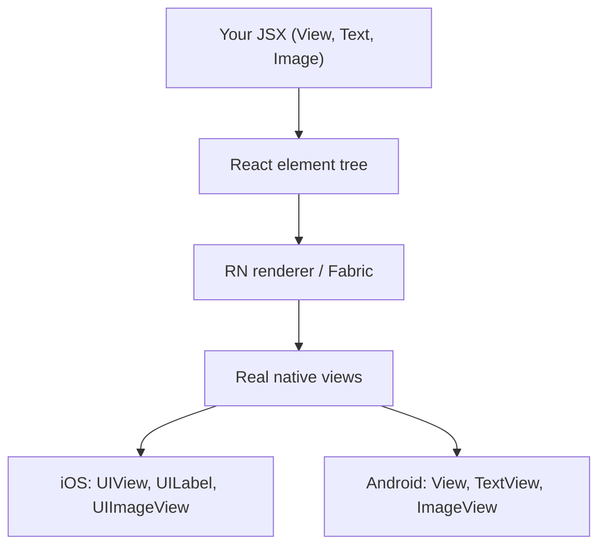
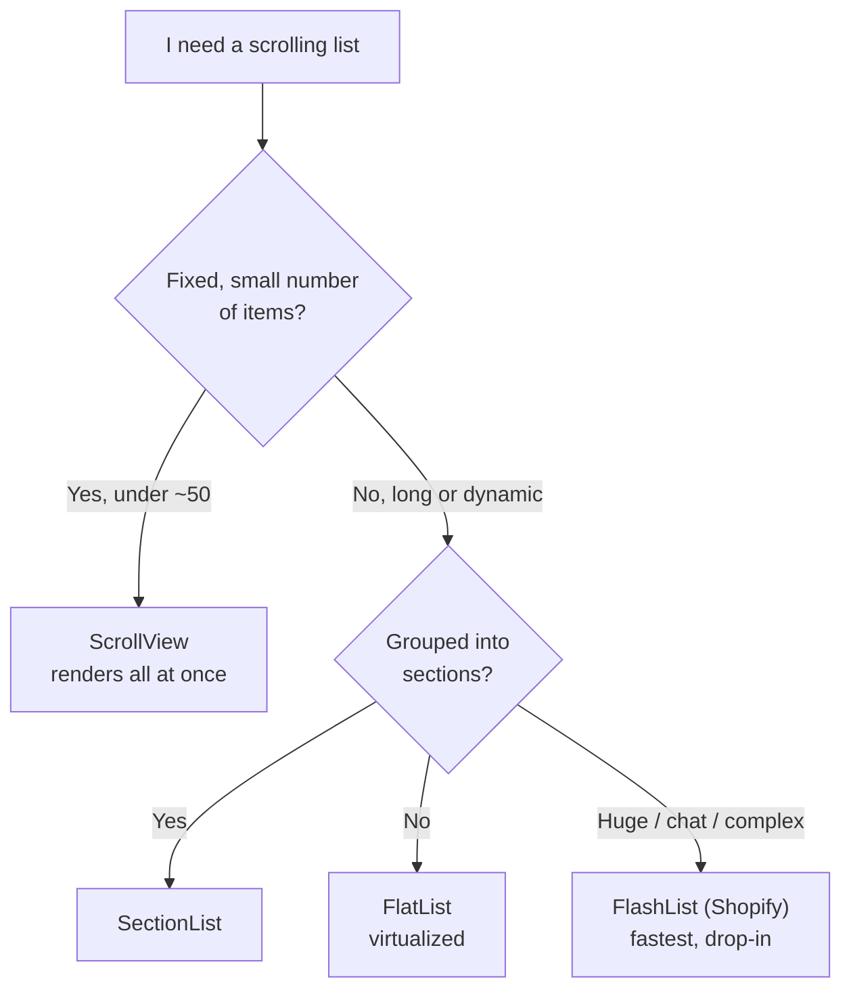
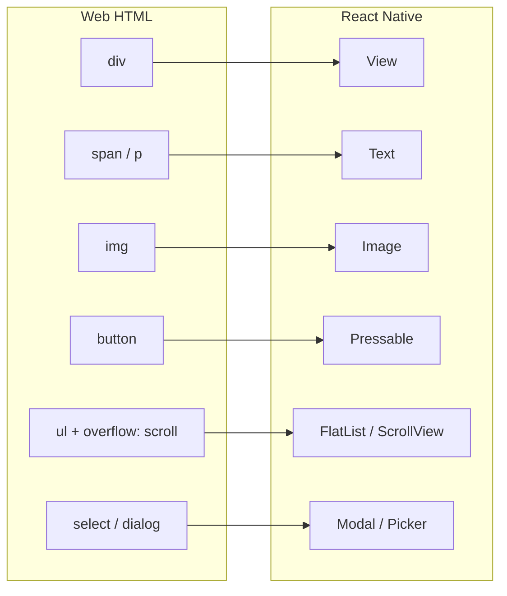
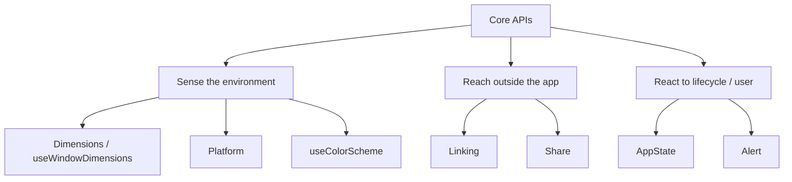
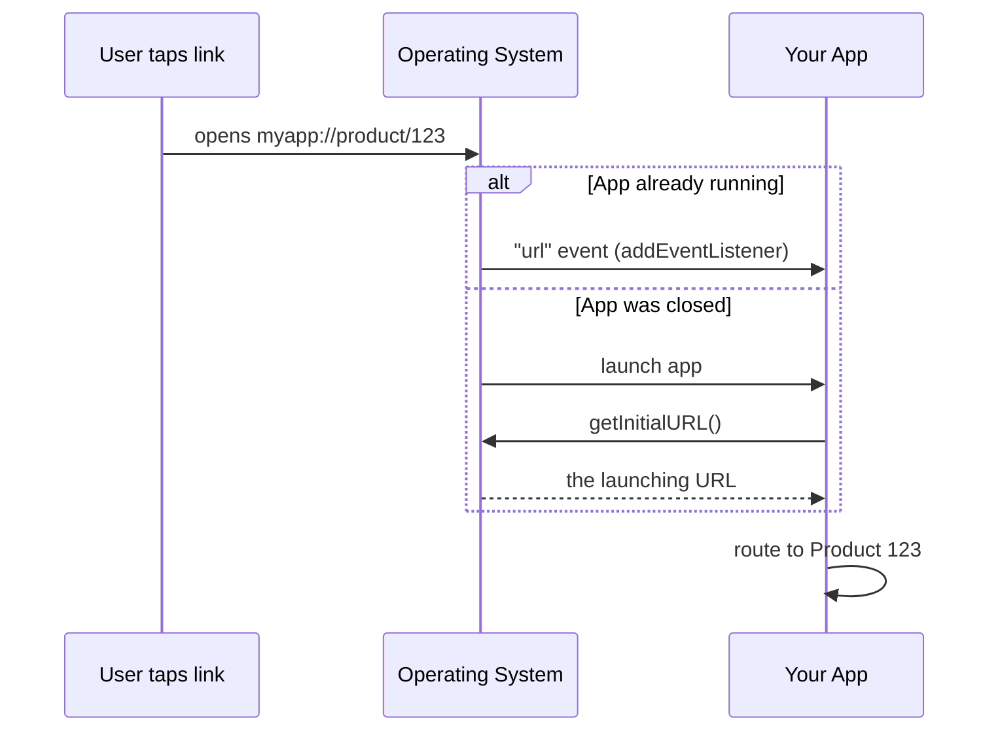
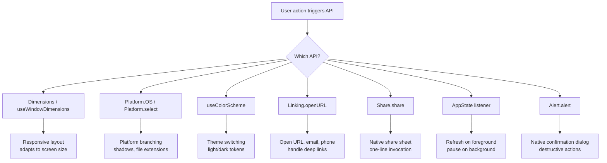

# Composants et API de base : les briques fondamentales

> Les primitives natives qui remplacent les éléments HTML, et les API de plateforme que vous utiliserez au quotidien.

---

## Table of Contents
1. [Building-Block Components](#1-building-block-components)
2. [Core APIs to Internalize](#2-core-apis-to-internalize)

---

## 1. Les composants briques fondamentales

Sur le web, vous disposez de `<div>`, `<span>`, ``, `<button>`, `<ul>` et du reste de la spécification HTML. En React Native, vous disposez d'un ensemble de primitives plus restreint et plus réfléchi. Chaque pixel de votre écran provient de la composition de ces briques fondamentales. Apprenez-les en profondeur — elles constituent l'intégralité de votre vocabulaire.

### Pourquoi si peu de primitives ?

Sur le web, le navigateur embarque des centaines d'éléments HTML, et le moteur du navigateur associe chacun d'eux à un comportement de rendu natif. React Native adopte une approche différente : chaque composant de base est une fine surcouche JavaScript autour d'une **véritable vue native** — `UIView` / `RCTView` sur iOS, `android.view.View` sur Android. Lorsque vous écrivez `<View>`, le framework instancie un véritable widget natif que le système d'exploitation dessine. Il n'y a ni DOM, ni HTML, ni moteur CSS entre les deux.

C'est tout le changement de modèle mental. Sur le web, vous décrivez un document et le navigateur le peint. En React Native, vous assemblez un arbre de widgets natifs, et React maintient cet arbre natif synchronisé avec l'état de vos composants.



> **Modèle mental :** un composant React Native n'est pas « comme » un widget natif — à l'exécution, il *en est* un. C'est pourquoi votre application paraît native : il n'y a pas de web view, pas de défilement émulé, pas de boutons factices. La contrepartie, c'est que vous ne disposez que des primitives exposées par le framework, et vous composez donc une UI plus riche à partir de ce petit ensemble.

Voici l'antisèche qui fait correspondre le vocabulaire web que vous connaissez déjà au vocabulaire natif :

| Web (HTML/CSS) | React Native | Notes |
| --- | --- | --- |
| `<div>` | `View` | Conteneur de mise en page, sans texte, sans défilement |
| `<span>` / `<p>` | `Text` | Le seul endroit où des chaînes peuvent vivre |
| `` | `Image` | Les images distantes nécessitent une taille explicite |
| `<button>` / `<a onClick>` | `Pressable` | Gestion du toucher + états d'appui |
| `<ul>` avec `overflow: scroll` | `ScrollView` / `FlatList` | Petites vs grandes listes |
| `<input>` / `<textarea>` | `TextInput` | Contrôlé de la même façon que sur le web |
| `<dialog>` / surcouche modale | `Modal` | Présentation native |
| `<select>` | `Picker` communautaire | N'est plus dans le cœur |

### View : le conteneur universel

`View` est votre `<div>`. C'est un conteneur non défilant qui prend en charge la mise en page flexbox, le style, la gestion du toucher et l'accessibilité. Contrairement à une div, il ne rend pas de texte — essayez de placer une chaîne brute à l'intérieur d'une `View` et vous obtiendrez un écran rouge.

```tsx
import { View, StyleSheet } from "react-native";

function Card({ children }: { children: React.ReactNode }) {
  return <View style={styles.card}>{children}</View>;
}

const styles = StyleSheet.create({
  card: {
    padding: 16,
    borderRadius: 12,
    backgroundColor: "#fff",
    // Shadow on iOS
    shadowColor: "#000",
    shadowOffset: { width: 0, height: 2 },
    shadowOpacity: 0.1,
    shadowRadius: 4,
    // Shadow on Android
    elevation: 3,
  },
});
```

Deux choses surprennent les développeurs web à propos de `View` :

- **Flexbox est la valeur par défaut, et `flexDirection` vaut `column` par défaut, pas `row`.** Sur le web, une `<div>` dispose ses enfants de haut en bas dans le flux du document, et flexbox s'active explicitement avec `display: flex` (dont la valeur par défaut est `row`). En React Native, chaque `View` est déjà un conteneur flex, et l'axe principal s'étend verticalement parce que les écrans de téléphone sont en hauteur. Si votre rangée de boutons s'empile verticalement alors que vous l'attendiez côte à côte, c'est que vous avez oublié `flexDirection: "row"`.
- **Il n'y a pas de `display`, pas de `float`, pas de `position: sticky`, pas de grid.** La mise en page se résume à flexbox plus le positionnement absolu, point final. Cela peut sembler limitant, mais c'est en réalité libérateur — il n'y a qu'un seul système de mise en page à apprendre.

> **Piège :** les ombres fonctionnent de façon complètement différente sur iOS et Android. iOS utilise les propriétés `shadow*` ; Android utilise `elevation`. Vous écrirez les deux, à chaque fois. Des bibliothèques comme `react-native-shadow-2` existent, mais la plupart des équipes acceptent simplement la duplication. (Dans les versions récentes de RN, une propriété de style `boxShadow` unifiée arrive — mais `elevation` + `shadow*` reste l'approche portable aujourd'hui.)

> **Astuce de pro :** une `View` peut capturer des touchers sans être un bouton. Ajoutez `onStartShouldSetResponder` pour du travail brut sur les gestes, mais dans 95 % des cas, vous voulez plutôt `Pressable` — optez pour cela, et non pour une `View` qui gère le toucher.

### Text : le seul endroit où les chaînes peuvent vivre

Sur le web, vous pouvez déposer du texte n'importe où — dans une `<div>`, un `<span>`, voire directement dans le body. React Native est strict : tout texte doit vivre à l'intérieur d'un composant `<Text>`. Les composants Text s'imbriquent, et les composants internes héritent des styles de leur parent, un peu comme l'imbrication de `<span>` en HTML.

```tsx
import { Text, StyleSheet } from "react-native";

function Greeting() {
  return (
    <Text style={styles.body}>
      Welcome back, <Text style={styles.bold}>Alex</Text>. You have{" "}
      <Text style={styles.highlight}>3 new messages</Text>.
    </Text>
  );
}

const styles = StyleSheet.create({
  body: { fontSize: 16, color: "#333" },
  bold: { fontWeight: "700" },
  highlight: { color: "#007AFF" },
});
```

**Pourquoi cette rigueur ?** Le rendu de texte natif est fondamentalement différent du rendu de vue native. Sur iOS, un `Text` devient une primitive de mise en page de texte ; une `View` devient un conteneur générique. Le framework ne peut pas deviner à laquelle des deux appartient une chaîne nue, il vous force donc à être explicite. Cela signifie aussi que **l'héritage de style ne se produit qu'à l'intérieur d'un arbre `Text`** — contrairement au web, une `color` définie sur une `View` parente ne *cascade pas* jusqu'au texte. Le seul héritage en RN est `Text`-dans-`Text`.

```tsx
// This does NOT work the way web developers expect:
<View style={{ color: "red" }}>
  <Text>I am still the default color, not red.</Text>
</View>

// Color must live on the Text itself (or a parent Text):
<Text style={{ color: "red" }}>
  Now I am red, <Text>and so am I (inherited).</Text>
</Text>
```

Différences clés par rapport au web :
- Pas de cascade CSS `font-family`. Vous définissez `fontFamily` explicitement, et il doit s'agir d'une police que vous avez chargée (via `expo-font` ou un lien d'asset natif).
- `numberOfLines` avec `ellipsizeMode` remplace le CSS `text-overflow: ellipsis`.
- Le texte n'est pas sélectionnable par défaut. Ajoutez la prop `selectable` lorsque vous voulez le copier-coller.
- `onPress` fonctionne directement sur `Text` — pratique pour les liens en ligne au sein d'un paragraphe.

```tsx
// Truncate a long title to one line with an ellipsis:
<Text numberOfLines={1} ellipsizeMode="tail" style={{ fontSize: 16 }}>
  This is an extremely long product title that will not fit on one line
</Text>

// Inline tappable link, mid-paragraph:
<Text style={{ fontSize: 15 }}>
  By continuing you agree to our{" "}
  <Text style={{ color: "#007AFF" }} onPress={openTerms}>
    Terms of Service
  </Text>.
</Text>
```

> **Piège :** un espace isolé ou `{" "}` entre des nœuds `Text` imbriqués a son importance — RN ne réduit pas les espaces comme le fait HTML. Ce que vous écrivez est ce qui s'affiche.

### Image : locale et distante

`Image` remplace ``. Les images locales sont chargées via `require()` au moment du build (le bundler gère les suffixes de résolution comme `@2x` et `@3x`). Les images distantes **doivent** avoir une `width` et une `height` explicites — il n'y a pas de dimensionnement intrinsèque à partir d'une URL.

```tsx
import { Image, StyleSheet } from "react-native";

// Local — dimensions are known at build time
<Image source={require("./assets/logo.png")} style={styles.logo} />

// Remote — you MUST specify dimensions
<Image
  source={{ uri: "https://example.com/avatar.jpg" }}
  style={styles.avatar}
  resizeMode="cover"
/>
```

**Pourquoi le local et le distant se comportent différemment :** lorsque vous faites `require("./logo.png")`, le bundler lit le fichier *au moment du build*, connaît ses dimensions en pixels, choisit la bonne variante `@2x`/`@3x` selon la densité d'écran de l'appareil, et incorpore tout cela dans le bundle. Une URL distante est une inconnue à l'exécution — le framework n'a aucune idée de la taille de l'image avant de l'avoir téléchargée, il ne peut donc pas réserver d'espace de mise en page pour vous. C'est pourquoi vous devez lui fournir des dimensions explicites, exactement comme vous définiriez `width`/`height` sur un `` web pour éviter le décalage de mise en page.

`resizeMode` contrôle la façon dont l'image remplit son cadre — c'est l'équivalent direct du CSS `object-fit` :

| `resizeMode` | Équivalent CSS | Comportement |
| --- | --- | --- |
| `cover` | `object-fit: cover` | Mettre à l'échelle pour remplir le cadre, en rognant le débordement |
| `contain` | `object-fit: contain` | Mettre à l'échelle pour tenir entièrement à l'intérieur, avec bandes |
| `stretch` | `object-fit: fill` | Déformer pour remplir exactement (rarement ce que vous voulez) |
| `center` | `object-fit: none` (centré) | Pas de mise à l'échelle, centré |
| `repeat` | `background-repeat` | Répéter l'image en mosaïque |

> **Recommandation :** l'`Image` intégrée n'a pas de mise en cache disque pour les URI distantes sur Android. Utilisez `expo-image` ou `react-native-fast-image` dans toute application de production. `expo-image` est le choix moderne — il utilise une mise en cache native partagée, prend en charge les placeholders blurhash, les formats animés, et fonctionne aussi bien dans les projets Expo que bare.

```tsx
// expo-image with a blurhash placeholder shown while the real image loads:
import { Image } from "expo-image";

<Image
  source={{ uri: avatarUrl }}
  placeholder={{ blurhash: "LEHV6nWB2yk8pyo0adR*..." }}
  contentFit="cover"          // expo-image renames resizeMode -> contentFit
  transition={200}            // fade-in over 200ms
  style={{ width: 64, height: 64, borderRadius: 32 }}
/>
```

### ScrollView : quand tout tient en mémoire

Sur le web, le navigateur fait défiler la page gratuitement. En React Native, rien ne défile à moins que vous ne l'enveloppiez dans une `ScrollView`. Elle rend **tous** ses enfants d'un coup, ce qui convient pour un écran de réglages comportant 20 éléments, mais est fatal pour un fil d'actualité de 10 000.

```tsx
import { ScrollView, RefreshControl, Text } from "react-native";

function SettingsScreen() {
  const [refreshing, setRefreshing] = React.useState(false);

  const onRefresh = async () => {
    setRefreshing(true);
    await fetchSettings();
    setRefreshing(false);
  };

  return (
    <ScrollView
      contentContainerStyle={{ padding: 16 }}
      refreshControl={
        <RefreshControl refreshing={refreshing} onRefresh={onRefresh} />
      }
    >
      <Text>Profile</Text>
      <Text>Notifications</Text>
      <Text>Privacy</Text>
      {/* This is fine — bounded, small list */}
    </ScrollView>
  );
}
```

**Pourquoi « tout d'un coup » compte :** rendre tous les enfants signifie que chaque enfant est une vue native active occupant de la mémoire, y compris ceux qui ont défilé hors de l'écran. Pour 20 lignes de réglages, ce n'est rien. Pour un fil de 10 000 éléments, cela alloue 10 000 vues natives, fait exploser la mémoire et saccade le défilement. Le navigateur vous cache ce coût parce que son moteur virtualise le rendu du DOM en coulisses — React Native rend le coût explicite et vous laisse le choix.

> **Piège :** la distinction entre `style` et `contentContainerStyle` fait trébucher tout le monde. `style` stylise le *viewport* de défilement (la fenêtre visible). `contentContainerStyle` stylise le *contenu* qui défile à l'intérieur. Le padding appartient presque toujours à `contentContainerStyle` ; un `flex: 1` pour que la zone de défilement remplisse l'écran appartient à `style`.

Règle générale : si le nombre d'enfants est borné et petit (moins d'environ 50 éléments simples), `ScrollView` convient. Sinon, optez pour `FlatList`. Voici la décision résumée en une image :



### FlatList : les listes virtualisées

`FlatList` est le cheval de bataille de React Native. Elle ne rend que les éléments visibles à l'écran (plus un petit tampon), recyclant les vues au fur et à mesure que vous faites défiler. C'est votre `<ul>` pour toute liste de longueur dynamique.

**Ce que signifie « virtualisée » :** au lieu de monter une vue native par élément de données, `FlatList` ne monte que la poignée d'éléments situés à l'intérieur de la « fenêtre » visible plus un tampon au-dessus et en dessous. Au fur et à mesure que vous faites défiler, les éléments qui quittent la fenêtre sont démontés et leurs vues sont réutilisées pour les éléments qui y entrent. Ainsi, une liste de 10 000 lignes coûte à peu près la même mémoire qu'une liste de 20 lignes. C'est l'outil de performance le plus important de React Native, et vous y recourez constamment.

```tsx
import { FlatList, Text, View } from "react-native";

type Message = { id: string; text: string; sender: string };

function MessageList({ messages }: { messages: Message[] }) {
  return (
    <FlatList
      data={messages}
      keyExtractor={(item) => item.id}
      renderItem={({ item }) => (
        <View style={{ padding: 12 }}>
          <Text style={{ fontWeight: "600" }}>{item.sender}</Text>
          <Text>{item.text}</Text>
        </View>
      )}
      // Performance essentials
      initialNumToRender={15}
      maxToRenderPerBatch={10}
      windowSize={5}
      // Pull to refresh
      onRefresh={handleRefresh}
      refreshing={isRefreshing}
      // Infinite scroll
      onEndReached={loadMore}
      onEndReachedThreshold={0.5}
    />
  );
}
```

Les props de réglage semblent cryptiques au premier abord. Voici ce que chacune contrôle réellement :

| Prop | Ce qu'elle fait | Quand la modifier |
| --- | --- | --- |
| `initialNumToRender` | Éléments rendus au premier affichage | Réduisez-la si le premier affichage est lent |
| `maxToRenderPerBatch` | Éléments ajoutés par lot de défilement | Réduisez pour un défilement plus fluide, augmentez pour remplir plus vite |
| `windowSize` | Multiples de l'écran maintenus montés (21 par défaut) | Réduisez pour économiser la mémoire, augmentez pour réduire les flashs vides |
| `onEndReachedThreshold` | À quelle proximité de la fin (0–1) `onEndReached` se déclenche | 0.5 signifie « quand il reste un demi-écran » |
| `getItemLayout` | Permet à la liste d'éviter la mesure pour les lignes à hauteur fixe | Fournissez-le toujours quand la hauteur de ligne est constante |

```tsx
// If every row is exactly 72px tall, this is a free, large performance win —
// the list no longer has to measure each row to know where it sits:
const ROW_HEIGHT = 72;

<FlatList
  data={messages}
  getItemLayout={(_, index) => ({
    length: ROW_HEIGHT,
    offset: ROW_HEIGHT * index,
    index,
  })}
  renderItem={renderMessage}
/>
```

> **Piège :** l'erreur de performance la plus fréquente avec FlatList est de passer une fonction fléchée en ligne à `renderItem` ou de créer de nouveaux objets dans `keyExtractor`. Cela provoque des re-renders à chaque frame pendant le défilement. Extrayez votre fonction de rendu et assurez-vous que `keyExtractor` retourne une chaîne stable. Enveloppez le composant de ligne dans `React.memo` pour que les lignes inchangées évitent complètement le re-render.

> **Astuce de pro :** pour les listes très grandes ou complexes (chat, fils sociaux), `@shopify/flash-list` de Shopify est un remplacement quasi direct qui recycle les vues plus agressivement et mesure moins. Même forme d'API (`data`, `renderItem`, `keyExtractor`), souvent nettement plus fluide. Commencez par `FlatList` ; passez à `FlashList` quand le profilage l'indique.

### SectionList : les données groupées

`SectionList` est une `FlatList` avec des en-têtes. Pensez à une liste de contacts groupée par première lettre, ou à un menu groupé par catégorie. Elle est virtualisée exactement comme `FlatList`, mais ses données sont structurées en tableau de sections `{ title, data }` plutôt qu'en tableau plat, et elle peut épingler les en-têtes de section en haut à mesure que vous faites défiler.

```tsx
import { SectionList, Text } from "react-native";

const DATA = [
  { title: "Fruits", data: ["Apple", "Banana", "Cherry"] },
  { title: "Vegetables", data: ["Carrot", "Peas", "Spinach"] },
];

function GroceryList() {
  return (
    <SectionList
      sections={DATA}
      keyExtractor={(item, index) => item + index}
      renderItem={({ item }) => <Text style={{ padding: 8 }}>{item}</Text>}
      renderSectionHeader={({ section: { title } }) => (
        <Text style={{ fontWeight: "bold", padding: 8, backgroundColor: "#eee" }}>
          {title}
        </Text>
      )}
      stickySectionHeadersEnabled
    />
  );
}
```

> **Astuce de pro :** `stickySectionHeadersEnabled` vous donne l'effet de l'application Contacts d'iOS où l'en-tête de lettre reste épinglé en haut jusqu'à ce que la section suivante le pousse hors de vue. Il est activé par défaut sur iOS, désactivé sur Android — définissez-le explicitement si vous voulez un comportement cohérent sur les deux plateformes.

### Pressable : la primitive de toucher moderne

Oubliez `TouchableOpacity`, `TouchableHighlight` et `TouchableWithoutFeedback`. Ce sont des composants hérités. `Pressable` est le seul composant de toucher que vous devriez utiliser — il vous donne un contrôle fin sur les états d'appui via une fonction de style.

```tsx
import { Pressable, Text, StyleSheet } from "react-native";

function PrimaryButton({ title, onPress }: { title: string; onPress: () => void }) {
  return (
    <Pressable
      onPress={onPress}
      style={({ pressed }) => [
        styles.button,
        pressed && styles.buttonPressed,
      ]}
      android_ripple={{ color: "rgba(0,0,0,0.1)" }}
    >
      <Text style={styles.buttonText}>{title}</Text>
    </Pressable>
  );
}

const styles = StyleSheet.create({
  button: {
    backgroundColor: "#007AFF",
    paddingVertical: 12,
    paddingHorizontal: 24,
    borderRadius: 8,
    alignItems: "center",
  },
  buttonPressed: { opacity: 0.7 },
  buttonText: { color: "#fff", fontWeight: "600", fontSize: 16 },
});
```

L'état `pressed` dans la fonction de style est le pattern clé. **La raison pour laquelle `Pressable` l'a emporté**, c'est que chaque membre de l'ancienne famille `Touchable*` intégrait un comportement de retour fixe (fondu d'opacité, couleur de surbrillance, rien). `Pressable` est sans opinion : il vous remet l'état d'interaction brut — `pressed`, plus `onPressIn`, `onPressOut`, `onLongPress`, et un `hitSlop` pour agrandir la cible de toucher — et vous laisse *décider* du rendu visuel. Une seule primitive, n'importe quel retour que vous souhaitez.

```tsx
// hitSlop enlarges the touchable area beyond the visible bounds —
// essential for small icons so users do not "miss" the tap:
<Pressable
  onPress={onClose}
  hitSlop={{ top: 12, bottom: 12, left: 12, right: 12 }}
  onLongPress={showContextMenu}
>
  <Icon name="close" size={16} />
</Pressable>
```

Sur Android, utilisez également `android_ripple` pour l'effet d'ondulation Material natif que les utilisateurs attendent — sans lui, les touchers Android semblent « morts » par rapport au reste du système. Voici comment les composants hérités correspondent à `Pressable` :

| Composant hérité | Retour intégré | Équivalent `Pressable` |
| --- | --- | --- |
| `TouchableOpacity` | Atténue l'opacité à l'appui | `style={({pressed}) => pressed && {opacity:0.7}}` |
| `TouchableHighlight` | Superpose une couleur de surbrillance | `style={({pressed}) => pressed && {backgroundColor:...}}` |
| `TouchableWithoutFeedback` | Aucun | `Pressable` sans style d'appui |
| `TouchableNativeFeedback` | Ondulation Android | `android_ripple={{ color: ... }}` |

> **Piège :** envelopper une grande zone dans un `Pressable` sans retour visuel donne aux utilisateurs l'impression que l'application est cassée — ils tapent et rien ne le reconnaît. Donnez toujours *un* retour (opacité, ondulation, échelle) pour que l'appui s'enregistre visuellement.

### Modal, SafeAreaView, KeyboardAvoidingView et ActivityIndicator

Ces quatre-là sont des utilitaires auxquels vous recourrez constamment. Chacun résout un problème qui n'existe tout simplement pas sur le web, où le chrome du navigateur s'en charge pour vous.

```tsx
import {
  Modal,
  SafeAreaView,
  KeyboardAvoidingView,
  ActivityIndicator,
  Platform,
  View,
  Text,
  TextInput,
} from "react-native";

function CreatePostModal({ visible, onClose }: { visible: boolean; onClose: () => void }) {
  return (
    <Modal visible={visible} animationType="slide" onRequestClose={onClose}>
      <SafeAreaView style={{ flex: 1 }}>
        <KeyboardAvoidingView
          behavior={Platform.OS === "ios" ? "padding" : "height"}
          style={{ flex: 1, padding: 16 }}
        >
          <Text style={{ fontSize: 20, fontWeight: "bold" }}>New Post</Text>
          <TextInput
            placeholder="What's on your mind?"
            multiline
            style={{ flex: 1, textAlignVertical: "top", marginTop: 12 }}
          />
        </KeyboardAvoidingView>
      </SafeAreaView>
    </Modal>
  );
}

// Loading spinner — simple, but you will use it everywhere
function LoadingScreen() {
  return (
    <View style={{ flex: 1, justifyContent: "center", alignItems: "center" }}>
      <ActivityIndicator size="large" color="#007AFF" />
    </View>
  );
}
```

À quoi sert chacun :

| Composant | Problème qu'il résout | Analogue web |
| --- | --- | --- |
| `Modal` | Présente du contenu par-dessus toute l'application avec une transition native | `<dialog>` / une surcouche portail |
| `SafeAreaView` | Garde le contenu à l'écart de l'encoche, de la barre d'état, de l'indicateur d'accueil | (le navigateur s'en charge) |
| `KeyboardAvoidingView` | Empêche le clavier à l'écran de recouvrir vos champs de saisie | (le navigateur fait défiler les champs dans la vue) |
| `ActivityIndicator` | Indicateur de chargement natif de la plateforme | Un spinner CSS ou `<progress>` |

**Pourquoi `SafeAreaView` existe :** les téléphones modernes ont des encoches, des coins arrondis, des barres d'état et une barre d'indicateur d'accueil en bas. Si vous dessinez un écran bord à bord, le contenu peut se glisser *sous* ces caractéristiques matérielles et devenir illisible ou impossible à toucher. `SafeAreaView` insère un padding égal aux marges « non sûres » de l'appareil pour que votre contenu reste dans la région visible. Le navigateur ne vous oblige jamais à y penser parce que le viewport exclut déjà le chrome du système.

> **Recommandation :** la `SafeAreaView` intégrée ne fonctionne que sur iOS et présente des bugs connus avec les animations. Utilisez plutôt `SafeAreaView` de `react-native-safe-area-context` — elle fonctionne sur les deux plateformes, fournit le hook `useSafeAreaInsets()` pour un contrôle granulaire, et c'est ce dont dépend toutes les grandes bibliothèques de navigation.

```tsx
// The hook gives you raw inset values so you can apply them surgically —
// e.g. pad only the bottom for a floating action button:
import { useSafeAreaInsets } from "react-native-safe-area-context";

function FloatingButton() {
  const insets = useSafeAreaInsets();
  return (
    <View style={{ position: "absolute", bottom: insets.bottom + 16, right: 16 }}>
      {/* ... */}
    </View>
  );
}
```

> **Piège :** `KeyboardAvoidingView` avec `behavior="padding"` fonctionne bien sur iOS. Sur Android, la valeur par défaut `android:windowSoftInputMode="adjustResize"` dans `AndroidManifest.xml` gère généralement la situation, mais l'interaction entre les deux peut être imprévisible. Testez les deux plateformes tôt. Pour les formulaires complexes, de nombreuses équipes utilisent `react-native-keyboard-aware-scroll-view` ou `react-native-keyboard-controller` plutôt que de se battre avec la solution intégrée.

Voici à quoi ressemble la correspondance des composants du web vers le natif :



---

## 2. Les API de base à intérioriser

Les composants placent des choses à l'écran. Les API vous donnent accès à l'appareil et au système d'exploitation sous-jacents. Là où un composant est quelque chose que vous *rendez*, une API est quelque chose que vous *appelez* — la plupart d'entre elles sont de simples fonctions et hooks, pas du JSX. Ce sont celles que vous importerez dans presque chaque projet.

Une façon utile de les regrouper : certaines renseignent **l'environnement** (`Dimensions`, `Platform`, `useColorScheme`), certaines vous permettent de **sortir de l'application** (`Linking`, `Share`), et certaines renseignent **le cycle de vie de l'application elle-même** (`AppState`, `Alert`).



### Dimensions et useWindowDimensions

Vous avez besoin de la taille de l'écran pour des mises en page responsives. Il y a deux façons de l'obtenir, et l'une est meilleure.

```tsx
import { Dimensions, useWindowDimensions, View } from "react-native";

// OLD WAY — static, does not update on rotation or foldables
const { width, height } = Dimensions.get("window");

// RIGHT WAY — reactive hook, updates when dimensions change
function ResponsiveGrid() {
  const { width } = useWindowDimensions();
  const numColumns = width > 768 ? 3 : 2;

  return (
    <FlatList
      data={items}
      numColumns={numColumns}
      key={numColumns} // Force re-mount when columns change
      renderItem={({ item }) => (
        <View style={{ width: width / numColumns, height: 200 }}>
          {/* ... */}
        </View>
      )}
    />
  );
}
```

**Pourquoi le hook surpasse l'appel statique :** `Dimensions.get("window")` lit la taille *une seule fois*, au moment où cette ligne s'exécute. Si l'utilisateur fait pivoter l'appareil, déplie un appareil pliable ou partage l'écran sur une tablette, cette valeur est désormais périmée et votre mise en page est fausse. `useWindowDimensions` est un hook qui s'abonne aux changements de dimensions et re-render le composant avec des chiffres frais — le même contrat réactif que `useState`. Sur le web, vous attacheriez un écouteur `resize` et forceriez une mise à jour ; le hook est la version intégrée de RN de exactement cela.

Il y a aussi une distinction subtile entre `"window"` et `"screen"` :

| Argument | Signifie | À utiliser pour |
| --- | --- | --- |
| `"window"` | La zone dessinable de l'application (exclut les barres d'état/navigation Android) | Presque toujours — c'est votre véritable toile |
| `"screen"` | L'intégralité de l'affichage physique | Rare ; calculs plein écran incluant les barres système |

Utilisez toujours `useWindowDimensions` à l'intérieur des composants. N'utilisez `Dimensions.get()` que dans des constantes au niveau du module où les hooks ne sont pas disponibles (comme la définition d'un style statique).

> **Piège :** ne stockez pas une valeur de `Dimensions.get()` dans une `const` de premier niveau et ne la réutilisez pas comme si elle était vivante — elle se fige au lancement de l'application et ne se met jamais à jour. C'est le classique bug « ma mise en page tablette est fausse après rotation ».

### Platform : brancher selon l'OS

`Platform.OS` vaut `"ios"` ou `"android"` (ou `"web"` si vous utilisez React Native Web). `Platform.select` est plus propre que les ternaires lorsque vous avez plusieurs branches.

```tsx
import { Platform, StyleSheet } from "react-native";

const styles = StyleSheet.create({
  shadow: Platform.select({
    ios: {
      shadowColor: "#000",
      shadowOffset: { width: 0, height: 2 },
      shadowOpacity: 0.15,
      shadowRadius: 4,
    },
    android: {
      elevation: 4,
    },
    default: {
      // Web or other platforms
      boxShadow: "0 2px 4px rgba(0,0,0,0.15)",
    },
  }),
});

// For larger branching, use platform-specific files:
// MyComponent.ios.tsx
// MyComponent.android.tsx
// The bundler automatically resolves the right one.
```

Vous disposez de trois outils croissants pour gérer les différences de plateforme. Optez pour le plus léger qui convient :

| Outil | Idéal pour | Coût |
| --- | --- | --- |
| `Platform.OS === "ios"` | Une seule branche en ligne | Vérification à l'exécution |
| `Platform.select({...})` | Une valeur avec 2–3 variantes de plateforme (styles, constantes) | Vérification à l'exécution |
| Fichiers `*.ios.tsx` / `*.android.tsx` | Composants qui divergent beaucoup | Nul — résolu au moment du build |

L'approche basée sur les fichiers (`*.ios.tsx` / `*.android.tsx`) est puissante pour les composants qui diffèrent significativement d'une plateforme à l'autre. Le bundler choisit le bon fichier au moment du build — coût d'exécution nul, et le code de la plateforme inutilisée n'est même pas embarqué dans l'autre bundle.

> **Astuce de pro :** `Platform.Version` vous indique la version de l'OS (un niveau d'API entier sur Android, une chaîne comme `"17.2"` sur iOS). Utilisez-la pour protéger les fonctionnalités qui n'existent que sur les versions d'OS plus récentes, plutôt que de supposer que chaque appareil exécute la dernière.

### Appearance et useColorScheme : le mode sombre

Toute application moderne a besoin de la prise en charge du mode sombre. React Native vous donne la préférence de l'utilisateur d'emblée.

```tsx
import { useColorScheme, View, Text, StyleSheet } from "react-native";

function ThemedCard({ title }: { title: string }) {
  const colorScheme = useColorScheme(); // "light" | "dark" | null
  const isDark = colorScheme === "dark";

  return (
    <View
      style={[
        styles.card,
        { backgroundColor: isDark ? "#1c1c1e" : "#ffffff" },
      ]}
    >
      <Text style={{ color: isDark ? "#fff" : "#000" }}>{title}</Text>
    </View>
  );
}

const styles = StyleSheet.create({
  card: { padding: 16, borderRadius: 12, margin: 8 },
});
```

**Comment cela fonctionne en coulisses :** `useColorScheme` est un fin hook au-dessus de l'API `Appearance`, qui lit le réglage clair/sombre du *système d'exploitation* et émet un événement de changement lorsque l'utilisateur le bascule dans le Centre de contrôle ou les Réglages. Comme c'est un hook, votre composant se re-render à l'instant où le thème de l'OS change — pas de redémarrage de l'application, pas d'écouteur manuel. La valeur `null` signifie « aucune préférence rapportée pour l'instant », alors traitez toujours `null` comme un repli (généralement clair).

```tsx
// The imperative Appearance API, for non-component code (e.g. a logger or store):
import { Appearance } from "react-native";

const current = Appearance.getColorScheme(); // read once
const sub = Appearance.addChangeListener(({ colorScheme }) => {
  console.log("OS theme is now", colorScheme);
});
// later: sub.remove();
```

> **Recommandation :** ne dispersez pas `useColorScheme` à travers chaque composant. Créez un contexte de thème ou utilisez une bibliothèque comme la prise en charge de thème intégrée de `@react-navigation/native`. Définissez vos tokens de couleur une seule fois (`background`, `text`, `accent`...), consommez-les partout. Lorsque vous ajouterez plus tard un basculement manuel « Sombre / Clair / Système », vous modifiez un seul provider au lieu de traquer une centaine de ternaires `isDark`.

### Linking : URL et deep links

`Linking` est la façon dont vous ouvrez des URL, des numéros de téléphone, des e-mails, et la façon dont votre application répond aux deep links entrants. Cela fonctionne dans les deux sens : **sortant** (votre application demande à l'OS d'ouvrir quelque chose) et **entrant** (l'OS remet à votre application une URL qui l'a lancée ou reprise).

```tsx
import { Linking, Alert, Pressable, Text } from "react-native";

// Opening external URLs
async function openWebsite(url: string) {
  const supported = await Linking.canOpenURL(url);
  if (supported) {
    await Linking.openURL(url);
  } else {
    Alert.alert("Error", `Cannot open URL: ${url}`);
  }
}

// Phone, email, maps
await Linking.openURL("tel:+15551234567");
await Linking.openURL("mailto:support@example.com?subject=Help");
await Linking.openURL("https://maps.apple.com/?q=coffee");

// Listening for incoming deep links
function App() {
  React.useEffect(() => {
    const subscription = Linking.addEventListener("url", (event) => {
      handleDeepLink(event.url); // e.g., "myapp://product/123"
    });

    // Check if app was opened via a deep link (cold start)
    Linking.getInitialURL().then((url) => {
      if (url) handleDeepLink(url);
    });

    return () => subscription.remove();
  }, []);

  // ...
}
```

**Le modèle de schéma d'URL :** les liens sortants utilisent le même système de schéma que l'OS emploie partout — `tel:`, `mailto:`, `sms:`, `https:`, et des schémas spécifiques aux applications comme `instagram://`. `canOpenURL` demande à l'OS « une application installée est-elle enregistrée pour gérer ce schéma ? » avant que vous n'essayiez, pour que vous puissiez vous rabattre proprement. Les deep links entrants en sont l'image miroir : votre application enregistre un schéma (`myapp://`) ou un lien universel/app link (`https://myapp.com/...`), et lorsque quelque chose ouvre une telle URL, l'OS lance votre application et la lui délivre.

Il y a deux cas entrants distincts, et les débutants oublient celui du démarrage à froid :



En production, vous utiliserez probablement `expo-linking` ou l'intégration de deep linking d'une bibliothèque de navigation plutôt que l'API brute. Mais comprendre la primitive vous aide à déboguer lorsque les liens ne s'acheminent pas correctement — en particulier le chemin de démarrage à froid, que `getInitialURL` existe précisément pour gérer.

### Share : la feuille de partage native

Une seule ligne pour invoquer la feuille de partage de la plateforme — quelque chose qui demande un effort considérable sur le web. `Share.share()` remet une charge utile à l'OS, qui présente sa propre feuille native listant Messages, Mail, AirDrop, et chaque application de l'utilisateur capable de recevoir le contenu. Vous ne construisez aucune de cette UI ; vous fournissez seulement les données.

```tsx
import { Share } from "react-native";

async function shareArticle(title: string, url: string) {
  try {
    const result = await Share.share({
      message: `Check out "${title}": ${url}`,
      // iOS-only: separate url field shows a link preview
      url: url,
      title: title,
    });

    if (result.action === Share.sharedAction) {
      // User shared successfully
    }
  } catch (error) {
    // User cancelled or error occurred
  }
}
```

> **Piège :** les champs de la charge utile sont gérés différemment selon la plateforme. iOS lit `message` *et* `url` (et rend un aperçu de lien enrichi à partir de `url`) ; Android ne lit que `message`, vous devez donc concaténer l'URL dans la chaîne du message pour qu'elle soit transmise. Le champ `title` devient l'objet lors d'un partage par e-mail. Incluez toujours l'URL dans `message` si Android vous importe.

> **Astuce de pro :** `Share.share` ne partage que du texte et des URL. Pour partager un fichier, une image ou un PDF, utilisez `expo-sharing` ou `react-native-share`, qui acceptent des chemins de fichiers locaux et des charges utiles plus riches.

### AppState : premier plan et arrière-plan

Sur le web, vous avez `visibilitychange`. En React Native, vous avez `AppState`. Il vous indique si l'application est au premier plan (`active`), en arrière-plan (`background`), ou en transition (`inactive` sur iOS — par exemple le sélecteur d'applications est ouvert ou un appel arrive).

```tsx
import { AppState } from "react-native";

function useAppStateRefresh(onForeground: () => void) {
  const appState = React.useRef(AppState.currentState);

  React.useEffect(() => {
    const subscription = AppState.addEventListener("change", (nextState) => {
      // App came back to foreground
      if (appState.current.match(/inactive|background/) && nextState === "active") {
        onForeground();
      }
      appState.current = nextState;
    });

    return () => subscription.remove();
  }, [onForeground]);
}

// Usage: refresh data when user returns to app
function HomeScreen() {
  useAppStateRefresh(() => {
    queryClient.invalidateQueries(["notifications"]);
  });
  // ...
}
```

**Pourquoi vous suivez l'état *précédent* :** l'événement ne vous indique que le nouvel état. Pour détecter la transition spécifique « est revenu au premier plan », vous devez comparer à votre point de départ — d'où le `useRef` qui conserve la valeur antérieure. Déclencher votre rafraîchissement à chaque événement `active` sans cette protection se déclencherait deux fois dans certains cas limites. Voici les états et ce qu'ils signifient :

| État | iOS | Android | Signification |
| --- | --- | --- | --- |
| `active` | Oui | Oui | L'application est au premier plan et reçoit des événements |
| `background` | Oui | Oui | L'application n'est pas visible (l'utilisateur est passé ailleurs) |
| `inactive` | Oui | (rare) | En transition — sélecteur d'applications, appel entrant, invite système |

Ce pattern — « rafraîchir les données périmées quand l'utilisateur revient » — est l'un des usages les plus courants. Des bibliothèques comme TanStack Query disposent d'une intégration `focusManager` intégrée pour cela, mais connaître l'API sous-jacente vous permet de gérer des cas personnalisés comme mettre une vidéo en pause, déconnecter un WebSocket, ou arrêter un abonnement de localisation pour économiser la batterie en arrière-plan.

### Alert : les boîtes de dialogue natives

`Alert.alert()` déclenche la boîte de dialogue native de la plateforme. Ce n'est pas un composant React — c'est un appel d'API impératif. Vous ne le rendez pas ; vous l'*appelez*, et l'OS dessine sa propre boîte de dialogue modale par-dessus tout le reste.

```tsx
import { Alert } from "react-native";

function confirmDelete(itemName: string, onConfirm: () => void) {
  Alert.alert(
    "Delete Item",
    `Are you sure you want to delete "${itemName}"? This cannot be undone.`,
    [
      { text: "Cancel", style: "cancel" },
      { text: "Delete", style: "destructive", onPress: onConfirm },
    ]
  );
}
```

**Impératif vs déclaratif — pourquoi c'est important :** la majeure partie de React Native est déclarative (vous décrivez l'UI à partir de l'état, React la rend). `Alert` est l'inverse : c'est un appel de fonction « fire-and-forget », plus proche du `window.confirm()` du navigateur que d'un `<Modal>` JSX. Cela le rend parfait pour les confirmations oui/non rapides déclenchées depuis des gestionnaires d'événements, mais cela signifie que vous ne pouvez pas le styliser ni y placer du contenu personnalisé — l'OS possède l'apparence.

Les valeurs de `style` des boutons correspondent aux conventions natives :

| `style` | Rendu iOS | Rendu Android |
| --- | --- | --- |
| `"default"` | Texte bleu normal | Texte normal |
| `"cancel"` | Gras, se ferme au toucher de l'arrière-plan | Texte normal |
| `"destructive"` | Texte rouge | Texte normal (style ignoré) |

Sur iOS, le style `destructive` rend le bouton en rouge. Sur Android, il est ignoré — les boutons ont toujours la même apparence. Si vous avez besoin de boîtes de dialogue plus riches avec une UI personnalisée, des couleurs personnalisées ou des champs de formulaire à l'intérieur, vous les construirez avec `Modal` et vos propres composants.



> **Erreur courante :** recourir à une bibliothèque tierce avant d'avoir essayé l'API intégrée. Ces API de base couvrent 80 % des besoins d'interaction avec l'appareil. Apprenez ce qui est livré avec React Native, puis ajoutez des bibliothèques pour les 20 % restants — caméra, retours haptiques, biométrie, système de fichiers — là où des modules natifs sont réellement requis.

---