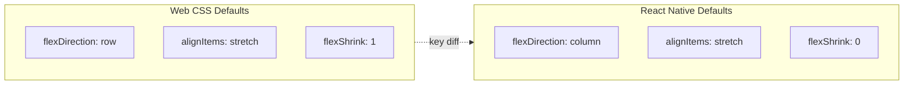
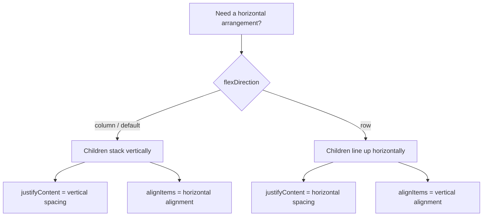
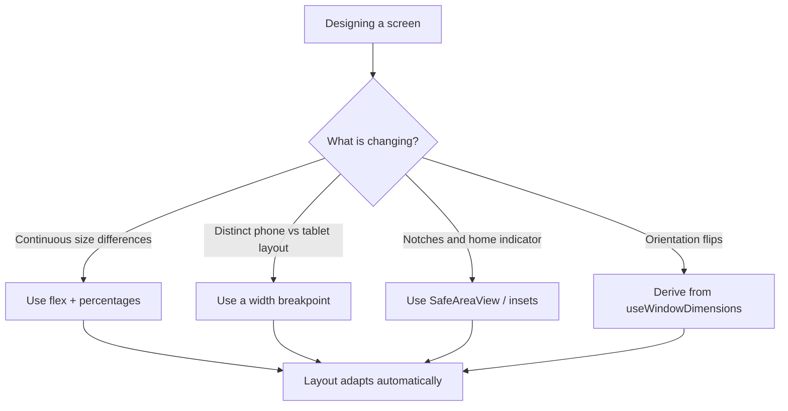
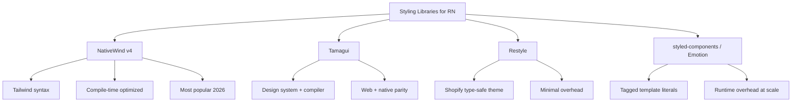
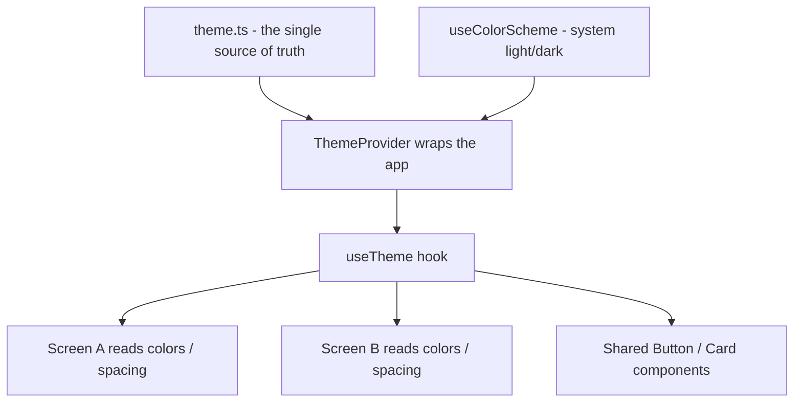
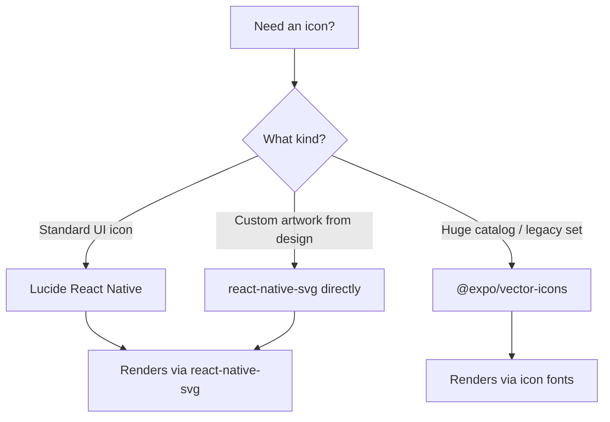

# Styling et mise en page : Flexbox sans le Web

> Comment fonctionne le styling dans React Native — pas de CSS, pas de Grid, juste Flexbox et des pixels indépendants de la densité.

---

## Table of Contents

1. [Core Mechanics](#1-core-mechanics)
2. [Responsive Design](#2-responsive-design)
3. [Styling Libraries](#3-styling-libraries)
4. [Theming](#4-theming)
5. [Icons and Assets](#5-icons-and-assets)

---

## 1. Mécanismes fondamentaux

### La première surprise

Si vous venez du React web, votre mémoire musculaire vous dit : écrire un fichier `.css`, l'importer, appliquer des noms de classe. Dans React Native, il n'y a pas de fichiers CSS, pas de noms de classe, pas de cascade, pas d'héritage depuis les éléments parents, et pas de navigateur pour interpréter vos règles. Chaque style est un objet JavaScript passé directement à un composant via la prop `style`. C'est l'intégralité du système.

Ce n'est pas une limitation — c'est une simplification. Sur le web, vous menez des guerres de spécificité, vous vous inquiétez des fuites globales, et vous déboguez pourquoi une `div` trois niveaux au-dessus écrase votre taille de police. Rien de tout cela n'existe ici. Chaque composant se style lui-même et lui seul.

Pourquoi cela fonctionne-t-il ainsi ? Il n'y a pas de moteur de navigateur sur un téléphone qui analyse les sélecteurs CSS et construit une cascade. React Native communique directement avec les primitives d'interface natives — une `UIView` iOS, une `View` Android. Une vue native ne comprend pas « le troisième enfant de n'importe quel élément ayant la classe `card` ». Elle comprend un sac plat de propriétés : cette vue a cet arrière-plan, ce padding, ce rayon de coin. Donc React Native vous donne exactement cela — un simple objet de propriétés — et saute toute la machinerie de correspondance des sélecteurs. Voyez cela comme la différence entre écrire une recette avec des règles (« assaisonnez tout dans la cuisine avec du sel ») et tendre à chaque plat son assiette finie.

> **Changement de modèle mental :** Sur le web, une feuille de style est un ensemble de *règles* qui sont mises en correspondance avec des éléments. Dans React Native, un style est une *valeur* que vous tendez à un élément. Il n'y a pas d'étape de correspondance, donc il n'y a rien à gagner ou perdre dans une guerre de spécificité.

### StyleSheet.create

React Native fournit `StyleSheet.create` pour définir vos styles. Cela ressemble presque exactement à des objets inline, mais avec une différence importante : les styles sont validés et envoyés au côté natif une seule fois au démarrage, et non recréés à chaque render.

```tsx
import { StyleSheet, View, Text } from 'react-native';

const ProfileCard = () => (
  <View style={styles.card}>
    <Text style={styles.name}>Ada Lovelace</Text>
    <Text style={styles.role}>Engineer</Text>
  </View>
);

const styles = StyleSheet.create({
  card: {
    backgroundColor: '#ffffff',
    borderRadius: 12,
    padding: 16,
    // Shadow on iOS
    shadowColor: '#000',
    shadowOffset: { width: 0, height: 2 },
    shadowOpacity: 0.1,
    shadowRadius: 4,
    // Shadow on Android
    elevation: 3,
  },
  name: {
    fontSize: 18,
    fontWeight: '700',
    color: '#1a1a2e',
  },
  role: {
    fontSize: 14,
    color: '#6b7280',
    marginTop: 4,
  },
});
```

Remarquez la gestion des ombres ci-dessus — c'est votre premier aperçu de la divergence entre plateformes. iOS lit les quatre propriétés `shadow*` ; Android les ignore entièrement et n'honore que `elevation`. Il n'existe pas de primitive d'ombre unique multiplateforme dans le cœur de React Native, donc vous définissez les deux et chaque plateforme choisit celle qu'elle comprend. (Les bibliothèques et les APIs plus récentes comme `boxShadow` lissent cela, mais l'habitude des deux propriétés reste la valeur sûre par défaut.)

Qu'est-ce que `StyleSheet.create` vous apporte réellement par rapport à un simple objet ? Trois choses :

- **Validation** — les fautes de frappe et les valeurs invalides sont détectées tôt plutôt qu'ignorées silencieusement.
- **Une identité stable** — l'objet est créé une seule fois, donc React peut comparer à bas coût `styles.card === styles.card` à travers les renders au lieu de voir un objet flambant neuf à chaque fois.
- **Du code auto-documenté** — des clés nommées (`card`, `name`, `role`) se lisent mieux que des blocs inline anonymes.

> **Conseil de performance :** Définissez toujours `StyleSheet.create` en dehors du corps de votre composant. Si vous le placez à l'intérieur, vous payez le coût de la recréation de ces objets à chaque render. Déplacez-le en bas du fichier — c'est une convention que tout l'écosystème suit.

> **Erreur fréquente :** Recourir à `StyleSheet.create` en s'attendant à des fonctionnalités CSS. Il n'y a pas de `:hover`, pas de `::before`, pas de sélecteurs descendants, pas de `calc()`, pas d'animations via keyframes. Ces besoins sont satisfaits par les props, le state, et les APIs `Animated`/Reanimated à la place.

### Objets inline pour les styles dynamiques

Lorsqu'un style dépend de props ou de state, vous ne pouvez pas le mettre dans `StyleSheet.create` parce que vous ne connaissez pas la valeur au moment de la définition. Utilisez plutôt un objet inline, et combinez-le avec vos styles statiques en utilisant la syntaxe en tableau :

```tsx
const Badge = ({ color, large }: { color: string; large?: boolean }) => (
  <View
    style={[
      styles.badge,
      { backgroundColor: color },
      large && styles.badgeLarge,
    ]}
  >
    <Text style={styles.badgeText}>New</Text>
  </View>
);

const styles = StyleSheet.create({
  badge: {
    paddingHorizontal: 8,
    paddingVertical: 4,
    borderRadius: 999,
  },
  badgeLarge: {
    paddingHorizontal: 16,
    paddingVertical: 8,
  },
  badgeText: {
    color: '#fff',
    fontSize: 12,
    fontWeight: '600',
  },
});
```

La prop `style` accepte un objet unique, un tableau d'objets, ou un tableau imbriqué. Les entrées ultérieures écrasent les précédentes — le dernier écrivain l'emporte, sans calcul de spécificité. C'est votre remplacement pour la composition de classes CSS. Là où sur le web vous écririez `className="badge badge--large"` et laisseriez la cascade démêler tout cela, ici vous construisez un tableau et l'*ordre* du tableau est la seule règle.

Quelques détails qui font trébucher les gens :

- **Les entrées falsy sont ignorées.** `large && styles.badgeLarge` s'évalue à `false` lorsque `large` est undefined, et React Native ignore `false`, `null`, et `undefined` à l'intérieur d'un tableau de styles. C'est pourquoi le pattern `condition && style` est partout.
- **Seules les clés correspondantes écrasent.** Placer `styles.badgeLarge` après `styles.badge` ne remplace *pas* tout le style de base — il fusionne, en écrasant uniquement les clés qu'il définit (`paddingHorizontal`, `paddingVertical`) et en laissant `borderRadius` intact.

```tsx
// Web mental model:           RN equivalent:
// className={clsx(            style={[
//   'badge',                    styles.badge,
//   isLarge && 'badge--large',  isLarge && styles.badgeLarge,
//   `bg-${color}`,              { backgroundColor: color },
// )}                          ]}
```

> **Astuce de pro :** Réservez les objets inline aux valeurs qui changent réellement à l'exécution (une couleur venant des props, une largeur calculée). Gardez tout ce qui est statique dans `StyleSheet.create`. Mélanger les deux avec la syntaxe en tableau vous donne le meilleur des deux mondes : des styles statiques bon marché plus un petit patch dynamique par-dessus.

### Flexbox : même concept, valeurs par défaut différentes

React Native utilise Flexbox pour toute la mise en page. Il n'y a pas de CSS Grid, pas de `float`, pas de `position: absolute` comme astuce de mise en page (bien que le positionnement `absolute` existe pour les superpositions). Si vous connaissez Flexbox du web, vous connaissez 90 % de ce dont vous avez besoin. Les 10 % restants sont les valeurs par défaut.

Sous le capot, la mise en page est calculée par **Yoga**, un moteur de mise en page multiplateforme écrit en C++ qui est livré à l'intérieur de React Native. Yoga implémente la spécification Flexbox — mais comme il a été conçu pour des interfaces d'application plutôt que pour des documents, quelques valeurs par défaut ont été choisies pour correspondre à la façon dont les écrans mobiles se comportent naturellement. C'est la source des surprises ci-dessous.



Sur le web, les conteneurs flex ont par défaut `row` — les enfants s'alignent de gauche à droite. Dans React Native, la valeur par défaut est `column` — les enfants s'empilent de haut en bas, comme un écran mobile se lit naturellement. Cela fait trébucher chaque développeur web exactement une fois. Si votre mise en page semble incorrecte et que tout est empilé verticalement, vous avez probablement oublié d'ajouter `flexDirection: 'row'`.

```tsx
const Row = ({ children }: { children: React.ReactNode }) => (
  <View style={{ flexDirection: 'row', alignItems: 'center', gap: 8 }}>
    {children}
  </View>
);
```

Voici une fiche mémo des propriétés Flexbox que vous utiliserez quotidiennement, et ce que chaque axe signifie une fois que vous vous souvenez que la direction par défaut est `column` :

| Propriété | Ce qu'elle contrôle | Valeurs courantes |
| --- | --- | --- |
| `flexDirection` | Direction de l'axe principal | `'column'` (défaut), `'row'`, `'row-reverse'` |
| `justifyContent` | Espacement **le long de** l'axe principal | `'flex-start'`, `'center'`, `'space-between'`, `'space-around'` |
| `alignItems` | Position **à travers** l'axe transversal | `'stretch'` (défaut), `'center'`, `'flex-start'`, `'flex-end'` |
| `flex` | À quel point un enfant grandit pour remplir | `1` (prend tout l'espace libre), `0`, fractions |
| `gap` | Espace entre les enfants | n'importe quel nombre en dp |
| `flexWrap` | Si les enfants passent à de nouvelles lignes | `'nowrap'` (défaut), `'wrap'` |

L'ancrage mental le plus important : **`justifyContent` suit `flexDirection`, `alignItems` lui est perpendiculaire.** Dans un conteneur `column`, `justifyContent` déplace les enfants vers le haut/bas et `alignItems` les déplace vers la gauche/droite. Passez à `row` et les deux échangent leurs significations. C'est identique au web — la seule chose qui a changé est laquelle est verticale par défaut.



> **Piège :** La propriété `gap` fonctionne dans React Native 0.71+ et Expo SDK 48+. Sur les versions plus anciennes, vous avez besoin de marges. Si vous démarrez un nouveau projet en 2026, vous avez `gap` — utilisez-le.

> **Astuce de pro :** `flex: 1` sur un enfant signifie « grandir pour remplir l'espace restant sur l'axe principal ». C'est l'astuce de mise en page la plus utile du framework — utilisez-la pour faire remplir l'écran à une zone de contenu entre un en-tête et un pied de page fixes, ou pour diviser deux colonnes équitablement.

### Toutes les valeurs sont des pixels indépendants de la densité

Il n'y a pas d'unités `rem`, `em`, `vh`, `vw`, `%` (sauf en flex), ou `px`. Chaque valeur numérique est un **pixel indépendant de la densité (dp)**. Le framework mappe cela vers des pixels physiques en utilisant le ratio de pixels de l'appareil. Une `width: 100` a à peu près la même taille physique sur un téléphone à écran 2x et une tablette à écran 3x. Vous n'écrivez jamais `'16px'` — juste `16`.

Pourquoi c'est important : les écrans de téléphone ont des densités de pixels extrêmement différentes. Un vieux téléphone pourrait entasser 320 pixels physiques par pouce ; un flagship moderne en entasse 460+. Si les tailles étaient mesurées en pixels physiques bruts, un bouton de `100px` paraîtrait confortablement tapotable sur le vieux téléphone et microscopique sur le nouveau. L'unité `dp` efface cette différence — vous concevez en unités logiques et le système d'exploitation multiplie par le ratio de pixels de l'appareil pour déterminer les vrais pixels.

```tsx
// On the web you write:
//   fontSize: '16px', padding: '1rem'
//
// In React Native you write:
//   fontSize: 16, padding: 16
//
// No units. No strings. Just numbers (except fontWeight, which is a string).
```

Une rapide table de traduction depuis les unités que vous connaissez vers ce que vous écrivez ici :

| Unité web | Équivalent React Native | Notes |
| --- | --- | --- |
| `16px` | `16` | Nombre simple, pas de chaîne d'unité |
| `1rem` | une valeur de votre échelle d'espacement de thème | Définissez `spacing.md = 16` et référencez-la |
| `50%` (dimensionnement) | `'50%'` ou `flex` | Les chaînes de pourcentage fonctionnent pour width/height ; `flex` est généralement préférable |
| `100vh` | `flex: 1` à l'intérieur d'un parent pleine hauteur | Pas d'unités de viewport — remplissez le parent à la place |
| bordure `0.5px` | `StyleSheet.hairlineWidth` | La ligne la plus fine que l'appareil peut dessiner |

> **Piège :** Quelques propriétés prennent encore des chaînes même si la plupart prennent des nombres. `fontWeight` vaut `'700'` et non `700`. Les pourcentages pour width/height sont des chaînes comme `'50%'`. Et `aspectRatio` prend un nombre (`16 / 9`). En cas de doute, les types TypeScript sur la prop `style` vous diront lequel est lequel.

> **Astuce de pro :** Besoin de connaître le ratio de pixels de l'appareil ? Importez `PixelRatio` depuis `react-native`. Vous en avez rarement besoin, mais `PixelRatio.roundToNearestPixel()` est pratique pour aligner une dimension calculée sur une frontière de pixel physique nette afin que les lignes fines ne s'affichent pas floues.

---

## 2. Conception responsive

### Le problème est différent sur mobile

Sur le web, la conception responsive signifie s'adapter d'un téléphone de 320px à un ultra-large de 2560px. Sur mobile, la plage est plus étroite — environ 360dp à 430dp pour les téléphones — mais vous faites aussi face aux tablettes (768dp+), aux pliables dont les dimensions d'écran changent en cours de session, et aux orientations paysage versus portrait. La stratégie passe de breakpoints-pour-tout à des mises en page flexibles qui s'étirent élégamment, plus quelques breakpoints explicites pour les tablettes.

Il existe aussi une catégorie de « responsivité » qui n'existe pas du tout sur le web : les **safe areas**. Les encoches, les caméras à poinçon, les coins arrondis, l'indicateur d'accueil sur les téléphones à navigation gestuelle, et la barre d'état découpent tous des régions de l'écran dans lesquelles vous ne devez pas dessiner de contenu important. Une mise en page qui semble parfaite dans un simulateur peut cacher sa rangée supérieure derrière une encoche sur un vrai appareil. La bibliothèque `react-native-safe-area-context` vous donne les insets pour ajouter du padding autour de ces régions — traitez-la comme une dépendance requise, pas comme une étape de fignolage optionnelle.



### useWindowDimensions

React Native est livré avec un hook qui vous donne les dimensions actuelles de l'écran. Il se met à jour automatiquement lors d'une rotation ou lorsqu'un pliable change son état de pliage.

```tsx
import { useWindowDimensions, View, Text } from 'react-native';

const ResponsiveGrid = () => {
  const { width } = useWindowDimensions();
  const isTablet = width >= 768;
  const columns = isTablet ? 3 : 2;

  return (
    <View style={{ flexDirection: 'row', flexWrap: 'wrap' }}>
      {items.map((item) => (
        <View
          key={item.id}
          style={{
            width: `${100 / columns}%` as any,
            padding: 8,
          }}
        >
          <Card item={item} />
        </View>
      ))}
    </View>
  );
};
```

Pourquoi un hook et non une lecture unique ? Parce que la réponse change pendant que votre app tourne — l'utilisateur fait pivoter le téléphone, déplie un pliable, ou redimensionne un volet en Split View sur iPad. Un hook re-render le composant chaque fois que la valeur change, donc votre mise en page reflète toujours la fenêtre *actuelle*. C'est le parallèle React Native d'une media query CSS, sauf qu'au lieu du navigateur qui re-met en correspondance les règles, votre composant se réexécute avec de nouveaux nombres et vous branchez en JavaScript.

Il existe une API plus ancienne, `Dimensions.get('window')`, qui retourne la taille *une seule fois*. Elle existe toujours, mais comme elle ne re-render pas lors d'un changement, elle est une source fréquente de bugs « ma mise en page ne s'est pas mise à jour quand j'ai pivoté ». Préférez le hook.

| API | Re-render lors d'un changement ? | Quand l'utiliser |
| --- | --- | --- |
| `useWindowDimensions()` | Oui | Presque toujours — le choix par défaut |
| `Dimensions.get('window')` | Non | Lectures ponctuelles en dehors de React (par ex. dans un utilitaire) |
| `Dimensions.addEventListener` | Manuel | Hérité ; le hook le remplace |

> **Note :** `useWindowDimensions` retourne la taille de la fenêtre, pas la taille de l'écran. Sur les iPads avec Split View ou Slide Over, la fenêtre est plus petite que l'écran physique. C'est ce que vous voulez — votre mise en page devrait s'adapter à la fenêtre dans laquelle elle vit réellement.

### react-native-responsive-screen

Pour les mises en page qui nécessitent un dimensionnement proportionnel — « cette carte devrait faire 80 % de la largeur de l'écran, l'en-tête devrait faire 7 % de la hauteur de l'écran » — la bibliothèque `react-native-responsive-screen` vous donne les helpers `widthPercentageToDP` et `heightPercentageToDP` :

```tsx
import {
  widthPercentageToDP as wp,
  heightPercentageToDP as hp,
} from 'react-native-responsive-screen';

const styles = StyleSheet.create({
  container: {
    width: wp('85%'),     // 85% of screen width in dp
    height: hp('7%'),     // 7% of screen height in dp
    borderRadius: wp('3%'),
  },
});
```

Quelle est la différence entre cela et le simple fait d'écrire `width: '85%'` dans le style ? Une chaîne de pourcentage est résolue *relativement au conteneur parent*, par Yoga, au moment de la mise en page. `wp('85%')` est résolu *relativement à l'écran entier*, en un nombre dp concret, immédiatement. Donc `wp` est le bon outil quand vous voulez une taille qui suit l'appareil — et non la boîte dans laquelle elle se trouve — et quand vous avez besoin d'un vrai nombre (par exemple, pour l'injecter dans un calcul ou une animation).

C'est utile mais facile à surutiliser. Si chaque valeur est un pourcentage, votre code devient illisible. Utilisez-le pour le squelette global de la mise en page — largeurs de conteneurs, sections héros, tailles de modales — et utilisez des valeurs dp fixes pour le padding, les tailles de police, et les dimensions d'icônes.

> **Erreur fréquente :** Dimensionner le texte avec `hp()`. Mettre à l'échelle la taille de police par rapport à la hauteur de l'écran fait gonfler votre typographie sur les tablettes et la rétrécit jusqu'à l'illisibilité sur les petits téléphones, et cela ignore le réglage d'accessibilité de taille de police système de l'utilisateur. Gardez les tailles de police en valeurs dp fixes (idéalement issues d'une échelle de thème), et laissez le système d'exploitation gérer la mise à l'échelle d'accessibilité.

### Gérer les tablettes et les pliables

Pour un véritable support des tablettes, vous avez besoin de plus qu'une vérification de largeur. Considérez ces patterns :

```tsx
import { useWindowDimensions, Platform } from 'react-native';

function useDeviceType() {
  const { width, height } = useWindowDimensions();
  const isLandscape = width > height;

  if (width >= 1024) return 'desktop';    // iPad Pro, desktop web
  if (width >= 768) return 'tablet';
  return 'phone';
}

// Master-detail layout for tablets
const InboxScreen = () => {
  const device = useDeviceType();

  if (device === 'phone') {
    return <InboxList onSelect={navigateToDetail} />;
  }

  // Tablet: show list and detail side by side
  return (
    <View style={{ flexDirection: 'row', flex: 1 }}>
      <View style={{ width: 320, borderRightWidth: 1, borderColor: '#e5e7eb' }}>
        <InboxList onSelect={setSelectedId} />
      </View>
      <View style={{ flex: 1 }}>
        <InboxDetail id={selectedId} />
      </View>
    </View>
  );
};
```

Le pattern **master-detail** ci-dessus est l'adaptation pour tablette à la plus haute valeur. Sur un téléphone, une liste et son détail sont deux écrans séparés entre lesquels vous naviguez (tapotez un e-mail → poussez l'écran de détail). Sur une tablette, il y a la place pour afficher les deux à la fois, côte à côte, à la manière d'un client de messagerie de bureau. Les mêmes données, deux mises en page, basculées sur une seule vérification de largeur. C'est exactement ainsi que se comportent les apps Mail, Réglages, et Notes d'Apple lorsque vous faites pivoter un iPad.

Un guide de décision sur jusqu'où pousser le support des tablettes :

| Approche | Effort | Quand c'est suffisant |
| --- | --- | --- |
| Ne rien faire (mise en page téléphone étirée) | Aucun | Outils internes, MVP, contenu qui se lit bien en large |
| Limiter la largeur du contenu + le centrer | Faible | Apps de lecture, formulaires — évite des longueurs de ligne absurdement longues |
| Ajouter un breakpoint de largeur pour l'espacement/les colonnes | Moyen | La plupart des apps grand public |
| Mises en page master-detail / multi-colonnes | Élevé | E-mail, chat, tableaux de bord, tout ce qui est riche en listes |

> **Piège :** Les pliables Samsung signalent un changement de largeur lorsque l'utilisateur plie ou déplie l'appareil. Votre mise en page doit gérer cela en cours de session. Les composants qui mettent en cache `width` dans le state et ne le relisent jamais casseront. Dérivez toujours la mise en page directement de `useWindowDimensions` — ne le capturez pas une seule fois au montage.

> **Astuce de pro :** Testez l'orientation et l'écran partagé tôt, pas à la fin. Une mise en page construite uniquement en portrait sur un simulateur de téléphone s'effondre souvent la première fois que quelqu'un fait pivoter une tablette. Faire pivoter le simulateur (`Cmd+Left/Right` sur iOS) prend deux secondes et attrape la plupart de ces cas.

---

## 3. Bibliothèques de styling

### Pourquoi vous pourriez en vouloir une

`StyleSheet.create` fonctionne, mais à mesure que votre app grandit, vous remarquerez les points de douleur : pas de design tokens intégrés, une syntaxe verbeuse pour les variantes d'espacement, pas de moyen d'exprimer `:hover` ou les media queries de manière déclarative. Les bibliothèques de styling comblent ces lacunes. En 2026, le paysage s'est stabilisé en niveaux clairs.

Avant de recourir à une bibliothèque, soyez honnête sur le coût : chaque bibliothèque de styling est une dépendance à maintenir à jour, une intégration d'outil de build qui peut casser lors d'une mise à niveau de SDK, et une couche que vos coéquipiers doivent apprendre. Pour une petite app, `StyleSheet` brut plus un objet thème (couvert dans la prochaine section) est souvent la bonne réponse. Les bibliothèques ci-dessous gagnent leur place sur les équipes et apps plus importantes où la cohérence et la vélocité comptent plus que le minimalisme.



La grande division architecturale à comprendre : styling au **compile-time** versus au **runtime**. Les bibliothèques au compile-time (NativeWind, Tamagui, Restyle) font l'essentiel de leur travail pendant le build, transformant vos styles en objets simples avant même que l'app ne s'exécute — il y a donc peu ou pas de coût sur l'appareil. Les bibliothèques au runtime (styled-components, Emotion) analysent et calculent les styles *pendant que l'app tourne*, chaque fois qu'un composant stylé se monte. Sur un écran avec des centaines de composants, cette différence se manifeste par de réelles chutes de frames. Cet axe unique explique la plupart des recommandations ci-dessous.

### NativeWind v4 — la recommandation par défaut

NativeWind apporte la syntaxe Tailwind CSS à React Native. Si votre équipe connaît déjà Tailwind du web, la courbe d'apprentissage est presque nulle. La version 4 compile les noms de classe au build, il n'y a donc pas de coût runtime pour analyser les chaînes utilitaires.

```tsx
import { View, Text } from 'react-native';

const ProfileCard = () => (
  <View className="bg-white rounded-xl p-4 shadow-md">
    <Text className="text-lg font-bold text-gray-900">Ada Lovelace</Text>
    <Text className="text-sm text-gray-500 mt-1">Engineer</Text>
  </View>
);
```

Remarquez ce que vous *n'avez pas* écrit : pas de `StyleSheet.create`, pas de prop `style`, pas d'objet de styles séparé en bas du fichier. Les chaînes `className` sont l'intégralité du style. C'est le même `className` que vous connaissez du Tailwind web — NativeWind traduit chaque utilitaire (`p-4` → `padding: 16`, `rounded-xl` → `borderRadius: 12`) en l'objet de style natif au build et le câble sur la prop `style` pour vous.

Installation avec Expo :

```bash
npx expo install nativewind tailwindcss
# Then create tailwind.config.js and add the Babel plugin —
# see the NativeWind docs for the exact metro/babel setup.
```

Le mode sombre tient en une ligne avec la variante `dark:`, qui lit `useColorScheme` pour vous :

```tsx
// Light text on light bg, automatically swaps in dark mode
<Text className="text-gray-900 dark:text-gray-100">Adapts to system theme</Text>
```

Pourquoi je le recommande comme choix par défaut : il a la plus grande communauté, la meilleure documentation, fonctionne sur web et natif à travers les mêmes noms de classe, et le compilateur signifie que vous ne payez pas de taxe runtime. Le seul inconvénient est que déboguer les styles est plus difficile — vous ne pouvez pas cliquer sur `className="p-4"` et voir l'objet résultant sans les devtools de Tailwind ou le mode debug `styled()` de NativeWind.

### Tamagui — quand vous avez besoin d'un design system

Tamagui est un framework de design system complet avec un compilateur. Il génère du code optimisé spécifique à la plateforme au build, en extrayant les styles dans des objets statiques. Il est plus opinioné que NativeWind — vous obtenez une bibliothèque de composants avec des variantes, des animations, et des props responsive prêtes à l'emploi.

```tsx
import { Button, YStack, Text } from 'tamagui';

const ProfileCard = () => (
  <YStack bg="$background" br="$4" p="$4" elevation="$2">
    <Text fontSize="$5" fontWeight="700" color="$color">
      Ada Lovelace
    </Text>
    <Button mt="$2" theme="blue">Follow</Button>
  </YStack>
);
```

Les valeurs préfixées par `$` (`$background`, `$4`, `$5`) sont des **theme tokens** — elles référencent des entrées dans votre configuration Tamagui plutôt que des nombres codés en dur, ce qui rend le theming et le mode sombre automatiques. `YStack` est un conteneur flex vertical (axe Y = column) et il existe un `XStack` pour les rangées — de petits gains d'ergonomie par rapport à taper `flexDirection` partout.

Utilisez Tamagui lorsque vous construisez un design system de zéro pour un produit qui est livré à la fois sur web et natif, et que vous voulez une seule bibliothèque de composants pour régner sur les deux plateformes. Elle a un coût de mise en place plus raide que NativeWind mais est rentable à grande échelle.

### Restyle (Shopify)

Restyle est la bibliothèque de styling type-safe de Shopify. Elle se branche directement sur votre objet thème et vous permet de passer des props de style contraintes à vos design tokens. Pas de classes utilitaires, pas de tagged templates — juste des props typées.

```tsx
import { createBox, createText } from '@shopify/restyle';
import { Theme } from './theme';

const Box = createBox<Theme>();
const Typography = createText<Theme>();

const ProfileCard = () => (
  <Box backgroundColor="cardBackground" borderRadius="m" padding="m" shadowOpacity={0.1}>
    <Typography variant="heading">Ada Lovelace</Typography>
    <Typography variant="body" color="textMuted" marginTop="xs">
      Engineer
    </Typography>
  </Box>
);
```

La fonctionnalité phare est l'intégration TypeScript : parce que `Box` est créé avec votre type `Theme`, `padding="m"` s'auto-complète vers vos vraies clés d'espacement et `padding="17"` est une *erreur de compilation*. Vous ne pouvez physiquement pas utiliser une valeur qui n'est pas dans votre design system. Cette garantie vaut beaucoup dans une équipe où la cohérence tend à s'éroder un padding décalé de deux à la fois.

Restyle est excellent si vous voulez une application stricte des design tokens avec une autocomplétion TypeScript complète. Il est plus léger que Tamagui et plus structuré que NativeWind.

### styled-components / Emotion — à éviter pour les nouveaux projets

Les deux bibliothèques fonctionnent dans React Native, mais elles analysent les tagged template literals au runtime. Sur un écran avec 200 composants stylés, le surcoût d'analyse est mesurable — vous pouvez le voir dans les flame charts de Hermes. Elles étaient la norme en 2020. En 2026, les solutions au compile-time les ont dépassées. Si vous héritez d'une base de code qui les utilise, elles fonctionnent bien. Si vous démarrez de zéro, choisissez plutôt NativeWind ou Restyle.

```tsx
// The runtime-parsing pattern to avoid in new RN code:
const Card = styled.View`
  background-color: ${(props) => props.theme.surface};
  border-radius: 12px;
  padding: 16px;
`;
// Looks like CSS, but that template string is parsed on the device,
// every time a <Card> mounts.
```

Voici tout le paysage sur une seule page :

| Bibliothèque | Modèle de coût | Idéale pour | À éviter si |
| --- | --- | --- | --- |
| **NativeWind v4** | Compile-time | Équipes qui connaissent Tailwind ; web + natif | Vous n'aimez pas les chaînes de classes utilitaires |
| **Tamagui** | Compile-time | Design system complet, parité web + natif | Vous voulez une mise en place minimale |
| **Restyle** | Compile-time | Design tokens strictement typés | Vous voulez zéro configuration |
| **styled-components / Emotion** | Runtime | Migrer une base de code web existante | Démarrer de zéro (coût de perf) |
| **StyleSheet brut + thème** | Aucun | Petites apps, apprentissage, contrôle total | Vous avez besoin de tokens multiplateformes à grande échelle |

> **Astuce de pro :** Ne choisissez pas une bibliothèque de styling le premier jour de votre apprentissage de React Native. Construisez d'abord quelques écrans avec `StyleSheet` brut afin de comprendre ce que les bibliothèques abstraient réellement. Les concepts (flex, dp, la prop `style`) se transfèrent à toutes les bibliothèques ; la syntaxe non.

---

## 4. Theming

### Pourquoi le theming compte tôt

Un thème est une source unique de vérité pour votre langage visuel : couleurs, espacement, typographie, rayons de bordure. Sans lui, les développeurs estiment les codes hex à l'œil, l'espacement dérive entre 12 et 14 et 16 sans raison, et le mode sombre devient un projet de six semaines au lieu d'une bascule d'une journée. Définissez votre thème dès le premier jour.

Voyez un thème comme le fichier de constantes de votre design. Le même instinct qui vous empêche de disperser le nombre magique `86400` dans votre code (vous le nommez `SECONDS_PER_DAY`) devrait vous empêcher de disperser `#6366f1` et `16` dans vos styles. Nommez-les une fois — `colors.primary`, `spacing.md` — et chaque écran lit depuis le même dictionnaire. Le bénéfice se cumule : un changement de marque devient une édition d'un seul fichier, le mode sombre devient un échange d'un seul objet, et un designer peut vous tendre des tokens qui se mappent directement sur vos clés de thème.



### Un thème typé en TypeScript

```tsx
// theme.ts
export const theme = {
  colors: {
    primary: '#6366f1',
    primaryLight: '#a5b4fc',
    background: '#ffffff',
    surface: '#f9fafb',
    text: '#111827',
    textMuted: '#6b7280',
    border: '#e5e7eb',
    error: '#ef4444',
    success: '#22c55e',
  },
  spacing: {
    xs: 4,
    sm: 8,
    md: 16,
    lg: 24,
    xl: 32,
    '2xl': 48,
  },
  radii: {
    sm: 4,
    md: 8,
    lg: 12,
    xl: 16,
    full: 9999,
  },
  typography: {
    heading: { fontSize: 24, fontWeight: '700' as const, lineHeight: 32 },
    subheading: { fontSize: 18, fontWeight: '600' as const, lineHeight: 26 },
    body: { fontSize: 16, fontWeight: '400' as const, lineHeight: 24 },
    caption: { fontSize: 12, fontWeight: '400' as const, lineHeight: 16 },
  },
} as const;

export type AppTheme = typeof theme;

export const darkTheme: AppTheme = {
  ...theme,
  colors: {
    ...theme.colors,
    background: '#0f172a',
    surface: '#1e293b',
    text: '#f1f5f9',
    textMuted: '#94a3b8',
    border: '#334155',
  },
};
```

Le `as const` à la fin fait un vrai travail. Sans lui, TypeScript élargit `fontWeight: '700'` au type générique `string`, et la prop `style` — qui attend une union spécifique comme `'normal' | 'bold' | '700' | ...` — le rejetterait. `as const` fige chaque valeur à son type littéral, donc `spacing.md` est le littéral `16` (et non `number`) et votre éditeur auto-complète les clés exactes. Remarquez comment `darkTheme` réutilise le thème clair avec le spread (`...theme`) et n'écrase que les couleurs qui changent réellement — l'espacement, les rayons, et la typographie sont identiques dans les deux modes, il n'y a donc aucune raison de les dupliquer.

> **Astuce de pro :** Gardez des noms de couleurs *sémantiques* (`surface`, `textMuted`, `border`) plutôt que littéraux (`gray100`, `lightBlue`). Les noms sémantiques survivent à une refonte — `surface` peut passer du blanc à l'ardoise sans renommer une seule utilisation. Les noms littéraux mentent dès l'instant où la valeur change.

### Distribuer le thème avec Context

L'approche la plus simple est React Context. Enveloppez votre app, consommez avec un hook.

```tsx
// ThemeContext.tsx
import React, { createContext, useContext, useMemo } from 'react';
import { useColorScheme } from 'react-native';
import { theme, darkTheme, AppTheme } from './theme';

const ThemeContext = createContext<AppTheme>(theme);

export const ThemeProvider = ({ children }: { children: React.ReactNode }) => {
  const colorScheme = useColorScheme(); // 'light' | 'dark' | null
  const activeTheme = useMemo(
    () => (colorScheme === 'dark' ? darkTheme : theme),
    [colorScheme],
  );

  return (
    <ThemeContext.Provider value={activeTheme}>
      {children}
    </ThemeContext.Provider>
  );
};

export const useTheme = () => useContext(ThemeContext);
```

C'est exactement le même pattern Context que vous utiliseriez dans le React web — `createContext`, un provider près de la racine, un hook `useContext` pour le lire. Rien ici n'est spécifique à React Native sauf `useColorScheme`. Le `useMemo` compte : il garantit qu'`activeTheme` conserve une identité d'objet stable tant que `colorScheme` ne change pas, afin que les consommateurs ne re-render pas lors de mises à jour parentes sans rapport.

Ensuite, utilisez-le dans n'importe quel composant :

```tsx
const ProfileCard = () => {
  const t = useTheme();

  return (
    <View
      style={{
        backgroundColor: t.colors.surface,
        borderRadius: t.radii.lg,
        padding: t.spacing.md,
      }}
    >
      <Text style={[t.typography.heading, { color: t.colors.text }]}>
        Ada Lovelace
      </Text>
    </View>
  );
};
```

> **Erreur fréquente :** Appeler `StyleSheet.create` avec des valeurs de thème *en dehors* du composant. Parce que `StyleSheet.create` s'exécute une seule fois au chargement du module, il capture le thème qui était courant à ce moment-là et ne se mettra pas à jour lorsque le thème change. Si un style dépend du thème, construisez-le à l'intérieur du composant (souvent avec `useMemo`) afin qu'il relise `useTheme()` à chaque render.

### useColorScheme pour le mode sombre

`useColorScheme` est intégré dans React Native. Il lit le réglage de mode sombre à l'échelle du système de l'appareil. Il retourne `'light'`, `'dark'`, ou `null` (lorsque le système d'exploitation ne signale pas de préférence). Sur iOS et Android, cela se met à jour en direct — si l'utilisateur bascule le mode sombre dans les réglages système pendant que votre app est ouverte, la valeur change et vos composants se re-render.

C'est l'équivalent React Native de la media query CSS `@media (prefers-color-scheme: dark)`. Sur le web, le navigateur réapplique les règles correspondantes ; ici, le hook re-render vos composants avec une nouvelle valeur et votre `ThemeProvider` échange l'objet thème. Même intention, mécanisme JavaScript.

```tsx
import { useColorScheme } from 'react-native';

const StatusDot = () => {
  const scheme = useColorScheme();          // 'light' | 'dark' | null
  const isDark = scheme === 'dark';
  return (
    <View
      style={{
        width: 12,
        height: 12,
        borderRadius: 6,
        backgroundColor: isDark ? '#22c55e' : '#16a34a',
      }}
    />
  );
};
```

> **Piège :** Sur Android, `useColorScheme` ne réagit aux changements système que si votre `Activity` est configurée correctement. Dans Expo, cela fonctionne d'emblée. Dans React Native bare, assurez-vous que votre `MainActivity` ne verrouille pas `uiMode` dans le manifest.

> **Astuce de pro :** Les vraies apps offrent généralement trois choix : Clair, Sombre, et « Système ». Stockez vous-même la préférence de l'utilisateur (Clair/Sombre/Système), et ne vous rabattez sur `useColorScheme()` que lorsqu'il choisit « Système ». Ainsi, un utilisateur qui préfère le sombre peut outrepasser un téléphone réglé sur clair.

### Zustand comme alternative à Context

Si votre thème change fréquemment (disons que vous laissez les utilisateurs choisir une couleur d'accentuation), Context provoque des re-renders dans chaque consommateur. Zustand évite cela en utilisant un état externe avec des sélecteurs :

```tsx
import { create } from 'zustand';
import { theme, darkTheme, AppTheme } from './theme';

type ThemeStore = {
  theme: AppTheme;
  setDark: () => void;
  setLight: () => void;
};

export const useThemeStore = create<ThemeStore>((set) => ({
  theme: theme,
  setDark: () => set({ theme: darkTheme }),
  setLight: () => set({ theme: theme }),
}));

// In a component — only re-renders when colors change
const bg = useThemeStore((s) => s.theme.colors.background);
```

Pourquoi cela re-render moins que Context ? Avec Context, *chaque* consommateur du provider se re-render dès que la valeur du contexte change, même un composant qui ne se soucie que d'une seule couleur. Zustand laisse plutôt chaque composant s'abonner à une *tranche* via un sélecteur (`s => s.theme.colors.background`) ; le composant ne se re-render que lorsque cette tranche spécifique change. C'est la différence entre une alarme incendie qui couvre tout le bâtiment et un capteur dans chaque pièce.

| Préoccupation | Context | Zustand |
| --- | --- | --- |
| Complexité de mise en place | Intégré, zéro dépendance | Bibliothèque minuscule |
| Portée des re-renders | Tous les consommateurs | Seulement les tranches sélectionnées |
| Idéal pour | Thème qui change rarement (clair/sombre) | Thème qui change fréquemment (sélecteur d'accentuation en direct) |
| Lecture en dehors de React | Maladroit | Facile (`useThemeStore.getState()`) |

C'est exagéré pour la plupart des apps. Commencez avec Context. Passez à Zustand si vous profilez et constatez que les re-renders liés au thème sont un goulot d'étranglement.

---

## 5. Icônes et assets

### Icônes : trois bonnes options

Sur le web, vous déposez un SVG dans votre JSX et le tour est joué. Dans React Native, le SVG n'est pas pris en charge nativement — vous avez besoin d'une bibliothèque pour combler le fossé. La raison est la même que celle de la section 1 : il n'y a pas de navigateur. Une vue native n'a aucun concept d'un élément `<svg>` avec des enfants `<path>`, donc quelque chose doit traduire cette description vectorielle en appels de dessin natifs. `react-native-svg` est ce traducteur, et les bibliothèques d'icônes ci-dessous reposent dessus (ou sur des polices). Voici les options qui valent la peine d'être considérées en 2026.



**Lucide React Native** est la recommandation pour la plupart des projets. Il fournit plus de 1 400 icônes sous forme de composants individuels tree-shakeable. Design épuré, épaisseurs de trait cohérentes, types TypeScript, et les icônes sont rendues en SVG natif via `react-native-svg`.

```bash
npx expo install lucide-react-native react-native-svg
```

```tsx
import { Bell, Settings, ChevronRight } from 'lucide-react-native';
import { useTheme } from './ThemeContext';

const IconRow = () => {
  const t = useTheme();

  return (
    <View style={{ flexDirection: 'row', gap: 16 }}>
      <Bell size={24} color={t.colors.text} />
      <Settings size={24} color={t.colors.text} />
      <ChevronRight size={24} color={t.colors.textMuted} />
    </View>
  );
};
```

L'expression clé ci-dessus est **tree-shakeable** : parce que chaque icône est son propre composant (`import { Bell }`), le bundler n'inclut que les icônes que vous importez réellement. Trois icônes coûtent à peu près l'équivalent en octets de trois icônes. Notez aussi que `color` est piloté depuis le thème — les icônes sont des formes vectorielles, elles se recolorent donc instantanément pour le mode sombre sans avoir besoin d'un second asset.

**@expo/vector-icons** regroupe des jeux d'icônes de FontAwesome, MaterialIcons, Ionicons, et plus. Les icônes sont basées sur des polices, pas sur du SVG — elles se chargent avec le binaire de police, ce qui signifie que le jeu d'icônes entier est bundlé même si vous n'utilisez que trois icônes. C'était la valeur par défaut pendant des années, et cela fonctionne toujours, mais le tree-shaking est pire que Lucide.

```tsx
import { Ionicons } from '@expo/vector-icons';

<Ionicons name="notifications-outline" size={24} color="#111827" />
```

**react-native-svg** n'est pas une bibliothèque d'icônes — c'est le moteur de rendu SVG sur lequel Lucide et d'autres bibliothèques s'appuient. Si vous avez des SVG personnalisés de votre équipe de design, utilisez-le directement :

```tsx
import Svg, { Path, Circle } from 'react-native-svg';

const CustomLogo = ({ size = 32, color = '#6366f1' }) => (
  <Svg width={size} height={size} viewBox="0 0 24 24" fill="none">
    <Circle cx={12} cy={12} r={10} stroke={color} strokeWidth={2} />
    <Path d="M8 12l3 3 5-5" stroke={color} strokeWidth={2} strokeLinecap="round" />
  </Svg>
);
```

Voici comment les trois se comparent :

| Option | Comment elle effectue le rendu | Tree-shaking | Idéale pour |
| --- | --- | --- | --- |
| **Lucide React Native** | SVG via `react-native-svg` | Excellent (imports par icône) | La plupart des apps ; jeu d'icônes moderne et épuré |
| **@expo/vector-icons** | Polices d'icônes | Médiocre (jeu entier bundlé) | Besoin d'un jeu de marque spécifique (FontAwesome, etc.) |
| **react-native-svg** | SVG (vous fournissez les paths) | N/A | Illustrations personnalisées/de marque issues des designers |

> **Astuce de pro :** Les designers vous tendent généralement des fichiers `.svg` bruts. Des outils comme `react-native-svg-transformer` ou `SVGR` les convertissent en composants React Native prêts à l'emploi au build, afin que vous puissiez faire `import Logo from './logo.svg'` et le traiter comme n'importe quel autre composant — colorable, dimensionnable, sans copie manuelle de paths.

### Images : utilisez expo-image, pas le composant Image intégré

React Native est livré avec un composant `Image`. Il fonctionne, mais il manque de cache, de chargement progressif, de placeholders blurhash, et de support des formats modernes. La communauté s'est arrêtée sur `expo-image` comme remplacement.

```bash
npx expo install expo-image
```

```tsx
import { Image } from 'expo-image';

const Avatar = ({ uri }: { uri: string }) => (
  <Image
    source={{ uri }}
    style={{ width: 48, height: 48, borderRadius: 24 }}
    placeholder={{ blurhash: 'LGF5]+Yk^6#M@-5c,1J5@[or[Q6.' }}
    contentFit="cover"
    transition={200}
  />
);
```

Un **blurhash** est une chaîne minuscule (souvent moins de 30 caractères) qui encode un aperçu flou et basse résolution d'une image. `expo-image` le décode instantanément et affiche ce placeholder doux pendant que la vraie image se télécharge, puis effectue un fondu enchaîné vers l'image complète (`transition={200}` = un fondu de 200 ms). Le résultat est ce chargement fluide sans saut de mise en page que vous voyez dans des apps comme Instagram et Unsplash — et cela ne coûte presque rien parce que le placeholder est généré à partir d'une chaîne, pas d'une seconde requête réseau.

Pourquoi `expo-image` plutôt que le `Image` du cœur :

- **Cache** : Cache disque et mémoire intégré. Le `Image` du cœur sur Android ne met pas en cache les images réseau par défaut.
- **Placeholders blurhash/thumbhash** : Affichent un aperçu flou pendant que l'image complète se charge — élimine les sauts de mise en page.
- **contentFit** : Utilise `cover`, `contain`, `fill`, `none` — même modèle mental que `object-fit` en CSS. Le `Image` du cœur utilise `resizeMode`, qui est moins intuitif.
- **Formats modernes** : Prend en charge AVIF, WebP, SVG, et les images animées d'emblée.
- **Performance** : Utilise les bibliothèques d'images natives (SDWebImage sur iOS, Glide sur Android) sous le capot.

Si vous avez utilisé `object-fit` en CSS, `contentFit` vous semblera familier :

| `contentFit` | Équivalent CSS | Effet |
| --- | --- | --- |
| `cover` | `object-fit: cover` | Remplit la boîte, recadrant le débordement (défaut pour les photos) |
| `contain` | `object-fit: contain` | S'insère entièrement à l'intérieur, peut laisser de l'espace vide |
| `fill` | `object-fit: fill` | S'étire pour remplir, ignorant le ratio d'aspect |
| `none` | `object-fit: none` | Taille d'origine, sans mise à l'échelle |

> **Piège :** Définissez toujours explicitement `width` et `height` sur les images. Contrairement au web, React Native ne dimensionne pas intrinsèquement les images — une image sans dimensions s'affiche en 0x0. Si vous voulez un dimensionnement basé sur le ratio d'aspect, définissez une dimension et utilisez `aspectRatio` dans le style.

```tsx
<Image
  source={{ uri: 'https://example.com/hero.jpg' }}
  style={{ width: '100%', aspectRatio: 16 / 9 }}
  contentFit="cover"
/>
```

### Organiser les assets dans votre projet

Gardez une structure plate et prévisible :

```
assets/
  icons/           # Custom SVG icons (if not using Lucide)
  images/          # Static images bundled with the app
    logo.png
    onboarding-1.png
  fonts/           # Custom font files
    Inter-Regular.ttf
    Inter-Bold.ttf
```

Il existe deux façons fondamentalement différentes pour une image d'entrer dans votre app, et elles utilisent une syntaxe `source` différente :

- **Les assets bundlés** sont livrés à l'intérieur du binaire de l'app et sont référencés avec `require()`. Le bundler voit le `require` au build, il connaît donc la taille intrinsèque de l'asset — c'est le seul cas où vous pouvez parfois omettre les dimensions explicites.
- **Les images distantes** vivent sur un serveur et sont référencées avec `{ uri: '...' }`. L'app ne connaît pas leur taille jusqu'à ce qu'elles se téléchargent, c'est pourquoi `width`/`height` explicites (ou `aspectRatio`) sont requis pour éviter les sauts de mise en page.

Pour les images statiques bundlées avec l'app, utilisez `require()` :

```tsx
<Image source={require('../assets/images/logo.png')} style={{ width: 120, height: 40 }} />
```

Pour les polices, Expo gère le chargement via `expo-font` ou le hook `useFonts`. Les polices se chargent de manière asynchrone, donc vous affichez généralement un état splash/chargement jusqu'à ce qu'elles soient prêtes :

```tsx
import { useFonts } from 'expo-font';

const App = () => {
  const [loaded] = useFonts({
    'Inter-Regular': require('./assets/fonts/Inter-Regular.ttf'),
    'Inter-Bold': require('./assets/fonts/Inter-Bold.ttf'),
  });

  if (!loaded) return null; // or a splash screen

  // Reference the family name (the key) in your theme — never per component
  return <Text style={{ fontFamily: 'Inter-Bold' }}>Loaded font</Text>;
};
```

Définissez votre famille de polices une seule fois dans votre thème et référencez-la partout — ne codez jamais en dur `'Inter-Bold'` dans des composants individuels.

> **Piège :** Contrairement au web, React Native n'a pas de raccourci `font-weight` qui se mappe sur une police personnalisée. Charger `Inter-Regular` ne vous donne pas le gras via `fontWeight: '700'` — vous devez charger `Inter-Bold` comme sa propre famille et la référencer par son nom. C'est la surprise la plus courante avec les polices personnalisées. Intégrez les noms de familles regular/medium/bold dans votre thème de typographie afin que les écrans individuels n'aient jamais à y penser.

---