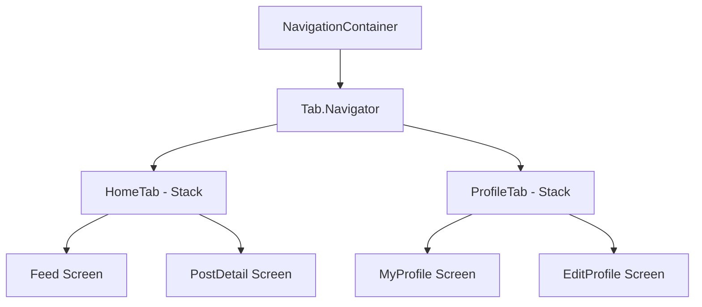
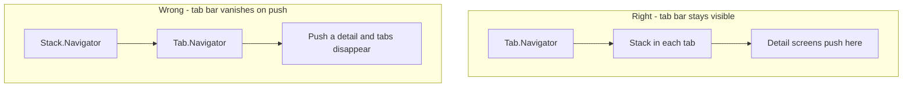
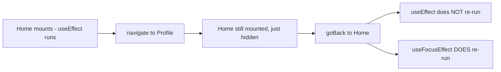
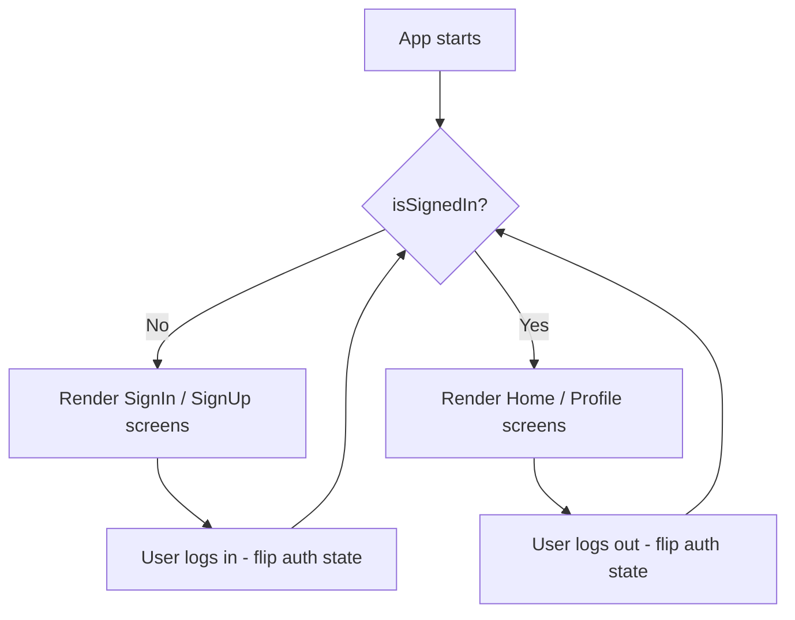
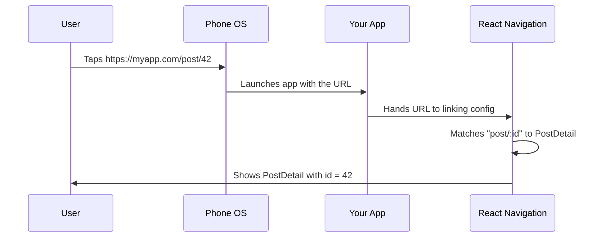
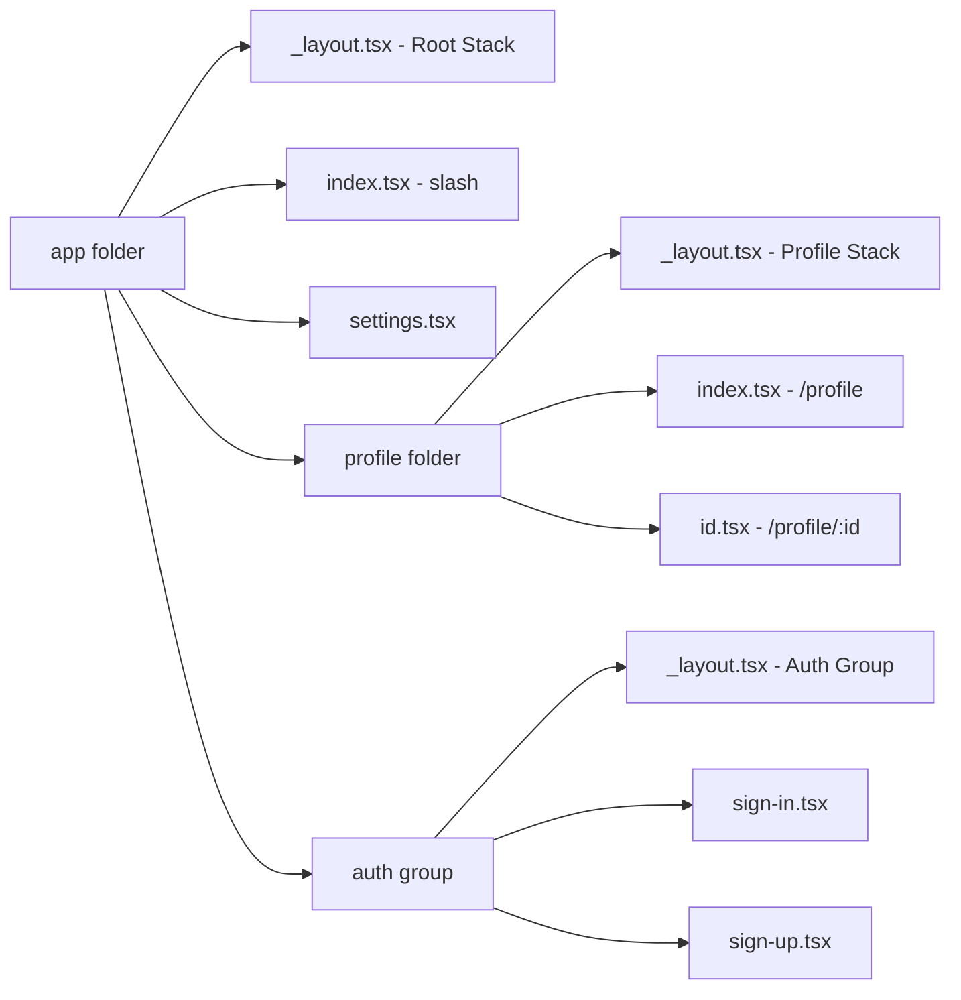
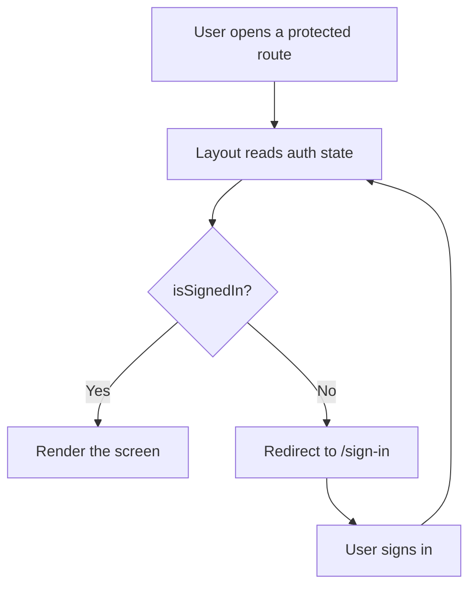
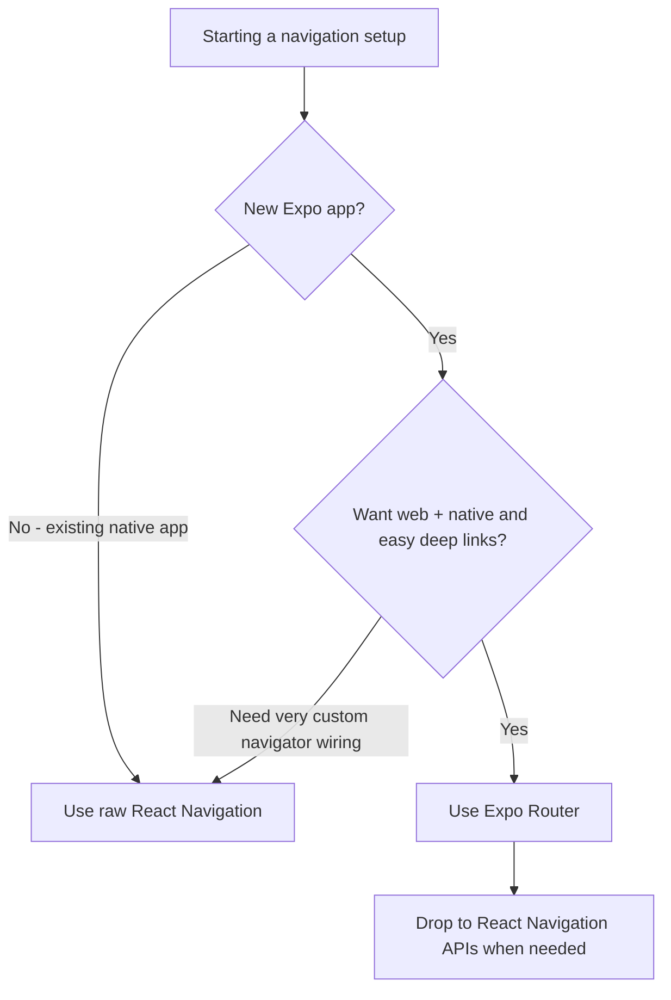

# Navigation : Stacks, Tabs et Deep Links

> Comment les écrans se connectent en mobile — React Navigation v7, Expo Router, et les patterns qui remplacent le routage basé sur les URL.

---

## Table of Contents

1. [React Navigation v7](#1-react-navigation-v7)
2. [Concepts to Master](#2-concepts-to-master)
3. [Expo Router](#3-expo-router)

---

## 1. React Navigation v7

Sur le web, la navigation est simple : le navigateur dispose d'une barre d'URL, vous changez l'URL, une nouvelle page apparaît. Il n'y a pas de barre d'URL sur un téléphone. Il n'y a pas de pile d'historique de navigation gérée à votre place. Lorsqu'un utilisateur tape une ligne dans une liste et qu'un écran de détail glisse depuis la droite, c'est *votre code* qui est responsable de cette animation, du geste de balayage pour revenir en arrière, de la mémoire de l'endroit d'où vient l'utilisateur, et de ce qui se passe lorsqu'il appuie sur le bouton retour matériel d'Android.

React Navigation est la bibliothèque qui gère tout cela. Elle est le standard de la communauté depuis 2017, et la version 7 (publiée avec React Navigation 7.x) a apporté la configuration statique, un meilleur support de TypeScript et une intégration plus étroite avec Expo. Si vous construisez une application React Native en 2025 et au-delà, c'est ce que vous utilisez.

### Le modèle mental : une pile de cartes

Le mot « pile » (stack) est à prendre au sens littéral. Imaginez un jeu de cartes posé sur une table. Chaque fois que vous naviguez vers un nouvel écran, vous placez une nouvelle carte *au sommet* de la pile. L'écran que voit l'utilisateur est toujours la carte du dessus. Lorsqu'il revient en arrière (ou balaie l'écran), vous retirez la carte du sommet et celle d'en dessous réapparaît — exactement là où il l'avait laissée.

Il s'agit de la même structure de données que l'historique du navigateur. La différence réside dans ce que vous y empilez :

| Concept | Web (navigateur) | React Navigation (natif) |
| --- | --- | --- |
| L'identifiant de « page » | Une chaîne d'URL (`/profile/42`) | Un nom d'écran + un objet params (`"Profile", { id: 42 }`) |
| Qui gère l'historique | Le navigateur, gratuitement | La bibliothèque, que vous configurez |
| Revenir en arrière | Bouton retour du navigateur / `history.back()` | Geste de balayage, flèche du header, bouton matériel Android, ou `navigation.goBack()` |
| L'animation | Échange de page instantané | Une transition push/pop native que vous obtenez gratuitement |

> **Analogie :** un `Stack.Navigator` est comme une pile de feuilles sur un bureau. `navigate`/`push` dépose une nouvelle feuille au sommet ; `goBack`/`pop` retire la feuille du dessus. L'utilisateur ne lit jamais que la feuille du dessus, mais toute la pile est toujours là en dessous, conservant sa position de défilement et la saisie des formulaires.

### Installation

```bash
# Core + native stack (the one you almost always want)
npx expo install @react-navigation/native @react-navigation/native-stack

# Required peer dependencies in Expo
npx expo install react-native-screens react-native-safe-area-context
```

Si vous avez aussi besoin d'onglets ou d'un drawer :

```bash
npx expo install @react-navigation/bottom-tabs
npx expo install @react-navigation/drawer react-native-gesture-handler react-native-reanimated
npx expo install @react-navigation/material-top-tabs react-native-tab-view react-native-pager-view
```

> **Pourquoi `npx expo install` et non `npm install` ?** `expo install` choisit la version exacte de dépendance qui correspond à votre Expo SDK. Les bibliothèques de navigation s'appuient sur des modules natifs (`react-native-screens`, `reanimated`) dont les versions doivent s'aligner avec le SDK, sinon l'application plante au lancement. Un simple `npm install` récupère la version la plus récente, qui peut être incompatible.

> **Pourquoi `native-stack` plutôt que `stack` ?** Le navigateur `@react-navigation/native-stack` utilise les primitives de navigation natives de la plateforme (`UINavigationController` sur iOS, `Fragment` sur Android). Cela vous donne gratuitement des transitions push/pop à 60 fps. L'ancien `@react-navigation/stack`, basé sur du JS, rend tout dans React — utile si vous avez besoin d'une personnalisation poussée, mais plus lent. Par défaut, utilisez le native stack.

| Navigateur | Rendu par | Vitesse | À utiliser quand |
| --- | --- | --- | --- |
| `native-stack` | Primitives natives de l'OS | Le plus rapide (60 fps gratuits) | Presque toujours — le choix par défaut |
| `stack` (JS) | React + Reanimated | Plus lent | Vous avez besoin de transitions/gestes entièrement personnalisés que le natif ne peut pas faire |
| `bottom-tabs` | Barre d'onglets native | Rapide | Une barre persistante en bas (Accueil / Recherche / Profil) |
| `drawer` | JS + gesture handler | Moyen | Un menu latéral coulissant (menu hamburger) |
| `material-top-tabs` | Pager view | Rapide | Des onglets balayables en haut (comme Following/For You de Twitter) |

### Votre premier navigateur

```tsx
import { NavigationContainer } from "@react-navigation/native";
import { createNativeStackNavigator } from "@react-navigation/native-stack";

// 1. Define param types for every screen
type RootStackParamList = {
  Home: undefined;
  Profile: { userId: string };
  Settings: undefined;
};

const Stack = createNativeStackNavigator<RootStackParamList>();

export default function App() {
  return (
    <NavigationContainer>
      <Stack.Navigator initialRouteName="Home">
        <Stack.Screen name="Home" component={HomeScreen} />
        <Stack.Screen name="Profile" component={ProfileScreen} />
        <Stack.Screen name="Settings" component={SettingsScreen} />
      </Stack.Navigator>
    </NavigationContainer>
  );
}
```

Le `NavigationContainer` est la racine — il gère l'arbre d'état de navigation. Vous n'en rendez jamais qu'un seul, au sommet de votre application. Chaque navigateur (`Stack.Navigator`, `Tab.Navigator`, etc.) vit à l'intérieur.

> **Considérez `<Stack.Screen>` comme un *enregistrement*, pas un rendu.** Lister un écran ne le monte pas. Cela indique au navigateur « ce nom est autorisé, et voici le composant à monter *lorsque quelqu'un y navigue* ». Seul l'écran actif (et ceux récemment visités) sont réellement montés. C'est pourquoi déclarer 30 écrans a un coût de démarrage quasi nul.

### Se déplacer entre les écrans

À l'intérieur de tout composant d'écran, vous obtenez un objet `navigation` (via les props ou le hook `useNavigation`). Voici les verbes que vous utiliserez constamment :

```tsx
import { useNavigation } from "@react-navigation/native";

function HomeScreen() {
  const navigation = useNavigation();

  return (
    <>
      {/* Go to Profile, passing data via params */}
      <Button title="Open profile" onPress={() => navigation.navigate("Profile", { userId: "42" })} />

      {/* Always push a NEW card, even if Profile is already showing */}
      <Button title="Push profile" onPress={() => navigation.push("Profile", { userId: "43" })} />

      {/* Remove the top card */}
      <Button title="Back" onPress={() => navigation.goBack()} />

      {/* Jump all the way back to the first screen in this stack */}
      <Button title="Home" onPress={() => navigation.popToTop()} />
    </>
  );
}
```

> **`navigate` vs `push` — un piège classique.** `navigate("Profile")` est intelligent : si un écran Profile est déjà dans la pile, il y revient au lieu d'empiler un doublon. `push("Profile")` ajoute toujours une nouvelle copie au sommet. Pour un flux du type « chapitre suivant » ou « répondre à une réponse » où le même type d'écran s'empile sur lui-même, vous voulez `push`. Pour une navigation normale, préférez `navigate`.

### Onglets en bas (Bottom Tabs)

La plupart des applications combinent une barre d'onglets avec des stacks à l'intérieur de chaque onglet. Voici le pattern :

```tsx
import { createBottomTabNavigator } from "@react-navigation/bottom-tabs";
import { createNativeStackNavigator } from "@react-navigation/native-stack";

const Tab = createBottomTabNavigator();
const HomeStack = createNativeStackNavigator();
const ProfileStack = createNativeStackNavigator();

function HomeStackScreen() {
  return (
    <HomeStack.Navigator>
      <HomeStack.Screen name="Feed" component={FeedScreen} />
      <HomeStack.Screen name="PostDetail" component={PostDetailScreen} />
    </HomeStack.Navigator>
  );
}

function ProfileStackScreen() {
  return (
    <ProfileStack.Navigator>
      <ProfileStack.Screen name="MyProfile" component={MyProfileScreen} />
      <ProfileStack.Screen name="EditProfile" component={EditProfileScreen} />
    </ProfileStack.Navigator>
  );
}

export default function App() {
  return (
    <NavigationContainer>
      <Tab.Navigator>
        <Tab.Screen
          name="HomeTab"
          component={HomeStackScreen}
          options={{ headerShown: false }}
        />
        <Tab.Screen
          name="ProfileTab"
          component={ProfileStackScreen}
          options={{ headerShown: false }}
        />
      </Tab.Navigator>
    </NavigationContainer>
  );
}
```

> Définissez `headerShown: false` sur les écrans d'onglet lorsque chaque onglet contient son propre stack navigator — sinon vous obtenez un double header. Le navigateur d'onglets externe veut dessiner un header, et le stack interne aussi, ce qui vous donne deux barres de titre superposées.



Ce diagramme représente le modèle mental dont vous avez besoin : **NavigationContainer enveloppe un Tab Navigator, et chaque onglet enveloppe un Stack Navigator.** Les navigateurs s'imbriquent. Les stacks vont à l'intérieur des onglets. Les onglets vont à l'intérieur des drawers. Les drawers vont à l'intérieur du container. C'est cette composition qui donne aux applications mobiles leur sensation de navigation multi-couches.

Voici ce que l'imbrication vous apporte réellement : chaque onglet conserve son *propre historique indépendant*. Si vous plongez de Feed dans un PostDetail dans l'onglet Home, passez à l'onglet Profile, puis revenez — l'onglet Home affiche toujours PostDetail, exactement là où vous l'aviez laissé. Chaque onglet est une pile de cartes distincte.

### Piège fréquent : l'ordre d'imbrication des navigateurs

Une erreur fréquente consiste à placer les Tabs à l'intérieur d'un Stack. Cela fonctionne techniquement, mais cela signifie que la barre d'onglets disparaît lorsque vous poussez un nouvel écran sur la pile. Généralement, vous voulez des Stacks *à l'intérieur* des Tabs afin que la barre d'onglets reste visible pendant que les utilisateurs s'enfoncent dans des sous-écrans. La règle : **le navigateur dont vous voulez que l'UI reste visible en permanence doit être celui de l'extérieur.**



> **Règle de décision empirique :** demandez-vous « cet habillage d'UI doit-il rester à l'écran pendant que l'utilisateur s'enfonce plus profondément ? » Si oui (barre d'onglets, poignée de drawer), il va *à l'extérieur*. S'il doit s'effacer pour donner à l'écran de détail tout l'affichage (un article en plein écran, un flux de paiement), placez le stack à l'extérieur et l'UI persistante à l'intérieur.

---

## 2. Concepts to Master

### Route params et navigation typée

Le passage de données entre les écrans se fait via les route params, et non via les props. C'est le plus grand changement de mentalité par rapport au React web où vous pourriez passer du state via le context ou des chaînes de requête d'URL.

```tsx
// Navigating with params
navigation.navigate("Profile", { userId: "abc-123" });

// Reading params in the target screen
import { NativeStackScreenProps } from "@react-navigation/native-stack";

type Props = NativeStackScreenProps<RootStackParamList, "Profile">;

function ProfileScreen({ route }: Props) {
  const { userId } = route.params;
  // ...
}
```

Pourquoi des params et non des props ? Vous ne rendez jamais vous-même `<ProfileScreen userId="..." />` — c'est le navigateur qui le fait, quelque part au plus profond de son propre arbre, possiblement bien après que vous ayez appelé `navigate`. Les params sont le canal que la bibliothèque vous donne pour transmettre des données à travers ce fossé. Sur le web, vous encoderiez cela dans l'URL (`/profile?userId=abc-123`) ; en RN, les params sont cette charge utile, mais ils peuvent être n'importe quel objet sérialisable, pas seulement des chaînes.

> **Gardez les params petits — passez des IDs, pas des objets entiers.** Les params peuvent finir sérialisés dans des URLs de deep link et sauvegardés dans le state. Passer un objet géant (ou pire, une fonction ou une instance de classe) alourdit le state de navigation et casse le deep linking. Pattern : passez `{ userId }`, puis récupérez l'utilisateur complet sur l'écran cible (souvent depuis un cache, donc c'est instantané).

**Définissez toujours les types de votre param list.** Sans eux, vous passerez les mauvais params, écrirez mal un nom d'écran ou oublierez un champ requis — et rien ne vous avertira avant l'exécution. Le type `RootStackParamList` montré plus tôt n'est pas un surcoût optionnel ; c'est ainsi que vous rendez la navigation sûre.

```tsx
// Make useNavigation typed everywhere by declaring a global type once:
declare global {
  namespace ReactNavigation {
    interface RootParamList extends RootStackParamList {}
  }
}

// Now this is fully type-checked with no extra annotations:
const navigation = useNavigation();
navigation.navigate("Profile", { userId: "abc-123" }); // ✅ typed
navigation.navigate("Profile", { userld: "abc-123" }); // ❌ TS error: typo + wrong key
```

### useFocusEffect vs useEffect

Cela fait trébucher tous les développeurs React web. Sur le web, naviguer vers une nouvelle page démonte l'ancienne. Dans React Navigation, **les écrans restent montés lorsque vous naviguez à l'écart d'eux.** Lorsque vous allez de Home à Profile puis revenez à Home, le composant Home n'a jamais été démonté — un `useEffect` avec des dépendances `[]` ne se réexécutera pas.

C'est une *fonctionnalité* : c'est pourquoi l'écran précédent se souvient de sa position de défilement et de l'état de ses formulaires. Mais cela signifie que « exécuter ceci lorsque l'utilisateur regarde cet écran » n'est plus la même chose que « exécuter ceci au montage ».



```tsx
import { useFocusEffect } from "@react-navigation/native";
import { useCallback } from "react";

function HomeScreen() {
  useFocusEffect(
    useCallback(() => {
      // Runs every time this screen comes into focus
      fetchLatestData();

      return () => {
        // Cleanup when screen loses focus (user navigates away)
      };
    }, [])
  );
}
```

> **Enveloppez toujours le callback dans `useCallback`.** `useFocusEffect` se réabonne chaque fois que l'identité du callback change. Passez une fonction inline et il se réexécutera à *chaque render*, provoquant souvent des boucles infinies. Le `useCallback` avec un tableau de dépendances stable est obligatoire, pas stylistique.

| Hook | Se déclenche quand | À utiliser pour |
| --- | --- | --- |
| `useEffect(fn, [])` | Une fois, au montage | Configuration ponctuelle : abonnements, analytics « écran créé » |
| `useFocusEffect` | Chaque fois que l'écran prend le focus | Rafraîchir des données, démarrer/arrêter un timer ou une vidéo |
| `useIsFocused()` | Renvoie un booléen lisible dans le render | Mettre en pause conditionnellement les animations/renders quand hors écran |

### Pattern de flux d'authentification

Le pattern standard pour l'authentification dans React Navigation est le **rendu conditionnel du navigateur** — vous échangez tout l'arbre de navigateur en fonction de l'état d'authentification :

```tsx
function RootNavigator() {
  const { isSignedIn } = useAuth();

  return (
    <Stack.Navigator>
      {isSignedIn ? (
        <>
          <Stack.Screen name="Home" component={HomeScreen} />
          <Stack.Screen name="Profile" component={ProfileScreen} />
        </>
      ) : (
        <>
          <Stack.Screen name="SignIn" component={SignInScreen} />
          <Stack.Screen name="SignUp" component={SignUpScreen} />
        </>
      )}
    </Stack.Navigator>
  );
}
```

React Navigation détecte que la liste des écrans a changé et joue automatiquement une transition appropriée. N'essayez pas de faire `navigate("Home")` après la connexion — basculez simplement l'état d'authentification et la bibliothèque gère le reste. C'est plus propre et cela empêche l'utilisateur d'appuyer sur retour pour atteindre l'écran de connexion après s'être connecté.



> **Pourquoi cela vaut mieux que `navigate('Home')`.** Si vous naviguez de façon impérative après la connexion, l'écran SignIn reste dans la pile arrière — appuyez sur retour et vous voilà de nouveau sur le formulaire de connexion, ce qui prête à confusion. En échangeant la *liste d'écrans*, les anciens écrans cessent complètement d'exister. Il n'y a plus rien vers quoi « revenir ». L'état pilote l'UI ; vous ne pilotez pas la navigation à la main.

### Présentation Modal vs Card

Le native stack prend en charge deux modes de présentation. Le mode par défaut (`card`) est un push horizontal sur iOS, un glissement de bas en haut sur Android. Définir `presentation: "modal"` vous donne un glissement vertical vers le haut avec une apparence de type carte sur iOS (l'écran précédent rétrécit légèrement derrière).

```tsx
<Stack.Screen
  name="CreatePost"
  component={CreatePostScreen}
  options={{ presentation: "modal" }}
/>
```

Utilisez des modals pour des flux autonomes : créer un nouvel élément, sélectionner une photo, confirmer une action destructive. Utilisez card pour s'enfoncer plus profondément dans le contenu.

| Présentation | Animation | Modèle mental | À utiliser pour |
| --- | --- | --- | --- |
| `card` (par défaut) | Glissement depuis le côté | « S'enfoncer » dans le contenu | Liste → détail → sous-détail |
| `modal` | Glissement depuis le bas | « S'écarter » pour faire une tâche | Composer, créer, choisir, confirmer |
| `transparentModal` | Apparition en fondu par-dessus l'écran | Une surcouche flottante | Dialogues personnalisés, infobulles, sheets |
| `containedModal` / `fullScreenModal` | Variantes de modal de la plateforme | Affiner la sensation native | Forcer le style modal sur Android |

> **Heuristique UX :** si l'utilisateur est *en train de créer quelque chose ou de faire un choix* et qu'il pourrait annuler, c'est un modal (il a une affordance « Annuler »/« X » et glisse vers le haut). S'il *explore plus profondément du contenu existant*, c'est une card (elle a une flèche retour et glisse latéralement). Respecter cette convention rend votre application native sans que l'utilisateur y pense.

### Deep Linking

Le deep linking permet à des URLs externes (comme `myapp://profile/123` ou `https://myapp.com/profile/123`) d'ouvrir des écrans spécifiques dans votre application. La configuration associe des motifs d'URL à des noms d'écran :

```tsx
const linking = {
  prefixes: ["myapp://", "https://myapp.com"],
  config: {
    screens: {
      HomeTab: {
        screens: {
          Feed: "feed",
          PostDetail: "post/:id",
        },
      },
      ProfileTab: {
        screens: {
          MyProfile: "profile",
        },
      },
    },
  },
};

<NavigationContainer linking={linking}>
  {/* ... */}
</NavigationContainer>
```

L'objet `config.screens` *reflète l'imbrication de votre navigateur*. Parce que `PostDetail` vit à l'intérieur du stack de `HomeTab`, la config de lien l'imbrique de la même manière. Lorsque l'OS transmet à votre application l'URL `myapp://post/42`, React Navigation parcourt cette carte, sélectionne l'onglet Home, pousse PostDetail, et parse `42` dans `route.params.id` — reconstruisant toute la pile pour que le bouton retour fonctionne correctement.



Il existe deux variantes de deep link, et la différence est importante :

| Type | Exemple | Fonctionne sans configuration ? | Notes |
| --- | --- | --- | --- |
| Schéma personnalisé | `myapp://post/42` | Oui (il suffit de déclarer le schéma) | Ne fonctionne que si l'application est installée ; URLs peu esthétiques |
| Universal / App Links | `https://myapp.com/post/42` | Non — nécessite des fichiers serveur | Vraies URLs https ; se rabattent sur le site web si l'application n'est pas installée |

> **Les Universal Links (iOS) et App Links (Android)** nécessitent une configuration côté serveur (un fichier `apple-app-site-association` ou `assetlinks.json`). La config de React Navigation seule ne suffit pas — elle indique seulement à la bibliothèque comment parser l'URL une fois que l'OS la transmet à votre application. La mise en place des fichiers côté serveur est ce qui fait que `https://myapp.com/post/42` ouvre votre application au lieu du navigateur. Le fichier hébergé prouve à l'OS que vous possédez le domaine, ce qui l'autorise à router le lien vers votre application.

### Personnalisation du header et de la barre d'onglets

La personnalisation des headers se fait via `options` (par écran) ou `screenOptions` (pour tout le navigateur). `options` remplace `screenOptions`, de la même manière qu'un style inline remplace un style partagé.

```tsx
<Stack.Navigator
  screenOptions={{
    headerStyle: { backgroundColor: "#0f3460" },
    headerTintColor: "#fff",
    headerTitleStyle: { fontWeight: "bold" },
  }}
>
  <Stack.Screen
    name="Home"
    component={HomeScreen}
    options={{
      headerRight: () => (
        <Pressable onPress={openSettings}>
          <Ionicons name="settings-outline" size={24} color="#fff" />
        </Pressable>
      ),
    }}
  />
</Stack.Navigator>
```

Souvent, vous avez besoin d'options de header qui dépendent de l'état propre de l'écran (un bouton enregistrer désactivé tant qu'un formulaire n'est pas valide). Définissez-les de façon impérative depuis l'intérieur de l'écran :

```tsx
function EditProfileScreen({ navigation }: Props) {
  const [name, setName] = useState("");

  // Re-runs whenever `name` changes, updating the header button live
  useLayoutEffect(() => {
    navigation.setOptions({
      headerRight: () => (
        <Button title="Save" disabled={name.length === 0} onPress={save} />
      ),
    });
  }, [navigation, name]);
}
```

Pour des barres d'onglets personnalisées, utilisez la prop `tabBar` sur le Tab Navigator :

```tsx
<Tab.Navigator
  tabBar={(props) => <MyCustomTabBar {...props} />}
>
  {/* ... */}
</Tab.Navigator>
```

Cela vous donne un contrôle total sur l'UI de la barre d'onglets tandis que React Navigation continue de gérer le state et le changement d'écran. L'objet `props` transporte tout ce dont vous avez besoin : la liste des routes, laquelle a le focus (`props.state.index`), et un objet `navigation` pour changer d'onglet au clic. Vous dessinez les pixels ; React Navigation conserve le state.

> **Astuce de pro — respectez la safe area.** Les headers et barres d'onglets personnalisés peuvent s'afficher sous l'encoche, la barre d'état ou l'indicateur d'accueil. Enveloppez-les avec `useSafeAreaInsets()` de `react-native-safe-area-context` et appliquez un padding de `insets.top` / `insets.bottom`, sinon le contenu sera coupé sur les appareils à coins arrondis et à encoche. Les headers par défaut gèrent cela pour vous ; les personnalisés non.

---

## 3. Expo Router

Expo Router reprend tout ce que fait React Navigation et l'enveloppe dans une convention de routage basée sur le système de fichiers, inspirée de Next.js. Au lieu de définir des navigateurs en code, vous créez des fichiers dans un répertoire `app/` et le router génère automatiquement l'arbre de navigation.

**Si vous démarrez un nouveau projet Expo, utilisez Expo Router.** C'est le choix par défaut dans `create-expo-app`, il fonctionne avec React Navigation en interne, et il vous offre le deep linking, les routes typées et le support universel (web + natif) prêts à l'emploi.

L'idée clé : **votre structure de dossiers *est* votre config de navigation.** Là où React Navigation vous fait écrire à la main l'arbre imbriqué de `<Stack.Screen>`, Expo Router l'infère à partir des fichiers sur le disque. Si vous avez utilisé Next.js ou Remix, cela vous semblera immédiatement familier — c'est la même convention appliquée aux applications natives.

| | React Navigation brut | Expo Router |
| --- | --- | --- |
| Définir les routes par | Écrire `<Stack.Screen>` en code | Créer des fichiers dans `app/` |
| Naviguer avec | Noms d'écran + objets params | Chaînes d'URL (`/profile/42`) |
| Deep linking | Config `linking` manuelle | Automatique, à partir des chemins de fichiers |
| Support web | Configuration supplémentaire | Intégré |
| Idéal pour | Brownfield, contrôle manuel complet | Nouvelles applications, web+natif, moins de boilerplate |

### Structure de fichiers = structure de routes

```
app/
  _layout.tsx          → Root layout (wraps everything)
  index.tsx            → "/" (Home screen)
  settings.tsx         → "/settings"
  profile/
    _layout.tsx        → Layout for profile section
    index.tsx          → "/profile"
    [id].tsx           → "/profile/123" (dynamic route)
  (auth)/
    _layout.tsx        → Auth group layout
    sign-in.tsx        → "/sign-in"
    sign-up.tsx        → "/sign-up"
```

Les règles de nommage valent la peine d'être mémorisées, car le nom de fichier *est* l'API :

| Nom de fichier / dossier | Signification |
| --- | --- |
| `index.tsx` | La route pour le dossier lui-même (`/` ou `/profile`) |
| `settings.tsx` | Une route nommée (`/settings`) |
| `[id].tsx` | Un segment dynamique — correspond à n'importe quelle valeur, exposée comme un param |
| `[...rest].tsx` | Catch-all — fait correspondre `/a/b/c` dans un tableau |
| `_layout.tsx` | Le navigateur/wrapper pour tout ce qui se trouve dans ce dossier |
| `(group)/` | Un groupe — organise les fichiers sans ajouter à l'URL |
| `+not-found.tsx` | L'écran 404 pour les routes non correspondantes |



### Layout Routes

Le fichier `_layout.tsx` dans n'importe quel répertoire définit le navigateur pour ce niveau. C'est l'équivalent Expo Router d'un `Stack.Navigator` ou d'un `Tab.Navigator` — mais au lieu de lister les écrans comme enfants, il déclare simplement le navigateur et le router remplit les écrans à partir des fichiers voisins. Le layout racine met généralement en place votre navigation principale :

```tsx
// app/_layout.tsx
import { Stack } from "expo-router";

export default function RootLayout() {
  return (
    <Stack>
      <Stack.Screen name="index" options={{ title: "Home" }} />
      <Stack.Screen name="settings" options={{ title: "Settings" }} />
      <Stack.Screen name="profile" options={{ headerShown: false }} />
      <Stack.Screen name="(auth)" options={{ headerShown: false }} />
    </Stack>
  );
}
```

Les layouts persistent aussi à travers la navigation, exactement comme un composant de layout dans Next.js. Un `_layout.tsx` qui rend un header, un provider de context ou un garde d'authentification enveloppe *chaque* écran de son dossier et en dessous — et il ne se remonte pas lorsque vous vous déplacez entre ces écrans. C'est le foyer naturel pour les choses qui doivent survivre aux écrans individuels (un provider de panier, une connexion websocket, un thème).

Pour un layout basé sur les onglets :

```tsx
// app/(tabs)/_layout.tsx
import { Tabs } from "expo-router";

export default function TabLayout() {
  return (
    <Tabs>
      <Tabs.Screen
        name="index"
        options={{ title: "Home", tabBarIcon: ({ color }) => (
          <Ionicons name="home" size={24} color={color} />
        )}}
      />
      <Tabs.Screen
        name="search"
        options={{ title: "Search", tabBarIcon: ({ color }) => (
          <Ionicons name="search" size={24} color={color} />
        )}}
      />
    </Tabs>
  );
}
```

### Routes dynamiques

Les crochets dans le nom de fichier créent des segments dynamiques — exactement comme dans Next.js :

```tsx
// app/profile/[id].tsx
import { useLocalSearchParams } from "expo-router";

export default function ProfileScreen() {
  const { id } = useLocalSearchParams<{ id: string }>();

  return <Text>Profile for user {id}</Text>;
}
```

Naviguer vers cet écran :

```tsx
import { Link } from "expo-router";

// Declarative
<Link href="/profile/abc-123">View Profile</Link>

// Imperative
import { router } from "expo-router";
router.push("/profile/abc-123");
```

Notez la différence avec React Navigation : vous naviguez avec des **chaînes d'URL**, et non des noms d'écran et des objets params. C'est l'idée clé — Expo Router apporte au natif le modèle de navigation basé sur les URL du web.

> **`useLocalSearchParams` vs `useGlobalSearchParams`.** `useLocalSearchParams` renvoie les params de *cet* écran et ne se re-render que lorsque cet écran a le focus — c'est presque toujours ce que vous voulez. `useGlobalSearchParams` lit les params de la route active actuelle depuis n'importe où et se re-render à chaque changement de navigation, ce qui peut provoquer des re-renders surprenants. Privilégiez `useLocalSearchParams` par défaut.

> **Passer des données supplémentaires aux côtés d'un chemin.** Vous pouvez attacher des query params exactement comme sur le web : `router.push({ pathname: "/profile/[id]", params: { id: "42", from: "feed" } })`. À la fois `id` et `from` arrivent dans `useLocalSearchParams`. Gardez-les petits et sérialisables — la même règle que pour les params de React Navigation, puisqu'ils deviennent littéralement une partie d'une URL.

### Groupes

Les noms de dossiers entre parenthèses comme `(auth)` ou `(tabs)` créent des **groupes de routes**. Ils affectent l'organisation du layout mais n'apparaissent pas dans l'URL. C'est ainsi que vous divisez votre application en sections logiques avec différents navigateurs sans polluer la structure de l'URL.

Par exemple, `app/(tabs)/index.tsx` est toujours simplement `/`, et non `/tabs` — le dossier `(tabs)` existe uniquement pour que vous puissiez donner à ces écrans un layout de barre d'onglets partagé. Les groupes sont purement un outil d'organisation pour *vous* ; l'utilisateur ne les voit jamais dans une URL.

Le pattern d'authentification dans Expo Router utilise des groupes et des redirections conditionnelles :

```tsx
// app/(auth)/_layout.tsx
import { Redirect, Stack } from "expo-router";
import { useAuth } from "../hooks/useAuth";

export default function AuthLayout() {
  const { isSignedIn } = useAuth();

  if (isSignedIn) {
    return <Redirect href="/" />;
  }

  return <Stack />;
}
```



> **`<Redirect>` vs `router.replace()` impératif.** Renvoyer `<Redirect href="/" />` depuis un layout est déclaratif — la redirection fait partie du render, donc il n'y a pas de flash de l'écran erroné ni de race condition. Appeler `router.replace()` à l'intérieur d'un `useEffect` s'exécute *après* que l'écran erroné a déjà été peint. Pour les gardes d'authentification, préférez le `<Redirect>` déclaratif.

### Routes typées

Expo Router peut générer automatiquement les types de routes. Activez-le dans votre config :

```json
// tsconfig.json (or app.json)
{
  "compilerOptions": {
    "strict": true
  }
}
```

Puis dans `app.json` :

```json
{
  "expo": {
    "experiments": {
      "typedRoutes": true
    }
  }
}
```

Une fois activé, `router.push("/profle/123")` (notez la faute de frappe) devient une erreur TypeScript. Cela attrape les liens de navigation cassés au moment du build plutôt que lorsqu'un utilisateur tape un bouton et que rien ne se passe.

> **Comment cela fonctionne :** Expo Router scanne votre dossier `app/` et génère un type listant chaque chemin valide (y compris les chemins dynamiques comme `/profile/[id]`). `Link href` et `router.push` sont typés par rapport à cette union, donc un chemin qui ne correspond pas à un vrai fichier ne compilera tout simplement pas. C'est l'équivalent basé sur les fichiers du `RootStackParamList` que vous écririez à la main dans React Navigation — sauf que vous l'obtenez gratuitement, et qu'il ne peut jamais se désynchroniser de vos écrans réels.

### Quand utiliser Expo Router vs React Navigation brut

Utilisez **Expo Router** quand : vous construisez une nouvelle application Expo, vous voulez du deep linking sans aucune configuration, vous appréciez les conventions de routage basées sur les fichiers, ou vous ciblez le web et le natif depuis la même base de code.

Utilisez **React Navigation brut** quand : vous avez une application brownfield (React Native ajouté à une application native existante), vous avez besoin de patterns de navigation qu'Expo Router ne prend pas encore en charge, ou vous avez besoin d'un contrôle fin sur l'instanciation des navigateurs.



En pratique, la plupart des nouveaux projets devraient démarrer avec Expo Router. C'est moins de boilerplate, les deep links fonctionnent simplement, et vous pouvez toujours redescendre vers les APIs de React Navigation au besoin, car Expo Router *est* React Navigation en dessous. Ce dernier point est le plus rassurant : choisir Expo Router ne vous prive de rien — `useNavigation`, `useFocusEffect` et le reste fonctionnent toujours, parce que vous utilisez le même moteur avec une porte d'entrée plus conviviale.

> **Erreur fréquente avec Expo Router :** Oublier d'ajouter les écrans au `_layout.tsx`. Si vous créez `app/notifications.tsx` mais ne le listez pas dans le `_layout.tsx` le plus proche, la route peut ne pas fonctionner comme prévu. Chaque fichier de route a besoin d'une entrée correspondante dans son layout parent — ou utilisez le composant `<Stack>` sans enfants explicites pour les découvrir automatiquement.

---