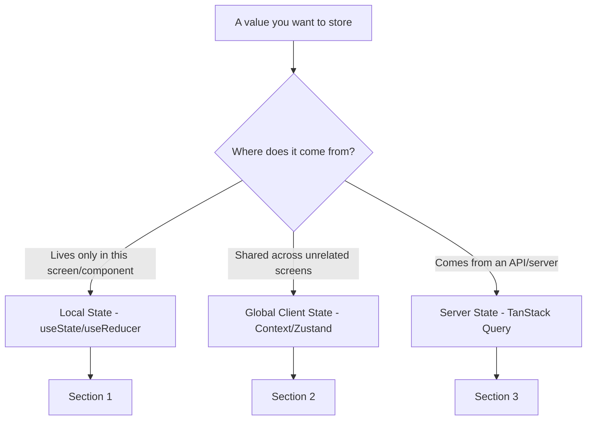
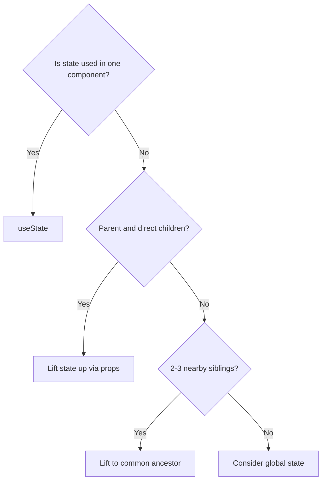
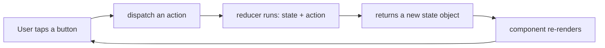
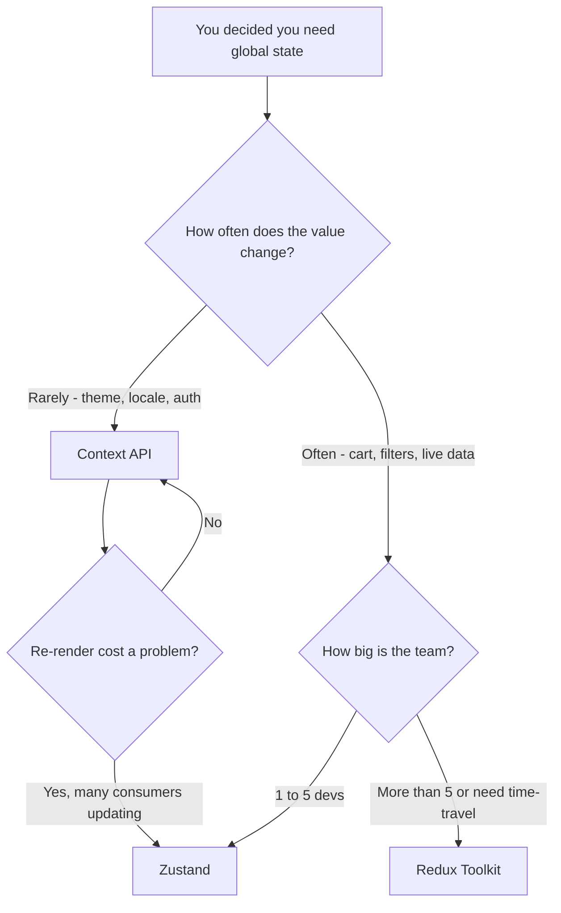
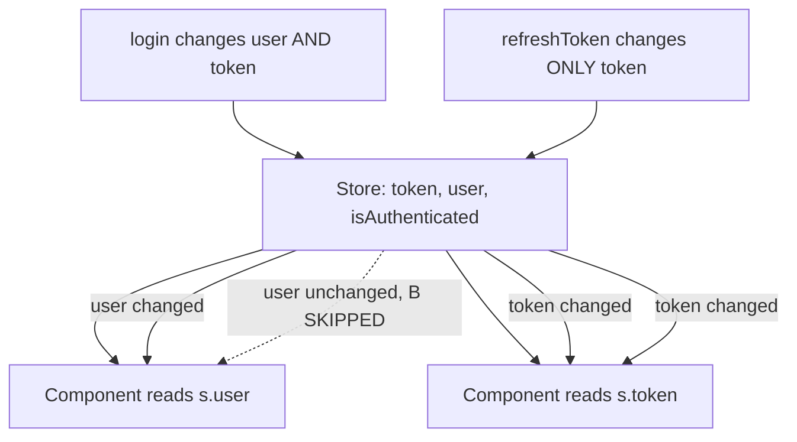
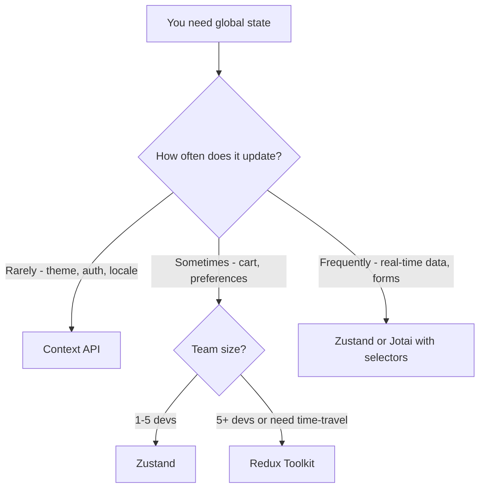
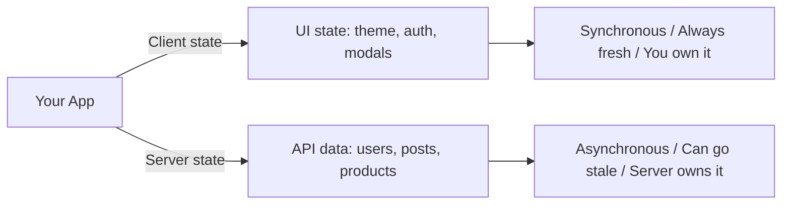
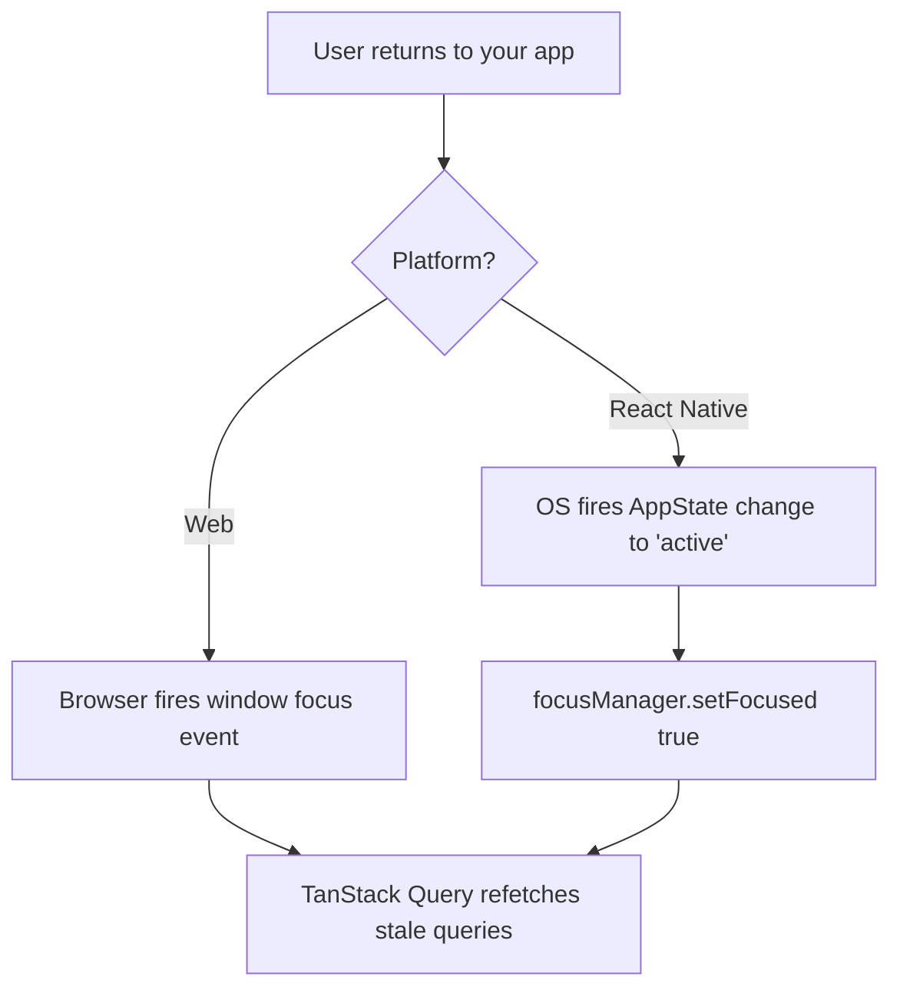
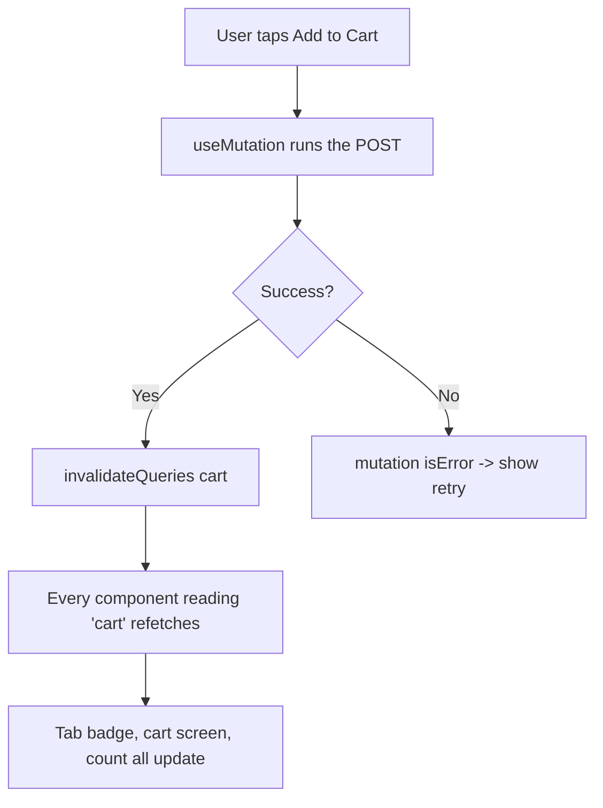
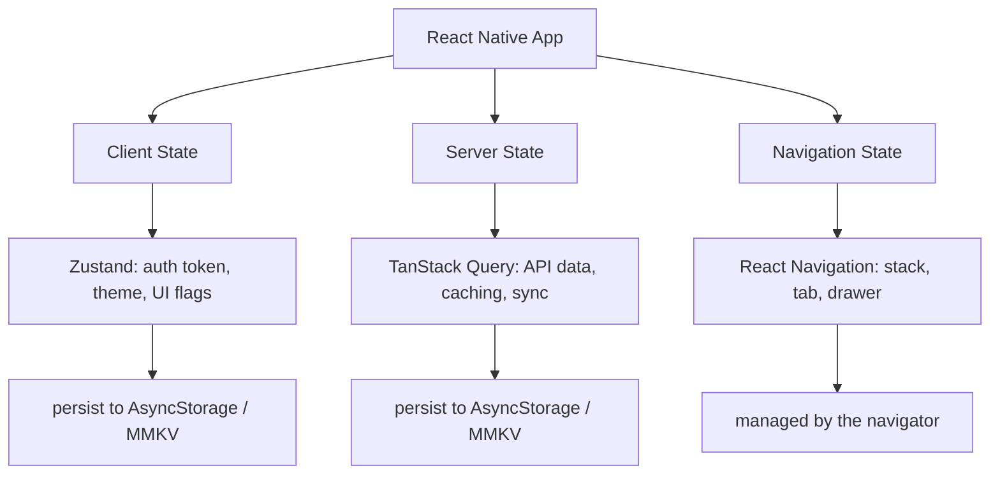

# Gestion de l'état : Le même React, une plateforme différente

> État local, état global et état serveur dans React Native — ce qui se transfère depuis le web et ce qui change.

---

## Table of Contents

1. [Local State](#1-local-state)
2. [Global State](#2-global-state)
3. [Server State](#3-server-state)

---

## 1. État local

### Tout ce que vous savez fonctionne encore

Voici la phrase la plus importante de ce chapitre : `useState` et `useReducer` fonctionnent de manière identique dans React Native. Aucune réserve, aucun astérisque. Le modèle de composants est le même, les hooks sont les mêmes, les règles des hooks sont les mêmes. Si vous gérez déjà bien l'état local sur le web, vous le gérerez bien sur mobile.

Pourquoi est-ce vrai ? React Native et React-DOM partagent le **même cœur React** (le reconciler, le dispatcher des hooks, l'arbre fiber). Ce qui diffère, c'est uniquement le *renderer* — la couche qui transforme votre arbre de composants en pixels réels. Sur le web, ce renderer dialogue avec le DOM ; sur mobile, il dialogue avec les vues natives iOS/Android. La gestion de l'état vit entièrement dans le cœur partagé, elle est donc totalement agnostique vis-à-vis du renderer. Imaginez un moteur de voiture : `useState` est le moteur, et le renderer détermine seulement si les roues roulent sur l'asphalte ou sur un chemin de terre. Le moteur ne le sait pas et s'en moque.

Le problème, c'est que la plupart des développeurs sautent directement à un store global. Ils installent Zustand ou Redux avant d'avoir écrit le moindre écran. Sur mobile, cela fait plus mal que sur le web, car chaque re-render inutile consomme de la batterie et fait sauter des frames dans une boucle de rendu à 60fps. Une application web qui re-render maladroitement semble simplement un peu lente ; une application mobile qui fait de même vide la batterie, chauffe l'appareil et présente des saccades visibles pendant le défilement et les animations.

> **Astuce de pro :** « 60fps » signifie que l'écran se redessine 60 fois par seconde — environ une fois toutes les **16 millisecondes**. Si un re-render et son travail de layout prennent plus de 16ms, la frame est manquée et l'utilisateur perçoit une saccade (« jank »). Garder l'état local et les re-renders petits est le moyen le moins coûteux de rester dans ce budget.

### Les trois sortes d'état

Avant de choisir un outil, nommez ce que vous détenez. Presque chaque valeur d'une application tombe dans l'une de trois catégories, et chaque catégorie a une bonne réponse différente. Le reste de ce chapitre est organisé précisément autour de ces trois catégories.



> **Erreur courante :** traiter les données serveur (une liste de produits récupérée depuis une API) comme s'il s'agissait d'état client et les fourrer dans Zustand ou Redux. Cela donne l'impression de fonctionner, mais vous venez de vous engager à gérer manuellement le cache, le refetching et l'obsolescence. Nous corrigeons cela dans la Section 3.

### La règle de colocation

L'état doit vivre aussi près que possible de l'endroit où il est consommé. Ce n'est pas un conseil nouveau, mais dans React Native il est plus important parce que :

1. Il n'y a pas de barre d'URL sur laquelle s'appuyer pour l'état de route. Sur le web, `?tab=reviews` dans l'URL est un morceau d'état gratuit, partageable et persistant. Le mobile n'a pas de barre d'adresse, donc cet état doit vivre *quelque part* dans React.
2. Les piles de navigation maintiennent les écrans démontés en vie en mémoire. Lorsque vous empilez l'écran B au-dessus de l'écran A, l'écran A **ne** se démonte **pas** — il reste monté en dessous. Son état (et ses re-renders) continuent donc de vous coûter.
3. Les re-renders invisibles sur un navigateur de bureau provoquent un jank visible sur un téléphone, car les CPU mobiles sont plus faibles et vous luttez contre le budget de 16ms par frame.

La règle mentale : **démarrez une valeur sous forme de `useState` à l'intérieur du composant qui l'utilise. Ne la déplacez vers l'extérieur (vers un parent, puis vers un store global) que lorsqu'un second consommateur en a réellement besoin.** La globalisation prématurée est l'erreur de gestion d'état la plus courante dans les vrais codebases.



### useState dans React Native

```tsx
import { useState } from 'react';
import { View, Text, Pressable, TextInput, StyleSheet } from 'react-native';

// Exactly what you would write on the web, with RN primitives
const Counter = () => {
  const [count, setCount] = useState(0);

  return (
    <View style={styles.container}>
      <Text style={styles.label}>Count: {count}</Text>
      {/* Use the updater form (c => c + 1) when the next value
          depends on the previous one — avoids stale-closure bugs */}
      <Pressable onPress={() => setCount(c => c + 1)} style={styles.button}>
        <Text>Increment</Text>
      </Pressable>
    </View>
  );
};

// Form state stays local until submission
const LoginForm = () => {
  const [email, setEmail] = useState('');
  const [password, setPassword] = useState('');

  const handleSubmit = () => {
    // Only touch global auth state after a successful login
    login({ email, password });
  };

  return (
    <View>
      <TextInput
        value={email}
        onChangeText={setEmail}
        placeholder="Email"
        keyboardType="email-address"   // shows the @-friendly keyboard
        autoCapitalize="none"          // emails are lowercase
      />
      <TextInput
        value={password}
        onChangeText={setPassword}
        placeholder="Password"
        secureTextEntry                // masks input (the RN equivalent of type="password")
      />
      <Pressable onPress={handleSubmit}>
        <Text>Log in</Text>
      </Pressable>
    </View>
  );
};
```

Remarquez le choix délibéré ci-dessus : `email` et `password` sont **locaux**. Il n'y a aucune raison pour que le reste de l'application sache ce que quelqu'un est en train de taper à mi-chemin. La valeur ne s'échappe du composant — en appelant `login()` — qu'une fois la soumission réussie. Cette discipline du « garde-le local jusqu'au dernier moment possible » est ce qui maintient les re-renders peu coûteux.

#### Web vs React Native : le gestionnaire d'input

| Concept | Web (React DOM) | React Native |
| --- | --- | --- |
| Lire la valeur actuelle | `value={text}` | `value={text}` (identique) |
| Gérer un changement | `onChange={e => setText(e.target.value)}` | `onChangeText={setText}` |
| Ce que reçoit le gestionnaire | un **event** synthétique | la **chaîne** directement |
| Masquage du mot de passe | `type="password"` | `secureTextEntry` |
| Clavier email | (aucun — clavier de bureau) | `keyboardType="email-address"` |

> **Piège :** `onChangeText` dans React Native vous donne la chaîne directement, et non un objet event. Vous écrivez `onChangeText={setText}` au lieu de `onChange={e => setText(e.target.value)}`. C'est l'un des rares gains ergonomiques du mobile par rapport au web. Il *existe* une prop `onChange` sur `TextInput`, mais elle vous transmet un objet event natif — presque toujours, vous voulez `onChangeText`.

### useReducer pour un état local complexe

Lorsqu'un seul composant possède plusieurs valeurs interdépendantes, `useReducer` rend les mises à jour prévisibles. Cela se transfère depuis React web à l'identique.

Quand devriez-vous opter pour `useReducer` plutôt que plusieurs appels `useState` ? Utilisez cette règle empirique :

| Situation | Préférer |
| --- | --- |
| Une ou deux valeurs indépendantes (`count`, `isOpen`) | `useState` |
| Plusieurs valeurs qui changent *ensemble* de manières définies | `useReducer` |
| Le prochain état dépend de l'état précédent selon une logique non triviale | `useReducer` |
| Vous voulez toute la logique de mise à jour dans une fonction pure et testable | `useReducer` |

L'avantage de `useReducer` est que le *comment* de chaque mise à jour vit dans une seule fonction pure (le reducer), séparé du *ce qui le déclenche* (les appels `dispatch` dans votre JSX). Cette séparation est exactement ce qui rend Redux familier — `useReducer` est essentiellement « Redux pour un seul composant ».

```tsx
import { useReducer } from 'react';
import { View, Text, Pressable } from 'react-native';

type State = {
  quantity: number;
  size: 'S' | 'M' | 'L';
  addOns: string[];
};

// Every possible update is enumerated as a typed action — TypeScript
// will now flag any dispatch that doesn't match one of these shapes.
type Action =
  | { type: 'SET_QUANTITY'; payload: number }
  | { type: 'SET_SIZE'; payload: 'S' | 'M' | 'L' }
  | { type: 'TOGGLE_ADD_ON'; payload: string }
  | { type: 'RESET' };

const initialState: State = { quantity: 1, size: 'M', addOns: [] };

// A reducer is a PURE function: same (state, action) in -> same state out.
// No side effects, no fetching, no setState. This is why it's easy to test.
const reducer = (state: State, action: Action): State => {
  switch (action.type) {
    case 'SET_QUANTITY':
      return { ...state, quantity: Math.max(1, action.payload) }; // never below 1
    case 'SET_SIZE':
      return { ...state, size: action.payload };
    case 'TOGGLE_ADD_ON': {
      const has = state.addOns.includes(action.payload);
      return {
        ...state,
        addOns: has
          ? state.addOns.filter(a => a !== action.payload) // remove
          : [...state.addOns, action.payload],             // add
      };
    }
    case 'RESET':
      return initialState;
    default:
      return state;
  }
};

const ProductConfigurator = () => {
  const [state, dispatch] = useReducer(reducer, initialState);

  return (
    <View>
      <Text>Qty: {state.quantity} | Size: {state.size}</Text>
      <Pressable onPress={() => dispatch({ type: 'SET_QUANTITY', payload: state.quantity + 1 })}>
        <Text>+ Qty</Text>
      </Pressable>
      <Pressable onPress={() => dispatch({ type: 'RESET' })}>
        <Text>Reset</Text>
      </Pressable>
    </View>
  );
};
```

Voici le flux de données qu'un reducer impose — une boucle stricte à sens unique, ce qui le rend prévisible :



> **Piège (partagé avec le web, mais qui mérite d'être répété) :** ne mutez jamais `state` à l'intérieur d'un reducer. `state.addOns.push(x)` suivi de `return state` ne déclenchera souvent *pas* de re-render, car React compare l'identité de l'objet et voit la même référence. Renvoyez toujours un **nouvel** objet/tableau (`{ ...state }`, `[...state.addOns]`). C'est aussi pourquoi chaque branche ci-dessus fait un spread de l'ancien state.

### La composition de composants avant l'état global

Avant de recourir à une quelconque bibliothèque, essayez de composer les composants pour que l'état circule naturellement. Sur le web, vous pourriez tolérer un léger prop drilling parce qu'un re-render est peu coûteux. Sur mobile, vous devriez être plus discipliné — mais le premier outil à employer reste la *structure*, et non un store.

```tsx
// ❌ BAD: Reaching for global state because two siblings need the same value
// (Don't install Zustand for this)

// ✅ GOOD: Lift to the parent, pass down
const ProductScreen = () => {
  const [selectedTab, setSelectedTab] = useState<'details' | 'reviews'>('details');

  return (
    <View>
      {/* Parent owns the state; children receive exactly what they need */}
      <TabBar selected={selectedTab} onSelect={setSelectedTab} />
      {selectedTab === 'details' ? <ProductDetails /> : <ReviewList />}
    </View>
  );
};
```

Deux patterns vous permettent d'éviter l'état global bien plus longtemps que vous ne le penseriez :

- **Remonter l'état (lifting state up) :** déplacez la valeur vers l'ancêtre commun le plus proche de tout ce qui en a besoin, puis transmettez-la vers le bas sous forme de props. L'exemple ci-dessus fait cela pour `selectedTab`.
- **La composition plutôt que le drilling :** si vous vous retrouvez à transmettre une prop à travers trois couches qui ne l'utilisent pas, envisagez de transmettre le *composant rendu* en tant que `children` à la place, afin que la prop ne voyage que là où elle est réellement consommée.

> **Astuce de pro :** le prop drilling n'est un vrai problème que lorsqu'il traverse *de nombreuses* couches ou *de nombreuses* branches non liées. Transmettre une prop sur un ou deux niveaux n'est pas une mauvaise pratique — c'est la manière normale, peu coûteuse et explicite de partager l'état. Employez un store lorsque le drilling devient véritablement pénible, et non dès la première prop.

### Quand l'état local ne suffit pas

Vous savez que vous avez besoin d'état global lorsque :

- La même valeur est consommée sur des écrans qui ne sont pas dans une relation parent-enfant directe (par exemple, un token d'authentification utilisé par chaque appel API)
- La valeur doit survivre aux réinitialisations de la pile de navigation
- Plusieurs fonctionnalités non liées doivent réagir au même changement (par exemple, un badge de panier sur la barre d'onglets qui se met à jour lorsque vous ajoutez un article trois écrans plus loin)

Si vous n'êtes pas dans l'une de ces situations, restez local. Un bon réflexe de vérification : *puis-je tracer une ligne droite de props depuis l'endroit où vit cette valeur jusqu'à l'endroit où elle est utilisée, sans que cela paraisse absurde ?* Si oui, restez local. Si la ligne zigzague à travers tout l'arbre, il est temps de passer à la Section 2.

---

## 2. État global

### Le paysage

Sur le web, vous avez le luxe de traiter l'état global comme un problème résolu, avec de nombreuses réponses acceptables. Dans React Native, les contraintes sont plus serrées : la taille du bundle compte davantage (surtout sur Android, où les utilisateurs équipés d'appareils moins chers et de réseaux plus lents ressentent chaque kilo-octet supplémentaire à l'installation et au démarrage), le temps de démarrage est visible par l'utilisateur, et l'architecture (l'ancien *bridge*, ou le plus récent *JSI*) fait que chaque re-render inutile coûte plus cher que dans un navigateur.

Un mot rapide sur *pourquoi* les re-renders sont plus coûteux ici. Sur le web, votre JavaScript et le renderer (le DOM) vivent au même endroit. Dans React Native, votre JavaScript s'exécute dans un moteur et les vues natives réelles vivent sur un autre thread ; communiquer entre eux a un coût. Un état global négligé qui re-render des dizaines de composants à chaque frappe transforme ce coût en jank visible bien plus vite que dans un navigateur.

Voici une comparaison tranchée des bibliothèques qui ont réellement du sens dans React Native aujourd'hui.

| Bibliothèque | Idéal pour | Taille approx. | Besoin d'un Provider ? | Persistance | Quand l'utiliser |
| --- | --- | --- | --- | --- | --- |
| **Context API** | Thème, auth, locale | 0 KB (intégré) | Oui | Non (à faire soi-même) | Valeurs à faible fréquence lues par de nombreux composants |
| **Zustand** | Le choix par défaut pour la plupart des apps | ~1 KB | Non | Oui (middleware) | Votre premier réflexe pour tout véritable état global |
| **Jotai** | Abonnements atomiques et fins | ~3 KB | Optionnel | Oui (middleware) | De nombreux petits morceaux d'état indépendants |
| **Redux Toolkit** | Grandes équipes, flux de données strict, devtools | ~9 KB | Oui | Oui (redux-persist) | 5 devs et plus, ou besoin de débogage time-travel |
| **Legend State** | Réactif + persistance intégrée | ~7 KB | Non | Intégrée | Vous voulez l'auto-persistance et pas de sélecteurs |
| **Valtio** | État proxy de style mutable | ~3 KB | Non | Oui (middleware) | Venant de MobX/Vue, aiment muter directement |

> **Recommandation en une ligne :** commencez par **Zustand**. Passez à **Redux Toolkit** uniquement si votre équipe compte plus de ~5 devs ou si vous avez besoin de débogage time-travel en production. Utilisez **Context** uniquement pour des valeurs vraiment à faible fréquence (thème, locale, identité d'authentification).

Voici comment choisir, sous forme de flux de décision :



### Pourquoi Zustand est le choix par défaut

Zustand l'emporte dans React Native pour des raisons pratiques :

1. **Pas de Provider.** Vous n'enveloppez pas votre application dans un `<ZustandProvider>`. Cela compte plus qu'il n'y paraît, car les apps RN croulent déjà sous les providers : `NavigationContainer`, `SafeAreaProvider`, `GestureHandlerRootView`, `QueryClientProvider`, un theme provider… Zustand n'ajoute rien à cette pile. Le store est simplement un hook que vous importez là où vous en avez besoin.
2. **Abonnements basés sur des sélecteurs.** Les composants ne re-render que lorsque la *tranche spécifique* qu'ils sélectionnent change. Avec `useAuthStore(s => s.user)`, ce composant ignore tout changement de `token`. Context ne peut pas faire cela sans se diviser en de nombreux contexts séparés.
3. **~1 KB gzippé.** Sur mobile, chaque kilo-octet compte au démarrage et dans la taille d'installation.
4. **Fonctionne en dehors de React.** Vous pouvez lire et écrire dans le store depuis des callbacks de navigation, des gestionnaires de notifications push, des gestionnaires de deep links, ou des bridges de modules natifs — des endroits où il n'y a pas de composant et donc pas de hook. C'est véritablement difficile avec Context.

Voici le modèle mental de la façon dont un sélecteur économise des re-renders :



### Configuration de Zustand dans React Native

```bash
npm install zustand
```

```tsx
// store/useAuthStore.ts
import { create } from 'zustand';
import { persist, createJSONStorage } from 'zustand/middleware';
import AsyncStorage from '@react-native-async-storage/async-storage';

type AuthState = {
  token: string | null;
  user: { id: string; name: string } | null;
  isAuthenticated: boolean;
  login: (token: string, user: { id: string; name: string }) => void;
  logout: () => void;
};

// `create` returns a hook. The `persist` middleware wraps the store so
// every change is mirrored to storage, and the store is rehydrated on launch.
export const useAuthStore = create<AuthState>()(
  persist(
    (set) => ({
      token: null,
      user: null,
      isAuthenticated: false,

      // Actions live INSIDE the store, alongside the data they change.
      login: (token, user) =>
        set({ token, user, isAuthenticated: true }),

      logout: () =>
        set({ token: null, user: null, isAuthenticated: false }),
    }),
    {
      name: 'auth-storage', // the key under which this is saved
      // This is the RN-specific part: use AsyncStorage, not localStorage
      storage: createJSONStorage(() => AsyncStorage),
    }
  )
);
```

> **Différence clé par rapport au web :** Sur le web, `zustand/persist` utilise `localStorage` par défaut. Dans React Native, il n'y a pas de `localStorage` — il n'existe tout simplement pas dans le runtime JS. Vous devez fournir `AsyncStorage` (ou **MMKV** pour de bien meilleures performances). Oublier cela est l'erreur numéro un que commettent les développeurs lorsqu'ils portent un store Zustand du web vers le mobile, et elle se manifeste généralement par un crash déroutant « storage is not defined » au lancement.

#### Une note sur les backends de stockage

| Backend | Vitesse | API | Quand l'utiliser |
| --- | --- | --- | --- |
| `AsyncStorage` | Asynchrone, modérée | Basée sur des Promises | Le choix par défaut ; convient aux petites données d'auth/préférences |
| `react-native-mmkv` | Synchrone, très rapide | Sync | Écritures fréquentes, données plus volumineuses, ou si vous voulez des lectures instantanées au démarrage à froid |

```tsx
// screens/ProfileScreen.tsx
import { View, Text, Pressable } from 'react-native';
import { useAuthStore } from '../store/useAuthStore';

const ProfileScreen = () => {
  // Each selector subscribes to ONE slice.
  // This component only re-renders when `user` changes, not when `token` changes.
  const user = useAuthStore((s) => s.user);
  const logout = useAuthStore((s) => s.logout);

  if (!user) return null;

  return (
    <View>
      <Text>Welcome, {user.name}</Text>
      <Pressable onPress={logout}>
        <Text>Log out</Text>
      </Pressable>
    </View>
  );
};
```

> **Piège :** évitez de sélectionner le store *entier* (`const state = useAuthStore()`), et évitez de renvoyer un nouvel objet/tableau depuis un sélecteur (`s => ({ a: s.a, b: s.b })`) sans contrôle d'égalité superficielle — les deux font que le composant re-render à *chaque* changement du store, anéantissant tout l'intérêt de Zustand. Sélectionnez les primitives une par une, ou utilisez `useShallow` pour les sélecteurs multi-champs.

```tsx
// Using the store OUTSIDE React (e.g., in an axios interceptor or a
// push-notification handler) — there is no component here, so no hook.
import { useAuthStore } from '../store/useAuthStore';

// Read state imperatively, with no subscription:
const token = useAuthStore.getState().token;

// Subscribe to changes from a non-React context:
const unsubscribe = useAuthStore.subscribe(
  (state) => {
    if (!state.isAuthenticated) {
      // Kick the user to Login from outside the component tree
      navigationRef.navigate('Login');
    }
  }
);
```

Cette propriété « fonctionne en dehors de React » a une grande importance sur mobile, où beaucoup de choses importantes (deep links, taps sur des notifications, événements en arrière-plan) se produisent *en dehors* d'un écran rendu.

### Context API : uniquement pour les valeurs à faible fréquence

Context est intégré et ne coûte aucun octet. Utilisez-le pour des valeurs qui changent rarement et qui sont lues par de nombreux composants : thème, locale, feature flags, l'identité de l'utilisateur connecté.

Pour comprendre la limitation, vous devez comprendre le mécanisme. Context **n'a pas de sélecteurs**. Lorsque la `value` que vous transmettez à un Provider change, **chaque** composant qui appelle `useContext` pour celle-ci re-render — il n'y a aucun moyen de s'abonner à une simple tranche. Pour un thème qui bascule deux fois par jour, c'est tout à fait acceptable. Pour une boîte de recherche qui se met à jour à chaque frappe, c'est un désastre de performance.

```tsx
import { createContext, useContext, useState, ReactNode } from 'react';
import { useColorScheme } from 'react-native';

type Theme = 'light' | 'dark';

const ThemeContext = createContext<{
  theme: Theme;
  toggle: () => void;
} | null>(null);

export const ThemeProvider = ({ children }: { children: ReactNode }) => {
  // useColorScheme reads the OS-level light/dark setting — a nice RN built-in
  const systemScheme = useColorScheme() ?? 'light';
  const [theme, setTheme] = useState<Theme>(systemScheme);

  const toggle = () => setTheme((t) => (t === 'light' ? 'dark' : 'light'));

  return (
    <ThemeContext.Provider value={{ theme, toggle }}>
      {children}
    </ThemeContext.Provider>
  );
};

// A custom hook gives a clean API AND a runtime guard against
// using the context outside its provider.
export const useTheme = () => {
  const ctx = useContext(ThemeContext);
  if (!ctx) throw new Error('useTheme must be inside ThemeProvider');
  return ctx;
};
```

#### Context vs Zustand en un coup d'œil

| | Context API | Zustand |
| --- | --- | --- |
| Provider nécessaire | Oui | Non |
| Re-renders sélectifs | Non (tous les consommateurs re-render) | Oui (sélecteurs) |
| Coût en bundle | 0 KB | ~1 KB |
| Utilisable en dehors de React | Maladroit | Oui, nativement |
| Idéal pour | Thème, locale, identité d'auth | Panier, préférences, tout ce qui change souvent |

> **N'utilisez pas** Context pour de l'état qui se met à jour fréquemment (saisie dans une boîte de recherche, valeurs d'animation, positions de défilement). Chaque mise à jour re-render chaque consommateur. Sur le web, cela pourrait être tolérable ; sur un téléphone tournant à 60fps, cela provoquera des frames perdues. La solution est soit Zustand/Jotai (sélecteurs) soit — pour une seule valeur rapide — de la garder en `useState` et de ne la remonter que dans la mesure nécessaire.

### Quand choisir quoi



### Notes rapides sur les autres

**Jotai** — Excellent lorsque vous avez de nombreux petits atomes d'état indépendants que différents écrans consomment dans différentes combinaisons. Son modèle atomique signifie que les composants ne s'abonnent qu'aux atomes exacts qu'ils lisent, de sorte qu'un changement d'un toggle ne re-render jamais un écran qui lit un toggle différent. Idéal pour les apps avec des écrans complexes de filtres/réglages où existent des dizaines d'interrupteurs indépendants. Mentalement, Jotai correspond à « de nombreux petits `useState` qui vivent en dehors de l'arbre de composants et peuvent être partagés ».

**Redux Toolkit** — Le bon choix lorsque votre équipe est grande, que vous avez besoin d'un flux de données unidirectionnel strict imposé par la revue de code, ou que vous comptez sur Redux DevTools et le débogage time-travel en production. Redux Toolkit (RTK) a éliminé l'essentiel du boilerplate historique, mais un Provider, des slices et le cérémonial action/reducer sont toujours là. La taxe est réelle mais s'amortit dans les grands codebases où la *cohérence entre de nombreux contributeurs* importe plus que le minimalisme.

**Legend State** — À surveiller. Il dispose d'une persistance intégrée et de mises à jour réactives et fines sans que vous ayez à écrire le moindre sélecteur — il suit quels champs chaque composant lit réellement. Si vous détestez écrire des sélecteurs et que vous voulez une persistance automatique vers MMKV, c'est l'option la plus ergonomique de la liste.

**Valtio** — Basé sur des proxies, vous mutez donc l'état directement (`state.count++`) et les abonnements sont suivis automatiquement. Cela paraît naturel pour les développeurs venant de MobX ou de la réactivité de Vue. Communauté plus restreinte dans l'espace RN que Zustand, vous trouverez donc moins d'exemples tout faits.

> **Astuce de pro :** vous n'êtes pas obligé de choisir exactement une seule bibliothèque d'état global et de l'utiliser pour tout. Une configuration très courante et saine est **Context pour le thème/la locale + Zustand pour la poignée de valeurs client qui changent fréquemment + TanStack Query pour tout ce qui vient du serveur** (section suivante). Chaque outil fait l'unique tâche pour laquelle il est le meilleur.

---

## 3. État serveur

### L'état serveur n'est pas de l'état client

C'est le changement de modèle mental le plus important de tout le chapitre. Les données provenant de votre API sont fondamentalement différentes de l'état d'interface comme « la modale est-elle ouverte » ou « quel onglet est sélectionné ». Les données serveur sont :

- **Possédées à distance** — votre application détient une *copie en cache*, et non la source de vérité. La vraie valeur vit sur un serveur que vous ne contrôlez pas.
- **Asynchrones** — les récupérer prend du temps et peut échouer (timeout, 500, pas de signal dans un tunnel).
- **Potentiellement obsolètes** — un autre utilisateur ou processus peut les modifier l'instant après que vous les avez récupérées, donc votre copie est « probablement juste, pour l'instant ».
- **Partagées** — plusieurs écrans peuvent afficher la même entité (le même produit apparaît dans une liste, sur un écran de détail et dans le panier).

Traiter les données serveur comme de l'état client classique (en les stockant dans Redux ou Zustand) signifie que *vous* êtes désormais personnellement responsable du cache, de l'invalidation, de la déduplication, du refetching en arrière-plan, de la logique de retry, des flags de chargement/erreur et de la pagination. Ce sont de vrais problèmes difficiles — l'invalidation surtout — que des bibliothèques spécialisées ont déjà résolus et éprouvés sur le terrain. Les écrire vous-même est la manière dont un store Zustand « simple » se transforme en un moteur de cache de 600 lignes truffé de bugs subtils.



> **Le test décisif :** demandez-vous « cette valeur provient-elle d'un appel `fetch`/API ? » Si oui, c'est de l'état serveur — utilisez une bibliothèque d'état serveur, pas Zustand. Si elle est née à l'intérieur de l'application (un toggle, un onglet sélectionné, le token d'auth *après* que vous l'avez stocké), c'est de l'état client.

### TanStack Query comme standard

TanStack Query (anciennement React Query) est la bibliothèque d'état serveur dominante à la fois sur le web et dans React Native. Elle vous offre une API minuscule — principalement `useQuery` (lecture) et `useMutation` (écriture) — et en échange gère le cache, la déduplication, le refetching en arrière-plan, les retries, ainsi que la comptabilité `isLoading`/`isError`/`data` que vous écririez sinon à la main.

Elle fonctionne **de manière identique** sur le web et dans React Native, à une catégorie de différence près : les éléments que TanStack Query lit normalement depuis le *navigateur* (l'événement de focus de fenêtre et le statut online/offline) n'existent pas dans React Native, vous câblez donc vous-même les équivalents RN. C'est toute l'histoire spécifique à RN, et nous la couvrons ci-dessous.

```bash
npm install @tanstack/react-query
```

#### Configuration de base pour React Native

```tsx
// App.tsx
import { QueryClient, QueryClientProvider } from '@tanstack/react-query';

// The QueryClient holds the cache. One instance for the whole app.
const queryClient = new QueryClient({
  defaultOptions: {
    queries: {
      staleTime: 1000 * 60 * 5, // data is considered "fresh" for 5 minutes
      retry: 2,                 // retry a failed request twice before erroring
      // Do NOT rely on refetchOnWindowFocus here — there is no window on RN.
      // We wire focus refetching to AppState manually below.
    },
  },
});

export default function App() {
  return (
    <QueryClientProvider client={queryClient}>
      <NavigationContainer>
        <RootNavigator />
      </NavigationContainer>
    </QueryClientProvider>
  );
}
```

> **Concept — `staleTime` vs `gcTime` :** `staleTime` correspond à la durée pendant laquelle les données sont considérées comme *fraîches* (pas de refetch automatique). `gcTime` (garbage-collection time, anciennement `cacheTime`) correspond à la durée pendant laquelle une query *inutilisée* est conservée en mémoire avant d'être éliminée. Sur le web, les écrans inutilisés se démontent et leurs queries deviennent éligibles au GC. Sur mobile, les écrans restent montés dans la pile — `gcTime` se comporte donc un peu différemment (voir le piège n°3 ci-dessous).

#### Le hook de focus AppState (spécifique à RN)

Sur le web, TanStack Query écoute l'événement de focus de la `window` du navigateur pour refetcher les données obsolètes lorsque l'utilisateur revient sur l'onglet. React Native n'a ni `window` ni onglets. L'équivalent mobile de « l'utilisateur est revenu » est **l'application qui revient de l'arrière-plan**, que vous détectez avec `AppState`.

```tsx
// hooks/useAppStateRefetch.ts
import { useEffect } from 'react';
import { AppState, AppStateStatus } from 'react-native';
import { focusManager } from '@tanstack/react-query';

export function useAppStateRefetch() {
  useEffect(() => {
    const subscription = AppState.addEventListener(
      'change',
      (status: AppStateStatus) => {
        // Tell TanStack Query whether the app is "focused".
        // 'active' = foreground; 'background'/'inactive' = not.
        focusManager.setFocused(status === 'active');
      }
    );

    return () => subscription.remove(); // always clean up the listener
  }, []);
}

// Use it once at the root of your app
// App.tsx
export default function App() {
  useAppStateRefetch();

  return (
    <QueryClientProvider client={queryClient}>
      {/* ... */}
    </QueryClientProvider>
  );
}
```

> **Il s'agit de l'étape de configuration spécifique à RN la plus importante pour TanStack Query.** Sans elle, les données obsolètes ne se rafraîchissent jamais lorsque l'utilisateur met votre app en arrière-plan puis la remet au premier plan — une chose que les utilisateurs mobiles font constamment. Sur le web, c'est automatique ; sur mobile, vous devez l'activer explicitement.

Voici la différence en un seul diagramme :



#### Statut online (spécifique à RN)

De même, sur le web, TanStack Query lit `navigator.onLine` pour savoir s'il vaut la peine de fetcher. React Native n'a pas de `navigator.onLine`, vous câblez donc **NetInfo**, la bibliothèque RN standard de connectivité.

```bash
npm install @react-native-community/netinfo
```

```tsx
// hooks/useOnlineManager.ts
import { useEffect } from 'react';
import NetInfo from '@react-native-community/netinfo';
import { onlineManager } from '@tanstack/react-query';

export function useOnlineManager() {
  useEffect(() => {
    // Feed real device connectivity into TanStack Query's onlineManager.
    return NetInfo.addEventListener((state) => {
      onlineManager.setOnline(
        state.isConnected != null &&
        state.isConnected &&
        Boolean(state.isInternetReachable) // connected to wifi != actually online
      );
    });
  }, []);
}
```

> **Pourquoi `isInternetReachable` est important :** sur mobile, « connecté à un réseau » et « disposant d'un internet fonctionnel » sont deux choses différentes. Un utilisateur sur le wifi d'un hôtel avec portail captif, ou dans un tunnel avec un signal fantôme, est `isConnected` mais pas `isInternetReachable`. Vérifier les deux évite de lancer des requêtes vouées à expirer.

#### Récupérer des données

Les queries elles-mêmes fonctionnent exactement comme sur le web. Aucun changement RN nécessaire.

```tsx
// hooks/useProducts.ts
import { useQuery } from '@tanstack/react-query';
import { api } from '../lib/api';

type Product = {
  id: string;
  name: string;
  price: number;
  imageUrl: string;
};

const fetchProducts = async (): Promise<Product[]> => {
  const response = await api.get('/products');
  return response.data;
};

export const useProducts = () => {
  return useQuery({
    // queryKey is the cache identity. Same key anywhere in the app = same
    // cached data, fetched once, shared everywhere.
    queryKey: ['products'],
    queryFn: fetchProducts,
  });
};
```

```tsx
// screens/ProductListScreen.tsx
import { FlatList, Text, View, ActivityIndicator, Pressable } from 'react-native';
import { useProducts } from '../hooks/useProducts';

const ProductListScreen = () => {
  // TanStack Query hands you the loading/error bookkeeping for free.
  const { data: products, isLoading, isError, error, refetch } = useProducts();

  if (isLoading) {
    return <ActivityIndicator size="large" />; // RN's built-in spinner
  }

  if (isError) {
    return (
      <View>
        <Text>Error: {error.message}</Text>
        <Pressable onPress={() => refetch()}>
          <Text>Retry</Text>
        </Pressable>
      </View>
    );
  }

  return (
    <FlatList
      data={products}
      keyExtractor={(item) => item.id}
      renderItem={({ item }) => (
        <View>
          <Text>{item.name}</Text>
          <Text>${item.price}</Text>
        </View>
      )}
      // Pull-to-refresh, wired straight to TanStack Query
      onRefresh={refetch}
      refreshing={isLoading}
    />
  );
};
```

> **Gain ergonomique RN :** les props intégrées `onRefresh`/`refreshing` de `FlatList` vous donnent un pull-to-refresh natif en environ deux lignes, câblé directement à `refetch`. Sur le web, vous construiriez à la main un geste de pull-to-refresh ; sur mobile, c'est une primitive de première classe.

#### Mutations

Les lectures utilisent `useQuery` ; les **écritures** (create/update/delete) utilisent `useMutation`. Le pattern clé : après une écriture réussie, *invalidez* les queries affectées afin que tout écran affichant ces données refetche automatiquement.

```tsx
import { useMutation, useQueryClient } from '@tanstack/react-query';

const useAddToCart = () => {
  const queryClient = useQueryClient();

  return useMutation({
    mutationFn: (productId: string) =>
      api.post('/cart/items', { productId, quantity: 1 }),

    onSuccess: () => {
      // Mark the cart query stale -> any screen reading ['cart'] refetches.
      // This is how the tab-bar cart badge updates from 3 screens deep.
      queryClient.invalidateQueries({ queryKey: ['cart'] });
    },
  });
};
```

C'est la récompense de traiter les données serveur comme de l'état serveur : le badge de panier dans la barre d'onglets, l'écran du panier et le compteur « articles dans le panier » sur la page produit lisent tous `['cart']`, donc invalider cette unique clé met **tous** à jour — pas de câblage manuel, pas de store Zustand de panier à maintenir synchronisé.



### Pièges courants dans React Native

| # | Piège | Quoi faire |
| --- | --- | --- |
| 1 | `refetchOnWindowFocus` ne fait rien par défaut — il n'y a pas de `window`. | Câblez `AppState` → `focusManager` (voir `useAppStateRefetch`). |
| 2 | Pas de `navigator.onLine`. | Câblez `NetInfo` → `onlineManager` (voir `useOnlineManager`). |
| 3 | Les écrans dans une pile ne sont **pas** démontés. Si l'écran A et l'écran B utilisent tous deux `useQuery(['user', id])`, la query reste en vie à travers la navigation. | C'est généralement ce que vous voulez, mais cela signifie que `gcTime` compte plus que sur le web — réglez-le délibérément. |
| 4 | Le défilement infini nécessite le bon couplage. | `FlatList` + `useInfiniteQuery` ; appelez `fetchNextPage()` depuis `onEndReached`. |
| 5 | Le package de devtools web ne se rend pas dans RN. | Utilisez `react-native-react-query-devtools`, ou le plugin Flipper. |
| 6 | L'OS peut tuer une app en arrière-plan, perdant le cache en mémoire. | Persistez le cache des queries vers AsyncStorage/MMKV pour que les utilisateurs voient les données instantanément au démarrage à froid (section suivante). |

### Persister le cache des queries

Pour une expérience de démarrage à froid rapide, persistez le cache de TanStack Query afin que les utilisateurs voient les données *avant* même que la première requête réseau ne soit terminée. C'est la différence entre ouvrir une app sur un spinner vide et l'ouvrir sur le contenu d'hier qui se rafraîchit discrètement en arrière-plan — c'est ce dernier point qui donne aux applications mobiles bien conçues cette impression d'instantanéité.

```bash
npm install @tanstack/react-query-persist-client @tanstack/query-async-storage-persister
npm install @react-native-async-storage/async-storage
```

```tsx
import AsyncStorage from '@react-native-async-storage/async-storage';
import { QueryClient } from '@tanstack/react-query';
import { PersistQueryClientProvider } from '@tanstack/react-query-persist-client';
import { createAsyncStoragePersister } from '@tanstack/query-async-storage-persister';

const queryClient = new QueryClient({
  defaultOptions: {
    queries: {
      // Keep cached data on disk for a day so cold starts are instant.
      gcTime: 1000 * 60 * 60 * 24, // 24 hours
    },
  },
});

const asyncStoragePersister = createAsyncStoragePersister({
  storage: AsyncStorage, // swap for an MMKV persister for faster reads
});

export default function App() {
  return (
    // Note: PersistQueryClientProvider replaces the plain QueryClientProvider.
    <PersistQueryClientProvider
      client={queryClient}
      persistOptions={{ persister: asyncStoragePersister }}
    >
      <NavigationContainer>
        <RootNavigator />
      </NavigationContainer>
    </PersistQueryClientProvider>
  );
}
```

> **Piège :** pour que le cache persiste réellement, vos queries ont besoin d'un `gcTime` suffisamment long pour survivre à la fermeture de l'application (les 24h ci-dessus), et vous devriez définir un `buster`/`maxAge` de cache raisonnable afin qu'un utilisateur sur une ancienne version de l'app ne se retrouve pas bloqué avec des données obsolètes incompatibles après une mise à jour.

### Assembler le tout

L'architecture propre d'une application React Native sépare clairement les trois sortes d'état et laisse un outil dédié posséder chacune d'elles :



Vous n'avez pas besoin d'un seul outil pour tout régner — en fait, tenter de le faire est l'erreur classique. Utilisez **`useState`/`useReducer`** pour tout ce qui appartient à un seul écran. Utilisez **Zustand (ou Context)** pour les 5 à 10 valeurs client véritablement globales. Utilisez **TanStack Query** pour tout ce qui provient d'un serveur. Laissez **React Navigation** posséder l'état de navigation. Chaque outil fait bien une seule tâche, ils ne se marchent pas dessus, et un nouveau venu lisant votre code peut deviner d'un coup d'œil quelle sorte d'état il regarde — ce qui est le véritable objectif d'une bonne gestion de l'état.