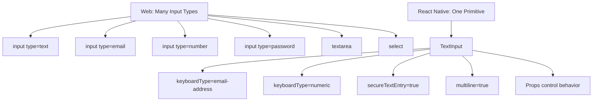
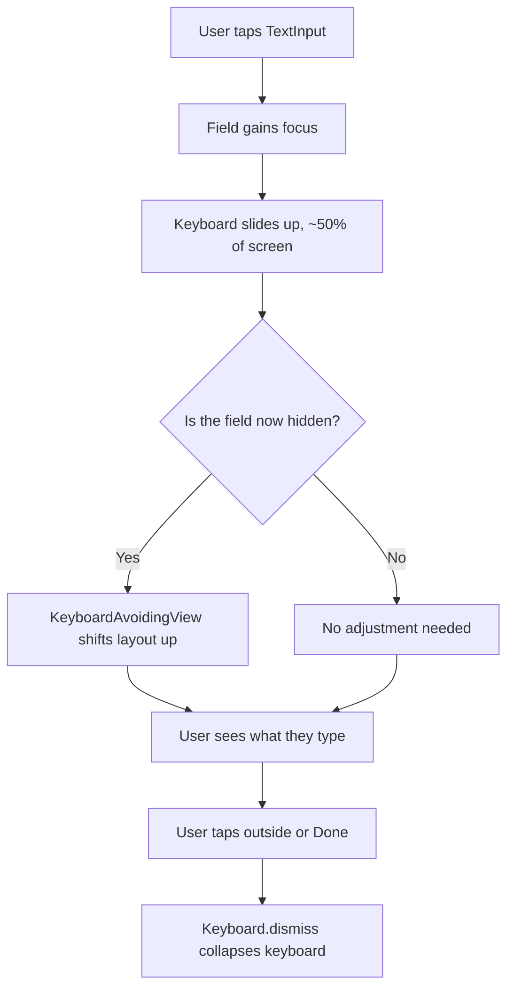
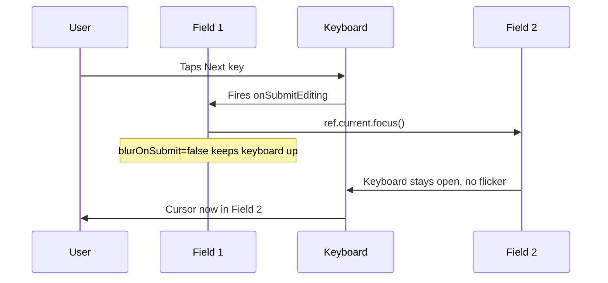
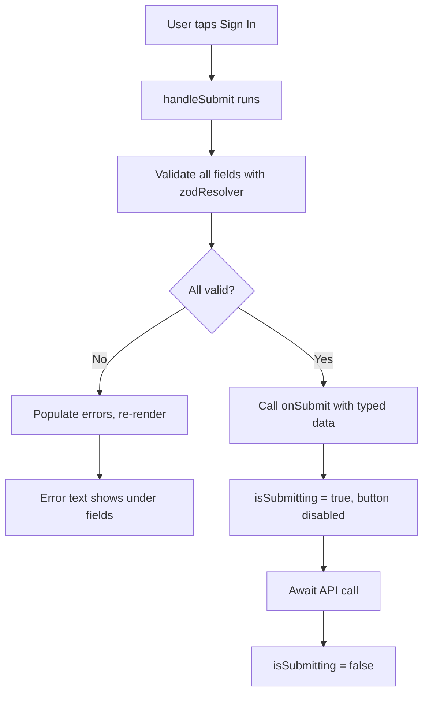
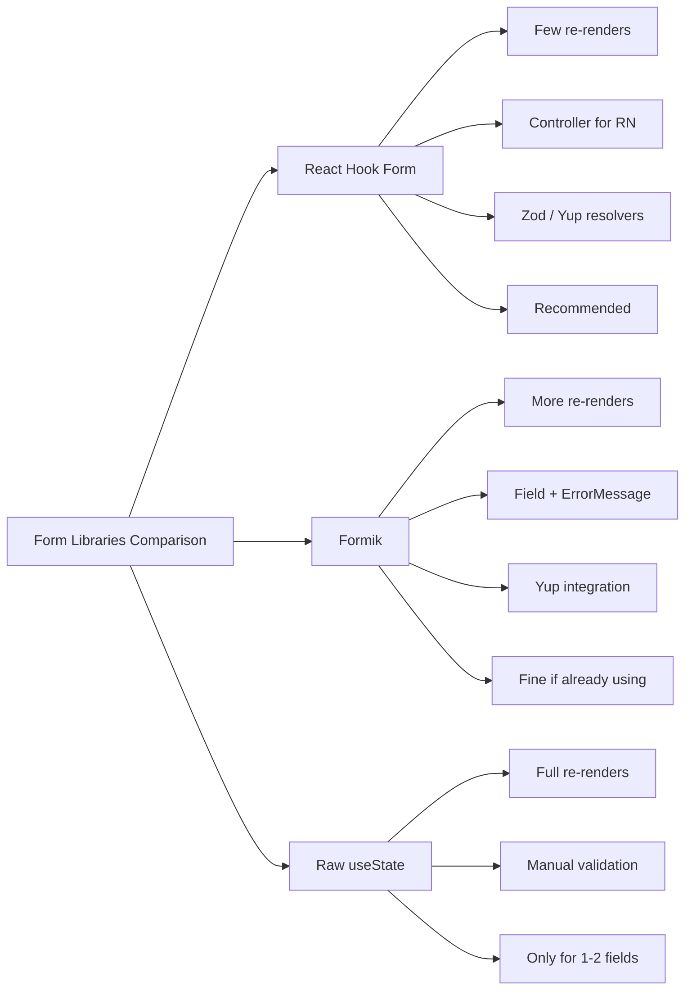
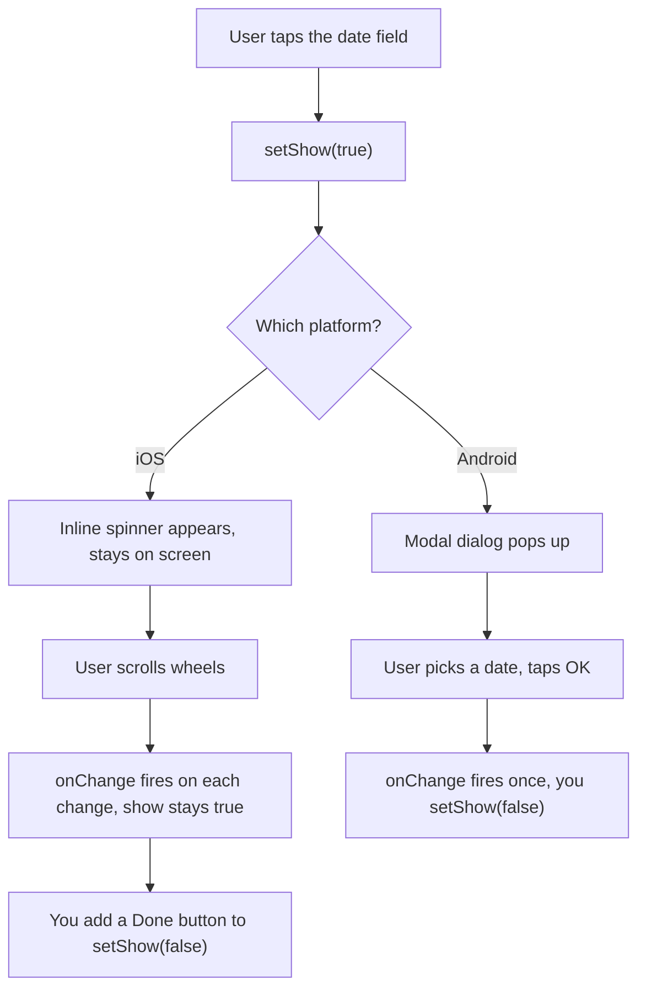
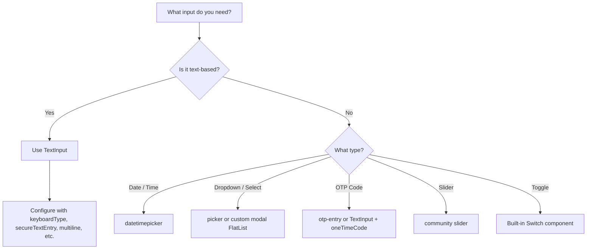
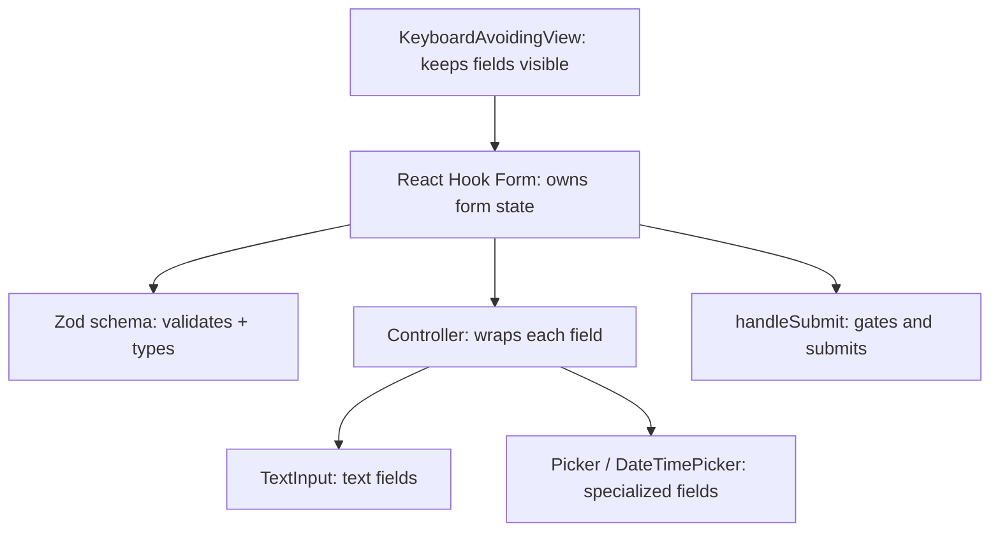

# Formulaires et saisie : TextInput et au-delà

> La primitive de saisie unique, la gestion du clavier et le traitement des formulaires dans un monde mobile-first.

---

## Table of Contents

1. [Core Input Primitives](#1-core-input-primitives)
2. [Form Libraries](#2-form-libraries)
3. [Specialized Inputs](#3-specialized-inputs)

---

## 1. Les primitives de saisie fondamentales

### La saisie unique pour les gouverner toutes

Sur le web, vous disposez d'un buffet de types de saisie : `<input type="text">`, `<input type="email">`, `<input type="number">`, `<input type="password">`, `<textarea>`, `<select>`, et une douzaine d'autres. Chacun affiche un widget natif différent et porte son propre comportement de validation.

React Native jette tout cela par-dessus bord et vous donne exactement un composant : `TextInput`.

Ce n'est pas une limitation — c'est le reflet du fonctionnement réel des plateformes mobiles. Sur iOS et Android, il existe un seul widget de champ de texte. Vous changez son *comportement* (quel clavier apparaît, si le texte est masqué, comment se comporte la correction automatique) à travers des props, et non en remplaçant des composants. Une fois que vous avez intériorisé cela, les formulaires en React Native semblent plus simples que sur le web, et non plus difficiles.

#### Pourquoi une seule primitive, vraiment ?

Pensez à `TextInput` comme à une seule machine à écrire physique où vous échangez le *papier* et la *disposition du clavier* selon la tâche, plutôt que d'acheter une toute nouvelle machine à écrire pour chaque travail. La machine sous-jacente — le curseur, le tampon de texte, les poignées de sélection, le menu copier/coller — est identique partout. Ce qui change, c'est la configuration.

Cela compte parce que, sur le web, le navigateur *et* le système d'exploitation embarquent chacun leurs propres widgets natifs, et ils sont souvent en désaccord. Un `<input type="date">` a une apparence complètement différente dans Chrome sous Windows, dans Safari sous iOS et dans Firefox sous Android — vous n'avez presque aucun contrôle. React Native contourne cela en exposant directement le champ de texte natif brut et en vous laissant composer le reste (sélecteurs de date, listes déroulantes) à partir de composants explicites que vous pouvez voir et styliser.



#### L'antisèche type web → prop RN

| Web | Équivalent React Native |
| --- | --- |
| `<input type="text">` | `<TextInput />` |
| `<input type="email">` | `<TextInput keyboardType="email-address" autoCapitalize="none" />` |
| `<input type="number">` | `<TextInput keyboardType="numeric" />` |
| `<input type="tel">` | `<TextInput keyboardType="phone-pad" />` |
| `<input type="password">` | `<TextInput secureTextEntry />` |
| `<input type="url">` | `<TextInput keyboardType="url" autoCapitalize="none" />` |
| `<textarea>` | `<TextInput multiline numberOfLines={4} />` |
| `<input type="date">` / `type="checkbox"` / `<select>` | Aucun composant de base — utilisez un package communautaire (voir la Section 3) |

### Les props de TextInput qui comptent

Voici un `TextInput` configuré pour un champ e-mail. Remarquez comment les props remplacent ce que le web fait avec les attributs `type` :

```tsx
import { TextInput, StyleSheet } from "react-native";
import { useState } from "react";

function EmailField() {
  const [email, setEmail] = useState("");

  return (
    <TextInput
      value={email}
      onChangeText={setEmail}
      placeholder="you@example.com"
      keyboardType="email-address"
      autoCapitalize="none"
      autoCorrect={false}
      autoComplete="email"
      returnKeyType="next"
      textContentType="emailAddress"
      style={styles.input}
    />
  );
}

const styles = StyleSheet.create({
  input: {
    borderWidth: 1,
    borderColor: "#ccc",
    borderRadius: 8,
    padding: 12,
    fontSize: 16,
  },
});
```

Décortiquons les props que vous utiliserez en permanence :

- **`keyboardType`** — Contrôle quelle disposition de clavier apparaît. Les options incluent `"default"`, `"email-address"`, `"numeric"`, `"phone-pad"`, `"decimal-pad"`, `"number-pad"` et `"url"`. C'est l'équivalent le plus proche des types de saisie du web.
- **`returnKeyType`** — Change le libellé de la touche retour du clavier : `"done"`, `"next"`, `"search"`, `"go"`, `"send"`. Utilisez `"next"` quand vous avez un autre champ en dessous, `"done"` pour le dernier champ.
- **`autoCapitalize`** — Réglez sur `"none"` pour les e-mails et les noms d'utilisateur, `"sentences"` pour du texte normal, `"words"` pour les noms, `"characters"` pour tout en majuscules.
- **`autoCorrect`** — Désactivez-le pour les e-mails, les noms d'utilisateur, les codes. Laissez-le activé pour le texte libre.
- **`secureTextEntry`** — Masque le texte pour les mots de passe. Cela remplace `<input type="password">`.
- **`textContentType`** (iOS) / **`autoComplete`** (Android + iOS 12+) — Active la saisie automatique depuis le trousseau du système. Utilisez `"emailAddress"`, `"password"`, `"newPassword"`, `"oneTimeCode"`, etc.

> **Astuce de pro :** `keyboardType="numeric"` fait *apparaître* un clavier numérique, mais cela n'**empêche pas** l'utilisateur de coller des lettres ou d'en saisir avec un clavier matériel. Ne faites jamais confiance au clavier comme moyen de validation — validez toujours la valeur elle-même (voir Zod dans la Section 2). Le clavier est un indice d'UX, pas une contrainte.

#### Le tableau de référence

| Prop | Ce qu'elle fait | Valeurs typiques | À utiliser pour |
| --- | --- | --- | --- |
| `keyboardType` | Choisit le clavier à l'écran | `email-address`, `numeric`, `phone-pad`, `url` | Adapter le clavier à la donnée |
| `returnKeyType` | Libelle la touche retour | `next`, `done`, `search`, `go`, `send` | Guider l'utilisateur vers l'action suivante |
| `autoCapitalize` | Mise en majuscule automatique | `none`, `sentences`, `words`, `characters` | Désactivée pour e-mails/codes, activée pour la prose |
| `autoCorrect` | Correction orthographique/automatique | `true` / `false` | Désactivée pour e-mails, noms d'utilisateur, mots de passe |
| `secureTextEntry` | Masque les caractères | `true` / `false` | Mots de passe, codes PIN |
| `multiline` | Autorise le retour à la ligne + Entrée | `true` / `false` | Commentaires, bios, notes |
| `maxLength` | Limite stricte de caractères | nombre | Limites façon tweet, codes |
| `editable` | Autorise/bloque l'édition | `true` / `false` | Champs d'affichage en lecture seule |

### onChangeText vs onChange

Cela piège les personnes venant du web. Sur le web, vous écrivez `onChange={(e) => setValue(e.target.value)}`. React Native vous donne deux options :

```tsx
// Preferred: onChangeText gives you the string directly
<TextInput onChangeText={(text) => setName(text)} />

// Also available: onChange gives you a native event
<TextInput
  onChange={(e) => {
    const text = e.nativeEvent.text;
    setName(text);
  }}
/>
```

Utilisez `onChangeText` dans 99 % des cas. C'est plus simple et c'est ce que les bibliothèques de formulaires attendent. La seule fois où vous avez besoin de `onChange`, c'est lorsque vous avez besoin de métadonnées de l'événement natif (la position du curseur, par exemple).

#### Contrôlé vs non contrôlé — le même modèle mental que sur le web

Tout comme avec React web, un `TextInput` est **contrôlé** lorsque vous passez à la fois `value` et `onChangeText`. L'état est l'unique source de vérité : le champ n'affiche que ce que l'état dit qu'il affiche.

```tsx
// Controlled — React state drives the input
const [name, setName] = useState("");
<TextInput value={name} onChangeText={setName} />

// Uncontrolled — the native field holds its own text; you read it via a ref
<TextInput defaultValue="" ref={inputRef} />
```

> **Erreur courante :** Passer `value` *sans* `onChangeText`. Le champ devient figé — l'utilisateur tape et rien n'apparaît, parce que chaque frappe re-rend la `value` inchangée. C'est exactement le même piège qu'un `<input>` contrôlé en lecture seule sur le web. Soit ajoutez `onChangeText`, soit utilisez `defaultValue` pour un champ non contrôlé.

### Gestion du clavier

Le clavier sur mobile n'est pas un popup discret — il glisse vers le haut et couvre environ la moitié de l'écran. Si votre champ se trouve dans la moitié inférieure, l'utilisateur ne peut pas voir ce qu'il tape. C'est la plus grande source de frustration dans les formulaires mobiles, et React Native vous donne des outils pour y faire face.

Sur le web, le navigateur fait défiler à votre place les champs ayant le focus pour les amener à l'écran, et le clavier (s'il y en a un) est l'affaire du système. Sur mobile, **rien ne se produit automatiquement** — le clavier glisse par-dessus votre mise en page et c'est entièrement à vous de pousser le contenu hors de son chemin.



**KeyboardAvoidingView** englobe votre formulaire et ajuste la mise en page lorsque le clavier apparaît :

```tsx
import {
  KeyboardAvoidingView,
  Platform,
  TouchableWithoutFeedback,
  Keyboard,
  ScrollView,
} from "react-native";

function LoginForm() {
  return (
    <KeyboardAvoidingView
      behavior={Platform.OS === "ios" ? "padding" : "height"}
      style={{ flex: 1 }}
    >
      <TouchableWithoutFeedback onPress={Keyboard.dismiss}>
        <ScrollView
          contentContainerStyle={{ flexGrow: 1, padding: 20 }}
          keyboardShouldPersistTaps="handled"
        >
          {/* Your form fields here */}
        </ScrollView>
      </TouchableWithoutFeedback>
    </KeyboardAvoidingView>
  );
}
```

> **Piège :** La prop `behavior` de `KeyboardAvoidingView` est différente selon la plateforme. Utilisez `"padding"` sur iOS et `"height"` sur Android. Se tromper là-dessus est la raison numéro un pour laquelle les gens pensent que KeyboardAvoidingView « ne fonctionne pas » et l'abandonnent. Il fonctionne très bien — il a juste besoin du bon behavior pour chaque OS.

Le wrapper `TouchableWithoutFeedback` avec `Keyboard.dismiss` est le pattern « toucher en dehors pour fermer le clavier ». Sur le web, cliquer en dehors d'un champ le défocalise naturellement. Sur mobile, le clavier reste ouvert jusqu'à ce que vous le fermiez explicitement. Vous avez besoin de ce wrapper.

La prop `keyboardShouldPersistTaps="handled"` sur ScrollView est critique : sans elle, toucher un bouton alors que le clavier est ouvert ferme le clavier *au lieu d'*appuyer sur le bouton. Vos utilisateurs vont toucher « Envoyer » et rien ne se passera — le clavier se ferme simplement. Ils doivent toucher à nouveau. La régler sur `"handled"` permet aux boutons de recevoir les touchers même lorsque le clavier est visible.

#### Les valeurs de `behavior`, décodées

| `behavior` | Ce qu'elle fait | Meilleure sur |
| --- | --- | --- |
| `"padding"` | Ajoute un padding inférieur égal à la hauteur du clavier, poussant le contenu vers le haut | iOS |
| `"height"` | Réduit la hauteur de la vue pour que le contenu se réorganise au-dessus du clavier | Android |
| `"position"` | Fait glisser toute la vue vers le haut via un positionnement absolu (peut être saccadé) | Rarement — cas hérités |
| `undefined` | Aucun ajustement | Quand vous le gérez manuellement |

> **Astuce de pro :** Pour tout ce qui dépasse un formulaire simple, envisagez le package communautaire `react-native-keyboard-controller`. Il offre des animations de clavier plus fluides et plus proches du natif, ainsi qu'un `KeyboardAwareScrollView` qui « fonctionne tout simplement » sur toutes les plateformes sans jongler avec un `behavior` par OS. `KeyboardAvoidingView` est la base intégrée ; ceci est la montée en gamme lorsqu'elle n'est pas assez fluide.

### Donner le focus au champ suivant

Sur le web, appuyer sur Tab passe automatiquement au champ suivant. Sur mobile, il n'y a pas de touche Tab. Vous câblez cela vous-même à l'aide de refs et du callback `onSubmitEditing` :

```tsx
import { useRef } from "react";
import { TextInput } from "react-native";

function SignupForm() {
  const lastNameRef = useRef<TextInput>(null);
  const emailRef = useRef<TextInput>(null);

  return (
    <>
      <TextInput
        placeholder="First name"
        returnKeyType="next"
        onSubmitEditing={() => lastNameRef.current?.focus()}
        blurOnSubmit={false}
      />
      <TextInput
        ref={lastNameRef}
        placeholder="Last name"
        returnKeyType="next"
        onSubmitEditing={() => emailRef.current?.focus()}
        blurOnSubmit={false}
      />
      <TextInput
        ref={emailRef}
        placeholder="Email"
        returnKeyType="done"
        keyboardType="email-address"
      />
    </>
  );
}
```

Réglez `blurOnSubmit={false}` sur tous les champs sauf le dernier. Sans cela, appuyer sur « Next » sur le clavier défocalise le champ courant avant de donner le focus au suivant, provoquant un scintillement disgracieux du clavier qui se cache brièvement puis réapparaît.

Voici l'enchaînement des événements lorsque l'utilisateur touche « Next » sur le clavier :



> **Piège :** `ref.current?.focus()` ne fonctionne que si la ref pointe vers le *véritable* `TextInput`. Si vous englobez votre champ dans un composant personnalisé, vous devez transmettre la ref avec `forwardRef`, sinon l'appel `.focus()` ne fait silencieusement rien. C'est la raison la plus courante pour laquelle le « focus du champ suivant » semble cassé.

---

## 2. Les bibliothèques de formulaires

### Pourquoi vous en avez besoin

Gérer quelques champs avec `useState` est tout à fait correct. Gérer un formulaire de 8 champs, avec validation, messages d'erreur, suivi dirty/touched et gestion de la soumission à partir d'un état brut est un cauchemar — le même cauchemar que vous connaissez déjà avec React web. La bonne nouvelle : les mêmes bibliothèques fonctionnent.

Pour rendre cela concret, voici tout ce qu'un « vrai » formulaire doit suivre. Faire cela à la main signifie un `useState` (ou une branche de reducer) pour *chaque* ligne, multiplié sur l'ensemble des champs :

| Préoccupation | Ce que cela signifie | Coût fait main |
| --- | --- | --- |
| Valeurs | Le texte courant de chaque champ | Un état par champ |
| Erreurs | Messages de validation | Relancer la validation à chaque changement |
| Touched | L'utilisateur a-t-il visité ce champ ? | Suivre le focus/blur par champ |
| Dirty | La valeur a-t-elle changé par rapport au défaut ? | Comparer aux valeurs initiales |
| Submitting | La soumission asynchrone est-elle en cours ? | Booléen de chargement manuel + try/catch |
| Verrouillage de la soumission | Bloquer la soumission tant que c'est invalide | Câbler la validité dans le bouton |

Une bibliothèque de formulaires réduit tout cela à un seul hook. C'est tout l'argument.

### React Hook Form — Le vainqueur incontestable

React Hook Form fonctionne en React Native sans aucun changement à son API de base. Vous échangez les éléments HTML contre des composants RN et utilisez `Controller` au lieu de `register` (puisque `register` repose sur des refs DOM). C'est la seule différence.

> **Pourquoi `Controller` ?** Sur le web, `register` fonctionne en attachant une ref directement à un `<input>` du DOM et en lisant son `.value` — sans état React nécessaire, ce qui rend RHF si rapide. Les composants React Native n'exposent pas de nœud DOM avec une propriété `.value`, donc cette astuce ne peut pas fonctionner. `Controller` comble l'écart : il transforme le champ en composant contrôlé, alimentant `value`/`onChange` dans votre `TextInput` pendant que RHF continue de gérer tout le reste en coulisses.

```tsx
import { useForm, Controller } from "react-hook-form";
import {
  View,
  Text,
  TextInput,
  Pressable,
  StyleSheet,
} from "react-native";
import { z } from "zod";
import { zodResolver } from "@hookform/resolvers/zod";

const schema = z.object({
  email: z.string().email("Enter a valid email"),
  password: z.string().min(8, "At least 8 characters"),
});

type FormData = z.infer<typeof schema>;

function LoginForm() {
  const {
    control,
    handleSubmit,
    formState: { errors, isSubmitting },
  } = useForm<FormData>({
    resolver: zodResolver(schema),
    defaultValues: { email: "", password: "" },
  });

  const onSubmit = async (data: FormData) => {
    // Call your API
    console.log(data);
  };

  return (
    <View style={styles.container}>
      <Text style={styles.label}>Email</Text>
      <Controller
        control={control}
        name="email"
        render={({ field: { onChange, onBlur, value } }) => (
          <TextInput
            style={[styles.input, errors.email && styles.inputError]}
            value={value}
            onChangeText={onChange}
            onBlur={onBlur}
            placeholder="you@example.com"
            keyboardType="email-address"
            autoCapitalize="none"
            autoCorrect={false}
            returnKeyType="next"
          />
        )}
      />
      {errors.email && (
        <Text style={styles.error}>{errors.email.message}</Text>
      )}

      <Text style={styles.label}>Password</Text>
      <Controller
        control={control}
        name="password"
        render={({ field: { onChange, onBlur, value } }) => (
          <TextInput
            style={[styles.input, errors.password && styles.inputError]}
            value={value}
            onChangeText={onChange}
            onBlur={onBlur}
            placeholder="Min. 8 characters"
            secureTextEntry
            returnKeyType="done"
          />
        )}
      />
      {errors.password && (
        <Text style={styles.error}>{errors.password.message}</Text>
      )}

      <Pressable
        style={[styles.button, isSubmitting && styles.buttonDisabled]}
        onPress={handleSubmit(onSubmit)}
        disabled={isSubmitting}
      >
        <Text style={styles.buttonText}>
          {isSubmitting ? "Signing in..." : "Sign In"}
        </Text>
      </Pressable>
    </View>
  );
}

const styles = StyleSheet.create({
  container: { padding: 20 },
  label: { fontSize: 14, fontWeight: "600", marginBottom: 4, marginTop: 16 },
  input: {
    borderWidth: 1,
    borderColor: "#ccc",
    borderRadius: 8,
    padding: 12,
    fontSize: 16,
  },
  inputError: { borderColor: "#e53e3e" },
  error: { color: "#e53e3e", fontSize: 12, marginTop: 4 },
  button: {
    backgroundColor: "#3b82f6",
    padding: 16,
    borderRadius: 8,
    alignItems: "center",
    marginTop: 24,
  },
  buttonDisabled: { opacity: 0.6 },
  buttonText: { color: "#fff", fontSize: 16, fontWeight: "600" },
});
```

#### Comment se déroule réellement une soumission

`handleSubmit` est un verrou. Il exécute d'abord la validation, et n'appelle votre `onSubmit` *que* si chaque champ passe. Si quelque chose échoue, il remplit `errors` et votre `onSubmit` ne s'exécute jamais — vous n'avez donc jamais à vérifier la validité à la main dans le gestionnaire de soumission.



#### Un `ControlledInput` réutilisable pour éliminer le boilerplate

Écrire un `<Controller>` autour de chaque champ devient verbeux. Dans les vraies applications, on l'extrait une fois pour toutes :

```tsx
import { Controller, Control, FieldValues, Path } from "react-hook-form";
import { TextInput, Text, TextInputProps } from "react-native";

type Props<T extends FieldValues> = {
  control: Control<T>;
  name: Path<T>;
  error?: string;
} & TextInputProps;

function ControlledInput<T extends FieldValues>({
  control,
  name,
  error,
  ...inputProps
}: Props<T>) {
  return (
    <>
      <Controller
        control={control}
        name={name}
        render={({ field: { onChange, onBlur, value } }) => (
          <TextInput
            value={value}
            onChangeText={onChange}
            onBlur={onBlur}
            {...inputProps}
          />
        )}
      />
      {error ? <Text style={{ color: "#e53e3e" }}>{error}</Text> : null}
    </>
  );
}

// Usage shrinks to a single line per field:
// <ControlledInput control={control} name="email" error={errors.email?.message} />
```

### Zod pour la validation

Remarquez le schéma Zod dans l'exemple ci-dessus. Zod est la bibliothèque de validation que je recommande parce qu'elle fait deux choses à la fois : elle valide les données *et* elle infère les types TypeScript à partir du schéma. Vous définissez la forme de votre formulaire une fois, et vous obtenez gratuitement la validation à l'exécution plus la sécurité de typage à la compilation :

```tsx
const schema = z.object({
  email: z.string().email(),
  password: z.string().min(8),
  age: z.coerce.number().min(13).max(120),
});

// This type is derived automatically — no duplication
type FormData = z.infer<typeof schema>;
// { email: string; password: string; age: number }
```

L'idée clé : un `TextInput` vous donne *toujours* une chaîne de caractères. Un champ comme « age » arrive sous la forme `"25"`, et non `25`. `z.coerce.number()` le convertit pour vous pendant la validation, de sorte que votre `onSubmit` reçoit un vrai `number`. C'est pourquoi Zod se marie si bien avec RN — il absorbe la réalité « tout est du texte » de `TextInput`.

Le `zodResolver` de `@hookform/resolvers` fait le pont entre Zod et React Hook Form. Installez les deux :

```bash
npm install react-hook-form zod @hookform/resolvers
```

Quelques patterns de validation que vous utiliserez en permanence :

```tsx
const schema = z.object({
  // Custom error messages live in the validator
  username: z.string().min(3, "Too short").max(20, "Too long"),
  // Cross-field validation: confirm-password must match
  password: z.string().min(8),
  confirm: z.string(),
}).refine((data) => data.password === data.confirm, {
  message: "Passwords don't match",
  path: ["confirm"], // attaches the error to the confirm field
});
```

> **Astuce de pro :** Réglez `useForm({ mode: "onBlur" })` pour que la validation se déclenche lorsqu'un champ perd le focus, et non à chaque frappe. Valider à chaque caractère est déstabilisant — l'utilisateur voit « e-mail invalide » alors qu'il est encore en train de le taper. `"onBlur"` attend qu'il passe au suivant, ce qui semble bien plus poli.

### Et Formik ?

Formik a été la référence pendant des années et il fonctionne toujours. Mais React Hook Form est plus rapide (moins de re-renders puisqu'il utilise des champs non contrôlés en coulisses lorsque c'est possible), a un bundle plus petit, et l'API `Controller` est plus propre que le pattern `<Field>` + `<ErrorMessage>` de Formik. Si vous démarrez un nouveau projet, utilisez React Hook Form. Si votre base de code existante utilise Formik, il n'y a aucune raison urgente de migrer — il est plus lent mais pas cassé.



| Approche | Re-renders | Validation | Boilerplate | Quand l'utiliser |
| --- | --- | --- | --- | --- |
| **React Hook Form** | Minimal (isole les champs) | Resolver Zod / Yup | Faible | Par défaut pour tout vrai formulaire — commencez ici |
| **Formik** | Plus nombreux (re-render à chaque frappe) | Yup | Moyen | Déjà dans votre base de code ; pas besoin de migrer |
| **`useState` brut** | Re-render complet du composant à chaque frappe | Vérifications `if` manuelles | Élevé et croît vite | Une seule barre de recherche ou 1–2 champs triviaux |

> **Erreur courante :** Ne construisez pas votre propre gestion d'état de formulaire avec `useReducer` et une flopée d'appels `useState` juste pour éviter une dépendance. Les bibliothèques de formulaires gèrent le suivi dirty, l'état touched, la validation asynchrone, les tableaux de champs et une douzaine de cas limites dont vous aurez fini par avoir besoin. La dépendance en vaut la peine.

---

## 3. Les saisies spécialisées

### Au-delà de TextInput

TextInput gère le texte. Mais les formulaires mobiles ont souvent besoin de sélecteurs de date, de listes déroulantes, de curseurs, de codes OTP et de numéros de téléphone. Aucun d'eux n'existe dans le cœur de React Native — vous vous tournez vers des packages communautaires.

Pourquoi ne sont-ils pas intégrés d'office ? L'équipe centrale de React Native garde délibérément la surface d'API réduite. Un sélecteur de date, un curseur, une liste déroulante — tous enveloppent des widgets de plateforme *natifs*, et les maintenir à travers les évolutions de versions d'iOS et d'Android représente beaucoup de travail. L'équipe centrale délègue donc cela à des packages communautaires, dont la plupart vivent sous l'organisation `@react-native-community` et sont de fait semi-officiels. Se tourner vers un package ici est normal et attendu, et non un contournement.

| Besoin | Package | S'affiche comme |
| --- | --- | --- |
| Date / heure | `@react-native-community/datetimepicker` | Sélecteur natif iOS/Android |
| Liste déroulante / select | `@react-native-picker/picker` | Roue (iOS) / menu déroulant (Android) |
| Code OTP | `react-native-otp-entry` | Rangée de cases à un seul chiffre |
| Curseur | `@react-native-community/slider` | Piste de curseur native |
| Interrupteur | `Switch` (intégré au cœur !) | Interrupteur on/off natif |
| Numéro de téléphone | `react-native-phone-number-input` | Champ + sélecteur d'indicatif pays |

### Sélecteurs de date et d'heure

Le package de référence est `@react-native-community/datetimepicker`. Il affiche les dialogues natifs de sélection de date/heure d'iOS et d'Android :

```bash
npm install @react-native-community/datetimepicker
```

```tsx
import { useState } from "react";
import { View, Text, Pressable, Platform } from "react-native";
import DateTimePicker, {
  DateTimePickerEvent,
} from "@react-native-community/datetimepicker";

function DateField() {
  const [date, setDate] = useState(new Date());
  const [show, setShow] = useState(false);

  const onChange = (event: DateTimePickerEvent, selectedDate?: Date) => {
    // On Android, the picker is a dialog — it closes automatically
    if (Platform.OS === "android") {
      setShow(false);
    }
    if (selectedDate) {
      setDate(selectedDate);
    }
  };

  return (
    <View>
      <Pressable onPress={() => setShow(true)}>
        <Text style={{ fontSize: 16, padding: 12, borderWidth: 1, borderColor: "#ccc", borderRadius: 8 }}>
          {date.toLocaleDateString()}
        </Text>
      </Pressable>

      {show && (
        <DateTimePicker
          value={date}
          mode="date"
          display={Platform.OS === "ios" ? "spinner" : "default"}
          onChange={onChange}
          maximumDate={new Date()}
        />
      )}
    </View>
  );
}
```

> **Différence de plateforme :** Sur iOS, le sélecteur est un spinner intégré qui reste visible. Sur Android, c'est un dialogue modal qui disparaît après la sélection. Votre logique d'affichage/masquage doit en tenir compte — sur Android, réglez toujours `show` sur `false` dans `onChange`. Sur iOS, vous voudrez peut-être un bouton « Done » pour le fermer.

Ce comportement à double personnalité est la chose la plus déroutante de ce package. Le voici sous forme de flux :



> **Piège :** Sur Android, l'utilisateur peut toucher « Cancel ». Dans ce cas, `onChange` se déclenche tout de même, mais `event.type === "dismissed"` et `selectedDate` vaut `undefined`. Protégez-vous toujours avec `if (selectedDate)` avant d'enregistrer — sinon vous risquez d'écraser une bonne date par rien.

### Sélecteur / liste déroulante (Picker)

L'élément `<select>` du web n'a aucun équivalent dans le cœur de React Native. Utilisez `@react-native-picker/picker` :

```bash
npm install @react-native-picker/picker
```

```tsx
import { Picker } from "@react-native-picker/picker";
import { useState } from "react";

function CountryPicker() {
  const [country, setCountry] = useState("us");

  return (
    <Picker
      selectedValue={country}
      onValueChange={(value) => setCountry(value)}
    >
      <Picker.Item label="United States" value="us" />
      <Picker.Item label="Canada" value="ca" />
      <Picker.Item label="United Kingdom" value="uk" />
      <Picker.Item label="France" value="fr" />
    </Picker>
  );
}
```

Sur iOS, cela affiche une roue tournante ; sur Android, cela affiche un menu déroulant. Si vous voulez un rendu cohérent multiplateforme, beaucoup d'équipes construisent à la place un sélecteur modal personnalisé avec une FlatList. Mais pour les formulaires standard, le sélecteur natif convient et est accessible d'emblée.

| Approche | Apparence | Effort | Quand l'utiliser |
| --- | --- | --- | --- |
| `@react-native-picker/picker` | Roue native (iOS) / menu déroulant (Android) | Faible | Formulaires standard, l'accessibilité compte, OK avec les différences de plateforme |
| `Modal` + `FlatList` personnalisés | Identique sur les deux plateformes, entièrement stylisable | Élevé | UI cohérente avec la marque, longues listes, recherche à la frappe |
| Bibliothèques tierces de « select » | Variable | Moyen | Vous voulez la recherche/sélection multiple sans la construire |

> **Astuce de pro :** Remarquez que le `Picker` est *contrôlé* exactement comme un `TextInput` — `selectedValue` est votre « value » et `onValueChange` est votre « onChange ». Le même pattern de composant contrôlé de la Section 1 s'applique à presque toutes les saisies de l'écosystème. Apprenez-le une fois, appliquez-le partout.

### Saisie de code OTP / de vérification

Les saisies OTP — ces 4 à 6 cases distinctes pour les codes de vérification — sont étonnamment délicates à construire de zéro. Vous devez gérer le focus entre les cases, prendre en charge le collage depuis le presse-papiers et supporter la saisie automatique du système pour les codes SMS. Utilisez une bibliothèque :

```bash
npm install react-native-otp-entry
```

```tsx
import { OtpInput } from "react-native-otp-entry";

function VerificationScreen() {
  const handleOtpFilled = (code: string) => {
    // Verify the code with your API
    console.log("OTP entered:", code);
  };

  return (
    <OtpInput
      numberOfDigits={6}
      onFilled={handleOtpFilled}
      autoFocus
      theme={{
        pinCodeContainerStyle: {
          borderWidth: 2,
          borderColor: "#ccc",
          borderRadius: 8,
          width: 48,
          height: 56,
        },
        focusedPinCodeContainerStyle: {
          borderColor: "#3b82f6",
        },
      }}
    />
  );
}
```

Pourquoi est-ce « étonnamment délicat » à coder à la main ? Parce que les six cases que vous *voyez* sont l'illusion de six champs, mais le comportement attendu par les utilisateurs les couvre toutes à la fois :

- Taper un chiffre doit faire avancer automatiquement le focus à la case suivante.
- Appuyer sur retour arrière dans une case vide doit revenir *en arrière* et effacer la précédente.
- Coller « 123456 » doit répartir un chiffre par case, et non tout déverser dans la première case.
- iOS doit proposer le code SMS depuis la bannière de notification (`oneTimeCode`).

Une bibliothèque gère ces quatre points. C'est pourquoi elle mérite sa place.

> **Conseil :** Réglez `textContentType="oneTimeCode"` sur un TextInput ordinaire si vous voulez qu'iOS suggère le code SMS depuis la bannière de notification sans utiliser une bibliothèque OTP complète. Cela fonctionne suffisamment bien pour les cas simples.

### Saisie de numéro de téléphone

Les saisies de téléphone ont besoin de la sélection de l'indicatif pays, du formatage et de la validation. Le package `react-native-phone-number-input` gère cela, mais vous pouvez aussi associer un TextInput ordinaire à une bibliothèque comme `libphonenumber-js` pour la validation :

```tsx
import { TextInput } from "react-native";
import { parsePhoneNumberFromString } from "libphonenumber-js";

function PhoneField() {
  const [phone, setPhone] = useState("");
  const [error, setError] = useState("");

  const validate = (text: string) => {
    setPhone(text);
    const parsed = parsePhoneNumberFromString(text, "US");
    if (parsed && parsed.isValid()) {
      setError("");
    } else if (text.length > 5) {
      setError("Enter a valid phone number");
    }
  };

  return (
    <>
      <TextInput
        value={phone}
        onChangeText={validate}
        keyboardType="phone-pad"
        placeholder="(555) 123-4567"
        textContentType="telephoneNumber"
        autoComplete="tel"
      />
      {error ? <Text style={{ color: "red" }}>{error}</Text> : null}
    </>
  );
}
```

> **Astuce de pro :** Ne validez jamais les numéros de téléphone avec une regex que vous avez écrite vous-même. Les formats de téléphone varient énormément selon les pays (longueur, regroupement, zéros initiaux, indicatifs pays), et une regex maison *finira* par rejeter des numéros valides. `libphonenumber-js` est la logique de parsing de téléphone éprouvée de Google portée en JavaScript — elle connaît les règles de chaque pays. Utilisez-la.

### Mettre tout cela ensemble

Voici un modèle mental pour choisir la bonne approche de saisie :



La règle générale : commencez avec `TextInput` et ses props. Vous serez surpris de voir jusqu'où cela vous mène. Ne vous tournez vers les packages communautaires que lorsque vous avez besoin d'un modèle d'interaction véritablement différent — roues de date, listes déroulantes, curseurs. Et enveloppez toujours le tout dans React Hook Form avec la validation Zod. Cette stack — TextInput + sélecteurs communautaires + React Hook Form + Zod — gère tous les formulaires que vous construirez en production.

#### La stack de production, en une seule image



Chaque formulaire que vous livrez en production est un arrangement de ces six pièces. Maîtrisez-les et il n'y a aucun formulaire mobile que vous ne puissiez construire.