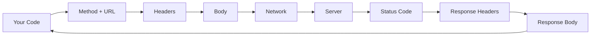
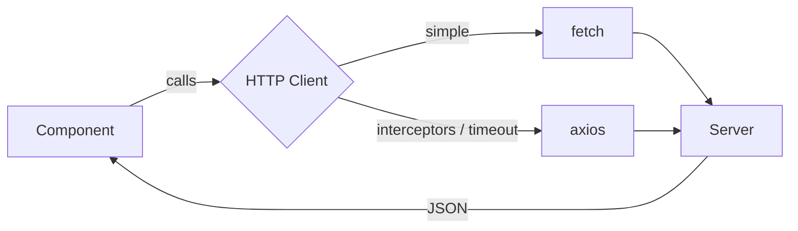
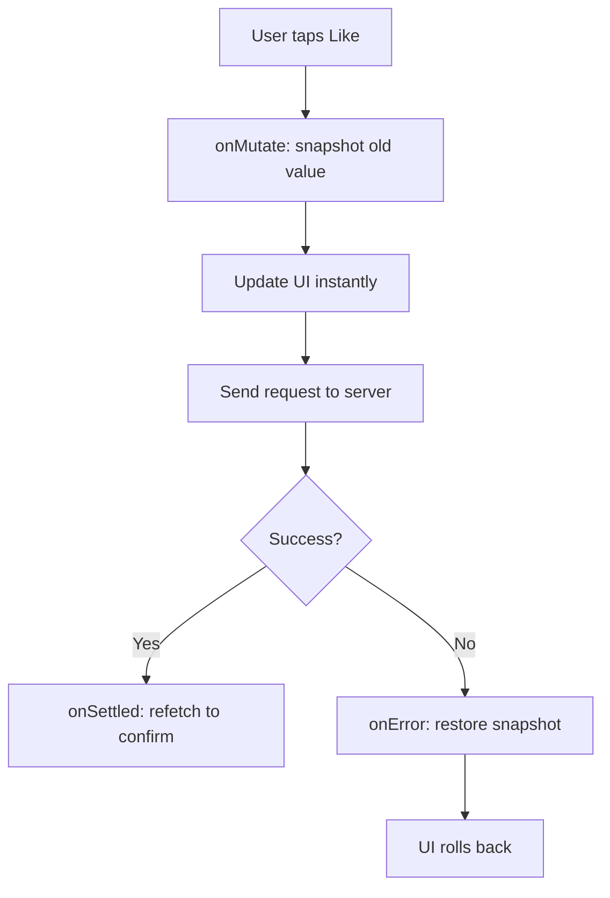
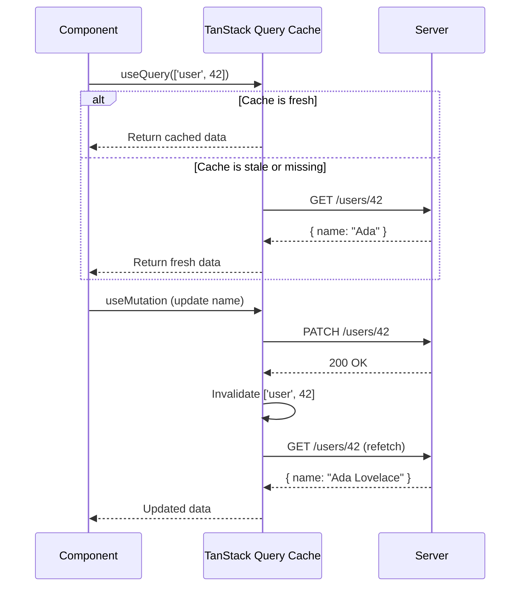
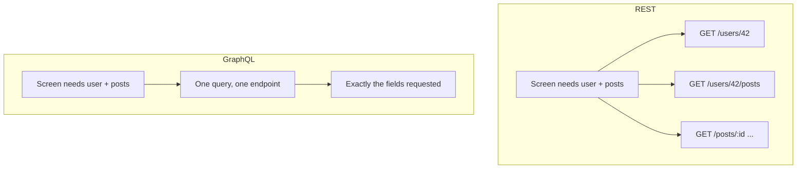
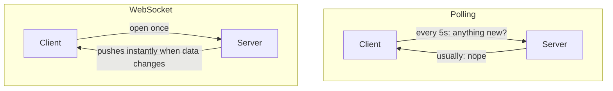
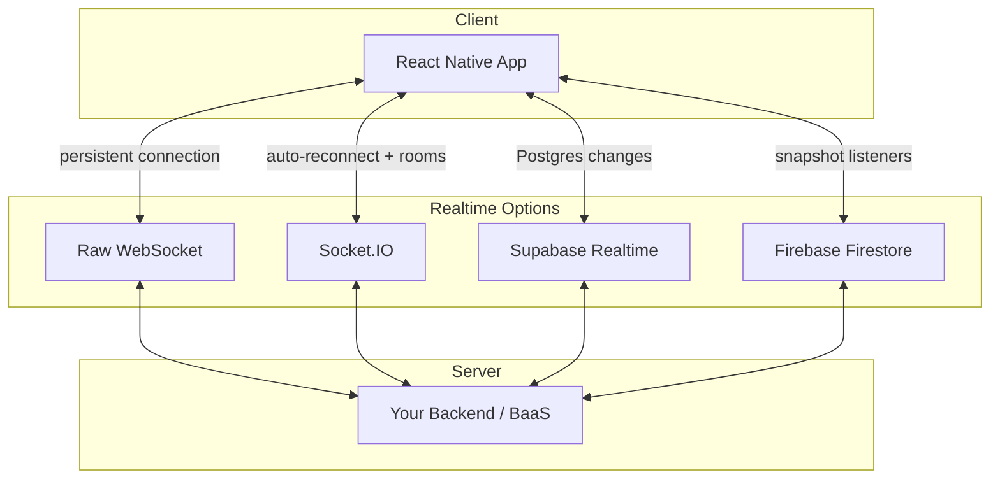
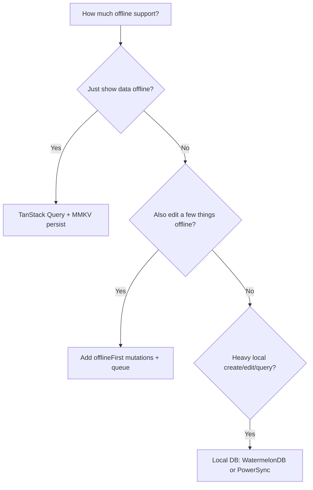
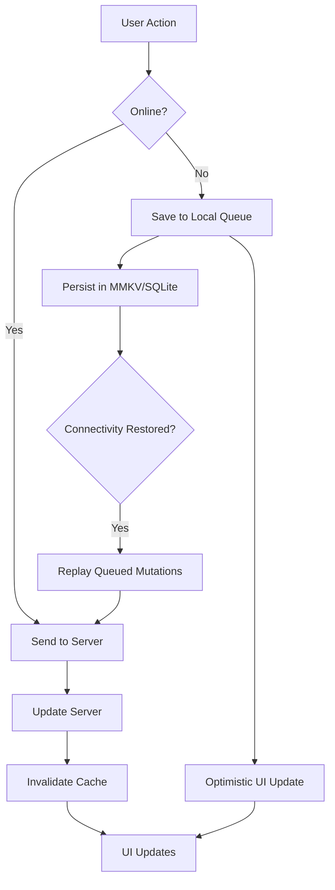

# Réseau et données : récupération, mise en cache et passage hors ligne

> Requêtes HTTP, gestion du state serveur, connexions temps réel et patterns offline-first pour le mobile.

---

## Table of Contents

1. [HTTP](#1-http)
2. [Server State with TanStack Query](#2-server-state-with-tanstack-query)
3. [GraphQL](#3-graphql)
4. [Realtime](#4-realtime)
5. [Offline-First Patterns](#5-offline-first-patterns)

---

## 1. HTTP

Sur le web, vous utilisez `fetch` ou `axios` sans y réfléchir à deux fois. React Native intègre `fetch` directement dans son runtime JavaScript — pas de polyfill, pas d'import, il suffit de l'appeler. C'est à la fois une bonne nouvelle et un piège. Le réseau mobile est fondamentalement différent de celui du navigateur : les connexions tombent dans les ascenseurs, basculent du Wi-Fi à la cellulaire au milieu d'une requête, et les utilisateurs attendent de votre app qu'elle gère tout cela avec élégance.

### Pourquoi le réseau mobile est différent

Dans un onglet de navigateur, le réseau est globalement stable : l'utilisateur est en Wi-Fi ou sur une connexion filaire, l'onglet reste ouvert, et une requête échouée signifie généralement que le serveur est en panne. Sur un téléphone, le réseau est une cible mouvante. Imaginez un usager qui ouvre votre app dans le train : LTE complet sur le quai, zone morte dans le tunnel, 3G capricieuse quand le train ressort, puis bascule vers le Wi-Fi de la gare. Votre requête peut *commencer* en cellulaire et *se terminer* en Wi-Fi — ou ne jamais se terminer du tout.

C'est pourquoi trois choses comptent bien plus sur mobile que sur le web :

- **Timeouts** — une requête bloquée sur une connexion instable doit échouer rapidement, et non tourner indéfiniment en vidant la batterie.
- **Retries** — une défaillance transitoire (un paquet perdu) est normale, pas exceptionnelle. Réessayer une ou deux fois « fonctionne » souvent tout simplement.
- **UI d'erreur** — chaque écran qui récupère des données a besoin d'un state de chargement, d'erreur et de vide visible, car les trois *se produiront* dans le monde réel.

> **Voyez les choses ainsi :** une requête depuis un navigateur est un appel sur une ligne fixe. Une requête mobile est une conversation au talkie-walkie pendant que vous traversez un bâtiment — vous anticipez les grésillements et les mots perdus.

### L'anatomie d'une requête HTTP

Quel que soit le client que vous utilisez, chaque requête comporte les mêmes éléments. Les comprendre rend le débogage bien plus simple lorsque quelque chose renvoie les mauvaises données.



- **Method** — `GET` (lecture), `POST` (création), `PATCH`/`PUT` (mise à jour), `DELETE` (suppression).
- **Headers** — métadonnées : `Content-Type`, `Authorization`, etc.
- **Body** — la charge utile (généralement du JSON) envoyée avec `POST`/`PATCH`.
- **Status code** — `2xx` succès, `3xx` redirection, `4xx` votre erreur (mauvaise requête, non autorisé), `5xx` l'erreur du serveur.

### fetch : la valeur par défaut intégrée

Le `fetch` de React Native suit la même spécification WHATWG que vous connaissez du navigateur. Il fonctionne de manière identique pour les appels GET/POST basiques :

```tsx
const response = await fetch('https://api.example.com/users/42');
const user = await response.json();
```

Le hic — et cela piège presque tous les débutants — c'est que `fetch` ne **rejette pas** sur les codes de statut d'erreur HTTP. Une 404 ou une 500 vous donne une promesse résolue. Vous devez vérifier `response.ok` vous-même :

```tsx
async function getUser(id: number) {
  const response = await fetch(`https://api.example.com/users/${id}`);
  if (!response.ok) {
    throw new Error(`HTTP ${response.status}: ${response.statusText}`);
  }
  return response.json();
}
```

> **Erreur fréquente :** croire qu'un `try/catch` autour de `fetch` attrape une 500. Ce n'est pas le cas. Le bloc `catch` ne se déclenche que pour les défaillances *de niveau réseau* (pas de connexion, échec DNS, timeout). Une HTTP 500 est un aller-retour réseau *réussi* qui a simplement transporté un statut d'erreur — vous devez donc inspecter `response.ok` explicitement. C'est le bug `fetch` le plus courant chez les débutants.

Un `fetch` plus complet avec un timeout (essentiel sur mobile) et un body typé ressemble à ceci :

```tsx
async function postJson<T>(url: string, body: unknown): Promise<T> {
  // AbortController lets us cancel a hung request after 10s
  const controller = new AbortController();
  const timeout = setTimeout(() => controller.abort(), 10_000);

  try {
    const res = await fetch(url, {
      method: 'POST',
      headers: { 'Content-Type': 'application/json' },
      body: JSON.stringify(body),
      signal: controller.signal, // wires the timeout to the request
    });
    if (!res.ok) throw new Error(`HTTP ${res.status}`);
    return (await res.json()) as T;
  } finally {
    clearTimeout(timeout); // always clean up the timer
  }
}
```

> **Piège :** un `fetch` brut n'a **aucun timeout intégré**. Sans `AbortController`, une requête sur une connexion morte peut rester bloquée indéfiniment. Sur le web, vous ne le remarquerez peut-être jamais ; sur mobile, c'est un spinner figé et une batterie gaspillée.

Pour les apps simples, `fetch` suffit. Mais dès que vous voulez des intercepteurs de requêtes, des retries automatiques ou un suivi de progression d'upload, vous commencerez à construire votre propre wrapper. C'est à ce moment-là que vous devriez plutôt vous tourner vers une bibliothèque.

### axios : quand fetch ne suffit plus

`axios` vous offre des intercepteurs, des transformations JSON automatiques, l'annulation de requêtes et des timeouts configurables d'emblée. La fonctionnalité phare est l'**intercepteur** — une fonction qui s'exécute sur *chaque* requête ou réponse, ce qui vous permet d'attacher un token d'authentification ou de normaliser les erreurs en un seul endroit, plutôt que de le répéter dans chaque appel.

Configurez une instance partagée avec votre URL de base et vos headers par défaut une seule fois, puis importez-la partout :

```tsx
// api/client.ts
import axios from 'axios';
import { getToken } from '../auth/storage';

const client = axios.create({
  baseURL: 'https://api.example.com',
  timeout: 10_000, // 10 seconds — generous for mobile
  headers: { 'Content-Type': 'application/json' },
});

// Attach auth token to every request
client.interceptors.request.use(async (config) => {
  const token = await getToken();
  if (token) {
    config.headers.Authorization = `Bearer ${token}`;
  }
  return config;
});

// Normalize error handling
client.interceptors.response.use(
  (response) => response,
  (error) => {
    if (error.response?.status === 401) {
      // Redirect to login or refresh token
    }
    return Promise.reject(error);
  },
);

export default client;
```

Deux commodités d'`axios` qui épargnent un vrai boilerplate par rapport à `fetch` :

```tsx
// 1. axios THROWS on 4xx/5xx automatically — no response.ok check needed
try {
  const { data } = await client.get('/users/42'); // data is already parsed JSON
} catch (err) {
  // fires for HTTP errors AND network errors
}

// 2. Response is already JSON — no `await res.json()` second step
```

> **Piège :** ne codez jamais en dur l'URL de base de votre API. Utilisez des variables d'environnement (via `react-native-config` ou le support `.env` d'Expo) afin de pouvoir basculer entre staging et production sans rebuild.

> **Astuce de pro :** les intercepteurs sont le bon endroit pour gérer le rafraîchissement de token. Quand une `401` revient, l'intercepteur de réponse peut récupérer un nouveau token de façon transparente et réessayer la requête d'origine — le composant appelant ne saura même jamais que cela s'est produit.

### Lequel choisir ?

| Besoin | `fetch` | `axios` |
|---|---|---|
| Taille du bundle | Zéro (intégré) | ~13 KB |
| Erreurs sur 4xx/5xx | Non — vérifier `response.ok` | Oui — throw automatiquement |
| Parsing JSON auto | Non — `await res.json()` | Oui — `response.data` |
| Timeout | Manuel (`AbortController`) | Intégré (option `timeout`) |
| Intercepteurs | Construisez votre propre wrapper | Natif |
| Progression d'upload | Non pris en charge | Pris en charge |
| **Quand l'utiliser** | Prototypes, 1–2 appels d'API | Vraies apps, auth, config partagée |

Utilisez `fetch` pour les prototypes et les apps avec un ou deux appels d'API. Utilisez `axios` dès que vous avez besoin d'intercepteurs, d'une gestion d'erreurs centralisée ou d'un contrôle du timeout. Quoi qu'il en soit, ni `fetch` ni `axios` ne résolvent le vrai problème : gérer le **state** des données serveur dans vos composants. C'est précisément l'objet de la section suivante.



---

## 2. Server State with TanStack Query

Voici le problème que le `fetch` ou l'`axios` bruts ne peuvent pas résoudre : vous récupérez une liste d'utilisateurs, vous l'affichez, vous naviguez vers un écran de détail, vous revenez en arrière, et la liste se recharge. Ou pire, elle ne se recharge pas et affiche des données périmées. Vous finissez par écrire à la main la logique `isLoading`, `isError` et de mise en cache dans chaque composant. TanStack Query (anciennement React Query) élimine tout cela et ajoute des super-pouvoirs spécifiques au mobile.

### Le state serveur n'est pas le state client

Le déclic mental qui fait comprendre TanStack Query : **les données serveur ne sont pas vos données — c'est une copie en cache des données de quelqu'un d'autre.** Le nom de l'utilisateur réside dans la base de données sur un serveur. Votre app détient un instantané temporaire qui peut devenir périmé dès qu'un autre appareil le modifie. C'est fondamentalement différent d'un toggle ou d'un champ de formulaire (state client), que seule votre app possède.

| | State client | State serveur |
|---|---|---|
| Possédé par | Votre app | Un serveur distant |
| Peut devenir périmé | Non | Oui — à tout moment |
| Outils | `useState`, Zustand, Redux | TanStack Query, Apollo |
| Questions clés | Quelle est la valeur ? | Est-elle fraîche ? Dois-je recharger ? |

Tenter de gérer le state serveur avec `useState` + `useEffect`, c'est réinventer à la main la mise en cache, la déduplication, les retries et le refetch-on-focus. TanStack Query est la bibliothèque qui a déjà tout résolu.

> **Analogie :** voyez TanStack Query comme un frigo intelligent. Vous demandez du lait (les données) par son nom (la query key). Si le frigo a du lait frais, vous l'obtenez instantanément. S'il a dépassé la date « à consommer de préférence avant » (`staleTime`), le frigo se réapprovisionne discrètement en arrière-plan tout en vous donnant ce qu'il a déjà. Si personne ne boit une brique pendant un certain temps, elle est jetée (`gcTime`).

### Setup

```bash
npx expo install @tanstack/react-query
```

Enveloppez votre app dans un `QueryClientProvider` :

```tsx
import { QueryClient, QueryClientProvider } from '@tanstack/react-query';

const queryClient = new QueryClient({
  defaultOptions: {
    queries: {
      staleTime: 1000 * 60 * 5, // 5 minutes before data is "stale"
      gcTime: 1000 * 60 * 30,   // garbage-collect unused cache after 30 min
      retry: 2,
    },
  },
});

export default function App() {
  return (
    <QueryClientProvider client={queryClient}>
      <RootNavigator />
    </QueryClientProvider>
  );
}
```

### La query key : le cœur du cache

Chaque query est identifiée par une **query key** — un tableau sérialisable comme `['user', 42]`. C'est l'adresse dans le cache. Deux composants qui demandent `['user', 42]` partagent automatiquement *une* requête et *un* résultat en cache (c'est ce qu'on appelle la déduplication). Lorsque vous modifiez une partie de la key — `['user', 43]` — c'est une adresse différente, une entrée de cache différente, un fetch différent.

```tsx
// Same key anywhere in the app = same cache entry, one network request
useQuery({ queryKey: ['user', 42], queryFn: ... }); // ScreenA
useQuery({ queryKey: ['user', 42], queryFn: ... }); // ScreenB — no second fetch!

// Keys are hierarchical — invalidate broadly or narrowly
['todos']            // all todos
['todos', { done: true }] // a filtered subset
['todos', 42]        // a single todo
```

> **Astuce de pro :** mettez dans la key chaque valeur dont dépend la `queryFn`. Si votre fetch utilise `userId` et `locale`, la key devrait être `['user', userId, locale]`. Oubliez-en une, et changer de locale vous affichera des données périmées dans la mauvaise langue.

### Queries et Mutations

Une **query** récupère des données (une lecture). Une **mutation** les modifie (une écriture). Cette répartition reflète HTTP : les queries sont vos `GET`, les mutations sont vos `POST`/`PATCH`/`DELETE`.

```tsx
import { useQuery, useMutation, useQueryClient } from '@tanstack/react-query';
import client from '../api/client';

// Query: fetch a user
function useUser(id: number) {
  return useQuery({
    queryKey: ['user', id],
    queryFn: () => client.get(`/users/${id}`).then((r) => r.data),
  });
}

// Mutation: update a user
function useUpdateUser() {
  const queryClient = useQueryClient();
  return useMutation({
    mutationFn: (data: { id: number; name: string }) =>
      client.patch(`/users/${data.id}`, data),
    onSuccess: (_data, variables) => {
      // Invalidate so the query re-fetches
      queryClient.invalidateQueries({ queryKey: ['user', variables.id] });
    },
  });
}
```

Une query vous donne tout ce dont un composant a besoin pour rendre les trois états sans aucun `useState` :

```tsx
function UserScreen({ id }: { id: number }) {
  const { data, isLoading, isError, refetch } = useUser(id);

  if (isLoading) return <Spinner />;        // first load
  if (isError) return <RetryButton onPress={refetch} />; // failed
  return <Text>{data.name}</Text>;          // success
}
```

> **Comparé au web :** sur une app web, vous pourriez vous permettre de recharger à chaque montage, car la navigation est de toute façon un remontage complet. En React Native, les écrans restent montés dans la pile de navigation — donc sans cache, vous feriez soit du sur-fetch, soit afficheriez des données périmées. C'est le modèle de péremption de TanStack Query qui rend la navigation native instantanée.

### Optimistic Updates

Les utilisateurs sur mobile attendent un retour instantané. N'attendez pas le serveur — mettez à jour l'UI immédiatement et revenez en arrière si la requête échoue. Le pattern repose sur trois hooks : capturer un instantané de l'ancienne valeur (`onMutate`), la restaurer en cas d'échec (`onError`) et resynchroniser avec le serveur une fois terminé (`onSettled`).

```tsx
useMutation({
  mutationFn: toggleLike,
  onMutate: async (postId) => {
    await queryClient.cancelQueries({ queryKey: ['post', postId] });
    const previous = queryClient.getQueryData(['post', postId]);
    queryClient.setQueryData(['post', postId], (old: Post) => ({
      ...old,
      liked: !old.liked,
    }));
    return { previous }; // hand the snapshot to onError
  },
  onError: (_err, postId, context) => {
    queryClient.setQueryData(['post', postId], context?.previous); // roll back
  },
  onSettled: (_data, _err, postId) => {
    queryClient.invalidateQueries({ queryKey: ['post', postId] }); // re-sync
  },
});
```



> **Pourquoi cela compte sur mobile :** un bouton « like » qui attend 400 ms pour un aller-retour donne une impression de dysfonctionnement. Les optimistic updates rendent le tap natif et instantané — le travail réseau se fait invisiblement en arrière-plan.

### Infinite Queries pour les listes paginées

Fils d'actualité, résultats de recherche, historiques de messages — les apps mobiles regorgent de listes paginées. Plutôt que de charger 10 000 lignes d'un coup (ce qui ferait exploser la mémoire et les performances de défilement), vous chargez une **page** à la fois et récupérez la page suivante au fur et à mesure que l'utilisateur défile. `useInfiniteQuery` gère la logique de curseur :

```tsx
function useFeed() {
  return useInfiniteQuery({
    queryKey: ['feed'],
    queryFn: ({ pageParam = 0 }) =>
      client.get(`/feed?cursor=${pageParam}`).then((r) => r.data),
    getNextPageParam: (lastPage) => lastPage.nextCursor ?? undefined,
    initialPageParam: 0,
  });
}
```

Associez ceci à une `FlatList` et `onEndReached` pour un défilement infini sans accroc :

```tsx
function Feed() {
  const { data, fetchNextPage, hasNextPage, isFetchingNextPage } = useFeed();
  // flatten the array of pages into one list of items
  const items = data?.pages.flatMap((p) => p.items) ?? [];

  return (
    <FlatList
      data={items}
      keyExtractor={(item) => item.id}
      renderItem={({ item }) => <PostCard post={item} />}
      onEndReached={() => hasNextPage && fetchNextPage()} // load next page near the bottom
      onEndReachedThreshold={0.5} // trigger when 50% from the end
      ListFooterComponent={isFetchingNextPage ? <Spinner /> : null}
    />
  );
}
```

> **Piège :** une query renvoie un seul objet ; une infinite query renvoie `data.pages` — un *tableau de pages*. Vous voudrez presque toujours `data.pages.flatMap(...)` pour alimenter une liste plate dans `FlatList`.

### Les boutons de configuration clés

| Option | Ce qu'elle fait | Valeur par défaut recommandée |
|---|---|---|
| `staleTime` | Combien de temps les données sont « fraîches » (pas de refetch) | 5 min pour la plupart des apps |
| `gcTime` | Combien de temps survivent les entrées de cache inutilisées | 30 min |
| `refetchOnWindowFocus` | Recharger quand l'app revient au premier plan | `true` (utilisez `focusManager` de TanStack pour RN) |
| `retry` | Réessayer les requêtes échouées | 2 pour les queries, 0 pour les mutations |

> **`staleTime` vs `gcTime` — la paire qui prête à confusion :** `staleTime` contrôle la *fraîcheur* (quand recharger en arrière-plan). `gcTime` contrôle la *mémoire* (quand supprimer une entrée qu'aucun composant n'utilise). Une query peut être périmée mais toujours en cache, ou fraîche mais garbage-collectée après que vous avez quitté l'écran. Elles répondent à des questions différentes : « dois-je recharger ? » vs « puis-je oublier ? »

> **Setup spécifique au mobile :** le `focusManager` et l'`onlineManager` de TanStack Query ne détectent pas automatiquement le state de l'app ni les changements de réseau en React Native. Sur le web, le « focus de la fenêtre » et `navigator.onLine` sont intégrés au navigateur — en RN, il n'y a pas de window et pas de `navigator.onLine`, vous devez donc les câbler vous-même à `AppState` et `@react-native-community/netinfo`. La documentation officielle fournit l'extrait exact — ne sautez pas cette étape.



---

## 3. GraphQL

REST fonctionne pour la plupart des apps. Mais si votre client mobile fait constamment du sur-fetch ou du sous-fetch — en sollicitant trois endpoints pour assembler un seul écran — GraphQL commence à avoir du sens. Il vous permet de demander exactement la forme de données dont votre composant a besoin, en une seule requête.

### REST vs GraphQL : la différence fondamentale

Avec REST, c'est le *serveur* qui décide de la forme de chaque réponse. Vous voulez le nom d'un utilisateur, son avatar et ses cinq derniers posts ? Cela pourrait être `GET /users/42`, puis `GET /users/42/posts`, puis une requête par post. C'est du **sous-fetch** (trop peu de champs par appel, donc vous faites de nombreux appels) et du **sur-fetch** (un endpoint renvoie 30 champs alors que vous en vouliez 3). Sur une connexion mobile lente, chaque aller-retour supplémentaire pénalise.

Avec GraphQL, c'est le *client* qui décrit l'arbre exact de données qu'il veut, et le serveur renvoie précisément cela — en une seule requête vers un seul endpoint.



| | REST | GraphQL |
|---|---|---|
| Endpoints | Nombreux (`/users`, `/posts`…) | Un seul (`/graphql`) |
| Forme de la réponse | Fixée par le serveur | Choisie par le client |
| Sur/sous-fetch | Courant | Évité par conception |
| Allers-retours par écran | Souvent plusieurs | Généralement un seul |
| Coût de setup | Faible | Plus élevé (schéma, codegen, client) |
| **Idéal pour** | API CRUD simples | Graphes de données complexes et profondément imbriqués |

### Apollo Client

Apollo est le client GraphQL le plus mature de l'écosystème React Native. Il a son propre cache, sa propre gestion de state et ses propres convictions. Si vous misez tout sur GraphQL, Apollo est le choix sûr.

```bash
npx expo install @apollo/client graphql
```

```tsx
import { ApolloClient, InMemoryCache, ApolloProvider } from '@apollo/client';

const apolloClient = new ApolloClient({
  uri: 'https://api.example.com/graphql',
  cache: new InMemoryCache(),
});

export default function App() {
  return (
    <ApolloProvider client={apolloClient}>
      <RootNavigator />
    </ApolloProvider>
  );
}
```

L'interrogation est locale au composant et déclarative :

```tsx
import { gql, useQuery } from '@apollo/client';

const GET_USER = gql`
  query GetUser($id: ID!) {
    user(id: $id) {
      name
      avatar
      posts {
        id
        title
      }
    }
  }
`;

function UserProfile({ userId }: { userId: string }) {
  const { data, loading, error } = useQuery(GET_USER, {
    variables: { id: userId },
  });

  if (loading) return <LoadingSkeleton />;
  if (error) return <ErrorScreen message={error.message} />;

  return <ProfileCard user={data.user} />;
}
```

Remarquez que la forme de `data` reflète exactement la forme de votre query — si vous avez demandé `name` et `posts.title`, c'est précisément ce qui revient. Apollo normalise également les résultats dans son cache par object ID, de sorte que modifier un utilisateur dans un écran met à jour automatiquement tous les autres écrans affichant cet utilisateur.

> **Astuce de pro :** associez GraphQL à **GraphQL Code Generator** pour transformer vos queries `.graphql` en hooks React entièrement typés. Vous obtenez l'autocomplétion sur `data.user.name` et une erreur de compilation dès que le schéma change — un énorme filet de sécurité sur un backend en évolution.

### urql : l'alternative plus légère

Si Apollo vous semble trop lourd, `urql` est une option plus légère avec une architecture basée sur des plugins. Il offre un excellent support de React Native et un bundle plus petit :

```bash
npx expo install urql graphql @urql/exchange-persisted-fetch
```

La surface de l'API est intentionnellement plus réduite. Vous obtenez `useQuery`, `useMutation`, `useSubscription` et des **exchanges** (middleware) pour la mise en cache, l'authentification et la persistance. Voyez les exchanges comme des intercepteurs axios : de petites fonctions composables à travers lesquelles passe chaque requête. Choisissez `urql` si vous voulez GraphQL sans le poids. Choisissez Apollo si votre équipe l'utilise déjà ou si vous avez besoin de sa normalisation de cache avancée.

| | Apollo Client | urql |
|---|---|---|
| Taille du bundle | Plus grande | Plus petite |
| Cache | Normalisé par défaut | Document cache (normalisé via add-on) |
| Configuration | Plus opinionnée | Basée sur des plugins (exchanges) |
| **Quand l'utiliser** | Mise en cache complexe, grandes équipes | Apps légères, besoins plus simples |

### Subscriptions via WebSockets

Apollo et urql prennent tous deux en charge les subscriptions GraphQL pour les données en temps réel. Là où une query est une extraction ponctuelle, une **subscription** est un tuyau ouvert — le serveur pousse de nouvelles données au fur et à mesure que les événements se produisent. Cela utilise des WebSockets en coulisses (la même idée de connexion persistante abordée dans la section suivante) :

```tsx
import { gql, useSubscription } from '@apollo/client';

const ON_MESSAGE = gql`
  subscription OnMessage($channelId: ID!) {
    messageAdded(channelId: $channelId) {
      id
      text
      sender { name }
    }
  }
`;

function ChatMessages({ channelId }: { channelId: string }) {
  const { data } = useSubscription(ON_MESSAGE, {
    variables: { channelId },
  });
  // data.messageAdded updates every time the server pushes
}
```

> **Piège :** GraphQL n'est pas gratuit. Vous ajoutez une étape de build pour la génération de code, une bibliothèque client plus lourde, et votre backend doit le prendre en charge. Si votre API est un CRUD simple avec une poignée d'endpoints, REST + TanStack Query est plus simple et tout aussi performant. Utilisez GraphQL quand le graphe de données est réellement complexe.

---

## 4. Realtime

Les notifications push disent aux utilisateurs que quelque chose s'est produit. Les connexions temps réel leur permettent de le **voir** se produire. Messages de chat apparaissant instantanément, tableaux de scores en direct, édition collaborative — tout cela exige une connexion persistante entre client et serveur.

### Pourquoi le polling ne suffit pas

Votre premier réflexe pourrait être d'appeler un endpoint toutes les quelques secondes pour vérifier l'arrivée de nouvelles données (« polling »). Ça fonctionne, mais c'est inefficace : la plupart des requêtes renvoient « rien de nouveau », et sur mobile cela signifie batterie consommée, données cellulaires gaspillées et un délai pouvant aller jusqu'à votre intervalle de polling. Une **connexion persistante** inverse le modèle — au lieu que le client demande sans cesse « du nouveau ? », le serveur *pousse* dès que quelque chose change.



Un WebSocket débute sa vie comme une requête HTTP normale, puis « passe » à un canal bidirectionnel et durable qui reste ouvert. Les deux côtés peuvent envoyer des messages à tout moment, avec presque aucune surcharge par message. C'est ce qui rend le chat instantané.

### L'API WebSocket brute

React Native inclut l'API WebSocket, identique à celle du navigateur :

```tsx
useEffect(() => {
  const ws = new WebSocket('wss://api.example.com/ws');

  ws.onopen = () => ws.send(JSON.stringify({ type: 'subscribe', channel: 'scores' }));
  ws.onmessage = (event) => {
    const data = JSON.parse(event.data);
    setScores((prev) => [...prev, data]);
  };
  ws.onerror = (e) => console.error('WebSocket error:', e);
  ws.onclose = () => console.log('Connection closed');

  return () => ws.close(); // ALWAYS close on unmount to avoid leaks
}, []);
```

Cela fonctionne, mais vous êtes responsable des parties difficiles dont une vraie app a besoin :

- **Reconnexion** — quand le train entre dans un tunnel, le socket meurt silencieusement. Vous devez détecter la fermeture et vous reconnecter avec un backoff.
- **Heartbeats** — envoyez un ping périodique pour que vous (et tout proxy intermédiaire) sachiez que la connexion est toujours active.
- **Sérialisation des messages** — chaque message est une chaîne que vous parsez à la main avec `JSON.parse`, sans aucune sécurité de typage.

Pour tout ce qui dépasse une démo, utilisez une bibliothèque de plus haut niveau qui s'en charge à votre place.

> **Piège :** oublier `return () => ws.close()` dans votre `useEffect` fait fuiter une connexion à chaque montage de l'écran. Après quelques navigations, vous pouvez vous retrouver avec une pile de sockets zombies poussant tous des données dans des composants morts.

### Socket.IO

Socket.IO ajoute la reconnexion automatique, les canaux basés sur des rooms, les acquittements et des transports de repli :

```bash
npm install socket.io-client
```

```tsx
import { io } from 'socket.io-client';

const socket = io('https://api.example.com', {
  transports: ['websocket'], // Skip HTTP polling on mobile
  auth: { token: userToken },
});

socket.on('new-message', (msg) => {
  queryClient.setQueryData(['messages', msg.channelId], (old: Message[]) => [
    ...old,
    msg,
  ]);
});
```

Remarquez comment l'événement temps réel écrit directement dans le cache de TanStack Query avec `setQueryData` — c'est le pattern courant : laissez vos queries habituelles rendre les données, et laissez le socket *pousser les mises à jour dans ce même cache* pour que chaque écran reste synchronisé.

> **Astuce :** définissez toujours `transports: ['websocket']` sur mobile. Le repli par défaut en HTTP long-polling gaspille la bande passante et la batterie.

### Backend-as-a-Service : Supabase et Firebase

Si vous ne voulez pas faire tourner votre propre serveur WebSocket, des services managés gèrent l'infrastructure :

**Supabase Realtime** écoute les changements Postgres :

```tsx
import { supabase } from '../lib/supabase';

useEffect(() => {
  const channel = supabase
    .channel('public:messages')
    .on('postgres_changes', { event: 'INSERT', schema: 'public', table: 'messages' },
      (payload) => setMessages((prev) => [...prev, payload.new])
    )
    .subscribe();

  return () => { supabase.removeChannel(channel); };
}, []);
```

Les snapshots de **Firebase Firestore** fournissent une synchronisation en temps réel avec persistance hors ligne intégrée :

```tsx
import firestore from '@react-native-firebase/firestore';

useEffect(() => {
  const unsubscribe = firestore()
    .collection('messages')
    .where('channelId', '==', channelId)
    .orderBy('createdAt', 'desc')
    .onSnapshot((snapshot) => {
      const msgs = snapshot.docs.map((doc) => ({ id: doc.id, ...doc.data() }));
      setMessages(msgs);
    });

  return unsubscribe;
}, [channelId]);
```



Utilisez ce tableau pour choisir :

| Option | Reconnexion / rooms | Vous gérez le serveur ? | Idéal pour |
|---|---|---|---|
| Raw WebSocket | Vous le construisez | Oui | Contrôle total, apprentissage, périmètre minuscule |
| Socket.IO | Intégré | Oui | Backends personnalisés avec rooms + acks |
| Supabase Realtime | Managé | Non | Apps adossées à Postgres |
| Firebase Firestore | Managé | Non | Synchronisation offline-first prête à l'emploi |

Ne choisissez les WebSockets bruts que si vous avez besoin d'un contrôle total. Choisissez Socket.IO pour les backends personnalisés avec rooms et acquittements. Choisissez Supabase ou Firebase si vous voulez une infrastructure managée et que votre modèle de données correspond à leur paradigme.

---

## 5. Offline-First Patterns

C'est ici que le mobile diverge le plus nettement du web. Une app web peut afficher une bannière « vous êtes hors ligne » et en rester là. Une app mobile qui cesse de fonctionner dans un métro ou dans une zone rurale est une app désinstallée. L'offline-first signifie que votre app fonctionne sans connexion et se synchronise au retour de la connectivité.

### L'état d'esprit offline-first

Le basculement fondamental : traitez l'**appareil local comme la source de vérité pour l'UI**, et le réseau comme un processus de synchronisation en arrière-plan. L'utilisateur tape, le store local se met à jour, l'écran se re-render — tout cela sans toucher au réseau. Envoyer ces changements au serveur est une préoccupation distincte et asynchrone, qui peut se produire maintenant, dans cinq secondes, ou quand le train sort du tunnel.

C'est l'opposé du modèle naïf où chaque action attend une réponse du serveur. Le bénéfice : votre app paraît instantanée et ne « casse » jamais quand le signal tombe.

Il y a trois couches à maîtriser, par ordre d'effort croissant :

1. **Détecter la connectivité** — savoir quand vous êtes en ligne ou hors ligne.
2. **Persister les lectures** — afficher des données en cache instantanément au démarrage à froid.
3. **Mettre les écritures en file d'attente** — laisser les utilisateurs effectuer des changements hors ligne et les rejouer plus tard.

### Détecter la connectivité

La bibliothèque `@react-native-community/netinfo` vous indique le state du réseau. (Sur le web, vous liriez `navigator.onLine` ; cela n'existe pas en React Native, donc cette bibliothèque comble le vide et ajoute bien plus de détails — Wi-Fi vs cellulaire, force du signal, et davantage.)

```bash
npx expo install @react-native-community/netinfo
```

```tsx
import NetInfo from '@react-native-community/netinfo';

// One-time check
const state = await NetInfo.fetch();
console.log(state.isConnected); // true or false

// Subscribe to changes
const unsubscribe = NetInfo.addEventListener((state) => {
  console.log('Connected:', state.isConnected);
  console.log('Type:', state.type); // wifi, cellular, none
});
```

Câblez ceci à l'`onlineManager` de TanStack Query pour que les queries se mettent automatiquement en pause hors ligne et reprennent au retour de la connectivité :

```tsx
import NetInfo from '@react-native-community/netinfo';
import { onlineManager } from '@tanstack/react-query';

onlineManager.setEventListener((setOnline) =>
  NetInfo.addEventListener((state) => {
    setOnline(!!state.isConnected);
  }),
);
```

> **Piège :** `isConnected` signifie « rattaché à un réseau », pas « l'internet fonctionne ». Un Wi-Fi à portail captif (hôtel, aéroport) peut signaler `isConnected: true` alors que chaque requête échoue. Pour en être certain, vérifiez `state.isInternetReachable`, qui sonde réellement l'accessibilité.

### Persister le cache des queries

TanStack Query conserve son cache en mémoire. Tuez l'app et il disparaît. Sur mobile, vous voulez que le cache survive aux redémarrages afin que les utilisateurs voient les données immédiatement au démarrage à froid. Persistez le cache dans MMKV (rapide, synchrone) ou AsyncStorage (plus lent, async) :

```bash
npx expo install @tanstack/react-query-persist-client react-native-mmkv
```

```tsx
import { MMKV } from 'react-native-mmkv';
import { createSyncStoragePersister } from '@tanstack/query-sync-storage-persister';
import { PersistQueryClientProvider } from '@tanstack/react-query-persist-client';

const storage = new MMKV();

const mmkvPersister = createSyncStoragePersister({
  storage: {
    getItem: (key) => storage.getString(key) ?? null,
    setItem: (key, value) => storage.set(key, value),
    removeItem: (key) => storage.delete(key),
  },
});

export default function App() {
  return (
    <PersistQueryClientProvider
      client={queryClient}
      persistOptions={{ persister: mmkvPersister, maxAge: 1000 * 60 * 60 * 24 }}
    >
      <RootNavigator />
    </PersistQueryClientProvider>
  );
}
```

Désormais, votre app s'ouvre instantanément avec des données en cache, même en mode avion.

| Stockage | Vitesse | API | Idéal pour |
|---|---|---|---|
| MMKV | Très rapide | Synchrone | Cache des queries, paramètres clé-valeur |
| AsyncStorage | Plus lent | Async (Promise) | Besoins simples, compatibilité maximale |
| SQLite (Watermelon/PowerSync) | Rapide pour les requêtes | SQL | Données relationnelles hors ligne volumineuses |

> **Astuce de pro :** définissez un `maxAge` raisonnable (ici, 24 heures). Vous ne voulez pas hydrater un cache vieux d'une semaine au lancement et afficher des prix ou des messages totalement périmés avant que le refetch n'arrive.

### File d'attente de mutations hors ligne

Lire des données en cache hors ligne est facile. Écrire est plus difficile. Si un utilisateur like un post hors ligne, cette mutation doit se mettre en file d'attente et être rejouée au retour de la connectivité. TanStack Query prend cela en charge nativement avec `networkMode` :

```tsx
const queryClient = new QueryClient({
  defaultOptions: {
    mutations: {
      networkMode: 'offlineFirst', // Queue mutations when offline
    },
  },
});
```

Pour un contrôle total, vous pouvez construire une file d'attente de mutations personnalisée adossée à MMKV qui persiste entre les redémarrages de l'app :

```tsx
// Simplified pattern
function useOfflineMutation<T>(mutationFn: (data: T) => Promise<unknown>) {
  const netInfo = useNetInfo();

  return useMutation({
    mutationFn: async (data: T) => {
      if (!netInfo.isConnected) {
        // Persist to local queue
        addToQueue({ fn: mutationFn.name, data, timestamp: Date.now() });
        return; // Optimistically succeed
      }
      return mutationFn(data);
    },
  });
}
```

> **Piège — résolution de conflits :** la partie difficile des écritures hors ligne n'est pas la mise en file d'attente, ce sont les *conflits*. Si vous modifiez une note hors ligne et que quelqu'un d'autre modifie la même note sur le serveur, quelle version l'emporte ? Les stratégies courantes sont le « last write wins » (simple, peut perdre des données) ou le merge par champ (complexe). Décidez de cela *avant* de livrer, pas après qu'un utilisateur a signalé un travail perdu.

### Le vrai offline-first : les bases de données locales

Si votre app doit fonctionner intensivement hors ligne — apps de service terrain, outils de prise de notes, éditeurs collaboratifs — mettre en cache les réponses d'API ne suffit pas. Vous avez besoin d'une base de données locale qui se synchronise avec votre serveur. La différence : un cache de queries stocke les *réponses* que vous avez récupérées ; une base de données locale vous permet de *créer, éditer, relier et interroger* des enregistrements localement, puis se réconcilie avec le serveur plus tard.

**WatermelonDB** est conçu pour React Native. Il utilise un backend SQLite, le lazy loading et des requêtes observables qui re-rendent les composants lorsque les données changent :

```tsx
import { Database } from '@nozbe/watermelondb';
import SQLiteAdapter from '@nozbe/watermelondb/adapters/sqlite';

const adapter = new SQLiteAdapter({ schema, migrations });
const database = new Database({ adapter, modelClasses: [Post, Comment] });
```

**PowerSync** est une option plus récente qui synchronise une base de données SQLite locale avec votre backend Postgres à l'aide d'un protocole de synchronisation. Il gère la résolution de conflits et vous offre une interface SQL en local :

```tsx
import { PowerSyncDatabase } from '@powersync/react-native';

const db = new PowerSyncDatabase({
  schema: AppSchema,
  database: { dbFilename: 'app.db' },
});

await db.connect(new SupabaseConnector());
```

> **Quand utiliser quoi :** la plupart des apps n'ont besoin que de TanStack Query + persistance MMKV. Tournez-vous vers WatermelonDB ou PowerSync lorsque votre app doit créer, éditer et interroger des données complexes en local, hors ligne, pendant des périodes prolongées. La complexité de synchronisation est bien réelle — ne l'adoptez pas prématurément.

Utilisez ce guide de décision pour choisir votre stratégie hors ligne :



Et voici le cycle de vie complet d'une action dans une app offline-first :



La règle d'or de l'offline-first : **mettez toujours l'UI à jour immédiatement.** Que les données partent vers le serveur maintenant ou plus tard est un détail d'implémentation que l'utilisateur ne devrait jamais remarquer.

---