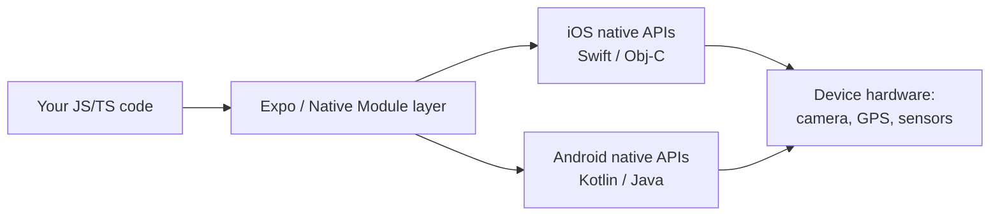
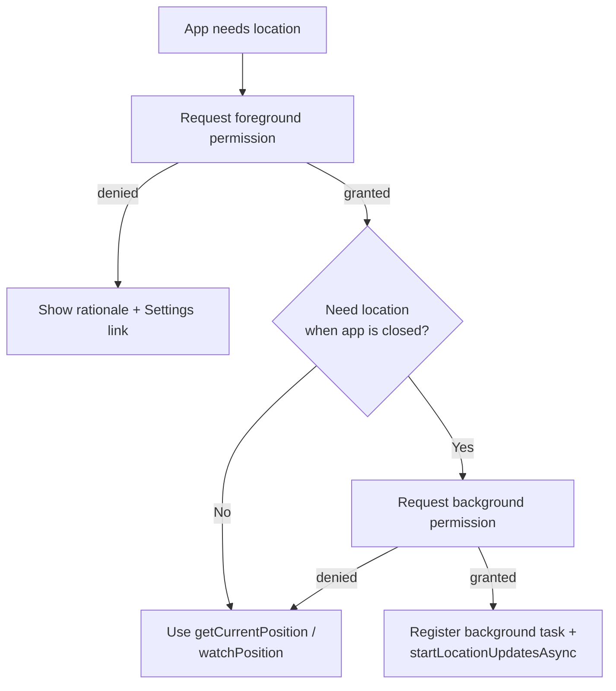
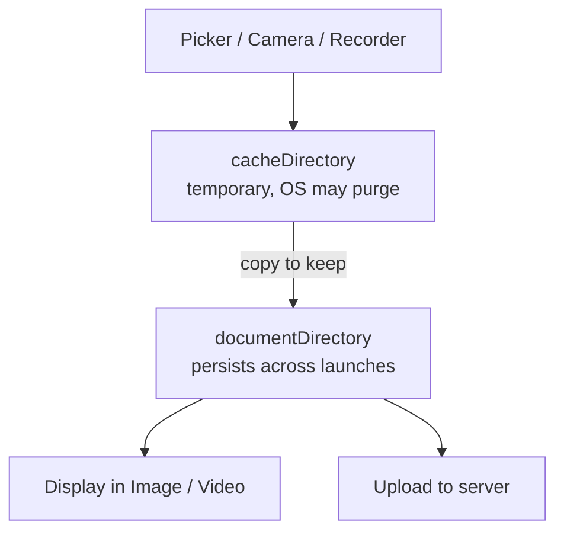
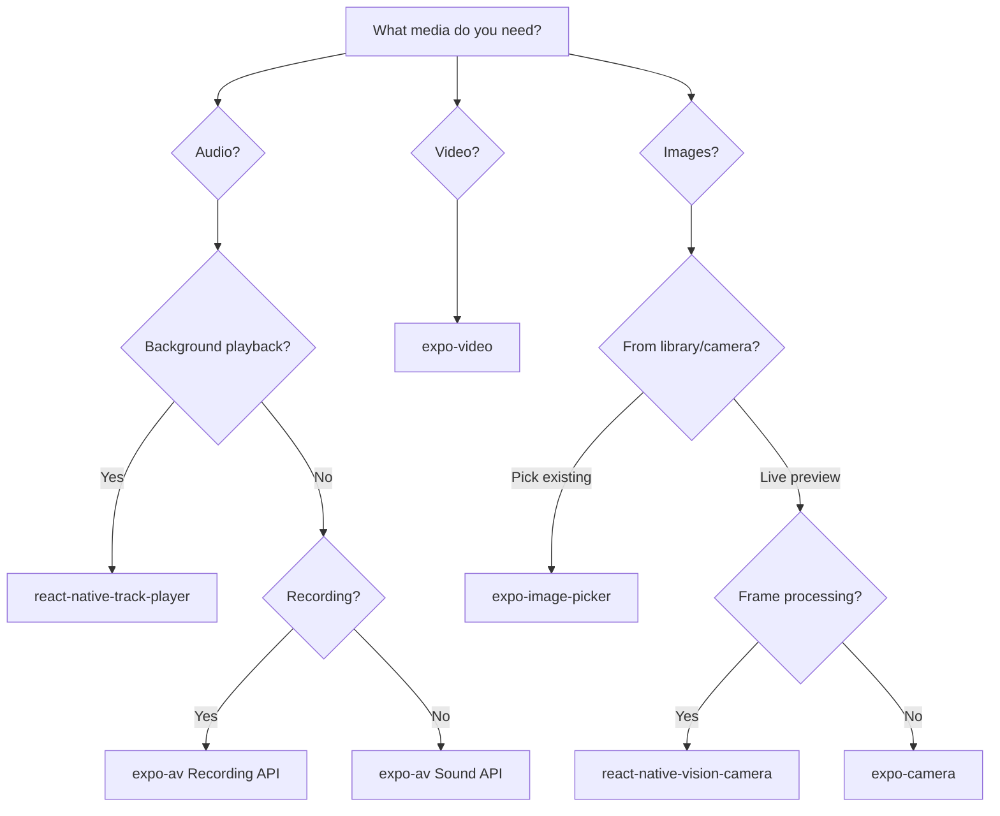
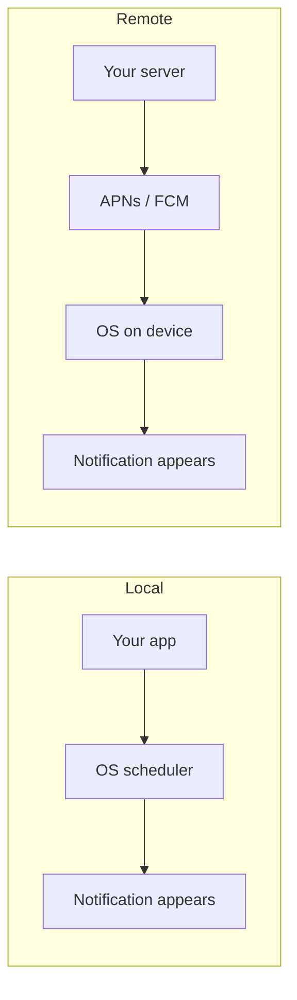
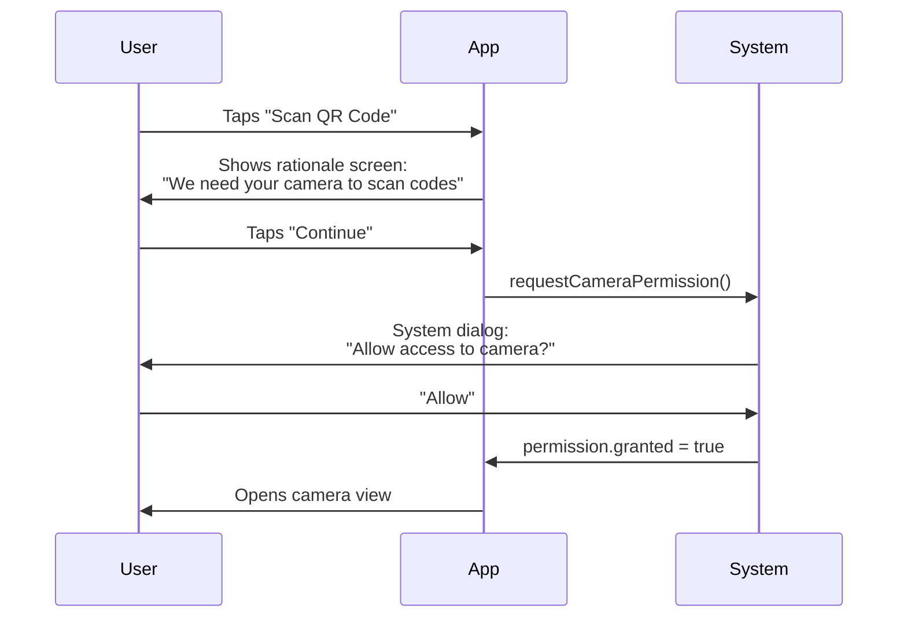
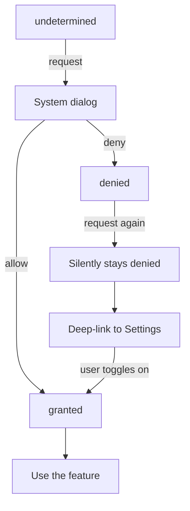

# API natives de l'appareil : le grand saut depuis le web

> Caméra, géolocalisation, biométrie, capteurs et médias — les capacités qui rendent les applications mobiles réellement mobiles.

---

## Table of Contents
1. [Hardware and Sensors](#1-hardware-and-sensors)
2. [Media](#2-media)
3. [System APIs](#3-system-apis)
4. [Permissions Philosophy](#4-permissions-philosophy)

---

## 1. Matériel et capteurs

Sur le web, l'accès au matériel est une réflexion après coup. Vous pouvez utiliser `navigator.geolocation` ou l'expérimental `DeviceMotionEvent`, mais vous luttez en permanence contre des API de navigateur sous sandbox qui semblent rapportées — verrouillées derrière HTTPS, bridées et inégalement supportées d'un navigateur à l'autre. En React Native, le matériel est *l'essence même*. Votre application vit sur un appareil bourré de capteurs, et les utilisateurs s'attendent à ce que vous les utilisiez.

### En quoi l'accès natif au matériel diffère-t-il du web ?

Le changement de mentalité est le suivant : sur le web, le **navigateur** est un arbitre qui se tient entre votre code et le métal. Il expose une part minuscule et délibérément bridée de l'appareil parce que n'importe quel site web pourrait être hostile. Une application native, c'est différent — l'utilisateur a *choisi* de l'installer, l'OS sait exactement de quoi il s'agit (elle est signée et placée sous sandbox par identité d'application, et non par origine), et l'OS peut donc confier des capacités bien plus puissantes, encadrées par des **demandes de permission explicites et propres à chaque fonctionnalité** plutôt que par un vague « ce site veut connaître votre position ».

Ainsi, au lieu d'un unique espace de noms anémique `navigator.*`, vous disposez de tout un écosystème de modules natifs. La plupart sont exposés via les **packages unifiés d'Expo** (`expo-camera`, `expo-location`, …), qui enveloppent le code Objective-C/Swift et Kotlin/Java propre à chaque plateforme, dans le désordre, derrière une seule API JavaScript propre.



> **Modèle mental** : un module natif est un traducteur. Vous parlez JavaScript ; la caméra de l'appareil parle Swift ou Kotlin. Les packages Expo sont des traducteurs préfabriqués pour le matériel le plus courant, si bien que vous écrivez rarement du code natif vous-même.

Passons en revue les principaux.

### Caméra

Pour la plupart des applications, **expo-camera** vous offre un aperçu en direct et une capture photo/vidéo de base avec une configuration minimale. Mais si vous construisez quoi que ce soit de niveau production — lecture de codes-barres, traitement d'images, superpositions de ML — tournez-vous vers **react-native-vision-camera**. C'est la référence absolue.

```tsx
import { CameraView, useCameraPermissions } from 'expo-camera';
import { useState } from 'react';
import { Button, View, StyleSheet } from 'react-native';

export default function CameraScreen() {
  const [permission, requestPermission] = useCameraPermissions();
  const [facing, setFacing] = useState<'front' | 'back'>('back');

  if (!permission) return <View />; // permissions still loading

  if (!permission.granted) {
    return (
      <View style={styles.container}>
        <Button title="Grant Camera Access" onPress={requestPermission} />
      </View>
    );
  }

  return (
    <CameraView style={styles.camera} facing={facing}>
      <Button
        title="Flip"
        onPress={() => setFacing(f => (f === 'back' ? 'front' : 'back'))}
      />
    </CameraView>
  );
}

const styles = StyleSheet.create({
  container: { flex: 1, justifyContent: 'center' },
  camera: { flex: 1 },
});
```

La capture d'une vraie photo s'appuie sur une ref vers la caméra :

```tsx
import { CameraView } from 'expo-camera';
import { useRef } from 'react';

function Capture() {
  const cameraRef = useRef<CameraView>(null);

  const takePhoto = async () => {
    // Returns a local URI plus width/height and (optionally) base64
    const photo = await cameraRef.current?.takePictureAsync({ quality: 0.7 });
    console.log(photo?.uri); // file:///.../Camera/abc.jpg
  };

  return <CameraView ref={cameraRef} style={{ flex: 1 }} />;
}
```

**expo-camera vs react-native-vision-camera** — choisir le bon outil :

| Bibliothèque | Points forts | Limites | Quand l'utiliser |
|---|---|---|---|
| **expo-camera** | Aucune configuration native dans Expo, photo/vidéo simple, lecture basique de codes-barres | Pas de frame processors, moins de contrôle sur le format/FPS | Photo de profil, capture de document, scan occasionnel |
| **react-native-vision-camera** | Frame processors (exécutent du JS par image), superpositions ML/QR/visage, contrôle fin du format | Configuration plus ardue, nécessite un dev build (pas d'Expo Go) | Scan en temps réel, AR, ML embarqué, tout ce qui est critique en performance |

> **Piège** : sur Android, l'aperçu de la caméra peut planter si vous le montez avant que les permissions ne soient accordées. Verrouillez toujours le `<CameraView>` derrière une vérification de permission.

> **Comparaison avec le web** : sur le web, vous utiliseriez `navigator.mediaDevices.getUserMedia()` et achemineriez un `MediaStream` vers un élément `<video>`. En RN, il n'y a pas de DOM — `<CameraView>` est une vue native, et vous récupérez les images via une ref, et non un canvas.

### Géolocalisation

**expo-location** gère à la fois le suivi en premier plan (foreground) et en arrière-plan (background). Le premier plan est simple — demandez la permission, obtenez les coordonnées. C'est la géolocalisation en arrière-plan qui devient délicate : iOS et Android la brident tous deux agressivement (pour économiser la batterie), et vous devez déclarer une tâche d'arrière-plan enregistrée.

```tsx
import * as Location from 'expo-location';

// Foreground — simple one-shot
async function getPosition() {
  const { status } = await Location.requestForegroundPermissionsAsync();
  if (status !== 'granted') return null;

  return Location.getCurrentPositionAsync({
    accuracy: Location.Accuracy.High,
  });
}

// Foreground — continuous stream (like watchPosition on the web)
async function watch(onMove: (coords: Location.LocationObjectCoords) => void) {
  const sub = await Location.watchPositionAsync(
    { accuracy: Location.Accuracy.Balanced, distanceInterval: 10 },
    (loc) => onMove(loc.coords)
  );
  return sub; // call sub.remove() to stop
}

// Background — requires additional config in app.json
async function startBackgroundTracking() {
  const { status } = await Location.requestBackgroundPermissionsAsync();
  if (status !== 'granted') return;

  await Location.startLocationUpdatesAsync('BACKGROUND_LOCATION_TASK', {
    accuracy: Location.Accuracy.Balanced,
    distanceInterval: 50, // meters
    showsBackgroundLocationIndicator: true, // iOS blue bar
  });
}
```

La permission de premier plan vs arrière-plan suit un flux en **deux étapes** sur les OS modernes — vous devez d'abord mériter l'accès en premier plan, puis demander séparément à être promu en arrière-plan (« Toujours autoriser ») :



Le réglage de la précision est un arbitrage direct **batterie vs précision** — une précision plus élevée maintient la puce GPS alimentée plus longtemps :

| Niveau de précision | Approximativement | Coût en batterie | Usage typique |
|---|---|---|---|
| `Lowest` / `Low` | ~1–3 km (réseau cellulaire/wifi) | Minime | Météo, détection de région |
| `Balanced` | ~100 m | Modéré | Lieux à proximité, geofencing |
| `High` | ~10 m | Élevé | Cartes, itinéraires |
| `BestForNavigation` | Le meilleur possible | Le plus élevé | Navigation tour par tour |

> **Comparaison avec le web** : `navigator.geolocation.watchPosition` ne vous fournit que des mises à jour en premier plan. Il n'existe aucun équivalent web à la géolocalisation en arrière-plan — un site web est tué dès que son onglet se ferme. Le suivi en arrière-plan est purement du domaine natif, et c'est précisément pour cela que les applications de VTC et de fitness doivent être natives.

> **Astuce de pro** : la géolocalisation en arrière-plan est la permission la plus scrutée lors de la validation sur l'App Store et le Play Store. Si votre application demande « Toujours autoriser », vous devez présenter une fonctionnalité concrète et continue (suivi de trajet en direct, rappels géolocalisés). Un « peut-être utile plus tard » se fait rejeter.

### Capteurs de mouvement

**expo-sensors** vous donne accès à l'accéléromètre, au gyroscope, au magnétomètre, au baromètre et au podomètre. Chacun suit le même schéma **abonnement/désabonnement** — vous ajoutez un listener qui se déclenche à intervalle régulier, et vous *devez* le retirer lors du nettoyage, sans quoi il continue de vider la batterie en arrière-plan.

Ce que chaque capteur mesure réellement :

| Capteur | Mesure | Exemple d'usage |
|---|---|---|
| Accéléromètre | Accélération linéaire, gravité incluse (x/y/z en g) | Secouer pour annuler, comptage de pas, inclinaison |
| Gyroscope | Vitesse de rotation autour de chaque axe | Visionneuses de photos à 360°, jeux, stabilisation AR |
| Magnétomètre | Champ magnétique → cap de la boussole | Boussole, orientation de carte |
| Baromètre | Pression atmosphérique → altitude relative | Étages gravis, dénivelé de randonnée |
| Podomètre | Comptage de pas calculé par l'OS | Trackers de fitness |

```tsx
import { Accelerometer } from 'expo-sensors';
import { useEffect, useState } from 'react';

export function useShakeDetection(threshold = 1.8) {
  const [shook, setShook] = useState(false);

  useEffect(() => {
    Accelerometer.setUpdateInterval(100); // ms between readings
    const sub = Accelerometer.addListener(({ x, y, z }) => {
      // Magnitude of the acceleration vector; ~1.0 at rest (gravity)
      const force = Math.sqrt(x * x + y * y + z * z);
      if (force > threshold) setShook(true);
    });
    return () => sub.remove(); // CRITICAL: stop the sensor on unmount
  }, [threshold]);

  return shook;
}
```

> **Piège** : oublier `sub.remove()` est le bug de capteur n°1. Le listener survit au composant, maintient le capteur alimenté et grignote silencieusement la batterie. Sur le web, l'analogue est d'oublier de faire `removeEventListener('devicemotion', …)` — même type de fuite, mais des conséquences bien plus lourdes sur un téléphone.

> **Astuce de pro** : ne réglez pas l'intervalle de mise à jour plus bas que nécessaire. `16ms` (~60fps) est parfait pour un jeu, mais massacre la batterie pour un compteur de pas qui n'a besoin que de `1000ms`.

### Biométrie

**expo-local-authentication** enveloppe Face ID, Touch ID et Android BiometricPrompt derrière un seul appel. Il ne stocke pas de secrets — il confirme simplement « c'est bien le propriétaire de l'appareil ». Pour le stockage effectif d'identifiants, associez-le à **expo-secure-store** (qui conserve les valeurs dans le Keychain d'iOS / le Keystore d'Android).

```tsx
import * as LocalAuthentication from 'expo-local-authentication';

async function authenticate() {
  // 1. Does the device even have biometric hardware?
  const hasHardware = await LocalAuthentication.hasHardwareAsync();
  if (!hasHardware) return false;

  // 2. Has the user enrolled a face/fingerprint?
  const isEnrolled = await LocalAuthentication.isEnrolledAsync();
  if (!isEnrolled) return false;

  // 3. Prompt
  const result = await LocalAuthentication.authenticateAsync({
    promptMessage: 'Confirm your identity',
    fallbackLabel: 'Use passcode', // shown if biometrics fail
  });

  return result.success;
}
```

Associer la biométrie au stockage sécurisé pour verrouiller un token enregistré :

```tsx
import * as SecureStore from 'expo-secure-store';

// Save once, after login
await SecureStore.setItemAsync('authToken', token);

// Later: unlock with biometrics, THEN read the secret
async function getTokenIfVerified() {
  const ok = await authenticate();
  if (!ok) return null;
  return SecureStore.getItemAsync('authToken');
}
```

> **Piège** : la biométrie prouve la *présence du propriétaire de l'appareil*, pas une identité côté serveur. Ne traitez jamais un Face ID réussi comme un « connecté » en soi — il déverrouille un token que vous aviez déjà stocké ; il n'authentifie pas auprès de votre backend.

> **Comparaison avec le web** : l'analogue web le plus proche est WebAuthn / les passkeys, qui sont puissants mais bien plus complexes à mettre en place. En RN, la vérification biométrique tient en un seul appel `authenticateAsync()`.

### Retour haptique

Le retour haptique fait la différence entre une application qui donne une sensation native et une autre qui ressemble à une web view. **expo-haptics** vous offre trois niveaux d'impact : léger, moyen, fort — ainsi que des motifs de notification (succès, avertissement, erreur).

```tsx
import * as Haptics from 'expo-haptics';

// On a successful action (a distinct "ta-da" pattern)
Haptics.notificationAsync(Haptics.NotificationFeedbackType.Success);

// On a button press (a single subtle tap)
Haptics.impactAsync(Haptics.ImpactFeedbackStyle.Light);

// On an error
Haptics.notificationAsync(Haptics.NotificationFeedbackType.Error);
```

| Appel | Sensation | À utiliser pour |
|---|---|---|
| `impactAsync(Light)` | Petite tape | Interrupteur à bascule, sélection |
| `impactAsync(Medium/Heavy)` | Choc plus ferme | Appui sur un bouton, accroche de glisser |
| `notificationAsync(Success)` | Vibration positive en deux temps | Paiement effectué, sauvegarde réussie |
| `notificationAsync(Warning/Error)` | Vibration d'alerte sèche | Action échouée, saisie invalide |

> **Opinion** : ajoutez du retour haptique à *chaque* confirmation d'action destructive et à chaque interrupteur à bascule. C'est une ligne de code qui améliore radicalement la qualité perçue.

> **Piège** : le retour haptique est sans effet sur la plupart des émulateurs Android et sur le simulateur iOS — il ne se déclenche que sur du matériel réel. Ne supposez pas qu'il est « cassé » parce que vous ne ressentez rien dans le simulateur.

---

## 2. Médias

Les développeurs web sont habitués à `<input type="file">` et à la balise `<video>`. En React Native, les médias sont plus riches, plus complexes et plus puissants — et un thème récurrent apparaît immédiatement : **les médias existent sous forme de fichiers sur le disque, référencés par une chaîne `uri`**, et non comme des éléments du DOM ou des `Blob` en mémoire.

### Le modèle mental de l'URI

Presque chaque API de médias en RN vous renvoie une chaîne du genre `file:///var/mobile/.../IMG_0001.jpg`. Cette URI n'est qu'un pointeur vers un fichier situé dans l'une des zones de stockage de l'appareil. Comprendre *quelle* zone est concernée a son importance, car certaines sont temporaires et l'OS peut les supprimer à tout moment :



> **Modèle mental** : sur le web, un fichier sélectionné est un `File`/`Blob` que vous gardez en mémoire JS. En RN, c'est un *chemin vers un fichier sur le disque*. Si vous en avez besoin après cette session, vous devez le copier vous-même du cache temporaire vers `documentDirectory`.

### Sélecteur d'images

**expo-image-picker** permet aux utilisateurs de choisir dans leur photothèque ou de prendre une nouvelle photo. Il renvoie une URI locale que vous pouvez afficher ou téléverser.

```tsx
import * as ImagePicker from 'expo-image-picker';
import { Image, Button, View } from 'react-native';
import { useState } from 'react';

export function AvatarPicker() {
  const [uri, setUri] = useState<string | null>(null);

  const pick = async () => {
    const result = await ImagePicker.launchImageLibraryAsync({
      mediaTypes: ['images'],
      allowsEditing: true, // built-in crop UI
      aspect: [1, 1],      // square crop for an avatar
      quality: 0.8,        // 0–1 JPEG compression
    });

    if (!result.canceled) {
      setUri(result.assets[0].uri);
    }
  };

  return (
    <View>
      {uri && <Image source={{ uri }} style={{ width: 120, height: 120 }} />}
      <Button title="Choose Photo" onPress={pick} />
    </View>
  );
}
```

Pour ouvrir la caméra plutôt que la photothèque, remplacez un seul appel :

```tsx
// Same shape of result, but launches the camera
const result = await ImagePicker.launchCameraAsync({ quality: 0.8 });
```

> **Piège** : l'URI renvoyée est temporaire sur iOS. Si vous devez la conserver, copiez le fichier vers le répertoire de documents de votre application à l'aide d'`expo-file-system` avant que l'OS ne le récupère.

> **Comparaison avec le web** : `launchImageLibraryAsync` est le cousin spirituel de `<input type="file" accept="image/*">`, mais il vous offre aussi gratuitement une UI native de recadrage/édition et les données EXIF — des choses que vous auriez dû fabriquer à la main sur le web.

### Audio

Pour de la lecture simple (effets sonores, courts extraits), **expo-av** fait l'affaire. Pour tout ce qui ressemble à un lecteur de musique — lecture en arrière-plan, contrôles sur l'écran verrouillé, gestion de file d'attente — utilisez **react-native-track-player**. La question ne se pose même pas ; `expo-av` n'a jamais été conçu pour l'audio en arrière-plan.

```tsx
// Simple sound effect with expo-av
import { Audio } from 'expo-av';

async function playSound() {
  const { sound } = await Audio.Sound.createAsync(
    require('./assets/notification.mp3')
  );
  await sound.playAsync();
  // Don't forget cleanup — an unloaded sound leaks native memory
  sound.setOnPlaybackStatusUpdate((status) => {
    if (status.isLoaded && status.didJustFinish) {
      sound.unloadAsync();
    }
  });
}
```

> **Note** : `expo-av` est en cours de scission en `expo-audio` et `expo-video` dans les SDK plus récents. Les concepts sont identiques — un objet `Sound` que vous chargez, lisez et devez décharger — mais vérifiez votre version de SDK pour l'import exact.

| Bibliothèque | Lecture en arrière-plan | Contrôles sur écran verrouillé | File d'attente | Quand l'utiliser |
|---|---|---|---|---|
| **expo-av / expo-audio** | Non | Non | Non | Effets sonores, courts extraits, retour d'UI |
| **react-native-track-player** | Oui | Oui | Oui | Lecteurs de podcasts/musique, livres audio |

### Vidéo

**expo-video** est le remplaçant moderne du composant vidéo d'expo-av. Il vous offre un lecteur natif avec contrôles, prise en charge du picture-in-picture et capacités DRM.

```tsx
import { useVideoPlayer, VideoView } from 'expo-video';
import { StyleSheet } from 'react-native';

export function VideoScreen() {
  // The player is an imperative object you create once and reuse
  const player = useVideoPlayer(
    'https://example.com/video.mp4',
    (player) => {
      player.loop = true;
      player.play(); // autoplay
    }
  );

  return <VideoView style={styles.video} player={player} allowsPictureInPicture />;
}

const styles = StyleSheet.create({
  video: { width: '100%', aspectRatio: 16 / 9 },
});
```

> **Comparaison avec le web** : sur le web, `<video src="…" controls>` est entièrement déclaratif. En RN, vous créez un **objet lecteur** impératif avec `useVideoPlayer` et vous l'attachez à un `<VideoView>`. Cette séparation existe parce qu'un même lecteur peut piloter à la fois le picture-in-picture, les contrôles sur écran verrouillé et la vue à l'écran.

### Enregistrement audio

**expo-av** gère aussi l'enregistrement. Le détail crucial : vous devez configurer le mode audio *avant* de lancer l'enregistrement, sinon iOS échouera silencieusement ou produira un résultat brouillé — iOS traite « lecture » et « enregistrement » comme des sessions audio distinctes et ne laissera pas accéder au micro tant que vous ne le demandez pas.

```tsx
import { Audio } from 'expo-av';

async function startRecording() {
  await Audio.requestPermissionsAsync(); // microphone permission
  await Audio.setAudioModeAsync({
    allowsRecordingIOS: true,   // unlock the mic on iOS
    playsInSilentModeIOS: true, // record even if silent switch is on
  });

  const { recording } = await Audio.Recording.createAsync(
    Audio.RecordingOptionsPresets.HIGH_QUALITY
  );
  return recording;
}

async function stopRecording(recording: Audio.Recording) {
  await recording.stopAndUnloadAsync();
  const uri = recording.getURI(); // local file path (in cacheDirectory)
  return uri;
}
```

> **Piège** : l'enregistrement atterrit dans le répertoire de cache temporaire. Conformément au modèle mental de l'URI ci-dessus, copiez-le vers `documentDirectory` (ou téléversez-le immédiatement) si vous en avez besoin plus tard.

Voici une carte de décision pour choisir la bonne bibliothèque de médias :



---

## 3. API système

C'est ici que le mobile diverge véritablement du web. Le navigateur vous offre les cookies, le localStorage et fetch. Un appareil mobile vous donne accès à tout le système d'exploitation — les contacts de l'utilisateur, son calendrier, le presse-papiers système, le système de fichiers, la feuille de partage, l'imprimante. Chacun est un module natif verrouillé par sa propre permission.

### Contacts et calendrier

**expo-contacts** et **expo-calendar** vous permettent de lire et d'écrire dans le carnet d'adresses et le calendrier de l'appareil. Tous deux exigent des permissions explicites, et tous deux renvoient des données riches et structurées.

```tsx
import * as Contacts from 'expo-contacts';

async function getFirstContact() {
  const { status } = await Contacts.requestPermissionsAsync();
  if (status !== 'granted') return null;

  const { data } = await Contacts.getContactsAsync({
    // Only request the fields you need — fetching everything is slow
    fields: [Contacts.Fields.Emails, Contacts.Fields.PhoneNumbers],
    pageSize: 1,
  });

  return data[0];
}
```

L'écriture d'un événement dans le calendrier suit le même schéma « permission puis action » :

```tsx
import * as Calendar from 'expo-calendar';

async function addEvent(calendarId: string) {
  const { status } = await Calendar.requestCalendarPermissionsAsync();
  if (status !== 'granted') return;

  await Calendar.createEventAsync(calendarId, {
    title: 'Dentist',
    startDate: new Date('2026-07-01T09:00:00'),
    endDate: new Date('2026-07-01T09:30:00'),
    timeZone: 'Europe/Paris',
  });
}
```

> **Astuce de pro** : ne demandez que les `fields` de contact que vous utilisez réellement. Récupérer chaque champ pour un carnet d'adresses de 5 000 contacts est sensiblement lent et signale aux relecteurs soucieux de la confidentialité que vous en demandez trop.

### Notifications

Les notifications push sont la fonctionnalité phare du mobile. **expo-notifications** gère à la fois les notifications **locales** (programmées par l'application, sans serveur) et **distantes** (envoyées depuis votre serveur). La configuration est simple pour les locales, mais les notifications distantes nécessitent de configurer FCM (Android) et APNs (iOS).

```tsx
import * as Notifications from 'expo-notifications';

// Schedule a local notification — fires entirely on-device
async function scheduleReminder() {
  await Notifications.requestPermissionsAsync();
  await Notifications.scheduleNotificationAsync({
    content: {
      title: 'Time to stretch',
      body: "You've been coding for 2 hours.",
    },
    trigger: {
      type: Notifications.SchedulableTriggerInputTypes.TIME_INTERVAL,
      seconds: 7200,
    },
  });
}
```

La différence entre local et distant tient à *qui décide du moment de déclenchement* :



| Type | Source du déclenchement | Nécessite un serveur ? | Nécessite une configuration APNs/FCM ? | Exemple |
|---|---|---|---|---|
| **Locale** | L'application, sur l'appareil | Non | Non | « Rappel d'étirement dans 2 h » |
| **Distante (push)** | Votre backend | Oui | Oui | « Vous avez un nouveau message » |

> **Comparaison avec le web** : l'API Web Push existe, mais son adoption est inégale et l'UX est hostile (les navigateurs découragent activement les demandes de notification, et iOS Safari ne l'a ajoutée que récemment et à contrecœur). Sur mobile, les notifications sont un citoyen de première classe et un canal de réengagement majeur.

### Presse-papiers, système de fichiers et partage

Ce sont des one-liners, mais ils comptent :

```tsx
// Clipboard
import * as Clipboard from 'expo-clipboard';
await Clipboard.setStringAsync('Copied text');
const text = await Clipboard.getStringAsync();

// File System
import * as FileSystem from 'expo-file-system';
const content = await FileSystem.readAsStringAsync(fileUri);
await FileSystem.writeAsStringAsync(
  FileSystem.documentDirectory + 'data.json',
  JSON.stringify(myData)
);
// Copy a temporary picked file somewhere permanent
await FileSystem.copyAsync({
  from: tempUri,
  to: FileSystem.documentDirectory + 'avatar.jpg',
});

// Sharing — opens the native share sheet
import * as Sharing from 'expo-sharing';
await Sharing.shareAsync(fileUri, {
  mimeType: 'application/pdf',
  dialogTitle: 'Share report',
});
```

> **Comparaison avec le web** : `expo-clipboard` reflète `navigator.clipboard`, et `Sharing.shareAsync` est le cousin natif de l'API Web Share (`navigator.share`) — sauf que sur mobile il est universellement supporté et fait apparaître la feuille de partage complète de l'OS (AirDrop, Messages, chaque application installée).

### Sélecteur de documents et impression

**expo-document-picker** est l'équivalent mobile de `<input type="file">`, et **expo-print** vous permet de générer des PDF et de les envoyer à une imprimante ou de les enregistrer en tant que fichier.

```tsx
import * as DocumentPicker from 'expo-document-picker';
import * as Print from 'expo-print';

// Pick a document — copyToCacheDirectory makes the URI readable by your app
const result = await DocumentPicker.getDocumentAsync({
  type: 'application/pdf',
  copyToCacheDirectory: true,
});

// Generate and print a PDF from HTML
await Print.printAsync({
  html: '<h1>Invoice #1234</h1><p>Total: $99.00</p>',
});

// Or render the HTML to a PDF file you can share/upload
const { uri } = await Print.printToFileAsync({
  html: '<h1>Invoice #1234</h1><p>Total: $99.00</p>',
});
```

> **Erreur courante** : supposer que les URI de fichiers sont stables. Sur les deux plateformes, les fichiers sélectionnés via un sélecteur de documents ou d'images peuvent résider dans des répertoires temporaires. Copiez-les toujours vers `FileSystem.documentDirectory` si vous en avez besoin au-delà de la session en cours.

---

## 4. Philosophie des permissions

C'est la section que la plupart des tutoriels survolent, et c'est celle qui fait rejeter les applications de l'App Store. Les permissions ne sont pas un obstacle technique à franchir — ce sont une **conversation** avec l'utilisateur, et la manière dont vous formulez cette conversation détermine s'il dira oui.

### Pourquoi les permissions sont un problème d'UX, pas un problème de code

Voici le mécanisme qui rend ce point si important : **l'OS ne vous accorde qu'une seule bonne tentative.** Lorsque vous appelez `requestPermission()`, le système affiche sa propre boîte de dialogue — un texte que vous ne pouvez quasiment pas personnaliser, deux boutons. Si l'utilisateur touche « Refuser », cette réponse est *persistante*. Sur iOS, rappeler request ne fait rien ; la boîte de dialogue ne réapparaît jamais. Sur Android, vous avez une seconde chance, puis « Ne plus demander » verrouille tout. Il n'existe pas de « demande-moi plus tard » qui re-sollicite réellement. Ainsi, chaque demande gaspillée est une permission que vous risquez d'avoir perdue à jamais — et votre seule voie de récupération consiste à supplier l'utilisateur de fouiller dans les Réglages.

Cette asymétrie est la raison pour laquelle le timing et la formulation priment. Vous n'écrivez pas une simple vérification `if` ; vous dépensez une ressource non renouvelable.

### La règle d'or : juste à temps

Ne demandez jamais de permissions au lancement. Jamais. Pas même si vous en « avez besoin ». L'utilisateur vient tout juste d'ouvrir votre application pour la première fois — il n'a aucun contexte pour comprendre pourquoi vous voulez sa caméra, sa position et ses contacts. Le taux de refus des demandes de permission présentées d'emblée dépasse 50 %.

Au lieu de cela, demandez les permissions au *moment de l'intention*. L'utilisateur touche le bouton caméra ? C'est maintenant qu'il faut demander l'accès à la caméra. Il ouvre l'onglet carte ? C'est maintenant qu'il faut demander la position. Le contexte rend la demande explicite d'elle-même.



> **Comparaison avec le web** : les navigateurs ont appris cette leçon à la dure — les sites qui demandent les notifications/la position au chargement se font auto-bloquer par Chrome et ont entraîné les utilisateurs à refuser par réflexe. Les stores mobiles imposent la même étiquette, sauf qu'ici une mauvaise demande peut faire rejeter toute votre application.

### L'écran d'explication

iOS et Android vous accordent chacun exactement une seule tentative pour la boîte de dialogue de permission système (Android en accorde deux avant que « Ne plus demander » ne s'enclenche). C'est pourquoi vous présentez d'abord un *écran d'explication* — une interface personnalisée **que vous contrôlez entièrement** qui explique pourquoi vous avez besoin de la permission, avec un énoncé de bénéfice clair, *avant* de déclencher l'irréversible demande système.

```tsx
import { Alert } from 'react-native';
import * as Location from 'expo-location';

async function requestLocationWithRationale() {
  const { status: existing } = await Location.getForegroundPermissionsAsync();

  if (existing === 'granted') return true;

  // Show YOUR rationale before the system's one-shot prompt
  const userAccepted = await new Promise<boolean>((resolve) => {
    Alert.alert(
      'Location Access',
      'We use your location to show nearby restaurants. Your location is never shared or stored on our servers.',
      [
        { text: 'Not Now', onPress: () => resolve(false) },
        { text: 'Enable', onPress: () => resolve(true) },
      ]
    );
  });

  if (!userAccepted) return false;

  const { status } = await Location.requestForegroundPermissionsAsync();
  return status === 'granted';
}
```

> **Astuce de pro** : l'écran d'explication protège aussi votre « unique tentative ». Si l'utilisateur touche « Pas maintenant » sur *votre* écran, vous ne déclenchez jamais la demande système — elle reste donc disponible pour plus tard, quand il sera plus motivé. Vous ne dépensez la vraie demande que sur les utilisateurs ayant déjà dit « oui » à la sollicitation douce.

### Gérer « Ne plus demander »

Une fois qu'un utilisateur sélectionne « Ne plus demander » (Android) ou refuse sur iOS, appeler `requestPermissionsAsync()` renverra silencieusement `denied` sans afficher la moindre boîte de dialogue. Votre seule option est de faire un deep link vers la page de réglages de l'application pour qu'il puisse l'activer manuellement.

```tsx
import { Linking, Platform } from 'react-native';
import { View, Text, Button, StyleSheet } from 'react-native';

function openAppSettings() {
  if (Platform.OS === 'ios') {
    Linking.openURL('app-settings:'); // jumps straight to your app's settings
  } else {
    Linking.openSettings();
  }
}

// Use it in your denied state
function PermissionDeniedBanner() {
  return (
    <View style={styles.banner}>
      <Text>Camera access was denied.</Text>
      <Button title="Open Settings" onPress={openAppSettings} />
    </View>
  );
}

const styles = StyleSheet.create({
  banner: { padding: 16 },
});
```

Le cycle de vie complet d'une permission, y compris l'impasse pour laquelle vous devez concevoir :



> **Piège du rejet sur l'App Store** : si vous demandez une permission que votre application n'utilise pas de manière visible, Apple vous rejettera. Chaque clé `NSUsageDescription` de votre `Info.plist` doit correspondre à une fonctionnalité que le relecteur peut déclencher pendant la validation. Cela signifie que votre chaîne de permission caméra a tout intérêt à mener à un véritable écran caméra, et non à un espace réservé « bientôt disponible ».

### États de permission à gérer

Chaque demande de permission peut renvoyer l'un de ces états. Gérez-les tous :

| Statut | Signification | Votre action |
|---|---|---|
| `undetermined` | Jamais demandé | Montrer l'explication, puis demander |
| `granted` | L'utilisateur a dit oui | Poursuivre avec la fonctionnalité |
| `denied` | L'utilisateur a dit non | Montrer une explication + lien « Ouvrir les Réglages » |
| `limited` (iOS) | Accès partiel (p. ex. uniquement les photos sélectionnées) | Faire avec ce que vous avez |

> **Piège** : n'oubliez pas `limited`. Sur iOS moderne, un utilisateur peut accorder l'accès à *certaines* photos plutôt qu'à toute la photothèque. Un code qui ne vérifie que `granted` traitera cela comme un échec et cassera pour un utilisateur pourtant parfaitement satisfait.

La discipline ici est simple : traitez les permissions comme une fonctionnalité d'UX, et non comme une case technique à cocher. Une demande de permission bien synchronisée et bien expliquée convertit à plus de 85 %. Une volée de demandes paresseuses présentées d'emblée au premier lancement convertit à moins de 40 % et entraîne les utilisateurs à tout refuser par réflexe.

---