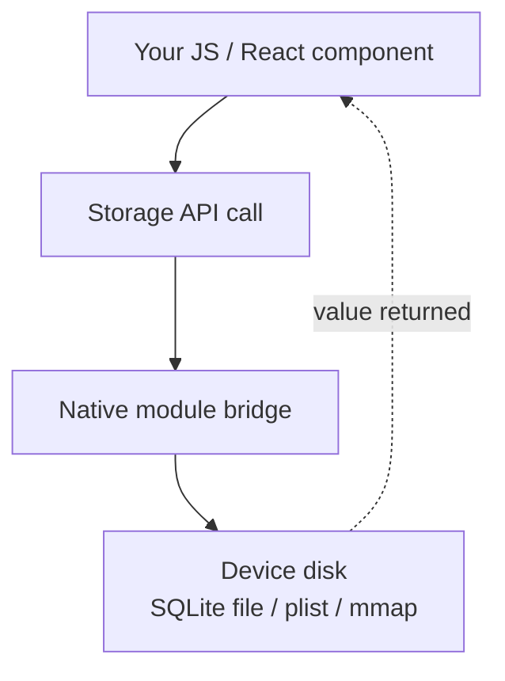
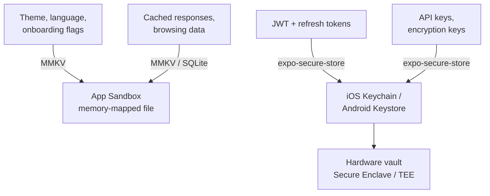
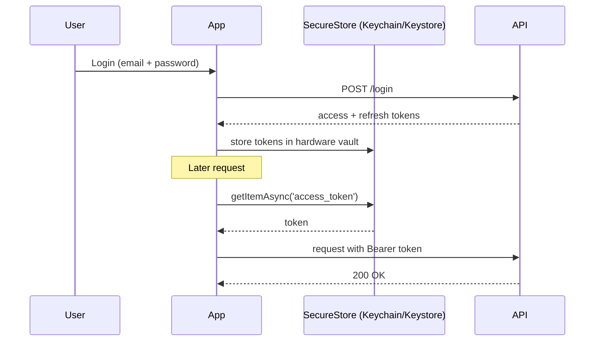
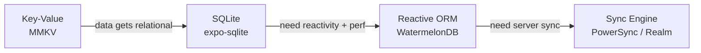
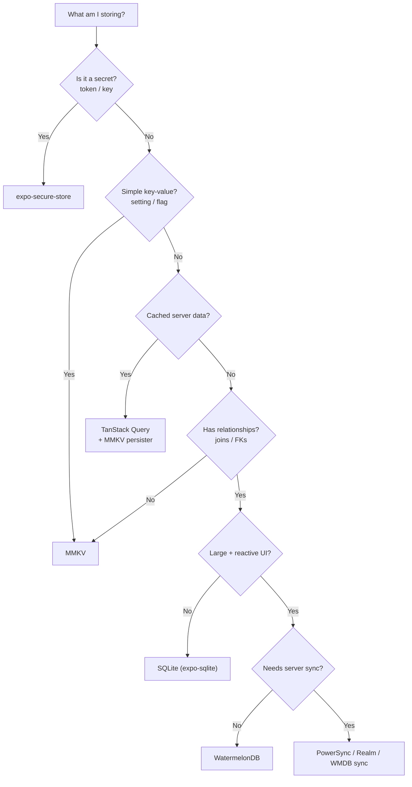

# Stockage et persistance : conserver les données sur l'appareil

> Stores clé-valeur, coffres-forts sécurisés, bases de données relationnelles, et quand utiliser chacun.

---

## Table of Contents
1. [Key-Value Storage](#1-key-value-storage)
2. [Secure Storage](#2-secure-storage)
3. [Relational and Document Storage](#3-relational-and-document-storage)
4. [When to Use What](#4-when-to-use-what)

---

## 1. Le stockage clé-valeur

Sur le web, vous disposez de `localStorage` — synchrone, limité aux chaînes de caractères, environ 5 Mo, et d'une simplicité absolue. Vous appelez `localStorage.getItem('key')` et la valeur est *immédiatement là*, sans attente. React Native n'a pas de `localStorage`. Il n'y a pas de navigateur, pas de `window`, pas de DOM, et donc pas d'API Web Storage. Votre JavaScript s'exécute à l'intérieur d'une application native, et la seule façon d'accéder au disque passe par un **module natif** — un pont vers le code de la plateforme (Objective-C/Swift sur iOS, Java/Kotlin sur Android). Il vous faut donc un remplaçant natif, et l'écosystème vous offre deux véritables options : **AsyncStorage** et **MMKV**.

### Pourquoi le « clé-valeur » d'abord ?

Considérez le stockage clé-valeur comme un dictionnaire unique, à l'échelle de toute l'application, qui survit aux redémarrages — un `Map<string, value>` écrit sur disque. C'est la forme de persistance la plus simple qui soit : pas de schéma, pas de tables, pas de requêtes. Vous placez quelque chose sous un nom, et vous le récupérez par ce nom. C'est parfait pour de petites données plates : « quel est le thème de l'utilisateur ? », « a-t-il terminé l'onboarding ? », « combien de fois a-t-il ouvert l'application ? ». Dès l'instant où vos données acquièrent des relations (des tâches qui appartiennent à des projets qui appartiennent à des utilisateurs), le stockage clé-valeur cesse d'être adapté — mais c'est le problème de la section 3.



### AsyncStorage : l'ancien choix par défaut

`@react-native-async-storage/async-storage` est le successeur spirituel de l'ancien `AsyncStorage` du cœur de React Native, qui était fourni avec celui-ci avant d'être extrait dans un package communautaire. Il fonctionne, il est stable, et on le retrouve partout dans les tutoriels. Mais vous devriez savoir à quoi vous vous engagez.

Il sérialise tout en chaînes JSON et les écrit dans une table SQLite sur Android, ou dans un fichier adossé à un plist sur iOS. Chaque opération est **asynchrone**, ce qui signifie que chaque lecture est une promesse que vous devez `await`. Pourquoi asynchrone ? Parce que l'ancienne architecture de React Native communiquait avec le code natif via un « pont » asynchrone — le JS et le natif s'exécutaient sur des threads distincts et s'échangeaient des messages, de sorte que rien de natif ne pouvait être lu instantanément. Pour une préférence de thème ou un réglage de langue, cette taxe asynchrone provoque un **flash de l'état par défaut** au lancement de l'application : votre composant se monte avec la valeur par défaut, *puis* la valeur stockée arrive quelques millisecondes plus tard et l'interface bascule brusquement vers celle-ci. Vous passerez un temps non négligeable à masquer ce scintillement.

```tsx
import AsyncStorage from '@react-native-async-storage/async-storage';

// Write — returns a Promise, must await
await AsyncStorage.setItem('user_language', 'fr');

// Read — always a Promise, value is string | null
const lang = await AsyncStorage.getItem('user_language');

// Store objects — you serialize manually, there is no "setObject"
await AsyncStorage.setItem('preferences', JSON.stringify({ theme: 'dark', fontSize: 16 }));
const prefs = JSON.parse((await AsyncStorage.getItem('preferences')) ?? '{}');

// Batch operations (one round-trip instead of N)
await AsyncStorage.multiSet([
  ['onboarded', 'true'],
  ['last_sync', new Date().toISOString()],
]);

// Read many keys at once
const pairs = await AsyncStorage.multiGet(['onboarded', 'last_sync']);
// pairs = [['onboarded', 'true'], ['last_sync', '2026-06-19T...']]
```

Notez la friction : tout est une chaîne, donc les booléens et les nombres doivent être convertis en chaînes (`'true'`, et non `true`) puis reparsés. Cela fonctionne. Mais c'est lent — les benchmarks montrent 5 à 10 ms par lecture sur les appareils modernes — et le motif tout-asynchrone se propage dans chaque composant qui y lit, vous forçant à des contorsions `useEffect` + `useState` rien que pour afficher un réglage enregistré.

> **Comparaison avec le web** : `localStorage.getItem()` est synchrone et renvoie instantanément. `AsyncStorage.getItem()` renvoie une Promise. Si vous portez mentalement du code web à l'identique, chaque lecture de stockage nécessite soudain un `await` — et tout chemin de code qui n'était pas déjà asynchrone doit le devenir. Cet effet de propagation surprend les débutants.

### MMKV : le choix par défaut en 2026

**react-native-mmkv** enveloppe la bibliothèque MMKV de Tencent — un store clé-valeur mappé en mémoire, conçu à l'origine pour WeChat afin de gérer des milliards de lectures. Le « mappage en mémoire » (`mmap`) est l'astuce : le système d'exploitation mappe le fichier de stockage directement dans l'espace d'adressage mémoire de l'application, si bien que lire une valeur revient essentiellement à lire la RAM. Il n'y a pas d'aller-retour via un pont asynchrone, pas de taxe de parsing JSON pour les primitives — la valeur est déjà en mémoire. Les différences sont significatives :

| | AsyncStorage | MMKV |
|---|---|---|
| **Vitesse** | ~5-10 ms/lecture | ~0,01 ms/lecture (mappé en mémoire) |
| **API** | Asynchrone (Promises) | **Synchrone** |
| **Types** | Chaînes uniquement (JSON.stringify) | String, number, boolean, Buffer |
| **Chiffrement** | Non | AES-128, AES-256 |
| **Limite de taille** | ~6 Mo par défaut sur Android | Limité par le disque |
| **Multi-processus** | Non | Oui (p. ex. partage avec un widget) |
| **Fonctionne dans Expo Go** | Oui | Non (nécessite un dev build) |

L'API synchrone est la fonctionnalité décisive. Pas d'`await`, pas de scintillement, pas de gymnastique avec `useEffect` au montage. Vous lisez une valeur et vous l'avez, immédiatement, dans le chemin de render — exactement comme `localStorage` sur le web, mais en plus rapide.

```tsx
import { MMKV } from 'react-native-mmkv';

// Create a default instance (usually one shared module-level instance)
const storage = new MMKV();

// Write — synchronous, no await, typed
storage.set('user_language', 'fr');
storage.set('onboarded', true);     // real boolean, not 'true'
storage.set('launch_count', 42);    // real number

// Read — synchronous, typed getters (undefined if missing)
const lang: string | undefined = storage.getString('user_language');
const onboarded: boolean = storage.getBoolean('onboarded') ?? false;
const count: number = storage.getNumber('launch_count') ?? 0;

// Existence + cleanup
if (storage.contains('user_language')) {
  storage.delete('user_language');
}

// List all keys (handy for debugging / migrations)
const keys = storage.getAllKeys();

// Encrypted instance for semi-sensitive (but NOT secret) data
const encrypted = new MMKV({
  id: 'encrypted-storage',
  encryptionKey: 'my-encryption-key',
});
```

Vous pouvez également créer plusieurs instances nommées pour garder séparés les domaines de données — par exemple une instance par utilisateur, ou une instance de cache jetable que vous pouvez effacer en un seul appel :

```tsx
const userCache = new MMKV({ id: `user-${userId}-cache` });
userCache.clearAll(); // nuke everything in just this instance
```

Pour intégrer MMKV à l'état React, utilisez les hooks intégrés `useMMKVString`, `useMMKVBoolean` et `useMMKVNumber`. Ils s'abonnent à une clé et re-rendent le composant chaque fois que cette clé change — n'importe où dans l'application — vous offrant gratuitement un petit store réactif :

```tsx
import { useMMKVString } from 'react-native-mmkv';

function LanguagePicker() {
  // Behaves like useState, but the value is persisted and shared app-wide.
  const [language, setLanguage] = useMMKVString('user_language');

  return (
    <Picker
      selectedValue={language ?? 'en'}
      onValueChange={(val) => setLanguage(val)}
    >
      <Picker.Item label="English" value="en" />
      <Picker.Item label="French" value="fr" />
    </Picker>
  );
}
```

Vous pouvez aussi associer MMKV au middleware `persist` de Zustand pour adosser un store global entier à un stockage synchrone et persistant :

```tsx
import { create } from 'zustand';
import { persist, createJSONStorage } from 'zustand/middleware';
import { MMKV } from 'react-native-mmkv';

const storage = new MMKV();

export const useSettings = create(
  persist(
    (set) => ({ theme: 'light', setTheme: (t: string) => set({ theme: t }) }),
    {
      name: 'settings',
      storage: createJSONStorage(() => ({
        getItem: (k) => storage.getString(k) ?? null,
        setItem: (k, v) => storage.set(k, v),
        removeItem: (k) => storage.delete(k),
      })),
    },
  ),
);
```

> **Piège** : MMKV nécessite des modules natifs — il ne fonctionnera pas dans **Expo Go** (l'application bac à sable préconstruite). Il vous faut un **development build** (`npx expo prebuild` puis exécution, ou EAS Build). Ce n'est pas un problème en production, mais cela fait trébucher les débutants qui prototypent dans Expo Go et tombent sur une erreur énigmatique « MMKV native module not found ».

> **Piège** : MMKV est synchrone, ce qui est merveilleux — mais une valeur écrite sous une clé avec un certain *type* puis relue avec un getter d'un autre type renvoie `undefined`, et non une erreur levée. `storage.set('count', 42)` suivi de `storage.getString('count')` donne `undefined`. Choisissez un type cohérent par clé.

> **Opinion** : À moins que vous ne mainteniez une base de code héritée déjà sur AsyncStorage, commencez avec MMKV. L'API synchrone justifie à elle seule le changement. AsyncStorage n'est pas déprécié, mais c'est le `var` du stockage React Native — il fonctionne, mais personne ne le choisit pour de nouveaux projets.

---

## 2. Le stockage sécurisé

Voici une règle qui est enfreinte en permanence : **ne stockez jamais de jetons d'authentification, de clés d'API ou de secrets dans AsyncStorage ou dans un MMKV non chiffré**. Pourquoi est-ce si important ? Parce que le stockage clé-valeur ordinaire réside à l'intérieur du sandbox de votre application sous forme de fichiers ordinaires. AsyncStorage sur Android est une simple base de données SQLite que quiconque dispose d'un téléphone rooté (ou d'un appareil volé et déverrouillé, ou d'un échantillon de malware) peut ouvrir et lire en clair. MMKV avec une `encryptionKey` est mieux, mais il s'agit toujours d'un chiffrement **au niveau de l'application** — la clé doit résider quelque part où votre JS peut l'atteindre, ce qui signifie généralement qu'elle est intégrée dans votre bundle. Quiconque peut lire votre bundle peut lire la clé, et quiconque possède la clé peut déchiffrer les données. C'est une serrure dont la clé est scotchée à la porte.

Un vrai stockage sécurisé signifie utiliser le stockage sécurisé **adossé au matériel** de la plateforme. Au lieu que votre application détienne une clé de chiffrement, c'est le *système d'exploitation* qui la conserve à l'intérieur d'un matériel de sécurité dédié, que l'application — et même le système d'exploitation lui-même — ne peut pas extraire directement :

- **iOS** : **Keychain Services** — chiffré au niveau du système d'exploitation, protégé par le code de l'appareil et la **Secure Enclave**, une puce de sécurité distincte. Les éléments peuvent être configurés pour exiger Face ID / Touch ID ou le déverrouillage de l'appareil avant d'être libérés.
- **Android** : **Android Keystore** — les clés sont générées et utilisées à l'intérieur du **TEE (Trusted Execution Environment)** ou d'une puce de sécurité dédiée. Le matériel de la clé *ne quitte jamais* le matériel sécurisé ; votre application demande au matériel de chiffrer/déchiffrer pour son compte.

Le modèle mental : avec MMKV, vous détenez le coffre-fort *et* la combinaison. Avec le stockage sécurisé, vous remettez vos objets de valeur au système d'exploitation et il les enferme dans un coffre que vous ne pouvez pas crocheter — vous pouvez seulement lui demander d'ouvrir le coffre, et uniquement après que l'appareil a prouvé qu'il s'agit bien de vous.



### expo-secure-store

Le chemin le plus simple vers un stockage sécurisé au niveau de la plateforme dans l'écosystème Expo. Il enveloppe **Keychain** sur iOS et **EncryptedSharedPreferences** (adossé à l'Android Keystore) sur Android, derrière une minuscule API asynchrone. Vous ne pensez pas aux enclaves ou aux TEE — vous appelez simplement set/get/delete et le système d'exploitation se charge de la partie difficile.

```tsx
import * as SecureStore from 'expo-secure-store';

// Store tokens after login
async function saveTokens(access: string, refresh: string) {
  await SecureStore.setItemAsync('access_token', access);
  await SecureStore.setItemAsync('refresh_token', refresh);
}

// Retrieve on app launch
async function getAccessToken(): Promise<string | null> {
  return SecureStore.getItemAsync('access_token');
}

// Clear on logout
async function clearAuth() {
  await SecureStore.deleteItemAsync('access_token');
  await SecureStore.deleteItemAsync('refresh_token');
}
```

Vous pouvez également conditionner l'accès à une authentification biométrique, de sorte que le jeton ne soit libéré qu'après une vérification Face ID / empreinte digitale — idéal pour les flux « déverrouiller pour consulter » :

```tsx
// Require biometric / passcode auth at read time
await SecureStore.setItemAsync('access_token', access, {
  requireAuthentication: true,            // prompt on read
  keychainAccessible: SecureStore.WHEN_UNLOCKED, // only available while device unlocked
});
```

Un schéma complet de gestion des jetons d'authentification combine le stockage sécurisé avec un intercepteur Axios, de sorte que chaque requête porte automatiquement le jeton et qu'un `401` le rafraîchit automatiquement :

```tsx
import axios from 'axios';
import * as SecureStore from 'expo-secure-store';

const api = axios.create({ baseURL: 'https://api.example.com' });

// Attach token to every outgoing request
api.interceptors.request.use(async (config) => {
  const token = await SecureStore.getItemAsync('access_token');
  if (token) {
    config.headers.Authorization = `Bearer ${token}`;
  }
  return config;
});

// On 401, refresh once and replay the original request
api.interceptors.response.use(
  (response) => response,
  async (error) => {
    if (error.response?.status === 401) {
      const refresh = await SecureStore.getItemAsync('refresh_token');
      if (!refresh) throw error;

      const { data } = await axios.post('https://api.example.com/refresh', {
        refresh_token: refresh,
      });

      await SecureStore.setItemAsync('access_token', data.access_token);
      error.config.headers.Authorization = `Bearer ${data.access_token}`;
      return api.request(error.config); // retry with fresh token
    }
    throw error;
  },
);
```

Le cycle de vie du jeton, de la connexion à la requête, ressemble à ceci :



> **Comparaison avec le web** : Le web n'a pas de véritable équivalent. Les navigateurs utilisent des **cookies httpOnly** pour le stockage des jetons précisément parce que JavaScript *ne peut pas* les lire — le navigateur les attache automatiquement et le XSS ne peut pas les voler. En React Native, il n'y a ni cookies ni navigateur, donc vous possédez vous-même le cycle de vie du jeton : le stocker, l'attacher, le rafraîchir, l'effacer. C'est plus de travail, mais aussi plus de contrôle.

> **Piège** : `expo-secure-store` a une **limite de 2048 octets** par valeur sur certaines versions d'Android. Un JWT normal y tient sans problème, mais certains fournisseurs d'identité empaquettent les claims de façon agressive et dépassent cette limite. Testez avec vos *vrais* jetons, pas avec une chaîne factice. Si vous la dépassez, stockez une référence et gardez le gros ailleurs — ou découpez la valeur.

> **Piège** : Le stockage sécurisé est **asynchrone uniquement** (il n'y a pas de lecture synchrone — l'appel au matériel prend du temps). Vous *ne pouvez donc pas* savoir, à la première frame du démarrage, si l'utilisateur est connecté. Prévoyez un bref écran de splash/chargement « vérification de l'authentification… » pendant que vous `await getItemAsync`. C'est normal et attendu dans les applications de production, pas un bug à contourner par la conception.

> **Note pour le RN bare** : En dehors d'Expo, la bibliothèque équivalente est **react-native-keychain**, qui expose les mêmes primitives Keychain/Keystore avec davantage de réglages (groupes d'accès, invites biométriques, niveaux d'accessibilité).

---

## 3. Le stockage relationnel et documentaire

Les stores clé-valeur se heurtent à un mur lorsque vos données possèdent des **relations**. Une application de gestion de tâches avec des projets, des tâches, des sous-tâches, des étiquettes et des collaborateurs ne tient pas dans `storage.set('tasks', JSON.stringify(tasks))`. Pourquoi pas ? Parce que dès l'instant où vous posez des questions comme « donne-moi toutes les tâches non terminées du projet X, triées par date d'échéance, étiquetées 'urgent' », un blob JSON plat vous force à charger *tout* en mémoire et à le filtrer à la main à chaque requête. C'est lent, gourmand en mémoire, et impossible à faire efficacement à mesure que les données grandissent. Il vous faut une vraie base de données — quelque chose capable d'**indexer**, de **requêter** et de **joindre** des données sur disque sans tout charger.



### SQLite : la fondation

SQLite est la base de données la plus déployée au monde — elle est dans votre navigateur, votre téléphone, votre voiture, et probablement votre réfrigérateur. Elle est **déjà présente sur chaque appareil iOS et Android**. Vous n'installez pas un serveur de base de données ; vous ouvrez simplement une connexion vers un fichier unique qui *est* la base de données. Si vous connaissez SQL grâce au monde web/backend, vous savez déjà comment l'utiliser.

**expo-sqlite** (Expo SDK 52+) fournit une API asynchrone moderne avec des requêtes préparées et des transactions. Pour le RN bare, **op-sqlite** (ou l'ancien **react-native-quick-sqlite**) offre des liaisons C++ synchrones via **JSI** (l'interface moderne JS-vers-natif qui remplace l'ancien pont asynchrone) pour des performances maximales.

```tsx
import * as SQLite from 'expo-sqlite';

// Open or create a database file in the app's sandbox
const db = await SQLite.openDatabaseAsync('myapp.db');

// Create tables — note the foreign key linking tasks -> projects
await db.execAsync(`
  PRAGMA foreign_keys = ON;

  CREATE TABLE IF NOT EXISTS projects (
    id TEXT PRIMARY KEY,
    name TEXT NOT NULL,
    created_at INTEGER DEFAULT (unixepoch())
  );

  CREATE TABLE IF NOT EXISTS tasks (
    id TEXT PRIMARY KEY,
    project_id TEXT REFERENCES projects(id),
    title TEXT NOT NULL,
    completed INTEGER DEFAULT 0,   -- SQLite has no boolean; 0/1
    position INTEGER DEFAULT 0
  );

  -- Index the column we filter/sort by, so queries stay fast
  CREATE INDEX IF NOT EXISTS idx_tasks_project ON tasks(project_id);
`);

// Insert with a parameterized query — the ? placeholders prevent SQL injection
await db.runAsync(
  'INSERT INTO tasks (id, project_id, title) VALUES (?, ?, ?)',
  [crypto.randomUUID(), projectId, 'Buy groceries']
);

// Query with a typed result — SQLite does the filtering/sorting on disk
const incompleteTasks = await db.getAllAsync<{
  id: string;
  title: string;
  completed: number;
}>(
  'SELECT * FROM tasks WHERE project_id = ? AND completed = 0 ORDER BY position',
  [projectId]
);

// A JOIN — the thing key-value storage simply can't do
const withProject = await db.getAllAsync(
  `SELECT t.title, p.name AS project
   FROM tasks t
   JOIN projects p ON p.id = t.project_id
   WHERE t.completed = 0`
);

// Transaction — all inserts succeed together or roll back together
await db.withTransactionAsync(async () => {
  for (const task of tasksToInsert) {
    await db.runAsync(
      'INSERT INTO tasks (id, project_id, title, position) VALUES (?, ?, ?, ?)',
      [task.id, task.projectId, task.title, task.position]
    );
  }
});
```

Une **transaction** est l'équivalent en base de données du « tout ou rien » : si l'insertion de la tâche n°7 échoue, les tâches n°1 à 6 sont également annulées, si bien que vous ne vous retrouvez jamais avec des données à moitié écrites. Les **requêtes paramétrées** (les marqueurs `?`) ne sont pas négociables — ne construisez jamais du SQL par concaténation de chaînes, sinon un titre malveillant comme `'); DROP TABLE tasks; --` pourrait dévaster votre base de données.

SQLite est excellent lorsque vous contrôlez le schéma, que vous avez besoin de requêtes complexes (jointures, agrégations, recherche plein texte) et que vous voulez quelque chose d'éprouvé. L'inconvénient : **ce n'est pas réactif**. Lorsque vous écrivez une ligne, votre interface ne se met pas à jour automatiquement — SQLite ignore totalement l'existence de React. Vous devez relancer manuellement les requêtes ou construire une couche de notification pour savoir quand les données ont changé. C'est précisément la lacune que comble l'outil suivant.

### WatermelonDB : un ORM réactif pour les applications fortement hors-ligne

**WatermelonDB** résout le problème de la réactivité. Construit sur SQLite en interne, il ajoute trois éléments qui comptent pour les applications volumineuses et gourmandes en données :

- **Chargement paresseux** : Il ne lit les enregistrements que lorsqu'ils sont effectivement rendus. Une liste de 100 000 tâches ne figera pas votre application, parce qu'il ne récupère que la tranche visible au lieu de tout charger d'emblée.
- **Requêtes réactives** : Vous *observez* une requête, et votre composant se re-rend automatiquement chaque fois que les données sous-jacentes changent — n'importe où, depuis n'importe quelle écriture. Voyez-le comme TanStack Query, mais pointé vers une base de données locale plutôt qu'un serveur.
- **Primitives de sync** : Un protocole de synchronisation pull/push intégré que vous pouvez relier à n'importe quel backend, avec des hooks pour résoudre les conflits.

C'est un outil avec des partis pris — vous définissez les modèles comme des classes, vous utilisez des décorateurs pour les champs, et vous interagissez via une couche ORM plutôt qu'avec du SQL brut :

```tsx
// model/Task.ts
import { Model } from '@nozbe/watermelondb';
import { field, text, relation } from '@nozbe/watermelondb/decorators';

export class Task extends Model {
  static table = 'tasks';

  @text('title') title!: string;
  @field('completed') completed!: boolean;
  @relation('projects', 'project_id') project!: any;
}

// In a component — re-renders automatically when matching rows change
import { withObservables } from '@nozbe/watermelondb/react';

const enhance = withObservables(['project'], ({ project }) => ({
  tasks: project.tasks.observe(), // observable query
}));
```

Ce compromis — des classes et des décorateurs au lieu de SQL simple — vous achète une productivité significative sur les applications gourmandes en données et orientées hors-ligne.

### Autres options à connaître

**RxDB** (Reactive Database) pousse plus loin la philosophie « offline-first ». Elle est agnostique vis-à-vis de la base de données (peut utiliser SQLite, IndexedDB ou la mémoire comme backend), est livrée avec plusieurs plugins de sync (CouchDB, GraphQL, WebSocket), et est entièrement réactive via les observables **RxJS**. Un bon choix si vous êtes déjà dans l'écosystème RxJS ou si vous avez besoin de cibles de synchronisation flexibles.

**Realm** (désormais partie de l'écosystème Atlas de MongoDB) fournit une **base de données orientée objet** propriétaire — vous travaillez avec des objets vivants, pas avec des lignes et du SQL — avec une intégration étroite à MongoDB Atlas Device Sync. Si votre backend est déjà MongoDB et que vous voulez une synchronisation cloud clé en main sans construire vous-même un protocole de sync, Realm est séduisant. Le compromis : un enfermement propriétaire (vendor lock-in) et un format de données non-SQLite qui rend le débogage ad hoc plus difficile.

**PowerSync** se place devant un backend Postgres (ou MongoDB) existant et diffuse les changements vers une base de données SQLite embarquée sur l'appareil, vous offrant une synchronisation offline-first sans réécrire votre couche de données — vous continuez à interroger du SQLite simple pendant que PowerSync gère la réplication et la résolution des conflits.

Voici comment ces niveaux se comparent :

| Bibliothèque | Construit sur | Réactif ? | Sync intégrée ? | Idéal quand |
|---|---|---|---|---|
| **expo-sqlite** | SQLite | Non (manuel) | Non | Vous voulez le contrôle SQL total, des besoins simples |
| **WatermelonDB** | SQLite | Oui | Oui (backend à faire soi-même) | Grands jeux de données, interface réactive, offline-first |
| **RxDB** | Pluggable | Oui (RxJS) | Oui (plugins) | Cibles de sync flexibles, environnement RxJS |
| **Realm** | Propriétaire | Oui | Oui (Atlas) | Backend MongoDB, sync cloud clé en main |
| **PowerSync** | SQLite + Postgres | Via SQLite | Oui (managé) | Postgres existant, sync hors-ligne rapide souhaitée |

> **Piège** : Toutes les bibliothèques de base de données nécessitent des modules natifs. **Aucune d'elles ne fonctionne dans Expo Go.** Prévoyez des development builds dès le premier jour si votre application a besoin d'une vraie base de données — le découvrir à mi-parcours est une bifurcation pénible.

> **Piège** : Les stores SQLite n'ont **aucun type booléen ou date natif**. Les booléens sont des entiers `0`/`1` et les dates sont généralement des timestamps Unix ou des chaînes ISO. Décidez d'une convention tôt et tenez-vous-y, sinon vous obtiendrez de subtils bugs `completed = true` (qui ne correspond jamais à `1`).

> **Comparaison avec le web** : Le web dispose d'**IndexedDB** (clé-valeur, asynchrone, à l'API notoirement pénible) et de l'expérimental Origin Private File System pour exécuter SQLite via WASM. Aucun des deux n'approche la maturité ou les performances de SQLite natif sur mobile. C'est un domaine où le mobile a un véritable avantage sur le navigateur.

---

## 4. Quand utiliser quoi

C'est la décision qui compte vraiment. Choisir la mauvaise couche de stockage trop tôt signifie une migration pénible plus tard — déplacer des milliers d'enregistrements depuis un blob JSON vers un schéma relationnel après le lancement est exactement le genre de travail que vous voulez éviter. Voici le guide pragmatique :

| **Type de données** | **Meilleur choix** | **Pourquoi** |
|---|---|---|
| Réglages de l'app (thème, langue, flags) | **MMKV** | Lectures synchrones, pas de scintillement de l'UI, rapide |
| Onboarding / feature flags | **MMKV** | Flags booléens, lus à chaque lancement |
| Jetons d'authentification (JWT, refresh) | **expo-secure-store** | Chiffrement adossé au matériel, protection au niveau de l'OS |
| Clés d'API, clés de chiffrement | **expo-secure-store** | Jamais dans un stockage en clair |
| Réponses d'API en cache | **TanStack Query + persister MMKV** | Invalidation automatique du cache, stale-while-revalidate |
| Données utilisateur simples (<50 enregistrements) | **MMKV** (sérialisé en JSON) | La surcharge de SQLite ne se justifie pas |
| Modèle de données principal (relationnel) | **SQLite** (expo-sqlite) | Jointures, index, FTS, transactions |
| Grands jeux de données + interface réactive | **WatermelonDB** | Chargement paresseux, requêtes observables, 100k+ enregistrements |
| Offline-first avec sync cloud | **PowerSync** ou **sync WatermelonDB** | Résolution de conflits intégrée |
| Backend MongoDB + sync | **Realm (Atlas Device Sync)** | Clé en main si vous êtes déjà dans l'écosystème MongoDB |

### L'arbre de décision

Posez-vous ces questions **dans l'ordre** — arrêtez-vous à la première qui convient :

1. **Est-ce un secret ?** (jetons, clés, identifiants) — Utilisez `expo-secure-store`. Point final. Ici, la sécurité prime toujours sur la commodité.
2. **Est-ce une simple paire clé-valeur ?** (réglage, flag, compteur) — Utilisez MMKV.
3. **Sont-ce des données serveur en cache ?** — Utilisez TanStack Query avec un persister MMKV (ou AsyncStorage). Ne mettez pas manuellement en cache les réponses d'API dans SQLite ; vous réinventeriez mal l'invalidation de cache.
4. **A-t-il des relations ?** (clés étrangères, jointures, plusieurs-à-plusieurs) — Utilisez SQLite.
5. **Le jeu de données est-il volumineux et l'interface doit-elle réagir aux changements ?** — Utilisez WatermelonDB.
6. **Doit-il se synchroniser avec un serveur ?** — Évaluez PowerSync, la sync WatermelonDB ou Realm Sync selon votre backend.



### Le schéma TanStack Query + persister MMKV

Ceci mérite une mention spéciale parce que c'est le besoin de « stockage » le plus courant en pratique — et les débutants se tournent souvent vers le mauvais outil ici. Le besoin est : **persister le cache de l'API à travers les redémarrages de l'application** afin que l'utilisateur voie les données *instantanément* au lancement plutôt qu'un indicateur de chargement. L'instinct naïf est d'écrire les réponses d'API dans SQLite à la main et de les relire au démarrage. Ne le faites pas. TanStack Query gère déjà le cache, la fraîcheur et le refetching — vous avez seulement besoin de *persister* ce cache sur disque et de le réhydrater au démarrage. Les lectures synchrones de MMKV rendent la réhydratation instantanée.

```tsx
import { QueryClient } from '@tanstack/react-query';
import { createSyncStoragePersister } from '@tanstack/query-sync-storage-persister';
import { PersistQueryClientProvider } from '@tanstack/react-query-persist-client';
import { MMKV } from 'react-native-mmkv';

const queryClient = new QueryClient({
  defaultOptions: {
    queries: { gcTime: 1000 * 60 * 60 * 24 }, // keep cache for 24h
  },
});

const storage = new MMKV();

// MMKV implements exactly the synchronous get/set/remove interface TanStack expects
const persister = createSyncStoragePersister({
  storage: {
    getItem: (key) => storage.getString(key) ?? null,
    setItem: (key, value) => storage.set(key, value),
    removeItem: (key) => storage.delete(key),
  },
});

function App() {
  return (
    <PersistQueryClientProvider
      client={queryClient}
      persistOptions={{ persister }}
    >
      {/* Your app — queries rehydrate from MMKV on launch */}
    </PersistQueryClientProvider>
  );
}
```

Cela vous offre un cache persistant avec **zéro gestion manuelle du stockage**. Les données sont conscientes de leur fraîcheur (TanStack refetch en arrière-plan tout en affichant les données en cache), et cela tire parti des lectures synchrones de MMKV de sorte que le cache persisté se charge dès la toute première frame — l'utilisateur voit immédiatement du contenu réel, puis celui-ci se met discrètement à jour.

> **Astuce de pro** : Ce schéma est la raison pour laquelle « persister des données serveur » ne signifie presque jamais « les mettre dans SQLite ». Réservez SQLite/WatermelonDB aux données que votre application *possède et interroge localement*, pas à la mise en cache de réponses que vous avez récupérées depuis une API. Cache → TanStack ; modèle de données local → base de données.

> **Opinion finale** : La plupart des applications React Native ont besoin d'exactement trois couches de stockage : **MMKV** pour les préférences et les flags, **expo-secure-store** pour les jetons d'authentification, et **TanStack Query avec un persister MMKV** pour les données serveur. Vous n'ajoutez SQLite ou WatermelonDB que lorsque vous avez un véritable modèle de données local — et vous le saurez le moment venu, parce que le stockage clé-valeur commencera à donner l'impression d'enfourner un tableur dans une armoire à dossiers.