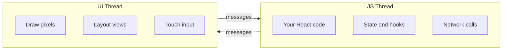
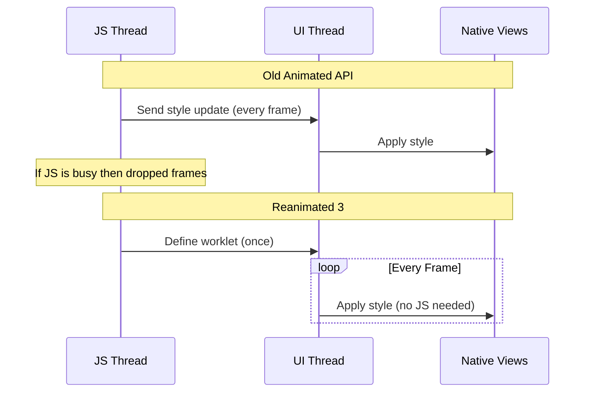
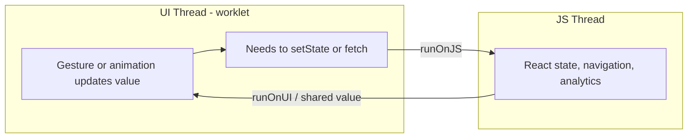
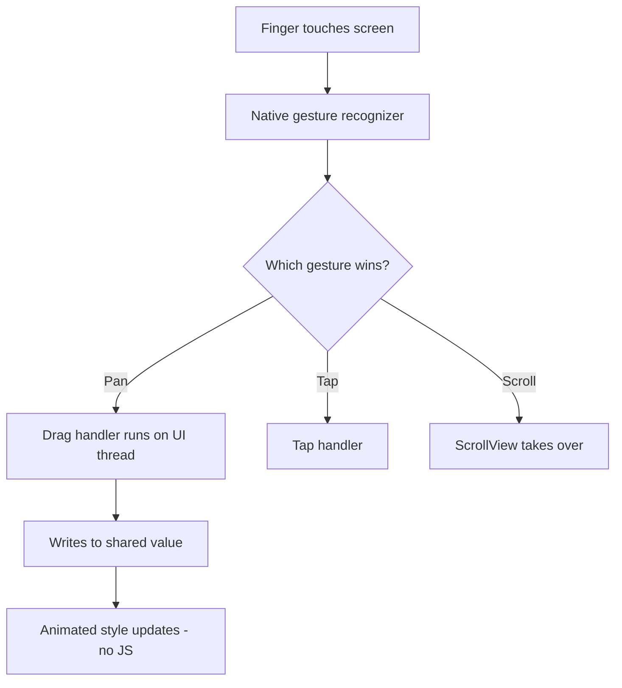
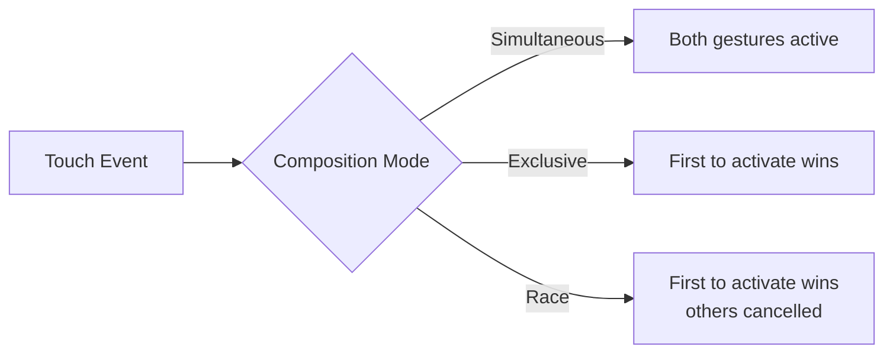
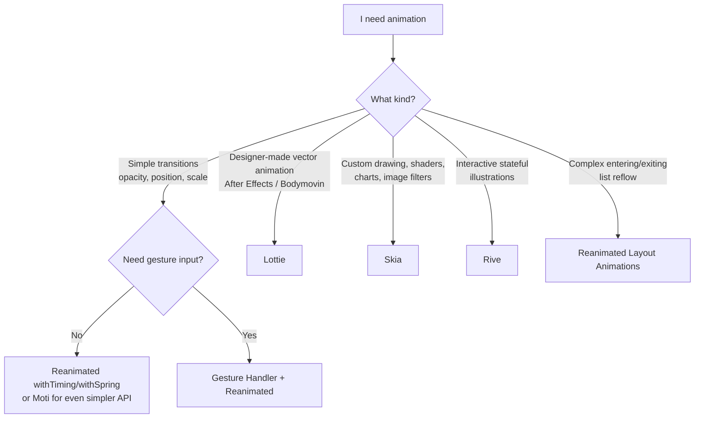

# Animations et gestes : du 60 fps sur le UI thread

> Reanimated 3, Gesture Handler, et les outils qui remplacent les transitions CSS par des performances natives.

---

## Table of Contents

1. [Reanimated 3](#1-reanimated-3)
2. [Gesture Handler](#2-gesture-handler)
3. [Other Animation Tools](#3-other-animation-tools)
4. [When to Reach for What](#4-when-to-reach-for-what)

---

## 1. Reanimated 3

### Deux threads, et pourquoi vous devez vous en soucier

Avant que tout cela ait du sens, vous avez besoin d'un modèle mental de la façon dont une application React Native s'exécute réellement. Contrairement à une page web, qui vit dans un unique pipeline de rendu que le navigateur gère pour vous, une application React Native exécute votre code à travers **deux threads principaux** qui communiquent entre eux :

- **Le JS thread** — là où s'exécutent vos composants React, vos hooks, votre state, vos appels `fetch` et toute votre logique métier. C'est « votre » code.
- **Le UI thread** (aussi appelé thread *principal* ou *natif*) — là où le système d'exploitation dessine réellement les pixels, agence les vues et traite les entrées tactiles. Ce thread doit rester libre, car s'il se bloque ne serait-ce qu'un instant, l'écran se fige littéralement.

Les deux communiquent en s'échangeant des messages. Imaginez deux personnes dans des pièces séparées qui se passent des notes sous une porte. Cette porte est le goulot d'étranglement.



Pourquoi cela importe-t-il pour les animations ? Parce qu'une animation n'est qu'une valeur qui change 60 fois par seconde. La question est : *quel thread effectue ce calcul ?* Si c'est le JS thread, tout ce que fait par ailleurs le JS thread entre en concurrence avec votre animation. Si c'est le UI thread, l'animation est isolée de l'activité de votre application.

> **Modèle mental :** le UI thread est le projectionniste qui fait défiler le film ; le JS thread est le scénariste. Vous ne voulez pas que le projectionniste mette le film en pause à chaque fois que le scénariste veut griffonner une nouvelle réplique.

### Le problème avec Animated de React Native

Sur le web, vous collez un `transition: transform 0.3s ease` sur une div et l'affaire est réglée. Le navigateur gère l'interpolation sur le thread de composition, votre JavaScript ne se réveille jamais, et vous obtenez du 60 fps gratuitement.

React Native est livré avec une API `Animated` qui *semble* similaire mais qui souffre d'un défaut fatal : l'essentiel du travail s'exécute sur le JS thread. À chaque frame, votre pont JavaScript envoie une nouvelle valeur de style au natif. Un render lourd, un appel d'API lent, une pause de garbage collection — et votre animation saccade. Les utilisateurs le remarquent. Ils le remarquent toujours.

L'API `Animated` a tenté d'atténuer cela avec un flag nommé `useNativeDriver: true`, qui déplace *certaines* animations vers le côté natif. Mais cela ne fonctionne que pour un ensemble restreint de propriétés (`opacity`, `transform`) et ne peut ni réagir aux gestes ni exécuter de logique conditionnelle en cours d'animation. Dès que vous avez besoin de quoi que ce soit de dynamique, vous retombez sur le JS thread et les saccades reviennent.

Reanimated 3 corrige cela en exécutant la logique d'animation directement sur le **UI thread** à l'aide de petites fonctions appelées **worklets**. Votre JS thread peut se figer entièrement et l'animation continue à 60 fps.



### Qu'est-ce exactement qu'un worklet ?

Un **worklet** est une petite fonction JavaScript que Reanimated copie pour l'exécuter sur le UI thread au lieu du JS thread. Lorsque vous marquez une fonction comme worklet (le plugin Babel de Reanimated le fait automatiquement pour `useAnimatedStyle`, les callbacks de gestes, etc.), elle reçoit une directive spéciale `'worklet';` ainsi qu'une copie sérialisée des variables dont elle a besoin.

Le piège : parce qu'un worklet s'exécute dans un contexte JavaScript *séparé* sur le UI thread, il ne **partage pas** la mémoire avec votre code JS normal. Il ne peut voir ni les variables ordinaires de votre composant, ni les modules importés, ni le state — seulement les « shared values » spécifiques et les primitives sérialisées que Reanimated lui transmet.

```tsx
// This whole function body becomes a worklet — it runs on the UI thread.
const animatedStyle = useAnimatedStyle(() => {
  'worklet'; // usually auto-injected by the Babel plugin, shown here for clarity
  return { opacity: opacity.value };
});
```

> **Pourquoi cette séparation existe :** le UI thread ne peut pas « plonger » dans le heap JS en toute sécurité pendant que le JS thread est susceptible de le modifier. Reanimated exécute donc un second runtime JS isolé sur le UI thread. C'est le prix de l'indépendance à 60 fps — et c'est pourquoi le retour vers JS nécessite le helper explicite `runOnJS` que vous découvrirez bientôt.

### Shared values : la primitive fondamentale

Un `useSharedValue` est comme un `useRef` mais accessible depuis le JS thread comme depuis le UI thread. Il ne déclenche pas de re-render. C'est le cœur battant de toute animation Reanimated.

L'idée clé : une shared value est *un seul emplacement mémoire* que les deux threads peuvent lire et écrire. Lorsque le UI thread met à jour `opacity.value` 60 fois par seconde, votre composant React ne fait jamais de re-render — parce que vous lisez cette valeur à l'intérieur d'un worklet, pas dans le JSX. Sur le web, l'équivalent serait de modifier directement le style d'un nœud DOM via une ref plutôt que de passer par le state React ; ici, c'est le chemin par défaut, optimisé.

```tsx
import Animated, {
  useSharedValue,
  useAnimatedStyle,
  withTiming,
  withSpring,
} from 'react-native-reanimated';

function FadeInBox() {
  const opacity = useSharedValue(0);

  const animatedStyle = useAnimatedStyle(() => ({
    opacity: opacity.value,
  }));

  const show = () => {
    opacity.value = withTiming(1, { duration: 400 });
  };

  return (
    <Animated.View style={[styles.box, animatedStyle]}>
      <Button title="Show" onPress={show} />
    </Animated.View>
  );
}
```

Lorsque vous écrivez `opacity.value = withTiming(1)`, vous ne réglez pas la valeur à 1 immédiatement. Vous dites au UI thread : « interpole de la valeur actuelle jusqu'à 1 sur 400 ms en utilisant une courbe d'easing ». Le JS thread déclenche et oublie.

> **Piège :** vous devez toujours lire et écrire la propriété `.value`, jamais l'objet shared value lui-même. `opacity = 1` ne fait rien d'utile ; `opacity.value = 1` est ce qui met les choses en mouvement. Et lire `opacity.value` *dans le JSX* (en dehors d'un worklet) vous donne un instantané périmé qui ne se mettra pas à jour — c'est précisément à cela que sert `useAnimatedStyle`.

### Piloter les styles à partir des valeurs : useAnimatedStyle et interpolate

`useAnimatedStyle` renvoie un objet de style que le UI thread recalcule à chaque frame à partir de vos shared values. Vous n'animez presque jamais `.value` directement vers un nombre de style final — à la place, vous conservez une valeur de pilotage « brute » et vous l'**interpolez** vers les styles que vous voulez réellement. C'est le pattern le plus réutilisable de Reanimated.

```tsx
import { interpolate, Extrapolation } from 'react-native-reanimated';

const progress = useSharedValue(0); // one driver, 0 -> 1

const cardStyle = useAnimatedStyle(() => ({
  // map progress 0..1 onto several visual properties at once
  opacity: interpolate(progress.value, [0, 1], [0, 1]),
  transform: [
    { translateY: interpolate(progress.value, [0, 1], [40, 0]) },
    { scale: interpolate(progress.value, [0, 1], [0.95, 1]) },
  ],
  // clamp so values never overshoot the ends of the range
  borderRadius: interpolate(
    progress.value,
    [0, 1],
    [24, 8],
    Extrapolation.CLAMP
  ),
}));

// later, one line animates the whole card in:
progress.value = withTiming(1, { duration: 300 });
```

`interpolate` est le cousin RN des `@keyframes` CSS mêlé à une fonction de mapping de valeurs : vous lui donnez une plage d'entrée et une plage de sortie, et il les met en correspondance linéairement. Pilotez dix propriétés de style à partir d'une seule valeur `progress` et vos animations restent parfaitement synchronisées.

### La boîte à outils d'animation

Reanimated vous offre des modificateurs d'animation composables :

| Fonction | Ce qu'elle fait | Équivalent web |
|---|---|---|
| `withTiming` | Easing basé sur une durée | `transition: 0.3s ease` |
| `withSpring` | Ressort basé sur la physique | `spring()` dans Framer Motion |
| `withDecay` | Inertie avec friction | Aucun équivalent CSS direct |
| `withRepeat` | Boucler n'importe quelle animation | `animation-iteration-count` |
| `withSequence` | Enchaîner des animations dans l'ordre | `@keyframes` avec plusieurs paliers |
| `withDelay` | Attendre, puis lancer une animation | `animation-delay` |

**Timing ou spring — lequel donne la bonne sensation ?** Utilisez `withTiming` quand vous voulez une durée précise et prévisible (une infobulle qui apparaît en fondu sur exactement 200 ms). Utilisez `withSpring` quand vous voulez que quelque chose semble *physique* — des boutons qui rebondissent, des cartes qui se calent en place, tout ce qu'un doigt vient de lâcher. Les ressorts n'ont pas de durée fixe ; ils se stabilisent en fonction de paramètres physiques :

| Paramètre de spring | Ce qu'il contrôle | Une valeur plus élevée signifie |
|---|---|---|
| `damping` | La rapidité avec laquelle l'oscillation s'éteint | Moins de rebond, se stabilise plus vite |
| `stiffness` | La force de la traction du ressort | Plus vif, mouvement plus rapide |
| `mass` | Le « poids » de l'objet | Plus lent, sensation plus lourde |

Composez-les librement :

```tsx
// Bounce in: scale up with spring, then pulse forever
scale.value = withSequence(
  withSpring(1, { damping: 4, stiffness: 200 }),
  withRepeat(
    withSequence(
      withTiming(1.05, { duration: 600 }),
      withTiming(1, { duration: 600 })
    ),
    -1, // -1 = infinite
    true // reverse each iteration
  )
);
```

> **Astuce de pro :** les modificateurs d'animation acceptent un *callback* qui se déclenche lorsqu'ils se terminent : `withTiming(1, { duration: 400 }, (finished) => { ... })`. Le callback s'exécute sur le UI thread, donc si vous devez faire du travail JS à la fin d'une animation (naviguer, setState), enveloppez-le : `withTiming(1, {}, () => runOnJS(onDone)())`.

### Franchir la frontière entre les threads

Les worklets s'exécutent sur le UI thread. Parfois, vous devez rappeler vers JS — peut-être pour mettre à jour le state ou déclencher un événement d'analytics. C'est à cela que sert `runOnJS` :

```tsx
import { runOnJS } from 'react-native-reanimated';

function SwipeCard() {
  const translateX = useSharedValue(0);

  const onSwipeComplete = (direction: string) => {
    // This runs on JS thread — safe to setState, fetch, etc.
    console.log(`Swiped ${direction}`);
  };

  const animatedStyle = useAnimatedStyle(() => {
    if (Math.abs(translateX.value) > 200) {
      runOnJS(onSwipeComplete)(
        translateX.value > 0 ? 'right' : 'left'
      );
    }
    return { transform: [{ translateX: translateX.value }] };
  });

  return <Animated.View style={animatedStyle} />;
}
```



> **Piège :** n'appelez jamais une fonction JS ordinaire directement à l'intérieur de `useAnimatedStyle` ou d'un callback de gestionnaire de gestes. Le worklet s'exécute sur le UI thread — il n'a accès ni aux closures, ni au state, ni aux modules du JS thread. Enveloppez toujours les appels côté JS avec `runOnJS`. L'oublier est le bug Reanimated le plus courant, et il se manifeste souvent par une erreur cryptique du type *« Tried to synchronously call a non-worklet function on the UI thread. »*

L'inverse existe aussi : `runOnUI` vous permet de déclencher un worklet depuis le JS thread quand vous avez besoin de lancer une animation impérative à partir, par exemple, d'un gestionnaire d'appui sur un bouton qui vit déjà dans JS.

> **Astuce de pro :** `runOnJS` a un coût réel — il sérialise l'appel à travers la frontière entre les threads. L'appeler *à chaque frame* (par exemple dans `onUpdate` pour un drag) recrée exactement les saccades que Reanimated a été conçu pour éviter. Ne l'appelez que pour des événements *discrets* : geste terminé, seuil franchi, animation achevée.

### useAnimatedReaction : surveiller les valeurs

Parfois, vous avez besoin d'effets de bord lorsqu'une shared value change — comme déclencher un retour haptique quand un drag franchit un seuil. `useAnimatedReaction` est votre outil. Voyez-le comme un `useEffect` qui vit entièrement sur le UI thread : la première fonction dit *quoi surveiller*, la seconde dit *quoi faire quand ça change*, et elle vous remet à la fois la valeur actuelle et la précédente afin que vous puissiez détecter un franchissement plutôt qu'un simple état.

```tsx
import { useAnimatedReaction } from 'react-native-reanimated';

useAnimatedReaction(
  () => translateY.value,           // what to watch
  (current, previous) => {          // what to do when it changes
    // fire only when we cross 100 going down — not every frame past 100
    if (previous && previous < 100 && current >= 100) {
      runOnJS(triggerHaptic)();
    }
  }
);
```

> **Erreur courante :** poser le test de seuil comme `current >= 100` *sans* le comparer à `previous`. Cela se déclenche à chaque frame tant que la valeur reste au-dessus de 100, déclenchant des dizaines de retours haptiques en rafale. Comparez toujours avec `previous` pour détecter le *front* (le moment du franchissement), pas l'*état*.

### Layout Animations : des transitions sans effort

Reanimated est livré avec des animations d'entrée et de sortie prêtes à l'emploi. Voyez-les comme l'équivalent React Native de `<Transition>` de Vue ou de `AnimatePresence` de Framer Motion :

```tsx
import Animated, {
  FadeIn,
  FadeOut,
  SlideInRight,
  LinearTransition,
} from 'react-native-reanimated';

function TodoItem({ item }: { item: { text: string } }) {
  return (
    <Animated.View
      entering={SlideInRight.duration(300)}  // plays when mounted
      exiting={FadeOut.duration(200)}         // plays when removed
      layout={LinearTransition.springify()}   // plays when neighbors move
    >
      <Text>{item.text}</Text>
    </Animated.View>
  );
}
```

La prop `layout` est le vrai joyau — lorsque des éléments frères se réagencent (par exemple lorsqu'un élément est supprimé d'une liste), Reanimated anime automatiquement chaque élément restant vers sa nouvelle position. Sur le web, cela nécessite des bibliothèques comme `auto-animate` ou des techniques FLIP. Ici, c'est une seule prop.

> **Piège :** pour que les animations `exiting` se jouent réellement, l'élément doit être supprimé d'un parent qui garde l'`Animated.View` montée assez longtemps pour l'animer en sortie. À l'intérieur de `FlatList`/`FlashList`, la virtualisation peut court-circuiter les animations de sortie ; pour les listes animées, on anime souvent les éléments dans une simple liste mappée ou on utilise les patterns documentés de la bibliothèque. De plus : chaque enfant animé d'une liste a besoin d'une **`key` stable**, sinon Reanimated ne peut pas distinguer quel élément a bougé de celui qui a été remplacé.

---

## 2. Gesture Handler

### Pourquoi pas simplement onTouchStart ?

Le système tactile intégré de React Native (`PanResponder`, `onTouchStart`) passe par le pont JS. Il n'a en outre aucune notion de composition de gestes — que se passe-t-il lorsqu'une scroll view contient une carte déplaçable qui possède aussi un gestionnaire de tap ? Le système intégré s'effondre.

Pour être concret : sur le web, le navigateur dispose d'un système sophistiqué, vieux de plusieurs décennies, pour décider si votre glissement du doigt est un scroll, une sélection de texte ou un tap sur un lien — et il le fait nativement, en dehors de votre JS. Le responder tactile basique de React Native ne vous offre presque rien de tout cela. `react-native-gesture-handler` ramène cette arbitrage natif des gestes. Les gestes sont reconnus sur le thread natif (UI) et se composent de façon déclarative.



> **Piège de configuration :** Gesture Handler exige que votre application soit enveloppée dans un `<GestureHandlerRootView style={{ flex: 1 }}>` tout en haut de votre arbre de composants (Expo Router et les bibliothèques de navigation le font souvent pour vous). Si des gestes ne font silencieusement rien — surtout sur Android — l'absence de root view est généralement le coupable.

### Les gestes fondamentaux

```tsx
import { Gesture, GestureDetector } from 'react-native-gesture-handler';
import Animated, {
  useSharedValue,
  useAnimatedStyle,
  withSpring,
} from 'react-native-reanimated';

function DraggableCard() {
  const translateX = useSharedValue(0);
  const translateY = useSharedValue(0);
  const savedX = useSharedValue(0);
  const savedY = useSharedValue(0);

  const pan = Gesture.Pan()
    .onStart(() => {
      // remember where the card was when the drag began
      savedX.value = translateX.value;
      savedY.value = translateY.value;
    })
    .onUpdate((event) => {
      // saved position + how far the finger has moved so far
      translateX.value = savedX.value + event.translationX;
      translateY.value = savedY.value + event.translationY;
    })
    .onEnd(() => {
      // let go: spring back to center
      translateX.value = withSpring(0);
      translateY.value = withSpring(0);
    });

  const animatedStyle = useAnimatedStyle(() => ({
    transform: [
      { translateX: translateX.value },
      { translateY: translateY.value },
    ],
  }));

  return (
    <GestureDetector gesture={pan}>
      <Animated.View style={[styles.card, animatedStyle]} />
    </GestureDetector>
  );
}
```

Remarquez quelque chose d'important : le callback `onUpdate` écrit directement dans les shared values. Aucun franchissement du pont, aucune implication du JS thread. Le geste alimente les données de position vers l'animation sur le UI thread, à chaque frame.

Pourquoi le pattern `savedX`/`savedY` ? Parce que `event.translationX` est mesuré *à partir de l'endroit où le doigt a d'abord touché*, pas à partir de la dernière position de repos de la carte. Sans sauvegarder la position de départ, chaque nouveau drag ramènerait la carte là où la translation valait zéro. Ce pattern « sauvegarder au démarrage, ajouter la translation à la mise à jour » est la façon canonique de rendre les drags reprenables — mémorisez-le.

Les cinq principaux reconnaisseurs de gestes :

| Geste | Cas d'usage | Champs d'événement clés |
|---|---|---|
| `Gesture.Pan()` | Drag, swipe, pull-to-refresh | `translationX/Y`, `velocityX/Y` |
| `Gesture.Pinch()` | Zoom avant/arrière | `scale`, `focalX/Y` |
| `Gesture.Tap()` | Tap simple, double ou N-tap | `x`, `y`, `numberOfTaps` |
| `Gesture.LongPress()` | Menus par appui maintenu | `duration` |
| `Gesture.Fling()` | Coup directionnel rapide | `direction` |

> **Astuce de pro :** `Gesture.Pan()` vous fournit `velocityX`/`velocityY` dans `onEnd`. Injectez cette vélocité dans `withDecay({ velocity: event.velocityX })` et la carte continue de glisser après que le doigt s'est levé, en décélérant avec friction — exactement la sensation de l'inertie de scroll native. C'est ainsi que vous construisez une carte « fling to dismiss ».

### Composition de gestes

Les UIs réelles ont besoin de plusieurs gestes sur le même élément. Gesture Handler vous offre trois modes de composition :

```tsx
// Both gestures run at the same time (e.g., pinch + pan for a photo viewer)
const composed = Gesture.Simultaneous(pinchGesture, panGesture);

// First gesture to activate wins, others are cancelled
const exclusive = Gesture.Exclusive(doubleTap, singleTap);

// First gesture to activate wins (same as Exclusive for most cases)
const race = Gesture.Race(swipeGesture, scrollGesture);
```



| Mode | Comportement | Quand l'utiliser |
|---|---|---|
| `Simultaneous` | Tous les gestes actifs en même temps | Pinch + pan + rotate sur une photo |
| `Exclusive` | Ordre de priorité ; le geste antérieur gagne | Le double-tap a priorité sur le simple tap |
| `Race` | Le premier qui s'active gagne, les autres s'annulent | Swipe-to-dismiss vs scroll |

> **Erreur courante :** envelopper `Gesture.Exclusive(singleTap, doubleTap)` dans le mauvais ordre. Le résolveur exclusif choisit le *premier* geste qui satisfait ses critères d'activation. Un simple tap se déclenche toujours avant un double tap. Vous devez placer `doubleTap` en premier pour qu'il ait la priorité :
>
> ```tsx
> // Correct: double tap checked first
> const gesture = Gesture.Exclusive(doubleTap, singleTap);
> ```

### Connecter les gestes à Reanimated

La puissance de cet écosystème tient au fait que Gesture Handler et Reanimated partagent le même runtime de worklets sur le UI thread. Un callback de geste peut écrire dans une shared value, et un style animé la lit — le tout sans que le JS thread n'en sache jamais rien :

```tsx
const scale = useSharedValue(1);

const pinch = Gesture.Pinch()
  .onUpdate((event) => {
    scale.value = event.scale;  // UI thread, every frame
  })
  .onEnd(() => {
    scale.value = withSpring(1); // snap back
  });

const animatedStyle = useAnimatedStyle(() => ({
  transform: [{ scale: scale.value }],
}));
```

C'est ainsi que des applications comme Instagram, Telegram et Airbnb construisent leurs interfaces pilotées par les gestes. Le pattern est toujours le même : **le geste écrit dans une shared value, le style animé lit depuis la shared value.** Intériorisez cette unique phrase et 90 % des animations de gestes deviennent une formule.

> **Piège :** les callbacks de gestes (`.onUpdate`, `.onStart`, etc.) sont des worklets — mêmes règles que `useAnimatedStyle`. Vous ne pouvez pas appeler `setState` ni aucune fonction JS ordinaire à l'intérieur sans `runOnJS`. Si vous devez basculer un state React à la fin d'un geste, c'est `runOnJS(setX)(value)` à l'intérieur de `.onEnd`.

---

## 3. Other Animation Tools

Reanimated et Gesture Handler couvrent 80 % des besoins en animation. Les 20 % restants sont là où les outils spécialisés brillent. Voici un aperçu du paysage avant d'entrer dans le détail :

| Outil | Idéal pour | Interactif ? | Source |
|---|---|---|---|
| Reanimated | Transitions, mouvement piloté par les gestes | Oui | Code |
| Lottie | Animations vectorielles créées par un designer | Limité (scrub via progression) | JSON After Effects |
| Skia | Dessin personnalisé, shaders, graphiques | Oui | Code |
| Moti | Entrée/sortie déclaratives simples | Non (enveloppe Reanimated) | Code |
| Rive | Illustrations interactives à états | Oui (machines à états) | Éditeur Rive |

### Lottie : des animations vectorielles depuis After Effects

Si votre designer vous tend un fichier After Effects en disant « fais-le bouger », vous voulez [Lottie](https://github.com/lottie-react-native/lottie-react-native). Les designers exportent les animations en JSON (via le plugin Bodymovin/Lottie), et Lottie les restitue nativement à 60 fps — sans que vous ayez à recréer le mouvement en code.

```bash
npx expo install lottie-react-native
```

```tsx
import LottieView from 'lottie-react-native';

function SuccessAnimation() {
  return (
    <LottieView
      source={require('./checkmark.json')}
      autoPlay
      loop={false}
      style={{ width: 150, height: 150 }}
    />
  );
}
```

Lottie est parfait pour : les spinners de chargement, les états de succès/erreur, les illustrations d'onboarding, les animations d'icônes. Il n'est **pas** bon pour : les animations interactives qui répondent à l'entrée de l'utilisateur (utilisez Reanimated pour cela) ou les animations lourdes en plein écran (utilisez Skia ou Rive).

> **Astuce :** vous pouvez contrôler la progression de Lottie avec une shared value Reanimated en utilisant la prop `progress` avec `Animated.createAnimatedComponent(LottieView)`. Cela vous permet de *scrubber* à travers une animation en fonction de la position de scroll ou d'une entrée gestuelle — par exemple, un spinner de pull-to-refresh qui se remplit à mesure que l'utilisateur tire vers le bas plutôt que de simplement boucler tout seul.

### Skia : un moteur de rendu 2D

`@shopify/react-native-skia` vous offre un canvas accéléré par GPU avec des shaders, du flou, des dégradés, du dessin de chemins et des filtres d'image — le tout à 60 fps. Voyez-le comme un `<canvas>` sous stéroïdes. (Skia est, de fait, le même moteur de rendu qui alimente Google Chrome et Flutter — il est donc éprouvé à très grande échelle.)

```tsx
import { Canvas, Circle, LinearGradient, vec } from '@shopify/react-native-skia';

function GradientOrb() {
  return (
    <Canvas style={{ width: 200, height: 200 }}>
      <Circle cx={100} cy={100} r={80}>
        <LinearGradient
          start={vec(0, 0)}
          end={vec(200, 200)}
          colors={['#6366f1', '#ec4899']}
        />
      </Circle>
    </Canvas>
  );
}
```

Le glissement mental par rapport au RN ordinaire ici : au lieu de composer des `<View>` que l'OS agence, vous *dessinez vous-même des primitives sur un canvas* — cercles, chemins, texte, images — exactement comme les API Canvas 2D/WebGL du web. Cette puissance a aussi son coût : les enfants de Skia ne sont pas des vues normales, donc flexbox et le styling standard ne s'appliquent pas à l'intérieur de `<Canvas>`.

Utilisez Skia lorsque vous avez besoin de : dessin personnalisé (graphiques, courbes, signatures), traitement d'image (flou, matrice de couleurs), effets de shader, ou de tout ce qui serait un `<canvas>` sur le web. Skia s'intègre avec les shared values de Reanimated, vous pouvez donc animer les uniforms de shader et les propriétés de chemin sur le UI thread.

> **Piège :** Skia est une dépendance plus lourde qui augmente la taille de votre bundle/binaire. Ne l'intégrez pas juste pour dessiner un rectangle arrondi — une `<View>` stylée le fait gratuitement. Ne recourez à Skia que lorsque vous avez réellement besoin de dessin au pixel près ou d'effets que le système de vues ne peut pas exprimer.

### Moti : des animations déclaratives

[Moti](https://moti.fyi) enveloppe Reanimated avec une API à la Framer Motion. Moins de contrôle, moins de boilerplate :

```tsx
import { MotiView } from 'moti';

function FadeInCard() {
  return (
    <MotiView
      from={{ opacity: 0, translateY: 20 }}      // initial state
      animate={{ opacity: 1, translateY: 0 }}     // target state
      transition={{ type: 'timing', duration: 350 }}
    />
  );
}
```

Si vous avez utilisé Framer Motion sur le web, cela vous semblera instantanément familier — `from`/`animate`/`transition` correspondent presque un à un à `initial`/`animate`/`transition` de Framer. Moti est excellent pour les animations simples d'entrée/sortie où vous n'avez besoin ni d'intégration gestuelle ni de contrôle fin. C'est une couche de confort construite *par-dessus* Reanimated (pas un concurrent) — si vous le dépassez, vous pouvez descendre directement vers Reanimated au sein de la même application, sans migration nécessaire.

| Choix | Boilerplate | Contrôle | Y recourir quand |
|---|---|---|---|
| Moti | Minimal | Plus faible | Fondu/glissement d'entrée-sortie simple, prototypage |
| Reanimated directement | Plus | Complet | Gestes, interpolation, séquences complexes |

### Rive : des machines à états interactives

[Rive](https://rive.app) est comme Lottie mais avec des **machines à états** intégrées. Votre designer peut définir des états (idle, hover, pressed, loading) dans l'éditeur Rive et câbler les transitions entre eux ; vous déclenchez ensuite ces transitions depuis le code en réglant des « inputs ». Là où Lottie joue une timeline fixe du début à la fin, Rive répond au state de votre application et à l'entrée de l'utilisateur en temps réel.

```tsx
import Rive, { useRive } from 'rive-react-native';

function LikeButton() {
  const [riveRef, setInput] = useRive();
  return (
    <Rive
      ref={riveRef}
      resourceName="like_button"
      stateMachineName="State Machine 1"
      // fire a trigger input defined in the Rive editor
      onPress={() => setInput?.('State Machine 1', 'pressed', true)}
    />
  );
}
```

Utile pour les illustrations interactives complexes et les éléments d'UI proches du jeu vidéo — boutons « j'aime » animés, avatars de personnages qui réagissent aux taps, mascottes de progression — là où coder à la main chaque transition d'état dans Reanimated serait pénible et où le designer peut s'approprier le mouvement à la place.

---

## 4. When to Reach for What

Voici le cadre de décision. Ne vous compliquez pas la vie — choisissez l'outil le plus simple qui résout votre problème.



### La décision en clair

**« Je veux qu'un bouton apparaisse en fondu. »**
Utilisez `withTiming` de Reanimated, ou un `MotiView` si vous voulez moins de code. N'importez pas Lottie pour cela.

**« Je veux une carte que l'utilisateur peut faire glisser et projeter. »**
`Gesture.Pan()` de Gesture Handler écrivant dans des shared values Reanimated, avec `withDecay` (alimenté par `event.velocityX`) au relâchement pour l'inertie. C'est le pattern de base du quotidien.

**« Je veux une visionneuse de photos avec pinch-to-zoom. »**
`Gesture.Simultaneous(pinch, pan)` avec Reanimated. Stockez le scale et la translation dans des shared values.

**« Mon designer m'a donné une animation After Effects. »**
Lottie. Exportez en JSON, déposez-le. Si vous devez la scrubber avec un geste, connectez la prop `progress` à une shared value.

**« J'ai besoin d'un graphique personnalisé avec des chemins animés. »**
Skia. Dessinez des chemins, animez-les avec des shared values Reanimated pilotant les propriétés de Skia.

**« J'ai besoin d'illustrations animées qui répondent au state de l'application. »**
Rive. Définissez des machines à états dans l'éditeur, déclenchez-les depuis React via des inputs.

### Règles empiriques de performance

1. **Gardez les animations sur le UI thread.** Si vous voyez `useNativeDriver: false` dans du vieux code, c'est un signal d'alarme. Reanimated est sur le UI thread par défaut.
2. **Évitez `runOnJS` dans les chemins critiques.** Franchir le pont une fois par événement de geste va à l'encontre du but recherché. Ne rappelez vers JS que pour des événements discrets (swipe terminé, seuil franchi).
3. **Utilisez `cancelAnimation` pour nettoyer.** Si un composant se démonte pendant une animation, annulez-la. Reanimated vous avertira si vous l'oubliez.
4. **Mesurez avec le Perf Monitor.** Activez l'overlay de performance React Native (`Cmd+D` > « Show Perf Monitor ») pour vérifier que vous atteignez 60 fps. Surveillez spécifiquement la ligne FPS **UI** — si elle descend sous 60 pendant un geste, votre worklet fait trop de travail par frame.
5. **Profilez sur un vrai appareil bas de gamme, pas sur le simulateur.** Le simulateur iOS tourne sur le CPU puissant de votre Mac et masquera les saccades. Un téléphone Android de trois ans est le révélateur de vérité.

> **La règle d'or :** si une animation est pilotée par le toucher de l'utilisateur, elle *doit* s'exécuter sur le UI thread. Aucune optimisation ne rendra les animations du JS thread aussi natives pendant les gestes. Reanimated + Gesture Handler n'est pas optionnel pour les applications en production — c'est le minimum de base.