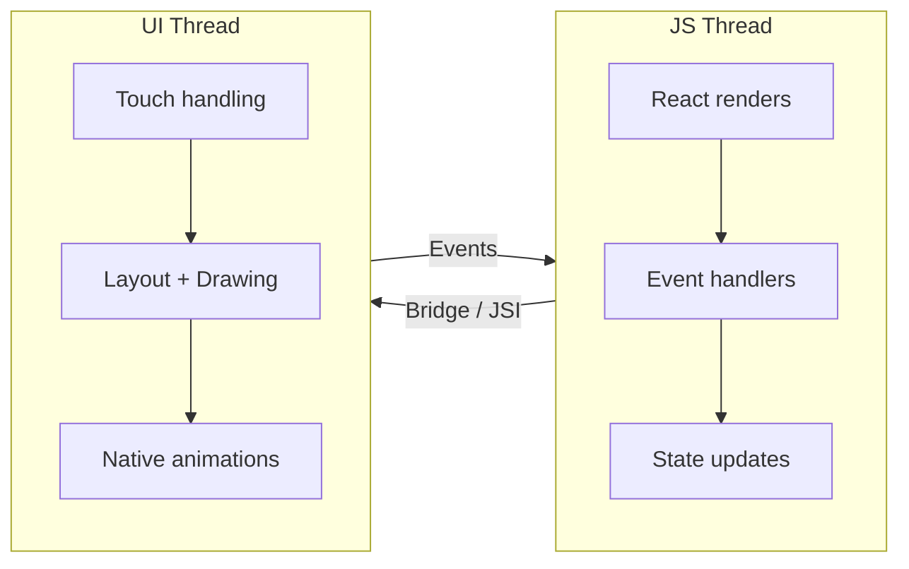
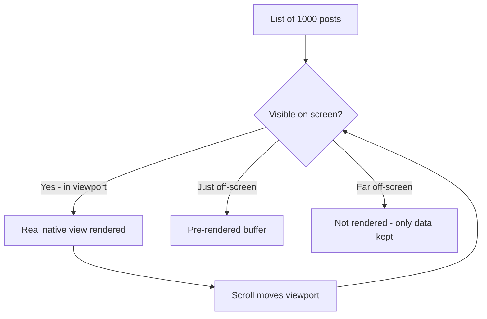
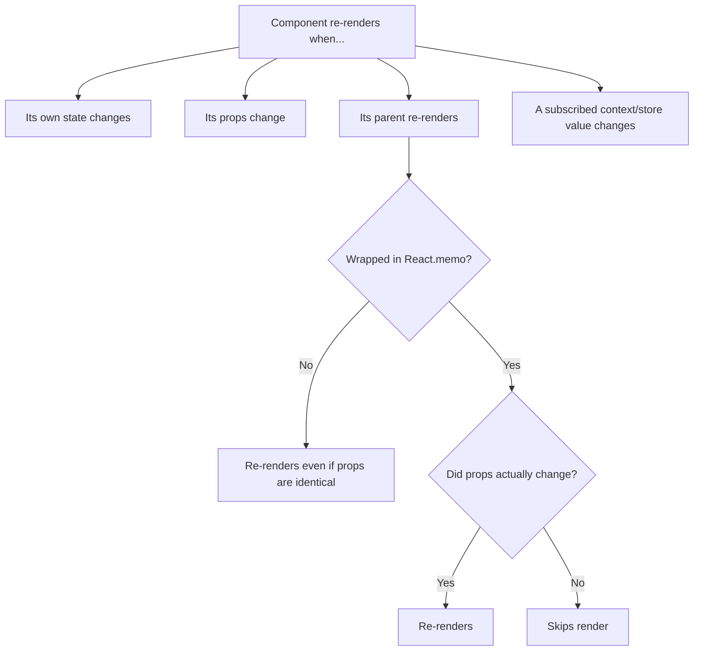
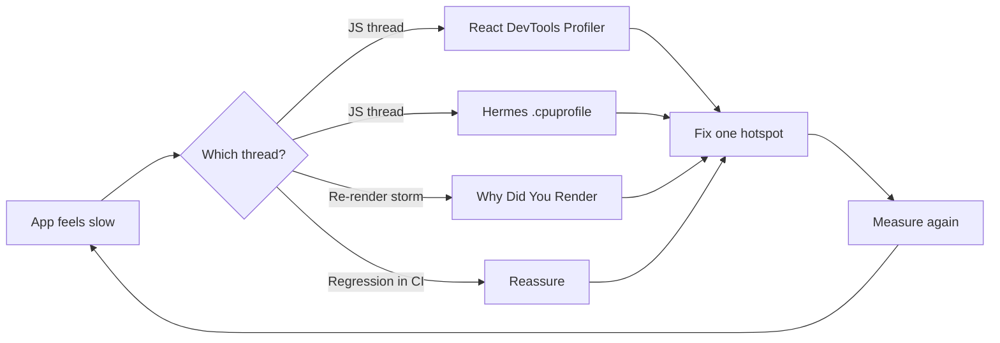
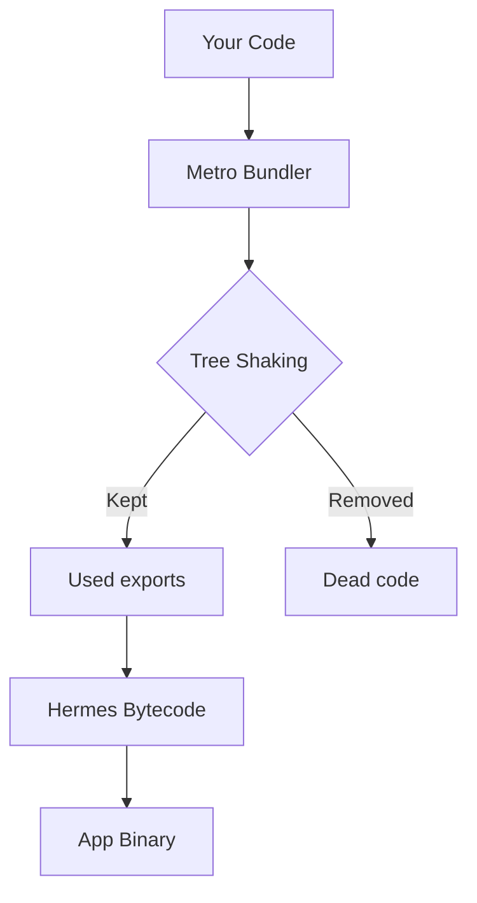

# Ingénierie de la performance : satisfaire les deux threads

> Le modèle mental des deux threads, l'optimisation des listes, la prévention des re-renders et les outils de profilage.

---

## Table of Contents

1. [The Two-Thread Mental Model](#1-the-two-thread-mental-model)
2. [Lists](#2-lists)
3. [Re-Renders](#3-re-renders)
4. [Images](#4-images)
5. [JS Engine](#5-js-engine)
6. [Performance Tools](#6-performance-tools)
7. [Bundle Size](#7-bundle-size)

---

## 1. Le modèle mental des deux threads

Sur le web, vous disposez d'un seul thread principal. Bloquez-le et tout se fige — animations, défilement, saisie. React Native est différent. Votre application s'exécute sur **deux threads principaux**, et comprendre la frontière entre eux est le concept de performance le plus important que vous apprendrez.

Imaginez un restaurant. Le **thread JS** est le chef qui décide *quoi* cuisiner (votre logique, votre arbre React, ce qui doit apparaître à l'écran). Le **thread UI** est le serveur qui apporte réellement les plats à table et répond au client (dessin des pixels, gestion des taps). Si le chef reste bloqué à faire frire une commande gigantesque, le serveur peut parfois continuer à débarrasser les tables — mais aucun *nouveau* plat ne sort. Si le serveur trébuche, même un chef rapide ne peut servir personne. Les deux peuvent caler, et ils calent de manières différentes et reconnaissables.

> **Pourquoi deux threads ?** La gestion du toucher et le défilement doivent paraître instantanés — sous environ 16 ms par frame pour atteindre 60 fps. JavaScript est single-threaded et imprévisible (vous pouvez exécuter un tri, parser une payload, déclencher des effects). En conservant le travail UI natif sur son propre thread, le système d'exploitation peut maintenir un défilement et des gestes fluides même pendant que votre JS est momentanément occupé. Le web n'a pas d'équivalent à cette séparation, ce qui explique pourquoi une boucle `for` lourde sur le web fige *tout*, y compris le défilement.

### Le thread JS

C'est là que vit votre code React. Renders de composants, callbacks `useEffect`, gestionnaires d'événements, mises à jour de state — tout cela est du JavaScript, tout cela se passe ici. Quand vous écrivez `onPress={() => doSomething()}`, cette fonction s'exécute sur le thread JS.

Il est **single-threaded**, exactement comme le thread principal du navigateur. Il y a une seule file, et les tâches s'exécutent une par une. Si un render prend 300 ms, rien d'autre sur le thread JS — aucun autre gestionnaire d'événement, aucun timer, aucune résolution de promesse — ne peut s'exécuter pendant ces 300 ms.

### Le thread UI (thread principal)

C'est le côté natif. Il gère le dessin des pixels, le traitement des gestes tactiles et l'exécution des animations natives. Sur iOS c'est le thread principal ; sur Android c'est le thread UI. Les scroll views natives, les worklets Reanimated et les animations en native driver s'exécutent tous ici — indépendamment de JavaScript.

L'idée cruciale : une `ScrollView` défile *nativement*. Quand vous faites glisser, la liste se déplace sur le thread UI sans demander la permission au thread JS. C'est pourquoi une liste peut continuer à défiler en douceur même pendant que votre thread JS est engorgé — mais c'est aussi pourquoi de nouvelles lignes peuvent apparaître *vides*, car le render de leur contenu nécessite le thread JS (occupé).

### Ce qui se passe quand l'un se bloque



**Thread JS bloqué → les taps semblent figés.** L'utilisateur appuie sur un bouton mais rien ne se passe pendant 200 ms car votre thread JS est occupé à calculer quelque chose. Pendant ce temps, une animation pilotée par Reanimated peut continuer à tourner en douceur car elle vit sur le thread UI. C'est l'expérience déroutante où les animations semblent correctes mais l'application paraît non réactive.

**Thread UI bloqué → frames perdues et saccades.** C'est plus rare avec du code React Native typique, mais cela arrive quand vous poussez des calculs de layout coûteux ou des appels synchrones de modules natifs sur le thread principal. Vous verrez des défilements saccadés et des animations hachées.

| Symptôme | Thread probablement bloqué | Cause typique |
| --- | --- | --- |
| Les taps ne répondent pas, mais les animations sont fluides | Thread JS | Render lourd, `JSON.parse`, gros tri/filtre |
| Le défilement saccade, l'animation est hachée | Thread UI | Appel natif synchrone, layout coûteux |
| La liste défile mais les lignes apparaissent vides puis se remplissent | Thread JS (n'arrive pas à suivre) | Lignes non mémoïsées, `renderItem` lourd |
| Tout est figé d'un coup | Les deux (ou un deadlock) | Appel synchrone du bridge depuis JS pendant un render lourd |

### L'ancien Bridge vs la New Architecture

Historiquement, JS et natif communiquaient via un **bridge** asynchrone qui sérialisait chaque message en JSON — lent et goulot d'étranglement fréquent. La **New Architecture** (Fabric + JSI) permet à JavaScript de détenir des références directes vers les objets natifs et de les appeler de manière synchrone, supprimant la majeure partie de ce coût de sérialisation. Vous n'avez pas besoin de maîtriser cela tout de suite, mais retenez la tendance : la frontière entre les deux threads devient moins coûteuse à franchir, et non les threads qui fusionnent.

### La règle pratique

Gardez le thread JS libre pour l'interaction. Déléguez le travail lourd à :

- **`InteractionManager.runAfterInteractions()`** — diffère le travail non urgent jusqu'à la fin des animations.
- **Worklets Reanimated** — exécutent la logique d'animation directement sur le thread UI.
- **Threads d'arrière-plan** — utilisez des bibliothèques comme `react-native-multithreading` ou déplacez le travail vers des modules natifs.

```tsx
import { InteractionManager } from "react-native";

function onScreenFocus() {
  // The screen-transition animation is playing. If we load heavy data NOW,
  // the JS thread jams and the push animation stutters. So we wait.
  InteractionManager.runAfterInteractions(() => {
    loadExpensiveData(); // runs once the transition animation finishes
  });
}
```

Autre pattern du quotidien : découper un gros travail synchrone en morceaux pour que le thread JS puisse « respirer » entre eux et continuer à répondre aux taps.

```tsx
// Instead of processing 10,000 items in one blocking loop,
// yield to the event loop periodically so taps can be handled.
async function processInChunks<T>(items: T[], fn: (item: T) => void) {
  for (let i = 0; i < items.length; i++) {
    fn(items[i]);
    if (i % 100 === 0) {
      // Let the JS thread handle pending events (taps, gestures) before continuing
      await new Promise((resolve) => setTimeout(resolve, 0));
    }
  }
}
```

> **Piège :** `console.log` en production ralentit le thread JS plus que vous ne le pensez. Chaque log sérialise des données à travers le bridge. Supprimez les logs dans les builds de production ou utilisez des gardes `__DEV__`.

> **Astuce de pro :** Quand quelque chose « semble lent », votre première question doit toujours être *quel thread ?* Le correctif est complètement différent. Saccade du thread JS = mémoïser / découper / sortir le travail du chemin de render. Saccade du thread UI = arrêter le travail natif synchrone, utiliser le native animation driver.

---

## 2. Listes

Si votre application affiche une liste de plus d'une vingtaine d'éléments, la façon dont vous rendez cette liste fera ou défera votre performance perçue. Sur le web, vous pourriez vous tourner vers `react-window` ou `react-virtuoso`. En React Native, le `FlatList` intégré a été le standard pendant des années — mais il a de réelles limites.

### Pourquoi ne pas tout rendre ?

Sur le web, un `div` est bon marché et le navigateur est très optimisé pour masquer le contenu hors écran. En React Native, **chaque ligne est une vraie vue native** — un véritable `UIView` (iOS) ou `View` (Android) alloué en mémoire. Rendez 1 000 lignes et vous allouez 1 000 vues natives plus tous leurs enfants. C'est ainsi que l'on épuise la mémoire et que l'on fait planter un téléphone Android d'entrée de gamme.

La solution est la **virtualisation** : seules les lignes actuellement à l'écran (ou à proximité) existent réellement en tant que vues natives. Au fil du défilement, les lignes qui quittent l'écran sont détruites (FlatList) ou *recyclées* (FlashList).



### FlatList vs FlashList

`FlatList` crée et détruit des vues au fil du défilement. `FlashList` de Shopify les **recycle**, réutilisant les cellules hors écran comme le font nativement `UICollectionView` et `RecyclerView`. Le résultat : beaucoup moins de cellules vides et un défilement plus fluide.

Le recyclage est le modèle mental clé : au lieu de jeter une ligne qui a défilé hors du haut et d'en construire une toute neuve en bas, FlashList prend la *même* vue native, y injecte de nouvelles données et la repositionne. Allouer des vues natives est coûteux ; les réutiliser est presque gratuit.

| Composant | Stratégie | Quand l'utiliser |
| --- | --- | --- |
| `ScrollView` | Rend TOUS les enfants d'un coup, pas de virtualisation | Petits ensembles fixes (un écran de réglages, < ~20 éléments simples) |
| `FlatList` | Virtualise — monte/démonte les vues | Intégré, sans dépendance ; convient aux listes modérées |
| `FlashList` | Virtualise **et recycle** les vues | Longs flux scrollables ; chat ; tout cas où la perf de défilement compte |
| `SectionList` | Virtualisée, avec en-têtes de section | Données groupées (contacts A-Z, sections de réglages) |

> **Piège :** Ne placez jamais un `FlatList`/`FlashList` à l'intérieur d'une `ScrollView` de même direction de défilement. La `ScrollView` externe force la liste interne à rendre *tous* ses éléments (elle lui donne une hauteur infinie), détruisant entièrement la virtualisation. Utilisez plutôt les props `ListHeaderComponent` / `ListFooterComponent` de la liste elle-même au lieu de l'envelopper.

```bash
npx expo install @shopify/flash-list
```

```tsx
import { FlashList } from "@shopify/flash-list";

function Feed({ posts }: { posts: Post[] }) {
  return (
    <FlashList
      data={posts}
      estimatedItemSize={120}       // Required — measure a typical row height
      keyExtractor={(item) => item.id}
      renderItem={({ item }) => <PostCard post={item} />}
    />
  );
}
```

### Les règles pour des listes rapides

**1. Fournissez toujours `estimatedItemSize`.** FlashList l'utilise pour pré-allouer les cellules recyclées. Mesurez une ligne représentative et fournissez la hauteur en pixels. Se tromper d'un facteur 2 reste préférable à ne rien fournir.

**2. Mémoïsez votre composant de ligne.** Si `renderItem` retourne `<PostCard />`, assurez-vous que `PostCard` est enveloppé dans `React.memo`. Sans cela, chaque événement de défilement re-render chaque ligne visible.

**3. N'utilisez jamais de fonctions fléchées inline dans `renderItem`.**

```tsx
// Bad — creates a new function reference every render
renderItem={({ item }) => <PostCard post={item} onPress={() => handlePress(item.id)} />}

// Good — stable references
const handlePress = useCallback((id: string) => {
  navigation.navigate("Detail", { id });
}, [navigation]);

const renderPost = useCallback(({ item }: { item: Post }) => (
  <PostCard post={item} onPress={handlePress} />
), [handlePress]);

// ...
<FlashList renderItem={renderPost} />
```

Pourquoi est-ce si important ? Une nouvelle fonction fléchée est une *nouvelle référence* à chaque render. Cette nouvelle référence parvient à `PostCard` en tant que prop, ce qui annule l'effet de `React.memo` (la comparaison superficielle des props voit « fonction différente ») et re-render chaque ligne visible à chaque frame de défilement. Les références stables sont tout l'enjeu.

**4. Utilisez `keyExtractor` avec des IDs stables et uniques.** N'utilisez jamais l'index du tableau comme clé pour des listes dynamiques. Quand les éléments changent de position, les clés basées sur l'index entraînent le recyclage de la mauvaise cellule avec les mauvaises données. C'est la même règle de `key` que React sur le web — mais en RN, le coût d'une erreur est visible : les avatars et le texte d'une ligne « bavent » sur une autre lors des défilements rapides.

**5. Aplatissez le layout de vos lignes.** Les hiérarchies de `View` profondément imbriquées dans chaque ligne sont coûteuses. Chaque vue native est une vraie vue de plateforme — contrairement au web où les divs sont bon marché. Gardez les composants de ligne peu profonds.

**6. Réinitialisez le state recyclé avec les bons hooks.** Parce que FlashList réutilise une vue, le state local d'une ligne peut « fuir » depuis l'élément précédent. Si une ligne contient du state local (par exemple un toggle plié/déplié), liez-le à l'id de l'élément ou utilisez le `getItemType` de FlashList afin que des lignes de formes différentes ne se recyclent pas l'une dans l'autre.

```tsx
<FlashList
  data={feed}
  estimatedItemSize={120}
  // Tell FlashList these rows are structurally different so it recycles
  // a "text" cell only into another "text" cell, not into an "ad" cell.
  getItemType={(item) => item.type} // "text" | "image" | "ad"
  renderItem={({ item }) => <FeedRow item={item} />}
/>
```

> **Piège :** FlashList vous avertira en développement si votre zone vide (espace vide visible lors d'un défilement rapide) dépasse un seuil. Prêtez attention à ces avertissements — ce sont des diagnostics de performance actionnables, qui pointent généralement vers un `estimatedItemSize` erroné ou une ligne non mémoïsée.

---

## 3. Re-Renders

Le modèle de réconciliation de React est le même en React Native que sur le web. La différence réside dans le coût : sur le web, un re-render inutile met à jour un DOM virtuel et touche peut-être quelques nœuds DOM bon marché. En React Native, un re-render inutile peut déclencher des recalculs de layout sur de vraies vues natives et franchir inutilement le bridge JS-vers-natif.

Un re-render en React signifie : React réexécute votre fonction de composant pour produire un nouvel arbre d'éléments, puis le compare à l'ancien. La réexécution elle-même est du travail du thread JS ; tout changement qui en résulte devient une mise à jour de vue native. La plupart des problèmes de performance ici ne sont pas *un* render coûteux — ce sont *des centaines* de renders bon marché qui se déclenchent quand ils ne le devraient pas, chacun grignotant votre budget de frame.

### Pourquoi les composants se re-render



Celle que les débutants manquent le plus : **un parent qui se re-render re-render tous ses enfants par défaut**, même les enfants dont les props n'ont pas changé. `React.memo` est le moyen d'exempter un enfant de cela.

### React.memo pour les composants

Enveloppez tout composant qui reçoit des props relativement stables et qui est rendu à l'intérieur d'une liste ou d'un parent qui se met fréquemment à jour :

```tsx
const PostCard = React.memo(function PostCard({ post, onPress }: Props) {
  return (
    <Pressable onPress={() => onPress(post.id)}>
      <Text>{post.title}</Text>
    </Pressable>
  );
});
```

`React.memo` effectue une comparaison superficielle des props. Si `post` est une nouvelle référence d'objet à chaque render (fréquent quand on mappe sur des données d'API fraîches), le memo est inutile. Corrigez d'abord la couche de données. « Superficielle » signifie qu'il compare chaque prop avec `===` — même chaîne, même nombre, *même référence d'objet*. Deux objets au contenu identique mais aux références différentes sont « non égaux » pour une vérification superficielle.

### useCallback et useMemo

```tsx
// Stable function reference — only recreated when deps change
const handleLike = useCallback((postId: string) => {
  dispatch(likePost(postId));
}, [dispatch]);

// Expensive derived data — only recomputed when posts change
const sortedPosts = useMemo(
  () => posts.slice().sort((a, b) => b.score - a.score),
  [posts]
);
```

Les deux hooks résolvent le même problème sous-jacent — la *stabilité des références* — pour deux types de valeurs :

| Hook | Retourne | À utiliser quand |
| --- | --- | --- |
| `useCallback` | Une référence de **fonction** stable | La fonction est passée en prop à un enfant mémoïsé, ou est une dépendance d'un autre hook |
| `useMemo` | Une **valeur** stable (objet/tableau/résultat calculé) | La valeur est coûteuse à calculer, OU c'est un objet/tableau passé à un enfant mémoïsé |
| `React.memo` | Un **composant** mémoïsé | Un enfant se re-render trop souvent parce que son parent se re-render |

N'enveloppez pas chaque fonction dans `useCallback`. Faites-le uniquement quand la fonction est passée en prop à un enfant mémoïsé ou utilisée comme dépendance dans un autre hook. La mémoïsation n'est pas gratuite — elle coûte de la mémoire et une comparaison de dépendances à chaque render. Mémoïser un composant feuille qui ne rend qu'une fois est une pure surcharge.

### Sélecteurs de gestion d'état

L'état global est la plus grande source de re-renders inutiles. Si vous utilisez Zustand, utilisez des sélecteurs :

```tsx
// Bad — re-renders on ANY store change
const store = useStore();

// Good — re-renders only when `user.name` changes
const userName = useStore((s) => s.user.name);
```

Le mécanisme : un sélecteur indique à la bibliothèque de store « je ne me soucie que de *cette* tranche ». Le composant se réabonne uniquement à cette valeur, de sorte qu'un changement dans une partie sans rapport du store (par exemple un toggle de `theme`) ne le réveillera pas. S'abonner au store entier revient à s'abonner à toutes les notifications de votre téléphone alors que vous ne vouliez que les SMS d'une seule personne.

Avec Jotai, le modèle d'atomes vous offre cette granularité par défaut — chaque atome est son propre abonnement. C'est pourquoi l'état basé sur les atomes est naturellement performant pour React Native.

```tsx
// Zustand: select only what you read, and select primitives where possible
const name = useStore((s) => s.user.name);     // re-renders only on name change
const count = useStore((s) => s.cart.length);  // re-renders only on length change

// Selecting an object recomputes a new reference each call — pair with
// a shallow-equality comparator so it doesn't re-render every store update.
import { useShallow } from "zustand/react/shallow";
const { name, avatar } = useStore(useShallow((s) => ({ name: s.user.name, avatar: s.user.avatar })));
```

### React Compiler

Le React Compiler (anciennement React Forget) mémoïse automatiquement les composants et les hooks à la compilation. Quand il se stabilisera, il éliminera la plupart des usages manuels de `useMemo`/`useCallback`. En attendant, mémoïsez vous-même les chemins critiques — listes, modales, onglets — et ne vous embêtez pas à mémoïser les composants feuilles qui ne rendent qu'une fois.

Mentalement : le compilateur fait ce qu'un développeur rigoureux ferait à la main — envelopper les valeurs et les composants dans de la mémoïsation pour que les références restent stables — mais il le fait partout, automatiquement, sans que vous encombriez le code. Il ne change **pas** *quels* threads font le travail et ne corrige pas une mauvaise couche de données ; il supprime simplement la gestion manuelle de `useMemo`/`useCallback`.

> **Piège :** Les littéraux objet et tableau dans le JSX sont des tueurs de re-render : `style={{ flex: 1 }}` crée un nouvel objet à chaque render. Déplacez les styles vers `StyleSheet.create` à l'extérieur du composant. Il en va de même pour `data={[...]}` et `options={{ ... }}` passés à des enfants mémoïsés — un littéral frais à chaque render annule silencieusement le memo.

> **Astuce de pro :** Avant de recourir à la mémoïsation, demandez-vous *« ce composant se rend-il vraiment plus que nécessaire ? »* Utilisez la fonctionnalité « Highlight updates » de React DevTools (voir section 6) pour confirmer qu'il y a un vrai problème. Mémoïser des choses qui ne se re-render pas est un effort gaspillé et une complexité ajoutée.

---

## 4. Images

Les images sont la cause la plus fréquente de problèmes de mémoire et de lenteur perçue dans les applications React Native. Sur le web, les navigateurs gèrent le cache, le lazy loading et le décodage progressif de façon transparente. En React Native, tout cela est de votre responsabilité.

Voici le modèle mental qui explique *pourquoi* : une image sur le disque ou sur le réseau est **compressée** (un JPEG de 200 Ko). Pour la dessiner, l'appareil doit la **décoder** en pixels bruts en mémoire. Cette forme décodée est énorme et non compressée. Le coût d'une image est donc constitué de deux problèmes distincts — coût de téléchargement/cache (réseau + disque) et coût de décodage (RAM + temps sur le thread UI). Le navigateur du web gère les deux pour vous. React Native, par défaut, non.

### Spécifiez toujours les dimensions

Contrairement à `` sur le web, le `<Image>` de React Native ne connaît pas les dimensions d'une image distante avant son chargement. Si vous ne fournissez pas `width` et `height`, le moteur de layout ne peut pas réserver d'espace, et votre UI sautera quand les images apparaîtront.

```tsx
// Bad — layout shift guaranteed
<Image source={{ uri: url }} style={{ flex: 1 }} />

// Good — space reserved before load
<Image source={{ uri: url }} style={{ width: 200, height: 200 }} />
```

C'est l'équivalent RN du problème de Cumulative Layout Shift du web — réserver la boîte à l'avance empêche le contenu de sauter à mesure que les images arrivent.

### Utilisez expo-image

Le composant `Image` intégré n'a aucun cache disque pour les images distantes ni aucune prise en charge des placeholders. Utilisez plutôt `expo-image` :

```bash
npx expo install expo-image
```

```tsx
import { Image } from "expo-image";

<Image
  source={url}
  style={{ width: 200, height: 200 }}
  placeholder={{ blurhash: "LKO2?U%2Tw=w]~RBVZRi};RPxuwH" }}
  contentFit="cover"
  transition={200}
/>
```

`expo-image` vous offre :

- **Cache disque et mémoire** — les images se chargent instantanément à la prochaine visite.
- **Placeholders Blurhash / Thumbhash** — un aperçu flou s'affiche instantanément pendant le téléchargement de l'image complète. Générez les blurhashes côté serveur et envoyez-les avec votre réponse d'API.
- **Prise en charge des formats animés** — animations GIF, APNG, WebP sans bibliothèques supplémentaires.
- **Animations de transition** — fondu en entrée fluide au chargement de l'image.

Un **blurhash** est une minuscule chaîne (~20-30 caractères) qui encode un aperçu flou de l'image. Elle ne coûte presque rien à envoyer dans votre JSON d'API et affiche une tache de couleur instantanée et reconnaissable pendant le téléchargement de la vraie image — éliminant l'effet « boîte grise puis apparition brutale ». C'est l'astuce qu'utilisent Instagram, Signal et Unsplash.

| Besoin | `Image` intégré | `expo-image` |
| --- | --- | --- |
| Cache disque pour images distantes | Non | Oui |
| Placeholder (blurhash/thumbhash) | Non | Oui |
| Transition en fondu | Manuel | Intégré (`transition`) |
| WebP / AVIF animés | Limité | Oui |
| `contentFit` (équivalent d'object-fit) | `resizeMode` | `contentFit` |

### Gestion de la mémoire

Les grandes images consomment de la mémoire réelle de l'appareil. Une photo 4000x3000 décodée en mémoire occupe environ 48 Mo (4000 × 3000 × 4 octets par pixel). Redimensionnez les images côté serveur ou utilisez des transformations CDN pour servir les images à la taille d'affichage dont vous avez réellement besoin.

Ce calcul mérite d'être intériorisé : le coût mémoire est `largeur × hauteur × 4 octets`, et il dépend des **dimensions en pixels de l'image, pas de la taille de son fichier**. Un JPEG fortement compressé de 200 Ko qui se trouve être en 4000×3000 explose tout de même à ~48 Mo une fois décodé. Dix d'entre elles à l'écran = ~480 Mo = un plantage sur un appareil bas de gamme.

```tsx
// Request the size you'll actually display, via a CDN transform.
// Serving a 200x200 avatar means ~0.16 MB decoded instead of ~48 MB.
const avatarUrl = `https://cdn.example.com/u/${id}.jpg?w=200&h=200&fit=cover`;

<Image source={avatarUrl} style={{ width: 100, height: 100 }} />;
```

> **Piège :** Rendre 50 avatars d'utilisateurs en pleine résolution dans une liste de chat va dévorer des centaines de mégaoctets de RAM et faire planter les appareils Android bas de gamme. Servez des miniatures.

> **Astuce de pro :** Les dimensions du `style` contrôlent la taille d'*affichage*, pas la taille de *décodage*. Un `style={{ width: 100 }}` sur une source de 4000px décode tout de même les 4000px complets en mémoire. Le style d'affichage ne vous économise PAS de RAM — seul le fait de servir une source plus petite (redimensionnement CDN/serveur) le fait.

---

## 5. Le moteur JS

Les applications React Native exécutent JavaScript via un moteur, et le moteur que vous utilisez a un impact considérable sur le temps de démarrage, l'usage mémoire et la performance à l'exécution.

Un moteur JavaScript est le programme qui *exécute* réellement votre JS — le même rôle que joue V8 dans Chrome. En React Native, les deux candidats sont **Hermes** (conçu par Meta spécifiquement pour RN) et **JSC** (JavaScriptCore, le moteur intégré à Safari, historiquement utilisé par RN).

### Hermes est le moteur par défaut

Depuis React Native 0.70, Hermes est le moteur JavaScript par défaut sur iOS comme sur Android. Il est conçu spécifiquement pour React Native avec trois avantages clés :

1. **Compilation ahead-of-time** — Hermes compile votre JS en bytecode à la compilation, et non à l'exécution. Cela réduit significativement le temps de démarrage de l'application par rapport à JSC (JavaScriptCore).
2. **Empreinte mémoire réduite** — Hermes utilise moins de mémoire, ce qui compte sur les appareils Android d'entrée de gamme.
3. **Garbage collection optimisée pour le mobile** — moins de longues pauses pendant le GC.

Le point AOT mérite d'être détaillé. Un moteur typique reçoit votre texte JS brut au démarrage, puis doit le parser et le compiler *sur l'appareil, à chaque lancement* — lent, surtout sur du matériel bon marché. Hermes effectue cette compilation **une seule fois, à la compilation**, et embarque du bytecode pré-compilé dans l'application. L'appareil n'a plus qu'à le charger et l'exécuter. C'est l'essentiel du gain au démarrage.

| | Hermes | JSC (JavaScriptCore) |
| --- | --- | --- |
| Temps de démarrage | Plus rapide (embarque du bytecode précompilé) | Plus lent (parse + compile le JS au lancement) |
| Usage mémoire | Plus faible | Plus élevé |
| Débit maximal sur du JS de longue durée | Bon | Parfois supérieur (JIT) |
| Par défaut depuis RN 0.70 | Oui | Legacy / opt-in |
| Idéal pour | La plupart des applications, surtout Android d'entrée de gamme | Cas limites nécessitant beaucoup de calcul JIT |

Vous n'avez rien à configurer — les projets Expo et bare React Native utilisent Hermes par défaut. Vérifiez qu'il est actif :

```tsx
const isHermes = () => !!(global as any).HermesInternal;
console.log("Hermes enabled:", isHermes());
```

### Évitez le travail lourd sur le thread JS

Même avec Hermes, le thread JS est single-threaded. Les opérations qui le bloquent :

- **`JSON.parse` sur de grosses payloads** — parser une réponse JSON de 2 Mo bloque le thread JS pendant des centaines de millisecondes. Paginez vos réponses d'API. Si vous devez gérer de grandes données, envisagez des parseurs JSON en streaming ou déplacez le parsing vers un module natif.
- **Regex complexes sur de grandes chaînes** — compilez les regex en dehors du render et testez-les sur une entrée bornée.
- **Lectures de stockage synchrones** — utilisez des alternatives asynchrones comme `expo-secure-store` plutôt que des lectures MMKV synchrones dans le chemin de render.

Rappelez-vous la section 1 : un moteur plus rapide ne rend pas le thread moins single-threaded. Hermes exécute votre tri bloquant plus vite, mais il bloque tout de même. Le choix du moteur change le *facteur constant* ; il ne change pas *quel thread* exécute le travail.

```tsx
// Bad — blocks JS thread during render
function UserList() {
  const data = JSON.parse(someMassiveString); // freezes UI
  return <FlashList data={data} />;
}

// Good — parse asynchronously, show loading state
function UserList() {
  const [data, setData] = useState<User[]>([]);

  useEffect(() => {
    async function load() {
      const raw = await fetchUsers();
      setData(raw); // already parsed by fetch
    }
    load();
  }, []);

  if (!data.length) return <ActivityIndicator />;
  return <FlashList data={data} estimatedItemSize={72} renderItem={renderUser} />;
}
```

> **Piège :** Le profileur Hermes produit une trace `.cpuprofile` compatible avec Chrome. Utilisez-la pour trouver exactement quelle fonction monopolise le thread JS — c'est bien plus utile que de deviner.

> **Astuce de pro :** Si votre application semble lente *au lancement* spécifiquement (cold start), suspectez trois choses : Hermes non activé, un énorme bundle JS à charger (section 7), ou un travail synchrone lourd s'exécutant au niveau supérieur du module / au premier render de votre composant racine. Déplacez ce travail derrière `InteractionManager` ou dans un effect.

---

## 6. Outils de performance

Vous ne pouvez pas optimiser ce que vous ne pouvez pas mesurer. Voici les outils qui comptent vraiment, par ordre de fréquence d'utilisation.

Une bonne boucle à intérioriser : **mesurer → trouver le point chaud → corriger une chose → mesurer à nouveau.** Deviner est la façon la plus courante pour les développeurs de gaspiller des heures à optimiser du code qui n'a jamais été le goulot d'étranglement. Chaque outil ci-dessous existe pour remplacer une supposition par un fait.



### React DevTools Profiler

Fonctionne de manière identique à la version web. Connectez-vous via le package autonome `react-devtools` :

```bash
npx react-devtools
```

Activez « Highlight updates when components render » pour voir visuellement quels composants se re-render à chaque interaction. Repérez les composants qui clignotent à chaque frappe ou à chaque défilement — ce sont vos cibles d'optimisation. C'est votre vérification de première intention la plus rapide pour le problème de la section 3 : si tout l'écran clignote quand vous tapez un seul caractère, vous avez une tempête de re-renders.

### React Native DevTools (0.76+)

À partir de React Native 0.76, les nouveaux DevTools basés sur Chrome remplacent l'ancienne expérience de débogage. Accédez-y depuis le menu de développement in-app ou en appuyant sur `j` dans le terminal Metro. Ils vous donnent :

- Une console JavaScript
- Un inspecteur réseau
- L'arbre des composants
- Une timeline de performance

C'est le successeur de Flipper, désormais legacy. Si vous êtes sur 0.76 ou ultérieur, ne vous embêtez pas à configurer Flipper.

### Reassure — tests de régression de performance en CI

Reassure, de Callstack, mesure les temps de render dans votre suite de tests et fait échouer la CI si la performance régresse :

```bash
npm install --save-dev reassure
```

```tsx
import { measurePerformance } from "reassure";

test("FeedScreen renders efficiently", async () => {
  await measurePerformance(<FeedScreen posts={mockPosts} />, {
    runs: 20,
  });
});
```

Reassure génère un rapport de comparaison en markdown montrant les changements de nombre et de durée de render entre votre baseline et votre branche actuelle. C'est ce qui se rapproche le plus de Lighthouse CI du web pour React Native. L'intérêt est de *détecter les régressions automatiquement* — une fois un écran optimisé, Reassure fait échouer la PR si un changement futur réintroduit discrètement la lenteur.

### Why Did You Render

Cette bibliothèque patche `React.createElement` pour journaliser les re-renders inutiles avec des raisons détaillées :

```bash
npm install @welldone-software/why-did-you-render --save-dev
```

Configurez-la dans le point d'entrée de votre application (en dev uniquement) et elle vous dira exactement quelle prop a changé et si le changement était significatif. Inestimable pour traquer les bugs de re-render de type « nouvelle référence d'objet » — elle imprimera littéralement « props.style changed: {} !== {} » pour que vous voyiez un littéral frais annuler un memo.

```tsx
// index.js / App entry — DEV ONLY
if (__DEV__) {
  const whyDidYouRender = require("@welldone-software/why-did-you-render");
  whyDidYouRender(require("react"), { trackAllPureComponents: true });
}
```

| Outil | Répond à la question | À utiliser pendant |
| --- | --- | --- |
| React DevTools Profiler | « Quels composants se rendent, et à quelle fréquence ? » | Débogage actif |
| Why Did You Render | « *Pourquoi* ce composant s'est-il re-render ? » | Chasse aux bugs de re-render |
| Hermes `.cpuprofile` | « Quelle fonction dévore le thread JS ? » | Investigation CPU/saccades |
| Reassure | « Cette PR a-t-elle ralenti les choses ? » | CI / chaque PR |

> **Piège :** N'embarquez jamais Why Did You Render ni les outils de profilage verbeux en production. Mettez-les derrière des vérifications `__DEV__`. Ils ajoutent eux-mêmes une surcharge importante.

---

## 7. Taille du bundle

Chaque kilo-octet de votre bundle JavaScript est un kilo-octet qui doit être parsé et compilé au démarrage. Sur un appareil Android d'entrée de gamme, un bundle de 3 Mo peut ajouter une seconde entière au cold start. Contrairement au web, il n'y a pas de cache CDN entre les mises à jour de l'application — l'utilisateur télécharge le bundle entier à chaque mise à jour de l'application (ou mise à jour OTA).

Il y a un second contraste, spécifique au web : sur le web, le code-splitting vous permet de livrer un bundle initial minuscule et de charger les routes à la demande. Une application mobile est un *binaire unique livré* — historiquement, tout le bundle JS se charge au lancement. Le code inutilisé n'est donc pas seulement un coût de téléchargement ; c'est du temps de parse/compile à chaque cold start. Élaguer le bundle vous achète directement un lancement plus rapide.

### Mesurez d'abord

Utilisez le visualiseur de bundle de Metro pour voir exactement ce qu'il contient :

```bash
# For Expo projects
npx expo export --platform ios --dump-sourcemap
npx react-native-bundle-visualizer
```

Cela génère une treemap montrant chaque module et sa taille. Vous serez presque toujours surpris par ce que vous y trouverez — généralement une ou deux dépendances éclipsent tout le reste. Corrigez celles-là en premier ; n'optimisez pas à la main un utilitaire de 4 Ko pendant qu'une bibliothèque de dates de 300 Ko reste intacte.

### Coupables fréquents

**moment.js** — plus de 300 Ko avec les locales. Remplacez par `date-fns` (tree-shakeable, importez uniquement ce que vous utilisez) ou `dayjs` (2 Ko).

**lodash** — l'import complet tire toute la bibliothèque. Utilisez des imports individuels :

```tsx
// Bad — imports all of lodash
import { debounce } from "lodash";

// Good — imports only debounce
import debounce from "lodash/debounce";

// Better — use the native equivalent when possible
// debounce is simple enough to write yourself
```

**Bibliothèques d'icônes** — `@expo/vector-icons` inclut plusieurs jeux d'icônes. Importez uniquement le jeu que vous utilisez :

```tsx
// Bad — may bundle all icon sets depending on your setup
import { Ionicons, MaterialIcons, FontAwesome } from "@expo/vector-icons";

// Good — import only what you need
import Ionicons from "@expo/vector-icons/Ionicons";
```

| Coupable | Coût approximatif | Remplacement plus léger |
| --- | --- | --- |
| `moment` | 300 Ko+ | `date-fns` (par fonction) ou `dayjs` (~2 Ko) |
| `lodash` (complet) | 70 Ko+ | imports profonds `lodash/<fn>`, ou petits utilitaires écrits à la main |
| Plusieurs jeux d'icônes | des dizaines de Ko chacun | Importez un jeu en profondeur (`@expo/vector-icons/Ionicons`) |
| Kits UI complets | variable | Importez les composants individuels si pris en charge |

### Gardes __DEV__

Le code enveloppé dans des vérifications `__DEV__` est entièrement supprimé des bundles de production par Metro :

```tsx
if (__DEV__) {
  // This entire block is removed in production
  const whyDidYouRender = require("@welldone-software/why-did-you-render");
  whyDidYouRender(React);
}
```

`__DEV__` est un booléen global que Metro remplace par un littéral `true`/`false` à la compilation. En production il devient `if (false) { ... }`, et la branche morte est entièrement supprimée — de sorte que les dépendances réservées au débogage n'atteignent jamais vos utilisateurs. Utilisez ce pattern pour les outils de débogage, le logging verbeux et la validation réservée au développement.

### Tree Shaking

Le tree shaking de Metro s'améliore mais n'est pas aussi mature que webpack ou Rollup sur le web. Aidez-le en :

- Privilégiant les bibliothèques qui exportent des modules ES.
- Évitant `require()` quand `import` fonctionne.
- Vérifiant si une bibliothèque prend en charge `sideEffects: false` dans son `package.json`.

Le tree shaking est l'« élimination de code mort » du bundler : si vous importez uniquement `debounce`, un bon bundler supprime le reste de la bibliothèque. Il ne fonctionne que sur les `import`/`export` **statiques** qu'il peut analyser à la compilation — ce qui explique précisément pourquoi un `require()` dynamique l'annule.



> **Piège :** Les appels `require()` avec des chaînes dynamiques (`require(someVariable)`) ne peuvent être ni tree-shakés ni analysés statiquement. Metro doit inclure tout ce qui pourrait potentiellement correspondre. Évitez entièrement les requires dynamiques.

> **Astuce de pro :** La taille du bundle et la performance au démarrage sont étroitement liées (section 5). Après avoir élagué une grosse dépendance, re-mesurez le cold start, pas seulement les octets du bundle — c'est la métrique que vos utilisateurs ressentent réellement.

---