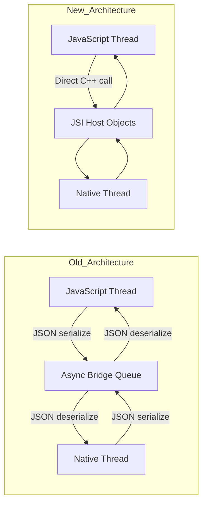
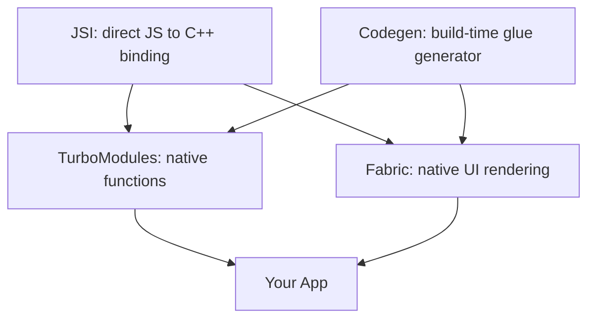
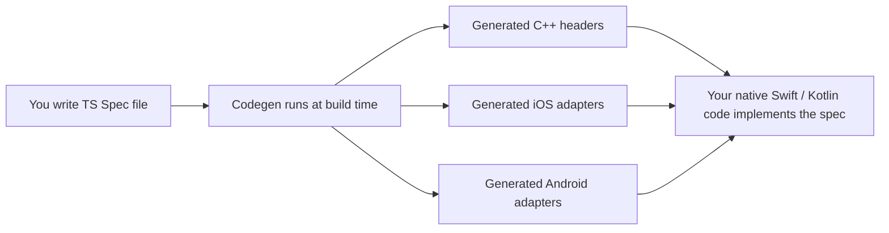
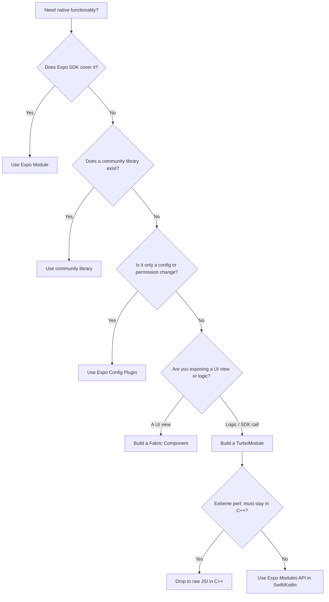
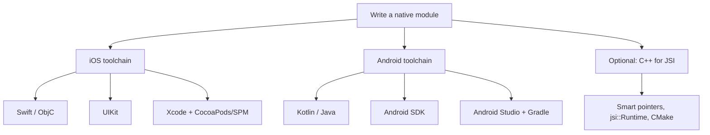
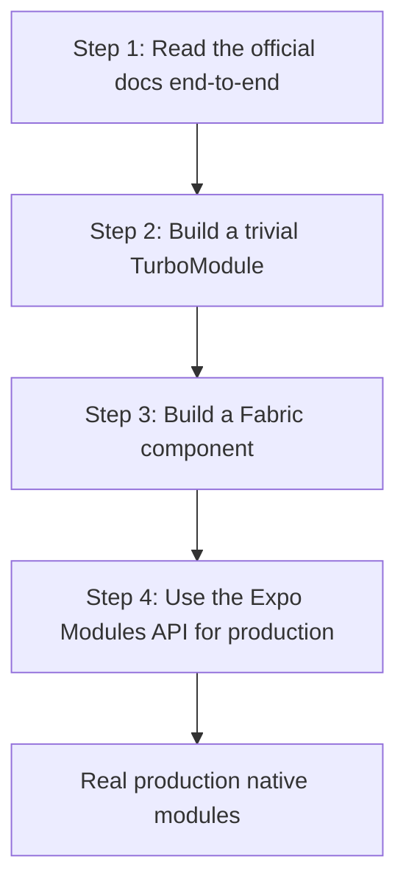

# Modules natifs et la Nouvelle Architecture

> JSI, Fabric, TurboModules et Codegen — ce qu'ils sont et quand vous devez écrire les vôtres.

---

## Table of Contents

1. [The New Architecture](#1-the-new-architecture)
2. [When to Write a Native Module](#2-when-to-write-a-native-module)
3. [Skills Needed](#3-skills-needed)
4. [Recommended Path](#4-recommended-path)

---

## 1. La Nouvelle Architecture

### Le problème de l'ancien bridge

Pour comprendre *pourquoi* React Native a reconstruit ses entrailles, il faut comprendre ce qui était lent.

Dans l'ancienne architecture, le JavaScript et le code natif vivaient dans deux mondes séparés. Votre JavaScript s'exécute dans un moteur JS (Hermes ou JSC). Votre UI, votre radio Bluetooth, votre caméra — tout cela vit en territoire natif (Swift/Objective-C sur iOS, Kotlin/Java sur Android). Ces deux mondes ne partagent pas de mémoire et ne parlent pas la même langue. Alors chaque fois que le JS voulait dire au natif « affiche cette vue » ou « appelle cette fonction Bluetooth », la requête était sérialisée en chaîne JSON, déposée dans une file de messages asynchrone (le fameux « bridge »), puis désérialisée de l'autre côté. La réponse revenait par le même chemin.

Imaginez deux personnes dans des pièces séparées qui communiquent en glissant des notes manuscrites sous une porte. Ça fonctionne, mais c'est lent, c'est asynchrone par défaut (vous glissez une note et vous attendez — vous ne pouvez pas obtenir de réponse instantanée), et vous ne pouvez pas avoir de conversation en temps réel.

Trois propriétés de ce bridge causaient des problèmes réels et visibles :

- **Tout était asynchrone.** Même une question à réponse instantanée (« quelle est la largeur de cette vue ? ») imposait un aller-retour. Vous ne pouviez pas bloquer pour obtenir la valeur *maintenant*.
- **Tout était sérialisé.** Passer une image de 5 Mo signifiait transformer 5 Mo en chaîne JSON puis les reparser — pur surcoût.
- **C'était une seule file partagée.** Un trafic intense (scroll rapide, beaucoup de touches) congestionnait le bridge, et des frames étaient perdues.

> **L'analogie qui marque :** l'ancien bridge revient à appeler une API REST pour *chaque* appel de fonction entre vos propres modules — JSON en entrée, JSON en sortie, sur un réseau incontournable. La Nouvelle Architecture, c'est remplacer ces appels HTTP par un appel de fonction normal, dans le même processus.

Sur le web, vous n'avez jamais eu ce problème : votre JS *est* dans le même processus que le DOM. Appeler `element.offsetWidth` est instantané et synchrone. La Nouvelle Architecture de React Native est, en grande partie, un effort pour rendre le natif tout aussi immédiat.



La Nouvelle Architecture repose sur quatre piliers. Voici la carte avant de parcourir chacun d'eux :



| Pilier | Ce qu'il remplace | Rôle en une ligne |
| --- | --- | --- |
| **JSI** | Le bridge JSON lui-même | Permet au JS de détenir et d'appeler directement des objets C++, de façon synchrone |
| **TurboModules** | `NativeModules` | *Fonctions/logique* natives exposées au JS (lazy + typées) |
| **Fabric** | Le renderer « Paper » | *Vues UI* natives exposées à React |
| **Codegen** | La glue de bridge écrite à la main | Génère l'échafaudage C++/natif à partir de vos specs TS |

### JSI : JavaScript Interface

JSI est le fondement de tout ce qui est nouveau. C'est une fine couche C++ qui permet au JavaScript de détenir des références directes vers des objets C++ — et d'appeler leurs méthodes de façon synchrone. Pas de sérialisation. Pas de bridge. Pas de file d'attente.

Le mécanisme : JSI expose la notion de **Host Object** — un objet C++ que le JavaScript traite comme un objet JS normal. Quand votre JS lit une propriété ou appelle une méthode dessus, cet accès est routé directement vers le code C++, dans le même processus. Aucune chaîne JSON n'est jamais créée.

Sur le web, c'est comparable à la façon dont votre code JS peut appeler `document.createElement()` et récupérer une véritable référence vers un nœud DOM vivant, et non une copie sérialisée. Vous détenez la vraie chose et la manipulez directement. JSI offre à React Native ce même type de liaison directe vers les objets natifs.

```tsx
// Conceptual: what JSI enables under the hood.
// JS can now hold a direct reference to a native (C++-backed) object.
const nativeModule = global.__turboModuleProxy('MyModule');

// This call goes directly to C++ -> Swift/Kotlin, no bridge, no JSON.
// It can return synchronously because there is no async queue in between.
const result = nativeModule.computeExpensiveThing(data);
```

Deux conséquences découlent de cette « liaison C++ directe » :

- **Les appels synchrones deviennent possibles.** Une méthode peut retourner une valeur immédiatement, comme une fonction normale. (L'ancien bridge en était physiquement incapable.)
- **Le moteur JS devient interchangeable.** Parce que JSI est une abstraction au-dessus d'« un moteur JS quelconque », React Native peut tourner sur Hermes, JSC, ou même V8 sans changer le reste du système.

> **Astuce de pro :** vous n'écrirez quasiment jamais de JSI/C++ brut vous-même. Voyez JSI comme la *plomberie*. TurboModules, Fabric et Codegen sont les *appareils* construits par-dessus, ceux avec lesquels vous interagissez réellement. Si le README d'une librairie se vante d'être « JSI-based », cela signifie généralement juste « rapide, synchrone, sans surcoût de bridge ».

### TurboModules : les modules natifs, reconstruits

Les TurboModules remplacent l'ancien système `NativeModules`. Un TurboModule est la manière, dans la Nouvelle Architecture, d'exposer de la **logique native** (une fonction, un appel de SDK, la lecture d'un capteur) au JavaScript. Deux améliorations clés par rapport à l'ancien système :

**1. Chargement paresseux (lazy loading).** Les anciens modules natifs étaient *tous* initialisés au démarrage de l'app, que vous les utilisiez ou non — chacun payait un coût d'init avant même l'apparition de votre premier écran. Les TurboModules se chargent au premier accès. Si votre app enregistre 40 modules natifs mais que l'écran courant n'en sollicite que 3, vous ne payez que pour ces 3. Cela améliore directement le temps de démarrage, ce qui compte beaucoup sur les appareils Android d'entrée de gamme.

**2. Sûreté de typage via Codegen.** Chaque TurboModule est décrit par un fichier de spec TypeScript. Codegen lit cette spec et en génère des interfaces C++/natives typées. Si votre JS appelle une méthode avec des types d'arguments incorrects, vous obtenez une erreur *à la compilation* plutôt qu'un crash mystérieux à l'exécution, enfoui au fond du code natif.

```tsx
// src/NativeMyModule.ts — a TurboModule spec file.
// By convention the filename starts with "Native" so Codegen finds it.
import type { TurboModule } from 'react-native';
import { TurboModuleRegistry } from 'react-native';

// The Spec interface is the contract between JS and native.
// Codegen turns each method below into a typed native signature.
export interface Spec extends TurboModule {
  multiply(a: number, b: number): number;        // synchronous, returns a number
  getDeviceName(): Promise<string>;              // async, returns a Promise
}

// getEnforcing throws a clear error if the native module isn't linked,
// instead of silently giving you `undefined` at the first call site.
export default TurboModuleRegistry.getEnforcing<Spec>('MyModule');
```

| Aspect | Ancien `NativeModules` | Nouveaux TurboModules |
| --- | --- | --- |
| Chargement | Tout en avance au démarrage | Paresseusement, au premier accès |
| Vérification de types | Aucune (crashs à l'exécution) | À la compilation via Codegen |
| Appels | Toujours async (bridge) | Sync *et* async pris en charge |
| Transfert de données | Sérialisé en JSON | Direct via JSI |

> **Piège :** une méthode TurboModule synchrone s'exécute *sur le JS thread*. Si vous faites quelque chose de réellement lent (un parsing de fichier de 200 ms) de façon synchrone, vous bloquez le JS thread et figez votre UI. Utilisez les méthodes synchrones pour des lookups rapides ; utilisez les méthodes retournant une `Promise` (`AsyncFunction`) pour tout ce qui est lourd.

### Fabric : le nouveau renderer

Fabric remplace l'ancien système de rendu (appelé « Paper » a posteriori). Là où les TurboModules exposent de la *logique* native, Fabric expose des *vues UI* natives à React et est responsable de transformer votre arbre de `<View>`/`<Text>` en véritables widgets natifs. Les plus grands gains :

- **Layout et mesure synchrones.** Sur l'ancienne architecture, mesurer une vue exigeait un aller-retour asynchrone. Fabric peut mesurer de façon synchrone, ce qui élimine le scintillement de layout que l'on voyait parfois au tout premier render (où le contenu apparaissait brièvement au mauvais endroit, puis se replaçait d'un coup).
- **Prise en charge de React concurrent.** Fabric est conçu pour fonctionner avec les fonctionnalités de React 18 comme `useTransition`, `useDeferredValue` et `Suspense`. L'ancien renderer ne pouvait pas les prendre en charge car il était fondamentalement asynchrone et ne pouvait ni interrompre ni reprioriser le travail.
- **Rendu multi-thread.** Fabric peut créer et mettre à jour son **shadow tree** (la copie C++ légère de votre hiérarchie de vues, utilisée pour calculer le layout) sur n'importe quel thread, et pas seulement sur un unique « shadow thread » dédié.

Fabric effectue le rendu en trois phases. Comprendre ce cycle de vie aide à raisonner sur le moment où les props et le layout atteignent réellement l'écran :


- **Render** — React exécute vos composants et produit un arbre d'éléments (du JS pur).
- **Commit** — Fabric construit/compare le shadow tree et exécute le layout (Yoga, en C++) pour attribuer à chaque nœud une position et une taille.
- **Mount** — le résultat calculé est appliqué aux vraies vues natives sur le UI thread.

Sur le web, c'est analogue à la façon dont le renderer concurrent de React 18 a remplacé l'ancien `ReactDOM.render` synchrone. Le moteur sous-jacent a dû changer avant que les nouvelles fonctionnalités puissent exister. Dans le navigateur, votre cible de « mount » est le DOM ; dans Fabric, ce sont des objets natifs `UIView`/`android.view.View`.

### Codegen : le générateur de glue

Codegen est l'outil de build qui lit vos fichiers de spec TypeScript et génère l'échafaudage C++ reliant le JS au code natif. Vous écrivez une spec `.ts`, et Codegen produit :

- Des fichiers d'en-tête C++ avec les signatures de méthodes correctes
- Du code adaptateur spécifique à la plateforme pour iOS (Objective-C++) et Android (JNI/C++)
- Une validation de types qui détecte, à la compilation, les écarts entre votre contrat JS et l'implémentation native

Voici où Codegen se situe dans le build :



Pourquoi c'est important : la spec TypeScript devient la **source de vérité unique**. Les types que vous déclarez en JS et les types que le code natif doit implémenter sont garantis cohérents, car les deux côtés sont générés à partir du même fichier. Changez la spec, recompilez, et tout code natif qui ne correspond plus échoue à la compilation.

C'est la pièce qui rend la Nouvelle Architecture praticable. Sans elle, vous écririez à la main du code de bridge C++ pour chaque module — ce qui est exactement ce que les premiers adoptants ont dû faire, et c'était pénible et propice aux erreurs.

> **Quand Codegen s'exécute-t-il ?** Il s'exécute automatiquement pendant le build natif (`pod install` sur iOS, le build Gradle sur Android, ou `expo prebuild`). Vous ne l'invoquez normalement jamais à la main — mais quand un build natif échoue en se plaignant d'un en-tête généré manquant, un cache Codegen périmé est un suspect de premier ordre. Un rebuild propre règle généralement le problème.

> **Fait clé :** la Nouvelle Architecture est activée par défaut à partir d'Expo SDK 52 et de React Native 0.76+. Si vous démarrez un nouveau projet aujourd'hui, vous y êtes déjà — mode bridgeless, Fabric et TurboModules sont actifs d'emblée. Vous n'avez pas besoin de les activer.

---

## 2. Quand écrire un module natif

### La règle des 95 %

Voici la vérité honnête : **la plupart des développeurs React Native n'ont jamais besoin d'écrire de module natif.** L'écosystème couvre déjà la grande majorité des cas d'usage :

- **Les Expo Modules** gèrent la caméra, le système de fichiers, les notifications, les haptics, les capteurs, le stockage sécurisé, la localisation, et des dizaines d'autres.
- **Les librairies communautaires** comme `react-native-reanimated`, `react-native-mmkv`, `react-native-ble-plx` et `react-native-vision-camera` couvrent des domaines critiques en performance qu'il serait pénible de construire vous-même.
- **Les Expo Config Plugins** vous permettent de modifier la configuration du projet natif (permissions, entitlements, paramètres de build) *sans écrire la moindre ligne de code natif*.

Avant d'écrire une seule ligne de Swift ou de Kotlin, fouillez la documentation de l'Expo SDK et le React Native Directory (reactnative.directory). Sérieusement. Le coût de *maintenance* de votre propre module natif à travers les versions d'OS iOS et Android, les mises à niveau de React Native et les sauts d'Expo SDK est bien plus élevé que ce que l'on imagine — chaque release annuelle de plateforme est une casse potentielle dont vous êtes désormais responsable.

> **Recadrez la décision :** écrire le module est la partie peu coûteuse. En *assumer la propriété* pendant trois ans à travers six releases d'OS et quatre mises à niveau de RN, c'est la partie coûteuse. Intégrez toujours la maintenance dans le calcul, pas seulement le développement initial.

### Les 5 % où vous devez passer au natif

Il existe des cas légitimes où vous avez réellement besoin d'écrire le vôtre :

**1. SDK propriétaires.** Votre entreprise dispose d'une librairie C++ interne pour la détection de fraude, ou un fournisseur vous remet un `.xcframework` (iOS) et un `.aar` (Android) closed-source. Aucun wrapper communautaire n'existe, et vous devez l'exposer au JS. C'est la raison légitime la plus courante.

**2. Code natif sur chemin critique (hot path).** Vous construisez du DSP audio temps réel, un pipeline de traitement d'image personnalisé, ou de la communication BLE avec un protocole binaire spécifique à haute fréquence. JavaScript, même avec Hermes, ne peut pas satisfaire les exigences de latence ou de débit, et le travail doit rester en natif (souvent C++).

**3. UI native personnalisée.** Vous devez encapsuler un composant UI spécifique à une plateforme — une carte native avec des surcouches personnalisées, un lecteur vidéo accéléré matériellement, ou un widget OEM sans équivalent React Native. Il s'agit d'un **composant Fabric** plutôt que d'un TurboModule, car vous exposez une *vue*, pas une *fonction*.

Utilisez cet arbre de décision avant de vous engager :



| Votre besoin | Bon outil | Pourquoi |
| --- | --- | --- |
| Caméra, notifications, stockage, capteurs | Expo Module | Déjà construit, maintenu pour vous |
| Animation haute perf, key-value store rapide | Librairie communautaire | Éprouvée, JSI-based |
| Ajouter une permission / un entitlement / un flag de build | Config Plugin | Aucun code natif à maintenir |
| Exposer au JS une fonction de SDK fournisseur | TurboModule (Expo Modules API) | Typé, lazy, gérable |
| Encapsuler un widget UI natif | Composant Fabric | S'intègre avec le renderer |
| Hot path C++ temps réel | JSI brut | Débit maximal, aucun surcoût |

### Un exemple concret : quand vous franchissez la ligne

Supposons que vous intégriez un SDK propriétaire de traitement audio que votre équipe matérielle a construit en C++. Aucun wrapper public n'existera jamais pour lui. Voici à quoi ressemble l'intégration vue de haut.

```tsx
// Step 1: Define the TypeScript spec — the contract.
// src/NativeAudioProcessor.ts
import type { TurboModule } from 'react-native';
import { TurboModuleRegistry } from 'react-native';

export interface Spec extends TurboModule {
  initialize(sampleRate: number, bufferSize: number): boolean; // sync setup
  processBuffer(inputBuffer: number[]): number[];              // hot path
  setParameter(name: string, value: number): void;            // fire-and-forget
  dispose(): void;                                            // cleanup
}

export default TurboModuleRegistry.getEnforcing<Spec>(
  'AudioProcessor'
);
```

```tsx
// Step 2: Use it in your component — it looks like any TS module.
import { useEffect } from 'react';
import AudioProcessor from './NativeAudioProcessor';

function AudioScreen() {
  useEffect(() => {
    // Synchronous call returning a boolean — only possible on the New Arch.
    const ok = AudioProcessor.initialize(44100, 512);
    if (!ok) console.error('Failed to initialize audio processor');

    // Always release native resources on unmount, or you leak them.
    return () => AudioProcessor.dispose();
  }, []);

  // ...render UI that calls AudioProcessor.processBuffer / setParameter
}
```

Les implémentations natives (Swift pour iOS, Kotlin pour Android) se lient ensuite à votre librairie C++ et implémentent les méthodes de la spec. Codegen gère la glue entre la spec et votre code natif, de sorte que le contrat JS ci-dessus et le code natif aient des types garantis cohérents.

> **Erreur courante :** se précipiter sur un module natif alors qu'une solution JavaScript fonctionne très bien. `react-native-reanimated` exécute les animations sur le UI thread *sans que vous écriviez le moindre code natif*. `expo-camera` encapsule l'API caméra dans son intégralité. Vérifiez ce qui existe avant de vous engager dans le fardeau de maintenance natif — le meilleur module natif est celui que vous n'avez pas eu à écrire.

> **L'équivalent web :** c'est comme décider entre écrire une extension de navigateur / un native messaging host personnalisé et utiliser une librairie JS existante. Vous ne construisez la lourde solution native que lorsqu'aucune librairie ne peut atteindre la capacité dont vous avez besoin.

---

## 3. Compétences nécessaires

### La vérité inconfortable

Écrire des modules natifs signifie écrire du code natif. Il n'y a pas d'échappatoire. Vous devez être compétent dans les langages, les systèmes de build et les IDE des plateformes — et, point crucial, vous avez besoin des *deux* plateformes, car un module qui ne fonctionne que sur iOS n'est qu'un demi-module. Voici ce que cela signifie concrètement, par plateforme.



### iOS

- **Swift** (ou Objective-C pour les bases de code plus anciennes). Vous avez besoin des types valeur vs types référence, des optionals, des closures, et du modèle de concurrence (`async/await`, actors). L'Expo Modules API est Swift-first, donc Swift est le choix pratique.
- **UIKit** pour encapsuler des vues natives existantes. La connaissance de SwiftUI aide pour les composants plus récents, mais la plupart des wrappers de vues React Native reposent encore sur UIKit en interne.
- **Xcode.** C'est ici que vous déboguerez les crashs natifs, lirez les stack traces natives, et que vous vous battrez avec le code signing, les entitlements et les capabilities. Il n'y a pas de raccourci pour contourner l'IDE.
- **CocoaPods et/ou SPM.** React Native utilise CocoaPods pour les dépendances iOS. Vous devez comprendre `Podfile`, `podspec`, et le fonctionnement du linking.

```bash
# Typical iOS native module workflow
cd ios
pod install                 # links native deps AND runs Codegen
open MyApp.xcworkspace      # open the WORKSPACE, not the .xcodeproj!

# Common gotcha: after editing the Podfile or adding a native dep, run:
cd ios && pod install && cd ..
# Use pod install (respects your lockfile), NOT pod update
# (which silently upgrades EVERY dependency and can break your build).
```

> **L'erreur de débutant iOS la plus fréquente :** ouvrir `MyApp.xcodeproj` au lieu de `MyApp.xcworkspace`. C'est le `.xcworkspace` qui connaît vos CocoaPods. Ouvrez le mauvais et rien ne se lie.

### Android

- **Kotlin** (ou Java pour le code historique). Kotlin est le choix par défaut pour les nouveaux développements Android et c'est ce qu'utilise l'Expo Modules API. Vous avez besoin des coroutines, des extension functions, de la null safety, et d'une compréhension du cycle de vie Android.
- **Android SDK.** Activities, Fragments, Views, le système de `Context`, le modèle de permissions à l'exécution, les intents. Même encapsuler un simple SDK vous y plonge.
- **Gradle.** Le système de build d'Android. Vous éditerez des fichiers `build.gradle`, gérerez des dépendances, et décrypterez des messages d'erreur de 200 lignes. La plupart des développeurs web trouvent que c'est la partie la plus pénible du travail natif.
- **Android Studio.** L'équivalent Android de Xcode : déboguer les crashs natifs, inspecter la hiérarchie de vues, profiler la performance.

```bash
# Typical Android native module workflow:
# In Android Studio: File -> Open -> select the android/ directory

# Common gotcha: Gradle caches very aggressively. When a build breaks
# for no obvious reason, clean first before debugging deeper:
cd android && ./gradlew clean && cd ..

# Nuclear option when Gradle is truly stuck (wipes caches + build output):
cd android
./gradlew clean
rm -rf .gradle
rm -rf app/build
cd ..
```

| | iOS | Android |
| --- | --- | --- |
| Langage | Swift / Objective-C | Kotlin / Java |
| Framework UI | UIKit (un peu de SwiftUI) | Système de View Android |
| IDE | Xcode | Android Studio |
| Build / deps | CocoaPods, SPM | Gradle |
| Le plus pénible pour les devs web | Signing & provisioning | Messages d'erreur Gradle |

### Bases du C++ pour JSI

Si vous écrivez un *module JSI brut* (une liaison C++ directe pour une performance maximale), il vous faut en plus :

- La syntaxe C++ de base (en-têtes, fichiers source, namespaces)
- Les smart pointers (`std::shared_ptr`, `std::unique_ptr`) et un sens de la propriété mémoire manuelle
- La compréhension de l'API `jsi::Runtime` (comment lire/écrire des valeurs JS depuis le C++)
- CMake pour les builds natifs multiplateformes

La plupart des développeurs n'ont besoin de rien de tout cela. Les TurboModules avec Swift/Kotlin suffisent pour ~99 % du travail sur les modules natifs. Le C++ au niveau JSI est réservé aux cas où vous construisez quelque chose comme un moteur de stockage (`react-native-mmkv`) ou un runtime d'animation (`react-native-reanimated`) — un cœur partagé qui doit s'exécuter de façon identique et rapide sur les deux plateformes.

> **Évaluation honnête :** si vous n'avez jamais ouvert Xcode ou Android Studio, prévoyez 2 à 4 semaines d'apprentissage avant de tenter votre premier module natif. Le côté React Native est la partie facile. Le tooling, le débogage et les systèmes de build spécifiques aux plateformes, c'est là que réside la vraie complexité — et là que vous perdrez le plus de temps.

### L'avantage de l'Expo Modules API

L'Expo Modules API abaisse considérablement la barrière. Au lieu d'implémenter des interfaces TurboModule brutes en Objective-C++ et Java/JNI, vous écrivez du Swift et du Kotlin idiomatiques sur une API propre et déclarative. Elle utilise toujours les TurboModules et Fabric (et JSI) en interne — elle masque simplement le boilerplate.

```tsx
// ios/MyModule.swift — using the Expo Modules API
import ExpoModulesCore

public class MyModule: Module {
  // A declarative "definition" describes what you expose to JS.
  public func definition() -> ModuleDefinition {
    Name("MyModule")                                   // JS-visible name

    Function("multiply") { (a: Double, b: Double) -> Double in
      return a * b                                     // runs synchronously
    }

    AsyncFunction("getDeviceName") { () -> String in
      return UIDevice.current.name                     // returns a Promise to JS
    }
  }
}
```

```tsx
// android/src/main/java/MyModule.kt — using the Expo Modules API
package com.myapp.mymodule

import expo.modules.kotlin.modules.Module
import expo.modules.kotlin.modules.ModuleDefinition

class MyModule : Module() {
  // Same declarative shape as iOS — the API is intentionally symmetric.
  override fun definition() = ModuleDefinition {
    Name("MyModule")

    Function("multiply") { a: Double, b: Double ->
      a * b
    }

    AsyncFunction("getDeviceName") {
      android.os.Build.MODEL
    }
  }
}
```

Remarquez comme les définitions iOS et Android se reflètent l'une l'autre — mêmes noms de méthodes, mêmes formes. Cette symétrie est tout l'intérêt : vous raisonnez sur un seul modèle mental et l'appliquez deux fois. C'est radicalement plus simple que l'approche TurboModule brute, et c'est ce qu'il faut utiliser pour le travail de production, à moins d'avoir une raison spécifique de descendre à un niveau plus bas.

| Approche | Ce que vous écrivez | Boilerplate | Quand l'utiliser |
| --- | --- | --- | --- |
| JSI brut (C++) | C++ sur `jsi::Runtime` | Maximal | Cœur critique en perf et partagé uniquement |
| TurboModule brut | Obj-C++ + Java/JNI | Élevé | Rarement — apprentissage, ou cas particuliers |
| Expo Modules API | Swift + Kotlin | Faible | **Par défaut pour la production** |

> **Astuce de pro :** même si vous livrez des TurboModules bruts dans un exercice d'apprentissage, migrez les vrais modules de production vers l'Expo Modules API. La quantité de glue qu'elle élimine fait la différence entre un module qu'une seule personne peut maintenir et un module qui nécessite un spécialiste natif.

---

## 4. Le parcours recommandé

### Une séquence d'apprentissage concrète

N'essayez pas de tout apprendre d'un coup. La Nouvelle Architecture est un sujet profond, et tenter d'absorber JSI, Fabric, TurboModules et Codegen simultanément mène à la confusion. Apprenez-la dans l'ordre ci-dessous — chaque étape construit le modèle mental dont la suivante a besoin.



### Étape 1 : lire la documentation officielle de bout en bout

L'équipe React Native a réécrit la documentation de l'architecture en 2024. Lisez ces pages, dans l'ordre :

1. **Architecture Overview** — comprendre les quatre piliers (JSI, Fabric, TurboModules, Codegen)
2. **Rendering Pipeline** — comment Fabric effectue le rendu : les phases Render → Commit → Mount
3. **Threading Model** — quel travail se déroule sur quel thread (JS thread, UI thread, arrière-plan)

Ne survolez pas. Lisez chaque page. La documentation est aujourd'hui réellement bien écrite et explique le *pourquoi* derrière chaque décision de conception, pas seulement la surface de l'API. La lire en premier vous épargnera des jours de confusion plus tard.

### Étape 2 : construire un TurboModule trivial

Commencez par quelque chose d'une simplicité embarrassante. Un module qui prend deux nombres et retourne leur somme. Le but n'est pas de construire quelque chose d'utile — c'est de vivre le *pipeline complet* de bout en bout au moins une fois :

1. Écrire la spec TypeScript
2. Exécuter Codegen et regarder réellement ce qu'il produit
3. Implémenter le côté natif sur iOS (Swift)
4. Implémenter le côté natif sur Android (Kotlin)
5. L'appeler depuis un composant React
6. Vérifier qu'il fonctionne sur les deux plateformes

```bash
# If using Expo, scaffold a local module (lives inside your app):
npx create-expo-module@latest --local my-turbo-module

# This generates the full structure for you:
# modules/my-turbo-module/
#   src/            <- TypeScript spec and JS interface
#   ios/            <- Swift implementation
#   android/        <- Kotlin implementation
#   expo-module.config.json
```

> **Erreur courante :** tenter d'intégrer un SDK fournisseur complexe comme *premier* module natif. Si votre premier module est aussi votre première utilisation de Xcode, vous serez incapable de savoir si un bug se trouve dans le code de votre module, votre configuration de build, votre linking, ou simplement votre incompréhension de la plateforme. Commencez trivial. Confirmez que le pipeline fonctionne. Puis ajoutez de la complexité une couche à la fois.

### Étape 3 : construire un composant Fabric

Un composant Fabric est une vue UI native exposée à React. C'est plus difficile qu'un TurboModule car vous manipulez désormais le pipeline de rendu, les props de vue et la gestion des événements — pas seulement des appels de fonctions.

Commencez par une vue native simple — peut-être une boîte colorée qui accepte une prop `color` et déclenche un événement `onPress`. Là encore, le but est de comprendre la mécanique, pas de construire quelque chose de livrable :

1. Définir la spec du composant avec Codegen
2. Implémenter la vue native sur iOS
3. Implémenter la vue native sur Android
4. L'utiliser comme composant React avec des props et des événements typés

Cette étape vous apprend comment fonctionne le shadow tree de Fabric, comment les props descendent du JS jusque dans les vues natives, et comment les événements remontent vers le JS. Ce sont exactement les rouages que vous déboguerez dans le travail réel sur les composants.

> **Pourquoi le TurboModule d'abord, puis Fabric ?** Un TurboModule, c'est « appeler une fonction native et récupérer une valeur » — un concept unique. Un composant Fabric ajoute par-dessus les props, le layout, le cycle de vie et les événements. Apprendre le plus simple en premier permet à chaque nouvelle idée de se poser sur des bases solides.

### Étape 4 : utiliser l'Expo Modules API en production

Une fois les concepts sous-jacents des étapes 2 et 3 compris, passez à l'Expo Modules API pour le travail réel. Elle abstrait le boilerplate tout en utilisant toujours les TurboModules et Fabric (et JSI) en interne — le modèle mental que vous avez construit s'applique donc encore ; vous écrivez simplement bien moins de glue.

L'Expo Modules API vous offre :

- Une seule API Swift/Kotlin au lieu d'Objective-C++ et JNI
- Une prise en charge native des vues, des événements, des shared objects et des hooks de cycle de vie
- L'intégration avec EAS Build et le système de config plugins d'Expo
- L'intégration automatique de Codegen (vous ne l'exécutez pas à la main)

```bash
# The production workflow:

# 1. Create the module (standalone, publishable package)
npx create-expo-module@latest my-real-module

# 2. Write your Swift and Kotlin implementations
# 3. Add native SDK dependencies in the .podspec (iOS) / build.gradle (Android)

# 4. Regenerate native projects, then build & run on each platform
npx expo prebuild --clean   # regenerates ios/ and android/ from config
npx expo run:ios
npx expo run:android
```

### Ce qu'il faut ignorer (pour l'instant)

- **Les liaisons JSI brutes.** À moins de construire un cœur C++ partagé critique en performance, l'Expo Modules API ou un TurboModule standard suffit — et est bien plus facile à maintenir.
- **Écrire votre propre renderer Fabric.** C'est un territoire d'internals profonds. Utilisez les API de wrapping de composants ; ne réimplémentez pas le renderer.
- **Les internals du mode bridgeless.** C'est désormais le défaut. Vous en bénéficiez automatiquement. Vous n'avez pas besoin d'en comprendre l'implémentation pour livrer des apps par-dessus.

| Sujet | À apprendre maintenant ? | Raison |
| --- | --- | --- |
| TurboModule via l'Expo Modules API | Oui | Votre outil du quotidien |
| Bases des composants Fabric | Oui | Nécessaire pour de l'UI native personnalisée |
| Comportement de Codegen (ce qu'il émet) | Légèrement | Aide à déboguer les échecs de build |
| JSI brut / C++ | Plus tard / peut-être jamais | Uniquement pour les cœurs de perf partagés |
| Renderer Fabric personnalisé | Non | Pur internals |

La Nouvelle Architecture est puissante, mais gardez en tête ce qu'elle est : de l'**infrastructure**. Votre objectif en tant que développeur d'applications est de la comprendre suffisamment pour prendre des décisions éclairées — et d'écrire un module natif quand (et *seulement* quand) l'écosystème ne couvre réellement pas vos besoins.

---