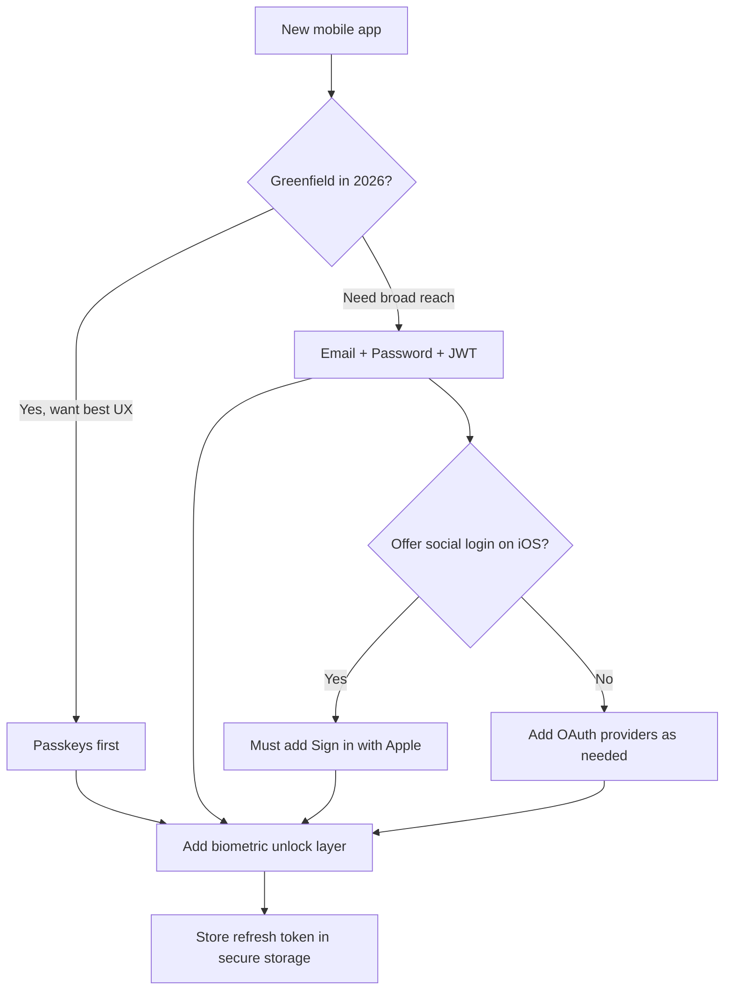
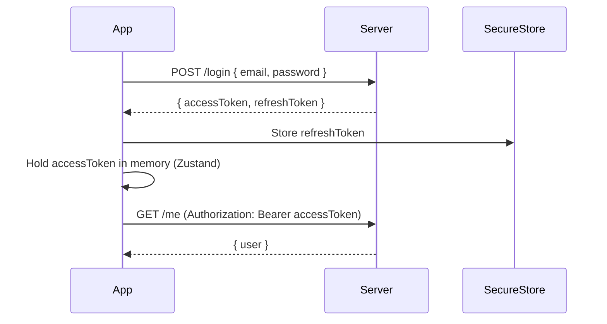
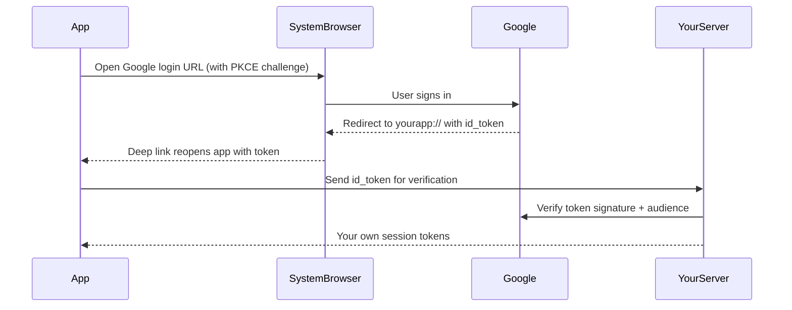
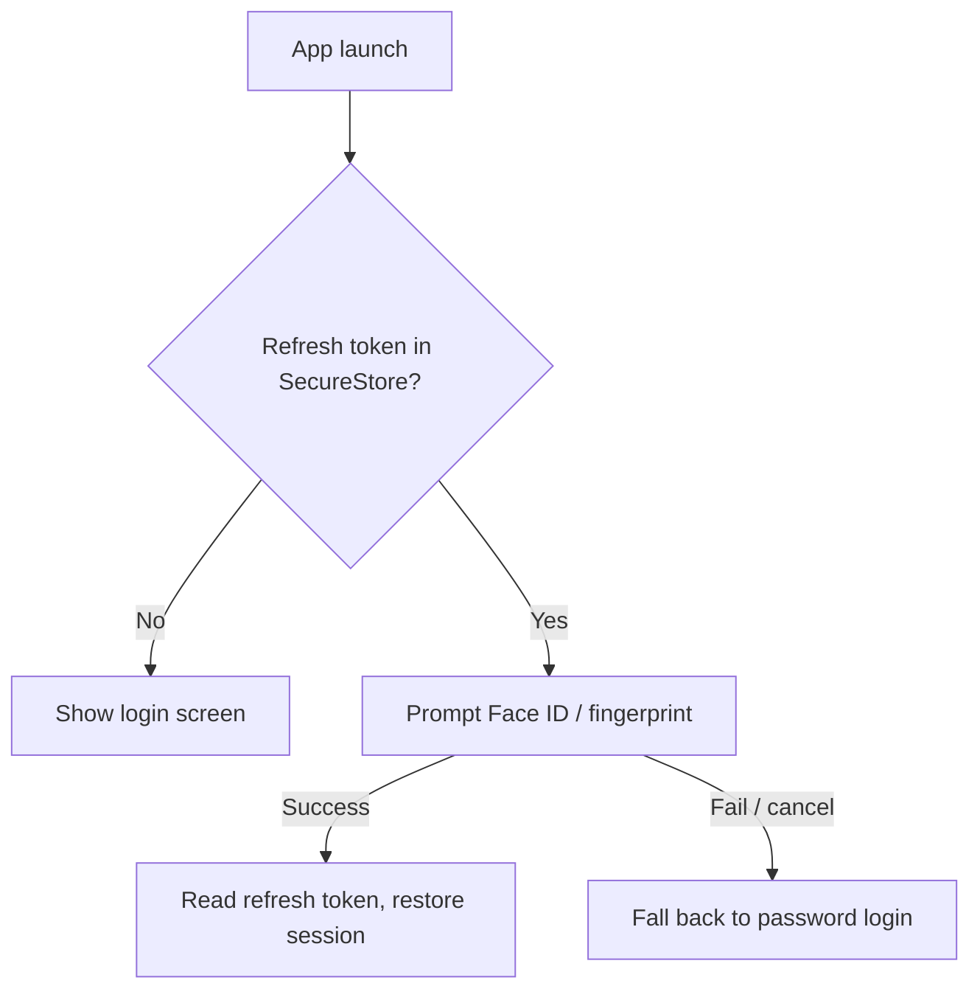
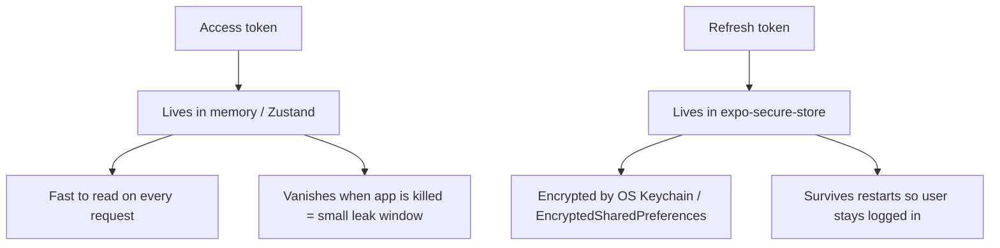
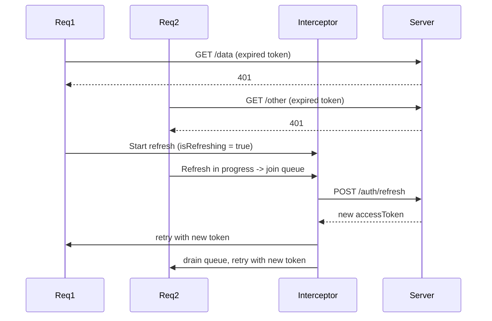
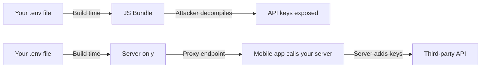
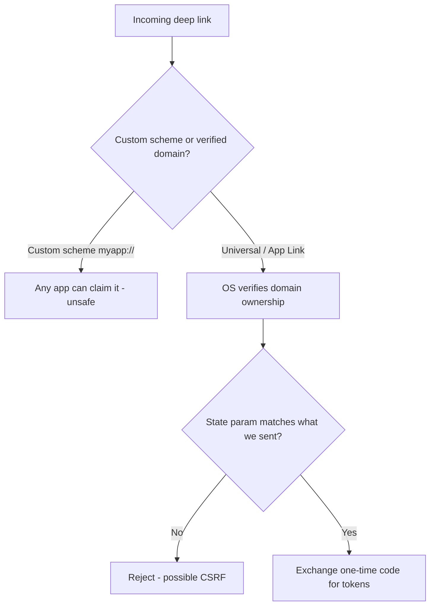

# Authentification et sécurité : protéger votre application mobile

> Patterns d'authentification, stockage des tokens, déverrouillage biométrique et durcissement de sécurité — ce qui sépare les applications jouets des applications de production.

---

## Table of Contents

1. [Auth Patterns](#1-auth-patterns)
2. [Auth Providers](#2-auth-providers)
3. [Token Handling](#3-token-handling)
4. [Security Hardening](#4-security-hardening)

---

## 1. Patterns d'authentification

Sur le web, l'authentification est relativement simple : vous définissez un cookie HttpOnly ou vous stockez un JWT en mémoire, et le navigateur gère le reste. Le mobile est une tout autre bête. Il n'y a pas de sandbox de navigateur, pas de cookie jar géré par un runtime de confiance. Votre application est un binaire posé sur un appareil que vous ne contrôlez pas, fonctionnant sur un OS qui peut être rooté, patché ou en retard de trois versions. Les patterns d'authentification que vous choisissez doivent tenir compte de tout cela.

### Pourquoi l'authentification mobile est fondamentalement différente

Imaginez le navigateur web comme un appartement loué avec un propriétaire strict. Le propriétaire (le navigateur) applique des règles que vous ne pouvez pas contourner : les cookies marqués `HttpOnly` sont invisibles pour JavaScript, les cookies `Secure` ne circulent que sur HTTPS, et la same-origin policy isole les autres sites. Vous héritez gratuitement d'une énorme quantité de sécurité simplement en y vivant.

Une application mobile est une maison que vous possédez entièrement, sur un terrain que vous ne contrôlez pas. Il n'y a aucun propriétaire pour faire respecter les règles. Il n'y a pas de cookies au sens du navigateur — votre client HTTP (fetch/axios) n'attache pas automatiquement les identifiants, ne les persiste pas et ne les fait pas expirer. **C'est vous le navigateur, désormais.** Chaque garantie que le web vous offrait gratuitement, vous devez la reconstruire à la main : où vit le token, quand il expire, comment il se rafraîchit, et qui peut le lire sur le disque.

> **Modèle mental :** Sur le web, le runtime est votre garde du corps. Sur mobile, c'est VOUS le garde du corps, et l'appareil de l'utilisateur peut jouer contre vous (rooté, jailbreaké, infesté de malwares, ou inspecté avec un debugger). Partez du principe que l'appareil est hostile et concevez en conséquence.

Voici le flux de décision de haut niveau que la plupart des équipes suivent au moment de choisir un pattern d'authentification :



Parcourons les patterns qui comptent, du plus courant au plus émergent.

### Email + Password avec JWT

Le classique. L'utilisateur envoie ses identifiants, votre serveur les valide et renvoie un access token (à courte durée de vie) ainsi qu'un refresh token (à longue durée de vie). C'est la base que vous devriez comprendre, même si vous ne l'implémentez jamais de zéro.

Pourquoi deux tokens au lieu d'un ? C'est un compromis délibéré entre sécurité et confort :

- L'**access token** a une courte durée de vie (quelques minutes). Il est envoyé à chaque requête API. Comme il expire vite, un access token fuité n'est exploitable que pendant une fenêtre minuscule.
- Le **refresh token** a une longue durée de vie (jours/semaines). Il sert *uniquement* à émettre de nouveaux access tokens, et il vit derrière votre stockage le plus solide. Il est rarement transmis, donc il fuite rarement.

C'est la même logique qu'à l'hôtel : votre carte-clé de chambre (access token) expire au moment du départ et n'ouvre qu'une seule porte, tandis que votre passeport à la réception (refresh token) est ce qui prouve qui vous êtes lorsque vous avez besoin d'une nouvelle carte.



```tsx
// Simplified login flow
import * as SecureStore from "expo-secure-store";
import { useAuthStore } from "@/stores/auth";

async function login(email: string, password: string) {
  const res = await fetch(`${API_URL}/auth/login`, {
    method: "POST",
    headers: { "Content-Type": "application/json" },
    body: JSON.stringify({ email, password }),
  });

  if (!res.ok) {
    // Surface a generic error — never leak "wrong password" vs "no such user",
    // that tells an attacker which emails are registered.
    throw new Error("Invalid credentials");
  }

  const { accessToken, refreshToken } = await res.json();

  // Refresh token goes to encrypted storage — never plain AsyncStorage
  await SecureStore.setItemAsync("refreshToken", refreshToken);

  // Access token stays in memory — fast, and dies with the process
  useAuthStore.getState().setAccessToken(accessToken);
}
```

> **Piège :** Ne stockez jamais l'access token dans AsyncStorage ou MMKV sans chiffrement. Sur un appareil Android rooté, ce sont des fichiers en clair posés dans `/data/data/your.app/`. Utilisez `expo-secure-store` pour tout ce qui est sensible — il s'appuie sur le Keychain sur iOS et sur EncryptedSharedPreferences sur Android, tous deux adossés à un chiffrement au niveau matériel.

> **Astuce de pro :** Renvoyez toujours la même erreur générique pour « utilisateur introuvable » et « mauvais mot de passe ». Des messages différents permettent à un attaquant d'énumérer les emails possédant un compte — un cadeau de reconnaissance gratuit avant une attaque par credential stuffing.

### OAuth (Google, Apple, Facebook, GitHub)

OAuth sur mobile n'est pas la même chose qu'OAuth sur le web. Sur le web, vous redirigez la page entière vers Google, et Google redirige vers une URL dont vous lisez les query params. Une application mobile n'a pas de « page » à rediriger ni d'URL de callback serveur que l'OS vous renverra automatiquement. À la place, vous utilisez `expo-auth-session`, qui ouvre la connexion dans le **navigateur système** (et non une fausse webview in-app — Google les bloque) et capte le **retour par deep link** vers votre application.

Voici ce qui se passe réellement sous le capot :



```tsx
import * as AuthSession from "expo-auth-session";
import * as Google from "expo-auth-session/providers/google";

export function useGoogleAuth() {
  const [request, response, promptAsync] = Google.useAuthRequest({
    iosClientId: process.env.EXPO_PUBLIC_GOOGLE_IOS_CLIENT_ID,
    androidClientId: process.env.EXPO_PUBLIC_GOOGLE_ANDROID_CLIENT_ID,
  });

  useEffect(() => {
    if (response?.type === "success") {
      const { id_token } = response.params;
      // Send id_token to YOUR server — never trust it client-side alone.
      // The server verifies the signature, issuer, audience, and expiry
      // before it trusts the identity claim.
      authenticateWithServer(id_token);
    }
  }, [response]);

  return { promptAsync, isReady: !!request };
}
```

> **Pourquoi l'envoyer à votre serveur ?** L'`id_token` est une assertion signée de Google qui dit « ceci est l'utilisateur X ». N'importe qui peut fabriquer un *faux* JSON qui dit la même chose. Seul votre serveur, en vérifiant cryptographiquement la signature de Google, peut savoir qu'il est authentique. Faire confiance à un `id_token` côté client seul, c'est comme accepter une photocopie de passeport — vérifiez-le à la source.

### Sign in with Apple

Si votre application propose un quelconque login social tiers sur iOS, Apple exige que vous proposiez également Sign in with Apple. Ce n'est pas optionnel — votre application sera rejetée lors de la review sans cela (App Store Review Guideline 4.8). La bonne nouvelle : `expo-apple-authentication` rend cela indolore.

```tsx
import * as AppleAuthentication from "expo-apple-authentication";

async function signInWithApple() {
  const credential = await AppleAuthentication.signInAsync({
    requestedScopes: [
      AppleAuthentication.AppleAuthenticationScope.FULL_NAME,
      AppleAuthentication.AppleAuthenticationScope.EMAIL,
    ],
  });
  // credential.identityToken -> send to your server to verify
  return credential.identityToken;
}
```

> **Piège :** Apple n'envoie le nom et l'email de l'utilisateur **qu'une seule fois** — lors de toute première autorisation. Si vous ne les persistez pas à ce moment-là, ils sont perdus pour toujours (les connexions suivantes renvoient `null` pour ces champs). Sauvegardez-les côté serveur à la première connexion.

### Déverrouillage biométrique

C'est le concept le plus mal compris de l'authentification mobile, alors lisez-le deux fois : **la biométrie n'est pas une méthode d'authentification — c'est un verrou de confort local.**

Face ID ne vous connecte pas à votre serveur. Votre serveur n'a jamais vu le visage de l'utilisateur. Ce qui se passe réellement, c'est : l'utilisateur s'authentifie *une fois* avec de vrais identifiants, vous stockez le refresh token dans le secure storage, et lors des lancements ultérieurs vous exigez un scan Face ID / d'empreinte avant d'accepter de *relire ce token*. Le contrôle biométrique est un verrou sur le tiroir où vous rangez la clé, et non la clé elle-même.



```tsx
import * as LocalAuthentication from "expo-local-authentication";
import * as SecureStore from "expo-secure-store";

async function biometricUnlock(): Promise<string | null> {
  const hasHardware = await LocalAuthentication.hasHardwareAsync();
  const isEnrolled = await LocalAuthentication.isEnrolledAsync();

  // Always check BOTH: the device may have a sensor but no enrolled face/finger
  if (!hasHardware || !isEnrolled) return null;

  const result = await LocalAuthentication.authenticateAsync({
    promptMessage: "Unlock to continue",
    fallbackLabel: "Use password", // shown after a failed scan
  });

  if (result.success) {
    return SecureStore.getItemAsync("refreshToken");
  }

  return null;
}
```

> **Astuce de pro :** `expo-secure-store` peut lier une valeur stockée directement à l'authentification biométrique via `requireAuthentication: true`. Ainsi, l'OS lui-même refuse de libérer la valeur sans un scan réussi — plus solide que de vérifier `authenticateAsync()` vous-même puis de lire une entrée non protégée, car il n'y a aucun interstice par lequel un attaquant pourrait se glisser.

### Magic Links et Passkeys

Les magic links fonctionnent de la même manière que sur le web — un email est envoyé, l'utilisateur clique dessus, le deep link ouvre l'application. Assurez-vous simplement de valider le domaine du deep link avec les Universal Links (iOS) et les App Links (Android), sinon n'importe quelle application pourrait enregistrer votre custom scheme et intercepter ce lien (abordé en Section 4).

Les passkeys (WebAuthn) sont le standard émergent. Au lieu d'un mot de passe, l'appareil génère une paire de clés publique/privée ; la clé privée ne quitte jamais le matériel sécurisé, et la connexion est un défi cryptographique débloqué par Face ID ou l'empreinte. Il n'y a aucun secret partagé à hameçonner, faire fuiter ou réutiliser. iOS et Android les supportent désormais nativement, et des bibliothèques comme `react-native-passkey` gagnent en maturité. Elles éliminent entièrement les mots de passe. Si vous démarrez une nouvelle application en 2026, les passkeys méritent une sérieuse considération.

| Pattern | Friction UX | Résistant au phishing | Quand l'utiliser |
|---|---|---|---|
| Email + Password | Moyenne | Non | Base ; large portée ; vous contrôlez tout |
| OAuth (Google/etc.) | Faible | Partiel | Onboarding rapide, aucun mot de passe à gérer |
| Sign in with Apple | Faible | Partiel | Obligatoire sur iOS si vous proposez un login social |
| Magic link | Faible | Partiel | Sans mot de passe sans nouvelle infra ; utilisateurs centrés email |
| Passkeys | Très faible | Oui | Nouvelles apps visant une sécurité + UX de premier ordre |
| Déverrouillage biométrique | Très faible | N/A (verrou local) | À superposer SUR l'un des précédents pour la ré-entrée |

---

## 2. Fournisseurs d'authentification

Vous pourriez construire l'authentification vous-même. Vous ne devriez pas. La surface d'attaque — hashage des mots de passe, rotation des tokens, rate limiting, vérification d'email, récupération de compte, gestion de l'état OAuth, MFA — est énorme, et une seule erreur crée une vraie vulnérabilité. C'est le cas canonique du « ne réinventez pas votre propre crypto » : les modes de défaillance sont silencieux (votre application fonctionne parfaitement jusqu'au jour où vous êtes compromis) et les conséquences sont catastrophiques. Utilisez un provider.

Voyez un fournisseur d'authentification comme une entreprise de coffres-forts. Vous *pourriez* souder votre propre coffre, mais une seule charnière faible négligée fait tomber l'ensemble, et vous ne découvrirez le défaut que lorsque quelqu'un l'exploitera. Des spécialistes qui ne font que construire des coffres mettront les charnières au bon endroit.

Voici un classement tranché pour les projets React Native.

### Clerk — Le meilleur pour la plupart des apps RN

Clerk est conçu spécifiquement pour les frameworks frontend modernes et dispose d'un SDK Expo de premier ordre. Vous obtenez des composants UI préconçus, la gestion de session, l'authentification multi-facteur et le support des organisations dès le départ. La DX est exceptionnelle — pour beaucoup d'apps, vous pouvez être entièrement authentifié en moins d'une heure.

```tsx
// app/_layout.tsx with Clerk
import { ClerkProvider, ClerkLoaded } from "@clerk/clerk-expo";
import { tokenCache } from "@/lib/token-cache";

export default function RootLayout() {
  return (
    <ClerkProvider
      publishableKey={process.env.EXPO_PUBLIC_CLERK_PUBLISHABLE_KEY!}
      tokenCache={tokenCache}
    >
      <ClerkLoaded>
        <Slot />
      </ClerkLoaded>
    </ClerkProvider>
  );
}
```

```tsx
// lib/token-cache.ts — Clerk needs you to provide secure storage
import * as SecureStore from "expo-secure-store";
import { TokenCache } from "@clerk/clerk-expo";

export const tokenCache: TokenCache = {
  async getToken(key: string) {
    return SecureStore.getItemAsync(key);
  },
  async saveToken(key: string, value: string) {
    await SecureStore.setItemAsync(key, value);
  },
};
```

> **Notez le pattern :** même avec un provider managé, c'est *vous* qui décidez où le token vit physiquement. Clerk gère le protocole ; vous lui fournissez un adaptateur de secure storage. C'est le thème récurrent de l'authentification mobile — le provider ne peut jamais présumer de votre stockage à votre place.

**Compromis :** Clerk est un service hébergé avec un palier gratuit jusqu'à 10 000 MAU. Au-delà, vous payez. Si le vendor lock-in vous inquiète, regardez ailleurs.

### Supabase Auth — La meilleure option open source

Supabase vous donne une base de données Postgres, du temps réel, du stockage et de l'authentification dans un seul package. Le module d'authentification supporte email/mot de passe, OAuth, OTP par téléphone et magic links, et il se branche directement sur la Row Level Security de Postgres pour que votre base impose « les utilisateurs ne peuvent lire que leurs propres lignes ». Il est open source et auto-hébergeable. Le palier gratuit est généreux (50 000 MAU).

```tsx
import { createClient } from "@supabase/supabase-js";
import AsyncStorage from "@react-native-async-storage/async-storage";

// Supabase wants a storage adapter; for the session it persists, use a
// secure-store-backed adapter rather than plain AsyncStorage in production.
export const supabase = createClient(URL, ANON_KEY, {
  auth: { storage: AsyncStorage, autoRefreshToken: true, persistSession: true },
});

const { data, error } = await supabase.auth.signInWithPassword({
  email,
  password,
});
```

### Firebase Auth — Éprouvé à grande échelle

Firebase Auth existe depuis des années et gère des milliards d'authentifications. L'intégration React Native via `@react-native-firebase/auth` est solide. L'inconvénient : Firebase tire des dépendances natives qui alourdissent les builds EAS et nécessitent un dev client personnalisé (il ne fonctionne pas dans Expo Go), et vous êtes enfermé dans l'écosystème Google Cloud.

### Auth0 — L'option entreprise

Auth0 (désormais partie d'Okta) est ce vers quoi vous vous tournez lorsque les exigences incluent SAML, LDAP ou le SSO d'entreprise. C'est surdimensionné pour la plupart des apps indé mais indispensable si vos utilisateurs sont des entreprises dont les départements informatiques exigent « se connecter avec notre fournisseur d'identité d'entreprise ».

### Better Auth — Le nouveau venu

Better Auth est une bibliothèque d'authentification plus récente, TypeScript-first, auto-hébergeable. Elle est agnostique au framework et dispose d'un écosystème de plugins en pleine croissance. Si vous voulez un contrôle total sur votre serveur d'authentification sans tout construire de zéro, elle mérite d'être évaluée — vous obtenez la structure d'une bibliothèque sans abandonner vos données à un service hébergé.

| Provider | Hébergement | Palier gratuit | Idéal quand |
|---|---|---|---|
| Clerk | Hébergé | 10k MAU | Vous voulez livrer le plus vite avec une excellente DX |
| Supabase | Hébergé ou auto-hébergé | 50k MAU | Vous avez aussi besoin d'une base + stockage dans une seule stack |
| Firebase | Hébergé | Généreux | Vous êtes déjà sur Google Cloud / besoin d'une énorme échelle |
| Auth0 | Hébergé | Petit | Exigences SSO d'entreprise, SAML, LDAP |
| Better Auth | Auto-hébergé | N/A (votre infra) | Souveraineté totale des données, contrôle TypeScript |

> **Recommandation :** Commencez par Clerk si vous voulez livrer vite. Passez à Supabase si vous avez besoin d'un backend intégré. Utilisez Better Auth ou Supabase auto-hébergé si vous avez besoin d'une souveraineté totale des données. Quoi que vous choisissiez, ne laissez pas le « je vais juste le construire moi-même » revenir en douce — le temps que vous économisez est remboursé avec intérêts dès le premier audit de sécurité ou la première brèche qui force une réécriture.

---

## 3. Gestion des tokens

Obtenir des tokens est la partie facile. Les gérer correctement tout au long du cycle de vie de l'application — arrière-plan, premier plan, expiré, révoqué, de nombreuses requêtes lancées en même temps — c'est là que vivent la plupart des bugs d'authentification. C'est dans cette section que les apps « ça marche sur ma machine » s'effondrent discrètement en production.

### La règle d'or

**Access token en mémoire. Refresh token dans le secure storage. Rien de sensible dans AsyncStorage, MMKV ou le bundle JS.**

Sur le web, vous pourriez stocker les tokens dans un cookie HttpOnly et laisser le navigateur gérer le refresh. En React Native, il n'y a pas de navigateur. C'est vous le navigateur. Vous gérez chaque aspect du cycle de vie du token.

Pourquoi ces emplacements spécifiques pour chaque token ?



L'access token est lu à *chaque requête*, il doit donc être rapide — la mémoire est instantanée. C'est aussi le token le plus fréquemment exposé (il circule constamment sur le réseau), donc le garder éphémère limite le rayon d'impact en cas de fuite. Le refresh token est lu rarement mais doit survivre aux redémarrages de l'application, ce qui lui vaut sa place dans un stockage chiffré, adossé à l'OS.

### Store Zustand pour l'état d'authentification

```tsx
// stores/auth.ts
import { create } from "zustand";

interface AuthState {
  accessToken: string | null;
  user: User | null;
  setAccessToken: (token: string | null) => void;
  setUser: (user: User | null) => void;
  logout: () => void;
}

export const useAuthStore = create<AuthState>((set) => ({
  accessToken: null,
  user: null,
  setAccessToken: (token) => set({ accessToken: token }),
  setUser: (user) => set({ user }),
  logout: () => set({ accessToken: null, user: null }),
}));
```

> **Pourquoi Zustand et pas React Context pour l'access token ?** L'intercepteur ci-dessous doit lire le token *en dehors* de l'arbre de rendu de React (`useAuthStore.getState()`), dans une simple fonction async. Le Context ne peut être lu qu'à l'intérieur des composants/hooks. Un store que vous pouvez lire de manière impérative est exactement ce dont une couche HTTP a besoin.

### Intercepteur d'auto-refresh

Votre access token va expirer. Quand cela arrive, vous devez le rafraîchir silencieusement à l'aide du refresh token, réessayer la requête échouée et mettre en file d'attente toutes les autres requêtes lancées pendant que le refresh était en cours. C'est la partie la plus délicate de l'authentification côté client, et la mise en file d'attente est la partie que la plupart des tutoriels ratent.

Le bug classique : dix requêtes sont lancées en même temps, toutes reçoivent un `401`, et toutes les dix tentent indépendamment de rafraîchir. Vous avez maintenant dix appels de refresh concurrents — et si votre serveur fait tourner les refresh tokens (ce qu'il devrait), neuf échouent parce que le premier a déjà invalidé le token. La solution est un unique flag `isRefreshing` plus une file d'attente : le premier `401` fait le refresh, tous les autres attendent leur tour et sont réessayés avec le nouveau token.



```tsx
// lib/api.ts — Axios interceptor with refresh queue
import axios from "axios";
import * as SecureStore from "expo-secure-store";
import { useAuthStore } from "@/stores/auth";

const api = axios.create({ baseURL: API_URL });

let isRefreshing = false;
let failedQueue: Array<{
  resolve: (token: string) => void;
  reject: (err: unknown) => void;
}> = [];

// Drain everyone who was waiting: either hand them the fresh token, or
// reject them all if the refresh itself failed.
function processQueue(error: unknown, token: string | null) {
  failedQueue.forEach(({ resolve, reject }) => {
    error ? reject(error) : resolve(token!);
  });
  failedQueue = [];
}

api.interceptors.request.use((config) => {
  const token = useAuthStore.getState().accessToken;
  if (token) {
    config.headers.Authorization = `Bearer ${token}`;
  }
  return config;
});

api.interceptors.response.use(
  (response) => response,
  async (error) => {
    const originalRequest = error.config;

    // Only handle auth failures, and never retry the same request twice
    if (error.response?.status !== 401 || originalRequest._retry) {
      return Promise.reject(error);
    }

    if (isRefreshing) {
      // A refresh is already happening — queue this request to retry after
      return new Promise((resolve, reject) => {
        failedQueue.push({
          resolve: (token) => {
            originalRequest.headers.Authorization = `Bearer ${token}`;
            resolve(api(originalRequest));
          },
          reject,
        });
      });
    }

    originalRequest._retry = true;
    isRefreshing = true;

    try {
      const refreshToken = await SecureStore.getItemAsync("refreshToken");
      const { data } = await axios.post(`${API_URL}/auth/refresh`, {
        refreshToken,
      });

      useAuthStore.getState().setAccessToken(data.accessToken);
      // Rotate: store the NEW refresh token the server just issued
      await SecureStore.setItemAsync("refreshToken", data.refreshToken);

      processQueue(null, data.accessToken); // wake up the queued requests

      originalRequest.headers.Authorization = `Bearer ${data.accessToken}`;
      return api(originalRequest);
    } catch (refreshError) {
      processQueue(refreshError, null);
      // Refresh failed — the session is dead. Force logout.
      await SecureStore.deleteItemAsync("refreshToken");
      useAuthStore.getState().logout();
      return Promise.reject(refreshError);
    } finally {
      isRefreshing = false; // always release the lock
    }
  }
);

export default api;
```

> **Erreur courante :** Utiliser `axios` (l'instance `api` configurée) pour appeler `/auth/refresh`. Cette requête a elle aussi l'intercepteur attaché — si l'endpoint de refresh renvoie `401`, vous déclenchez une boucle de refresh infinie. Appelez le refresh avec un `axios.post` *nu*, comme montré, afin qu'il contourne l'intercepteur.

> **Piège arrière-plan/premier plan :** Un token peut expirer pendant que votre application est suspendue en arrière-plan. Quand l'utilisateur revient, la première requête peut renvoyer un `401`. L'intercepteur ci-dessus gère cela de manière transparente, mais il vaut aussi la peine de rafraîchir proactivement lors du changement d'`AppState` de `background` à `active`, afin que l'utilisateur ne voie jamais un éclair de données périmées.

### Le logout bien fait

Le logout n'est pas seulement effacer l'état. Un logout à moitié terminé qui laisse un refresh token valide sur le disque ou vivant sur le serveur est une vraie vulnérabilité. C'est une checklist :

```tsx
async function logout() {
  // 1. Revoke the refresh token server-side so it can never mint tokens again
  try {
    const refreshToken = await SecureStore.getItemAsync("refreshToken");
    await api.post("/auth/logout", { refreshToken });
  } catch {
    // Best-effort — proceed even if the server call fails (e.g. offline)
  }

  // 2. Clear secure storage
  await SecureStore.deleteItemAsync("refreshToken");

  // 3. Reset in-memory state
  useAuthStore.getState().logout();

  // 4. Reset navigation to login screen (replace, so back can't return)
  router.replace("/login");
}
```

> **Erreur courante :** Oublier de révoquer le refresh token côté serveur. Si le token fuite, un attaquant peut émettre de nouveaux access tokens indéfiniment — la suppression locale ne fait rien contre une copie qu'il a déjà exfiltrée. Révoquez toujours au logout *et* au changement de mot de passe, et envisagez de révoquer toutes les sessions au changement de mot de passe afin qu'un token volé partout devienne mort d'un coup.

---

## 4. Durcissement de la sécurité

L'authentification vous dit qui est l'utilisateur. Le durcissement de la sécurité protège l'application entière — la couche réseau, le binaire, le runtime. Ce sont les mesures qui séparent un projet personnel de quelque chose à qui vous confieriez de vraies données utilisateur. Le principe directeur est la **défense en profondeur** : aucune couche unique n'est supposée parfaite, alors on en empile plusieurs pour qu'une défaillance ne devienne pas une brèche.

### Ne livrez jamais de clés d'API dans le bundle JS

C'est l'erreur de sécurité mobile la plus courante. Tout ce qui se trouve dans votre bundle JavaScript est livré *sur l'appareil, entre les mains de l'utilisateur*. Contrairement à un serveur web où votre code secret reste sur le serveur, l'ensemble du bundle d'une application mobile est téléchargé sur chaque appareil qui l'installe — et n'importe qui peut désosser le `.ipa`/`.apk`. Même le bytecode Hermes peut être décompilé. Les variables d'environnement intégrées au bundle via `EXPO_PUBLIC_*` ne sont pas des secrets — par conception, ce sont de la **configuration publique**, intégrée au vu et au su de tous.

La solution est le pattern **backend-for-frontend / proxy** : le secret ne vit que sur votre serveur, et l'application appelle votre serveur, qui attache le secret avant de parler au tiers.



**Règle :** Si la perte d'une clé vous coûterait de l'argent ou compromettrait des données utilisateur, cette clé doit vivre sur votre serveur. L'application mobile parle à votre serveur, et votre serveur parle à l'API tierce. Les clés publishable/anon conçues pour être publiques (clé publishable Stripe, clé publishable Clerk, clé anon Supabase) sont les seules « clés » qui ont leur place dans le bundle — et elles sont sûres précisément parce qu'elles n'accordent aucun accès privilégié à elles seules.

> **Test rapide :** Demandez-vous « si je tweetais cette clé, quelle est la pire conséquence ? » Si la réponse est « rien, elle est faite pour être publique », elle peut être livrée. Si la réponse est « quelqu'un vide mon compte », elle part côté serveur.

### Certificate Pinning

Par défaut, votre application fait confiance à tout certificat signé par une autorité de certification (CA) de confiance. Cela signifie qu'un attaquant man-in-the-middle disposant d'un certificat de CA malveillant (courant sur les réseaux d'entreprise, le WiFi scolaire ou un appareil compromis avec une CA installée par l'utilisateur) peut se placer entre votre application et votre serveur, déchiffrer tout le trafic et lire les tokens en transit. Le certificate pinning verrouille votre application sur le certificat ou la clé publique spécifique de votre serveur, de sorte que tout le reste — même un certificat « valide » d'une CA de confiance — est rejeté.

Voyez-le ainsi : au lieu de faire confiance à « quiconque porte un uniforme de police », vous faites confiance à « l'agent matricule #4471 en particulier ». Un faux uniforme ne fonctionne plus.

```tsx
// Using react-native-ssl-pinning
import { fetch as pinnedFetch } from "react-native-ssl-pinning";

const response = await pinnedFetch(`${API_URL}/me`, {
  method: "GET",
  headers: {
    Authorization: `Bearer ${accessToken}`,
  },
  sslPinning: {
    certs: ["my-server-cert"], // .cer file bundled in your app
  },
});
```

> **Piège :** Le certificate pinning casse lorsque votre certificat tourne — et les certificats tournent tous les 90 jours avec Let's Encrypt. Si vous épinglez le certificat et oubliez de livrer une mise à jour avant son renouvellement, *tous les utilisateurs sont verrouillés simultanément*. Épinglez plutôt la **clé publique** que le certificat ; les clés survivent aux renouvellements de certificat. Et incluez toujours un **pin de secours** pour votre prochaine clé, afin de pouvoir faire la rotation sans une release d'urgence de l'application.

### Détection de jailbreak et de root

Un appareil iOS jailbreaké ou un appareil Android rooté a contourné la sécurité au niveau de l'OS. Les garanties de chiffrement d'`expo-secure-store` reposent sur l'intégrité de l'OS — sur un appareil rooté, ces garanties s'affaiblissent. Vous ne pouvez pas empêcher les utilisateurs de jailbreaker, mais vous pouvez le détecter et réagir — afficher un avertissement, désactiver les fonctionnalités sensibles (paiements, stockage de secrets), ou refuser de s'exécuter.

```tsx
import JailMonkey from "jail-monkey";

function SecurityGate({ children }: { children: React.ReactNode }) {
  if (JailMonkey.isJailBroken()) {
    return (
      <View style={styles.warning}>
        <Text>
          This device appears to be jailbroken. For your security, some features
          are disabled.
        </Text>
      </View>
    );
  }

  return <>{children}</>;
}
```

> **Attention :** La détection de jailbreak est un jeu du chat et de la souris. Les utilisateurs sophistiqués exécutent des outils (par ex. Shadow, Liberty Lite) spécifiquement pour déjouer ces contrôles. Considérez-la comme un ralentisseur, pas un mur. Ne vous reposez jamais uniquement sur des contrôles côté client pour quoi que ce soit de critique — le serveur doit autoriser indépendamment chaque action sensible, car un attaquant déterminé contrôle l'intégralité du client.

### Obfuscation du code

Sur Android, activez ProGuard/R8 dans vos builds de release — cela minifie et obfusque le code natif, renommant les classes et méthodes pour qu'un binaire décompilé soit bien plus difficile à lire. Le bytecode Hermes apporte une certaine obscurité à votre JavaScript, mais c'est de l'**obfuscation, pas du chiffrement** — cela ralentit un attaquant, cela ne l'arrête pas. Pour les applications gérant une logique réellement sensible (paiements, DRM, contrôles de licence), déplacez le code critique dans un module natif, où il est bien plus difficile à inspecter que du JS.

```groovy
// android/app/build.gradle
android {
    buildTypes {
        release {
            minifyEnabled true
            shrinkResources true
            proguardFiles getDefaultProguardFile('proguard-android-optimize.txt'), 'proguard-rules.pro'
        }
    }
}
```

> **Mise au point :** L'obfuscation achète du temps, pas de la sécurité. Partez du principe que toute logique livrée sur l'appareil *finira* par être comprise par quelqu'un de déterminé. La seule logique véritablement secrète est celle qui s'exécute sur votre serveur.

### Validation des deep links

Si votre application gère des deep links (et elle le devrait, pour les magic links et les callbacks OAuth), validez-les. Le danger : avec un custom scheme comme `myapp://`, *n'importe quelle* application sur l'appareil peut enregistrer le même scheme. Une application malveillante pourrait intercepter le lien — et tout token qu'il contient — destiné à vous.



- Utilisez les Universal Links (iOS) et les App Links (Android) avec des domaines vérifiés — pas des custom schemes. L'OS vérifie un fichier que vous hébergez sur votre domaine, de sorte qu'aucune autre application ne peut détourner vos liens.
- Validez toujours le paramètre `state` dans les flux OAuth — il relie le callback à la requête que *vous* avez initiée, ce qui bloque le CSRF.
- Ne passez jamais de tokens directement dans les URLs de deep link ; utilisez plutôt des codes d'autorisation à usage unique, échangés côté serveur contre les vrais tokens.

### La checklist de sécurité

Avant de livrer en production, vérifiez chacun de ces points. Traitez-la comme de la défense en profondeur — chaque ligne est une couche, et vous les voulez toutes, car chacune part du principe que celle au-dessus pourrait échouer :

| Vérification | Pourquoi |
|---|---|
| Refresh tokens dans `expo-secure-store` | Chiffrés au repos par l'OS |
| Access tokens en mémoire uniquement | Disparaissent quand le processus meurt |
| Aucun secret dans le bundle JS | Décompilable en quelques minutes |
| Certificate (clé publique) pinning activé | Stoppe le MITM sur les réseaux compromis |
| Détection de jailbreak active | Avertit/limite sur les appareils non sûrs |
| ProGuard / R8 sur la release Android | Obfusque le code natif |
| Deep links via Universal/App Links | Empêche l'interception des liens |
| Paramètre state OAuth validé | Stoppe le CSRF dans les flux d'authentification |
| Refresh token révoqué au logout | Empêche la réutilisation du token après le logout |
| Rate limiting sur les endpoints d'authentification | Stoppe les attaques par force brute |
| Messages d'erreur d'authentification génériques | Empêche l'énumération des comptes |
| Le serveur ré-autorise chaque action sensible | On ne peut jamais faire confiance au client |

> **Pensée finale :** La sécurité n'est pas une fonctionnalité que l'on ajoute à la fin. C'est une propriété de chaque décision que vous prenez — de l'endroit où vous stockez un token à la dépendance que vous installez. Mettez les fondamentaux en place dès le premier jour, et le durcissement devient incrémental plutôt qu'une réécriture. Et rappelez-vous la seule règle qui survit à toutes les autres : le client est un territoire hostile — la confiance est quelque chose que seul votre serveur peut accorder.