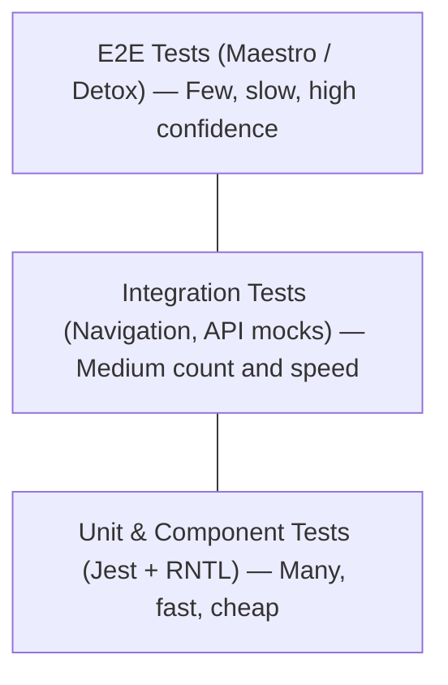
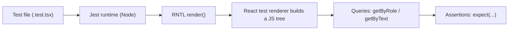
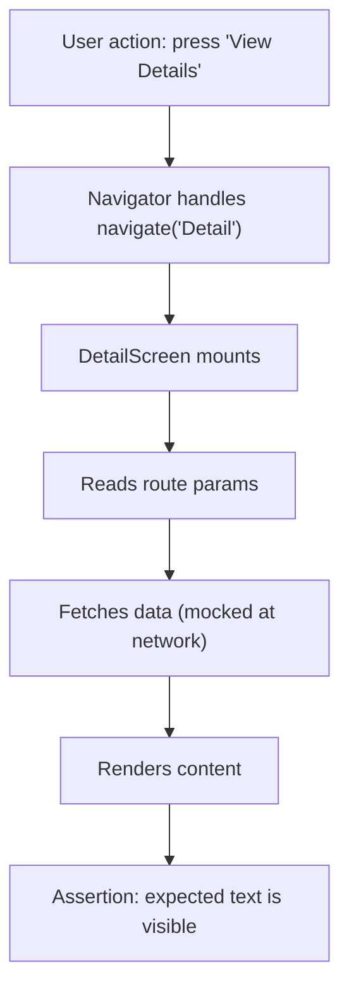
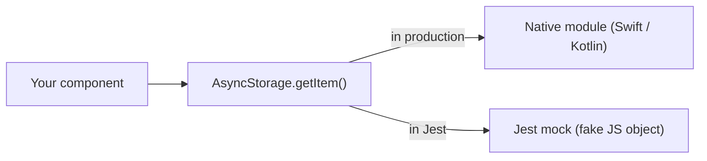
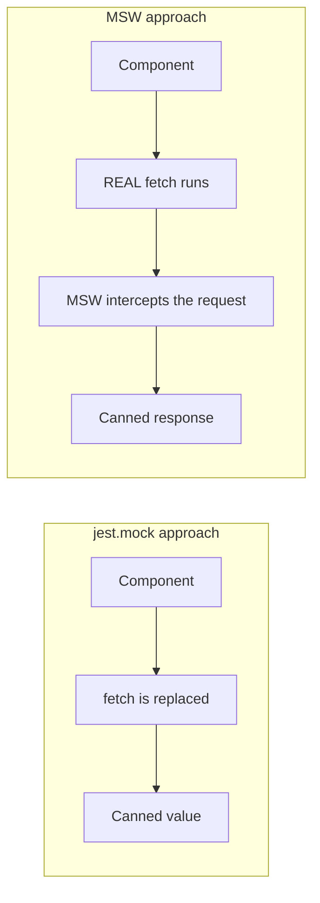
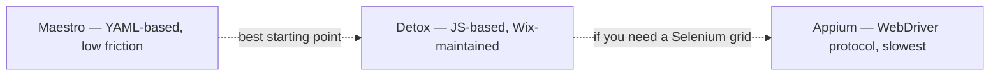
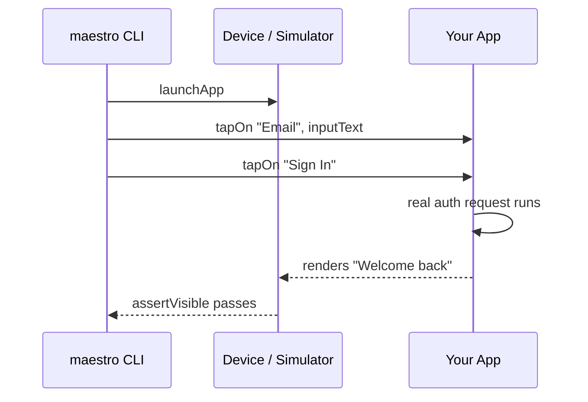
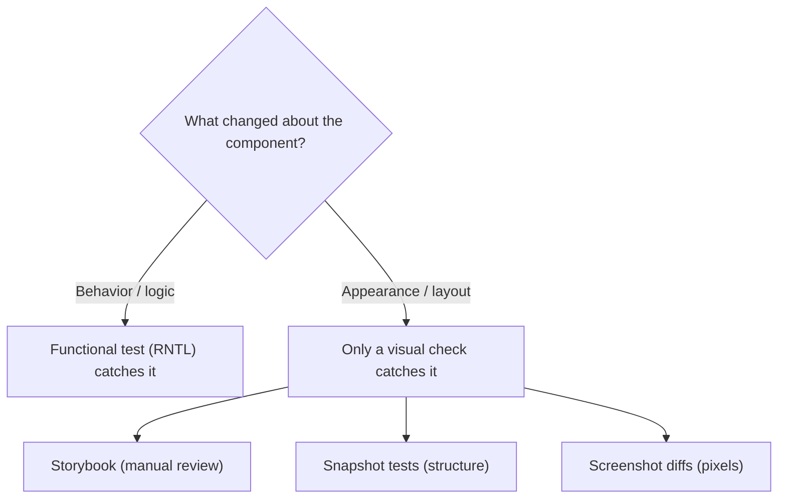
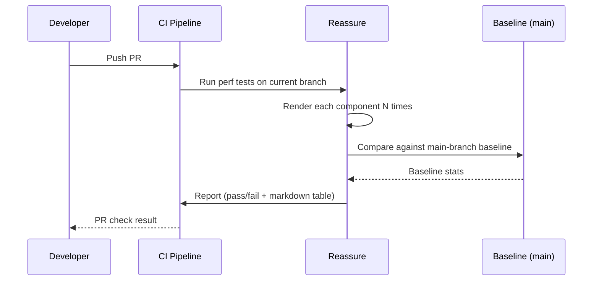

# Tests : des tests unitaires à l'automatisation sur appareil

> Jest, React Native Testing Library, Maestro et la pyramide des tests pour les applications mobiles.

---

## Table of Contents
1. [Unit and Component Testing](#1-unit-and-component-testing)
2. [Integration Testing](#2-integration-testing)
3. [End-to-End Testing](#3-end-to-end-testing)
4. [Visual Regression](#4-visual-regression)
5. [Performance Regression](#5-performance-regression)

---

## 1. Tests unitaires et de composants

Sur le web, vous avez probablement déjà écrit des tests avec Jest et React Testing Library. Bonne nouvelle : le test sous React Native est presque identique. Le modèle mental est le même — afficher un composant, interroger l'arbre, vérifier ce que l'utilisateur verrait. Les différences résident dans le renderer et dans les requêtes auxquelles vous faites appel.

### Pourquoi tester ? (l'argument fondamental)

Un test est un petit programme qui exécute votre vrai code et qui crie si le résultat est faux. C'est tout. La valeur ne réside pas dans le fait que le test passe aujourd'hui — elle réside dans le test qui *échoue demain* lorsqu'un collègue (ou vous-même dans le futur) modifie quelque chose et casse un comportement dont il ignorait l'existence. Voyez les tests comme des **fils-pièges** : vous les posez une fois autour des comportements qui vous importent, et ils se déclenchent automatiquement chaque fois que quelqu'un passe à côté.

La raison pour laquelle le test compte *davantage* sur mobile que sur le web tient à la boucle de rétroaction. Sur le web, vous enregistrez un fichier et voyez le résultat dans un onglet de navigateur en 200 ms. Sur mobile, vérifier un changement à la main signifie reconstruire l'application, attendre le bundler, réinstaller sur un simulateur et naviguer à travers les écrans — parfois un aller-retour de 2 à 3 minutes par vérification. Un test unitaire exécute la même logique en **millisecondes, dans Node, sans aucun appareil**. Cette différence de vitesse explique pourquoi une solide suite de tests est l'un des investissements les plus rentables qu'une équipe mobile puisse réaliser.

### La pyramide des tests pour le mobile

Avant d'écrire le moindre test, comprenez où vos efforts portent leurs fruits. La « pyramide des tests » est une règle empirique sur les *proportions* : beaucoup de tests bon marché en bas, peu de tests coûteux en haut.



Chaque couche échange de la **vitesse** contre du **réalisme**. Pourquoi ne pas tout simplement écrire uniquement des tests E2E, puisqu'ils sont les plus réalistes ? Parce qu'ils sont lents, instables, et lorsque l'un échoue il ne vous dit souvent pas *où* se trouve le bug — seulement que *quelque chose* a cassé quelque part dans un long flux. Un test unitaire qui échoue pointe vers une seule fonction. La plupart de vos tests doivent vivre en bas ; ne remontez la pyramide que lorsque les couches inférieures ne peuvent véritablement pas couvrir un scénario — comme vérifier qu'un vrai geste de swipe permet de naviguer entre les écrans.

| Couche | Ce qu'elle prouve | Vitesse | L'échec pointe vers | Quand y faire appel |
|-------|----------------|-------|-------------------|-----------------------|
| Unitaire / Composant | Une pièce fonctionne isolément | Millisecondes | Une seule fonction/composant | Toujours — votre choix par défaut |
| Intégration | Les pièces fonctionnent ensemble | Dizaines de ms | Un câblage/contrat entre les parties | Navigation, formulaires, flux d'API |
| E2E | La vraie application fonctionne sur un appareil | Secondes–minutes | « Quelque chose dans ce flux » | Chemins critiques uniquement (connexion, paiement) |

> **Astuce de pro :** la pyramide est un guide, pas une loi. Une vérification utile : si un test est lent *et* instable *et* difficile à déboguer, faites descendre cette couverture d'une couche. Si un comportement ne peut exister que sur un appareil réel (gestes, push notifications, deep links), c'est précisément le moment où remonter se justifie.

### Mise en place

React Native est livré avec Jest préconfiguré. Vous n'avez qu'à ajouter la bibliothèque de test :

```bash
npm install --save-dev @testing-library/react-native
```

C'est tout. Pas de navigateur, pas de jsdom. React Native Testing Library (RNTL) affiche vos composants à l'aide du test renderer de React et vous fournit des requêtes qui reproduisent ce qu'un véritable utilisateur ferait : trouver des éléments par leur rôle, leur label ou leur texte visible.

Voici le modèle mental de ce qui se passe lorsqu'un test s'exécute — notez qu'**aucun appareil ni simulateur n'est impliqué** :



Comparé au web : sur le web, React Testing Library effectue le rendu dans **jsdom**, un faux DOM constitué de nœuds `<div>` et `<button>`. Sous React Native, il n'y a aucun DOM du tout — RNTL effectue le rendu dans un arbre de descripteurs de composants natifs (`View`, `Text`, `Pressable`). Les requêtes semblent identiques, mais l'arbre sous-jacent est celui de React Native, pas celui du HTML.

### Écrire votre premier test de composant

Supposons que vous ayez un simple composant `Counter` :

```tsx
// Counter.tsx
import { View, Text, Pressable } from "react-native";
import { useState } from "react";

export function Counter() {
  const [count, setCount] = useState(0);

  return (
    <View>
      <Text accessibilityRole="text">Count: {count}</Text>
      <Pressable
        accessibilityRole="button"
        accessibilityLabel="Increment"
        onPress={() => setCount((c) => c + 1)}
      >
        <Text>+1</Text>
      </Pressable>
    </View>
  );
}
```

```tsx
// Counter.test.tsx
import { render, screen, fireEvent } from "@testing-library/react-native";
import { Counter } from "./Counter";

test("increments the count on press", () => {
  render(<Counter />);

  // Arrange is done by render(); now Assert the starting state
  expect(screen.getByText("Count: 0")).toBeTruthy();

  // Act: simulate the user pressing the button
  fireEvent.press(screen.getByRole("button", { name: "Increment" }));

  // Assert: the screen now reflects the new state
  expect(screen.getByText("Count: 1")).toBeTruthy();
});
```

Chaque test suit le même rythme **Arrange → Act → Assert** : préparer le contexte, faire l'action, vérifier le résultat. Une fois que vous reconnaissez cette structure, tous les tests de ce chapitre se lisent de la même manière.

Remarquez : vous interrogez par `role` et `name`, et non par identifiant de test. C'est intentionnel. Si vous interrogez par `testID`, vos tests passent même lorsque l'arbre d'accessibilité est cassé. Interrogez par rôle et label, et vous obtenez une couverture d'accessibilité **gratuitement** — un utilisateur de lecteur d'écran trouve le bouton de la même manière que votre test. Il existe un ordre de priorité qu'il vaut la peine de mémoriser pour savoir quelle requête utiliser :

| Requête | Trouve les éléments par | À utiliser pour | Priorité |
|-------|-------------------|------------|----------|
| `getByRole` | Rôle d'accessibilité + nom | Boutons, en-têtes, éléments interactifs | La plus élevée — au plus proche de l'utilisateur |
| `getByText` | Contenu textuel visible | Labels, messages, tout texte affiché | Élevée |
| `getByLabelText` | `accessibilityLabel` | Champs de saisie et icônes sans texte visible | Élevée |
| `getByPlaceholderText` | Placeholder du TextInput | Champs de formulaire vides | Moyenne |
| `getByTestId` | Prop `testID` | En dernier recours quand rien d'autre ne fonctionne | La plus basse — invisible pour les utilisateurs |

> **Piège :** les rôles d'accessibilité de React Native ne sont pas identiques aux rôles ARIA du web. `<Pressable>` n'a pas automatiquement `role="button"` — vous devez définir `accessibilityRole="button"` explicitement. Oubliez cela et vos requêtes `getByRole` échoueront silencieusement. (Sur le web, `<button>` est un bouton gratuitement ; sous RN, c'est *vous* qui déclarez le rôle.)

Il existe aussi une différence importante entre les préfixes de requête qui déroute les débutants :

| Préfixe | Si introuvable | Si trouvé | Attend l'asynchrone ? |
|--------|--------------|----------|------------------|
| `getBy...` | Lève une erreur immédiatement | Renvoie l'élément | Non |
| `queryBy...` | Renvoie `null` | Renvoie l'élément | Non |
| `findBy...` | Lève une erreur après un délai | Renvoie une Promise | **Oui** |

Utilisez `queryBy` lorsque vous voulez vérifier qu'une chose est **absente** (`expect(screen.queryByText("Error")).toBeNull()`), et `findBy` lorsque l'élément apparaît **après** une mise à jour asynchrone (un fetch, une navigation, un timer).

### Tester des hooks personnalisés

Pour les hooks qui n'affichent pas d'UI, utilisez `renderHook` de RNTL :

```tsx
import { renderHook, act } from "@testing-library/react-native";
import { useCounter } from "./useCounter";

test("useCounter increments", () => {
  const { result } = renderHook(() => useCounter(0));

  // result.current always points at the hook's latest return value
  act(() => {
    result.current.increment();
  });

  expect(result.current.count).toBe(1);
});
```

Un hook ne peut pas être appelé en dehors d'un composant — React lèverait une erreur. `renderHook` résout cela en montant un petit composant hôte invisible qui appelle votre hook et expose sa valeur de retour sur `result.current`. Le wrapper `act()` indique à React « je suis sur le point de déclencher une mise à jour du state ; vide tous les re-renders qui en résultent avant que je ne fasse mes assertions ». Si vous omettez `act()` autour d'un changement de state, React avertit qu'une mise à jour s'est produite en dehors de `act`, ce qui signifie que votre assertion peut s'exécuter sur une valeur périmée.

Sur le web, vous installeriez `@testing-library/react-hooks` comme paquet séparé. Sous React Native, `renderHook` est livré directement dans `@testing-library/react-native` depuis la v12. Une dépendance de moins à gérer.

### Erreurs courantes

- **Tout envelopper dans des requêtes `testID`.** Cela fait passer les tests même quand le composant est visuellement cassé. Préférez `getByRole`, `getByText`, `getByLabelText`.
- **Ne pas envelopper les mises à jour de state dans `act()`.** Si votre test avertit que des mises à jour de state ne sont pas enveloppées, c'est que vous avez une mise à jour asynchrone qui nécessite `waitFor` ou `findBy*`.
- **Tester des détails d'implémentation.** Ne faites pas d'assertions sur le state interne. Faites des assertions sur ce qui apparaît à l'écran. Le test devrait survivre à un refactor qui conserve un comportement identique — si renommer une variable de state casse votre test, c'est que le test observait la mauvaise chose.
- **Trop de mocking.** Si vous mockez tellement que le test n'exerce que des mocks, il ne prouve rien. Mockez les *frontières* (réseau, modules natifs), exécutez le *vrai* code du composant.

---

## 2. Tests d'intégration

Les tests unitaires prouvent que les composants individuels fonctionnent. Les tests d'intégration prouvent qu'ils fonctionnent *ensemble* — qu'appuyer sur un bouton mène au bon écran, que soumettre un formulaire envoie la bonne requête d'API et affiche la réponse.

Le changement de perspective est le suivant : un test unitaire place un seul composant seul sur scène. Un test d'intégration assemble plusieurs pièces réelles — un navigateur, quelques écrans, une couche de données — et vérifie que les **contrats entre eux** tiennent. Les bugs adorent se cacher dans ces jointures : un nom d'écran mal orthographié dans un appel `navigate()`, un paramètre de route que l'écran de destination attend mais ne reçoit jamais, une forme de réponse que l'UI ne gère pas. Aucun de ces cas n'apparaît lorsque chaque pièce est testée seule.



### Tester les flux de navigation

React Navigation fournit un utilitaire de test qui permet d'afficher un navigateur complet dans un test. Vous n'avez pas besoin de simulateur :

```tsx
import { render, screen, fireEvent } from "@testing-library/react-native";
import { NavigationContainer } from "@react-navigation/native";
import { createNativeStackNavigator } from "@react-navigation/native-stack";
import { HomeScreen } from "./HomeScreen";
import { DetailScreen } from "./DetailScreen";

const Stack = createNativeStackNavigator();

// A real, fully-wired navigator — the same one your app would use
function TestApp() {
  return (
    <NavigationContainer>
      <Stack.Navigator>
        <Stack.Screen name="Home" component={HomeScreen} />
        <Stack.Screen name="Detail" component={DetailScreen} />
      </Stack.Navigator>
    </NavigationContainer>
  );
}

test("navigates from Home to Detail on item press", async () => {
  render(<TestApp />);

  fireEvent.press(screen.getByText("View Details"));

  // findBy* WAITS — the transition is async, so getBy* would throw too early
  expect(await screen.findByText("Detail Screen")).toBeTruthy();
});
```

L'idée clé : vous affichez la pile entière du navigateur, pas seulement un écran. Cela permet de détecter les bugs où les paramètres de navigation sont incorrects ou le nom d'écran mal orthographié — des choses qu'un test unitaire sur un seul écran manquerait. Parce que les animations de navigation et les montages d'écran se produisent de manière asynchrone, vous **devez** utiliser `findByText` (qui interroge jusqu'à ce que l'élément apparaisse ou que le délai expire) plutôt que `getByText` (qui vérifie une seule fois et lève une erreur instantanément).

### Mocker les modules natifs

Le code React Native dépend souvent de modules natifs — l'appareil photo, le stockage, la biométrie. Ceux-ci sont écrits en Swift/Kotlin et compilés dans le binaire de l'application ; ils **n'existent tout simplement pas** dans l'environnement Jest purement JavaScript. Lorsque votre code appelle `AsyncStorage.getItem()`, il n'y a aucun côté natif pour répondre, donc l'appel lèverait une erreur. Un *mock* est un remplaçant : un faux objet JS qui satisfait la même forme que celle exposée par le vrai module, en renvoyant des valeurs prédéfinies.

```tsx
// jest.setup.js
// Silence the native animation driver that Jest can't load
jest.mock("react-native/Libraries/Animated/NativeAnimatedHelper");

// Most good libraries ship an official mock — use it
jest.mock("@react-native-async-storage/async-storage", () =>
  require("@react-native-async-storage/async-storage/jest/async-storage-mock")
);

// Hand-rolled mock: only do this when the library has no official one
jest.mock("react-native-camera", () => ({
  RNCamera: {
    Constants: { Type: { back: "back", front: "front" } },
  },
}));
```



> **Conseil :** la plupart des bibliothèques natives bien maintenues fournissent leur propre mock Jest. Consultez la documentation de la bibliothèque avant d'écrire le vôtre. Un mock manuel qui dérive de la véritable API est pire que pas de mock du tout — il peut faire passer une intégration cassée pour *verte*.

### Mocker les requêtes réseau avec MSW

Sur le web, Mock Service Worker (msw) est devenu le standard pour mocker les appels d'API. Cela fonctionne aussi sous React Native, avec une étape de mise en place supplémentaire :

```bash
npm install --save-dev msw
```

```tsx
// mocks/handlers.ts
import { http, HttpResponse } from "msw";

// Describe what the fake server returns for each endpoint
export const handlers = [
  http.get("https://api.example.com/user", () => {
    return HttpResponse.json({ id: 1, name: "Ada Lovelace" });
  }),
];
```

```tsx
// mocks/server.ts
import { setupServer } from "msw/node";
import { handlers } from "./handlers";

export const server = setupServer(...handlers);
```

```tsx
// jest.setup.js
import { server } from "./mocks/server";

beforeAll(() => server.listen());      // start intercepting
afterEach(() => server.resetHandlers()); // undo per-test overrides
afterAll(() => server.close());         // stop intercepting
```

Pourquoi MSW plutôt que `jest.mock("fetch")` ? À cause de l'**endroit** où l'interception se produit. `jest.mock` remplace une fonction dans votre code — votre test est donc couplé à la *manière* dont vous effectuez le fetch. MSW intercepte une couche plus bas, au niveau de la requête réseau elle-même. Votre composant exécute son véritable appel `fetch` (ou `axios`), et MSW capture la requête sortante et y répond.



Le bénéfice : si vous refactorez plus tard de `fetch` vers `axios`, les tests MSW **passent toujours** parce qu'ils mockent la *frontière* (la requête HTTP), et non l'*implémentation* (la fonction que vous avez appelée). Mockez ce qui ne changera pas.

> **Astuce de pro :** surchargez un handler à l'intérieur d'un seul test avec `server.use(...)` pour simuler une réponse d'erreur (par exemple un 500 ou un timeout réseau). Parce que `afterEach` réinitialise les handlers, cette surcharge n'affecte que ce test — parfait pour vérifier vos états d'erreur et de chargement.

### Erreurs courantes

- **Mocker `navigation.navigate` au lieu d'afficher le vrai navigateur.** Vous perdez la couverture sur le câblage réel de la navigation. Ne mockez la navigation que lorsque vous testez un composant profondément imbriqué où afficher la pile complète est peu pratique.
- **Oublier d'`await findBy*` après une navigation.** Les transitions d'écran sont asynchrones. Utilisez `findByText` (qui attend) au lieu de `getByText` (qui lève une erreur immédiatement).
- **Laisser fuir du state entre les tests.** Oublier `afterEach(() => server.resetHandlers())` (ou ne pas nettoyer un store mocké) laisse la mise en place d'un test contaminer le suivant, produisant des échecs qui disparaissent lorsque vous exécutez le test seul.

---

## 3. Tests de bout en bout

Les tests unitaires et d'intégration s'exécutent dans Node. Ils ne peuvent pas tester les vrais gestes, les vraies animations, le vrai comportement des modules natifs sur un appareil. C'est à cela que servent les tests E2E.

Un test E2E est ce qui rapproche le plus un robot d'un testeur QA humain. Il lance l'**application réellement compilée** sur un appareil ou un simulateur réel, puis tape, saisit et balaie à travers l'UI exactement comme une personne le ferait — et vérifie que les bonnes choses apparaissent. Rien n'est mocké ; la vraie navigation, le vrai réseau (ou un véritable backend de staging), les vrais modules natifs s'exécutent tous. Ce réalisme est tout l'intérêt — et aussi la raison pour laquelle les tests E2E sont lents et parfois instables.

### Le paysage E2E en 2026



**Maestro** est l'outil que je recommanderais à la plupart des équipes en 2026. Il utilise YAML pour décrire les flux, ne nécessite presque aucune mise en place, et s'exécute à la fois sur iOS et Android avec le même fichier de test. Vous n'avez pas besoin d'ajouter des test IDs partout — Maestro peut trouver les éléments par texte visible. Il possède aussi une tolérance intégrée à l'instabilité : il réessaie et attend automatiquement les éléments, ce qui élimine la plus grande source de douleur des tests E2E.

**Detox** est plus puissant. Il est basé sur JavaScript, *se synchronise avec l'état d'inactivité de l'application* (d'où moins d'attentes instables), et vous offre un contrôle fin. Le compromis : nettement plus de mise en place, en particulier sur la CI. Choisissez Detox si vous avez besoin d'une logique d'assertion complexe ou d'une intégration en profondeur avec votre infrastructure de test JS.

**Appium** utilise le protocole WebDriver. C'est le plus flexible (fonctionne avec les applications natives, les applications hybrides, et même Flutter), mais c'est aussi le plus lent et le plus fragile. À moins de faire partie d'une organisation disposant déjà d'une infrastructure Appium, passez votre chemin.

| Outil | Langage | Effort de mise en place | Vitesse | Gestion de l'instabilité | Quand l'utiliser |
|------|----------|--------------|-------|--------------------|-------------|
| Maestro | YAML | Minimale | Rapide | Réessais/attentes intégrés | Par défaut pour la plupart des équipes ; commencez ici |
| Detox | JavaScript | Élevé | Rapide | Synchronisation sur l'inactivité de l'app | Logique complexe, intégration JS poussée |
| Appium | Nombreux (WebDriver) | Très élevé | Lent | Attentes manuelles | Uniquement si vous exécutez déjà Appium/Selenium |

### Maestro en pratique

Installez Maestro :

```bash
# macOS / Linux
curl -Ls "https://get.maestro.mobile.dev" | bash
```

Écrivez un flux en YAML :

```yaml
# flows/login.yaml
appId: com.myapp
---
- launchApp
- tapOn: "Email"
- inputText: "user@example.com"
- tapOn: "Password"
- inputText: "s3cure-pass!"
- tapOn: "Sign In"
- assertVisible: "Welcome back"
```

Exécutez-le :

```bash
maestro test flows/login.yaml
```

Voilà toute la mise en place. Aucun test ID requis. Aucune configuration de build. Maestro trouve le champ « Email » par son texte visible ou son label d'accessibilité, y saisit du texte, et vérifie le résultat. Lisez le YAML de haut en bas et il se lit comme un script de test manuel que vous remettriez à un testeur humain — cette lisibilité est le super-pouvoir de Maestro. Sur la CI, Maestro Cloud exécute vos flux sur de vrais appareils et vous fournit des enregistrements vidéo des échecs, ce qui transforme le « ça a échoué sur la CI mais ça marche sur ma machine » en une relecture observable.



### Detox : quand vous avez besoin de plus de contrôle

```tsx
// e2e/login.test.ts
describe("Login flow", () => {
  beforeAll(async () => {
    await device.launchApp();
  });

  it("should log in successfully", async () => {
    await element(by.text("Email")).tap();
    await element(by.text("Email")).typeText("user@example.com");
    await element(by.text("Password")).tap();
    await element(by.text("Password")).typeText("s3cure-pass!");
    await element(by.text("Sign In")).tap();
    await expect(element(by.text("Welcome back"))).toBeVisible();
  });
});
```

Remarquez qu'il n'y a presque aucune attente explicite dans ce test. C'est le cœur de Detox : la **synchronisation en boîte grise** (gray-box). Detox peut voir à l'intérieur de l'application et sait quand les animations, les timers et les requêtes réseau se sont stabilisés, donc il attend automatiquement que l'application soit *inactive* avant d'exécuter l'étape suivante. Comparez à Appium, qui est en *boîte noire* (black-box) — il ne peut sonder l'UI que de l'extérieur et deviner quand poursuivre, ce qui explique pourquoi les tests Appium sont parsemés d'appels manuels à `sleep()` et flanchent quand même.

Cette même synchronisation est aussi l'arme à double tranchant de Detox : une application qui n'est *jamais* inactive — une animation en boucle, un timer de polling infini, une websocket qui ne se ferme jamais — fait attendre Detox indéfiniment. Lorsqu'un test Detox se fige, la cause est presque toujours « quelque chose dans l'application n'a jamais indiqué à Detox qu'il avait terminé ».

> **Piège :** les tests E2E sont coûteux. Une suite Detox complète sur la CI peut prendre 20 à 40 minutes. Gardez votre suite E2E réduite — couvrez les chemins critiques (connexion, achat, onboarding) et laissez le reste aux couches inférieures de la pyramide. Une bonne règle : si un bug dans ce flux réveillerait quelqu'un à 3h du matin, il mérite un test E2E. Sinon, faites-le descendre.

---

## 4. Régression visuelle

Les tests fonctionnels vous disent que le composant *fonctionne*. Les tests de régression visuelle vous disent qu'il a toujours *l'air correct*. Un bouton peut passer tous les tests fonctionnels tout en étant invisible parce que quelqu'un a mis son opacité à 0, lui a donné du texte blanc sur fond blanc, ou l'a poussé hors de l'écran avec une marge errante. Les assertions fonctionnelles vérifient le *comportement* ; les vérifications visuelles protègent l'*apparence* — et sur une application mobile soignée, l'apparence est le produit.



### Storybook pour React Native

Storybook fonctionne sous React Native, et c'est votre meilleur outil pour le test visuel. L'idée centrale : une **story** est un composant figé dans un état spécifique (un bouton primaire, un bouton désactivé, un bouton en cours de chargement). Au lieu de cliquer à travers votre vraie application pour atteindre cet état, vous y sautez directement dans une galerie isolée. Vous écrivez les stories une fois, puis vous les visualisez sur l'appareil ou dans une interface web :

```bash
npx storybook@latest init --type react_native
```

```tsx
// Button.stories.tsx
import type { Meta, StoryObj } from "@storybook/react";
import { Button } from "./Button";

const meta: Meta<typeof Button> = {
  title: "Button",
  component: Button,
};
export default meta;

type Story = StoryObj<typeof Button>;

// Each export is one state of the component, ready to eyeball
export const Primary: Story = {
  args: {
    label: "Submit",
    variant: "primary",
  },
};

export const Disabled: Story = {
  args: {
    label: "Submit",
    variant: "primary",
    disabled: true,
  },
};
```

Cette isolation accélère aussi le *développement* : construire un état de chargement est bien plus rapide lorsque vous pouvez l'afficher directement plutôt que de devoir déclencher un appel réseau lent dans la vraie application pour le voir.

### Tests par snapshot

Les tests par snapshot de Jest capturent la sortie rendue d'un composant et signalent lorsqu'elle change :

```tsx
import { render } from "@testing-library/react-native";
import { Button } from "./Button";

test("Button matches snapshot", () => {
  const tree = render(<Button label="Submit" variant="primary" />);
  // First run: writes a .snap file. Later runs: compares against it.
  expect(tree.toJSON()).toMatchSnapshot();
});
```

Comment ça fonctionne : la première fois que le test s'exécute, Jest sérialise l'arbre rendu dans un fichier `__snapshots__/*.snap` et le commit. À chaque exécution ultérieure, Jest effectue à nouveau le rendu et compare avec ce fichier sauvegardé — toute différence fait échouer le test. Pour accepter un changement intentionnel, vous exécutez `jest -u` pour mettre à jour le snapshot.

Le danger est que les snapshots capturent *tout* changement, y compris les changements intentionnels, ce qui entraîne les développeurs à exécuter par réflexe `jest -u` sans lire le diff — et à ce moment-là, le snapshot ne protège plus rien. Et surtout, un snapshot structurel ne prouve **pas** que le composant *a l'air* correct : il enregistre qu'une `View` avec certaines props existe, pas que les pixels sont corrects. Utilisez-les avec parcimonie — ils conviennent le mieux à de petits composants stables comme les icônes ou les badges, pas à des écrans entiers.

| Approche | Ce qu'elle compare réellement | Détecte un bug de couleur/opacité ? | Coût de maintenance |
|----------|---------------------------|------------------------------|------------------|
| Storybook (manuel) | Les yeux d'un humain | Oui (si quelqu'un regarde) | Faible, mais non automatisé |
| Test par snapshot | Arbre de composants sérialisé (structure) | Non — seulement les changements structurels | Faible, mais bruyant |
| Diff de capture d'écran | Pixels réellement rendus | Oui, automatiquement | Plus élevé (baselines, pixels instables) |

> **Sur le web**, vous utiliseriez Chromatic ou Percy pour les diffs visuels au niveau du pixel. Pour React Native, l'écosystème est moins mature. Chromatic prend en charge Storybook pour RN dans un mode de rendu web, mais il ne peut pas capturer le rendu spécifiquement natif (ombres, polices de la plateforme). Pour une vraie régression visuelle native, les équipes effectuent généralement des captures d'écran sur la CI avec Detox ou Maestro et comparent les images avec des outils comme `pixelmatch` ou `reg-suit`.

### Une approche pratique

N'essayez pas d'atteindre une couverture visuelle au pixel près dès le premier jour. Commencez ici :

1. **Storybook** pour le développement des composants et la revue visuelle manuelle.
2. **Tests par snapshot** pour les petites primitives stables.
3. **Captures d'écran Maestro** sur la CI pour les écrans critiques — capturez une capture d'écran à la fin d'un flux E2E et comparez-la à une baseline.

Cela vous donne trois couches de sécurité visuelle sans nécessiter une plateforme de régression visuelle mature (et coûteuse). N'ajoutez le diff au pixel que lorsque les couches les moins chères cessent de détecter les bugs qui atteignent réellement les utilisateurs — payer le coût de maintenance des baselines à pixels instables avant d'en avoir besoin est un cas classique d'optimisation prématurée.

---

## 5. Régression de performance

Votre application fonctionne. Elle a l'air correcte. Mais reste-t-elle *rapide* ? Un changement en apparence innocent — envelopper un composant dans une `View` supplémentaire, ajouter un context provider, retirer un `useMemo` — peut doubler le temps de rendu. Vous ne le remarquerez pas en développement sur votre téléphone haut de gamme, mais vos utilisateurs le remarqueront sur un Android milieu de gamme vieux de trois ans. Une **régression de performance** est exactement cela : du code toujours correct et toujours joli, mais mesurablement plus lent qu'avant.

La raison pour laquelle cela nécessite de l'automatisation est que la performance s'érode *invisiblement et progressivement*. Aucune PR à elle seule ne rend l'application « lente » ; une centaine de PR ajoutant chacune 3 ms le font. Un relecteur humain ne peut pas repérer à l'œil nu une régression de rendu de 6 % dans un diff. Une machine, mesurant chaque PR par rapport à une baseline, le peut.

### Reassure : tester la performance dans la CI

Reassure, conçu par Callstack, mesure le temps de rendu de vos composants et fait échouer votre pipeline CI si un changement provoque une régression :

```bash
npm install --save-dev reassure
```

Écrivez un test de performance — il ressemble presque à un test ordinaire :

```tsx
// FeedList.perf-test.tsx
import { measurePerformance } from "reassure";
import { FeedList } from "./FeedList";

// Realistic data volume matters — 5 items won't reveal a list regression
const mockItems = Array.from({ length: 200 }, (_, i) => ({
  id: String(i),
  title: `Post ${i}`,
  body: "Lorem ipsum dolor sit amet.",
}));

test("FeedList renders 200 items", async () => {
  await measurePerformance(<FeedList items={mockItems} />);
});
```

Reassure exécute le rendu plusieurs fois, collecte des statistiques, et compare avec une baseline. La raison pour laquelle il effectue le rendu *plusieurs* fois plutôt qu'une seule est le **bruit statistique** : tout temps de rendu individuel est instable (l'ordonnanceur de l'OS, le garbage collection, la limitation du CPU interfèrent tous). En échantillonnant à répétition et en comparant des distributions, Reassure peut distinguer une véritable régression d'une variance aléatoire. Sur la CI, il génère un rapport en markdown :

```
| Component         | Baseline (ms) | Current (ms) | Change |
|-------------------|---------------|--------------|--------|
| FeedList (200)    | 45.2          | 48.1         | +6.4%  |
| UserCard          | 2.1           | 2.0          | -4.8%  |
```

Vous configurez un seuil — par exemple, faire échouer la PR si un composant régresse de plus de 20 %. Cela détecte les problèmes de performance avant qu'ils ne soient livrés.

### Comment ça fonctionne

Le mécanisme crucial est la **baseline** : Reassure mesure d'abord la branche `main` et sauvegarde ces chiffres, puis mesure votre branche de PR et compare. C'est une photo avant/après, pas une limite de vitesse absolue — c'est ce qui le rend portable d'une machine CI à une autre, de vitesses différentes.



### Quoi mesurer

Ne mesurez pas tout — une suite tentaculaire qui prend 20 minutes finit ignorée, et un test ignoré ne détecte rien. Concentrez-vous là où le coût de rendu se concentre réellement :

- **Les listes avec de nombreux éléments.** Une `FlatList` affichant plus de 100 éléments est l'endroit où les régressions font le plus mal.
- **Les écrans qui se re-rendent souvent.** Les écrans de chat, les tableaux de bord en direct, tout ce qui comporte des données en temps réel.
- **Les composants coûteux.** Graphiques, cartes, lecteurs multimédias.

Une petite suite ciblée de 10 à 15 tests de performance détecte plus de régressions qu'une suite tentaculaire qui prend 20 minutes à s'exécuter et finit ignorée.

> **Piège :** Reassure mesure le *temps de rendu dans le thread JS*, pas la performance côté natif. Il ne détectera pas une régression causée par une lourde animation native ou un goulot d'étranglement du bridge. Pour le profilage côté natif, vous avez toujours besoin de React Native DevTools, Flipper ou Xcode Instruments — mais ce sont des outils manuels, peu adaptés à la CI. En bref : un Reassure vert signifie « votre JS n'est pas devenu plus lent », pas « votre application est rapide ».

### Combiner les couches

Voici une stratégie de test qui fonctionne pour la plupart des équipes React Native. Remarquez comme elle reflète la pyramide de la section 1 — bon marché et abondante en bas, coûteuse et rare en haut :

| Couche | Outil | Quantité | S'exécute dans |
|-------|------|-------|---------|
| Unitaire / Composant | Jest + RNTL | 100+ | CI (secondes) |
| Intégration | Jest + RNTL + MSW | 20-50 | CI (secondes) |
| E2E | Maestro | 5-15 | CI (minutes) |
| Visuel | Storybook + snapshots | Par composant | CI + manuel |
| Performance | Reassure | 10-15 | CI (secondes) |

Les couches inférieures s'exécutent rapidement, détectent la plupart des bugs, et vous donnent la confiance nécessaire pour livrer. Les couches supérieures s'exécutent plus lentement mais détectent les problèmes du monde réel qu'aucun test unitaire ne peut atteindre. Ensemble, elles forment un filet de sécurité qui vous permet d'avancer vite sans casser l'expérience de vos utilisateurs — tout l'intérêt du test n'est pas de prouver que l'application fonctionne *aujourd'hui*, mais de la rendre *sûre à modifier demain*.