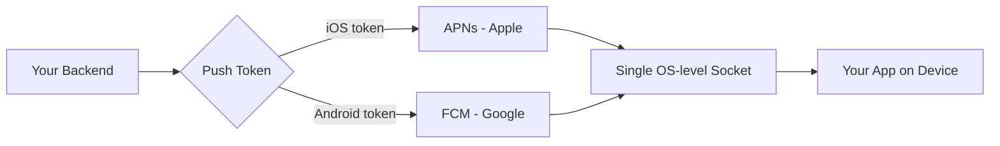
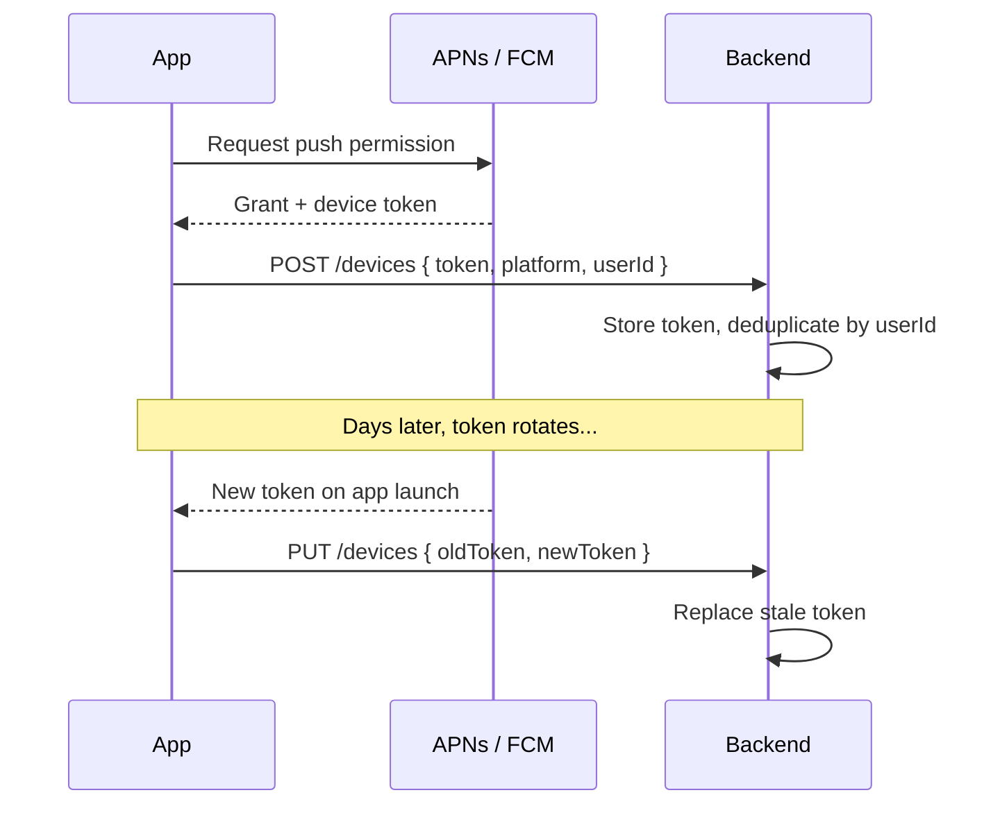
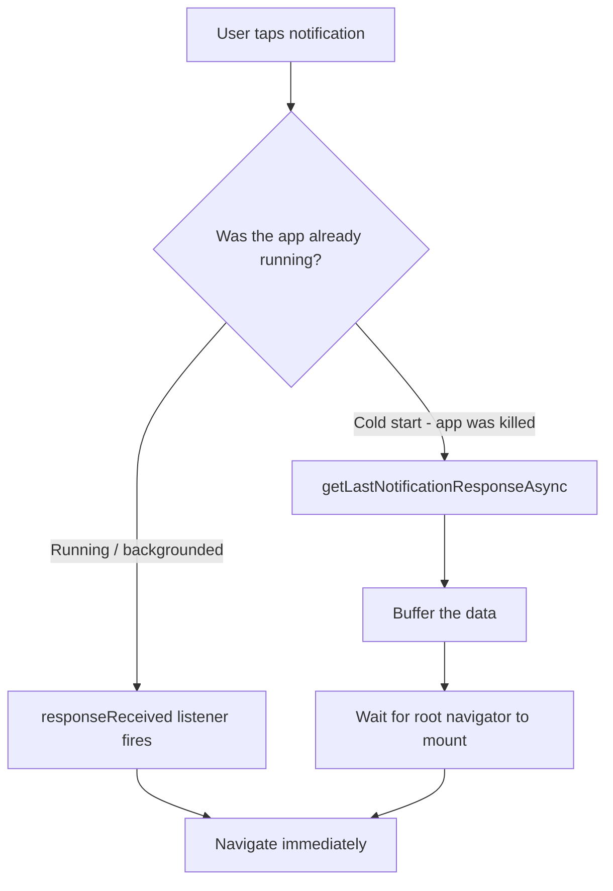
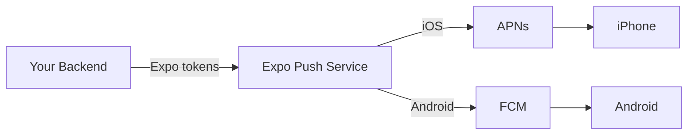
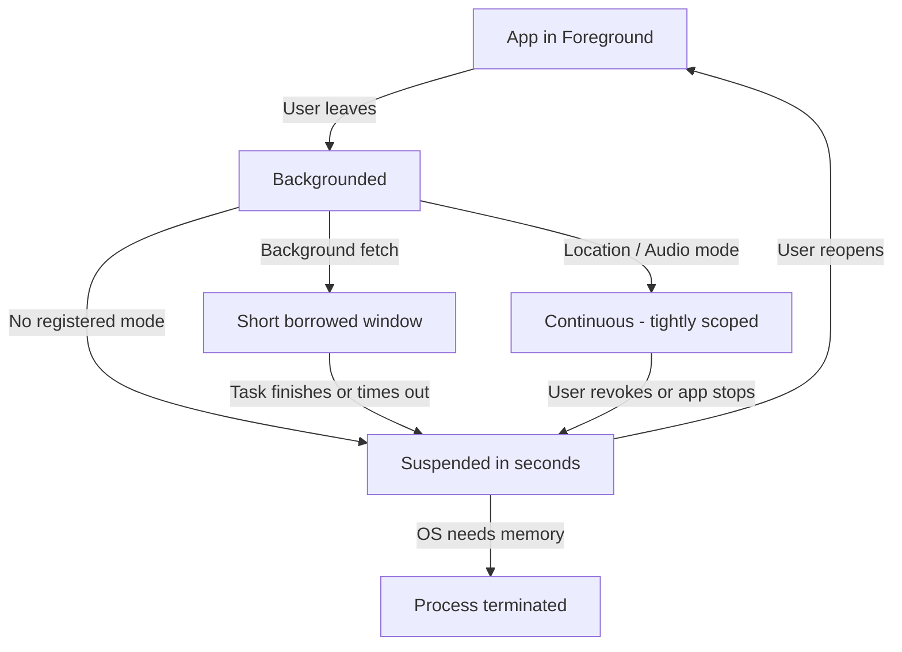
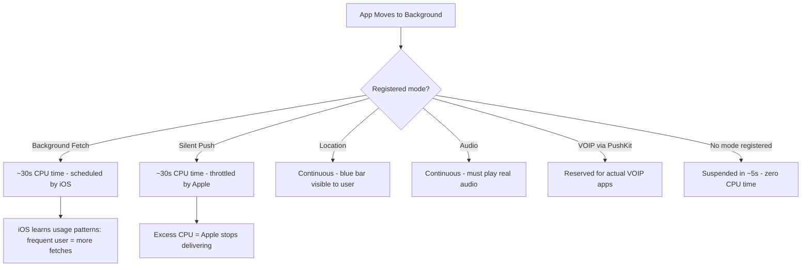
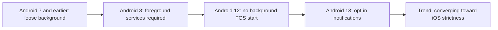

# Notifications push et tâches en arrière-plan

> APNs, FCM, le background fetch et les contraintes de plateforme qui déterminent comment les applications mobiles se réveillent.

---

## Table of Contents

1. [Notifications push](#1-push-notifications)
2. [Services backend](#2-backend-services)
3. [Travail en arrière-plan](#3-background-work)
4. [Limites de l'arrière-plan](#4-background-limits)

---

## 1. Notifications push

Sur le web, vous disposez de la Push API et des service workers. Vous enregistrez un service worker, vous vous abonnez aux événements push, et le navigateur se charge de la livraison. Cela fonctionne raisonnablement bien. Maintenant, oubliez tout cela.

Sur mobile, chaque notification push sur iOS passe par l'Apple Push Notification service (APNs). Chaque notification sur Android passe par Firebase Cloud Messaging (FCM). Il n'existe aucune alternative. Vous ne pouvez pas ouvrir un WebSocket persistant depuis l'arrière-plan et livrer vos propres alertes. C'est l'OS qui détient le pipeline de notifications, et c'est lui qui décide quand votre application se réveille.

Cette conception existe pour une raison : l'autonomie de la batterie. Si chaque application maintenait sa propre connexion persistante, votre téléphone serait à plat avant midi. APNs et FCM maintiennent une unique connexion au niveau système et multiplexent toutes les notifications des applications par-dessus.

### Le modèle mental : qui livre réellement la notification ?

Le plus grand changement par rapport au web, c'est que **votre serveur ne communique jamais directement avec l'appareil de l'utilisateur**. Imaginez APNs et FCM comme les deux seuls bureaux de poste du pays. Vous (votre backend) ne pouvez pas conduire un camion jusqu'au domicile de quelqu'un pour y déposer une lettre. Vous remettez la lettre au bureau de poste, avec l'adresse de la boîte aux lettres du destinataire (le *push token*), et le bureau de poste décide quand et si elle sera livrée.

Cette unique connexion au niveau système est l'idée clé. Votre téléphone maintient exactement un socket toujours actif vers les serveurs d'Apple et un vers ceux de Google. Lorsqu'une notification arrive pour *n'importe quelle* application, elle descend par ce tuyau partagé et l'OS la redistribue à la bonne application. Voilà pourquoi vous ne pouvez pas vous contenter de « garder un WebSocket ouvert » : un millier d'applications maintenant chacune un socket ouvert viderait la batterie en quelques heures.



> **Web vs RN :** sur le web, le navigateur est le gardien et le push « fonctionne » généralement tout seul une fois que l'utilisateur s'est abonné. Sur mobile, c'est le *système d'exploitation* qui est le gardien, et il est bien plus strict : il peut limiter, retarder ou supprimer silencieusement vos notifications en fonction de l'état de la batterie, des habitudes de l'utilisateur et du bon comportement de votre application.

### La voie la plus simple : expo-notifications

Si vous utilisez Expo (et pour la plupart des projets React Native, vous devriez), `expo-notifications` masque APNs et FCM derrière une seule API. Vous demandez l'autorisation, obtenez un push token et écoutez les notifications entrantes sans écrire une seule ligne de code natif.

```bash
npx expo install expo-notifications expo-device expo-constants
```

```tsx
import * as Notifications from "expo-notifications";
import * as Device from "expo-device";
import { Platform } from "react-native";

// Configure foreground notification behavior
Notifications.setNotificationHandler({
  handleNotification: async () => ({
    shouldShowAlert: true,
    shouldPlaySound: true,
    shouldSetBadge: true,
  }),
});

async function registerForPushNotifications(): Promise<string | null> {
  // Push only works on physical devices
  if (!Device.isDevice) {
    console.warn("Push notifications require a physical device");
    return null;
  }

  const { status: existing } = await Notifications.getPermissionsAsync();
  let finalStatus = existing;

  if (existing !== "granted") {
    const { status } = await Notifications.requestPermissionsAsync();
    finalStatus = status;
  }

  if (finalStatus !== "granted") return null;

  // Android requires an explicit notification channel
  if (Platform.OS === "android") {
    await Notifications.setNotificationChannelAsync("default", {
      name: "Default",
      importance: Notifications.AndroidImportance.MAX,
      vibrationPattern: [0, 250, 250, 250],
    });
  }

  const token = (
    await Notifications.getExpoPushTokenAsync({
      projectId: "your-expo-project-id",
    })
  ).data;

  return token;
}
```

#### Pourquoi chaque étape existe

Les débutants copient souvent cette fonction sans comprendre *pourquoi* elle est structurée ainsi. Chaque ligne se prémunit contre un échec bien réel :

- **La vérification `Device.isDevice`** — Les push tokens ne peuvent pas être émis sur un simulateur/émulateur (il n'y a pas de véritable enregistrement APNs/FCM). Si vous l'oubliez, votre code lève une erreur déroutante sur le simulateur iOS.
- **Vérifier l'autorisation existante avant de demander** — Sur iOS, vous ne pouvez *solliciter* l'utilisateur qu'une seule fois. S'il refuse, rappeler `requestPermissionsAsync` ne fait rien — l'invite ne réapparaît jamais. Vous vérifiez donc d'abord l'état actuel et ne sollicitez que lorsque vous n'avez véritablement encore rien demandé.
- **Les notification channels Android** — Depuis Android 8 (Oreo), chaque notification doit appartenir à un *channel*. Un channel regroupe les réglages de son, de vibration et d'importance que l'**utilisateur** peut redéfinir dans les paramètres système. Sans channel, votre notification échoue silencieusement à s'afficher sur les versions modernes d'Android.
- **`getExpoPushTokenAsync`** — Ceci renvoie un push token *Expo* (`ExponentPushToken[...]`), pas un token APNs/FCM brut. Le backend d'Expo le traduit plus tard. Si vous partez sur du React Native pur, vous obtiendriez à la place directement le token natif de l'appareil.

> **Erreur fréquente :** demander l'autorisation de notification dès le tout premier lancement de l'application, avant que l'utilisateur ne comprenne pourquoi. Les taux de conversion sont bien plus élevés si vous affichez d'abord un écran d'explication *pré-autorisation* (« Soyez notifié lorsque quelqu'un répond »), et ne déclenchez la vraie invite de l'OS qu'ensuite. Vous n'avez droit qu'à une seule tentative pour l'invite iOS — ne la gâchez pas sur un démarrage à froid.

### Gestion des tokens

La plupart des tutoriels survolent cette partie, et c'est pourtant là que se nichent les véritables bugs. Un push token n'est pas permanent. Il change quand l'utilisateur réinstalle, restaure depuis une sauvegarde, ou quand l'OS le rafraîchit silencieusement. Votre architecture doit traiter le token comme éphémère.

Voyez le token comme un numéro de téléphone qui peut changer sans préavis. Si vous envoyez des lettres à un ancien numéro, elles reviennent — et si vous continuez à écrire à des numéros morts, le bureau de poste (APNs/FCM) commence à *vous* considérer comme un spammeur et limite l'ensemble de votre compte.



Les règles non négociables :

- **Enregistrez à chaque lancement.** Ne mettez pas le token en cache côté client en supposant qu'il est toujours valide. Appelez `getExpoPushTokenAsync` à chaque démarrage à froid et envoyez-le à votre backend.
- **Dédupliquez côté serveur.** Associez les tokens à des identifiants utilisateur. Un même utilisateur peut avoir plusieurs appareils. Un même appareil peut changer de token.
- **Élaguez les tokens morts.** Lorsqu'APNs renvoie un 410 (Gone) ou que FCM renvoie « NotRegistered », supprimez ce token immédiatement. Des envois répétés vers des tokens morts feront limiter votre service.

Voici un appel d'enregistrement minimal côté client que vous exécuteriez à chaque démarrage à froid :

```tsx
async function syncPushToken(userId: string) {
  const token = await registerForPushNotifications();
  if (!token) return; // permission denied or simulator

  // Idempotent: the backend upserts by (userId, token).
  // Sending the same token twice is harmless and expected.
  await fetch("https://api.example.com/devices", {
    method: "POST",
    headers: { "Content-Type": "application/json" },
    body: JSON.stringify({
      token,
      platform: Platform.OS, // "ios" | "android"
      userId,
    }),
  });
}
```

Une structure de table backend simple qui satisfait les trois règles :

| Colonne | Pourquoi elle existe |
| --- | --- |
| `token` (unique) | L'adresse de la boîte aux lettres ; l'unicité permet un upsert en toute sécurité |
| `user_id` | Un utilisateur, plusieurs appareils — regroupez par ce champ pour la diffusion |
| `platform` | Aiguiller `ios` vs `android` et choisir le bon format de payload |
| `last_seen_at` | Élaguer les tokens non rafraîchis depuis N jours, probablement morts |
| `failed_count` | Incrémenter sur 410/NotRegistered ; supprimer au-delà d'un seuil |

> **Astuce de pro :** rendez l'appel d'enregistrement *idempotent*. Le client enverra le même token à la plupart des lancements — cela devrait être sans effet, et non créer une ligne en double. Faites un upsert sur le token, jamais une insertion à l'aveugle.

### Catégories, actions et notifications enrichies

Les notifications peuvent porter des boutons d'action, des réponses textuelles en ligne et des images. Vous définissez des catégories au démarrage de l'application et les référencez depuis les payloads de votre backend.

Une *catégorie* est un modèle réutilisable de boutons. Vous enregistrez une fois sur l'appareil « à quoi ressemble une notification de message », lui donnez un identifiant, et ensuite votre serveur se contente de référencer cet identifiant — il n'a jamais à redécrire les boutons à chaque fois.

```tsx
// Define once at app startup
Notifications.setNotificationCategoryAsync("message", [
  {
    identifier: "reply",
    buttonTitle: "Reply",
    textInput: { submitButtonTitle: "Send", placeholder: "Type a reply..." },
  },
  {
    identifier: "mark-read",
    buttonTitle: "Mark as Read",
    options: { isDestructive: false },
  },
]);
```

Votre backend inclut ensuite `categoryId: "message"` dans le payload push. L'OS affiche les boutons d'action sans que votre application n'ait besoin d'être ouverte.

La magie ici, c'est que **c'est l'OS qui dessine et gère ces boutons** — votre JavaScript ne tourne pas lorsque l'utilisateur appuie longuement sur la notification et tape « Reply ». Le texte qu'il saisit est livré à votre application au prochain réveil, via le response listener. Voilà pourquoi vous pouvez répondre à un message depuis l'écran verrouillé d'une application qui a été forcée à quitter.

### Push silencieux pour l'invalidation de cache

Toutes les notifications n'ont pas besoin d'afficher une bannière. Les push silencieux (data-only) réveillent brièvement votre application pour qu'elle puisse récupérer des données fraîches. C'est ainsi que les applications de messagerie préchargent les conversations avant que l'utilisateur n'ouvre l'application.

La distinction porte sur *qui le voit* :

| Type de push | Affiche une bannière ? | Réveille votre code ? | Usage typique |
| --- | --- | --- | --- |
| **Push d'alerte** | Oui | Uniquement au tap | « Vous avez un nouveau message » |
| **Push silencieux (data-only)** | Non | Oui, brièvement en arrière-plan | Pré-synchroniser les données avant que l'utilisateur n'ouvre l'application |
| **Alerte + data** | Oui | Au tap (et parfois en arrière-plan) | Bannière *et* préchargement de l'écran concerné |

```tsx
// Backend sends: { to: token, data: { type: "sync", resource: "messages" }, priority: "high" }

Notifications.addNotificationReceivedListener((notification) => {
  const data = notification.request.content.data;
  if (data.type === "sync") {
    syncResource(data.resource);
  }
});
```

> **Piège :** iOS limite agressivement les push silencieux. C'est Apple qui décide quand ils arrivent, et si votre application consomme trop de CPU pendant l'exécution en arrière-plan, la livraison s'arrête complètement. Ne comptez jamais sur les push silencieux pour une synchronisation critique en temps. Sur iOS, l'indicateur de push silencieux est `content-available: 1`, et le système peut les regrouper ou les retarder de plusieurs heures lorsque l'appareil est en mode économie d'énergie.

### Deep linking depuis le tap d'une notification

Lorsque l'utilisateur tape une notification, vous voulez l'amener sur le bon écran, pas sur la page d'accueil.

Il existe deux cas distincts, et ils déroutent presque tout le monde :



```tsx
// Handle taps when the app is already running
Notifications.addNotificationResponseReceivedListener((response) => {
  const data = response.notification.request.content.data;
  if (data.screen === "chat" && data.threadId) {
    navigationRef.navigate("ChatThread", { id: data.threadId });
  }
});

// Handle taps from a cold start (app was killed)
const initialResponse = await Notifications.getLastNotificationResponseAsync();
if (initialResponse) {
  const data = initialResponse.notification.request.content.data;
  // Navigate after your root navigator mounts
}
```

Le cas du démarrage à froid est celui qui piège les gens. Votre arbre de navigation n'existe pas encore lorsque l'OS vous remet la notification initiale. Vous devez mettre en mémoire tampon les données de deep link et les traiter une fois que le root navigator est monté.

> **Erreur fréquente :** appeler `navigate()` directement dans la branche du démarrage à froid. À cet instant, votre navigator n'est peut-être pas monté, donc l'appel n'a silencieusement aucun effet et l'utilisateur atterrit sur l'écran d'accueil — donnant l'impression que le deep linking échoue « au hasard ». Stockez la route en attente dans une variable ou un state, puis naviguez depuis un callback `onReady` une fois que le navigator existe.

---

## 2. Services backend

Il vous faut quelque chose entre votre serveur et APNs/FCM. Vous pourriez dialoguer directement avec les deux API, mais vous passeriez des semaines à vous battre avec les formats de tokens, la rotation des certificats pour APNs, la logique de retry et les accusés de réception. Utilisez un service.

Pour rendre cela concret, voici ce à quoi vous vous engagez *réellement* si vous dialoguez directement avec Apple et Google :

- **APNs** parle HTTP/2 avec un JWT (ou un certificat) que vous devez signer et faire tourner, attend un payload quasi binaire avec des en-têtes spécifiques (`apns-priority`, `apns-push-type`), et renvoie des codes de statut laconiques que vous devez traduire en actions.
- **FCM** est une API REST distincte avec sa propre authentification (une clé de compte de service), son propre format de payload et son propre vocabulaire d'erreurs (`NotRegistered`, `MismatchSenderId`).
- Vous devez implémenter vous-même le **batching, les retries avec backoff et le polling des accusés de réception**.

Un *service* de push fusionne ces deux mondes en une seule API et un seul format de payload. C'est là sa valeur.

### Expo Push Service

Gratuit, intégré à l'écosystème Expo, et le choix évident si vous utilisez déjà `expo-notifications`. Vous envoyez (POST) un payload JSON à l'API d'Expo, et celle-ci l'achemine vers APNs ou FCM selon le format du token.

```tsx
// Server-side (Node.js)
const { Expo } = require("expo-server-sdk");
const expo = new Expo();

const messages = [
  {
    to: "ExponentPushToken[xxxxxxxxxxxx]",
    title: "New message",
    body: "Hey, are you coming tonight?",
    data: { screen: "chat", threadId: "abc123" },
    sound: "default",
    categoryId: "message",
  },
];

const chunks = expo.chunkPushNotifications(messages);
for (const chunk of chunks) {
  const tickets = await expo.sendPushNotificationsAsync(chunk);
  // Save ticket IDs, check receipts later for delivery status
}
```

L'Expo Push Service est un proxy léger. Il ne stocke pas les tokens, ne segmente pas les utilisateurs et n'exécute pas d'analytics. Votre backend détient toute cette logique. Pour beaucoup d'équipes, cette simplicité est une fonctionnalité, pas une limitation.

#### Tickets vs accusés de réception — la partie que les gens sautent

La livraison d'Expo est en *deux phases*, et le comprendre est la manière dont vous découvrez qu'une notification a réellement échoué :

1. **Ticket** — renvoyé immédiatement lors de l'envoi. Il confirme uniquement qu'Expo a *accepté* la requête. Un ticket peut indiquer `ok` et la notification peut tout de même échouer plus tard.
2. **Accusé de réception (receipt)** — récupéré plus tard (après environ 15 minutes ou plus) à l'aide de l'ID du ticket. C'est là que vous découvrez le véritable résultat, y compris `DeviceNotRegistered`, qui est votre signal pour supprimer le token.

```tsx
// Later: poll receipts to find dead tokens
const receiptIds = tickets.filter((t) => t.id).map((t) => t.id);
const chunks = expo.chunkPushNotificationReceiptIds(receiptIds);

for (const chunk of chunks) {
  const receipts = await expo.getPushNotificationReceiptsAsync(chunk);
  for (const [id, receipt] of Object.entries(receipts)) {
    if (receipt.status === "error") {
      if (receipt.details?.error === "DeviceNotRegistered") {
        await deleteTokenByReceiptId(id); // prune the dead token
      }
    }
  }
}
```



> **Astuce de pro :** `chunkPushNotifications` existe parce qu'Expo plafonne le nombre de messages que vous pouvez envoyer par requête. Envoyez toujours via le chunker plutôt que de POSTer un tableau géant — il découpe le lot pour vous et vous maintient sous la limite.

### Comparaison

| Service | Idéal pour | Coût | Atout principal |
| ------- | -------- | ---- | ------------ |
| **Expo Push Service** | Applications Expo, livraison simple | Gratuit | Aucune configuration, fonctionne tout seul |
| **Firebase Cloud Messaging** | Applications à forte composante Android, stack Firebase existante | Gratuit | Accès FCM direct, Topics API |
| **OneSignal** | Équipes qui ont besoin de segmentation, d'A/B testing | Offre gratuite, payant à grande échelle | Tableau de bord d'analytics, parcours |
| **Knock / Courier** | Multicanal (push + email + SMS + in-app) | À l'usage | Orchestration unifiée des notifications |

**Ma recommandation :** commencez avec l'Expo Push Service. Il ne coûte rien et gère le routage pour vous. Passez à OneSignal lorsque vous avez besoin de segmentation des utilisateurs ou d'analytics de livraison, ou à Knock lorsque le push n'est qu'un canal dans un système de notifications plus large. Ne commencez pas par l'option complexe « au cas où ».

Voici comment réfléchir au *moment* où il faut monter d'un cran :

| Vous ressentez cette douleur... | ...passez à |
| --- | --- |
| « J'ai juste besoin de livrer des push à mon application Expo » | Expo Push Service |
| « Je suis Android-first et j'utilise déjà Firebase pour tout le reste » | FCM directement |
| « Le marketing veut envoyer aux ‘utilisateurs en France qui ont ouvert l'application cette semaine' » | OneSignal |
| « Le push est l'un de cinq canaux et le produit veut une seule couche d'orchestration » | Knock / Courier |

> **Piège :** même si vous utilisez FCM pour livrer les push iOS (FCM peut faire proxy vers APNs), vous devez tout de même téléverser votre clé d'authentification APNs dans Firebase. Il n'existe aucun chemin qui évite l'infrastructure d'Apple sur iOS. Toutes les routes vers un iPhone se terminent sur les serveurs d'Apple.

---

## 3. Travail en arrière-plan

Sur le web, vous avez les service workers. Ils peuvent s'exécuter en arrière-plan, gérer les événements push, mettre en cache des ressources et synchroniser des données. Le navigateur leur accorde une fenêtre d'exécution généreuse.

Le mobile est un autre monde. iOS comme Android tuent agressivement les processus en arrière-plan pour préserver l'autonomie de la batterie. Votre application ne « tourne pas en arrière-plan » au sens propre. Elle obtient de courtes fenêtres d'exécution étroitement contrôlées que l'OS peut révoquer à tout instant.

### Le modèle mental : du temps emprunté, pas du temps possédé

Sur le web, un onglet continue de tourner jusqu'à ce que vous le fermiez. Sur mobile, dès que votre application quitte le premier plan, l'OS lance un compte à rebours pour la *suspendre* — la figer sur place, sans consommer le moindre CPU. Toute exécution en arrière-plan que vous obtenez est **du temps que l'OS vous prête**, selon son calendrier, et il peut cesser de vous le prêter à tout moment.



La conséquence pratique : **le premier plan est la seule fenêtre d'exécution que vous contrôlez entièrement.** Tout le reste relève du meilleur effort. Concevez en conséquence.

### expo-task-manager + expo-background-fetch

C'est l'approche managée. Vous définissez une tâche nommée, l'enregistrez pour une exécution périodique en arrière-plan, et l'OS l'invoque quand bon lui semble.

```bash
npx expo install expo-task-manager expo-background-fetch
```

```tsx
import * as BackgroundFetch from "expo-background-fetch";
import * as TaskManager from "expo-task-manager";

const BACKGROUND_SYNC_TASK = "background-sync";

// Define the task OUTSIDE any component — this runs headlessly
TaskManager.defineTask(BACKGROUND_SYNC_TASK, async () => {
  try {
    const newData = await fetchLatestFromAPI();
    if (newData.length > 0) {
      await persistToLocalStorage(newData);
      return BackgroundFetch.BackgroundFetchResult.NewData;
    }
    return BackgroundFetch.BackgroundFetchResult.NoData;
  } catch {
    return BackgroundFetch.BackgroundFetchResult.Failed;
  }
});

// Register once (e.g., in your root layout)
async function registerBackgroundSync() {
  const status = await BackgroundFetch.getStatusAsync();
  if (status === BackgroundFetch.BackgroundFetchStatus.Available) {
    await BackgroundFetch.registerTaskAsync(BACKGROUND_SYNC_TASK, {
      minimumInterval: 15 * 60, // 15 minutes (a hint, not a guarantee)
      stopOnTerminate: false,    // Android: keep running after app is swiped
      startOnBoot: true,         // Android: restart after reboot
    });
  }
}
```

#### Pourquoi la tâche doit vivre en dehors de vos composants

Remarquez que `defineTask` est appelée au niveau supérieur d'un module, et non à l'intérieur d'un composant React. C'est essentiel. Lorsque l'OS réveille votre application en arrière-plan, il démarre le moteur JavaScript **sans rendre la moindre UI** — il n'y a pas d'arbre de composants, pas d'`App` monté, pas de navigation. L'OS recherche votre tâche par son nom de chaîne et l'exécute headless. Si vous aviez défini la tâche à l'intérieur d'un composant, ce code n'aurait jamais été exécuté, donc l'OS ne trouverait rien à lancer.

C'est ce dont le mobile se rapproche le plus d'un service worker web : une fonction nommée, sans UI, que le système peut invoquer selon son propre calendrier.

La valeur de retour compte également. iOS s'en sert pour noter le comportement de votre application :

| Valeur de retour | Signification | Effet à terme |
| --- | --- | --- |
| `NewData` | Vous avez récupéré quelque chose d'utile | iOS vous planifie plus souvent |
| `NoData` | Rien n'a changé | Neutre |
| `Failed` | Votre tâche a échoué | iOS peut réduire la planification |

> **Critique :** ce `minimumInterval` est une suggestion, pas un contrat. iOS invoquera votre tâche quand il le décide, en fonction des habitudes d'utilisation de l'utilisateur. Si l'utilisateur ouvre votre application chaque matin à 8h, iOS l'apprend et planifie les fetches avant 8h. Si l'utilisateur n'ouvre jamais votre application, iOS cesse complètement de la planifier.

> **Erreur fréquente :** effectuer un travail lourd dans la tâche en supposant qu'il aura le temps de finir. Vous disposez de l'ordre de 30 secondes. Gardez les tâches en arrière-plan petites et reprenables — récupérez un peu, persistez-le, retournez. Le travail de longue durée doit être reporté à la prochaine session au premier plan.

### Localisation en arrière-plan

Le suivi de localisation est le seul mode d'arrière-plan que les deux plateformes traitent comme de première classe, car les applications de navigation en dépendent.

```tsx
import * as Location from "expo-location";
import * as TaskManager from "expo-task-manager";

const LOCATION_TASK = "background-location";

TaskManager.defineTask(LOCATION_TASK, ({ data, error }) => {
  if (error) return;
  const { locations } = data as { locations: Location.LocationObject[] };
  uploadLocations(locations);
});

async function startTracking() {
  const { status: fg } = await Location.requestForegroundPermissionsAsync();
  const { status: bg } = await Location.requestBackgroundPermissionsAsync();

  if (fg === "granted" && bg === "granted") {
    await Location.startLocationUpdatesAsync(LOCATION_TASK, {
      accuracy: Location.Accuracy.Balanced,
      distanceInterval: 100,
      showsBackgroundLocationIndicator: true, // iOS blue status bar
    });
  }
}
```

Notez la **danse des autorisations en deux étapes** : vous devez obtenir la localisation au *premier plan* avant même de pouvoir demander la localisation en *arrière-plan*. L'OS impose cet ordre — vous ne pouvez pas sauter directement à l'accès « toujours autorisé ». Cela reflète un principe mobile plus large : plus une capacité est intrusive, plus le consentement doit être progressif et visible.

Les réglages `accuracy` et `distanceInterval` ne sont pas de simples boutons de réglage — ils constituent un budget de batterie. Une précision plus élevée signifie des réveils GPS plus fréquents, ce qui signifie un téléphone plus chaud et une moins bonne note de batterie dans les Réglages :

| Précision | Coût en batterie | Adapté à |
| --- | --- | --- |
| `Lowest` / changements significatifs | Minimal | Geofencing « changement de ville », météo |
| `Balanced` | Modéré | Suivi de course/trajet, granularité ~100 m |
| `BestForNavigation` | Élevé | Navigation virage par virage uniquement |

> **Avertissement :** les deux app stores examinent de près la localisation en arrière-plan. Apple rejettera votre application si vous demandez l'autorisation de localisation `Always` sans raison claire et visible. « On pourrait en avoir besoin plus tard » ne passe pas la review. Ne demandez que la localisation au premier plan tant que vous n'avez pas une fonctionnalité concrète, visible par l'utilisateur, qui nécessite véritablement le suivi en arrière-plan.

### Foreground services Android

Android autorise un véritable travail en arrière-plan de longue durée, mais uniquement si vous affichez une notification persistante (un foreground service). C'est ainsi que les lecteurs de musique, les trackers d'entraînement et les uploadeurs de fichiers restent en vie. Vous avez besoin d'une bibliothèque comme `react-native-background-actions`, car Expo ne l'expose pas directement.

La notification persistante, c'est le *marché* : Android dit « Je te laisse continuer à tourner indéfiniment, mais l'utilisateur doit toujours pouvoir voir que tu tournes et t'arrêter ». La notification visible est le prix du privilège. C'est un compromis délibéré — de la transparence en échange d'une exécution continue.

```tsx
import BackgroundService from "react-native-background-actions";

const syncTask = async (taskData: { interval: number }) => {
  while (BackgroundService.isRunning()) {
    await performSync();
    await sleep(taskData.interval);
  }
};

await BackgroundService.start(syncTask, {
  taskName: "DataSync",
  taskTitle: "Syncing your data",
  taskDesc: "Uploading offline changes...",
  taskIcon: { name: "ic_launcher", type: "mipmap" },
  parameters: { interval: 30_000 },
});
```

Ceci est **réservé à Android**. iOS n'a pas d'équivalent. Il n'autorise pas les processus arbitraires de longue durée en arrière-plan, point final. L'analogue iOS le plus proche est un mode d'arrière-plan étroitement délimité (audio, localisation, VOIP) qui doit refléter une activité réelle et observable — jouer de l'audio réel, suivre une localisation réelle. Il n'existe aucune échappatoire du type « garde juste mon code en cours d'exécution ».

### Headless JS (Android uniquement)

Sous le capot, React Native sur Android prend en charge `AppRegistry.registerHeadlessTask`, qui permet à JavaScript de s'exécuter sans aucune UI en réponse à des événements système. C'est la primitive sur laquelle `react-native-background-actions` repose. Vous l'appelez rarement directement, mais savoir qu'elle existe aide à déboguer les problèmes d'exécution en arrière-plan.

« Headless » signifie simplement *exécuter du JavaScript sans aucun thread d'UI attaché* — votre logique métier s'exécute, mais rien n'est rendu. C'est la même idée que derrière les tâches de background fetch : une fonction nommée que l'OS peut invoquer lorsque votre application n'est pas à l'écran. Android expose cette primitive ouvertement ; iOS garde l'équivalent verrouillé derrière une poignée de modes d'arrière-plan audités, ce qui est le thème récurrent de tout ce chapitre.

---

## 4. Limites de l'arrière-plan

Cette section existe pour vous éviter de faire des promesses que votre application ne peut pas tenir. Si votre product manager demande une « synchronisation en arrière-plan en temps réel », montrez-lui ceci.

### iOS : le jardin clos

iOS est implacablement agressif quant à l'exécution en arrière-plan. Voici la réalité :



Faits non négociables :

- **Le background fetch accorde environ 30 secondes de temps CPU**, déclenché à des intervalles choisis par iOS. Sur une installation fraîche, il pourrait ne pas se déclencher pendant des heures.
- **Vous ne pouvez pas maintenir un WebSocket en vie.** iOS suspend votre processus et coupe la connexion. Utilisez les notifications push pour signaler de nouvelles données.
- **Les Background Modes de Xcode (audio, localisation, VOIP, Bluetooth, fetch) sont audités.** Si l'équipe de review d'Apple détermine que vous avez activé un mode que vous n'utilisez pas réellement, elle rejettera votre application.
- **La consommation de batterie est visible par l'utilisateur.** Si votre application est en tête de la liste de consommation de batterie dans les Réglages, les utilisateurs la désinstalleront.

Le modèle mental pour iOS est un **jardin clos avec quelques portes gardées**. Chaque mode d'arrière-plan est une porte qu'Apple n'ouvre que pour un objectif spécifique et observable. Il n'existe pas de porte « tourner en arrière-plan » à usage général, et tenter d'en simuler une (par exemple, jouer de l'audio silencieux juste pour rester en vie) est un moyen bien connu de faire rejeter ou retirer votre application.

### Android : plus permissif, mais qui se resserre

Android vous laisse plus de marge, et il la reprend à chaque version :

- **Android 8+ (Oreo) :** les services en arrière-plan sont tués après quelques minutes à moins d'être promus en foreground services.
- **Android 12+ :** vous ne pouvez pas démarrer un foreground service depuis l'arrière-plan sans une interaction de l'utilisateur ou un déclencheur de notification push.
- **Android 13+ :** l'autorisation de notification est opt-in. L'utilisateur doit l'accorder explicitement.
- **Mode Doze :** lorsque l'appareil est immobile et débranché, Android regroupe tout le travail en arrière-plan dans des fenêtres de maintenance peu fréquentes. Vos timers ne se déclencheront pas quand vous l'attendez.

La tendance est sans équivoque : **Android converge vers iOS.** Chaque version resserre ce que le code en arrière-plan peut faire. Si vous écrivez du code aujourd'hui, supposez le futur le plus strict — concevez comme si Android était aussi restrictif qu'iOS, et vous ne serez pas pris au dépourvu par la prochaine mise à jour de l'OS.



### Concevoir autour des contraintes

Ne luttez pas contre l'OS. Construisez votre architecture pour fonctionner avec un accès en arrière-plan intermittent et imprévisible.

| Au lieu de... | Faites ceci |
| --- | --- |
| Faire du polling sur un timer | Des notifications push pour signaler de nouvelles données |
| Un WebSocket persistant en arrière-plan | Reconnexion au premier plan, push pour l'arrière-plan |
| Synchroniser toutes les 5 minutes | Background fetch avec un calendrier souple |
| Localisation continue en arrière-plan | Changements de localisation significatifs (moins de batterie) |
| Promettre une synchronisation hors ligne instantanée | Synchroniser au premier plan, push pour suggérer, accepter le délai |

Le motif unificateur de ce tableau : **les notifications push sont la manière dont le serveur dit « quelque chose a changé », et le premier plan est le moment où le client se met réellement à jour.** Vous cessez d'essayer de *tirer* (pull) les données selon un calendrier (ce que l'OS bloquera) et laissez plutôt le serveur vous *signaler*, puis effectuez le véritable travail lorsque l'utilisateur ramène l'application au premier plan.

```tsx
// WRONG: setInterval does not work in the background
setInterval(() => {
  fetch("/api/updates");
}, 60_000);

// RIGHT: Sync when the user returns, push to signal urgency
import { AppState } from "react-native";

AppState.addEventListener("change", (state) => {
  if (state === "active") {
    syncLatestData(); // foreground is your reliable sync window
  }
});
```

Pourquoi la version avec `setInterval` échoue-t-elle ? Dès que votre application passe en arrière-plan, la boucle d'événements JavaScript est *figée* — votre timer ne se déclenche pas parce que le moteur qui l'exécute est suspendu. Lorsque l'utilisateur revient, le timer peut se déclencher une fois en rafale, mais il n'a jamais tourné selon son calendrier pendant l'absence. `AppState` est le bon hook parce que l'OS vous indique explicitement l'instant où vous êtes de nouveau autorisé à tourner.

> **La règle d'or :** c'est l'OS qui commande, pas votre application. Concevez pour une exécution intermittente. Les notifications push sont votre mécanisme de signalement, l'activité au premier plan est votre fenêtre de synchronisation principale, et le background fetch est un bonus au meilleur effort. Si une fonctionnalité exige que l'application soit « toujours en cours d'exécution », la fonctionnalité doit être repensée.

---