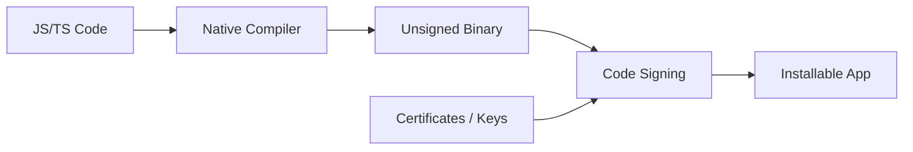
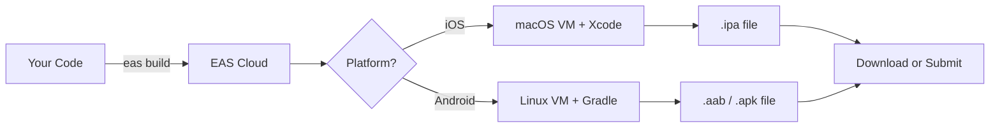
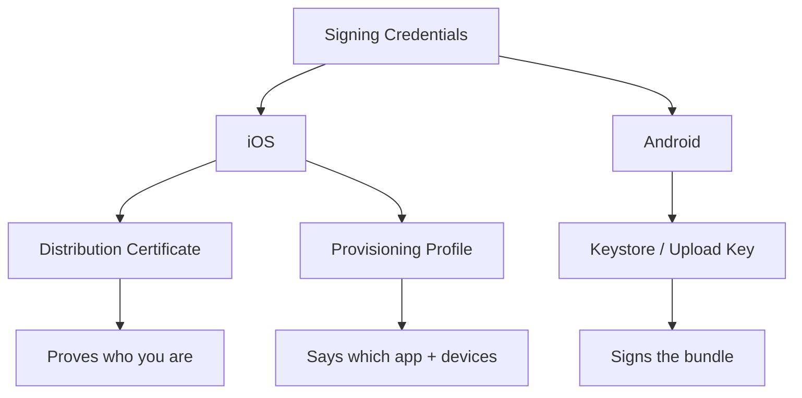
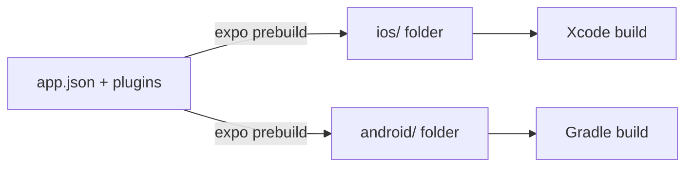
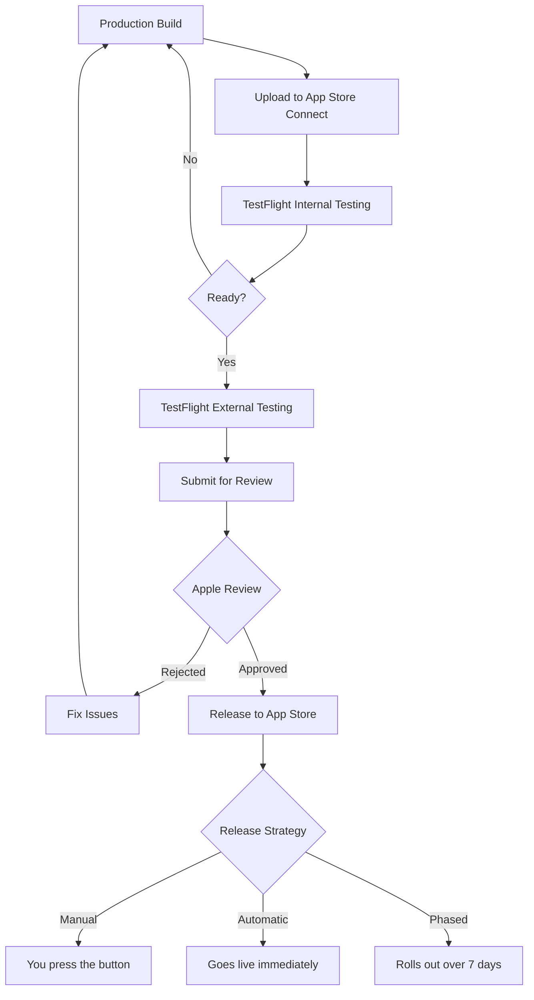
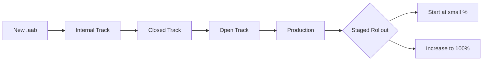
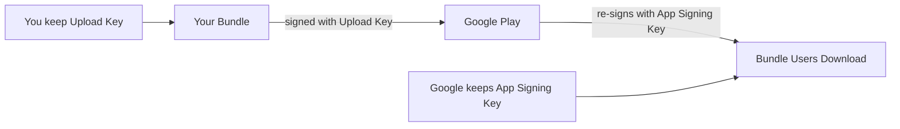
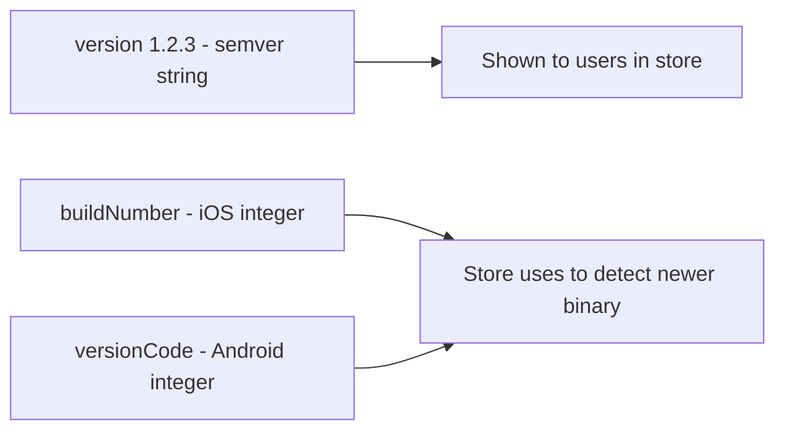
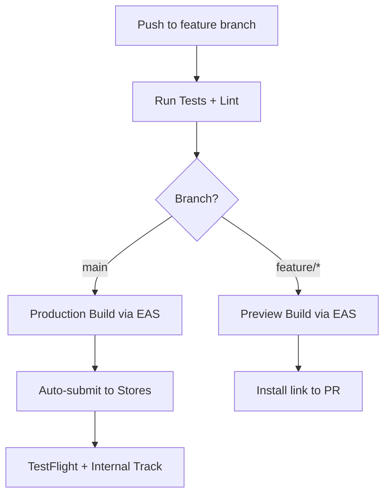
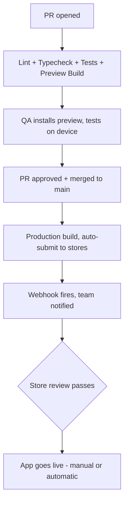

# Build et déploiement : du code aux stores

> EAS Build, soumission aux app stores, versioning et pipelines CI/CD pour livrer des applications mobiles.

---

## Table of Contents

1. [EAS Build](#1-eas-build)
2. [Local Builds](#2-local-builds)
3. [iOS Submission](#3-ios-submission)
4. [Android Submission](#4-android-submission)
5. [Versioning](#5-versioning)
6. [CI/CD](#6-cicd)

---

## 1. EAS Build

Sur le web, le déploiement est presque trivialement simple : on lance une commande de build, on téléverse des fichiers statiques sur un CDN, et c'est terminé. Le mobile est un univers différent. Il vous faut Xcode (macOS uniquement) pour iOS, Android Studio et Gradle pour Android, des certificats de signature, des provisioning profiles, des keystores... c'est un véritable parcours du combattant. EAS Build existe pour faire disparaître ce parcours.

### Pourquoi les builds mobiles sont difficiles à la base

En venant du web, c'est le changement mental qui déstabilise tout le monde. Quand vous déployez un site, l'« artefact » n'est qu'un ensemble de fichiers — HTML, JS, CSS — que n'importe quel navigateur peut exécuter. Le navigateur est le runtime, et il est déjà installé sur chaque appareil. Vous ne compilez jamais quoi que ce soit pour une machine spécifique.

Le mobile est tout l'inverse. L'artefact est un **binaire natif** — du véritable code spécifique à la machine que le système d'exploitation exécute directement, sans navigateur entre les deux. Et l'OS n'exécutera pas n'importe quel binaire. Il exige une preuve, cryptographique, que le binaire provient d'un développeur enregistré et qu'il n'a pas été altéré. Cette preuve, c'est ce que signifie la « signature », et c'est la principale source de douleur pour les débutants.



> **Analogie** : un déploiement web, c'est comme envoyer un document par e-mail — n'importe qui peut l'ouvrir. Un build mobile, c'est comme fabriquer un passeport. Il ne fonctionne que s'il porte les bons tampons officiels (les certificats), et seul le titulaire (le développeur enregistré) peut en émettre de valides. EAS Build, c'est le bureau des passeports qui s'occupe de la paperasse à votre place.

### Ce que fait réellement EAS Build

EAS (Expo Application Services) Build est un service de build basé dans le cloud. Vous poussez votre code, les serveurs d'Expo compilent vos binaires natifs, et vous téléchargez le résultat. Pas de Xcode local. Pas de daemon Gradle qui dévore 8 Go de RAM. Aucun cauchemar du type « ça marche sur ma machine ».

L'idée clé : les binaires iOS ne peuvent **que** être construits sur macOS (exigence légale d'Apple). Donc même si vous êtes sous Windows ou Linux, EAS démarre une véritable machine virtuelle macOS dans le cloud, y exécute Xcode, et vous rend le `.ipa`. C'est ce qui rend Expo si puissant pour les développeurs sans Mac — vous pouvez livrer sur l'App Store sans jamais posséder de Mac.



Voici ce que signifie chaque format de sortie, car les acronymes ne sont pas évidents :

| Fichier | Plateforme | Ce que c'est | Utilisé pour |
|---|---|---|---|
| `.ipa` | iOS | Archive d'application iOS | Soumission à l'App Store / TestFlight |
| `.aab` | Android | Android App Bundle | Soumission à Google Play (privilégié) |
| `.apk` | Android | Package Android | Installation directe sur un appareil / sideloading / QA |

### Pour démarrer

Installez l'EAS CLI et configurez votre projet :

```bash
npm install -g eas-cli   # the command-line tool that talks to EAS
eas login                # authenticate with your Expo account
eas build:configure      # scaffold an eas.json for this project
```

Cette dernière commande génère un fichier `eas.json`. C'est là que vivent les profils de build :

```json
{
  "cli": {
    "version": ">= 5.0.0"
  },
  "build": {
    "development": {
      "developmentClient": true,
      "distribution": "internal",
      "ios": {
        "simulator": true
      }
    },
    "preview": {
      "distribution": "internal",
      "ios": {
        "simulator": false
      }
    },
    "production": {
      "autoIncrement": true
    }
  },
  "submit": {
    "production": {
      "ios": {
        "ascAppId": "your-app-store-connect-id"
      }
    }
  }
}
```

Trois profils, c'est l'équilibre idéal. Considérez-les comme les environnements `dev` / `staging` / `prod` que vous utilisez déjà sur le web :

- **development** — inclut le dev client, s'exécute sur des simulateurs, itération rapide. Ce build peut se connecter à votre bundler Metro et faire du hot-reload, comme lancer `npm run dev` localement.
- **preview** — un vrai build que vous pouvez installer sur des appareils physiques pour la QA. Voyez-le comme un environnement de staging. Il exécute le JS bundlé, sans serveur Metro, mais n'est pas optimisé pour le store.
- **production** — le binaire prêt pour le store, optimisé, minifié, signé avec les credentials de production. C'est celui qui part en ligne.

| Profil | S'exécute sur | Se connecte à Metro ? | Signé avec | Analogie web |
|---|---|---|---|---|
| development | Simulateur + appareils de dev | Oui (hot reload) | Credentials de dev | `npm run dev` |
| preview | Appareils physiques (QA) | Non (JS bundlé) | Internal/ad-hoc | Déploiement de staging |
| production | App stores | Non (optimisé) | Credentials de production | Déploiement de prod |

### Lancer un build

```bash
# Development build for iOS simulator
eas build --platform ios --profile development

# Production build for both platforms at once
eas build --platform all --profile production
```

Après avoir lancé cela, le build est mis en file d'attente dans le cloud. La CLI vous donne une URL où vous pouvez suivre les logs en direct — les mêmes logs que ceux d'un dashboard CI sur le web. Une fois terminé, vous obtenez un lien de téléchargement (ou il part directement vers le store si vous avez utilisé `--auto-submit`, abordé plus loin).

### Gestion des credentials

C'est la fonctionnalité phare. Sur le web, il n'y a pas de certificats de signature — vous poussez sur Vercel et c'est fini. En mobile, iOS exige des provisioning profiles et des certificats de distribution ; Android exige un keystore. EAS gère tout cela pour vous. Lors de votre premier build, il vous demandera si vous voulez qu'EAS gère les credentials automatiquement. Dites oui. Il les génère et les stocke de façon sécurisée. Vous ne touchez jamais à un fichier `.p12` ou à un `keystore.jks`, sauf si vous le souhaitez.

Voici le modèle mental pour les deux écosystèmes, car ils diffèrent sur un point important :



> **Piège** : si vous avez déjà des credentials existants (peut-être issus d'un projet pré-Expo), vous pouvez les importer avec `eas credentials`. Ne laissez pas EAS en générer de nouveaux si vous avez déjà une application dans le store — vous ne pourriez plus la mettre à jour. Sur Android en particulier, une application signée avec une *nouvelle* clé est traitée comme une application *différente* par le Play Store, et les utilisateurs ne peuvent pas faire la mise à jour par-dessus.

### La réalité des tarifs

EAS Build dispose d'un palier gratuit : un nombre limité de builds par mois sur une file partagée (les builds peuvent attendre 20 à 40 minutes dans la file). Pour un projet personnel, c'est largement suffisant. Pour une équipe qui livre quotidiennement, les paliers payants offrent des files prioritaires et des machines plus rapides. Comparé à la maintenance de vos propres runners CI macOS (que la licence d'Apple exige pour les builds iOS — vous ne pouvez littéralement pas, légalement, construire des apps iOS sur du Linux loué), c'est une affaire.

> **Astuce de pro** : consacrez vos minutes de build gratuites aux builds `production` et utilisez les **builds locaux sur simulateur** ou **Expo Go / le dev client** pour le développement au quotidien. Vous n'avez pas besoin d'un build cloud à chaque changement de couleur de bouton — seulement quand il vous faut un vrai binaire installable.

---

## 2. Local Builds

Parfois, vous avez besoin de builds locaux. Peut-être déboguez-vous un crash de module natif. Peut-être que la politique de votre entreprise interdit d'envoyer du code à des serveurs tiers. Peut-être voulez-vous simplement une itération plus rapide sur les changements natifs.

### L'étape `prebuild` : d'où vient le projet natif

Voici un concept propre à Expo qui déroute les débutants. Dans un projet Expo managé, il n'y a **aucun dossier `ios/` ou `android/`** — votre application est entièrement configurée via `app.json`. Pour builder localement, vous devez d'abord *générer* ces dossiers natifs. C'est ce que fait `prebuild` : il lit votre `app.json`, applique tous vos config plugins, et matérialise un vrai projet Xcode et un vrai projet Gradle.



> **Piège** : une fois que vous lancez `prebuild` et que vous commencez à éditer à la main les dossiers `ios/` ou `android/`, vous avez quitté le workflow « managé » pour entrer dans le workflow « bare ». Relancer `prebuild` peut écraser vos modifications natives manuelles. Considérez cela comme une porte à sens unique, sauf si vous committez ces dossiers dans git et les gérez délibérément.

### iOS : Xcode + Fastlane

Il vous faut un Mac. Il n'y a aucun moyen de contourner cela — Apple exige Xcode, et Xcode ne fonctionne que sur macOS.

```bash
# Generate the native iOS project from app.json
npx expo prebuild --platform ios

# Open the workspace in Xcode (note: .xcworkspace, not .xcodeproj)
open ios/*.xcworkspace
```

Depuis Xcode, vous pouvez builder et lancer sur un simulateur ou un appareil physique. Mais pour des builds automatisés, Fastlane est l'outil standard. Fastlane est une boîte à outils d'automatisation basée sur Ruby — voyez-la comme les « scripts npm » du monde mobile natif, enveloppant les pénibles lignes de commande Xcode et Gradle dans des « lanes » nommées :

```bash
# Install Fastlane (Homebrew is the common route on macOS)
brew install fastlane

# Inside the ios/ directory, scaffold a Fastfile
cd ios
fastlane init
```

Un `Fastfile` typique pour builder et téléverser vers TestFlight :

```ruby
# ios/fastlane/Fastfile
default_platform(:ios)

platform :ios do
  desc "Build and upload to TestFlight"
  lane :beta do
    increment_build_number          # bump the integer build number
    build_app(
      workspace: "YourApp.xcworkspace",
      scheme: "YourApp",
      export_method: "app-store"    # signs for distribution, not dev
    )
    upload_to_testflight            # pushes the .ipa to TestFlight
  end
end
```

### Android : Gradle + Fastlane

Android est plus permissif — Gradle s'exécute sur n'importe quel OS (Windows, Mac, Linux), car l'outillage Android n'est pas légalement verrouillé à une seule plateforme comme celui d'Apple.

```bash
# Generate the native Android project
npx expo prebuild --platform android

# Build an APK for testing (sideload-friendly)
cd android
./gradlew assembleRelease

# Or build an AAB for the Play Store
./gradlew bundleRelease
```

L'APK de release atterrit dans `android/app/build/outputs/apk/release/`. L'AAB dans `android/app/build/outputs/bundle/release/`.

> **Pourquoi l'AAB plutôt que l'APK ?** Un `.apk` contient le code et les assets pour *chaque* appareil (toutes les densités d'écran, toutes les architectures CPU), il est donc surdimensionné. Un `.aab` permet à Google Play de générer un APK allégé, taillé pour l'appareil exact de chaque utilisateur. Téléchargement plus petit, même application. C'est pourquoi Google exige l'AAB pour les téléversements vers le store, mais l'APK reste pratique pour des installations manuelles rapides.

Fastlane fonctionne aussi pour Android :

```ruby
# android/fastlane/Fastfile
default_platform(:android)

platform :android do
  desc "Build and upload to Play Store internal track"
  lane :internal do
    gradle(task: "bundleRelease")
    upload_to_play_store(
      track: "internal",
      aab: "app/build/outputs/bundle/release/app-release.aab"
    )
  end
end
```

### Quand utiliser le local plutôt qu'EAS

| Scénario | À utiliser | Pourquoi |
|---|---|---|
| Builds d'application standard | EAS Build | Aucune configuration machine, signature gérée |
| Débogage de crashs natifs | Local (Xcode/Android Studio) | Pas à pas dans le code natif, breakpoints natifs |
| L'entreprise restreint les builds cloud | Local + Fastlane | Le code ne quitte jamais votre infrastructure |
| Développement de modules natifs sur mesure | Local en dev, EAS pour la release | Boucle interne rapide en local, release propre dans le cloud |
| Projet open source | EAS (le palier gratuit est généreux) | Les contributeurs n'ont pas besoin d'un Mac |
| Aucun Mac disponible | EAS | Les builds iOS exigent macOS — EAS en loue un |

> **Opinion** : par défaut, optez pour EAS Build. Ne descendez vers les builds locaux que lorsque vous avez une raison précise. Le temps économisé à ne pas déboguer les problèmes de signature Xcode justifie à lui seul ce choix. Les erreurs de signature dans Xcode sont réputées cryptiques (« No profiles for 'com.you.app' were found ») et peuvent dévorer un après-midi entier.

---

## 3. iOS Submission

Livrer sur l'App Store est un processus. Pas difficile, mais un processus avec des étapes et des exigences précises qui, si vous en manquez une seule, renverront votre soumission.

### Prérequis

- **Apple Developer Program** : 99 $/an. Non négociable. Vous ne pouvez pas soumettre sans cela. (Contrairement aux frais uniques de Google, celui-ci se renouvelle chaque année — laissez-le expirer et vos applications sont retirées du store.)
- **App Store Connect** : le portail web d'Apple pour gérer les applications, les builds TestFlight, les métadonnées et les soumissions. C'est le tableau de bord dans lequel vous allez vivre.
- Un `.ipa` de production buildé avec un certificat de distribution (EAS ou Xcode le produit).

### Le flux de soumission

Le parcours du binaire jusqu'à « en ligne dans le store » comporte plus de barrières qu'un déploiement web. La barrière critique est l'**Apple Review** — un humain (plus des contrôles automatisés) inspecte réellement votre application avant qu'elle ne puisse passer en ligne. Il n'y a aucun équivalent sur le web.



### Utiliser EAS Submit

Le chemin le plus simple :

```bash
# Build and submit in one step (chains build -> upload)
eas build --platform ios --profile production --auto-submit

# Or submit a previously completed build
eas submit --platform ios
```

EAS Submit gère le téléversement du binaire et le remplissage de la plupart des métadonnées techniques. Mais vous devez tout de même tout configurer dans App Store Connect : captures d'écran (aux tailles d'appareils requises), description, mots-clés, URL de support, URL de la politique de confidentialité, et les étiquettes nutritionnelles de confidentialité. Rien de tout cela ne peut être ignoré — Apple bloque la soumission tant que la fiche n'est pas complète.

### TestFlight

TestFlight est le service de bêta-test d'Apple — le moyen de faire arriver un vrai build sur le téléphone d'un vrai testeur *avant* qu'il ne soit public. Deux modes :

| Mode | Testeurs max | Review nécessaire ? | Idéal pour |
|---|---|---|---|
| **Internal** | Jusqu'à 100 membres de l'équipe | Aucune — instantané | QA quotidienne, votre propre équipe |
| **External** | Jusqu'à 10 000 | Légère review bêta (heures) | Programmes de bêta publics |

> **Astuce de pro** : les testeurs internes doivent être ajoutés en tant qu'utilisateurs de votre équipe App Store Connect, mais les builds leur parviennent en quelques minutes sans aucune review. C'est le moyen le plus rapide d'obtenir un build signé en production sur un appareil pour une vérification de bon sens avant de soumettre à la vraie review.

### Le manifeste de confidentialité

Depuis le printemps 2024, Apple exige un fichier `PrivacyInfo.xcprivacy` dans le bundle de votre application. Celui-ci déclare quelles « required reason APIs » votre application utilise — des choses comme `UserDefaults`, les API d'espace disque, et l'heure de démarrage du système. Apple veut que vous justifiiez *pourquoi* vous touchez à ces API, pour empêcher les applications de s'en servir afin de fingerprinter silencieusement les utilisateurs. Si vous utilisez l'une de ces API (et c'est presque certainement le cas — React Native lui-même en utilise certaines sous le capot), vous devez déclarer la raison.

```bash
# If using Expo, add the privacy manifest via a config plugin
npx expo install expo-privacy-manifest-polyfill-plugin
```

Dans votre `app.json` :

```json
{
  "expo": {
    "plugins": [
      "expo-privacy-manifest-polyfill-plugin"
    ]
  }
}
```

> **Piège** : Apple rejettera votre build silencieusement si le manifeste de confidentialité est manquant ou incomplet. Vous recevrez un e-mail générique au sujet de « missing API declarations » sans précision sur l'API concernée. Consultez la documentation Expo pour les dernières déclarations requises — la liste s'allonge au fil du temps à mesure qu'Apple resserre les règles.

### Le délai de l'App Review

Comptez environ 24 heures pour une application simple. Les applications complexes ou les premières soumissions peuvent prendre jusqu'à 7 jours. Raisons de rejet courantes, et comment les esquiver :

| Raison de rejet | Solution |
|---|---|
| Crash au lancement | Testez le build de *production* sur un vrai appareil, pas seulement le build de dev |
| Contenu placeholder / de démo | Livrez du vrai contenu ; pas de « Lorem ipsum » ni de données de test |
| Lien de politique de confidentialité cassé | Vérifiez que l'URL se charge sur mobile avant de soumettre |
| Permission sans explication | Ajoutez une chaîne `NS...UsageDescription` claire pour chaque permission |
| Connexion requise sans compte de test | Fournissez des identifiants de démo dans les notes de review |

---

## 4. Android Submission

Le processus de Google est moins opaque que celui d'Apple, mais possède son propre lot d'exigences qui font trébucher.

### Prérequis

- **Google Play Console** : frais uniques de 25 $. Payez une fois, publiez à vie. (À comparer aux 99 $/an d'Apple — Google revient moins cher sur la durée.)
- Un fichier `.aab` (Android App Bundle) signé. Google préfère fortement l'AAB à l'APK pour les soumissions au store.

### Les tracks du Play Store

Google utilise un système de tracks pour des déploiements progressifs. Au lieu d'un unique gros bouton « mise en ligne », vous promouvez un build à travers des audiences de plus en plus larges — comme un feature flag d'une release web à 1 %, puis 10 %, puis tout le monde.

| Track | Objectif | Testeurs | Review |
|---|---|---|---|
| Internal | Tests d'équipe, disponibilité instantanée | Jusqu'à 100 | Minimale |
| Closed | Bêta avec liens d'invitation | Illimités (via listes d'e-mails) | Légère |
| Open | Bêta publique, tout le monde peut rejoindre | Illimités | Standard |
| Production | Release complète | Tout le monde | Complète |

Le chemin intelligent : d'abord le track Internal pour le smoke testing, le track Closed pour une bêta plus large, puis la production. Vous pouvez passer directement à la production, mais vous ne devriez pas — un bug qui part chez tous les utilisateurs est bien plus difficile à rattraper qu'un bug détecté sur le track Internal.



### EAS Submit pour Android

```bash
# Submit to Google Play
eas submit --platform android

# Or auto-submit right after the build finishes
eas build --platform android --profile production --auto-submit
```

Pour la **première** soumission, vous devez créer l'application manuellement dans la Google Play Console et téléverser le premier build via l'interface web. C'est une exigence de Google — le tout premier bundle doit passer par le dashboard. Après cela, EAS Submit peut gérer automatiquement chaque téléversement ultérieur.

### Play App Signing

Le Google Play App Signing est désormais obligatoire pour les nouvelles applications. Deux clés sont impliquées, et comprendre cette répartition lève beaucoup d'anxiété :

- **App signing key** — la *vraie* clé qui signe ce que les utilisateurs téléchargent. **C'est Google qui la détient.**
- **Upload key** — la clé que *vous* utilisez pour signer le bundle que vous envoyez à Google. Google la vérifie, retire votre signature, et re-signe avec l'app signing key.



L'énorme avantage : si vous **perdez votre upload key**, Google peut vous la réinitialiser. À comparer à iOS, où une mauvaise gestion de votre certificat de distribution est une véritable catastrophe sans réinitialisation facile.

```bash
# EAS handles Play App Signing automatically.
# If you ever need to inspect or export the upload keystore:
eas credentials --platform android
```

### Le formulaire Data Safety

Google exige un formulaire Data Safety déclarant quelles données votre application collecte, si elles sont partagées avec des tiers, et comment elles sont sécurisées. C'est l'équivalent Android des étiquettes nutritionnelles de confidentialité d'Apple.

Vous remplissez cela dans la Google Play Console. Types de données courants à déclarer pour une application React Native typique :

- **Identifiants d'appareil** (si vous utilisez des analytics comme Firebase ou Amplitude)
- **Logs de crash** (si vous utilisez Sentry, Crashlytics, etc.)
- **Interactions avec l'application** (si vous suivez les vues d'écran ou les taps de boutons)

> **Piège** : Google ne rejette pas les builds pour un formulaire Data Safety incorrect — mais ils signaleront votre application plus tard lors des revues de conformité, et l'application des règles peut signifier un retrait de l'application avec peu d'avertissement. Remplissez-le honnêtement dès la première fois ; c'est bien moins coûteux qu'un recours.

### Exigences de Target API Level

Google relève chaque année le **target SDK level** minimum pour pousser les applications vers des versions d'Android plus récentes et plus sécurisées. Le target SDK correspond essentiellement à « quelle version du comportement d'Android votre application adopte ». Depuis 2025, les nouvelles applications et les mises à jour doivent cibler l'API level 34 (Android 14) ou supérieur. Si votre `targetSdkVersion` est inférieur, Google rejettera purement et simplement votre soumission.

Dans votre `app.json` (workflow Expo managé) :

```json
{
  "expo": {
    "android": {
      "targetSdkVersion": 35
    }
  }
}
```

> **Conseil** : ciblez toujours un niveau au-dessus du minimum actuel. Quand Google relèvera l'exigence l'année prochaine, vous êtes déjà conforme et vous ne vous retrouvez pas pris en plein milieu d'une release avec un build rejeté.

---

## 5. Versioning

Sur le web, le versioning est surtout cosmétique — les utilisateurs obtiennent toujours le dernier déploiement au prochain rafraîchissement. En mobile, le versioning est imposé par les stores et détermine si un utilisateur peut même recevoir une mise à jour.

### Deux nombres, deux objectifs

C'est la partie que tout le monde se trompe au début. Chaque application mobile porte **deux** identifiants de version distincts, et ils font des choses complètement différentes :



- **`version`** (par ex., `1.2.3`) : ce que les utilisateurs voient dans la fiche du store. Suit les conventions semver. Vous l'incrémentez quand vous livrez une mise à jour significative. Ce nombre est pour les *humains*.
- **`buildNumber`** (iOS) / **`versionCode`** (Android) : un entier strictement croissant. Le store l'utilise en interne pour décider si un binaire est « plus récent » que le précédent. Vous l'incrémentez à **chaque build que vous téléversez**, même si la `version` visible par l'utilisateur n'a pas changé. Ce nombre est pour le *store*.

Dans `app.json` :

```json
{
  "expo": {
    "version": "1.2.3",
    "ios": {
      "buildNumber": "42"
    },
    "android": {
      "versionCode": 42
    }
  }
}
```

> **Analogie** : `version`, c'est le titre sur la couverture d'un livre (« 2e édition ») — c'est du marketing. `buildNumber`, c'est le numéro de tirage à l'intérieur — ennuyeux, interne, mais il doit toujours augmenter pour que l'entrepôt sache quel est le stock le plus récent.

### La règle d'or

Le `buildNumber` / `versionCode` doit **toujours augmenter**. Si vous soumettez le build 42, la soumission suivante doit être 43 ou plus. Soumettre 41 sera rejeté instantanément par le store avant même qu'une review ne commence. La chaîne `version` peut techniquement rester identique sur plusieurs builds (utile quand vous resoumettez un build rejeté avec un correctif et que vous ne voulez pas changer ce que voient les utilisateurs), mais le numéro de build doit toujours monter.

### Auto-incrémentation avec EAS

Suivre manuellement les numéros de build est source d'erreurs — oubliez une fois et votre téléversement est rejeté. Laissez EAS s'en charger :

```json
{
  "build": {
    "production": {
      "autoIncrement": true
    }
  }
}
```

Avec `autoIncrement: true`, EAS interroge les app stores pour connaître le dernier numéro de build à chaque build, et incrémente à partir de là. Vous n'y pensez plus jamais.

> **Piège** : si vous mélangez builds locaux et builds EAS, l'auto-incrémentation peut s'embrouiller — EAS ne connaît pas les builds que vous avez soumis manuellement depuis Xcode ou Gradle, il peut donc tenter de réutiliser un numéro déjà pris. Choisissez un seul système (EAS) et tenez-vous-y, sinon vous rencontrerez des erreurs « this build number already exists ».

### Une stratégie de versioning pratique

```bash
# Major: breaking changes, big redesigns
1.0.0 -> 2.0.0

# Minor: new features, backward compatible
1.0.0 -> 1.1.0

# Patch: bug fixes only
1.0.0 -> 1.0.1

# Build number: every submission, automated, always up
buildNumber: 1, 2, 3, 4, 5...
```

Contrairement au web — où vous pouvez hotfixer un déploiement en quelques minutes et chaque utilisateur l'a instantanément — une mise à jour mobile passe par la review du store puis doit être *téléchargée* par chaque utilisateur. Versionnez de façon réfléchie : quelqu'un sur la version 1.0.0 peut y rester pendant des jours jusqu'à ce qu'il fasse la mise à jour par hasard. (C'est aussi pourquoi les mises à jour over-the-air via `eas update`, abordées dans la section CI/CD, sont si précieuses pour les correctifs purement JS — elles contournent entièrement le store.)

---

## 6. CI/CD

Sur le web, le CI/CD pour les déploiements est mature et sans effort — vous poussez sur main, et Vercel ou Netlify déploie automatiquement en quelques secondes. En mobile, vous pouvez obtenir la même sensation de push-to-deploy, mais cela demande une configuration délibérée à cause de la compilation native et de la review du store.

### L'objectif

Le pipeline de rêve : un développeur pousse du code, et le bon type de build se déclenche automatiquement selon *l'endroit* où il a poussé. Les branches de feature obtiennent un build de preview jetable pour la QA ; `main` obtient un vrai build de production qui se soumet de lui-même aux stores.



### GitHub Actions + EAS

Voici un workflow prêt pour la production. Un workflow GitHub Actions n'est qu'un fichier YAML décrivant les étapes à exécuter sur les serveurs d'Expo/de GitHub chaque fois qu'un événement (comme un push) survient. Créez `.github/workflows/build.yml` :

```yaml
name: Mobile Build & Deploy

on:
  push:
    branches: [main]          # production path
  pull_request:
    branches: [main]          # preview path

jobs:
  build:
    runs-on: ubuntu-latest    # Linux runner; iOS still builds on EAS's macOS
    steps:
      - name: Checkout
        uses: actions/checkout@v4

      - name: Setup Node
        uses: actions/setup-node@v4
        with:
          node-version: 20
          cache: npm

      - name: Install dependencies
        run: npm ci            # clean, reproducible install for CI

      - name: Run tests
        run: npm test          # gate the build on a green test suite

      - name: Setup EAS
        uses: expo/expo-github-action@v8
        with:
          eas-version: latest
          token: ${{ secrets.EXPO_TOKEN }}   # auth without interactive login

      - name: Build Preview (PR)
        if: github.event_name == 'pull_request'
        run: eas build --platform all --profile preview --non-interactive

      - name: Build Production (main)
        if: github.ref == 'refs/heads/main'
        run: eas build --platform all --profile production --auto-submit --non-interactive
```

Notez le flag `--non-interactive` : il indique à EAS de ne jamais s'arrêter pour poser une question (comme « générer les credentials ? »), car il n'y a personne au clavier en CI. Si EAS avait besoin d'une entrée qu'on ne lui donne pas, il échoue immédiatement plutôt que de rester bloqué.

### Configurer l'EXPO_TOKEN

Les exécutions CI n'ont aucun utilisateur connecté, vous vous authentifiez donc avec un **token** au lieu de `eas login`. Un token est une longue chaîne secrète qui prouve que « ce job automatisé est autorisé à agir en tant que mon compte Expo ».

```bash
# 1. Generate a personal access token at expo.dev (Account > Access Tokens)
# 2. Add it to your GitHub repo secrets:
#    Settings > Secrets and variables > Actions > New repository secret
#    Name:  EXPO_TOKEN
#    Value: your-token-here
```

> **Piège** : ne committez jamais un token dans votre dépôt et ne le collez jamais directement dans le YAML. Référencez-le toujours via `${{ secrets.EXPO_TOKEN }}`. Un token Expo divulgué permet à n'importe qui de publier des builds en votre nom.

### Builds de preview basés sur les branches

Pour les pull requests, les builds de preview permettent à la QA de tester les changements avant qu'ils n'atteignent main. EAS prend en charge des **update channels** qui correspondent aux branches — un channel est un « flux » nommé de mises à jour JS qu'un build donné écoute :

```json
{
  "build": {
    "preview": {
      "distribution": "internal",
      "channel": "preview"
    },
    "production": {
      "channel": "production"
    }
  }
}
```

Associez cela à `eas update` pour des mises à jour OTA (over-the-air) vers les builds de preview. C'est l'arme secrète : un relecteur installe le build de preview **une seule fois**, et les push ultérieurs sur la branche de la PR mettent à jour le JavaScript à l'intérieur de l'application déjà installée — pas de lent rebuild natif, pas de réinstallation.

```bash
# In your PR workflow — push new JS to a branch-specific channel
eas update --branch preview-pr-${{ github.event.pull_request.number }} --message "PR #${{ github.event.pull_request.number }}"
```

> **Pourquoi l'OTA fonctionne** : une application React Native est une coquille native + un bundle JavaScript. Si vous n'avez changé que le JS (la plupart du travail de feature), vous pouvez échanger le bundle sans reconstruire la coquille. Seuls les changements de code *natif* ou les nouvelles dépendances natives exigent un rebuild complet. C'est à peu près comme échanger le HTML/JS d'une page web sans réinstaller le navigateur.

### Auto-submit lors du merge sur main

Le flag `--auto-submit` sur `eas build` soumet automatiquement le binaire terminé à l'App Store et à Google Play après un build réussi. Combiné au workflow GitHub Actions ci-dessus, merger une PR sur main déclenche toute la chaîne : build sur les deux plateformes → soumission aux deux stores → arrivée sur TestFlight et le track Internal. Aucune intervention humaine du commit jusqu'à « en attente de review ».

### Webhooks EAS pour les notifications

EAS peut déclencher des webhooks lorsque les builds se terminent ou échouent. Un webhook n'est qu'une requête HTTP qu'EAS envoie à une URL que vous contrôlez chaque fois qu'un événement survient — parfait pour acheminer le statut vers le chat de l'équipe :

```bash
# Register a webhook for build events
eas webhook:create --event BUILD --url https://your-server.com/eas-webhook --secret your-webhook-secret
```

Routez-les vers Slack, Discord, ou le canal de notification de votre équipe. Vous voulez savoir immédiatement quand un build de production échoue, et non le découvrir le lendemain matin quand quelqu'un demande où est passée la release.

> **Erreur courante** : ne pas épingler la version de votre EAS CLI en CI. Les mises à jour de l'EAS CLI peuvent introduire des changements cassants, et `eas-version: latest` signifie qu'une release du côté d'Expo peut casser votre pipeline du jour au lendemain sans aucun changement de code de votre part. Une approche plus sûre consiste à spécifier une version exacte comme `eas-version: 12.x.x` et à l'incrémenter délibérément une fois que vous l'avez testée.

### Le pipeline complet

En rassemblant le tout, un pipeline CI/CD React Native mature ressemble à ceci :



1. **PR ouverte** — lint, typecheck, tests unitaires, build de preview.
2. **PR approuvée** — la QA installe le build de preview, teste sur un vrai appareil.
3. **Mergé sur main** — build de production, auto-submit vers les stores.
4. **Build terminé** — le webhook se déclenche, l'équipe est notifiée.
5. **Review du store réussie** — l'application passe en ligne (automatiquement ou manuellement, à votre choix).

C'est la même philosophie de push-to-deploy que vous connaissez du web, adaptée aux réalités de la review des app stores et de la compilation de binaires natifs. Sa mise en place prend un samedi après-midi. Elle économise des centaines d'heures sur la durée de vie d'un projet.

---