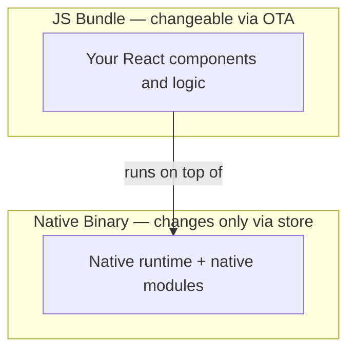
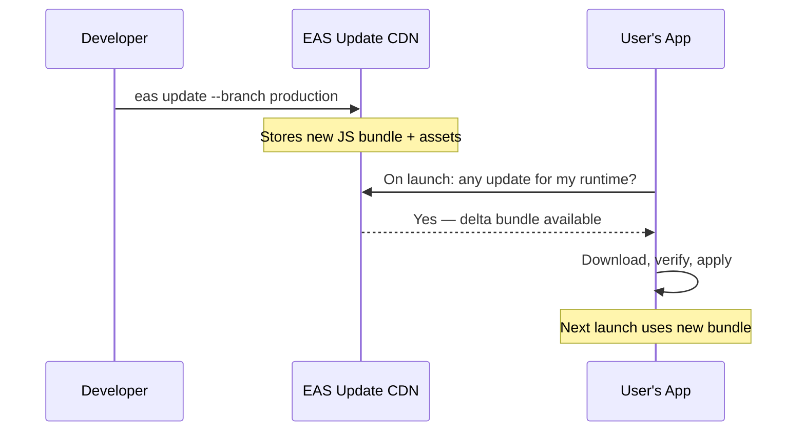
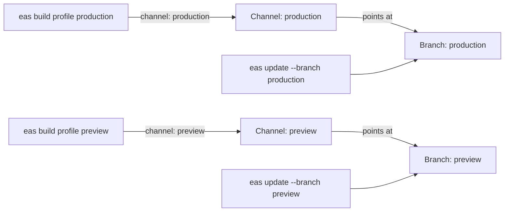
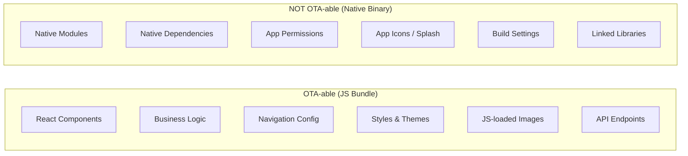
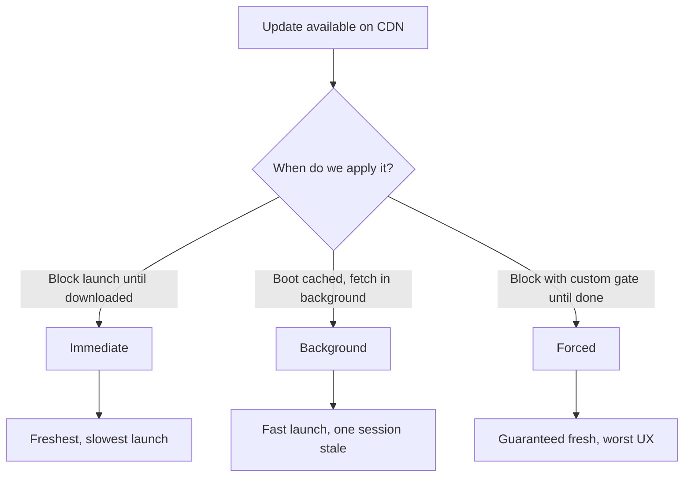
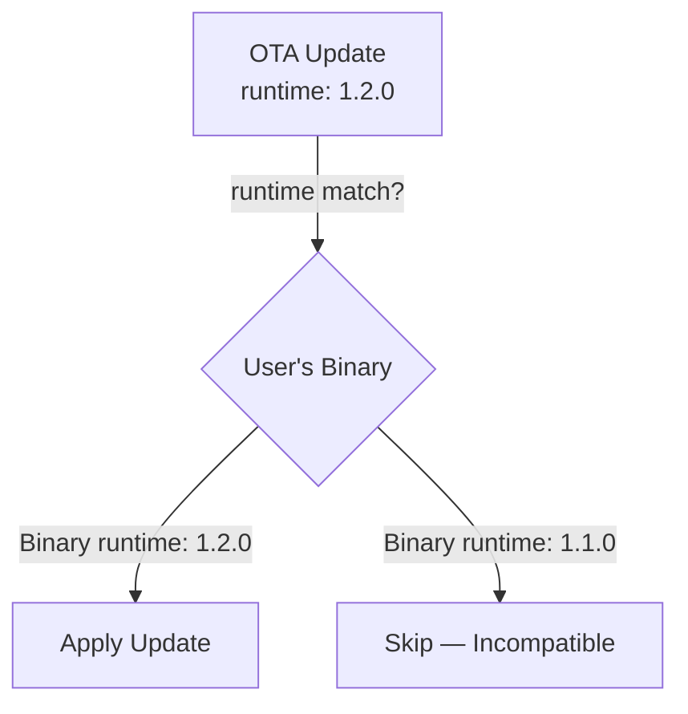
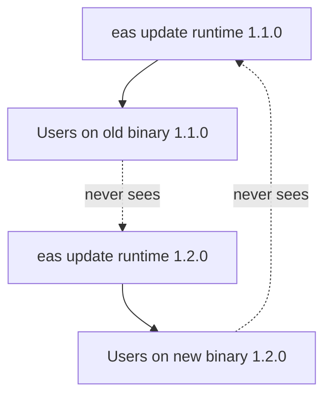
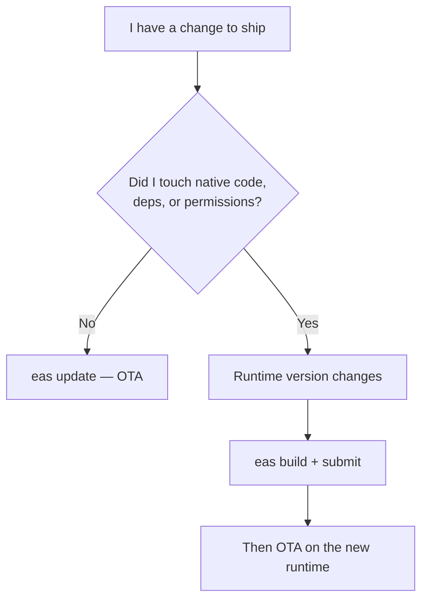
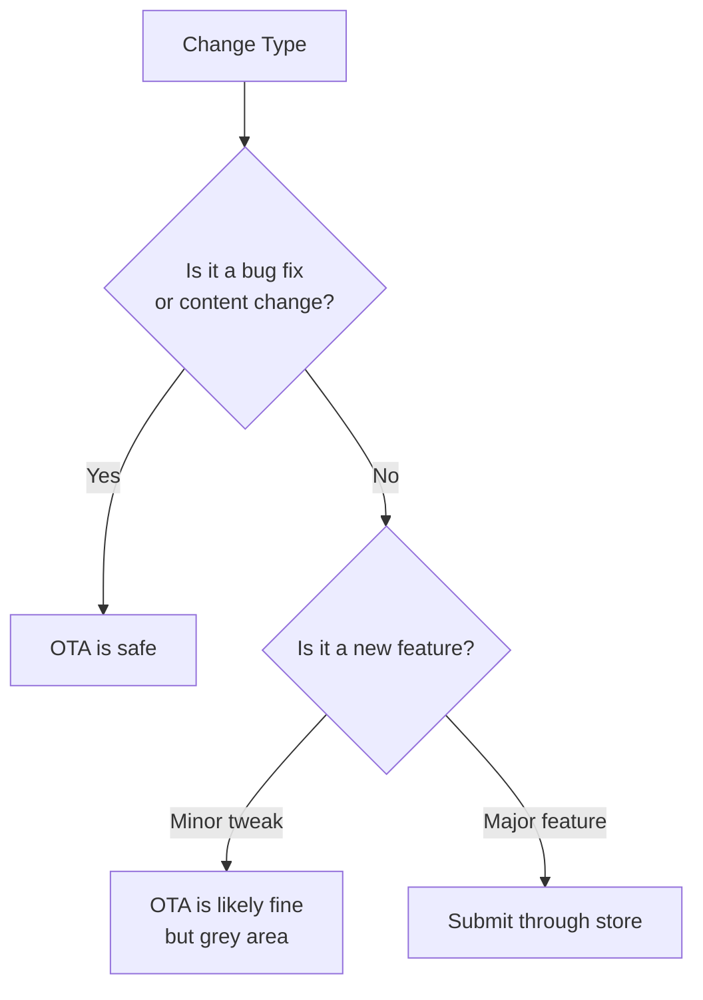

# Mises à jour OTA : Déployer sans passer par l'App Store

> EAS Update, téléchargements delta, versioning de runtime et les règles de conformité que vous devez respecter.

---

## Table of Contents

1. [EAS Update](#1-eas-update)
2. [What Can Be OTA'd](#2-what-can-be-otad)
3. [Update Strategy](#3-update-strategy)
4. [Versioning OTA with Native](#4-versioning-ota-with-native)
5. [Compliance](#5-compliance)

---

## 1. EAS Update

Sur le web, déployer un correctif est trivial. Vous poussez un nouveau bundle vers votre CDN, le prochain chargement de page le récupère, et vos utilisateurs ne voient aucune différence. Il n'y a aucun gardien entre vous et vos utilisateurs — le navigateur télécharge du HTML, du CSS et du JavaScript frais à chaque fois, si bien que « deploy » et « live » signifient la même chose. Sur mobile, le chemin par défaut est brutal : build, soumission, attente de la review, attente que les utilisateurs mettent à jour. La correction d'une faute de frappe peut prendre des jours avant d'atteindre votre audience.

Pourquoi le mobile est-il si différent ? Parce qu'une application native est un **binaire compilé** installé sur l'appareil, et non un document récupéré depuis un serveur. Pour modifier quoi que ce soit dans ce binaire, le système d'exploitation exige un nouveau package signé, et Apple comme Google insèrent une étape de review avant que ce package n'atteigne les utilisateurs. Les mises à jour OTA (« over-the-air ») existent pour récupérer une partie de l'agilité du web en traitant la portion JavaScript de votre application comme un bundle web qui peut être remplacé indépendamment du binaire.

### Le modèle mental

Imaginez une application React Native comme constituée de deux couches empilées l'une sur l'autre :



Le **binaire natif** est le moteur : le runtime React Native, le moteur JavaScript (Hermes) et tous les modules natifs (caméra, cartes, paiements). Il ne change que via l'App Store / le Play Store. Le **bundle JS** est le script que le moteur exécute — vos composants, votre logique métier et vos styles. EAS Update vous permet de remplacer ce script sans toucher au moteur.

> **Analogie** : le binaire natif est une console de jeux. Le bundle JS, ce sont les données de la cartouche de jeu. Les mises à jour OTA vous permettent de patcher la logique du jeu sans expédier aux utilisateurs une nouvelle console — mais vous ne pourrez jamais ajouter un nouveau port de manette (une capacité native) over-the-air.

EAS Update vous offre la boucle de déploiement façon web pour le côté JavaScript de votre application React Native. Vous poussez une mise à jour depuis votre terminal, et la prochaine fois qu'un utilisateur ouvre votre application, il reçoit le nouveau bundle — pas de review du store, pas d'incrément de version, pas d'attente.

### Comment ça fonctionne

En coulisses, EAS Update téléverse votre bundle JS et vos assets vers le CDN d'Expo. Au démarrage de votre application, la librairie `expo-updates` interroge le serveur pour savoir s'il existe un bundle plus récent correspondant à la version de runtime actuelle. Si c'est le cas, elle le télécharge (en utilisant la compression delta lorsque c'est possible) et l'applique selon la stratégie que vous avez choisie.

Les **téléchargements delta** constituent une astuce d'efficacité importante : plutôt que de re-télécharger l'intégralité de votre bundle de plusieurs mégaoctets, le client indique au serveur quels assets il possède déjà, et le serveur n'envoie que les morceaux modifiés. La correction d'une ligne de copie peut représenter quelques kilooctets sur le réseau au lieu de toute l'application. C'est conceptuellement similaire à la façon dont un `git pull` ne récupère que les nouveaux commits plutôt que de re-cloner le dépôt.



### Mise en place

Commencez par installer la librairie de mises à jour et configurer votre projet :

```bash
npx expo install expo-updates
eas update:configure
```

Ceci ajoute la configuration nécessaire à votre `app.json` (un bloc `updates` plus un identifiant de projet qui relie votre application aux serveurs d'Expo). Vous pouvez désormais pousser des mises à jour :

```bash
# Push to a specific branch
eas update --branch production --message "Fix checkout crash"

# Push to a channel (maps branches to builds)
eas update --channel production --message "Fix checkout crash"
```

Chaque `eas update` produit une mise à jour immuable, adressée par contenu et dotée de son propre ID. Vous n'écrasez jamais une mise à jour précédente — vous en publiez une nouvelle et faites pointer la branche dessus. C'est ce qui rend le rollback instantané : l'ancienne mise à jour existe toujours sur le CDN, intacte.

### Channels et branches

C'est la partie que les débutants trouvent la plus déroutante, soyons donc précis. Il existe deux concepts liés :

- Une **branche** est une ligne mouvante de mises à jour (un peu comme une branche Git). Vous publiez des mises à jour sur une branche, et c'est la plus récente que les clients reçoivent.
- Un **channel** est un label intégré à un build qui décide *quelle branche ce build écoute*. Les channels sont la colle entre vos builds et vos mises à jour.

Voyez les channels comme des cibles de déploiement :

- **production** — relié à vos builds App Store / Play Store
- **preview** — relié à vos builds de test interne
- **staging** — relié à vos builds de QA

Un build est compilé avec un channel spécifique intégré. Lorsque ce build vérifie les mises à jour, il ne voit que les mises à jour publiées sur la branche de son channel. Cela signifie que vous pouvez pousser un correctif risqué vers `staging`, le vérifier, puis pousser le même bundle vers `production`.



```bash
# Build with a channel
eas build --profile production  # channel: production
eas build --profile preview     # channel: preview

# Push update to staging first
eas update --channel staging --message "Test new cart logic"

# After QA passes, push to production
eas update --channel production --message "Fix cart total rounding"
```

> **Astuce de pro** : parce qu'un channel est découplé d'une branche, vous pouvez re-pointer un channel vers une branche différente depuis le dashboard Expo sans rebuild. C'est le mécanisme derrière les workflows de promotion : la QA approuve la branche, et vous faites pointer le channel de `production` dessus.

### Rollbacks

Vous avez poussé une mauvaise mise à jour ? Faites un rollback instantanément :

```bash
# Roll back to the previous update on a branch
eas update:rollback --branch production
```

Pas de review du store. Pas d'attente. Vos utilisateurs récupèrent le bundle précédent qui fonctionnait dès leur prochain lancement. Cela justifie à lui seul l'utilisation des mises à jour OTA — le filet de sécurité du rollback instantané vaut bien le coût de la mise en place. Sur le web, votre scénario de rollback est « redéployer le build précédent » ; avec EAS Update vous obtenez la même rapidité sur le natif.

> **Piège** : le rollback revient au bundle JS précédent, et non au bundle embarqué qui a été livré avec le binaire. Si vous devez remonter complètement jusqu'au tout premier, vous devrez republier le bundle d'origine sous forme de nouvelle mise à jour.

> **Astuce de pro** : un « rollback » n'est lui-même qu'un autre événement de publication en coulisses — il indique aux clients de revenir en arrière. Les utilisateurs ne le voient que lors de leur *prochaine* vérification de mise à jour, le rollback est donc rapide mais pas instantané pour un utilisateur en pleine session. Combinez-le avec votre stratégie de mise à jour (section suivante) pour comprendre exactement quand les utilisateurs récupéreront.

---

## 2. Ce qui peut être déployé en OTA

C'est le concept le plus important à intérioriser. Trompez-vous, et votre application plantera pour chaque utilisateur qui n'a pas mis à jour via le store.

### La règle

Les mises à jour OTA remplacent votre **bundle JavaScript et vos assets chargeables**. Elles ne peuvent toucher à rien de ce qui est compilé dans le binaire natif.

La raison remonte directement au modèle à deux couches de la Section 1. Le bundle JS est une *donnée* que le moteur natif lit au runtime, il peut donc être échangé librement. Le code natif est constitué d'*instructions machine* intégrées au binaire signé ; le système d'exploitation ne vous laissera pas les modifier sans un nouveau package re-signé passant par la review.



### Ce que vous POUVEZ pousser en OTA

- **Les composants React** — nouveaux écrans, changements de layout, retouches d'UI
- **La logique métier** — corrections de calculs, règles de validation, gestion du state
- **La structure de navigation** — réorganiser les onglets, ajouter des écrans (si le navigator est purement JS)
- **Les styles et thèmes** — couleurs, espacements, polices (s'ils sont chargés via JS)
- **Les bundles d'assets** — images importées via `require()` ou données JSON embarquées
- **Les changements d'endpoints d'API** — changer d'URL, ajouter des headers, modifier la logique des requêtes

### Ce que vous NE POUVEZ PAS pousser en OTA

- **De nouveaux modules natifs** — installer `react-native-vision-camera` nécessite un build du store
- **Les mises à niveau de dépendances natives** — incrémenter la version d'un SDK natif nécessite une recompilation
- **Les changements de permissions** — ajouter des permissions de localisation ou de notifications push relève de la config native
- **Les icônes d'application et les splash screens** — compilés dans le binaire au moment du build
- **Les mises à niveau du SDK Expo** — elles modifient souvent du code natif en coulisses

### Un tableau de référence rapide

| Changement | Déployable en OTA ? | Pourquoi |
|---|---|---|
| Corriger un bug dans un composant `.tsx` | Oui | Pur JS, vit dans le bundle |
| Modifier une valeur de couleur ou d'espacement | Oui | Style évalué en JS |
| Échanger une URL de base d'API | Oui | Juste une chaîne en JS |
| Ajouter une image via `require()` | Oui | Asset chargeable, livré avec le bundle |
| `npx expo install react-native-maps` | Non | Ajoute du code natif au binaire |
| Ajouter la permission caméra | Non | Déclarée dans le `Info.plist` / manifest natif |
| Changer l'icône de l'application | Non | Compilée dans le binaire |
| Mettre à niveau le SDK Expo de 50 à 51 | Non | Modifie le runtime natif |

### Le test pratique

Avant de pousser une mise à jour OTA, demandez-vous : « Ai-je exécuté `npx expo install` ou modifié quoi que ce soit dans `ios/` ou `android/` ? » Si oui, vous avez besoin d'un build du store. Si vous n'avez touché qu'à des fichiers `.ts`, `.tsx` ou `.js` et à leurs assets importés, l'OTA est sûr.

Une bonne habitude : exécutez `npx expo-doctor` ou inspectez votre `git diff` avant de publier. Si le diff touche aux dépendances de `package.json`, à la config native de `app.json`, ou à quoi que ce soit sous `ios/`/`android/`, traitez cela comme un changement de binaire et faites un build, ne faites pas d'OTA.

> **Erreur courante** : installer un package avec `npm install` qui inclut du code natif, puis pousser une mise à jour OTA. Le bundle JS référence un module natif qui n'existe pas dans le binaire de l'utilisateur. Résultat : plantage instantané au lancement pour chaque utilisateur. Vérifiez toujours si une nouvelle dépendance contient du code natif avant de décider entre OTA et mise à jour du store.

> **Astuce de pro** : préférez `npx expo install` à `npm install` pour les packages natifs. La CLI Expo sait quels packages contiennent du code natif et vous avertira, et elle choisit des versions compatibles avec votre SDK Expo — une petite habitude qui prévient le plantage ci-dessus.

---

## 3. Stratégie de mise à jour

La manière et le moment où votre application applique une mise à jour comptent plus que vous ne le pensez. Une mauvaise stratégie, c'est des utilisateurs qui fixent des spinners de chargement ou qui passent à côté de correctifs critiques pendant des jours. La tension fondamentale est toujours la même : la **fraîcheur** (exécuter le code le plus récent) face à la **vitesse de lancement** (ne pas bloquer l'utilisateur pendant un téléchargement). Chaque stratégie ci-dessous n'est qu'un point différent sur ce compromis.



### Comparaison des stratégies

| Stratégie | Coût au démarrage | L'utilisateur voit le nouveau code | Idéal pour |
|---|---|---|---|
| Immédiate | Élevé (attend le téléchargement) | Ce lancement | Bug critique affectant les flux principaux |
| Background | Aucun | Au prochain lancement | Par défaut — presque tout |
| Forcée | Élevé + UI bloquante | Ce lancement, garanti | Changement d'API cassant, correctif de sécurité |

### Les trois stratégies

#### Immédiate : récupérer et appliquer au lancement

L'application vérifie les mises à jour au démarrage, télécharge le nouveau bundle et se redémarre pour l'appliquer — le tout avant que l'utilisateur ne voie l'écran principal.

```tsx
// app.json
{
  "expo": {
    "updates": {
      "checkAutomatically": "ON_LAUNCH",
      "fallbackToCacheTimeout": 3000
    }
  }
}
```

**Avantages** : les utilisateurs exécutent toujours le code le plus récent. Les correctifs critiques arrivent instantanément.

**Inconvénients** : ajoute de la latence au démarrage. Si le téléchargement est lent, les utilisateurs attendent. Le `fallbackToCacheTimeout` fixe un plafond — après 3 secondes, l'application charge le bundle en cache quoi qu'il arrive. Voyez-le comme une échéance : « attendre jusqu'à 3 secondes un bundle frais, puis abandonner et démarrer avec ce que l'on a ».

**À utiliser quand** : vous avez un bug critique qui affecte une fonctionnalité essentielle et vous devez mettre chaque utilisateur sur le correctif immédiatement.

#### Background : télécharger en silence, appliquer au prochain lancement

L'application se lance avec le bundle dont elle dispose, puis vérifie les mises à jour en arrière-plan. Si un nouveau bundle est disponible, elle le télécharge en silence. La mise à jour s'applique la prochaine fois que l'utilisateur ouvre l'application.

```tsx
// app.json
{
  "expo": {
    "updates": {
      "checkAutomatically": "ON_LAUNCH",
      "fallbackToCacheTimeout": 0
    }
  }
}
```

Mettre `fallbackToCacheTimeout` à `0` signifie que l'application n'attend jamais — elle démarre toujours immédiatement avec le bundle en cache, puis récupère en arrière-plan.

**Avantages** : aucune pénalité au démarrage. Invisible pour les utilisateurs. La meilleure expérience globale.

**Inconvénients** : les utilisateurs exécutent du code obsolète pendant une session après que vous avez poussé une mise à jour. En pratique, la deuxième fois qu'ils ouvrent l'application, ils sont à jour.

**C'est la stratégie que vous devriez utiliser par défaut.** La grande majorité des mises à jour ne sont pas urgentes au point de justifier de ralentir chaque lancement de l'application.

Vous pouvez aussi inciter les utilisateurs encore sur l'ancien bundle en écoutant l'événement de téléchargement en arrière-plan et en proposant une invitation à recharger en douceur :

```tsx
import * as Updates from 'expo-updates';
import { useEffect } from 'react';
import { Alert } from 'react-native';

// expo-updates emits events as background downloads progress
function useReloadPrompt() {
  useEffect(() => {
    const sub = Updates.addUpdatesStateChangeListener((event) => {
      if (event.context.isUpdatePending) {
        // A new bundle finished downloading in the background
        Alert.alert('Update ready', 'Restart to get the latest version?', [
          { text: 'Later' },
          { text: 'Restart', onPress: () => Updates.reloadAsync() },
        ]);
      }
    });
    return () => sub.remove();
  }, []);
}
```

#### Forcée : bloquer jusqu'à la mise à jour

L'application affiche un écran bloquant et refuse de continuer tant que la mise à jour n'est pas téléchargée et appliquée. Cela nécessite du code personnalisé :

```tsx
import * as Updates from 'expo-updates';
import { View, Text, ActivityIndicator } from 'react-native';
import { useEffect, useState } from 'react';

function ForceUpdateGate({ children }: { children: React.ReactNode }) {
  const [isUpdating, setIsUpdating] = useState(true);

  useEffect(() => {
    async function checkForUpdate() {
      try {
        const update = await Updates.checkForUpdateAsync();
        if (update.isAvailable) {
          await Updates.fetchUpdateAsync();
          await Updates.reloadAsync(); // Restarts the app
        }
      } catch (e) {
        // Update check failed — let the user through
        console.warn('Update check failed:', e);
      } finally {
        setIsUpdating(false);
      }
    }

    if (!__DEV__) {
      checkForUpdate();
    } else {
      setIsUpdating(false);
    }
  }, []);

  if (isUpdating) {
    return (
      <View style={{ flex: 1, justifyContent: 'center', alignItems: 'center' }}>
        <ActivityIndicator size="large" />
        <Text style={{ marginTop: 16 }}>Updating app…</Text>
      </View>
    );
  }

  return <>{children}</>;
}
```

Notez le garde `if (!__DEV__)` : les vérifications de mise à jour sont désactivées en développement parce qu'il n'y a aucune mise à jour publiée à récupérer et que vous ne voulez pas bloquer votre propre boucle de dev. C'est l'équivalent React Native du fait de conditionner l'analytique ou le reporting d'erreurs derrière `process.env.NODE_ENV === 'production'` sur le web.

**À utiliser avec parcimonie.** C'est approprié lorsqu'un contrat d'API a changé côté serveur et que les anciens clients vont casser, ou lorsqu'une vulnérabilité de sécurité rend dangereuse l'exécution de l'ancien code. Ne l'utilisez jamais pour des mises à jour cosmétiques.

> **Piège** : encadrez toujours les vérifications de mise à jour dans un try/catch. Si l'utilisateur n'a pas de réseau et que votre gate de mise à jour forcée n'a aucun fallback, il se retrouve totalement enfermé hors de votre application. Prévoyez toujours un timeout ou une porte de sortie « continuer quand même ».

> **Astuce de pro** : pour les changements véritablement cassants, associez l'OTA à une vérification de « version minimale supportée » pilotée par le serveur. Le serveur renvoie un flag, et le client soit bloque complètement avec un écran « veuillez mettre à jour depuis le store » (pour les ruptures au niveau natif), soit déclenche une OTA forcée (pour les ruptures au niveau JS). L'OTA seul ne peut pas corriger un problème qui réside dans le binaire natif.

---

## 4. Versioning de l'OTA avec le natif

C'est ici que la plupart des équipes trébuchent. Vous poussez une mise à jour JS qui référence un module natif ajouté dans un build récent, mais la moitié de vos utilisateurs sont encore sur l'ancien binaire. Leur application plante. Vous paniquez. Vous faites un rollback. Vous remettez en question vos choix de carrière.

Le versioning de runtime empêche entièrement cela. L'idée centrale : une mise à jour ne devrait jamais atterrir que sur un binaire *capable de l'exécuter*. La version de runtime est le contrat de compatibilité qui fait respecter cela.

### Comment fonctionnent les versions de runtime

Chaque build natif est estampillé d'une **version de runtime**. Chaque mise à jour OTA est elle aussi estampillée d'une version de runtime. La librairie `expo-updates` n'appliquera une mise à jour que si les versions de runtime correspondent. Si elles ne correspondent pas, la mise à jour est tout simplement invisible pour ce binaire — le client se comporte comme si aucune mise à jour n'existait, ce qui est exactement le comportement sûr que vous recherchez.

> **Analogie** : une version de runtime, c'est comme une version de format de fichier de sauvegarde dans un jeu vidéo. Une sauvegarde (la mise à jour OTA) créée pour le format `1.2.0` ne peut être chargée que par un moteur de jeu (le binaire) qui comprend le format `1.2.0`. Donnez-la à un moteur plus ancien, il refusera plutôt que de planter à mi-chargement.



C'est pourquoi vous pouvez sans risque avoir *plusieurs* versions de binaire en circulation en même temps. Les utilisateurs sur l'ancien binaire `1.1.0` continuent de recevoir les mises à jour `1.1.0` ; les utilisateurs qui sont passés au binaire `1.2.0` reçoivent les mises à jour `1.2.0`. Chaque population reçoit du JS compatible.



### Configurer la version de runtime

Dans votre `app.json`, définissez la version de runtime explicitement :

```tsx
{
  "expo": {
    "runtimeVersion": "1.2.0"
  }
}
```

Ou utilisez la politique automatique qui la dérive de vos dépendances natives :

```tsx
{
  "expo": {
    "runtimeVersion": {
      "policy": "fingerprint"
    }
  }
}
```

La politique `fingerprint` hache vos dépendances natives, vos fichiers de projet natif et votre config Expo pour générer une version de runtime déterministe. Si une quelconque dépendance native change, le fingerprint change, et les anciens binaires ne récupéreront pas la nouvelle mise à jour. C'est l'option la plus sûre — elle élimine l'erreur humaine de l'équation, car la décision de compatibilité est calculée à partir de ce qui se trouve réellement dans votre couche native plutôt qu'à partir d'un numéro qu'un humain a pensé à incrémenter.

### Comparaison des politiques de version de runtime

| Politique | Comment la version est dérivée | Quand l'utiliser |
|---|---|---|
| Chaîne explicite (`"1.2.0"`) | Vous la définissez manuellement | Petites équipes qui pensent de manière fiable à incrémenter lors des changements natifs |
| `appVersion` | Suit le champ `version` de votre application | Applications simples où chaque release incrémente la version |
| `fingerprint` | Hash des dépendances natives + config + répertoires natifs | **Valeur par défaut recommandée** — automatique et à l'épreuve des plantages |

### Quand incrémenter la version de runtime

Si vous gérez les versions de runtime manuellement, suivez cette règle :

| Changement | Incrémenter le runtime ? |
|---|---|
| Corriger une faute de frappe dans un composant | Non |
| Modifier la logique métier en JS | Non |
| Ajouter une nouvelle librairie purement JS | Non |
| Installer une librairie avec du code natif | **Oui** |
| Mettre à niveau le SDK Expo | **Oui** |
| Modifier directement `ios/` ou `android/` | **Oui** |
| Changer les permissions de l'application | **Oui** |

### Le workflow

Voici le flux complet pour une équipe qui livre à la fois des builds du store et des mises à jour OTA :

```bash
# 1. Normal JS-only fix — OTA is fine
git commit -m "fix: correct tax calculation"
eas update --channel production --message "Fix tax calc"

# 2. Adding a native dependency — need a store build
npx expo install react-native-maps
# Runtime version changes automatically with fingerprint policy
eas build --profile production
# Submit new binary to stores
eas submit --platform all
# Now OTA updates target the new runtime version
eas update --channel production --message "Add store locator map"
```

La décision « OTA ou build ? » se résume à une seule question, visualisée ci-dessous :



> **Erreur courante** : utiliser une version de runtime statique comme `"1.0.0"` et ne jamais l'incrémenter. Vous installez une librairie native, poussez une mise à jour OTA, et chaque utilisateur sur l'ancien binaire plante. Utilisez la politique `fingerprint` sauf si vous avez une raison spécifique de ne pas le faire — elle gère cela automatiquement.

---

## 5. Conformité

Vous pouvez construire le pipeline OTA le plus élégant du monde, et Apple peut tout de même rejeter votre application ou la retirer du store si vous violez ses directives. Cette section n'est pas une lecture optionnelle. Les enjeux sont plus élevés qu'un build rejeté : un abus répété ou délibéré peut faire résilier votre compte développeur, ce qui fait tomber *toutes* vos applications.

### Pourquoi ces règles existent

L'App Review est la promesse faite par Apple à ses utilisateurs que ce qu'ils installent a été examiné. Les mises à jour OTA vous permettent de modifier l'application *après* la review, les règles d'Apple existent donc pour garantir que vous ne pouvez pas utiliser l'OTA pour faire passer en douce quelque chose qu'ils auraient rejeté. Le modèle mental qui vous garde en sécurité : **l'OTA est votre voie de hotfix, le store est votre processus de release.** Tant que vos changements over-the-air restent dans l'esprit de « corrections et améliorations d'une application examinée », tout va bien.

### Les règles d'Apple

Les App Store Review Guidelines d'Apple (en particulier la section 3.3.2) autorisent le téléchargement de code exécutable dans une application **uniquement** si ce code :

- Ne change pas la finalité première de l'application
- Ne crée pas de boutique ou de vitrine au sein de l'application
- Sert à des **corrections de bugs et améliorations** — et non à contourner l'App Review en ajoutant des fonctionnalités

L'interprétation pratique : vous pouvez pousser des corrections de bugs, des améliorations de performance, des changements de copie et des retouches d'UI mineures via l'OTA. Vous ne devriez **pas** utiliser l'OTA pour livrer des fonctionnalités entièrement nouvelles qui changeraient l'expérience qu'Apple a examinée.

### Les règles de Google

Google Play est plus indulgent. Sa politique autorise le téléchargement de code exécutable tant qu'il respecte les Developer Program Policies. En pratique, Google fait rarement appliquer des restrictions sur les mises à jour de bundle JS. Mais « fait rarement appliquer » n'est pas « ne fait jamais appliquer » — restez dans l'esprit des règles. Concevoir votre processus autour des règles plus strictes d'Apple signifie que vous êtes automatiquement conforme à celles de Google, alors utilisez Apple comme référence.

### Ce que cela signifie en pratique



**Sûr pour l'OTA :**
- Corriger un plantage ou un bug
- Mettre à jour du texte, des traductions, de la copie
- Changer des couleurs, des espacements, des retouches de layout
- Ajuster la logique métier (calculs de taxes, règles de validation)
- Échanger des endpoints d'API
- Variations de tests A/B (si la fonctionnalité a déjà été examinée)

**Zone grise :**
- Ajouter un nouvel écran à un flux existant
- Changer la structure de navigation
- Activer un feature flag pour quelque chose qui n'a pas encore été examiné

**Nécessite une soumission au store :**
- Ajouter une fonctionnalité entièrement nouvelle (par exemple, un système de chat, un flux de paiement)
- Changer la finalité ou la fonctionnalité centrale de l'application
- Ajouter de nouvelles exigences de permission (même si le côté natif les a déjà déclarées)

### Recommandations

1. **Utilisez l'OTA pour les correctifs, le store pour les fonctionnalités.** Ce n'est pas qu'une règle de conformité — c'est une bonne pratique. Les nouvelles fonctionnalités méritent le cycle de QA qu'un build complet fournit.

2. **Tenez un changelog.** Si Apple venait à remettre en question votre usage de l'OTA, vous voudrez démontrer que vos mises à jour sont des corrections de bugs et des améliorations, et non du passage en douce de fonctionnalités. Votre `--message` sur chaque `eas update` fait office de cette piste d'audit.

3. **N'utilisez pas l'OTA pour contourner la review intentionnellement.** Certaines équipes livrent une application squelette, la font approuver, puis poussent la vraie application par-dessus en OTA. Apple a fini par comprendre cette astuce. S'ils vous prennent, vous risquez la résiliation de votre compte — pas seulement le retrait de l'application.

4. **Les feature flags sont acceptables** — tant que les fonctionnalités derrière eux ont été soumises pour review à un moment donné. Activer une fonctionnalité examinée via l'OTA est une pratique courante. Livrer du code non examinable derrière un flag ne l'est pas.

> **En résumé** : les mises à jour OTA sont un mécanisme de déploiement, et non un moyen d'éviter l'App Review. Traitez les soumissions au store comme votre processus de release pour les nouvelles fonctionnalités, et l'OTA comme votre voie de hotfix. Si vous suivez ce modèle mental, vous n'aurez jamais de problème de conformité.