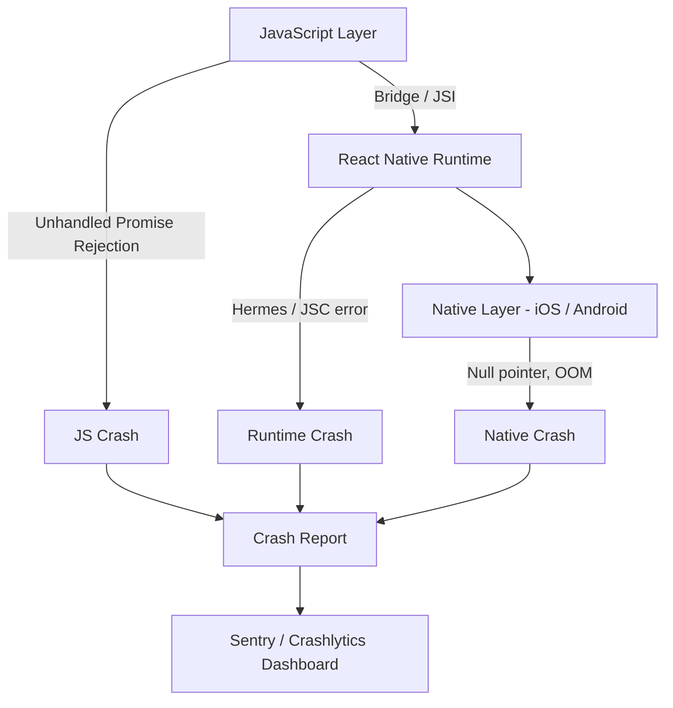
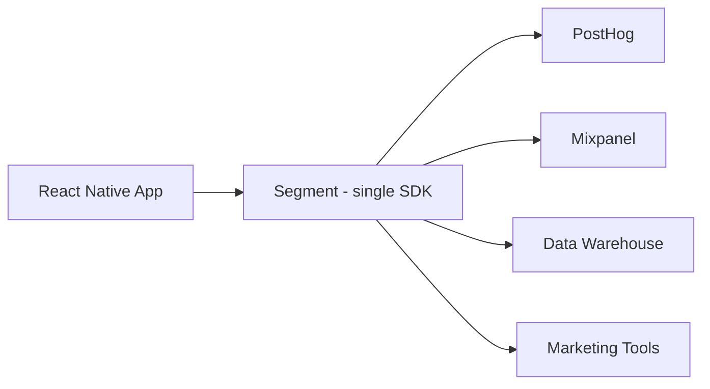
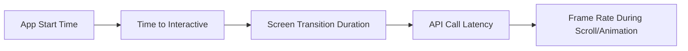
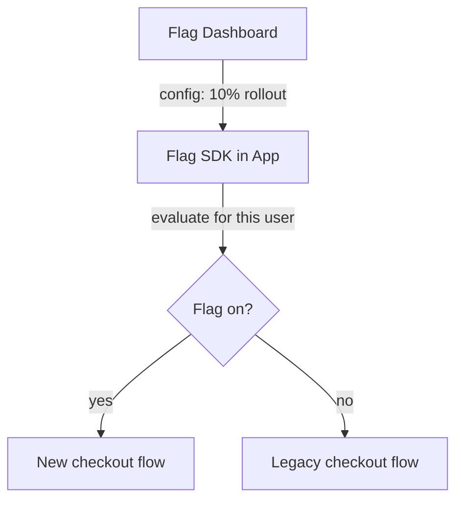
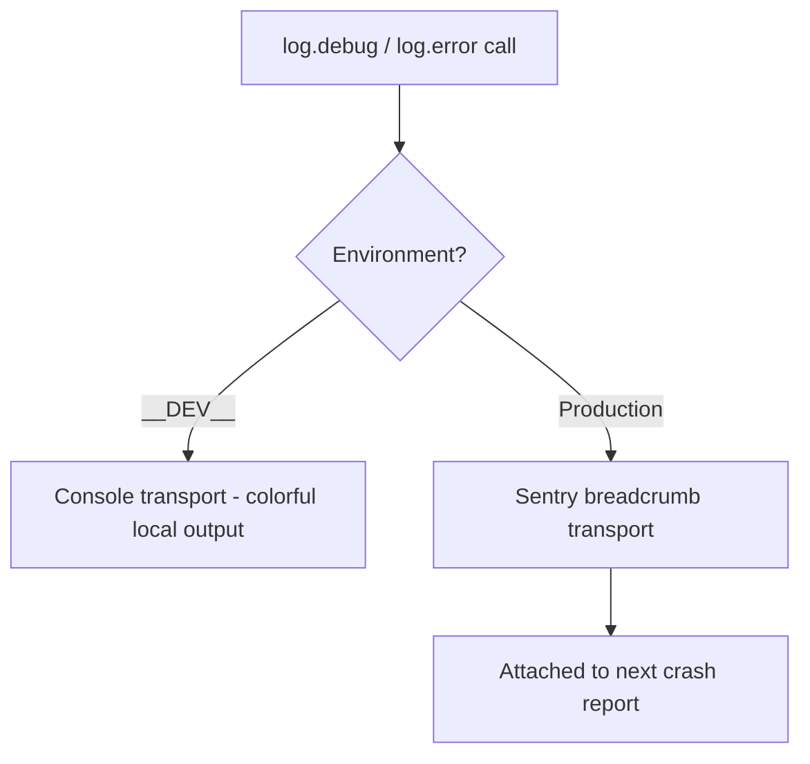
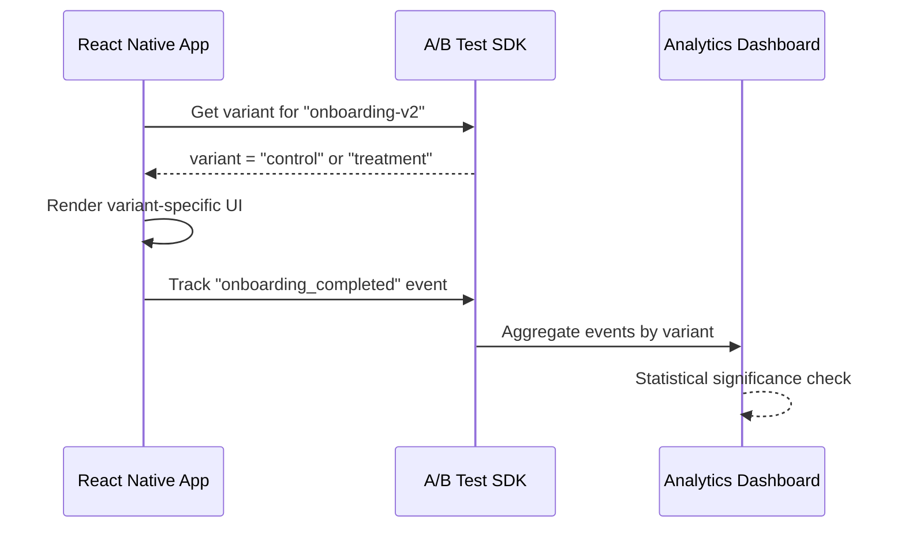

# Monitoring et production : garder votre application en bonne santé

> Rapports de crash, analytics, feature flags et la pile d'observabilité pour les applications mobiles en production.

---

## Table of Contents

1. [Crash Reporting](#1-crash-reporting)
2. [Analytics](#2-analytics)
3. [Performance Monitoring](#3-performance-monitoring)
4. [Feature Flags and Remote Config](#4-feature-flags-and-remote-config)
5. [Logging](#5-logging)
6. [A/B Testing](#6-ab-testing)

---

## 1. Rapports de crash

Sur le web, une exception non gérée affiche un écran blanc et atteint peut-être votre error boundary. L'utilisateur rafraîchit, la vie continue. Sur mobile, une exception non gérée tue l'application. L'utilisateur se retrouve sur l'écran d'accueil du système. Aucune stack trace, aucun onglet réseau, aucune étape de reproduction. Si vous n'avez pas de rapports de crash, vous naviguez à l'aveugle.

Considérez les rapports de crash comme la boîte noire d'un avion. Vous ne pouvez pas vous tenir derrière chaque utilisateur pour observer son écran, alors vous installez à la place un enregistreur qui capture les derniers instants avant un crash — l'erreur, l'appareil, la version de l'OS, les actions récentes de l'utilisateur — et vous renvoie ce rapport. Sans cela, votre seule boucle de feedback est un avis une étoile qui dit « ça plante tout le temps » sans aucun détail exploitable.

### Pourquoi on ne peut pas se contenter d'un try/catch

Sur le web, vous pouvez encapsuler du code risqué dans un `try/catch` et récupérer. Cela fonctionne encore en React Native pour les erreurs JS synchrones — mais la plupart des crashs en production ne se produisent *pas* dans le code que vous avez encapsulé. Ils viennent d'un render qui lève une exception, d'un timer en arrière-plan, d'un module natif, ou de l'OS qui tue votre application parce qu'elle consomme trop de mémoire. Vous ne pouvez pas encapsuler tout cela. Vous avez besoin d'un outil qui se branche sur les gestionnaires d'erreurs globaux des trois couches ci-dessous.

### Pourquoi les crashs sont plus difficiles sur mobile

Une application React Native comporte trois couches où les choses peuvent mal tourner :



Une erreur JavaScript, un pointeur null natif, un crash du moteur Hermes — chacun produit un type différent de stack trace, et chacun nécessite un outillage différent pour être symbolisé. « Symboliser » signifie reconvertir les adresses cryptiques et les noms minifiés d'un dump de crash brut en véritables noms de fichiers, noms de fonctions et numéros de ligne que vous avez écrits. Un crash natif brut ressemble à `0x00012f4a` ; une fois symbolisé, il se lit `PaymentScreen.tsx:42`. Tout l'enjeu des rapports de crash consiste à passer du premier au second.

| Couche | Exemple de crash | Ce dont vous avez besoin pour le lire |
|-------|---------------|--------------------------|
| JavaScript | `undefined is not a function`, unhandled promise rejection | **Source maps** (relient le JS minifié à votre code source) |
| RN Runtime | Erreur du moteur Hermes, mauvais appel JSI | Source maps + symboles RN |
| Natif (iOS/Android) | Pointeur null, kill par manque de mémoire (OOM) | Fichiers **dSYM** (iOS) / **mapping ProGuard** (Android) |

> La raison la plus fréquente pour laquelle un rapport de crash est inutile : le build uploadé n'avait ni source maps ni fichiers de symboles, si bien que chaque ligne affiche `<anonymous>:1:148293`. Mettez en place l'upload des symboles dès le premier jour, avant de livrer.

### Sentry : la référence absolue

Sentry est la meilleure option pour les rapports de crash en React Native. Il capture les exceptions JS, les crashs natifs sur les deux plateformes, et vous fournit des stack traces avec source maps si vous uploadez vos maps.

```bash
npx expo install @sentry/react-native
```

```tsx
// App.tsx
import * as Sentry from "@sentry/react-native";

Sentry.init({
  dsn: "https://your-dsn@sentry.io/project-id",
  tracesSampleRate: 0.2,              // 20% of transactions for performance
  enableAutoSessionTracking: true,    // tracks "crash-free session" rate
  attachStacktrace: true,             // include a stack trace on captureMessage too
  environment: __DEV__ ? "development" : "production", // separate dev noise from real crashes
});

export default Sentry.wrap(function App() {
  return <RootNavigator />;
});
```

L'appel `Sentry.wrap()` fait le gros du travail : il installe un gestionnaire d'erreurs global, de sorte que toute erreur non interceptée n'importe où dans votre arbre de composants est rapportée automatiquement — vous n'avez rien à intercepter manuellement. Le `dsn` (Data Source Name) n'est que l'adresse qui indique au SDK vers quel projet Sentry envoyer les rapports ; il peut être livré sans risque dans votre application.

Vous pouvez aussi rapporter explicitement les erreurs gérées, ce qui est idéal pour les situations « ça ne devrait pas arriver mais ça n'a pas planté » :

```tsx
try {
  await syncOfflineQueue();
} catch (err) {
  // The app keeps working, but you still want to know this failed
  Sentry.captureException(err, {
    tags: { feature: "offline-sync" },
    extra: { queueLength: queue.length },
  });
}

// Attach context so reports are debuggable. Never include passwords/tokens here.
Sentry.setUser({ id: user.id }); // id only — not email/name if avoidable
```

L'étape cruciale que la plupart des gens négligent : **uploader les source maps**. Sans elles, vos stack traces JS ne sont que du charabia minifié.

```bash
# For Expo EAS builds — add the Sentry plugin in app.json
{
  "expo": {
    "plugins": [
      ["@sentry/react-native/expo", {
        "organization": "your-org",
        "project": "your-project"
      }]
    ]
  }
}
```

Pour du React Native bare, ajoutez les scripts de build de phase Sentry pour Gradle et Xcode. La documentation `@sentry/react-native` vous guide pas à pas, mais l'essentiel est le suivant : le processus de build uploade les maps automatiquement lorsque vous construisez une release.

### Alternatives

**Firebase Crashlytics** est gratuit et excellent pour les crashs natifs. Il s'intègre étroitement à l'écosystème Firebase. L'inconvénient : sa prise en charge des crashs JavaScript est plus faible que celle de Sentry. De nombreuses équipes utilisent les deux — Crashlytics pour la visibilité de la couche native et Sentry pour le JS.

**Bugsnag** est solide mais moins populaire dans la communauté RN. Moins de tutoriels, moins d'intégrations communautaires.

| Outil | Qualité crash JS | Qualité crash natif | Prix | Quand l'utiliser |
|------|------------------|----------------------|-------|-------------|
| **Sentry** | Excellente | Excellente | Niveau gratuit, puis à l'usage | Choix par défaut ; meilleure couverture end-to-end JS + natif + performance |
| **Firebase Crashlytics** | Plus faible | Excellente | Gratuit | Déjà sur la pile Firebase/Google, ou budget serré |
| **Bugsnag** | Bonne | Bonne | Payant | Standard déjà en place dans l'organisation ; sinon moins de support communautaire RN |

> Astuce de pro : n'utilisez pas accidentellement deux rapporteurs de crash complets. Deux SDK installant chacun des gestionnaires d'erreurs globaux peuvent rapporter en double ou se disputer le gestionnaire. Si vous utilisez Crashlytics pour le natif et Sentry pour le JS, délimitez délibérément le périmètre de chacun plutôt que de laisser les deux tout intercepter.

### Pièges courants

- **Oublier de tester les builds de release en local.** Les builds de debug se comportent différemment — ils conservent le menu dev, les logs complets et le code non minifié. Les crashs qui ne surviennent qu'en mode release vous surprendront si vous n'exécutez jamais `npx expo run:ios --configuration Release`.
- **Ne pas mettre en place d'error boundary.** Les rapporteurs de crash interceptent l'exception, mais votre application meurt quand même. Encapsulez votre composant racine dans un error boundary qui affiche un écran « quelque chose s'est mal passé » et un bouton de redémarrage. C'est le même pattern d'error boundary React que vous utiliseriez sur le web — sauf qu'ici, c'est la différence entre un écran de récupération élégant et l'utilisateur renvoyé vers l'écran d'accueil.
- **Rejets de promesses.** Les unhandled promise rejections ne font pas toujours planter l'application, mais elles le devraient. Activez l'option `enablePromiseRejectionTracking` dans Sentry pour qu'elles apparaissent dans votre dashboard.

```tsx
// A minimal root error boundary that reports to Sentry, then offers a way out
import * as Sentry from "@sentry/react-native";

class RootErrorBoundary extends React.Component<{ children: React.ReactNode }, { hasError: boolean }> {
  state = { hasError: false };

  static getDerivedStateFromError() {
    return { hasError: true };
  }

  componentDidCatch(error: Error, info: React.ErrorInfo) {
    Sentry.captureException(error, { extra: { componentStack: info.componentStack } });
  }

  render() {
    if (this.state.hasError) {
      return <FallbackScreen onRestart={() => this.setState({ hasError: false })} />;
    }
    return this.props.children;
  }
}
```

---

## 2. Analytics

Vous avez livré l'application. Les gens la téléchargent. Mais l'utilisent-ils ? Les analytics répondent aux questions auxquelles les rapports de crash ne peuvent pas répondre : quelles fonctionnalités sont utilisées, où les utilisateurs décrochent, et quels parcours sont cassés sans techniquement planter.

Le modèle mental : les rapports de crash vous disent ce qui a *cassé* ; les analytics vous disent ce qui s'est *passé*. Un checkout qui échoue silencieusement à convertir n'est pas un crash — rien n'a levé d'exception — mais c'est tout aussi fatal pour votre activité. Les analytics sont la façon de voir les échecs invisibles : l'écran que personne n'ouvre, le bouton que personne ne tape, le formulaire que tout le monde abandonne à l'étape trois.

### Événements, propriétés et identité — le vocabulaire fondamental

Presque tous les outils d'analytics partagent trois concepts :

- **Événement** — une chose nommée qui s'est produite : `"purchase_completed"`, `"screen_viewed"`. C'est le verbe.
- **Propriétés** — des détails clé/valeur attachés à un événement : `{ price: 9.99, currency: "USD" }`. Ce sont les adjectifs qui vous permettront de découper les données plus tard (« le chiffre d'affaires des utilisateurs en EUR uniquement »).
- **Identité** — relier les événements à un utilisateur via `identify(userId)` pour pouvoir suivre le parcours d'une personne à travers les sessions et les appareils.

Si vous intégrez juste ces trois notions, vous pouvez prendre en main n'importe quel SDK d'analytics en un après-midi.

### Choisir un outil

| Outil | Force | Prix | Idéal pour |
|------|----------|-------|----------|
| **PostHog** | Product analytics + feature flags + session replay | Niveau gratuit, puis à l'usage | Startups voulant une solution tout-en-un |
| **Mixpanel** | Événements + funnels + rétention | Niveau gratuit jusqu'à 20M d'événements | Équipes focalisées sur les funnels de conversion |
| **Amplitude** | Analyse de cohortes + segmentation comportementale | Niveau gratuit | Équipes produit fortement orientées données |
| **Firebase Analytics** | Gratuit, intègre FCM et Crashlytics | Gratuit | Équipes soucieuses du budget ou sur la pile Google |
| **Segment** | Pas un outil d'analytics — c'est un tuyau | À l'usage | Équipes envoyant des données vers 5+ destinations |

Ma recommandation : commencez par **PostHog** si vous voulez du product analytics, des feature flags et du session replay depuis un seul SDK. Utilisez **Segment** si vous savez déjà que vous aurez besoin que les données circulent vers plusieurs destinations (votre data warehouse, vos outils marketing, vos outils de support).

La distinction de Segment perturbe souvent les gens, alors voici le tableau. Segment n'*analyse* rien — c'est de la plomberie. Vous envoyez chaque événement une seule fois à Segment, et il redistribue cet événement vers toutes vos destinations. L'alternative serait d'installer cinq SDK et d'appeler `capture()` cinq fois pour chaque événement.



### Configuration de base avec PostHog

```bash
npx expo install posthog-react-native
```

```tsx
// App.tsx
import { PostHogProvider } from "posthog-react-native";

export default function App() {
  return (
    <PostHogProvider
      apiKey="phc_your_key"
      options={{
        host: "https://us.i.posthog.com", // or eu.i.posthog.com for EU data residency
      }}
    >
      <RootNavigator />
    </PostHogProvider>
  );
}
```

```tsx
// Inside any component
import { usePostHog } from "posthog-react-native";

function CheckoutScreen() {
  const posthog = usePostHog();

  const handlePurchase = (item: CartItem) => {
    // Event name = the verb. Properties = the details you'll slice by later.
    posthog.capture("purchase_completed", {
      item_id: item.id,
      price: item.price,
      currency: "USD",
    });
  };

  return <Button onPress={() => handlePurchase(item)} title="Buy" />;
}
```

```tsx
// After login, tie all future events to this user
posthog.identify(user.id, {
  plan: user.plan,        // person properties — used for cohorts and flag targeting
  signup_date: user.createdAt,
});

// On logout, reset so the next user's events aren't merged with this one
posthog.reset();
```

Sur le web, vous utiliseriez peut-être `window.analytics` ou une balise `<script>`. En React Native, vous installez un SDK et encapsulez votre application dans un provider — le même pattern que n'importe quel contexte React. Une différence propre au mobile : il n'y a pas de barre d'URL, donc les « pages vues » deviennent des **vues d'écran**, que vous branchez sur votre bibliothèque de navigation au lieu de les obtenir gratuitement depuis le navigateur.

### Que suivre

Ne suivez pas tout. Suivez les décisions :

- **Vues d'écran** — quels écrans les utilisateurs visitent-ils réellement ?
- **Réalisations d'actions clés** — inscription, achat, partage, ajout aux favoris.
- **Abandons dans le funnel** — checkout commencé mais non terminé, onboarding ouvert mais ignoré.
- **États d'erreur** — échecs d'API vécus par l'utilisateur (pas seulement les crashs).

Une bonne convention de nommage vous épargne des mois de souffrance. Choisissez `object_action` en `snake_case` (`cart_viewed`, `checkout_started`, `payment_failed`) et tenez-vous-y partout. Des conventions mélangées comme `ViewedCart`, `cart-view` et `cartViewed` fragmenteront vos funnels au point de les rendre inutiles, car le dashboard les traite comme trois événements distincts.

> Résistez à l'envie de suivre chaque tap sur un bouton. Vous vous noierez dans les données et ne trouverez rien. Commencez avec 10-15 événements qui correspondent aux parcours clés de votre produit, puis élargissez.

> Astuce de pro : convenez de la taxonomie des événements dans un document partagé *avant* d'écrire le premier appel à `capture()`. Renommer un événement plus tard ne corrige pas rétroactivement les millions d'anciens événements déjà enregistrés sous l'ancien nom.

---

## 3. Surveillance des performances

Votre application ne plante pas, mais elle paraît lente. Les écrans mettent 2 secondes à s'afficher. Les animations saccadent. L'utilisateur ne dépose pas de rapport de bug — il laisse simplement un avis 2 étoiles.

La surveillance des performances répond à la question : à quelle vitesse mon application fonctionne-t-elle pour de vrais utilisateurs sur de vrais appareils ? Le « vrai » a son importance. Votre machine de dev est un téléphone haut de gamme sur le Wi-Fi du bureau. Votre utilisateur médian est sur un Android de trois ans avec une connexion mobile instable. RUM — **Real User Monitoring** — est le terme qui désigne la mesure de ce que les utilisateurs réels vivent sur le terrain, par opposition aux benchmarks synthétiques sur votre propre appareil.

### Pourquoi « fluide » signifie 60 fps — et pourquoi le thread JS compte

Les écrans mobiles se rafraîchissent 60 fois par seconde (120 sur les appareils récents). Cela laisse à chaque frame environ **16 millisecondes** pour être prête. Si votre JavaScript est occupé à calculer quelque chose pendant 50 ms, plusieurs frames sont sautées — l'utilisateur voit une saccade, qu'on appelle « jank ». En React Native, la mise en page, les gestes et la logique de vos composants partagent tous un seul thread JS, si bien qu'un seul render coûteux peut figer toute l'UI. C'est pourquoi « ce qui est lent » sur mobile correspond généralement à « ce qui bloque le thread JS », un concept qui n'a pas d'équivalent web exact car les navigateurs délèguent davantage à des threads séparés.

### Que mesurer



**Temps de démarrage de l'application** — démarrage à froid (cold start, l'application n'était pas en mémoire) vs. démarrage à chaud (warm start, l'application était en arrière-plan). Sur Android en particulier, le cold start peut être douloureusement lent si votre bundle JS est volumineux.

**Renders lents** — re-renders React qui bloquent le thread JS. Sentry Performance peut les détecter automatiquement.

**Latence d'API telle que vécue par l'utilisateur** — non pas ce que disent les logs de votre serveur, mais le temps que l'utilisateur a réellement attendu. Votre serveur peut rapporter une réponse en 40 ms, mais l'utilisateur dans le métro avec une seule barre de réseau a attendu 4 secondes. Seule la mesure côté client capture cela.

| Métrique | Ce qu'elle vous indique | Bonne cible (approximative) |
|--------|-------------------|---------------------|
| Temps de cold start | Durée entre le tap sur l'icône et l'utilisabilité | < 2s |
| Time to interactive | Quand l'utilisateur peut réellement taper sur les choses | < 1s après le premier écran |
| Transition d'écran | La navigation semble instantanée ou laggy | < 300ms |
| Frame rate (scroll/animation) | Fluidité visuelle (« jank ») | 60 fps (aucune frame perdue) |
| Latence d'API (P95) | Temps d'attente réel pour la queue lente | < 1s |

### Sentry Performance

Si vous utilisez déjà Sentry pour les rapports de crash, activer la surveillance des performances ne demande qu'un changement de configuration :

```tsx
Sentry.init({
  dsn: "your-dsn",
  tracesSampleRate: 0.2,
  enableAutoPerformanceTracing: true, // auto-instruments navigation
});
```

Cela vous donne des traces automatiques pour les transitions d'écran (si vous utilisez React Navigation), des spans pour les requêtes HTTP, et la détection des frames JS lentes. Une « trace » est un enregistrement chronométré d'une opération ; les « spans » sont les sous-étapes à l'intérieur. Considérez une trace comme un chronomètre pour « charger le feed » et chaque span comme un temps de passage pour « récupérer les données », « parser le JSON », « afficher la liste ».

Pour des mesures personnalisées :

```tsx
const transaction = Sentry.startTransaction({ name: "load-feed" });
const span = transaction.startChild({ op: "api.fetch", description: "GET /feed" });

const data = await fetchFeed();

span.finish();        // stop the lap timer for the fetch
transaction.finish(); // stop the overall stopwatch — Sentry now has the breakdown
```

### Alternatives

**Firebase Performance Monitoring** — gratuit, vous donne des traces de requêtes réseau et le temps de rendu des écrans. Moins granulaire que Sentry pour l'analyse du thread JS, mais le prix est juste.

**Datadog RUM** — l'option entreprise. Si votre backend utilise déjà Datadog, ajouter le RUM mobile vous donne des traces end-to-end depuis le tap sur un bouton jusqu'à la requête en base de données. Coûteux, mais la vue unifiée est puissante.

| Outil | Granularité | Prix | Quand l'utiliser |
|------|-------------|-------|-------------|
| **Sentry Performance** | Élevée (thread JS + spans) | Niveau gratuit, puis à l'usage | Déjà sur Sentry ; vous voulez du détail au niveau JS |
| **Firebase Perf** | Moyenne (réseau + render) | Gratuit | Soucieux du budget, déjà sur Firebase |
| **Datadog RUM** | Très élevée (end-to-end) | Coûteux | Backend déjà sur Datadog ; vous voulez une seule vue d'ensemble |

### Pièges courants

- **Taux d'échantillonnage trop élevé.** Définir `tracesSampleRate: 1.0` en production vous coûtera de l'argent et ralentira votre application — chaque transaction tracée est de la donnée envoyée sur le réseau. Commencez à 0,1–0,2 et augmentez pour les parcours spécifiques que vous voulez investiguer.
- **Ignorer les appareils Android bas de gamme.** Votre iPhone 15 Pro fait tout tourner rapidement. Testez sur un téléphone Android de 3 ans avec 3 Go de RAM. C'est votre véritable utilisateur.
- **Ne pas mesurer ce qui compte.** Le « temps de chargement moyen des écrans » est une vanity metric. Mesurez le **P95** (95e centile) — quelle est l'expérience pour vos 5 % d'utilisateurs les plus lents ? Une moyenne de 400 ms peut cacher un P95 de 6 secondes, et c'est cette queue lente qui écrit les avis colériques.

> Astuce de pro : les moyennes mentent, car quelques sessions très rapides compensent quelques sessions très lentes. Les centiles, eux, ne mentent pas. Le P95 et le P99 sont là où réside réellement la douleur — optimisez pour la queue, pas pour la moyenne.

---

## 4. Feature flags et configuration distante

Vous voulez déployer un nouveau parcours de checkout, mais seulement à 10 % des utilisateurs au début. Ou vous voulez désactiver instantanément une fonctionnalité quand quelque chose casse, sans pousser une mise à jour de l'application et attendre 24 heures la revue de l'App Store.

Les feature flags vous permettent de modifier le comportement sans déployer de code. La configuration distante (remote config) vous permet de modifier des valeurs (textes, seuils, URLs) sans déployer de code. Ils se recoupent largement.

L'idée centrale : séparer le **déploiement du code** de la **mise en production d'une fonctionnalité**. Le nouveau code est livré à tout le monde à l'intérieur du bundle de l'application, mais il reste éteint derrière une vérification `if (flag)` jusqu'à ce que vous activiez le flag depuis un dashboard. Imaginez un variateur de lumière sur le mur : le câblage (votre code) est déjà dans le bâtiment, et vous contrôlez la quantité de lumière qui atteint chaque pièce sans rien recâbler.



### Pourquoi cela compte bien plus sur mobile

Sur le web, un correctif n'est qu'à un déploiement de distance — quelques minutes. Sur mobile, un correctif de code natif doit passer la revue de l'App Store / Play Store (de quelques heures à plusieurs jours), et même ensuite les utilisateurs doivent *télécharger* la mise à jour. Un flag bascule pour tout le monde la prochaine fois que leur application récupère la configuration, sans revue ni téléchargement. Cet écart est précisément la raison pour laquelle les équipes mobiles s'appuient bien plus fortement sur les flags que les équipes web.

### Les options

**PostHog** — si vous l'utilisez déjà pour les analytics, les feature flags sont intégrés. Les évaluations se font côté serveur ou via le SDK. L'intégration étroite avec leurs analytics vous permet de voir comment les variantes de flags affectent les métriques.

**LaunchDarkly** — la plateforme de feature flags la plus mature. Règles de ciblage riches, audit logs, gouvernance d'entreprise. Coûteux, mais éprouvé à grande échelle.

**Statsig** — fort accent sur l'expérimentation. Les feature flags sont un moyen de lancer des tests A/B. Bon niveau gratuit.

**Firebase Remote Config** — configuration distante clé-valeur gratuite et simple. Ce ne sont pas de vrais feature flags (pas de déploiement par pourcentage par défaut), mais c'est suffisant pour de simples bascules et valeurs de configuration.

| Outil | Déploiements par pourcentage | Règles de ciblage | Expériences intégrées | Prix | Quand l'utiliser |
|------|--------------------|-----------------|----------------------|-------|-------------|
| **PostHog** | Oui | Bonnes | Oui | Niveau gratuit | Vous utilisez déjà les analytics PostHog |
| **LaunchDarkly** | Oui | Excellentes | Module complémentaire | Coûteux | Entreprise, besoins d'audit/gouvernance |
| **Statsig** | Oui | Bonnes | Oui (cœur de métier) | Gratuit généreux | Culture produit fortement orientée expérimentation |
| **Firebase Remote Config** | Limité | Basiques | Non | Gratuit | Bascules simples, valeurs de configuration, sur Firebase |

### Les feature flags PostHog en pratique

```tsx
import { useFeatureFlag } from "posthog-react-native";

function CheckoutScreen() {
  const showNewCheckout = useFeatureFlag("new-checkout-flow");

  if (showNewCheckout) {
    return <NewCheckoutFlow />;
  }

  return <LegacyCheckoutFlow />;
}
```

C'est tout. Le flag est évalué par rapport aux propriétés de l'utilisateur actuel (appareil, pays, cohorte, tout ce que vous configurez dans le dashboard PostHog). Changez le pourcentage de déploiement de 10 % à 100 % dans le dashboard, sans aucun déploiement nécessaire.

La configuration distante (une *valeur*, et non un booléen) fonctionne de la même manière — pratique pour des choses comme un endpoint d'API contrôlé par le serveur ou un seuil ajustable :

```tsx
// A multivariate flag can return a payload, not just true/false
const payload = posthog.getFeatureFlagPayload("checkout-config");
const maxRetries = (payload as { maxRetries?: number })?.maxRetries ?? 3; // default!
```

### Kill switches

Toute application en production devrait avoir au moins un kill switch : un feature flag qui désactive instantanément une fonctionnalité défaillante.

```tsx
function PaymentScreen() {
  const paymentsEnabled = useFeatureFlag("payments-enabled");

  if (!paymentsEnabled) {
    return (
      <View style={styles.center}>
        <Text>Payments are temporarily unavailable. Please try again later.</Text>
      </View>
    );
  }

  return <PaymentForm />;
}
```

Quand votre fournisseur de paiement subit une panne à 2 h du matin, vous basculez le flag dans un dashboard au lieu de pousser un hotfix à travers la revue de l'application.

> Sur le web, vous pouvez déployer un correctif en quelques minutes. Sur mobile, même avec les mises à jour OTA, la propagation prend du temps. Les feature flags sont votre issue de secours instantanée.

### Pièges courants

- **Flags périmés au cold start.** La plupart des SDK mettent en cache les valeurs de flags localement et récupèrent des valeurs fraîches sur le réseau un instant après le lancement. Au tout premier lancement — ou hors ligne — le SDK peut ne pas encore avoir de valeur. Définissez toujours une valeur par défaut sensée pour que votre UI ne scintille ni ne casse pendant le chargement des flags.
- **Prolifération des flags.** Les équipes créent des flags et ne les nettoient jamais. Une fois qu'une fonctionnalité est déployée à 100 % depuis deux semaines, retirez le flag de votre code et archivez-le dans le dashboard. Chaque flag mort est une branche `if` oubliée que quelqu'un finira par casser.

> Astuce de pro : traitez la valeur *par défaut* d'un flag comme l'état sûr. Pour un kill switch, la valeur par défaut sûre est généralement « fonctionnalité activée », de sorte qu'un échec de récupération du flag ne désactive pas accidentellement une fonctionnalité opérationnelle pour tout le monde — mais pour du nouveau code risqué, mettez par défaut « désactivé ». Décidez délibérément dans quelle direction « l'échec » doit pointer.

---

## 5. Logging

`console.log` est votre meilleur ami en développement et votre pire ennemi en production. Il fait fuiter des informations, encombre les logs de l'appareil, et dans certains cas peut réellement ralentir votre application.

### Le problème

Sur le web, `console.log` va vers les DevTools du navigateur. Seuls les développeurs le voient. Sur mobile, `console.log` écrit dans le log système — que d'autres applications et rapporteurs de crash peuvent potentiellement lire. Plus important encore, un logging excessif sur le thread JS bloque le rendu. Souvenez-vous du budget de 16 ms par frame de la section performance : chaque `console.log` sérialise ses arguments et traverse vers le natif, et le faire des centaines de fois pendant un scroll suffit à faire perdre des frames.

Le logging mobile a donc deux objectifs distincts qui tirent dans des directions opposées : en **développement**, vous voulez des logs bruyants, colorés et détaillés ; en **production**, vous les voulez silencieux pour l'utilisateur mais toujours *récupérables par vous* quand quelque chose tourne mal. Le reste de cette section construit exactement cette configuration.



### Supprimer les logs en production

L'approche la plus simple : utiliser Babel pour les supprimer. Babel est le compilateur qui transforme déjà votre JSX et votre JS moderne ; un plugin peut supprimer les appels `console.*` au moment du build pour qu'ils n'existent jamais dans le bundle livré.

```bash
npm install --save-dev babel-plugin-transform-remove-console
```

```js
// babel.config.js
module.exports = function (api) {
  api.cache(true);
  const plugins = [];

  if (process.env.NODE_ENV === "production") {
    plugins.push("transform-remove-console"); // physically removes console.* from the bundle
  }

  return {
    presets: ["babel-preset-expo"],
    plugins,
  };
};
```

Désormais, chaque `console.log`, `console.warn` et `console.error` est retiré de votre bundle de production. Coût nul, fuite nulle. Comme les appels ont *disparu* (et ne sont pas simplement réduits au silence), il n'y a aucune surcharge à l'exécution.

> Piège : la suppression se fait au moment du build en fonction de `NODE_ENV`. Si vous construisez accidentellement la production sans définir `NODE_ENV`, les logs survivent. Vérifiez en cherchant une chaîne de log connue dans votre bundle de release.

### Logging structuré avec react-native-logs

Pour tout ce qui va au-delà de `console.log`, utilisez une véritable bibliothèque de logging. « Structuré » signifie que chaque log a un **niveau de sévérité** (debug/info/warn/error) et des données attachées, afin de pouvoir filtrer par importance plutôt que de scruter un mur de texte :

```bash
npm install react-native-logs
```

```tsx
import { logger, consoleTransport } from "react-native-logs";

const log = logger.createLogger({
  severity: __DEV__ ? "debug" : "warn", // dev: show everything; prod: only warn+ matters
  transport: consoleTransport,
  transportOptions: {
    colors: {
      debug: "white",
      info: "blueBright",
      warn: "yellowBright",
      error: "redBright",
    },
  },
});

// Usage — the second argument is structured context, not string concatenation
log.debug("Fetching user profile", { userId: 42 });
log.warn("API responded slowly", { latency: 3200 });
log.error("Payment failed", { code: "CARD_DECLINED" });
```

Un « transport » n'est que *l'endroit où va le log*. Le transport console imprime dans votre terminal ; vous pouvez le remplacer par un transport différent pour envoyer les logs ailleurs entièrement — ce qui est exactement ce que nous faisons ensuite.

### Acheminer les logs vers les breadcrumbs Sentry

La vraie puissance : connecter votre logger à Sentry, de sorte que lorsqu'un crash survient, vous obteniez les N dernières entrées de log sous forme de breadcrumbs. Un **breadcrumb** est un petit événement enregistré qui mène à un crash — comme une traînée de miettes de pain montrant le chemin emprunté par l'utilisateur. Quand vous ouvrez le crash dans Sentry, vous voyez « navigué vers Checkout → tapé sur Payer → l'API a répondu lentement → *crash* », ce qui suffit souvent à diagnostiquer le bug sans la moindre étape de reproduction.

```tsx
import * as Sentry from "@sentry/react-native";
import { logger } from "react-native-logs";

const sentryTransport = (props: { msg: string; rawMsg: unknown[]; level: { text: string } }) => {
  Sentry.addBreadcrumb({
    message: props.msg,
    level: props.level.text as Sentry.SeverityLevel,
    category: "app.log",
  });
};

const log = logger.createLogger({
  severity: __DEV__ ? "debug" : "info",
  transport: __DEV__ ? consoleTransport : sentryTransport, // swap transport by environment
});
```

Désormais, en développement, vous voyez une sortie console colorée. En production, les logs deviennent des breadcrumbs Sentry — invisibles pour l'utilisateur, mais visibles pour vous lors de l'investigation d'un crash. Notez que les breadcrumbs ne sont *uploadés* que si un crash se produit réellement, ils sont donc peu coûteux : aucune donnée ne quitte l'appareil pendant une session normale, sans crash.

### Pièges courants

- **Logger des données sensibles.** Ne loggez jamais de tokens d'authentification, de mots de passe ou de PII (informations personnellement identifiables — emails, adresses, détails de paiement). Dans les breadcrumbs de production, ces données finissent sur les serveurs de Sentry, ce qui peut en soi devenir un problème de conformité au regard du RGPD/CCPA.
- **Logger à l'intérieur de boucles chaudes.** Un `console.log` à l'intérieur d'une fonction de render de `FlatList` se déclenchera des centaines de fois et bloquera le thread JS — exactement le tueur de budget de frame de la section performance.
- **Ne pas logger assez.** L'erreur inverse. Quand un crash survient et que vous avez zéro breadcrumb, vous regretterez de ne pas avoir loggé les transitions d'état clés comme la connexion, la navigation et les échecs réseau.

> Astuce de pro : loggez les *transitions et les décisions* (« entré dans le checkout », « nouvelle tentative de paiement, essai 2 », « repli sur les données en cache »), et non des vidages de données brutes. Ce sont ces changements d'état d'une ligne qui rendent une trace de crash lisible ; un objet de 500 champs vidé, lui, ne l'est pas.

---

## 6. Tests A/B

Les feature flags vous disent « est-ce activé ? ». Les tests A/B vous disent « est-ce meilleur ? ». Les mécanismes se recoupent — les deux montrent des expériences différentes à des utilisateurs différents — mais l'objectif diffère : la mesure plutôt que le contrôle.

Voici l'analogie du quotidien : un restaurant imprime deux versions d'un menu, en donne une à la moitié de ses tables au hasard, et compte quelle version vend le plus de desserts. Cette répartition aléatoire est l'intégralité du fondement scientifique d'un test A/B. C'est l'affectation aléatoire qui vous permet d'affirmer que c'est le *menu* qui a causé la différence, et non la météo ou le jour de la semaine — car les deux groupes ont vécu tout le reste de manière égale.

### Le vocabulaire dont vous avez besoin

- **Contrôle** — l'expérience existante (version « A »).
- **Traitement / variante** — la nouvelle expérience que vous testez (version « B »).
- **Métrique principale** — l'unique résultat que vous cherchez à faire bouger (par ex. « onboarding terminé »).
- **Signification statistique** — le calcul qui dit « cette différence est réelle, pas du bruit aléatoire ». Les outils la calculent pour vous ; votre rôle est d'attendre qu'ils le disent avant de déclarer un gagnant.

### Comment cela fonctionne sur mobile



L'application demande au SDK dans quelle variante se trouve l'utilisateur. L'application affiche en conséquence. L'application suit les événements de résultat. Le dashboard crunch les chiffres et vous dit quelle variante a gagné. Remarquez qu'il s'agit de la même machinerie d'évaluation de flags que dans la section 4 — un test A/B est essentiellement un feature flag plus une mesure rigoureuse d'un résultat.

> Détail crucial : l'affectation de variante doit être **persistante** (sticky). Une fois qu'un utilisateur tombe dans « treatment », il doit rester dans « treatment » à chaque lancement — sinon son expérience scintille entre les versions et ses données n'ont aucun sens. Les bons SDK le garantissent en hachant l'identifiant utilisateur stable, de sorte que le même utilisateur correspond toujours au même bucket.

### Outils

**PostHog Experiments** — construit sur leurs feature flags et leurs analytics. Définissez une expérience, fixez la métrique que vous voulez améliorer, et PostHog gère l'affectation des variantes et l'analyse statistique.

**Statsig** — conçu spécifiquement pour l'expérimentation. Leur niveau gratuit est généreux et leur moteur statistique est rigoureux. Si les tests A/B sont au cœur de votre culture produit, Statsig vaut la peine d'être évalué.

**LaunchDarkly Experimentation** — ajoute le suivi d'expériences par-dessus leur infrastructure de feature flags. Bon choix si vous payez déjà pour LaunchDarkly.

| Outil | Rigueur statistique | Effort de configuration | Prix | Quand l'utiliser |
|------|-------------|--------------|-------|-------------|
| **PostHog Experiments** | Bonne | Faible (si déjà sur PostHog) | Niveau gratuit | Analytics + flags + expériences tout-en-un |
| **Statsig** | Excellente | Moyen | Gratuit généreux | L'expérimentation est au cœur de votre culture |
| **LaunchDarkly** | Bonne (module complémentaire) | Faible (si déjà sur LD) | Coûteux | Vous payez déjà pour les flags LaunchDarkly |

### Combiner les tests A/B avec EAS Update

Voici un pattern puissant propre à React Native avec Expo : utilisez les feature flags pour conditionner les chemins de code, puis utilisez EAS Update pour pousser différents bundles JS vers différents canaux de mise à jour. EAS Update est le système de mises à jour over-the-air (OTA) d'Expo — il livre un nouveau bundle JS directement aux utilisateurs sans passer par une release sur les stores, à la manière dont le web livre un nouveau déploiement.

```tsx
// This component renders based on a feature flag
function OnboardingFlow() {
  const variant = useFeatureFlag("onboarding-experiment");

  if (variant === "streamlined") {
    return <StreamlinedOnboarding />;
  }

  return <OriginalOnboarding />;
}
```

Le flag contrôle quel chemin s'exécute. Mais les deux chemins de code sont livrés dans le même bundle. Pour des expériences plus importantes où vous voulez du code entièrement différent, vous pouvez publier différents bundles EAS Update vers différents canaux — bien que le branchement basé sur les flags au sein d'un même bundle soit plus simple et préférable dans la plupart des cas.

| Approche | Les deux variantes dans un seul bundle ? | Idéal pour |
|----------|------------------------------|----------|
| **Branchement basé sur les flags** | Oui | La plupart des expériences ; changements d'UI de petite à moyenne ampleur |
| **Canaux EAS Update séparés** | Non (bundles différents) | Chemins de code fortement divergents ; réduction de la taille du bundle |

### Conseils pratiques

- **Choisissez une seule métrique principale par expérience.** « Le nouvel onboarding augmente-t-il la rétention à 7 jours ? » Et non « améliore-t-il la rétention ET l'engagement ET le chiffre d'affaires ? ». Vous pouvez suivre des métriques secondaires, mais la rigueur statistique exige une seule métrique principale. Tester de nombreuses métriques à la fois gonfle les chances que l'une d'elles ressemble à un « gagnant » purement par hasard.
- **Faites tourner les expériences suffisamment longtemps.** Les utilisateurs mobiles se comportent différemment en semaine et le week-end. Faites tourner pendant au moins deux semaines complètes pour que chaque jour de la semaine apparaisse au moins deux fois.
- **Tenez compte du décalage de mise à jour de l'application.** Contrairement au web, tous les utilisateurs ne sont pas sur la même version. Filtrez les résultats de votre expérience par version d'application pour éviter de mélanger les signaux des anciens et des nouveaux builds.

> La plus grosse erreur que commettent les équipes avec les tests A/B : livrer le code de la variante perdante pendant des mois parce que personne ne l'a nettoyé. Traitez le code d'expérience comme une branche — fusionnez le gagnant, supprimez le perdant.

> Astuce de pro : résistez à la tentation de « jeter un œil » aux résultats et d'arrêter dès que le test paraît significatif. En début d'expérience, les chiffres oscillent énormément ; conclure au deuxième jour, c'est ainsi qu'on livre un « gagnant » qui n'était en réalité que du bruit. Choisissez la durée à l'avance et tenez bon jusqu'au bout.

---