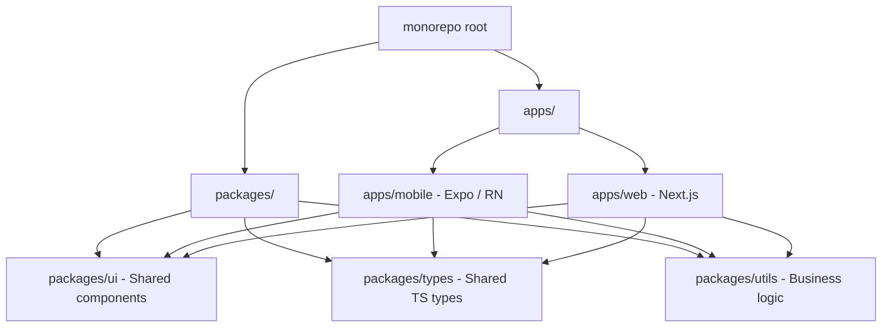
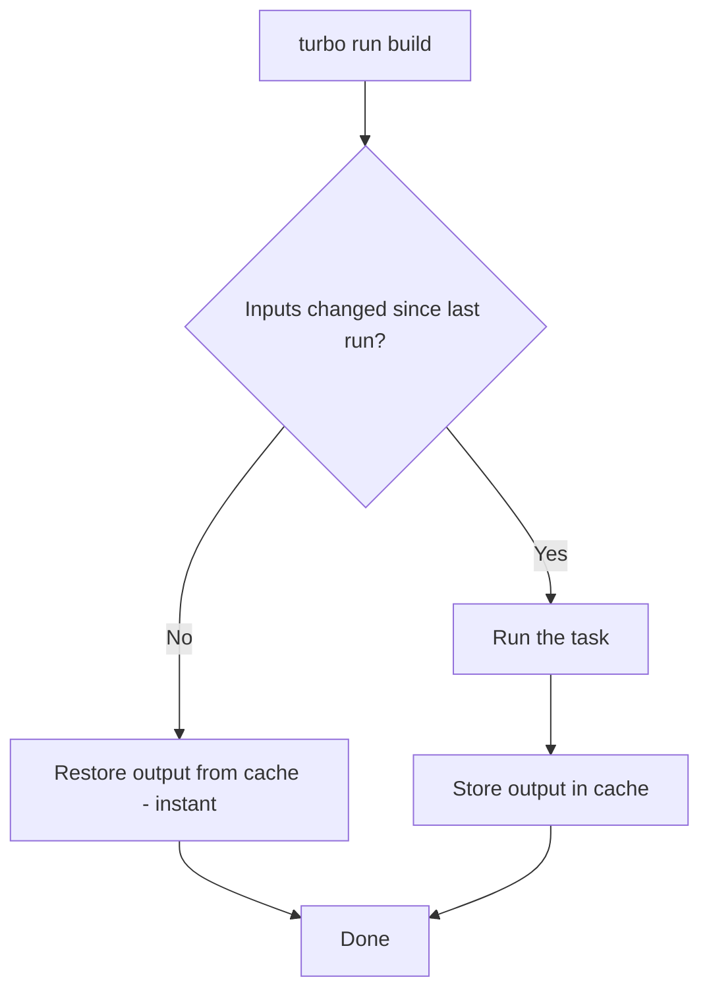
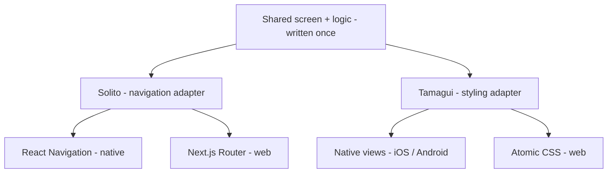
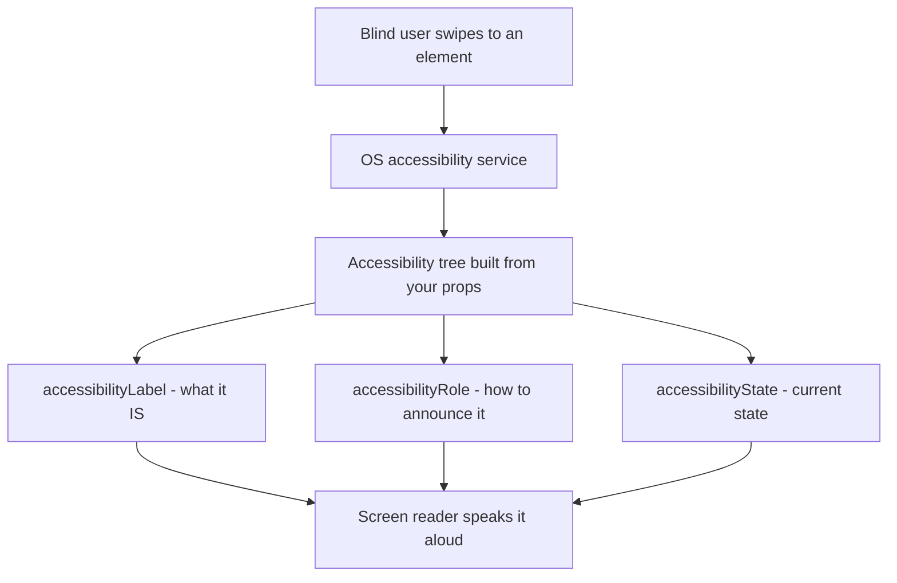
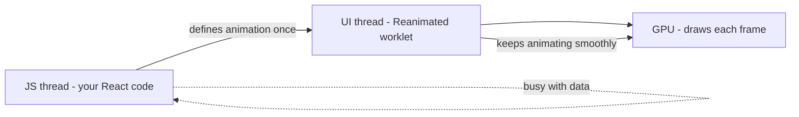
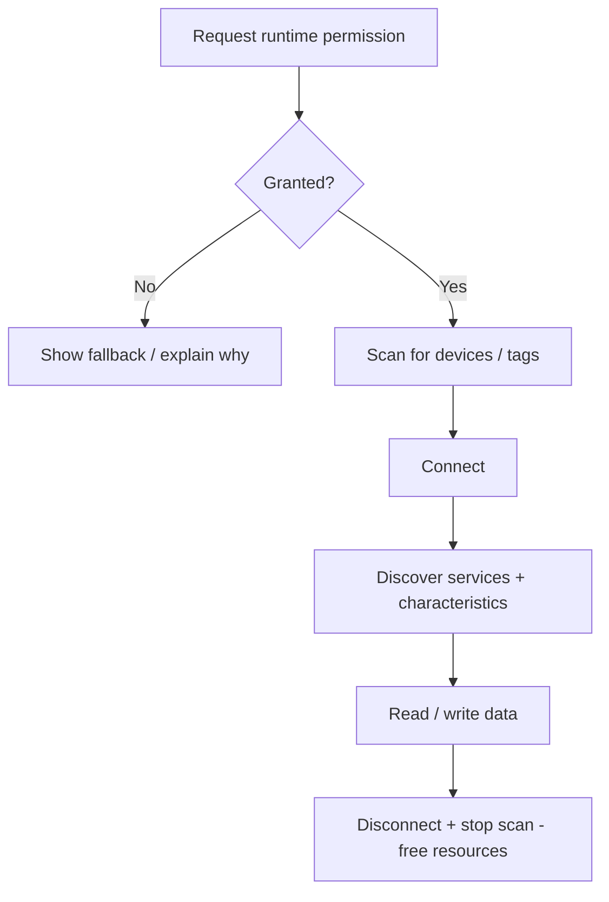
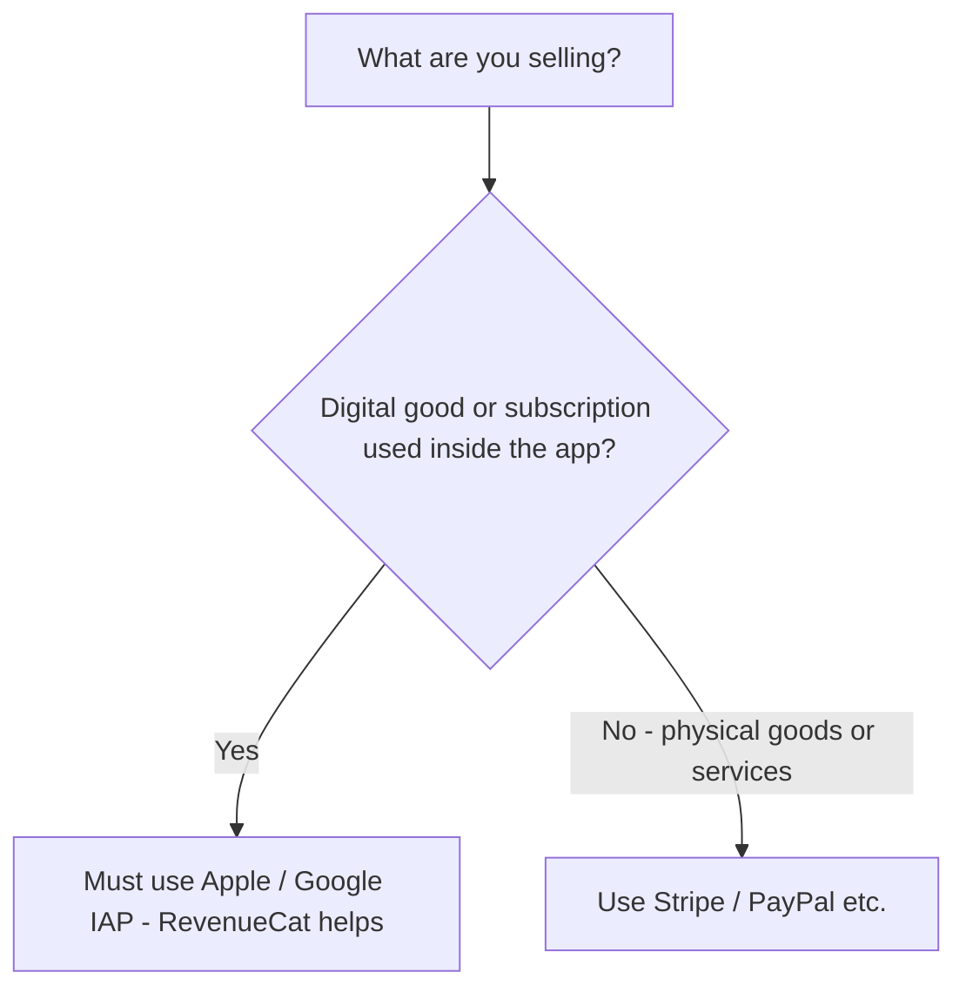
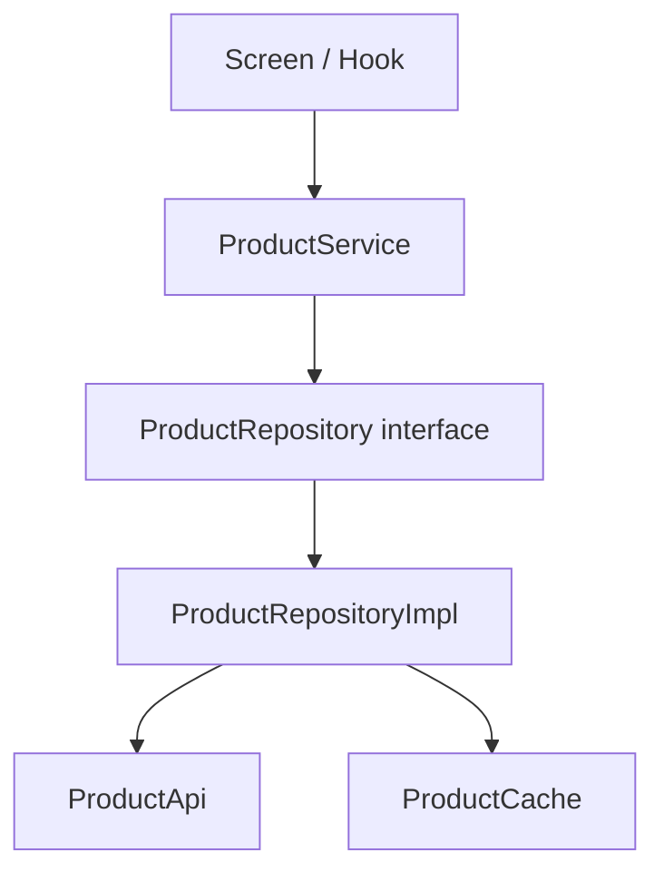
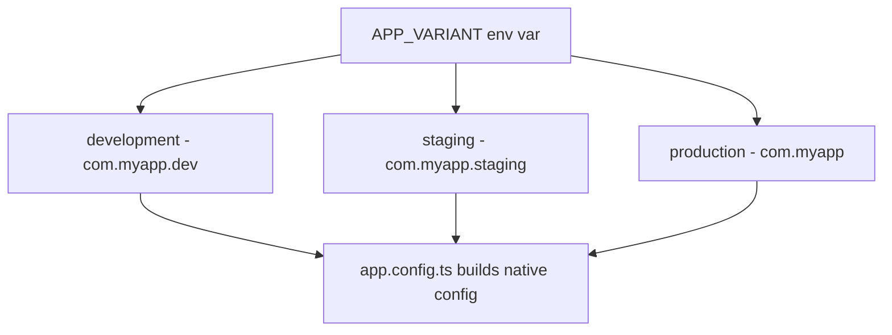
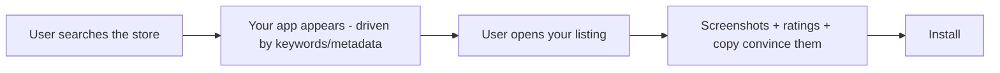

# Sujets avancés pour applications complexes

> Configuration monorepo, partage cross-platform, i18n, accessibilité, cartes, paiements et architecture à grande échelle.

---

## Table of Contents

1. [Monorepo](#1-monorepo)
2. [Cross-Platform Code Sharing](#2-cross-platform-code-sharing)
3. [Internationalization](#3-internationalization)
4. [Accessibility](#4-accessibility)
5. [Animations at Scale](#5-animations-at-scale)
6. [Audio / Video at Scale](#6-audio--video-at-scale)
7. [Maps](#7-maps)
8. [Bluetooth / NFC / Hardware](#8-bluetooth--nfc--hardware)
9. [Payments](#9-payments)
10. [Architecture Patterns](#10-architecture-patterns)
11. [Multi-Environment](#11-multi-environment)
12. [App Size Optimization](#12-app-size-optimization)
13. [App Store Optimization](#13-app-store-optimization)

---

## 1. Monorepo

### Pourquoi un monorepo ?

Dès que votre produit comporte une application mobile, une application web, un design system partagé et des types TypeScript partagés, gérer quatre dépôts distincts devient un cauchemar de coordination. Les pull requests qui touchent au composant bouton partagé exigent des merges synchronisés entre les dépôts. Les versions divergent. Les développeurs perdent des heures.

Un monorepo résout cela en plaçant tout dans un dépôt unique tout en conservant des frontières logiques grâce aux **workspaces**.

Voyez cela comme une maison. Des dépôts séparés, ce sont quatre maisons dans quatre rues différentes — chaque fois que vous modifiez la plomberie partagée, vous devez vous rendre à chaque maison et la réparer séparément, en espérant les avoir toutes traitées de la même manière. Un monorepo, c'est une seule maison avec plusieurs pièces : la plomberie partagée court dans les murs et chaque pièce reçoit la correction à l'instant où vous l'effectuez.

### Qu'est-ce qu'un « workspace » ?

Un **workspace** n'est qu'un dossier à l'intérieur du dépôt qui possède son propre `package.json` et qui est enregistré auprès de votre gestionnaire de paquets comme un package à part entière. Une fois enregistré, `apps/mobile` peut écrire `import { Button } from "@myapp/ui"` exactement comme si `@myapp/ui` était publié sur npm — mais cela se résout vers le dossier local `packages/ui` sur le disque. Aucune publication, aucune montée de version, des changements instantanés.

> Sur le web, vous avez peut-être utilisé un dépôt unique avec un seul `package.json`. Un monorepo, c'est la même idée passée à l'échelle : **de nombreux** fichiers `package.json`, un seul lockfile, un seul arbre `node_modules` partagé à la racine.



### Outillage : Turborepo + pnpm Workspaces

Deux tâches différentes, deux outils différents :

- **pnpm workspaces** répond à la question *« où vit cet import ? »* — il installe les dépendances et relie les packages locaux entre eux.
- **Turborepo** répond à la question *« qu'ai-je besoin de rebuilder ? »* — il orchestre les tâches (build, lint, test) et met en cache les résultats afin que les packages inchangés ne soient jamais rebuildés.

Turborepo est la combinaison que je recommande plutôt que Nx pour les projets React Native, car il reste discret — il n'impose ni systèmes de plugins ni générateurs de code.

| Outil | Rôle | Quand y recourir |
|------|------|----------------------|
| **pnpm workspaces** | Liaison des dépendances + installation | Toujours — c'est la fondation |
| **Turborepo** | Exécution des tâches + cache | Lorsque les builds/lint/test deviennent lents ou répétitifs |
| **Nx** | Exécution des tâches + générateurs + plugins | Grandes équipes souhaitant un scaffolding normatif et un écosystème de plugins |
| **Yarn / npm workspaces** | Liaison des dépendances | Si vous ne pouvez pas adopter pnpm ; plus lent, `node_modules` plus volumineux |

```bash
# Scaffold
pnpm dlx create-turbo@latest my-app --package-manager pnpm

# Resulting structure
my-app/
  apps/
    mobile/       # Expo app
    web/          # Next.js app
  packages/
    ui/           # Shared React components
    types/        # Shared TypeScript interfaces
    tsconfig/     # Shared tsconfig bases
  turbo.json
  pnpm-workspace.yaml
```

Votre `pnpm-workspace.yaml` indique à pnpm quels dossiers sont des workspaces :

```yaml
packages:
  - "apps/*"
  - "packages/*"
```

Et `turbo.json` décrit le graphe des tâches. La syntaxe `^build` signifie « build mes dépendances d'abord » — ainsi `packages/ui` se build toujours avant l'`apps/mobile` qui en dépend :

```json
{
  "tasks": {
    "build": {
      "dependsOn": ["^build"],
      "outputs": ["dist/**", ".expo/**"]
    },
    "dev": {
      "persistent": true,
      "cache": false
    },
    "lint": {},
    "typecheck": {}
  }
}
```

Comment le cache vous fait gagner du temps :



> **Astuce de pro** : Turborepo hashe les entrées de chaque tâche (fichiers sources, dépendances, variables d'environnement). Si rien n'a changé, il rejoue le résultat précédent en quelques millisecondes au lieu de rebuilder. Ajoutez `--remote-only` avec un cache distant et votre CI ainsi que vos coéquipiers partagent le même cache — le build d'un collègue devient votre téléchargement instantané.

### Partage de code entre packages/ui et les deux applications

Le défi clé : React Native ne comprend pas `import from '../../../packages/ui'` par défaut. Le bundler Metro d'Expo doit être informé de l'endroit où trouver les packages de workspace. Metro suppose par défaut que tout vit sous un unique dossier d'application ; dans un monorepo, votre code vit deux niveaux plus haut et vos dépendances peuvent être hoistées à la racine du dépôt.

Dans `apps/mobile/metro.config.js` :

```tsx
const { getDefaultConfig } = require("expo/metro-config");
const path = require("path");

const projectRoot = __dirname;
const monorepoRoot = path.resolve(projectRoot, "../..");

const config = getDefaultConfig(projectRoot);

// 1. Watch all files in the monorepo so edits in packages/ trigger reloads
config.watchFolders = [monorepoRoot];

// 2. Look for node_modules both locally and at the repo root (pnpm hoists here)
config.resolver.nodeModulesPaths = [
  path.resolve(projectRoot, "node_modules"),
  path.resolve(monorepoRoot, "node_modules"),
];

module.exports = config;
```

> **Piège** : Chaque package de `packages/` doit posséder un `package.json` valide avec un champ `main` ou `exports` pointant vers son fichier d'entrée. Si Metro ne parvient pas à résoudre un package de workspace (`Unable to resolve module @myapp/ui`), c'est presque toujours la raison. Vérifiez bien que le nom du package dans son `package.json` correspond au nom que vous importez.

> **Erreur courante** : Oublier d'ajouter le package de workspace comme dépendance de l'application. Même les packages locaux doivent être listés dans `apps/mobile/package.json` sous la forme `"@myapp/ui": "workspace:*"` pour que pnpm crée le lien symbolique.

---

## 2. Cross-Platform Code Sharing

### Le problème

Vous voulez une seule base de code pour iOS, Android et le web. Sur le web, vous utiliseriez `react-router-dom` et `<div>`. En RN, vous utilisez `react-navigation` et `<View>`. Ce sont des abstractions fondamentalement différentes — navigation différente, éléments primitifs différents, moteurs de style différents. Comment partager 80 % de la logique sans maintenir trois applications distinctes ?

L'astuce consiste à tracer une ligne. Tout ce qui se trouve *au-dessus* de la ligne (logique métier, récupération des données, composition des écrans) peut être partagé. Tout ce qui se trouve *en dessous* de la ligne (le véritable `<div>` vs `<View>`, le router) reçoit un fin adaptateur spécifique à la plateforme. Les bibliothèques cross-platform fournissent ces adaptateurs afin que vous écriviez la partie supérieure une seule fois.



### Solito : navigation universelle

Solito vous offre une API de navigation unique qui fonctionne à la fois sur Next.js et React Navigation. Vous écrivez `useRouter()` une seule fois, et il dispatche vers l'implémentation native correcte — comme un adaptateur d'alimentation universel qui s'ajuste à la prise utilisée dans chaque pays.

```tsx
// packages/app/features/home/screen.tsx
import { useRouter } from "solito/router";
import { View, Text, Pressable } from "react-native";

export function HomeScreen() {
  const router = useRouter();

  return (
    <View style={{ flex: 1, justifyContent: "center", alignItems: "center" }}>
      <Text>Home Screen</Text>
      {/* On web this becomes a client-side route push; on native a stack.push */}
      <Pressable onPress={() => router.push("/user/123")}>
        <Text>Go to user</Text>
      </Pressable>
    </View>
  );
}
```

Ce même composant s'affiche dans Next.js comme une page et dans Expo comme un écran React Navigation. Vous définissez la route une seule fois ; le routage par fichiers de chaque plateforme pointe vers elle.

### Tamagui : style universel

Tamagui vous offre une API de type styled-components qui se compile en code natif optimisé sur mobile et en CSS atomique sur le web. Il supprime le besoin de maintenir des approches StyleSheet et CSS séparées. Les tokens `$4` sont des valeurs du design system (espacement, couleur) définies une seule fois et résolues par plateforme.

```tsx
import { Button, YStack, H1 } from "tamagui";

export function LandingSection() {
  return (
    // YStack = vertical flex container; "$4" reads from your theme tokens
    <YStack padding="$4" gap="$3" alignItems="center">
      <H1>Welcome</H1>
      <Button size="$5" theme="active" onPress={() => {}}>
        Get Started
      </Button>
    </YStack>
  );
}
```

### Choisir une approche

| Approche | Partage | Idéal pour | Coût |
|----------|--------|----------|------|
| **Solito + Tamagui** | Navigation + style + logique | Véritable iOS + Android + Web depuis une seule base de code | Configuration plus ardue, stack normative |
| **Expo + react-native-web** | Composants + logique (vous câblez le routage) | Applications majoritairement mobiles qui ont aussi besoin d'une vue web basique | Davantage de branchements manuels par plateforme |
| **Applications natives + web séparées, `packages/` partagés** | Logique, types, API uniquement | UX web et mobile très différentes | Deux couches d'UI à maintenir |

> **Ma recommandation** : Commencez avec Solito + Tamagui si vous avez besoin d'un véritable cross-platform dès le premier jour. Si vous n'avez besoin que d'iOS + Android, sautez entièrement la couche web — elle ajoute une complexité que vous n'utiliserez pas. Vous pourrez toujours partager plus tard des packages de logique uniquement sans vous engager dans une bibliothèque d'UI universelle.

> **Piège** : `react-native-web` mappe `<View>` vers `<div>` et `<Text>` vers `<span>`, mais les API natives uniquement (haptiques, BLE, caméra) n'ont pas d'équivalent web. Protégez-les avec `Platform.OS === "web"` ou les extensions de fichiers `.native.tsx` / `.web.tsx` afin que Metro et le bundler web choisissent chacun le bon fichier.

---

## 3. Internationalization

### i18next + react-i18next

Sur le web, vous avez probablement utilisé `react-intl` ou `i18next`. En React Native, la même bibliothèque `i18next` fonctionne, associée à `expo-localization` pour détecter la locale de l'appareil. L'**internationalisation (i18n)** est le travail d'ingénierie consistant à rendre l'application *capable* d'afficher n'importe quelle langue ; la **localisation (l10n)** est l'acte de fournir effectivement chaque traduction.

```bash
npx expo install expo-localization i18next react-i18next
```

```tsx
// i18n/index.ts
import i18n from "i18next";
import { initReactI18next } from "react-i18next";
import { getLocales } from "expo-localization";

import en from "./locales/en.json";
import fr from "./locales/fr.json";
import ar from "./locales/ar.json";

// Read the phone's language setting, e.g. "fr" — fall back to English
const deviceLocale = getLocales()[0]?.languageCode ?? "en";

i18n.use(initReactI18next).init({
  resources: { en: { translation: en }, fr: { translation: fr }, ar: { translation: ar } },
  lng: deviceLocale,
  fallbackLng: "en", // if a key is missing in fr, show the English text
  interpolation: { escapeValue: false }, // RN has no XSS risk, so skip escaping
});

export default i18n;
```

Son utilisation dans un composant ressemble exactement à celle du web :

```tsx
import { useTranslation } from "react-i18next";

function Greeting() {
  const { t, i18n } = useTranslation();
  return (
    <>
      <Text>{t("greeting", { name: "Amina", count: 3 })}</Text>
      {/* Switch language at runtime — most strings update live */}
      <Button title="Français" onPress={() => i18n.changeLanguage("fr")} />
    </>
  );
}
```

### Format de message ICU

L'approche naïve — `"You have " + count + " messages"` — se brise dans la plupart des langues, car les règles de pluriel diffèrent (l'arabe a six formes plurielles, pas deux). **ICU MessageFormat** déplace ces règles dans la chaîne de traduction elle-même, de sorte que les traducteurs contrôlent la grammaire. Activez-le via `i18next-icu` :

```json
{
  "items_count": "{count, plural, =0 {No items} one {# item} other {# items}}",
  "greeting": "Hello {name}, you have {count, plural, one {# message} other {# messages}}"
}
```

Le `#` est remplacé par le nombre, et la bonne branche (`one`, `other`, `=0`) est choisie automatiquement par les règles de pluriel de la locale.

### Formater les nombres, les dates et les devises

Ne formatez jamais ces éléments à la main. `12,000.50` devient `12.000,50` en allemand et `12 000,50` en français. Utilisez l'API intégrée `Intl` :

```tsx
new Intl.NumberFormat("de-DE", { style: "currency", currency: "EUR" }).format(1234.5);
// "1.234,50 €"
new Intl.DateTimeFormat("ar-EG").format(new Date()); // Arabic calendar digits
```

> **Piège** : Les anciennes versions de React Native (avant Hermes-Intl) avaient un `Intl` incomplet. Sur Expo moderne, Hermes embarque un support complet d'`Intl` — mais si vous ciblez des appareils très anciens, ajoutez les polyfills `@formatjs/intl-*`.

### Gestion du RTL

L'arabe, l'hébreu et d'autres langues RTL nécessitent que toute la mise en page soit *mise en miroir* — le texte s'aligne à droite, la flèche de retour pointe vers la droite, les rangées sont inversées. React Native prend cela en charge nativement, mais vous devez l'activer explicitement :

```tsx
import { I18nManager } from "react-native";

// Call this when the user switches to an RTL language, then restart
I18nManager.forceRTL(true);
// On Expo, use expo-updates to reload:
// Updates.reloadAsync();
```

Pour rester compatible avec le miroir, utilisez des propriétés de style **logiques** plutôt que physiques, afin qu'elles s'inversent automatiquement :

```tsx
// ❌ Hardcodes left — stays on the left even in Arabic
<View style={{ marginLeft: 16, alignItems: "flex-start" }} />

// ✅ Flips automatically with the writing direction
<View style={{ marginStart: 16 }} /> // start = left in LTR, right in RTL
```

> **Piège** : `I18nManager.forceRTL` ne prend effet qu'après le redémarrage de l'application. Vous ne pouvez pas basculer le RTL en direct. Concevez votre UX autour d'une invite de redémarrage (« Redémarrez pour appliquer l'arabe »).

---

## 4. Accessibility

### Pourquoi c'est non négociable

L'accessibilité n'est pas un simple bonus. Environ 15 % de la population mondiale présente une forme de handicap. Dans de nombreuses juridictions, les applications inaccessibles créent une responsabilité juridique. Et du point de vue produit, les applications accessibles sont tout simplement mieux conçues — les mêmes labels qui aident un lecteur d'écran alimentent aussi le contrôle vocal et les tests d'interface automatisés.

Un lecteur d'écran (VoiceOver sur iOS, TalkBack sur Android) parcourt l'écran élément par élément et lit chacun à voix haute. Il ne peut lire que ce que vous lui indiquez : un bouton-icône nu annonce « bouton » sans plus de détail, sauf si vous fournissez un label. Votre travail consiste à donner à chaque élément interactif un nom, un rôle et un état clairs.



### Props essentielles

React Native fournit des props d'accessibilité qui se mappent directement vers VoiceOver d'iOS et TalkBack d'Android :

```tsx
<Pressable
  accessibilityLabel="Add item to cart"
  accessibilityHint="Double-tap to add this product to your shopping cart"
  accessibilityRole="button"
  accessibilityState={{ disabled: false }}
  onPress={handleAddToCart}
>
  <PlusIcon />
</Pressable>
```

| Prop | Objet |
|------|---------|
| `accessibilityLabel` | Ce QU'EST l'élément (lu à voix haute par les lecteurs d'écran) |
| `accessibilityHint` | Ce qui SE PASSERA lors de l'interaction |
| `accessibilityRole` | Rôle sémantique : `button`, `link`, `header`, `image`, `search` |
| `accessibilityState` | État dynamique : `{ disabled, selected, checked, busy, expanded }` |

> Comparé au web : `accessibilityLabel` est l'`aria-label` de RN, `accessibilityRole` est `role`, et `accessibilityState` est la famille des `aria-checked` / `aria-disabled` / `aria-expanded`. Mêmes concepts, noms à la sauce RN.

> **Astuce de pro** : Regroupez les éléments connexes avec `accessible={true}` sur une `View` parente. Une carte comportant un titre, un prix et une image devrait être annoncée comme une seule unité (« Chaussures de course, 99 $, image ») plutôt qu'en trois swipes distincts.

### Dimensionnement dynamique des polices

Respectez le réglage de taille de police du système de l'utilisateur. De nombreux utilisateurs augmentent leur taille de police pour la lisibilité ; si vous verrouillez des valeurs en pixels, votre application les ignore.

```tsx
// ❌ BAD: Fixed font size that ignores user settings — but acceptable as a base
<Text style={{ fontSize: 16 }}>Hello</Text>

// ✅ GOOD: Let the system scale, but cap how far so layouts don't explode
// React Native scales text by default -- do NOT set
// allowFontScaling={false} unless you have a very good reason.
<Text allowFontScaling={true} maxFontSizeMultiplier={1.5}>
  Hello
</Text>
```

### Contraste des couleurs et réduction des animations

Visez le niveau WCAG AA : un ratio de contraste de 4,5:1 pour le texte normal, 3:1 pour le grand texte. Utilisez des outils comme l'Accessibility Inspector sur macOS pour vérifier. Un texte gris clair sur fond blanc peut sembler élégant dans votre outil de design et être illisible en plein soleil ou pour les utilisateurs malvoyants.

Pour les animations, respectez la préférence « réduire les animations » au niveau système — les grands effets de parallaxe et de rotation peuvent provoquer des nausées ou des vertiges chez certains utilisateurs :

```tsx
import { useReducedMotion, useAnimatedStyle, withSpring } from "react-native-reanimated";

function AnimatedCard() {
  const reducedMotion = useReducedMotion();

  const animatedStyle = useAnimatedStyle(() => ({
    // Skip the springy scale when the user asked for less motion
    transform: [{ scale: reducedMotion ? 1 : withSpring(scale.value) }],
  }));

  return <Animated.View style={animatedStyle} />;
}
```

> **Tests** : Lancez VoiceOver sur le simulateur iOS (Cmd + F5) et TalkBack sur l'émulateur Android (Paramètres > Accessibilité). Faites-le avant chaque release. Les audits d'accessibilité automatisés manquent la moitié des problèmes réels — un label peut être techniquement présent mais annoncer « icon-32 » au lieu de « Ajouter au panier ».

---

## 5. Animations at Scale

Avant de recourir à des outils lourds, rappelez-vous le principe fondamental : les animations doivent s'exécuter sur le **UI thread**, pas sur le JS thread. Si une animation dépend de l'exécution de JavaScript à chaque frame, un JS thread occupé (parsing de données, re-renders) la fait saccader. Reanimated et Skia poussent tous deux le travail sur le UI/GPU thread afin que les animations restent fluides à 60fps même pendant que le JS est occupé.



### Transitions d'éléments partagés

L'animation « hero » où la vignette d'une liste grandit pour devenir une image de détail. Sur le web, vous utiliseriez l'API View Transitions. En React Native, `react-native-shared-element` ou les transitions d'éléments partagés intégrées à `react-navigation` gèrent cela — elles mesurent l'élément dans l'écran A, mesurent son jumeau dans l'écran B et interpolent entre les deux positions durant la navigation.

Avec React Navigation 7+ :

```tsx
// In your stack navigator
<Stack.Screen
  name="Detail"
  component={DetailScreen}
  options={{
    animation: "fade",
  }}
/>

// Same id on both screens links the source and destination element
<SharedElement id={`item.${item.id}.photo`}>
  <Image source={{ uri: item.photo }} style={styles.thumbnail} />
</SharedElement>
```

### Skia + Reanimated

Pour des animations complexes au niveau du canvas (graphiques, effets de particules, dessin personnalisé), combinez `@shopify/react-native-skia` avec Reanimated. Skia s'exécute sur un thread séparé et vous offre un canvas 2D accéléré par le GPU — le même moteur de rendu que Chrome et Flutter utilisent en coulisses.

```tsx
import { Canvas, Circle } from "@shopify/react-native-skia";
import { useSharedValue, withRepeat, withTiming } from "react-native-reanimated";

function PulsingDot() {
  const radius = useSharedValue(20);

  // Animate on the UI thread -- no bridge crossing, no JS-thread dependency
  useEffect(() => {
    radius.value = withRepeat(withTiming(40, { duration: 1000 }), -1, true);
  }, []);

  return (
    <Canvas style={{ width: 100, height: 100 }}>
      <Circle cx={50} cy={50} r={radius} color="dodgerblue" />
    </Canvas>
  );
}
```

### Choisir votre outil d'animation

| Outil | Idéal pour | À éviter quand |
|------|----------|-----------|
| `Animated` (core) | Fondus/glissements simples et ponctuels | Vous avez besoin de travail piloté par gestes ou critique à 60fps |
| **Reanimated** | Opacité, translation, échelle, gestes | Vous avez besoin de formes/dégradés personnalisés |
| **Skia** | Dessin personnalisé, flou, tracés, graphiques | Une simple `Animated.View` ferait l'affaire |
| **Lottie** | Animations vectorielles créées par des designers (JSON) | L'animation est pilotée par les données/interactive |

> **Règle empirique** : Utilisez Reanimated seul pour les animations au niveau de l'UI (opacité, translation, échelle). Ajoutez Skia lorsque vous avez besoin de dessin personnalisé, de dégradés, d'effets de flou ou d'animations de tracés que `Animated.View` ne peut exprimer. Recourir à Skia pour faire fondre un bouton relève de la sur-ingénierie.

---

## 6. Audio / Video at Scale

### Audio : react-native-track-player

Pour les applications de musique/podcast nécessitant une lecture en arrière-plan, des contrôles sur l'écran de verrouillage et une gestion de file d'attente, `react-native-track-player` est la seule option sérieuse. La raison pour laquelle vous ne pouvez pas simplement utiliser une API de son simple : l'audio en arrière-plan exige que l'OS garde votre processus actif et câble les widgets de l'écran de verrouillage / du Centre de contrôle, ce qui nécessite un service de lecture natif dédié.

```tsx
import TrackPlayer, { useProgress } from "react-native-track-player";

await TrackPlayer.setupPlayer();
await TrackPlayer.add({
  id: "episode-1",
  url: "https://example.com/episode1.mp3",
  title: "Episode 1",   // shows on the lock screen
  artist: "My Podcast", // shows on the lock screen
});
await TrackPlayer.play();

// In a component — useProgress polls position on the UI side
function ProgressBar() {
  const { position, duration } = useProgress();
  return <Slider value={position} maximumValue={duration} />;
}
```

> **Piège** : L'audio en arrière-plan nécessite une capacité déclarée dans la config native — `UIBackgroundModes: ["audio"]` sur iOS et un foreground service sur Android. Oubliez-le et la lecture s'arrête à l'instant où l'écran se verrouille.

### Vidéo : expo-video avec PiP

`expo-video` (Expo SDK 51+) remplace l'ancien `expo-av` pour la vidéo. Il prend en charge le Picture-in-Picture, le DRM et le streaming HLS d'emblée. **HLS** (l'URL `.m3u8`) est un streaming adaptatif : le serveur propose plusieurs niveaux de qualité et le lecteur bascule selon la bande passante, de sorte que la vidéo ne se fige pas sur une connexion faible.

```tsx
import { VideoView, useVideoPlayer } from "expo-video";

function VideoScreen() {
  const player = useVideoPlayer(
    "https://example.com/stream.m3u8", // HLS stream (adaptive bitrate)
    (player) => {
      player.loop = false;
      player.allowsExternalPlayback = true; // AirPlay to a TV
    }
  );

  return <VideoView player={player} style={{ width: "100%", aspectRatio: 16 / 9 }} />;
}
```

| Bibliothèque | À utiliser pour |
|---------|-----------|
| `expo-video` | La plupart des applications — lecture, HLS, PiP, AirPlay |
| `react-native-track-player` | Audio en arrière-plan, podcasts, files d'attente musicales |
| `react-native-video` | Bare workflow, contrôle natif fin, cas limites publicités/DRM |

### Caméra : VisionCamera + Frame Processors

`react-native-vision-camera` vous donne un accès direct aux frames de la caméra pour un traitement ML en temps réel (lecture de codes-barres, détection de visage, OCR). Un **frame processor** est une fonction qui s'exécute sur chaque frame de la caméra sur un thread séparé — la directive `"worklet"` indique à Reanimated de l'exécuter en dehors du JS thread, et `runOnJS` ne revient au JS que lorsque vous avez un résultat, de sorte que l'aperçu caméra ne saccade jamais.

```tsx
import { Camera, useCameraDevice, useFrameProcessor } from "react-native-vision-camera";
import { useBarcodeScanner } from "vision-camera-code-scanner";

function Scanner() {
  const device = useCameraDevice("back");
  const frameProcessor = useFrameProcessor((frame) => {
    "worklet"; // runs on the frame-processing thread, not JS
    const barcodes = scanBarcodes(frame);
    if (barcodes.length > 0) {
      runOnJS(onBarcodeDetected)(barcodes[0].value); // hop back to JS with the result
    }
  }, []);

  return <Camera device={device} isActive frameProcessor={frameProcessor} />;
}
```

> **Piège** : La caméra et le microphone nécessitent des chaînes de permission dans la config native (`NSCameraUsageDescription` sur iOS) ainsi qu'une demande de permission à l'exécution, sans quoi l'application plante à la première utilisation sans message utile.

---

## 7. Maps

### react-native-maps

L'option la plus mature. Utilise Apple Maps sur iOS et Google Maps sur Android par défaut. La carte s'affiche comme une véritable **vue native** intégrée dans votre arbre React — c'est pourquoi elle défile et zoome à 60fps ; ce n'est pas une iframe HTML.

```tsx
import MapView, { Marker, Callout } from "react-native-maps";

function StoreLocator({ stores }) {
  return (
    <MapView
      style={{ flex: 1 }}
      // region = center + how much area to show. Smaller delta = more zoomed in
      initialRegion={{
        latitude: 48.8566,
        longitude: 2.3522,
        latitudeDelta: 0.05,
        longitudeDelta: 0.05,
      }}
    >
      {stores.map((store) => (
        <Marker key={store.id} coordinate={store.location}>
          <Callout>
            <Text>{store.name}</Text>
          </Callout>
        </Marker>
      ))}
    </MapView>
  );
}
```

> **Astuce de pro** : Afficher des centaines de `<Marker>` plombe les performances. Utilisez le **clustering** de marqueurs (`react-native-map-clustering`) pour que les épingles proches se regroupent en une seule bulle numérotée jusqu'à ce que vous zoomiez.

### MapLibre / Mapbox

Si vous avez besoin de styles de carte personnalisés, de terrain 3D ou de cartes hors ligne, utilisez `@maplibre/maplibre-react-native` (gratuit, open-source) ou `@rnmapbox/maps` (Mapbox, nécessite une clé API et comporte des paliers tarifaires). MapLibre est le fork à utiliser si vous voulez éviter les coûts de licence de Mapbox.

| Bibliothèque | Coût | Styles personnalisés | Hors ligne | Idéal pour |
|---------|------|---------------|---------|----------|
| **react-native-maps** | Gratuit (quota Google pour certaines fonctionnalités) | Limité | Non | Applications standard « épingles sur une carte » |
| **MapLibre RN** | Gratuit / open-source | Stylage vectoriel complet | Oui | Cartes personnalisées ou hors ligne, sans dépendance à un fournisseur |
| **Mapbox RN** | Paliers payants | Complet + terrain 3D | Oui | UX cartographique premium, navigation, disposé à payer |

> **Piège avec react-native-maps** : Sur Android, Google Maps requiert une clé API valide dans `AndroidManifest.xml`. Sans elle, vous obtenez un écran gris vierge sans aucun message d'erreur. Cela piège chaque équipe au moins une fois — si votre carte est grise, vérifiez d'abord la clé API.

---

## 8. Bluetooth / NFC / Hardware

Les API matérielles partagent une forme commune : **demander la permission → scanner/découvrir → connecter → lire/écrire → nettoyer**. Sauter une étape (en particulier les permissions et le nettoyage) est la cause habituelle des bugs « ça marche sur mon téléphone mais pas sur le leur ».



### BLE : react-native-ble-plx

Pour les appareils Bluetooth Low Energy (trackers de fitness, capteurs IoT, dispositifs médicaux). Le BLE organise les données en **services** (un service de fréquence cardiaque) qui contiennent chacun des **characteristics** (la valeur réelle de fréquence cardiaque), adressés par de longs UUID définis par le standard Bluetooth.

```tsx
import { BleManager } from "react-native-ble-plx";

const manager = new BleManager();

function scanForDevices() {
  manager.startDeviceScan(null, null, (error, device) => {
    if (device?.name?.includes("HeartRate")) {
      manager.stopDeviceScan(); // stop scanning to save battery once found
      connectToDevice(device);
    }
  });
}

async function connectToDevice(device) {
  const connected = await device.connect();
  const discovered = await connected.discoverAllServicesAndCharacteristics();
  // Read heart rate characteristic
  const characteristic = await discovered.readCharacteristicForService(
    "0000180d-0000-1000-8000-00805f9b34fb", // Heart Rate Service UUID
    "00002a37-0000-1000-8000-00805f9b34fb"  // Heart Rate Measurement UUID
  );
}
```

### NFC : react-native-nfc-manager

Pour le tap-to-pay, le scan de badges et la lecture de tags :

```tsx
import NfcManager, { NfcTech } from "react-native-nfc-manager";

async function readNfcTag() {
  await NfcManager.start();
  await NfcManager.requestTechnology(NfcTech.Ndef); // ask the OS for an NFC session
  const tag = await NfcManager.getTag();
  console.log("Tag UID:", tag?.id);
  NfcManager.cancelTechnologyRequest(); // always release the session
}
```

> **Pièges matériels** : Le BLE nécessite des permissions à l'exécution sur les deux plateformes. Sur iOS, vous devez ajouter `NSBluetoothAlwaysUsageDescription` à `Info.plist`. Sur Android 12+, vous avez besoin des permissions `BLUETOOTH_SCAN` et `BLUETOOTH_CONNECT` (et de la permission de localisation sur les anciens Android, car le scan BLE peut inférer la localisation). Le NFC n'est pas disponible sur tous les appareils Android et nécessite des vérifications de présence de `NfcAdapter` avant de proposer la fonctionnalité.

> **Erreur courante** : Tester le matériel sur un simulateur. Le BLE, le NFC et la caméra ne fonctionnent **pas** sur le simulateur iOS ni sur l'émulateur Android — vous devez utiliser un appareil réel.

---

## 9. Payments

La règle la plus importante vient en premier : **ce que vous vendez détermine quel outil de paiement vous êtes autorisé à utiliser.** Apple et Google prélèvent une commission sur les biens *numériques* et vous imposent leur facturation ; les biens *physiques* et les services du monde réel peuvent utiliser n'importe quel processeur.



### Stripe React Native

Pour les paiements par carte, Apple Pay et Google Pay, `@stripe/stripe-react-native` est le standard. Il fournit des composants d'UI conformes à la norme PCI afin que vous ne manipuliez jamais de numéros de carte bruts — les détails de la carte vont directement du composant de Stripe aux serveurs de Stripe, et votre code ne voit qu'un token. C'est ce qui vous maintient hors du périmètre de conformité PCI.

```tsx
import { StripeProvider, CardField, useStripe } from "@stripe/stripe-react-native";

function CheckoutScreen() {
  const { confirmPayment } = useStripe();

  const handlePay = async () => {
    // Your backend creates a PaymentIntent and returns the clientSecret.
    // The amount lives on the server so the client can't tamper with the price.
    const { clientSecret } = await api.createPaymentIntent({ amount: 2999 });

    const { error, paymentIntent } = await confirmPayment(clientSecret, {
      paymentMethodType: "Card",
    });

    if (error) Alert.alert("Payment failed", error.message);
    else if (paymentIntent) Alert.alert("Success", "Payment confirmed!");
  };

  return (
    <StripeProvider publishableKey="pk_test_...">
      <CardField style={{ height: 50, marginVertical: 20 }} />
      <Button title="Pay $29.99" onPress={handlePay} />
    </StripeProvider>
  );
}
```

### RevenueCat pour les abonnements

Si votre application vend des abonnements, RevenueCat fait abstraction des différences entre la facturation de l'App Store et celle de Google Play. Les API IAP natives sont notoirement délicates (validation des reçus, restauration des achats, périodes de grâce, partage familial) ; RevenueCat enveloppe tout cela et vous donne un concept unique — un **entitlement** — qui signifie « cet utilisateur dispose actuellement du premium ».

```tsx
import Purchases from "react-native-purchases";

// Initialize once at app start
Purchases.configure({ apiKey: "your_revenuecat_api_key" });

// Fetch available packages (configured in the RevenueCat dashboard)
const offerings = await Purchases.getOfferings();
const monthly = offerings.current?.monthly;

// Purchase — RevenueCat triggers the native Apple/Google payment sheet
const { customerInfo } = await Purchases.purchasePackage(monthly);
const isPremium = customerInfo.entitlements.active["premium"] !== undefined;
```

| Outil | Vend | Gère |
|------|-------|---------|
| **Stripe RN** | Biens physiques, services du monde réel | Cartes, Apple/Google Pay, conformité PCI |
| **RevenueCat** | Abonnements numériques, contenu in-app | Validation des reçus, entitlements, restauration cross-platform |
| **expo-in-app-purchases brut / IAP natif** | Numérique, si vous ne voulez aucun tiers | Tout vous-même (rarement rentable) |

> **Règle IAP critique** : Apple et Google exigent que vous utilisiez leurs systèmes d'achat in-app pour les **biens numériques et les abonnements**. Vous ne pouvez pas utiliser Stripe pour du contenu numérique vendu à l'intérieur de l'application. Les biens et services physiques (courses Uber, livraison de repas) peuvent utiliser Stripe. Enfreindre cela fait rejeter votre application — et c'est l'une des raisons de rejet les plus courantes pour les éditeurs débutants.

---

## 10. Architecture Patterns

À mesure qu'une application dépasse une poignée d'écrans, la *façon* dont vous organisez le code compte plus que n'importe quel choix de bibliothèque. L'objectif de chaque pattern ci-dessous est le même : garder les changements **locaux** — lorsque vous modifiez le flux de paiement, vous ne devriez pas avoir à toucher à quinze fichiers sans rapport.

### Structure de dossiers orientée fonctionnalité

Cessez d'organiser par type de fichier (`/components`, `/screens`, `/hooks`). Cela disperse une fonctionnalité à travers tout l'arbre, de sorte qu'un changement « checkout » vous force à sauter entre quatre dossiers de premier niveau. Organisez par fonctionnalité afin que tout ce qui concerne le « checkout » vive ensemble :

```
src/
  features/
    auth/
      screens/LoginScreen.tsx
      hooks/useAuth.ts
      api/authApi.ts
      components/AuthForm.tsx
      types.ts
    checkout/
      screens/CheckoutScreen.tsx
      hooks/useCart.ts
      api/paymentApi.ts
      components/CartItem.tsx
      types.ts
  shared/
    components/Button.tsx
    hooks/useDebounce.ts
    utils/format.ts
```

> **Astuce de pro** : Un bon test de la structure — supprimer une fonctionnalité devrait être aussi simple que supprimer son dossier. Si retirer `checkout/` laisse des imports orphelins éparpillés partout, vos frontières fuient.

### Repository Pattern

Découplez votre couche de données de votre UI. Vos écrans ne devraient jamais savoir si les données proviennent d'une API, d'une base de données locale ou d'un cache — ils demandent à un repository un `getAll()` et le repository décide d'où les données proviennent réellement. Remplacez l'API par GraphQL plus tard et l'UI ne change jamais.

```tsx
// domain/repositories/ProductRepository.ts — the contract (what the UI sees)
interface ProductRepository {
  getAll(): Promise<Product[]>;
  getById(id: string): Promise<Product>;
}

// data/repositories/ProductRepositoryImpl.ts — the implementation (hidden detail)
class ProductRepositoryImpl implements ProductRepository {
  constructor(private api: ProductApi, private cache: ProductCache) {}

  async getAll(): Promise<Product[]> {
    const cached = await this.cache.getAll();
    if (cached) return cached;                 // serve from cache when possible
    const products = await this.api.fetchAll(); // otherwise hit the network
    await this.cache.setAll(products);          // and refresh the cache
    return products;
  }
}
```

### Injection de dépendances avec tsyringe

« L'injection de dépendances » sonne sophistiqué mais ne signifie qu'une chose : une classe ne crée pas ses propres collaborateurs, elle les *reçoit*. Cela rend trivial le remplacement d'une vraie API par une fausse dans les tests. Utilisez `tsyringe` pour câbler les dépendances sans les passer manuellement à travers chaque constructeur :

```tsx
import { injectable, inject, container } from "tsyringe";

@injectable()
class ProductService {
  constructor(
    @inject("ProductRepository") private repo: ProductRepository
  ) {}
}

// Register once at app startup — "when someone asks for ProductRepository, give them this"
container.register("ProductRepository", { useClass: ProductRepositoryImpl });

// Resolve anywhere — the container builds the whole dependency chain for you
const service = container.resolve(ProductService);
```



> Sur le web, vous pourriez vous appuyer sur le context React pour la DI. En React Native, où vous avez souvent besoin de services en dehors de l'arbre de composants (tâches en arrière-plan, gestionnaires de push notifications, processeurs de deep-link qui s'exécutent avant le montage d'un quelconque composant), un véritable conteneur de DI se rentabilise rapidement.

> **Erreur courante** : Recourir à cette machinerie dans une petite application. Les repositories et les conteneurs de DI gagnent leur place à grande échelle ; pour une application de cinq écrans, ce ne sont que des cérémonies. Adoptez-les lorsque vous en ressentez la douleur, pas de façon préventive.

---

## 11. Multi-Environment

### Le problème

Vous avez besoin d'environnements `dev`, `staging` et `production` avec des URL d'API, des bundle identifiers et des icônes d'application différents. Sur le web, vous utilisez des fichiers `.env` et le tour est joué. En React Native, c'est plus impliquant car le bundle identifier (`com.myapp`) est gravé dans le build **natif** — et deux applications avec le même bundle ID ne peuvent pas coexister sur un même appareil. Pour exécuter dev et production côte à côte, chaque variante a besoin de son *propre* bundle ID, nom et icône.



### Flavors de config Expo

Utilisez `app.config.ts` (config dynamique) avec des variables d'environnement issues d'EAS. Comme c'est un véritable fichier TypeScript, vous pouvez brancher sur une variable d'environnement pour produire une config native différente par variante :

```tsx
// app.config.ts
const IS_DEV = process.env.APP_VARIANT === "development";
const IS_STAGING = process.env.APP_VARIANT === "staging";

export default {
  name: IS_DEV ? "MyApp (Dev)" : IS_STAGING ? "MyApp (Staging)" : "MyApp",
  slug: "my-app",
  ios: {
    // Unique bundle ID per variant so all three can install side by side
    bundleIdentifier: IS_DEV
      ? "com.myapp.dev"
      : IS_STAGING
        ? "com.myapp.staging"
        : "com.myapp",
  },
  android: {
    package: IS_DEV
      ? "com.myapp.dev"
      : IS_STAGING
        ? "com.myapp.staging"
        : "com.myapp",
  },
  extra: {
    // Non-secret runtime values travel here
    apiUrl: IS_DEV
      ? "https://api-dev.myapp.com"
      : IS_STAGING
        ? "https://api-staging.myapp.com"
        : "https://api.myapp.com",
  },
};
```

Accédez aux valeurs à l'exécution via `expo-constants` :

```tsx
import Constants from "expo-constants";
const API_URL = Constants.expoConfig?.extra?.apiUrl;
```

Stockez les **secrets** dans EAS, jamais dans `app.config.ts` (qui est embarqué dans le bundle et lisible par quiconque dézippe votre application) :

```bash
eas secret:create --name API_SECRET --value "sk_live_..." --scope project
```

| Où ça va | À utiliser pour | Visible dans l'application livrée ? |
|---------------|---------|-------------------------|
| `extra` dans app.config | URL de base des API, feature flags | Oui — considérez-le comme public |
| Secrets / env EAS | Clés de signature, secrets serveur utilisés au moment du build | Non |
| Votre backend | Tout ce qui est réellement sensible à l'exécution | Non — n'embarquez jamais dans le client |

> **Icônes d'application par environnement** : Utilisez des chemins `icon` différents dans votre config par variante. Ainsi, vos testeurs voient instantanément quel build ils exécutent — un petit détail qui prévient les pénibles incidents « je testais contre la production ».

---

## 12. App Size Optimization

### Pourquoi la taille compte

Chaque augmentation de 6 Mo de la taille de l'application réduit le taux de conversion d'installation d'environ 1 %. Sur les marchés émergents avec des connexions lentes ou des forfaits data plafonnés, une application de 100 Mo ne sera tout simplement pas installée. La taille de l'application affecte aussi l'adoption des mises à jour — les mises à jour plus petites se téléchargent plus vite et davantage d'utilisateurs restent à jour.

### Bytecode Hermes

Par défaut, une application RN livre votre JavaScript sous forme de texte que l'appareil doit parser au lancement. **Hermes** précompile ce JavaScript en bytecode *au moment du build*, de sorte que l'appareil saute l'étape de parsing — cela signifie un bundle plus petit et un démarrage à froid plus rapide. Avec Expo SDK 49+, Hermes est activé par défaut. Vérifiez qu'il est actif :

```tsx
const isHermes = () => !!global.HermesInternal;
console.log("Hermes enabled:", isHermes());
```

### Android : App Bundle (.aab)

Livrez toujours un `.aab` (Android App Bundle) plutôt qu'un `.apk` universel. Un `.apk` universel contient le code et les ressources pour *chaque* appareil (toutes les architectures CPU, toutes les densités d'écran) ; l'utilisateur télécharge le tout et n'en utilise qu'une fraction. Avec un `.aab`, Google Play génère à la volée un APK spécifique à l'appareil, en supprimant les architectures et ressources inutilisées. Cela à lui seul peut réduire la taille de téléchargement de 30 à 50 %.

```bash
# EAS Build produces .aab by default for production
eas build --platform android --profile production
```

### iOS : App Thinning

L'App Thinning d'iOS (slicing, ressources à la demande) est l'équivalent Apple — l'App Store ne livre à chaque appareil que la tranche dont il a besoin. C'est automatique lors de la distribution via l'App Store. Mais vous pouvez aider en supprimant les architectures inutilisées des frameworks tiers :

```bash
# In your Podfile's post_install hook
post_install do |installer|
  installer.pods_project.targets.each do |target|
    target.build_configurations.each do |config|
      config.build_settings['EXCLUDED_ARCHS[sdk=iphonesimulator*]'] = 'arm64'
    end
  end
end
```

### Stratégies générales

- **Auditez les dépendances** avec `npx react-native-bundle-visualizer` pour voir quels packages consomment le plus d'espace — les correctifs sont les plus efficaces lorsque vous ciblez d'abord les principaux fautifs.
- **Remplacez les bibliothèques lourdes** : échangez moment.js contre date-fns ou dayjs (économise ~200 Ko), et préférez de petites utilitaires ciblés à l'ensemble du bundle de `lodash`.
- **Utilisez `expo-image`** plutôt que le composant `Image` du core — il gère mieux le cache, la mémoire et les formats modernes (WebP/AVIF).
- **Chargez en lazy les écrans lourds** avec `React.lazy` dans votre stack de navigation afin que les écrans rarement visités ne fassent pas partie du parsing initial.
- **Compressez les assets** : livrez des images WebP et supprimez les polices et jeux d'icônes inutilisés.

| Stratégie | Économie typique | Effort |
|----------|----------------|--------|
| Livrer un `.aab` (Android) | 30–50 % de téléchargement | Gratuit — par défaut dans EAS |
| Bytecode Hermes | Bundle plus petit + démarrage plus rapide | Gratuit — par défaut |
| Remplacer moment.js | ~200 Ko | Faible |
| Auditer + supprimer les deps inutilisées | Variable, souvent important | Moyen |
| Images WebP/AVIF | Souvent 25–50 % du poids des images | Faible |

---

## 13. App Store Optimization

L'ASO est l'équivalent mobile du SEO : c'est l'ensemble des leviers qui déterminent si votre application *apparaît* et si les gens *appuient sur installer* une fois qu'elle apparaît. Deux éléments comptent — la **découvrabilité** (mots-clés et métadonnées qui vous font remonter dans la recherche) et la **conversion** (captures d'écran, notes et texte qui transforment une consultation de fiche en installation).



### Mots-clés et métadonnées

Le titre et le sous-titre de votre application (iOS) ou la description courte (Android) sont les champs de mots-clés les plus pondérés.

- **Titre** : Incluez votre mot-clé principal. « Meditate - Sleep & Calm » surclasse à chaque fois « MeditApp », car les mots que les gens recherchent réellement y figurent.
- **Sous-titre (iOS)** / **Description courte (Android)** : Mots-clés secondaires ici. Ne répétez pas le titre — les mots dupliqués sont de l'espace gaspillé.
- **Champ de mots-clés (iOS uniquement)** : 100 caractères. Utilisez des virgules, pas d'espaces, pas de doublons avec le titre (Apple indexe déjà le titre, donc le répéter gaspille le budget).

### Captures d'écran et vidéos de prévisualisation

Vos deux premières captures d'écran déterminent si les utilisateurs font défiler plus loin. Mettez en avant votre fonctionnalité la plus forte, pas un écran de démarrage — un logo sur un écran vierge ne dit rien à l'utilisateur. Utilisez des cadres d'appareil, des légendes courtes (« Track every workout ») et un branding cohérent. Les vidéos de prévisualisation (jusqu'à 30 secondes sur iOS) se lancent automatiquement dans les résultats de recherche et améliorent considérablement la conversion.

> **Astuce de pro** : Traitez votre première capture d'écran comme une accroche publicitaire. La plupart des utilisateurs décident depuis la page de résultats de recherche avant même d'ouvrir votre fiche — cette miniature travaille plus dur que n'importe quelle fonctionnalité que vous livrez.

### Fiches localisées

Traduisez votre fiche de store dans chaque langue où vous avez des utilisateurs. Vous pouvez localiser les métadonnées séparément de l'UI de votre application — une fiche de store en français peut générer des installations même si l'application elle-même est uniquement en anglais au départ. Chaque jeu de mots-clés localisé élargit aussi les recherches sur lesquelles vous vous positionnez.

### Invites de notation

Utilisez `expo-store-review` pour inviter à la notation au bon moment — après une expérience positive, jamais pendant l'onboarding ou après une erreur. Le timing est essentiel : une invite après un moment frustrant récolte des avis une étoile.

```tsx
import * as StoreReview from "expo-store-review";

async function maybeRequestReview() {
  const isAvailable = await StoreReview.isAvailableAsync();
  if (isAvailable) {
    // iOS rate-limits this to 3 times per 365 days per device
    await StoreReview.requestReview();
  }
}

// Call after a successful action — a genuinely happy moment
async function onOrderDelivered() {
  await saveDeliveryConfirmation();
  await maybeRequestReview(); // Happy moment = good time to ask
}
```

> **Piège** : Sur iOS, le `SKStoreReviewController` d'Apple ne fait silencieusement rien s'il a déjà été affiché trop récemment. Vous ne pouvez pas forcer l'invite. Ne construisez pas une UI qui dit « Notez-nous maintenant ! » et qui appelle ensuite cette API — la boîte de dialogue pourrait tout simplement ne pas apparaître, déroutant vos utilisateurs. Déclenchez-la discrètement après un succès et laissez l'OS décider de l'afficher ou non.