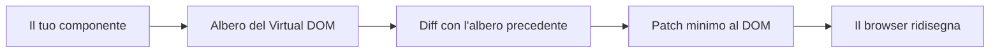
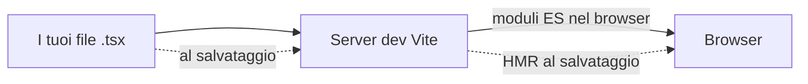
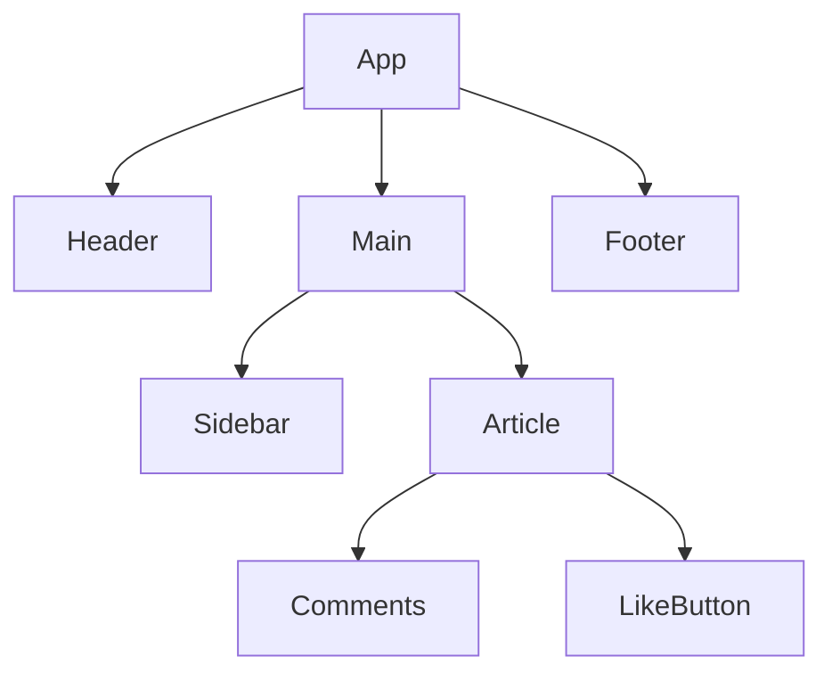
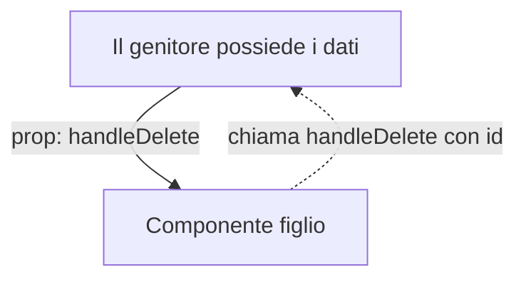
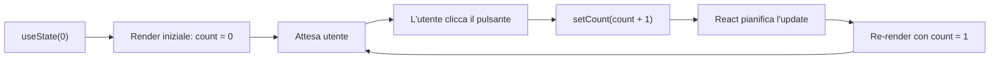
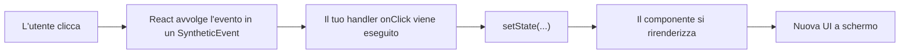
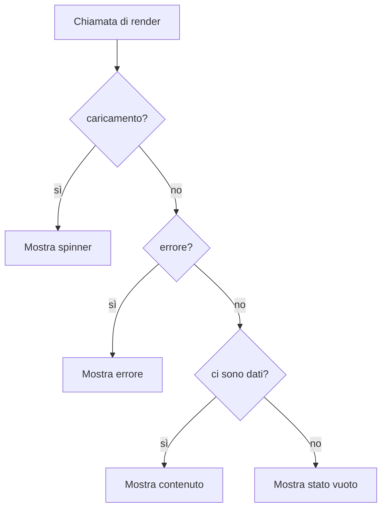
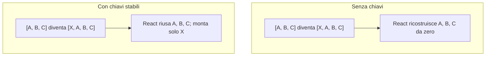
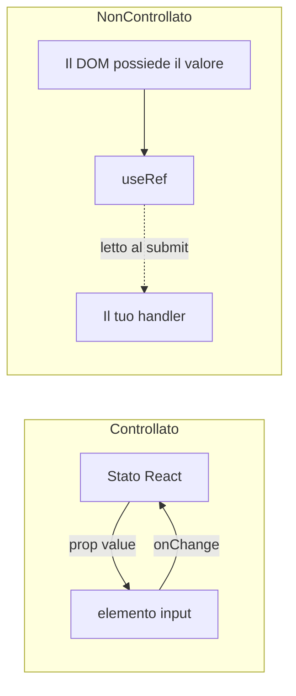

# Fondamenti di React: Costruire la Tua Prima UI Interattiva

> Un'introduzione a React, partendo dai principi di base, per chi conosce già un po' di HTML, CSS e JavaScript.

---

## Indice

1. [Comprendere React](#1-comprendere-react)
2. [Configurare un Ambiente di Sviluppo React](#2-configurare-un-ambiente-di-sviluppo-react)
3. [Sintassi JSX](#3-sintassi-jsx)
4. [Componenti](#4-componenti)
5. [Props](#5-props)
6. [Gestione dello Stato](#6-gestione-dello-stato)
7. [Gestione degli Eventi](#7-gestione-degli-eventi)
8. [Rendering Condizionale](#8-rendering-condizionale)
9. [Liste e Chiavi](#9-liste-e-chiavi)
10. [Form e Componenti Controllati](#10-form-e-componenti-controllati)

Questo capitolo presuppone che tu sappia leggere JavaScript di base: variabili, funzioni, array e arrow function. Dovresti inoltre riconoscere i tag HTML e le classi CSS. Non hai bisogno di alcuna esperienza precedente con framework. Alla fine capirai cos'è React, perché si usa e come scrivere da solo piccoli componenti interattivi.

---

## 1. Comprendere React

### Partiamo dal problema, non dalla soluzione

Prima ancora di aprire un file React, vediamo il tipo di problema che React è stato pensato per risolvere. Immagina di voler aggiungere un piccolo contatore a una pagina web: un pulsante con scritto "Cliccami" e due punti sulla pagina che devono entrambi mostrare quante volte è stato cliccato. Con HTML e JavaScript puri potresti scrivere qualcosa così:

```html
<!doctype html>
<html>
  <body>
    <p>Hai cliccato <span id="count-top">0</span> volte.</p>
    <button id="btn">Cliccami</button>
    <p>Il totale finora è: <span id="count-bottom">0</span></p>

    <script>
      let count = 0;
      const top = document.querySelector('#count-top');
      const bottom = document.querySelector('#count-bottom');
      const btn = document.querySelector('#btn');

      btn.addEventListener('click', () => {
        count = count + 1;
        top.textContent = count;
        bottom.textContent = count;
      });
    </script>
  </body>
</html>
```

Funziona. Ma nota cosa hai dovuto fare a mano: ogni volta che `count` cambia, devi ricordarti di aggiornare *ogni* punto della pagina che dipende da esso. Qui abbiamo toccato due span; in un'app reale potrebbero essere venti. Dimenticane uno e la UI mente silenziosamente all'utente.

Questo è il problema per cui React è stato progettato. Dovresti descrivere **che aspetto ha la UI per un dato valore di `count`**, e la libreria dovrebbe capire da sola quali parti del DOM aggiornare. Smetti di pensare "trova quell'elemento e cambia il suo testo" e cominci a pensare "lo schermo è una funzione dei miei dati".

### Cos'è davvero React

React è una **libreria** JavaScript per costruire interfacce utente. È stata rilasciata originariamente da Facebook nel 2013 ed è oggi usata ovunque, da piccoli dashboard a prodotti interi. Una libreria, a differenza di un framework completo, ti dà solo un insieme mirato di strumenti — nel caso di React, strumenti per descrivere la UI come componenti e tenere il DOM in sincrono con i tuoi dati. Routing, chiamate di rete e helper per i form non fanno parte di React stesso; li scegli a parte quando ti servono.

L'idea centrale è il **rendering dichiarativo**. Invece di scrivere istruzioni passo-passo ("prendi questo elemento, cambia il suo testo"), scrivi una funzione che restituisce una descrizione della UI per i dati correnti. React confronta questa descrizione con la precedente e aggiorna solo le parti effettivamente cambiate.

### Come React aggiorna lo schermo



Quando il tuo componente viene eseguito, non tocca direttamente il DOM reale. Restituisce un albero leggero in memoria (spesso chiamato **Virtual DOM**). React conserva l'albero precedente, lo confronta con quello nuovo e scrive sulla pagina solo le differenze. È per questo che una tabella da 10.000 righe che si rirenderizza dopo il cambio di una cella non blocca il browser — React tocca solo quella cella.

### Perché scegliere React

Il design di React si fonda su una manciata di idee che ricorrono ovunque nella libreria:

- **Architettura a componenti.** La tua UI è divisa in piccole funzioni con un nome. Ognuna restituisce un pezzo di UI. Le componi come mattoncini Lego.
- **Codice dichiarativo.** Descrivi il risultato, non i passaggi per arrivarci.
- **Flusso di dati unidirezionale.** I dati scorrono dai genitori ai figli tramite le **props**. I figli non risalgono mai a modificare il genitore. Questo rende le app più facili da capire man mano che crescono.
- **Un modello mentale, molti target.** Una volta che conosci React per il web, lo stesso modello a componenti è usato da React Native (mobile), React Three Fiber (3D) e altri renderer.

> **Nota:** React non è magia. Sotto il cofano è solo JavaScript che produce oggetti che descrivono come dovrebbe essere il DOM. Una volta interiorizzato questo concetto, la maggior parte dei comportamenti sorprendenti smette di sorprenderti.

---

## 2. Configurare un Ambiente di Sviluppo React

### Com'è fatto un progetto React moderno

Un'app React vera non è un singolo file HTML — è un progetto con un build tool, un package manager e una cartella di file sorgente. Il build tool prende i tuoi file `.tsx` (JSX con TypeScript) e produce il JavaScript che un browser può effettivamente eseguire. Esegue anche un server di sviluppo locale con l'**Hot Module Replacement (HMR)**, che significa che quando salvi un file la pagina si aggiorna quasi istantaneamente senza perdere il suo stato.

Lo strumento raccomandato nel 2025 è **Vite**. È veloce ad avviarsi, veloce a ricaricare, e ha una configurazione predefinita sensata.



In sviluppo, Vite serve i tuoi sorgenti come moduli ES nativi e applica patch al browser a ogni salvataggio. Per la produzione passa a un bundler (esbuild e Rollup sotto il cofano) per produrre un artefatto minificato e tree-shakato pronto al deploy.

### Creare un progetto

Ti serve Node.js installato (versione 18 o successiva). Verificalo da un terminale:

```bash
node --version
```

Se stampa una versione, sei a posto. Poi crea un nuovo progetto React + TypeScript con Vite:

```bash
npm create vite@latest mia-app-react -- --template react-ts
cd mia-app-react
npm install
npm run dev
```

L'ultimo comando avvia il server di sviluppo e stampa un URL locale (di solito `http://localhost:5173`). Aprilo in un browser — dovresti vedere una pagina di partenza con un contatore. Modifica `src/App.tsx`, salva, e guarda il browser aggiornarsi da solo.

### La struttura dei file

Apri la nuova cartella nel tuo editor. Vedrai qualcosa del genere:

```
mia-app-react/
├── index.html              # L'unico punto d'ingresso HTML
├── package.json            # Dipendenze e script
├── tsconfig.json           # Configurazione TypeScript
├── vite.config.ts          # Configurazione di build di Vite
└── src/
    ├── main.tsx            # Inietta React nella pagina
    ├── App.tsx             # Il componente root
    ├── App.css             # Stili per App
    └── index.css           # Stili globali
```

Alcune note su cosa fa ciascun file:

- **`index.html`** è l'unico file HTML di tutto il progetto. Contiene un elemento vuoto `<div id="root"></div>`. React inietta tutta la tua app dentro quel div.
- **`src/main.tsx`** è il ponte tra HTML e React. Trova `#root` e dice a React di renderizzare il componente `App` al suo interno.
- **`src/App.tsx`** è il tuo componente root — la cima dell'albero dei componenti. Tutto il resto pende da qui.
- **`vite.config.ts`** è dove configureresti plugin, alias di percorso o proxy per un'API. Per ora puoi ignorarlo.

Se apri `main.tsx` vedrai qualcosa di simile a questo:

```tsx
import { StrictMode } from 'react';
import { createRoot } from 'react-dom/client';
import App from './App.tsx';
import './index.css';

createRoot(document.getElementById('root')!).render(
  <StrictMode>
    <App />
  </StrictMode>,
);
```

È l'unico punto della tua app che tocca direttamente un elemento del DOM reale. Tutto da `<App />` in giù è territorio di React.

### Gli script che userai davvero

In `package.json` troverai un blocco `scripts`. I tre che ti interessano subito:

```bash
npm run dev      # Avvia il server di sviluppo con HMR
npm run build    # Type-check e build per la produzione
npm run preview  # Serve localmente la build di produzione
```

Eseguirai `npm run dev` nel 99% dei casi mentre impari.

> **Nota:** Quando leggi tutorial online potresti vedere file con estensione `.jsx` invece di `.tsx`. L'unica differenza è che i file `.tsx` permettono la sintassi TypeScript. Resta su `.tsx` — la type-safety si ripaga da sola nel momento in cui la tua app cresce oltre una sola schermata.

---

## 3. Sintassi JSX

### Perché esiste JSX

Guarda come si produce un `<button>` con JavaScript puro:

```js
const btn = document.createElement('button');
btn.textContent = 'Cliccami';
btn.className = 'primary';
document.body.appendChild(btn);
```

Funziona, ma appena hai elementi annidati diventa difficile da leggere. Una lista di tre voci con un'intestazione si trasforma in una dozzina di chiamate `createElement` e `appendChild`. Perdi la forma del markup in un mare di codice imperativo.

JSX (acronimo di **JavaScript XML**) risolve il problema permettendoti di scrivere una sintassi simile all'HTML direttamente dentro un file JavaScript:

```tsx
const button = <button className="primary">Cliccami</button>;
```

Quella singola riga è equivalente alla versione vanilla a quattro righe vista sopra. JSX **non è un linguaggio di templating** e non è una stringa. È zucchero sintattico — il tuo build tool (Vite, tramite Babel o SWC) trasforma ogni tag JSX in una normale chiamata di funzione JavaScript:

```mermaid
graph LR
    JSX["&lt;Greeting name='Mario' /&gt;"] --> Compiler[Compilatore Vite]
    Compiler --> Call["React.createElement(Greeting, &#123; name: 'Mario' &#125;)"]
    Call --> VNode["Oggetto nodo del Virtual DOM"]
```



Ecco perché le parentesi graffe dentro JSX eseguono JavaScript reale — sei già dentro una chiamata di funzione. Il compilatore si occupa della traduzione; nel codice di tutti i giorni non scrivi mai `React.createElement` a mano.

### Leggere il tuo primo JSX

Ecco un piccolo esempio che usa tutto quello che ti serve per iniziare:

```tsx
const user = { name: 'Mario', age: 32 };

const profile = (
  <div className="user-card">
    <h2>{user.name}</h2>
    <p>Età: {user.age}</p>
    <p>Maggiorenne: {user.age >= 18 ? 'sì' : 'no'}</p>
  </div>
);
```

Nota alcune cose:

- L'intera espressione è racchiusa tra parentesi. È solo una convenzione JavaScript per poter mettere il tag d'apertura su una nuova riga.
- Usiamo `className` invece di `class`. Tra poco vedremo perché.
- Le parentesi graffe `{ ... }` riportano in modalità JavaScript. Qualsiasi cosa che valuti a una stringa, un numero o un altro elemento JSX può andarci dentro.

### Le regole di JSX che ti servono davvero

Ci sono cinque regole che spiegano quasi ogni errore JSX che un principiante incontra.

**1. Usa `className`, non `class`.** La parola `class` è riservata in JavaScript (è usata per le classi ES6), quindi JSX usa `className` al suo posto. Il browser vede comunque `class` nell'HTML finale.

```tsx
<div className="container">   {/* corretto */}
<div class="container">       {/* sbagliato — apparirà un warning in console */}
```

**2. Ogni tag deve chiudersi.** I tag autochiudenti hanno bisogno dello slash finale:

```tsx
   {/* corretto */}
                    {/* sbagliato */}
<br />                                    {/* corretto */}
```

**3. Gli attributi sono in camelCase.** L'HTML puro usa il minuscolo (`onclick`, `tabindex`); JSX usa il camelCase (`onClick`, `tabIndex`). Le eccezioni sono gli attributi `data-*` e `aria-*`, che restano in minuscolo.

```tsx
<button onClick={handleClick} tabIndex={0}>Salva</button>
```

**4. Un componente deve restituire un solo elemento root.** Non puoi restituire due tag fratelli affiancati. Avvolgili in un contenitore:

```tsx
return (
  <div>
    <h1>Titolo</h1>
    <p>Testo</p>
  </div>
);
```

Se non vuoi aggiungere un `<div>` extra al DOM, usa un **Fragment** — una coppia di tag vuota:

```tsx
return (
  <>
    <h1>Titolo</h1>
    <p>Testo</p>
  </>
);
```

I Fragment non rendono alcun elemento reale; esistono solo per soddisfare la regola "un solo root" di JSX.

**5. Le parentesi graffe contengono espressioni JavaScript, non istruzioni.** Puoi mettere qualsiasi espressione — un valore, una chiamata di funzione, un ternario, un'operazione matematica — dentro `{ }`. Non puoi mettere un'istruzione `if` o un ciclo `for`, perché sono istruzioni, non espressioni.

```tsx
<h1>{user.name.toUpperCase()}</h1>
<p>{2 + 2}</p>
<div>{isLoggedIn ? 'Benvenuto' : 'Accedi'}</div>
<ul>{items.map(item => <li key={item.id}>{item.text}</li>)}</ul>
```

### Stili inline e classi dinamiche

L'attributo `style` in JSX accetta un oggetto JavaScript, non una stringa:

```tsx
<div style={{ color: 'red', fontSize: '20px', marginTop: 10 }}>Ciao</div>
```

Le doppie graffe sembrano strane ma sono semplici: le `{ }` esterne attivano la modalità JavaScript, e le `{ }` interne sono il letterale dell'oggetto. I nomi delle proprietà sono in camelCase (`fontSize`, non `font-size`), e i valori numerici senza unità di misura diventano pixel.

Per nomi di classe dinamici, usa un template literal o un ternario:

```tsx
<button className={isPrimary ? 'btn btn-primary' : 'btn'}>Salva</button>
```

> **Nota:** Quando hai molte classi condizionali, un piccolo helper chiamato `clsx` (o `classnames`) le rende molto più facili da gestire. Puoi installarlo più avanti; per ora i ternari vanno bene.

---

## 4. Componenti

### Cos'è un componente

Un **componente** è una funzione che restituisce JSX. È tutta la definizione. Non c'è una classe, un decoratore, nessuno step di registrazione speciale. Se la tua funzione restituisce JSX e il suo nome inizia con la maiuscola, React la tratta come un componente.

```tsx
const Benvenuto = () => {
  return <h1>Benvenuto in React!</h1>;
};
```

Per usarlo, tratti il suo nome come un tag HTML personalizzato:

```tsx
<Benvenuto />
```

La lettera maiuscola non è opzionale. React usa il case per decidere se `<benvenuto />` significa "renderizza l'elemento HTML in minuscolo `benvenuto`" (sarebbe semplicemente un tag sconosciuto) oppure "chiama il mio componente di nome `Benvenuto`". Quindi **i nomi dei componenti iniziano sempre con la maiuscola**.

### Perché dividere le cose in componenti

Un componente è l'unità di **riuso** e l'unità di **comprensione**. Il riuso è il vantaggio ovvio — scrivi un `Button` una volta, lo metti in cinquanta posti. La comprensione è quello più sottile. Un componente da 500 righe è un incubo; lo stesso codice diviso in dieci componenti da 50 righe è leggibile, perché ogni nome (`<Header />`, `<UserCard />`, `<CommentList />`) ti dice a cosa serve quel blocco.

Una tipica app React è un albero di componenti, con un componente di alto livello (di solito chiamato `App`) alla radice.



Ogni nodo renderizza i suoi figli e i dati scorrono verso il basso attraverso le props (la prossima sezione).

### Componenti funzionali — gli unici di cui hai bisogno

React moderno è scritto interamente con **componenti funzionali**: semplici funzioni che restituiscono JSX. Potresti imbatterti in codice più vecchio che usa componenti basati su classi (`class MyComponent extends React.Component`). Funzionano ancora, ma il codice nuovo non dovrebbe usarli. Le funzioni sono più semplici, più facili da testare, e sbloccano gli **hook** — le funzioni speciali come `useState` che danno ai componenti memoria e comportamento.

Un esempio più completo, con un parametro:

```tsx
type GreetingProps = {
  name: string;
  age: number;
};

const Greeting = ({ name, age }: GreetingProps) => {
  return (
    <div>
      <h1>Ciao, {name}!</h1>
      <p>Hai {age} anni.</p>
    </div>
  );
};

// Usato come:
<Greeting name="Marco" age={28} />
```

La parte `{ name, age }` è il **destructuring** — estrarre singoli campi da un oggetto in una sola riga. L'oggetto destrutturato è quello che React passa in input: un oggetto `props` che contiene tutti gli attributi che hai scritto sul tag.

### Dove vivono i componenti?

Una convenzione comune è un componente per file, con il nome del componente:

```
src/
└── components/
    ├── Header.tsx
    ├── Button.tsx
    └── UserCard.tsx
```

Ogni file esporta il suo componente:

```tsx
// src/components/Button.tsx
type ButtonProps = {
  label: string;
  onClick: () => void;
};

export const Button = ({ label, onClick }: ButtonProps) => {
  return <button onClick={onClick}>{label}</button>;
};
```

E altri componenti lo importano:

```tsx
// src/App.tsx
import { Button } from './components/Button';

export default function App() {
  return <Button label="Salva" onClick={() => console.log('salvato')} />;
}
```

Questo è l'intero modello mentale di un'app React: tanti piccoli componenti, ognuno nel proprio file, che si compongono in componenti più grandi fino ad arrivare alla radice.

---

## 5. Props

### Passare dati in ingresso

Le **props** (abbreviazione di "properties") sono il modo in cui un componente genitore passa dati a un figlio. Dal lato JSX, le props sembrano esattamente attributi HTML:

```tsx
<UserCard name="Giuseppe" age={32} city="Roma" isActive={true} />
```

Il figlio riceve tutte queste come campi su un singolo oggetto `props`:

```tsx
const UserCard = (props) => {
  return (
    <div className="card">
      <h2>{props.name}</h2>
      <p>Età: {props.age}</p>
      <p>Città: {props.city}</p>
      {props.isActive && <span>Online</span>}
    </div>
  );
};
```

Nota come dati di tipi diversi fluiscono in modo diverso:

- Le stringhe possono essere scritte con le virgolette: `name="Giuseppe"`.
- Qualsiasi altra cosa ha bisogno delle graffe in modo che JSX sappia che è un'espressione JavaScript: `age={32}`, `isActive={true}`, `tags={['a', 'b']}`.

Puoi anche passare una stringa con le graffe se preferisci (`name={"Giuseppe"}`), ma la versione abbreviata si legge meglio.

### Il destructuring è lo stile standard

Leggere `props.name` ripetutamente diventa rumoroso. Quasi tutto il codice React destruttura le props direttamente nella firma della funzione:

```tsx
const UserCard = ({ name, age, city, isActive }) => {
  return (
    <div className="card">
      <h2>{name}</h2>
      <p>Età: {age}</p>
      <p>Città: {city}</p>
      {isActive && <span>Online</span>}
    </div>
  );
};
```

Con TypeScript, descrivi anche la forma delle props:

```tsx
type UserCardProps = {
  name: string;
  age: number;
  city: string;
  isActive: boolean;
};

const UserCard = ({ name, age, city, isActive }: UserCardProps) => {
  // ...
};
```

Se dimentichi di passare una prop obbligatoria, TypeScript lo intercetta prima ancora che la pagina si carichi.

### Valori di default

Se una prop è opzionale, assegnale un valore di default nel destructuring:

```tsx
type ButtonProps = {
  label?: string;
  variant?: 'primary' | 'secondary';
};

const Button = ({ label = 'Cliccami', variant = 'primary' }: ButtonProps) => {
  return <button className={variant}>{label}</button>;
};
```

Il `?` dopo il nome della proprietà nel tipo la rende opzionale. Il `= '...'` nei parametri fornisce il default se il genitore non passa nulla.

### Le props sono in sola lettura

C'è una regola sulle props che devi interiorizzare: **un componente non deve mai modificare le proprie props**. Sono input in sola lettura. Se l'utente digita in una casella di ricerca e tu vuoi aggiornare il valore, il valore non può vivere nelle props — deve vivere nello stato (prossima sezione), posseduto da qualche componente più in alto nell'albero.

```tsx
const Bad = ({ count }) => {
  count = count + 1;  // sbagliato — non riassegnare mai le props
  return <p>{count}</p>;
};
```

Perché? Perché il genitore possiede quei dati. Se il figlio li mutasse di nascosto, l'idea che il genitore ha del mondo si allontanerebbe silenziosamente dalla realtà, e la garanzia di React "i dati scorrono verso il basso" si romperebbe.

### Rimandare dati verso l'alto: callback prop

Se le props possono solo scendere, come fa un figlio a dire al genitore che è successo qualcosa — un pulsante è stato cliccato, un input è cambiato? Il genitore passa al figlio una **funzione** come prop. Il figlio chiama quella funzione. Il genitore fa quello che vuole in risposta.



Un piccolo esempio:

```tsx
const TodoItem = ({ id, text, onDelete }) => {
  return (
    <div>
      <span>{text}</span>
      <button onClick={() => onDelete(id)}>Elimina</button>
    </div>
  );
};

const TodoList = () => {
  const handleDelete = (id: number) => {
    console.log('Elimino il todo', id);
    // ... aggiorna qui dello stato
  };

  return <TodoItem id={1} text="Compra il latte" onDelete={handleDelete} />;
};
```

Il genitore definisce `handleDelete`. Lo passa a `TodoItem` come prop `onDelete`. Quando l'utente clicca il pulsante, `TodoItem` chiama `onDelete(id)` — che è semplicemente chiamare la funzione `handleDelete` del genitore. Il genitore ora sa quale todo rimuovere, ma il figlio non ha mai toccato dati che non gli appartengono.

Questo pattern — "props giù, eventi su" — è la regola di flusso dati più importante di React. Tienitela stretta.

### Children: la prop speciale

React riserva un nome di prop: `children`. Qualunque cosa metti **tra** il tag d'apertura e quello di chiusura di un componente viene passato come `children`:

```tsx
<Card>
  <h2>Ciao</h2>
  <p>Questo è dentro la card.</p>
</Card>
```

Dentro `Card`, ricevi quel JSX:

```tsx
type CardProps = {
  children: React.ReactNode;
};

const Card = ({ children }: CardProps) => {
  return <div className="card">{children}</div>;
};
```

È così che costruisci componenti di layout riusabili — il `Card` non si preoccupa di cosa contiene, fornisce solo la scatola.

---

## 6. Gestione dello Stato

### Perché le props da sole non bastano

Le props permettono al genitore di passare dati al figlio, ma non possono catturare dati che *cambiano nel tempo all'interno del componente*. Un contatore che si incrementa quando clicchi un pulsante, un input di testo che si aggiorna mentre l'utente digita, una lista che cresce quando aggiungi un elemento — tutti hanno bisogno di un modo per ricordare un valore tra un render e l'altro, e di dire a React "questo valore è cambiato, per favore rirenderizzami con quello nuovo".

Questo meccanismo si chiama **stato**, e vi accedi tramite una funzione chiamata **`useState`**.

### Gli hook, in breve

`useState` è il tuo primo **hook**. Gli hook sono funzioni speciali i cui nomi iniziano con `use`. Permettono a un componente funzionale di "agganciarsi" alle funzionalità di React come stato, effetti e context. Ci sono due regole:

1. Chiama gli hook solo al livello superiore di una funzione componente. Mai dentro un `if`, un ciclo o una funzione annidata.
2. Chiama gli hook solo da componenti React (o da altri hook).

Queste regole esistono per permettere a React di tracciare quale chiamata di hook corrisponde a quale valore. Finché le segui non devi pensare al perché.

### Il tuo primo contatore

```tsx
import { useState } from 'react';

const Counter = () => {
  const [count, setCount] = useState(0);

  return (
    <div>
      <p>Hai cliccato {count} volte</p>
      <button onClick={() => setCount(count + 1)}>Incrementa</button>
    </div>
  );
};
```

Analizziamo `useState(0)`:

- Viene chiamato con un **valore iniziale** (qui, `0`).
- Restituisce un **array di due elementi**: il valore corrente e una funzione setter. Li destrutturiamo: `const [count, setCount] = ...`.
- `count` è il valore corrente. Puoi leggerlo dentro JSX o altrove nel componente.
- `setCount` è l'unico modo corretto per cambiarlo. Chiamare `setCount(5)` dice a React "al prossimo render, `count` dovrebbe essere 5", e React pianifica un re-render del componente.



Ricordi l'esempio del contatore della primissima sezione che richiedeva aggiornamenti manuali del DOM in due posti? Ecco la versione React:

```tsx
const TwoPlaceCounter = () => {
  const [count, setCount] = useState(0);

  return (
    <div>
      <p>Hai cliccato {count} volte.</p>
      <button onClick={() => setCount(count + 1)}>Cliccami</button>
      <p>Il totale finora è: {count}</p>
    </div>
  );
};
```

Entrambi gli span mostrano sempre il numero giusto. Non hai mai scritto `top.textContent = count`. Hai semplicemente usato `count` nel JSX, e React ha fatto il resto. Questo è il vantaggio del rendering dichiarativo.

### Non mutare mai lo stato direttamente

Questo è l'errore più comune dei principianti:

```tsx
const [user, setUser] = useState({ name: 'Marco', age: 28 });

// sbagliato — React non vede il cambiamento
user.age = 29;

// corretto — passa un nuovo oggetto al setter
setUser({ ...user, age: 29 });
```

React decide se rirenderizzare confrontando il nuovo valore di stato con il vecchio. Se muti lo stesso oggetto sul posto, è ancora lo stesso oggetto — React non vede alcun cambiamento e salta il re-render. Passa sempre un valore nuovo al setter.

Lo stesso vale per gli array:

```tsx
const [todos, setTodos] = useState<string[]>([]);

// sbagliato
todos.push('Compra il latte');

// corretto
setTodos([...todos, 'Compra il latte']);

// rimuovere
setTodos(todos.filter(todo => todo !== 'Compra il latte'));
```

L'operatore di spread `...` è tuo amico qui. Costruisce un nuovo array (o oggetto) che contiene il vecchio contenuto più la tua modifica.

### Più valori di stato

Puoi chiamare `useState` tutte le volte che ti serve:

```tsx
const UserForm = () => {
  const [name, setName] = useState('');
  const [email, setEmail] = useState('');
  const [age, setAge] = useState(0);
  const [isSubscribed, setIsSubscribed] = useState(false);

  return (
    <div>
      <input value={name} onChange={(e) => setName(e.target.value)} />
      <input value={email} onChange={(e) => setEmail(e.target.value)} />
      {/* ... */}
    </div>
  );
};
```

Oppure raggruppa i campi correlati in un singolo oggetto:

```tsx
const [form, setForm] = useState({
  name: '',
  email: '',
  age: 0,
});

const updateField = (field: string, value: string) => {
  setForm(prev => ({ ...prev, [field]: value }));
};
```

Scegli quello che ti sembra più chiaro per la situazione. Tante piccole chiamate a `useState` sono di solito più leggibili di un solo oggetto enorme.

### L'updater funzionale

C'è un'importante sfumatura. Quando un setter viene chiamato, React non aggiorna `count` immediatamente — mette in coda l'aggiornamento. Se chiami il setter due volte di fila usando il valore corrente, avrai una sorpresa:

```tsx
const [count, setCount] = useState(0);

const doubleIncrement = () => {
  setCount(count + 1);  // mette in coda: imposta count a 1
  setCount(count + 1);  // mette in coda: imposta count a 1 di nuovo (count vale ancora 0 qui!)
};
```

Dopo un clic, `count` finisce a `1`, non a `2`. Per correggerlo, passa una funzione al setter. React la chiamerà con il valore più recente:

```tsx
const doubleIncrement = () => {
  setCount(prev => prev + 1);  // prev è 0, diventa 1
  setCount(prev => prev + 1);  // prev ora è 1, diventa 2
};
```

Questa è la forma dell'**updater funzionale**. Usala ogni volta che il prossimo stato dipende dal precedente.

### Props vs stato — quando usare cosa

Questa è la domanda che ogni principiante si pone. La regola è breve:

- Se il valore è **passato dall'esterno** del componente, è una prop.
- Se il valore è **posseduto e cambiato da questo componente**, è stato.

Se due componenti fratelli devono condividere lo stesso valore, quel valore dovrebbe vivere nello **stato** del loro più vicino antenato comune e scendere di nuovo come **props** a entrambi. Questo pattern si chiama "lifting state up" (sollevamento dello stato), e lo userai continuamente.

---

## 7. Gestione degli Eventi

### Da `addEventListener` agli handler React

In JavaScript puro colleghi gli event listener così:

```js
document.querySelector('#save').addEventListener('click', () => {
  console.log('cliccato');
});
```

In React scrivi l'handler direttamente sull'elemento JSX come prop:

```tsx
<button onClick={() => console.log('cliccato')}>Salva</button>
```

I nomi degli eventi sono in camelCase (`onClick`, `onChange`, `onSubmit`) e il valore è una **funzione**, non una stringa. React si occupa di collegare e rimuovere il listener per te.

### Cosa succede quando l'utente clicca



React avvolge gli eventi DOM nativi in un oggetto cross-browser chiamato **SyntheticEvent**. Per la maggior parte degli scopi appare e si comporta esattamente come un evento normale — puoi chiamare `event.preventDefault()`, leggere `event.target.value`, e così via. Non devi quasi mai pensare al wrapper in sé.

### Handler inline vs handler con nome

Entrambi vanno bene:

```tsx
// arrow function inline
<button onClick={() => console.log('cliccato')}>Salva</button>

// riferimento a una funzione con nome
const handleSave = () => {
  console.log('cliccato');
};

<button onClick={handleSave}>Salva</button>
```

Usa la versione con nome quando l'handler è più di una riga o quando vuoi riusarlo. Usa le arrow inline quando devi passare un argomento:

```tsx
<button onClick={() => handleDelete(user.id)}>Elimina</button>
```

Importante: **non** chiamare la funzione con le parentesi dentro la prop JSX:

```tsx
<button onClick={handleDelete(user.id)}>Elimina</button>   {/* sbagliato */}
```

Quello chiamerebbe `handleDelete` immediatamente al render del componente e assegnerebbe qualunque cosa restituisca (probabilmente `undefined`) come click handler. Vuoi dare a React una funzione che possa chiamare più tardi, non il risultato della chiamata adesso.

### Leggere l'oggetto evento

Il tuo handler riceve l'oggetto evento come primo argomento:

```tsx
const handleSubmit = (event) => {
  event.preventDefault();         // ferma il comportamento di default del browser
  event.stopPropagation();        // ferma il bubbling dell'evento
  console.log(event.target);      // l'elemento che ha generato l'evento
};
```

`preventDefault()` è quello che userai costantemente con i form — senza, una submission di `<form>` causa il ricaricamento della pagina, che quasi mai è quello che vuoi in una single-page app.

### Una piccola raccolta di eventi comuni

```tsx
const EventExamples = () => {
  return (
    <div>
      <button onClick={() => console.log('click')}>Click</button>
      <button onDoubleClick={() => console.log('double')}>Doppio click</button>

      <div
        onMouseEnter={() => console.log('entrato')}
        onMouseLeave={() => console.log('uscito')}
      >
        Passa il mouse
      </div>

      <input
        onChange={(e) => console.log('il valore ora è', e.target.value)}
        onFocus={() => console.log('focus')}
        onBlur={() => console.log('blur')}
      />

      <form
        onSubmit={(e) => {
          e.preventDefault();
          console.log('form inviato');
        }}
      >
        <button type="submit">Invia</button>
      </form>

      <input onKeyDown={(e) => console.log('tasto:', e.key)} />
    </div>
  );
};
```

### Tipizzare gli event handler in TypeScript

Quando ti serve il tipo dell'evento stesso (per esempio per destrutturarlo), TypeScript si aspetta nomi specifici:

```tsx
import { ChangeEvent, FormEvent, MouseEvent } from 'react';

const handleChange = (e: ChangeEvent<HTMLInputElement>) => {
  console.log(e.target.value);
};

const handleSubmit = (e: FormEvent<HTMLFormElement>) => {
  e.preventDefault();
};

const handleClick = (e: MouseEvent<HTMLButtonElement>) => {
  console.log('pulsante a', e.clientX, e.clientY);
};
```

Se lasci che il tuo editor inferisca il tipo (usando una arrow function inline direttamente dentro JSX), di solito non devi scrivere queste annotazioni — TypeScript le deduce dal contesto JSX.

---

## 8. Rendering Condizionale

### "A volte mostra questo, a volte mostra quello"

Quasi ogni UI ha parti che appaiono solo in certe condizioni: un pulsante "Logout" solo quando l'utente è autenticato, un messaggio d'errore solo quando qualcosa è andato male, uno spinner di caricamento solo mentre i dati sono in volo.

React non ha una sintassi speciale per "if". Usi semplicemente JavaScript puro — perché JSX è JavaScript puro. Ci sono tre pattern che userai continuamente.



L'ordine di questi controlli è importante. Controlla prima lo stato più specifico (caricamento), poi il successivo (errore), poi il caso felice (dati), poi il fallback (vuoto). Saltare il check del caricamento e andare dritto a "ci sono dati?" porta a un flash di "nessun risultato" mentre la richiesta è ancora in volo.

### Pattern 1: short-circuit con `&&`

```tsx
const Greeting = ({ isLoggedIn, username }) => {
  return (
    <div>
      {isLoggedIn && <h1>Benvenuto, {username}!</h1>}
      {!isLoggedIn && <h1>Effettua l'accesso</h1>}
    </div>
  );
};
```

Funziona grazie alla valutazione short-circuit di JavaScript: `true && <h1>...</h1>` è semplicemente `<h1>...</h1>`, e `false && <h1>...</h1>` è `false`, che React renderizza come nulla.

C'è una trappola: non usare `&&` con un numero che potrebbe essere zero:

```tsx
{items.length && <p>Hai degli elementi</p>}   {/* pericoloso */}
```

Se `items.length` è `0`, JavaScript fa short-circuit a `0`, e React renderizza il letterale `0` sulla pagina. Usa invece un confronto:

```tsx
{items.length > 0 && <p>Hai degli elementi</p>}
```

### Pattern 2: il ternario

Quando hai un aut-aut, il ternario `a ? b : c` si legge meglio di due `&&`:

```tsx
const LoginButton = ({ isLoggedIn }) => {
  return <button>{isLoggedIn ? 'Logout' : 'Login'}</button>;
};
```

Puoi mettere interi blocchi JSX su ciascun lato, purché tu li parentesizzi:

```tsx
const UserStatus = ({ user }) => {
  return (
    <div>
      {user ? (
        <div>
          <h2>{user.name}</h2>
          <p>{user.email}</p>
        </div>
      ) : (
        <p>Nessun utente autenticato</p>
      )}
    </div>
  );
};
```

Evita di annidare ternari oltre un livello — diventano illeggibili in fretta. Se ti accorgi di impilarli, passa al pattern 3.

### Pattern 3: early return

Se il condizionale si applica all'intero componente, fai un return anticipato all'inizio:

```tsx
const UserProfile = ({ user }) => {
  if (!user) {
    return <p>Caricamento...</p>;
  }

  if (user.role === 'admin') {
    return <AdminDashboard user={user} />;
  }

  return <UserDashboard user={user} />;
};
```

Questo è il pattern più pulito per gestire i flussi "carica" → "errore" → "successo":

```tsx
const Dashboard = ({ user, isLoading, error }) => {
  if (isLoading) return <Spinner />;
  if (error) return <ErrorMessage message={error} />;
  if (!user) return <p>Nessun dato disponibile</p>;

  return <UserProfile user={user} />;
};
```

### Lookup per chiave (uno switch del povero)

Quando hai molte opzioni discrete, un oggetto di lookup è spesso più pulito di una catena di ternari:

```tsx
type Status = 'pending' | 'approved' | 'rejected';

const StatusBadge = ({ status }: { status: Status }) => {
  const config = {
    pending:  { text: 'In attesa', color: 'orange' },
    approved: { text: 'Approvato', color: 'green' },
    rejected: { text: 'Rifiutato', color: 'red' },
  }[status];

  return <span style={{ color: config.color }}>{config.text}</span>;
};
```

### Combinare più condizioni

```tsx
const Dashboard = ({ user, isLoading, error }) => {
  return (
    <div>
      {isLoading && <Spinner />}
      {error && <ErrorMessage message={error} />}
      {!isLoading && !error && user && <UserProfile user={user} />}
      {!isLoading && !error && !user && <p>Nessun dato disponibile</p>}
    </div>
  );
};
```

Funziona, ma confrontalo con la versione a early return sopra — quella a early return è più corta e più facile da seguire. Nel dubbio, preferisci early return per i branch top-level e `&&` / ternario per piccoli pezzi inline.

---

## 9. Liste e Chiavi

### Trasformare i dati in UI

Una lista in React è solo un array di dati e una chiamata `.map()` che trasforma ogni elemento in un elemento JSX.

```tsx
const TodoList = () => {
  const todos = [
    { id: 1, text: 'Imparare React', completed: false },
    { id: 2, text: 'Costruire un progetto', completed: false },
    { id: 3, text: 'Mettere in deploy l\'app', completed: true },
  ];

  return (
    <ul>
      {todos.map((todo) => (
        <li key={todo.id}>
          {todo.text} {todo.completed && '(fatto)'}
        </li>
      ))}
    </ul>
  );
};
```

Tre cose da notare:

1. `todos.map(...)` esegue `Array.prototype.map` — lo stesso che hai sempre usato. Restituisce un nuovo array, questa volta di elementi JSX.
2. Avvolgiamo la chiamata in `{ ... }` così JSX la valuta come espressione JavaScript.
3. Ogni `<li>` riceve una prop `key`. Questa è la parte che ha bisogno di più spiegazione.

### Perché esistono le chiavi

Quando la lista cambia — un elemento viene aggiunto, rimosso o riordinato — React deve capire quali nodi DOM tenere, quali buttare e quali creare. La **chiave** è il modo che React ha di identificare ogni elemento attraverso i render.



Se non fornisci le chiavi, React ricade sull'indice dell'array. Funziona per liste statiche ma si rompe nel momento in cui gli elementi vengono inseriti, rimossi o riordinati: React pensa "l'elemento all'indice 0 era A, ora è X, fammi aggiornare da A a X" invece di "X è nuovo, fammi montarlo e spostare A in basso". Perdi performance e, peggio, perdi qualsiasi stato interno dentro quegli elementi (un valore di `<input>`, un toggle, qualsiasi cosa).

### Regole per le chiavi

Le regole per le chiavi sono brevi:

- Le chiavi devono essere **uniche tra i fratelli** (non globalmente — solo dentro la stessa lista).
- Le chiavi dovrebbero essere **stabili**: lo stesso elemento dovrebbe avere la stessa chiave attraverso i render.
- Usa un ID reale dai tuoi dati quando ce l'hai (`todo.id`, `user.id`).
- Usa l'indice dell'array solo se la tua lista è puramente statica — mai aggiunta, rimossa o riordinata.
- Non usare mai `Math.random()` o `Date.now()` — genererebbero una chiave diversa a ogni render, vanificando lo scopo.

```tsx
{todos.map((todo) => (
  <li key={todo.id}>{todo.text}</li>           {/* buono */}
))}

{todos.map((todo, index) => (
  <li key={index}>{todo.text}</li>             {/* ok per liste statiche, rischioso altrimenti */}
))}

{todos.map((todo) => (
  <li>{todo.text}</li>                         {/* sbagliato — React darà un warning */}
))}
```

### Estrai gli elementi della lista in un loro componente

Quando un elemento di lista ha più di due o tre righe di JSX, spostalo in un suo componente. Il codice diventa più facile da leggere, e il componente per l'elemento può avere il suo stato (pensa: un toggle "in modifica" su ogni riga).

```tsx
type Todo = { id: number; text: string; completed: boolean };

type TodoItemProps = {
  todo: Todo;
  onToggle: (id: number) => void;
  onDelete: (id: number) => void;
};

const TodoItem = ({ todo, onToggle, onDelete }: TodoItemProps) => {
  return (
    <li>
      <input
        type="checkbox"
        checked={todo.completed}
        onChange={() => onToggle(todo.id)}
      />
      <span>{todo.text}</span>
      <button onClick={() => onDelete(todo.id)}>Elimina</button>
    </li>
  );
};

const TodoList = () => {
  const [todos, setTodos] = useState<Todo[]>([
    { id: 1, text: 'Imparare React', completed: false },
    { id: 2, text: 'Costruire un progetto', completed: false },
  ]);

  const toggle = (id: number) => {
    setTodos(prev =>
      prev.map(t => (t.id === id ? { ...t, completed: !t.completed } : t)),
    );
  };

  const remove = (id: number) => {
    setTodos(prev => prev.filter(t => t.id !== id));
  };

  return (
    <ul>
      {todos.map(todo => (
        <TodoItem key={todo.id} todo={todo} onToggle={toggle} onDelete={remove} />
      ))}
    </ul>
  );
};
```

Nota che la `key` va sull'elemento prodotto da `.map()` — cioè su `<TodoItem>` stesso, **non** sul `<li>` dentro `TodoItem`. React ha bisogno della chiave solo nel punto in cui la lista viene generata.

### Filtrare e ordinare

Filtrare e ordinare sono semplici metodi di array. Concatenali prima di `.map()`:

```tsx
const FilteredList = () => {
  const [todos, setTodos] = useState<Todo[]>([]);
  const [filter, setFilter] = useState<'all' | 'active' | 'completed'>('all');

  const visible = todos
    .filter(todo => {
      if (filter === 'active') return !todo.completed;
      if (filter === 'completed') return todo.completed;
      return true;
    })
    .slice()                                          // copia prima di ordinare
    .sort((a, b) => a.text.localeCompare(b.text));

  return (
    <div>
      <button onClick={() => setFilter('all')}>Tutti</button>
      <button onClick={() => setFilter('active')}>Attivi</button>
      <button onClick={() => setFilter('completed')}>Completati</button>

      <ul>
        {visible.map(todo => (
          <li key={todo.id}>{todo.text}</li>
        ))}
      </ul>
    </div>
  );
};
```

La chiamata `.slice()` prima di `.sort()` è importante: `sort()` muta l'array sul posto, e non dobbiamo mai mutare lo stato. Slice ne fa prima una copia.

### Stati vuoti

Gestisci sempre il caso vuoto esplicitamente — una `<ul>` vuota è una UI confusa.

```tsx
{visible.length === 0 ? (
  <p>Nessun todo. Aggiungine uno qui sopra.</p>
) : (
  <ul>
    {visible.map(todo => <li key={todo.id}>{todo.text}</li>)}
  </ul>
)}
```

---

## 10. Form e Componenti Controllati

### Dove vive il valore

Un input di form ha un valore. In HTML puro, quel valore vive dentro il DOM — il browser tiene traccia di quello che l'utente ha digitato. Quando vuoi leggerlo chiami `document.querySelector('#email').value`.

In React hai una scelta. Il pattern raccomandato è il **componente controllato**: il valore vive nello stato React, e l'input legge dallo stato e scrive di nuovo nello stato a ogni keystroke. Lo stato è l'**unica fonte di verità**.



L'alternativa — il **componente non controllato** — lascia il valore al DOM e lo legge tramite una `ref` quando ti serve. Non controllato è occasionalmente utile per le performance, ma per quasi tutto quello che scrivi da principiante vuoi controllato.

### Un input controllato minimo

```tsx
import { useState } from 'react';

const NameForm = () => {
  const [name, setName] = useState('');

  return (
    <div>
      <input value={name} onChange={(e) => setName(e.target.value)} />
      <p>Ciao, {name || '(nessun nome ancora)'}!</p>
    </div>
  );
};
```

Due prop fanno il lavoro:

- `value={name}` — il contenuto dell'input viene dallo stato.
- `onChange={(e) => setName(e.target.value)}` — ogni keystroke scatena `onChange`, che riscrive il nuovo valore nello stato, che rirenderizza, che aggiorna il `value` dell'input.

Sembra circolare, e lo è. Ma ti dà qualcosa di potente: in qualunque momento, `name` è la verità. Non devi interrogare il DOM, non devi chiederti se il valore è andato fuori sync col tuo modello. Lo stato React è il modello.

### Un form di login completo

```tsx
const LoginForm = () => {
  const [email, setEmail] = useState('');
  const [password, setPassword] = useState('');

  const handleSubmit = (e: React.FormEvent) => {
    e.preventDefault();
    console.log('Login con', { email, password });
  };

  return (
    <form onSubmit={handleSubmit}>
      <div>
        <label htmlFor="email">Email</label>
        <input
          id="email"
          type="email"
          value={email}
          onChange={(e) => setEmail(e.target.value)}
        />
      </div>

      <div>
        <label htmlFor="password">Password</label>
        <input
          id="password"
          type="password"
          value={password}
          onChange={(e) => setPassword(e.target.value)}
        />
      </div>

      <button type="submit">Accedi</button>
    </form>
  );
};
```

Tre piccoli dettagli da evidenziare:

- `onSubmit` va sul `<form>`, non sul pulsante di submit.
- `e.preventDefault()` è essenziale. Senza, il browser ricaricherà la pagina e perderai tutto il tuo stato.
- Ogni `<label>` usa `htmlFor` (non `for`, perché `for` è riservato in JavaScript) per associarsi all'input. È buono per l'accessibilità — cliccando sulla label si mette a fuoco l'input.

### Elementi di form diversi, stesso pattern

Ogni controllo di form segue lo stesso pattern `value` + `onChange`, con piccole variazioni:

```tsx
type FormState = {
  username: string;
  bio: string;
  country: string;
  subscribe: boolean;
  gender: string;
  skills: string[];
};

const RegistrationForm = () => {
  const [form, setForm] = useState<FormState>({
    username: '',
    bio: '',
    country: 'italy',
    subscribe: false,
    gender: '',
    skills: [],
  });

  // handler generico per input testuali e checkbox che hanno un `name`
  const handleChange = (
    e: React.ChangeEvent<HTMLInputElement | HTMLSelectElement | HTMLTextAreaElement>,
  ) => {
    const { name, value, type } = e.target;
    const checked = (e.target as HTMLInputElement).checked;
    setForm(prev => ({
      ...prev,
      [name]: type === 'checkbox' ? checked : value,
    }));
  };

  const toggleSkill = (skill: string) => {
    setForm(prev => ({
      ...prev,
      skills: prev.skills.includes(skill)
        ? prev.skills.filter(s => s !== skill)
        : [...prev.skills, skill],
    }));
  };

  const handleSubmit = (e: React.FormEvent) => {
    e.preventDefault();
    console.log('Invio', form);
  };

  return (
    <form onSubmit={handleSubmit}>
      {/* input di testo */}
      <input
        type="text"
        name="username"
        value={form.username}
        onChange={handleChange}
        placeholder="Username"
      />

      {/* textarea — stesso pattern */}
      <textarea
        name="bio"
        value={form.bio}
        onChange={handleChange}
        placeholder="Raccontaci di te"
        rows={4}
      />

      {/* select — value va sulla select, non sull'option */}
      <select name="country" value={form.country} onChange={handleChange}>
        <option value="italy">Italia</option>
        <option value="spain">Spagna</option>
        <option value="france">Francia</option>
      </select>

      {/* checkbox singolo — usa `checked`, non `value` */}
      <label>
        <input
          type="checkbox"
          name="subscribe"
          checked={form.subscribe}
          onChange={handleChange}
        />
        Iscriviti alla newsletter
      </label>

      {/* gruppo di radio — stesso `name`, `value` diverso, confronto su `checked` */}
      <label>
        <input
          type="radio"
          name="gender"
          value="male"
          checked={form.gender === 'male'}
          onChange={handleChange}
        />
        Maschio
      </label>
      <label>
        <input
          type="radio"
          name="gender"
          value="female"
          checked={form.gender === 'female'}
          onChange={handleChange}
        />
        Femmina
      </label>

      {/* gruppo di checkbox supportato da un array */}
      <label>
        <input
          type="checkbox"
          checked={form.skills.includes('react')}
          onChange={() => toggleSkill('react')}
        />
        React
      </label>
      <label>
        <input
          type="checkbox"
          checked={form.skills.includes('typescript')}
          onChange={() => toggleSkill('typescript')}
        />
        TypeScript
      </label>

      <button type="submit">Registrati</button>
    </form>
  );
};
```

Alcune cose da notare:

- Una singola funzione `handleChange` può gestire la maggior parte degli input perché usiamo l'attributo `name` dell'input come chiave dello stato.
- I checkbox usano `checked` invece di `value`. Il "è attivo" vive in `e.target.checked`.
- `<select>` mette il valore corrente sulla select stessa, non sull'`<option>` corrispondente.
- Per i radio button in un gruppo, ogni input condivide lo stesso `name`. Quello selezionato viene identificato confrontando `checked={form.gender === 'male'}`.
- Per un **gruppo** di checkbox (dove molti possono essere selezionati) non puoi usare l'handler generico — devi togliere e mettere elementi in un array, che è quello che fa `toggleSkill`.

### Validazione

La validazione è semplicemente codice che viene eseguito prima dell'invio. Tieni i messaggi d'errore in uno stato a parte e renderizzali accanto al campo pertinente.

```tsx
type FormState = { email: string; password: string; confirmPassword: string };
type FormErrors = Partial<Record<keyof FormState, string>>;

const RegistrationForm = () => {
  const [form, setForm] = useState<FormState>({
    email: '',
    password: '',
    confirmPassword: '',
  });
  const [errors, setErrors] = useState<FormErrors>({});

  const validate = (): boolean => {
    const next: FormErrors = {};

    if (!form.email) {
      next.email = 'L\'email è obbligatoria';
    } else if (!/\S+@\S+\.\S+/.test(form.email)) {
      next.email = 'L\'email non è valida';
    }

    if (!form.password) {
      next.password = 'La password è obbligatoria';
    } else if (form.password.length < 8) {
      next.password = 'La password deve avere almeno 8 caratteri';
    }

    if (form.password !== form.confirmPassword) {
      next.confirmPassword = 'Le password non corrispondono';
    }

    setErrors(next);
    return Object.keys(next).length === 0;
  };

  const handleSubmit = (e: React.FormEvent) => {
    e.preventDefault();
    if (validate()) {
      console.log('Valido! Invio...', form);
      // chiama qui la tua API
    }
  };

  const handleChange = (e: React.ChangeEvent<HTMLInputElement>) => {
    const { name, value } = e.target;
    setForm(prev => ({ ...prev, [name]: value }));
    // azzera l'errore per questo campo mentre l'utente digita
    if (errors[name as keyof FormErrors]) {
      setErrors(prev => ({ ...prev, [name]: undefined }));
    }
  };

  return (
    <form onSubmit={handleSubmit}>
      <div>
        <input
          type="email"
          name="email"
          value={form.email}
          onChange={handleChange}
          placeholder="Email"
        />
        {errors.email && <span className="error">{errors.email}</span>}
      </div>

      <div>
        <input
          type="password"
          name="password"
          value={form.password}
          onChange={handleChange}
          placeholder="Password"
        />
        {errors.password && <span className="error">{errors.password}</span>}
      </div>

      <div>
        <input
          type="password"
          name="confirmPassword"
          value={form.confirmPassword}
          onChange={handleChange}
          placeholder="Conferma password"
        />
        {errors.confirmPassword && (
          <span className="error">{errors.confirmPassword}</span>
        )}
      </div>

      <button type="submit">Registrati</button>
    </form>
  );
};
```

Quando i form crescono, librerie come **React Hook Form** o **Formik** ti risparmiano un sacco di boilerplate — ma dovresti scrivere un paio di form a mano prima, così capisci cosa fanno le librerie al posto tuo.

> **Nota:** L'alternativa non controllata si presenta così — tienila in tasca ma di default vai sul controllato.
>
> ```tsx
> import { useRef } from 'react';
>
> const UncontrolledInput = () => {
>   const inputRef = useRef<HTMLInputElement>(null);
>
>   const handleSubmit = () => {
>     console.log(inputRef.current?.value);
>   };
>
>   return (
>     <>
>       <input ref={inputRef} defaultValue="" />
>       <button onClick={handleSubmit}>Leggi</button>
>     </>
>   );
> };
> ```

---

## Riepilogo: Cosa Hai Imparato

Ora hai il modello mentale di base di React:

- Un'app React è un **albero di componenti** — piccole funzioni che restituiscono JSX.
- **JSX** è JavaScript con una sintassi simile all'HTML. Le parentesi graffe tornano in modalità JavaScript.
- Le **props** scorrono dal genitore al figlio. I figli chiamano le callback prop per parlare verso l'alto.
- Lo **stato**, posseduto via `useState`, contiene valori che cambiano nel tempo e scatena i re-render.
- Gli **eventi** sono prop in camelCase (`onClick`, `onChange`) il cui valore è una funzione.
- Il **rendering condizionale** è JavaScript puro: `&&`, ternario, return anticipato.
- Le **liste** sono chiamate `.map()` che trasformano dati in JSX, ogni elemento con una `key` stabile.
- I **form controllati** mettono il valore nello stato React e lo sincronizzano a ogni keystroke.

### I cinque principi da portarti dietro

```
1. I componenti sono funzioni che restituiscono JSX.
2. Le props scorrono verso il basso.
3. Gli eventi risalgono tramite callback.
4. Lo stato scatena i re-render — non mutarlo mai sul posto.
5. La UI è una funzione dello stato.
```

### Cosa imparare dopo

1. **Altri hook**: `useEffect` per gli effetti collaterali (fetch di dati, sottoscrizioni), `useRef` per valori non-stato, `useContext` per dati cross-tree.
2. **Pattern di componenti riusabili**: composizione con `children`, lifting state, separazione container/presentational.
3. **Routing**: React Router, così una single-page app può avere più "pagine".
4. **Gestione dello stato oltre `useState`**: `useReducer` per transizioni complesse, Context per stato a livello app, librerie come Zustand o Redux quando ti servono di più.
5. **Testing**: React Testing Library, Vitest o Jest.
6. **Styling**: CSS Modules, Tailwind, o CSS-in-JS — sono tutte scelte valide.

### Risorse utili

- [La documentazione ufficiale di React](https://react.dev) — il miglior punto di partenza, senza confronto. Il tutorial è eccellente.
- [TypeScript Cheatsheet per React](https://react-typescript-cheatsheet.netlify.app/) — quando incappi in un tipo complicato, guarda prima qui.
- [Documentazione di Vite](https://vitejs.dev) — per quando vuoi personalizzare la build.

---

Buon coding.
