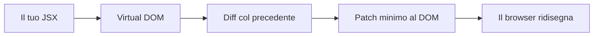
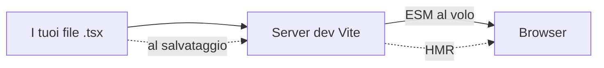
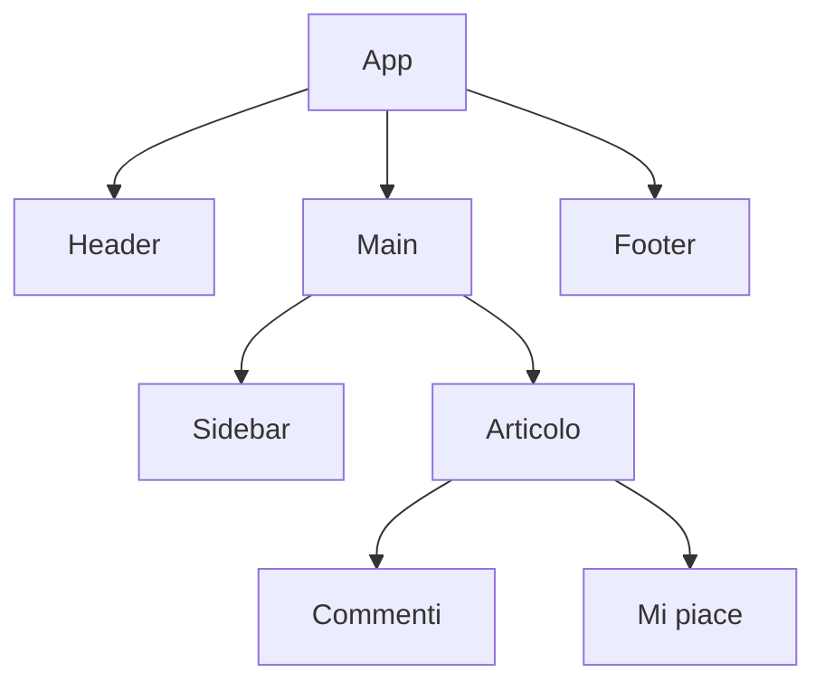
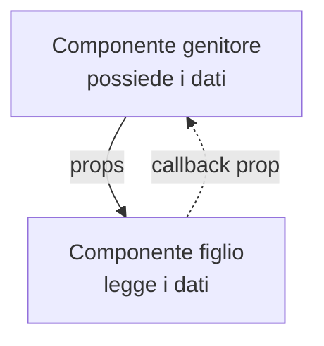
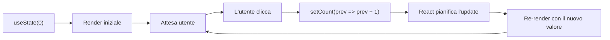
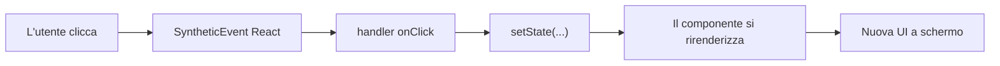
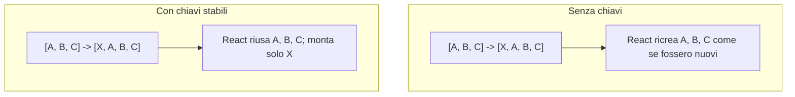
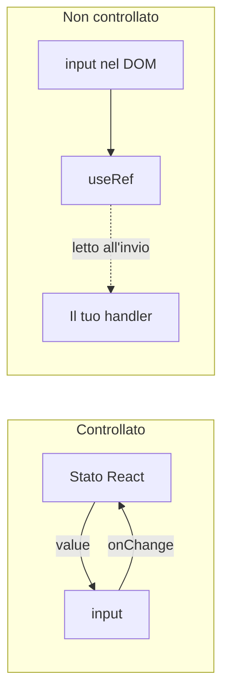

# Fondamenti di React per Sviluppatori Angular

> Una guida completa per gli sviluppatori Angular in transizione verso React

---

## 1. Understanding React: What It Is and Why It's Used

### Come React Aggiorna lo Schermo



Invece di toccare direttamente il DOM reale (come faresti con `document.querySelector` in vanilla JS, o tramite la change detection di Angular), React costruisce un albero in memoria a partire dal tuo JSX, lo confronta con quello precedente, e scrive nel browser solo la differenza. Questo è ciò che "UI dichiarativa" significa in pratica.

### Cos'è React?

React è una **libreria JavaScript** (non un framework come Angular) per la costruzione di interfacce utente, creata da Facebook nel 2013. Si concentra sul **livello di visualizzazione** della tua applicazione.

**Differenza chiave rispetto ad Angular:**
- **Angular**: Framework completo (routing, HTTP, form, ecc. integrati)
- **React**: Libreria focalizzata sui componenti UI (tu scegli le librerie aggiuntive)

### Perché React?

```
┌─────────────────────────────────────────────────┐
│           Principi Fondamentali di React         │
├─────────────────────────────────────────────────┤
│  • Architettura basata su Componenti            │
│  • Programmazione Dichiarativa                   │
│  • Virtual DOM per le Prestazioni                │
│  • Flusso Dati Unidirezionale                    │
│  • Impara una volta, scrivi ovunque              │
└─────────────────────────────────────────────────┘
```

**Filosofia Angular vs React:**

| Aspetto | Angular | React |
|---------|---------|-------|
| Tipo | Framework con opinioni | Libreria Flessibile |
| Linguaggio | TypeScript (obbligatorio) | JavaScript/TypeScript |
| Flusso Dati | Binding bidirezionale | Binding unidirezionale |
| Curva di Apprendimento | Più ripida | Più dolce |
| Aggiornamenti DOM | DOM Reale | DOM Virtuale |

---

## 2. Setting Up a React Development Environment

### La Pipeline di Build Moderna



Vite serve i tuoi sorgenti come ES Module nativi in sviluppo e applica patch nel browser a ogni salvataggio (Hot Module Replacement). Per la produzione passa a un bundler (esbuild/Rollup) per produrre un artefatto minificato e tree-shakato.

### Configurare l'Ambiente di Sviluppo

Per iniziare con React, hai diverse opzioni per creare un nuovo progetto.

#### Opzione 1: Vite (Raccomandato)

```bash
# Crea un nuovo progetto con Vite
npm create vite@latest mia-app-react -- --template react-ts
cd mia-app-react
npm install
npm run dev
```

#### Perché Vite?
- Avvio del server di sviluppo istantaneo
- Sostituzione dei moduli a caldo (HMR) velocissima
- Build ottimizzata per la produzione
- Supporto TypeScript nativo

---

## 3. JSX Syntax: The React Template Language

### Da JSX a JavaScript

```mermaid
graph LR
    JSX["&lt;Greeting name='Mario' /&gt;"] --> Babel[Babel / Vite]
    Babel --> Call["React.createElement(Greeting, &#123; name: 'Mario' &#125;)"]
    Call --> VNode["Nodo del Virtual DOM"]
```



JSX non è un nuovo linguaggio — è zucchero sintattico. Ogni elemento JSX viene compilato in una chiamata `React.createElement`. Ecco perché le parentesi graffe dentro JSX eseguono JavaScript reale: sei già dentro una chiamata di funzione.

### Cos'è JSX?

JSX (JavaScript XML) è un'estensione di sintassi che ti permette di scrivere codice simile all'HTML in JavaScript.

**Template Angular:**
```typescript
// user.component.html
<div class="user-card">
  <h2>{{ user.name }}</h2>
  <p>Età: {{ user.age }}</p>
</div>
```

**JSX di React:**
```jsx
// UserCard.jsx
const UserCard = ({ user }) => (
  <div className="user-card">
    <h2>{user.name}</h2>
    <p>Età: {user.age}</p>
  </div>
);
```

### Regole di Sintassi JSX

1. **Un elemento radice**: Ogni componente deve restituire un singolo elemento radice
2. **className** invece di `class`: Poiché `class` è una parola riservata in JS
3. **Espressioni con parentesi graffe**: Usa `{espressione}` per valori dinamici
4. **camelCase per gli attributi**: `onClick`, `onChange`, `htmlFor`

---

## 4. Components: Building Blocks of React

### Come si Renderizza un Albero di Componenti



Un'app React è semplicemente un albero di componenti. Ogni nodo renderizza i suoi figli e i dati scorrono verso il basso attraverso le props.

### Componenti: I Mattoni di React

In React, tutto è un componente. I componenti sono funzioni che restituiscono JSX.

```tsx
// Componente funzionale (modo moderno)
const Saluto = ({ nome }: { nome: string }) => {
  return <h1>Ciao, {nome}!</h1>;
};
```

---

## 5. Props: Passing Data Between Components

### Le Props Scendono, gli Eventi Salgono



Le props sono il modo in cui un genitore passa i dati ai figli. I figli non risalgono mai — se devono dire al genitore che qualcosa è successo (un click, un cambio di valore), il genitore gli passa una **funzione callback** come prop. Questa regola a senso unico è il cuore del "flusso di dati unidirezionale" di React.

### Props: Passare Dati tra Componenti

Le props sono il modo in cui React passa i dati dai componenti genitori ai componenti figli.

```tsx
interface CardUtenteProps {
  nome: string;
  email: string;
  età: number;
}

const CardUtente = ({ nome, email, età }: CardUtenteProps) => (
  <div>
    <h2>{nome}</h2>
    <p>{email}</p>
    <p>Età: {età}</p>
  </div>
);
```

---

## 6. State Management with useState Hook

### Il Ciclo Stato → Render



Il render di un componente è solo una chiamata di funzione. Chiamare il setter di `useState` dice a React: "la prossima volta che chiami la mia funzione, dammi un valore diverso." React allora rirenderizza quel componente (e il suo sottoalbero), calcola il nuovo Virtual DOM e applica solo le differenze.

### Gestione dello Stato con l'Hook useState

`useState` è l'hook fondamentale per gestire lo stato locale in un componente.

```tsx
const Contatore = () => {
  const [conteggio, setConteggio] = useState(0);

  return (
    <div>
      <p>Conteggio: {conteggio}</p>
      <button onClick={() => setConteggio(conteggio + 1)}>Incrementa</button>
      <button onClick={() => setConteggio(conteggio - 1)}>Decrementa</button>
    </div>
  );
};
```

---

## 7. Event Handling in React

### Cosa Succede Quando l'Utente Clicca



React avvolge gli eventi del DOM in un **SyntheticEvent** cross-browser e li indirizza all'handler che hai scritto nel JSX. L'handler di solito chiama un setter di stato, che riattiva il loop di render — lo stesso loop della sezione precedente.

### Gestione degli Eventi in React

La gestione degli eventi in React è simile all'HTML ma con alcune differenze:
- Usa **camelCase** per i nomi degli eventi (`onClick` invece di `onclick`)
- Passa una **funzione** come gestore, non una stringa

```tsx
const PulsanteAzione = ({ testo, onClick }: { testo: string; onClick: () => void }) => (
  <button onClick={onClick}>{testo}</button>
);
```

---

## 8. Conditional Rendering Techniques

### La Scala di Priorità

```mermaid
graph TD
    Start[Chiamata di render] --> Q1{caricamento?}
    Q1 -->|sì| Spinner[Mostra spinner]
    Q1 -->|no| Q2{errore?}
    Q2 -->|sì| ErrorMsg[Mostra errore]
    Q2 -->|no| Q3{ci sono dati?}
    Q3 -->|sì| Content[Mostra contenuto]
    Q3 -->|no| Empty[Mostra stato vuoto]
```



Le UI reali devono quasi sempre esprimere "se caricamento mostra A, se errore mostra B, altrimenti mostra C". In React non esiste `*ngIf` — scrivi semplicemente il condizionale in JavaScript con return anticipati, ternari, o `&&`. L'ordine conta: verifica per primo lo stato più specifico.

### Tecniche di Rendering Condizionale

React offre diversi modi per il rendering condizionale:

```tsx
const MessaggioStato = ({ caricamento, errore, dati }) => {
  if (caricamento) return <p>Caricamento...</p>;
  if (errore) return <p>Errore: {errore}</p>;
  if (dati) return <p>{dati}</p>;
  return null;
};
```

---

## 9. Lists and Keys: Rendering Multiple Elements

### Perché le Chiavi Sono Importanti



Le chiavi permettono a React di abbinare gli elementi tra un render e l'altro. Senza chiavi, inserire un elemento in cima alla lista costringe React a ricostruirli tutti; con chiavi stabili, riutilizza quelli invariati e monta solo il nuovo. Usa un identificatore stabile dai tuoi dati — mai l'indice dell'array se la lista può essere riordinata.

### Liste e Chiavi: Renderizzare Elementi Multipli

Usa il metodo `.map()` per renderizzare liste di elementi. Ogni elemento necessita di una prop `key` unica.

```tsx
const ListaTodo = ({ todos }) => (
  <ul>
    {todos.map(todo => (
      <li key={todo.id}>
        {todo.testo} {todo.completato ? '✅' : '⏳'}
      </li>
    ))}
  </ul>
);
```

---

## 10. Forms and Controlled Components

### Controllati vs Non Controllati — Dove Vive il Valore?



In un input **controllato** la fonte di verità è lo stato React — ogni keystroke passa per `setState`. In un input **non controllato** il valore vive nel DOM, e lo leggi da una ref quando serve. Controllato è la scelta predefinita per form con validazione; non controllato è la via di fuga per flussi performance-sensitive.

### Form e Componenti Controllati

In React, gli input dei form sono tipicamente "controllati" — il loro valore è guidato dallo stato di React.

```tsx
const FormContatto = ({ onSubmit }) => {
  const [nome, setNome] = useState('');
  const [email, setEmail] = useState('');

  const gestisciInvio = (e) => {
    e.preventDefault();
    onSubmit({ nome, email });
  };

  return (
    <form onSubmit={gestisciInvio}>
      <input value={nome} onChange={(e) => setNome(e.target.value)} />
      <input value={email} onChange={(e) => setEmail(e.target.value)} />
      <button type="submit">Invia</button>
    </form>
  );
};
```

---

## Summary: Key Takeaways for Angular Developers

### Riepilogo: Punti Chiave per Sviluppatori Angular

- React è una **libreria**, non un framework — tu scegli lo stack
- **JSX** sostituisce i template HTML separati
- **Componenti funzionali** con hooks sono lo standard moderno
- **Props** fluiscono verso il basso, **eventi** risalgono verso l'alto
- **useState** gestisce lo stato locale
- I **componenti controllati** gestiscono i dati dei form
