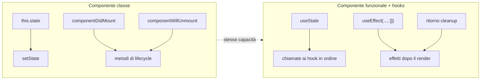
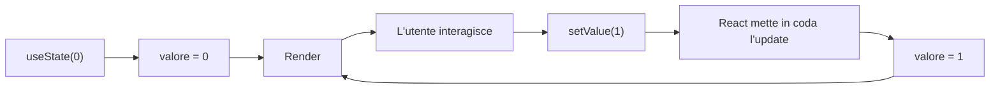
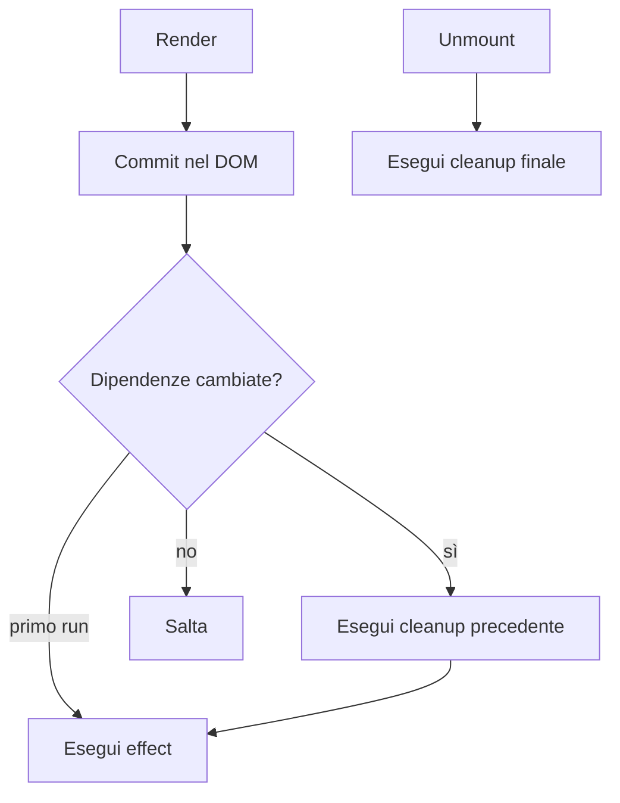
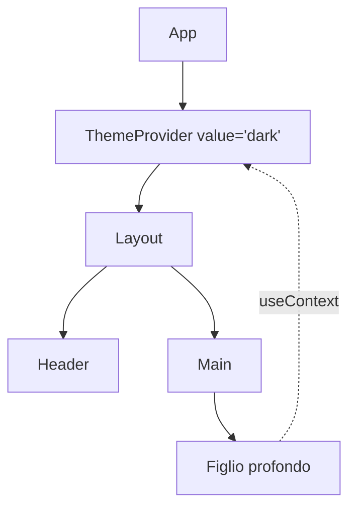
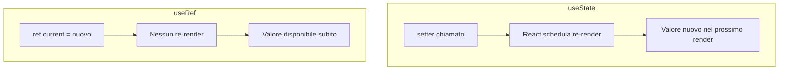
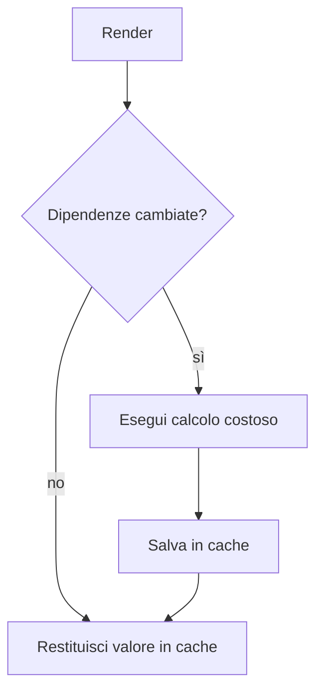
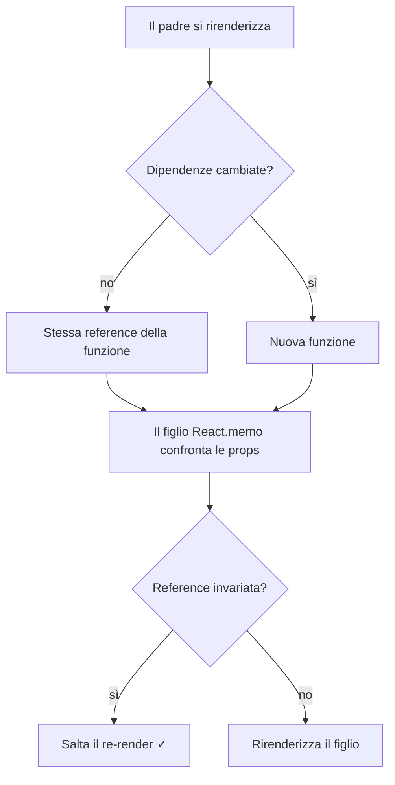
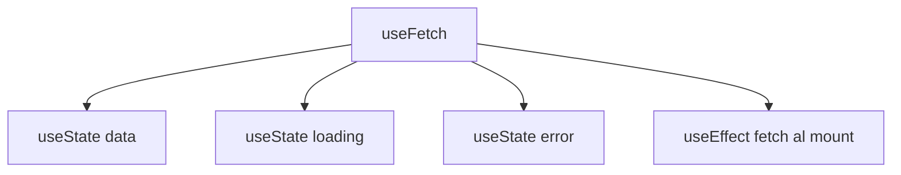
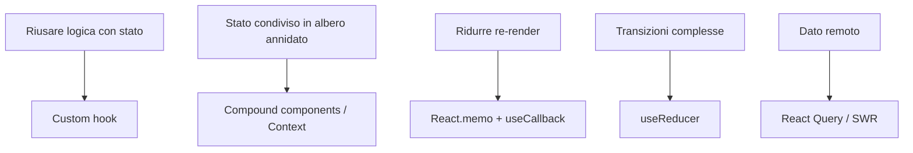

# Hooks React: Approfondimento per Sviluppatori Angular

> Una guida completa agli hooks di React, con paralleli al modello mentale Angular

---

## 1. Understanding Hooks: Paradigm and Architecture

### Cosa Sostituiscono gli Hooks Rispetto alle Classi



Gli hooks non aggiungono funzionalità nuove rispetto alle classi — sono un meccanismo parallelo che dà ai componenti funzionali tutto ciò che avevano le classi, con un modello mentale più semplice. I metodi di lifecycle collassano in una sola primitiva (`useEffect`) e `this.state` diventa una variabile locale.

### Cosa Sono gli Hooks?

Gli **hooks** sono funzioni speciali introdotte in React 16.8 che ti permettono di "agganciare" lo stato e altre funzionalità di React all'interno dei componenti funzionali. Prima degli hooks era necessario un componente di classe.

### Il Cambio di Paradigma

| Classi (vecchio) | Hooks (moderno) |
|------------------|-----------------|
| `class extends Component` | `function MyComp() {}` |
| `this.state` | `useState()` |
| `componentDidMount` | `useEffect(..., [])` |
| `componentWillUnmount` | cleanup dentro `useEffect` |
| `componentDidUpdate` | `useEffect` con dipendenze |

### Principi Fondamentali

1. **Solo a livello superiore**: non chiamare gli hooks dentro condizioni, cicli o funzioni annidate.
2. **Solo da componenti React** o da altri custom hooks.
3. **Ordine stabile**: React identifica ogni hook per la sua posizione nell'ordine di chiamata.

### Gestione dello Stato Angular vs React

- **Angular**: stato come proprietà di classe, decoratori, servizi iniettabili.
- **React**: stato come variabili locali del componente o context globale.

---

## 2. useState: State Management Fundamentals

### Anatomia di un Aggiornamento di Stato



`useState` non muta il valore corrente: pianifica un nuovo render in cui la chiamata `useState` restituirà un valore diverso. È per questo che leggere lo stato subito dopo aver chiamato il setter restituisce ancora il valore vecchio — il render aggiornato non è ancora avvenuto.

### Sintassi di Base

```tsx
const [valore, setValore] = useState<number>(0);
```

`useState` restituisce una coppia: il valore corrente e una funzione per aggiornarlo.

### Aggiornamenti Funzionali

Quando il nuovo valore dipende dal precedente, usa la forma funzionale per evitare stati obsoleti:

```tsx
setConteggio(prev => prev + 1);
```

### Strutture Complesse

Per oggetti o array ricorda di creare una nuova reference (immutabilità):

```tsx
setUtente(prev => ({ ...prev, email: 'nuovo@example.com' }));
setLista(prev => [...prev, nuovoItem]);
```

### Inizializzazione Lazy

Se l'inizializzazione è costosa, passa una funzione:

```tsx
const [stato, setStato] = useState(() => calcolaStatoIniziale());
```

### Batching

React 18 raggruppa automaticamente più aggiornamenti dentro lo stesso ciclo di rendering, anche all'interno di callback asincroni.

---

## 3. useEffect: Side Effects and Lifecycle Orchestration

### Quando Viene Eseguito un Effetto



`useEffect` non è il sostituto sincrono di `componentDidMount`: viene eseguito **dopo** che il browser ha dipinto. La funzione di cleanup che restituisci viene eseguita prima del prossimo effetto o all'unmount — è la stessa cosa che faceva `componentWillUnmount`, ma più componibile.

### Concetto

`useEffect` esegue codice **dopo** il commit del rendering. È il sostituto di `componentDidMount`, `componentDidUpdate` e `componentWillUnmount`.

### Sintassi

```tsx
useEffect(() => {
  // side effect
  return () => {
    // cleanup (opzionale)
  };
}, [dipendenze]);
```

### Array di Dipendenze

- `[]` → esegue solo al mount
- `[a, b]` → esegue al mount e quando `a` o `b` cambiano
- omesso → esegue dopo ogni render (raramente quello che vuoi)

### Pattern di Fetching

```tsx
useEffect(() => {
  let cancellato = false;
  fetch('/api/utenti')
    .then(r => r.json())
    .then(data => { if (!cancellato) setUtenti(data); });
  return () => { cancellato = true; };
}, []);
```

### Sottoscrizioni ed Event Listener

Ricordati sempre il cleanup per evitare memory leak:

```tsx
useEffect(() => {
  const handler = () => setLargh(window.innerWidth);
  window.addEventListener('resize', handler);
  return () => window.removeEventListener('resize', handler);
}, []);
```

### Effetti Multipli

Suddividi le responsabilità in più `useEffect`: uno per concern, non un mega-effetto.

---

## 4. useContext: Global State Consumption

### Provider in Cima, Consumer Ovunque



Un Provider rende un valore disponibile a tutto il sottoalbero. Qualunque componente discendente può leggerlo con `useContext`, senza passare prop attraverso i livelli intermedi. È la soluzione di React al "prop drilling" per dati globali come tema, lingua, utente autenticato.

### Architettura del Context API

Il context evita il "prop drilling" passando dati attraverso l'albero senza propagarli esplicitamente a ogni livello.

```tsx
const TemaContext = createContext<Tema>('chiaro');

function App() {
  return (
    <TemaContext.Provider value="scuro">
      <Pagina />
    </TemaContext.Provider>
  );
}

function Pagina() {
  const tema = useContext(TemaContext);
  return <div data-tema={tema}>…</div>;
}
```

### Hook Personalizzato con Guardia

```tsx
function useTema() {
  const ctx = useContext(TemaContext);
  if (ctx === undefined) throw new Error('useTema deve essere usato dentro TemaProvider');
  return ctx;
}
```

### Ottimizzazione delle Performance

Ogni componente che consuma un context si re-renderizza quando il valore cambia. Suddividi i context per scope di aggiornamento se la frequenza è alta.

### Servizi Angular vs Context React

- **Angular**: servizi iniettati tramite DI, condivisione tramite singleton.
- **React**: provider che avvolgono il sottoalbero, consumo tramite `useContext`.

---

## 5. useRef: DOM Manipulation and Value Persistence

### useState vs useRef in Una Slide



Usa `useState` quando il valore deve **comparire nella UI**. Usa `useRef` quando devi **ricordare qualcosa fra render** senza scatenare un nuovo render — riferimenti a nodi DOM, ID di timer, valori precedenti, lock di concorrenza.

### Concetto

`useRef` restituisce un oggetto mutabile la cui proprietà `.current` persiste tra i render senza causare re-rendering.

### Casi d'Uso

1. Accedere a nodi DOM (focus, scroll, misure).
2. Memorizzare valori che sopravvivono ai render ma non scatenano aggiornamenti.
3. Conservare ID di timer, sottoscrizioni, valori precedenti.

### Esempio: Focus

```tsx
const inputRef = useRef<HTMLInputElement>(null);

return (
  <>
    <input ref={inputRef} />
    <button onClick={() => inputRef.current?.focus()}>Metti a fuoco</button>
  </>
);
```

### Valori Precedenti

```tsx
function usaPrecedente<T>(valore: T) {
  const ref = useRef<T>();
  useEffect(() => { ref.current = valore; }, [valore]);
  return ref.current;
}
```

### ViewChild Angular vs useRef React

- **Angular**: `@ViewChild('elemento') ref!: ElementRef;`
- **React**: `const ref = useRef<HTMLDivElement>(null);` poi `<div ref={ref} />`

---

## 6. useMemo: Computational Memoization

### Cache di un Calcolo Pesante



`useMemo` memoizza il **risultato** di una funzione. Se le dipendenze non cambiano, il calcolo non viene rieseguito — viene restituito il valore precedente. Utile per filtraggi/ordinamenti pesanti, ma non per calcoli banali: il costo della memoizzazione stessa non è gratis.

### Quando Usarlo

`useMemo` memoizza il risultato di un calcolo costoso, ricalcolandolo solo quando cambiano le dipendenze.

```tsx
const ordinati = useMemo(
  () => items.slice().sort(comparatorePesante),
  [items]
);
```

### Preservare l'Uguaglianza Referenziale

Utile per evitare che componenti memoizzati con `React.memo` si re-renderizzino a causa di nuove reference su ogni render del padre.

### Quando NON Usarlo

- Per calcoli economici.
- Su valori primitivi.
- Come "premature optimization" senza una misurazione concreta.

---

## 7. useCallback: Function Memoization

### Perché Conta la Stabilità della Reference



Ogni render crea nuovi oggetti funzione, a meno che tu non opti diversamente. `useCallback` restituisce la **stessa** reference fino a quando non cambiano le dipendenze. Conta solo se la funzione viene passata a un figlio avvolto in `React.memo` o usata come dipendenza di un altro hook — per i normali handler DOM, `useCallback` è solo overhead senza beneficio.

### Concetto

`useCallback` è un caso speciale di `useMemo` per memoizzare funzioni:

```tsx
const onClick = useCallback(() => doSomething(id), [id]);
```

### Quando Serve Davvero

- Quando la funzione viene passata a un figlio memoizzato (`React.memo`).
- Quando la funzione è una dipendenza di un altro hook (`useEffect`, `useMemo`).

### Quando NON Serve

Se passi la funzione solo a un `<button>` nativo, `useCallback` non porta beneficio — anzi aggiunge overhead.

---

## 8. useReducer: Complex State Logic

### Il Ciclo Action → Reducer → State

```mermaid
graph LR
    UI[UI] -->|dispatch(action)| Reducer["reducer(state, action)"]
    Reducer --> NewState[Nuovo stato]
    NewState --> Render[Re-render]
    Render --> UI
```

`useReducer` è `useState` "amplificato": invece di chiamare setter sparsi, descrivi le transizioni come **azioni tipizzate**, e un reducer puro produce il nuovo stato. È il pattern Redux, ma locale a un componente — niente store globale, niente boilerplate.

### Pattern Reducer

Per stati con transizioni complesse, `useReducer` offre un approccio prevedibile ispirato a Redux:

```tsx
type Azione =
  | { type: 'AGGIUNGI'; testo: string }
  | { type: 'TOGGLE'; id: number }
  | { type: 'ELIMINA'; id: number };

function reducer(stato: Todo[], azione: Azione): Todo[] {
  switch (azione.type) {
    case 'AGGIUNGI': return [...stato, { id: Date.now(), testo: azione.testo, fatto: false }];
    case 'TOGGLE': return stato.map(t => t.id === azione.id ? { ...t, fatto: !t.fatto } : t);
    case 'ELIMINA': return stato.filter(t => t.id !== azione.id);
  }
}

const [todos, dispatch] = useReducer(reducer, []);
```

### useReducer + Context

Combinazione tipica per uno store globale leggero senza Redux:

```tsx
const TodoContext = createContext<{ stato: Todo[]; dispatch: Dispatch<Azione> } | null>(null);
```

### useState vs useReducer

| Usa `useState` quando | Usa `useReducer` quando |
|-----------------------|-------------------------|
| Stato semplice | Stato complesso con molte transizioni |
| Aggiornamenti indipendenti | Aggiornamenti correlati tra loro |
| Poche azioni | Molte azioni tipizzate |

### NgRx Angular vs useReducer

Stessa filosofia: action → reducer puro → nuovo stato. `useReducer` è il "NgRx leggero" senza store globale.

---

## 9. Custom Hooks: Abstraction and Reusability

### Un Custom Hook è Composizione



Un custom hook è una funzione che inizia con `use` e compone altri hook. Estrai logica con stato — fetching, sottoscrizioni, debounce, localStorage — in funzioni riutilizzabili senza creare componenti né HOC.

### Filosofia

I custom hooks sono il meccanismo principale di riuso della logica con stato. Sono semplici funzioni che iniziano con `use` e possono usare altri hooks al loro interno.

### Convenzione di Nomi

Sempre `useQualcosa`. Il prefisso `use` permette a React di applicare le regole degli hooks.

### Esempio: useToggle

```tsx
function useToggle(iniziale = false) {
  const [valore, setValore] = useState(iniziale);
  const toggle = useCallback(() => setValore(v => !v), []);
  return [valore, toggle] as const;
}
```

### Esempio: useLocalStorage

```tsx
function useLocalStorage<T>(chiave: string, iniziale: T) {
  const [valore, setValore] = useState<T>(() => {
    const raw = localStorage.getItem(chiave);
    return raw ? JSON.parse(raw) : iniziale;
  });
  useEffect(() => {
    localStorage.setItem(chiave, JSON.stringify(valore));
  }, [chiave, valore]);
  return [valore, setValore] as const;
}
```

### Esempio: useFetch

```tsx
function useFetch<T>(url: string) {
  const [dati, setDati] = useState<T | null>(null);
  const [caricamento, setCaricamento] = useState(true);
  useEffect(() => {
    let cancellato = false;
    fetch(url).then(r => r.json()).then(d => { if (!cancellato) setDati(d); }).finally(() => { if (!cancellato) setCaricamento(false); });
    return () => { cancellato = true; };
  }, [url]);
  return { dati, caricamento };
}
```

---

## 10. Advanced Patterns and Best Practices

### Quale Strumento per Quale Esigenza



Non esiste un hook "migliore" in assoluto. Scegli in base alla forma del problema: stato locale, condiviso, derivato, asincrono. Quando una soluzione diventa scomoda, è il segnale che stai usando l'astrazione sbagliata.

### Pattern Avanzati

- **State reducer pattern**: esponi un reducer dal custom hook per dare il controllo al consumer.
- **Compound hooks**: composizione di più hook primitivi in un'unica API.
- **Lazy state init** per evitare ricalcoli pesanti al mount.

### Best Practices

1. **Mantieni gli hooks piccoli e focalizzati**.
2. **Sempre dipendenze esplicite** in `useEffect`/`useMemo`/`useCallback`.
3. **Cleanup** per qualunque sottoscrizione o effetto asincrono.
4. **Testa i custom hooks** con `@testing-library/react-hooks` o `renderHook`.
5. **Documenta i side effect** del tuo custom hook.

---

## Conclusion: Mastering React Hooks

### Conclusione

Gli hooks sostituiscono la maggior parte delle funzionalità delle classi con un'API più componibile. Per uno sviluppatore Angular il modello mentale cambia: invece di lifecycle, decoratori e DI, ragiona in termini di **funzioni composte** che descrivono lo stato e gli effetti del componente in modo dichiarativo.
