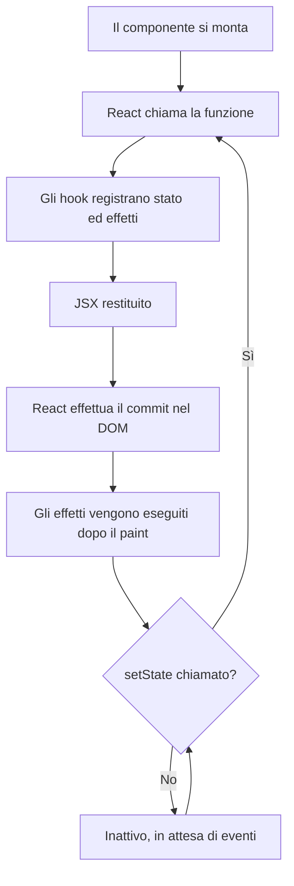
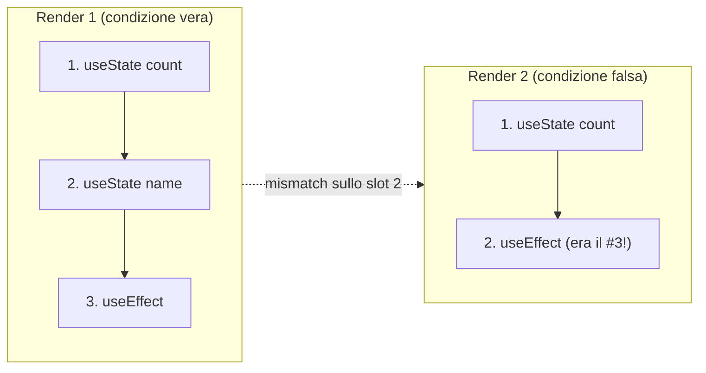
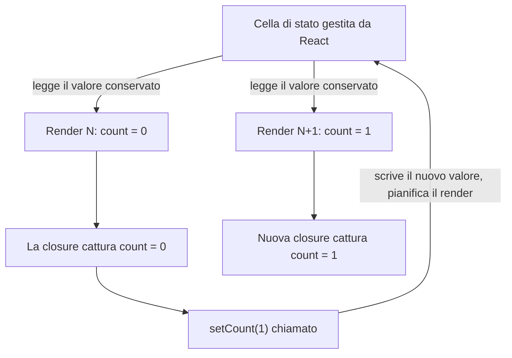
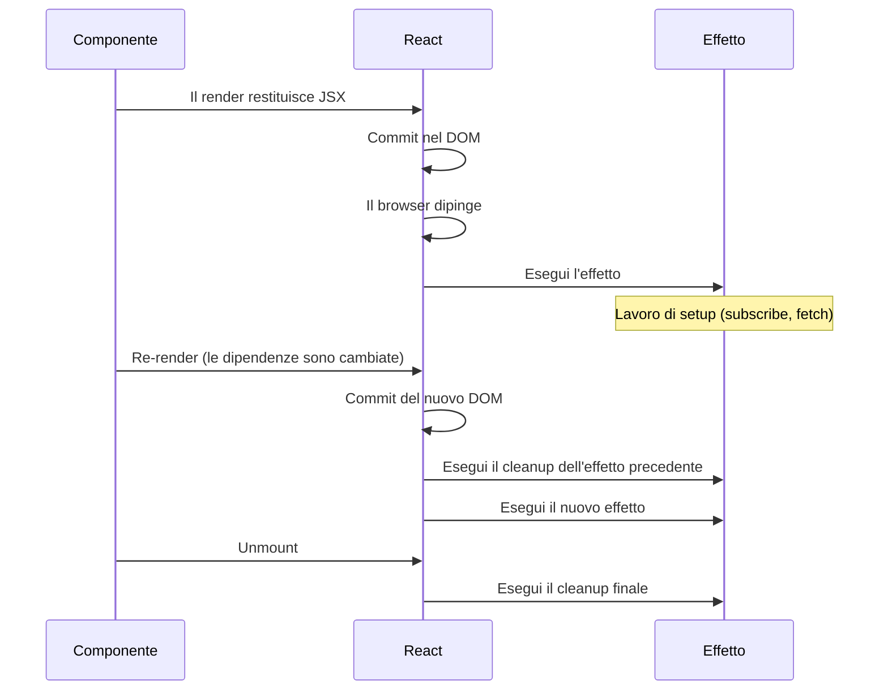
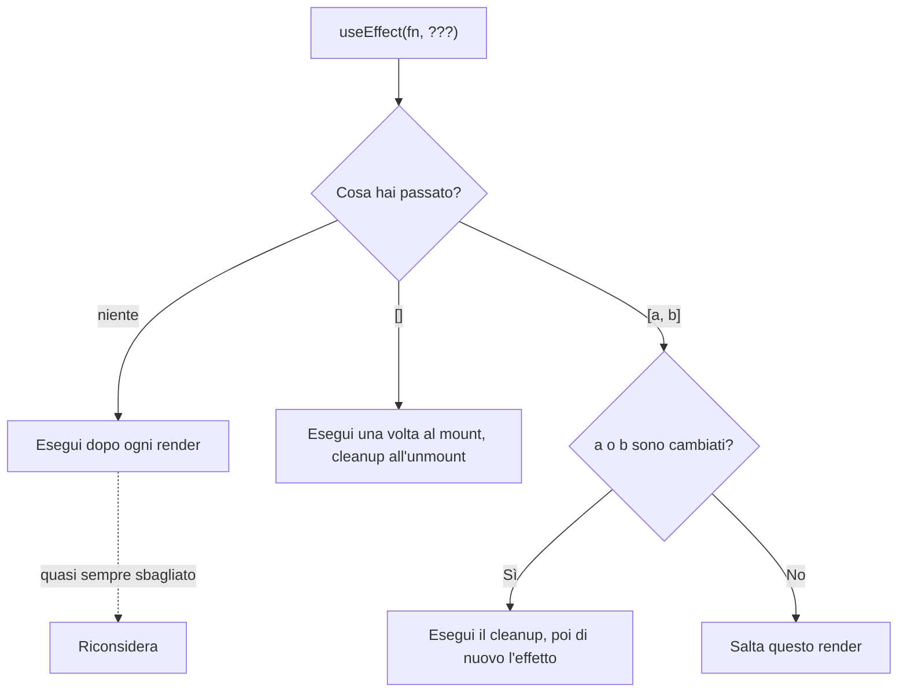
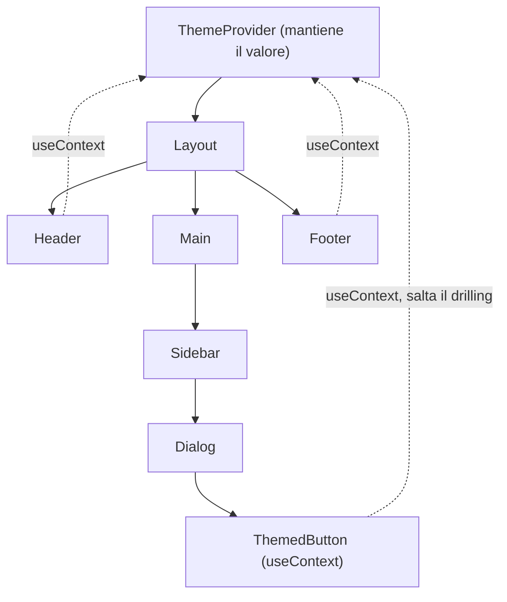
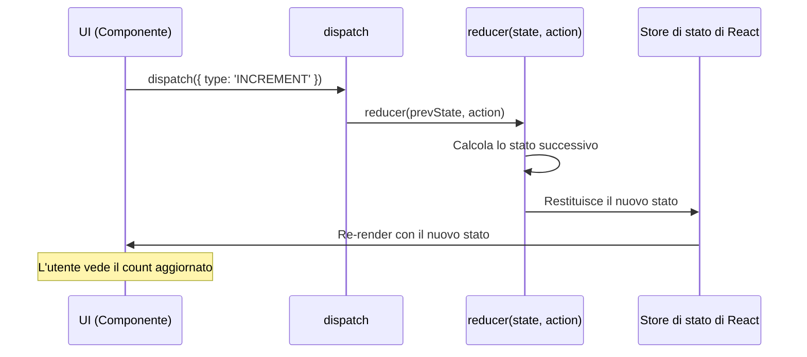
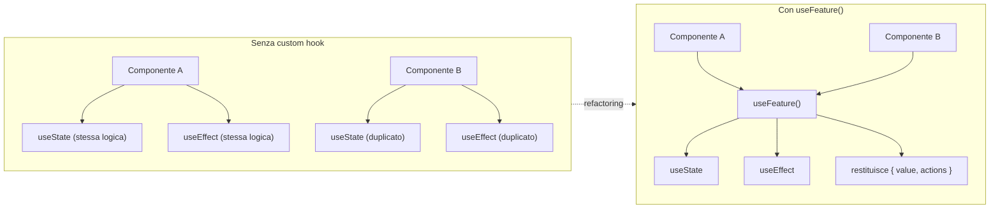
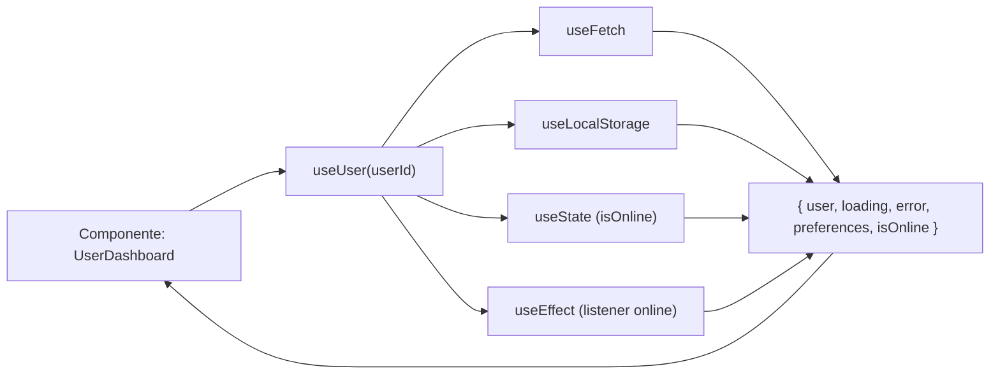

# React Hooks: Aggiungere Stato ed Effetti ai Componenti

> Un approfondimento pratico sugli hook che alimentano i componenti React moderni: cosa risolve ciascuno, quando usarlo e le insidie da evitare.

---

## Indice

1. [Comprendere gli Hook](#1-comprendere-gli-hook)
2. [useState](#2-usestate)
3. [useEffect](#3-useeffect)
4. [useContext](#4-usecontext)
5. [useRef](#5-useref)
6. [useMemo](#6-usememo)
7. [useCallback](#7-usecallback)
8. [useReducer](#8-usereducer)
9. [Custom Hook](#9-custom-hook)
10. [Pattern Avanzati](#10-pattern-avanzati)

---

## 1. Comprendere gli Hook

### Cosa sono gli hook

Nel Modulo 01 hai scritto componenti — funzioni che prendono props e restituiscono JSX. Hai anche conosciuto il tuo primo hook, `useState`. Gli hook sono semplici funzioni, ma hanno un superpotere che i componenti del Modulo 01 non avevano: permettono a una funzione semplice di ricordare cose tra un render e l'altro, reagire ai cambiamenti e raggiungere il mondo fuori dal componente.

Un componente senza hook è puro: stesse props in ingresso, stesso JSX in uscita. Va benissimo per un pulsante o una card, ma non per niente di interessante. Un contatore deve ricordare il suo conteggio. Una casella di ricerca deve recuperare risultati. Un modal deve mettere a fuoco il suo input quando si apre. Gli hook sono il modo in cui un componente funzionale acquisisce queste capacità rimanendo una funzione.

Il nome "hook" viene dall'idea che ti stai "agganciando" alle interiora di React — il suo loop di render, il suo storage di stato, il suo scheduling — dall'interno di una chiamata di funzione altrimenti ordinaria. React 16.8 li ha introdotti nel 2019, e da allora sono il modo di default per scrivere componenti.

Il diagramma qui sotto mostra dove si inseriscono gli hook nel ciclo di render. La tua funzione componente è solo un passo in un ciclo guidato da React — gli hook sono il modo in cui ti colleghi a esso.



### Come si collegano gli hook a quello che già sai

Se hai scritto JavaScript prima di React, gli hook all'inizio possono sembrare strani. Una funzione normale in JavaScript ricomincia da capo a ogni chiamata. Le variabili locali scompaiono nel momento in cui la funzione restituisce un valore. Allora come fa `useState` a "ricordare" un valore tra una chiamata e l'altra?

Il trucco è che React chiama la tua funzione componente in un contesto controllato. Prima di chiamare il tuo componente, React cerca quale componente sta renderizzando, in quale slot di chiamata ti trovi, e legge il valore che ha conservato l'ultima volta. Quando chiami `useState(0)`, non stai davvero creando una nuova variabile — stai dicendo a React, "dammi il valore che hai per me, e una funzione per aggiornarlo". Questo è più vicino a una closure di cui React si occupa per te che a una normale variabile locale.

Questo spiega l'unica regola che inganna tutti la prima volta.

### Le regole degli hook

Ci sono due regole, ed entrambe seguono da come React traccia quale valore appartiene a quale chiamata:

1. **Chiama gli hook solo al livello superiore del tuo componente.** Mai dentro un `if`, un ciclo o una funzione annidata. React identifica ogni chiamata di hook dall'ordine in cui appare durante il render. Se salti una chiamata su un render e non sul successivo, ogni hook successivo riceverà il valore sbagliato.

2. **Chiama gli hook solo da funzioni React.** Cioè da un componente o da un altro hook (che per convenzione inizia con `use`). Chiamare un hook da una normale funzione di utility non funziona, perché React non sta tracciando quella chiamata.

Il plugin ESLint ufficiale `eslint-plugin-react-hooks` impone entrambe le regole. Tienilo attivo.

Per capire perché conta la regola dell'ordine, immagina due render affiancati. React identifica ogni hook in base alla sua posizione nella sequenza di chiamate. Salta una chiamata su un render, e ogni hook successivo si sposta — leggono tutti lo slot sbagliato.



```tsx
function Good({ user }) {
  const [count, setCount] = useState(0);          // top level: ok
  const [name, setName] = useState(user.name);    // top level: ok

  if (user.isAdmin) {
    // ...
  }

  return <div>{count}</div>;
}

function Bad({ user }) {
  if (user.isAdmin) {
    const [count, setCount] = useState(0);        // dentro un if: non va bene
  }

  for (const item of user.items) {
    const [open, setOpen] = useState(false);      // dentro un ciclo: non va bene
  }

  return null;
}
```

Gli hook che userai quotidianamente sono un piccolo insieme: `useState`, `useEffect`, `useContext`, `useRef`, `useMemo`, `useCallback` e `useReducer`. Una volta capiti questi sette, i custom hook ti permettono di impacchettarli e riusarli.

---

## 2. useState

### Il problema che risolve

Hai già incontrato `useState` nel Modulo 01, quindi questa sezione è in parte un ripasso e in parte uno sguardo più ravvicinato agli angoli che fanno inciampare le persone.

Un componente è una funzione. Ogni volta che React lo renderizza, la funzione viene eseguita da zero — ogni variabile locale viene creata nuova. Va benissimo per componenti in sola lettura, ma è inutile per qualunque cosa debba cambiare nel tempo. Un contatore che si resetta a zero a ogni render non è un contatore.

`useState` risolve il problema chiedendo a React di tenere un valore per te tra i render, e di rieseguire il tuo componente quando quel valore cambia.

### Sintassi di base

```tsx
import { useState } from 'react';

const [state, setState] = useState(initialValue);
//    |       |              |
//    |       |              +-- Stato iniziale, o una funzione che lo restituisce
//    |       +-- Setter: chiamarlo pianifica un re-render
//    +-- Valore di stato corrente per questo render
```

La coppia che ricevi è solo un array, destrutturato per comodità. Il primo elemento è il valore corrente durante questo render; il secondo è una funzione setter. Chiamare il setter fa due cose: salva il nuovo valore, e dice a React di renderizzare di nuovo il componente. A quel prossimo render, `useState` ti restituisce il nuovo valore.

Un punto comune di confusione: il setter non cambia `state` immediatamente. La variabile `state` corrente è catturata per questo render. Vedi il nuovo valore solo al prossimo render.

Questo diagramma mostra il modello mentale: React possiede il valore conservato, te ne consegna uno snapshot per il render, e ricostruisce uno snapshot fresco alla prossima occasione.



```tsx
function Counter() {
  const [count, setCount] = useState(0);

  function handleClick() {
    setCount(count + 1);
    console.log(count); // ancora il valore vecchio durante questo render
  }

  return <button onClick={handleClick}>{count}</button>;
}
```

### Stato primitivo

Lo stato può contenere qualsiasi valore: numeri, stringhe, booleani, oggetti, array, persino `null`.

```tsx
function ProfileForm() {
  const [count, setCount] = useState(0);
  const [isActive, setIsActive] = useState(false);
  const [username, setUsername] = useState('');

  const increment = () => setCount(count + 1);
  const toggleActive = () => setIsActive(!isActive);
  const handleInputChange = (event) => setUsername(event.target.value);

  return (
    <div>
      <p>Contatore: {count}</p>
      <button onClick={increment}>Incrementa</button>
      <p>Stato: {isActive ? 'Attivo' : 'Inattivo'}</p>
      <button onClick={toggleActive}>Cambia</button>
      <input value={username} onChange={handleInputChange} />
    </div>
  );
}
```

### Aggiornamenti funzionali

Quando il prossimo stato dipende dal precedente, passa una funzione al setter invece di un valore. La funzione riceve lo stato più recente e restituisce quello nuovo.

Questo conta perché chiamare il setter più volte di fila usa lo *stesso* `count` catturato ogni volta:

```tsx
function AdvancedCounter() {
  const [count, setCount] = useState(0);

  // Sbagliato: entrambe le chiamate vedono il valore originale di count
  const incrementTwiceWrong = () => {
    setCount(count + 1);
    setCount(count + 1); // usa ancora lo stesso `count` catturato
  };

  // Giusto: ogni chiamata riceve lo stato più recente
  const incrementTwiceCorrect = () => {
    setCount(prev => prev + 1);
    setCount(prev => prev + 1);
  };

  return (
    <div>
      <p>Count: {count}</p>
      <button onClick={incrementTwiceCorrect}>+2</button>
    </div>
  );
}
```

La regola pratica: se il nuovo stato è derivato dal vecchio (un toggle, un incremento, un append), usa la forma funzionale. Se stai impostando il valore da qualche altra parte (un evento di input, una risposta da fetch), passare il valore direttamente va bene.

### Oggetti e array

Lo stato va trattato come immutabile. Non mutare mai un oggetto o un array direttamente — crea sempre uno nuovo. React decide se rirenderizzare confrontando la nuova reference di stato con quella vecchia con `Object.is`; se muti sul posto, la reference non cambia e il componente non si aggiorna.

```tsx
function UserProfileManager() {
  const [user, setUser] = useState({
    firstName: 'Marco',
    lastName: 'Rossi',
    age: 28,
    address: {
      city: 'Milano',
      country: 'Italia'
    }
  });

  // Merge superficiale: spread dell'oggetto precedente, sovrascrivi un campo
  const updateFirstName = (newName) => {
    setUser(prevUser => ({
      ...prevUser,
      firstName: newName
    }));
  };

  // Update annidato: spread su ogni livello che vuoi preservare
  const updateCity = (newCity) => {
    setUser(prevUser => ({
      ...prevUser,
      address: {
        ...prevUser.address,
        city: newCity
      }
    }));
  };

  const [items, setItems] = useState([]);

  const addItem = (item) => {
    setItems(prevItems => [...prevItems, item]);
  };

  const removeItem = (id) => {
    setItems(prevItems => prevItems.filter(item => item.id !== id));
  };

  const updateItem = (id, updates) => {
    setItems(prevItems =>
      prevItems.map(item =>
        item.id === id ? { ...item, ...updates } : item
      )
    );
  };

  return null;
}
```

Il toolkit standard per gli array: `filter` per rimuovere, `map` per aggiornare, spread (`[...prev, newItem]`) per aggiungere. Evita `push`, `splice`, `sort`, `reverse` — mutano.

> Se gli update annidati diventano dolorosi, è un indizio che dovresti dividere in più chiamate a `useState` o passare a `useReducer`. La sezione 8 copre quest'ultimo.

### Inizializzazione lazy

Il valore iniziale che passi a `useState` viene usato solo al primo render — ma l'espressione viene comunque valutata a ogni render, anche se il risultato viene scartato. Se calcolarla è costoso, passa una funzione. React la chiama una sola volta.

```tsx
function ExpensiveComponent() {
  // Sbagliato: computeExpensiveValue() viene eseguito a ogni render, risultato scartato
  const [data, setData] = useState(computeExpensiveValue());

  // Giusto: la funzione viene eseguita solo al primo render
  const [data, setData] = useState(() => computeExpensiveValue());

  return <div>{data}</div>;
}

function computeExpensiveValue() {
  console.log('Calcolo valore costoso...');
  let result = 0;
  for (let i = 0; i < 1000000; i++) {
    result += Math.random();
  }
  return result;
}
```

Lo stesso pattern si applica a qualsiasi cosa legga da `localStorage` o faccia il parsing di JSON all'avvio — avvolgilo in una funzione.

### Batching automatico

React 18 raggruppa gli aggiornamenti di stato che avvengono nello stesso evento o microtask. Se chiami più setter da un singolo event handler, React li elabora insieme e renderizza una volta, non una volta per setter.

```tsx
function BatchingExample() {
  const [count, setCount] = useState(0);
  const [flag, setFlag] = useState(false);

  const handleClick = () => {
    setCount(c => c + 1);
    setFlag(f => !f);
    // Solo un re-render
  };

  const handleAsyncClick = async () => {
    await fetchData();
    setCount(c => c + 1);
    setFlag(f => !f);
    // Ancora batchato in React 18
  };

  console.log('Render');

  return <button onClick={handleClick}>Aggiorna</button>;
}
```

Di solito non devi pensarci — è lì per rendere gli aggiornamenti reattivi. L'unico caso in cui conta è quando vuoi specificamente leggere lo stato tra gli aggiornamenti, cosa rara.

---

## 3. useEffect

### Il problema che risolve

Finora i tuoi componenti sono autocontenuti: prendono props, tengono stato, restituiscono JSX. Ma le applicazioni reali devono fare cose verso il mondo esterno. Fetch da un'API. Impostare un timer. Sottoscriversi a un WebSocket. Leggere la dimensione della finestra. Aggiornare il titolo del documento. Niente di tutto ciò appartiene dentro l'espressione JSX che descrive la tua UI.

`useEffect` è il modo che React ha per dire: "ecco del codice che voglio tu esegua *dopo* aver consegnato il mio render allo schermo". È il ponte tra la logica di rendering pura del tuo componente e tutto ciò che non è puro.

In concreto, ovunque scriveresti codice come questo in JavaScript puro:

```js
// Al caricamento della pagina:
window.addEventListener('resize', handleResize);

// Più tardi, quando hai finito:
window.removeEventListener('resize', handleResize);
```

…dentro un componente lo scrivi come un `useEffect` con una funzione di cleanup. L'hook lega automaticamente il setup e il cleanup al ciclo di vita del componente.

### Cosa conta come effetto collaterale

Un effetto collaterale è qualsiasi cosa che esca dal componente:

- Fare fetch di dati da un'API
- Leggere o scrivere `localStorage`, `sessionStorage` o cookie
- Impostare un `setInterval`, `setTimeout`, `WebSocket` o `addEventListener`
- Toccare il DOM in modo imperativo (mettere a fuoco un input, scorrere, misurare)
- Inviare eventi di analytics

Se un pezzo di codice calcola solo un valore da props e stato, non è un effetto collaterale — scrivilo come espressione normale nel corpo del componente. Ricorri a `useEffect` solo quando deve succedere qualcosa al di fuori del componente.

### Sintassi di base

```tsx
useEffect(() => {
  // Eseguito dopo il commit del render al DOM
  return () => {
    // Cleanup opzionale, eseguito prima del prossimo effetto o all'unmount del componente
  };
}, [dependencies]);
```

Tre parti:

- La **funzione effetto** viene eseguita dopo ogni render in cui è autorizzata a essere eseguita.
- La **funzione di cleanup** opzionale che restituisce viene eseguita prima della prossima esecuzione dell'effetto, e una volta finale quando il componente viene rimosso.
- L'**array di dipendenze** controlla quando l'effetto viene rieseguito.

Il timing è importante. Gli effetti non vengono eseguiti durante il render — vengono eseguiti dopo che il browser ha dipinto la nuova UI. Il cleanup viene eseguito prima del prossimo effetto e di nuovo all'unmount.



### L'array di dipendenze

L'array di dipendenze è la singola cosa più importante da fare bene con `useEffect`. Controlla quando l'effetto viene rieseguito.

```tsx
function EffectPatterns() {
  const [count, setCount] = useState(0);
  const [name, setName] = useState('');

  // Nessun array: viene eseguito dopo ogni render. Quasi sempre sbagliato.
  useEffect(() => {
    console.log('Eseguito a ogni render');
  });

  // Array vuoto: eseguito una volta dopo il render iniziale. Il cleanup viene eseguito all'unmount.
  useEffect(() => {
    console.log('Componente montato');
    return () => console.log('Componente in unmount');
  }, []);

  // Dipendenze specifiche: eseguito quando count cambia (dopo il primo render).
  useEffect(() => {
    console.log('Count è cambiato:', count);
  }, [count]);

  // Più dipendenze: eseguito quando una delle due cambia.
  useEffect(() => {
    console.log('Count o name sono cambiati');
  }, [count, name]);

  return <div>Dimostrazione degli effetti</div>;
}
```

La regola: includi ogni valore dallo scope del componente che l'effetto legge. Se il tuo effetto usa `userId`, `userId` va nell'array. La regola lint `react-hooks/exhaustive-deps` ti avviserà quando ne dimentichi una. Resisti alla tentazione di silenziarla rimuovendo una dipendenza — quella strada porta a dati stale e bug confusi.

Ecco l'albero decisionale di cosa l'array di dipendenze dice a React di fare:



### Fetch di dati

Probabilmente è il primo `useEffect` che scriverai sul serio. La forma è sempre: avvia la richiesta, traccia loading ed errore, salva il risultato e fai cleanup se il componente sparisce prima che la richiesta finisca.

```tsx
function DataFetchingComponent() {
  const [data, setData] = useState(null);
  const [loading, setLoading] = useState(true);
  const [error, setError] = useState(null);

  useEffect(() => {
    let isCancelled = false;

    const fetchData = async () => {
      try {
        setLoading(true);
        const response = await fetch('https://api.example.com/data');

        if (!response.ok) {
          throw new Error(`Errore HTTP! status: ${response.status}`);
        }

        const json = await response.json();

        if (!isCancelled) {
          setData(json);
          setError(null);
        }
      } catch (err) {
        if (!isCancelled) {
          setError(err.message);
          setData(null);
        }
      } finally {
        if (!isCancelled) {
          setLoading(false);
        }
      }
    };

    fetchData();

    return () => {
      isCancelled = true;
    };
  }, []);

  if (loading) return <div>Caricamento...</div>;
  if (error) return <div>Errore: {error}</div>;
  return <div>{JSON.stringify(data)}</div>;
}
```

La flag `isCancelled` è importante: senza, se il componente fa unmount mentre la richiesta è in volo, la successiva chiamata `setData` aggiorna lo stato su un componente che non esiste più, che nel migliore dei casi è lavoro sprecato e nel peggiore è un memory leak. In codice di produzione useresti tipicamente `AbortController` per una vera cancellazione, ma il pattern della flag è la versione difensiva più semplice.

### Sottoscrizioni

Qualunque cosa apra un canale e debba essere chiusa più tardi si adatta a questo pattern: WebSocket, event source, observer, qualsiasi libreria di terze parti che ti permetta di sottoscriverti.

```tsx
function WebSocketComponent() {
  const [messages, setMessages] = useState([]);

  useEffect(() => {
    const ws = new WebSocket('wss://example.com/socket');

    ws.onopen = () => {
      console.log('WebSocket connesso');
    };

    ws.onmessage = (event) => {
      setMessages(prev => [...prev, event.data]);
    };

    ws.onerror = (error) => {
      console.error('Errore WebSocket:', error);
    };

    return () => {
      ws.close();
      console.log('WebSocket disconnesso');
    };
  }, []);

  return (
    <div>
      {messages.map((msg, idx) => (
        <p key={idx}>{msg}</p>
      ))}
    </div>
  );
}
```

Se dimentichi il cleanup, ogni mount apre un nuovo socket senza chiudere il vecchio. Il cleanup non è housekeeping opzionale; è parte di ciò che rende sicuri gli effetti.

### Event listener

La stessa forma si applica agli event listener di window o document. Collega al mount, rimuovi all'unmount.

```tsx
function WindowSizeTracker() {
  const [windowSize, setWindowSize] = useState({
    width: window.innerWidth,
    height: window.innerHeight
  });

  useEffect(() => {
    const handleResize = () => {
      setWindowSize({
        width: window.innerWidth,
        height: window.innerHeight
      });
    };

    window.addEventListener('resize', handleResize);

    return () => {
      window.removeEventListener('resize', handleResize);
    };
  }, []);

  return (
    <div>
      Finestra: {windowSize.width} x {windowSize.height}
    </div>
  );
}
```

Nota che la funzione di cleanup passa la *stessa* reference di `handleResize` a `removeEventListener` che era stata passata ad `addEventListener`. Lo scope della closure rende questo automatico — è la funzione che hai definito dentro l'effetto.

### Dividere gli effetti

Un componente può avere più chiamate `useEffect`. Usale. Ogni effetto dovrebbe fare una sola cosa, con un solo array di dipendenze. Ammassare logica non correlata in un solo effetto rende l'array di dipendenze più lungo e rumoroso di quanto debba essere.

```tsx
function UserDashboard({ userId }) {
  const [user, setUser] = useState(null);
  const [posts, setPosts] = useState([]);

  // Fetch dei dati utente
  useEffect(() => {
    let isCancelled = false;

    fetch(`/api/users/${userId}`)
      .then(res => res.json())
      .then(data => !isCancelled && setUser(data));

    return () => { isCancelled = true; };
  }, [userId]);

  // Fetch dei post dell'utente
  useEffect(() => {
    let isCancelled = false;

    fetch(`/api/users/${userId}/posts`)
      .then(res => res.json())
      .then(data => !isCancelled && setPosts(data));

    return () => { isCancelled = true; };
  }, [userId]);

  // Aggiorna il titolo del documento quando l'utente cambia
  useEffect(() => {
    if (user) {
      document.title = `Profilo di ${user.name}`;
    }
  }, [user]);

  // Traccia analytics ogni volta che visualizziamo un nuovo utente
  useEffect(() => {
    analytics.track('profile_viewed', { userId });
  }, [userId]);

  return <div>{/* JSX */}</div>;
}
```

Quattro piccoli effetti sono più facili da leggere e ragionare rispetto a uno grande con quattro responsabilità intrecciate.

### Quando vengono eseguiti gli effetti

Per i curiosi: un effetto viene eseguito dopo che React ha consegnato il nuovo render al DOM e il browser ha disegnato. L'ordine conta. Significa che l'utente vede la UI aggiornata prima che il tuo effetto parta. Se il tuo effetto causa un altro aggiornamento di stato, il ciclo si ripete: render, commit, paint, effetto, eventualmente set state, render di nuovo. La funzione di cleanup viene eseguita all'inizio del prossimo ciclo (o all'unmount), prima del nuovo effetto.

C'è un hook correlato chiamato `useLayoutEffect` che viene eseguito in modo sincrono dopo la mutazione del DOM ma prima del paint — utile per misurare layout o fare cambiamenti che l'utente non dovrebbe vedere lampeggiare. Raramente ne avrai bisogno. Di default vai su `useEffect`.

### Effetti condizionali

A volte vuoi un effetto che venga eseguito solo se una condizione è soddisfatta. Non mettere la chiamata `useEffect` stessa dentro un `if` — viola le regole degli hook. Metti la condizione dentro il corpo dell'effetto.

```tsx
function ConditionalEffectComponent({ shouldFetch, userId }) {
  const [data, setData] = useState(null);

  useEffect(() => {
    if (!shouldFetch) return;

    let isCancelled = false;

    const fetchData = async () => {
      const response = await fetch(`/api/users/${userId}`);
      const json = await response.json();
      if (!isCancelled) setData(json);
    };

    fetchData();

    return () => { isCancelled = true; };
  }, [shouldFetch, userId]);

  return <div>{data && data.name}</div>;
}
```

L'hook viene comunque eseguito a ogni render, ma l'early return rende il corpo un no-op quando non deve fare nulla.

---

## 4. useContext

### Il problema che risolve

Le props sono il modo in cui passi dati di un livello in basso. Ma cosa fai se un valore è necessario dieci livelli più in profondità, da un pulsante sepolto dentro un dialog dentro una sidebar dentro un layout? Potresti farlo passare attraverso ogni componente in mezzo — passa `theme` a `Layout`, che lo passa a `Sidebar`, che lo passa a `Dialog`, che lo passa a `Button`. Questo si chiama *prop drilling*, ed è tedioso da scrivere e rumoroso da leggere.

`useContext` permette a un figlio profondo di leggere un valore che un antenato ha fornito, senza che niente in mezzo lo sappia. Gli usi classici sono cose che sembrano globali: l'utente corrente, il tema corrente, la locale corrente, un sistema di notifiche.

### Creare un context

Ci sono tre pezzi: un oggetto context, un provider che fornisce un valore, e un hook che lo consuma.

```tsx
import { createContext, useContext, useState } from 'react';

// 1. Crea un context. L'argomento è il valore di default quando non c'è un Provider sopra.
const ThemeContext = createContext({
  theme: 'light',
  toggleTheme: () => {}
});

// 2. Un componente Provider che possiede lo stato e lo espone tramite il context.
const ThemeProvider = ({ children }) => {
  const [theme, setTheme] = useState('light');

  const toggleTheme = () => {
    setTheme(prevTheme => prevTheme === 'light' ? 'dark' : 'light');
  };

  const contextValue = {
    theme,
    toggleTheme
  };

  return (
    <ThemeContext.Provider value={contextValue}>
      {children}
    </ThemeContext.Provider>
  );
};

// 3. Un custom hook che legge dal context, con un errore amichevole se usato male.
const useTheme = () => {
  const context = useContext(ThemeContext);

  if (context === undefined) {
    throw new Error('useTheme deve essere usato dentro ThemeProvider');
  }

  return context;
};

// 4. Qualsiasi discendente può leggere il valore senza prop drilling.
const ThemedButton = () => {
  const { theme, toggleTheme } = useTheme();

  return (
    <button
      style={{
        background: theme === 'light' ? '#fff' : '#333',
        color: theme === 'light' ? '#000' : '#fff'
      }}
      onClick={toggleTheme}
    >
      Cambia Tema
    </button>
  );
};

const App = () => {
  return (
    <ThemeProvider>
      <div>
        <Header />
        <ThemedButton />
        <Footer />
      </div>
    </ThemeProvider>
  );
};
```

Avvolgere la chiamata grezza `useContext(ThemeContext)` in un custom hook `useTheme` è un'abitudine piccola ma utile. Centralizza il check "è usato dentro un Provider?" e dà ai consumer un import pulito.

Visivamente, il Provider si trova sopra l'albero, e qualunque discendente — non importa quanto profondamente annidato — può raggiungere il valore direttamente senza che i componenti intermedi lo passino come prop.



### Un esempio più grande: Autenticazione

L'auth è uno dei context più comuni. Il provider tiene l'utente, espone login e logout, e qualunque componente ovunque nell'albero può chiedere "c'è qualcuno autenticato, e se sì chi?"

```tsx
const AuthContext = createContext();

const AuthProvider = ({ children }) => {
  const [user, setUser] = useState(null);
  const [loading, setLoading] = useState(true);

  useEffect(() => {
    const initAuth = async () => {
      try {
        const token = localStorage.getItem('authToken');
        if (token) {
          const response = await fetch('/api/auth/verify', {
            headers: { Authorization: `Bearer ${token}` }
          });
          const userData = await response.json();
          setUser(userData);
        }
      } catch (error) {
        console.error('Inizializzazione auth fallita:', error);
      } finally {
        setLoading(false);
      }
    };

    initAuth();
  }, []);

  const login = async (credentials) => {
    const response = await fetch('/api/auth/login', {
      method: 'POST',
      headers: { 'Content-Type': 'application/json' },
      body: JSON.stringify(credentials)
    });

    const { user, token } = await response.json();
    localStorage.setItem('authToken', token);
    setUser(user);
  };

  const logout = () => {
    localStorage.removeItem('authToken');
    setUser(null);
  };

  const value = {
    user,
    loading,
    login,
    logout,
    isAuthenticated: !!user
  };

  return (
    <AuthContext.Provider value={value}>
      {children}
    </AuthContext.Provider>
  );
};

const useAuth = () => {
  const context = useContext(AuthContext);
  if (!context) {
    throw new Error('useAuth deve essere usato dentro AuthProvider');
  }
  return context;
};

const LoginPage = () => {
  const { login } = useAuth();

  const handleSubmit = async (e) => {
    e.preventDefault();
    await login({ email, password });
  };

  return <form onSubmit={handleSubmit}>{/* Campi del form */}</form>;
};

const ProtectedRoute = ({ children }) => {
  const { isAuthenticated, loading } = useAuth();

  if (loading) return <div>Caricamento...</div>;
  if (!isAuthenticated) return <Navigate to="/login" />;

  return children;
};
```

### Comporre più context

È normale avere diversi provider che avvolgono l'app. L'ordine generalmente non conta, finché ogni context sta sopra ai suoi consumer.

```tsx
const App = () => {
  return (
    <AuthProvider>
      <ThemeProvider>
        <LanguageProvider>
          <NotificationProvider>
            <Router>
              <Routes />
            </Router>
          </NotificationProvider>
        </LanguageProvider>
      </ThemeProvider>
    </AuthProvider>
  );
};

const Dashboard = () => {
  const { user } = useAuth();
  const { theme } = useTheme();
  const { language } = useLanguage();
  const { showNotification } = useNotification();

  return <div>{/* Usa tutti i context */}</div>;
};
```

Se l'annidamento diventa scomodo, estrailo in un singolo componente `AppProviders`. L'albero di provider non deve necessariamente vivere in `App` stesso.

### Context e re-render

Ogni componente che legge un context si rirenderizza quando il valore del context cambia. Va bene finché il tuo provider non passa un nuovo oggetto a ogni render — allora ogni consumer si rirenderizza a ogni render del genitore, anche se nulla di ciò a cui sono interessati è effettivamente cambiato.

La correzione ha due varianti. La prima è memoizzare l'oggetto value così la reference è stabile. La seconda è dividere un context affollato in più piccoli, così gli aggiornamenti a uno slice non risvegliano i consumer di un altro.

```tsx
const UserContext = createContext();

// Problema: un oggetto nuovo a ogni render
const UserProvider = ({ children }) => {
  const [user, setUser] = useState(null);
  const [preferences, setPreferences] = useState({});

  const value = { user, setUser, preferences, setPreferences };

  return (
    <UserContext.Provider value={value}>
      {children}
    </UserContext.Provider>
  );
};

// Fix 1: useMemo dà una reference stabile finché gli input non cambiano
const UserProvider = ({ children }) => {
  const [user, setUser] = useState(null);
  const [preferences, setPreferences] = useState({});

  const value = useMemo(
    () => ({ user, setUser, preferences, setPreferences }),
    [user, preferences]
  );

  return (
    <UserContext.Provider value={value}>
      {children}
    </UserContext.Provider>
  );
};

// Fix 2: dividi in due context così i consumer si sottoscrivono solo a ciò di cui hanno bisogno
const UserContext = createContext();
const PreferencesContext = createContext();

const CombinedProvider = ({ children }) => {
  const [user, setUser] = useState(null);
  const [preferences, setPreferences] = useState({});

  return (
    <UserContext.Provider value={{ user, setUser }}>
      <PreferencesContext.Provider value={{ preferences, setPreferences }}>
        {children}
      </PreferencesContext.Provider>
    </UserContext.Provider>
  );
};
```

> Non partire con queste ottimizzazioni. Costruisci prima la versione semplice. Ricorri a `useMemo` o alla divisione dei context solo quando misuri un problema reale di performance.

---

## 5. useRef

### Il problema che risolve

Si presentano due situazioni che `useState` non può risolvere in modo pulito.

La prima è raggiungere un vero elemento del DOM. React possiede il DOM la maggior parte del tempo, ma a volte devi chiamare un metodo imperativo su un elemento direttamente: `input.focus()`, `video.play()`, `dialog.showModal()`. Ti serve un handle al nodo, e ti serve che sia lo stesso nodo attraverso i render.

La seconda è conservare un valore che deve persistere tra i render ma *non* deve causare un re-render quando cambia. Pensa a un id di `setInterval` che potresti cancellare più tardi, o a una flag che dice "l'ultima cosa che ho fatto è stata X". Metterli nello stato rirenderizzerebbe il componente ogni volta che cambiano, senza alcun beneficio per la UI.

`useRef` risolve entrambi con un solo trucco: restituisce un semplice oggetto `{ current: ... }` di cui React mantiene la stessa istanza attraverso i render. Mutare `.current` è solo un'assegnazione JavaScript — niente re-render, niente semantica speciale. Quando passi quella ref a JSX tramite `ref={myRef}`, React imposta `.current` sul nodo del DOM dopo il mount.

### Reference al DOM

L'uso più comune di `useRef`: ottenere un handle a un input così da poterlo mettere a fuoco.

```tsx
function FocusInput() {
  const inputRef = useRef(null);

  const handleFocus = () => {
    inputRef.current.focus();
  };

  return (
    <div>
      <input ref={inputRef} type="text" />
      <button onClick={handleFocus}>Metti a Fuoco l'Input</button>
    </div>
  );
}
```

Il valore iniziale `null` è ciò che è `inputRef.current` prima che React abbia collegato l'input. Dopo il primo render, React imposta `.current` sull'elemento input, e il tuo handler di click può chiamare `.focus()` su di esso.

### useRef vs useState

I due sembrano simili ma si comportano in modo molto diverso:

- `useState` scatena un re-render quando lo aggiorni. Il valore viene letto dallo store che React traccia per te.
- `useRef` non scatena nulla. `ref.current` è solo una proprietà su un oggetto. Leggi, scrivi, a React non importa.

```tsx
function RefVsState() {
  const [stateCount, setStateCount] = useState(0);
  const refCount = useRef(0);

  const incrementState = () => {
    setStateCount(prev => prev + 1); // scatena un re-render
  };

  const incrementRef = () => {
    refCount.current += 1; // nessun re-render
    console.log('Ref count:', refCount.current);
  };

  console.log('Componente renderizzato');

  return (
    <div>
      <p>State Count: {stateCount}</p>
      <p>Ref Count: {refCount.current}</p>
      <button onClick={incrementState}>Incrementa Stato</button>
      <button onClick={incrementRef}>Incrementa Ref</button>
    </div>
  );
}
```

Nota che cliccare "Incrementa Ref" aggiorna `refCount.current` ma la riga `<p>Ref Count: {refCount.current}</p>` a schermo *non* cambia. Il componente non si rirenderizza, quindi il JSX non viene ricalcolato. Le ref non sono reattive. Se vuoi che la UI rifletta un valore, quel valore va nello stato.

### Ricordare il valore precedente

Un piccolo custom hook che combina `useRef` e `useEffect`: cattura il valore dal render precedente, così puoi confrontarlo con quello corrente.

```tsx
function usePrevious(value) {
  const ref = useRef();

  useEffect(() => {
    ref.current = value;
  }, [value]);

  return ref.current;
}

function CounterWithPrevious() {
  const [count, setCount] = useState(0);
  const previousCount = usePrevious(count);

  return (
    <div>
      <p>Attuale: {count}</p>
      <p>Precedente: {previousCount}</p>
      <button onClick={() => setCount(count + 1)}>Incrementa</button>
    </div>
  );
}
```

L'effetto viene eseguito dopo il render, quindi durante il render `ref.current` contiene ancora il valore vecchio — esattamente il "precedente" che vuoi.

### Memorizzare ID di timer

`setInterval` restituisce un id che ti serve più tardi per cancellarlo. Salvarlo in una ref è il pattern standard: l'id non fa parte della UI, ma deve sopravvivere tra i render.

```tsx
function IntervalComponent() {
  const [seconds, setSeconds] = useState(0);
  const intervalRef = useRef(null);

  const startTimer = () => {
    if (intervalRef.current) return; // già in esecuzione

    intervalRef.current = setInterval(() => {
      setSeconds(prev => prev + 1);
    }, 1000);
  };

  const stopTimer = () => {
    if (intervalRef.current) {
      clearInterval(intervalRef.current);
      intervalRef.current = null;
    }
  };

  const resetTimer = () => {
    stopTimer();
    setSeconds(0);
  };

  useEffect(() => {
    return () => stopTimer();
  }, []);

  return (
    <div>
      <p>Trascorsi: {seconds}s</p>
      <button onClick={startTimer}>Avvia</button>
      <button onClick={stopTimer}>Ferma</button>
      <button onClick={resetTimer}>Reset</button>
    </div>
  );
}
```

### Lavorare con il Canvas

Un caso tipico in cui ti servono sia una ref al DOM sia un "valore non reattivo che vive tra i render": ottenere un contesto 2D da un canvas e disegnarci sopra.

```tsx
function CanvasDrawing() {
  const canvasRef = useRef(null);
  const contextRef = useRef(null);

  useEffect(() => {
    const canvas = canvasRef.current;
    canvas.width = 800;
    canvas.height = 600;

    const context = canvas.getContext('2d');
    context.lineCap = 'round';
    context.strokeStyle = 'black';
    context.lineWidth = 2;
    contextRef.current = context;
  }, []);

  const startDrawing = (e) => {
    const { offsetX, offsetY } = e.nativeEvent;
    contextRef.current.beginPath();
    contextRef.current.moveTo(offsetX, offsetY);
  };

  const draw = (e) => {
    if (e.buttons !== 1) return;

    const { offsetX, offsetY } = e.nativeEvent;
    contextRef.current.lineTo(offsetX, offsetY);
    contextRef.current.stroke();
  };

  return (
    <canvas
      ref={canvasRef}
      onMouseDown={startDrawing}
      onMouseMove={draw}
      style={{ border: '1px solid black' }}
    />
  );
}
```

### Esporre metodi al genitore: forwardRef e useImperativeHandle

Di default, una `ref` che metti su un componente personalizzato non ti dà il nodo del DOM — i componenti non sono elementi DOM. Se vuoi inoltrare una ref dentro un elemento interno del figlio, o esporre un piccolo set di metodi, avvolgi il figlio in `forwardRef` e usa `useImperativeHandle` per dichiarare cosa il genitore può chiamare.

```tsx
import { forwardRef, useRef, useImperativeHandle } from 'react';

const CustomInput = forwardRef((props, ref) => {
  const inputRef = useRef();

  useImperativeHandle(ref, () => ({
    focus: () => {
      inputRef.current.focus();
    },
    getValue: () => {
      return inputRef.current.value;
    },
    reset: () => {
      inputRef.current.value = '';
    }
  }));

  return <input ref={inputRef} {...props} />;
});

function FormWithCustomInput() {
  const customInputRef = useRef();

  const handleSubmit = () => {
    const value = customInputRef.current.getValue();
    console.log('Valore:', value);
    customInputRef.current.reset();
  };

  return (
    <div>
      <CustomInput ref={customInputRef} />
      <button onClick={handleSubmit}>Invia</button>
      <button onClick={() => customInputRef.current.focus()}>
        Metti a Fuoco
      </button>
    </div>
  );
}
```

Usa questo con parsimonia. Le API imperative tra componenti vanno contro il modello dichiarativo di React. La maggior parte delle volte dovresti riuscire a esprimere quello che vuoi con props e stato.

> In React 19, i componenti funzione semplici accettano `ref` come prop direttamente e `forwardRef` non è più necessario. Il pattern sopra continua a funzionare ed è quello che la maggior parte delle codebase su versioni precedenti ha.

---

## 6. useMemo

### Il problema che risolve

Un componente renderizza eseguendo il suo corpo dall'alto verso il basso. Ogni espressione viene eseguita a ogni render — va bene per cose economiche come `count + 1`, ma costoso se stai ordinando una tabella da 5000 righe o eseguendo un calcolo non banale derivato dalle props.

`useMemo` mette in cache un valore calcolato. Gli dai una funzione e una lista di dipendenze. Al primo render esegue la funzione e ricorda il risultato. Ai render successivi controlla le dipendenze: se nessuna è cambiata, restituisce il risultato in cache senza rieseguire la funzione.

È un suggerimento di performance, niente di più. Togli ogni `useMemo` da un'app funzionante e l'app continua a funzionare — solo possibilmente più lenta in alcuni punti.

### Sintassi di base

```tsx
const memoizedValue = useMemo(
  () => computeExpensiveValue(a, b),
  [a, b]
);
```

La funzione nel primo argomento dovrebbe essere economica da chiamare dal punto di vista di React — viene semplicemente eseguita in modo sincrono e restituisce un valore. L'array di dipendenze funziona esattamente come quello di `useEffect`: elenca tutto dallo scope circostante che la funzione legge.

### Un calcolo costoso

Una forma comune: derivi una lista filtrata e processata dalle props.

```tsx
function ExpensiveComponent({ items, filter }) {
  // Senza useMemo: eseguito a ogni render, anche quelli che non hanno toccato items
  const filteredItemsBad = items
    .filter(item => item.category === filter)
    .map(item => ({
      ...item,
      processed: heavyProcessing(item)
    }));

  // Con useMemo: eseguito solo quando items o filter cambiano
  const filteredItems = useMemo(() => {
    console.log('Filtraggio ed elaborazione...');
    return items
      .filter(item => item.category === filter)
      .map(item => ({
        ...item,
        processed: heavyProcessing(item)
      }));
  }, [items, filter]);

  return (
    <ul>
      {filteredItems.map(item => (
        <li key={item.id}>{item.name}</li>
      ))}
    </ul>
  );
}

function heavyProcessing(item) {
  let result = 0;
  for (let i = 0; i < 1000000; i++) {
    result += Math.sqrt(i);
  }
  return result;
}
```

### Ordinamento senza mutare

Ordinare è un classico candidato per `useMemo`, sia perché `Array.prototype.sort` non è banale, sia perché non devi mutare l'array di input.

```tsx
function SortableTable({ data, sortKey, sortOrder }) {
  const sortedData = useMemo(() => {
    const sorted = [...data].sort((a, b) => {
      if (a[sortKey] < b[sortKey]) return sortOrder === 'asc' ? -1 : 1;
      if (a[sortKey] > b[sortKey]) return sortOrder === 'asc' ? 1 : -1;
      return 0;
    });
    return sorted;
  }, [data, sortKey, sortOrder]);

  return (
    <table>
      <tbody>
        {sortedData.map(row => (
          <tr key={row.id}>
            <td>{row.name}</td>
            <td>{row.value}</td>
          </tr>
        ))}
      </tbody>
    </table>
  );
}
```

La copia `[...data]` è importante: `.sort()` muta l'array su cui è chiamato, e mutare una prop è uno dei bug più facili da introdurre in React.

### Reference stabili

C'è un secondo uso di `useMemo` oltre ai calcoli costosi: mantenere la stessa reference di oggetto o array attraverso i render. Conta quando passi un oggetto come prop a un figlio avvolto in `React.memo`, perché `React.memo` fa un confronto superficiale — un oggetto appena costruito sembra diverso anche se il suo contenuto è identico.

```tsx
function ParentComponent() {
  const [count, setCount] = useState(0);
  const [otherState, setOtherState] = useState(0);

  // Un oggetto nuovo a ogni render: ChildComponent si rirenderizza anche quando non dovrebbe
  const configBad = {
    apiUrl: 'https://api.example.com',
    timeout: 5000
  };

  // Reference stabile: stesso oggetto attraverso i render
  const config = useMemo(() => ({
    apiUrl: 'https://api.example.com',
    timeout: 5000
  }), []);

  return <ChildComponent config={config} />;
}

const ChildComponent = React.memo(({ config }) => {
  console.log('Figlio renderizzato');
  return <div>Figlio</div>;
});
```

### Stato derivato da una lista

Un pattern utile: calcola statistiche aggregate da una collezione solo quando la collezione stessa cambia.

```tsx
function DataAnalytics({ transactions }) {
  const analytics = useMemo(() => {
    const total = transactions.reduce((sum, t) => sum + t.amount, 0);
    const average = total / transactions.length;
    const max = Math.max(...transactions.map(t => t.amount));
    const min = Math.min(...transactions.map(t => t.amount));

    const categoryTotals = transactions.reduce((acc, t) => {
      acc[t.category] = (acc[t.category] || 0) + t.amount;
      return acc;
    }, {});

    return {
      total,
      average,
      max,
      min,
      categoryTotals,
      count: transactions.length
    };
  }, [transactions]);

  return (
    <div>
      <p>Totale: ${analytics.total}</p>
      <p>Media: ${analytics.average.toFixed(2)}</p>
      <p>Max: ${analytics.max}</p>
      <p>Min: ${analytics.min}</p>
      <p>Transazioni: {analytics.count}</p>
    </div>
  );
}
```

### Quando NON usare useMemo

`useMemo` non è gratuito. Ha un costo: il confronto dell'array di dipendenze e la gestione del valore in cache. Per calcoli economici l'overhead è maggiore del lavoro che hai risparmiato.

```tsx
// Esagerato: l'addizione è più veloce del macchinario di useMemo
function ComponentA({ a, b }) {
  const sum = useMemo(() => a + b, [a, b]);
  return <div>{sum}</div>;
}

// Calcolalo e basta
function ComponentB({ a, b }) {
  const sum = a + b;
  return <div>{sum}</div>;
}

// Autosabotaggio: l'array di dipendenze contiene un array appena costruito a ogni render,
// quindi useMemo non colpisce mai la sua cache.
function ComponentC({ data }) {
  const processed = useMemo(
    () => processData(data),
    [data.filter(x => x.active)]
  );
  return <div>{processed}</div>;
}
```

Regola pratica: non ricorrere a `useMemo` finché non hai un problema misurato. Il tab Performance del browser e il Profiler dei React DevTools ti diranno dove sta andando il tempo. Memoizzare la cosa lenta è molto meglio che memoizzare tutto e rallentare l'intera app un po'.

### Misurare

Se vuoi confermare che un `useMemo` stia effettivamente facendo lavoro, logga i tempi al suo interno.

```tsx
function MeasuredComponent({ items }) {
  const expensiveResult = useMemo(() => {
    const start = performance.now();

    const result = items
      .filter(item => item.active)
      .map(item => complexTransformation(item))
      .reduce((acc, item) => acc + item.value, 0);

    const end = performance.now();
    console.log(`Il calcolo ha richiesto ${end - start}ms`);

    return result;
  }, [items]);

  return <div>Risultato: {expensiveResult}</div>;
}
```

---

## 7. useCallback

### Il problema che risolve

Ogni volta che un componente renderizza, ogni funzione definita dentro il suo corpo è una nuova funzione. È così che funziona JavaScript: `function handleClick() { ... }` dentro un corpo che viene rieseguito crea un nuovo `handleClick` ogni volta. Le due funzioni sono funzionalmente identiche, ma le loro reference sono diverse — `handleClickFirstRender === handleClickSecondRender` è `false`.

Di solito questo non conta. Al DOM non importa che `onClick` sia una nuova funzione; chiama semplicemente quella che gli hai passato. Ma conta in due casi:

1. Stai passando la funzione come prop a un figlio avvolto in `React.memo`. Il figlio memoizzato confronta le props per reference. Una nuova reference di funzione significa "le props sono cambiate", quindi il figlio si rirenderizza anche se il comportamento è identico.
2. Stai usando la funzione come dipendenza di un altro hook, come `useEffect`. Una nuova reference a ogni render significa che l'effetto viene rieseguito a ogni render.

`useCallback` restituisce la stessa reference di funzione finché le sue dipendenze non cambiano. È il fratello a forma di funzione di `useMemo`: di fatto, `useCallback(fn, deps)` è equivalente a `useMemo(() => fn, deps)`.

### Sintassi

```tsx
const memoizedCallback = useCallback(
  () => {
    doSomething(a, b);
  },
  [a, b]
);
```

### Il problema in codice

Un genitore si rirenderizza. Il suo figlio è avvolto in `React.memo`, quindi in teoria dovrebbe saltare il re-render — ma il genitore passa una funzione nuova a ogni render.

```tsx
function ParentComponent() {
  const [count, setCount] = useState(0);
  const [otherState, setOtherState] = useState(false);

  // Funzione nuova a ogni render
  const handleClick = () => {
    console.log('Cliccato');
  };

  return (
    <>
      <p>Count: {count}</p>
      <button onClick={() => setOtherState(!otherState)}>
        Cambia Altro Stato
      </button>
      <ExpensiveChild onClick={handleClick} />
    </>
  );
}

const ExpensiveChild = React.memo(({ onClick }) => {
  console.log('ExpensiveChild renderizzato');
  return <button onClick={onClick}>Cliccami</button>;
});
```

### La correzione

```tsx
function ParentComponent() {
  const [count, setCount] = useState(0);
  const [otherState, setOtherState] = useState(false);

  // Reference stabile attraverso i render
  const handleClick = useCallback(() => {
    console.log('Cliccato');
  }, []);

  // Reference stabile usando update funzionale, così niente dipendenza da count
  const handleIncrement = useCallback(() => {
    setCount(prev => prev + 1);
  }, []);

  // Ricreata solo quando count cambia
  const handleLog = useCallback(() => {
    console.log('Count attuale:', count);
  }, [count]);

  return (
    <>
      <p>Count: {count}</p>
      <button onClick={() => setOtherState(!otherState)}>
        Cambia Altro Stato
      </button>
      <ExpensiveChild onClick={handleClick} />
    </>
  );
}
```

### Con dipendenze

Se la funzione legge stato o props, quei valori vanno nell'array di dipendenze.

```tsx
function SearchComponent() {
  const [query, setQuery] = useState('');
  const [filter, setFilter] = useState('all');

  const handleSearch = useCallback(async () => {
    const results = await fetch(
      `/api/search?q=${query}&filter=${filter}`
    );
    const data = await results.json();
    console.log(data);
  }, [query, filter]);

  return (
    <div>
      <input value={query} onChange={e => setQuery(e.target.value)} />
      <select value={filter} onChange={e => setFilter(e.target.value)}>
        <option value="all">Tutti</option>
        <option value="active">Attivi</option>
      </select>
      <SearchButton onSearch={handleSearch} />
    </div>
  );
}
```

### useCallback vs useMemo

I due hook sono fratelli.

```tsx
// useCallback memoizza la funzione stessa
const memoizedCallback = useCallback(() => {
  return a + b;
}, [a, b]);

// useMemo memoizza il valore di ritorno della funzione
const memoizedValue = useMemo(() => {
  return a + b;
}, [a, b]);

// Sono intercambiabili per le funzioni:
const memoizedCallback2 = useCallback(fn, deps);
// è equivalente a:
const memoizedCallback3 = useMemo(() => fn, deps);
```

### Un esempio realistico: liste con elementi memoizzati

Dove `useCallback` si guadagna davvero il pane: quando hai una lunga lista di elementi, ognuno renderizzato da un componente memoizzato, e a ogni elemento passi un handler.

```tsx
function TodoList() {
  const [todos, setTodos] = useState([]);

  const handleToggle = useCallback((id) => {
    setTodos(prevTodos =>
      prevTodos.map(todo =>
        todo.id === id ? { ...todo, completed: !todo.completed } : todo
      )
    );
  }, []);

  const handleDelete = useCallback((id) => {
    setTodos(prevTodos => prevTodos.filter(todo => todo.id !== id));
  }, []);

  return (
    <div>
      {todos.map(todo => (
        <TodoItem
          key={todo.id}
          todo={todo}
          onToggle={handleToggle}
          onDelete={handleDelete}
        />
      ))}
    </div>
  );
}

const TodoItem = React.memo(({ todo, onToggle, onDelete }) => {
  console.log('TodoItem renderizzato:', todo.id);

  return (
    <div>
      <span>{todo.text}</span>
      <button onClick={() => onToggle(todo.id)}>Toggle</button>
      <button onClick={() => onDelete(todo.id)}>Elimina</button>
    </div>
  );
});
```

Senza `useCallback`, ogni render di `TodoList` rirenderizzerebbe ogni `TodoItem`, anche quelli che non sono cambiati. Con esso, solo gli elementi la cui prop `todo` è effettivamente cambiata si rirenderizzano.

### Usare useCallback dentro custom hook

`useCallback` è anche utile quando un custom hook restituisce una funzione al chiamante e quella funzione verrà usata come dipendenza più avanti.

```tsx
function useDebounce(callback, delay) {
  const timeoutRef = useRef(null);

  const debouncedCallback = useCallback((...args) => {
    if (timeoutRef.current) {
      clearTimeout(timeoutRef.current);
    }

    timeoutRef.current = setTimeout(() => {
      callback(...args);
    }, delay);
  }, [callback, delay]);

  useEffect(() => {
    return () => {
      if (timeoutRef.current) {
        clearTimeout(timeoutRef.current);
      }
    };
  }, []);

  return debouncedCallback;
}

function SearchInput() {
  const [query, setQuery] = useState('');

  const performSearch = useCallback(async (searchQuery) => {
    const results = await fetch(`/api/search?q=${searchQuery}`);
    console.log(await results.json());
  }, []);

  const debouncedSearch = useDebounce(performSearch, 500);

  const handleChange = (e) => {
    const value = e.target.value;
    setQuery(value);
    debouncedSearch(value);
  };

  return <input value={query} onChange={handleChange} />;
}
```

### Quando NON usare useCallback

```tsx
// Inutile: la funzione non viene passata in nessun posto che si curi dell'uguaglianza per reference
function ComponentA() {
  const handleClick = useCallback(() => {
    console.log('Cliccato');
  }, []);

  return <button onClick={handleClick}>Click</button>;
}

// Equivalente più semplice
function ComponentB() {
  return (
    <button onClick={() => console.log('Cliccato')}>
      Click
    </button>
  );
}

// Inutile: il figlio si rirenderizza a ogni render del genitore comunque
function Parent() {
  const handleClick = useCallback(() => {
    console.log('Cliccato');
  }, []);

  return <ChildWithoutMemo onClick={handleClick} />;
}
```

Come `useMemo`, non spargere `useCallback` ovunque per principio. Ha un overhead reale e aggiunge rumore. Ricorri ad esso quando hai un figlio memoizzato che vedi rirenderizzarsi inutilmente nel Profiler dei React DevTools.

---

## 8. useReducer

### Il problema che risolve

`useState` funziona splendidamente per una manciata di valori indipendenti. Ma man mano che lo stato diventa più complesso — molti campi correlati, transizioni che ne toccano molti contemporaneamente, logica di validazione — i componenti si riempiono rapidamente di setter sovrapposti e logica di update fragile.

Considera un form: hai `values`, `errors`, `touched`, `isSubmitting`. L'invio tocca tutti e quattro. Modificare un campo cambia due cose (il valore e, se è stato toccato, l'errore). Con quattro chiamate a `useState`, le relazioni tra gli update vivono da nessuna parte — sono spalmate tra gli handler.

`useReducer` prende in prestito il pattern reducer: lo stato vive in un oggetto, gli update passano attraverso una singola funzione che prende lo stato corrente e un'"azione" che descrive cos'è successo, e restituisce il prossimo stato. I componenti dispatchano azioni; il reducer decide come cambia lo stato. Le relazioni tra i campi sono ora in un solo posto: il reducer.

### Sintassi di base

```tsx
const [state, dispatch] = useReducer(reducer, initialState);

function reducer(state, action) {
  switch (action.type) {
    case 'ACTION_TYPE':
      return { ...state, /* updates */ };
    default:
      return state;
  }
}
```

`useReducer` restituisce lo stato corrente e una funzione `dispatch`. Per cambiare lo stato, chiami `dispatch(action)`. React chiama il tuo reducer con lo stato precedente e l'azione, prende il valore di ritorno come nuovo stato, e rirenderizza.

Il ciclo completo è un loop a senso unico: la UI dispatch-a azioni, il reducer è l'unico posto in cui lo stato cambia, il nuovo stato torna a fluire nella UI.




### Un semplice contatore

L'esempio più piccolo, per mostrare i pezzi che si muovono.

```tsx
const initialState = { count: 0 };

function counterReducer(state, action) {
  switch (action.type) {
    case 'INCREMENT':
      return { count: state.count + 1 };
    case 'DECREMENT':
      return { count: state.count - 1 };
    case 'RESET':
      return { count: 0 };
    case 'SET':
      return { count: action.payload };
    default:
      throw new Error(`Azione sconosciuta: ${action.type}`);
  }
}

function Counter() {
  const [state, dispatch] = useReducer(counterReducer, initialState);

  return (
    <div>
      <p>Count: {state.count}</p>
      <button onClick={() => dispatch({ type: 'INCREMENT' })}>+</button>
      <button onClick={() => dispatch({ type: 'DECREMENT' })}>-</button>
      <button onClick={() => dispatch({ type: 'RESET' })}>Reset</button>
      <button onClick={() => dispatch({ type: 'SET', payload: 10 })}>
        Imposta a 10
      </button>
    </div>
  );
}
```

Per un contatore, `useReducer` è eccessivo — `useState` sarebbe più corto. La forma conta perché la stessa forma scala a stati genuinamente complessi.

### Un esempio realistico: una Todo app

Diversi pezzi di stato, diverse azioni, relazioni chiare. È qui che il pattern reducer comincia a ripagare.

```tsx
const initialState = {
  todos: [],
  filter: 'all',
  nextId: 1
};

function todoReducer(state, action) {
  switch (action.type) {
    case 'ADD_TODO':
      return {
        ...state,
        todos: [
          ...state.todos,
          {
            id: state.nextId,
            text: action.payload,
            completed: false,
            createdAt: new Date().toISOString()
          }
        ],
        nextId: state.nextId + 1
      };

    case 'TOGGLE_TODO':
      return {
        ...state,
        todos: state.todos.map(todo =>
          todo.id === action.payload
            ? { ...todo, completed: !todo.completed }
            : todo
        )
      };

    case 'DELETE_TODO':
      return {
        ...state,
        todos: state.todos.filter(todo => todo.id !== action.payload)
      };

    case 'EDIT_TODO':
      return {
        ...state,
        todos: state.todos.map(todo =>
          todo.id === action.payload.id
            ? { ...todo, text: action.payload.text }
            : todo
        )
      };

    case 'SET_FILTER':
      return {
        ...state,
        filter: action.payload
      };

    case 'CLEAR_COMPLETED':
      return {
        ...state,
        todos: state.todos.filter(todo => !todo.completed)
      };

    default:
      throw new Error(`Azione sconosciuta: ${action.type}`);
  }
}

function TodoApp() {
  const [state, dispatch] = useReducer(todoReducer, initialState);
  const [inputValue, setInputValue] = useState('');

  const handleAddTodo = (e) => {
    e.preventDefault();
    if (inputValue.trim()) {
      dispatch({ type: 'ADD_TODO', payload: inputValue });
      setInputValue('');
    }
  };

  const filteredTodos = state.todos.filter(todo => {
    if (state.filter === 'active') return !todo.completed;
    if (state.filter === 'completed') return todo.completed;
    return true;
  });

  return (
    <div>
      <form onSubmit={handleAddTodo}>
        <input
          value={inputValue}
          onChange={e => setInputValue(e.target.value)}
          placeholder="Aggiungi todo..."
        />
        <button type="submit">Aggiungi</button>
      </form>

      <div>
        <button onClick={() => dispatch({ type: 'SET_FILTER', payload: 'all' })}>
          Tutti
        </button>
        <button onClick={() => dispatch({ type: 'SET_FILTER', payload: 'active' })}>
          Attivi
        </button>
        <button onClick={() => dispatch({ type: 'SET_FILTER', payload: 'completed' })}>
          Completati
        </button>
      </div>

      <ul>
        {filteredTodos.map(todo => (
          <li key={todo.id}>
            <input
              type="checkbox"
              checked={todo.completed}
              onChange={() => dispatch({ type: 'TOGGLE_TODO', payload: todo.id })}
            />
            <span>{todo.text}</span>
            <button onClick={() => dispatch({ type: 'DELETE_TODO', payload: todo.id })}>
              Elimina
            </button>
          </li>
        ))}
      </ul>

      <button onClick={() => dispatch({ type: 'CLEAR_COMPLETED' })}>
        Pulisci Completati
      </button>
    </div>
  );
}
```

Il reducer è una sola funzione che puoi leggere dall'alto verso il basso. Ogni modo in cui lo stato può cambiare vive in essa. Se devi tracciare "dove viene contrassegnato il todo come completato?", guardi in un solo posto.

### Inizializzazione lazy

Se il tuo stato iniziale richiede del calcolo, passa un terzo argomento: una funzione di inizializzazione. React la chiama una volta con il secondo argomento come input.

```tsx
function init(initialCount) {
  return {
    count: initialCount,
    history: [initialCount]
  };
}

function reducer(state, action) {
  switch (action.type) {
    case 'INCREMENT': {
      const newCount = state.count + 1;
      return {
        count: newCount,
        history: [...state.history, newCount]
      };
    }
    case 'RESET':
      return init(action.payload);
    default:
      return state;
  }
}

function Component() {
  const [state, dispatch] = useReducer(reducer, 10, init);

  return null;
}
```

La funzione `init` viene riusata per `RESET`, che è un piccolo ma piacevole bonus.

### Condividere stato con context

`useReducer` e `useContext` si compongono bene. Metti il reducer in un provider, esponi `state` e `dispatch` attraverso il context, e qualsiasi discendente può dispatchare azioni.

```tsx
const TodoContext = createContext();

const TodoProvider = ({ children }) => {
  const [state, dispatch] = useReducer(todoReducer, initialState);

  return (
    <TodoContext.Provider value={{ state, dispatch }}>
      {children}
    </TodoContext.Provider>
  );
};

const useTodos = () => {
  const context = useContext(TodoContext);
  if (!context) {
    throw new Error('useTodos deve essere usato dentro TodoProvider');
  }
  return context;
};

const TodoList = () => {
  const { state, dispatch } = useTodos();

  return (
    <ul>
      {state.todos.map(todo => (
        <li key={todo.id}>
          <span>{todo.text}</span>
          <button onClick={() => dispatch({ type: 'DELETE_TODO', payload: todo.id })}>
            Elimina
          </button>
        </li>
      ))}
    </ul>
  );
};
```

Questa è la versione fai-da-te di una libreria di stato. Per piccole app, spesso è tutto ciò che serve.

### useState o useReducer?

Usa `useState` per:

- Valori semplici (un booleano, una stringa, un numero)
- Pezzi di stato che cambiano in modo indipendente
- Componenti dove la logica di update è piccola e ovvia

Usa `useReducer` per:

- Un oggetto di stato i cui campi cambiano insieme
- Molte azioni, ognuna che tocca più campi
- Logica abbastanza complessa da volerla in un posto e testabile unitariamente
- Stato che pensi di condividere via context

Esempio: un toggle, un input controllato, un contatore — `useState`. Un form, un wizard, un carrello della spesa, un editor — probabilmente `useReducer`.

### Tipizzare un reducer

Se stai usando TypeScript, il pattern reducer si tipizza splendidamente. L'azione diventa una unione discriminata, e `switch` restringe il tipo del payload per ogni case.

```typescript
type State = {
  count: number;
  error: string | null;
};

type Action =
  | { type: 'INCREMENT' }
  | { type: 'DECREMENT' }
  | { type: 'SET_ERROR'; payload: string }
  | { type: 'RESET' };

const initialState: State = {
  count: 0,
  error: null
};

function reducer(state: State, action: Action): State {
  switch (action.type) {
    case 'INCREMENT':
      return { ...state, count: state.count + 1 };
    case 'DECREMENT':
      return { ...state, count: state.count - 1 };
    case 'SET_ERROR':
      return { ...state, error: action.payload };
    case 'RESET':
      return initialState;
    default:
      const exhaustiveCheck: never = action;
      throw new Error(`Azione non gestita: ${exhaustiveCheck}`);
  }
}
```

La riga `exhaustiveCheck: never` è un piccolo trucco TypeScript: se aggiungi un nuovo tipo di azione ad `Action` e dimentichi di gestirlo, il compilatore dà errore qui perché `action` non sarebbe `never`.

---

## 9. Custom Hook

### L'idea

Prima o poi ti ritroverai a scrivere la stessa combinazione `useState` + `useEffect` in diversi componenti. Un contatore, una ricerca con debounce, un fetch con loading ed errore, un listener per le dimensioni della finestra. I custom hook sono il modo per estrarre quella logica in una funzione con nome, riusabile.

Un custom hook è semplicemente una funzione che usa altri hook. La convenzione — e una regola lint — è che il suo nome inizi con `use`. Quel prefisso è il modo in cui React (e il plugin lint) sa di applicare le regole degli hook.

Quello che i custom hook *non* fanno: non condividono stato tra i componenti che li chiamano. Ogni chiamata crea la propria istanza di stato. Se due componenti chiamano `useToggle(false)`, ottengono due toggle indipendenti. I custom hook condividono *logica*, non stato. Per condividere stato, usa il context (o una libreria di stato).

Visivamente, il passaggio da "logica duplicata in ogni componente" a "un solo hook condiviso" appare così:



Il hook possiede `useState` e `useEffect`; i componenti si limitano a chiamarlo e a consumare il valore di ritorno. Ogni chiamata ottiene comunque il proprio stato indipendente — viene condivisa solo la *logica*.

### useToggle

Il classico "primo custom hook". Stato booleano con un handler di toggle.

```tsx
function useToggle(initialValue = false) {
  const [value, setValue] = useState(initialValue);

  const toggle = useCallback(() => {
    setValue(prev => !prev);
  }, []);

  const setTrue = useCallback(() => {
    setValue(true);
  }, []);

  const setFalse = useCallback(() => {
    setValue(false);
  }, []);

  return [value, toggle, setTrue, setFalse];
}

function Modal() {
  const [isOpen, toggle, open, close] = useToggle(false);

  return (
    <>
      <button onClick={open}>Apri Modal</button>
      {isOpen && (
        <div className="modal">
          <p>Contenuto del Modal</p>
          <button onClick={close}>Chiudi</button>
        </div>
      )}
    </>
  );
}
```

### useLocalStorage

Tieni un pezzo di stato in sync con `localStorage`, così sopravvive a un refresh.

```tsx
function useLocalStorage(key, initialValue) {
  const [storedValue, setStoredValue] = useState(() => {
    try {
      const item = window.localStorage.getItem(key);
      return item ? JSON.parse(item) : initialValue;
    } catch (error) {
      console.error('Errore nella lettura di localStorage:', error);
      return initialValue;
    }
  });

  const setValue = useCallback((value) => {
    try {
      const valueToStore = value instanceof Function
        ? value(storedValue)
        : value;

      setStoredValue(valueToStore);
      window.localStorage.setItem(key, JSON.stringify(valueToStore));
    } catch (error) {
      console.error('Errore nella scrittura su localStorage:', error);
    }
  }, [key, storedValue]);

  return [storedValue, setValue];
}

function UserPreferences() {
  const [theme, setTheme] = useLocalStorage('theme', 'light');
  const [language, setLanguage] = useLocalStorage('language', 'en');

  return (
    <div>
      <select value={theme} onChange={e => setTheme(e.target.value)}>
        <option value="light">Light</option>
        <option value="dark">Dark</option>
      </select>
      <select value={language} onChange={e => setLanguage(e.target.value)}>
        <option value="en">English</option>
        <option value="it">Italiano</option>
      </select>
    </div>
  );
}
```

L'inizializzatore lazy (`useState(() => ...)`) qui è importante: leggere da `localStorage` non è costoso, ma farlo a ogni render sarebbe lavoro inutile, e ti serve il valore una sola volta.

### useFetch

Un hook di fetch minimale. In una codebase reale ricorreresti tipicamente a una libreria come TanStack Query, ma scriverne uno tu stesso è un grande esercizio.

```tsx
function useFetch(url, options = {}) {
  const [data, setData] = useState(null);
  const [loading, setLoading] = useState(true);
  const [error, setError] = useState(null);

  useEffect(() => {
    let isCancelled = false;

    const fetchData = async () => {
      setLoading(true);
      setError(null);

      try {
        const response = await fetch(url, options);

        if (!response.ok) {
          throw new Error(`Errore HTTP! status: ${response.status}`);
        }

        const json = await response.json();

        if (!isCancelled) {
          setData(json);
        }
      } catch (err) {
        if (!isCancelled) {
          setError(err.message);
        }
      } finally {
        if (!isCancelled) {
          setLoading(false);
        }
      }
    };

    fetchData();

    return () => {
      isCancelled = true;
    };
  }, [url, JSON.stringify(options)]);

  return { data, loading, error };
}

function UserProfile({ userId }) {
  const { data, loading, error } = useFetch(`/api/users/${userId}`);

  if (loading) return <div>Caricamento...</div>;
  if (error) return <div>Errore: {error}</div>;
  if (!data) return null;

  return (
    <div>
      <h2>{data.name}</h2>
      <p>{data.email}</p>
    </div>
  );
}
```

> Il trucco `JSON.stringify(options)` nell'array di dipendenze è un modo rapido per confrontare un oggetto per valore piuttosto che per reference. Non è gratis — serializza l'oggetto a ogni render — quindi preferisci memoizzare l'oggetto `options` al chiamante quando puoi.

### useDebounce

Attendi finché un valore non è stato stabile per `delay` millisecondi prima di riportarlo. Utile per la ricerca mentre si scrive.

```tsx
function useDebounce(value, delay) {
  const [debouncedValue, setDebouncedValue] = useState(value);

  useEffect(() => {
    const handler = setTimeout(() => {
      setDebouncedValue(value);
    }, delay);

    return () => {
      clearTimeout(handler);
    };
  }, [value, delay]);

  return debouncedValue;
}

function SearchComponent() {
  const [searchTerm, setSearchTerm] = useState('');
  const debouncedSearchTerm = useDebounce(searchTerm, 500);

  useEffect(() => {
    if (debouncedSearchTerm) {
      fetch(`/api/search?q=${debouncedSearchTerm}`)
        .then(res => res.json())
        .then(data => console.log(data));
    }
  }, [debouncedSearchTerm]);

  return (
    <input
      value={searchTerm}
      onChange={e => setSearchTerm(e.target.value)}
      placeholder="Cerca..."
    />
  );
}
```

Il trucco: ogni render schedula un timeout per aggiornare `debouncedValue`. Quando il valore cambia di nuovo, il cleanup cancella il timeout in attesa. Solo quando il valore è stato stabile abbastanza a lungo il timeout si attiva.

### useWindowSize

Sottoscriviti agli eventi di resize della finestra una volta ed esponi la dimensione corrente.

```tsx
function useWindowSize() {
  const [windowSize, setWindowSize] = useState({
    width: window.innerWidth,
    height: window.innerHeight
  });

  useEffect(() => {
    const handleResize = () => {
      setWindowSize({
        width: window.innerWidth,
        height: window.innerHeight
      });
    };

    window.addEventListener('resize', handleResize);

    return () => {
      window.removeEventListener('resize', handleResize);
    };
  }, []);

  return windowSize;
}

function ResponsiveComponent() {
  const { width } = useWindowSize();

  return (
    <div>
      {width < 768 ? (
        <MobileView />
      ) : (
        <DesktopView />
      )}
    </div>
  );
}
```

### useIntersectionObserver

Dice a un componente se esso (o un elemento referenziato) è attualmente visibile nel viewport. Lazy loading, infinite scroll, animazioni innescate dallo scroll si costruiscono tutti su questa primitiva.

```tsx
function useIntersectionObserver(ref, options = {}) {
  const [isIntersecting, setIsIntersecting] = useState(false);

  useEffect(() => {
    const element = ref.current;
    if (!element) return;

    const observer = new IntersectionObserver(([entry]) => {
      setIsIntersecting(entry.isIntersecting);
    }, options);

    observer.observe(element);

    return () => {
      observer.disconnect();
    };
  }, [ref, options]);

  return isIntersecting;
}

function LazyImage({ src, alt }) {
  const imageRef = useRef();
  const isVisible = useIntersectionObserver(imageRef, {
    threshold: 0.1
  });

  return (
    <div ref={imageRef}>
      {isVisible ? (
        
      ) : (
        <div className="placeholder">Caricamento...</div>
      )}
    </div>
  );
}
```

### Comporre gli hook

I custom hook possono chiamare altri custom hook. È così che costruisci pezzi più grandi di logica senza finire con un componente gigante.

```tsx
function useUser(userId) {
  const { data: user, loading, error } = useFetch(`/api/users/${userId}`);
  const [preferences, setPreferences] = useLocalStorage(`user-${userId}-prefs`, {});
  const [isOnline, setIsOnline] = useState(navigator.onLine);

  useEffect(() => {
    const handleOnline = () => setIsOnline(true);
    const handleOffline = () => setIsOnline(false);

    window.addEventListener('online', handleOnline);
    window.addEventListener('offline', handleOffline);

    return () => {
      window.removeEventListener('online', handleOnline);
      window.removeEventListener('offline', handleOffline);
    };
  }, []);

  return {
    user,
    loading,
    error,
    preferences,
    setPreferences,
    isOnline
  };
}

function UserDashboard({ userId }) {
  const {
    user,
    loading,
    error,
    preferences,
    setPreferences,
    isOnline
  } = useUser(userId);

  if (loading) return <div>Caricamento...</div>;
  if (error) return <div>Errore: {error}</div>;

  return (
    <div>
      <h1>{user.name}</h1>
      <p>Stato: {isOnline ? 'Online' : 'Offline'}</p>
      <p>Tema: {preferences.theme || 'default'}</p>
    </div>
  );
}
```

`useUser` è costruito a partire da `useFetch`, `useLocalStorage`, `useState` e `useEffect` — e il componente che lo riceve ottiene un'API pulita, a una sola chiamata.

Il diagramma qui sotto mostra la composizione: un custom hook avvolge diversi hook primitivi ed espone una singola API con un nome al componente.



---

## 10. Pattern Avanzati

### Array di dipendenze nella pratica

La regola degli array di dipendenze è semplice: elenca tutto dallo scope circostante che l'effetto o il valore memoizzato legge. Il plugin ESLint `eslint-plugin-react-hooks` legge il tuo codice e avvisa quando manca qualcosa.

La tentazione, prima o poi, è di silenziare l'avviso rimuovendo una dipendenza a cui non vuoi che l'effetto reagisca. Questo quasi mai funziona come speri. L'effetto chiude sopra il valore al momento della sua creazione, quindi omettere una dipendenza ti dà un valore stale, non un valore congelato. Le correzioni giuste:

- Sposta il valore dentro l'effetto, così non fa parte dello scope circostante.
- Usa un update funzionale (`setX(prev => ...)`) così non devi leggere il valore corrente.
- Sposta il valore in una ref se deve essere leggibile ma non scatenare l'effetto.
- Ristruttura così il valore è davvero costante attraverso i render.

Alcuni pattern che vale la pena interiorizzare:

```tsx
// Sbagliato: mentire a React sulle tue dipendenze
useEffect(() => {
  console.log(count, name);
}, [count]); // manca name — count sarà aggiornato, name sarà quello che era quando questa versione dell'effetto è stata creata

// Giusto: elenca tutto ciò che leggi
useEffect(() => {
  console.log(count, name);
}, [count, name]);

// Giusto: usa update funzionali così non hai bisogno dello stato nell'array
useEffect(() => {
  const id = setInterval(() => setCount(prev => prev + 1), 1000);
  return () => clearInterval(id);
}, []); // nessuna dipendenza da count
```

### Quando ottimizzare

L'errore di performance React più comune è quello in cui non ottimizzi nulla. Il secondo più comune è ottimizzare tutto.

Un ordine ragionevole di operazioni quando qualcosa sembra lento:

1. **Misura prima.** Apri React DevTools, passa al tab Profiler, registra un'interazione, guarda quali componenti hanno effettivamente renderizzato e quanto sono stati lenti. Finché non hai dati, stai indovinando.
2. **Trova il renderer pesante.** La maggior parte delle app ha uno o due componenti costosi che si rirenderizzano troppo spesso. La correzione di solito è mirata, non globale.
3. **Usa lo strumento giusto per il problema giusto.** Un calcolo lento vuole `useMemo`. Un figlio memoizzato troppo zelante vuole una funzione stabile via `useCallback`, o un oggetto memoizzato via `useMemo`. Un figlio che si rirenderizza quando le sue props non sono cambiate vuole `React.memo`.
4. **Per i memory leak**, guarda alle sottoscrizioni e ai timer di lunga durata, e controlla che ogni `useEffect` che ne imposta uno restituisca una funzione di cleanup.

### Insidie dell'ottimizzazione prematura

Ottimizzare senza misurare è come finisci con codice così:

```tsx
function OverOptimized({ data }) {
  const processedData = useMemo(() => data.map(x => x * 2), [data]); // ok, ma probabilmente inutile
  const handleClick = useCallback(() => console.log('click'), []);    // ok, ma probabilmente inutile
  const simpleSum = useMemo(() => 1 + 1, []);                          // genuinamente peggio di `const simpleSum = 2`

  return <div onClick={handleClick}>{simpleSum}</div>;
}

function Optimized({ data }) {
  const processedData = data.map(x => x * 2);

  return <div onClick={() => console.log('click')}>2</div>;
}
```

La memoizzazione ha un costo: il confronto, lo slot in cache, il codice offuscato. Applicala dove si guadagna il pane.

### Testare gli hook

Gli hook possono essere testati con `@testing-library/react`. Per testare un custom hook in isolamento, React Testing Library fornisce `renderHook`.

```tsx
import { renderHook, act } from '@testing-library/react';

describe('useCounter', () => {
  function useCounter(initialValue = 0) {
    const [count, setCount] = useState(initialValue);
    const increment = () => setCount(c => c + 1);
    const decrement = () => setCount(c => c - 1);
    return { count, increment, decrement };
  }

  it('si inizializza con il valore di default', () => {
    const { result } = renderHook(() => useCounter());
    expect(result.current.count).toBe(0);
  });

  it('incrementa il contatore', () => {
    const { result } = renderHook(() => useCounter());

    act(() => {
      result.current.increment();
    });

    expect(result.current.count).toBe(1);
  });

  it('si inizializza con un valore personalizzato', () => {
    const { result } = renderHook(() => useCounter(10));
    expect(result.current.count).toBe(10);
  });
});
```

Il wrapper `act` dice a React, "sto per fare qualcosa che aggiorna lo stato — fammi rendere i render risultanti prima di leggere il risultato". Dimenticarlo produce warning e test instabili.

### Error boundary insieme agli hook

Gli hook non possono intercettare errori di render. Gli error boundary possono, ma devono ancora essere componenti classe.

```tsx
class ErrorBoundary extends React.Component {
  constructor(props) {
    super(props);
    this.state = { hasError: false, error: null };
  }

  static getDerivedStateFromError(error) {
    return { hasError: true, error };
  }

  componentDidCatch(error, errorInfo) {
    console.error('Errore intercettato:', error, errorInfo);
  }

  render() {
    if (this.state.hasError) {
      return <div>Qualcosa è andato storto: {this.state.error.message}</div>;
    }
    return this.props.children;
  }
}

function useErrorHandler() {
  const [error, setError] = useState(null);

  const handleError = useCallback((err) => {
    setError(err);
    console.error(err);
  }, []);

  const resetError = useCallback(() => {
    setError(null);
  }, []);

  return { error, handleError, resetError };
}
```

Tipicamente avvolgi le tue route di top-level (o un sottoalbero feature) in un error boundary, e usi l'hook qui sopra per esporre gli errori catturati al suo interno.

### Hook che costruiscono hook

Due pattern valgono la pena di essere conosciuti.

Il primo è un hook che restituisce un altro hook. Sembra furbo ma raramente è una buona idea — l'hook interno viene creato dentro il corpo dell'hook esterno, il che significa che è una nuova funzione a ogni render, il che interagisce male con tutto ciò che si cura dell'identità per reference. Usa una factory se proprio devi, ma preferisci la composizione semplice.

```tsx
// Pattern 1: un hook che restituisce un altro hook (usa con parsimonia)
function useApi(baseUrl) {
  const useFetchEndpoint = (endpoint) => {
    return useFetch(`${baseUrl}${endpoint}`);
  };

  return { useFetchEndpoint };
}
```

Il secondo è un higher-order hook: una funzione che prende un hook e restituisce una versione aumentata. Utile per logging, instrumentation o feature flag.

```tsx
function withLogging(useHook) {
  return (...args) => {
    const result = useHook(...args);

    useEffect(() => {
      console.log('Risultato hook:', result);
    }, [result]);

    return result;
  };
}

const useCounterWithLogging = withLogging(useCounter);
```

### Un esempio sostanziale: un Form Hook

Per chiudere il capitolo, ecco un custom hook che combina la maggior parte di ciò che abbiamo visto. Gestisce valori del form, errori, campi toccati e stato di invio — tutto in un posto riusabile. Mettilo in qualunque form e ottieni validazione, gestione del blur e check al momento del submit.

```tsx
function useAdvancedForm(initialValues, validationSchema) {
  const [values, setValues] = useState(initialValues);
  const [errors, setErrors] = useState({});
  const [touched, setTouched] = useState({});
  const [isSubmitting, setIsSubmitting] = useState(false);

  const validate = useCallback((fieldName, value) => {
    try {
      validationSchema[fieldName]?.(value);
      return null;
    } catch (error) {
      return error.message;
    }
  }, [validationSchema]);

  const handleChange = useCallback((fieldName) => (event) => {
    const value = event.target.value;

    setValues(prev => ({
      ...prev,
      [fieldName]: value
    }));

    if (touched[fieldName]) {
      const error = validate(fieldName, value);
      setErrors(prev => ({
        ...prev,
        [fieldName]: error
      }));
    }
  }, [touched, validate]);

  const handleBlur = useCallback((fieldName) => () => {
    setTouched(prev => ({
      ...prev,
      [fieldName]: true
    }));

    const error = validate(fieldName, values[fieldName]);
    setErrors(prev => ({
      ...prev,
      [fieldName]: error
    }));
  }, [values, validate]);

  const handleSubmit = useCallback((onSubmit) => async (event) => {
    event.preventDefault();
    setIsSubmitting(true);

    const newErrors = {};
    Object.keys(values).forEach(field => {
      const error = validate(field, values[field]);
      if (error) newErrors[field] = error;
    });

    if (Object.keys(newErrors).length > 0) {
      setErrors(newErrors);
      setIsSubmitting(false);
      return;
    }

    try {
      await onSubmit(values);
    } catch (error) {
      console.error('Errore di invio:', error);
    } finally {
      setIsSubmitting(false);
    }
  }, [values, validate]);

  const reset = useCallback(() => {
    setValues(initialValues);
    setErrors({});
    setTouched({});
    setIsSubmitting(false);
  }, [initialValues]);

  return {
    values,
    errors,
    touched,
    isSubmitting,
    handleChange,
    handleBlur,
    handleSubmit,
    reset
  };
}
```

Ogni hook in questo capitolo ha il suo momento di chiarezza una volta che hai incontrato il problema che risolve. Costruisci in piccolo. Ricorri a `useState` per primo. Aggiungi `useEffect` quando è coinvolto qualcosa fuori dal componente. Estrai la logica ripetuta in un custom hook la seconda volta che la copi e incolli. Ottimizza solo dopo aver misurato. Il resto viene con la pratica.

---

## In Chiusura

Ora hai il vocabolario operativo di React moderno:

- `useState` per valori che cambiano nel tempo
- `useEffect` per sincronizzarti con il mondo esterno
- `useContext` per saltare il prop drilling
- `useRef` per handle al DOM e valori mutabili non reattivi
- `useMemo` e `useCallback` per mantenere stabili calcoli e reference quando conta
- `useReducer` per stato troppo complesso per una manciata di chiamate a `useState`
- I custom hook per riusare tutti i precedenti

Oltre questo capitolo, i prossimi passi sono scegliere i pattern che si adattano al tuo progetto: una libreria di routing, una libreria di data-fetching come TanStack Query, magari una libreria di stato come Zustand o Redux Toolkit quando il context comincia a scricchiolare. Gli hook restano la fondazione.

### Letture consigliate

- [React Hooks Reference](https://react.dev/reference/react)
- [useHooks](https://usehooks.com/) — una raccolta di piccoli custom hook
- [React DevTools](https://react.dev/learn/react-developer-tools) — installalo; si ripaga in pochi minuti
