# Pattern dei Componenti e Best Practice in React

> Pattern di progettazione e organizzazione del codice per applicazioni React mantenibili

---

## 1. Component Composition and Reusability

### Composizione dei Componenti

React favorisce la **composizione** rispetto all'ereditarietà. Si costruiscono UI complesse combinando componenti piccoli e focalizzati.

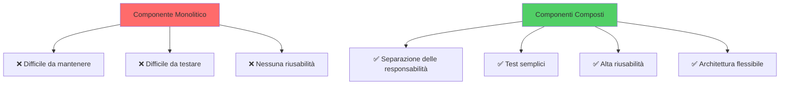

```tsx
function Card({ titolo, children }: { titolo: string; children: ReactNode }) {
  return (
    <div className="card">
      <h2>{titolo}</h2>
      <div className="card-body">{children}</div>
    </div>
  );
}

<Card titolo="Profilo">
  <Avatar />
  <Dettagli />
</Card>
```

### Pattern Children

`children` è la prop speciale che riceve tutto il contenuto JSX annidato. Usalo per slot generici.

### Slot Multipli

Quando servono più punti di inserimento, passa elementi React come prop:

```tsx
<Layout header={<Header />} sidebar={<Sidebar />} main={<Main />} />
```

### Gerarchia di composizione

L'albero dei componenti mostra come l'applicazione si scompone in sottosistemi:

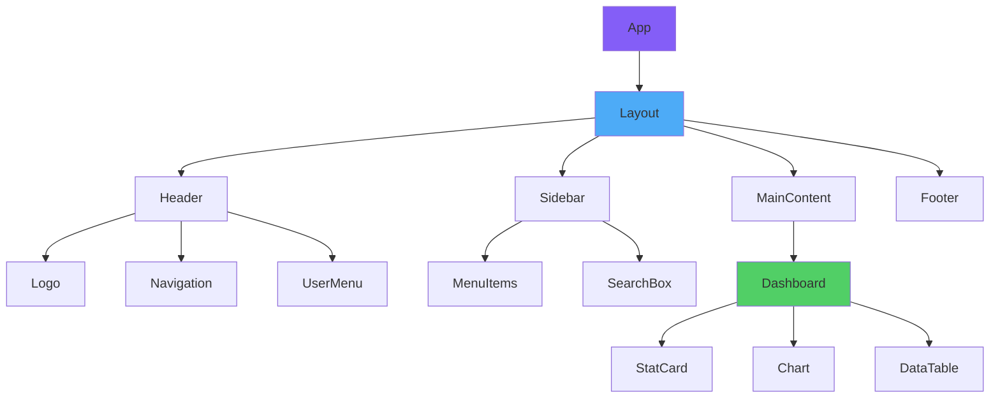

---

## 2. Prop Drilling: Problem and Solutions

### Il Problema

Passare una prop attraverso molti livelli di componenti che non la usano direttamente porta a codice fragile e accoppiato.

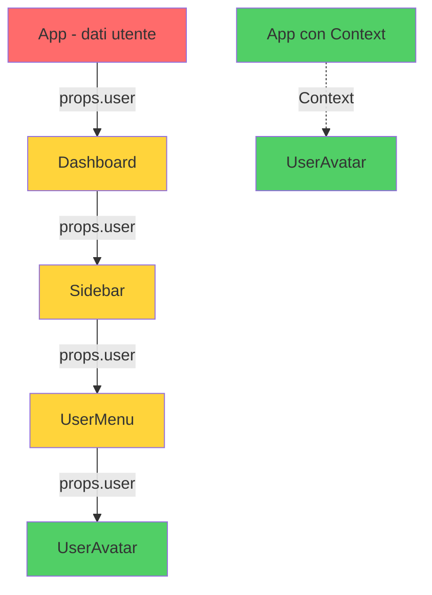

### Soluzioni

1. **Composizione**: porta i dati più vicino al consumer tramite children o slot.
2. **Context API** per dati globali (tema, autenticazione, lingua).
3. **State management** dedicato (Zustand, Redux, Jotai) per applicazioni grandi.

### Quando Usare Cosa

| Profondità | Frequenza | Soluzione |
|-----------|-----------|-----------|
| 1–2 livelli | Qualsiasi | Props normali |
| 3+ livelli | Bassa | Composizione/children |
| 3+ livelli | Alta | Context |
| App-wide | Alta | Store dedicato |

---

## 3. State Elevation Strategies

### Stato Locale vs Sollevato

- **Locale**: lo stato vive nel componente che lo usa.
- **Sollevato**: lo stato si trova nell'antenato comune di tutti i componenti che ne hanno bisogno.

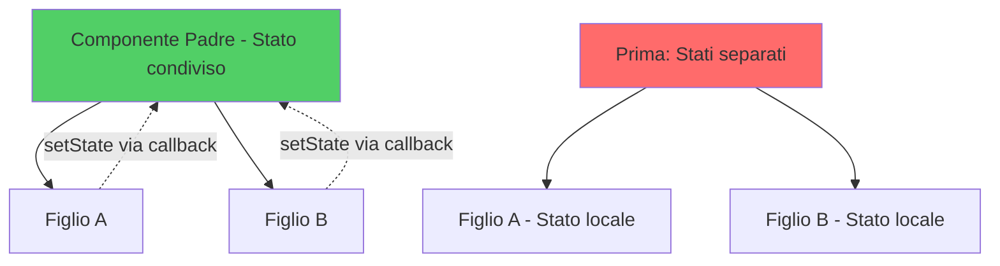

### Regola Pratica

Mantieni lo stato il più vicino possibile a dove viene usato. Sollevalo solo quando due o più rami dell'albero hanno bisogno della stessa fonte di verità.

```tsx
function Genitore() {
  const [filtro, setFiltro] = useState('');
  return (
    <>
      <BarraRicerca valore={filtro} onChange={setFiltro} />
      <ListaFiltrata filtro={filtro} />
    </>
  );
}
```

### Inversione del Controllo

Se uno stato deve essere controllabile dall'esterno, esponilo come prop opzionale: si parla di **componenti controllati/non controllati**.

### Albero decisionale per il sollevamento dello stato

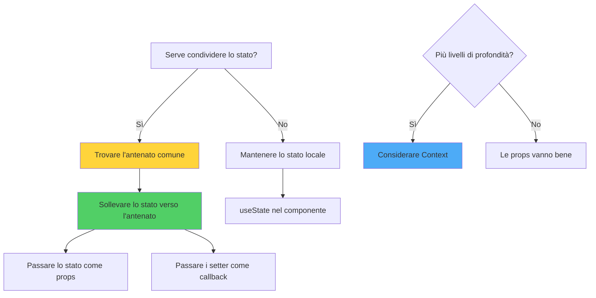

---

## 4. Component Architecture and Organization

### Organizzazione delle Cartelle

Un'architettura solida si basa sulla separazione delle responsabilità e su una struttura di cartelle prevedibile:

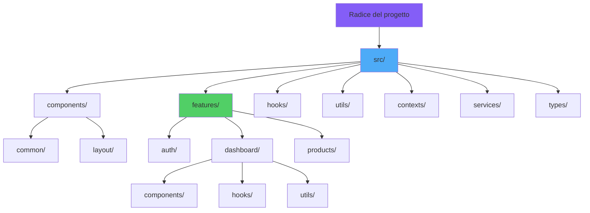

```
src/
  components/    # componenti riutilizzabili
  features/      # raggruppamenti per dominio
  hooks/         # custom hooks
  lib/           # utility, client API
  pages/         # punti d'ingresso per il routing
```

### Naming

- File e cartelle in `kebab-case` o `PascalCase` per i componenti.
- Un componente per file di solito; co-locazione di stili e test.

### Pubblico vs Privato

Esporta solo ciò che fa parte dell'API pubblica della feature. Usa un `index.ts` di barrel per isolare i dettagli interni.

---

## 5. Presentational vs Container Components

### Pattern Storico

- **Presentational**: solo UI, riceve dati e callback via props.
- **Container**: gestisce stato, fetch, side effect; passa dati al presentational.

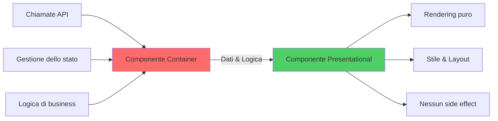

### Stato Attuale

Con gli hooks la separazione netta è meno rigida: spesso si scrivono componenti misti, mentre la logica viene estratta in custom hooks.

### Quando Mantenere la Separazione

- Quando lo stesso componente presentational è usato in più contesti con dati diversi.
- Quando vuoi testare l'UI in isolamento dallo stato.

---

## 6. Higher-Order Components (HOCs)

### Definizione

Una funzione che prende un componente e ne restituisce uno nuovo arricchito di funzionalità:

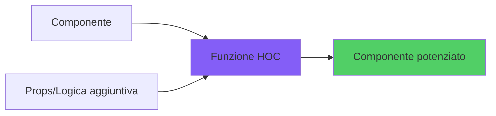

```tsx
function withLogger<P>(Componente: React.ComponentType<P>) {
  return function Wrapped(props: P) {
    useEffect(() => { console.log('rendered'); });
    return <Componente {...props} />;
  };
}
```

### Quando Usarli Ancora

Gli HOC sono utili per integrazioni con librerie legacy (`withRouter`, `connect`). Per nuovo codice, **custom hooks** o **render props** sono di solito più chiari.

---

## 7. Render Props Pattern

### Concetto

Un componente accetta una funzione come prop (o come `children`) che descrive *cosa* renderizzare, ricevendo dei dati dal componente stesso.

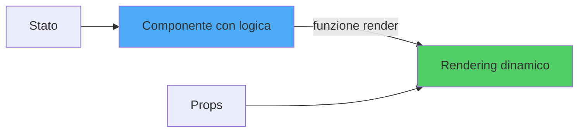

```tsx
function PosizioneMouse({ children }: { children: (pos: { x: number; y: number }) => ReactNode }) {
  const [pos, setPos] = useState({ x: 0, y: 0 });
  useEffect(() => {
    const h = (e: MouseEvent) => setPos({ x: e.clientX, y: e.clientY });
    window.addEventListener('mousemove', h);
    return () => window.removeEventListener('mousemove', h);
  }, []);
  return <>{children(pos)}</>;
}

<PosizioneMouse>
  {({ x, y }) => <div>Mouse: {x}, {y}</div>}
</PosizioneMouse>
```

### Quando Usarlo

Quando vuoi che il consumer decida come visualizzare i dati esposti dal componente. I custom hooks spesso lo sostituiscono con un'API più pulita.

---

## 8. Compound Components Pattern

### Concetto

Più componenti collegati che lavorano insieme, condividendo stato implicito tramite context.

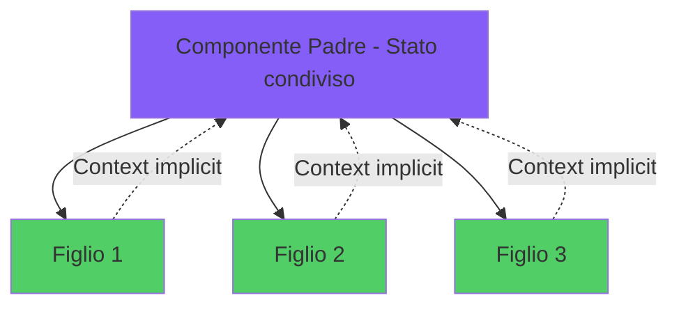

```tsx
const TabsContext = createContext<{ attivo: string; setAttivo: (id: string) => void } | null>(null);

function Tabs({ predefinito, children }) {
  const [attivo, setAttivo] = useState(predefinito);
  return (
    <TabsContext.Provider value={{ attivo, setAttivo }}>
      <div className="tabs">{children}</div>
    </TabsContext.Provider>
  );
}

function Tab({ id, children }) {
  const ctx = useContext(TabsContext)!;
  return (
    <button
      data-attivo={ctx.attivo === id}
      onClick={() => ctx.setAttivo(id)}
    >
      {children}
    </button>
  );
}

Tabs.Tab = Tab;
```

### Vantaggi

API espressiva e leggibile:

```tsx
<Tabs predefinito="profilo">
  <Tabs.Tab id="profilo">Profilo</Tabs.Tab>
  <Tabs.Tab id="impostazioni">Impostazioni</Tabs.Tab>
</Tabs>
```

---

## 9. Advanced Composition Techniques

### Tecniche Avanzate

- **Slot Pattern**: nominare gli slot tramite prop tipizzate.
- **Polymorphic Components**: prop `as` per renderizzare elementi diversi (es. Box che diventa `<a>` o `<button>`).
- **Controlled/Uncontrolled** con valori opzionali e default sensati.
- **Forwardable refs** per inoltrare ref a un elemento interno.

### Polimorfismo

```tsx
type AsProp<E extends ElementType> = { as?: E };

function Box<E extends ElementType = 'div'>({ as, ...resto }: AsProp<E> & ComponentPropsWithoutRef<E>) {
  const Tag = as ?? 'div';
  return <Tag {...resto} />;
}
```

---

## 10. Pattern Selection Decision Matrix

### Quale Pattern Quando?

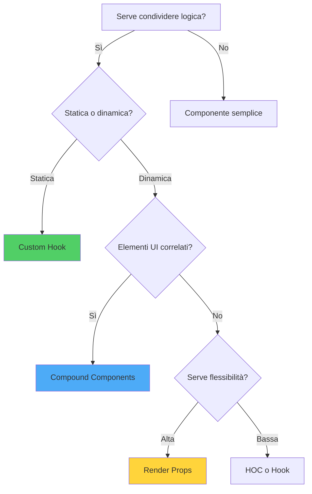

| Esigenza | Pattern consigliato |
|----------|---------------------|
| Logica con stato riutilizzabile | Custom hook |
| Stato condiviso annidato | Compound components |
| Estendere comportamento di un componente | HOC (raramente) o hook |
| UI parametrica con dati esposti | Render prop / custom hook |
| Slot multipli con default | Children + slot props |
| Stile e markup riusabili | Componente con props variazionali |

---

## Conclusion: Architecting Excellence

### Traiettoria di maturazione

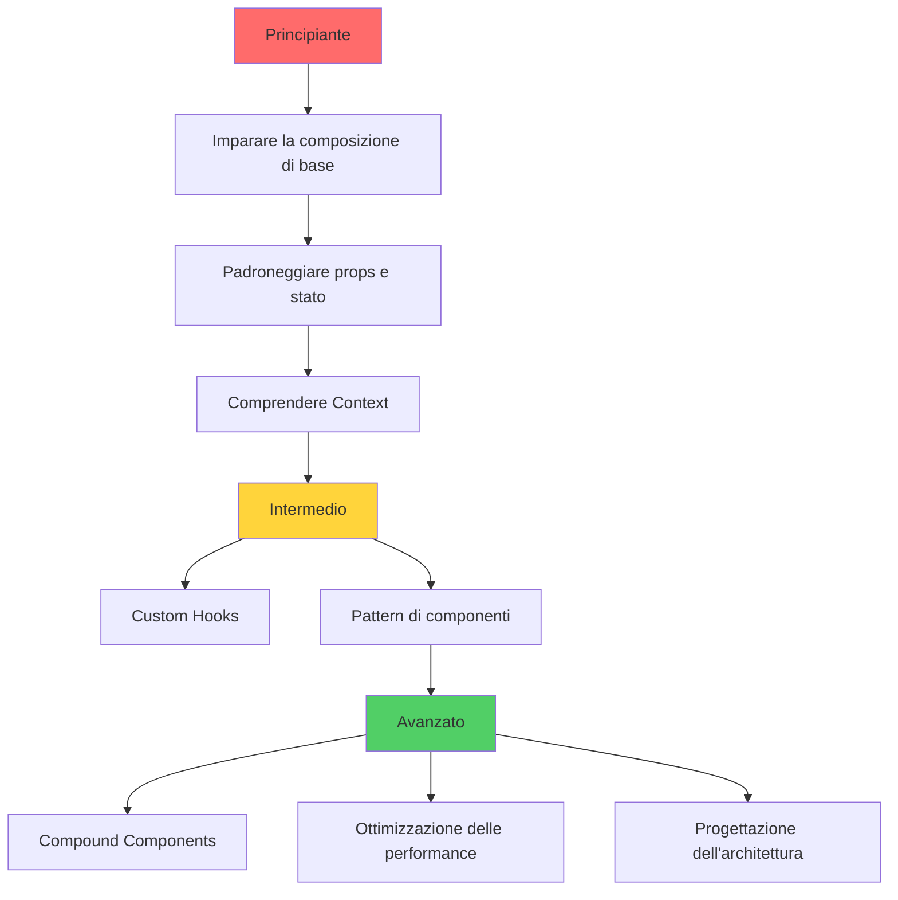

### Conclusione

Non esiste un pattern "migliore" in assoluto. Scegli in base a chiarezza, esigenze di riuso e familiarità del team. Le tre regole guida:

1. **Prima la composizione**, poi astrazioni più sofisticate.
2. **Estrai la logica nei custom hooks**, l'UI nei componenti.
3. **Misura prima di ottimizzare**, semplifica prima di astrarre.
