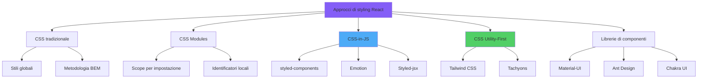
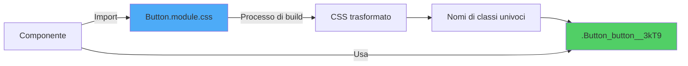
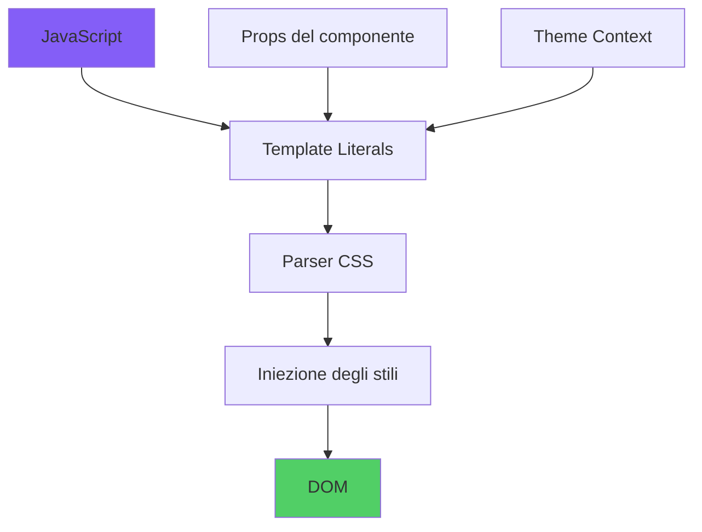
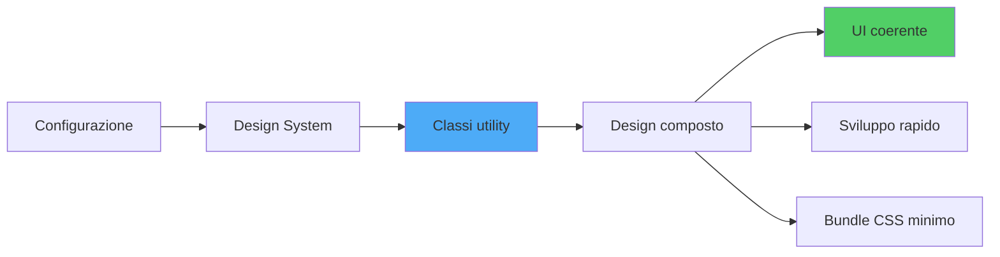
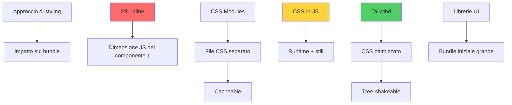
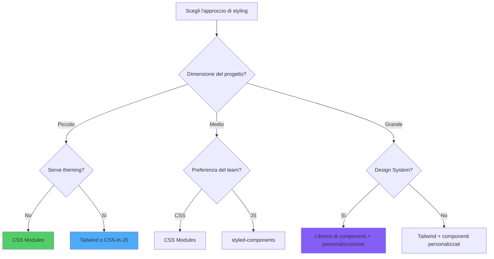

# Stilizzazione in React

> Strategie e strumenti per applicare stili in applicazioni React

---

## 1. Styling Paradigms in React

### Approcci Principali

React non impone un metodo di styling. Le opzioni sono:

1. **Stili inline** (`style={{ ... }}`)
2. **Fogli CSS classici** importati nei componenti
3. **CSS Modules** (CSS con scope locale automatico)
4. **CSS-in-JS** (styled-components, Emotion)
5. **Utility-first** (Tailwind CSS)
6. **Sistemi di design** integrati (Material UI, Chakra, Radix)

L'architettura flessibile di React supporta più metodologie di styling, ognuna con compromessi distinti in termini di manutenibilità, performance e dimensione del bundle:



### Criteri di Scelta

- **Scala**: progetto piccolo → CSS o moduli; progetto grande → utility o CSS-in-JS.
- **Tema runtime**: CSS variables, Emotion, styled-components.
- **Performance build**: Tailwind è ottimo perché purga ciò che non usi.

---

## 2. Inline Styles: Mechanisms and Constraints

### Sintassi

```tsx
<div style={{ backgroundColor: 'tomato', padding: 16 }}>Ciao</div>
```

### Limiti

- Niente pseudo-classi (`:hover`, `:focus`).
- Niente media query.
- Tutto in camelCase.
- Adatto solo a stili dinamici minimi.

---

## 3. CSS Modules: Scoped Styling Architecture

### Concetto

I CSS Modules generano classi univoche per evitare collisioni globali.



```css
/* Pulsante.module.css */
.primario { background: var(--colore-primario); }
.grande { padding: 12px 24px; }
```

```tsx
import stili from './Pulsante.module.css';

<button className={`${stili.primario} ${stili.grande}`}>Invia</button>
```

### Vantaggi

- CSS reale, niente runtime.
- Scope automatico, nessun conflitto.
- Compatibile con strumenti standard (PostCSS, Sass).

---

## 4. CSS-in-JS: styled-components and Emotion

Le librerie **CSS-in-JS** permettono di scrivere CSS direttamente in JavaScript, abilitando stili dinamici, vendor prefix automatico e accesso completo a props e stato del componente:



### Esempio styled-components

```tsx
import styled from 'styled-components';

const Pulsante = styled.button<{ variante?: 'primario' | 'secondario' }>`
  background: ${(p) => (p.variante === 'primario' ? '#2563eb' : '#e5e7eb')};
  color: ${(p) => (p.variante === 'primario' ? '#fff' : '#111')};
  padding: 8px 16px;
`;

<Pulsante variante="primario">Salva</Pulsante>
```

### Pro e Contro

| Pro | Contro |
|-----|--------|
| Stili co-localizzati | Runtime JS (peso, costi) |
| Props dinamiche | Curva di apprendimento iniziale |
| Theming nativo | Debug più complesso |

---

## 5. Tailwind CSS: Utility-First Methodology

### Approccio

Tailwind fornisce centinaia di classi atomiche pronte (`flex`, `p-4`, `text-sm`, `bg-blue-500`) da comporre direttamente nel markup.



```tsx
<button className="px-4 py-2 bg-blue-600 hover:bg-blue-700 text-white rounded">
  Conferma
</button>
```

### Quando Usarlo

- App e siti dove velocità e coerenza visiva sono prioritarie.
- Team che apprezzano il design system implicito.
- Build process automatizzato (purging delle classi inutilizzate).

---

## 6. CSS Frameworks Integration

### Soluzioni Pronte

- **Material UI**: aderenza al Material Design, ampio catalogo di componenti.
- **Chakra UI**: focus su accessibilità e theming.
- **Radix UI**: primitive headless, accessibili, senza stili.
- **shadcn/ui**: componenti basati su Radix + Tailwind, copiati nel tuo repo.

### Quando Sceglierli

Per progetti aziendali, dashboard, prototipi rapidi dove non vuoi reinventare l'UI.

---

## 7. Performance Considerations

### Strategie

- **CSS statico** sempre vince in runtime: Tailwind, CSS Modules.
- **CSS-in-JS** con extraction (es. Linaria, Vanilla Extract) per evitare runtime.
- **Lazy loading** dei CSS specifici di route.
- **Critical CSS** inline per il primo paint.

Ogni approccio ha un impatto diverso sulla dimensione del bundle:



---

## 8. Advanced Styling Patterns

### Pattern Utili

- **Component slots** + `className` opzionale dall'esterno.
- **CSS variables** per theming dinamico senza CSS-in-JS.
- **Data attributes** (`data-state="open"`) come hook di stile.
- **Helper come `clsx`/`classnames`** per condizionali.

---

## 9. Theming and Design Systems

### Theming con CSS Variables

```css
:root {
  --colore-bg: #ffffff;
  --colore-fg: #111111;
}
[data-tema="scuro"] {
  --colore-bg: #0f172a;
  --colore-fg: #f8fafc;
}
```

### Design Tokens

Definisci una sola fonte di verità per colori, spaziature, tipografia. Genera CSS variables o costanti TS condivise da tutti i componenti.

---

## 10. Styling Strategy Selection Matrix

### Quale Strategia?



| Esigenza | Consigliato |
|----------|-------------|
| Prototipo veloce | Tailwind |
| Libreria UI condivisa | CSS Modules o CSS-in-JS |
| Theming runtime ricco | CSS-in-JS o CSS variables |
| Performance massima | Tailwind / Vanilla Extract |
| Accessibilità out-of-the-box | Radix / Chakra |

---

## Conclusion: Architecting Stylistic Excellence

### Conclusione

Non esiste una soluzione unica. Tre principi:

1. **Coerenza** tra i componenti, ovunque tu metta gli stili.
2. **Co-locazione** dello stile con il componente quando ha senso.
3. **Misura il costo** in bundle e runtime delle soluzioni CSS-in-JS prima di scalarle.
